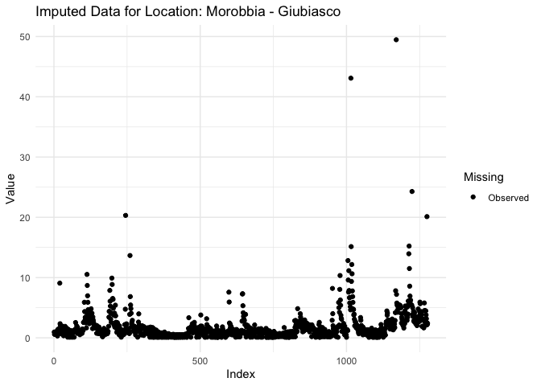
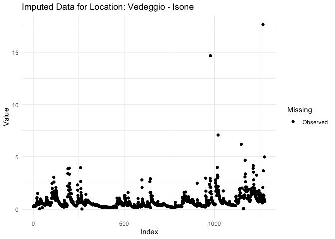
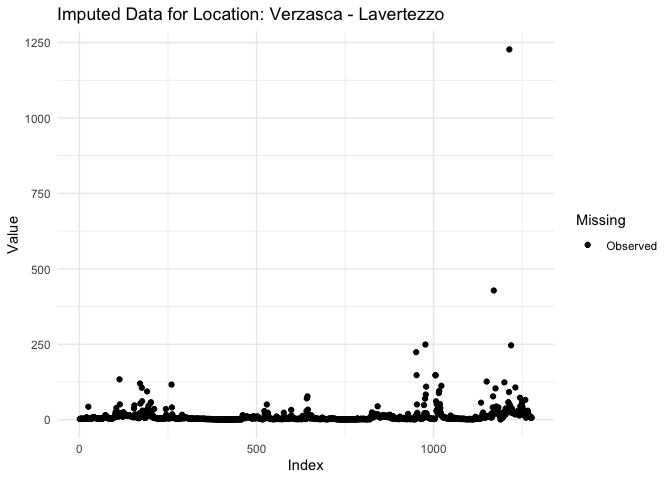

Untitled
================

## GitHub Documents

This is an R Markdown format used for publishing markdown documents to
GitHub. When you click the **Knit** button all R code chunks are run and
a markdown file (.md) suitable for publishing to GitHub is generated.

## Including Code

You can include R code in the document as follows:

``` r
# Load required libraries
library(httr)
library(jsonlite)
library(ggplot2)
library(dplyr)
```

    ## 
    ## Attaching package: 'dplyr'

    ## The following objects are masked from 'package:stats':
    ## 
    ##     filter, lag

    ## The following objects are masked from 'package:base':
    ## 
    ##     intersect, setdiff, setequal, union

``` r
library(tidyr)
library(SparseTSCGM)

# Function to fetch locations data
fetch_locations_data <- function(domain) {
  base_url <- "http://www.oasi.ti.ch/web/rest/locations"
  params <- list(domain = domain)
  
  response <- GET(base_url, query = params)
  
  if (response$status_code == 200) {
    return(fromJSON(content(response, as = "text", encoding = "UTF-8"), flatten = TRUE))
  } else {
    warning("Failed to get locations data. Status code:", response$status_code)
    return(NULL)
  }
}

# Function to fetch available parameters for a location
fetch_parameters_data <- function(domain, location_code) {
  base_url <- "http://www.oasi.ti.ch/web/rest/parameters"
  params <- list(domain = domain, location = location_code)
  
  response <- GET(base_url, query = params)
  
  if (response$status_code == 200) {
    return(fromJSON(content(response, as = "text", encoding = "UTF-8"), flatten = TRUE))
  } else {
    warning("Failed to get parameters data. Status code:", response$status_code)
    return(NULL)
  }
}

# Function to fetch time series data
fetch_time_series_data <- function(domain, location_code, parameter, resolution, from_date, to_date) {
  base_url <- "http://www.oasi.ti.ch/web/rest/measure/csv"
  params <- list(
    domain = domain,
    location = location_code,
    parameter = parameter,
    resolution = resolution,
    from = from_date,
    to = to_date
  )
  
  response <- GET(base_url, query = params)
  
  if (response$status_code == 200) {
    return(content(response, as = "text", encoding = "UTF-8"))
  } else {
    warning("Failed to get data. Status code:", response$status_code)
    return(NULL)
  }
}

# Function to process and append data
process_and_append_data <- function(response_data, parameter, location_name, data_frame) {
  data_lines <- strsplit(response_data, "\n")[[1]]
  data_lines <- data_lines[!grepl("^#", data_lines)]
  
  if (length(data_lines) > 0) {
    data_clean <- paste(data_lines, collapse = "\n")
    data_df <- read.csv(text = data_clean, sep = ";", header = TRUE)
    
    if ("data" %in% names(data_df) && parameter %in% names(data_df)) {
      data_df$data <- as.Date(data_df$data, format="%d.%m.%Y %H:%M")
      data_df[[parameter]] <- as.numeric(data_df[[parameter]])
      data_df$Location <- location_name
      data_frame <- rbind(data_frame, data_df)
    }
  }
  return(data_frame)
}

# Function to process locations data
process_locations <- function(domain) {
  locations_data <- fetch_locations_data(domain = domain)
  
  # Initialize lists to hold locations data
  q_locations <- list()
  other_locations <- list()
  
  # Process each location to check for Q parameter availability
  if (!is.null(locations_data)) {
    for (i in seq_len(nrow(locations_data))) {
      location_code <- locations_data$code[i]
      location_name <- locations_data$name[i]
      
      # Fetch parameters data
      parameters_data <- fetch_parameters_data(domain = domain, location_code = location_code)
      
      if (!is.null(parameters_data)) {
        # Check if Q parameter is available
        if (any(parameters_data$code == "Q")) {
          q_locations <- append(q_locations, list(locations_data[i, ]))
        } else {
          other_locations <- append(other_locations, list(locations_data[i, ]))
        }
      }
    }
    
    # Convert lists to data frames
    q_locations_df <- bind_rows(q_locations)
    other_locations_df <- bind_rows(other_locations)
    
    # Display the separated data
    message("Locations with Q Parameter:")
    print(q_locations_df)
    
    message("Other Locations:")
    print(other_locations_df)
    
    return(q_locations_df)
  } else {
    message("Failed to fetch location data.")
    return(NULL)
  }
}

# Function to impute missing data
impute_missing_data <- function(data_frame, method = "lm") {
  imputed_data <- data_frame  # Initialize imputed data
  
  for (i in seq_len(ncol(data_frame))) {
    mss <- is.na(data_frame[,i])
    if (sum(mss) > 0) {
      message("Imputing missing data for column: ", colnames(data_frame)[i])
      
      if (method == "lm") {
        # Fit linear model
        available_vars <- apply(data_frame[!mss,], 2, function(x) sum(is.na(x)) == 0)
        fml <- as.formula(paste0("`", colnames(data_frame)[i], "` ~ `", paste0(names(available_vars), collapse = "` + `"), "`"))
        model <- lm(fml, data = data_frame[!mss,])
        
        # Predict missing values
        imputed_data[mss, i] <- predict(model, newdata = data_frame[mss,])
        
      } else {
        stop("Currently, only 'lm' method is supported.")
      }
    }
  }
  
  return(imputed_data)
}

# Function to mask data for validation
mask_data_for_validation <- function(data_frame, prop_missing = 0.1) {
  set.seed(42)  # For reproducibility
  masked_data <- data_frame
  known_indices <- which(!is.na(masked_data), arr.ind = TRUE)
  n_to_mask <- round(prop_missing * nrow(known_indices))
  
  # Randomly select indices to mask
  mask_indices <- known_indices[sample(nrow(known_indices), n_to_mask), ]
  masked_data[mask_indices] <- NA
  
  return(list(masked_data = masked_data, original_indices = mask_indices))
}

# Fetch all locations for the surfacewater domain
q_locations_df <- process_locations("surfacewater")
```

    ## Locations with Q Parameter:

    ##               code                             name   simpleOwner         owner
    ## 1        water_35w         Bolletta - Porto Ceresio          <NA>     DT-DC-UCA
    ## 2     water_LH2349                Breggia - Chiasso          UFAM          UFAM
    ## 3     water_LH2086                 Brenno - Loderio          UFAM          UFAM
    ## 4     water_LH2474              Calancasca - Buseno          UFAM          UFAM
    ## 5         water_30               Calcaccia - Airolo          <NA>     DT-DC-UCA
    ## 6         water_29       Canale Bonifica - Quartino          <NA>     DT-DC-UCA
    ## 7     water_LH2321           Cassarate - Pregassona          UFAM          UFAM
    ## 8        water_33w                Cuccio - Porlezza          <NA>     DT-DC-UCA
    ## 9   water_auto_583               Faloppia - Chiasso          <NA>     DT-DC-UCA
    ## 10  water_auto_905                    Garegna Föisc          <NA>     DT-DC-UCA
    ## 11 water_auto_1165                Garegna Presa AET          <NA>     DT-DC-UCA
    ## 12       water_38w             Laveggio - Mendrisio          <NA>     DT-DC-UCA
    ## 13       water_10w        Laveggio - Riva S. Vitale          <NA>     DT-DC-UCA
    ## 14  water_auto_904               Lisora - Monteggio          <NA>     DT-DC-UCA
    ## 15    water_LH2475                Maggia - Bignasco          UFAM          UFAM
    ## 16   water_auto_1w                  Maggia - Lodano          <NA>     DT-DC-UCA
    ## 17    water_LH2368                 Maggia - Solduno          UFAM          UFAM
    ## 18    water_LH2461            Magliasina - Magliaso          UFAM          UFAM
    ## 19 water_auto_343w                  Mara - Maroggia          <NA>     DT-DC-UCA
    ## 20    water_LH2420                   Moesa - Lumino          UFAM          UFAM
    ## 21  water_auto_42w             Morobbia - Giubiasco          <NA>     DT-DC-UCA
    ## 22 water_auto_763w                 Piumogna - Dalpe          <NA>     DT-DC-UCA
    ## 23    water_LH2612     Riale Pincascia - Lavertezzo          UFAM          UFAM
    ## 24       water_28w         Riale di Gnosca - Gnosca          <NA>     DT-DC-UCA
    ## 25  water_auto_104          Rovana - Briglia Secada          <NA>     DT-DC-UCA
    ## 26  water_auto_102 Rovana - Galleria di derivazione          <NA>     DT-DC-UCA
    ## 27        water_36                   Salto - Maggia          <NA>     DT-DC-UCA
    ## 28       water_14w              Scairolo - Barbengo          <NA>     DT-DC-UCA
    ## 29    water_LH2020              Ticino - Bellinzona          UFAM          UFAM
    ## 30    water_LH2364                  Ticino - Piotta          UFAM          UFAM
    ## 31    water_LH2494                Ticino - Pollegio          UFAM          UFAM
    ## 32       water_37w          Ticino - Ronco Bedretto          <NA>     DT-DC-UCA
    ## 33 water_auto_182w                 Toce - Candoglia ARPA Piemonte ARPA Piemonte
    ## 34    water_LH2167              Tresa - Ponte Tresa          UFAM          UFAM
    ## 35       water_39w          Vecchio Vedeggio - Agno          <NA>     DT-DC-UCA
    ## 36    water_LH2629                  Vedeggio - Agno          UFAM          UFAM
    ## 37       water_31w                 Vedeggio - Isone          <NA>     DT-DC-UCA
    ## 38    water_LH2605            Verzasca - Lavertezzo          UFAM          UFAM
    ##    coordinates.x coordinates.y coordinates.z
    ## 1       712670.0       84270.0         280.0
    ## 2       722315.0       78320.0         255.0
    ## 3       717770.0      137270.0         348.0
    ## 4       729440.0      127180.0         746.0
    ## 5       692060.0      152560.0        1100.0
    ## 6       713591.0      113149.0         201.0
    ## 7       718010.0       97380.0         291.0
    ## 8       731730.0      100420.0         300.0
    ## 9       722658.0       76863.0         236.0
    ## 10      692371.0      155629.0        1480.0
    ## 11      691136.0      153777.0        1145.0
    ## 12      719460.0       82040.0         300.0
    ## 13      719140.0       83880.0         280.0
    ## 14      707440.0       94518.0         280.0
    ## 15      690040.0      132550.0         432.0
    ## 16      696420.0      124125.0         339.0
    ## 17      703100.0      113860.0         202.0
    ## 18      711620.0       93290.0         295.0
    ## 19      719024.0       88196.0         279.0
    ## 20      724765.0      120360.0         249.0
    ## 21      720591.0      114304.0         229.0
    ## 22      702383.0      145932.0        1395.0
    ## 23      708060.0      123950.0         536.0
    ## 24      721940.0      121460.0         286.0
    ## 25      682310.0      126549.0        1043.0
    ## 26      680913.0      125677.0        1250.0
    ## 27      697820.0      123020.0         460.0
    ## 28      714000.0       90030.0         276.0
    ## 29      722112.5      117863.5         223.5
    ## 30      694610.0      152450.0        1007.0
    ## 31      716120.0      135330.0         298.0
    ## 32      681310.0      150130.0        1472.0
    ## 33      676277.0       92201.0         201.0
    ## 34      709580.0       92145.0         268.0
    ## 35      713390.0       95110.0         274.0
    ## 36      714110.0       95690.0         281.0
    ## 37      720250.0      110150.0         740.0
    ## 38      708420.0      122920.0         490.0

    ## Other Locations:

    ##              code                                name    simpleOwner
    ## 1  meteo_auto_812                  Anza a Piedimulera  MeteoSvizzera
    ## 2  meteo_auto_813                        Bacino Gries  MeteoSvizzera
    ## 3  meteo_auto_814           Bacino Passo del Gottardo  MeteoSvizzera
    ## 4  meteo_auto_790                   Bavona a Cavergno  MeteoSvizzera
    ## 5         auto_25                 Breggia a Cernobbio  MeteoSvizzera
    ## 6  meteo_auto_764                    Brenno a Loderio  MeteoSvizzera
    ## 7  meteo_auto_784                 Calancasca a Buseno  MeteoSvizzera
    ## 8  meteo_auto_804                  Cassarate a Lugano  MeteoSvizzera
    ## 9  meteo_auto_810                     Devero a Baceno  MeteoSvizzera
    ## 10 meteo_auto_811            Diveria a Crevoladossola  MeteoSvizzera
    ## 11 meteo_auto_809   Gravellona Toce CPC R_Lago d'Orta  MeteoSvizzera
    ## 12 meteo_auto_792                      Isorno a Russo  MeteoSvizzera
    ## 13 meteo_auto_798 L. Maggiore Baveno-S.Calende-Laveno  MeteoSvizzera
    ## 14 meteo_auto_795                       Lago Maggiore  MeteoSvizzera
    ## 15   water_LH2074            Lago Maggiore - Brissago           UFAM
    ## 16   water_LH2022             Lago Maggiore - Locarno           UFAM
    ## 17 meteo_auto_802                      Lago di Lugano  MeteoSvizzera
    ## 18   water_LH2101             Lago di Lugano - Melide           UFAM
    ## 19 water_auto_743            Lago di Lugano - Morcote           <NA>
    ## 20   water_LH2021        Lago di Lugano - Ponte Tresa           UFAM
    ## 21 meteo_auto_800  Lago di Lugano da Gandria a Osteno  MeteoSvizzera
    ## 22   water_auto_2           Lago di Muzzano - Muzzano           <NA>
    ## 23 meteo_auto_799 Laveggio RSVitale Bolletta PCeresio  MeteoSvizzera
    ## 24 meteo_auto_787                   Maggia a Bignasco  MeteoSvizzera
    ## 25 meteo_auto_789           Maggia foce Lago Maggiore  MeteoSvizzera
    ## 26 meteo_auto_805               Magliasina a Magliaso  MeteoSvizzera
    ## 27 meteo_auto_806                     Mara a Maroggia  MeteoSvizzera
    ## 28 meteo_auto_791                    Melezza a Camedo  MeteoSvizzera
    ## 29 meteo_auto_793              Melezza a Ponte Brolla  MeteoSvizzera
    ## 30 meteo_auto_786                    Moesa a Castione  MeteoSvizzera
    ## 31 meteo_auto_785                       Moesa a Sorte  MeteoSvizzera
    ## 32 meteo_auto_815                       Reno di Medel  MeteoSvizzera
    ## 33   water_LH2356          Riale di Calneggia - Cevio           UFAM
    ## 34 meteo_auto_788                   Rovana a Linescio  MeteoSvizzera
    ## 35 meteo_auto_801                 Scairolo a Barbengo  MeteoSvizzera
    ## 36 meteo_auto_796  Sponda L. Maggiore Ascona-Pallanza  MeteoSvizzera
    ## 37 meteo_auto_797  Sponda L. Maggiore Magadino-Laveno  MeteoSvizzera
    ## 38  water_auto_23                  Ticino - Golasecca ARPA Lombardia
    ## 39 water_auto_824                   Ticino - Riazzino           UFAM
    ## 40 meteo_auto_762                 Ticino a Bellinzona  MeteoSvizzera
    ## 41 meteo_auto_741                     Ticino a Piotta  MeteoSvizzera
    ## 42 meteo_auto_742                   Ticino a Pollegio  MeteoSvizzera
    ## 43 meteo_auto_763           Ticino foce Lago Maggiore  MeteoSvizzera
    ## 44 meteo_auto_807                       Toce a Baceno  MeteoSvizzera
    ## 45 meteo_auto_808                   Toce a Premosello  MeteoSvizzera
    ## 46 meteo_auto_803                    Vedeggio ad Agno  MeteoSvizzera
    ## 47 meteo_auto_794         Verzasca foce Lago Maggiore  MeteoSvizzera
    ##             owner coordinates.x coordinates.y coordinates.z
    ## 1   MeteoSvizzera        663420         96880           248
    ## 2   MeteoSvizzera        671584        146000          2386
    ## 3   MeteoSvizzera        685190        157503          2130
    ## 4   MeteoSvizzera        688423        134219           980
    ## 5   MeteoSvizzera        722315         78331           200
    ## 6   MeteoSvizzera        718000        137680           354
    ## 7   MeteoSvizzera        728885        125381           680
    ## 8   MeteoSvizzera        717968         95690           270
    ## 9   MeteoSvizzera        668756        122582           630
    ## 10  MeteoSvizzera        667170        110862           375
    ## 11  MeteoSvizzera        671700         84942             0
    ## 12  MeteoSvizzera        693120        116719           780
    ## 13  MeteoSvizzera        694740         62736           210
    ## 14  MeteoSvizzera        687614         82858           193
    ## 15           UFAM        698350        108200           193
    ## 16           UFAM        705480        113380           193
    ## 17  MeteoSvizzera        717700         90265           271
    ## 18           UFAM        717070         91650           271
    ## 19      DT-DC-UCA        714115         86952           272
    ## 20           UFAM        710200         91800           271
    ## 21  MeteoSvizzera        730273         99408           271
    ## 22      DT-DC-UCA        714978         94906           338
    ## 23  MeteoSvizzera        717136         88280           271
    ## 24  MeteoSvizzera        690021        132558           443
    ## 25  MeteoSvizzera        703882        113252           193
    ## 26  MeteoSvizzera        712618         92386           271
    ## 27  MeteoSvizzera        718665         88038           271
    ## 28  MeteoSvizzera        692027        112755           482
    ## 29  MeteoSvizzera        701595        115083           250
    ## 30  MeteoSvizzera        724201        120080           320
    ## 31  MeteoSvizzera        734065        127810           400
    ## 32  MeteoSvizzera        700895        157874          2250
    ## 33           UFAM        684970        135960           890
    ## 34  MeteoSvizzera        688443        129110           664
    ## 35  MeteoSvizzera        713615         89932           271
    ## 36  MeteoSvizzera        687834         87377           195
    ## 37  MeteoSvizzera        700100         94413           210
    ## 38 ARPA Lombardia        694315         61120             0
    ## 39           UFAM        713670        113500           200
    ## 40  MeteoSvizzera        721115        116520           230
    ## 41  MeteoSvizzera        694642        152460             0
    ## 42  MeteoSvizzera        715654        135462             0
    ## 43  MeteoSvizzera        709500        112580           193
    ## 44  MeteoSvizzera        668735        122670           700
    ## 45  MeteoSvizzera        663191        107962             0
    ## 46  MeteoSvizzera        713833         94878           271
    ## 47  MeteoSvizzera        709690        114438           195

``` r
# Initialize data frames to hold time series data
q_data <- data.frame()

# Fetch time series data for locations with Q parameter
if (!is.null(q_locations_df)) {
  for (i in seq_len(nrow(q_locations_df))) {
    location_code <- q_locations_df$code[i]
    location_name <- q_locations_df$name[i]
    
    # Fetch Q parameter data
    q_data_response <- fetch_time_series_data(
      domain = "surfacewater", 
      location_code = location_code, 
      parameter = "Q", 
      resolution = "d", 
      from_date = "2021-01-19", 
      to_date = "2024-07-18"
    )
    
    if (!is.null(q_data_response)) {
      q_data <- process_and_append_data(q_data_response, "Q", location_name, q_data)
    }
  }
}

# Display the combined Q data
message("Combined Q Data:")
```

    ## Combined Q Data:

``` r
print(q_data)
```

    ##             data      Q provvisorio  X                   Location
    ## 1     2021-01-19   0.49             NA   Bolletta - Porto Ceresio
    ## 2     2021-01-20   0.49             NA   Bolletta - Porto Ceresio
    ## 3     2021-01-21   0.68             NA   Bolletta - Porto Ceresio
    ## 4     2021-01-22   1.40             NA   Bolletta - Porto Ceresio
    ## 5     2021-01-23   2.24             NA   Bolletta - Porto Ceresio
    ## 6     2021-01-24   1.29             NA   Bolletta - Porto Ceresio
    ## 7     2021-01-25   0.96             NA   Bolletta - Porto Ceresio
    ## 8     2021-01-26   0.81             NA   Bolletta - Porto Ceresio
    ## 9     2021-01-27   0.71             NA   Bolletta - Porto Ceresio
    ## 10    2021-01-28   0.68             NA   Bolletta - Porto Ceresio
    ## 11    2021-01-29   0.64             NA   Bolletta - Porto Ceresio
    ## 12    2021-01-30   0.63             NA   Bolletta - Porto Ceresio
    ## 13    2021-01-31   0.64             NA   Bolletta - Porto Ceresio
    ## 14    2021-02-01   0.60             NA   Bolletta - Porto Ceresio
    ## 15    2021-02-02   0.58             NA   Bolletta - Porto Ceresio
    ## 16    2021-02-03   0.58             NA   Bolletta - Porto Ceresio
    ## 17    2021-02-04   0.55             NA   Bolletta - Porto Ceresio
    ## 18    2021-02-05   0.54             NA   Bolletta - Porto Ceresio
    ## 19    2021-02-06   0.53             NA   Bolletta - Porto Ceresio
    ## 20    2021-02-07   2.92             NA   Bolletta - Porto Ceresio
    ## 21    2021-02-08   2.50             NA   Bolletta - Porto Ceresio
    ## 22    2021-02-09   1.48             NA   Bolletta - Porto Ceresio
    ## 23    2021-02-10   1.70             NA   Bolletta - Porto Ceresio
    ## 24    2021-02-11   1.27             NA   Bolletta - Porto Ceresio
    ## 25    2021-02-12   1.06             NA   Bolletta - Porto Ceresio
    ## 26    2021-02-13   0.95             NA   Bolletta - Porto Ceresio
    ## 27    2021-02-14   0.83             NA   Bolletta - Porto Ceresio
    ## 28    2021-02-15   0.77             NA   Bolletta - Porto Ceresio
    ## 29    2021-02-16   0.71             NA   Bolletta - Porto Ceresio
    ## 30    2021-02-17   0.66             NA   Bolletta - Porto Ceresio
    ## 31    2021-02-18   0.61             NA   Bolletta - Porto Ceresio
    ## 32    2021-02-19   0.59             NA   Bolletta - Porto Ceresio
    ## 33    2021-02-20   0.54             NA   Bolletta - Porto Ceresio
    ## 34    2021-02-21   0.51             NA   Bolletta - Porto Ceresio
    ## 35    2021-02-22   0.49             NA   Bolletta - Porto Ceresio
    ## 36    2021-02-23   0.48             NA   Bolletta - Porto Ceresio
    ## 37    2021-02-24   0.47             NA   Bolletta - Porto Ceresio
    ## 38    2021-02-25   0.46             NA   Bolletta - Porto Ceresio
    ## 39    2021-02-26   0.45             NA   Bolletta - Porto Ceresio
    ## 40    2021-02-27   0.44             NA   Bolletta - Porto Ceresio
    ## 41    2021-02-28   0.42             NA   Bolletta - Porto Ceresio
    ## 42    2021-03-01   0.42             NA   Bolletta - Porto Ceresio
    ## 43    2021-03-02   0.42             NA   Bolletta - Porto Ceresio
    ## 44    2021-03-03   0.41             NA   Bolletta - Porto Ceresio
    ## 45    2021-03-04   0.41             NA   Bolletta - Porto Ceresio
    ## 46    2021-03-05   0.40             NA   Bolletta - Porto Ceresio
    ## 47    2021-03-06   0.40             NA   Bolletta - Porto Ceresio
    ## 48    2021-03-07   0.39             NA   Bolletta - Porto Ceresio
    ## 49    2021-03-08   0.39             NA   Bolletta - Porto Ceresio
    ## 50    2021-03-09   0.39             NA   Bolletta - Porto Ceresio
    ## 51    2021-03-10   0.39             NA   Bolletta - Porto Ceresio
    ## 52    2021-03-11   0.38             NA   Bolletta - Porto Ceresio
    ## 53    2021-03-12   0.38             NA   Bolletta - Porto Ceresio
    ## 54    2021-03-13   0.39             NA   Bolletta - Porto Ceresio
    ## 55    2021-03-14   0.38             NA   Bolletta - Porto Ceresio
    ## 56    2021-03-15   0.37             NA   Bolletta - Porto Ceresio
    ## 57    2021-03-16   0.35             NA   Bolletta - Porto Ceresio
    ## 58    2021-03-17   0.35             NA   Bolletta - Porto Ceresio
    ## 59    2021-03-18   0.35             NA   Bolletta - Porto Ceresio
    ## 60    2021-03-19   0.38             NA   Bolletta - Porto Ceresio
    ## 61    2021-03-20   0.35             NA   Bolletta - Porto Ceresio
    ## 62    2021-03-21   0.34             NA   Bolletta - Porto Ceresio
    ## 63    2021-03-22   0.33             NA   Bolletta - Porto Ceresio
    ## 64    2021-03-23   0.33             NA   Bolletta - Porto Ceresio
    ## 65    2021-03-24   0.33             NA   Bolletta - Porto Ceresio
    ## 66    2021-03-25   0.32             NA   Bolletta - Porto Ceresio
    ## 67    2021-03-26   0.32             NA   Bolletta - Porto Ceresio
    ## 68    2021-03-27   0.32             NA   Bolletta - Porto Ceresio
    ## 69    2021-03-28   0.32             NA   Bolletta - Porto Ceresio
    ## 70    2021-03-29   0.32             NA   Bolletta - Porto Ceresio
    ## 71    2021-03-30   0.30             NA   Bolletta - Porto Ceresio
    ## 72    2021-03-31   0.29             NA   Bolletta - Porto Ceresio
    ## 73    2021-04-01   0.30             NA   Bolletta - Porto Ceresio
    ## 74    2021-04-02   0.29             NA   Bolletta - Porto Ceresio
    ## 75    2021-04-03   0.28             NA   Bolletta - Porto Ceresio
    ## 76    2021-04-04   0.28             NA   Bolletta - Porto Ceresio
    ## 77    2021-04-05   0.28             NA   Bolletta - Porto Ceresio
    ## 78    2021-04-06   0.27             NA   Bolletta - Porto Ceresio
    ## 79    2021-04-07   0.27             NA   Bolletta - Porto Ceresio
    ## 80    2021-04-08   0.26             NA   Bolletta - Porto Ceresio
    ## 81    2021-04-09   0.27             NA   Bolletta - Porto Ceresio
    ## 82    2021-04-10   0.26             NA   Bolletta - Porto Ceresio
    ## 83    2021-04-11   0.38             NA   Bolletta - Porto Ceresio
    ## 84    2021-04-12   0.52             NA   Bolletta - Porto Ceresio
    ## 85    2021-04-13   0.34             NA   Bolletta - Porto Ceresio
    ## 86    2021-04-14   0.32             NA   Bolletta - Porto Ceresio
    ## 87    2021-04-15   0.31             NA   Bolletta - Porto Ceresio
    ## 88    2021-04-16   0.30             NA   Bolletta - Porto Ceresio
    ## 89    2021-04-17   0.28             NA   Bolletta - Porto Ceresio
    ## 90    2021-04-18   0.28             NA   Bolletta - Porto Ceresio
    ## 91    2021-04-19   0.27             NA   Bolletta - Porto Ceresio
    ## 92    2021-04-20   0.27             NA   Bolletta - Porto Ceresio
    ## 93    2021-04-21   0.29             NA   Bolletta - Porto Ceresio
    ## 94    2021-04-22   0.27             NA   Bolletta - Porto Ceresio
    ## 95    2021-04-23   0.26             NA   Bolletta - Porto Ceresio
    ## 96    2021-04-24   0.25             NA   Bolletta - Porto Ceresio
    ## 97    2021-04-25   0.25             NA   Bolletta - Porto Ceresio
    ## 98    2021-04-26   0.24             NA   Bolletta - Porto Ceresio
    ## 99    2021-04-27   0.26             NA   Bolletta - Porto Ceresio
    ## 100   2021-04-28   0.26             NA   Bolletta - Porto Ceresio
    ## 101   2021-04-29   0.47             NA   Bolletta - Porto Ceresio
    ## 102   2021-04-30   0.88             NA   Bolletta - Porto Ceresio
    ## 103   2021-05-01   2.30             NA   Bolletta - Porto Ceresio
    ## 104   2021-05-02   2.41             NA   Bolletta - Porto Ceresio
    ## 105   2021-05-03   1.03             NA   Bolletta - Porto Ceresio
    ## 106   2021-05-04   0.72             NA   Bolletta - Porto Ceresio
    ## 107   2021-05-05   0.60             NA   Bolletta - Porto Ceresio
    ## 108   2021-05-06   0.56             NA   Bolletta - Porto Ceresio
    ## 109   2021-05-07   0.52             NA   Bolletta - Porto Ceresio
    ## 110   2021-05-08   0.45             NA   Bolletta - Porto Ceresio
    ## 111   2021-05-09   0.43             NA   Bolletta - Porto Ceresio
    ## 112   2021-05-10   0.49             NA   Bolletta - Porto Ceresio
    ## 113   2021-05-11   1.19             NA   Bolletta - Porto Ceresio
    ## 114   2021-05-12   1.04             NA   Bolletta - Porto Ceresio
    ## 115   2021-05-13   1.26             NA   Bolletta - Porto Ceresio
    ## 116   2021-05-14   0.87             NA   Bolletta - Porto Ceresio
    ## 117   2021-05-15   0.69             NA   Bolletta - Porto Ceresio
    ## 118   2021-05-16   0.62             NA   Bolletta - Porto Ceresio
    ## 119   2021-05-17   0.60             NA   Bolletta - Porto Ceresio
    ## 120   2021-05-18   0.50             NA   Bolletta - Porto Ceresio
    ## 121   2021-05-19   0.47             NA   Bolletta - Porto Ceresio
    ## 122   2021-05-20   0.44             NA   Bolletta - Porto Ceresio
    ## 123   2021-05-21   0.43             NA   Bolletta - Porto Ceresio
    ## 124   2021-05-22   0.75             NA   Bolletta - Porto Ceresio
    ## 125   2021-05-23   0.57             NA   Bolletta - Porto Ceresio
    ## 126   2021-05-24   0.74             NA   Bolletta - Porto Ceresio
    ## 127   2021-05-25   0.55             NA   Bolletta - Porto Ceresio
    ## 128   2021-05-26   0.49             NA   Bolletta - Porto Ceresio
    ## 129   2021-05-27   0.45             NA   Bolletta - Porto Ceresio
    ## 130   2021-05-28   0.42             NA   Bolletta - Porto Ceresio
    ## 131   2021-05-29   0.41             NA   Bolletta - Porto Ceresio
    ## 132   2021-05-30   0.40             NA   Bolletta - Porto Ceresio
    ## 133   2021-05-31   0.39             NA   Bolletta - Porto Ceresio
    ## 134   2021-06-01   0.38             NA   Bolletta - Porto Ceresio
    ## 135   2021-06-02   0.37             NA   Bolletta - Porto Ceresio
    ## 136   2021-06-03   0.36             NA   Bolletta - Porto Ceresio
    ## 137   2021-06-04   0.34             NA   Bolletta - Porto Ceresio
    ## 138   2021-06-05   0.34             NA   Bolletta - Porto Ceresio
    ## 139   2021-06-06   0.32             NA   Bolletta - Porto Ceresio
    ## 140   2021-06-07   0.34             NA   Bolletta - Porto Ceresio
    ## 141   2021-06-08   0.32             NA   Bolletta - Porto Ceresio
    ## 142   2021-06-09   0.30             NA   Bolletta - Porto Ceresio
    ## 143   2021-06-10   0.28             NA   Bolletta - Porto Ceresio
    ## 144   2021-06-11   0.27             NA   Bolletta - Porto Ceresio
    ## 145   2021-06-12   0.26             NA   Bolletta - Porto Ceresio
    ## 146   2021-06-13   0.24             NA   Bolletta - Porto Ceresio
    ## 147   2021-06-14   0.24             NA   Bolletta - Porto Ceresio
    ## 148   2021-06-15   0.24             NA   Bolletta - Porto Ceresio
    ## 149   2021-06-16   0.24             NA   Bolletta - Porto Ceresio
    ## 150   2021-06-17   0.24             NA   Bolletta - Porto Ceresio
    ## 151   2021-06-18   0.23             NA   Bolletta - Porto Ceresio
    ## 152   2021-06-19   0.22             NA   Bolletta - Porto Ceresio
    ## 153   2021-06-20   0.27             NA   Bolletta - Porto Ceresio
    ## 154   2021-06-21   0.25             NA   Bolletta - Porto Ceresio
    ## 155   2021-06-22   0.27             NA   Bolletta - Porto Ceresio
    ## 156   2021-06-23   0.26             NA   Bolletta - Porto Ceresio
    ## 157   2021-06-24   0.23             NA   Bolletta - Porto Ceresio
    ## 158   2021-06-25   0.21             NA   Bolletta - Porto Ceresio
    ## 159   2021-06-26   0.20             NA   Bolletta - Porto Ceresio
    ## 160   2021-06-27   0.20             NA   Bolletta - Porto Ceresio
    ## 161   2021-06-28   0.19             NA   Bolletta - Porto Ceresio
    ## 162   2021-06-29   0.21             NA   Bolletta - Porto Ceresio
    ## 163   2021-06-30   0.19             NA   Bolletta - Porto Ceresio
    ## 164   2021-07-01   0.19             NA   Bolletta - Porto Ceresio
    ## 165   2021-07-02   0.18             NA   Bolletta - Porto Ceresio
    ## 166   2021-07-03   0.18             NA   Bolletta - Porto Ceresio
    ## 167   2021-07-04   0.29             NA   Bolletta - Porto Ceresio
    ## 168   2021-07-05   0.22             NA   Bolletta - Porto Ceresio
    ## 169   2021-07-06   0.20             NA   Bolletta - Porto Ceresio
    ## 170   2021-07-07   0.32             NA   Bolletta - Porto Ceresio
    ## 171   2021-07-08   0.46             NA   Bolletta - Porto Ceresio
    ## 172   2021-07-09   0.29             NA   Bolletta - Porto Ceresio
    ## 173   2021-07-10   0.22             NA   Bolletta - Porto Ceresio
    ## 174   2021-07-11   0.22             NA   Bolletta - Porto Ceresio
    ## 175   2021-07-12   0.20             NA   Bolletta - Porto Ceresio
    ## 176   2021-07-13   1.25             NA   Bolletta - Porto Ceresio
    ## 177   2021-07-14   0.42             NA   Bolletta - Porto Ceresio
    ## 178   2021-07-15   0.34             NA   Bolletta - Porto Ceresio
    ## 179   2021-07-16   0.25             NA   Bolletta - Porto Ceresio
    ## 180   2021-07-17   0.22             NA   Bolletta - Porto Ceresio
    ## 181   2021-07-18   0.21             NA   Bolletta - Porto Ceresio
    ## 182   2021-07-19   0.20             NA   Bolletta - Porto Ceresio
    ## 183   2021-07-20   0.20             NA   Bolletta - Porto Ceresio
    ## 184   2021-07-21   0.19             NA   Bolletta - Porto Ceresio
    ## 185   2021-07-22   0.18             NA   Bolletta - Porto Ceresio
    ## 186   2021-07-23   0.17             NA   Bolletta - Porto Ceresio
    ## 187   2021-07-24   0.20             NA   Bolletta - Porto Ceresio
    ## 188   2021-07-25   0.65             NA   Bolletta - Porto Ceresio
    ## 189   2021-07-26   0.96             NA   Bolletta - Porto Ceresio
    ## 190   2021-07-27   1.51             NA   Bolletta - Porto Ceresio
    ## 191   2021-07-28   5.08             NA   Bolletta - Porto Ceresio
    ## 192   2021-07-29   1.43             NA   Bolletta - Porto Ceresio
    ## 193   2021-07-30   0.78             NA   Bolletta - Porto Ceresio
    ## 194   2021-07-31   2.03             NA   Bolletta - Porto Ceresio
    ## 195   2021-08-01   2.87             NA   Bolletta - Porto Ceresio
    ## 196   2021-08-02   0.90             NA   Bolletta - Porto Ceresio
    ## 197   2021-08-03   0.75             NA   Bolletta - Porto Ceresio
    ## 198   2021-08-04   7.53             NA   Bolletta - Porto Ceresio
    ## 199   2021-08-05   5.35             NA   Bolletta - Porto Ceresio
    ## 200   2021-08-06   2.06             NA   Bolletta - Porto Ceresio
    ## 201   2021-08-07   1.35             NA   Bolletta - Porto Ceresio
    ## 202   2021-08-08   1.00             NA   Bolletta - Porto Ceresio
    ## 203   2021-08-09   0.80             NA   Bolletta - Porto Ceresio
    ## 204   2021-08-10   0.65             NA   Bolletta - Porto Ceresio
    ## 205   2021-08-11   0.56             NA   Bolletta - Porto Ceresio
    ## 206   2021-08-12   0.49             NA   Bolletta - Porto Ceresio
    ## 207   2021-08-13   0.46             NA   Bolletta - Porto Ceresio
    ## 208   2021-08-14   0.43             NA   Bolletta - Porto Ceresio
    ## 209   2021-08-15   0.41             NA   Bolletta - Porto Ceresio
    ## 210   2021-08-16   0.40             NA   Bolletta - Porto Ceresio
    ## 211   2021-08-17   0.38             NA   Bolletta - Porto Ceresio
    ## 212   2021-08-18   0.37             NA   Bolletta - Porto Ceresio
    ## 213   2021-08-19   0.36             NA   Bolletta - Porto Ceresio
    ## 214   2021-08-20   0.35             NA   Bolletta - Porto Ceresio
    ## 215   2021-08-21   0.33             NA   Bolletta - Porto Ceresio
    ## 216   2021-08-22   0.32             NA   Bolletta - Porto Ceresio
    ## 217   2021-08-23   0.26             NA   Bolletta - Porto Ceresio
    ## 218   2021-08-24   0.26             NA   Bolletta - Porto Ceresio
    ## 219   2021-08-25   0.37             NA   Bolletta - Porto Ceresio
    ## 220   2021-08-26   0.33             NA   Bolletta - Porto Ceresio
    ## 221   2021-08-27   0.30             NA   Bolletta - Porto Ceresio
    ## 222   2021-08-28   0.29             NA   Bolletta - Porto Ceresio
    ## 223   2021-08-29   0.28             NA   Bolletta - Porto Ceresio
    ## 224   2021-08-30   0.27             NA   Bolletta - Porto Ceresio
    ## 225   2021-08-31   0.26             NA   Bolletta - Porto Ceresio
    ## 226   2021-09-01   0.26             NA   Bolletta - Porto Ceresio
    ## 227   2021-09-02   0.26             NA   Bolletta - Porto Ceresio
    ## 228   2021-09-03   0.25             NA   Bolletta - Porto Ceresio
    ## 229   2021-09-04   0.24             NA   Bolletta - Porto Ceresio
    ## 230   2021-09-05   0.23             NA   Bolletta - Porto Ceresio
    ## 231   2021-09-06   0.29             NA   Bolletta - Porto Ceresio
    ## 232   2021-09-07   0.24             NA   Bolletta - Porto Ceresio
    ## 233   2021-09-08   0.23             NA   Bolletta - Porto Ceresio
    ## 234   2021-09-09   0.22             NA   Bolletta - Porto Ceresio
    ## 235   2021-09-10   0.22             NA   Bolletta - Porto Ceresio
    ## 236   2021-09-11   0.21             NA   Bolletta - Porto Ceresio
    ## 237   2021-09-12   0.21             NA   Bolletta - Porto Ceresio
    ## 238   2021-09-13   0.21             NA   Bolletta - Porto Ceresio
    ## 239   2021-09-14   0.21             NA   Bolletta - Porto Ceresio
    ## 240   2021-09-15   0.29             NA   Bolletta - Porto Ceresio
    ## 241   2021-09-16   0.35             NA   Bolletta - Porto Ceresio
    ## 242   2021-09-17   0.26             NA   Bolletta - Porto Ceresio
    ## 243   2021-09-18   0.48             NA   Bolletta - Porto Ceresio
    ## 244   2021-09-19   8.70             NA   Bolletta - Porto Ceresio
    ## 245   2021-09-20   1.97             NA   Bolletta - Porto Ceresio
    ## 246   2021-09-21   0.80             NA   Bolletta - Porto Ceresio
    ## 247   2021-09-22   0.58             NA   Bolletta - Porto Ceresio
    ## 248   2021-09-23   0.48             NA   Bolletta - Porto Ceresio
    ## 249   2021-09-24   0.44             NA   Bolletta - Porto Ceresio
    ## 250   2021-09-25   0.42             NA   Bolletta - Porto Ceresio
    ## 251   2021-09-26   0.97             NA   Bolletta - Porto Ceresio
    ## 252   2021-09-27   0.63             NA   Bolletta - Porto Ceresio
    ## 253   2021-09-28   0.46             NA   Bolletta - Porto Ceresio
    ## 254   2021-09-29   0.44             NA   Bolletta - Porto Ceresio
    ## 255   2021-09-30   0.40             NA   Bolletta - Porto Ceresio
    ## 256   2021-10-01   0.39             NA   Bolletta - Porto Ceresio
    ## 257   2021-10-02   0.38             NA   Bolletta - Porto Ceresio
    ## 258   2021-10-03   0.53             NA   Bolletta - Porto Ceresio
    ## 259   2021-10-04   2.15             NA   Bolletta - Porto Ceresio
    ## 260   2021-10-05   9.49             NA   Bolletta - Porto Ceresio
    ## 261   2021-10-06   3.45             NA   Bolletta - Porto Ceresio
    ## 262   2021-10-07   1.88             NA   Bolletta - Porto Ceresio
    ## 263   2021-10-08   1.28             NA   Bolletta - Porto Ceresio
    ## 264   2021-10-09   0.97             NA   Bolletta - Porto Ceresio
    ## 265   2021-10-10   0.80             NA   Bolletta - Porto Ceresio
    ## 266   2021-10-11   0.70             NA   Bolletta - Porto Ceresio
    ## 267   2021-10-12   0.63             NA   Bolletta - Porto Ceresio
    ## 268   2021-10-13   0.56             NA   Bolletta - Porto Ceresio
    ## 269   2021-10-14   0.51             NA   Bolletta - Porto Ceresio
    ## 270   2021-10-15   0.48             NA   Bolletta - Porto Ceresio
    ## 271   2021-10-16   0.45             NA   Bolletta - Porto Ceresio
    ## 272   2021-10-17   0.43             NA   Bolletta - Porto Ceresio
    ## 273   2021-10-18   0.42             NA   Bolletta - Porto Ceresio
    ## 274   2021-10-19   0.41             NA   Bolletta - Porto Ceresio
    ## 275   2021-10-20   0.40             NA   Bolletta - Porto Ceresio
    ## 276   2021-10-21   0.41             NA   Bolletta - Porto Ceresio
    ## 277   2021-10-22   0.39             NA   Bolletta - Porto Ceresio
    ## 278   2021-10-23   0.38             NA   Bolletta - Porto Ceresio
    ## 279   2021-10-24   0.38             NA   Bolletta - Porto Ceresio
    ## 280   2021-10-25   0.38             NA   Bolletta - Porto Ceresio
    ## 281   2021-10-26   0.38             NA   Bolletta - Porto Ceresio
    ## 282   2021-10-27   0.37             NA   Bolletta - Porto Ceresio
    ## 283   2021-10-28   0.36             NA   Bolletta - Porto Ceresio
    ## 284   2021-10-29   0.36             NA   Bolletta - Porto Ceresio
    ## 285   2021-10-30   0.35             NA   Bolletta - Porto Ceresio
    ## 286   2021-10-31   0.35             NA   Bolletta - Porto Ceresio
    ## 287   2021-11-01   0.76             NA   Bolletta - Porto Ceresio
    ## 288   2021-11-02   0.41             NA   Bolletta - Porto Ceresio
    ## 289   2021-11-03   0.83             NA   Bolletta - Porto Ceresio
    ## 290   2021-11-04   1.32             NA   Bolletta - Porto Ceresio
    ## 291   2021-11-05   0.63             NA   Bolletta - Porto Ceresio
    ## 292   2021-11-06   0.51             NA   Bolletta - Porto Ceresio
    ## 293   2021-11-07   0.47             NA   Bolletta - Porto Ceresio
    ## 294   2021-11-08   0.45             NA   Bolletta - Porto Ceresio
    ## 295   2021-11-09   0.43             NA   Bolletta - Porto Ceresio
    ## 296   2021-11-10   0.41             NA   Bolletta - Porto Ceresio
    ## 297   2021-11-11   0.41             NA   Bolletta - Porto Ceresio
    ## 298   2021-11-12   0.40             NA   Bolletta - Porto Ceresio
    ## 299   2021-11-13   0.41             NA   Bolletta - Porto Ceresio
    ## 300   2021-11-14   0.55             NA   Bolletta - Porto Ceresio
    ## 301   2021-11-15   0.48             NA   Bolletta - Porto Ceresio
    ## 302   2021-11-16   0.43             NA   Bolletta - Porto Ceresio
    ## 303   2021-11-17   0.43             NA   Bolletta - Porto Ceresio
    ## 304   2021-11-18   0.41             NA   Bolletta - Porto Ceresio
    ## 305   2021-11-19   0.40             NA   Bolletta - Porto Ceresio
    ## 306   2021-11-20   0.40             NA   Bolletta - Porto Ceresio
    ## 307   2021-11-21   0.39             NA   Bolletta - Porto Ceresio
    ## 308   2021-11-22   0.42             NA   Bolletta - Porto Ceresio
    ## 309   2021-11-23   0.51             NA   Bolletta - Porto Ceresio
    ## 310   2021-11-24   0.42             NA   Bolletta - Porto Ceresio
    ## 311   2021-11-25   0.48             NA   Bolletta - Porto Ceresio
    ## 312   2021-11-26   0.45             NA   Bolletta - Porto Ceresio
    ## 313   2021-11-27   0.47             NA   Bolletta - Porto Ceresio
    ## 314   2021-11-28   0.93             NA   Bolletta - Porto Ceresio
    ## 315   2021-11-29   0.54             NA   Bolletta - Porto Ceresio
    ## 316   2021-11-30   0.49             NA   Bolletta - Porto Ceresio
    ## 317   2021-12-01   0.47             NA   Bolletta - Porto Ceresio
    ## 318   2021-12-02   0.47             NA   Bolletta - Porto Ceresio
    ## 319   2021-12-03   0.45             NA   Bolletta - Porto Ceresio
    ## 320   2021-12-04   0.44             NA   Bolletta - Porto Ceresio
    ## 321   2021-12-05   0.43             NA   Bolletta - Porto Ceresio
    ## 322   2021-12-06   0.42             NA   Bolletta - Porto Ceresio
    ## 323   2021-12-07   0.41             NA   Bolletta - Porto Ceresio
    ## 324   2021-12-08   0.43             NA   Bolletta - Porto Ceresio
    ## 325   2021-12-09   0.46             NA   Bolletta - Porto Ceresio
    ## 326   2021-12-10   0.41             NA   Bolletta - Porto Ceresio
    ## 327   2021-12-11   0.40             NA   Bolletta - Porto Ceresio
    ## 328   2021-12-12   0.39             NA   Bolletta - Porto Ceresio
    ## 329   2021-12-13   0.39             NA   Bolletta - Porto Ceresio
    ## 330   2021-12-14   0.39             NA   Bolletta - Porto Ceresio
    ## 331   2021-12-15   0.39             NA   Bolletta - Porto Ceresio
    ## 332   2021-12-16   0.38             NA   Bolletta - Porto Ceresio
    ## 333   2021-12-17   0.38             NA   Bolletta - Porto Ceresio
    ## 334   2021-12-18   0.38             NA   Bolletta - Porto Ceresio
    ## 335   2021-12-19   0.38             NA   Bolletta - Porto Ceresio
    ## 336   2021-12-20   0.38             NA   Bolletta - Porto Ceresio
    ## 337   2021-12-21   0.37             NA   Bolletta - Porto Ceresio
    ## 338   2021-12-22   0.37             NA   Bolletta - Porto Ceresio
    ## 339   2021-12-23   0.37             NA   Bolletta - Porto Ceresio
    ## 340   2021-12-24   0.36             NA   Bolletta - Porto Ceresio
    ## 341   2021-12-25   0.36             NA   Bolletta - Porto Ceresio
    ## 342   2021-12-26   0.35             NA   Bolletta - Porto Ceresio
    ## 343   2021-12-27   0.35             NA   Bolletta - Porto Ceresio
    ## 344   2021-12-28   0.35             NA   Bolletta - Porto Ceresio
    ## 345   2021-12-29   0.34             NA   Bolletta - Porto Ceresio
    ## 346   2021-12-30   0.33             NA   Bolletta - Porto Ceresio
    ## 347   2021-12-31   0.32             NA   Bolletta - Porto Ceresio
    ## 348   2022-01-01   0.32             NA   Bolletta - Porto Ceresio
    ## 349   2022-01-02   0.32             NA   Bolletta - Porto Ceresio
    ## 350   2022-01-03   0.32             NA   Bolletta - Porto Ceresio
    ## 351   2022-01-04   0.31             NA   Bolletta - Porto Ceresio
    ## 352   2022-01-05   0.38             NA   Bolletta - Porto Ceresio
    ## 353   2022-01-06   0.31             NA   Bolletta - Porto Ceresio
    ## 354   2022-01-07   0.31             NA   Bolletta - Porto Ceresio
    ## 355   2022-01-08   0.30             NA   Bolletta - Porto Ceresio
    ## 356   2022-01-09   0.30             NA   Bolletta - Porto Ceresio
    ## 357   2022-01-10   0.30             NA   Bolletta - Porto Ceresio
    ## 358   2022-01-11   0.29             NA   Bolletta - Porto Ceresio
    ## 359   2022-01-12   0.29             NA   Bolletta - Porto Ceresio
    ## 360   2022-01-13   0.28             NA   Bolletta - Porto Ceresio
    ## 361   2022-01-14   0.29             NA   Bolletta - Porto Ceresio
    ## 362   2022-01-15   0.28             NA   Bolletta - Porto Ceresio
    ## 363   2022-01-16   0.28             NA   Bolletta - Porto Ceresio
    ## 364   2022-01-17   0.28             NA   Bolletta - Porto Ceresio
    ## 365   2022-01-18   0.28             NA   Bolletta - Porto Ceresio
    ## 366   2022-01-19   0.28             NA   Bolletta - Porto Ceresio
    ## 367   2022-01-20   0.28             NA   Bolletta - Porto Ceresio
    ## 368   2022-01-21   0.26             NA   Bolletta - Porto Ceresio
    ## 369   2022-01-22   0.26             NA   Bolletta - Porto Ceresio
    ## 370   2022-01-23   0.27             NA   Bolletta - Porto Ceresio
    ## 371   2022-01-24   0.26             NA   Bolletta - Porto Ceresio
    ## 372   2022-01-25   0.26             NA   Bolletta - Porto Ceresio
    ## 373   2022-01-26   0.26             NA   Bolletta - Porto Ceresio
    ## 374   2022-01-27   0.26             NA   Bolletta - Porto Ceresio
    ## 375   2022-01-28   0.26             NA   Bolletta - Porto Ceresio
    ## 376   2022-01-29   0.25             NA   Bolletta - Porto Ceresio
    ## 377   2022-01-30   0.25             NA   Bolletta - Porto Ceresio
    ## 378   2022-01-31   0.25             NA   Bolletta - Porto Ceresio
    ## 379   2022-02-01   0.24             NA   Bolletta - Porto Ceresio
    ## 380   2022-02-02   0.25             NA   Bolletta - Porto Ceresio
    ## 381   2022-02-03   0.25             NA   Bolletta - Porto Ceresio
    ## 382   2022-02-04   0.24             NA   Bolletta - Porto Ceresio
    ## 383   2022-02-05   0.24             NA   Bolletta - Porto Ceresio
    ## 384   2022-02-06   0.23             NA   Bolletta - Porto Ceresio
    ## 385   2022-02-07   0.23             NA   Bolletta - Porto Ceresio
    ## 386   2022-02-08   0.23             NA   Bolletta - Porto Ceresio
    ## 387   2022-02-09   0.23             NA   Bolletta - Porto Ceresio
    ## 388   2022-02-10   0.23             NA   Bolletta - Porto Ceresio
    ## 389   2022-02-11   0.23             NA   Bolletta - Porto Ceresio
    ## 390   2022-02-12   0.23             NA   Bolletta - Porto Ceresio
    ## 391   2022-02-13   0.23             NA   Bolletta - Porto Ceresio
    ## 392   2022-02-14   0.24             NA   Bolletta - Porto Ceresio
    ## 393   2022-02-15   0.35             NA   Bolletta - Porto Ceresio
    ## 394   2022-02-16   0.27             NA   Bolletta - Porto Ceresio
    ## 395   2022-02-17   0.25             NA   Bolletta - Porto Ceresio
    ## 396   2022-02-18   0.26             NA   Bolletta - Porto Ceresio
    ## 397   2022-02-19   0.24             NA   Bolletta - Porto Ceresio
    ## 398   2022-02-20   0.24             NA   Bolletta - Porto Ceresio
    ## 399   2022-02-21   0.23             NA   Bolletta - Porto Ceresio
    ## 400   2022-02-22   0.23             NA   Bolletta - Porto Ceresio
    ## 401   2022-02-23   0.23             NA   Bolletta - Porto Ceresio
    ## 402   2022-02-24   0.23             NA   Bolletta - Porto Ceresio
    ## 403   2022-02-25   0.23             NA   Bolletta - Porto Ceresio
    ## 404   2022-02-26   0.22             NA   Bolletta - Porto Ceresio
    ## 405   2022-02-27   0.22             NA   Bolletta - Porto Ceresio
    ## 406   2022-02-28   0.22             NA   Bolletta - Porto Ceresio
    ## 407   2022-03-01   0.22             NA   Bolletta - Porto Ceresio
    ## 408   2022-03-02   0.23             NA   Bolletta - Porto Ceresio
    ## 409   2022-03-03   0.23             NA   Bolletta - Porto Ceresio
    ## 410   2022-03-04   0.22             NA   Bolletta - Porto Ceresio
    ## 411   2022-03-05   0.21             NA   Bolletta - Porto Ceresio
    ## 412   2022-03-06   0.21             NA   Bolletta - Porto Ceresio
    ## 413   2022-03-07   0.21             NA   Bolletta - Porto Ceresio
    ## 414   2022-03-08   0.22             NA   Bolletta - Porto Ceresio
    ## 415   2022-03-09   0.21             NA   Bolletta - Porto Ceresio
    ## 416   2022-03-10   0.21             NA   Bolletta - Porto Ceresio
    ## 417   2022-03-11   0.21             NA   Bolletta - Porto Ceresio
    ## 418   2022-03-12   0.20             NA   Bolletta - Porto Ceresio
    ## 419   2022-03-13   0.20             NA   Bolletta - Porto Ceresio
    ## 420   2022-03-14   0.20             NA   Bolletta - Porto Ceresio
    ## 421   2022-03-15   0.21             NA   Bolletta - Porto Ceresio
    ## 422   2022-03-16   0.20             NA   Bolletta - Porto Ceresio
    ## 423   2022-03-17   0.20             NA   Bolletta - Porto Ceresio
    ## 424   2022-03-18   0.20             NA   Bolletta - Porto Ceresio
    ## 425   2022-03-19   0.19             NA   Bolletta - Porto Ceresio
    ## 426   2022-03-20   0.18             NA   Bolletta - Porto Ceresio
    ## 427   2022-03-21   0.19             NA   Bolletta - Porto Ceresio
    ## 428   2022-03-22   0.19             NA   Bolletta - Porto Ceresio
    ## 429   2022-03-23   0.20             NA   Bolletta - Porto Ceresio
    ## 430   2022-03-24   0.19             NA   Bolletta - Porto Ceresio
    ## 431   2022-03-25   0.19             NA   Bolletta - Porto Ceresio
    ## 432   2022-03-26   0.19             NA   Bolletta - Porto Ceresio
    ## 433   2022-03-27   0.18             NA   Bolletta - Porto Ceresio
    ## 434   2022-03-28   0.18             NA   Bolletta - Porto Ceresio
    ## 435   2022-03-29   0.18             NA   Bolletta - Porto Ceresio
    ## 436   2022-03-30   0.22             NA   Bolletta - Porto Ceresio
    ## 437   2022-03-31   0.20             NA   Bolletta - Porto Ceresio
    ## 438   2022-04-01   0.31             NA   Bolletta - Porto Ceresio
    ## 439   2022-04-02   0.23             NA   Bolletta - Porto Ceresio
    ## 440   2022-04-03   0.20             NA   Bolletta - Porto Ceresio
    ## 441   2022-04-04   0.24             NA   Bolletta - Porto Ceresio
    ## 442   2022-04-05   0.21             NA   Bolletta - Porto Ceresio
    ## 443   2022-04-06   0.20             NA   Bolletta - Porto Ceresio
    ## 444   2022-04-07   0.20             NA   Bolletta - Porto Ceresio
    ## 445   2022-04-08   0.20             NA   Bolletta - Porto Ceresio
    ## 446   2022-04-09   0.18             NA   Bolletta - Porto Ceresio
    ## 447   2022-04-10   0.18             NA   Bolletta - Porto Ceresio
    ## 448   2022-04-11   0.18             NA   Bolletta - Porto Ceresio
    ## 449   2022-04-12   0.19             NA   Bolletta - Porto Ceresio
    ## 450   2022-04-13   0.17             NA   Bolletta - Porto Ceresio
    ## 451   2022-04-14   0.18             NA   Bolletta - Porto Ceresio
    ## 452   2022-04-15   0.18             NA   Bolletta - Porto Ceresio
    ## 453   2022-04-16   0.17             NA   Bolletta - Porto Ceresio
    ## 454   2022-04-17   0.17             NA   Bolletta - Porto Ceresio
    ## 455   2022-04-18   0.17             NA   Bolletta - Porto Ceresio
    ## 456   2022-04-19   0.17             NA   Bolletta - Porto Ceresio
    ## 457   2022-04-20   0.18             NA   Bolletta - Porto Ceresio
    ## 458   2022-04-21   0.18             NA   Bolletta - Porto Ceresio
    ## 459   2022-04-22   0.17             NA   Bolletta - Porto Ceresio
    ## 460   2022-04-23   0.51             NA   Bolletta - Porto Ceresio
    ## 461   2022-04-24   0.39             NA   Bolletta - Porto Ceresio
    ## 462   2022-04-25   0.28             NA   Bolletta - Porto Ceresio
    ## 463   2022-04-26   0.38             NA   Bolletta - Porto Ceresio
    ## 464   2022-04-27   0.29             NA   Bolletta - Porto Ceresio
    ## 465   2022-04-28   0.27             NA   Bolletta - Porto Ceresio
    ## 466   2022-04-29   0.26             NA   Bolletta - Porto Ceresio
    ## 467   2022-04-30   0.24             NA   Bolletta - Porto Ceresio
    ## 468   2022-05-01   0.22             NA   Bolletta - Porto Ceresio
    ## 469   2022-05-02   0.22             NA   Bolletta - Porto Ceresio
    ## 470   2022-05-03   0.23             NA   Bolletta - Porto Ceresio
    ## 471   2022-05-04   0.22             NA   Bolletta - Porto Ceresio
    ## 472   2022-05-05   0.25             NA   Bolletta - Porto Ceresio
    ## 473   2022-05-06   0.28             NA   Bolletta - Porto Ceresio
    ## 474   2022-05-07   0.22             NA   Bolletta - Porto Ceresio
    ## 475   2022-05-08   0.37             NA   Bolletta - Porto Ceresio
    ## 476   2022-05-09   0.24             NA   Bolletta - Porto Ceresio
    ## 477   2022-05-10   0.23             NA   Bolletta - Porto Ceresio
    ## 478   2022-05-11   0.21             NA   Bolletta - Porto Ceresio
    ## 479   2022-05-12   0.20             NA   Bolletta - Porto Ceresio
    ## 480   2022-05-13   0.18             NA   Bolletta - Porto Ceresio
    ## 481   2022-05-14   0.34             NA   Bolletta - Porto Ceresio
    ## 482   2022-05-15   0.19             NA   Bolletta - Porto Ceresio
    ## 483   2022-05-16   0.19             NA   Bolletta - Porto Ceresio
    ## 484   2022-05-17   0.18             NA   Bolletta - Porto Ceresio
    ## 485   2022-05-18   0.18             NA   Bolletta - Porto Ceresio
    ## 486   2022-05-19   0.16             NA   Bolletta - Porto Ceresio
    ## 487   2022-05-20   0.17             NA   Bolletta - Porto Ceresio
    ## 488   2022-05-21   0.16             NA   Bolletta - Porto Ceresio
    ## 489   2022-05-22   0.15             NA   Bolletta - Porto Ceresio
    ## 490   2022-05-23   0.15             NA   Bolletta - Porto Ceresio
    ## 491   2022-05-24   0.20             NA   Bolletta - Porto Ceresio
    ## 492   2022-05-25   0.73             NA   Bolletta - Porto Ceresio
    ## 493   2022-05-26   0.22             NA   Bolletta - Porto Ceresio
    ## 494   2022-05-27   0.18             NA   Bolletta - Porto Ceresio
    ## 495   2022-05-28   0.16             NA   Bolletta - Porto Ceresio
    ## 496   2022-05-29   0.24             NA   Bolletta - Porto Ceresio
    ## 497   2022-05-30   0.17             NA   Bolletta - Porto Ceresio
    ## 498   2022-05-31   0.16             NA   Bolletta - Porto Ceresio
    ## 499   2022-06-01   0.16             NA   Bolletta - Porto Ceresio
    ## 500   2022-06-02   0.15             NA   Bolletta - Porto Ceresio
    ## 501   2022-06-03   0.24             NA   Bolletta - Porto Ceresio
    ## 502   2022-06-04   0.18             NA   Bolletta - Porto Ceresio
    ## 503   2022-06-05   0.47             NA   Bolletta - Porto Ceresio
    ## 504   2022-06-06   0.28             NA   Bolletta - Porto Ceresio
    ## 505   2022-06-07   0.29             NA   Bolletta - Porto Ceresio
    ## 506   2022-06-08   0.21             NA   Bolletta - Porto Ceresio
    ## 507   2022-06-09   0.20             NA   Bolletta - Porto Ceresio
    ## 508   2022-06-10   0.18             NA   Bolletta - Porto Ceresio
    ## 509   2022-06-11   0.17             NA   Bolletta - Porto Ceresio
    ## 510   2022-06-12   0.16             NA   Bolletta - Porto Ceresio
    ## 511   2022-06-13   0.16             NA   Bolletta - Porto Ceresio
    ## 512   2022-06-14   0.16             NA   Bolletta - Porto Ceresio
    ## 513   2022-06-15   0.15             NA   Bolletta - Porto Ceresio
    ## 514   2022-06-16   0.16             NA   Bolletta - Porto Ceresio
    ## 515   2022-06-17   0.14             NA   Bolletta - Porto Ceresio
    ## 516   2022-06-18   0.14             NA   Bolletta - Porto Ceresio
    ## 517   2022-06-19   0.12             NA   Bolletta - Porto Ceresio
    ## 518   2022-06-20   0.12             NA   Bolletta - Porto Ceresio
    ## 519   2022-06-21   0.13             NA   Bolletta - Porto Ceresio
    ## 520   2022-06-22   0.18             NA   Bolletta - Porto Ceresio
    ## 521   2022-06-23   0.42             NA   Bolletta - Porto Ceresio
    ## 522   2022-06-24   0.35             NA   Bolletta - Porto Ceresio
    ## 523   2022-06-25   0.22             NA   Bolletta - Porto Ceresio
    ## 524   2022-06-26   0.18             NA   Bolletta - Porto Ceresio
    ## 525   2022-06-27   0.18             NA   Bolletta - Porto Ceresio
    ## 526   2022-06-28   0.19             NA   Bolletta - Porto Ceresio
    ## 527   2022-06-29   0.18             NA   Bolletta - Porto Ceresio
    ## 528   2022-06-30   0.17             NA   Bolletta - Porto Ceresio
    ## 529   2022-07-01   0.29             NA   Bolletta - Porto Ceresio
    ## 530   2022-07-02   0.16             NA   Bolletta - Porto Ceresio
    ## 531   2022-07-03   0.14             NA   Bolletta - Porto Ceresio
    ## 532   2022-07-04   0.27             NA   Bolletta - Porto Ceresio
    ## 533   2022-07-05   0.20             NA   Bolletta - Porto Ceresio
    ## 534   2022-07-06   0.16             NA   Bolletta - Porto Ceresio
    ## 535   2022-07-07   0.15             NA   Bolletta - Porto Ceresio
    ## 536   2022-07-08   0.14             NA   Bolletta - Porto Ceresio
    ## 537   2022-07-09   0.13             NA   Bolletta - Porto Ceresio
    ## 538   2022-07-10   0.11             NA   Bolletta - Porto Ceresio
    ## 539   2022-07-11   0.12             NA   Bolletta - Porto Ceresio
    ## 540   2022-07-12   0.12             NA   Bolletta - Porto Ceresio
    ## 541   2022-07-13   0.12             NA   Bolletta - Porto Ceresio
    ## 542   2022-07-14   0.11             NA   Bolletta - Porto Ceresio
    ## 543   2022-07-15   0.10             NA   Bolletta - Porto Ceresio
    ## 544   2022-07-16   0.09             NA   Bolletta - Porto Ceresio
    ## 545   2022-07-17   0.08             NA   Bolletta - Porto Ceresio
    ## 546   2022-07-18   0.09             NA   Bolletta - Porto Ceresio
    ## 547   2022-07-19   0.09             NA   Bolletta - Porto Ceresio
    ## 548   2022-07-20   0.10             NA   Bolletta - Porto Ceresio
    ## 549   2022-07-21   0.10             NA   Bolletta - Porto Ceresio
    ## 550   2022-07-22   0.08             NA   Bolletta - Porto Ceresio
    ## 551   2022-07-23   0.11             NA   Bolletta - Porto Ceresio
    ## 552   2022-07-24   0.09             NA   Bolletta - Porto Ceresio
    ## 553   2022-07-25   0.09             NA   Bolletta - Porto Ceresio
    ## 554   2022-07-26   0.09             NA   Bolletta - Porto Ceresio
    ## 555   2022-07-27   0.10             NA   Bolletta - Porto Ceresio
    ## 556   2022-07-28   0.12             NA   Bolletta - Porto Ceresio
    ## 557   2022-07-29   0.11             NA   Bolletta - Porto Ceresio
    ## 558   2022-07-30   0.09             NA   Bolletta - Porto Ceresio
    ## 559   2022-07-31   0.08             NA   Bolletta - Porto Ceresio
    ## 560   2022-08-01   0.07             NA   Bolletta - Porto Ceresio
    ## 561   2022-08-02   0.07             NA   Bolletta - Porto Ceresio
    ## 562   2022-08-03   0.07             NA   Bolletta - Porto Ceresio
    ## 563   2022-08-04   0.07             NA   Bolletta - Porto Ceresio
    ## 564   2022-08-05   0.06             NA   Bolletta - Porto Ceresio
    ## 565   2022-08-06   0.10             NA   Bolletta - Porto Ceresio
    ## 566   2022-08-07   0.09             NA   Bolletta - Porto Ceresio
    ## 567   2022-08-08   0.08             NA   Bolletta - Porto Ceresio
    ## 568   2022-08-09   0.07             NA   Bolletta - Porto Ceresio
    ## 569   2022-08-10   0.08             NA   Bolletta - Porto Ceresio
    ## 570   2022-08-11   0.08             NA   Bolletta - Porto Ceresio
    ## 571   2022-08-12   0.07             NA   Bolletta - Porto Ceresio
    ## 572   2022-08-13   0.07             NA   Bolletta - Porto Ceresio
    ## 573   2022-08-14   0.07             NA   Bolletta - Porto Ceresio
    ## 574   2022-08-15   0.06             NA   Bolletta - Porto Ceresio
    ## 575   2022-08-16   0.07             NA   Bolletta - Porto Ceresio
    ## 576   2022-08-17   0.11             NA   Bolletta - Porto Ceresio
    ## 577   2022-08-18   0.18             NA   Bolletta - Porto Ceresio
    ## 578   2022-08-19   0.11             NA   Bolletta - Porto Ceresio
    ## 579   2022-08-20   0.09             NA   Bolletta - Porto Ceresio
    ## 580   2022-08-21   0.08             NA   Bolletta - Porto Ceresio
    ## 581   2022-08-22   0.08             NA   Bolletta - Porto Ceresio
    ## 582   2022-08-23   0.07             NA   Bolletta - Porto Ceresio
    ## 583   2022-08-24   0.07             NA   Bolletta - Porto Ceresio
    ## 584   2022-08-25   0.07             NA   Bolletta - Porto Ceresio
    ## 585   2022-08-26   0.07             NA   Bolletta - Porto Ceresio
    ## 586   2022-08-27   0.24             NA   Bolletta - Porto Ceresio
    ## 587   2022-08-28   0.11             NA   Bolletta - Porto Ceresio
    ## 588   2022-08-29   0.09             NA   Bolletta - Porto Ceresio
    ## 589   2022-08-30   0.14             NA   Bolletta - Porto Ceresio
    ## 590   2022-08-31   0.13             NA   Bolletta - Porto Ceresio
    ## 591   2022-09-01   0.12             NA   Bolletta - Porto Ceresio
    ## 592   2022-09-02   0.13             NA   Bolletta - Porto Ceresio
    ## 593   2022-09-03   0.20             NA   Bolletta - Porto Ceresio
    ## 594   2022-09-04   0.13             NA   Bolletta - Porto Ceresio
    ## 595   2022-09-05   0.13             NA   Bolletta - Porto Ceresio
    ## 596   2022-09-06   0.24             NA   Bolletta - Porto Ceresio
    ## 597   2022-09-07   0.52             NA   Bolletta - Porto Ceresio
    ## 598   2022-09-08   2.04             NA   Bolletta - Porto Ceresio
    ## 599   2022-09-09   0.25             NA   Bolletta - Porto Ceresio
    ## 600   2022-09-10   0.17             NA   Bolletta - Porto Ceresio
    ## 601   2022-09-11   0.14             NA   Bolletta - Porto Ceresio
    ## 602   2022-09-12   0.14             NA   Bolletta - Porto Ceresio
    ## 603   2022-09-13   0.13             NA   Bolletta - Porto Ceresio
    ## 604   2022-09-14   0.13             NA   Bolletta - Porto Ceresio
    ## 605   2022-09-15   0.13             NA   Bolletta - Porto Ceresio
    ## 606   2022-09-16   0.13             NA   Bolletta - Porto Ceresio
    ## 607   2022-09-17   0.11             NA   Bolletta - Porto Ceresio
    ## 608   2022-09-18   0.10             NA   Bolletta - Porto Ceresio
    ## 609   2022-09-19   0.11             NA   Bolletta - Porto Ceresio
    ## 610   2022-09-20   0.11             NA   Bolletta - Porto Ceresio
    ## 611   2022-09-21   0.12             NA   Bolletta - Porto Ceresio
    ## 612   2022-09-22   0.12             NA   Bolletta - Porto Ceresio
    ## 613   2022-09-23   0.11             NA   Bolletta - Porto Ceresio
    ## 614   2022-09-24   0.18             NA   Bolletta - Porto Ceresio
    ## 615   2022-09-25   0.14             NA   Bolletta - Porto Ceresio
    ## 616   2022-09-26   0.12             NA   Bolletta - Porto Ceresio
    ## 617   2022-09-27   0.12             NA   Bolletta - Porto Ceresio
    ## 618   2022-09-28   0.12             NA   Bolletta - Porto Ceresio
    ## 619   2022-09-29   0.13             NA   Bolletta - Porto Ceresio
    ## 620   2022-09-30   0.40             NA   Bolletta - Porto Ceresio
    ## 621   2022-10-01   0.17             NA   Bolletta - Porto Ceresio
    ## 622   2022-10-02   0.13             NA   Bolletta - Porto Ceresio
    ## 623   2022-10-03   0.13             NA   Bolletta - Porto Ceresio
    ## 624   2022-10-04   0.14             NA   Bolletta - Porto Ceresio
    ## 625   2022-10-05   0.13             NA   Bolletta - Porto Ceresio
    ## 626   2022-10-06   0.13             NA   Bolletta - Porto Ceresio
    ## 627   2022-10-07   0.13             NA   Bolletta - Porto Ceresio
    ## 628   2022-10-08   0.12             NA   Bolletta - Porto Ceresio
    ## 629   2022-10-09   1.19             NA   Bolletta - Porto Ceresio
    ## 630   2022-10-10   0.33             NA   Bolletta - Porto Ceresio
    ## 631   2022-10-11   0.24             NA   Bolletta - Porto Ceresio
    ## 632   2022-10-12   0.21             NA   Bolletta - Porto Ceresio
    ## 633   2022-10-13   0.20             NA   Bolletta - Porto Ceresio
    ## 634   2022-10-14   0.18             NA   Bolletta - Porto Ceresio
    ## 635   2022-10-15   0.17             NA   Bolletta - Porto Ceresio
    ## 636   2022-10-16   0.16             NA   Bolletta - Porto Ceresio
    ## 637   2022-10-17   0.16             NA   Bolletta - Porto Ceresio
    ## 638   2022-10-18   0.16             NA   Bolletta - Porto Ceresio
    ## 639   2022-10-19   0.16             NA   Bolletta - Porto Ceresio
    ## 640   2022-10-20   0.15             NA   Bolletta - Porto Ceresio
    ## 641   2022-10-21   0.41             NA   Bolletta - Porto Ceresio
    ## 642   2022-10-22   1.26             NA   Bolletta - Porto Ceresio
    ## 643   2022-10-23   0.82             NA   Bolletta - Porto Ceresio
    ## 644   2022-10-24   1.31             NA   Bolletta - Porto Ceresio
    ## 645   2022-10-25   1.31             NA   Bolletta - Porto Ceresio
    ## 646   2022-10-26   0.65             NA   Bolletta - Porto Ceresio
    ## 647   2022-10-27   0.46             NA   Bolletta - Porto Ceresio
    ## 648   2022-10-28   0.40             NA   Bolletta - Porto Ceresio
    ## 649   2022-10-29   0.38             NA   Bolletta - Porto Ceresio
    ## 650   2022-10-30   0.34             NA   Bolletta - Porto Ceresio
    ## 651   2022-10-31   0.30             NA   Bolletta - Porto Ceresio
    ## 652   2022-11-01   0.29             NA   Bolletta - Porto Ceresio
    ## 653   2022-11-02   0.27             NA   Bolletta - Porto Ceresio
    ## 654   2022-11-03   0.53             NA   Bolletta - Porto Ceresio
    ## 655   2022-11-04   1.48             NA   Bolletta - Porto Ceresio
    ## 656   2022-11-05   0.61             NA   Bolletta - Porto Ceresio
    ## 657   2022-11-06   0.45             NA   Bolletta - Porto Ceresio
    ## 658   2022-11-07   0.40             NA   Bolletta - Porto Ceresio
    ## 659   2022-11-08   0.38             NA   Bolletta - Porto Ceresio
    ## 660   2022-11-09   0.38             NA   Bolletta - Porto Ceresio
    ## 661   2022-11-10   0.42             NA   Bolletta - Porto Ceresio
    ## 662   2022-11-11   0.35             NA   Bolletta - Porto Ceresio
    ## 663   2022-11-12   0.32             NA   Bolletta - Porto Ceresio
    ## 664   2022-11-13   0.30             NA   Bolletta - Porto Ceresio
    ## 665   2022-11-14   0.32             NA   Bolletta - Porto Ceresio
    ## 666   2022-11-15   0.31             NA   Bolletta - Porto Ceresio
    ## 667   2022-11-16   0.38             NA   Bolletta - Porto Ceresio
    ## 668   2022-11-17   0.31             NA   Bolletta - Porto Ceresio
    ## 669   2022-11-18   0.33             NA   Bolletta - Porto Ceresio
    ## 670   2022-11-19   0.28             NA   Bolletta - Porto Ceresio
    ## 671   2022-11-20   0.26             NA   Bolletta - Porto Ceresio
    ## 672   2022-11-21   0.27             NA   Bolletta - Porto Ceresio
    ## 673   2022-11-22   0.39             NA   Bolletta - Porto Ceresio
    ## 674   2022-11-23   0.31             NA   Bolletta - Porto Ceresio
    ## 675   2022-11-24   0.28             NA   Bolletta - Porto Ceresio
    ## 676   2022-11-25   0.28             NA   Bolletta - Porto Ceresio
    ## 677   2022-11-26   0.26             NA   Bolletta - Porto Ceresio
    ## 678   2022-11-27   0.24             NA   Bolletta - Porto Ceresio
    ## 679   2022-11-28   0.25             NA   Bolletta - Porto Ceresio
    ## 680   2022-11-29   0.24             NA   Bolletta - Porto Ceresio
    ## 681   2022-11-30   0.23             NA   Bolletta - Porto Ceresio
    ## 682   2022-12-01   0.23             NA   Bolletta - Porto Ceresio
    ## 683   2022-12-02   0.23             NA   Bolletta - Porto Ceresio
    ## 684   2022-12-03   0.29             NA   Bolletta - Porto Ceresio
    ## 685   2022-12-04   0.74             NA   Bolletta - Porto Ceresio
    ## 686   2022-12-05   1.28             NA   Bolletta - Porto Ceresio
    ## 687   2022-12-06   0.89             NA   Bolletta - Porto Ceresio
    ## 688   2022-12-07   0.60             NA   Bolletta - Porto Ceresio
    ## 689   2022-12-08   0.50             NA   Bolletta - Porto Ceresio
    ## 690   2022-12-09   0.59             NA   Bolletta - Porto Ceresio
    ## 691   2022-12-10   0.47             NA   Bolletta - Porto Ceresio
    ## 692   2022-12-11   0.42             NA   Bolletta - Porto Ceresio
    ## 693   2022-12-12   0.41             NA   Bolletta - Porto Ceresio
    ## 694   2022-12-13   0.40             NA   Bolletta - Porto Ceresio
    ## 695   2022-12-14   0.39             NA   Bolletta - Porto Ceresio
    ## 696   2022-12-15   0.43             NA   Bolletta - Porto Ceresio
    ## 697   2022-12-16   0.48             NA   Bolletta - Porto Ceresio
    ## 698   2022-12-17   0.41             NA   Bolletta - Porto Ceresio
    ## 699   2022-12-18   0.39             NA   Bolletta - Porto Ceresio
    ## 700   2022-12-19   0.39             NA   Bolletta - Porto Ceresio
    ## 701   2022-12-20   0.38             NA   Bolletta - Porto Ceresio
    ## 702   2022-12-21   0.38             NA   Bolletta - Porto Ceresio
    ## 703   2022-12-22   0.37             NA   Bolletta - Porto Ceresio
    ## 704   2022-12-23   0.36             NA   Bolletta - Porto Ceresio
    ## 705   2022-12-24   0.35             NA   Bolletta - Porto Ceresio
    ## 706   2022-12-25   0.33             NA   Bolletta - Porto Ceresio
    ## 707   2022-12-26   0.32             NA   Bolletta - Porto Ceresio
    ## 708   2022-12-27   0.31             NA   Bolletta - Porto Ceresio
    ## 709   2022-12-28   0.30             NA   Bolletta - Porto Ceresio
    ## 710   2022-12-29   0.29             NA   Bolletta - Porto Ceresio
    ## 711   2022-12-30   0.29             NA   Bolletta - Porto Ceresio
    ## 712   2022-12-31   0.28             NA   Bolletta - Porto Ceresio
    ## 713   2023-01-01   0.28           * NA   Bolletta - Porto Ceresio
    ## 714   2023-01-02   0.28           * NA   Bolletta - Porto Ceresio
    ## 715   2023-01-03   0.31           * NA   Bolletta - Porto Ceresio
    ## 716   2023-01-04   0.27           * NA   Bolletta - Porto Ceresio
    ## 717   2023-01-05   0.26           * NA   Bolletta - Porto Ceresio
    ## 718   2023-01-06   0.25           * NA   Bolletta - Porto Ceresio
    ## 719   2023-01-07   0.25           * NA   Bolletta - Porto Ceresio
    ## 720   2023-01-08   0.33           * NA   Bolletta - Porto Ceresio
    ## 721   2023-01-09   0.36           * NA   Bolletta - Porto Ceresio
    ## 722   2023-01-10   0.30           * NA   Bolletta - Porto Ceresio
    ## 723   2023-01-11   0.29           * NA   Bolletta - Porto Ceresio
    ## 724   2023-01-12   0.28           * NA   Bolletta - Porto Ceresio
    ## 725   2023-01-13   0.28           * NA   Bolletta - Porto Ceresio
    ## 726   2023-01-14   0.27           * NA   Bolletta - Porto Ceresio
    ## 727   2023-01-15   0.26           * NA   Bolletta - Porto Ceresio
    ## 728   2023-01-16   0.30           * NA   Bolletta - Porto Ceresio
    ## 729   2023-01-17   0.29           * NA   Bolletta - Porto Ceresio
    ## 730   2023-01-18   0.27           * NA   Bolletta - Porto Ceresio
    ## 731   2023-01-19   0.26           * NA   Bolletta - Porto Ceresio
    ## 732   2023-01-20   0.25           * NA   Bolletta - Porto Ceresio
    ## 733   2023-01-21   0.25           * NA   Bolletta - Porto Ceresio
    ## 734   2023-01-22   0.24           * NA   Bolletta - Porto Ceresio
    ## 735   2023-01-23   0.25           * NA   Bolletta - Porto Ceresio
    ## 736   2023-01-24   0.24           * NA   Bolletta - Porto Ceresio
    ## 737   2023-01-25   0.24           * NA   Bolletta - Porto Ceresio
    ## 738   2023-01-26   0.24           * NA   Bolletta - Porto Ceresio
    ## 739   2023-01-27   0.23           * NA   Bolletta - Porto Ceresio
    ## 740   2023-01-28   0.23           * NA   Bolletta - Porto Ceresio
    ## 741   2023-01-29   0.22           * NA   Bolletta - Porto Ceresio
    ## 742   2023-01-30   0.23           * NA   Bolletta - Porto Ceresio
    ## 743   2023-01-31   0.24           * NA   Bolletta - Porto Ceresio
    ## 744   2023-02-01   0.23           * NA   Bolletta - Porto Ceresio
    ## 745   2023-02-02   0.22           * NA   Bolletta - Porto Ceresio
    ## 746   2023-02-03   0.22           * NA   Bolletta - Porto Ceresio
    ## 747   2023-02-04   0.22           * NA   Bolletta - Porto Ceresio
    ## 748   2023-02-05   0.20           * NA   Bolletta - Porto Ceresio
    ## 749   2023-02-06   0.21           * NA   Bolletta - Porto Ceresio
    ## 750   2023-02-07   0.20           * NA   Bolletta - Porto Ceresio
    ## 751   2023-02-08   0.20           * NA   Bolletta - Porto Ceresio
    ## 752   2023-02-09   0.21           * NA   Bolletta - Porto Ceresio
    ## 753   2023-02-10   0.20           * NA   Bolletta - Porto Ceresio
    ## 754   2023-02-11   0.20           * NA   Bolletta - Porto Ceresio
    ## 755   2023-02-12   0.19           * NA   Bolletta - Porto Ceresio
    ## 756   2023-02-13   0.19           * NA   Bolletta - Porto Ceresio
    ## 757   2023-02-14   0.20           * NA   Bolletta - Porto Ceresio
    ## 758   2023-02-15   0.19           * NA   Bolletta - Porto Ceresio
    ## 759   2023-02-16   0.19           * NA   Bolletta - Porto Ceresio
    ## 760   2023-02-17   0.19           * NA   Bolletta - Porto Ceresio
    ## 761   2023-02-18   0.18           * NA   Bolletta - Porto Ceresio
    ## 762   2023-02-19   0.18           * NA   Bolletta - Porto Ceresio
    ## 763   2023-02-20   0.19           * NA   Bolletta - Porto Ceresio
    ## 764   2023-02-21   0.19           * NA   Bolletta - Porto Ceresio
    ## 765   2023-02-22   0.18           * NA   Bolletta - Porto Ceresio
    ## 766   2023-02-23   0.18           * NA   Bolletta - Porto Ceresio
    ## 767   2023-02-24   0.18           * NA   Bolletta - Porto Ceresio
    ## 768   2023-02-25   0.19           * NA   Bolletta - Porto Ceresio
    ## 769   2023-02-26   0.17           * NA   Bolletta - Porto Ceresio
    ## 770   2023-02-27   0.17           * NA   Bolletta - Porto Ceresio
    ## 771   2023-02-28   0.18           * NA   Bolletta - Porto Ceresio
    ## 772   2023-03-01   0.18           * NA   Bolletta - Porto Ceresio
    ## 773   2023-03-02   0.18           * NA   Bolletta - Porto Ceresio
    ## 774   2023-03-03   0.17           * NA   Bolletta - Porto Ceresio
    ## 775   2023-03-04   0.18           * NA   Bolletta - Porto Ceresio
    ## 776   2023-03-05   0.18           * NA   Bolletta - Porto Ceresio
    ## 777   2023-03-06   0.18           * NA   Bolletta - Porto Ceresio
    ## 778   2023-03-07   0.18           * NA   Bolletta - Porto Ceresio
    ## 779   2023-03-08   0.18           * NA   Bolletta - Porto Ceresio
    ## 780   2023-03-09   0.18           * NA   Bolletta - Porto Ceresio
    ## 781   2023-03-10   0.18           * NA   Bolletta - Porto Ceresio
    ## 782   2023-03-11   0.18           * NA   Bolletta - Porto Ceresio
    ## 783   2023-03-12   0.17           * NA   Bolletta - Porto Ceresio
    ## 784   2023-03-13   0.18           * NA   Bolletta - Porto Ceresio
    ## 785   2023-03-14   0.79           * NA   Bolletta - Porto Ceresio
    ## 786   2023-03-15   0.28           * NA   Bolletta - Porto Ceresio
    ## 787   2023-03-16   0.25           * NA   Bolletta - Porto Ceresio
    ## 788   2023-03-17   0.24           * NA   Bolletta - Porto Ceresio
    ## 789   2023-03-18   0.23           * NA   Bolletta - Porto Ceresio
    ## 790   2023-03-19   0.22           * NA   Bolletta - Porto Ceresio
    ## 791   2023-03-20   0.21           * NA   Bolletta - Porto Ceresio
    ## 792   2023-03-21   0.21           * NA   Bolletta - Porto Ceresio
    ## 793   2023-03-22   0.20           * NA   Bolletta - Porto Ceresio
    ## 794   2023-03-23   0.19           * NA   Bolletta - Porto Ceresio
    ## 795   2023-03-24   0.18           * NA   Bolletta - Porto Ceresio
    ## 796   2023-03-25   0.19           * NA   Bolletta - Porto Ceresio
    ## 797   2023-03-26   0.19           * NA   Bolletta - Porto Ceresio
    ## 798   2023-03-27   0.18           * NA   Bolletta - Porto Ceresio
    ## 799   2023-03-28   0.17           * NA   Bolletta - Porto Ceresio
    ## 800   2023-03-29   0.17           * NA   Bolletta - Porto Ceresio
    ## 801   2023-03-30   0.20           * NA   Bolletta - Porto Ceresio
    ## 802   2023-03-31   0.18           * NA   Bolletta - Porto Ceresio
    ## 803   2023-04-01   0.17           * NA   Bolletta - Porto Ceresio
    ## 804   2023-04-02   0.16           * NA   Bolletta - Porto Ceresio
    ## 805   2023-04-03   0.17           * NA   Bolletta - Porto Ceresio
    ## 806   2023-04-04   0.17           * NA   Bolletta - Porto Ceresio
    ## 807   2023-04-05   0.16           * NA   Bolletta - Porto Ceresio
    ## 808   2023-04-06   0.16           * NA   Bolletta - Porto Ceresio
    ## 809   2023-04-07   0.16           * NA   Bolletta - Porto Ceresio
    ## 810   2023-04-08   0.17           * NA   Bolletta - Porto Ceresio
    ## 811   2023-04-09   0.16           * NA   Bolletta - Porto Ceresio
    ## 812   2023-04-10   0.15           * NA   Bolletta - Porto Ceresio
    ## 813   2023-04-11   0.15           * NA   Bolletta - Porto Ceresio
    ## 814   2023-04-12   0.20           * NA   Bolletta - Porto Ceresio
    ## 815   2023-04-13   0.31           * NA   Bolletta - Porto Ceresio
    ## 816   2023-04-14   0.19           * NA   Bolletta - Porto Ceresio
    ## 817   2023-04-15   0.18           * NA   Bolletta - Porto Ceresio
    ## 818   2023-04-16   0.16           * NA   Bolletta - Porto Ceresio
    ## 819   2023-04-17   0.16           * NA   Bolletta - Porto Ceresio
    ## 820   2023-04-18   0.16           * NA   Bolletta - Porto Ceresio
    ## 821   2023-04-19   0.16           * NA   Bolletta - Porto Ceresio
    ## 822   2023-04-20   0.54           * NA   Bolletta - Porto Ceresio
    ## 823   2023-04-21   1.98           * NA   Bolletta - Porto Ceresio
    ## 824   2023-04-22   0.87           * NA   Bolletta - Porto Ceresio
    ## 825   2023-04-23   0.54           * NA   Bolletta - Porto Ceresio
    ## 826   2023-04-24   0.53           * NA   Bolletta - Porto Ceresio
    ## 827   2023-04-25   0.41           * NA   Bolletta - Porto Ceresio
    ## 828   2023-04-26   0.39           * NA   Bolletta - Porto Ceresio
    ## 829   2023-04-27   0.40           * NA   Bolletta - Porto Ceresio
    ## 830   2023-04-28   0.38           * NA   Bolletta - Porto Ceresio
    ## 831   2023-04-29   0.34           * NA   Bolletta - Porto Ceresio
    ## 832   2023-04-30   0.41           * NA   Bolletta - Porto Ceresio
    ## 833   2023-05-01   0.42           * NA   Bolletta - Porto Ceresio
    ## 834   2023-05-02   0.38           * NA   Bolletta - Porto Ceresio
    ## 835   2023-05-03   0.35           * NA   Bolletta - Porto Ceresio
    ## 836   2023-05-04   0.34           * NA   Bolletta - Porto Ceresio
    ## 837   2023-05-05   0.31           * NA   Bolletta - Porto Ceresio
    ## 838   2023-05-06   0.30           * NA   Bolletta - Porto Ceresio
    ## 839   2023-05-07   0.65           * NA   Bolletta - Porto Ceresio
    ## 840   2023-05-08   0.38           * NA   Bolletta - Porto Ceresio
    ## 841   2023-05-09   0.48           * NA   Bolletta - Porto Ceresio
    ## 842   2023-05-10   1.88           * NA   Bolletta - Porto Ceresio
    ## 843   2023-05-11   1.35           * NA   Bolletta - Porto Ceresio
    ## 844   2023-05-12   1.24           * NA   Bolletta - Porto Ceresio
    ## 845   2023-05-13   1.14           * NA   Bolletta - Porto Ceresio
    ## 846   2023-05-14   1.07           * NA   Bolletta - Porto Ceresio
    ## 847   2023-05-15   0.82           * NA   Bolletta - Porto Ceresio
    ## 848   2023-05-16   0.67           * NA   Bolletta - Porto Ceresio
    ## 849   2023-05-17   0.59           * NA   Bolletta - Porto Ceresio
    ## 850   2023-05-18   0.53           * NA   Bolletta - Porto Ceresio
    ## 851   2023-05-19   0.64           * NA   Bolletta - Porto Ceresio
    ## 852   2023-05-20   0.62           * NA   Bolletta - Porto Ceresio
    ## 853   2023-05-21   0.51           * NA   Bolletta - Porto Ceresio
    ## 854   2023-05-22   0.52           * NA   Bolletta - Porto Ceresio
    ## 855   2023-05-23   0.45           * NA   Bolletta - Porto Ceresio
    ## 856   2023-05-24   0.56           * NA   Bolletta - Porto Ceresio
    ## 857   2023-05-25   0.77           * NA   Bolletta - Porto Ceresio
    ## 858   2023-05-26   0.49           * NA   Bolletta - Porto Ceresio
    ## 859   2023-05-27   0.60           * NA   Bolletta - Porto Ceresio
    ## 860   2023-05-28   1.88           * NA   Bolletta - Porto Ceresio
    ## 861   2023-05-29   0.77           * NA   Bolletta - Porto Ceresio
    ## 862   2023-05-30   0.99           * NA   Bolletta - Porto Ceresio
    ## 863   2023-05-31   1.53           * NA   Bolletta - Porto Ceresio
    ## 864   2023-06-01   0.89           * NA   Bolletta - Porto Ceresio
    ## 865   2023-06-02   0.73           * NA   Bolletta - Porto Ceresio
    ## 866   2023-06-03   0.62           * NA   Bolletta - Porto Ceresio
    ## 867   2023-06-04   0.86           * NA   Bolletta - Porto Ceresio
    ## 868   2023-06-05   0.59           * NA   Bolletta - Porto Ceresio
    ## 869   2023-06-06   0.52           * NA   Bolletta - Porto Ceresio
    ## 870   2023-06-07   0.59           * NA   Bolletta - Porto Ceresio
    ## 871   2023-06-08   0.45           * NA   Bolletta - Porto Ceresio
    ## 872   2023-06-09   0.42           * NA   Bolletta - Porto Ceresio
    ## 873   2023-06-10   0.41           * NA   Bolletta - Porto Ceresio
    ## 874   2023-06-11   0.46           * NA   Bolletta - Porto Ceresio
    ## 875   2023-06-12   0.42           * NA   Bolletta - Porto Ceresio
    ## 876   2023-06-13   0.50           * NA   Bolletta - Porto Ceresio
    ## 877   2023-06-14   0.41           * NA   Bolletta - Porto Ceresio
    ## 878   2023-06-15   0.41           * NA   Bolletta - Porto Ceresio
    ## 879   2023-06-16   0.38           * NA   Bolletta - Porto Ceresio
    ## 880   2023-06-17   0.36           * NA   Bolletta - Porto Ceresio
    ## 881   2023-06-18   0.34           * NA   Bolletta - Porto Ceresio
    ## 882   2023-06-19   0.33           * NA   Bolletta - Porto Ceresio
    ## 883   2023-06-20   0.32           * NA   Bolletta - Porto Ceresio
    ## 884   2023-06-21   0.30           * NA   Bolletta - Porto Ceresio
    ## 885   2023-06-22   0.30           * NA   Bolletta - Porto Ceresio
    ## 886   2023-06-23   0.27           * NA   Bolletta - Porto Ceresio
    ## 887   2023-06-24   0.26           * NA   Bolletta - Porto Ceresio
    ## 888   2023-06-25   0.25           * NA   Bolletta - Porto Ceresio
    ## 889   2023-06-26   0.26           * NA   Bolletta - Porto Ceresio
    ## 890   2023-06-27   0.25           * NA   Bolletta - Porto Ceresio
    ## 891   2023-06-28   0.25           * NA   Bolletta - Porto Ceresio
    ## 892   2023-06-29   0.25           * NA   Bolletta - Porto Ceresio
    ## 893   2023-06-30   0.61           * NA   Bolletta - Porto Ceresio
    ## 894   2023-07-01   0.31           * NA   Bolletta - Porto Ceresio
    ## 895   2023-07-02   0.27           * NA   Bolletta - Porto Ceresio
    ## 896   2023-07-03   0.25           * NA   Bolletta - Porto Ceresio
    ## 897   2023-07-04   0.69           * NA   Bolletta - Porto Ceresio
    ## 898   2023-07-05   1.20           * NA   Bolletta - Porto Ceresio
    ## 899   2023-07-06   0.37           * NA   Bolletta - Porto Ceresio
    ## 900   2023-07-07   0.33           * NA   Bolletta - Porto Ceresio
    ## 901   2023-07-08   0.29           * NA   Bolletta - Porto Ceresio
    ## 902   2023-07-09   0.27           * NA   Bolletta - Porto Ceresio
    ## 903   2023-07-10   0.26           * NA   Bolletta - Porto Ceresio
    ## 904   2023-07-11   0.26           * NA   Bolletta - Porto Ceresio
    ## 905   2023-07-12   0.86           * NA   Bolletta - Porto Ceresio
    ## 906   2023-07-13   0.54           * NA   Bolletta - Porto Ceresio
    ## 907   2023-07-14   0.38           * NA   Bolletta - Porto Ceresio
    ## 908   2023-07-15   0.34           * NA   Bolletta - Porto Ceresio
    ## 909   2023-07-16   0.31           * NA   Bolletta - Porto Ceresio
    ## 910   2023-07-17   0.29           * NA   Bolletta - Porto Ceresio
    ## 911   2023-07-18   0.28           * NA   Bolletta - Porto Ceresio
    ## 912   2023-07-19   0.28           * NA   Bolletta - Porto Ceresio
    ## 913   2023-07-20   0.26           * NA   Bolletta - Porto Ceresio
    ## 914   2023-07-21   0.50           * NA   Bolletta - Porto Ceresio
    ## 915   2023-07-22   0.28           * NA   Bolletta - Porto Ceresio
    ## 916   2023-07-23   1.16           * NA   Bolletta - Porto Ceresio
    ## 917   2023-07-24   0.55           * NA   Bolletta - Porto Ceresio
    ## 918   2023-07-25   0.59           * NA   Bolletta - Porto Ceresio
    ## 919   2023-07-26   0.39           * NA   Bolletta - Porto Ceresio
    ## 920   2023-07-27   0.37           * NA   Bolletta - Porto Ceresio
    ## 921   2023-07-28   0.34           * NA   Bolletta - Porto Ceresio
    ## 922   2023-07-29   0.31           * NA   Bolletta - Porto Ceresio
    ## 923   2023-07-30   0.31           * NA   Bolletta - Porto Ceresio
    ## 924   2023-07-31   0.35           * NA   Bolletta - Porto Ceresio
    ## 925   2023-08-01   0.36           * NA   Bolletta - Porto Ceresio
    ## 926   2023-08-02   0.28           * NA   Bolletta - Porto Ceresio
    ## 927   2023-08-03   0.48           * NA   Bolletta - Porto Ceresio
    ## 928   2023-08-04   0.35           * NA   Bolletta - Porto Ceresio
    ## 929   2023-08-05   0.28           * NA   Bolletta - Porto Ceresio
    ## 930   2023-08-06   0.25           * NA   Bolletta - Porto Ceresio
    ## 931   2023-08-07   0.24           * NA   Bolletta - Porto Ceresio
    ## 932   2023-08-08   0.23           * NA   Bolletta - Porto Ceresio
    ## 933   2023-08-09   0.23           * NA   Bolletta - Porto Ceresio
    ## 934   2023-08-10   0.22           * NA   Bolletta - Porto Ceresio
    ## 935   2023-08-11   0.22           * NA   Bolletta - Porto Ceresio
    ## 936   2023-08-12   0.22           * NA   Bolletta - Porto Ceresio
    ## 937   2023-08-13   0.21           * NA   Bolletta - Porto Ceresio
    ## 938   2023-08-14   0.22           * NA   Bolletta - Porto Ceresio
    ## 939   2023-08-15   0.20           * NA   Bolletta - Porto Ceresio
    ## 940   2023-08-16   0.19           * NA   Bolletta - Porto Ceresio
    ## 941   2023-08-17   0.18           * NA   Bolletta - Porto Ceresio
    ## 942   2023-08-18   0.17           * NA   Bolletta - Porto Ceresio
    ## 943   2023-08-19   0.17           * NA   Bolletta - Porto Ceresio
    ## 944   2023-08-20   0.17           * NA   Bolletta - Porto Ceresio
    ## 945   2023-08-21   0.16           * NA   Bolletta - Porto Ceresio
    ## 946   2023-08-22   0.16           * NA   Bolletta - Porto Ceresio
    ## 947   2023-08-23   0.16           * NA   Bolletta - Porto Ceresio
    ## 948   2023-08-24   0.15           * NA   Bolletta - Porto Ceresio
    ## 949   2023-08-25   0.15           * NA   Bolletta - Porto Ceresio
    ## 950   2023-08-26   0.27           * NA   Bolletta - Porto Ceresio
    ## 951   2023-08-27   0.44           * NA   Bolletta - Porto Ceresio
    ## 952   2023-08-28   1.96           * NA   Bolletta - Porto Ceresio
    ## 953   2023-08-29   0.45           * NA   Bolletta - Porto Ceresio
    ## 954   2023-08-30   0.36           * NA   Bolletta - Porto Ceresio
    ## 955   2023-08-31   0.32           * NA   Bolletta - Porto Ceresio
    ## 956   2023-09-01   0.29           * NA   Bolletta - Porto Ceresio
    ## 957   2023-09-02   0.28           * NA   Bolletta - Porto Ceresio
    ## 958   2023-09-03   0.26           * NA   Bolletta - Porto Ceresio
    ## 959   2023-09-04   0.24           * NA   Bolletta - Porto Ceresio
    ## 960   2023-09-05   0.23           * NA   Bolletta - Porto Ceresio
    ## 961   2023-09-06   0.22           * NA   Bolletta - Porto Ceresio
    ## 962   2023-09-07   0.21           * NA   Bolletta - Porto Ceresio
    ## 963   2023-09-08   0.21           * NA   Bolletta - Porto Ceresio
    ## 964   2023-09-09   0.21           * NA   Bolletta - Porto Ceresio
    ## 965   2023-09-10   0.20           * NA   Bolletta - Porto Ceresio
    ## 966   2023-09-11   0.20           * NA   Bolletta - Porto Ceresio
    ## 967   2023-09-12   0.20           * NA   Bolletta - Porto Ceresio
    ## 968   2023-09-13   0.25           * NA   Bolletta - Porto Ceresio
    ## 969   2023-09-14   0.21           * NA   Bolletta - Porto Ceresio
    ## 970   2023-09-15   0.85           * NA   Bolletta - Porto Ceresio
    ## 971   2023-09-16   0.48           * NA   Bolletta - Porto Ceresio
    ## 972   2023-09-17   0.35           * NA   Bolletta - Porto Ceresio
    ## 973   2023-09-18   0.89           * NA   Bolletta - Porto Ceresio
    ## 974   2023-09-19   0.53           * NA   Bolletta - Porto Ceresio
    ## 975   2023-09-20   0.43           * NA   Bolletta - Porto Ceresio
    ## 976   2023-09-21   0.67           * NA   Bolletta - Porto Ceresio
    ## 977   2023-09-22   0.95           * NA   Bolletta - Porto Ceresio
    ## 978   2023-09-23   1.20           * NA   Bolletta - Porto Ceresio
    ## 979   2023-09-24   0.68           * NA   Bolletta - Porto Ceresio
    ## 980   2023-09-25   0.52           * NA   Bolletta - Porto Ceresio
    ## 981   2023-09-26   0.45           * NA   Bolletta - Porto Ceresio
    ## 982   2023-09-27   0.41           * NA   Bolletta - Porto Ceresio
    ## 983   2023-09-28   0.39           * NA   Bolletta - Porto Ceresio
    ## 984   2023-09-29   0.38           * NA   Bolletta - Porto Ceresio
    ## 985   2023-09-30   0.37           * NA   Bolletta - Porto Ceresio
    ## 986   2023-10-01   0.35           * NA   Bolletta - Porto Ceresio
    ## 987   2023-10-02   0.34           * NA   Bolletta - Porto Ceresio
    ## 988   2023-10-03   0.32           * NA   Bolletta - Porto Ceresio
    ## 989   2023-10-04   0.31           * NA   Bolletta - Porto Ceresio
    ## 990   2023-10-05   0.31           * NA   Bolletta - Porto Ceresio
    ## 991   2023-10-06   0.30           * NA   Bolletta - Porto Ceresio
    ## 992   2023-10-07   0.29           * NA   Bolletta - Porto Ceresio
    ## 993   2023-10-08   0.28           * NA   Bolletta - Porto Ceresio
    ## 994   2023-10-09   0.27           * NA   Bolletta - Porto Ceresio
    ## 995   2023-10-10   0.27           * NA   Bolletta - Porto Ceresio
    ## 996   2023-10-11   0.26           * NA   Bolletta - Porto Ceresio
    ## 997   2023-10-12   0.25           * NA   Bolletta - Porto Ceresio
    ## 998   2023-10-13   0.25           * NA   Bolletta - Porto Ceresio
    ## 999   2023-10-14   0.24           * NA   Bolletta - Porto Ceresio
    ## 1000  2023-10-15   0.23           * NA   Bolletta - Porto Ceresio
    ## 1001  2023-10-16   0.23           * NA   Bolletta - Porto Ceresio
    ## 1002  2023-10-17   0.24           * NA   Bolletta - Porto Ceresio
    ## 1003  2023-10-18   0.24           * NA   Bolletta - Porto Ceresio
    ## 1004  2023-10-19   0.33           * NA   Bolletta - Porto Ceresio
    ## 1005  2023-10-20   2.10           * NA   Bolletta - Porto Ceresio
    ## 1006  2023-10-21   1.03           * NA   Bolletta - Porto Ceresio
    ## 1007  2023-10-22   0.66           * NA   Bolletta - Porto Ceresio
    ## 1008  2023-10-23   0.48           * NA   Bolletta - Porto Ceresio
    ## 1009  2023-10-24   1.18           * NA   Bolletta - Porto Ceresio
    ## 1010  2023-10-25   0.77           * NA   Bolletta - Porto Ceresio
    ## 1011  2023-10-26   0.68           * NA   Bolletta - Porto Ceresio
    ## 1012  2023-10-27   1.19           * NA   Bolletta - Porto Ceresio
    ## 1013  2023-10-28   0.73           * NA   Bolletta - Porto Ceresio
    ## 1014  2023-10-29   0.67           * NA   Bolletta - Porto Ceresio
    ## 1015  2023-10-30   2.60           * NA   Bolletta - Porto Ceresio
    ## 1016  2023-10-31   3.82           * NA   Bolletta - Porto Ceresio
    ## 1017  2023-11-01   2.13           * NA   Bolletta - Porto Ceresio
    ## 1018  2023-11-02   5.41           * NA   Bolletta - Porto Ceresio
    ## 1019  2023-11-03   4.58           * NA   Bolletta - Porto Ceresio
    ## 1020  2023-11-04   2.58           * NA   Bolletta - Porto Ceresio
    ## 1021  2023-11-05   2.26           * NA   Bolletta - Porto Ceresio
    ## 1022  2023-11-06   1.60           * NA   Bolletta - Porto Ceresio
    ## 1023  2023-11-07   1.33           * NA   Bolletta - Porto Ceresio
    ## 1024  2023-11-08   1.04           * NA   Bolletta - Porto Ceresio
    ## 1025  2023-11-09   1.05           * NA   Bolletta - Porto Ceresio
    ## 1026  2023-11-10   0.94           * NA   Bolletta - Porto Ceresio
    ## 1027  2023-11-11   0.79           * NA   Bolletta - Porto Ceresio
    ## 1028  2023-11-12   0.71           * NA   Bolletta - Porto Ceresio
    ## 1029  2023-11-13   0.64           * NA   Bolletta - Porto Ceresio
    ## 1030  2023-11-14   0.60           * NA   Bolletta - Porto Ceresio
    ## 1031  2023-11-15   0.55           * NA   Bolletta - Porto Ceresio
    ## 1032  2023-11-16   0.51           * NA   Bolletta - Porto Ceresio
    ## 1033  2023-11-17   0.47           * NA   Bolletta - Porto Ceresio
    ## 1034  2023-11-18   0.45           * NA   Bolletta - Porto Ceresio
    ## 1035  2023-11-19   0.44           * NA   Bolletta - Porto Ceresio
    ## 1036  2023-11-20   0.44           * NA   Bolletta - Porto Ceresio
    ## 1037  2023-11-21   0.44           * NA   Bolletta - Porto Ceresio
    ## 1038  2023-11-22   0.43           * NA   Bolletta - Porto Ceresio
    ## 1039  2023-11-23   0.42           * NA   Bolletta - Porto Ceresio
    ## 1040  2023-11-24   0.41           * NA   Bolletta - Porto Ceresio
    ## 1041  2023-11-25   0.40           * NA   Bolletta - Porto Ceresio
    ## 1042  2023-11-26   0.39           * NA   Bolletta - Porto Ceresio
    ## 1043  2023-11-27   0.39           * NA   Bolletta - Porto Ceresio
    ## 1044  2023-11-28   0.39           * NA   Bolletta - Porto Ceresio
    ## 1045  2023-11-29   0.39           * NA   Bolletta - Porto Ceresio
    ## 1046  2023-11-30   0.40           * NA   Bolletta - Porto Ceresio
    ## 1047  2023-12-01   0.83           * NA   Bolletta - Porto Ceresio
    ## 1048  2023-12-02   2.77           * NA   Bolletta - Porto Ceresio
    ## 1049  2023-12-03   1.13           * NA   Bolletta - Porto Ceresio
    ## 1050  2023-12-04   0.81           * NA   Bolletta - Porto Ceresio
    ## 1051  2023-12-05   0.71           * NA   Bolletta - Porto Ceresio
    ## 1052  2023-12-06   0.64           * NA   Bolletta - Porto Ceresio
    ## 1053  2023-12-07   0.59           * NA   Bolletta - Porto Ceresio
    ## 1054  2023-12-08   0.55           * NA   Bolletta - Porto Ceresio
    ## 1055  2023-12-09   0.51           * NA   Bolletta - Porto Ceresio
    ## 1056  2023-12-10   0.50           * NA   Bolletta - Porto Ceresio
    ## 1057  2023-12-11   0.48           * NA   Bolletta - Porto Ceresio
    ## 1058  2023-12-12   0.48           * NA   Bolletta - Porto Ceresio
    ## 1059  2023-12-13   0.46           * NA   Bolletta - Porto Ceresio
    ## 1060  2023-12-14   0.45           * NA   Bolletta - Porto Ceresio
    ## 1061  2023-12-15   0.44           * NA   Bolletta - Porto Ceresio
    ## 1062  2023-12-16   0.43           * NA   Bolletta - Porto Ceresio
    ## 1063  2023-12-17   0.42           * NA   Bolletta - Porto Ceresio
    ## 1064  2023-12-18   0.41           * NA   Bolletta - Porto Ceresio
    ## 1065  2023-12-19   0.41           * NA   Bolletta - Porto Ceresio
    ## 1066  2023-12-20   0.41           * NA   Bolletta - Porto Ceresio
    ## 1067  2023-12-21   0.40           * NA   Bolletta - Porto Ceresio
    ## 1068  2023-12-22   0.39           * NA   Bolletta - Porto Ceresio
    ## 1069  2023-12-23   0.39           * NA   Bolletta - Porto Ceresio
    ## 1070  2023-12-24   0.38           * NA   Bolletta - Porto Ceresio
    ## 1071  2023-12-25   0.38           * NA   Bolletta - Porto Ceresio
    ## 1072  2023-12-26   0.38           * NA   Bolletta - Porto Ceresio
    ## 1073  2023-12-27   0.38           * NA   Bolletta - Porto Ceresio
    ## 1074  2023-12-28   0.37           * NA   Bolletta - Porto Ceresio
    ## 1075  2023-12-29   0.37           * NA   Bolletta - Porto Ceresio
    ## 1076  2023-12-30   0.36           * NA   Bolletta - Porto Ceresio
    ## 1077  2023-12-31   0.42           * NA   Bolletta - Porto Ceresio
    ## 1078  2024-01-01   0.39           * NA   Bolletta - Porto Ceresio
    ## 1079  2024-01-02   0.37           * NA   Bolletta - Porto Ceresio
    ## 1080  2024-01-03   0.37           * NA   Bolletta - Porto Ceresio
    ## 1081  2024-01-04   0.36           * NA   Bolletta - Porto Ceresio
    ## 1082  2024-01-05   0.81           * NA   Bolletta - Porto Ceresio
    ## 1083  2024-01-06   0.91           * NA   Bolletta - Porto Ceresio
    ## 1084  2024-01-07   0.57           * NA   Bolletta - Porto Ceresio
    ## 1085  2024-01-08   0.49           * NA   Bolletta - Porto Ceresio
    ## 1086  2024-01-09   0.44           * NA   Bolletta - Porto Ceresio
    ## 1087  2024-01-10   0.43           * NA   Bolletta - Porto Ceresio
    ## 1088  2024-01-11   0.42           * NA   Bolletta - Porto Ceresio
    ## 1089  2024-01-12   0.41           * NA   Bolletta - Porto Ceresio
    ## 1090  2024-01-13   0.40           * NA   Bolletta - Porto Ceresio
    ## 1091  2024-01-14   0.39           * NA   Bolletta - Porto Ceresio
    ## 1092  2024-01-15   0.39           * NA   Bolletta - Porto Ceresio
    ## 1093  2024-01-16   0.38           * NA   Bolletta - Porto Ceresio
    ## 1094  2024-01-17   0.39           * NA   Bolletta - Porto Ceresio
    ## 1095  2024-01-18   0.43           * NA   Bolletta - Porto Ceresio
    ## 1096  2024-01-19   0.38           * NA   Bolletta - Porto Ceresio
    ## 1097  2024-01-20   0.37           * NA   Bolletta - Porto Ceresio
    ## 1098  2024-01-21   0.37           * NA   Bolletta - Porto Ceresio
    ## 1099  2024-01-22   0.37           * NA   Bolletta - Porto Ceresio
    ## 1100  2024-01-23   0.37           * NA   Bolletta - Porto Ceresio
    ## 1101  2024-01-24   0.36           * NA   Bolletta - Porto Ceresio
    ## 1102  2024-01-25   0.36           * NA   Bolletta - Porto Ceresio
    ## 1103  2024-01-26   0.35           * NA   Bolletta - Porto Ceresio
    ## 1104  2024-01-27   0.34           * NA   Bolletta - Porto Ceresio
    ## 1105  2024-01-28   0.33           * NA   Bolletta - Porto Ceresio
    ## 1106  2024-01-29   0.32           * NA   Bolletta - Porto Ceresio
    ## 1107  2024-01-30   0.33           * NA   Bolletta - Porto Ceresio
    ## 1108  2024-01-31   0.33           * NA   Bolletta - Porto Ceresio
    ## 1109  2024-02-01   0.32           * NA   Bolletta - Porto Ceresio
    ## 1110  2024-02-02   0.31           * NA   Bolletta - Porto Ceresio
    ## 1111  2024-02-03   0.31           * NA   Bolletta - Porto Ceresio
    ## 1112  2024-02-04   0.31           * NA   Bolletta - Porto Ceresio
    ## 1113  2024-02-05   0.31           * NA   Bolletta - Porto Ceresio
    ## 1114  2024-02-06   0.30           * NA   Bolletta - Porto Ceresio
    ## 1115  2024-02-07   0.30           * NA   Bolletta - Porto Ceresio
    ## 1116  2024-02-08   0.30           * NA   Bolletta - Porto Ceresio
    ## 1117  2024-02-09   0.86           * NA   Bolletta - Porto Ceresio
    ## 1118  2024-02-10   4.32           * NA   Bolletta - Porto Ceresio
    ## 1119  2024-02-11   3.76           * NA   Bolletta - Porto Ceresio
    ## 1120  2024-02-12   1.88           * NA   Bolletta - Porto Ceresio
    ## 1121  2024-02-13   1.25           * NA   Bolletta - Porto Ceresio
    ## 1122  2024-02-14   0.95           * NA   Bolletta - Porto Ceresio
    ## 1123  2024-02-15   0.79           * NA   Bolletta - Porto Ceresio
    ## 1124  2024-02-16   0.68           * NA   Bolletta - Porto Ceresio
    ## 1125  2024-02-17   0.62           * NA   Bolletta - Porto Ceresio
    ## 1126  2024-02-18   0.59           * NA   Bolletta - Porto Ceresio
    ## 1127  2024-02-19   0.57           * NA   Bolletta - Porto Ceresio
    ## 1128  2024-02-20   0.52           * NA   Bolletta - Porto Ceresio
    ## 1129  2024-02-21   0.49           * NA   Bolletta - Porto Ceresio
    ## 1130  2024-02-22   0.67           * NA   Bolletta - Porto Ceresio
    ## 1131  2024-02-23   2.46           * NA   Bolletta - Porto Ceresio
    ## 1132  2024-02-24   1.50           * NA   Bolletta - Porto Ceresio
    ## 1133  2024-02-25   1.23           * NA   Bolletta - Porto Ceresio
    ## 1134  2024-02-26   2.19           * NA   Bolletta - Porto Ceresio
    ## 1135  2024-02-27   4.27           * NA   Bolletta - Porto Ceresio
    ## 1136  2024-02-28   3.65           * NA   Bolletta - Porto Ceresio
    ## 1137  2024-02-29   2.35           * NA   Bolletta - Porto Ceresio
    ## 1138  2024-03-01   3.25           * NA   Bolletta - Porto Ceresio
    ## 1139  2024-03-02   4.83           * NA   Bolletta - Porto Ceresio
    ## 1140  2024-03-03   4.25           * NA   Bolletta - Porto Ceresio
    ## 1141  2024-03-04   2.91           * NA   Bolletta - Porto Ceresio
    ## 1142  2024-03-05   2.66           * NA   Bolletta - Porto Ceresio
    ## 1143  2024-03-06   3.28           * NA   Bolletta - Porto Ceresio
    ## 1144  2024-03-07   2.17           * NA   Bolletta - Porto Ceresio
    ## 1145  2024-03-08   1.71           * NA   Bolletta - Porto Ceresio
    ## 1146  2024-03-09   1.74           * NA   Bolletta - Porto Ceresio
    ## 1147  2024-03-10   5.43           * NA   Bolletta - Porto Ceresio
    ## 1148  2024-03-11   4.40           * NA   Bolletta - Porto Ceresio
    ## 1149  2024-03-12   2.69           * NA   Bolletta - Porto Ceresio
    ## 1150  2024-03-13   2.03           * NA   Bolletta - Porto Ceresio
    ## 1151  2024-03-14   1.63           * NA   Bolletta - Porto Ceresio
    ## 1152  2024-03-15   1.34           * NA   Bolletta - Porto Ceresio
    ## 1153  2024-03-16   1.14           * NA   Bolletta - Porto Ceresio
    ## 1154  2024-03-17   0.99           * NA   Bolletta - Porto Ceresio
    ## 1155  2024-03-18   0.89           * NA   Bolletta - Porto Ceresio
    ## 1156  2024-03-19   0.81           * NA   Bolletta - Porto Ceresio
    ## 1157  2024-03-20   0.74           * NA   Bolletta - Porto Ceresio
    ## 1158  2024-03-21   0.70           * NA   Bolletta - Porto Ceresio
    ## 1159  2024-03-22   0.65           * NA   Bolletta - Porto Ceresio
    ## 1160  2024-03-23   0.62           * NA   Bolletta - Porto Ceresio
    ## 1161  2024-03-24   0.59           * NA   Bolletta - Porto Ceresio
    ## 1162  2024-03-25   0.57           * NA   Bolletta - Porto Ceresio
    ## 1163  2024-03-26   0.57           * NA   Bolletta - Porto Ceresio
    ## 1164  2024-03-27   2.28           * NA   Bolletta - Porto Ceresio
    ## 1165  2024-03-28   1.87           * NA   Bolletta - Porto Ceresio
    ## 1166  2024-03-29   1.83           * NA   Bolletta - Porto Ceresio
    ## 1167  2024-03-30   2.11           * NA   Bolletta - Porto Ceresio
    ## 1168  2024-03-31   4.04           * NA   Bolletta - Porto Ceresio
    ## 1169  2024-04-01   7.58           * NA   Bolletta - Porto Ceresio
    ## 1170  2024-04-02   3.78           * NA   Bolletta - Porto Ceresio
    ## 1171  2024-04-03   2.71           * NA   Bolletta - Porto Ceresio
    ## 1172  2024-04-04   2.03           * NA   Bolletta - Porto Ceresio
    ## 1173  2024-04-05   1.60           * NA   Bolletta - Porto Ceresio
    ## 1174  2024-04-06   1.36           * NA   Bolletta - Porto Ceresio
    ## 1175  2024-04-07   1.26           * NA   Bolletta - Porto Ceresio
    ## 1176  2024-04-08   1.04           * NA   Bolletta - Porto Ceresio
    ## 1177  2024-04-09   1.03           * NA   Bolletta - Porto Ceresio
    ## 1178  2024-04-10   1.46           * NA   Bolletta - Porto Ceresio
    ## 1179  2024-04-11   1.00           * NA   Bolletta - Porto Ceresio
    ## 1180  2024-04-12   0.88           * NA   Bolletta - Porto Ceresio
    ## 1181  2024-04-13   0.79           * NA   Bolletta - Porto Ceresio
    ## 1182  2024-04-14   0.73           * NA   Bolletta - Porto Ceresio
    ## 1183  2024-04-15   0.69           * NA   Bolletta - Porto Ceresio
    ## 1184  2024-04-16   0.67           * NA   Bolletta - Porto Ceresio
    ## 1185  2024-04-17   0.63           * NA   Bolletta - Porto Ceresio
    ## 1186  2024-04-18   0.59           * NA   Bolletta - Porto Ceresio
    ## 1187  2024-04-19   0.56           * NA   Bolletta - Porto Ceresio
    ## 1188  2024-04-20   0.55           * NA   Bolletta - Porto Ceresio
    ## 1189  2024-04-21   0.53           * NA   Bolletta - Porto Ceresio
    ## 1190  2024-04-22   0.52           * NA   Bolletta - Porto Ceresio
    ## 1191  2024-04-23   0.50           * NA   Bolletta - Porto Ceresio
    ## 1192  2024-04-24   0.49           * NA   Bolletta - Porto Ceresio
    ## 1193  2024-04-25   0.51           * NA   Bolletta - Porto Ceresio
    ## 1194  2024-04-26   0.48           * NA   Bolletta - Porto Ceresio
    ## 1195  2024-04-27   0.51           * NA   Bolletta - Porto Ceresio
    ## 1196  2024-04-28   1.13           * NA   Bolletta - Porto Ceresio
    ## 1197  2024-04-29   0.59           * NA   Bolletta - Porto Ceresio
    ## 1198  2024-04-30   0.54           * NA   Bolletta - Porto Ceresio
    ## 1199  2024-05-01   0.59           * NA   Bolletta - Porto Ceresio
    ## 1200  2024-05-02   3.63           * NA   Bolletta - Porto Ceresio
    ## 1201  2024-05-03   2.90           * NA   Bolletta - Porto Ceresio
    ## 1202  2024-05-04   1.97           * NA   Bolletta - Porto Ceresio
    ## 1203  2024-05-05   1.47           * NA   Bolletta - Porto Ceresio
    ## 1204  2024-05-06   1.20           * NA   Bolletta - Porto Ceresio
    ## 1205  2024-05-07   1.23           * NA   Bolletta - Porto Ceresio
    ## 1206  2024-05-08   1.00           * NA   Bolletta - Porto Ceresio
    ## 1207  2024-05-09   0.87           * NA   Bolletta - Porto Ceresio
    ## 1208  2024-05-10   0.77           * NA   Bolletta - Porto Ceresio
    ## 1209  2024-05-11   0.70           * NA   Bolletta - Porto Ceresio
    ## 1210  2024-05-12   0.64           * NA   Bolletta - Porto Ceresio
    ## 1211  2024-05-13   0.93           * NA   Bolletta - Porto Ceresio
    ## 1212  2024-05-14   1.27           * NA   Bolletta - Porto Ceresio
    ## 1213  2024-05-15  12.99           * NA   Bolletta - Porto Ceresio
    ## 1214  2024-05-16  12.62           * NA   Bolletta - Porto Ceresio
    ## 1215  2024-05-17   7.21           * NA   Bolletta - Porto Ceresio
    ## 1216  2024-05-18   3.87           * NA   Bolletta - Porto Ceresio
    ## 1217  2024-05-19   2.71           * NA   Bolletta - Porto Ceresio
    ## 1218  2024-05-20   2.69           * NA   Bolletta - Porto Ceresio
    ## 1219  2024-05-21   2.56           * NA   Bolletta - Porto Ceresio
    ## 1220  2024-05-22   4.30           * NA   Bolletta - Porto Ceresio
    ## 1221  2024-05-23   3.61           * NA   Bolletta - Porto Ceresio
    ## 1222  2024-05-24   2.62           * NA   Bolletta - Porto Ceresio
    ## 1223  2024-05-25   2.97           * NA   Bolletta - Porto Ceresio
    ## 1224  2024-05-26   2.26           * NA   Bolletta - Porto Ceresio
    ## 1225  2024-05-27   1.85           * NA   Bolletta - Porto Ceresio
    ## 1226  2024-05-28   1.58           * NA   Bolletta - Porto Ceresio
    ## 1227  2024-05-29   1.41           * NA   Bolletta - Porto Ceresio
    ## 1228  2024-05-30   2.38           * NA   Bolletta - Porto Ceresio
    ## 1229  2024-05-31   2.12           * NA   Bolletta - Porto Ceresio
    ## 1230  2024-06-01   1.60           * NA   Bolletta - Porto Ceresio
    ## 1231  2024-06-02   1.52           * NA   Bolletta - Porto Ceresio
    ## 1232  2024-06-03   1.36           * NA   Bolletta - Porto Ceresio
    ## 1233  2024-06-04   1.11           * NA   Bolletta - Porto Ceresio
    ## 1234  2024-06-05   0.96           * NA   Bolletta - Porto Ceresio
    ## 1235  2024-06-06   0.88           * NA   Bolletta - Porto Ceresio
    ## 1236  2024-06-07   0.81           * NA   Bolletta - Porto Ceresio
    ## 1237  2024-06-08   0.76           * NA   Bolletta - Porto Ceresio
    ## 1238  2024-06-09   0.74           * NA   Bolletta - Porto Ceresio
    ## 1239  2024-06-10   0.71           * NA   Bolletta - Porto Ceresio
    ## 1240  2024-06-11   2.42           * NA   Bolletta - Porto Ceresio
    ## 1241  2024-06-12   1.65           * NA   Bolletta - Porto Ceresio
    ## 1242  2024-06-13   0.99           * NA   Bolletta - Porto Ceresio
    ## 1243  2024-06-14   0.86           * NA   Bolletta - Porto Ceresio
    ## 1244  2024-06-15   1.18           * NA   Bolletta - Porto Ceresio
    ## 1245  2024-06-16   0.94           * NA   Bolletta - Porto Ceresio
    ## 1246  2024-06-17   0.82           * NA   Bolletta - Porto Ceresio
    ## 1247  2024-06-18   0.76           * NA   Bolletta - Porto Ceresio
    ## 1248  2024-06-19   0.70           * NA   Bolletta - Porto Ceresio
    ## 1249  2024-06-20   0.70           * NA   Bolletta - Porto Ceresio
    ## 1250  2024-06-21   0.80           * NA   Bolletta - Porto Ceresio
    ## 1251  2024-06-22   0.64           * NA   Bolletta - Porto Ceresio
    ## 1252  2024-06-23   0.65           * NA   Bolletta - Porto Ceresio
    ## 1253  2024-06-24   0.60           * NA   Bolletta - Porto Ceresio
    ## 1254  2024-06-25   0.61           * NA   Bolletta - Porto Ceresio
    ## 1255  2024-06-26   0.56           * NA   Bolletta - Porto Ceresio
    ## 1256  2024-06-27   0.53           * NA   Bolletta - Porto Ceresio
    ## 1257  2024-06-28   0.50           * NA   Bolletta - Porto Ceresio
    ## 1258  2024-06-29   0.49           * NA   Bolletta - Porto Ceresio
    ## 1259  2024-06-30   0.50           * NA   Bolletta - Porto Ceresio
    ## 1260  2024-07-01   0.48           * NA   Bolletta - Porto Ceresio
    ## 1261  2024-07-02   0.45           * NA   Bolletta - Porto Ceresio
    ## 1262  2024-07-03   0.45           * NA   Bolletta - Porto Ceresio
    ## 1263  2024-07-04   0.45           * NA   Bolletta - Porto Ceresio
    ## 1264  2024-07-05   0.43           * NA   Bolletta - Porto Ceresio
    ## 1265  2024-07-06   0.60           * NA   Bolletta - Porto Ceresio
    ## 1266  2024-07-07   7.58           * NA   Bolletta - Porto Ceresio
    ## 1267  2024-07-08   4.96           * NA   Bolletta - Porto Ceresio
    ## 1268  2024-07-09   2.08           * NA   Bolletta - Porto Ceresio
    ## 1269  2024-07-10   1.36           * NA   Bolletta - Porto Ceresio
    ## 1270  2024-07-11   1.05           * NA   Bolletta - Porto Ceresio
    ## 1271  2024-07-12  10.72           * NA   Bolletta - Porto Ceresio
    ## 1272  2024-07-13   4.90           * NA   Bolletta - Porto Ceresio
    ## 1273  2024-07-14   2.92           * NA   Bolletta - Porto Ceresio
    ## 1274  2024-07-15   2.17           * NA   Bolletta - Porto Ceresio
    ## 1275  2024-07-16   1.75           * NA   Bolletta - Porto Ceresio
    ## 1276  2024-07-17   1.49           * NA   Bolletta - Porto Ceresio
    ## 1277  2024-07-18   1.28           * NA   Bolletta - Porto Ceresio
    ## 1278  2021-01-19   0.45           * NA          Breggia - Chiasso
    ## 1279  2021-01-20   0.42           * NA          Breggia - Chiasso
    ## 1280  2021-01-21   0.52           * NA          Breggia - Chiasso
    ## 1281  2021-01-22   3.12           * NA          Breggia - Chiasso
    ## 1282  2021-01-23   8.61           * NA          Breggia - Chiasso
    ## 1283  2021-01-24   2.58           * NA          Breggia - Chiasso
    ## 1284  2021-01-25   1.36           * NA          Breggia - Chiasso
    ## 1285  2021-01-26   1.06           * NA          Breggia - Chiasso
    ## 1286  2021-01-27   0.93           * NA          Breggia - Chiasso
    ## 1287  2021-01-28   0.84           * NA          Breggia - Chiasso
    ## 1288  2021-01-29   0.74           * NA          Breggia - Chiasso
    ## 1289  2021-01-30   0.82           * NA          Breggia - Chiasso
    ## 1290  2021-01-31   0.84           * NA          Breggia - Chiasso
    ## 1291  2021-02-01   0.92           * NA          Breggia - Chiasso
    ## 1292  2021-02-02   0.83           * NA          Breggia - Chiasso
    ## 1293  2021-02-03   0.84           * NA          Breggia - Chiasso
    ## 1294  2021-02-04   0.96           * NA          Breggia - Chiasso
    ## 1295  2021-02-05   1.18           * NA          Breggia - Chiasso
    ## 1296  2021-02-06   1.15           * NA          Breggia - Chiasso
    ## 1297  2021-02-07   7.35           * NA          Breggia - Chiasso
    ## 1298  2021-02-08   7.55           * NA          Breggia - Chiasso
    ## 1299  2021-02-09   2.85           * NA          Breggia - Chiasso
    ## 1300  2021-02-10   2.66           * NA          Breggia - Chiasso
    ## 1301  2021-02-11   2.29           * NA          Breggia - Chiasso
    ## 1302  2021-02-12   1.40           * NA          Breggia - Chiasso
    ## 1303  2021-02-13   1.12           * NA          Breggia - Chiasso
    ## 1304  2021-02-14   0.98           * NA          Breggia - Chiasso
    ## 1305  2021-02-15   0.88           * NA          Breggia - Chiasso
    ## 1306  2021-02-16   0.80           * NA          Breggia - Chiasso
    ## 1307  2021-02-17   0.72           * NA          Breggia - Chiasso
    ## 1308  2021-02-18   0.66           * NA          Breggia - Chiasso
    ## 1309  2021-02-19   0.57           * NA          Breggia - Chiasso
    ## 1310  2021-02-20   0.55           * NA          Breggia - Chiasso
    ## 1311  2021-02-21   0.60           * NA          Breggia - Chiasso
    ## 1312  2021-02-22   0.57           * NA          Breggia - Chiasso
    ## 1313  2021-02-23   0.54           * NA          Breggia - Chiasso
    ## 1314  2021-02-24   0.56           * NA          Breggia - Chiasso
    ## 1315  2021-02-25   0.56           * NA          Breggia - Chiasso
    ## 1316  2021-02-26   0.51           * NA          Breggia - Chiasso
    ## 1317  2021-02-27   0.46           * NA          Breggia - Chiasso
    ## 1318  2021-02-28   0.41           * NA          Breggia - Chiasso
    ## 1319  2021-03-01   0.37           * NA          Breggia - Chiasso
    ## 1320  2021-03-02   0.34           * NA          Breggia - Chiasso
    ## 1321  2021-03-03   0.31           * NA          Breggia - Chiasso
    ## 1322  2021-03-04   0.29           * NA          Breggia - Chiasso
    ## 1323  2021-03-05   0.27           * NA          Breggia - Chiasso
    ## 1324  2021-03-06   0.27           * NA          Breggia - Chiasso
    ## 1325  2021-03-07   0.25           * NA          Breggia - Chiasso
    ## 1326  2021-03-08   0.24           * NA          Breggia - Chiasso
    ## 1327  2021-03-09   0.23           * NA          Breggia - Chiasso
    ## 1328  2021-03-10   0.21           * NA          Breggia - Chiasso
    ## 1329  2021-03-11   0.20           * NA          Breggia - Chiasso
    ## 1330  2021-03-12   0.20           * NA          Breggia - Chiasso
    ## 1331  2021-03-13   0.19           * NA          Breggia - Chiasso
    ## 1332  2021-03-14   0.19           * NA          Breggia - Chiasso
    ## 1333  2021-03-15   0.17           * NA          Breggia - Chiasso
    ## 1334  2021-03-16   0.16           * NA          Breggia - Chiasso
    ## 1335  2021-03-17   0.16           * NA          Breggia - Chiasso
    ## 1336  2021-03-18   0.15           * NA          Breggia - Chiasso
    ## 1337  2021-03-19   0.15           * NA          Breggia - Chiasso
    ## 1338  2021-03-20   0.14           * NA          Breggia - Chiasso
    ## 1339  2021-03-21   0.13           * NA          Breggia - Chiasso
    ## 1340  2021-03-22   0.12           * NA          Breggia - Chiasso
    ## 1341  2021-03-23   0.12           * NA          Breggia - Chiasso
    ## 1342  2021-03-24   0.12           * NA          Breggia - Chiasso
    ## 1343  2021-03-25   0.11           * NA          Breggia - Chiasso
    ## 1344  2021-03-26   0.11           * NA          Breggia - Chiasso
    ## 1345  2021-03-27   0.11           * NA          Breggia - Chiasso
    ## 1346  2021-03-28   0.11           * NA          Breggia - Chiasso
    ## 1347  2021-03-29   0.10           * NA          Breggia - Chiasso
    ## 1348  2021-03-30   0.10           * NA          Breggia - Chiasso
    ## 1349  2021-03-31   0.10           * NA          Breggia - Chiasso
    ## 1350  2021-04-01   0.10           * NA          Breggia - Chiasso
    ## 1351  2021-04-02   0.11           * NA          Breggia - Chiasso
    ## 1352  2021-04-03   0.10           * NA          Breggia - Chiasso
    ## 1353  2021-04-04   0.09           * NA          Breggia - Chiasso
    ## 1354  2021-04-05   0.08           * NA          Breggia - Chiasso
    ## 1355  2021-04-06   0.07           * NA          Breggia - Chiasso
    ## 1356  2021-04-07   0.07           * NA          Breggia - Chiasso
    ## 1357  2021-04-08   0.07           * NA          Breggia - Chiasso
    ## 1358  2021-04-09   0.06           * NA          Breggia - Chiasso
    ## 1359  2021-04-10   0.06           * NA          Breggia - Chiasso
    ## 1360  2021-04-11   0.10           * NA          Breggia - Chiasso
    ## 1361  2021-04-12   0.43           * NA          Breggia - Chiasso
    ## 1362  2021-04-13   0.49           * NA          Breggia - Chiasso
    ## 1363  2021-04-14   0.29           * NA          Breggia - Chiasso
    ## 1364  2021-04-15   0.25           * NA          Breggia - Chiasso
    ## 1365  2021-04-16   0.22           * NA          Breggia - Chiasso
    ## 1366  2021-04-17   0.19           * NA          Breggia - Chiasso
    ## 1367  2021-04-18   0.18           * NA          Breggia - Chiasso
    ## 1368  2021-04-19   0.16           * NA          Breggia - Chiasso
    ## 1369  2021-04-20   0.15           * NA          Breggia - Chiasso
    ## 1370  2021-04-21   0.15           * NA          Breggia - Chiasso
    ## 1371  2021-04-22   0.15           * NA          Breggia - Chiasso
    ## 1372  2021-04-23   0.13           * NA          Breggia - Chiasso
    ## 1373  2021-04-24   0.13           * NA          Breggia - Chiasso
    ## 1374  2021-04-25   0.12           * NA          Breggia - Chiasso
    ## 1375  2021-04-26   0.12           * NA          Breggia - Chiasso
    ## 1376  2021-04-27   0.11           * NA          Breggia - Chiasso
    ## 1377  2021-04-28   0.11           * NA          Breggia - Chiasso
    ## 1378  2021-04-29   0.17           * NA          Breggia - Chiasso
    ## 1379  2021-04-30   1.56           * NA          Breggia - Chiasso
    ## 1380  2021-05-01   4.54           * NA          Breggia - Chiasso
    ## 1381  2021-05-02   7.35           * NA          Breggia - Chiasso
    ## 1382  2021-05-03   1.54           * NA          Breggia - Chiasso
    ## 1383  2021-05-04   1.02           * NA          Breggia - Chiasso
    ## 1384  2021-05-05   0.83           * NA          Breggia - Chiasso
    ## 1385  2021-05-06   0.66           * NA          Breggia - Chiasso
    ## 1386  2021-05-07   0.55           * NA          Breggia - Chiasso
    ## 1387  2021-05-08   0.46           * NA          Breggia - Chiasso
    ## 1388  2021-05-09   0.40           * NA          Breggia - Chiasso
    ## 1389  2021-05-10   0.38           * NA          Breggia - Chiasso
    ## 1390  2021-05-11   9.83           * NA          Breggia - Chiasso
    ## 1391  2021-05-12   5.20           * NA          Breggia - Chiasso
    ## 1392  2021-05-13   1.78           * NA          Breggia - Chiasso
    ## 1393  2021-05-14   1.31           * NA          Breggia - Chiasso
    ## 1394  2021-05-15   1.67           * NA          Breggia - Chiasso
    ## 1395  2021-05-16   1.14           * NA          Breggia - Chiasso
    ## 1396  2021-05-17   0.96           * NA          Breggia - Chiasso
    ## 1397  2021-05-18   0.80           * NA          Breggia - Chiasso
    ## 1398  2021-05-19   0.62           * NA          Breggia - Chiasso
    ## 1399  2021-05-20   0.52           * NA          Breggia - Chiasso
    ## 1400  2021-05-21   0.46           * NA          Breggia - Chiasso
    ## 1401  2021-05-22   0.90           * NA          Breggia - Chiasso
    ## 1402  2021-05-23   0.87           * NA          Breggia - Chiasso
    ## 1403  2021-05-24   1.15           * NA          Breggia - Chiasso
    ## 1404  2021-05-25   1.50           * NA          Breggia - Chiasso
    ## 1405  2021-05-26   0.97           * NA          Breggia - Chiasso
    ## 1406  2021-05-27   0.74           * NA          Breggia - Chiasso
    ## 1407  2021-05-28   0.56           * NA          Breggia - Chiasso
    ## 1408  2021-05-29   0.48           * NA          Breggia - Chiasso
    ## 1409  2021-05-30   0.42           * NA          Breggia - Chiasso
    ## 1410  2021-05-31   0.37           * NA          Breggia - Chiasso
    ## 1411  2021-06-01   0.33           * NA          Breggia - Chiasso
    ## 1412  2021-06-02   0.29           * NA          Breggia - Chiasso
    ## 1413  2021-06-03   0.26           * NA          Breggia - Chiasso
    ## 1414  2021-06-04   0.24           * NA          Breggia - Chiasso
    ## 1415  2021-06-05   0.22           * NA          Breggia - Chiasso
    ## 1416  2021-06-06   0.26           * NA          Breggia - Chiasso
    ## 1417  2021-06-07   0.21           * NA          Breggia - Chiasso
    ## 1418  2021-06-08   0.20           * NA          Breggia - Chiasso
    ## 1419  2021-06-09   0.18           * NA          Breggia - Chiasso
    ## 1420  2021-06-10   0.17           * NA          Breggia - Chiasso
    ## 1421  2021-06-11   0.16           * NA          Breggia - Chiasso
    ## 1422  2021-06-12   0.15           * NA          Breggia - Chiasso
    ## 1423  2021-06-13   0.13           * NA          Breggia - Chiasso
    ## 1424  2021-06-14   0.13           * NA          Breggia - Chiasso
    ## 1425  2021-06-15   0.12           * NA          Breggia - Chiasso
    ## 1426  2021-06-16   0.11           * NA          Breggia - Chiasso
    ## 1427  2021-06-17   0.11           * NA          Breggia - Chiasso
    ## 1428  2021-06-18   0.10           * NA          Breggia - Chiasso
    ## 1429  2021-06-19   0.10           * NA          Breggia - Chiasso
    ## 1430  2021-06-20   0.12           * NA          Breggia - Chiasso
    ## 1431  2021-06-21   0.13           * NA          Breggia - Chiasso
    ## 1432  2021-06-22   0.11           * NA          Breggia - Chiasso
    ## 1433  2021-06-23   0.10           * NA          Breggia - Chiasso
    ## 1434  2021-06-24   0.09           * NA          Breggia - Chiasso
    ## 1435  2021-06-25   0.08           * NA          Breggia - Chiasso
    ## 1436  2021-06-26   0.07           * NA          Breggia - Chiasso
    ## 1437  2021-06-27   0.07           * NA          Breggia - Chiasso
    ## 1438  2021-06-28   0.07           * NA          Breggia - Chiasso
    ## 1439  2021-06-29   0.06           * NA          Breggia - Chiasso
    ## 1440  2021-06-30   0.06           * NA          Breggia - Chiasso
    ## 1441  2021-07-01   0.06           * NA          Breggia - Chiasso
    ## 1442  2021-07-02   0.05           * NA          Breggia - Chiasso
    ## 1443  2021-07-03   0.05           * NA          Breggia - Chiasso
    ## 1444  2021-07-04   0.12           * NA          Breggia - Chiasso
    ## 1445  2021-07-05   0.14           * NA          Breggia - Chiasso
    ## 1446  2021-07-06   0.08           * NA          Breggia - Chiasso
    ## 1447  2021-07-07   0.06           * NA          Breggia - Chiasso
    ## 1448  2021-07-08   0.15           * NA          Breggia - Chiasso
    ## 1449  2021-07-09   0.17           * NA          Breggia - Chiasso
    ## 1450  2021-07-10   0.09           * NA          Breggia - Chiasso
    ## 1451  2021-07-11   0.06           * NA          Breggia - Chiasso
    ## 1452  2021-07-12   0.05           * NA          Breggia - Chiasso
    ## 1453  2021-07-13   0.13           * NA          Breggia - Chiasso
    ## 1454  2021-07-14   0.21           * NA          Breggia - Chiasso
    ## 1455  2021-07-15   0.12           * NA          Breggia - Chiasso
    ## 1456  2021-07-16   0.08           * NA          Breggia - Chiasso
    ## 1457  2021-07-17   0.06           * NA          Breggia - Chiasso
    ## 1458  2021-07-18   0.05           * NA          Breggia - Chiasso
    ## 1459  2021-07-19   0.04           * NA          Breggia - Chiasso
    ## 1460  2021-07-20   0.04           * NA          Breggia - Chiasso
    ## 1461  2021-07-21   0.03           * NA          Breggia - Chiasso
    ## 1462  2021-07-22   0.03           * NA          Breggia - Chiasso
    ## 1463  2021-07-23   0.03           * NA          Breggia - Chiasso
    ## 1464  2021-07-24   0.03           * NA          Breggia - Chiasso
    ## 1465  2021-07-25   0.86           * NA          Breggia - Chiasso
    ## 1466  2021-07-26  12.00           * NA          Breggia - Chiasso
    ## 1467  2021-07-27  46.35           * NA          Breggia - Chiasso
    ## 1468  2021-07-28   8.96           * NA          Breggia - Chiasso
    ## 1469  2021-07-29   2.37           * NA          Breggia - Chiasso
    ## 1470  2021-07-30   1.05           * NA          Breggia - Chiasso
    ## 1471  2021-07-31   1.27           * NA          Breggia - Chiasso
    ## 1472  2021-08-01   5.60           * NA          Breggia - Chiasso
    ## 1473  2021-08-02   1.87           * NA          Breggia - Chiasso
    ## 1474  2021-08-03   1.05           * NA          Breggia - Chiasso
    ## 1475  2021-08-04  23.72           * NA          Breggia - Chiasso
    ## 1476  2021-08-05  22.14           * NA          Breggia - Chiasso
    ## 1477  2021-08-06   3.22           * NA          Breggia - Chiasso
    ## 1478  2021-08-07   1.38           * NA          Breggia - Chiasso
    ## 1479  2021-08-08   1.04           * NA          Breggia - Chiasso
    ## 1480  2021-08-09   0.93           * NA          Breggia - Chiasso
    ## 1481  2021-08-10   0.84           * NA          Breggia - Chiasso
    ## 1482  2021-08-11   0.71           * NA          Breggia - Chiasso
    ## 1483  2021-08-12   0.60           * NA          Breggia - Chiasso
    ## 1484  2021-08-13   0.52           * NA          Breggia - Chiasso
    ## 1485  2021-08-14   0.47           * NA          Breggia - Chiasso
    ## 1486  2021-08-15   0.41           * NA          Breggia - Chiasso
    ## 1487  2021-08-16   0.37           * NA          Breggia - Chiasso
    ## 1488  2021-08-17   0.35           * NA          Breggia - Chiasso
    ## 1489  2021-08-18   0.32           * NA          Breggia - Chiasso
    ## 1490  2021-08-19   0.30           * NA          Breggia - Chiasso
    ## 1491  2021-08-20   0.27           * NA          Breggia - Chiasso
    ## 1492  2021-08-21   0.25           * NA          Breggia - Chiasso
    ## 1493  2021-08-22   0.24           * NA          Breggia - Chiasso
    ## 1494  2021-08-23   0.22           * NA          Breggia - Chiasso
    ## 1495  2021-08-24   0.21           * NA          Breggia - Chiasso
    ## 1496  2021-08-25   0.26           * NA          Breggia - Chiasso
    ## 1497  2021-08-26   0.21           * NA          Breggia - Chiasso
    ## 1498  2021-08-27   0.19           * NA          Breggia - Chiasso
    ## 1499  2021-08-28   0.18           * NA          Breggia - Chiasso
    ## 1500  2021-08-29   0.16           * NA          Breggia - Chiasso
    ## 1501  2021-08-30   0.15           * NA          Breggia - Chiasso
    ## 1502  2021-08-31   0.15           * NA          Breggia - Chiasso
    ## 1503  2021-09-01   0.15           * NA          Breggia - Chiasso
    ## 1504  2021-09-02   0.14           * NA          Breggia - Chiasso
    ## 1505  2021-09-03   0.12           * NA          Breggia - Chiasso
    ## 1506  2021-09-04   0.12           * NA          Breggia - Chiasso
    ## 1507  2021-09-05   0.11           * NA          Breggia - Chiasso
    ## 1508  2021-09-06   0.11           * NA          Breggia - Chiasso
    ## 1509  2021-09-07   0.10           * NA          Breggia - Chiasso
    ## 1510  2021-09-08   0.09           * NA          Breggia - Chiasso
    ## 1511  2021-09-09   0.08           * NA          Breggia - Chiasso
    ## 1512  2021-09-10   0.08           * NA          Breggia - Chiasso
    ## 1513  2021-09-11   0.08           * NA          Breggia - Chiasso
    ## 1514  2021-09-12   0.08           * NA          Breggia - Chiasso
    ## 1515  2021-09-13   0.07           * NA          Breggia - Chiasso
    ## 1516  2021-09-14   0.07           * NA          Breggia - Chiasso
    ## 1517  2021-09-15   0.07           * NA          Breggia - Chiasso
    ## 1518  2021-09-16   0.25           * NA          Breggia - Chiasso
    ## 1519  2021-09-17   0.26           * NA          Breggia - Chiasso
    ## 1520  2021-09-18   0.15           * NA          Breggia - Chiasso
    ## 1521  2021-09-19   4.71           * NA          Breggia - Chiasso
    ## 1522  2021-09-20   1.12           * NA          Breggia - Chiasso
    ## 1523  2021-09-21   0.46           * NA          Breggia - Chiasso
    ## 1524  2021-09-22   0.32           * NA          Breggia - Chiasso
    ## 1525  2021-09-23   0.26           * NA          Breggia - Chiasso
    ## 1526  2021-09-24   0.23           * NA          Breggia - Chiasso
    ## 1527  2021-09-25   0.20           * NA          Breggia - Chiasso
    ## 1528  2021-09-26   0.74           * NA          Breggia - Chiasso
    ## 1529  2021-09-27   1.64           * NA          Breggia - Chiasso
    ## 1530  2021-09-28   0.58           * NA          Breggia - Chiasso
    ## 1531  2021-09-29   0.53           * NA          Breggia - Chiasso
    ## 1532  2021-09-30   0.41           * NA          Breggia - Chiasso
    ## 1533  2021-10-01   0.33           * NA          Breggia - Chiasso
    ## 1534  2021-10-02   0.29           * NA          Breggia - Chiasso
    ## 1535  2021-10-03   0.30           * NA          Breggia - Chiasso
    ## 1536  2021-10-04   4.30           * NA          Breggia - Chiasso
    ## 1537  2021-10-05  17.44           * NA          Breggia - Chiasso
    ## 1538  2021-10-06   4.54           * NA          Breggia - Chiasso
    ## 1539  2021-10-07   1.47           * NA          Breggia - Chiasso
    ## 1540  2021-10-08   1.02           * NA          Breggia - Chiasso
    ## 1541  2021-10-09   0.78           * NA          Breggia - Chiasso
    ## 1542  2021-10-10   0.56           * NA          Breggia - Chiasso
    ## 1543  2021-10-11   0.47           * NA          Breggia - Chiasso
    ## 1544  2021-10-12   0.40           * NA          Breggia - Chiasso
    ## 1545  2021-10-13   0.36           * NA          Breggia - Chiasso
    ## 1546  2021-10-14   0.30           * NA          Breggia - Chiasso
    ## 1547  2021-10-15   0.27           * NA          Breggia - Chiasso
    ## 1548  2021-10-16   0.25           * NA          Breggia - Chiasso
    ## 1549  2021-10-17   0.23           * NA          Breggia - Chiasso
    ## 1550  2021-10-18   0.22           * NA          Breggia - Chiasso
    ## 1551  2021-10-19   0.20           * NA          Breggia - Chiasso
    ## 1552  2021-10-20   0.19           * NA          Breggia - Chiasso
    ## 1553  2021-10-21   0.18           * NA          Breggia - Chiasso
    ## 1554  2021-10-22   0.17           * NA          Breggia - Chiasso
    ## 1555  2021-10-23   0.15           * NA          Breggia - Chiasso
    ## 1556  2021-10-24   0.14           * NA          Breggia - Chiasso
    ## 1557  2021-10-25   0.13           * NA          Breggia - Chiasso
    ## 1558  2021-10-26   0.13           * NA          Breggia - Chiasso
    ## 1559  2021-10-27   0.11           * NA          Breggia - Chiasso
    ## 1560  2021-10-28   0.10           * NA          Breggia - Chiasso
    ## 1561  2021-10-29   0.10           * NA          Breggia - Chiasso
    ## 1562  2021-10-30   0.08           * NA          Breggia - Chiasso
    ## 1563  2021-10-31   0.07           * NA          Breggia - Chiasso
    ## 1564  2021-11-01   0.39           * NA          Breggia - Chiasso
    ## 1565  2021-11-02   0.42           * NA          Breggia - Chiasso
    ## 1566  2021-11-03   1.12           * NA          Breggia - Chiasso
    ## 1567  2021-11-04   8.11           * NA          Breggia - Chiasso
    ## 1568  2021-11-05   1.47           * NA          Breggia - Chiasso
    ## 1569  2021-11-06   0.94           * NA          Breggia - Chiasso
    ## 1570  2021-11-07   0.75           * NA          Breggia - Chiasso
    ## 1571  2021-11-08   0.56           * NA          Breggia - Chiasso
    ## 1572  2021-11-09   0.44           * NA          Breggia - Chiasso
    ## 1573  2021-11-10   0.38           * NA          Breggia - Chiasso
    ## 1574  2021-11-11   0.35           * NA          Breggia - Chiasso
    ## 1575  2021-11-12   0.30           * NA          Breggia - Chiasso
    ## 1576  2021-11-13   0.29           * NA          Breggia - Chiasso
    ## 1577  2021-11-14   0.55           * NA          Breggia - Chiasso
    ## 1578  2021-11-15   1.37           * NA          Breggia - Chiasso
    ## 1579  2021-11-16   0.92           * NA          Breggia - Chiasso
    ## 1580  2021-11-17   0.79           * NA          Breggia - Chiasso
    ## 1581  2021-11-18   0.62           * NA          Breggia - Chiasso
    ## 1582  2021-11-19   0.55           * NA          Breggia - Chiasso
    ## 1583  2021-11-20   0.48           * NA          Breggia - Chiasso
    ## 1584  2021-11-21   0.41           * NA          Breggia - Chiasso
    ## 1585  2021-11-22   0.41           * NA          Breggia - Chiasso
    ## 1586  2021-11-23   0.68           * NA          Breggia - Chiasso
    ## 1587  2021-11-24   0.86           * NA          Breggia - Chiasso
    ## 1588  2021-11-25   0.75           * NA          Breggia - Chiasso
    ## 1589  2021-11-26   0.82           * NA          Breggia - Chiasso
    ## 1590  2021-11-27   0.80           * NA          Breggia - Chiasso
    ## 1591  2021-11-28   1.36           * NA          Breggia - Chiasso
    ## 1592  2021-11-29   1.17           * NA          Breggia - Chiasso
    ## 1593  2021-11-30   0.96           * NA          Breggia - Chiasso
    ## 1594  2021-12-01   0.92           * NA          Breggia - Chiasso
    ## 1595  2021-12-02   1.02           * NA          Breggia - Chiasso
    ## 1596  2021-12-03   1.06           * NA          Breggia - Chiasso
    ## 1597  2021-12-04   0.91           * NA          Breggia - Chiasso
    ## 1598  2021-12-05   0.78           * NA          Breggia - Chiasso
    ## 1599  2021-12-06   0.59           * NA          Breggia - Chiasso
    ## 1600  2021-12-07   0.51           * NA          Breggia - Chiasso
    ## 1601  2021-12-08   0.49           * NA          Breggia - Chiasso
    ## 1602  2021-12-09   0.41           * NA          Breggia - Chiasso
    ## 1603  2021-12-10   0.41           * NA          Breggia - Chiasso
    ## 1604  2021-12-11   0.37           * NA          Breggia - Chiasso
    ## 1605  2021-12-12   0.35           * NA          Breggia - Chiasso
    ## 1606  2021-12-13   0.40           * NA          Breggia - Chiasso
    ## 1607  2021-12-14   0.77           * NA          Breggia - Chiasso
    ## 1608  2021-12-15   0.75           * NA          Breggia - Chiasso
    ## 1609  2021-12-16   0.63           * NA          Breggia - Chiasso
    ## 1610  2021-12-17   0.52           * NA          Breggia - Chiasso
    ## 1611  2021-12-18   0.46           * NA          Breggia - Chiasso
    ## 1612  2021-12-19   0.41           * NA          Breggia - Chiasso
    ## 1613  2021-12-20   0.38           * NA          Breggia - Chiasso
    ## 1614  2021-12-21   0.35           * NA          Breggia - Chiasso
    ## 1615  2021-12-22   0.33           * NA          Breggia - Chiasso
    ## 1616  2021-12-23   0.31           * NA          Breggia - Chiasso
    ## 1617  2021-12-24   0.29           * NA          Breggia - Chiasso
    ## 1618  2021-12-25   0.28           * NA          Breggia - Chiasso
    ## 1619  2021-12-26   0.27           * NA          Breggia - Chiasso
    ## 1620  2021-12-27   0.26           * NA          Breggia - Chiasso
    ## 1621  2021-12-28   0.25           * NA          Breggia - Chiasso
    ## 1622  2021-12-29   0.24           * NA          Breggia - Chiasso
    ## 1623  2021-12-30   0.23           * NA          Breggia - Chiasso
    ## 1624  2021-12-31   0.22           * NA          Breggia - Chiasso
    ## 1625  2022-01-01   0.21           * NA          Breggia - Chiasso
    ## 1626  2022-01-02   0.20           * NA          Breggia - Chiasso
    ## 1627  2022-01-03   0.19           * NA          Breggia - Chiasso
    ## 1628  2022-01-04   0.19           * NA          Breggia - Chiasso
    ## 1629  2022-01-05   0.22           * NA          Breggia - Chiasso
    ## 1630  2022-01-06   0.21           * NA          Breggia - Chiasso
    ## 1631  2022-01-07   0.19           * NA          Breggia - Chiasso
    ## 1632  2022-01-08   0.18           * NA          Breggia - Chiasso
    ## 1633  2022-01-09   0.17           * NA          Breggia - Chiasso
    ## 1634  2022-01-10   0.17           * NA          Breggia - Chiasso
    ## 1635  2022-01-11   0.16           * NA          Breggia - Chiasso
    ## 1636  2022-01-12   0.15           * NA          Breggia - Chiasso
    ## 1637  2022-01-13   0.14           * NA          Breggia - Chiasso
    ## 1638  2022-01-14   0.14           * NA          Breggia - Chiasso
    ## 1639  2022-01-15   0.14           * NA          Breggia - Chiasso
    ## 1640  2022-01-16   0.13           * NA          Breggia - Chiasso
    ## 1641  2022-01-17   0.13           * NA          Breggia - Chiasso
    ## 1642  2022-01-18   0.12           * NA          Breggia - Chiasso
    ## 1643  2022-01-19   0.12           * NA          Breggia - Chiasso
    ## 1644  2022-01-20   0.11           * NA          Breggia - Chiasso
    ## 1645  2022-01-21   0.11           * NA          Breggia - Chiasso
    ## 1646  2022-01-22   0.11           * NA          Breggia - Chiasso
    ## 1647  2022-01-23   0.11           * NA          Breggia - Chiasso
    ## 1648  2022-01-24   0.10           * NA          Breggia - Chiasso
    ## 1649  2022-01-25   0.10           * NA          Breggia - Chiasso
    ## 1650  2022-01-26   0.10           * NA          Breggia - Chiasso
    ## 1651  2022-01-27   0.10           * NA          Breggia - Chiasso
    ## 1652  2022-01-28   0.09           * NA          Breggia - Chiasso
    ## 1653  2022-01-29   0.09           * NA          Breggia - Chiasso
    ## 1654  2022-01-30   0.09           * NA          Breggia - Chiasso
    ## 1655  2022-01-31   0.08           * NA          Breggia - Chiasso
    ## 1656  2022-02-01   0.08           * NA          Breggia - Chiasso
    ## 1657  2022-02-02   0.08           * NA          Breggia - Chiasso
    ## 1658  2022-02-03   0.08           * NA          Breggia - Chiasso
    ## 1659  2022-02-04   0.07           * NA          Breggia - Chiasso
    ## 1660  2022-02-05   0.07           * NA          Breggia - Chiasso
    ## 1661  2022-02-06   0.07           * NA          Breggia - Chiasso
    ## 1662  2022-02-07   0.06           * NA          Breggia - Chiasso
    ## 1663  2022-02-08   0.04           * NA          Breggia - Chiasso
    ## 1664  2022-02-09   0.04           * NA          Breggia - Chiasso
    ## 1665  2022-02-10   0.04           * NA          Breggia - Chiasso
    ## 1666  2022-02-11   0.04           * NA          Breggia - Chiasso
    ## 1667  2022-02-12   0.04           * NA          Breggia - Chiasso
    ## 1668  2022-02-13   0.04           * NA          Breggia - Chiasso
    ## 1669  2022-02-14   0.04           * NA          Breggia - Chiasso
    ## 1670  2022-02-15   0.05           * NA          Breggia - Chiasso
    ## 1671  2022-02-16   0.05           * NA          Breggia - Chiasso
    ## 1672  2022-02-17   0.05           * NA          Breggia - Chiasso
    ## 1673  2022-02-18   0.05           * NA          Breggia - Chiasso
    ## 1674  2022-02-19   0.05           * NA          Breggia - Chiasso
    ## 1675  2022-02-20   0.05           * NA          Breggia - Chiasso
    ## 1676  2022-02-21   0.04           * NA          Breggia - Chiasso
    ## 1677  2022-02-22   0.04           * NA          Breggia - Chiasso
    ## 1678  2022-02-23   0.04           * NA          Breggia - Chiasso
    ## 1679  2022-02-24   0.04           * NA          Breggia - Chiasso
    ## 1680  2022-02-25   0.04           * NA          Breggia - Chiasso
    ## 1681  2022-02-26   0.04           * NA          Breggia - Chiasso
    ## 1682  2022-02-27   0.03           * NA          Breggia - Chiasso
    ## 1683  2022-02-28   0.03           * NA          Breggia - Chiasso
    ## 1684  2022-03-01   0.03           * NA          Breggia - Chiasso
    ## 1685  2022-03-02   0.03           * NA          Breggia - Chiasso
    ## 1686  2022-03-03   0.03           * NA          Breggia - Chiasso
    ## 1687  2022-03-04   0.03           * NA          Breggia - Chiasso
    ## 1688  2022-03-05   0.03           * NA          Breggia - Chiasso
    ## 1689  2022-03-06   0.03           * NA          Breggia - Chiasso
    ## 1690  2022-03-07   0.03           * NA          Breggia - Chiasso
    ## 1691  2022-03-08   0.03           * NA          Breggia - Chiasso
    ## 1692  2022-03-09   0.03           * NA          Breggia - Chiasso
    ## 1693  2022-03-10   0.03           * NA          Breggia - Chiasso
    ## 1694  2022-03-11   0.03           * NA          Breggia - Chiasso
    ## 1695  2022-03-12   0.02           * NA          Breggia - Chiasso
    ## 1696  2022-03-13   0.02           * NA          Breggia - Chiasso
    ## 1697  2022-03-14   0.02           * NA          Breggia - Chiasso
    ## 1698  2022-03-15   0.02           * NA          Breggia - Chiasso
    ## 1699  2022-03-16   0.02           * NA          Breggia - Chiasso
    ## 1700  2022-03-17   0.02           * NA          Breggia - Chiasso
    ## 1701  2022-03-18   0.02           * NA          Breggia - Chiasso
    ## 1702  2022-03-19   0.02           * NA          Breggia - Chiasso
    ## 1703  2022-03-20   0.02           * NA          Breggia - Chiasso
    ## 1704  2022-03-21   0.02           * NA          Breggia - Chiasso
    ## 1705  2022-03-22   0.02           * NA          Breggia - Chiasso
    ## 1706  2022-03-23   0.02           * NA          Breggia - Chiasso
    ## 1707  2022-03-24   0.02           * NA          Breggia - Chiasso
    ## 1708  2022-03-25   0.02           * NA          Breggia - Chiasso
    ## 1709  2022-03-26   0.02           * NA          Breggia - Chiasso
    ## 1710  2022-03-27   0.02           * NA          Breggia - Chiasso
    ## 1711  2022-03-28   0.02           * NA          Breggia - Chiasso
    ## 1712  2022-03-29   0.02           * NA          Breggia - Chiasso
    ## 1713  2022-03-30   0.02           * NA          Breggia - Chiasso
    ## 1714  2022-03-31   0.02           * NA          Breggia - Chiasso
    ## 1715  2022-04-01   0.02           * NA          Breggia - Chiasso
    ## 1716  2022-04-02   0.03           * NA          Breggia - Chiasso
    ## 1717  2022-04-03   0.03           * NA          Breggia - Chiasso
    ## 1718  2022-04-04   0.03           * NA          Breggia - Chiasso
    ## 1719  2022-04-05   0.03           * NA          Breggia - Chiasso
    ## 1720  2022-04-06   0.03           * NA          Breggia - Chiasso
    ## 1721  2022-04-07   0.03           * NA          Breggia - Chiasso
    ## 1722  2022-04-08   0.03           * NA          Breggia - Chiasso
    ## 1723  2022-04-09   0.03           * NA          Breggia - Chiasso
    ## 1724  2022-04-10   0.03           * NA          Breggia - Chiasso
    ## 1725  2022-04-11   0.02           * NA          Breggia - Chiasso
    ## 1726  2022-04-12   0.02           * NA          Breggia - Chiasso
    ## 1727  2022-04-13   0.02           * NA          Breggia - Chiasso
    ## 1728  2022-04-14   0.02           * NA          Breggia - Chiasso
    ## 1729  2022-04-15   0.02           * NA          Breggia - Chiasso
    ## 1730  2022-04-16   0.02           * NA          Breggia - Chiasso
    ## 1731  2022-04-17   0.02           * NA          Breggia - Chiasso
    ## 1732  2022-04-18   0.02           * NA          Breggia - Chiasso
    ## 1733  2022-04-19   0.02           * NA          Breggia - Chiasso
    ## 1734  2022-04-20   0.02           * NA          Breggia - Chiasso
    ## 1735  2022-04-21   0.02           * NA          Breggia - Chiasso
    ## 1736  2022-04-22   0.02           * NA          Breggia - Chiasso
    ## 1737  2022-04-23   0.07           * NA          Breggia - Chiasso
    ## 1738  2022-04-24   0.62           * NA          Breggia - Chiasso
    ## 1739  2022-04-25   0.28           * NA          Breggia - Chiasso
    ## 1740  2022-04-26   0.29           * NA          Breggia - Chiasso
    ## 1741  2022-04-27   0.35           * NA          Breggia - Chiasso
    ## 1742  2022-04-28   0.24           * NA          Breggia - Chiasso
    ## 1743  2022-04-29   0.17           * NA          Breggia - Chiasso
    ## 1744  2022-04-30   0.13           * NA          Breggia - Chiasso
    ## 1745  2022-05-01   0.11           * NA          Breggia - Chiasso
    ## 1746  2022-05-02   0.09           * NA          Breggia - Chiasso
    ## 1747  2022-05-03   0.08           * NA          Breggia - Chiasso
    ## 1748  2022-05-04   0.08           * NA          Breggia - Chiasso
    ## 1749  2022-05-05   0.08           * NA          Breggia - Chiasso
    ## 1750  2022-05-06   0.11           * NA          Breggia - Chiasso
    ## 1751  2022-05-07   0.14           * NA          Breggia - Chiasso
    ## 1752  2022-05-08   0.39           * NA          Breggia - Chiasso
    ## 1753  2022-05-09   0.35           * NA          Breggia - Chiasso
    ## 1754  2022-05-10   0.24           * NA          Breggia - Chiasso
    ## 1755  2022-05-11   0.18           * NA          Breggia - Chiasso
    ## 1756  2022-05-12   0.15           * NA          Breggia - Chiasso
    ## 1757  2022-05-13   0.12           * NA          Breggia - Chiasso
    ## 1758  2022-05-14   0.12           * NA          Breggia - Chiasso
    ## 1759  2022-05-15   0.10           * NA          Breggia - Chiasso
    ## 1760  2022-05-16   0.08           * NA          Breggia - Chiasso
    ## 1761  2022-05-17   0.07           * NA          Breggia - Chiasso
    ## 1762  2022-05-18   0.06           * NA          Breggia - Chiasso
    ## 1763  2022-05-19   0.06           * NA          Breggia - Chiasso
    ## 1764  2022-05-20   0.05           * NA          Breggia - Chiasso
    ## 1765  2022-05-21   0.04           * NA          Breggia - Chiasso
    ## 1766  2022-05-22   0.04           * NA          Breggia - Chiasso
    ## 1767  2022-05-23   0.04           * NA          Breggia - Chiasso
    ## 1768  2022-05-24   0.04           * NA          Breggia - Chiasso
    ## 1769  2022-05-25   0.19           * NA          Breggia - Chiasso
    ## 1770  2022-05-26   0.11           * NA          Breggia - Chiasso
    ## 1771  2022-05-27   0.06           * NA          Breggia - Chiasso
    ## 1772  2022-05-28   0.05           * NA          Breggia - Chiasso
    ## 1773  2022-05-29   0.17           * NA          Breggia - Chiasso
    ## 1774  2022-05-30   0.16           * NA          Breggia - Chiasso
    ## 1775  2022-05-31   0.10           * NA          Breggia - Chiasso
    ## 1776  2022-06-01   0.07           * NA          Breggia - Chiasso
    ## 1777  2022-06-02   0.06           * NA          Breggia - Chiasso
    ## 1778  2022-06-03   0.07           * NA          Breggia - Chiasso
    ## 1779  2022-06-04   0.11           * NA          Breggia - Chiasso
    ## 1780  2022-06-05   0.12           * NA          Breggia - Chiasso
    ## 1781  2022-06-06   0.12           * NA          Breggia - Chiasso
    ## 1782  2022-06-07   0.75           * NA          Breggia - Chiasso
    ## 1783  2022-06-08   0.24           * NA          Breggia - Chiasso
    ## 1784  2022-06-09   0.17           * NA          Breggia - Chiasso
    ## 1785  2022-06-10   0.11           * NA          Breggia - Chiasso
    ## 1786  2022-06-11   0.08           * NA          Breggia - Chiasso
    ## 1787  2022-06-12   0.07           * NA          Breggia - Chiasso
    ## 1788  2022-06-13   0.06           * NA          Breggia - Chiasso
    ## 1789  2022-06-14   0.05           * NA          Breggia - Chiasso
    ## 1790  2022-06-15   0.05           * NA          Breggia - Chiasso
    ## 1791  2022-06-16   0.05           * NA          Breggia - Chiasso
    ## 1792  2022-06-17   0.04           * NA          Breggia - Chiasso
    ## 1793  2022-06-18   0.04           * NA          Breggia - Chiasso
    ## 1794  2022-06-19   0.03           * NA          Breggia - Chiasso
    ## 1795  2022-06-20   0.03           * NA          Breggia - Chiasso
    ## 1796  2022-06-21   0.03           * NA          Breggia - Chiasso
    ## 1797  2022-06-22   0.03           * NA          Breggia - Chiasso
    ## 1798  2022-06-23   0.03           * NA          Breggia - Chiasso
    ## 1799  2022-06-24   0.09           * NA          Breggia - Chiasso
    ## 1800  2022-06-25   0.12           * NA          Breggia - Chiasso
    ## 1801  2022-06-26   0.05           * NA          Breggia - Chiasso
    ## 1802  2022-06-27   0.03           * NA          Breggia - Chiasso
    ## 1803  2022-06-28   0.03           * NA          Breggia - Chiasso
    ## 1804  2022-06-29   0.03           * NA          Breggia - Chiasso
    ## 1805  2022-06-30   0.03           * NA          Breggia - Chiasso
    ## 1806  2022-07-01   0.02           * NA          Breggia - Chiasso
    ## 1807  2022-07-02   0.02           * NA          Breggia - Chiasso
    ## 1808  2022-07-03   0.02           * NA          Breggia - Chiasso
    ## 1809  2022-07-04   0.02           * NA          Breggia - Chiasso
    ## 1810  2022-07-05   0.04           * NA          Breggia - Chiasso
    ## 1811  2022-07-06   0.03           * NA          Breggia - Chiasso
    ## 1812  2022-07-07   0.03           * NA          Breggia - Chiasso
    ## 1813  2022-07-08   0.02           * NA          Breggia - Chiasso
    ## 1814  2022-07-09   0.02           * NA          Breggia - Chiasso
    ## 1815  2022-07-10   0.01           * NA          Breggia - Chiasso
    ## 1816  2022-07-11   0.01           * NA          Breggia - Chiasso
    ## 1817  2022-07-12   0.02           * NA          Breggia - Chiasso
    ## 1818  2022-07-13   0.02           * NA          Breggia - Chiasso
    ## 1819  2022-07-14   0.02           * NA          Breggia - Chiasso
    ## 1820  2022-07-15   0.01           * NA          Breggia - Chiasso
    ## 1821  2022-07-16   0.01           * NA          Breggia - Chiasso
    ## 1822  2022-07-17   0.01           * NA          Breggia - Chiasso
    ## 1823  2022-07-18   0.01           * NA          Breggia - Chiasso
    ## 1824  2022-07-19   0.01           * NA          Breggia - Chiasso
    ## 1825  2022-07-20   0.01           * NA          Breggia - Chiasso
    ## 1826  2022-07-21   0.01           * NA          Breggia - Chiasso
    ## 1827  2022-07-22   0.01           * NA          Breggia - Chiasso
    ## 1828  2022-07-23   0.01           * NA          Breggia - Chiasso
    ## 1829  2022-07-24   0.01           * NA          Breggia - Chiasso
    ## 1830  2022-07-25   0.01           * NA          Breggia - Chiasso
    ## 1831  2022-07-26   0.01           * NA          Breggia - Chiasso
    ## 1832  2022-07-27     NA             NA          Breggia - Chiasso
    ## 1833  2022-07-28     NA             NA          Breggia - Chiasso
    ## 1834  2022-07-29     NA             NA          Breggia - Chiasso
    ## 1835  2022-07-30   0.01           * NA          Breggia - Chiasso
    ## 1836  2022-07-31   0.01           * NA          Breggia - Chiasso
    ## 1837  2022-08-01     NA             NA          Breggia - Chiasso
    ## 1838  2022-08-02   0.01           * NA          Breggia - Chiasso
    ## 1839  2022-08-03   0.01           * NA          Breggia - Chiasso
    ## 1840  2022-08-04   0.01           * NA          Breggia - Chiasso
    ## 1841  2022-08-05   0.01           * NA          Breggia - Chiasso
    ## 1842  2022-08-06   0.01           * NA          Breggia - Chiasso
    ## 1843  2022-08-07     NA             NA          Breggia - Chiasso
    ## 1844  2022-08-08   0.01           * NA          Breggia - Chiasso
    ## 1845  2022-08-09   0.01           * NA          Breggia - Chiasso
    ## 1846  2022-08-10   0.01           * NA          Breggia - Chiasso
    ## 1847  2022-08-11     NA             NA          Breggia - Chiasso
    ## 1848  2022-08-12     NA             NA          Breggia - Chiasso
    ## 1849  2022-08-13     NA             NA          Breggia - Chiasso
    ## 1850  2022-08-14   0.01           * NA          Breggia - Chiasso
    ## 1851  2022-08-15   0.01           * NA          Breggia - Chiasso
    ## 1852  2022-08-16   0.02           * NA          Breggia - Chiasso
    ## 1853  2022-08-17   0.02           * NA          Breggia - Chiasso
    ## 1854  2022-08-18   0.03           * NA          Breggia - Chiasso
    ## 1855  2022-08-19   0.04           * NA          Breggia - Chiasso
    ## 1856  2022-08-20   0.03           * NA          Breggia - Chiasso
    ## 1857  2022-08-21   0.02           * NA          Breggia - Chiasso
    ## 1858  2022-08-22   0.02           * NA          Breggia - Chiasso
    ## 1859  2022-08-23   0.01           * NA          Breggia - Chiasso
    ## 1860  2022-08-24   0.02           * NA          Breggia - Chiasso
    ## 1861  2022-08-25   0.01           * NA          Breggia - Chiasso
    ## 1862  2022-08-26   0.01           * NA          Breggia - Chiasso
    ## 1863  2022-08-27   0.01           * NA          Breggia - Chiasso
    ## 1864  2022-08-28   0.01           * NA          Breggia - Chiasso
    ## 1865  2022-08-29   0.02           * NA          Breggia - Chiasso
    ## 1866  2022-08-30   0.02           * NA          Breggia - Chiasso
    ## 1867  2022-08-31   0.02           * NA          Breggia - Chiasso
    ## 1868  2022-09-01   0.02           * NA          Breggia - Chiasso
    ## 1869  2022-09-02   0.02           * NA          Breggia - Chiasso
    ## 1870  2022-09-03   0.01           * NA          Breggia - Chiasso
    ## 1871  2022-09-04   0.01           * NA          Breggia - Chiasso
    ## 1872  2022-09-05   0.01           * NA          Breggia - Chiasso
    ## 1873  2022-09-06   0.02           * NA          Breggia - Chiasso
    ## 1874  2022-09-07   0.06           * NA          Breggia - Chiasso
    ## 1875  2022-09-08   2.04           * NA          Breggia - Chiasso
    ## 1876  2022-09-09   0.28           * NA          Breggia - Chiasso
    ## 1877  2022-09-10   0.14           * NA          Breggia - Chiasso
    ## 1878  2022-09-11   0.08           * NA          Breggia - Chiasso
    ## 1879  2022-09-12   0.06           * NA          Breggia - Chiasso
    ## 1880  2022-09-13   0.04           * NA          Breggia - Chiasso
    ## 1881  2022-09-14   0.04           * NA          Breggia - Chiasso
    ## 1882  2022-09-15   0.03           * NA          Breggia - Chiasso
    ## 1883  2022-09-16   0.03           * NA          Breggia - Chiasso
    ## 1884  2022-09-17   0.02           * NA          Breggia - Chiasso
    ## 1885  2022-09-18   0.02           * NA          Breggia - Chiasso
    ## 1886  2022-09-19   0.02           * NA          Breggia - Chiasso
    ## 1887  2022-09-20   0.02           * NA          Breggia - Chiasso
    ## 1888  2022-09-21   0.02           * NA          Breggia - Chiasso
    ## 1889  2022-09-22   0.02           * NA          Breggia - Chiasso
    ## 1890  2022-09-23   0.03           * NA          Breggia - Chiasso
    ## 1891  2022-09-24   0.02           * NA          Breggia - Chiasso
    ## 1892  2022-09-25   0.03           * NA          Breggia - Chiasso
    ## 1893  2022-09-26   0.02           * NA          Breggia - Chiasso
    ## 1894  2022-09-27   0.02           * NA          Breggia - Chiasso
    ## 1895  2022-09-28   0.02           * NA          Breggia - Chiasso
    ## 1896  2022-09-29   0.03           * NA          Breggia - Chiasso
    ## 1897  2022-09-30   0.65           * NA          Breggia - Chiasso
    ## 1898  2022-10-01   0.28           * NA          Breggia - Chiasso
    ## 1899  2022-10-02   0.13           * NA          Breggia - Chiasso
    ## 1900  2022-10-03   0.08           * NA          Breggia - Chiasso
    ## 1901  2022-10-04   0.06           * NA          Breggia - Chiasso
    ## 1902  2022-10-05   0.05           * NA          Breggia - Chiasso
    ## 1903  2022-10-06   0.04           * NA          Breggia - Chiasso
    ## 1904  2022-10-07   0.03           * NA          Breggia - Chiasso
    ## 1905  2022-10-08   0.03           * NA          Breggia - Chiasso
    ## 1906  2022-10-09   1.93           * NA          Breggia - Chiasso
    ## 1907  2022-10-10   0.56           * NA          Breggia - Chiasso
    ## 1908  2022-10-11   0.20           * NA          Breggia - Chiasso
    ## 1909  2022-10-12   0.12           * NA          Breggia - Chiasso
    ## 1910  2022-10-13   0.08           * NA          Breggia - Chiasso
    ## 1911  2022-10-14   0.06           * NA          Breggia - Chiasso
    ## 1912  2022-10-15   0.05           * NA          Breggia - Chiasso
    ## 1913  2022-10-16   0.04           * NA          Breggia - Chiasso
    ## 1914  2022-10-17   0.03           * NA          Breggia - Chiasso
    ## 1915  2022-10-18     NA             NA          Breggia - Chiasso
    ## 1916  2022-10-19     NA             NA          Breggia - Chiasso
    ## 1917  2022-10-20     NA             NA          Breggia - Chiasso
    ## 1918  2022-10-21     NA             NA          Breggia - Chiasso
    ## 1919  2022-10-22   2.27           * NA          Breggia - Chiasso
    ## 1920  2022-10-23   0.56           * NA          Breggia - Chiasso
    ## 1921  2022-10-24   2.54           * NA          Breggia - Chiasso
    ## 1922  2022-10-25   2.00           * NA          Breggia - Chiasso
    ## 1923  2022-10-26   0.61           * NA          Breggia - Chiasso
    ## 1924  2022-10-27   0.33           * NA          Breggia - Chiasso
    ## 1925  2022-10-28   0.23           * NA          Breggia - Chiasso
    ## 1926  2022-10-29   0.18           * NA          Breggia - Chiasso
    ## 1927  2022-10-30   0.14           * NA          Breggia - Chiasso
    ## 1928  2022-10-31   0.11           * NA          Breggia - Chiasso
    ## 1929  2022-11-01   0.09           * NA          Breggia - Chiasso
    ## 1930  2022-11-02   0.03           * NA          Breggia - Chiasso
    ## 1931  2022-11-03   0.09           * NA          Breggia - Chiasso
    ## 1932  2022-11-04   2.68           * NA          Breggia - Chiasso
    ## 1933  2022-11-05   0.92           * NA          Breggia - Chiasso
    ## 1934  2022-11-06   0.44           * NA          Breggia - Chiasso
    ## 1935  2022-11-07   0.32           * NA          Breggia - Chiasso
    ## 1936  2022-11-08   0.23           * NA          Breggia - Chiasso
    ## 1937  2022-11-09   0.19           * NA          Breggia - Chiasso
    ## 1938  2022-11-10   0.24           * NA          Breggia - Chiasso
    ## 1939  2022-11-11   0.21           * NA          Breggia - Chiasso
    ## 1940  2022-11-12   0.17           * NA          Breggia - Chiasso
    ## 1941  2022-11-13   0.15           * NA          Breggia - Chiasso
    ## 1942  2022-11-14   0.15           * NA          Breggia - Chiasso
    ## 1943  2022-11-15   0.14           * NA          Breggia - Chiasso
    ## 1944  2022-11-16   0.24           * NA          Breggia - Chiasso
    ## 1945  2022-11-17   0.29           * NA          Breggia - Chiasso
    ## 1946  2022-11-18   0.29           * NA          Breggia - Chiasso
    ## 1947  2022-11-19   0.27           * NA          Breggia - Chiasso
    ## 1948  2022-11-20   0.23           * NA          Breggia - Chiasso
    ## 1949  2022-11-21   0.20           * NA          Breggia - Chiasso
    ## 1950  2022-11-22   0.27           * NA          Breggia - Chiasso
    ## 1951  2022-11-23   0.29           * NA          Breggia - Chiasso
    ## 1952  2022-11-24   0.24           * NA          Breggia - Chiasso
    ## 1953  2022-11-25   0.20           * NA          Breggia - Chiasso
    ## 1954  2022-11-26   0.17           * NA          Breggia - Chiasso
    ## 1955  2022-11-27   0.15           * NA          Breggia - Chiasso
    ## 1956  2022-11-28   0.13           * NA          Breggia - Chiasso
    ## 1957  2022-11-29   0.12           * NA          Breggia - Chiasso
    ## 1958  2022-11-30   0.11           * NA          Breggia - Chiasso
    ## 1959  2022-12-01   0.09           * NA          Breggia - Chiasso
    ## 1960  2022-12-02   0.08           * NA          Breggia - Chiasso
    ## 1961  2022-12-03   0.10           * NA          Breggia - Chiasso
    ## 1962  2022-12-04   1.92           * NA          Breggia - Chiasso
    ## 1963  2022-12-05   3.49           * NA          Breggia - Chiasso
    ## 1964  2022-12-06   1.74           * NA          Breggia - Chiasso
    ## 1965  2022-12-07   0.96           * NA          Breggia - Chiasso
    ## 1966  2022-12-08   0.57           * NA          Breggia - Chiasso
    ## 1967  2022-12-09   0.51           * NA          Breggia - Chiasso
    ## 1968  2022-12-10   0.55           * NA          Breggia - Chiasso
    ## 1969  2022-12-11   0.62           * NA          Breggia - Chiasso
    ## 1970  2022-12-12   0.47           * NA          Breggia - Chiasso
    ## 1971  2022-12-13   0.37           * NA          Breggia - Chiasso
    ## 1972  2022-12-14   0.31           * NA          Breggia - Chiasso
    ## 1973  2022-12-15   0.31           * NA          Breggia - Chiasso
    ## 1974  2022-12-16   0.57           * NA          Breggia - Chiasso
    ## 1975  2022-12-17   0.84           * NA          Breggia - Chiasso
    ## 1976  2022-12-18   0.59           * NA          Breggia - Chiasso
    ## 1977  2022-12-19   0.44           * NA          Breggia - Chiasso
    ## 1978  2022-12-20   0.37           * NA          Breggia - Chiasso
    ## 1979  2022-12-21   0.34           * NA          Breggia - Chiasso
    ## 1980  2022-12-22   0.34           * NA          Breggia - Chiasso
    ## 1981  2022-12-23   0.31           * NA          Breggia - Chiasso
    ## 1982  2022-12-24   0.28           * NA          Breggia - Chiasso
    ## 1983  2022-12-25   0.26           * NA          Breggia - Chiasso
    ## 1984  2022-12-26   0.24           * NA          Breggia - Chiasso
    ## 1985  2022-12-27   0.23           * NA          Breggia - Chiasso
    ## 1986  2022-12-28   0.21           * NA          Breggia - Chiasso
    ## 1987  2022-12-29   0.19           * NA          Breggia - Chiasso
    ## 1988  2022-12-30   0.18           * NA          Breggia - Chiasso
    ## 1989  2022-12-31   0.16           * NA          Breggia - Chiasso
    ## 1990  2023-01-01   0.15           * NA          Breggia - Chiasso
    ## 1991  2023-01-02   0.16           * NA          Breggia - Chiasso
    ## 1992  2023-01-03   0.17           * NA          Breggia - Chiasso
    ## 1993  2023-01-04   0.18           * NA          Breggia - Chiasso
    ## 1994  2023-01-05   0.18           * NA          Breggia - Chiasso
    ## 1995  2023-01-06   0.18           * NA          Breggia - Chiasso
    ## 1996  2023-01-07   0.16           * NA          Breggia - Chiasso
    ## 1997  2023-01-08   0.20           * NA          Breggia - Chiasso
    ## 1998  2023-01-09   0.69           * NA          Breggia - Chiasso
    ## 1999  2023-01-10   0.61           * NA          Breggia - Chiasso
    ## 2000  2023-01-11   0.41           * NA          Breggia - Chiasso
    ## 2001  2023-01-12   0.34           * NA          Breggia - Chiasso
    ## 2002  2023-01-13   0.30           * NA          Breggia - Chiasso
    ## 2003  2023-01-14   0.27           * NA          Breggia - Chiasso
    ## 2004  2023-01-15   0.25           * NA          Breggia - Chiasso
    ## 2005  2023-01-16   0.24           * NA          Breggia - Chiasso
    ## 2006  2023-01-17   0.22           * NA          Breggia - Chiasso
    ## 2007  2023-01-18   0.20           * NA          Breggia - Chiasso
    ## 2008  2023-01-19   0.18           * NA          Breggia - Chiasso
    ## 2009  2023-01-20   0.15           * NA          Breggia - Chiasso
    ## 2010  2023-01-21   0.14           * NA          Breggia - Chiasso
    ## 2011  2023-01-22   0.13           * NA          Breggia - Chiasso
    ## 2012  2023-01-23   0.12           * NA          Breggia - Chiasso
    ## 2013  2023-01-24   0.11           * NA          Breggia - Chiasso
    ## 2014  2023-01-25   0.10           * NA          Breggia - Chiasso
    ## 2015  2023-01-26   0.10           * NA          Breggia - Chiasso
    ## 2016  2023-01-27   0.10           * NA          Breggia - Chiasso
    ## 2017  2023-01-28   0.09           * NA          Breggia - Chiasso
    ## 2018  2023-01-29   0.08           * NA          Breggia - Chiasso
    ## 2019  2023-01-30   0.08           * NA          Breggia - Chiasso
    ## 2020  2023-01-31   0.07           * NA          Breggia - Chiasso
    ## 2021  2023-02-01   0.06           * NA          Breggia - Chiasso
    ## 2022  2023-02-02   0.06           * NA          Breggia - Chiasso
    ## 2023  2023-02-03   0.06           * NA          Breggia - Chiasso
    ## 2024  2023-02-04   0.05           * NA          Breggia - Chiasso
    ## 2025  2023-02-05   0.05           * NA          Breggia - Chiasso
    ## 2026  2023-02-06   0.05           * NA          Breggia - Chiasso
    ## 2027  2023-02-07   0.05           * NA          Breggia - Chiasso
    ## 2028  2023-02-08   0.05           * NA          Breggia - Chiasso
    ## 2029  2023-02-09   0.04           * NA          Breggia - Chiasso
    ## 2030  2023-02-10   0.04           * NA          Breggia - Chiasso
    ## 2031  2023-02-11   0.04           * NA          Breggia - Chiasso
    ## 2032  2023-02-12   0.03           * NA          Breggia - Chiasso
    ## 2033  2023-02-13   0.03           * NA          Breggia - Chiasso
    ## 2034  2023-02-14   0.03           * NA          Breggia - Chiasso
    ## 2035  2023-02-15   0.03           * NA          Breggia - Chiasso
    ## 2036  2023-02-16   0.03           * NA          Breggia - Chiasso
    ## 2037  2023-02-17   0.03           * NA          Breggia - Chiasso
    ## 2038  2023-02-18   0.03           * NA          Breggia - Chiasso
    ## 2039  2023-02-19   0.03           * NA          Breggia - Chiasso
    ## 2040  2023-02-20   0.03           * NA          Breggia - Chiasso
    ## 2041  2023-02-21   0.02           * NA          Breggia - Chiasso
    ## 2042  2023-02-22   0.02           * NA          Breggia - Chiasso
    ## 2043  2023-02-23   0.02           * NA          Breggia - Chiasso
    ## 2044  2023-02-24   0.02           * NA          Breggia - Chiasso
    ## 2045  2023-02-25   0.02           * NA          Breggia - Chiasso
    ## 2046  2023-02-26   0.02           * NA          Breggia - Chiasso
    ## 2047  2023-02-27   0.02           * NA          Breggia - Chiasso
    ## 2048  2023-02-28   0.02           * NA          Breggia - Chiasso
    ## 2049  2023-03-01   0.02           * NA          Breggia - Chiasso
    ## 2050  2023-03-02   0.02           * NA          Breggia - Chiasso
    ## 2051  2023-03-03   0.01           * NA          Breggia - Chiasso
    ## 2052  2023-03-04   0.01           * NA          Breggia - Chiasso
    ## 2053  2023-03-05   0.01           * NA          Breggia - Chiasso
    ## 2054  2023-03-06   0.01           * NA          Breggia - Chiasso
    ## 2055  2023-03-07   0.02           * NA          Breggia - Chiasso
    ## 2056  2023-03-08   0.02           * NA          Breggia - Chiasso
    ## 2057  2023-03-09   0.02           * NA          Breggia - Chiasso
    ## 2058  2023-03-10   0.02           * NA          Breggia - Chiasso
    ## 2059  2023-03-11   0.02           * NA          Breggia - Chiasso
    ## 2060  2023-03-12   0.02           * NA          Breggia - Chiasso
    ## 2061  2023-03-13   0.02           * NA          Breggia - Chiasso
    ## 2062  2023-03-14   1.07           * NA          Breggia - Chiasso
    ## 2063  2023-03-15   0.47           * NA          Breggia - Chiasso
    ## 2064  2023-03-16   0.27           * NA          Breggia - Chiasso
    ## 2065  2023-03-17   0.21           * NA          Breggia - Chiasso
    ## 2066  2023-03-18   0.17           * NA          Breggia - Chiasso
    ## 2067  2023-03-19   0.15           * NA          Breggia - Chiasso
    ## 2068  2023-03-20   0.13           * NA          Breggia - Chiasso
    ## 2069  2023-03-21   0.12           * NA          Breggia - Chiasso
    ## 2070  2023-03-22   0.11           * NA          Breggia - Chiasso
    ## 2071  2023-03-23   0.08           * NA          Breggia - Chiasso
    ## 2072  2023-03-24   0.08           * NA          Breggia - Chiasso
    ## 2073  2023-03-25   0.07           * NA          Breggia - Chiasso
    ## 2074  2023-03-26   0.07           * NA          Breggia - Chiasso
    ## 2075  2023-03-27   0.07           * NA          Breggia - Chiasso
    ## 2076  2023-03-28   0.06           * NA          Breggia - Chiasso
    ## 2077  2023-03-29   0.05           * NA          Breggia - Chiasso
    ## 2078  2023-03-30   0.06           * NA          Breggia - Chiasso
    ## 2079  2023-03-31   0.08           * NA          Breggia - Chiasso
    ## 2080  2023-04-01   0.09           * NA          Breggia - Chiasso
    ## 2081  2023-04-02   0.08           * NA          Breggia - Chiasso
    ## 2082  2023-04-03   0.07           * NA          Breggia - Chiasso
    ## 2083  2023-04-04   0.06           * NA          Breggia - Chiasso
    ## 2084  2023-04-05   0.06           * NA          Breggia - Chiasso
    ## 2085  2023-04-06   0.05           * NA          Breggia - Chiasso
    ## 2086  2023-04-07   0.05           * NA          Breggia - Chiasso
    ## 2087  2023-04-08   0.05           * NA          Breggia - Chiasso
    ## 2088  2023-04-09   0.05           * NA          Breggia - Chiasso
    ## 2089  2023-04-10   0.04           * NA          Breggia - Chiasso
    ## 2090  2023-04-11   0.04           * NA          Breggia - Chiasso
    ## 2091  2023-04-12   0.05           * NA          Breggia - Chiasso
    ## 2092  2023-04-13   0.15           * NA          Breggia - Chiasso
    ## 2093  2023-04-14   0.13           * NA          Breggia - Chiasso
    ## 2094  2023-04-15   0.10           * NA          Breggia - Chiasso
    ## 2095  2023-04-16   0.08           * NA          Breggia - Chiasso
    ## 2096  2023-04-17   0.07           * NA          Breggia - Chiasso
    ## 2097  2023-04-18   0.06           * NA          Breggia - Chiasso
    ## 2098  2023-04-19   0.06           * NA          Breggia - Chiasso
    ## 2099  2023-04-20   0.65           * NA          Breggia - Chiasso
    ## 2100  2023-04-21  11.97           * NA          Breggia - Chiasso
    ## 2101  2023-04-22   2.45           * NA          Breggia - Chiasso
    ## 2102  2023-04-23   1.14           * NA          Breggia - Chiasso
    ## 2103  2023-04-24   1.38           * NA          Breggia - Chiasso
    ## 2104  2023-04-25   1.09           * NA          Breggia - Chiasso
    ## 2105  2023-04-26   0.82           * NA          Breggia - Chiasso
    ## 2106  2023-04-27   0.60           * NA          Breggia - Chiasso
    ## 2107  2023-04-28   0.48           * NA          Breggia - Chiasso
    ## 2108  2023-04-29   0.42           * NA          Breggia - Chiasso
    ## 2109  2023-04-30   0.48           * NA          Breggia - Chiasso
    ## 2110  2023-05-01   0.90           * NA          Breggia - Chiasso
    ## 2111  2023-05-02   0.84           * NA          Breggia - Chiasso
    ## 2112  2023-05-03   0.61           * NA          Breggia - Chiasso
    ## 2113  2023-05-04   0.51           * NA          Breggia - Chiasso
    ## 2114  2023-05-05   0.44           * NA          Breggia - Chiasso
    ## 2115  2023-05-06   0.39           * NA          Breggia - Chiasso
    ## 2116  2023-05-07   2.14           * NA          Breggia - Chiasso
    ## 2117  2023-05-08   1.02           * NA          Breggia - Chiasso
    ## 2118  2023-05-09   0.73           * NA          Breggia - Chiasso
    ## 2119  2023-05-10   7.79           * NA          Breggia - Chiasso
    ## 2120  2023-05-11   2.39           * NA          Breggia - Chiasso
    ## 2121  2023-05-12   1.77           * NA          Breggia - Chiasso
    ## 2122  2023-05-13   2.49           * NA          Breggia - Chiasso
    ## 2123  2023-05-14   1.83           * NA          Breggia - Chiasso
    ## 2124  2023-05-15   1.35           * NA          Breggia - Chiasso
    ## 2125  2023-05-16   1.10           * NA          Breggia - Chiasso
    ## 2126  2023-05-17   0.88           * NA          Breggia - Chiasso
    ## 2127  2023-05-18   0.66           * NA          Breggia - Chiasso
    ## 2128  2023-05-19   0.63           * NA          Breggia - Chiasso
    ## 2129  2023-05-20   0.73           * NA          Breggia - Chiasso
    ## 2130  2023-05-21   0.67           * NA          Breggia - Chiasso
    ## 2131  2023-05-22   0.70           * NA          Breggia - Chiasso
    ## 2132  2023-05-23   0.58           * NA          Breggia - Chiasso
    ## 2133  2023-05-24   0.54           * NA          Breggia - Chiasso
    ## 2134  2023-05-25   2.77           * NA          Breggia - Chiasso
    ## 2135  2023-05-26   1.40           * NA          Breggia - Chiasso
    ## 2136  2023-05-27   0.97           * NA          Breggia - Chiasso
    ## 2137  2023-05-28   0.79           * NA          Breggia - Chiasso
    ## 2138  2023-05-29   2.89           * NA          Breggia - Chiasso
    ## 2139  2023-05-30   1.30           * NA          Breggia - Chiasso
    ## 2140  2023-05-31   1.27           * NA          Breggia - Chiasso
    ## 2141  2023-06-01   1.01           * NA          Breggia - Chiasso
    ## 2142  2023-06-02   0.83           * NA          Breggia - Chiasso
    ## 2143  2023-06-03   0.92           * NA          Breggia - Chiasso
    ## 2144  2023-06-04   2.38           * NA          Breggia - Chiasso
    ## 2145  2023-06-05   1.40           * NA          Breggia - Chiasso
    ## 2146  2023-06-06   1.02           * NA          Breggia - Chiasso
    ## 2147  2023-06-07   0.89           * NA          Breggia - Chiasso
    ## 2148  2023-06-08   0.63           * NA          Breggia - Chiasso
    ## 2149  2023-06-09   0.51           * NA          Breggia - Chiasso
    ## 2150  2023-06-10   0.44           * NA          Breggia - Chiasso
    ## 2151  2023-06-11   0.43           * NA          Breggia - Chiasso
    ## 2152  2023-06-12   4.39           * NA          Breggia - Chiasso
    ## 2153  2023-06-13   5.33           * NA          Breggia - Chiasso
    ## 2154  2023-06-14   2.36           * NA          Breggia - Chiasso
    ## 2155  2023-06-15   6.44           * NA          Breggia - Chiasso
    ## 2156  2023-06-16   1.68           * NA          Breggia - Chiasso
    ## 2157  2023-06-17   1.06           * NA          Breggia - Chiasso
    ## 2158  2023-06-18   0.90           * NA          Breggia - Chiasso
    ## 2159  2023-06-19   0.75           * NA          Breggia - Chiasso
    ## 2160  2023-06-20   0.57           * NA          Breggia - Chiasso
    ## 2161  2023-06-21   0.48           * NA          Breggia - Chiasso
    ## 2162  2023-06-22   0.41           * NA          Breggia - Chiasso
    ## 2163  2023-06-23   0.32           * NA          Breggia - Chiasso
    ## 2164  2023-06-24   0.21           * NA          Breggia - Chiasso
    ## 2165  2023-06-25   0.10           * NA          Breggia - Chiasso
    ## 2166  2023-06-26   0.06           * NA          Breggia - Chiasso
    ## 2167  2023-06-27   0.03           * NA          Breggia - Chiasso
    ## 2168  2023-06-28   0.02           * NA          Breggia - Chiasso
    ## 2169  2023-06-29   0.01           * NA          Breggia - Chiasso
    ## 2170  2023-06-30   0.05           * NA          Breggia - Chiasso
    ## 2171  2023-07-01     NA             NA          Breggia - Chiasso
    ## 2172  2023-07-02     NA             NA          Breggia - Chiasso
    ## 2173  2023-07-03     NA             NA          Breggia - Chiasso
    ## 2174  2023-07-04   2.32           * NA          Breggia - Chiasso
    ## 2175  2023-07-05   0.46           * NA          Breggia - Chiasso
    ## 2176  2023-07-06   0.27           * NA          Breggia - Chiasso
    ## 2177  2023-07-07   0.21           * NA          Breggia - Chiasso
    ## 2178  2023-07-08   0.18           * NA          Breggia - Chiasso
    ## 2179  2023-07-09   0.16           * NA          Breggia - Chiasso
    ## 2180  2023-07-10   0.15           * NA          Breggia - Chiasso
    ## 2181  2023-07-11   0.13           * NA          Breggia - Chiasso
    ## 2182  2023-07-12   0.98           * NA          Breggia - Chiasso
    ## 2183  2023-07-13   2.18           * NA          Breggia - Chiasso
    ## 2184  2023-07-14   0.48           * NA          Breggia - Chiasso
    ## 2185  2023-07-15   0.29           * NA          Breggia - Chiasso
    ## 2186  2023-07-16   0.25           * NA          Breggia - Chiasso
    ## 2187  2023-07-17   0.20           * NA          Breggia - Chiasso
    ## 2188  2023-07-18   0.18           * NA          Breggia - Chiasso
    ## 2189  2023-07-19   0.17           * NA          Breggia - Chiasso
    ## 2190  2023-07-20   0.15           * NA          Breggia - Chiasso
    ## 2191  2023-07-21   0.22           * NA          Breggia - Chiasso
    ## 2192  2023-07-22   0.17           * NA          Breggia - Chiasso
    ## 2193  2023-07-23   3.08           * NA          Breggia - Chiasso
    ## 2194  2023-07-24   1.27           * NA          Breggia - Chiasso
    ## 2195  2023-07-25   3.55           * NA          Breggia - Chiasso
    ## 2196  2023-07-26   0.90           * NA          Breggia - Chiasso
    ## 2197  2023-07-27   0.43           * NA          Breggia - Chiasso
    ## 2198  2023-07-28   0.31           * NA          Breggia - Chiasso
    ## 2199  2023-07-29   0.26           * NA          Breggia - Chiasso
    ## 2200  2023-07-30   0.22           * NA          Breggia - Chiasso
    ## 2201  2023-07-31   0.19           * NA          Breggia - Chiasso
    ## 2202  2023-08-01   0.27           * NA          Breggia - Chiasso
    ## 2203  2023-08-02   0.19           * NA          Breggia - Chiasso
    ## 2204  2023-08-03   0.52           * NA          Breggia - Chiasso
    ## 2205  2023-08-04   0.54           * NA          Breggia - Chiasso
    ## 2206  2023-08-05   0.27           * NA          Breggia - Chiasso
    ## 2207  2023-08-06   0.20           * NA          Breggia - Chiasso
    ## 2208  2023-08-07   0.16           * NA          Breggia - Chiasso
    ## 2209  2023-08-08   0.15           * NA          Breggia - Chiasso
    ## 2210  2023-08-09   0.13           * NA          Breggia - Chiasso
    ## 2211  2023-08-10   0.12           * NA          Breggia - Chiasso
    ## 2212  2023-08-11   0.10           * NA          Breggia - Chiasso
    ## 2213  2023-08-12   0.09           * NA          Breggia - Chiasso
    ## 2214  2023-08-13   0.08           * NA          Breggia - Chiasso
    ## 2215  2023-08-14   0.09           * NA          Breggia - Chiasso
    ## 2216  2023-08-15   0.08           * NA          Breggia - Chiasso
    ## 2217  2023-08-16   0.07           * NA          Breggia - Chiasso
    ## 2218  2023-08-17   0.07           * NA          Breggia - Chiasso
    ## 2219  2023-08-18   0.06           * NA          Breggia - Chiasso
    ## 2220  2023-08-19   0.05           * NA          Breggia - Chiasso
    ## 2221  2023-08-20   0.05           * NA          Breggia - Chiasso
    ## 2222  2023-08-21   0.04           * NA          Breggia - Chiasso
    ## 2223  2023-08-22   0.04           * NA          Breggia - Chiasso
    ## 2224  2023-08-23   0.04           * NA          Breggia - Chiasso
    ## 2225  2023-08-24   0.03           * NA          Breggia - Chiasso
    ## 2226  2023-08-25   0.03           * NA          Breggia - Chiasso
    ## 2227  2023-08-26   0.13           * NA          Breggia - Chiasso
    ## 2228  2023-08-27   0.08           * NA          Breggia - Chiasso
    ## 2229  2023-08-28   4.82           * NA          Breggia - Chiasso
    ## 2230  2023-08-29   1.00           * NA          Breggia - Chiasso
    ## 2231  2023-08-30   0.39           * NA          Breggia - Chiasso
    ## 2232  2023-08-31   0.27           * NA          Breggia - Chiasso
    ## 2233  2023-09-01   0.21           * NA          Breggia - Chiasso
    ## 2234  2023-09-02   0.18           * NA          Breggia - Chiasso
    ## 2235  2023-09-03   0.15           * NA          Breggia - Chiasso
    ## 2236  2023-09-04   0.14           * NA          Breggia - Chiasso
    ## 2237  2023-09-05   0.14           * NA          Breggia - Chiasso
    ## 2238  2023-09-06   0.12           * NA          Breggia - Chiasso
    ## 2239  2023-09-07   0.11           * NA          Breggia - Chiasso
    ## 2240  2023-09-08   0.08           * NA          Breggia - Chiasso
    ## 2241  2023-09-09   0.07           * NA          Breggia - Chiasso
    ## 2242  2023-09-10   0.07           * NA          Breggia - Chiasso
    ## 2243  2023-09-11   0.06           * NA          Breggia - Chiasso
    ## 2244  2023-09-12   0.05           * NA          Breggia - Chiasso
    ## 2245  2023-09-13   0.06           * NA          Breggia - Chiasso
    ## 2246  2023-09-14   0.06           * NA          Breggia - Chiasso
    ## 2247  2023-09-15   2.09           * NA          Breggia - Chiasso
    ## 2248  2023-09-16   0.49           * NA          Breggia - Chiasso
    ## 2249  2023-09-17   0.27           * NA          Breggia - Chiasso
    ## 2250  2023-09-18   3.84           * NA          Breggia - Chiasso
    ## 2251  2023-09-19   2.29           * NA          Breggia - Chiasso
    ## 2252  2023-09-20   0.83           * NA          Breggia - Chiasso
    ## 2253  2023-09-21   0.98           * NA          Breggia - Chiasso
    ## 2254  2023-09-22   3.24           * NA          Breggia - Chiasso
    ## 2255  2023-09-23   2.16           * NA          Breggia - Chiasso
    ## 2256  2023-09-24   0.97           * NA          Breggia - Chiasso
    ## 2257  2023-09-25   0.67           * NA          Breggia - Chiasso
    ## 2258  2023-09-26   0.47           * NA          Breggia - Chiasso
    ## 2259  2023-09-27   0.39           * NA          Breggia - Chiasso
    ## 2260  2023-09-28   0.32           * NA          Breggia - Chiasso
    ## 2261  2023-09-29   0.28           * NA          Breggia - Chiasso
    ## 2262  2023-09-30   0.24           * NA          Breggia - Chiasso
    ## 2263  2023-10-01   0.22           * NA          Breggia - Chiasso
    ## 2264  2023-10-02   0.20           * NA          Breggia - Chiasso
    ## 2265  2023-10-03   0.17           * NA          Breggia - Chiasso
    ## 2266  2023-10-04   0.16           * NA          Breggia - Chiasso
    ## 2267  2023-10-05   0.15           * NA          Breggia - Chiasso
    ## 2268  2023-10-06   0.13           * NA          Breggia - Chiasso
    ## 2269  2023-10-07   0.12           * NA          Breggia - Chiasso
    ## 2270  2023-10-08   0.12           * NA          Breggia - Chiasso
    ## 2271  2023-10-09   0.11           * NA          Breggia - Chiasso
    ## 2272  2023-10-10   0.10           * NA          Breggia - Chiasso
    ## 2273  2023-10-11   0.09           * NA          Breggia - Chiasso
    ## 2274  2023-10-12   0.09           * NA          Breggia - Chiasso
    ## 2275  2023-10-13   0.08           * NA          Breggia - Chiasso
    ## 2276  2023-10-14   0.08           * NA          Breggia - Chiasso
    ## 2277  2023-10-15   0.07           * NA          Breggia - Chiasso
    ## 2278  2023-10-16   0.06           * NA          Breggia - Chiasso
    ## 2279  2023-10-17   0.06           * NA          Breggia - Chiasso
    ## 2280  2023-10-18   0.06           * NA          Breggia - Chiasso
    ## 2281  2023-10-19   0.09           * NA          Breggia - Chiasso
    ## 2282  2023-10-20   3.60           * NA          Breggia - Chiasso
    ## 2283  2023-10-21   1.72           * NA          Breggia - Chiasso
    ## 2284  2023-10-22   2.84           * NA          Breggia - Chiasso
    ## 2285  2023-10-23   1.03           * NA          Breggia - Chiasso
    ## 2286  2023-10-24   2.62           * NA          Breggia - Chiasso
    ## 2287  2023-10-25   2.20           * NA          Breggia - Chiasso
    ## 2288  2023-10-26   1.15           * NA          Breggia - Chiasso
    ## 2289  2023-10-27   4.31           * NA          Breggia - Chiasso
    ## 2290  2023-10-28   1.44           * NA          Breggia - Chiasso
    ## 2291  2023-10-29   1.00           * NA          Breggia - Chiasso
    ## 2292  2023-10-30   3.48           * NA          Breggia - Chiasso
    ## 2293  2023-10-31  16.25           * NA          Breggia - Chiasso
    ## 2294  2023-11-01   3.02           * NA          Breggia - Chiasso
    ## 2295  2023-11-02  10.99           * NA          Breggia - Chiasso
    ## 2296  2023-11-03  11.48           * NA          Breggia - Chiasso
    ## 2297  2023-11-04   4.27           * NA          Breggia - Chiasso
    ## 2298  2023-11-05   4.86           * NA          Breggia - Chiasso
    ## 2299  2023-11-06   2.40           * NA          Breggia - Chiasso
    ## 2300  2023-11-07   2.52           * NA          Breggia - Chiasso
    ## 2301  2023-11-08   1.96           * NA          Breggia - Chiasso
    ## 2302  2023-11-09   1.42           * NA          Breggia - Chiasso
    ## 2303  2023-11-10   1.37           * NA          Breggia - Chiasso
    ## 2304  2023-11-11   1.22           * NA          Breggia - Chiasso
    ## 2305  2023-11-12   1.07           * NA          Breggia - Chiasso
    ## 2306  2023-11-13   0.95           * NA          Breggia - Chiasso
    ## 2307  2023-11-14   0.89           * NA          Breggia - Chiasso
    ## 2308  2023-11-15   0.84           * NA          Breggia - Chiasso
    ## 2309  2023-11-16   0.76           * NA          Breggia - Chiasso
    ## 2310  2023-11-17   0.69           * NA          Breggia - Chiasso
    ## 2311  2023-11-18   0.61           * NA          Breggia - Chiasso
    ## 2312  2023-11-19   0.56           * NA          Breggia - Chiasso
    ## 2313  2023-11-20   0.53           * NA          Breggia - Chiasso
    ## 2314  2023-11-21   0.50           * NA          Breggia - Chiasso
    ## 2315  2023-11-22   0.47           * NA          Breggia - Chiasso
    ## 2316  2023-11-23   0.43           * NA          Breggia - Chiasso
    ## 2317  2023-11-24   0.41           * NA          Breggia - Chiasso
    ## 2318  2023-11-25   0.39           * NA          Breggia - Chiasso
    ## 2319  2023-11-26   0.37           * NA          Breggia - Chiasso
    ## 2320  2023-11-27   0.35           * NA          Breggia - Chiasso
    ## 2321  2023-11-28   0.26           * NA          Breggia - Chiasso
    ## 2322  2023-11-29   0.21           * NA          Breggia - Chiasso
    ## 2323  2023-11-30   0.19           * NA          Breggia - Chiasso
    ## 2324  2023-12-01   0.42           * NA          Breggia - Chiasso
    ## 2325  2023-12-02  10.32           * NA          Breggia - Chiasso
    ## 2326  2023-12-03   2.92           * NA          Breggia - Chiasso
    ## 2327  2023-12-04   1.34           * NA          Breggia - Chiasso
    ## 2328  2023-12-05   1.08           * NA          Breggia - Chiasso
    ## 2329  2023-12-06   0.91           * NA          Breggia - Chiasso
    ## 2330  2023-12-07   0.75           * NA          Breggia - Chiasso
    ## 2331  2023-12-08   0.63           * NA          Breggia - Chiasso
    ## 2332  2023-12-09   0.54           * NA          Breggia - Chiasso
    ## 2333  2023-12-10   0.49           * NA          Breggia - Chiasso
    ## 2334  2023-12-11   0.43           * NA          Breggia - Chiasso
    ## 2335  2023-12-12   0.40           * NA          Breggia - Chiasso
    ## 2336  2023-12-13   0.38           * NA          Breggia - Chiasso
    ## 2337  2023-12-14   0.36           * NA          Breggia - Chiasso
    ## 2338  2023-12-15   0.32           * NA          Breggia - Chiasso
    ## 2339  2023-12-16   0.30           * NA          Breggia - Chiasso
    ## 2340  2023-12-17   0.28           * NA          Breggia - Chiasso
    ## 2341  2023-12-18   0.27           * NA          Breggia - Chiasso
    ## 2342  2023-12-19   0.26           * NA          Breggia - Chiasso
    ## 2343  2023-12-20   0.26           * NA          Breggia - Chiasso
    ## 2344  2023-12-21   0.24           * NA          Breggia - Chiasso
    ## 2345  2023-12-22   0.23           * NA          Breggia - Chiasso
    ## 2346  2023-12-23   0.22           * NA          Breggia - Chiasso
    ## 2347  2023-12-24   0.21           * NA          Breggia - Chiasso
    ## 2348  2023-12-25   0.19           * NA          Breggia - Chiasso
    ## 2349  2023-12-26   0.19           * NA          Breggia - Chiasso
    ## 2350  2023-12-27   0.18           * NA          Breggia - Chiasso
    ## 2351  2023-12-28   0.17           * NA          Breggia - Chiasso
    ## 2352  2023-12-29   0.16           * NA          Breggia - Chiasso
    ## 2353  2023-12-30   0.16           * NA          Breggia - Chiasso
    ## 2354  2023-12-31   0.18           * NA          Breggia - Chiasso
    ## 2355  2024-01-01   0.20           * NA          Breggia - Chiasso
    ## 2356  2024-01-02   0.18           * NA          Breggia - Chiasso
    ## 2357  2024-01-03   0.17           * NA          Breggia - Chiasso
    ## 2358  2024-01-04   0.16           * NA          Breggia - Chiasso
    ## 2359  2024-01-05   0.43           * NA          Breggia - Chiasso
    ## 2360  2024-01-06   3.73           * NA          Breggia - Chiasso
    ## 2361  2024-01-07   1.34           * NA          Breggia - Chiasso
    ## 2362  2024-01-08   0.97           * NA          Breggia - Chiasso
    ## 2363  2024-01-09   0.73           * NA          Breggia - Chiasso
    ## 2364  2024-01-10   0.58           * NA          Breggia - Chiasso
    ## 2365  2024-01-11   0.50           * NA          Breggia - Chiasso
    ## 2366  2024-01-12   0.45           * NA          Breggia - Chiasso
    ## 2367  2024-01-13   0.41           * NA          Breggia - Chiasso
    ## 2368  2024-01-14   0.37           * NA          Breggia - Chiasso
    ## 2369  2024-01-15   0.35           * NA          Breggia - Chiasso
    ## 2370  2024-01-16   0.32           * NA          Breggia - Chiasso
    ## 2371  2024-01-17   0.30           * NA          Breggia - Chiasso
    ## 2372  2024-01-18   0.34           * NA          Breggia - Chiasso
    ## 2373  2024-01-19   0.32           * NA          Breggia - Chiasso
    ## 2374  2024-01-20   0.28           * NA          Breggia - Chiasso
    ## 2375  2024-01-21   0.26           * NA          Breggia - Chiasso
    ## 2376  2024-01-22   0.26           * NA          Breggia - Chiasso
    ## 2377  2024-01-23   0.25           * NA          Breggia - Chiasso
    ## 2378  2024-01-24   0.24           * NA          Breggia - Chiasso
    ## 2379  2024-01-25   0.23           * NA          Breggia - Chiasso
    ## 2380  2024-01-26   0.24           * NA          Breggia - Chiasso
    ## 2381  2024-01-27   0.22           * NA          Breggia - Chiasso
    ## 2382  2024-01-28   0.21           * NA          Breggia - Chiasso
    ## 2383  2024-01-29   0.20           * NA          Breggia - Chiasso
    ## 2384  2024-01-30   0.19           * NA          Breggia - Chiasso
    ## 2385  2024-01-31   0.18           * NA          Breggia - Chiasso
    ## 2386  2024-02-01   0.17           * NA          Breggia - Chiasso
    ## 2387  2024-02-02   0.17           * NA          Breggia - Chiasso
    ## 2388  2024-02-03   0.16           * NA          Breggia - Chiasso
    ## 2389  2024-02-04   0.15           * NA          Breggia - Chiasso
    ## 2390  2024-02-05   0.14           * NA          Breggia - Chiasso
    ## 2391  2024-02-06   0.14           * NA          Breggia - Chiasso
    ## 2392  2024-02-07   0.13           * NA          Breggia - Chiasso
    ## 2393  2024-02-08   0.13           * NA          Breggia - Chiasso
    ## 2394  2024-02-09   1.06           * NA          Breggia - Chiasso
    ## 2395  2024-02-10  12.48           * NA          Breggia - Chiasso
    ## 2396  2024-02-11   9.46           * NA          Breggia - Chiasso
    ## 2397  2024-02-12   3.52           * NA          Breggia - Chiasso
    ## 2398  2024-02-13   1.51           * NA          Breggia - Chiasso
    ## 2399  2024-02-14   1.16           * NA          Breggia - Chiasso
    ## 2400  2024-02-15   1.00           * NA          Breggia - Chiasso
    ## 2401  2024-02-16   0.88           * NA          Breggia - Chiasso
    ## 2402  2024-02-17   0.71           * NA          Breggia - Chiasso
    ## 2403  2024-02-18   0.58           * NA          Breggia - Chiasso
    ## 2404  2024-02-19   0.51           * NA          Breggia - Chiasso
    ## 2405  2024-02-20   0.45           * NA          Breggia - Chiasso
    ## 2406  2024-02-21   0.41           * NA          Breggia - Chiasso
    ## 2407  2024-02-22   0.44           * NA          Breggia - Chiasso
    ## 2408  2024-02-23   8.84           * NA          Breggia - Chiasso
    ## 2409  2024-02-24   3.59           * NA          Breggia - Chiasso
    ## 2410  2024-02-25   2.49           * NA          Breggia - Chiasso
    ## 2411  2024-02-26   4.21           * NA          Breggia - Chiasso
    ## 2412  2024-02-27  12.64           * NA          Breggia - Chiasso
    ## 2413  2024-02-28   8.05           * NA          Breggia - Chiasso
    ## 2414  2024-02-29   4.29           * NA          Breggia - Chiasso
    ## 2415  2024-03-01   5.08           * NA          Breggia - Chiasso
    ## 2416  2024-03-02   7.87           * NA          Breggia - Chiasso
    ## 2417  2024-03-03   6.18           * NA          Breggia - Chiasso
    ## 2418  2024-03-04   3.22           * NA          Breggia - Chiasso
    ## 2419  2024-03-05   2.16           * NA          Breggia - Chiasso
    ## 2420  2024-03-06   5.62           * NA          Breggia - Chiasso
    ## 2421  2024-03-07   3.41           * NA          Breggia - Chiasso
    ## 2422  2024-03-08   1.94           * NA          Breggia - Chiasso
    ## 2423  2024-03-09   1.67           * NA          Breggia - Chiasso
    ## 2424  2024-03-10  13.07           * NA          Breggia - Chiasso
    ## 2425  2024-03-11   8.49           * NA          Breggia - Chiasso
    ## 2426  2024-03-12   3.78           * NA          Breggia - Chiasso
    ## 2427  2024-03-13   2.09           * NA          Breggia - Chiasso
    ## 2428  2024-03-14   1.50           * NA          Breggia - Chiasso
    ## 2429  2024-03-15   1.28           * NA          Breggia - Chiasso
    ## 2430  2024-03-16   1.12           * NA          Breggia - Chiasso
    ## 2431  2024-03-17   1.01           * NA          Breggia - Chiasso
    ## 2432  2024-03-18   0.93           * NA          Breggia - Chiasso
    ## 2433  2024-03-19   0.84           * NA          Breggia - Chiasso
    ## 2434  2024-03-20   0.72           * NA          Breggia - Chiasso
    ## 2435  2024-03-21   0.62           * NA          Breggia - Chiasso
    ## 2436  2024-03-22   0.55           * NA          Breggia - Chiasso
    ## 2437  2024-03-23   0.51           * NA          Breggia - Chiasso
    ## 2438  2024-03-24   0.48           * NA          Breggia - Chiasso
    ## 2439  2024-03-25   0.45           * NA          Breggia - Chiasso
    ## 2440  2024-03-26   0.43           * NA          Breggia - Chiasso
    ## 2441  2024-03-27   5.90           * NA          Breggia - Chiasso
    ## 2442  2024-03-28   4.73           * NA          Breggia - Chiasso
    ## 2443  2024-03-29   3.69           * NA          Breggia - Chiasso
    ## 2444  2024-03-30   3.39           * NA          Breggia - Chiasso
    ## 2445  2024-03-31  12.26           * NA          Breggia - Chiasso
    ## 2446  2024-04-01  12.35           * NA          Breggia - Chiasso
    ## 2447  2024-04-02   4.61           * NA          Breggia - Chiasso
    ## 2448  2024-04-03   2.38           * NA          Breggia - Chiasso
    ## 2449  2024-04-04   1.69           * NA          Breggia - Chiasso
    ## 2450  2024-04-05   1.38           * NA          Breggia - Chiasso
    ## 2451  2024-04-06   1.21           * NA          Breggia - Chiasso
    ## 2452  2024-04-07   1.09           * NA          Breggia - Chiasso
    ## 2453  2024-04-08   0.99           * NA          Breggia - Chiasso
    ## 2454  2024-04-09   0.95           * NA          Breggia - Chiasso
    ## 2455  2024-04-10   3.25           * NA          Breggia - Chiasso
    ## 2456  2024-04-11   2.62           * NA          Breggia - Chiasso
    ## 2457  2024-04-12   1.50           * NA          Breggia - Chiasso
    ## 2458  2024-04-13   1.22           * NA          Breggia - Chiasso
    ## 2459  2024-04-14   1.07           * NA          Breggia - Chiasso
    ## 2460  2024-04-15   0.96           * NA          Breggia - Chiasso
    ## 2461  2024-04-16   0.87           * NA          Breggia - Chiasso
    ## 2462  2024-04-17   0.75           * NA          Breggia - Chiasso
    ## 2463  2024-04-18   0.63           * NA          Breggia - Chiasso
    ## 2464  2024-04-19   0.56           * NA          Breggia - Chiasso
    ## 2465  2024-04-20   0.51           * NA          Breggia - Chiasso
    ## 2466  2024-04-21   0.46           * NA          Breggia - Chiasso
    ## 2467  2024-04-22   0.44           * NA          Breggia - Chiasso
    ## 2468  2024-04-23   0.41           * NA          Breggia - Chiasso
    ## 2469  2024-04-24   0.37           * NA          Breggia - Chiasso
    ## 2470  2024-04-25   0.35           * NA          Breggia - Chiasso
    ## 2471  2024-04-26   0.33           * NA          Breggia - Chiasso
    ## 2472  2024-04-27   0.32           * NA          Breggia - Chiasso
    ## 2473  2024-04-28   0.74           * NA          Breggia - Chiasso
    ## 2474  2024-04-29   0.66           * NA          Breggia - Chiasso
    ## 2475  2024-04-30   0.47           * NA          Breggia - Chiasso
    ## 2476  2024-05-01   0.42           * NA          Breggia - Chiasso
    ## 2477  2024-05-02   8.26           * NA          Breggia - Chiasso
    ## 2478  2024-05-03   6.30           * NA          Breggia - Chiasso
    ## 2479  2024-05-04   7.66           * NA          Breggia - Chiasso
    ## 2480  2024-05-05   2.37           * NA          Breggia - Chiasso
    ## 2481  2024-05-06   1.40           * NA          Breggia - Chiasso
    ## 2482  2024-05-07   1.23           * NA          Breggia - Chiasso
    ## 2483  2024-05-08   1.28           * NA          Breggia - Chiasso
    ## 2484  2024-05-09   1.37           * NA          Breggia - Chiasso
    ## 2485  2024-05-10   1.11           * NA          Breggia - Chiasso
    ## 2486  2024-05-11   0.97           * NA          Breggia - Chiasso
    ## 2487  2024-05-12   0.81           * NA          Breggia - Chiasso
    ## 2488  2024-05-13   0.84           * NA          Breggia - Chiasso
    ## 2489  2024-05-14   1.21           * NA          Breggia - Chiasso
    ## 2490  2024-05-15  29.78           * NA          Breggia - Chiasso
    ## 2491  2024-05-16  13.82           * NA          Breggia - Chiasso
    ## 2492  2024-05-17   5.91           * NA          Breggia - Chiasso
    ## 2493  2024-05-18   2.55           * NA          Breggia - Chiasso
    ## 2494  2024-05-19   1.51           * NA          Breggia - Chiasso
    ## 2495  2024-05-20   1.16           * NA          Breggia - Chiasso
    ## 2496  2024-05-21   1.88           * NA          Breggia - Chiasso
    ## 2497  2024-05-22   1.86           * NA          Breggia - Chiasso
    ## 2498  2024-05-23   2.46           * NA          Breggia - Chiasso
    ## 2499  2024-05-24   2.57           * NA          Breggia - Chiasso
    ## 2500  2024-05-25   2.61           * NA          Breggia - Chiasso
    ## 2501  2024-05-26   1.78           * NA          Breggia - Chiasso
    ## 2502  2024-05-27   1.16           * NA          Breggia - Chiasso
    ## 2503  2024-05-28   1.02           * NA          Breggia - Chiasso
    ## 2504  2024-05-29   0.94           * NA          Breggia - Chiasso
    ## 2505  2024-05-30   1.26           * NA          Breggia - Chiasso
    ## 2506  2024-05-31   3.10           * NA          Breggia - Chiasso
    ## 2507  2024-06-01   1.54           * NA          Breggia - Chiasso
    ## 2508  2024-06-02   1.07           * NA          Breggia - Chiasso
    ## 2509  2024-06-03   1.00           * NA          Breggia - Chiasso
    ## 2510  2024-06-04   0.91           * NA          Breggia - Chiasso
    ## 2511  2024-06-05   0.82           * NA          Breggia - Chiasso
    ## 2512  2024-06-06   0.70           * NA          Breggia - Chiasso
    ## 2513  2024-06-07   0.58           * NA          Breggia - Chiasso
    ## 2514  2024-06-08   0.50           * NA          Breggia - Chiasso
    ## 2515  2024-06-09   0.46           * NA          Breggia - Chiasso
    ## 2516  2024-06-10   0.44           * NA          Breggia - Chiasso
    ## 2517  2024-06-11   0.88           * NA          Breggia - Chiasso
    ## 2518  2024-06-12   1.63           * NA          Breggia - Chiasso
    ## 2519  2024-06-13   1.08           * NA          Breggia - Chiasso
    ## 2520  2024-06-14   0.92           * NA          Breggia - Chiasso
    ## 2521  2024-06-15   0.90           * NA          Breggia - Chiasso
    ## 2522  2024-06-16   0.99           * NA          Breggia - Chiasso
    ## 2523  2024-06-17   0.85           * NA          Breggia - Chiasso
    ## 2524  2024-06-18   0.71           * NA          Breggia - Chiasso
    ## 2525  2024-06-19   0.57           * NA          Breggia - Chiasso
    ## 2526  2024-06-20   0.46           * NA          Breggia - Chiasso
    ## 2527  2024-06-21   0.43           * NA          Breggia - Chiasso
    ## 2528  2024-06-22   0.37           * NA          Breggia - Chiasso
    ## 2529  2024-06-23   0.35           * NA          Breggia - Chiasso
    ## 2530  2024-06-24   0.32           * NA          Breggia - Chiasso
    ## 2531  2024-06-25   0.31           * NA          Breggia - Chiasso
    ## 2532  2024-06-26   0.29           * NA          Breggia - Chiasso
    ## 2533  2024-06-27   0.26           * NA          Breggia - Chiasso
    ## 2534  2024-06-28   0.22           * NA          Breggia - Chiasso
    ## 2535  2024-06-29   0.20           * NA          Breggia - Chiasso
    ## 2536  2024-06-30   0.18           * NA          Breggia - Chiasso
    ## 2537  2024-07-01   0.16           * NA          Breggia - Chiasso
    ## 2538  2024-07-02   0.15           * NA          Breggia - Chiasso
    ## 2539  2024-07-03   0.13           * NA          Breggia - Chiasso
    ## 2540  2024-07-04   0.12           * NA          Breggia - Chiasso
    ## 2541  2024-07-05   0.10           * NA          Breggia - Chiasso
    ## 2542  2024-07-06   0.19           * NA          Breggia - Chiasso
    ## 2543  2024-07-07   0.86           * NA          Breggia - Chiasso
    ## 2544  2024-07-08   0.38           * NA          Breggia - Chiasso
    ## 2545  2024-07-09   0.39           * NA          Breggia - Chiasso
    ## 2546  2024-07-10   0.43           * NA          Breggia - Chiasso
    ## 2547  2024-07-11   0.47           * NA          Breggia - Chiasso
    ## 2548  2024-07-12   0.40           * NA          Breggia - Chiasso
    ## 2549  2024-07-13   0.38           * NA          Breggia - Chiasso
    ## 2550  2024-07-14   0.40           * NA          Breggia - Chiasso
    ## 2551  2024-07-15   0.48           * NA          Breggia - Chiasso
    ## 2552  2024-07-16   0.43           * NA          Breggia - Chiasso
    ## 2553  2024-07-17   0.42           * NA          Breggia - Chiasso
    ## 2554  2024-07-18   0.41           * NA          Breggia - Chiasso
    ## 2555  2021-01-19   2.12           * NA           Brenno - Loderio
    ## 2556  2021-01-20   2.09           * NA           Brenno - Loderio
    ## 2557  2021-01-21   2.13           * NA           Brenno - Loderio
    ## 2558  2021-01-22   2.30           * NA           Brenno - Loderio
    ## 2559  2021-01-23   2.79           * NA           Brenno - Loderio
    ## 2560  2021-01-24   2.33           * NA           Brenno - Loderio
    ## 2561  2021-01-25   2.25           * NA           Brenno - Loderio
    ## 2562  2021-01-26   2.17           * NA           Brenno - Loderio
    ## 2563  2021-01-27   2.19           * NA           Brenno - Loderio
    ## 2564  2021-01-28   2.44           * NA           Brenno - Loderio
    ## 2565  2021-01-29   2.74           * NA           Brenno - Loderio
    ## 2566  2021-01-30   2.82           * NA           Brenno - Loderio
    ## 2567  2021-01-31   2.73           * NA           Brenno - Loderio
    ## 2568  2021-02-01   3.62           * NA           Brenno - Loderio
    ## 2569  2021-02-02   3.96           * NA           Brenno - Loderio
    ## 2570  2021-02-03   3.98           * NA           Brenno - Loderio
    ## 2571  2021-02-04   3.98           * NA           Brenno - Loderio
    ## 2572  2021-02-05   4.04           * NA           Brenno - Loderio
    ## 2573  2021-02-06   4.18           * NA           Brenno - Loderio
    ## 2574  2021-02-07   6.28           * NA           Brenno - Loderio
    ## 2575  2021-02-08   6.05           * NA           Brenno - Loderio
    ## 2576  2021-02-09   5.33           * NA           Brenno - Loderio
    ## 2577  2021-02-10   5.36           * NA           Brenno - Loderio
    ## 2578  2021-02-11   5.00           * NA           Brenno - Loderio
    ## 2579  2021-02-12   4.81           * NA           Brenno - Loderio
    ## 2580  2021-02-13   4.62           * NA           Brenno - Loderio
    ## 2581  2021-02-14   4.37           * NA           Brenno - Loderio
    ## 2582  2021-02-15   4.32           * NA           Brenno - Loderio
    ## 2583  2021-02-16   4.35           * NA           Brenno - Loderio
    ## 2584  2021-02-17   4.34           * NA           Brenno - Loderio
    ## 2585  2021-02-18   4.20           * NA           Brenno - Loderio
    ## 2586  2021-02-19   4.15           * NA           Brenno - Loderio
    ## 2587  2021-02-20   4.13           * NA           Brenno - Loderio
    ## 2588  2021-02-21   4.11           * NA           Brenno - Loderio
    ## 2589  2021-02-22   4.08           * NA           Brenno - Loderio
    ## 2590  2021-02-23   4.08           * NA           Brenno - Loderio
    ## 2591  2021-02-24   4.31           * NA           Brenno - Loderio
    ## 2592  2021-02-25   4.57           * NA           Brenno - Loderio
    ## 2593  2021-02-26   4.67           * NA           Brenno - Loderio
    ## 2594  2021-02-27   4.78           * NA           Brenno - Loderio
    ## 2595  2021-02-28   4.82           * NA           Brenno - Loderio
    ## 2596  2021-03-01   4.83           * NA           Brenno - Loderio
    ## 2597  2021-03-02   4.88           * NA           Brenno - Loderio
    ## 2598  2021-03-03   4.84           * NA           Brenno - Loderio
    ## 2599  2021-03-04   4.72           * NA           Brenno - Loderio
    ## 2600  2021-03-05   4.66           * NA           Brenno - Loderio
    ## 2601  2021-03-06   4.60           * NA           Brenno - Loderio
    ## 2602  2021-03-07   4.49           * NA           Brenno - Loderio
    ## 2603  2021-03-08   4.45           * NA           Brenno - Loderio
    ## 2604  2021-03-09   4.43           * NA           Brenno - Loderio
    ## 2605  2021-03-10   4.30           * NA           Brenno - Loderio
    ## 2606  2021-03-11   4.23           * NA           Brenno - Loderio
    ## 2607  2021-03-12   4.20           * NA           Brenno - Loderio
    ## 2608  2021-03-13   4.12           * NA           Brenno - Loderio
    ## 2609  2021-03-14   4.07           * NA           Brenno - Loderio
    ## 2610  2021-03-15   4.07           * NA           Brenno - Loderio
    ## 2611  2021-03-16   3.95           * NA           Brenno - Loderio
    ## 2612  2021-03-17   3.90           * NA           Brenno - Loderio
    ## 2613  2021-03-18   3.84           * NA           Brenno - Loderio
    ## 2614  2021-03-19   3.72           * NA           Brenno - Loderio
    ## 2615  2021-03-20   3.39           * NA           Brenno - Loderio
    ## 2616  2021-03-21   2.56           * NA           Brenno - Loderio
    ## 2617  2021-03-22   2.35           * NA           Brenno - Loderio
    ## 2618  2021-03-23   2.32           * NA           Brenno - Loderio
    ## 2619  2021-03-24   2.29           * NA           Brenno - Loderio
    ## 2620  2021-03-25   2.27           * NA           Brenno - Loderio
    ## 2621  2021-03-26   2.27           * NA           Brenno - Loderio
    ## 2622  2021-03-27   2.40           * NA           Brenno - Loderio
    ## 2623  2021-03-28   2.33           * NA           Brenno - Loderio
    ## 2624  2021-03-29   2.27           * NA           Brenno - Loderio
    ## 2625  2021-03-30   2.24           * NA           Brenno - Loderio
    ## 2626  2021-03-31   2.67           * NA           Brenno - Loderio
    ## 2627  2021-04-01   2.87           * NA           Brenno - Loderio
    ## 2628  2021-04-02   3.08           * NA           Brenno - Loderio
    ## 2629  2021-04-03   2.88           * NA           Brenno - Loderio
    ## 2630  2021-04-04   2.70           * NA           Brenno - Loderio
    ## 2631  2021-04-05   2.63           * NA           Brenno - Loderio
    ## 2632  2021-04-06   2.55           * NA           Brenno - Loderio
    ## 2633  2021-04-07   2.52           * NA           Brenno - Loderio
    ## 2634  2021-04-08   2.63           * NA           Brenno - Loderio
    ## 2635  2021-04-09   2.45           * NA           Brenno - Loderio
    ## 2636  2021-04-10   2.40           * NA           Brenno - Loderio
    ## 2637  2021-04-11   2.52           * NA           Brenno - Loderio
    ## 2638  2021-04-12   3.03           * NA           Brenno - Loderio
    ## 2639  2021-04-13   2.57           * NA           Brenno - Loderio
    ## 2640  2021-04-14   2.39           * NA           Brenno - Loderio
    ## 2641  2021-04-15   2.40           * NA           Brenno - Loderio
    ## 2642  2021-04-16   2.27           * NA           Brenno - Loderio
    ## 2643  2021-04-17   2.20           * NA           Brenno - Loderio
    ## 2644  2021-04-18   2.15           * NA           Brenno - Loderio
    ## 2645  2021-04-19   2.08           * NA           Brenno - Loderio
    ## 2646  2021-04-20   2.07           * NA           Brenno - Loderio
    ## 2647  2021-04-21   2.01           * NA           Brenno - Loderio
    ## 2648  2021-04-22   1.97           * NA           Brenno - Loderio
    ## 2649  2021-04-23   1.97           * NA           Brenno - Loderio
    ## 2650  2021-04-24   2.01           * NA           Brenno - Loderio
    ## 2651  2021-04-25   2.08           * NA           Brenno - Loderio
    ## 2652  2021-04-26   2.20           * NA           Brenno - Loderio
    ## 2653  2021-04-27   2.27           * NA           Brenno - Loderio
    ## 2654  2021-04-28   2.21           * NA           Brenno - Loderio
    ## 2655  2021-04-29   2.67           * NA           Brenno - Loderio
    ## 2656  2021-04-30   3.34           * NA           Brenno - Loderio
    ## 2657  2021-05-01   6.63           * NA           Brenno - Loderio
    ## 2658  2021-05-02   7.13           * NA           Brenno - Loderio
    ## 2659  2021-05-03   4.16           * NA           Brenno - Loderio
    ## 2660  2021-05-04   3.69           * NA           Brenno - Loderio
    ## 2661  2021-05-05   3.49           * NA           Brenno - Loderio
    ## 2662  2021-05-06   3.38           * NA           Brenno - Loderio
    ## 2663  2021-05-07   3.26           * NA           Brenno - Loderio
    ## 2664  2021-05-08   3.18           * NA           Brenno - Loderio
    ## 2665  2021-05-09   3.15           * NA           Brenno - Loderio
    ## 2666  2021-05-10   4.06           * NA           Brenno - Loderio
    ## 2667  2021-05-11  34.67           * NA           Brenno - Loderio
    ## 2668  2021-05-12  12.11           * NA           Brenno - Loderio
    ## 2669  2021-05-13   6.64           * NA           Brenno - Loderio
    ## 2670  2021-05-14   5.62           * NA           Brenno - Loderio
    ## 2671  2021-05-15   5.07           * NA           Brenno - Loderio
    ## 2672  2021-05-16   4.79           * NA           Brenno - Loderio
    ## 2673  2021-05-17   4.78           * NA           Brenno - Loderio
    ## 2674  2021-05-18   4.63           * NA           Brenno - Loderio
    ## 2675  2021-05-19   4.25           * NA           Brenno - Loderio
    ## 2676  2021-05-20   3.91           * NA           Brenno - Loderio
    ## 2677  2021-05-21   3.85           * NA           Brenno - Loderio
    ## 2678  2021-05-22   4.76           * NA           Brenno - Loderio
    ## 2679  2021-05-23   4.62           * NA           Brenno - Loderio
    ## 2680  2021-05-24   4.58           * NA           Brenno - Loderio
    ## 2681  2021-05-25   4.37           * NA           Brenno - Loderio
    ## 2682  2021-05-26   4.18           * NA           Brenno - Loderio
    ## 2683  2021-05-27   4.34           * NA           Brenno - Loderio
    ## 2684  2021-05-28   3.99           * NA           Brenno - Loderio
    ## 2685  2021-05-29   3.94           * NA           Brenno - Loderio
    ## 2686  2021-05-30   3.83           * NA           Brenno - Loderio
    ## 2687  2021-05-31   3.73           * NA           Brenno - Loderio
    ## 2688  2021-06-01   3.88           * NA           Brenno - Loderio
    ## 2689  2021-06-02   3.69           * NA           Brenno - Loderio
    ## 2690  2021-06-03   3.57           * NA           Brenno - Loderio
    ## 2691  2021-06-04   3.53           * NA           Brenno - Loderio
    ## 2692  2021-06-05   3.86           * NA           Brenno - Loderio
    ## 2693  2021-06-06   3.80           * NA           Brenno - Loderio
    ## 2694  2021-06-07   3.86           * NA           Brenno - Loderio
    ## 2695  2021-06-08   3.57           * NA           Brenno - Loderio
    ## 2696  2021-06-09   3.44           * NA           Brenno - Loderio
    ## 2697  2021-06-10   3.36           * NA           Brenno - Loderio
    ## 2698  2021-06-11   3.23           * NA           Brenno - Loderio
    ## 2699  2021-06-12   3.10           * NA           Brenno - Loderio
    ## 2700  2021-06-13   3.02           * NA           Brenno - Loderio
    ## 2701  2021-06-14   2.91           * NA           Brenno - Loderio
    ## 2702  2021-06-15   3.02           * NA           Brenno - Loderio
    ## 2703  2021-06-16   3.54           * NA           Brenno - Loderio
    ## 2704  2021-06-17   2.96           * NA           Brenno - Loderio
    ## 2705  2021-06-18   2.86           * NA           Brenno - Loderio
    ## 2706  2021-06-19   2.79           * NA           Brenno - Loderio
    ## 2707  2021-06-20   3.45           * NA           Brenno - Loderio
    ## 2708  2021-06-21  14.98           * NA           Brenno - Loderio
    ## 2709  2021-06-22  10.14           * NA           Brenno - Loderio
    ## 2710  2021-06-23   5.34           * NA           Brenno - Loderio
    ## 2711  2021-06-24   3.95           * NA           Brenno - Loderio
    ## 2712  2021-06-25   3.72           * NA           Brenno - Loderio
    ## 2713  2021-06-26   3.42           * NA           Brenno - Loderio
    ## 2714  2021-06-27   3.30           * NA           Brenno - Loderio
    ## 2715  2021-06-28   3.16           * NA           Brenno - Loderio
    ## 2716  2021-06-29   3.63           * NA           Brenno - Loderio
    ## 2717  2021-06-30   3.44           * NA           Brenno - Loderio
    ## 2718  2021-07-01   3.13           * NA           Brenno - Loderio
    ## 2719  2021-07-02   2.97           * NA           Brenno - Loderio
    ## 2720  2021-07-03   2.92           * NA           Brenno - Loderio
    ## 2721  2021-07-04   2.95           * NA           Brenno - Loderio
    ## 2722  2021-07-05   2.83           * NA           Brenno - Loderio
    ## 2723  2021-07-06   3.17           * NA           Brenno - Loderio
    ## 2724  2021-07-07   8.83           * NA           Brenno - Loderio
    ## 2725  2021-07-08  58.84           * NA           Brenno - Loderio
    ## 2726  2021-07-09  19.39           * NA           Brenno - Loderio
    ## 2727  2021-07-10   8.48           * NA           Brenno - Loderio
    ## 2728  2021-07-11   7.25           * NA           Brenno - Loderio
    ## 2729  2021-07-12   6.84           * NA           Brenno - Loderio
    ## 2730  2021-07-13  19.01           * NA           Brenno - Loderio
    ## 2731  2021-07-14  14.87           * NA           Brenno - Loderio
    ## 2732  2021-07-15   9.21           * NA           Brenno - Loderio
    ## 2733  2021-07-16   7.87           * NA           Brenno - Loderio
    ## 2734  2021-07-17   7.01           * NA           Brenno - Loderio
    ## 2735  2021-07-18   6.34           * NA           Brenno - Loderio
    ## 2736  2021-07-19   5.84           * NA           Brenno - Loderio
    ## 2737  2021-07-20   5.45           * NA           Brenno - Loderio
    ## 2738  2021-07-21   5.16           * NA           Brenno - Loderio
    ## 2739  2021-07-22   4.95           * NA           Brenno - Loderio
    ## 2740  2021-07-23   4.58           * NA           Brenno - Loderio
    ## 2741  2021-07-24  11.59           * NA           Brenno - Loderio
    ## 2742  2021-07-25  13.07           * NA           Brenno - Loderio
    ## 2743  2021-07-26  12.69           * NA           Brenno - Loderio
    ## 2744  2021-07-27  10.21           * NA           Brenno - Loderio
    ## 2745  2021-07-28  32.46           * NA           Brenno - Loderio
    ## 2746  2021-07-29  13.47           * NA           Brenno - Loderio
    ## 2747  2021-07-30   8.11           * NA           Brenno - Loderio
    ## 2748  2021-07-31   7.84           * NA           Brenno - Loderio
    ## 2749  2021-08-01  10.45           * NA           Brenno - Loderio
    ## 2750  2021-08-02   7.79           * NA           Brenno - Loderio
    ## 2751  2021-08-03   7.20           * NA           Brenno - Loderio
    ## 2752  2021-08-04  10.17           * NA           Brenno - Loderio
    ## 2753  2021-08-05   8.36           * NA           Brenno - Loderio
    ## 2754  2021-08-06   6.64           * NA           Brenno - Loderio
    ## 2755  2021-08-07  15.66           * NA           Brenno - Loderio
    ## 2756  2021-08-08  21.00           * NA           Brenno - Loderio
    ## 2757  2021-08-09  10.59           * NA           Brenno - Loderio
    ## 2758  2021-08-10   7.25           * NA           Brenno - Loderio
    ## 2759  2021-08-11   6.40           * NA           Brenno - Loderio
    ## 2760  2021-08-12   6.18           * NA           Brenno - Loderio
    ## 2761  2021-08-13   5.70           * NA           Brenno - Loderio
    ## 2762  2021-08-14   5.40           * NA           Brenno - Loderio
    ## 2763  2021-08-15   7.90           * NA           Brenno - Loderio
    ## 2764  2021-08-16  11.53           * NA           Brenno - Loderio
    ## 2765  2021-08-17   9.33           * NA           Brenno - Loderio
    ## 2766  2021-08-18   8.53           * NA           Brenno - Loderio
    ## 2767  2021-08-19   8.17           * NA           Brenno - Loderio
    ## 2768  2021-08-20   6.44           * NA           Brenno - Loderio
    ## 2769  2021-08-21   4.66           * NA           Brenno - Loderio
    ## 2770  2021-08-22   4.49           * NA           Brenno - Loderio
    ## 2771  2021-08-23   4.39           * NA           Brenno - Loderio
    ## 2772  2021-08-24   4.31           * NA           Brenno - Loderio
    ## 2773  2021-08-25   4.24           * NA           Brenno - Loderio
    ## 2774  2021-08-26   6.19           * NA           Brenno - Loderio
    ## 2775  2021-08-27   5.16           * NA           Brenno - Loderio
    ## 2776  2021-08-28   3.86           * NA           Brenno - Loderio
    ## 2777  2021-08-29   3.78           * NA           Brenno - Loderio
    ## 2778  2021-08-30   3.72           * NA           Brenno - Loderio
    ## 2779  2021-08-31   3.83           * NA           Brenno - Loderio
    ## 2780  2021-09-01   3.52           * NA           Brenno - Loderio
    ## 2781  2021-09-02   3.43           * NA           Brenno - Loderio
    ## 2782  2021-09-03   3.37           * NA           Brenno - Loderio
    ## 2783  2021-09-04   3.31           * NA           Brenno - Loderio
    ## 2784  2021-09-05   3.30           * NA           Brenno - Loderio
    ## 2785  2021-09-06   3.14           * NA           Brenno - Loderio
    ## 2786  2021-09-07   3.06           * NA           Brenno - Loderio
    ## 2787  2021-09-08   3.04           * NA           Brenno - Loderio
    ## 2788  2021-09-09   3.06           * NA           Brenno - Loderio
    ## 2789  2021-09-10   3.05           * NA           Brenno - Loderio
    ## 2790  2021-09-11   2.98           * NA           Brenno - Loderio
    ## 2791  2021-09-12   2.91           * NA           Brenno - Loderio
    ## 2792  2021-09-13   2.84           * NA           Brenno - Loderio
    ## 2793  2021-09-14   2.79           * NA           Brenno - Loderio
    ## 2794  2021-09-15   3.07           * NA           Brenno - Loderio
    ## 2795  2021-09-16   3.34           * NA           Brenno - Loderio
    ## 2796  2021-09-17   3.15           * NA           Brenno - Loderio
    ## 2797  2021-09-18   2.85           * NA           Brenno - Loderio
    ## 2798  2021-09-19   7.84           * NA           Brenno - Loderio
    ## 2799  2021-09-20   4.20           * NA           Brenno - Loderio
    ## 2800  2021-09-21   3.32           * NA           Brenno - Loderio
    ## 2801  2021-09-22   3.22           * NA           Brenno - Loderio
    ## 2802  2021-09-23   3.09           * NA           Brenno - Loderio
    ## 2803  2021-09-24   3.04           * NA           Brenno - Loderio
    ## 2804  2021-09-25   2.97           * NA           Brenno - Loderio
    ## 2805  2021-09-26   3.07           * NA           Brenno - Loderio
    ## 2806  2021-09-27   2.83           * NA           Brenno - Loderio
    ## 2807  2021-09-28   2.69           * NA           Brenno - Loderio
    ## 2808  2021-09-29   2.70           * NA           Brenno - Loderio
    ## 2809  2021-09-30   2.60           * NA           Brenno - Loderio
    ## 2810  2021-10-01   2.27           * NA           Brenno - Loderio
    ## 2811  2021-10-02   2.24           * NA           Brenno - Loderio
    ## 2812  2021-10-03   2.31           * NA           Brenno - Loderio
    ## 2813  2021-10-04   4.84           * NA           Brenno - Loderio
    ## 2814  2021-10-05  20.00           * NA           Brenno - Loderio
    ## 2815  2021-10-06   5.55           * NA           Brenno - Loderio
    ## 2816  2021-10-07   3.65           * NA           Brenno - Loderio
    ## 2817  2021-10-08   3.29           * NA           Brenno - Loderio
    ## 2818  2021-10-09   3.08           * NA           Brenno - Loderio
    ## 2819  2021-10-10   2.95           * NA           Brenno - Loderio
    ## 2820  2021-10-11   2.83           * NA           Brenno - Loderio
    ## 2821  2021-10-12   2.74           * NA           Brenno - Loderio
    ## 2822  2021-10-13   2.64           * NA           Brenno - Loderio
    ## 2823  2021-10-14   2.59           * NA           Brenno - Loderio
    ## 2824  2021-10-15   2.57           * NA           Brenno - Loderio
    ## 2825  2021-10-16   2.54           * NA           Brenno - Loderio
    ## 2826  2021-10-17   2.50           * NA           Brenno - Loderio
    ## 2827  2021-10-18   2.44           * NA           Brenno - Loderio
    ## 2828  2021-10-19   2.38           * NA           Brenno - Loderio
    ## 2829  2021-10-20   2.34           * NA           Brenno - Loderio
    ## 2830  2021-10-21   2.40           * NA           Brenno - Loderio
    ## 2831  2021-10-22   2.38           * NA           Brenno - Loderio
    ## 2832  2021-10-23   2.29           * NA           Brenno - Loderio
    ## 2833  2021-10-24   2.28           * NA           Brenno - Loderio
    ## 2834  2021-10-25   2.26           * NA           Brenno - Loderio
    ## 2835  2021-10-26   2.25           * NA           Brenno - Loderio
    ## 2836  2021-10-27   2.21           * NA           Brenno - Loderio
    ## 2837  2021-10-28   2.17           * NA           Brenno - Loderio
    ## 2838  2021-10-29   2.15           * NA           Brenno - Loderio
    ## 2839  2021-10-30   2.15           * NA           Brenno - Loderio
    ## 2840  2021-10-31   2.16           * NA           Brenno - Loderio
    ## 2841  2021-11-01   3.01           * NA           Brenno - Loderio
    ## 2842  2021-11-02   2.51           * NA           Brenno - Loderio
    ## 2843  2021-11-03   3.15           * NA           Brenno - Loderio
    ## 2844  2021-11-04   4.01           * NA           Brenno - Loderio
    ## 2845  2021-11-05   2.79           * NA           Brenno - Loderio
    ## 2846  2021-11-06   2.59           * NA           Brenno - Loderio
    ## 2847  2021-11-07   3.81           * NA           Brenno - Loderio
    ## 2848  2021-11-08   4.48           * NA           Brenno - Loderio
    ## 2849  2021-11-09   4.42           * NA           Brenno - Loderio
    ## 2850  2021-11-10   4.46           * NA           Brenno - Loderio
    ## 2851  2021-11-11   4.57           * NA           Brenno - Loderio
    ## 2852  2021-11-12   4.50           * NA           Brenno - Loderio
    ## 2853  2021-11-13   4.35           * NA           Brenno - Loderio
    ## 2854  2021-11-14   2.69           * NA           Brenno - Loderio
    ## 2855  2021-11-15   2.47           * NA           Brenno - Loderio
    ## 2856  2021-11-16   2.34           * NA           Brenno - Loderio
    ## 2857  2021-11-17   2.36           * NA           Brenno - Loderio
    ## 2858  2021-11-18   2.30           * NA           Brenno - Loderio
    ## 2859  2021-11-19   2.28           * NA           Brenno - Loderio
    ## 2860  2021-11-20   2.25           * NA           Brenno - Loderio
    ## 2861  2021-11-21   2.24           * NA           Brenno - Loderio
    ## 2862  2021-11-22   2.19           * NA           Brenno - Loderio
    ## 2863  2021-11-23   2.15           * NA           Brenno - Loderio
    ## 2864  2021-11-24   2.13           * NA           Brenno - Loderio
    ## 2865  2021-11-25   2.14           * NA           Brenno - Loderio
    ## 2866  2021-11-26   2.14           * NA           Brenno - Loderio
    ## 2867  2021-11-27   2.13           * NA           Brenno - Loderio
    ## 2868  2021-11-28   2.29           * NA           Brenno - Loderio
    ## 2869  2021-11-29   2.13           * NA           Brenno - Loderio
    ## 2870  2021-11-30   2.09           * NA           Brenno - Loderio
    ## 2871  2021-12-01   2.08           * NA           Brenno - Loderio
    ## 2872  2021-12-02   2.06           * NA           Brenno - Loderio
    ## 2873  2021-12-03   2.02           * NA           Brenno - Loderio
    ## 2874  2021-12-04   2.03           * NA           Brenno - Loderio
    ## 2875  2021-12-05   2.02           * NA           Brenno - Loderio
    ## 2876  2021-12-06   1.97           * NA           Brenno - Loderio
    ## 2877  2021-12-07   1.95           * NA           Brenno - Loderio
    ## 2878  2021-12-08   2.03           * NA           Brenno - Loderio
    ## 2879  2021-12-09   1.99           * NA           Brenno - Loderio
    ## 2880  2021-12-10   1.94           * NA           Brenno - Loderio
    ## 2881  2021-12-11   1.93           * NA           Brenno - Loderio
    ## 2882  2021-12-12   1.92           * NA           Brenno - Loderio
    ## 2883  2021-12-13   1.95           * NA           Brenno - Loderio
    ## 2884  2021-12-14   1.93           * NA           Brenno - Loderio
    ## 2885  2021-12-15   1.89           * NA           Brenno - Loderio
    ## 2886  2021-12-16   1.86           * NA           Brenno - Loderio
    ## 2887  2021-12-17   1.84           * NA           Brenno - Loderio
    ## 2888  2021-12-18   1.83           * NA           Brenno - Loderio
    ## 2889  2021-12-19   1.81           * NA           Brenno - Loderio
    ## 2890  2021-12-20   1.78           * NA           Brenno - Loderio
    ## 2891  2021-12-21   1.78           * NA           Brenno - Loderio
    ## 2892  2021-12-22   1.75           * NA           Brenno - Loderio
    ## 2893  2021-12-23   1.73           * NA           Brenno - Loderio
    ## 2894  2021-12-24   1.72           * NA           Brenno - Loderio
    ## 2895  2021-12-25   1.71           * NA           Brenno - Loderio
    ## 2896  2021-12-26   1.69           * NA           Brenno - Loderio
    ## 2897  2021-12-27   1.67           * NA           Brenno - Loderio
    ## 2898  2021-12-28   1.66           * NA           Brenno - Loderio
    ## 2899  2021-12-29   1.68           * NA           Brenno - Loderio
    ## 2900  2021-12-30   1.69           * NA           Brenno - Loderio
    ## 2901  2021-12-31   1.64           * NA           Brenno - Loderio
    ## 2902  2022-01-01   1.61           * NA           Brenno - Loderio
    ## 2903  2022-01-02   1.60           * NA           Brenno - Loderio
    ## 2904  2022-01-03   1.59           * NA           Brenno - Loderio
    ## 2905  2022-01-04   1.58           * NA           Brenno - Loderio
    ## 2906  2022-01-05   1.69           * NA           Brenno - Loderio
    ## 2907  2022-01-06   1.59           * NA           Brenno - Loderio
    ## 2908  2022-01-07   1.57           * NA           Brenno - Loderio
    ## 2909  2022-01-08   1.57           * NA           Brenno - Loderio
    ## 2910  2022-01-09   1.56           * NA           Brenno - Loderio
    ## 2911  2022-01-10   1.53           * NA           Brenno - Loderio
    ## 2912  2022-01-11   1.92           * NA           Brenno - Loderio
    ## 2913  2022-01-12   2.46           * NA           Brenno - Loderio
    ## 2914  2022-01-13   2.49           * NA           Brenno - Loderio
    ## 2915  2022-01-14   2.52           * NA           Brenno - Loderio
    ## 2916  2022-01-15   3.18           * NA           Brenno - Loderio
    ## 2917  2022-01-16   2.54           * NA           Brenno - Loderio
    ## 2918  2022-01-17   3.48           * NA           Brenno - Loderio
    ## 2919  2022-01-18   3.32           * NA           Brenno - Loderio
    ## 2920  2022-01-19   1.64           * NA           Brenno - Loderio
    ## 2921  2022-01-20   1.47           * NA           Brenno - Loderio
    ## 2922  2022-01-21   1.45           * NA           Brenno - Loderio
    ## 2923  2022-01-22   1.44           * NA           Brenno - Loderio
    ## 2924  2022-01-23   1.43           * NA           Brenno - Loderio
    ## 2925  2022-01-24   1.41           * NA           Brenno - Loderio
    ## 2926  2022-01-25   1.41           * NA           Brenno - Loderio
    ## 2927  2022-01-26   1.38           * NA           Brenno - Loderio
    ## 2928  2022-01-27   1.36           * NA           Brenno - Loderio
    ## 2929  2022-01-28   1.33           * NA           Brenno - Loderio
    ## 2930  2022-01-29   1.34           * NA           Brenno - Loderio
    ## 2931  2022-01-30   1.32           * NA           Brenno - Loderio
    ## 2932  2022-01-31   1.31           * NA           Brenno - Loderio
    ## 2933  2022-02-01   1.30           * NA           Brenno - Loderio
    ## 2934  2022-02-02   1.34           * NA           Brenno - Loderio
    ## 2935  2022-02-03   1.25           * NA           Brenno - Loderio
    ## 2936  2022-02-04   1.25           * NA           Brenno - Loderio
    ## 2937  2022-02-05   1.23           * NA           Brenno - Loderio
    ## 2938  2022-02-06   1.22           * NA           Brenno - Loderio
    ## 2939  2022-02-07   1.29           * NA           Brenno - Loderio
    ## 2940  2022-02-08   1.23           * NA           Brenno - Loderio
    ## 2941  2022-02-09   1.21           * NA           Brenno - Loderio
    ## 2942  2022-02-10   1.20           * NA           Brenno - Loderio
    ## 2943  2022-02-11   1.19           * NA           Brenno - Loderio
    ## 2944  2022-02-12   1.18           * NA           Brenno - Loderio
    ## 2945  2022-02-13   1.18           * NA           Brenno - Loderio
    ## 2946  2022-02-14   2.00           * NA           Brenno - Loderio
    ## 2947  2022-02-15   2.40           * NA           Brenno - Loderio
    ## 2948  2022-02-16   2.30           * NA           Brenno - Loderio
    ## 2949  2022-02-17   2.31           * NA           Brenno - Loderio
    ## 2950  2022-02-18   2.29           * NA           Brenno - Loderio
    ## 2951  2022-02-19   2.28           * NA           Brenno - Loderio
    ## 2952  2022-02-20   2.29           * NA           Brenno - Loderio
    ## 2953  2022-02-21   2.25           * NA           Brenno - Loderio
    ## 2954  2022-02-22   1.29           * NA           Brenno - Loderio
    ## 2955  2022-02-23   1.17           * NA           Brenno - Loderio
    ## 2956  2022-02-24   1.16           * NA           Brenno - Loderio
    ## 2957  2022-02-25   1.14           * NA           Brenno - Loderio
    ## 2958  2022-02-26   1.16           * NA           Brenno - Loderio
    ## 2959  2022-02-27   1.16           * NA           Brenno - Loderio
    ## 2960  2022-02-28   1.14           * NA           Brenno - Loderio
    ## 2961  2022-03-01   1.13           * NA           Brenno - Loderio
    ## 2962  2022-03-02   1.12           * NA           Brenno - Loderio
    ## 2963  2022-03-03   1.11           * NA           Brenno - Loderio
    ## 2964  2022-03-04   1.10           * NA           Brenno - Loderio
    ## 2965  2022-03-05   1.10           * NA           Brenno - Loderio
    ## 2966  2022-03-06   1.09           * NA           Brenno - Loderio
    ## 2967  2022-03-07   1.06           * NA           Brenno - Loderio
    ## 2968  2022-03-08   1.06           * NA           Brenno - Loderio
    ## 2969  2022-03-09   1.05           * NA           Brenno - Loderio
    ## 2970  2022-03-10   1.04           * NA           Brenno - Loderio
    ## 2971  2022-03-11   1.04           * NA           Brenno - Loderio
    ## 2972  2022-03-12   1.06           * NA           Brenno - Loderio
    ## 2973  2022-03-13   1.04           * NA           Brenno - Loderio
    ## 2974  2022-03-14   1.01           * NA           Brenno - Loderio
    ## 2975  2022-03-15   1.04           * NA           Brenno - Loderio
    ## 2976  2022-03-16   0.99           * NA           Brenno - Loderio
    ## 2977  2022-03-17   0.98           * NA           Brenno - Loderio
    ## 2978  2022-03-18   0.98           * NA           Brenno - Loderio
    ## 2979  2022-03-19   0.98           * NA           Brenno - Loderio
    ## 2980  2022-03-20   0.96           * NA           Brenno - Loderio
    ## 2981  2022-03-21   0.93           * NA           Brenno - Loderio
    ## 2982  2022-03-22   0.92           * NA           Brenno - Loderio
    ## 2983  2022-03-23   0.92           * NA           Brenno - Loderio
    ## 2984  2022-03-24   0.92           * NA           Brenno - Loderio
    ## 2985  2022-03-25   0.92           * NA           Brenno - Loderio
    ## 2986  2022-03-26   0.92           * NA           Brenno - Loderio
    ## 2987  2022-03-27   0.91           * NA           Brenno - Loderio
    ## 2988  2022-03-28   0.89           * NA           Brenno - Loderio
    ## 2989  2022-03-29   0.99           * NA           Brenno - Loderio
    ## 2990  2022-03-30   0.91           * NA           Brenno - Loderio
    ## 2991  2022-03-31   0.99           * NA           Brenno - Loderio
    ## 2992  2022-04-01   1.07           * NA           Brenno - Loderio
    ## 2993  2022-04-02   1.09           * NA           Brenno - Loderio
    ## 2994  2022-04-03   1.10           * NA           Brenno - Loderio
    ## 2995  2022-04-04   1.12           * NA           Brenno - Loderio
    ## 2996  2022-04-05   1.09           * NA           Brenno - Loderio
    ## 2997  2022-04-06   1.05           * NA           Brenno - Loderio
    ## 2998  2022-04-07   1.09           * NA           Brenno - Loderio
    ## 2999  2022-04-08   1.06           * NA           Brenno - Loderio
    ## 3000  2022-04-09   1.04           * NA           Brenno - Loderio
    ## 3001  2022-04-10   1.06           * NA           Brenno - Loderio
    ## 3002  2022-04-11   1.02           * NA           Brenno - Loderio
    ## 3003  2022-04-12   1.01           * NA           Brenno - Loderio
    ## 3004  2022-04-13   0.99           * NA           Brenno - Loderio
    ## 3005  2022-04-14   0.97           * NA           Brenno - Loderio
    ## 3006  2022-04-15   0.94           * NA           Brenno - Loderio
    ## 3007  2022-04-16   0.91           * NA           Brenno - Loderio
    ## 3008  2022-04-17   0.95           * NA           Brenno - Loderio
    ## 3009  2022-04-18   0.95           * NA           Brenno - Loderio
    ## 3010  2022-04-19   0.95           * NA           Brenno - Loderio
    ## 3011  2022-04-20   0.99           * NA           Brenno - Loderio
    ## 3012  2022-04-21   1.01           * NA           Brenno - Loderio
    ## 3013  2022-04-22   1.03           * NA           Brenno - Loderio
    ## 3014  2022-04-23   1.41           * NA           Brenno - Loderio
    ## 3015  2022-04-24   1.91           * NA           Brenno - Loderio
    ## 3016  2022-04-25   1.32           * NA           Brenno - Loderio
    ## 3017  2022-04-26   1.33           * NA           Brenno - Loderio
    ## 3018  2022-04-27   1.22           * NA           Brenno - Loderio
    ## 3019  2022-04-28   1.14           * NA           Brenno - Loderio
    ## 3020  2022-04-29   1.12           * NA           Brenno - Loderio
    ## 3021  2022-04-30   1.33           * NA           Brenno - Loderio
    ## 3022  2022-05-01   1.23           * NA           Brenno - Loderio
    ## 3023  2022-05-02   1.15           * NA           Brenno - Loderio
    ## 3024  2022-05-03   1.58           * NA           Brenno - Loderio
    ## 3025  2022-05-04   1.47           * NA           Brenno - Loderio
    ## 3026  2022-05-05   1.48           * NA           Brenno - Loderio
    ## 3027  2022-05-06   1.44           * NA           Brenno - Loderio
    ## 3028  2022-05-07   1.40           * NA           Brenno - Loderio
    ## 3029  2022-05-08   1.40           * NA           Brenno - Loderio
    ## 3030  2022-05-09   1.40           * NA           Brenno - Loderio
    ## 3031  2022-05-10   1.36           * NA           Brenno - Loderio
    ## 3032  2022-05-11   1.36           * NA           Brenno - Loderio
    ## 3033  2022-05-12   1.36           * NA           Brenno - Loderio
    ## 3034  2022-05-13   1.37           * NA           Brenno - Loderio
    ## 3035  2022-05-14   1.43           * NA           Brenno - Loderio
    ## 3036  2022-05-15   1.38           * NA           Brenno - Loderio
    ## 3037  2022-05-16   1.50           * NA           Brenno - Loderio
    ## 3038  2022-05-17   1.47           * NA           Brenno - Loderio
    ## 3039  2022-05-18   1.35           * NA           Brenno - Loderio
    ## 3040  2022-05-19   1.38           * NA           Brenno - Loderio
    ## 3041  2022-05-20   1.49           * NA           Brenno - Loderio
    ## 3042  2022-05-21   1.35           * NA           Brenno - Loderio
    ## 3043  2022-05-22   1.36           * NA           Brenno - Loderio
    ## 3044  2022-05-23   2.09           * NA           Brenno - Loderio
    ## 3045  2022-05-24   7.74           * NA           Brenno - Loderio
    ## 3046  2022-05-25   2.64           * NA           Brenno - Loderio
    ## 3047  2022-05-26   2.00           * NA           Brenno - Loderio
    ## 3048  2022-05-27   1.78           * NA           Brenno - Loderio
    ## 3049  2022-05-28   1.67           * NA           Brenno - Loderio
    ## 3050  2022-05-29   1.77           * NA           Brenno - Loderio
    ## 3051  2022-05-30   1.78           * NA           Brenno - Loderio
    ## 3052  2022-05-31   1.72           * NA           Brenno - Loderio
    ## 3053  2022-06-01   1.67           * NA           Brenno - Loderio
    ## 3054  2022-06-02   1.62           * NA           Brenno - Loderio
    ## 3055  2022-06-03   1.82           * NA           Brenno - Loderio
    ## 3056  2022-06-04   1.65           * NA           Brenno - Loderio
    ## 3057  2022-06-05   1.84           * NA           Brenno - Loderio
    ## 3058  2022-06-06   1.72           * NA           Brenno - Loderio
    ## 3059  2022-06-07   1.59           * NA           Brenno - Loderio
    ## 3060  2022-06-08   1.54           * NA           Brenno - Loderio
    ## 3061  2022-06-09   1.49           * NA           Brenno - Loderio
    ## 3062  2022-06-10   1.42           * NA           Brenno - Loderio
    ## 3063  2022-06-11   1.38           * NA           Brenno - Loderio
    ## 3064  2022-06-12   1.35           * NA           Brenno - Loderio
    ## 3065  2022-06-13   1.34           * NA           Brenno - Loderio
    ## 3066  2022-06-14   1.31           * NA           Brenno - Loderio
    ## 3067  2022-06-15   1.36           * NA           Brenno - Loderio
    ## 3068  2022-06-16   1.40           * NA           Brenno - Loderio
    ## 3069  2022-06-17   1.32           * NA           Brenno - Loderio
    ## 3070  2022-06-18   1.30           * NA           Brenno - Loderio
    ## 3071  2022-06-19   1.28           * NA           Brenno - Loderio
    ## 3072  2022-06-20   1.26           * NA           Brenno - Loderio
    ## 3073  2022-06-21   1.57           * NA           Brenno - Loderio
    ## 3074  2022-06-22   2.40           * NA           Brenno - Loderio
    ## 3075  2022-06-23   1.86           * NA           Brenno - Loderio
    ## 3076  2022-06-24   3.67           * NA           Brenno - Loderio
    ## 3077  2022-06-25   2.87           * NA           Brenno - Loderio
    ## 3078  2022-06-26   2.00           * NA           Brenno - Loderio
    ## 3079  2022-06-27   1.97           * NA           Brenno - Loderio
    ## 3080  2022-06-28   2.08           * NA           Brenno - Loderio
    ## 3081  2022-06-29   1.87           * NA           Brenno - Loderio
    ## 3082  2022-06-30   1.76           * NA           Brenno - Loderio
    ## 3083  2022-07-01   5.63           * NA           Brenno - Loderio
    ## 3084  2022-07-02   2.64           * NA           Brenno - Loderio
    ## 3085  2022-07-03   2.05           * NA           Brenno - Loderio
    ## 3086  2022-07-04   4.39           * NA           Brenno - Loderio
    ## 3087  2022-07-05   1.96           * NA           Brenno - Loderio
    ## 3088  2022-07-06   1.37           * NA           Brenno - Loderio
    ## 3089  2022-07-07   0.90           * NA           Brenno - Loderio
    ## 3090  2022-07-08   1.47           * NA           Brenno - Loderio
    ## 3091  2022-07-09   1.71           * NA           Brenno - Loderio
    ## 3092  2022-07-10   1.65           * NA           Brenno - Loderio
    ## 3093  2022-07-11   1.61           * NA           Brenno - Loderio
    ## 3094  2022-07-12   1.52           * NA           Brenno - Loderio
    ## 3095  2022-07-13   1.52           * NA           Brenno - Loderio
    ## 3096  2022-07-14   1.48           * NA           Brenno - Loderio
    ## 3097  2022-07-15   1.44           * NA           Brenno - Loderio
    ## 3098  2022-07-16   1.43           * NA           Brenno - Loderio
    ## 3099  2022-07-17   1.41           * NA           Brenno - Loderio
    ## 3100  2022-07-18   1.33           * NA           Brenno - Loderio
    ## 3101  2022-07-19   1.31           * NA           Brenno - Loderio
    ## 3102  2022-07-20   1.27           * NA           Brenno - Loderio
    ## 3103  2022-07-21   1.34           * NA           Brenno - Loderio
    ## 3104  2022-07-22   1.31           * NA           Brenno - Loderio
    ## 3105  2022-07-23   1.58           * NA           Brenno - Loderio
    ## 3106  2022-07-24   1.47           * NA           Brenno - Loderio
    ## 3107  2022-07-25   1.44           * NA           Brenno - Loderio
    ## 3108  2022-07-26   1.42           * NA           Brenno - Loderio
    ## 3109  2022-07-27   1.69           * NA           Brenno - Loderio
    ## 3110  2022-07-28   2.25           * NA           Brenno - Loderio
    ## 3111  2022-07-29   2.47           * NA           Brenno - Loderio
    ## 3112  2022-07-30   1.93           * NA           Brenno - Loderio
    ## 3113  2022-07-31   1.81           * NA           Brenno - Loderio
    ## 3114  2022-08-01   1.77           * NA           Brenno - Loderio
    ## 3115  2022-08-02   1.73           * NA           Brenno - Loderio
    ## 3116  2022-08-03   1.65           * NA           Brenno - Loderio
    ## 3117  2022-08-04   1.60           * NA           Brenno - Loderio
    ## 3118  2022-08-05   2.12           * NA           Brenno - Loderio
    ## 3119  2022-08-06   1.91           * NA           Brenno - Loderio
    ## 3120  2022-08-07   1.85           * NA           Brenno - Loderio
    ## 3121  2022-08-08   1.77           * NA           Brenno - Loderio
    ## 3122  2022-08-09   1.70           * NA           Brenno - Loderio
    ## 3123  2022-08-10   1.67           * NA           Brenno - Loderio
    ## 3124  2022-08-11   1.64           * NA           Brenno - Loderio
    ## 3125  2022-08-12   1.64           * NA           Brenno - Loderio
    ## 3126  2022-08-13   1.64           * NA           Brenno - Loderio
    ## 3127  2022-08-14   1.67           * NA           Brenno - Loderio
    ## 3128  2022-08-15   1.76           * NA           Brenno - Loderio
    ## 3129  2022-08-16   1.73           * NA           Brenno - Loderio
    ## 3130  2022-08-17   1.81           * NA           Brenno - Loderio
    ## 3131  2022-08-18   2.78           * NA           Brenno - Loderio
    ## 3132  2022-08-19   2.11           * NA           Brenno - Loderio
    ## 3133  2022-08-20   1.78           * NA           Brenno - Loderio
    ## 3134  2022-08-21   2.63           * NA           Brenno - Loderio
    ## 3135  2022-08-22   2.89           * NA           Brenno - Loderio
    ## 3136  2022-08-23   2.92           * NA           Brenno - Loderio
    ## 3137  2022-08-24   2.97           * NA           Brenno - Loderio
    ## 3138  2022-08-25   2.91           * NA           Brenno - Loderio
    ## 3139  2022-08-26   2.84           * NA           Brenno - Loderio
    ## 3140  2022-08-27   1.66           * NA           Brenno - Loderio
    ## 3141  2022-08-28   1.59           * NA           Brenno - Loderio
    ## 3142  2022-08-29   1.59           * NA           Brenno - Loderio
    ## 3143  2022-08-30   1.73           * NA           Brenno - Loderio
    ## 3144  2022-08-31   1.72           * NA           Brenno - Loderio
    ## 3145  2022-09-01   1.75           * NA           Brenno - Loderio
    ## 3146  2022-09-02   1.75           * NA           Brenno - Loderio
    ## 3147  2022-09-03   2.02           * NA           Brenno - Loderio
    ## 3148  2022-09-04   1.85           * NA           Brenno - Loderio
    ## 3149  2022-09-05   1.79           * NA           Brenno - Loderio
    ## 3150  2022-09-06   1.76           * NA           Brenno - Loderio
    ## 3151  2022-09-07   1.89           * NA           Brenno - Loderio
    ## 3152  2022-09-08   5.49           * NA           Brenno - Loderio
    ## 3153  2022-09-09   2.09           * NA           Brenno - Loderio
    ## 3154  2022-09-10   1.91           * NA           Brenno - Loderio
    ## 3155  2022-09-11   1.82           * NA           Brenno - Loderio
    ## 3156  2022-09-12   1.80           * NA           Brenno - Loderio
    ## 3157  2022-09-13   1.76           * NA           Brenno - Loderio
    ## 3158  2022-09-14   1.81           * NA           Brenno - Loderio
    ## 3159  2022-09-15   1.82           * NA           Brenno - Loderio
    ## 3160  2022-09-16   1.75           * NA           Brenno - Loderio
    ## 3161  2022-09-17   1.77           * NA           Brenno - Loderio
    ## 3162  2022-09-18   1.81           * NA           Brenno - Loderio
    ## 3163  2022-09-19   1.78           * NA           Brenno - Loderio
    ## 3164  2022-09-20   1.80           * NA           Brenno - Loderio
    ## 3165  2022-09-21   1.83           * NA           Brenno - Loderio
    ## 3166  2022-09-22   1.80           * NA           Brenno - Loderio
    ## 3167  2022-09-23   1.96           * NA           Brenno - Loderio
    ## 3168  2022-09-24   1.92           * NA           Brenno - Loderio
    ## 3169  2022-09-25   1.89           * NA           Brenno - Loderio
    ## 3170  2022-09-26   1.86           * NA           Brenno - Loderio
    ## 3171  2022-09-27   1.80           * NA           Brenno - Loderio
    ## 3172  2022-09-28   1.84           * NA           Brenno - Loderio
    ## 3173  2022-09-29   1.91           * NA           Brenno - Loderio
    ## 3174  2022-09-30   2.14           * NA           Brenno - Loderio
    ## 3175  2022-10-01   1.88           * NA           Brenno - Loderio
    ## 3176  2022-10-02   1.59           * NA           Brenno - Loderio
    ## 3177  2022-10-03   1.51           * NA           Brenno - Loderio
    ## 3178  2022-10-04   1.52           * NA           Brenno - Loderio
    ## 3179  2022-10-05   1.50           * NA           Brenno - Loderio
    ## 3180  2022-10-06   1.46           * NA           Brenno - Loderio
    ## 3181  2022-10-07   1.44           * NA           Brenno - Loderio
    ## 3182  2022-10-08   1.46           * NA           Brenno - Loderio
    ## 3183  2022-10-09   1.76           * NA           Brenno - Loderio
    ## 3184  2022-10-10   1.60           * NA           Brenno - Loderio
    ## 3185  2022-10-11   1.52           * NA           Brenno - Loderio
    ## 3186  2022-10-12   1.49           * NA           Brenno - Loderio
    ## 3187  2022-10-13   1.48           * NA           Brenno - Loderio
    ## 3188  2022-10-14   1.50           * NA           Brenno - Loderio
    ## 3189  2022-10-15   1.47           * NA           Brenno - Loderio
    ## 3190  2022-10-16   1.44           * NA           Brenno - Loderio
    ## 3191  2022-10-17   1.44           * NA           Brenno - Loderio
    ## 3192  2022-10-18   1.44           * NA           Brenno - Loderio
    ## 3193  2022-10-19   1.45           * NA           Brenno - Loderio
    ## 3194  2022-10-20   1.45           * NA           Brenno - Loderio
    ## 3195  2022-10-21   2.22           * NA           Brenno - Loderio
    ## 3196  2022-10-22  15.75           * NA           Brenno - Loderio
    ## 3197  2022-10-23   2.59           * NA           Brenno - Loderio
    ## 3198  2022-10-24  32.85           * NA           Brenno - Loderio
    ## 3199  2022-10-25   6.09           * NA           Brenno - Loderio
    ## 3200  2022-10-26   2.17           * NA           Brenno - Loderio
    ## 3201  2022-10-27   1.86           * NA           Brenno - Loderio
    ## 3202  2022-10-28   1.80           * NA           Brenno - Loderio
    ## 3203  2022-10-29   1.80           * NA           Brenno - Loderio
    ## 3204  2022-10-30   1.87           * NA           Brenno - Loderio
    ## 3205  2022-10-31   1.94           * NA           Brenno - Loderio
    ## 3206  2022-11-01   2.01           * NA           Brenno - Loderio
    ## 3207  2022-11-02   2.06           * NA           Brenno - Loderio
    ## 3208  2022-11-03   2.21           * NA           Brenno - Loderio
    ## 3209  2022-11-04   2.71           * NA           Brenno - Loderio
    ## 3210  2022-11-05   2.37           * NA           Brenno - Loderio
    ## 3211  2022-11-06   2.43           * NA           Brenno - Loderio
    ## 3212  2022-11-07   2.49           * NA           Brenno - Loderio
    ## 3213  2022-11-08   2.46           * NA           Brenno - Loderio
    ## 3214  2022-11-09   2.40           * NA           Brenno - Loderio
    ## 3215  2022-11-10   2.40           * NA           Brenno - Loderio
    ## 3216  2022-11-11   2.41           * NA           Brenno - Loderio
    ## 3217  2022-11-12   2.46           * NA           Brenno - Loderio
    ## 3218  2022-11-13   2.45           * NA           Brenno - Loderio
    ## 3219  2022-11-14   2.51           * NA           Brenno - Loderio
    ## 3220  2022-11-15   2.47           * NA           Brenno - Loderio
    ## 3221  2022-11-16   2.61           * NA           Brenno - Loderio
    ## 3222  2022-11-17   2.50           * NA           Brenno - Loderio
    ## 3223  2022-11-18   2.54           * NA           Brenno - Loderio
    ## 3224  2022-11-19   2.48           * NA           Brenno - Loderio
    ## 3225  2022-11-20   2.48           * NA           Brenno - Loderio
    ## 3226  2022-11-21   2.46           * NA           Brenno - Loderio
    ## 3227  2022-11-22   2.51           * NA           Brenno - Loderio
    ## 3228  2022-11-23   2.44           * NA           Brenno - Loderio
    ## 3229  2022-11-24   2.40           * NA           Brenno - Loderio
    ## 3230  2022-11-25   2.37           * NA           Brenno - Loderio
    ## 3231  2022-11-26   2.37           * NA           Brenno - Loderio
    ## 3232  2022-11-27   2.37           * NA           Brenno - Loderio
    ## 3233  2022-11-28   2.41           * NA           Brenno - Loderio
    ## 3234  2022-11-29   2.50           * NA           Brenno - Loderio
    ## 3235  2022-11-30   2.33           * NA           Brenno - Loderio
    ## 3236  2022-12-01   2.26           * NA           Brenno - Loderio
    ## 3237  2022-12-02   2.25           * NA           Brenno - Loderio
    ## 3238  2022-12-03   2.31           * NA           Brenno - Loderio
    ## 3239  2022-12-04   2.81           * NA           Brenno - Loderio
    ## 3240  2022-12-05   2.90           * NA           Brenno - Loderio
    ## 3241  2022-12-06   2.47           * NA           Brenno - Loderio
    ## 3242  2022-12-07   2.31           * NA           Brenno - Loderio
    ## 3243  2022-12-08   2.23           * NA           Brenno - Loderio
    ## 3244  2022-12-09   2.27           * NA           Brenno - Loderio
    ## 3245  2022-12-10   2.22           * NA           Brenno - Loderio
    ## 3246  2022-12-11   2.19           * NA           Brenno - Loderio
    ## 3247  2022-12-12   2.16           * NA           Brenno - Loderio
    ## 3248  2022-12-13   2.13           * NA           Brenno - Loderio
    ## 3249  2022-12-14   2.13           * NA           Brenno - Loderio
    ## 3250  2022-12-15   2.12           * NA           Brenno - Loderio
    ## 3251  2022-12-16   2.11           * NA           Brenno - Loderio
    ## 3252  2022-12-17   2.00           * NA           Brenno - Loderio
    ## 3253  2022-12-18   1.98           * NA           Brenno - Loderio
    ## 3254  2022-12-19   1.91           * NA           Brenno - Loderio
    ## 3255  2022-12-20   1.87           * NA           Brenno - Loderio
    ## 3256  2022-12-21   2.72           * NA           Brenno - Loderio
    ## 3257  2022-12-22   1.94           * NA           Brenno - Loderio
    ## 3258  2022-12-23   1.86           * NA           Brenno - Loderio
    ## 3259  2022-12-24   1.84           * NA           Brenno - Loderio
    ## 3260  2022-12-25   1.77           * NA           Brenno - Loderio
    ## 3261  2022-12-26   1.72           * NA           Brenno - Loderio
    ## 3262  2022-12-27   1.73           * NA           Brenno - Loderio
    ## 3263  2022-12-28   1.73           * NA           Brenno - Loderio
    ## 3264  2022-12-29   1.68           * NA           Brenno - Loderio
    ## 3265  2022-12-30   1.65           * NA           Brenno - Loderio
    ## 3266  2022-12-31   1.62           * NA           Brenno - Loderio
    ## 3267  2023-01-01   1.59           * NA           Brenno - Loderio
    ## 3268  2023-01-02   1.60           * NA           Brenno - Loderio
    ## 3269  2023-01-03   1.60           * NA           Brenno - Loderio
    ## 3270  2023-01-04   1.60           * NA           Brenno - Loderio
    ## 3271  2023-01-05   1.58           * NA           Brenno - Loderio
    ## 3272  2023-01-06   1.58           * NA           Brenno - Loderio
    ## 3273  2023-01-07   1.58           * NA           Brenno - Loderio
    ## 3274  2023-01-08   1.61           * NA           Brenno - Loderio
    ## 3275  2023-01-09   1.63           * NA           Brenno - Loderio
    ## 3276  2023-01-10   1.57           * NA           Brenno - Loderio
    ## 3277  2023-01-11   1.58           * NA           Brenno - Loderio
    ## 3278  2023-01-12   1.55           * NA           Brenno - Loderio
    ## 3279  2023-01-13   1.55           * NA           Brenno - Loderio
    ## 3280  2023-01-14   1.54           * NA           Brenno - Loderio
    ## 3281  2023-01-15   1.55           * NA           Brenno - Loderio
    ## 3282  2023-01-16   1.56           * NA           Brenno - Loderio
    ## 3283  2023-01-17   1.56           * NA           Brenno - Loderio
    ## 3284  2023-01-18   1.57           * NA           Brenno - Loderio
    ## 3285  2023-01-19   1.59           * NA           Brenno - Loderio
    ## 3286  2023-01-20   1.59           * NA           Brenno - Loderio
    ## 3287  2023-01-21   1.62           * NA           Brenno - Loderio
    ## 3288  2023-01-22   1.56           * NA           Brenno - Loderio
    ## 3289  2023-01-23   1.58           * NA           Brenno - Loderio
    ## 3290  2023-01-24   1.55           * NA           Brenno - Loderio
    ## 3291  2023-01-25   1.55           * NA           Brenno - Loderio
    ## 3292  2023-01-26   1.55           * NA           Brenno - Loderio
    ## 3293  2023-01-27   1.54           * NA           Brenno - Loderio
    ## 3294  2023-01-28   1.52           * NA           Brenno - Loderio
    ## 3295  2023-01-29   1.51           * NA           Brenno - Loderio
    ## 3296  2023-01-30   1.50           * NA           Brenno - Loderio
    ## 3297  2023-01-31   1.44           * NA           Brenno - Loderio
    ## 3298  2023-02-01   1.39           * NA           Brenno - Loderio
    ## 3299  2023-02-02   1.37           * NA           Brenno - Loderio
    ## 3300  2023-02-03   1.35           * NA           Brenno - Loderio
    ## 3301  2023-02-04   1.30           * NA           Brenno - Loderio
    ## 3302  2023-02-05   1.36           * NA           Brenno - Loderio
    ## 3303  2023-02-06   1.37           * NA           Brenno - Loderio
    ## 3304  2023-02-07   1.40           * NA           Brenno - Loderio
    ## 3305  2023-02-08   1.44           * NA           Brenno - Loderio
    ## 3306  2023-02-09   0.99           * NA           Brenno - Loderio
    ## 3307  2023-02-10   0.99           * NA           Brenno - Loderio
    ## 3308  2023-02-11   0.99           * NA           Brenno - Loderio
    ## 3309  2023-02-12   0.97           * NA           Brenno - Loderio
    ## 3310  2023-02-13   0.96           * NA           Brenno - Loderio
    ## 3311  2023-02-14   0.95           * NA           Brenno - Loderio
    ## 3312  2023-02-15   0.94           * NA           Brenno - Loderio
    ## 3313  2023-02-16   0.92           * NA           Brenno - Loderio
    ## 3314  2023-02-17   1.49           * NA           Brenno - Loderio
    ## 3315  2023-02-18   1.08           * NA           Brenno - Loderio
    ## 3316  2023-02-19   0.98           * NA           Brenno - Loderio
    ## 3317  2023-02-20   0.96           * NA           Brenno - Loderio
    ## 3318  2023-02-21   0.95           * NA           Brenno - Loderio
    ## 3319  2023-02-22   0.91           * NA           Brenno - Loderio
    ## 3320  2023-02-23   0.89           * NA           Brenno - Loderio
    ## 3321  2023-02-24   0.90           * NA           Brenno - Loderio
    ## 3322  2023-02-25   0.88           * NA           Brenno - Loderio
    ## 3323  2023-02-26   0.92           * NA           Brenno - Loderio
    ## 3324  2023-02-27   0.92           * NA           Brenno - Loderio
    ## 3325  2023-02-28   0.89           * NA           Brenno - Loderio
    ## 3326  2023-03-01   0.89           * NA           Brenno - Loderio
    ## 3327  2023-03-02   0.86           * NA           Brenno - Loderio
    ## 3328  2023-03-03   0.86           * NA           Brenno - Loderio
    ## 3329  2023-03-04   0.86           * NA           Brenno - Loderio
    ## 3330  2023-03-05   0.85           * NA           Brenno - Loderio
    ## 3331  2023-03-06   0.84           * NA           Brenno - Loderio
    ## 3332  2023-03-07   0.83           * NA           Brenno - Loderio
    ## 3333  2023-03-08   0.80           * NA           Brenno - Loderio
    ## 3334  2023-03-09   0.81           * NA           Brenno - Loderio
    ## 3335  2023-03-10   0.80           * NA           Brenno - Loderio
    ## 3336  2023-03-11   0.77           * NA           Brenno - Loderio
    ## 3337  2023-03-12   0.76           * NA           Brenno - Loderio
    ## 3338  2023-03-13   0.76           * NA           Brenno - Loderio
    ## 3339  2023-03-14   1.15           * NA           Brenno - Loderio
    ## 3340  2023-03-15   0.88           * NA           Brenno - Loderio
    ## 3341  2023-03-16   0.84           * NA           Brenno - Loderio
    ## 3342  2023-03-17   0.83           * NA           Brenno - Loderio
    ## 3343  2023-03-18   0.81           * NA           Brenno - Loderio
    ## 3344  2023-03-19   0.80           * NA           Brenno - Loderio
    ## 3345  2023-03-20   0.78           * NA           Brenno - Loderio
    ## 3346  2023-03-21   0.76           * NA           Brenno - Loderio
    ## 3347  2023-03-22   0.73           * NA           Brenno - Loderio
    ## 3348  2023-03-23   0.72           * NA           Brenno - Loderio
    ## 3349  2023-03-24   0.73           * NA           Brenno - Loderio
    ## 3350  2023-03-25   0.72           * NA           Brenno - Loderio
    ## 3351  2023-03-26   0.75           * NA           Brenno - Loderio
    ## 3352  2023-03-27   0.73           * NA           Brenno - Loderio
    ## 3353  2023-03-28   0.72           * NA           Brenno - Loderio
    ## 3354  2023-03-29   0.70           * NA           Brenno - Loderio
    ## 3355  2023-03-30   0.70           * NA           Brenno - Loderio
    ## 3356  2023-03-31   1.46           * NA           Brenno - Loderio
    ## 3357  2023-04-01   0.96           * NA           Brenno - Loderio
    ## 3358  2023-04-02   0.88           * NA           Brenno - Loderio
    ## 3359  2023-04-03   0.85           * NA           Brenno - Loderio
    ## 3360  2023-04-04   0.87           * NA           Brenno - Loderio
    ## 3361  2023-04-05   0.90           * NA           Brenno - Loderio
    ## 3362  2023-04-06   0.90           * NA           Brenno - Loderio
    ## 3363  2023-04-07   0.89           * NA           Brenno - Loderio
    ## 3364  2023-04-08   0.86           * NA           Brenno - Loderio
    ## 3365  2023-04-09   0.85           * NA           Brenno - Loderio
    ## 3366  2023-04-10   0.83           * NA           Brenno - Loderio
    ## 3367  2023-04-11   0.79           * NA           Brenno - Loderio
    ## 3368  2023-04-12   0.84           * NA           Brenno - Loderio
    ## 3369  2023-04-13   0.92           * NA           Brenno - Loderio
    ## 3370  2023-04-14   0.85           * NA           Brenno - Loderio
    ## 3371  2023-04-15   0.85           * NA           Brenno - Loderio
    ## 3372  2023-04-16   0.83           * NA           Brenno - Loderio
    ## 3373  2023-04-17   0.78           * NA           Brenno - Loderio
    ## 3374  2023-04-18   0.81           * NA           Brenno - Loderio
    ## 3375  2023-04-19   0.83           * NA           Brenno - Loderio
    ## 3376  2023-04-20   1.33           * NA           Brenno - Loderio
    ## 3377  2023-04-21   2.37           * NA           Brenno - Loderio
    ## 3378  2023-04-22   1.29           * NA           Brenno - Loderio
    ## 3379  2023-04-23   1.27           * NA           Brenno - Loderio
    ## 3380  2023-04-24   2.31           * NA           Brenno - Loderio
    ## 3381  2023-04-25   1.43           * NA           Brenno - Loderio
    ## 3382  2023-04-26   1.15           * NA           Brenno - Loderio
    ## 3383  2023-04-27   1.06           * NA           Brenno - Loderio
    ## 3384  2023-04-28   1.05           * NA           Brenno - Loderio
    ## 3385  2023-04-29   1.02           * NA           Brenno - Loderio
    ## 3386  2023-04-30   1.06           * NA           Brenno - Loderio
    ## 3387  2023-05-01   2.02           * NA           Brenno - Loderio
    ## 3388  2023-05-02   1.59           * NA           Brenno - Loderio
    ## 3389  2023-05-03   1.25           * NA           Brenno - Loderio
    ## 3390  2023-05-04   1.15           * NA           Brenno - Loderio
    ## 3391  2023-05-05   1.15           * NA           Brenno - Loderio
    ## 3392  2023-05-06   1.20           * NA           Brenno - Loderio
    ## 3393  2023-05-07   1.52           * NA           Brenno - Loderio
    ## 3394  2023-05-08   1.89           * NA           Brenno - Loderio
    ## 3395  2023-05-09   1.66           * NA           Brenno - Loderio
    ## 3396  2023-05-10   3.78           * NA           Brenno - Loderio
    ## 3397  2023-05-11   1.83           * NA           Brenno - Loderio
    ## 3398  2023-05-12   1.67           * NA           Brenno - Loderio
    ## 3399  2023-05-13   1.86           * NA           Brenno - Loderio
    ## 3400  2023-05-14   1.97           * NA           Brenno - Loderio
    ## 3401  2023-05-15   1.72           * NA           Brenno - Loderio
    ## 3402  2023-05-16   1.64           * NA           Brenno - Loderio
    ## 3403  2023-05-17   1.60           * NA           Brenno - Loderio
    ## 3404  2023-05-18   1.60           * NA           Brenno - Loderio
    ## 3405  2023-05-19   1.71           * NA           Brenno - Loderio
    ## 3406  2023-05-20   1.89           * NA           Brenno - Loderio
    ## 3407  2023-05-21   1.80           * NA           Brenno - Loderio
    ## 3408  2023-05-22   1.69           * NA           Brenno - Loderio
    ## 3409  2023-05-23   1.67           * NA           Brenno - Loderio
    ## 3410  2023-05-24   1.86           * NA           Brenno - Loderio
    ## 3411  2023-05-25   3.17           * NA           Brenno - Loderio
    ## 3412  2023-05-26   2.15           * NA           Brenno - Loderio
    ## 3413  2023-05-27   1.87           * NA           Brenno - Loderio
    ## 3414  2023-05-28   1.86           * NA           Brenno - Loderio
    ## 3415  2023-05-29   1.86           * NA           Brenno - Loderio
    ## 3416  2023-05-30   1.75           * NA           Brenno - Loderio
    ## 3417  2023-05-31   1.84           * NA           Brenno - Loderio
    ## 3418  2023-06-01   1.86           * NA           Brenno - Loderio
    ## 3419  2023-06-02   1.90           * NA           Brenno - Loderio
    ## 3420  2023-06-03   1.83           * NA           Brenno - Loderio
    ## 3421  2023-06-04   2.00           * NA           Brenno - Loderio
    ## 3422  2023-06-05   1.83           * NA           Brenno - Loderio
    ## 3423  2023-06-06   1.72           * NA           Brenno - Loderio
    ## 3424  2023-06-07   1.68           * NA           Brenno - Loderio
    ## 3425  2023-06-08   1.69           * NA           Brenno - Loderio
    ## 3426  2023-06-09   1.62           * NA           Brenno - Loderio
    ## 3427  2023-06-10   1.64           * NA           Brenno - Loderio
    ## 3428  2023-06-11   1.59           * NA           Brenno - Loderio
    ## 3429  2023-06-12   1.56           * NA           Brenno - Loderio
    ## 3430  2023-06-13   1.72           * NA           Brenno - Loderio
    ## 3431  2023-06-14   1.61           * NA           Brenno - Loderio
    ## 3432  2023-06-15   1.66           * NA           Brenno - Loderio
    ## 3433  2023-06-16   1.64           * NA           Brenno - Loderio
    ## 3434  2023-06-17   1.62           * NA           Brenno - Loderio
    ## 3435  2023-06-18   1.59           * NA           Brenno - Loderio
    ## 3436  2023-06-19   1.51           * NA           Brenno - Loderio
    ## 3437  2023-06-20   1.52           * NA           Brenno - Loderio
    ## 3438  2023-06-21   1.49           * NA           Brenno - Loderio
    ## 3439  2023-06-22   1.44           * NA           Brenno - Loderio
    ## 3440  2023-06-23   1.92           * NA           Brenno - Loderio
    ## 3441  2023-06-24   1.45           * NA           Brenno - Loderio
    ## 3442  2023-06-25   1.40           * NA           Brenno - Loderio
    ## 3443  2023-06-26   1.35           * NA           Brenno - Loderio
    ## 3444  2023-06-27   1.32           * NA           Brenno - Loderio
    ## 3445  2023-06-28   1.32           * NA           Brenno - Loderio
    ## 3446  2023-06-29   1.35           * NA           Brenno - Loderio
    ## 3447  2023-06-30   1.62           * NA           Brenno - Loderio
    ## 3448  2023-07-01   1.43           * NA           Brenno - Loderio
    ## 3449  2023-07-02   1.33           * NA           Brenno - Loderio
    ## 3450  2023-07-03   1.28           * NA           Brenno - Loderio
    ## 3451  2023-07-04   1.26           * NA           Brenno - Loderio
    ## 3452  2023-07-05   1.29           * NA           Brenno - Loderio
    ## 3453  2023-07-06   1.39           * NA           Brenno - Loderio
    ## 3454  2023-07-07   1.36           * NA           Brenno - Loderio
    ## 3455  2023-07-08   1.28           * NA           Brenno - Loderio
    ## 3456  2023-07-09   1.21           * NA           Brenno - Loderio
    ## 3457  2023-07-10   1.23           * NA           Brenno - Loderio
    ## 3458  2023-07-11   1.54           * NA           Brenno - Loderio
    ## 3459  2023-07-12   7.20           * NA           Brenno - Loderio
    ## 3460  2023-07-13   4.86           * NA           Brenno - Loderio
    ## 3461  2023-07-14   1.70           * NA           Brenno - Loderio
    ## 3462  2023-07-15   1.60           * NA           Brenno - Loderio
    ## 3463  2023-07-16   1.50           * NA           Brenno - Loderio
    ## 3464  2023-07-17   1.43           * NA           Brenno - Loderio
    ## 3465  2023-07-18   1.47           * NA           Brenno - Loderio
    ## 3466  2023-07-19   1.66           * NA           Brenno - Loderio
    ## 3467  2023-07-20   1.50           * NA           Brenno - Loderio
    ## 3468  2023-07-21   1.62           * NA           Brenno - Loderio
    ## 3469  2023-07-22   1.57           * NA           Brenno - Loderio
    ## 3470  2023-07-23   1.53           * NA           Brenno - Loderio
    ## 3471  2023-07-24   1.96           * NA           Brenno - Loderio
    ## 3472  2023-07-25   1.71           * NA           Brenno - Loderio
    ## 3473  2023-07-26   1.55           * NA           Brenno - Loderio
    ## 3474  2023-07-27   1.65           * NA           Brenno - Loderio
    ## 3475  2023-07-28   1.57           * NA           Brenno - Loderio
    ## 3476  2023-07-29   1.60           * NA           Brenno - Loderio
    ## 3477  2023-07-30   1.56           * NA           Brenno - Loderio
    ## 3478  2023-07-31   1.53           * NA           Brenno - Loderio
    ## 3479  2023-08-01   1.53           * NA           Brenno - Loderio
    ## 3480  2023-08-02   1.54           * NA           Brenno - Loderio
    ## 3481  2023-08-03   2.38           * NA           Brenno - Loderio
    ## 3482  2023-08-04   2.79           * NA           Brenno - Loderio
    ## 3483  2023-08-05   1.55           * NA           Brenno - Loderio
    ## 3484  2023-08-06   1.50           * NA           Brenno - Loderio
    ## 3485  2023-08-07   1.53           * NA           Brenno - Loderio
    ## 3486  2023-08-08   1.53           * NA           Brenno - Loderio
    ## 3487  2023-08-09   1.49           * NA           Brenno - Loderio
    ## 3488  2023-08-10   1.46           * NA           Brenno - Loderio
    ## 3489  2023-08-11   1.44           * NA           Brenno - Loderio
    ## 3490  2023-08-12   1.41           * NA           Brenno - Loderio
    ## 3491  2023-08-13   1.35           * NA           Brenno - Loderio
    ## 3492  2023-08-14   1.54           * NA           Brenno - Loderio
    ## 3493  2023-08-15   1.55           * NA           Brenno - Loderio
    ## 3494  2023-08-16   1.46           * NA           Brenno - Loderio
    ## 3495  2023-08-17   1.68           * NA           Brenno - Loderio
    ## 3496  2023-08-18   1.58           * NA           Brenno - Loderio
    ## 3497  2023-08-19   1.43           * NA           Brenno - Loderio
    ## 3498  2023-08-20   1.38           * NA           Brenno - Loderio
    ## 3499  2023-08-21   1.34           * NA           Brenno - Loderio
    ## 3500  2023-08-22   1.30           * NA           Brenno - Loderio
    ## 3501  2023-08-23   1.26           * NA           Brenno - Loderio
    ## 3502  2023-08-24   1.26           * NA           Brenno - Loderio
    ## 3503  2023-08-25   1.31           * NA           Brenno - Loderio
    ## 3504  2023-08-26   8.42           * NA           Brenno - Loderio
    ## 3505  2023-08-27 146.75           * NA           Brenno - Loderio
    ## 3506  2023-08-28 109.02           * NA           Brenno - Loderio
    ## 3507  2023-08-29  22.94           * NA           Brenno - Loderio
    ## 3508  2023-08-30  12.05           * NA           Brenno - Loderio
    ## 3509  2023-08-31   7.49           * NA           Brenno - Loderio
    ## 3510  2023-09-01   5.30           * NA           Brenno - Loderio
    ## 3511  2023-09-02   4.07           * NA           Brenno - Loderio
    ## 3512  2023-09-03   3.20           * NA           Brenno - Loderio
    ## 3513  2023-09-04   2.89           * NA           Brenno - Loderio
    ## 3514  2023-09-05   2.64           * NA           Brenno - Loderio
    ## 3515  2023-09-06   2.38           * NA           Brenno - Loderio
    ## 3516  2023-09-07   2.24           * NA           Brenno - Loderio
    ## 3517  2023-09-08   2.10           * NA           Brenno - Loderio
    ## 3518  2023-09-09   2.02           * NA           Brenno - Loderio
    ## 3519  2023-09-10   1.93           * NA           Brenno - Loderio
    ## 3520  2023-09-11   1.88           * NA           Brenno - Loderio
    ## 3521  2023-09-12   1.80           * NA           Brenno - Loderio
    ## 3522  2023-09-13   2.45           * NA           Brenno - Loderio
    ## 3523  2023-09-14   2.12           * NA           Brenno - Loderio
    ## 3524  2023-09-15   2.03           * NA           Brenno - Loderio
    ## 3525  2023-09-16   1.90           * NA           Brenno - Loderio
    ## 3526  2023-09-17   1.82           * NA           Brenno - Loderio
    ## 3527  2023-09-18   9.91           * NA           Brenno - Loderio
    ## 3528  2023-09-19   3.47           * NA           Brenno - Loderio
    ## 3529  2023-09-20   2.15           * NA           Brenno - Loderio
    ## 3530  2023-09-21   2.88           * NA           Brenno - Loderio
    ## 3531  2023-09-22  91.32           * NA           Brenno - Loderio
    ## 3532  2023-09-23  37.08           * NA           Brenno - Loderio
    ## 3533  2023-09-24  16.17           * NA           Brenno - Loderio
    ## 3534  2023-09-25  11.76           * NA           Brenno - Loderio
    ## 3535  2023-09-26   8.81           * NA           Brenno - Loderio
    ## 3536  2023-09-27   7.37           * NA           Brenno - Loderio
    ## 3537  2023-09-28   6.27           * NA           Brenno - Loderio
    ## 3538  2023-09-29   5.45           * NA           Brenno - Loderio
    ## 3539  2023-09-30   4.87           * NA           Brenno - Loderio
    ## 3540  2023-10-01   4.39           * NA           Brenno - Loderio
    ## 3541  2023-10-02   3.95           * NA           Brenno - Loderio
    ## 3542  2023-10-03   3.10           * NA           Brenno - Loderio
    ## 3543  2023-10-04   2.88           * NA           Brenno - Loderio
    ## 3544  2023-10-05   2.73           * NA           Brenno - Loderio
    ## 3545  2023-10-06   2.59           * NA           Brenno - Loderio
    ## 3546  2023-10-07   2.49           * NA           Brenno - Loderio
    ## 3547  2023-10-08   2.36           * NA           Brenno - Loderio
    ## 3548  2023-10-09   2.24           * NA           Brenno - Loderio
    ## 3549  2023-10-10   2.18           * NA           Brenno - Loderio
    ## 3550  2023-10-11   2.12           * NA           Brenno - Loderio
    ## 3551  2023-10-12   2.06           * NA           Brenno - Loderio
    ## 3552  2023-10-13   2.00           * NA           Brenno - Loderio
    ## 3553  2023-10-14   1.97           * NA           Brenno - Loderio
    ## 3554  2023-10-15   1.93           * NA           Brenno - Loderio
    ## 3555  2023-10-16   1.93           * NA           Brenno - Loderio
    ## 3556  2023-10-17   1.91           * NA           Brenno - Loderio
    ## 3557  2023-10-18   1.89           * NA           Brenno - Loderio
    ## 3558  2023-10-19   2.06           * NA           Brenno - Loderio
    ## 3559  2023-10-20  51.95           * NA           Brenno - Loderio
    ## 3560  2023-10-21  46.55           * NA           Brenno - Loderio
    ## 3561  2023-10-22  25.92           * NA           Brenno - Loderio
    ## 3562  2023-10-23  14.90           * NA           Brenno - Loderio
    ## 3563  2023-10-24  19.15           * NA           Brenno - Loderio
    ## 3564  2023-10-25  12.96           * NA           Brenno - Loderio
    ## 3565  2023-10-26   8.08           * NA           Brenno - Loderio
    ## 3566  2023-10-27   9.38           * NA           Brenno - Loderio
    ## 3567  2023-10-28   6.97           * NA           Brenno - Loderio
    ## 3568  2023-10-29   6.99           * NA           Brenno - Loderio
    ## 3569  2023-10-30  22.35           * NA           Brenno - Loderio
    ## 3570  2023-10-31  45.10           * NA           Brenno - Loderio
    ## 3571  2023-11-01  13.89           * NA           Brenno - Loderio
    ## 3572  2023-11-02  17.18           * NA           Brenno - Loderio
    ## 3573  2023-11-03  15.38           * NA           Brenno - Loderio
    ## 3574  2023-11-04  11.81           * NA           Brenno - Loderio
    ## 3575  2023-11-05  10.56           * NA           Brenno - Loderio
    ## 3576  2023-11-06   8.69           * NA           Brenno - Loderio
    ## 3577  2023-11-07   7.63           * NA           Brenno - Loderio
    ## 3578  2023-11-08   6.84           * NA           Brenno - Loderio
    ## 3579  2023-11-09   6.36           * NA           Brenno - Loderio
    ## 3580  2023-11-10   5.98           * NA           Brenno - Loderio
    ## 3581  2023-11-11   5.51           * NA           Brenno - Loderio
    ## 3582  2023-11-12   5.16           * NA           Brenno - Loderio
    ## 3583  2023-11-13   4.85           * NA           Brenno - Loderio
    ## 3584  2023-11-14   4.65           * NA           Brenno - Loderio
    ## 3585  2023-11-15   4.54           * NA           Brenno - Loderio
    ## 3586  2023-11-16   4.29           * NA           Brenno - Loderio
    ## 3587  2023-11-17   4.11           * NA           Brenno - Loderio
    ## 3588  2023-11-18   3.94           * NA           Brenno - Loderio
    ## 3589  2023-11-19   3.81           * NA           Brenno - Loderio
    ## 3590  2023-11-20   3.70           * NA           Brenno - Loderio
    ## 3591  2023-11-21   3.55           * NA           Brenno - Loderio
    ## 3592  2023-11-22   3.39           * NA           Brenno - Loderio
    ## 3593  2023-11-23   3.30           * NA           Brenno - Loderio
    ## 3594  2023-11-24   3.19           * NA           Brenno - Loderio
    ## 3595  2023-11-25   3.10           * NA           Brenno - Loderio
    ## 3596  2023-11-26   3.02           * NA           Brenno - Loderio
    ## 3597  2023-11-27   2.95           * NA           Brenno - Loderio
    ## 3598  2023-11-28   2.88           * NA           Brenno - Loderio
    ## 3599  2023-11-29   2.76           * NA           Brenno - Loderio
    ## 3600  2023-11-30   2.73           * NA           Brenno - Loderio
    ## 3601  2023-12-01   3.25           * NA           Brenno - Loderio
    ## 3602  2023-12-02   4.58           * NA           Brenno - Loderio
    ## 3603  2023-12-03   3.11           * NA           Brenno - Loderio
    ## 3604  2023-12-04   2.90           * NA           Brenno - Loderio
    ## 3605  2023-12-05   2.83           * NA           Brenno - Loderio
    ## 3606  2023-12-06   2.71           * NA           Brenno - Loderio
    ## 3607  2023-12-07   2.61           * NA           Brenno - Loderio
    ## 3608  2023-12-08   2.58           * NA           Brenno - Loderio
    ## 3609  2023-12-09   2.56           * NA           Brenno - Loderio
    ## 3610  2023-12-10   2.70           * NA           Brenno - Loderio
    ## 3611  2023-12-11   3.10           * NA           Brenno - Loderio
    ## 3612  2023-12-12   3.08           * NA           Brenno - Loderio
    ## 3613  2023-12-13   3.13           * NA           Brenno - Loderio
    ## 3614  2023-12-14   2.83           * NA           Brenno - Loderio
    ## 3615  2023-12-15   2.64           * NA           Brenno - Loderio
    ## 3616  2023-12-16   2.57           * NA           Brenno - Loderio
    ## 3617  2023-12-17   2.52           * NA           Brenno - Loderio
    ## 3618  2023-12-18   2.45           * NA           Brenno - Loderio
    ## 3619  2023-12-19   2.40           * NA           Brenno - Loderio
    ## 3620  2023-12-20   2.36           * NA           Brenno - Loderio
    ## 3621  2023-12-21   2.34           * NA           Brenno - Loderio
    ## 3622  2023-12-22   2.33           * NA           Brenno - Loderio
    ## 3623  2023-12-23   2.20           * NA           Brenno - Loderio
    ## 3624  2023-12-24   2.16           * NA           Brenno - Loderio
    ## 3625  2023-12-25   2.14           * NA           Brenno - Loderio
    ## 3626  2023-12-26   2.11           * NA           Brenno - Loderio
    ## 3627  2023-12-27   2.05           * NA           Brenno - Loderio
    ## 3628  2023-12-28   2.02           * NA           Brenno - Loderio
    ## 3629  2023-12-29   1.99           * NA           Brenno - Loderio
    ## 3630  2023-12-30   1.96           * NA           Brenno - Loderio
    ## 3631  2023-12-31   2.04           * NA           Brenno - Loderio
    ## 3632  2024-01-01   1.99           * NA           Brenno - Loderio
    ## 3633  2024-01-02   1.90           * NA           Brenno - Loderio
    ## 3634  2024-01-03   1.87           * NA           Brenno - Loderio
    ## 3635  2024-01-04   1.84           * NA           Brenno - Loderio
    ## 3636  2024-01-05   2.01           * NA           Brenno - Loderio
    ## 3637  2024-01-06   2.35           * NA           Brenno - Loderio
    ## 3638  2024-01-07   1.97           * NA           Brenno - Loderio
    ## 3639  2024-01-08   1.90           * NA           Brenno - Loderio
    ## 3640  2024-01-09   1.85           * NA           Brenno - Loderio
    ## 3641  2024-01-10   1.83           * NA           Brenno - Loderio
    ## 3642  2024-01-11   1.77           * NA           Brenno - Loderio
    ## 3643  2024-01-12   1.74           * NA           Brenno - Loderio
    ## 3644  2024-01-13   1.71           * NA           Brenno - Loderio
    ## 3645  2024-01-14   1.68           * NA           Brenno - Loderio
    ## 3646  2024-01-15   1.66           * NA           Brenno - Loderio
    ## 3647  2024-01-16   1.62           * NA           Brenno - Loderio
    ## 3648  2024-01-17   1.62           * NA           Brenno - Loderio
    ## 3649  2024-01-18   1.68           * NA           Brenno - Loderio
    ## 3650  2024-01-19   1.57           * NA           Brenno - Loderio
    ## 3651  2024-01-20   1.48           * NA           Brenno - Loderio
    ## 3652  2024-01-21   1.56           * NA           Brenno - Loderio
    ## 3653  2024-01-22   1.49           * NA           Brenno - Loderio
    ## 3654  2024-01-23   1.48           * NA           Brenno - Loderio
    ## 3655  2024-01-24   1.46           * NA           Brenno - Loderio
    ## 3656  2024-01-25   1.47           * NA           Brenno - Loderio
    ## 3657  2024-01-26   1.42           * NA           Brenno - Loderio
    ## 3658  2024-01-27   1.39           * NA           Brenno - Loderio
    ## 3659  2024-01-28   1.37           * NA           Brenno - Loderio
    ## 3660  2024-01-29   1.35           * NA           Brenno - Loderio
    ## 3661  2024-01-30   1.33           * NA           Brenno - Loderio
    ## 3662  2024-01-31   1.32           * NA           Brenno - Loderio
    ## 3663  2024-02-01   1.29           * NA           Brenno - Loderio
    ## 3664  2024-02-02   1.27           * NA           Brenno - Loderio
    ## 3665  2024-02-03   1.25           * NA           Brenno - Loderio
    ## 3666  2024-02-04   1.22           * NA           Brenno - Loderio
    ## 3667  2024-02-05   1.21           * NA           Brenno - Loderio
    ## 3668  2024-02-06   1.21           * NA           Brenno - Loderio
    ## 3669  2024-02-07   1.21           * NA           Brenno - Loderio
    ## 3670  2024-02-08   1.20           * NA           Brenno - Loderio
    ## 3671  2024-02-09   1.51           * NA           Brenno - Loderio
    ## 3672  2024-02-10   1.82           * NA           Brenno - Loderio
    ## 3673  2024-02-11   1.87           * NA           Brenno - Loderio
    ## 3674  2024-02-12   1.57           * NA           Brenno - Loderio
    ## 3675  2024-02-13   1.47           * NA           Brenno - Loderio
    ## 3676  2024-02-14   1.42           * NA           Brenno - Loderio
    ## 3677  2024-02-15   1.34           * NA           Brenno - Loderio
    ## 3678  2024-02-16   1.27           * NA           Brenno - Loderio
    ## 3679  2024-02-17   1.23           * NA           Brenno - Loderio
    ## 3680  2024-02-18   1.20           * NA           Brenno - Loderio
    ## 3681  2024-02-19   1.19           * NA           Brenno - Loderio
    ## 3682  2024-02-20   1.17           * NA           Brenno - Loderio
    ## 3683  2024-02-21   1.16           * NA           Brenno - Loderio
    ## 3684  2024-02-22   1.22           * NA           Brenno - Loderio
    ## 3685  2024-02-23   1.82           * NA           Brenno - Loderio
    ## 3686  2024-02-24   1.60           * NA           Brenno - Loderio
    ## 3687  2024-02-25   1.63           * NA           Brenno - Loderio
    ## 3688  2024-02-26   1.77           * NA           Brenno - Loderio
    ## 3689  2024-02-27   1.93           * NA           Brenno - Loderio
    ## 3690  2024-02-28   1.91           * NA           Brenno - Loderio
    ## 3691  2024-02-29   1.93           * NA           Brenno - Loderio
    ## 3692  2024-03-01   3.70           * NA           Brenno - Loderio
    ## 3693  2024-03-02   3.91           * NA           Brenno - Loderio
    ## 3694  2024-03-03   3.99           * NA           Brenno - Loderio
    ## 3695  2024-03-04   3.34           * NA           Brenno - Loderio
    ## 3696  2024-03-05   3.30           * NA           Brenno - Loderio
    ## 3697  2024-03-06   3.09           * NA           Brenno - Loderio
    ## 3698  2024-03-07   2.77           * NA           Brenno - Loderio
    ## 3699  2024-03-08   2.67           * NA           Brenno - Loderio
    ## 3700  2024-03-09   2.65           * NA           Brenno - Loderio
    ## 3701  2024-03-10   3.30           * NA           Brenno - Loderio
    ## 3702  2024-03-11   3.63           * NA           Brenno - Loderio
    ## 3703  2024-03-12   3.32           * NA           Brenno - Loderio
    ## 3704  2024-03-13   3.16           * NA           Brenno - Loderio
    ## 3705  2024-03-14   3.00           * NA           Brenno - Loderio
    ## 3706  2024-03-15   2.89           * NA           Brenno - Loderio
    ## 3707  2024-03-16   2.86           * NA           Brenno - Loderio
    ## 3708  2024-03-17   2.76           * NA           Brenno - Loderio
    ## 3709  2024-03-18   2.72           * NA           Brenno - Loderio
    ## 3710  2024-03-19   2.62           * NA           Brenno - Loderio
    ## 3711  2024-03-20   2.54           * NA           Brenno - Loderio
    ## 3712  2024-03-21   2.54           * NA           Brenno - Loderio
    ## 3713  2024-03-22   3.81           * NA           Brenno - Loderio
    ## 3714  2024-03-23   2.57           * NA           Brenno - Loderio
    ## 3715  2024-03-24   2.48           * NA           Brenno - Loderio
    ## 3716  2024-03-25   2.39           * NA           Brenno - Loderio
    ## 3717  2024-03-26   2.35           * NA           Brenno - Loderio
    ## 3718  2024-03-27   3.20           * NA           Brenno - Loderio
    ## 3719  2024-03-28   2.95           * NA           Brenno - Loderio
    ## 3720  2024-03-29   3.19           * NA           Brenno - Loderio
    ## 3721  2024-03-30   5.11           * NA           Brenno - Loderio
    ## 3722  2024-03-31  15.03           * NA           Brenno - Loderio
    ## 3723  2024-04-01  39.14           * NA           Brenno - Loderio
    ## 3724  2024-04-02  18.41           * NA           Brenno - Loderio
    ## 3725  2024-04-03  12.31           * NA           Brenno - Loderio
    ## 3726  2024-04-04   9.61           * NA           Brenno - Loderio
    ## 3727  2024-04-05   8.27           * NA           Brenno - Loderio
    ## 3728  2024-04-06   7.75           * NA           Brenno - Loderio
    ## 3729  2024-04-07   7.57           * NA           Brenno - Loderio
    ## 3730  2024-04-08   7.48           * NA           Brenno - Loderio
    ## 3731  2024-04-09   8.84           * NA           Brenno - Loderio
    ## 3732  2024-04-10   8.54           * NA           Brenno - Loderio
    ## 3733  2024-04-11   6.88           * NA           Brenno - Loderio
    ## 3734  2024-04-12   6.87           * NA           Brenno - Loderio
    ## 3735  2024-04-13   6.98           * NA           Brenno - Loderio
    ## 3736  2024-04-14   7.10           * NA           Brenno - Loderio
    ## 3737  2024-04-15   7.42           * NA           Brenno - Loderio
    ## 3738  2024-04-16   6.71           * NA           Brenno - Loderio
    ## 3739  2024-04-17   6.13           * NA           Brenno - Loderio
    ## 3740  2024-04-18   5.46           * NA           Brenno - Loderio
    ## 3741  2024-04-19   5.13           * NA           Brenno - Loderio
    ## 3742  2024-04-20   4.84           * NA           Brenno - Loderio
    ## 3743  2024-04-21   4.56           * NA           Brenno - Loderio
    ## 3744  2024-04-22   4.41           * NA           Brenno - Loderio
    ## 3745  2024-04-23   4.24           * NA           Brenno - Loderio
    ## 3746  2024-04-24   4.02           * NA           Brenno - Loderio
    ## 3747  2024-04-25   3.84           * NA           Brenno - Loderio
    ## 3748  2024-04-26   3.72           * NA           Brenno - Loderio
    ## 3749  2024-04-27   3.64           * NA           Brenno - Loderio
    ## 3750  2024-04-28   3.95           * NA           Brenno - Loderio
    ## 3751  2024-04-29   3.56           * NA           Brenno - Loderio
    ## 3752  2024-04-30   3.54           * NA           Brenno - Loderio
    ## 3753  2024-05-01   3.97           * NA           Brenno - Loderio
    ## 3754  2024-05-02   4.35           * NA           Brenno - Loderio
    ## 3755  2024-05-03   4.12           * NA           Brenno - Loderio
    ## 3756  2024-05-04   3.89           * NA           Brenno - Loderio
    ## 3757  2024-05-05   3.68           * NA           Brenno - Loderio
    ## 3758  2024-05-06   4.46           * NA           Brenno - Loderio
    ## 3759  2024-05-07   4.39           * NA           Brenno - Loderio
    ## 3760  2024-05-08   4.46           * NA           Brenno - Loderio
    ## 3761  2024-05-09   4.38           * NA           Brenno - Loderio
    ## 3762  2024-05-10   4.17           * NA           Brenno - Loderio
    ## 3763  2024-05-11   4.18           * NA           Brenno - Loderio
    ## 3764  2024-05-12   4.30           * NA           Brenno - Loderio
    ## 3765  2024-05-13   8.83           * NA           Brenno - Loderio
    ## 3766  2024-05-14   5.24           * NA           Brenno - Loderio
    ## 3767  2024-05-15  14.24           * NA           Brenno - Loderio
    ## 3768  2024-05-16  16.56           * NA           Brenno - Loderio
    ## 3769  2024-05-17  12.65           * NA           Brenno - Loderio
    ## 3770  2024-05-18   8.63           * NA           Brenno - Loderio
    ## 3771  2024-05-19   7.37           * NA           Brenno - Loderio
    ## 3772  2024-05-20   6.56           * NA           Brenno - Loderio
    ## 3773  2024-05-21   8.27           * NA           Brenno - Loderio
    ## 3774  2024-05-22   6.96           * NA           Brenno - Loderio
    ## 3775  2024-05-23   8.05           * NA           Brenno - Loderio
    ## 3776  2024-05-24   7.19           * NA           Brenno - Loderio
    ## 3777  2024-05-25   6.62           * NA           Brenno - Loderio
    ## 3778  2024-05-26   6.08           * NA           Brenno - Loderio
    ## 3779  2024-05-27   5.91           * NA           Brenno - Loderio
    ## 3780  2024-05-28   5.66           * NA           Brenno - Loderio
    ## 3781  2024-05-29   5.42           * NA           Brenno - Loderio
    ## 3782  2024-05-30   5.98           * NA           Brenno - Loderio
    ## 3783  2024-05-31   7.65           * NA           Brenno - Loderio
    ## 3784  2024-06-01   5.03           * NA           Brenno - Loderio
    ## 3785  2024-06-02   4.77           * NA           Brenno - Loderio
    ## 3786  2024-06-03   4.81           * NA           Brenno - Loderio
    ## 3787  2024-06-04   4.58           * NA           Brenno - Loderio
    ## 3788  2024-06-05   4.42           * NA           Brenno - Loderio
    ## 3789  2024-06-06   4.34           * NA           Brenno - Loderio
    ## 3790  2024-06-07   4.39           * NA           Brenno - Loderio
    ## 3791  2024-06-08   4.45           * NA           Brenno - Loderio
    ## 3792  2024-06-09   5.09           * NA           Brenno - Loderio
    ## 3793  2024-06-10   5.94           * NA           Brenno - Loderio
    ## 3794  2024-06-11   4.48           * NA           Brenno - Loderio
    ## 3795  2024-06-12   4.08           * NA           Brenno - Loderio
    ## 3796  2024-06-13   3.86           * NA           Brenno - Loderio
    ## 3797  2024-06-14   4.15           * NA           Brenno - Loderio
    ## 3798  2024-06-15  15.22           * NA           Brenno - Loderio
    ## 3799  2024-06-16  12.80           * NA           Brenno - Loderio
    ## 3800  2024-06-17   5.15           * NA           Brenno - Loderio
    ## 3801  2024-06-18   4.32           * NA           Brenno - Loderio
    ## 3802  2024-06-19   4.10           * NA           Brenno - Loderio
    ## 3803  2024-06-20   4.65           * NA           Brenno - Loderio
    ## 3804  2024-06-21  26.35           * NA           Brenno - Loderio
    ## 3805  2024-06-22  20.04           * NA           Brenno - Loderio
    ## 3806  2024-06-23   9.04           * NA           Brenno - Loderio
    ## 3807  2024-06-24   6.55           * NA           Brenno - Loderio
    ## 3808  2024-06-25   6.23           * NA           Brenno - Loderio
    ## 3809  2024-06-26   5.70           * NA           Brenno - Loderio
    ## 3810  2024-06-27   5.27           * NA           Brenno - Loderio
    ## 3811  2024-06-28   4.80           * NA           Brenno - Loderio
    ## 3812  2024-06-29   4.62           * NA           Brenno - Loderio
    ## 3813  2024-06-30  24.14           * NA           Brenno - Loderio
    ## 3814  2024-07-01   6.56           * NA           Brenno - Loderio
    ## 3815  2024-07-02   5.45           * NA           Brenno - Loderio
    ## 3816  2024-07-03   5.15           * NA           Brenno - Loderio
    ## 3817  2024-07-04   4.93           * NA           Brenno - Loderio
    ## 3818  2024-07-05   4.67           * NA           Brenno - Loderio
    ## 3819  2024-07-06   5.37           * NA           Brenno - Loderio
    ## 3820  2024-07-07   9.83           * NA           Brenno - Loderio
    ## 3821  2024-07-08   5.89           * NA           Brenno - Loderio
    ## 3822  2024-07-09   4.87           * NA           Brenno - Loderio
    ## 3823  2024-07-10   4.48           * NA           Brenno - Loderio
    ## 3824  2024-07-11   4.43           * NA           Brenno - Loderio
    ## 3825  2024-07-12   5.61           * NA           Brenno - Loderio
    ## 3826  2024-07-13   4.75           * NA           Brenno - Loderio
    ## 3827  2024-07-14   4.12           * NA           Brenno - Loderio
    ## 3828  2024-07-15   3.88           * NA           Brenno - Loderio
    ## 3829  2024-07-16   4.44           * NA           Brenno - Loderio
    ## 3830  2024-07-17   3.74           * NA           Brenno - Loderio
    ## 3831  2024-07-18   3.63           * NA           Brenno - Loderio
    ## 3832  2021-01-19   1.06           * NA        Calancasca - Buseno
    ## 3833  2021-01-20   1.05           * NA        Calancasca - Buseno
    ## 3834  2021-01-21   1.08           * NA        Calancasca - Buseno
    ## 3835  2021-01-22   1.15           * NA        Calancasca - Buseno
    ## 3836  2021-01-23   1.17           * NA        Calancasca - Buseno
    ## 3837  2021-01-24   1.10           * NA        Calancasca - Buseno
    ## 3838  2021-01-25   1.07           * NA        Calancasca - Buseno
    ## 3839  2021-01-26   1.03           * NA        Calancasca - Buseno
    ## 3840  2021-01-27   1.02           * NA        Calancasca - Buseno
    ## 3841  2021-01-28   1.05           * NA        Calancasca - Buseno
    ## 3842  2021-01-29   1.09           * NA        Calancasca - Buseno
    ## 3843  2021-01-30   1.14           * NA        Calancasca - Buseno
    ## 3844  2021-01-31   1.16           * NA        Calancasca - Buseno
    ## 3845  2021-02-01   1.18           * NA        Calancasca - Buseno
    ## 3846  2021-02-02   1.17           * NA        Calancasca - Buseno
    ## 3847  2021-02-03   1.17           * NA        Calancasca - Buseno
    ## 3848  2021-02-04   1.20           * NA        Calancasca - Buseno
    ## 3849  2021-02-05   1.32           * NA        Calancasca - Buseno
    ## 3850  2021-02-06   1.44           * NA        Calancasca - Buseno
    ## 3851  2021-02-07   1.71           * NA        Calancasca - Buseno
    ## 3852  2021-02-08   1.65           * NA        Calancasca - Buseno
    ## 3853  2021-02-09   1.55           * NA        Calancasca - Buseno
    ## 3854  2021-02-10   1.54           * NA        Calancasca - Buseno
    ## 3855  2021-02-11   1.45           * NA        Calancasca - Buseno
    ## 3856  2021-02-12   1.35           * NA        Calancasca - Buseno
    ## 3857  2021-02-13   1.26           * NA        Calancasca - Buseno
    ## 3858  2021-02-14   1.18           * NA        Calancasca - Buseno
    ## 3859  2021-02-15   1.14           * NA        Calancasca - Buseno
    ## 3860  2021-02-16   1.13           * NA        Calancasca - Buseno
    ## 3861  2021-02-17   1.16           * NA        Calancasca - Buseno
    ## 3862  2021-02-18   1.19           * NA        Calancasca - Buseno
    ## 3863  2021-02-19   1.22           * NA        Calancasca - Buseno
    ## 3864  2021-02-20   1.27           * NA        Calancasca - Buseno
    ## 3865  2021-02-21   1.31           * NA        Calancasca - Buseno
    ## 3866  2021-02-22   1.37           * NA        Calancasca - Buseno
    ## 3867  2021-02-23   1.45           * NA        Calancasca - Buseno
    ## 3868  2021-02-24   1.89           * NA        Calancasca - Buseno
    ## 3869  2021-02-25     NA             NA        Calancasca - Buseno
    ## 3870  2021-02-26     NA             NA        Calancasca - Buseno
    ## 3871  2021-02-27     NA             NA        Calancasca - Buseno
    ## 3872  2021-02-28     NA             NA        Calancasca - Buseno
    ## 3873  2021-03-01     NA             NA        Calancasca - Buseno
    ## 3874  2021-03-02     NA             NA        Calancasca - Buseno
    ## 3875  2021-03-03     NA             NA        Calancasca - Buseno
    ## 3876  2021-03-04   1.81           * NA        Calancasca - Buseno
    ## 3877  2021-03-05   1.72           * NA        Calancasca - Buseno
    ## 3878  2021-03-06   1.63           * NA        Calancasca - Buseno
    ## 3879  2021-03-07   1.55           * NA        Calancasca - Buseno
    ## 3880  2021-03-08   1.52           * NA        Calancasca - Buseno
    ## 3881  2021-03-09   1.48           * NA        Calancasca - Buseno
    ## 3882  2021-03-10   1.42           * NA        Calancasca - Buseno
    ## 3883  2021-03-11   1.38           * NA        Calancasca - Buseno
    ## 3884  2021-03-12   1.38           * NA        Calancasca - Buseno
    ## 3885  2021-03-13   1.38           * NA        Calancasca - Buseno
    ## 3886  2021-03-14   1.39           * NA        Calancasca - Buseno
    ## 3887  2021-03-15   1.34           * NA        Calancasca - Buseno
    ## 3888  2021-03-16   1.29           * NA        Calancasca - Buseno
    ## 3889  2021-03-17   1.25           * NA        Calancasca - Buseno
    ## 3890  2021-03-18   1.20           * NA        Calancasca - Buseno
    ## 3891  2021-03-19   1.16           * NA        Calancasca - Buseno
    ## 3892  2021-03-20   1.12           * NA        Calancasca - Buseno
    ## 3893  2021-03-21   1.10           * NA        Calancasca - Buseno
    ## 3894  2021-03-22   1.09           * NA        Calancasca - Buseno
    ## 3895  2021-03-23   1.09           * NA        Calancasca - Buseno
    ## 3896  2021-03-24   1.12           * NA        Calancasca - Buseno
    ## 3897  2021-03-25   1.18           * NA        Calancasca - Buseno
    ## 3898  2021-03-26   1.29           * NA        Calancasca - Buseno
    ## 3899  2021-03-27   1.50           * NA        Calancasca - Buseno
    ## 3900  2021-03-28   1.49           * NA        Calancasca - Buseno
    ## 3901  2021-03-29   1.57           * NA        Calancasca - Buseno
    ## 3902  2021-03-30   3.07           * NA        Calancasca - Buseno
    ## 3903  2021-03-31   2.37           * NA        Calancasca - Buseno
    ## 3904  2021-04-01     NA             NA        Calancasca - Buseno
    ## 3905  2021-04-02     NA             NA        Calancasca - Buseno
    ## 3906  2021-04-03     NA             NA        Calancasca - Buseno
    ## 3907  2021-04-04     NA             NA        Calancasca - Buseno
    ## 3908  2021-04-05     NA             NA        Calancasca - Buseno
    ## 3909  2021-04-06     NA             NA        Calancasca - Buseno
    ## 3910  2021-04-07     NA             NA        Calancasca - Buseno
    ## 3911  2021-04-08     NA             NA        Calancasca - Buseno
    ## 3912  2021-04-09     NA             NA        Calancasca - Buseno
    ## 3913  2021-04-10     NA             NA        Calancasca - Buseno
    ## 3914  2021-04-11     NA             NA        Calancasca - Buseno
    ## 3915  2021-04-12     NA             NA        Calancasca - Buseno
    ## 3916  2021-04-13     NA             NA        Calancasca - Buseno
    ## 3917  2021-04-14     NA             NA        Calancasca - Buseno
    ## 3918  2021-04-15     NA             NA        Calancasca - Buseno
    ## 3919  2021-04-16     NA             NA        Calancasca - Buseno
    ## 3920  2021-04-17     NA             NA        Calancasca - Buseno
    ## 3921  2021-04-18     NA             NA        Calancasca - Buseno
    ## 3922  2021-04-19     NA             NA        Calancasca - Buseno
    ## 3923  2021-04-20     NA             NA        Calancasca - Buseno
    ## 3924  2021-04-21     NA             NA        Calancasca - Buseno
    ## 3925  2021-04-22     NA             NA        Calancasca - Buseno
    ## 3926  2021-04-23     NA             NA        Calancasca - Buseno
    ## 3927  2021-04-24     NA             NA        Calancasca - Buseno
    ## 3928  2021-04-25     NA             NA        Calancasca - Buseno
    ## 3929  2021-04-26     NA             NA        Calancasca - Buseno
    ## 3930  2021-04-27     NA             NA        Calancasca - Buseno
    ## 3931  2021-04-28     NA             NA        Calancasca - Buseno
    ## 3932  2021-04-29     NA             NA        Calancasca - Buseno
    ## 3933  2021-04-30     NA             NA        Calancasca - Buseno
    ## 3934  2021-05-01     NA             NA        Calancasca - Buseno
    ## 3935  2021-05-02     NA             NA        Calancasca - Buseno
    ## 3936  2021-05-03     NA             NA        Calancasca - Buseno
    ## 3937  2021-05-04     NA             NA        Calancasca - Buseno
    ## 3938  2021-05-05     NA             NA        Calancasca - Buseno
    ## 3939  2021-05-06     NA             NA        Calancasca - Buseno
    ## 3940  2021-05-07     NA             NA        Calancasca - Buseno
    ## 3941  2021-05-08     NA             NA        Calancasca - Buseno
    ## 3942  2021-05-09     NA             NA        Calancasca - Buseno
    ## 3943  2021-05-10     NA             NA        Calancasca - Buseno
    ## 3944  2021-05-11     NA             NA        Calancasca - Buseno
    ## 3945  2021-05-12     NA             NA        Calancasca - Buseno
    ## 3946  2021-05-13     NA             NA        Calancasca - Buseno
    ## 3947  2021-05-14     NA             NA        Calancasca - Buseno
    ## 3948  2021-05-15     NA             NA        Calancasca - Buseno
    ## 3949  2021-05-16     NA             NA        Calancasca - Buseno
    ## 3950  2021-05-17     NA             NA        Calancasca - Buseno
    ## 3951  2021-05-18     NA             NA        Calancasca - Buseno
    ## 3952  2021-05-19     NA             NA        Calancasca - Buseno
    ## 3953  2021-05-20     NA             NA        Calancasca - Buseno
    ## 3954  2021-05-21     NA             NA        Calancasca - Buseno
    ## 3955  2021-05-22     NA             NA        Calancasca - Buseno
    ## 3956  2021-05-23     NA             NA        Calancasca - Buseno
    ## 3957  2021-05-24     NA             NA        Calancasca - Buseno
    ## 3958  2021-05-25     NA             NA        Calancasca - Buseno
    ## 3959  2021-05-26     NA             NA        Calancasca - Buseno
    ## 3960  2021-05-27     NA             NA        Calancasca - Buseno
    ## 3961  2021-05-28     NA             NA        Calancasca - Buseno
    ## 3962  2021-05-29     NA             NA        Calancasca - Buseno
    ## 3963  2021-05-30     NA             NA        Calancasca - Buseno
    ## 3964  2021-05-31     NA             NA        Calancasca - Buseno
    ## 3965  2021-06-01     NA             NA        Calancasca - Buseno
    ## 3966  2021-06-02     NA             NA        Calancasca - Buseno
    ## 3967  2021-06-03     NA             NA        Calancasca - Buseno
    ## 3968  2021-06-04     NA             NA        Calancasca - Buseno
    ## 3969  2021-06-05     NA             NA        Calancasca - Buseno
    ## 3970  2021-06-06     NA             NA        Calancasca - Buseno
    ## 3971  2021-06-07     NA             NA        Calancasca - Buseno
    ## 3972  2021-06-08     NA             NA        Calancasca - Buseno
    ## 3973  2021-06-09     NA             NA        Calancasca - Buseno
    ## 3974  2021-06-10     NA             NA        Calancasca - Buseno
    ## 3975  2021-06-11     NA             NA        Calancasca - Buseno
    ## 3976  2021-06-12     NA             NA        Calancasca - Buseno
    ## 3977  2021-06-13     NA             NA        Calancasca - Buseno
    ## 3978  2021-06-14     NA             NA        Calancasca - Buseno
    ## 3979  2021-06-15     NA             NA        Calancasca - Buseno
    ## 3980  2021-06-16     NA             NA        Calancasca - Buseno
    ## 3981  2021-06-17     NA             NA        Calancasca - Buseno
    ## 3982  2021-06-18     NA             NA        Calancasca - Buseno
    ## 3983  2021-06-19     NA             NA        Calancasca - Buseno
    ## 3984  2021-06-20     NA             NA        Calancasca - Buseno
    ## 3985  2021-06-21     NA             NA        Calancasca - Buseno
    ## 3986  2021-06-22     NA             NA        Calancasca - Buseno
    ## 3987  2021-06-23     NA             NA        Calancasca - Buseno
    ## 3988  2021-06-24     NA             NA        Calancasca - Buseno
    ## 3989  2021-06-25     NA             NA        Calancasca - Buseno
    ## 3990  2021-06-26     NA             NA        Calancasca - Buseno
    ## 3991  2021-06-27     NA             NA        Calancasca - Buseno
    ## 3992  2021-06-28     NA             NA        Calancasca - Buseno
    ## 3993  2021-06-29     NA             NA        Calancasca - Buseno
    ## 3994  2021-06-30     NA             NA        Calancasca - Buseno
    ## 3995  2021-07-01     NA             NA        Calancasca - Buseno
    ## 3996  2021-07-02     NA             NA        Calancasca - Buseno
    ## 3997  2021-07-03     NA             NA        Calancasca - Buseno
    ## 3998  2021-07-04     NA             NA        Calancasca - Buseno
    ## 3999  2021-07-05     NA             NA        Calancasca - Buseno
    ## 4000  2021-07-06     NA             NA        Calancasca - Buseno
    ## 4001  2021-07-07     NA             NA        Calancasca - Buseno
    ## 4002  2021-07-08     NA             NA        Calancasca - Buseno
    ## 4003  2021-07-09     NA             NA        Calancasca - Buseno
    ## 4004  2021-07-10     NA             NA        Calancasca - Buseno
    ## 4005  2021-07-11     NA             NA        Calancasca - Buseno
    ## 4006  2021-07-12     NA             NA        Calancasca - Buseno
    ## 4007  2021-07-13     NA             NA        Calancasca - Buseno
    ## 4008  2021-07-14     NA             NA        Calancasca - Buseno
    ## 4009  2021-07-15     NA             NA        Calancasca - Buseno
    ## 4010  2021-07-16     NA             NA        Calancasca - Buseno
    ## 4011  2021-07-17     NA             NA        Calancasca - Buseno
    ## 4012  2021-07-18     NA             NA        Calancasca - Buseno
    ## 4013  2021-07-19     NA             NA        Calancasca - Buseno
    ## 4014  2021-07-20     NA             NA        Calancasca - Buseno
    ## 4015  2021-07-21     NA             NA        Calancasca - Buseno
    ## 4016  2021-07-22     NA             NA        Calancasca - Buseno
    ## 4017  2021-07-23     NA             NA        Calancasca - Buseno
    ## 4018  2021-07-24     NA             NA        Calancasca - Buseno
    ## 4019  2021-07-25     NA             NA        Calancasca - Buseno
    ## 4020  2021-07-26     NA             NA        Calancasca - Buseno
    ## 4021  2021-07-27     NA             NA        Calancasca - Buseno
    ## 4022  2021-07-28     NA             NA        Calancasca - Buseno
    ## 4023  2021-07-29     NA             NA        Calancasca - Buseno
    ## 4024  2021-07-30     NA             NA        Calancasca - Buseno
    ## 4025  2021-07-31  10.76           * NA        Calancasca - Buseno
    ## 4026  2021-08-01  21.01           * NA        Calancasca - Buseno
    ## 4027  2021-08-02  10.23           * NA        Calancasca - Buseno
    ## 4028  2021-08-03   7.72           * NA        Calancasca - Buseno
    ## 4029  2021-08-04  30.69           * NA        Calancasca - Buseno
    ## 4030  2021-08-05  26.53           * NA        Calancasca - Buseno
    ## 4031  2021-08-06  12.11           * NA        Calancasca - Buseno
    ## 4032  2021-08-07  31.37           * NA        Calancasca - Buseno
    ## 4033  2021-08-08  46.34           * NA        Calancasca - Buseno
    ## 4034  2021-08-09  19.08           * NA        Calancasca - Buseno
    ## 4035  2021-08-10  11.74           * NA        Calancasca - Buseno
    ## 4036  2021-08-11   8.46           * NA        Calancasca - Buseno
    ## 4037  2021-08-12   6.50           * NA        Calancasca - Buseno
    ## 4038  2021-08-13   5.30           * NA        Calancasca - Buseno
    ## 4039  2021-08-14   4.73           * NA        Calancasca - Buseno
    ## 4040  2021-08-15   4.22           * NA        Calancasca - Buseno
    ## 4041  2021-08-16   7.33           * NA        Calancasca - Buseno
    ## 4042  2021-08-17   5.02           * NA        Calancasca - Buseno
    ## 4043  2021-08-18   3.97           * NA        Calancasca - Buseno
    ## 4044  2021-08-19   3.54           * NA        Calancasca - Buseno
    ## 4045  2021-08-20   3.55           * NA        Calancasca - Buseno
    ## 4046  2021-08-21   3.35           * NA        Calancasca - Buseno
    ## 4047  2021-08-22   3.16           * NA        Calancasca - Buseno
    ## 4048  2021-08-23   3.00           * NA        Calancasca - Buseno
    ## 4049  2021-08-24   2.95           * NA        Calancasca - Buseno
    ## 4050  2021-08-25   2.85           * NA        Calancasca - Buseno
    ## 4051  2021-08-26   2.76           * NA        Calancasca - Buseno
    ## 4052  2021-08-27   2.60           * NA        Calancasca - Buseno
    ## 4053  2021-08-28   2.48           * NA        Calancasca - Buseno
    ## 4054  2021-08-29   2.39           * NA        Calancasca - Buseno
    ## 4055  2021-08-30   2.30           * NA        Calancasca - Buseno
    ## 4056  2021-08-31   2.22           * NA        Calancasca - Buseno
    ## 4057  2021-09-01   2.13           * NA        Calancasca - Buseno
    ## 4058  2021-09-02   2.06           * NA        Calancasca - Buseno
    ## 4059  2021-09-03   2.00           * NA        Calancasca - Buseno
    ## 4060  2021-09-04   1.99           * NA        Calancasca - Buseno
    ## 4061  2021-09-05   1.93           * NA        Calancasca - Buseno
    ## 4062  2021-09-06   1.92           * NA        Calancasca - Buseno
    ## 4063  2021-09-07   1.83           * NA        Calancasca - Buseno
    ## 4064  2021-09-08   1.78           * NA        Calancasca - Buseno
    ## 4065  2021-09-09   1.73           * NA        Calancasca - Buseno
    ## 4066  2021-09-10   1.67           * NA        Calancasca - Buseno
    ## 4067  2021-09-11   1.64           * NA        Calancasca - Buseno
    ## 4068  2021-09-12   1.58           * NA        Calancasca - Buseno
    ## 4069  2021-09-13   1.54           * NA        Calancasca - Buseno
    ## 4070  2021-09-14   1.51           * NA        Calancasca - Buseno
    ## 4071  2021-09-15   1.60           * NA        Calancasca - Buseno
    ## 4072  2021-09-16   3.06           * NA        Calancasca - Buseno
    ## 4073  2021-09-17   3.17           * NA        Calancasca - Buseno
    ## 4074  2021-09-18   2.30           * NA        Calancasca - Buseno
    ## 4075  2021-09-19  10.05           * NA        Calancasca - Buseno
    ## 4076  2021-09-20   5.40           * NA        Calancasca - Buseno
    ## 4077  2021-09-21   3.63           * NA        Calancasca - Buseno
    ## 4078  2021-09-22   2.97           * NA        Calancasca - Buseno
    ## 4079  2021-09-23   2.57           * NA        Calancasca - Buseno
    ## 4080  2021-09-24   2.28           * NA        Calancasca - Buseno
    ## 4081  2021-09-25   2.09           * NA        Calancasca - Buseno
    ## 4082  2021-09-26   2.72           * NA        Calancasca - Buseno
    ## 4083  2021-09-27   2.61           * NA        Calancasca - Buseno
    ## 4084  2021-09-28   2.32           * NA        Calancasca - Buseno
    ## 4085  2021-09-29   3.41           * NA        Calancasca - Buseno
    ## 4086  2021-09-30   2.80           * NA        Calancasca - Buseno
    ## 4087  2021-10-01   2.50           * NA        Calancasca - Buseno
    ## 4088  2021-10-02   2.28           * NA        Calancasca - Buseno
    ## 4089  2021-10-03   2.36           * NA        Calancasca - Buseno
    ## 4090  2021-10-04  17.82           * NA        Calancasca - Buseno
    ## 4091  2021-10-05  39.88           * NA        Calancasca - Buseno
    ## 4092  2021-10-06  12.65           * NA        Calancasca - Buseno
    ## 4093  2021-10-07   6.42           * NA        Calancasca - Buseno
    ## 4094  2021-10-08   4.96           * NA        Calancasca - Buseno
    ## 4095  2021-10-09   4.28           * NA        Calancasca - Buseno
    ## 4096  2021-10-10   3.76           * NA        Calancasca - Buseno
    ## 4097  2021-10-11   3.38           * NA        Calancasca - Buseno
    ## 4098  2021-10-12   3.14           * NA        Calancasca - Buseno
    ## 4099  2021-10-13   2.93           * NA        Calancasca - Buseno
    ## 4100  2021-10-14   2.74           * NA        Calancasca - Buseno
    ## 4101  2021-10-15   2.62           * NA        Calancasca - Buseno
    ## 4102  2021-10-16   2.49           * NA        Calancasca - Buseno
    ## 4103  2021-10-17   2.39           * NA        Calancasca - Buseno
    ## 4104  2021-10-18   2.29           * NA        Calancasca - Buseno
    ## 4105  2021-10-19   2.19           * NA        Calancasca - Buseno
    ## 4106  2021-10-20   2.12           * NA        Calancasca - Buseno
    ## 4107  2021-10-21   2.20           * NA        Calancasca - Buseno
    ## 4108  2021-10-22   2.09           * NA        Calancasca - Buseno
    ## 4109  2021-10-23   1.99           * NA        Calancasca - Buseno
    ## 4110  2021-10-24   1.92           * NA        Calancasca - Buseno
    ## 4111  2021-10-25   1.86           * NA        Calancasca - Buseno
    ## 4112  2021-10-26   1.80           * NA        Calancasca - Buseno
    ## 4113  2021-10-27   1.74           * NA        Calancasca - Buseno
    ## 4114  2021-10-28   1.69           * NA        Calancasca - Buseno
    ## 4115  2021-10-29   1.65           * NA        Calancasca - Buseno
    ## 4116  2021-10-30   1.62           * NA        Calancasca - Buseno
    ## 4117  2021-10-31   1.69           * NA        Calancasca - Buseno
    ## 4118  2021-11-01   2.62           * NA        Calancasca - Buseno
    ## 4119  2021-11-02   2.56           * NA        Calancasca - Buseno
    ## 4120  2021-11-03   2.64           * NA        Calancasca - Buseno
    ## 4121  2021-11-04   3.22           * NA        Calancasca - Buseno
    ## 4122  2021-11-05   2.60           * NA        Calancasca - Buseno
    ## 4123  2021-11-06   2.28           * NA        Calancasca - Buseno
    ## 4124  2021-11-07   2.12           * NA        Calancasca - Buseno
    ## 4125  2021-11-08   2.03           * NA        Calancasca - Buseno
    ## 4126  2021-11-09   1.93           * NA        Calancasca - Buseno
    ## 4127  2021-11-10   1.94           * NA        Calancasca - Buseno
    ## 4128  2021-11-11   2.10           * NA        Calancasca - Buseno
    ## 4129  2021-11-12   2.15           * NA        Calancasca - Buseno
    ## 4130  2021-11-13   2.14           * NA        Calancasca - Buseno
    ## 4131  2021-11-14   2.35           * NA        Calancasca - Buseno
    ## 4132  2021-11-15   2.30           * NA        Calancasca - Buseno
    ## 4133  2021-11-16   2.18           * NA        Calancasca - Buseno
    ## 4134  2021-11-17   2.18           * NA        Calancasca - Buseno
    ## 4135  2021-11-18   2.09           * NA        Calancasca - Buseno
    ## 4136  2021-11-19   1.97           * NA        Calancasca - Buseno
    ## 4137  2021-11-20   1.86           * NA        Calancasca - Buseno
    ## 4138  2021-11-21   1.79           * NA        Calancasca - Buseno
    ## 4139  2021-11-22   1.78           * NA        Calancasca - Buseno
    ## 4140  2021-11-23   1.74           * NA        Calancasca - Buseno
    ## 4141  2021-11-24   1.67           * NA        Calancasca - Buseno
    ## 4142  2021-11-25   6.32           * NA        Calancasca - Buseno
    ## 4143  2021-11-26   1.61           * NA        Calancasca - Buseno
    ## 4144  2021-11-27   1.60           * NA        Calancasca - Buseno
    ## 4145  2021-11-28   1.62           * NA        Calancasca - Buseno
    ## 4146  2021-11-29   1.49           * NA        Calancasca - Buseno
    ## 4147  2021-11-30   1.42           * NA        Calancasca - Buseno
    ## 4148  2021-12-01   1.44           * NA        Calancasca - Buseno
    ## 4149  2021-12-02   1.43           * NA        Calancasca - Buseno
    ## 4150  2021-12-03   1.34           * NA        Calancasca - Buseno
    ## 4151  2021-12-04   1.31           * NA        Calancasca - Buseno
    ## 4152  2021-12-05   1.29           * NA        Calancasca - Buseno
    ## 4153  2021-12-06   1.25           * NA        Calancasca - Buseno
    ## 4154  2021-12-07   1.22           * NA        Calancasca - Buseno
    ## 4155  2021-12-08   1.25           * NA        Calancasca - Buseno
    ## 4156  2021-12-09   1.22           * NA        Calancasca - Buseno
    ## 4157  2021-12-10   1.19           * NA        Calancasca - Buseno
    ## 4158  2021-12-11   1.17           * NA        Calancasca - Buseno
    ## 4159  2021-12-12   1.15           * NA        Calancasca - Buseno
    ## 4160  2021-12-13   1.24           * NA        Calancasca - Buseno
    ## 4161  2021-12-14   1.30           * NA        Calancasca - Buseno
    ## 4162  2021-12-15   1.29           * NA        Calancasca - Buseno
    ## 4163  2021-12-16   1.28           * NA        Calancasca - Buseno
    ## 4164  2021-12-17   1.26           * NA        Calancasca - Buseno
    ## 4165  2021-12-18   1.22           * NA        Calancasca - Buseno
    ## 4166  2021-12-19   1.19           * NA        Calancasca - Buseno
    ## 4167  2021-12-20   1.16           * NA        Calancasca - Buseno
    ## 4168  2021-12-21   1.12           * NA        Calancasca - Buseno
    ## 4169  2021-12-22   1.07           * NA        Calancasca - Buseno
    ## 4170  2021-12-23   1.04           * NA        Calancasca - Buseno
    ## 4171  2021-12-24   1.03           * NA        Calancasca - Buseno
    ## 4172  2021-12-25   1.03           * NA        Calancasca - Buseno
    ## 4173  2021-12-26   1.02           * NA        Calancasca - Buseno
    ## 4174  2021-12-27   1.02           * NA        Calancasca - Buseno
    ## 4175  2021-12-28   1.01           * NA        Calancasca - Buseno
    ## 4176  2021-12-29   1.00           * NA        Calancasca - Buseno
    ## 4177  2021-12-30   1.09           * NA        Calancasca - Buseno
    ## 4178  2021-12-31   1.10           * NA        Calancasca - Buseno
    ## 4179  2022-01-01   1.07           * NA        Calancasca - Buseno
    ## 4180  2022-01-02   1.05           * NA        Calancasca - Buseno
    ## 4181  2022-01-03   1.03           * NA        Calancasca - Buseno
    ## 4182  2022-01-04   1.01           * NA        Calancasca - Buseno
    ## 4183  2022-01-05   1.10           * NA        Calancasca - Buseno
    ## 4184  2022-01-06   0.99           * NA        Calancasca - Buseno
    ## 4185  2022-01-07   0.94           * NA        Calancasca - Buseno
    ## 4186  2022-01-08   0.91           * NA        Calancasca - Buseno
    ## 4187  2022-01-09   0.89           * NA        Calancasca - Buseno
    ## 4188  2022-01-10   0.85           * NA        Calancasca - Buseno
    ## 4189  2022-01-11   0.83           * NA        Calancasca - Buseno
    ## 4190  2022-01-12   0.81           * NA        Calancasca - Buseno
    ## 4191  2022-01-13   0.79           * NA        Calancasca - Buseno
    ## 4192  2022-01-14   0.79           * NA        Calancasca - Buseno
    ## 4193  2022-01-15   0.80           * NA        Calancasca - Buseno
    ## 4194  2022-01-16   0.80           * NA        Calancasca - Buseno
    ## 4195  2022-01-17   0.78           * NA        Calancasca - Buseno
    ## 4196  2022-01-18   0.77           * NA        Calancasca - Buseno
    ## 4197  2022-01-19   0.76           * NA        Calancasca - Buseno
    ## 4198  2022-01-20   0.75           * NA        Calancasca - Buseno
    ## 4199  2022-01-21   0.73           * NA        Calancasca - Buseno
    ## 4200  2022-01-22   0.72           * NA        Calancasca - Buseno
    ## 4201  2022-01-23   0.71           * NA        Calancasca - Buseno
    ## 4202  2022-01-24   0.70           * NA        Calancasca - Buseno
    ## 4203  2022-01-25   0.70           * NA        Calancasca - Buseno
    ## 4204  2022-01-26   0.70           * NA        Calancasca - Buseno
    ## 4205  2022-01-27   0.69           * NA        Calancasca - Buseno
    ## 4206  2022-01-28   0.68           * NA        Calancasca - Buseno
    ## 4207  2022-01-29   0.67           * NA        Calancasca - Buseno
    ## 4208  2022-01-30   0.67           * NA        Calancasca - Buseno
    ## 4209  2022-01-31   0.66           * NA        Calancasca - Buseno
    ## 4210  2022-02-01   0.69           * NA        Calancasca - Buseno
    ## 4211  2022-02-02   0.83           * NA        Calancasca - Buseno
    ## 4212  2022-02-03   0.83           * NA        Calancasca - Buseno
    ## 4213  2022-02-04   0.85           * NA        Calancasca - Buseno
    ## 4214  2022-02-05   0.86           * NA        Calancasca - Buseno
    ## 4215  2022-02-06   0.86           * NA        Calancasca - Buseno
    ## 4216  2022-02-07   0.87           * NA        Calancasca - Buseno
    ## 4217  2022-02-08   0.83           * NA        Calancasca - Buseno
    ## 4218  2022-02-09   0.84           * NA        Calancasca - Buseno
    ## 4219  2022-02-10   0.89           * NA        Calancasca - Buseno
    ## 4220  2022-02-11   0.91           * NA        Calancasca - Buseno
    ## 4221  2022-02-12   0.85           * NA        Calancasca - Buseno
    ## 4222  2022-02-13   0.81           * NA        Calancasca - Buseno
    ## 4223  2022-02-14   0.80           * NA        Calancasca - Buseno
    ## 4224  2022-02-15   0.84           * NA        Calancasca - Buseno
    ## 4225  2022-02-16   0.79           * NA        Calancasca - Buseno
    ## 4226  2022-02-17   0.83           * NA        Calancasca - Buseno
    ## 4227  2022-02-18   0.91           * NA        Calancasca - Buseno
    ## 4228  2022-02-19   0.93           * NA        Calancasca - Buseno
    ## 4229  2022-02-20   0.89           * NA        Calancasca - Buseno
    ## 4230  2022-02-21   0.88           * NA        Calancasca - Buseno
    ## 4231  2022-02-22   0.87           * NA        Calancasca - Buseno
    ## 4232  2022-02-23   0.85           * NA        Calancasca - Buseno
    ## 4233  2022-02-24   0.89           * NA        Calancasca - Buseno
    ## 4234  2022-02-25   0.74           * NA        Calancasca - Buseno
    ## 4235  2022-02-26   0.66           * NA        Calancasca - Buseno
    ## 4236  2022-02-27   0.62           * NA        Calancasca - Buseno
    ## 4237  2022-02-28   0.60           * NA        Calancasca - Buseno
    ## 4238  2022-03-01   0.58           * NA        Calancasca - Buseno
    ## 4239  2022-03-02   0.57           * NA        Calancasca - Buseno
    ## 4240  2022-03-03   0.56           * NA        Calancasca - Buseno
    ## 4241  2022-03-04   0.55           * NA        Calancasca - Buseno
    ## 4242  2022-03-05   0.54           * NA        Calancasca - Buseno
    ## 4243  2022-03-06   0.54           * NA        Calancasca - Buseno
    ## 4244  2022-03-07   0.53           * NA        Calancasca - Buseno
    ## 4245  2022-03-08   0.52           * NA        Calancasca - Buseno
    ## 4246  2022-03-09   0.52           * NA        Calancasca - Buseno
    ## 4247  2022-03-10   0.51           * NA        Calancasca - Buseno
    ## 4248  2022-03-11   0.51           * NA        Calancasca - Buseno
    ## 4249  2022-03-12   0.51           * NA        Calancasca - Buseno
    ## 4250  2022-03-13   0.50           * NA        Calancasca - Buseno
    ## 4251  2022-03-14   0.50           * NA        Calancasca - Buseno
    ## 4252  2022-03-15   0.54           * NA        Calancasca - Buseno
    ## 4253  2022-03-16   0.52           * NA        Calancasca - Buseno
    ## 4254  2022-03-17   0.53           * NA        Calancasca - Buseno
    ## 4255  2022-03-18   0.54           * NA        Calancasca - Buseno
    ## 4256  2022-03-19   0.55           * NA        Calancasca - Buseno
    ## 4257  2022-03-20   0.55           * NA        Calancasca - Buseno
    ## 4258  2022-03-21   0.55           * NA        Calancasca - Buseno
    ## 4259  2022-03-22   0.54           * NA        Calancasca - Buseno
    ## 4260  2022-03-23   0.52           * NA        Calancasca - Buseno
    ## 4261  2022-03-24   0.52           * NA        Calancasca - Buseno
    ## 4262  2022-03-25   0.52           * NA        Calancasca - Buseno
    ## 4263  2022-03-26   0.54           * NA        Calancasca - Buseno
    ## 4264  2022-03-27   0.57           * NA        Calancasca - Buseno
    ## 4265  2022-03-28   0.58           * NA        Calancasca - Buseno
    ## 4266  2022-03-29   0.61           * NA        Calancasca - Buseno
    ## 4267  2022-03-30   0.64           * NA        Calancasca - Buseno
    ## 4268  2022-03-31   0.65           * NA        Calancasca - Buseno
    ## 4269  2022-04-01   0.66           * NA        Calancasca - Buseno
    ## 4270  2022-04-02   0.64           * NA        Calancasca - Buseno
    ## 4271  2022-04-03   0.61           * NA        Calancasca - Buseno
    ## 4272  2022-04-04   0.59           * NA        Calancasca - Buseno
    ## 4273  2022-04-05   0.57           * NA        Calancasca - Buseno
    ## 4274  2022-04-06   0.57           * NA        Calancasca - Buseno
    ## 4275  2022-04-07   0.63           * NA        Calancasca - Buseno
    ## 4276  2022-04-08   0.69           * NA        Calancasca - Buseno
    ## 4277  2022-04-09   0.77           * NA        Calancasca - Buseno
    ## 4278  2022-04-10   0.71           * NA        Calancasca - Buseno
    ## 4279  2022-04-11   0.68           * NA        Calancasca - Buseno
    ## 4280  2022-04-12   0.67           * NA        Calancasca - Buseno
    ## 4281  2022-04-13   0.69           * NA        Calancasca - Buseno
    ## 4282  2022-04-14   0.81           * NA        Calancasca - Buseno
    ## 4283  2022-04-15   0.95           * NA        Calancasca - Buseno
    ## 4284  2022-04-16   1.12           * NA        Calancasca - Buseno
    ## 4285  2022-04-17   1.12           * NA        Calancasca - Buseno
    ## 4286  2022-04-18   1.09           * NA        Calancasca - Buseno
    ## 4287  2022-04-19   1.08           * NA        Calancasca - Buseno
    ## 4288  2022-04-20   1.08           * NA        Calancasca - Buseno
    ## 4289  2022-04-21   1.01           * NA        Calancasca - Buseno
    ## 4290  2022-04-22   0.94           * NA        Calancasca - Buseno
    ## 4291  2022-04-23   1.24           * NA        Calancasca - Buseno
    ## 4292  2022-04-24   2.07           * NA        Calancasca - Buseno
    ## 4293  2022-04-25   1.62           * NA        Calancasca - Buseno
    ## 4294  2022-04-26   1.66           * NA        Calancasca - Buseno
    ## 4295  2022-04-27   1.66           * NA        Calancasca - Buseno
    ## 4296  2022-04-28   1.69           * NA        Calancasca - Buseno
    ## 4297  2022-04-29   1.77           * NA        Calancasca - Buseno
    ## 4298  2022-04-30   1.99           * NA        Calancasca - Buseno
    ## 4299  2022-05-01   1.83           * NA        Calancasca - Buseno
    ## 4300  2022-05-02   1.69           * NA        Calancasca - Buseno
    ## 4301  2022-05-03   2.05           * NA        Calancasca - Buseno
    ## 4302  2022-05-04   2.59           * NA        Calancasca - Buseno
    ## 4303  2022-05-05   2.70           * NA        Calancasca - Buseno
    ## 4304  2022-05-06   2.53           * NA        Calancasca - Buseno
    ## 4305  2022-05-07   2.44           * NA        Calancasca - Buseno
    ## 4306  2022-05-08   2.49           * NA        Calancasca - Buseno
    ## 4307  2022-05-09   2.69           * NA        Calancasca - Buseno
    ## 4308  2022-05-10   2.80           * NA        Calancasca - Buseno
    ## 4309  2022-05-11   2.97           * NA        Calancasca - Buseno
    ## 4310  2022-05-12   3.25           * NA        Calancasca - Buseno
    ## 4311  2022-05-13   3.41           * NA        Calancasca - Buseno
    ## 4312  2022-05-14   3.42           * NA        Calancasca - Buseno
    ## 4313  2022-05-15   3.38           * NA        Calancasca - Buseno
    ## 4314  2022-05-16   4.96           * NA        Calancasca - Buseno
    ## 4315  2022-05-17   3.71           * NA        Calancasca - Buseno
    ## 4316  2022-05-18   2.99           * NA        Calancasca - Buseno
    ## 4317  2022-05-19   2.89           * NA        Calancasca - Buseno
    ## 4318  2022-05-20   2.91           * NA        Calancasca - Buseno
    ## 4319  2022-05-21   2.74           * NA        Calancasca - Buseno
    ## 4320  2022-05-22   2.55           * NA        Calancasca - Buseno
    ## 4321  2022-05-23   2.67           * NA        Calancasca - Buseno
    ## 4322  2022-05-24   3.35           * NA        Calancasca - Buseno
    ## 4323  2022-05-25   3.75           * NA        Calancasca - Buseno
    ## 4324  2022-05-26   2.66           * NA        Calancasca - Buseno
    ## 4325  2022-05-27   2.24           * NA        Calancasca - Buseno
    ## 4326  2022-05-28   2.01           * NA        Calancasca - Buseno
    ## 4327  2022-05-29   1.91           * NA        Calancasca - Buseno
    ## 4328  2022-05-30   1.82           * NA        Calancasca - Buseno
    ## 4329  2022-05-31   1.70           * NA        Calancasca - Buseno
    ## 4330  2022-06-01   1.70           * NA        Calancasca - Buseno
    ## 4331  2022-06-02   1.62           * NA        Calancasca - Buseno
    ## 4332  2022-06-03   2.77           * NA        Calancasca - Buseno
    ## 4333  2022-06-04   2.79           * NA        Calancasca - Buseno
    ## 4334  2022-06-05   2.48           * NA        Calancasca - Buseno
    ## 4335  2022-06-06   2.35           * NA        Calancasca - Buseno
    ## 4336  2022-06-07   2.31           * NA        Calancasca - Buseno
    ## 4337  2022-06-08   2.08           * NA        Calancasca - Buseno
    ## 4338  2022-06-09   1.84           * NA        Calancasca - Buseno
    ## 4339  2022-06-10   1.65           * NA        Calancasca - Buseno
    ## 4340  2022-06-11   1.52           * NA        Calancasca - Buseno
    ## 4341  2022-06-12   1.42           * NA        Calancasca - Buseno
    ## 4342  2022-06-13   1.40           * NA        Calancasca - Buseno
    ## 4343  2022-06-14   1.32           * NA        Calancasca - Buseno
    ## 4344  2022-06-15   1.28           * NA        Calancasca - Buseno
    ## 4345  2022-06-16   1.26           * NA        Calancasca - Buseno
    ## 4346  2022-06-17   1.18           * NA        Calancasca - Buseno
    ## 4347  2022-06-18   1.13           * NA        Calancasca - Buseno
    ## 4348  2022-06-19   1.10           * NA        Calancasca - Buseno
    ## 4349  2022-06-20   1.07           * NA        Calancasca - Buseno
    ## 4350  2022-06-21   1.07           * NA        Calancasca - Buseno
    ## 4351  2022-06-22   1.89           * NA        Calancasca - Buseno
    ## 4352  2022-06-23   2.25           * NA        Calancasca - Buseno
    ## 4353  2022-06-24   6.49           * NA        Calancasca - Buseno
    ## 4354  2022-06-25   5.50           * NA        Calancasca - Buseno
    ## 4355  2022-06-26   2.87           * NA        Calancasca - Buseno
    ## 4356  2022-06-27   2.29           * NA        Calancasca - Buseno
    ## 4357  2022-06-28   3.90           * NA        Calancasca - Buseno
    ## 4358  2022-06-29   3.56           * NA        Calancasca - Buseno
    ## 4359  2022-06-30   2.70           * NA        Calancasca - Buseno
    ## 4360  2022-07-01   4.72           * NA        Calancasca - Buseno
    ## 4361  2022-07-02   3.18           * NA        Calancasca - Buseno
    ## 4362  2022-07-03   2.58           * NA        Calancasca - Buseno
    ## 4363  2022-07-04   4.13           * NA        Calancasca - Buseno
    ## 4364  2022-07-05   3.52           * NA        Calancasca - Buseno
    ## 4365  2022-07-06   2.78           * NA        Calancasca - Buseno
    ## 4366  2022-07-07   2.41           * NA        Calancasca - Buseno
    ## 4367  2022-07-08   2.11           * NA        Calancasca - Buseno
    ## 4368  2022-07-09   1.92           * NA        Calancasca - Buseno
    ## 4369  2022-07-10   1.77           * NA        Calancasca - Buseno
    ## 4370  2022-07-11   1.67           * NA        Calancasca - Buseno
    ## 4371  2022-07-12   1.60           * NA        Calancasca - Buseno
    ## 4372  2022-07-13   1.54           * NA        Calancasca - Buseno
    ## 4373  2022-07-14   1.48           * NA        Calancasca - Buseno
    ## 4374  2022-07-15   1.44           * NA        Calancasca - Buseno
    ## 4375  2022-07-16     NA             NA        Calancasca - Buseno
    ## 4376  2022-07-17     NA             NA        Calancasca - Buseno
    ## 4377  2022-07-18   1.31           * NA        Calancasca - Buseno
    ## 4378  2022-07-19   1.29           * NA        Calancasca - Buseno
    ## 4379  2022-07-20   1.26           * NA        Calancasca - Buseno
    ## 4380  2022-07-21   1.23           * NA        Calancasca - Buseno
    ## 4381  2022-07-22   1.20           * NA        Calancasca - Buseno
    ## 4382  2022-07-23   1.50           * NA        Calancasca - Buseno
    ## 4383  2022-07-24   1.27           * NA        Calancasca - Buseno
    ## 4384  2022-07-25   1.29           * NA        Calancasca - Buseno
    ## 4385  2022-07-26   1.24           * NA        Calancasca - Buseno
    ## 4386  2022-07-27   1.15           * NA        Calancasca - Buseno
    ## 4387  2022-07-28   1.54           * NA        Calancasca - Buseno
    ## 4388  2022-07-29   1.80           * NA        Calancasca - Buseno
    ## 4389  2022-07-30   1.54           * NA        Calancasca - Buseno
    ## 4390  2022-07-31   1.37           * NA        Calancasca - Buseno
    ## 4391  2022-08-01   1.28           * NA        Calancasca - Buseno
    ## 4392  2022-08-02   1.21           * NA        Calancasca - Buseno
    ## 4393  2022-08-03   1.14           * NA        Calancasca - Buseno
    ## 4394  2022-08-04   1.09           * NA        Calancasca - Buseno
    ## 4395  2022-08-05   1.13           * NA        Calancasca - Buseno
    ## 4396  2022-08-06   1.20           * NA        Calancasca - Buseno
    ## 4397  2022-08-07   1.32           * NA        Calancasca - Buseno
    ## 4398  2022-08-08   1.33           * NA        Calancasca - Buseno
    ## 4399  2022-08-09   1.20           * NA        Calancasca - Buseno
    ## 4400  2022-08-10   1.11           * NA        Calancasca - Buseno
    ## 4401  2022-08-11   1.08           * NA        Calancasca - Buseno
    ## 4402  2022-08-12   1.04           * NA        Calancasca - Buseno
    ## 4403  2022-08-13   1.01           * NA        Calancasca - Buseno
    ## 4404  2022-08-14   0.98           * NA        Calancasca - Buseno
    ## 4405  2022-08-15   0.97           * NA        Calancasca - Buseno
    ## 4406  2022-08-16   0.96           * NA        Calancasca - Buseno
    ## 4407  2022-08-17   1.02           * NA        Calancasca - Buseno
    ## 4408  2022-08-18   1.85           * NA        Calancasca - Buseno
    ## 4409  2022-08-19   1.83           * NA        Calancasca - Buseno
    ## 4410  2022-08-20   1.52           * NA        Calancasca - Buseno
    ## 4411  2022-08-21   1.34           * NA        Calancasca - Buseno
    ## 4412  2022-08-22   1.20           * NA        Calancasca - Buseno
    ## 4413  2022-08-23   1.10           * NA        Calancasca - Buseno
    ## 4414  2022-08-24   1.03           * NA        Calancasca - Buseno
    ## 4415  2022-08-25   0.99           * NA        Calancasca - Buseno
    ## 4416  2022-08-26   0.98           * NA        Calancasca - Buseno
    ## 4417  2022-08-27   1.03           * NA        Calancasca - Buseno
    ## 4418  2022-08-28   0.97           * NA        Calancasca - Buseno
    ## 4419  2022-08-29   0.94           * NA        Calancasca - Buseno
    ## 4420  2022-08-30   1.14           * NA        Calancasca - Buseno
    ## 4421  2022-08-31   1.09           * NA        Calancasca - Buseno
    ## 4422  2022-09-01   1.03           * NA        Calancasca - Buseno
    ## 4423  2022-09-02   1.03           * NA        Calancasca - Buseno
    ## 4424  2022-09-03   1.75           * NA        Calancasca - Buseno
    ## 4425  2022-09-04   1.57           * NA        Calancasca - Buseno
    ## 4426  2022-09-05   1.39           * NA        Calancasca - Buseno
    ## 4427  2022-09-06   1.28           * NA        Calancasca - Buseno
    ## 4428  2022-09-07   1.87           * NA        Calancasca - Buseno
    ## 4429  2022-09-08  20.19           * NA        Calancasca - Buseno
    ## 4430  2022-09-09   6.67           * NA        Calancasca - Buseno
    ## 4431  2022-09-10   3.60           * NA        Calancasca - Buseno
    ## 4432  2022-09-11   2.67           * NA        Calancasca - Buseno
    ## 4433  2022-09-12   2.17           * NA        Calancasca - Buseno
    ## 4434  2022-09-13   1.87           * NA        Calancasca - Buseno
    ## 4435  2022-09-14   1.68           * NA        Calancasca - Buseno
    ## 4436  2022-09-15   2.25           * NA        Calancasca - Buseno
    ## 4437  2022-09-16   1.96           * NA        Calancasca - Buseno
    ## 4438  2022-09-17   1.74           * NA        Calancasca - Buseno
    ## 4439  2022-09-18   1.58           * NA        Calancasca - Buseno
    ## 4440  2022-09-19   1.82           * NA        Calancasca - Buseno
    ## 4441  2022-09-20   2.26           * NA        Calancasca - Buseno
    ## 4442  2022-09-21   2.18           * NA        Calancasca - Buseno
    ## 4443  2022-09-22   2.10           * NA        Calancasca - Buseno
    ## 4444  2022-09-23   2.04           * NA        Calancasca - Buseno
    ## 4445  2022-09-24   2.13           * NA        Calancasca - Buseno
    ## 4446  2022-09-25   2.34           * NA        Calancasca - Buseno
    ## 4447  2022-09-26   2.62           * NA        Calancasca - Buseno
    ## 4448  2022-09-27   2.35           * NA        Calancasca - Buseno
    ## 4449  2022-09-28   2.17           * NA        Calancasca - Buseno
    ## 4450  2022-09-29   2.23           * NA        Calancasca - Buseno
    ## 4451  2022-09-30   2.93           * NA        Calancasca - Buseno
    ## 4452  2022-10-01   2.91           * NA        Calancasca - Buseno
    ## 4453  2022-10-02   3.46           * NA        Calancasca - Buseno
    ## 4454  2022-10-03   3.08           * NA        Calancasca - Buseno
    ## 4455  2022-10-04   2.67           * NA        Calancasca - Buseno
    ## 4456  2022-10-05   2.42           * NA        Calancasca - Buseno
    ## 4457  2022-10-06   2.05           * NA        Calancasca - Buseno
    ## 4458  2022-10-07   1.35           * NA        Calancasca - Buseno
    ## 4459  2022-10-08   1.23           * NA        Calancasca - Buseno
    ## 4460  2022-10-09   1.80           * NA        Calancasca - Buseno
    ## 4461  2022-10-10   1.82           * NA        Calancasca - Buseno
    ## 4462  2022-10-11   1.71           * NA        Calancasca - Buseno
    ## 4463  2022-10-12   1.49           * NA        Calancasca - Buseno
    ## 4464  2022-10-13   1.38           * NA        Calancasca - Buseno
    ## 4465  2022-10-14   1.31           * NA        Calancasca - Buseno
    ## 4466  2022-10-15   1.27           * NA        Calancasca - Buseno
    ## 4467  2022-10-16   1.21           * NA        Calancasca - Buseno
    ## 4468  2022-10-17   1.17           * NA        Calancasca - Buseno
    ## 4469  2022-10-18   1.13           * NA        Calancasca - Buseno
    ## 4470  2022-10-19   1.10           * NA        Calancasca - Buseno
    ## 4471  2022-10-20   1.06           * NA        Calancasca - Buseno
    ## 4472  2022-10-21   7.89           * NA        Calancasca - Buseno
    ## 4473  2022-10-22  38.60           * NA        Calancasca - Buseno
    ## 4474  2022-10-23  10.19           * NA        Calancasca - Buseno
    ## 4475  2022-10-24  77.39           * NA        Calancasca - Buseno
    ## 4476  2022-10-25  24.06           * NA        Calancasca - Buseno
    ## 4477  2022-10-26   9.77           * NA        Calancasca - Buseno
    ## 4478  2022-10-27   6.29           * NA        Calancasca - Buseno
    ## 4479  2022-10-28   4.93           * NA        Calancasca - Buseno
    ## 4480  2022-10-29   4.16           * NA        Calancasca - Buseno
    ## 4481  2022-10-30   3.70           * NA        Calancasca - Buseno
    ## 4482  2022-10-31   3.37           * NA        Calancasca - Buseno
    ## 4483  2022-11-01   3.14           * NA        Calancasca - Buseno
    ## 4484  2022-11-02   2.92           * NA        Calancasca - Buseno
    ## 4485  2022-11-03   3.02           * NA        Calancasca - Buseno
    ## 4486  2022-11-04   4.36           * NA        Calancasca - Buseno
    ## 4487  2022-11-05   3.51           * NA        Calancasca - Buseno
    ## 4488  2022-11-06   3.09           * NA        Calancasca - Buseno
    ## 4489  2022-11-07   2.84           * NA        Calancasca - Buseno
    ## 4490  2022-11-08   2.65           * NA        Calancasca - Buseno
    ## 4491  2022-11-09   2.56           * NA        Calancasca - Buseno
    ## 4492  2022-11-10   2.65           * NA        Calancasca - Buseno
    ## 4493  2022-11-11   2.54           * NA        Calancasca - Buseno
    ## 4494  2022-11-12   2.44           * NA        Calancasca - Buseno
    ## 4495  2022-11-13   2.34           * NA        Calancasca - Buseno
    ## 4496  2022-11-14   2.37           * NA        Calancasca - Buseno
    ## 4497  2022-11-15   2.31           * NA        Calancasca - Buseno
    ## 4498  2022-11-16   2.51           * NA        Calancasca - Buseno
    ## 4499  2022-11-17   2.40           * NA        Calancasca - Buseno
    ## 4500  2022-11-18   2.28           * NA        Calancasca - Buseno
    ## 4501  2022-11-19   2.13           * NA        Calancasca - Buseno
    ## 4502  2022-11-20   1.98           * NA        Calancasca - Buseno
    ## 4503  2022-11-21   1.89           * NA        Calancasca - Buseno
    ## 4504  2022-11-22   1.89           * NA        Calancasca - Buseno
    ## 4505  2022-11-23   1.76           * NA        Calancasca - Buseno
    ## 4506  2022-11-24   1.70           * NA        Calancasca - Buseno
    ## 4507  2022-11-25   1.65           * NA        Calancasca - Buseno
    ## 4508  2022-11-26   1.60           * NA        Calancasca - Buseno
    ## 4509  2022-11-27   1.54           * NA        Calancasca - Buseno
    ## 4510  2022-11-28   1.53           * NA        Calancasca - Buseno
    ## 4511  2022-11-29   1.50           * NA        Calancasca - Buseno
    ## 4512  2022-11-30   1.46           * NA        Calancasca - Buseno
    ## 4513  2022-12-01   1.41           * NA        Calancasca - Buseno
    ## 4514  2022-12-02   1.41           * NA        Calancasca - Buseno
    ## 4515  2022-12-03   1.40           * NA        Calancasca - Buseno
    ## 4516  2022-12-04   1.59           * NA        Calancasca - Buseno
    ## 4517  2022-12-05   1.78           * NA        Calancasca - Buseno
    ## 4518  2022-12-06   1.64           * NA        Calancasca - Buseno
    ## 4519  2022-12-07   1.52           * NA        Calancasca - Buseno
    ## 4520  2022-12-08   1.42           * NA        Calancasca - Buseno
    ## 4521  2022-12-09   1.41           * NA        Calancasca - Buseno
    ## 4522  2022-12-10   1.37           * NA        Calancasca - Buseno
    ## 4523  2022-12-11   1.29           * NA        Calancasca - Buseno
    ## 4524  2022-12-12   1.22           * NA        Calancasca - Buseno
    ## 4525  2022-12-13   1.20           * NA        Calancasca - Buseno
    ## 4526  2022-12-14   1.19           * NA        Calancasca - Buseno
    ## 4527  2022-12-15   1.19           * NA        Calancasca - Buseno
    ## 4528  2022-12-16   1.20           * NA        Calancasca - Buseno
    ## 4529  2022-12-17   1.17           * NA        Calancasca - Buseno
    ## 4530  2022-12-18     NA             NA        Calancasca - Buseno
    ## 4531  2022-12-19   1.11           * NA        Calancasca - Buseno
    ## 4532  2022-12-20   1.10           * NA        Calancasca - Buseno
    ## 4533  2022-12-21   1.11           * NA        Calancasca - Buseno
    ## 4534  2022-12-22   1.12           * NA        Calancasca - Buseno
    ## 4535  2022-12-23   1.13           * NA        Calancasca - Buseno
    ## 4536  2022-12-24   1.23           * NA        Calancasca - Buseno
    ## 4537  2022-12-25   1.28           * NA        Calancasca - Buseno
    ## 4538  2022-12-26   1.27           * NA        Calancasca - Buseno
    ## 4539  2022-12-27   1.25           * NA        Calancasca - Buseno
    ## 4540  2022-12-28   1.20           * NA        Calancasca - Buseno
    ## 4541  2022-12-29   1.15           * NA        Calancasca - Buseno
    ## 4542  2022-12-30   1.13           * NA        Calancasca - Buseno
    ## 4543  2022-12-31   1.12           * NA        Calancasca - Buseno
    ## 4544  2023-01-01   1.14           * NA        Calancasca - Buseno
    ## 4545  2023-01-02   1.25           * NA        Calancasca - Buseno
    ## 4546  2023-01-03   1.43           * NA        Calancasca - Buseno
    ## 4547  2023-01-04   1.39           * NA        Calancasca - Buseno
    ## 4548  2023-01-05   1.30           * NA        Calancasca - Buseno
    ## 4549  2023-01-06   1.24           * NA        Calancasca - Buseno
    ## 4550  2023-01-07   1.19           * NA        Calancasca - Buseno
    ## 4551  2023-01-08   1.21           * NA        Calancasca - Buseno
    ## 4552  2023-01-09   1.22           * NA        Calancasca - Buseno
    ## 4553  2023-01-10   1.14           * NA        Calancasca - Buseno
    ## 4554  2023-01-11   1.09           * NA        Calancasca - Buseno
    ## 4555  2023-01-12   1.06           * NA        Calancasca - Buseno
    ## 4556  2023-01-13   1.02           * NA        Calancasca - Buseno
    ## 4557  2023-01-14   0.99           * NA        Calancasca - Buseno
    ## 4558  2023-01-15   0.97           * NA        Calancasca - Buseno
    ## 4559  2023-01-16   0.95           * NA        Calancasca - Buseno
    ## 4560  2023-01-17   0.92           * NA        Calancasca - Buseno
    ## 4561  2023-01-18   0.90           * NA        Calancasca - Buseno
    ## 4562  2023-01-19   0.86           * NA        Calancasca - Buseno
    ## 4563  2023-01-20   0.82           * NA        Calancasca - Buseno
    ## 4564  2023-01-21   0.79           * NA        Calancasca - Buseno
    ## 4565  2023-01-22   0.78           * NA        Calancasca - Buseno
    ## 4566  2023-01-23   0.76           * NA        Calancasca - Buseno
    ## 4567  2023-01-24     NA             NA        Calancasca - Buseno
    ## 4568  2023-01-25     NA             NA        Calancasca - Buseno
    ## 4569  2023-01-26     NA             NA        Calancasca - Buseno
    ## 4570  2023-01-27     NA             NA        Calancasca - Buseno
    ## 4571  2023-01-28     NA             NA        Calancasca - Buseno
    ## 4572  2023-01-29     NA             NA        Calancasca - Buseno
    ## 4573  2023-01-30   0.69           * NA        Calancasca - Buseno
    ## 4574  2023-01-31   0.68           * NA        Calancasca - Buseno
    ## 4575  2023-02-01   0.68           * NA        Calancasca - Buseno
    ## 4576  2023-02-02   0.67           * NA        Calancasca - Buseno
    ## 4577  2023-02-03   0.67           * NA        Calancasca - Buseno
    ## 4578  2023-02-04   0.68           * NA        Calancasca - Buseno
    ## 4579  2023-02-05   0.67           * NA        Calancasca - Buseno
    ## 4580  2023-02-06   0.66           * NA        Calancasca - Buseno
    ## 4581  2023-02-07   0.65           * NA        Calancasca - Buseno
    ## 4582  2023-02-08   0.63           * NA        Calancasca - Buseno
    ## 4583  2023-02-09   0.62           * NA        Calancasca - Buseno
    ## 4584  2023-02-10   0.61           * NA        Calancasca - Buseno
    ## 4585  2023-02-11   0.60           * NA        Calancasca - Buseno
    ## 4586  2023-02-12   0.61           * NA        Calancasca - Buseno
    ## 4587  2023-02-13   0.61           * NA        Calancasca - Buseno
    ## 4588  2023-02-14   0.62           * NA        Calancasca - Buseno
    ## 4589  2023-02-15   0.63           * NA        Calancasca - Buseno
    ## 4590  2023-02-16   0.64           * NA        Calancasca - Buseno
    ## 4591  2023-02-17   0.65           * NA        Calancasca - Buseno
    ## 4592  2023-02-18   0.66           * NA        Calancasca - Buseno
    ## 4593  2023-02-19   0.66           * NA        Calancasca - Buseno
    ## 4594  2023-02-20   0.66           * NA        Calancasca - Buseno
    ## 4595  2023-02-21   0.67           * NA        Calancasca - Buseno
    ## 4596  2023-02-22   0.67           * NA        Calancasca - Buseno
    ## 4597  2023-02-23   0.68           * NA        Calancasca - Buseno
    ## 4598  2023-02-24   0.68           * NA        Calancasca - Buseno
    ## 4599  2023-02-25   0.68           * NA        Calancasca - Buseno
    ## 4600  2023-02-26   0.65           * NA        Calancasca - Buseno
    ## 4601  2023-02-27   0.62           * NA        Calancasca - Buseno
    ## 4602  2023-02-28   0.60           * NA        Calancasca - Buseno
    ## 4603  2023-03-01   0.59           * NA        Calancasca - Buseno
    ## 4604  2023-03-02   0.58           * NA        Calancasca - Buseno
    ## 4605  2023-03-03   0.57           * NA        Calancasca - Buseno
    ## 4606  2023-03-04   0.56           * NA        Calancasca - Buseno
    ## 4607  2023-03-05   0.55           * NA        Calancasca - Buseno
    ## 4608  2023-03-06   0.55           * NA        Calancasca - Buseno
    ## 4609  2023-03-07   0.54           * NA        Calancasca - Buseno
    ## 4610  2023-03-08   0.54           * NA        Calancasca - Buseno
    ## 4611  2023-03-09   0.74           * NA        Calancasca - Buseno
    ## 4612  2023-03-10   0.81           * NA        Calancasca - Buseno
    ## 4613  2023-03-11   0.78           * NA        Calancasca - Buseno
    ## 4614  2023-03-12   0.77           * NA        Calancasca - Buseno
    ## 4615  2023-03-13   0.76           * NA        Calancasca - Buseno
    ## 4616  2023-03-14   1.28           * NA        Calancasca - Buseno
    ## 4617  2023-03-15   1.10           * NA        Calancasca - Buseno
    ## 4618  2023-03-16   0.98           * NA        Calancasca - Buseno
    ## 4619  2023-03-17   0.92           * NA        Calancasca - Buseno
    ## 4620  2023-03-18   0.89           * NA        Calancasca - Buseno
    ## 4621  2023-03-19   0.88           * NA        Calancasca - Buseno
    ## 4622  2023-03-20   0.87           * NA        Calancasca - Buseno
    ## 4623  2023-03-21   0.86           * NA        Calancasca - Buseno
    ## 4624  2023-03-22   0.86           * NA        Calancasca - Buseno
    ## 4625  2023-03-23   0.88           * NA        Calancasca - Buseno
    ## 4626  2023-03-24   0.93           * NA        Calancasca - Buseno
    ## 4627  2023-03-25   1.04           * NA        Calancasca - Buseno
    ## 4628  2023-03-26   1.04           * NA        Calancasca - Buseno
    ## 4629  2023-03-27   1.02           * NA        Calancasca - Buseno
    ## 4630  2023-03-28   0.96           * NA        Calancasca - Buseno
    ## 4631  2023-03-29   0.89           * NA        Calancasca - Buseno
    ## 4632  2023-03-30   0.86           * NA        Calancasca - Buseno
    ## 4633  2023-03-31   0.90           * NA        Calancasca - Buseno
    ## 4634  2023-04-01   0.91           * NA        Calancasca - Buseno
    ## 4635  2023-04-02   0.88           * NA        Calancasca - Buseno
    ## 4636  2023-04-03   0.85           * NA        Calancasca - Buseno
    ## 4637  2023-04-04   0.83           * NA        Calancasca - Buseno
    ## 4638  2023-04-05   0.81           * NA        Calancasca - Buseno
    ## 4639  2023-04-06   0.79           * NA        Calancasca - Buseno
    ## 4640  2023-04-07   0.78           * NA        Calancasca - Buseno
    ## 4641  2023-04-08   0.77           * NA        Calancasca - Buseno
    ## 4642  2023-04-09   0.76           * NA        Calancasca - Buseno
    ## 4643  2023-04-10   0.76           * NA        Calancasca - Buseno
    ## 4644  2023-04-11   0.75           * NA        Calancasca - Buseno
    ## 4645  2023-04-12   0.80           * NA        Calancasca - Buseno
    ## 4646  2023-04-13   0.95           * NA        Calancasca - Buseno
    ## 4647  2023-04-14   0.88           * NA        Calancasca - Buseno
    ## 4648  2023-04-15   0.86           * NA        Calancasca - Buseno
    ## 4649  2023-04-16   0.84           * NA        Calancasca - Buseno
    ## 4650  2023-04-17   0.82           * NA        Calancasca - Buseno
    ## 4651  2023-04-18   0.81           * NA        Calancasca - Buseno
    ## 4652  2023-04-19   0.81           * NA        Calancasca - Buseno
    ## 4653  2023-04-20   1.24           * NA        Calancasca - Buseno
    ## 4654  2023-04-21   2.08           * NA        Calancasca - Buseno
    ## 4655  2023-04-22   1.84           * NA        Calancasca - Buseno
    ## 4656  2023-04-23   2.17           * NA        Calancasca - Buseno
    ## 4657  2023-04-24   4.57           * NA        Calancasca - Buseno
    ## 4658  2023-04-25   3.27           * NA        Calancasca - Buseno
    ## 4659  2023-04-26   2.70           * NA        Calancasca - Buseno
    ## 4660  2023-04-27   2.50           * NA        Calancasca - Buseno
    ## 4661  2023-04-28   2.58           * NA        Calancasca - Buseno
    ## 4662  2023-04-29   2.61           * NA        Calancasca - Buseno
    ## 4663  2023-04-30   2.95           * NA        Calancasca - Buseno
    ## 4664  2023-05-01   5.52           * NA        Calancasca - Buseno
    ## 4665  2023-05-02   4.42           * NA        Calancasca - Buseno
    ## 4666  2023-05-03   3.66           * NA        Calancasca - Buseno
    ## 4667  2023-05-04   3.45           * NA        Calancasca - Buseno
    ## 4668  2023-05-05   3.63           * NA        Calancasca - Buseno
    ## 4669  2023-05-06   3.85           * NA        Calancasca - Buseno
    ## 4670  2023-05-07   5.24           * NA        Calancasca - Buseno
    ## 4671  2023-05-08   7.44           * NA        Calancasca - Buseno
    ## 4672  2023-05-09   4.96           * NA        Calancasca - Buseno
    ## 4673  2023-05-10   8.15           * NA        Calancasca - Buseno
    ## 4674  2023-05-11   4.58           * NA        Calancasca - Buseno
    ## 4675  2023-05-12   3.87           * NA        Calancasca - Buseno
    ## 4676  2023-05-13   3.87           * NA        Calancasca - Buseno
    ## 4677  2023-05-14   3.91           * NA        Calancasca - Buseno
    ## 4678  2023-05-15   3.52           * NA        Calancasca - Buseno
    ## 4679  2023-05-16   3.21           * NA        Calancasca - Buseno
    ## 4680  2023-05-17   2.93           * NA        Calancasca - Buseno
    ## 4681  2023-05-18   2.76           * NA        Calancasca - Buseno
    ## 4682  2023-05-19   3.05           * NA        Calancasca - Buseno
    ## 4683  2023-05-20   3.60           * NA        Calancasca - Buseno
    ## 4684  2023-05-21   3.60           * NA        Calancasca - Buseno
    ## 4685  2023-05-22   3.48           * NA        Calancasca - Buseno
    ## 4686  2023-05-23   3.91           * NA        Calancasca - Buseno
    ## 4687  2023-05-24   4.13           * NA        Calancasca - Buseno
    ## 4688  2023-05-25   5.75           * NA        Calancasca - Buseno
    ## 4689  2023-05-26   4.66           * NA        Calancasca - Buseno
    ## 4690  2023-05-27   4.26           * NA        Calancasca - Buseno
    ## 4691  2023-05-28   4.65           * NA        Calancasca - Buseno
    ## 4692  2023-05-29   4.16           * NA        Calancasca - Buseno
    ## 4693  2023-05-30   3.79           * NA        Calancasca - Buseno
    ## 4694  2023-05-31   3.72           * NA        Calancasca - Buseno
    ## 4695  2023-06-01   3.51           * NA        Calancasca - Buseno
    ## 4696  2023-06-02   3.61           * NA        Calancasca - Buseno
    ## 4697  2023-06-03   3.97           * NA        Calancasca - Buseno
    ## 4698  2023-06-04   4.86           * NA        Calancasca - Buseno
    ## 4699  2023-06-05   4.26           * NA        Calancasca - Buseno
    ## 4700  2023-06-06   4.05           * NA        Calancasca - Buseno
    ## 4701  2023-06-07   4.03           * NA        Calancasca - Buseno
    ## 4702  2023-06-08   4.11           * NA        Calancasca - Buseno
    ## 4703  2023-06-09   4.07           * NA        Calancasca - Buseno
    ## 4704  2023-06-10   3.57           * NA        Calancasca - Buseno
    ## 4705  2023-06-11   3.65           * NA        Calancasca - Buseno
    ## 4706  2023-06-12   3.66           * NA        Calancasca - Buseno
    ## 4707  2023-06-13   4.69           * NA        Calancasca - Buseno
    ## 4708  2023-06-14   4.91           * NA        Calancasca - Buseno
    ## 4709  2023-06-15   3.79           * NA        Calancasca - Buseno
    ## 4710  2023-06-16   3.29           * NA        Calancasca - Buseno
    ## 4711  2023-06-17   2.99           * NA        Calancasca - Buseno
    ## 4712  2023-06-18   2.78           * NA        Calancasca - Buseno
    ## 4713  2023-06-19   2.65           * NA        Calancasca - Buseno
    ## 4714  2023-06-20   2.66           * NA        Calancasca - Buseno
    ## 4715  2023-06-21   2.55           * NA        Calancasca - Buseno
    ## 4716  2023-06-22   2.44           * NA        Calancasca - Buseno
    ## 4717  2023-06-23   3.03           * NA        Calancasca - Buseno
    ## 4718  2023-06-24   2.52           * NA        Calancasca - Buseno
    ## 4719  2023-06-25   2.34           * NA        Calancasca - Buseno
    ## 4720  2023-06-26   2.21           * NA        Calancasca - Buseno
    ## 4721  2023-06-27   2.10           * NA        Calancasca - Buseno
    ## 4722  2023-06-28   2.02           * NA        Calancasca - Buseno
    ## 4723  2023-06-29   1.95           * NA        Calancasca - Buseno
    ## 4724  2023-06-30   2.42           * NA        Calancasca - Buseno
    ## 4725  2023-07-01   2.43           * NA        Calancasca - Buseno
    ## 4726  2023-07-02   2.18           * NA        Calancasca - Buseno
    ## 4727  2023-07-03   2.02           * NA        Calancasca - Buseno
    ## 4728  2023-07-04   1.92           * NA        Calancasca - Buseno
    ## 4729  2023-07-05   1.86           * NA        Calancasca - Buseno
    ## 4730  2023-07-06   1.88           * NA        Calancasca - Buseno
    ## 4731  2023-07-07   1.84           * NA        Calancasca - Buseno
    ## 4732  2023-07-08   1.75           * NA        Calancasca - Buseno
    ## 4733  2023-07-09   1.69           * NA        Calancasca - Buseno
    ## 4734  2023-07-10   1.63           * NA        Calancasca - Buseno
    ## 4735  2023-07-11   1.63           * NA        Calancasca - Buseno
    ## 4736  2023-07-12  12.00           * NA        Calancasca - Buseno
    ## 4737  2023-07-13   7.49           * NA        Calancasca - Buseno
    ## 4738  2023-07-14   3.95           * NA        Calancasca - Buseno
    ## 4739  2023-07-15   3.15           * NA        Calancasca - Buseno
    ## 4740  2023-07-16   2.69           * NA        Calancasca - Buseno
    ## 4741  2023-07-17   2.39           * NA        Calancasca - Buseno
    ## 4742  2023-07-18   2.19           * NA        Calancasca - Buseno
    ## 4743  2023-07-19   2.24           * NA        Calancasca - Buseno
    ## 4744  2023-07-20   2.19           * NA        Calancasca - Buseno
    ## 4745  2023-07-21   2.26           * NA        Calancasca - Buseno
    ## 4746  2023-07-22   2.10           * NA        Calancasca - Buseno
    ## 4747  2023-07-23   1.94           * NA        Calancasca - Buseno
    ## 4748  2023-07-24   2.80           * NA        Calancasca - Buseno
    ## 4749  2023-07-25   3.45           * NA        Calancasca - Buseno
    ## 4750  2023-07-26   2.64           * NA        Calancasca - Buseno
    ## 4751  2023-07-27   2.34           * NA        Calancasca - Buseno
    ## 4752  2023-07-28   2.15           * NA        Calancasca - Buseno
    ## 4753  2023-07-29   2.01           * NA        Calancasca - Buseno
    ## 4754  2023-07-30   1.92           * NA        Calancasca - Buseno
    ## 4755  2023-07-31   1.81           * NA        Calancasca - Buseno
    ## 4756  2023-08-01   1.91           * NA        Calancasca - Buseno
    ## 4757  2023-08-02   1.89           * NA        Calancasca - Buseno
    ## 4758  2023-08-03  12.53           * NA        Calancasca - Buseno
    ## 4759  2023-08-04   8.41           * NA        Calancasca - Buseno
    ## 4760  2023-08-05   4.29           * NA        Calancasca - Buseno
    ## 4761  2023-08-06   3.48           * NA        Calancasca - Buseno
    ## 4762  2023-08-07   2.96           * NA        Calancasca - Buseno
    ## 4763  2023-08-08   2.65           * NA        Calancasca - Buseno
    ## 4764  2023-08-09   2.46           * NA        Calancasca - Buseno
    ## 4765  2023-08-10   2.30           * NA        Calancasca - Buseno
    ## 4766  2023-08-11   2.17           * NA        Calancasca - Buseno
    ## 4767  2023-08-12   2.14           * NA        Calancasca - Buseno
    ## 4768  2023-08-13   2.17           * NA        Calancasca - Buseno
    ## 4769  2023-08-14   2.09           * NA        Calancasca - Buseno
    ## 4770  2023-08-15   2.16           * NA        Calancasca - Buseno
    ## 4771  2023-08-16   2.24           * NA        Calancasca - Buseno
    ## 4772  2023-08-17   2.48           * NA        Calancasca - Buseno
    ## 4773  2023-08-18   2.14           * NA        Calancasca - Buseno
    ## 4774  2023-08-19   1.99           * NA        Calancasca - Buseno
    ## 4775  2023-08-20   1.87           * NA        Calancasca - Buseno
    ## 4776  2023-08-21   1.79           * NA        Calancasca - Buseno
    ## 4777  2023-08-22   1.72           * NA        Calancasca - Buseno
    ## 4778  2023-08-23   1.67           * NA        Calancasca - Buseno
    ## 4779  2023-08-24   1.62           * NA        Calancasca - Buseno
    ## 4780  2023-08-25   1.58           * NA        Calancasca - Buseno
    ## 4781  2023-08-26   8.93           * NA        Calancasca - Buseno
    ## 4782  2023-08-27  92.70           * NA        Calancasca - Buseno
    ## 4783  2023-08-28  74.04           * NA        Calancasca - Buseno
    ## 4784  2023-08-29  30.19           * NA        Calancasca - Buseno
    ## 4785  2023-08-30  12.01           * NA        Calancasca - Buseno
    ## 4786  2023-08-31   6.34           * NA        Calancasca - Buseno
    ## 4787  2023-09-01   5.40           * NA        Calancasca - Buseno
    ## 4788  2023-09-02   4.77           * NA        Calancasca - Buseno
    ## 4789  2023-09-03   4.29           * NA        Calancasca - Buseno
    ## 4790  2023-09-04   3.87           * NA        Calancasca - Buseno
    ## 4791  2023-09-05   3.61           * NA        Calancasca - Buseno
    ## 4792  2023-09-06   3.39           * NA        Calancasca - Buseno
    ## 4793  2023-09-07   3.18           * NA        Calancasca - Buseno
    ## 4794  2023-09-08   3.01           * NA        Calancasca - Buseno
    ## 4795  2023-09-09   2.87           * NA        Calancasca - Buseno
    ## 4796  2023-09-10   2.72           * NA        Calancasca - Buseno
    ## 4797  2023-09-11   2.58           * NA        Calancasca - Buseno
    ## 4798  2023-09-12   2.46           * NA        Calancasca - Buseno
    ## 4799  2023-09-13   3.71           * NA        Calancasca - Buseno
    ## 4800  2023-09-14   3.08           * NA        Calancasca - Buseno
    ## 4801  2023-09-15   3.23           * NA        Calancasca - Buseno
    ## 4802  2023-09-16   3.04           * NA        Calancasca - Buseno
    ## 4803  2023-09-17   2.82           * NA        Calancasca - Buseno
    ## 4804  2023-09-18  22.78           * NA        Calancasca - Buseno
    ## 4805  2023-09-19  12.58           * NA        Calancasca - Buseno
    ## 4806  2023-09-20   5.12           * NA        Calancasca - Buseno
    ## 4807  2023-09-21  10.05           * NA        Calancasca - Buseno
    ## 4808  2023-09-22  50.70           * NA        Calancasca - Buseno
    ## 4809  2023-09-23  43.46           * NA        Calancasca - Buseno
    ## 4810  2023-09-24  16.88           * NA        Calancasca - Buseno
    ## 4811  2023-09-25   8.59           * NA        Calancasca - Buseno
    ## 4812  2023-09-26   6.73           * NA        Calancasca - Buseno
    ## 4813  2023-09-27   5.85           * NA        Calancasca - Buseno
    ## 4814  2023-09-28   5.23           * NA        Calancasca - Buseno
    ## 4815  2023-09-29   4.76           * NA        Calancasca - Buseno
    ## 4816  2023-09-30   4.38           * NA        Calancasca - Buseno
    ## 4817  2023-10-01   4.08           * NA        Calancasca - Buseno
    ## 4818  2023-10-02   3.78           * NA        Calancasca - Buseno
    ## 4819  2023-10-03   3.53           * NA        Calancasca - Buseno
    ## 4820  2023-10-04   3.31           * NA        Calancasca - Buseno
    ## 4821  2023-10-05   3.13           * NA        Calancasca - Buseno
    ## 4822  2023-10-06   2.96           * NA        Calancasca - Buseno
    ## 4823  2023-10-07   2.81           * NA        Calancasca - Buseno
    ## 4824  2023-10-08   2.66           * NA        Calancasca - Buseno
    ## 4825  2023-10-09   2.54           * NA        Calancasca - Buseno
    ## 4826  2023-10-10   2.43           * NA        Calancasca - Buseno
    ## 4827  2023-10-11   2.33           * NA        Calancasca - Buseno
    ## 4828  2023-10-12   2.24           * NA        Calancasca - Buseno
    ## 4829  2023-10-13   2.15           * NA        Calancasca - Buseno
    ## 4830  2023-10-14   2.09           * NA        Calancasca - Buseno
    ## 4831  2023-10-15   2.03           * NA        Calancasca - Buseno
    ## 4832  2023-10-16   1.97           * NA        Calancasca - Buseno
    ## 4833  2023-10-17   1.91           * NA        Calancasca - Buseno
    ## 4834  2023-10-18   1.86           * NA        Calancasca - Buseno
    ## 4835  2023-10-19   2.34           * NA        Calancasca - Buseno
    ## 4836  2023-10-20  69.37           * NA        Calancasca - Buseno
    ## 4837  2023-10-21  42.31           * NA        Calancasca - Buseno
    ## 4838  2023-10-22  27.58           * NA        Calancasca - Buseno
    ## 4839  2023-10-23  10.45           * NA        Calancasca - Buseno
    ## 4840  2023-10-24  33.37           * NA        Calancasca - Buseno
    ## 4841  2023-10-25  20.37           * NA        Calancasca - Buseno
    ## 4842  2023-10-26  10.24           * NA        Calancasca - Buseno
    ## 4843  2023-10-27  16.27           * NA        Calancasca - Buseno
    ## 4844  2023-10-28   8.77           * NA        Calancasca - Buseno
    ## 4845  2023-10-29   7.91           * NA        Calancasca - Buseno
    ## 4846  2023-10-30  21.04           * NA        Calancasca - Buseno
    ## 4847  2023-10-31  38.80           * NA        Calancasca - Buseno
    ## 4848  2023-11-01  15.05           * NA        Calancasca - Buseno
    ## 4849  2023-11-02  15.59           * NA        Calancasca - Buseno
    ## 4850  2023-11-03  13.61           * NA        Calancasca - Buseno
    ## 4851  2023-11-04   9.49           * NA        Calancasca - Buseno
    ## 4852  2023-11-05   8.21           * NA        Calancasca - Buseno
    ## 4853  2023-11-06   7.00           * NA        Calancasca - Buseno
    ## 4854  2023-11-07   6.20           * NA        Calancasca - Buseno
    ## 4855  2023-11-08   5.48           * NA        Calancasca - Buseno
    ## 4856  2023-11-09   5.05           * NA        Calancasca - Buseno
    ## 4857  2023-11-10   4.80           * NA        Calancasca - Buseno
    ## 4858  2023-11-11   4.49           * NA        Calancasca - Buseno
    ## 4859  2023-11-12   4.18           * NA        Calancasca - Buseno
    ## 4860  2023-11-13   3.96           * NA        Calancasca - Buseno
    ## 4861  2023-11-14   3.93           * NA        Calancasca - Buseno
    ## 4862  2023-11-15   4.01           * NA        Calancasca - Buseno
    ## 4863  2023-11-16   3.64           * NA        Calancasca - Buseno
    ## 4864  2023-11-17   3.37           * NA        Calancasca - Buseno
    ## 4865  2023-11-18   3.14           * NA        Calancasca - Buseno
    ## 4866  2023-11-19   3.01           * NA        Calancasca - Buseno
    ## 4867  2023-11-20   2.89           * NA        Calancasca - Buseno
    ## 4868  2023-11-21   2.75           * NA        Calancasca - Buseno
    ## 4869  2023-11-22   2.58           * NA        Calancasca - Buseno
    ## 4870  2023-11-23   2.45           * NA        Calancasca - Buseno
    ## 4871  2023-11-24   2.36           * NA        Calancasca - Buseno
    ## 4872  2023-11-25   2.26           * NA        Calancasca - Buseno
    ## 4873  2023-11-26   2.16           * NA        Calancasca - Buseno
    ## 4874  2023-11-27   2.08           * NA        Calancasca - Buseno
    ## 4875  2023-11-28   2.05           * NA        Calancasca - Buseno
    ## 4876  2023-11-29   1.90           * NA        Calancasca - Buseno
    ## 4877  2023-11-30   1.88           * NA        Calancasca - Buseno
    ## 4878  2023-12-01   4.49           * NA        Calancasca - Buseno
    ## 4879  2023-12-02   7.57           * NA        Calancasca - Buseno
    ## 4880  2023-12-03   3.86           * NA        Calancasca - Buseno
    ## 4881  2023-12-04   3.21           * NA        Calancasca - Buseno
    ## 4882  2023-12-05   2.92           * NA        Calancasca - Buseno
    ## 4883  2023-12-06   2.64           * NA        Calancasca - Buseno
    ## 4884  2023-12-07   2.39           * NA        Calancasca - Buseno
    ## 4885  2023-12-08   2.31           * NA        Calancasca - Buseno
    ## 4886  2023-12-09   2.22           * NA        Calancasca - Buseno
    ## 4887  2023-12-10   2.20           * NA        Calancasca - Buseno
    ## 4888  2023-12-11   2.33           * NA        Calancasca - Buseno
    ## 4889  2023-12-12   2.47           * NA        Calancasca - Buseno
    ## 4890  2023-12-13   2.76           * NA        Calancasca - Buseno
    ## 4891  2023-12-14   2.47           * NA        Calancasca - Buseno
    ## 4892  2023-12-15   2.20           * NA        Calancasca - Buseno
    ## 4893  2023-12-16   2.03           * NA        Calancasca - Buseno
    ## 4894  2023-12-17   1.95           * NA        Calancasca - Buseno
    ## 4895  2023-12-18   1.90           * NA        Calancasca - Buseno
    ## 4896  2023-12-19   1.88           * NA        Calancasca - Buseno
    ## 4897  2023-12-20   1.84           * NA        Calancasca - Buseno
    ## 4898  2023-12-21   1.77           * NA        Calancasca - Buseno
    ## 4899  2023-12-22   1.78           * NA        Calancasca - Buseno
    ## 4900  2023-12-23   1.68           * NA        Calancasca - Buseno
    ## 4901  2023-12-24   1.62           * NA        Calancasca - Buseno
    ## 4902  2023-12-25   1.62           * NA        Calancasca - Buseno
    ## 4903  2023-12-26   1.62           * NA        Calancasca - Buseno
    ## 4904  2023-12-27   1.54           * NA        Calancasca - Buseno
    ## 4905  2023-12-28   1.51           * NA        Calancasca - Buseno
    ## 4906  2023-12-29   1.47           * NA        Calancasca - Buseno
    ## 4907  2023-12-30   1.43           * NA        Calancasca - Buseno
    ## 4908  2023-12-31   1.42           * NA        Calancasca - Buseno
    ## 4909  2024-01-01   1.38           * NA        Calancasca - Buseno
    ## 4910  2024-01-02   1.31           * NA        Calancasca - Buseno
    ## 4911  2024-01-03   1.29           * NA        Calancasca - Buseno
    ## 4912  2024-01-04   1.27           * NA        Calancasca - Buseno
    ## 4913  2024-01-05   1.30           * NA        Calancasca - Buseno
    ## 4914  2024-01-06   1.34           * NA        Calancasca - Buseno
    ## 4915  2024-01-07   1.25           * NA        Calancasca - Buseno
    ## 4916  2024-01-08   1.21           * NA        Calancasca - Buseno
    ## 4917  2024-01-09   1.20           * NA        Calancasca - Buseno
    ## 4918  2024-01-10   1.19           * NA        Calancasca - Buseno
    ## 4919  2024-01-11   1.15           * NA        Calancasca - Buseno
    ## 4920  2024-01-12   1.14           * NA        Calancasca - Buseno
    ## 4921  2024-01-13   1.10           * NA        Calancasca - Buseno
    ## 4922  2024-01-14   1.09           * NA        Calancasca - Buseno
    ## 4923  2024-01-15   1.08           * NA        Calancasca - Buseno
    ## 4924  2024-01-16   1.06           * NA        Calancasca - Buseno
    ## 4925  2024-01-17   1.06           * NA        Calancasca - Buseno
    ## 4926  2024-01-18   1.09           * NA        Calancasca - Buseno
    ## 4927  2024-01-19   1.09           * NA        Calancasca - Buseno
    ## 4928  2024-01-20   1.01           * NA        Calancasca - Buseno
    ## 4929  2024-01-21   1.00           * NA        Calancasca - Buseno
    ## 4930  2024-01-22   1.00           * NA        Calancasca - Buseno
    ## 4931  2024-01-23   0.99           * NA        Calancasca - Buseno
    ## 4932  2024-01-24   1.04           * NA        Calancasca - Buseno
    ## 4933  2024-01-25   1.25           * NA        Calancasca - Buseno
    ## 4934  2024-01-26   1.27           * NA        Calancasca - Buseno
    ## 4935  2024-01-27   1.23           * NA        Calancasca - Buseno
    ## 4936  2024-01-28   1.14           * NA        Calancasca - Buseno
    ## 4937  2024-01-29   1.10           * NA        Calancasca - Buseno
    ## 4938  2024-01-30   1.08           * NA        Calancasca - Buseno
    ## 4939  2024-01-31   1.07           * NA        Calancasca - Buseno
    ## 4940  2024-02-01   1.05           * NA        Calancasca - Buseno
    ## 4941  2024-02-02   1.05           * NA        Calancasca - Buseno
    ## 4942  2024-02-03   1.19           * NA        Calancasca - Buseno
    ## 4943  2024-02-04   1.29           * NA        Calancasca - Buseno
    ## 4944  2024-02-05   1.33           * NA        Calancasca - Buseno
    ## 4945  2024-02-06   1.38           * NA        Calancasca - Buseno
    ## 4946  2024-02-07   1.30           * NA        Calancasca - Buseno
    ## 4947  2024-02-08   1.24           * NA        Calancasca - Buseno
    ## 4948  2024-02-09   1.86           * NA        Calancasca - Buseno
    ## 4949  2024-02-10   2.53           * NA        Calancasca - Buseno
    ## 4950  2024-02-11   2.60           * NA        Calancasca - Buseno
    ## 4951  2024-02-12   2.14           * NA        Calancasca - Buseno
    ## 4952  2024-02-13   1.84           * NA        Calancasca - Buseno
    ## 4953  2024-02-14   1.67           * NA        Calancasca - Buseno
    ## 4954  2024-02-15   1.37           * NA        Calancasca - Buseno
    ## 4955  2024-02-16   1.31           * NA        Calancasca - Buseno
    ## 4956  2024-02-17   1.32           * NA        Calancasca - Buseno
    ## 4957  2024-02-18   1.40           * NA        Calancasca - Buseno
    ## 4958  2024-02-19   1.34           * NA        Calancasca - Buseno
    ## 4959  2024-02-20   1.28           * NA        Calancasca - Buseno
    ## 4960  2024-02-21   1.21           * NA        Calancasca - Buseno
    ## 4961  2024-02-22   1.23           * NA        Calancasca - Buseno
    ## 4962  2024-02-23   1.57           * NA        Calancasca - Buseno
    ## 4963  2024-02-24   1.38           * NA        Calancasca - Buseno
    ## 4964  2024-02-25   1.33           * NA        Calancasca - Buseno
    ## 4965  2024-02-26   1.35           * NA        Calancasca - Buseno
    ## 4966  2024-02-27   1.44           * NA        Calancasca - Buseno
    ## 4967  2024-02-28   1.72           * NA        Calancasca - Buseno
    ## 4968  2024-02-29   2.09           * NA        Calancasca - Buseno
    ## 4969  2024-03-01   3.25           * NA        Calancasca - Buseno
    ## 4970  2024-03-02   3.57           * NA        Calancasca - Buseno
    ## 4971  2024-03-03   3.83           * NA        Calancasca - Buseno
    ## 4972  2024-03-04   3.33           * NA        Calancasca - Buseno
    ## 4973  2024-03-05   3.19           * NA        Calancasca - Buseno
    ## 4974  2024-03-06   2.95           * NA        Calancasca - Buseno
    ## 4975  2024-03-07   2.56           * NA        Calancasca - Buseno
    ## 4976  2024-03-08   2.31           * NA        Calancasca - Buseno
    ## 4977  2024-03-09   2.15           * NA        Calancasca - Buseno
    ## 4978  2024-03-10   2.35           * NA        Calancasca - Buseno
    ## 4979  2024-03-11   2.52           * NA        Calancasca - Buseno
    ## 4980  2024-03-12   2.47           * NA        Calancasca - Buseno
    ## 4981  2024-03-13   2.36           * NA        Calancasca - Buseno
    ## 4982  2024-03-14   2.42           * NA        Calancasca - Buseno
    ## 4983  2024-03-15   2.69           * NA        Calancasca - Buseno
    ## 4984  2024-03-16   3.01           * NA        Calancasca - Buseno
    ## 4985  2024-03-17   2.86           * NA        Calancasca - Buseno
    ## 4986  2024-03-18   2.72           * NA        Calancasca - Buseno
    ## 4987  2024-03-19   2.71           * NA        Calancasca - Buseno
    ## 4988  2024-03-20   2.72           * NA        Calancasca - Buseno
    ## 4989  2024-03-21   2.92           * NA        Calancasca - Buseno
    ## 4990  2024-03-22   2.94           * NA        Calancasca - Buseno
    ## 4991  2024-03-23   2.98           * NA        Calancasca - Buseno
    ## 4992  2024-03-24   2.75           * NA        Calancasca - Buseno
    ## 4993  2024-03-25   2.35           * NA        Calancasca - Buseno
    ## 4994  2024-03-26   2.17           * NA        Calancasca - Buseno
    ## 4995  2024-03-27   2.54           * NA        Calancasca - Buseno
    ## 4996  2024-03-28   2.34           * NA        Calancasca - Buseno
    ## 4997  2024-03-29   2.56           * NA        Calancasca - Buseno
    ## 4998  2024-03-30   4.18           * NA        Calancasca - Buseno
    ## 4999  2024-03-31   7.62           * NA        Calancasca - Buseno
    ## 5000  2024-04-01  16.58           * NA        Calancasca - Buseno
    ## 5001  2024-04-02   8.77           * NA        Calancasca - Buseno
    ## 5002  2024-04-03   6.19           * NA        Calancasca - Buseno
    ## 5003  2024-04-04   5.13           * NA        Calancasca - Buseno
    ## 5004  2024-04-05   4.94           * NA        Calancasca - Buseno
    ## 5005  2024-04-06   5.40           * NA        Calancasca - Buseno
    ## 5006  2024-04-07   6.15           * NA        Calancasca - Buseno
    ## 5007  2024-04-08   6.36           * NA        Calancasca - Buseno
    ## 5008  2024-04-09   7.51           * NA        Calancasca - Buseno
    ## 5009  2024-04-10   6.68           * NA        Calancasca - Buseno
    ## 5010  2024-04-11   5.22           * NA        Calancasca - Buseno
    ## 5011  2024-04-12   6.03           * NA        Calancasca - Buseno
    ## 5012  2024-04-13   6.92           * NA        Calancasca - Buseno
    ## 5013  2024-04-14   7.89           * NA        Calancasca - Buseno
    ## 5014  2024-04-15   8.94           * NA        Calancasca - Buseno
    ## 5015  2024-04-16   7.31           * NA        Calancasca - Buseno
    ## 5016  2024-04-17   5.39           * NA        Calancasca - Buseno
    ## 5017  2024-04-18   4.57           * NA        Calancasca - Buseno
    ## 5018  2024-04-19   4.01           * NA        Calancasca - Buseno
    ## 5019  2024-04-20   3.63           * NA        Calancasca - Buseno
    ## 5020  2024-04-21   3.31           * NA        Calancasca - Buseno
    ## 5021  2024-04-22   3.03           * NA        Calancasca - Buseno
    ## 5022  2024-04-23   2.82           * NA        Calancasca - Buseno
    ## 5023  2024-04-24   2.63           * NA        Calancasca - Buseno
    ## 5024  2024-04-25   2.50           * NA        Calancasca - Buseno
    ## 5025  2024-04-26   2.42           * NA        Calancasca - Buseno
    ## 5026  2024-04-27   2.36           * NA        Calancasca - Buseno
    ## 5027  2024-04-28   2.78           * NA        Calancasca - Buseno
    ## 5028  2024-04-29   2.68           * NA        Calancasca - Buseno
    ## 5029  2024-04-30   2.85           * NA        Calancasca - Buseno
    ## 5030  2024-05-01   3.87           * NA        Calancasca - Buseno
    ## 5031  2024-05-02   4.56           * NA        Calancasca - Buseno
    ## 5032  2024-05-03   4.49           * NA        Calancasca - Buseno
    ## 5033  2024-05-04   4.43           * NA        Calancasca - Buseno
    ## 5034  2024-05-05   4.13           * NA        Calancasca - Buseno
    ## 5035  2024-05-06   7.64           * NA        Calancasca - Buseno
    ## 5036  2024-05-07   6.74           * NA        Calancasca - Buseno
    ## 5037  2024-05-08   7.09           * NA        Calancasca - Buseno
    ## 5038  2024-05-09   6.99           * NA        Calancasca - Buseno
    ## 5039  2024-05-10   6.74           * NA        Calancasca - Buseno
    ## 5040  2024-05-11   7.18           * NA        Calancasca - Buseno
    ## 5041  2024-05-12   7.32           * NA        Calancasca - Buseno
    ## 5042  2024-05-13  11.26           * NA        Calancasca - Buseno
    ## 5043  2024-05-14   7.46           * NA        Calancasca - Buseno
    ## 5044  2024-05-15  17.30           * NA        Calancasca - Buseno
    ## 5045  2024-05-16  20.04           * NA        Calancasca - Buseno
    ## 5046  2024-05-17  14.08           * NA        Calancasca - Buseno
    ## 5047  2024-05-18   9.25           * NA        Calancasca - Buseno
    ## 5048  2024-05-19   7.81           * NA        Calancasca - Buseno
    ## 5049  2024-05-20   7.26           * NA        Calancasca - Buseno
    ## 5050  2024-05-21  11.54           * NA        Calancasca - Buseno
    ## 5051  2024-05-22   9.79           * NA        Calancasca - Buseno
    ## 5052  2024-05-23   9.77           * NA        Calancasca - Buseno
    ## 5053  2024-05-24   8.49           * NA        Calancasca - Buseno
    ## 5054  2024-05-25   7.48           * NA        Calancasca - Buseno
    ## 5055  2024-05-26   7.10           * NA        Calancasca - Buseno
    ## 5056  2024-05-27   7.99           * NA        Calancasca - Buseno
    ## 5057  2024-05-28   8.14           * NA        Calancasca - Buseno
    ## 5058  2024-05-29   8.19           * NA        Calancasca - Buseno
    ## 5059  2024-05-30  10.41           * NA        Calancasca - Buseno
    ## 5060  2024-05-31  16.25           * NA        Calancasca - Buseno
    ## 5061  2024-06-01   7.42           * NA        Calancasca - Buseno
    ## 5062  2024-06-02   6.59           * NA        Calancasca - Buseno
    ## 5063  2024-06-03   7.51           * NA        Calancasca - Buseno
    ## 5064  2024-06-04   8.39           * NA        Calancasca - Buseno
    ## 5065  2024-06-05   8.28           * NA        Calancasca - Buseno
    ## 5066  2024-06-06   9.32           * NA        Calancasca - Buseno
    ## 5067  2024-06-07  11.22           * NA        Calancasca - Buseno
    ## 5068  2024-06-08  13.10           * NA        Calancasca - Buseno
    ## 5069  2024-06-09  16.74           * NA        Calancasca - Buseno
    ## 5070  2024-06-10  17.79           * NA        Calancasca - Buseno
    ## 5071  2024-06-11  11.56           * NA        Calancasca - Buseno
    ## 5072  2024-06-12   8.63           * NA        Calancasca - Buseno
    ## 5073  2024-06-13   6.72           * NA        Calancasca - Buseno
    ## 5074  2024-06-14   6.09           * NA        Calancasca - Buseno
    ## 5075  2024-06-15  25.56           * NA        Calancasca - Buseno
    ## 5076  2024-06-16  24.50           * NA        Calancasca - Buseno
    ## 5077  2024-06-17  12.33           * NA        Calancasca - Buseno
    ## 5078  2024-06-18  10.38           * NA        Calancasca - Buseno
    ## 5079  2024-06-19  11.98           * NA        Calancasca - Buseno
    ## 5080  2024-06-20  15.46           * NA        Calancasca - Buseno
    ## 5081  2024-06-21  48.69           * NA        Calancasca - Buseno
    ## 5082  2024-06-22  40.48           * NA        Calancasca - Buseno
    ## 5083  2024-06-23  24.25           * NA        Calancasca - Buseno
    ## 5084  2024-06-24  17.43           * NA        Calancasca - Buseno
    ## 5085  2024-06-25  11.09           * NA        Calancasca - Buseno
    ## 5086  2024-06-26  10.78           * NA        Calancasca - Buseno
    ## 5087  2024-06-27  15.82           * NA        Calancasca - Buseno
    ## 5088  2024-06-28  12.48           * NA        Calancasca - Buseno
    ## 5089  2024-06-29   9.76           * NA        Calancasca - Buseno
    ## 5090  2024-06-30  14.00           * NA        Calancasca - Buseno
    ## 5091  2024-07-01   8.12           * NA        Calancasca - Buseno
    ## 5092  2024-07-02   6.15           * NA        Calancasca - Buseno
    ## 5093  2024-07-03   5.35           * NA        Calancasca - Buseno
    ## 5094  2024-07-04   4.89           * NA        Calancasca - Buseno
    ## 5095  2024-07-05   4.72           * NA        Calancasca - Buseno
    ## 5096  2024-07-06   7.03           * NA        Calancasca - Buseno
    ## 5097  2024-07-07  35.56           * NA        Calancasca - Buseno
    ## 5098  2024-07-08  18.33           * NA        Calancasca - Buseno
    ## 5099  2024-07-09   9.31           * NA        Calancasca - Buseno
    ## 5100  2024-07-10   6.92           * NA        Calancasca - Buseno
    ## 5101  2024-07-11   7.11           * NA        Calancasca - Buseno
    ## 5102  2024-07-12   7.52           * NA        Calancasca - Buseno
    ## 5103  2024-07-13   7.79           * NA        Calancasca - Buseno
    ## 5104  2024-07-14   5.25           * NA        Calancasca - Buseno
    ## 5105  2024-07-15   4.71           * NA        Calancasca - Buseno
    ## 5106  2024-07-16   4.45           * NA        Calancasca - Buseno
    ## 5107  2024-07-17   4.33           * NA        Calancasca - Buseno
    ## 5108  2024-07-18   4.11           * NA        Calancasca - Buseno
    ## 5109  2021-01-19   0.14             NA         Calcaccia - Airolo
    ## 5110  2021-01-20   0.14             NA         Calcaccia - Airolo
    ## 5111  2021-01-21   0.15             NA         Calcaccia - Airolo
    ## 5112  2021-01-22   0.15             NA         Calcaccia - Airolo
    ## 5113  2021-01-23   0.14             NA         Calcaccia - Airolo
    ## 5114  2021-01-24   0.14             NA         Calcaccia - Airolo
    ## 5115  2021-01-25   0.14             NA         Calcaccia - Airolo
    ## 5116  2021-01-26   0.14             NA         Calcaccia - Airolo
    ## 5117  2021-01-27   0.14             NA         Calcaccia - Airolo
    ## 5118  2021-01-28   0.14             NA         Calcaccia - Airolo
    ## 5119  2021-01-29   0.14             NA         Calcaccia - Airolo
    ## 5120  2021-01-30   0.14             NA         Calcaccia - Airolo
    ## 5121  2021-01-31   0.14             NA         Calcaccia - Airolo
    ## 5122  2021-02-01   0.14             NA         Calcaccia - Airolo
    ## 5123  2021-02-02   0.14             NA         Calcaccia - Airolo
    ## 5124  2021-02-03   0.14             NA         Calcaccia - Airolo
    ## 5125  2021-02-04   0.14             NA         Calcaccia - Airolo
    ## 5126  2021-02-05   0.14             NA         Calcaccia - Airolo
    ## 5127  2021-02-06   0.14             NA         Calcaccia - Airolo
    ## 5128  2021-02-07   0.14             NA         Calcaccia - Airolo
    ## 5129  2021-02-08   0.14             NA         Calcaccia - Airolo
    ## 5130  2021-02-09   0.14             NA         Calcaccia - Airolo
    ## 5131  2021-02-10   0.14             NA         Calcaccia - Airolo
    ## 5132  2021-02-11   0.14             NA         Calcaccia - Airolo
    ## 5133  2021-02-12   0.13             NA         Calcaccia - Airolo
    ## 5134  2021-02-13   0.13             NA         Calcaccia - Airolo
    ## 5135  2021-02-14   0.13             NA         Calcaccia - Airolo
    ## 5136  2021-02-15   0.13             NA         Calcaccia - Airolo
    ## 5137  2021-02-16   0.13             NA         Calcaccia - Airolo
    ## 5138  2021-02-17   0.13             NA         Calcaccia - Airolo
    ## 5139  2021-02-18   0.13             NA         Calcaccia - Airolo
    ## 5140  2021-02-19   0.13             NA         Calcaccia - Airolo
    ## 5141  2021-02-20   0.13             NA         Calcaccia - Airolo
    ## 5142  2021-02-21   0.13             NA         Calcaccia - Airolo
    ## 5143  2021-02-22   0.13             NA         Calcaccia - Airolo
    ## 5144  2021-02-23   0.13             NA         Calcaccia - Airolo
    ## 5145  2021-02-24   0.13             NA         Calcaccia - Airolo
    ## 5146  2021-02-25   0.13             NA         Calcaccia - Airolo
    ## 5147  2021-02-26   0.13             NA         Calcaccia - Airolo
    ## 5148  2021-02-27   0.13             NA         Calcaccia - Airolo
    ## 5149  2021-02-28   0.13             NA         Calcaccia - Airolo
    ## 5150  2021-03-01   0.13             NA         Calcaccia - Airolo
    ## 5151  2021-03-02   0.13             NA         Calcaccia - Airolo
    ## 5152  2021-03-03   0.13             NA         Calcaccia - Airolo
    ## 5153  2021-03-04   0.13             NA         Calcaccia - Airolo
    ## 5154  2021-03-05   0.13             NA         Calcaccia - Airolo
    ## 5155  2021-03-06   0.13             NA         Calcaccia - Airolo
    ## 5156  2021-03-07   0.13             NA         Calcaccia - Airolo
    ## 5157  2021-03-08   0.13             NA         Calcaccia - Airolo
    ## 5158  2021-03-09   0.13             NA         Calcaccia - Airolo
    ## 5159  2021-03-10   0.12             NA         Calcaccia - Airolo
    ## 5160  2021-03-11   0.13             NA         Calcaccia - Airolo
    ## 5161  2021-03-12   0.12             NA         Calcaccia - Airolo
    ## 5162  2021-03-13   0.12             NA         Calcaccia - Airolo
    ## 5163  2021-03-14   0.12             NA         Calcaccia - Airolo
    ## 5164  2021-03-15   0.12             NA         Calcaccia - Airolo
    ## 5165  2021-03-16   0.12             NA         Calcaccia - Airolo
    ## 5166  2021-03-17   0.12             NA         Calcaccia - Airolo
    ## 5167  2021-03-18   0.12             NA         Calcaccia - Airolo
    ## 5168  2021-03-19   0.12             NA         Calcaccia - Airolo
    ## 5169  2021-03-20   0.12             NA         Calcaccia - Airolo
    ## 5170  2021-03-21   0.12             NA         Calcaccia - Airolo
    ## 5171  2021-03-22   0.12             NA         Calcaccia - Airolo
    ## 5172  2021-03-23   0.12             NA         Calcaccia - Airolo
    ## 5173  2021-03-24   0.12             NA         Calcaccia - Airolo
    ## 5174  2021-03-25   0.12             NA         Calcaccia - Airolo
    ## 5175  2021-03-26   0.12             NA         Calcaccia - Airolo
    ## 5176  2021-03-27   0.12             NA         Calcaccia - Airolo
    ## 5177  2021-03-28   0.12             NA         Calcaccia - Airolo
    ## 5178  2021-03-29   0.12             NA         Calcaccia - Airolo
    ## 5179  2021-03-30   0.12             NA         Calcaccia - Airolo
    ## 5180  2021-03-31   0.12             NA         Calcaccia - Airolo
    ## 5181  2021-04-01   0.12             NA         Calcaccia - Airolo
    ## 5182  2021-04-02   0.13             NA         Calcaccia - Airolo
    ## 5183  2021-04-03   0.13             NA         Calcaccia - Airolo
    ## 5184  2021-04-04   0.13             NA         Calcaccia - Airolo
    ## 5185  2021-04-05   0.13             NA         Calcaccia - Airolo
    ## 5186  2021-04-06   0.13             NA         Calcaccia - Airolo
    ## 5187  2021-04-07   0.13             NA         Calcaccia - Airolo
    ## 5188  2021-04-08   0.13             NA         Calcaccia - Airolo
    ## 5189  2021-04-09   0.13             NA         Calcaccia - Airolo
    ## 5190  2021-04-10   0.13             NA         Calcaccia - Airolo
    ## 5191  2021-04-11   0.12             NA         Calcaccia - Airolo
    ## 5192  2021-04-12   0.12             NA         Calcaccia - Airolo
    ## 5193  2021-04-13   0.12             NA         Calcaccia - Airolo
    ## 5194  2021-04-14   0.12             NA         Calcaccia - Airolo
    ## 5195  2021-04-15   0.12             NA         Calcaccia - Airolo
    ## 5196  2021-04-16   0.12             NA         Calcaccia - Airolo
    ## 5197  2021-04-17   0.12             NA         Calcaccia - Airolo
    ## 5198  2021-04-18   0.12             NA         Calcaccia - Airolo
    ## 5199  2021-04-19   0.12             NA         Calcaccia - Airolo
    ## 5200  2021-04-20   0.12             NA         Calcaccia - Airolo
    ## 5201  2021-04-21   0.12             NA         Calcaccia - Airolo
    ## 5202  2021-04-22   0.12             NA         Calcaccia - Airolo
    ## 5203  2021-04-23   0.12             NA         Calcaccia - Airolo
    ## 5204  2021-04-24   0.12             NA         Calcaccia - Airolo
    ## 5205  2021-04-25   0.12             NA         Calcaccia - Airolo
    ## 5206  2021-04-26   0.12             NA         Calcaccia - Airolo
    ## 5207  2021-04-27   0.12             NA         Calcaccia - Airolo
    ## 5208  2021-04-28   0.12             NA         Calcaccia - Airolo
    ## 5209  2021-04-29   0.12             NA         Calcaccia - Airolo
    ## 5210  2021-04-30   0.13             NA         Calcaccia - Airolo
    ## 5211  2021-05-01   0.14             NA         Calcaccia - Airolo
    ## 5212  2021-05-02   0.14             NA         Calcaccia - Airolo
    ## 5213  2021-05-03   0.13             NA         Calcaccia - Airolo
    ## 5214  2021-05-04   0.13             NA         Calcaccia - Airolo
    ## 5215  2021-05-05   0.14             NA         Calcaccia - Airolo
    ## 5216  2021-05-06   0.14             NA         Calcaccia - Airolo
    ## 5217  2021-05-07   0.14             NA         Calcaccia - Airolo
    ## 5218  2021-05-08   0.14             NA         Calcaccia - Airolo
    ## 5219  2021-05-09   0.15             NA         Calcaccia - Airolo
    ## 5220  2021-05-10   0.18             NA         Calcaccia - Airolo
    ## 5221  2021-05-11   1.06             NA         Calcaccia - Airolo
    ## 5222  2021-05-12   0.35             NA         Calcaccia - Airolo
    ## 5223  2021-05-13   0.21             NA         Calcaccia - Airolo
    ## 5224  2021-05-14   0.21             NA         Calcaccia - Airolo
    ## 5225  2021-05-15   0.21             NA         Calcaccia - Airolo
    ## 5226  2021-05-16   0.22             NA         Calcaccia - Airolo
    ## 5227  2021-05-17   0.23             NA         Calcaccia - Airolo
    ## 5228  2021-05-18   0.24             NA         Calcaccia - Airolo
    ## 5229  2021-05-19   0.24             NA         Calcaccia - Airolo
    ## 5230  2021-05-20   0.23             NA         Calcaccia - Airolo
    ## 5231  2021-05-21   0.23             NA         Calcaccia - Airolo
    ## 5232  2021-05-22   0.24             NA         Calcaccia - Airolo
    ## 5233  2021-05-23   0.23             NA         Calcaccia - Airolo
    ## 5234  2021-05-24   0.23             NA         Calcaccia - Airolo
    ## 5235  2021-05-25   0.22             NA         Calcaccia - Airolo
    ## 5236  2021-05-26   0.22             NA         Calcaccia - Airolo
    ## 5237  2021-05-27   0.22             NA         Calcaccia - Airolo
    ## 5238  2021-05-28   0.22             NA         Calcaccia - Airolo
    ## 5239  2021-05-29   0.21             NA         Calcaccia - Airolo
    ## 5240  2021-05-30   0.21             NA         Calcaccia - Airolo
    ## 5241  2021-05-31   0.22             NA         Calcaccia - Airolo
    ## 5242  2021-06-01   0.28             NA         Calcaccia - Airolo
    ## 5243  2021-06-02   0.37             NA         Calcaccia - Airolo
    ## 5244  2021-06-03   0.34             NA         Calcaccia - Airolo
    ## 5245  2021-06-04   0.46             NA         Calcaccia - Airolo
    ## 5246  2021-06-05   0.73             NA         Calcaccia - Airolo
    ## 5247  2021-06-06   0.55             NA         Calcaccia - Airolo
    ## 5248  2021-06-07   0.49             NA         Calcaccia - Airolo
    ## 5249  2021-06-08   0.52             NA         Calcaccia - Airolo
    ## 5250  2021-06-09   0.56             NA         Calcaccia - Airolo
    ## 5251  2021-06-10   0.53             NA         Calcaccia - Airolo
    ## 5252  2021-06-11   0.50             NA         Calcaccia - Airolo
    ## 5253  2021-06-12   0.49             NA         Calcaccia - Airolo
    ## 5254  2021-06-13   0.60             NA         Calcaccia - Airolo
    ## 5255  2021-06-14   0.56             NA         Calcaccia - Airolo
    ## 5256  2021-06-15   0.52             NA         Calcaccia - Airolo
    ## 5257  2021-06-16   0.56             NA         Calcaccia - Airolo
    ## 5258  2021-06-17   0.60             NA         Calcaccia - Airolo
    ## 5259  2021-06-18   0.53             NA         Calcaccia - Airolo
    ## 5260  2021-06-19   0.46             NA         Calcaccia - Airolo
    ## 5261  2021-06-20   0.49             NA         Calcaccia - Airolo
    ## 5262  2021-06-21   0.79             NA         Calcaccia - Airolo
    ## 5263  2021-06-22   0.56             NA         Calcaccia - Airolo
    ## 5264  2021-06-23   0.57             NA         Calcaccia - Airolo
    ## 5265  2021-06-24   0.60             NA         Calcaccia - Airolo
    ## 5266  2021-06-25   0.49             NA         Calcaccia - Airolo
    ## 5267  2021-06-26   0.39             NA         Calcaccia - Airolo
    ## 5268  2021-06-27   0.35             NA         Calcaccia - Airolo
    ## 5269  2021-06-28   0.33             NA         Calcaccia - Airolo
    ## 5270  2021-06-29   0.70             NA         Calcaccia - Airolo
    ## 5271  2021-06-30   0.48             NA         Calcaccia - Airolo
    ## 5272  2021-07-01   0.39             NA         Calcaccia - Airolo
    ## 5273  2021-07-02   0.33             NA         Calcaccia - Airolo
    ## 5274  2021-07-03   0.31             NA         Calcaccia - Airolo
    ## 5275  2021-07-04   0.29             NA         Calcaccia - Airolo
    ## 5276  2021-07-05   0.27             NA         Calcaccia - Airolo
    ## 5277  2021-07-06   0.27             NA         Calcaccia - Airolo
    ## 5278  2021-07-07   0.69             NA         Calcaccia - Airolo
    ## 5279  2021-07-08   1.73             NA         Calcaccia - Airolo
    ## 5280  2021-07-09   1.05             NA         Calcaccia - Airolo
    ## 5281  2021-07-10   0.71             NA         Calcaccia - Airolo
    ## 5282  2021-07-11   0.64             NA         Calcaccia - Airolo
    ## 5283  2021-07-12   0.56             NA         Calcaccia - Airolo
    ## 5284  2021-07-13   2.21             NA         Calcaccia - Airolo
    ## 5285  2021-07-14   1.17             NA         Calcaccia - Airolo
    ## 5286  2021-07-15   0.93             NA         Calcaccia - Airolo
    ## 5287  2021-07-16   0.80             NA         Calcaccia - Airolo
    ## 5288  2021-07-17   0.72             NA         Calcaccia - Airolo
    ## 5289  2021-07-18   0.66             NA         Calcaccia - Airolo
    ## 5290  2021-07-19   0.59             NA         Calcaccia - Airolo
    ## 5291  2021-07-20   0.54             NA         Calcaccia - Airolo
    ## 5292  2021-07-21   0.49             NA         Calcaccia - Airolo
    ## 5293  2021-07-22   0.46             NA         Calcaccia - Airolo
    ## 5294  2021-07-23   0.42             NA         Calcaccia - Airolo
    ## 5295  2021-07-24   0.55             NA         Calcaccia - Airolo
    ## 5296  2021-07-25   0.58             NA         Calcaccia - Airolo
    ## 5297  2021-07-26   0.53             NA         Calcaccia - Airolo
    ## 5298  2021-07-27   0.51             NA         Calcaccia - Airolo
    ## 5299  2021-07-28   0.88             NA         Calcaccia - Airolo
    ## 5300  2021-07-29   0.67             NA         Calcaccia - Airolo
    ## 5301  2021-07-30   0.53             NA         Calcaccia - Airolo
    ## 5302  2021-07-31   0.50             NA         Calcaccia - Airolo
    ## 5303  2021-08-01   0.57             NA         Calcaccia - Airolo
    ## 5304  2021-08-02   0.45             NA         Calcaccia - Airolo
    ## 5305  2021-08-03   0.41             NA         Calcaccia - Airolo
    ## 5306  2021-08-04   0.40             NA         Calcaccia - Airolo
    ## 5307  2021-08-05   0.36             NA         Calcaccia - Airolo
    ## 5308  2021-08-06   0.32             NA         Calcaccia - Airolo
    ## 5309  2021-08-07   0.47             NA         Calcaccia - Airolo
    ## 5310  2021-08-08   0.41             NA         Calcaccia - Airolo
    ## 5311  2021-08-09   0.34             NA         Calcaccia - Airolo
    ## 5312  2021-08-10   0.30             NA         Calcaccia - Airolo
    ## 5313  2021-08-11   0.27             NA         Calcaccia - Airolo
    ## 5314  2021-08-12   0.25             NA         Calcaccia - Airolo
    ## 5315  2021-08-13   0.25             NA         Calcaccia - Airolo
    ## 5316  2021-08-14   0.24             NA         Calcaccia - Airolo
    ## 5317  2021-08-15   0.24             NA         Calcaccia - Airolo
    ## 5318  2021-08-16   0.24             NA         Calcaccia - Airolo
    ## 5319  2021-08-17   0.25             NA         Calcaccia - Airolo
    ## 5320  2021-08-18   0.23             NA         Calcaccia - Airolo
    ## 5321  2021-08-19   0.23             NA         Calcaccia - Airolo
    ## 5322  2021-08-20   0.22             NA         Calcaccia - Airolo
    ## 5323  2021-08-21   0.22             NA         Calcaccia - Airolo
    ## 5324  2021-08-22   0.22             NA         Calcaccia - Airolo
    ## 5325  2021-08-23   0.22             NA         Calcaccia - Airolo
    ## 5326  2021-08-24   0.22             NA         Calcaccia - Airolo
    ## 5327  2021-08-25   0.21             NA         Calcaccia - Airolo
    ## 5328  2021-08-26   0.21             NA         Calcaccia - Airolo
    ## 5329  2021-08-27   0.21             NA         Calcaccia - Airolo
    ## 5330  2021-08-28   0.20             NA         Calcaccia - Airolo
    ## 5331  2021-08-29   0.20             NA         Calcaccia - Airolo
    ## 5332  2021-08-30   0.20             NA         Calcaccia - Airolo
    ## 5333  2021-08-31   0.20             NA         Calcaccia - Airolo
    ## 5334  2021-09-01   0.19             NA         Calcaccia - Airolo
    ## 5335  2021-09-02   0.19             NA         Calcaccia - Airolo
    ## 5336  2021-09-03   0.19             NA         Calcaccia - Airolo
    ## 5337  2021-09-04   0.18             NA         Calcaccia - Airolo
    ## 5338  2021-09-05   0.18             NA         Calcaccia - Airolo
    ## 5339  2021-09-06   0.18             NA         Calcaccia - Airolo
    ## 5340  2021-09-07   0.18             NA         Calcaccia - Airolo
    ## 5341  2021-09-08   0.18             NA         Calcaccia - Airolo
    ## 5342  2021-09-09   0.17             NA         Calcaccia - Airolo
    ## 5343  2021-09-10   0.17             NA         Calcaccia - Airolo
    ## 5344  2021-09-11   0.17             NA         Calcaccia - Airolo
    ## 5345  2021-09-12   0.17             NA         Calcaccia - Airolo
    ## 5346  2021-09-13   0.16             NA         Calcaccia - Airolo
    ## 5347  2021-09-14   0.16             NA         Calcaccia - Airolo
    ## 5348  2021-09-15   0.16             NA         Calcaccia - Airolo
    ## 5349  2021-09-16   0.23             NA         Calcaccia - Airolo
    ## 5350  2021-09-17   0.19             NA         Calcaccia - Airolo
    ## 5351  2021-09-18   0.16             NA         Calcaccia - Airolo
    ## 5352  2021-09-19   0.16             NA         Calcaccia - Airolo
    ## 5353  2021-09-20   0.16             NA         Calcaccia - Airolo
    ## 5354  2021-09-21   0.15             NA         Calcaccia - Airolo
    ## 5355  2021-09-22   0.15             NA         Calcaccia - Airolo
    ## 5356  2021-09-23   0.15             NA         Calcaccia - Airolo
    ## 5357  2021-09-24   0.15             NA         Calcaccia - Airolo
    ## 5358  2021-09-25   0.15             NA         Calcaccia - Airolo
    ## 5359  2021-09-26   0.15             NA         Calcaccia - Airolo
    ## 5360  2021-09-27   0.14             NA         Calcaccia - Airolo
    ## 5361  2021-09-28   0.14             NA         Calcaccia - Airolo
    ## 5362  2021-09-29   0.14             NA         Calcaccia - Airolo
    ## 5363  2021-09-30   0.14             NA         Calcaccia - Airolo
    ## 5364  2021-10-01   0.14             NA         Calcaccia - Airolo
    ## 5365  2021-10-02   0.14             NA         Calcaccia - Airolo
    ## 5366  2021-10-03   0.14             NA         Calcaccia - Airolo
    ## 5367  2021-10-04   0.71             NA         Calcaccia - Airolo
    ## 5368  2021-10-05   0.88             NA         Calcaccia - Airolo
    ## 5369  2021-10-06   0.22             NA         Calcaccia - Airolo
    ## 5370  2021-10-07   0.16             NA         Calcaccia - Airolo
    ## 5371  2021-10-08   0.15             NA         Calcaccia - Airolo
    ## 5372  2021-10-09   0.15             NA         Calcaccia - Airolo
    ## 5373  2021-10-10   0.15             NA         Calcaccia - Airolo
    ## 5374  2021-10-11   0.15             NA         Calcaccia - Airolo
    ## 5375  2021-10-12   0.15             NA         Calcaccia - Airolo
    ## 5376  2021-10-13   0.15             NA         Calcaccia - Airolo
    ## 5377  2021-10-14   0.15             NA         Calcaccia - Airolo
    ## 5378  2021-10-15   0.15             NA         Calcaccia - Airolo
    ## 5379  2021-10-16   0.15             NA         Calcaccia - Airolo
    ## 5380  2021-10-17   0.14             NA         Calcaccia - Airolo
    ## 5381  2021-10-18   0.21             NA         Calcaccia - Airolo
    ## 5382  2021-10-19   0.26             NA         Calcaccia - Airolo
    ## 5383  2021-10-20   0.25             NA         Calcaccia - Airolo
    ## 5384  2021-10-21   0.28             NA         Calcaccia - Airolo
    ## 5385  2021-10-22   0.26             NA         Calcaccia - Airolo
    ## 5386  2021-10-23   0.25             NA         Calcaccia - Airolo
    ## 5387  2021-10-24   0.24             NA         Calcaccia - Airolo
    ## 5388  2021-10-25   0.18             NA         Calcaccia - Airolo
    ## 5389  2021-10-26   0.14             NA         Calcaccia - Airolo
    ## 5390  2021-10-27   0.14             NA         Calcaccia - Airolo
    ## 5391  2021-10-28   0.14             NA         Calcaccia - Airolo
    ## 5392  2021-10-29   0.14             NA         Calcaccia - Airolo
    ## 5393  2021-10-30   0.14             NA         Calcaccia - Airolo
    ## 5394  2021-10-31   0.14             NA         Calcaccia - Airolo
    ## 5395  2021-11-01   0.14             NA         Calcaccia - Airolo
    ## 5396  2021-11-02   0.14             NA         Calcaccia - Airolo
    ## 5397  2021-11-03   0.14             NA         Calcaccia - Airolo
    ## 5398  2021-11-04   0.14             NA         Calcaccia - Airolo
    ## 5399  2021-11-05   0.14             NA         Calcaccia - Airolo
    ## 5400  2021-11-06   0.14             NA         Calcaccia - Airolo
    ## 5401  2021-11-07   0.16             NA         Calcaccia - Airolo
    ## 5402  2021-11-08   0.14             NA         Calcaccia - Airolo
    ## 5403  2021-11-09   0.13             NA         Calcaccia - Airolo
    ## 5404  2021-11-10   0.13             NA         Calcaccia - Airolo
    ## 5405  2021-11-11   0.13             NA         Calcaccia - Airolo
    ## 5406  2021-11-12   0.13             NA         Calcaccia - Airolo
    ## 5407  2021-11-13   0.13             NA         Calcaccia - Airolo
    ## 5408  2021-11-14   0.13             NA         Calcaccia - Airolo
    ## 5409  2021-11-15   0.13             NA         Calcaccia - Airolo
    ## 5410  2021-11-16   0.13             NA         Calcaccia - Airolo
    ## 5411  2021-11-17   0.13             NA         Calcaccia - Airolo
    ## 5412  2021-11-18   0.13             NA         Calcaccia - Airolo
    ## 5413  2021-11-19   0.13             NA         Calcaccia - Airolo
    ## 5414  2021-11-20   0.13             NA         Calcaccia - Airolo
    ## 5415  2021-11-21   0.13             NA         Calcaccia - Airolo
    ## 5416  2021-11-22   0.13             NA         Calcaccia - Airolo
    ## 5417  2021-11-23   0.13             NA         Calcaccia - Airolo
    ## 5418  2021-11-24   0.13             NA         Calcaccia - Airolo
    ## 5419  2021-11-25   0.13             NA         Calcaccia - Airolo
    ## 5420  2021-11-26   0.13             NA         Calcaccia - Airolo
    ## 5421  2021-11-27   0.13             NA         Calcaccia - Airolo
    ## 5422  2021-11-28   0.12             NA         Calcaccia - Airolo
    ## 5423  2021-11-29   0.13             NA         Calcaccia - Airolo
    ## 5424  2021-11-30   0.17             NA         Calcaccia - Airolo
    ## 5425  2021-12-01   0.13             NA         Calcaccia - Airolo
    ## 5426  2021-12-02   0.13             NA         Calcaccia - Airolo
    ## 5427  2021-12-03   0.13             NA         Calcaccia - Airolo
    ## 5428  2021-12-04   0.14             NA         Calcaccia - Airolo
    ## 5429  2021-12-05   0.13             NA         Calcaccia - Airolo
    ## 5430  2021-12-06   0.13             NA         Calcaccia - Airolo
    ## 5431  2021-12-07   0.13             NA         Calcaccia - Airolo
    ## 5432  2021-12-08   0.12             NA         Calcaccia - Airolo
    ## 5433  2021-12-09   0.12             NA         Calcaccia - Airolo
    ## 5434  2021-12-10   0.12             NA         Calcaccia - Airolo
    ## 5435  2021-12-11   0.12             NA         Calcaccia - Airolo
    ## 5436  2021-12-12   0.12             NA         Calcaccia - Airolo
    ## 5437  2021-12-13   0.12             NA         Calcaccia - Airolo
    ## 5438  2021-12-14   0.12             NA         Calcaccia - Airolo
    ## 5439  2021-12-15   0.12             NA         Calcaccia - Airolo
    ## 5440  2021-12-16   0.12             NA         Calcaccia - Airolo
    ## 5441  2021-12-17   0.11             NA         Calcaccia - Airolo
    ## 5442  2021-12-18   0.11             NA         Calcaccia - Airolo
    ## 5443  2021-12-19   0.11             NA         Calcaccia - Airolo
    ## 5444  2021-12-20   0.11             NA         Calcaccia - Airolo
    ## 5445  2021-12-21   0.11             NA         Calcaccia - Airolo
    ## 5446  2021-12-22   0.11             NA         Calcaccia - Airolo
    ## 5447  2021-12-23   0.11             NA         Calcaccia - Airolo
    ## 5448  2021-12-24   0.11             NA         Calcaccia - Airolo
    ## 5449  2021-12-25   0.11             NA         Calcaccia - Airolo
    ## 5450  2021-12-26   0.11             NA         Calcaccia - Airolo
    ## 5451  2021-12-27   0.11             NA         Calcaccia - Airolo
    ## 5452  2021-12-28   0.11             NA         Calcaccia - Airolo
    ## 5453  2021-12-29   0.11             NA         Calcaccia - Airolo
    ## 5454  2021-12-30   0.11             NA         Calcaccia - Airolo
    ## 5455  2021-12-31   0.11             NA         Calcaccia - Airolo
    ## 5456  2022-01-01   0.11             NA         Calcaccia - Airolo
    ## 5457  2022-01-02   0.11             NA         Calcaccia - Airolo
    ## 5458  2022-01-03   0.11             NA         Calcaccia - Airolo
    ## 5459  2022-01-04   0.10             NA         Calcaccia - Airolo
    ## 5460  2022-01-05   0.11             NA         Calcaccia - Airolo
    ## 5461  2022-01-06   0.11             NA         Calcaccia - Airolo
    ## 5462  2022-01-07   0.11             NA         Calcaccia - Airolo
    ## 5463  2022-01-08   0.11             NA         Calcaccia - Airolo
    ## 5464  2022-01-09   0.11             NA         Calcaccia - Airolo
    ## 5465  2022-01-10   0.11             NA         Calcaccia - Airolo
    ## 5466  2022-01-11   0.11             NA         Calcaccia - Airolo
    ## 5467  2022-01-12   0.11             NA         Calcaccia - Airolo
    ## 5468  2022-01-13   0.11             NA         Calcaccia - Airolo
    ## 5469  2022-01-14   0.11             NA         Calcaccia - Airolo
    ## 5470  2022-01-15   0.11             NA         Calcaccia - Airolo
    ## 5471  2022-01-16   0.10             NA         Calcaccia - Airolo
    ## 5472  2022-01-17   0.10             NA         Calcaccia - Airolo
    ## 5473  2022-01-18   0.10             NA         Calcaccia - Airolo
    ## 5474  2022-01-19   0.10             NA         Calcaccia - Airolo
    ## 5475  2022-01-20   0.10             NA         Calcaccia - Airolo
    ## 5476  2022-01-21   0.10             NA         Calcaccia - Airolo
    ## 5477  2022-01-22   0.10             NA         Calcaccia - Airolo
    ## 5478  2022-01-23   0.10             NA         Calcaccia - Airolo
    ## 5479  2022-01-24   0.10             NA         Calcaccia - Airolo
    ## 5480  2022-01-25   0.10             NA         Calcaccia - Airolo
    ## 5481  2022-01-26   0.10             NA         Calcaccia - Airolo
    ## 5482  2022-01-27   0.10             NA         Calcaccia - Airolo
    ## 5483  2022-01-28   0.10             NA         Calcaccia - Airolo
    ## 5484  2022-01-29   0.10             NA         Calcaccia - Airolo
    ## 5485  2022-01-30   0.10             NA         Calcaccia - Airolo
    ## 5486  2022-01-31   0.10             NA         Calcaccia - Airolo
    ## 5487  2022-02-01   0.10             NA         Calcaccia - Airolo
    ## 5488  2022-02-02   0.10             NA         Calcaccia - Airolo
    ## 5489  2022-02-03   0.09             NA         Calcaccia - Airolo
    ## 5490  2022-02-04   0.09             NA         Calcaccia - Airolo
    ## 5491  2022-02-05   0.09             NA         Calcaccia - Airolo
    ## 5492  2022-02-06   0.11             NA         Calcaccia - Airolo
    ## 5493  2022-02-07   0.14             NA         Calcaccia - Airolo
    ## 5494  2022-02-08   0.09             NA         Calcaccia - Airolo
    ## 5495  2022-02-09   0.09             NA         Calcaccia - Airolo
    ## 5496  2022-02-10   0.09             NA         Calcaccia - Airolo
    ## 5497  2022-02-11   0.09             NA         Calcaccia - Airolo
    ## 5498  2022-02-12   0.09             NA         Calcaccia - Airolo
    ## 5499  2022-02-13   0.09             NA         Calcaccia - Airolo
    ## 5500  2022-02-14   0.09             NA         Calcaccia - Airolo
    ## 5501  2022-02-15   0.09             NA         Calcaccia - Airolo
    ## 5502  2022-02-16   0.09             NA         Calcaccia - Airolo
    ## 5503  2022-02-17   0.09             NA         Calcaccia - Airolo
    ## 5504  2022-02-18   0.09             NA         Calcaccia - Airolo
    ## 5505  2022-02-19   0.09             NA         Calcaccia - Airolo
    ## 5506  2022-02-20   0.09             NA         Calcaccia - Airolo
    ## 5507  2022-02-21   0.09             NA         Calcaccia - Airolo
    ## 5508  2022-02-22   0.09             NA         Calcaccia - Airolo
    ## 5509  2022-02-23   0.09             NA         Calcaccia - Airolo
    ## 5510  2022-02-24   0.09             NA         Calcaccia - Airolo
    ## 5511  2022-02-25   0.09             NA         Calcaccia - Airolo
    ## 5512  2022-02-26   0.09             NA         Calcaccia - Airolo
    ## 5513  2022-02-27   0.08             NA         Calcaccia - Airolo
    ## 5514  2022-02-28   0.08             NA         Calcaccia - Airolo
    ## 5515  2022-03-01   0.08             NA         Calcaccia - Airolo
    ## 5516  2022-03-02   0.08             NA         Calcaccia - Airolo
    ## 5517  2022-03-03   0.08             NA         Calcaccia - Airolo
    ## 5518  2022-03-04   0.08             NA         Calcaccia - Airolo
    ## 5519  2022-03-05   0.08             NA         Calcaccia - Airolo
    ## 5520  2022-03-06   0.08             NA         Calcaccia - Airolo
    ## 5521  2022-03-07   0.08             NA         Calcaccia - Airolo
    ## 5522  2022-03-08   0.08             NA         Calcaccia - Airolo
    ## 5523  2022-03-09   0.08             NA         Calcaccia - Airolo
    ## 5524  2022-03-10   0.08             NA         Calcaccia - Airolo
    ## 5525  2022-03-11   0.08             NA         Calcaccia - Airolo
    ## 5526  2022-03-12   0.08             NA         Calcaccia - Airolo
    ## 5527  2022-03-13   0.08             NA         Calcaccia - Airolo
    ## 5528  2022-03-14   0.08             NA         Calcaccia - Airolo
    ## 5529  2022-03-15   0.08             NA         Calcaccia - Airolo
    ## 5530  2022-03-16   0.08             NA         Calcaccia - Airolo
    ## 5531  2022-03-17   0.08             NA         Calcaccia - Airolo
    ## 5532  2022-03-18   0.08             NA         Calcaccia - Airolo
    ## 5533  2022-03-19   0.08             NA         Calcaccia - Airolo
    ## 5534  2022-03-20   0.08             NA         Calcaccia - Airolo
    ## 5535  2022-03-21   0.08             NA         Calcaccia - Airolo
    ## 5536  2022-03-22   0.08             NA         Calcaccia - Airolo
    ## 5537  2022-03-23   0.08             NA         Calcaccia - Airolo
    ## 5538  2022-03-24   0.08             NA         Calcaccia - Airolo
    ## 5539  2022-03-25   0.08             NA         Calcaccia - Airolo
    ## 5540  2022-03-26   0.08             NA         Calcaccia - Airolo
    ## 5541  2022-03-27   0.08             NA         Calcaccia - Airolo
    ## 5542  2022-03-28   0.08             NA         Calcaccia - Airolo
    ## 5543  2022-03-29   0.08             NA         Calcaccia - Airolo
    ## 5544  2022-03-30   0.08             NA         Calcaccia - Airolo
    ## 5545  2022-03-31   0.08             NA         Calcaccia - Airolo
    ## 5546  2022-04-01   0.10             NA         Calcaccia - Airolo
    ## 5547  2022-04-02   0.08             NA         Calcaccia - Airolo
    ## 5548  2022-04-03   0.08             NA         Calcaccia - Airolo
    ## 5549  2022-04-04   0.07             NA         Calcaccia - Airolo
    ## 5550  2022-04-05   0.07             NA         Calcaccia - Airolo
    ## 5551  2022-04-06   0.07             NA         Calcaccia - Airolo
    ## 5552  2022-04-07   0.07             NA         Calcaccia - Airolo
    ## 5553  2022-04-08   0.07             NA         Calcaccia - Airolo
    ## 5554  2022-04-09   0.07             NA         Calcaccia - Airolo
    ## 5555  2022-04-10   0.07             NA         Calcaccia - Airolo
    ## 5556  2022-04-11   0.07             NA         Calcaccia - Airolo
    ## 5557  2022-04-12   0.07             NA         Calcaccia - Airolo
    ## 5558  2022-04-13   0.07             NA         Calcaccia - Airolo
    ## 5559  2022-04-14   0.07             NA         Calcaccia - Airolo
    ## 5560  2022-04-15   0.07             NA         Calcaccia - Airolo
    ## 5561  2022-04-16   0.07             NA         Calcaccia - Airolo
    ## 5562  2022-04-17   0.07             NA         Calcaccia - Airolo
    ## 5563  2022-04-18   0.07             NA         Calcaccia - Airolo
    ## 5564  2022-04-19   0.07             NA         Calcaccia - Airolo
    ## 5565  2022-04-20   0.07             NA         Calcaccia - Airolo
    ## 5566  2022-04-21   0.07             NA         Calcaccia - Airolo
    ## 5567  2022-04-22   0.07             NA         Calcaccia - Airolo
    ## 5568  2022-04-23   0.07             NA         Calcaccia - Airolo
    ## 5569  2022-04-24   0.07             NA         Calcaccia - Airolo
    ## 5570  2022-04-25   0.07             NA         Calcaccia - Airolo
    ## 5571  2022-04-26   0.07             NA         Calcaccia - Airolo
    ## 5572  2022-04-27   0.07             NA         Calcaccia - Airolo
    ## 5573  2022-04-28   0.07             NA         Calcaccia - Airolo
    ## 5574  2022-04-29   0.07             NA         Calcaccia - Airolo
    ## 5575  2022-04-30   0.07             NA         Calcaccia - Airolo
    ## 5576  2022-05-01   0.07             NA         Calcaccia - Airolo
    ## 5577  2022-05-02   0.07             NA         Calcaccia - Airolo
    ## 5578  2022-05-03   0.07             NA         Calcaccia - Airolo
    ## 5579  2022-05-04   0.07             NA         Calcaccia - Airolo
    ## 5580  2022-05-05   0.07             NA         Calcaccia - Airolo
    ## 5581  2022-05-06   0.07             NA         Calcaccia - Airolo
    ## 5582  2022-05-07   0.07             NA         Calcaccia - Airolo
    ## 5583  2022-05-08   0.07             NA         Calcaccia - Airolo
    ## 5584  2022-05-09   0.07             NA         Calcaccia - Airolo
    ## 5585  2022-05-10   0.07             NA         Calcaccia - Airolo
    ## 5586  2022-05-11   0.07             NA         Calcaccia - Airolo
    ## 5587  2022-05-12   0.07             NA         Calcaccia - Airolo
    ## 5588  2022-05-13   0.07             NA         Calcaccia - Airolo
    ## 5589  2022-05-14   0.09             NA         Calcaccia - Airolo
    ## 5590  2022-05-15   0.15             NA         Calcaccia - Airolo
    ## 5591  2022-05-16   0.07             NA         Calcaccia - Airolo
    ## 5592  2022-05-17   0.07             NA         Calcaccia - Airolo
    ## 5593  2022-05-18   0.07             NA         Calcaccia - Airolo
    ## 5594  2022-05-19   0.07             NA         Calcaccia - Airolo
    ## 5595  2022-05-20   0.07             NA         Calcaccia - Airolo
    ## 5596  2022-05-21   0.07             NA         Calcaccia - Airolo
    ## 5597  2022-05-22   0.07             NA         Calcaccia - Airolo
    ## 5598  2022-05-23   0.15             NA         Calcaccia - Airolo
    ## 5599  2022-05-24   0.12             NA         Calcaccia - Airolo
    ## 5600  2022-05-25   0.08             NA         Calcaccia - Airolo
    ## 5601  2022-05-26   0.07             NA         Calcaccia - Airolo
    ## 5602  2022-05-27   0.07             NA         Calcaccia - Airolo
    ## 5603  2022-05-28   0.07             NA         Calcaccia - Airolo
    ## 5604  2022-05-29   0.07             NA         Calcaccia - Airolo
    ## 5605  2022-05-30   0.07             NA         Calcaccia - Airolo
    ## 5606  2022-05-31   0.07             NA         Calcaccia - Airolo
    ## 5607  2022-06-01   0.07             NA         Calcaccia - Airolo
    ## 5608  2022-06-02   0.07             NA         Calcaccia - Airolo
    ## 5609  2022-06-03   0.07             NA         Calcaccia - Airolo
    ## 5610  2022-06-04   0.07             NA         Calcaccia - Airolo
    ## 5611  2022-06-05   0.10             NA         Calcaccia - Airolo
    ## 5612  2022-06-06   0.07             NA         Calcaccia - Airolo
    ## 5613  2022-06-07   0.07             NA         Calcaccia - Airolo
    ## 5614  2022-06-08   0.07             NA         Calcaccia - Airolo
    ## 5615  2022-06-09   0.07             NA         Calcaccia - Airolo
    ## 5616  2022-06-10   0.07             NA         Calcaccia - Airolo
    ## 5617  2022-06-11   0.07             NA         Calcaccia - Airolo
    ## 5618  2022-06-12   0.07             NA         Calcaccia - Airolo
    ## 5619  2022-06-13   0.07             NA         Calcaccia - Airolo
    ## 5620  2022-06-14   0.07             NA         Calcaccia - Airolo
    ## 5621  2022-06-15   0.07             NA         Calcaccia - Airolo
    ## 5622  2022-06-16   0.07             NA         Calcaccia - Airolo
    ## 5623  2022-06-17   0.07             NA         Calcaccia - Airolo
    ## 5624  2022-06-18   0.07             NA         Calcaccia - Airolo
    ## 5625  2022-06-19   0.07             NA         Calcaccia - Airolo
    ## 5626  2022-06-20   0.07             NA         Calcaccia - Airolo
    ## 5627  2022-06-21   0.07             NA         Calcaccia - Airolo
    ## 5628  2022-06-22   0.07             NA         Calcaccia - Airolo
    ## 5629  2022-06-23   0.07             NA         Calcaccia - Airolo
    ## 5630  2022-06-24   0.07             NA         Calcaccia - Airolo
    ## 5631  2022-06-25   0.07             NA         Calcaccia - Airolo
    ## 5632  2022-06-26   0.07             NA         Calcaccia - Airolo
    ## 5633  2022-06-27   0.07             NA         Calcaccia - Airolo
    ## 5634  2022-06-28   0.07             NA         Calcaccia - Airolo
    ## 5635  2022-06-29   0.07             NA         Calcaccia - Airolo
    ## 5636  2022-06-30   0.07             NA         Calcaccia - Airolo
    ## 5637  2022-07-01   0.31             NA         Calcaccia - Airolo
    ## 5638  2022-07-02   0.08             NA         Calcaccia - Airolo
    ## 5639  2022-07-03   0.08             NA         Calcaccia - Airolo
    ## 5640  2022-07-04   0.08             NA         Calcaccia - Airolo
    ## 5641  2022-07-05   0.08             NA         Calcaccia - Airolo
    ## 5642  2022-07-06   0.08             NA         Calcaccia - Airolo
    ## 5643  2022-07-07   0.08             NA         Calcaccia - Airolo
    ## 5644  2022-07-08   0.08             NA         Calcaccia - Airolo
    ## 5645  2022-07-09   0.07             NA         Calcaccia - Airolo
    ## 5646  2022-07-10   0.08             NA         Calcaccia - Airolo
    ## 5647  2022-07-11   0.08             NA         Calcaccia - Airolo
    ## 5648  2022-07-12   0.08             NA         Calcaccia - Airolo
    ## 5649  2022-07-13   0.08             NA         Calcaccia - Airolo
    ## 5650  2022-07-14   0.08             NA         Calcaccia - Airolo
    ## 5651  2022-07-15   0.08             NA         Calcaccia - Airolo
    ## 5652  2022-07-16   0.08             NA         Calcaccia - Airolo
    ## 5653  2022-07-17   0.08             NA         Calcaccia - Airolo
    ## 5654  2022-07-18   0.08             NA         Calcaccia - Airolo
    ## 5655  2022-07-19   0.08             NA         Calcaccia - Airolo
    ## 5656  2022-07-20   0.08             NA         Calcaccia - Airolo
    ## 5657  2022-07-21   0.08             NA         Calcaccia - Airolo
    ## 5658  2022-07-22   0.08             NA         Calcaccia - Airolo
    ## 5659  2022-07-23   0.08             NA         Calcaccia - Airolo
    ## 5660  2022-07-24   0.08             NA         Calcaccia - Airolo
    ## 5661  2022-07-25   0.08             NA         Calcaccia - Airolo
    ## 5662  2022-07-26   0.08             NA         Calcaccia - Airolo
    ## 5663  2022-07-27   0.08             NA         Calcaccia - Airolo
    ## 5664  2022-07-28   0.08             NA         Calcaccia - Airolo
    ## 5665  2022-07-29   0.08             NA         Calcaccia - Airolo
    ## 5666  2022-07-30   0.08             NA         Calcaccia - Airolo
    ## 5667  2022-07-31   0.08             NA         Calcaccia - Airolo
    ## 5668  2022-08-01   0.08             NA         Calcaccia - Airolo
    ## 5669  2022-08-02   0.08             NA         Calcaccia - Airolo
    ## 5670  2022-08-03   0.08             NA         Calcaccia - Airolo
    ## 5671  2022-08-04   0.08             NA         Calcaccia - Airolo
    ## 5672  2022-08-05   0.08             NA         Calcaccia - Airolo
    ## 5673  2022-08-06   0.08             NA         Calcaccia - Airolo
    ## 5674  2022-08-07   0.08             NA         Calcaccia - Airolo
    ## 5675  2022-08-08   0.08             NA         Calcaccia - Airolo
    ## 5676  2022-08-09   0.08             NA         Calcaccia - Airolo
    ## 5677  2022-08-10   0.08             NA         Calcaccia - Airolo
    ## 5678  2022-08-11   0.08             NA         Calcaccia - Airolo
    ## 5679  2022-08-12   0.08             NA         Calcaccia - Airolo
    ## 5680  2022-08-13   0.08             NA         Calcaccia - Airolo
    ## 5681  2022-08-14   0.08             NA         Calcaccia - Airolo
    ## 5682  2022-08-15   0.08             NA         Calcaccia - Airolo
    ## 5683  2022-08-16   0.08             NA         Calcaccia - Airolo
    ## 5684  2022-08-17   0.08             NA         Calcaccia - Airolo
    ## 5685  2022-08-18   0.08             NA         Calcaccia - Airolo
    ## 5686  2022-08-19   0.08             NA         Calcaccia - Airolo
    ## 5687  2022-08-20   0.08             NA         Calcaccia - Airolo
    ## 5688  2022-08-21   0.08             NA         Calcaccia - Airolo
    ## 5689  2022-08-22   0.08             NA         Calcaccia - Airolo
    ## 5690  2022-08-23   0.08             NA         Calcaccia - Airolo
    ## 5691  2022-08-24   0.08             NA         Calcaccia - Airolo
    ## 5692  2022-08-25   0.08             NA         Calcaccia - Airolo
    ## 5693  2022-08-26   0.08             NA         Calcaccia - Airolo
    ## 5694  2022-08-27   0.08             NA         Calcaccia - Airolo
    ## 5695  2022-08-28   0.08             NA         Calcaccia - Airolo
    ## 5696  2022-08-29   0.08             NA         Calcaccia - Airolo
    ## 5697  2022-08-30   0.08             NA         Calcaccia - Airolo
    ## 5698  2022-08-31   0.08             NA         Calcaccia - Airolo
    ## 5699  2022-09-01   0.08             NA         Calcaccia - Airolo
    ## 5700  2022-09-02   0.08             NA         Calcaccia - Airolo
    ## 5701  2022-09-03   0.08             NA         Calcaccia - Airolo
    ## 5702  2022-09-04   0.08             NA         Calcaccia - Airolo
    ## 5703  2022-09-05   0.08             NA         Calcaccia - Airolo
    ## 5704  2022-09-06   0.08             NA         Calcaccia - Airolo
    ## 5705  2022-09-07   0.08             NA         Calcaccia - Airolo
    ## 5706  2022-09-08   0.08             NA         Calcaccia - Airolo
    ## 5707  2022-09-09   0.08             NA         Calcaccia - Airolo
    ## 5708  2022-09-10   0.08             NA         Calcaccia - Airolo
    ## 5709  2022-09-11   0.08             NA         Calcaccia - Airolo
    ## 5710  2022-09-12   0.08             NA         Calcaccia - Airolo
    ## 5711  2022-09-13   0.08             NA         Calcaccia - Airolo
    ## 5712  2022-09-14   0.08             NA         Calcaccia - Airolo
    ## 5713  2022-09-15   0.08             NA         Calcaccia - Airolo
    ## 5714  2022-09-16   0.08             NA         Calcaccia - Airolo
    ## 5715  2022-09-17   0.08             NA         Calcaccia - Airolo
    ## 5716  2022-09-18   0.08             NA         Calcaccia - Airolo
    ## 5717  2022-09-19   0.08             NA         Calcaccia - Airolo
    ## 5718  2022-09-20   0.08             NA         Calcaccia - Airolo
    ## 5719  2022-09-21   0.08             NA         Calcaccia - Airolo
    ## 5720  2022-09-22   0.08             NA         Calcaccia - Airolo
    ## 5721  2022-09-23   0.08             NA         Calcaccia - Airolo
    ## 5722  2022-09-24   0.08             NA         Calcaccia - Airolo
    ## 5723  2022-09-25   0.08             NA         Calcaccia - Airolo
    ## 5724  2022-09-26   0.07             NA         Calcaccia - Airolo
    ## 5725  2022-09-27   0.07             NA         Calcaccia - Airolo
    ## 5726  2022-09-28   0.08             NA         Calcaccia - Airolo
    ## 5727  2022-09-29   0.13             NA         Calcaccia - Airolo
    ## 5728  2022-09-30   0.08             NA         Calcaccia - Airolo
    ## 5729  2022-10-01   0.08             NA         Calcaccia - Airolo
    ## 5730  2022-10-02   0.08             NA         Calcaccia - Airolo
    ## 5731  2022-10-03   0.08             NA         Calcaccia - Airolo
    ## 5732  2022-10-04   0.08             NA         Calcaccia - Airolo
    ## 5733  2022-10-05   0.08             NA         Calcaccia - Airolo
    ## 5734  2022-10-06   0.08             NA         Calcaccia - Airolo
    ## 5735  2022-10-07   0.08             NA         Calcaccia - Airolo
    ## 5736  2022-10-08   0.08             NA         Calcaccia - Airolo
    ## 5737  2022-10-09   0.08             NA         Calcaccia - Airolo
    ## 5738  2022-10-10   0.07             NA         Calcaccia - Airolo
    ## 5739  2022-10-11   0.07             NA         Calcaccia - Airolo
    ## 5740  2022-10-12   0.07             NA         Calcaccia - Airolo
    ## 5741  2022-10-13   0.07             NA         Calcaccia - Airolo
    ## 5742  2022-10-14   0.07             NA         Calcaccia - Airolo
    ## 5743  2022-10-15   0.07             NA         Calcaccia - Airolo
    ## 5744  2022-10-16   0.07             NA         Calcaccia - Airolo
    ## 5745  2022-10-17   0.07             NA         Calcaccia - Airolo
    ## 5746  2022-10-18   0.07             NA         Calcaccia - Airolo
    ## 5747  2022-10-19   0.07             NA         Calcaccia - Airolo
    ## 5748  2022-10-20   0.07             NA         Calcaccia - Airolo
    ## 5749  2022-10-21   0.08             NA         Calcaccia - Airolo
    ## 5750  2022-10-22   0.11             NA         Calcaccia - Airolo
    ## 5751  2022-10-23   0.08             NA         Calcaccia - Airolo
    ## 5752  2022-10-24   0.21             NA         Calcaccia - Airolo
    ## 5753  2022-10-25   0.11             NA         Calcaccia - Airolo
    ## 5754  2022-10-26   0.08             NA         Calcaccia - Airolo
    ## 5755  2022-10-27   0.08             NA         Calcaccia - Airolo
    ## 5756  2022-10-28   0.08             NA         Calcaccia - Airolo
    ## 5757  2022-10-29   0.08             NA         Calcaccia - Airolo
    ## 5758  2022-10-30   0.08             NA         Calcaccia - Airolo
    ## 5759  2022-10-31   0.08             NA         Calcaccia - Airolo
    ## 5760  2022-11-01   0.08             NA         Calcaccia - Airolo
    ## 5761  2022-11-02   0.08             NA         Calcaccia - Airolo
    ## 5762  2022-11-03   0.08             NA         Calcaccia - Airolo
    ## 5763  2022-11-04   0.08             NA         Calcaccia - Airolo
    ## 5764  2022-11-05   0.08             NA         Calcaccia - Airolo
    ## 5765  2022-11-06   0.08             NA         Calcaccia - Airolo
    ## 5766  2022-11-07   0.08             NA         Calcaccia - Airolo
    ## 5767  2022-11-08   0.08             NA         Calcaccia - Airolo
    ## 5768  2022-11-09   0.07             NA         Calcaccia - Airolo
    ## 5769  2022-11-10   0.08             NA         Calcaccia - Airolo
    ## 5770  2022-11-11   0.08             NA         Calcaccia - Airolo
    ## 5771  2022-11-12   0.08             NA         Calcaccia - Airolo
    ## 5772  2022-11-13   0.08             NA         Calcaccia - Airolo
    ## 5773  2022-11-14   0.08             NA         Calcaccia - Airolo
    ## 5774  2022-11-15   0.08             NA         Calcaccia - Airolo
    ## 5775  2022-11-16   0.08             NA         Calcaccia - Airolo
    ## 5776  2022-11-17   0.08             NA         Calcaccia - Airolo
    ## 5777  2022-11-18   0.08             NA         Calcaccia - Airolo
    ## 5778  2022-11-19   0.08             NA         Calcaccia - Airolo
    ## 5779  2022-11-20   0.08             NA         Calcaccia - Airolo
    ## 5780  2022-11-21   0.08             NA         Calcaccia - Airolo
    ## 5781  2022-11-22   0.09             NA         Calcaccia - Airolo
    ## 5782  2022-11-23   0.08             NA         Calcaccia - Airolo
    ## 5783  2022-11-24   0.08             NA         Calcaccia - Airolo
    ## 5784  2022-11-25   0.08             NA         Calcaccia - Airolo
    ## 5785  2022-11-26   0.08             NA         Calcaccia - Airolo
    ## 5786  2022-11-27   0.08             NA         Calcaccia - Airolo
    ## 5787  2022-11-28   0.08             NA         Calcaccia - Airolo
    ## 5788  2022-11-29   0.08             NA         Calcaccia - Airolo
    ## 5789  2022-11-30   0.08             NA         Calcaccia - Airolo
    ## 5790  2022-12-01   0.08             NA         Calcaccia - Airolo
    ## 5791  2022-12-02   0.08             NA         Calcaccia - Airolo
    ## 5792  2022-12-03   0.08             NA         Calcaccia - Airolo
    ## 5793  2022-12-04   0.08             NA         Calcaccia - Airolo
    ## 5794  2022-12-05   0.08             NA         Calcaccia - Airolo
    ## 5795  2022-12-06   0.08             NA         Calcaccia - Airolo
    ## 5796  2022-12-07   0.08             NA         Calcaccia - Airolo
    ## 5797  2022-12-08   0.08             NA         Calcaccia - Airolo
    ## 5798  2022-12-09   0.08             NA         Calcaccia - Airolo
    ## 5799  2022-12-10   0.08             NA         Calcaccia - Airolo
    ## 5800  2022-12-11   0.08             NA         Calcaccia - Airolo
    ## 5801  2022-12-12   0.08             NA         Calcaccia - Airolo
    ## 5802  2022-12-13   0.08             NA         Calcaccia - Airolo
    ## 5803  2022-12-14   0.08             NA         Calcaccia - Airolo
    ## 5804  2022-12-15   0.08             NA         Calcaccia - Airolo
    ## 5805  2022-12-16   0.08             NA         Calcaccia - Airolo
    ## 5806  2022-12-17   0.08             NA         Calcaccia - Airolo
    ## 5807  2022-12-18   0.08             NA         Calcaccia - Airolo
    ## 5808  2022-12-19   0.08             NA         Calcaccia - Airolo
    ## 5809  2022-12-20   0.08             NA         Calcaccia - Airolo
    ## 5810  2022-12-21   0.08             NA         Calcaccia - Airolo
    ## 5811  2022-12-22   0.08             NA         Calcaccia - Airolo
    ## 5812  2022-12-23   0.08             NA         Calcaccia - Airolo
    ## 5813  2022-12-24   0.08             NA         Calcaccia - Airolo
    ## 5814  2022-12-25   0.08             NA         Calcaccia - Airolo
    ## 5815  2022-12-26   0.08             NA         Calcaccia - Airolo
    ## 5816  2022-12-27   0.08             NA         Calcaccia - Airolo
    ## 5817  2022-12-28   0.08             NA         Calcaccia - Airolo
    ## 5818  2022-12-29   0.08             NA         Calcaccia - Airolo
    ## 5819  2022-12-30   0.08             NA         Calcaccia - Airolo
    ## 5820  2022-12-31   0.08             NA         Calcaccia - Airolo
    ## 5821  2023-01-01   0.08           * NA         Calcaccia - Airolo
    ## 5822  2023-01-02   0.08           * NA         Calcaccia - Airolo
    ## 5823  2023-01-03   0.08           * NA         Calcaccia - Airolo
    ## 5824  2023-01-04   0.08           * NA         Calcaccia - Airolo
    ## 5825  2023-01-05   0.08           * NA         Calcaccia - Airolo
    ## 5826  2023-01-06   0.08           * NA         Calcaccia - Airolo
    ## 5827  2023-01-07   0.08           * NA         Calcaccia - Airolo
    ## 5828  2023-01-08   0.08           * NA         Calcaccia - Airolo
    ## 5829  2023-01-09   0.08           * NA         Calcaccia - Airolo
    ## 5830  2023-01-10   0.08           * NA         Calcaccia - Airolo
    ## 5831  2023-01-11   0.08           * NA         Calcaccia - Airolo
    ## 5832  2023-01-12   0.08           * NA         Calcaccia - Airolo
    ## 5833  2023-01-13   0.08           * NA         Calcaccia - Airolo
    ## 5834  2023-01-14   0.08           * NA         Calcaccia - Airolo
    ## 5835  2023-01-15   0.08           * NA         Calcaccia - Airolo
    ## 5836  2023-01-16   0.08           * NA         Calcaccia - Airolo
    ## 5837  2023-01-17   0.08           * NA         Calcaccia - Airolo
    ## 5838  2023-01-18   0.08           * NA         Calcaccia - Airolo
    ## 5839  2023-01-19   0.08           * NA         Calcaccia - Airolo
    ## 5840  2023-01-20   0.08           * NA         Calcaccia - Airolo
    ## 5841  2023-01-21   0.08           * NA         Calcaccia - Airolo
    ## 5842  2023-01-22   0.08           * NA         Calcaccia - Airolo
    ## 5843  2023-01-23   0.08           * NA         Calcaccia - Airolo
    ## 5844  2023-01-24   0.08           * NA         Calcaccia - Airolo
    ## 5845  2023-01-25   0.08           * NA         Calcaccia - Airolo
    ## 5846  2023-01-26   0.08           * NA         Calcaccia - Airolo
    ## 5847  2023-01-27   0.08           * NA         Calcaccia - Airolo
    ## 5848  2023-01-28   0.08           * NA         Calcaccia - Airolo
    ## 5849  2023-01-29   0.08           * NA         Calcaccia - Airolo
    ## 5850  2023-01-30   0.08           * NA         Calcaccia - Airolo
    ## 5851  2023-01-31   0.08           * NA         Calcaccia - Airolo
    ## 5852  2023-02-01   0.08           * NA         Calcaccia - Airolo
    ## 5853  2023-02-02   0.08           * NA         Calcaccia - Airolo
    ## 5854  2023-02-03   0.08           * NA         Calcaccia - Airolo
    ## 5855  2023-02-04   0.08           * NA         Calcaccia - Airolo
    ## 5856  2023-02-05   0.08           * NA         Calcaccia - Airolo
    ## 5857  2023-02-06   0.08           * NA         Calcaccia - Airolo
    ## 5858  2023-02-07   0.08           * NA         Calcaccia - Airolo
    ## 5859  2023-02-08   0.08           * NA         Calcaccia - Airolo
    ## 5860  2023-02-09   0.08           * NA         Calcaccia - Airolo
    ## 5861  2023-02-10   0.08           * NA         Calcaccia - Airolo
    ## 5862  2023-02-11   0.08           * NA         Calcaccia - Airolo
    ## 5863  2023-02-12   0.07           * NA         Calcaccia - Airolo
    ## 5864  2023-02-13   0.07           * NA         Calcaccia - Airolo
    ## 5865  2023-02-14   0.07           * NA         Calcaccia - Airolo
    ## 5866  2023-02-15   0.07           * NA         Calcaccia - Airolo
    ## 5867  2023-02-16   0.07           * NA         Calcaccia - Airolo
    ## 5868  2023-02-17   0.07           * NA         Calcaccia - Airolo
    ## 5869  2023-02-18   0.07           * NA         Calcaccia - Airolo
    ## 5870  2023-02-19   0.07           * NA         Calcaccia - Airolo
    ## 5871  2023-02-20   0.07           * NA         Calcaccia - Airolo
    ## 5872  2023-02-21   0.07           * NA         Calcaccia - Airolo
    ## 5873  2023-02-22   0.07           * NA         Calcaccia - Airolo
    ## 5874  2023-02-23   0.07           * NA         Calcaccia - Airolo
    ## 5875  2023-02-24   0.07           * NA         Calcaccia - Airolo
    ## 5876  2023-02-25   0.07           * NA         Calcaccia - Airolo
    ## 5877  2023-02-26   0.07           * NA         Calcaccia - Airolo
    ## 5878  2023-02-27   0.07           * NA         Calcaccia - Airolo
    ## 5879  2023-02-28   0.07           * NA         Calcaccia - Airolo
    ## 5880  2023-03-01   0.07           * NA         Calcaccia - Airolo
    ## 5881  2023-03-02   0.07           * NA         Calcaccia - Airolo
    ## 5882  2023-03-03   0.07           * NA         Calcaccia - Airolo
    ## 5883  2023-03-04   0.07           * NA         Calcaccia - Airolo
    ## 5884  2023-03-05   0.07           * NA         Calcaccia - Airolo
    ## 5885  2023-03-06   0.07           * NA         Calcaccia - Airolo
    ## 5886  2023-03-07   0.07           * NA         Calcaccia - Airolo
    ## 5887  2023-03-08   0.07           * NA         Calcaccia - Airolo
    ## 5888  2023-03-09   0.07           * NA         Calcaccia - Airolo
    ## 5889  2023-03-10   0.07           * NA         Calcaccia - Airolo
    ## 5890  2023-03-11   0.07           * NA         Calcaccia - Airolo
    ## 5891  2023-03-12   0.07           * NA         Calcaccia - Airolo
    ## 5892  2023-03-13   0.07           * NA         Calcaccia - Airolo
    ## 5893  2023-03-14   0.08           * NA         Calcaccia - Airolo
    ## 5894  2023-03-15   0.07           * NA         Calcaccia - Airolo
    ## 5895  2023-03-16   0.07           * NA         Calcaccia - Airolo
    ## 5896  2023-03-17   0.07           * NA         Calcaccia - Airolo
    ## 5897  2023-03-18   0.07           * NA         Calcaccia - Airolo
    ## 5898  2023-03-19   0.07           * NA         Calcaccia - Airolo
    ## 5899  2023-03-20   0.07           * NA         Calcaccia - Airolo
    ## 5900  2023-03-21   0.07           * NA         Calcaccia - Airolo
    ## 5901  2023-03-22   0.07           * NA         Calcaccia - Airolo
    ## 5902  2023-03-23   0.07           * NA         Calcaccia - Airolo
    ## 5903  2023-03-24   0.07           * NA         Calcaccia - Airolo
    ## 5904  2023-03-25   0.07           * NA         Calcaccia - Airolo
    ## 5905  2023-03-26   0.07           * NA         Calcaccia - Airolo
    ## 5906  2023-03-27   0.07           * NA         Calcaccia - Airolo
    ## 5907  2023-03-28   0.07           * NA         Calcaccia - Airolo
    ## 5908  2023-03-29   0.07           * NA         Calcaccia - Airolo
    ## 5909  2023-03-30   0.07           * NA         Calcaccia - Airolo
    ## 5910  2023-03-31   0.08           * NA         Calcaccia - Airolo
    ## 5911  2023-04-01   0.08           * NA         Calcaccia - Airolo
    ## 5912  2023-04-02   0.08           * NA         Calcaccia - Airolo
    ## 5913  2023-04-03   0.07           * NA         Calcaccia - Airolo
    ## 5914  2023-04-04   0.07           * NA         Calcaccia - Airolo
    ## 5915  2023-04-05   0.07           * NA         Calcaccia - Airolo
    ## 5916  2023-04-06   0.07           * NA         Calcaccia - Airolo
    ## 5917  2023-04-07   0.07           * NA         Calcaccia - Airolo
    ## 5918  2023-04-08   0.07           * NA         Calcaccia - Airolo
    ## 5919  2023-04-09   0.07           * NA         Calcaccia - Airolo
    ## 5920  2023-04-10   0.07           * NA         Calcaccia - Airolo
    ## 5921  2023-04-11   0.07           * NA         Calcaccia - Airolo
    ## 5922  2023-04-12   0.07           * NA         Calcaccia - Airolo
    ## 5923  2023-04-13   0.07           * NA         Calcaccia - Airolo
    ## 5924  2023-04-14   0.07           * NA         Calcaccia - Airolo
    ## 5925  2023-04-15   0.07           * NA         Calcaccia - Airolo
    ## 5926  2023-04-16   0.07           * NA         Calcaccia - Airolo
    ## 5927  2023-04-17   0.07           * NA         Calcaccia - Airolo
    ## 5928  2023-04-18   0.07           * NA         Calcaccia - Airolo
    ## 5929  2023-04-19   0.07           * NA         Calcaccia - Airolo
    ## 5930  2023-04-20   0.07           * NA         Calcaccia - Airolo
    ## 5931  2023-04-21   0.07           * NA         Calcaccia - Airolo
    ## 5932  2023-04-22   0.07           * NA         Calcaccia - Airolo
    ## 5933  2023-04-23   0.07           * NA         Calcaccia - Airolo
    ## 5934  2023-04-24   0.07           * NA         Calcaccia - Airolo
    ## 5935  2023-04-25   0.07           * NA         Calcaccia - Airolo
    ## 5936  2023-04-26   0.07           * NA         Calcaccia - Airolo
    ## 5937  2023-04-27   0.07           * NA         Calcaccia - Airolo
    ## 5938  2023-04-28   0.07           * NA         Calcaccia - Airolo
    ## 5939  2023-04-29   0.07           * NA         Calcaccia - Airolo
    ## 5940  2023-04-30   0.07           * NA         Calcaccia - Airolo
    ## 5941  2023-05-01   0.07           * NA         Calcaccia - Airolo
    ## 5942  2023-05-02   0.07           * NA         Calcaccia - Airolo
    ## 5943  2023-05-03   0.07           * NA         Calcaccia - Airolo
    ## 5944  2023-05-04   0.07           * NA         Calcaccia - Airolo
    ## 5945  2023-05-05   0.07           * NA         Calcaccia - Airolo
    ## 5946  2023-05-06   0.07           * NA         Calcaccia - Airolo
    ## 5947  2023-05-07   0.07           * NA         Calcaccia - Airolo
    ## 5948  2023-05-08   0.08           * NA         Calcaccia - Airolo
    ## 5949  2023-05-09   0.08           * NA         Calcaccia - Airolo
    ## 5950  2023-05-10   0.14           * NA         Calcaccia - Airolo
    ## 5951  2023-05-11   0.08           * NA         Calcaccia - Airolo
    ## 5952  2023-05-12   0.08           * NA         Calcaccia - Airolo
    ## 5953  2023-05-13   0.07           * NA         Calcaccia - Airolo
    ## 5954  2023-05-14   0.07           * NA         Calcaccia - Airolo
    ## 5955  2023-05-15   0.07           * NA         Calcaccia - Airolo
    ## 5956  2023-05-16   0.07           * NA         Calcaccia - Airolo
    ## 5957  2023-05-17   0.07           * NA         Calcaccia - Airolo
    ## 5958  2023-05-18   0.07           * NA         Calcaccia - Airolo
    ## 5959  2023-05-19   0.07           * NA         Calcaccia - Airolo
    ## 5960  2023-05-20   0.07           * NA         Calcaccia - Airolo
    ## 5961  2023-05-21   0.07           * NA         Calcaccia - Airolo
    ## 5962  2023-05-22   0.07           * NA         Calcaccia - Airolo
    ## 5963  2023-05-23   0.07           * NA         Calcaccia - Airolo
    ## 5964  2023-05-24   0.08           * NA         Calcaccia - Airolo
    ## 5965  2023-05-25   0.08           * NA         Calcaccia - Airolo
    ## 5966  2023-05-26   0.08           * NA         Calcaccia - Airolo
    ## 5967  2023-05-27   0.08           * NA         Calcaccia - Airolo
    ## 5968  2023-05-28   0.08           * NA         Calcaccia - Airolo
    ## 5969  2023-05-29   0.07           * NA         Calcaccia - Airolo
    ## 5970  2023-05-30   0.07           * NA         Calcaccia - Airolo
    ## 5971  2023-05-31   0.08           * NA         Calcaccia - Airolo
    ## 5972  2023-06-01   0.08           * NA         Calcaccia - Airolo
    ## 5973  2023-06-02   0.08           * NA         Calcaccia - Airolo
    ## 5974  2023-06-03   0.08           * NA         Calcaccia - Airolo
    ## 5975  2023-06-04   0.08           * NA         Calcaccia - Airolo
    ## 5976  2023-06-05   0.08           * NA         Calcaccia - Airolo
    ## 5977  2023-06-06   0.08           * NA         Calcaccia - Airolo
    ## 5978  2023-06-07   0.08           * NA         Calcaccia - Airolo
    ## 5979  2023-06-08   0.08           * NA         Calcaccia - Airolo
    ## 5980  2023-06-09   0.08           * NA         Calcaccia - Airolo
    ## 5981  2023-06-10   0.08           * NA         Calcaccia - Airolo
    ## 5982  2023-06-11   0.08           * NA         Calcaccia - Airolo
    ## 5983  2023-06-12   0.08           * NA         Calcaccia - Airolo
    ## 5984  2023-06-13   0.08           * NA         Calcaccia - Airolo
    ## 5985  2023-06-14   0.08           * NA         Calcaccia - Airolo
    ## 5986  2023-06-15   0.08           * NA         Calcaccia - Airolo
    ## 5987  2023-06-16   0.08           * NA         Calcaccia - Airolo
    ## 5988  2023-06-17   0.08           * NA         Calcaccia - Airolo
    ## 5989  2023-06-18   0.08           * NA         Calcaccia - Airolo
    ## 5990  2023-06-19   0.08           * NA         Calcaccia - Airolo
    ## 5991  2023-06-20   0.08           * NA         Calcaccia - Airolo
    ## 5992  2023-06-21   0.08           * NA         Calcaccia - Airolo
    ## 5993  2023-06-22   0.08           * NA         Calcaccia - Airolo
    ## 5994  2023-06-23   0.08           * NA         Calcaccia - Airolo
    ## 5995  2023-06-24   0.08           * NA         Calcaccia - Airolo
    ## 5996  2023-06-25   0.08           * NA         Calcaccia - Airolo
    ## 5997  2023-06-26   0.08           * NA         Calcaccia - Airolo
    ## 5998  2023-06-27   0.08           * NA         Calcaccia - Airolo
    ## 5999  2023-06-28   0.08           * NA         Calcaccia - Airolo
    ## 6000  2023-06-29   0.08           * NA         Calcaccia - Airolo
    ## 6001  2023-06-30   0.08           * NA         Calcaccia - Airolo
    ## 6002  2023-07-01   0.08           * NA         Calcaccia - Airolo
    ## 6003  2023-07-02   0.08           * NA         Calcaccia - Airolo
    ## 6004  2023-07-03   0.08           * NA         Calcaccia - Airolo
    ## 6005  2023-07-04   0.08           * NA         Calcaccia - Airolo
    ## 6006  2023-07-05   0.09           * NA         Calcaccia - Airolo
    ## 6007  2023-07-06   0.08           * NA         Calcaccia - Airolo
    ## 6008  2023-07-07   0.08           * NA         Calcaccia - Airolo
    ## 6009  2023-07-08   0.08           * NA         Calcaccia - Airolo
    ## 6010  2023-07-09   0.08           * NA         Calcaccia - Airolo
    ## 6011  2023-07-10   0.08           * NA         Calcaccia - Airolo
    ## 6012  2023-07-11   0.08           * NA         Calcaccia - Airolo
    ## 6013  2023-07-12   0.10           * NA         Calcaccia - Airolo
    ## 6014  2023-07-13   0.08           * NA         Calcaccia - Airolo
    ## 6015  2023-07-14   0.08           * NA         Calcaccia - Airolo
    ## 6016  2023-07-15   0.08           * NA         Calcaccia - Airolo
    ## 6017  2023-07-16   0.08           * NA         Calcaccia - Airolo
    ## 6018  2023-07-17   0.08           * NA         Calcaccia - Airolo
    ## 6019  2023-07-18   0.08           * NA         Calcaccia - Airolo
    ## 6020  2023-07-19   0.08           * NA         Calcaccia - Airolo
    ## 6021  2023-07-20   0.08           * NA         Calcaccia - Airolo
    ## 6022  2023-07-21   0.08           * NA         Calcaccia - Airolo
    ## 6023  2023-07-22   0.08           * NA         Calcaccia - Airolo
    ## 6024  2023-07-23   0.08           * NA         Calcaccia - Airolo
    ## 6025  2023-07-24   0.08           * NA         Calcaccia - Airolo
    ## 6026  2023-07-25   0.08           * NA         Calcaccia - Airolo
    ## 6027  2023-07-26   0.08           * NA         Calcaccia - Airolo
    ## 6028  2023-07-27   0.08           * NA         Calcaccia - Airolo
    ## 6029  2023-07-28   0.08           * NA         Calcaccia - Airolo
    ## 6030  2023-07-29   0.08           * NA         Calcaccia - Airolo
    ## 6031  2023-07-30   0.08           * NA         Calcaccia - Airolo
    ## 6032  2023-07-31   0.08           * NA         Calcaccia - Airolo
    ## 6033  2023-08-01   0.08           * NA         Calcaccia - Airolo
    ## 6034  2023-08-02   0.08           * NA         Calcaccia - Airolo
    ## 6035  2023-08-03   0.08           * NA         Calcaccia - Airolo
    ## 6036  2023-08-04   0.08           * NA         Calcaccia - Airolo
    ## 6037  2023-08-05   0.08           * NA         Calcaccia - Airolo
    ## 6038  2023-08-06   0.08           * NA         Calcaccia - Airolo
    ## 6039  2023-08-07   0.08           * NA         Calcaccia - Airolo
    ## 6040  2023-08-08   0.08           * NA         Calcaccia - Airolo
    ## 6041  2023-08-09   0.08           * NA         Calcaccia - Airolo
    ## 6042  2023-08-10   0.08           * NA         Calcaccia - Airolo
    ## 6043  2023-08-11   0.08           * NA         Calcaccia - Airolo
    ## 6044  2023-08-12   0.08           * NA         Calcaccia - Airolo
    ## 6045  2023-08-13   0.08           * NA         Calcaccia - Airolo
    ## 6046  2023-08-14   0.08           * NA         Calcaccia - Airolo
    ## 6047  2023-08-15   0.08           * NA         Calcaccia - Airolo
    ## 6048  2023-08-16   0.08           * NA         Calcaccia - Airolo
    ## 6049  2023-08-17   0.08           * NA         Calcaccia - Airolo
    ## 6050  2023-08-18   0.08           * NA         Calcaccia - Airolo
    ## 6051  2023-08-19   0.08           * NA         Calcaccia - Airolo
    ## 6052  2023-08-20   0.08           * NA         Calcaccia - Airolo
    ## 6053  2023-08-21   0.08           * NA         Calcaccia - Airolo
    ## 6054  2023-08-22   0.08           * NA         Calcaccia - Airolo
    ## 6055  2023-08-23   0.08           * NA         Calcaccia - Airolo
    ## 6056  2023-08-24   0.08           * NA         Calcaccia - Airolo
    ## 6057  2023-08-25   0.08           * NA         Calcaccia - Airolo
    ## 6058  2023-08-26   0.08           * NA         Calcaccia - Airolo
    ## 6059  2023-08-27   0.13           * NA         Calcaccia - Airolo
    ## 6060  2023-08-28   0.41           * NA         Calcaccia - Airolo
    ## 6061  2023-08-29   0.10           * NA         Calcaccia - Airolo
    ## 6062  2023-08-30   0.09           * NA         Calcaccia - Airolo
    ## 6063  2023-08-31   0.09           * NA         Calcaccia - Airolo
    ## 6064  2023-09-01   0.08           * NA         Calcaccia - Airolo
    ## 6065  2023-09-02   0.08           * NA         Calcaccia - Airolo
    ## 6066  2023-09-03   0.08           * NA         Calcaccia - Airolo
    ## 6067  2023-09-04   0.08           * NA         Calcaccia - Airolo
    ## 6068  2023-09-05   0.08           * NA         Calcaccia - Airolo
    ## 6069  2023-09-06   0.08           * NA         Calcaccia - Airolo
    ## 6070  2023-09-07   0.08           * NA         Calcaccia - Airolo
    ## 6071  2023-09-08   0.08           * NA         Calcaccia - Airolo
    ## 6072  2023-09-09   0.08           * NA         Calcaccia - Airolo
    ## 6073  2023-09-10   0.08           * NA         Calcaccia - Airolo
    ## 6074  2023-09-11   0.08           * NA         Calcaccia - Airolo
    ## 6075  2023-09-12   0.08           * NA         Calcaccia - Airolo
    ## 6076  2023-09-13   0.08           * NA         Calcaccia - Airolo
    ## 6077  2023-09-14   0.08           * NA         Calcaccia - Airolo
    ## 6078  2023-09-15   0.08           * NA         Calcaccia - Airolo
    ## 6079  2023-09-16   0.08           * NA         Calcaccia - Airolo
    ## 6080  2023-09-17   0.08           * NA         Calcaccia - Airolo
    ## 6081  2023-09-18   0.08           * NA         Calcaccia - Airolo
    ## 6082  2023-09-19   0.08           * NA         Calcaccia - Airolo
    ## 6083  2023-09-20   0.08           * NA         Calcaccia - Airolo
    ## 6084  2023-09-21   0.09           * NA         Calcaccia - Airolo
    ## 6085  2023-09-22   0.66           * NA         Calcaccia - Airolo
    ## 6086  2023-09-23   0.16           * NA         Calcaccia - Airolo
    ## 6087  2023-09-24   0.10           * NA         Calcaccia - Airolo
    ## 6088  2023-09-25   0.10           * NA         Calcaccia - Airolo
    ## 6089  2023-09-26   0.10           * NA         Calcaccia - Airolo
    ## 6090  2023-09-27   0.10           * NA         Calcaccia - Airolo
    ## 6091  2023-09-28   0.09           * NA         Calcaccia - Airolo
    ## 6092  2023-09-29   0.09           * NA         Calcaccia - Airolo
    ## 6093  2023-09-30   0.09           * NA         Calcaccia - Airolo
    ## 6094  2023-10-01   0.09           * NA         Calcaccia - Airolo
    ## 6095  2023-10-02   0.09           * NA         Calcaccia - Airolo
    ## 6096  2023-10-03   0.09           * NA         Calcaccia - Airolo
    ## 6097  2023-10-04   0.09           * NA         Calcaccia - Airolo
    ## 6098  2023-10-05   0.09           * NA         Calcaccia - Airolo
    ## 6099  2023-10-06   0.09           * NA         Calcaccia - Airolo
    ## 6100  2023-10-07   0.09           * NA         Calcaccia - Airolo
    ## 6101  2023-10-08   0.09           * NA         Calcaccia - Airolo
    ## 6102  2023-10-09   0.09           * NA         Calcaccia - Airolo
    ## 6103  2023-10-10   0.09           * NA         Calcaccia - Airolo
    ## 6104  2023-10-11   0.09           * NA         Calcaccia - Airolo
    ## 6105  2023-10-12   0.09           * NA         Calcaccia - Airolo
    ## 6106  2023-10-13   0.09           * NA         Calcaccia - Airolo
    ## 6107  2023-10-14   0.09           * NA         Calcaccia - Airolo
    ## 6108  2023-10-15   0.09           * NA         Calcaccia - Airolo
    ## 6109  2023-10-16   0.09           * NA         Calcaccia - Airolo
    ## 6110  2023-10-17   0.09           * NA         Calcaccia - Airolo
    ## 6111  2023-10-18   0.09           * NA         Calcaccia - Airolo
    ## 6112  2023-10-19   0.09           * NA         Calcaccia - Airolo
    ## 6113  2023-10-20   0.60           * NA         Calcaccia - Airolo
    ## 6114  2023-10-21   0.67           * NA         Calcaccia - Airolo
    ## 6115  2023-10-22   0.21           * NA         Calcaccia - Airolo
    ## 6116  2023-10-23   0.11           * NA         Calcaccia - Airolo
    ## 6117  2023-10-24   0.23           * NA         Calcaccia - Airolo
    ## 6118  2023-10-25   0.13           * NA         Calcaccia - Airolo
    ## 6119  2023-10-26   0.12           * NA         Calcaccia - Airolo
    ## 6120  2023-10-27   0.14           * NA         Calcaccia - Airolo
    ## 6121  2023-10-28   0.12           * NA         Calcaccia - Airolo
    ## 6122  2023-10-29   0.17           * NA         Calcaccia - Airolo
    ## 6123  2023-10-30   0.90           * NA         Calcaccia - Airolo
    ## 6124  2023-10-31   0.75           * NA         Calcaccia - Airolo
    ## 6125  2023-11-01   0.28           * NA         Calcaccia - Airolo
    ## 6126  2023-11-02   0.26           * NA         Calcaccia - Airolo
    ## 6127  2023-11-03   0.22           * NA         Calcaccia - Airolo
    ## 6128  2023-11-04   0.20           * NA         Calcaccia - Airolo
    ## 6129  2023-11-05   0.21           * NA         Calcaccia - Airolo
    ## 6130  2023-11-06   0.21           * NA         Calcaccia - Airolo
    ## 6131  2023-11-07   0.21           * NA         Calcaccia - Airolo
    ## 6132  2023-11-08   0.22           * NA         Calcaccia - Airolo
    ## 6133  2023-11-09   0.22           * NA         Calcaccia - Airolo
    ## 6134  2023-11-10   0.22           * NA         Calcaccia - Airolo
    ## 6135  2023-11-11   0.22           * NA         Calcaccia - Airolo
    ## 6136  2023-11-12   0.22           * NA         Calcaccia - Airolo
    ## 6137  2023-11-13   0.22           * NA         Calcaccia - Airolo
    ## 6138  2023-11-14   0.22           * NA         Calcaccia - Airolo
    ## 6139  2023-11-15   0.21           * NA         Calcaccia - Airolo
    ## 6140  2023-11-16   0.21           * NA         Calcaccia - Airolo
    ## 6141  2023-11-17   0.21           * NA         Calcaccia - Airolo
    ## 6142  2023-11-18   0.21           * NA         Calcaccia - Airolo
    ## 6143  2023-11-19   0.21           * NA         Calcaccia - Airolo
    ## 6144  2023-11-20   0.20           * NA         Calcaccia - Airolo
    ## 6145  2023-11-21   0.20           * NA         Calcaccia - Airolo
    ## 6146  2023-11-22   0.20           * NA         Calcaccia - Airolo
    ## 6147  2023-11-23   0.20           * NA         Calcaccia - Airolo
    ## 6148  2023-11-24   0.20           * NA         Calcaccia - Airolo
    ## 6149  2023-11-25   0.20           * NA         Calcaccia - Airolo
    ## 6150  2023-11-26   0.20           * NA         Calcaccia - Airolo
    ## 6151  2023-11-27   0.20           * NA         Calcaccia - Airolo
    ## 6152  2023-11-28   0.20           * NA         Calcaccia - Airolo
    ## 6153  2023-11-29   0.20           * NA         Calcaccia - Airolo
    ## 6154  2023-11-30   0.19           * NA         Calcaccia - Airolo
    ## 6155  2023-12-01   0.19           * NA         Calcaccia - Airolo
    ## 6156  2023-12-02   0.19           * NA         Calcaccia - Airolo
    ## 6157  2023-12-03   0.20           * NA         Calcaccia - Airolo
    ## 6158  2023-12-04   0.21           * NA         Calcaccia - Airolo
    ## 6159  2023-12-05   0.18           * NA         Calcaccia - Airolo
    ## 6160  2023-12-06   0.17           * NA         Calcaccia - Airolo
    ## 6161  2023-12-07   0.17           * NA         Calcaccia - Airolo
    ## 6162  2023-12-08   0.17           * NA         Calcaccia - Airolo
    ## 6163  2023-12-09   0.17           * NA         Calcaccia - Airolo
    ## 6164  2023-12-10   0.17           * NA         Calcaccia - Airolo
    ## 6165  2023-12-11   0.17           * NA         Calcaccia - Airolo
    ## 6166  2023-12-12   0.17           * NA         Calcaccia - Airolo
    ## 6167  2023-12-13   0.17           * NA         Calcaccia - Airolo
    ## 6168  2023-12-14   0.16           * NA         Calcaccia - Airolo
    ## 6169  2023-12-15   0.16           * NA         Calcaccia - Airolo
    ## 6170  2023-12-16   0.16           * NA         Calcaccia - Airolo
    ## 6171  2023-12-17   0.16           * NA         Calcaccia - Airolo
    ## 6172  2023-12-18   0.16           * NA         Calcaccia - Airolo
    ## 6173  2023-12-19   0.16           * NA         Calcaccia - Airolo
    ## 6174  2023-12-20   0.16           * NA         Calcaccia - Airolo
    ## 6175  2023-12-21   0.15           * NA         Calcaccia - Airolo
    ## 6176  2023-12-22   0.15           * NA         Calcaccia - Airolo
    ## 6177  2023-12-23   0.15           * NA         Calcaccia - Airolo
    ## 6178  2023-12-24   0.15           * NA         Calcaccia - Airolo
    ## 6179  2023-12-25   0.15           * NA         Calcaccia - Airolo
    ## 6180  2023-12-26   0.15           * NA         Calcaccia - Airolo
    ## 6181  2023-12-27   0.16           * NA         Calcaccia - Airolo
    ## 6182  2023-12-28   0.16           * NA         Calcaccia - Airolo
    ## 6183  2023-12-29   0.16           * NA         Calcaccia - Airolo
    ## 6184  2023-12-30   0.15           * NA         Calcaccia - Airolo
    ## 6185  2023-12-31   0.15           * NA         Calcaccia - Airolo
    ## 6186  2024-01-01   0.15           * NA         Calcaccia - Airolo
    ## 6187  2024-01-02   0.15           * NA         Calcaccia - Airolo
    ## 6188  2024-01-03   0.15           * NA         Calcaccia - Airolo
    ## 6189  2024-01-04   0.15           * NA         Calcaccia - Airolo
    ## 6190  2024-01-05   0.15           * NA         Calcaccia - Airolo
    ## 6191  2024-01-06   0.15           * NA         Calcaccia - Airolo
    ## 6192  2024-01-07   0.15           * NA         Calcaccia - Airolo
    ## 6193  2024-01-08   0.15           * NA         Calcaccia - Airolo
    ## 6194  2024-01-09   0.15           * NA         Calcaccia - Airolo
    ## 6195  2024-01-10   0.15           * NA         Calcaccia - Airolo
    ## 6196  2024-01-11   0.15           * NA         Calcaccia - Airolo
    ## 6197  2024-01-12   0.15           * NA         Calcaccia - Airolo
    ## 6198  2024-01-13   0.14           * NA         Calcaccia - Airolo
    ## 6199  2024-01-14   0.14           * NA         Calcaccia - Airolo
    ## 6200  2024-01-15   0.14           * NA         Calcaccia - Airolo
    ## 6201  2024-01-16   0.13           * NA         Calcaccia - Airolo
    ## 6202  2024-01-17   0.13           * NA         Calcaccia - Airolo
    ## 6203  2024-01-18   0.13           * NA         Calcaccia - Airolo
    ## 6204  2024-01-19   0.13           * NA         Calcaccia - Airolo
    ## 6205  2024-01-20   0.13           * NA         Calcaccia - Airolo
    ## 6206  2024-01-21   0.13           * NA         Calcaccia - Airolo
    ## 6207  2024-01-22   0.13           * NA         Calcaccia - Airolo
    ## 6208  2024-01-23   0.12           * NA         Calcaccia - Airolo
    ## 6209  2024-01-24   0.12           * NA         Calcaccia - Airolo
    ## 6210  2024-01-25   0.12           * NA         Calcaccia - Airolo
    ## 6211  2024-01-26   0.12           * NA         Calcaccia - Airolo
    ## 6212  2024-01-27   0.12           * NA         Calcaccia - Airolo
    ## 6213  2024-01-28   0.12           * NA         Calcaccia - Airolo
    ## 6214  2024-01-29   0.14           * NA         Calcaccia - Airolo
    ## 6215  2024-01-30   0.15           * NA         Calcaccia - Airolo
    ## 6216  2024-01-31   0.16           * NA         Calcaccia - Airolo
    ## 6217  2024-02-01   0.16           * NA         Calcaccia - Airolo
    ## 6218  2024-02-02   0.16           * NA         Calcaccia - Airolo
    ## 6219  2024-02-03   0.16           * NA         Calcaccia - Airolo
    ## 6220  2024-02-04   0.16           * NA         Calcaccia - Airolo
    ## 6221  2024-02-05   0.15           * NA         Calcaccia - Airolo
    ## 6222  2024-02-06   0.15           * NA         Calcaccia - Airolo
    ## 6223  2024-02-07   0.15           * NA         Calcaccia - Airolo
    ## 6224  2024-02-08   0.15           * NA         Calcaccia - Airolo
    ## 6225  2024-02-09   0.16           * NA         Calcaccia - Airolo
    ## 6226  2024-02-10   0.16           * NA         Calcaccia - Airolo
    ## 6227  2024-02-11   0.15           * NA         Calcaccia - Airolo
    ## 6228  2024-02-12   0.15           * NA         Calcaccia - Airolo
    ## 6229  2024-02-13   0.15           * NA         Calcaccia - Airolo
    ## 6230  2024-02-14   0.15           * NA         Calcaccia - Airolo
    ## 6231  2024-02-15   0.15           * NA         Calcaccia - Airolo
    ## 6232  2024-02-16   0.15           * NA         Calcaccia - Airolo
    ## 6233  2024-02-17   0.15           * NA         Calcaccia - Airolo
    ## 6234  2024-02-18   0.15           * NA         Calcaccia - Airolo
    ## 6235  2024-02-19   0.15           * NA         Calcaccia - Airolo
    ## 6236  2024-02-20   0.14           * NA         Calcaccia - Airolo
    ## 6237  2024-02-21   0.14           * NA         Calcaccia - Airolo
    ## 6238  2024-02-22   0.14           * NA         Calcaccia - Airolo
    ## 6239  2024-02-23   0.14           * NA         Calcaccia - Airolo
    ## 6240  2024-02-24   0.14           * NA         Calcaccia - Airolo
    ## 6241  2024-02-25   0.14           * NA         Calcaccia - Airolo
    ## 6242  2024-02-26   0.14           * NA         Calcaccia - Airolo
    ## 6243  2024-02-27   0.14           * NA         Calcaccia - Airolo
    ## 6244  2024-02-28   0.14           * NA         Calcaccia - Airolo
    ## 6245  2024-02-29   0.14           * NA         Calcaccia - Airolo
    ## 6246  2024-03-01   0.15           * NA         Calcaccia - Airolo
    ## 6247  2024-03-02   0.16           * NA         Calcaccia - Airolo
    ## 6248  2024-03-03   0.17           * NA         Calcaccia - Airolo
    ## 6249  2024-03-04   0.17           * NA         Calcaccia - Airolo
    ## 6250  2024-03-05   0.17           * NA         Calcaccia - Airolo
    ## 6251  2024-03-06   0.16           * NA         Calcaccia - Airolo
    ## 6252  2024-03-07   0.16           * NA         Calcaccia - Airolo
    ## 6253  2024-03-08   0.16           * NA         Calcaccia - Airolo
    ## 6254  2024-03-09   0.16           * NA         Calcaccia - Airolo
    ## 6255  2024-03-10   0.16           * NA         Calcaccia - Airolo
    ## 6256  2024-03-11   0.16           * NA         Calcaccia - Airolo
    ## 6257  2024-03-12   0.16           * NA         Calcaccia - Airolo
    ## 6258  2024-03-13   0.16           * NA         Calcaccia - Airolo
    ## 6259  2024-03-14   0.16           * NA         Calcaccia - Airolo
    ## 6260  2024-03-15   0.16           * NA         Calcaccia - Airolo
    ## 6261  2024-03-16   0.16           * NA         Calcaccia - Airolo
    ## 6262  2024-03-17   0.15           * NA         Calcaccia - Airolo
    ## 6263  2024-03-18   0.16           * NA         Calcaccia - Airolo
    ## 6264  2024-03-19   0.15           * NA         Calcaccia - Airolo
    ## 6265  2024-03-20   0.15           * NA         Calcaccia - Airolo
    ## 6266  2024-03-21   0.15           * NA         Calcaccia - Airolo
    ## 6267  2024-03-22   0.15           * NA         Calcaccia - Airolo
    ## 6268  2024-03-23   0.15           * NA         Calcaccia - Airolo
    ## 6269  2024-03-24   0.15           * NA         Calcaccia - Airolo
    ## 6270  2024-03-25   0.15           * NA         Calcaccia - Airolo
    ## 6271  2024-03-26   0.15           * NA         Calcaccia - Airolo
    ## 6272  2024-03-27   0.15           * NA         Calcaccia - Airolo
    ## 6273  2024-03-28   0.15           * NA         Calcaccia - Airolo
    ## 6274  2024-03-29   0.15           * NA         Calcaccia - Airolo
    ## 6275  2024-03-30   0.16           * NA         Calcaccia - Airolo
    ## 6276  2024-03-31   0.20           * NA         Calcaccia - Airolo
    ## 6277  2024-04-01   0.25           * NA         Calcaccia - Airolo
    ## 6278  2024-04-02   0.24           * NA         Calcaccia - Airolo
    ## 6279  2024-04-03   0.24           * NA         Calcaccia - Airolo
    ## 6280  2024-04-04   0.23           * NA         Calcaccia - Airolo
    ## 6281  2024-04-05   0.23           * NA         Calcaccia - Airolo
    ## 6282  2024-04-06   0.23           * NA         Calcaccia - Airolo
    ## 6283  2024-04-07   0.23           * NA         Calcaccia - Airolo
    ## 6284  2024-04-08   0.23           * NA         Calcaccia - Airolo
    ## 6285  2024-04-09   0.24           * NA         Calcaccia - Airolo
    ## 6286  2024-04-10   0.24           * NA         Calcaccia - Airolo
    ## 6287  2024-04-11   0.24           * NA         Calcaccia - Airolo
    ## 6288  2024-04-12   0.24           * NA         Calcaccia - Airolo
    ## 6289  2024-04-13   0.25           * NA         Calcaccia - Airolo
    ## 6290  2024-04-14   0.25           * NA         Calcaccia - Airolo
    ## 6291  2024-04-15   0.25           * NA         Calcaccia - Airolo
    ## 6292  2024-04-16   0.25           * NA         Calcaccia - Airolo
    ## 6293  2024-04-17   0.26           * NA         Calcaccia - Airolo
    ## 6294  2024-04-18   0.26           * NA         Calcaccia - Airolo
    ## 6295  2024-04-19   0.26           * NA         Calcaccia - Airolo
    ## 6296  2024-04-20   0.26           * NA         Calcaccia - Airolo
    ## 6297  2024-04-21   0.26           * NA         Calcaccia - Airolo
    ## 6298  2024-04-22   0.25           * NA         Calcaccia - Airolo
    ## 6299  2024-04-23   0.25           * NA         Calcaccia - Airolo
    ## 6300  2024-04-24   0.25           * NA         Calcaccia - Airolo
    ## 6301  2024-04-25   0.25           * NA         Calcaccia - Airolo
    ## 6302  2024-04-26   0.24           * NA         Calcaccia - Airolo
    ## 6303  2024-04-27   0.24           * NA         Calcaccia - Airolo
    ## 6304  2024-04-28   0.24           * NA         Calcaccia - Airolo
    ## 6305  2024-04-29   0.24           * NA         Calcaccia - Airolo
    ## 6306  2024-04-30   0.24           * NA         Calcaccia - Airolo
    ## 6307  2024-05-01   0.23           * NA         Calcaccia - Airolo
    ## 6308  2024-05-02   0.23           * NA         Calcaccia - Airolo
    ## 6309  2024-05-03   0.23           * NA         Calcaccia - Airolo
    ## 6310  2024-05-04   0.23           * NA         Calcaccia - Airolo
    ## 6311  2024-05-05   0.22           * NA         Calcaccia - Airolo
    ## 6312  2024-05-06   0.27           * NA         Calcaccia - Airolo
    ## 6313  2024-05-07   0.24           * NA         Calcaccia - Airolo
    ## 6314  2024-05-08   0.22           * NA         Calcaccia - Airolo
    ## 6315  2024-05-09   0.22           * NA         Calcaccia - Airolo
    ## 6316  2024-05-10   0.24           * NA         Calcaccia - Airolo
    ## 6317  2024-05-11   0.27           * NA         Calcaccia - Airolo
    ## 6318  2024-05-12   0.33           * NA         Calcaccia - Airolo
    ## 6319  2024-05-13   0.60           * NA         Calcaccia - Airolo
    ## 6320  2024-05-14   0.48           * NA         Calcaccia - Airolo
    ## 6321  2024-05-15   0.69           * NA         Calcaccia - Airolo
    ## 6322  2024-05-16   0.54           * NA         Calcaccia - Airolo
    ## 6323  2024-05-17   0.31           * NA         Calcaccia - Airolo
    ## 6324  2024-05-18   0.23           * NA         Calcaccia - Airolo
    ## 6325  2024-05-19   0.23           * NA         Calcaccia - Airolo
    ## 6326  2024-05-20   0.24           * NA         Calcaccia - Airolo
    ## 6327  2024-05-21   0.35           * NA         Calcaccia - Airolo
    ## 6328  2024-05-22   0.40           * NA         Calcaccia - Airolo
    ## 6329  2024-05-23   0.49           * NA         Calcaccia - Airolo
    ## 6330  2024-05-24   0.37           * NA         Calcaccia - Airolo
    ## 6331  2024-05-25   0.32           * NA         Calcaccia - Airolo
    ## 6332  2024-05-26   0.35           * NA         Calcaccia - Airolo
    ## 6333  2024-05-27   0.42           * NA         Calcaccia - Airolo
    ## 6334  2024-05-28   0.47           * NA         Calcaccia - Airolo
    ## 6335  2024-05-29   0.46           * NA         Calcaccia - Airolo
    ## 6336  2024-05-30   0.59           * NA         Calcaccia - Airolo
    ## 6337  2024-05-31   0.55           * NA         Calcaccia - Airolo
    ## 6338  2024-06-01   0.39           * NA         Calcaccia - Airolo
    ## 6339  2024-06-02   0.38           * NA         Calcaccia - Airolo
    ## 6340  2024-06-03   0.46           * NA         Calcaccia - Airolo
    ## 6341  2024-06-04   0.56           * NA         Calcaccia - Airolo
    ## 6342  2024-06-05   0.76           * NA         Calcaccia - Airolo
    ## 6343  2024-06-06   0.78           * NA         Calcaccia - Airolo
    ## 6344  2024-06-07   0.80           * NA         Calcaccia - Airolo
    ## 6345  2024-06-08   0.76           * NA         Calcaccia - Airolo
    ## 6346  2024-06-09   0.78           * NA         Calcaccia - Airolo
    ## 6347  2024-06-10   0.91           * NA         Calcaccia - Airolo
    ## 6348  2024-06-11   0.69           * NA         Calcaccia - Airolo
    ## 6349  2024-06-12   0.57           * NA         Calcaccia - Airolo
    ## 6350  2024-06-13   0.54           * NA         Calcaccia - Airolo
    ## 6351  2024-06-14   0.54           * NA         Calcaccia - Airolo
    ## 6352  2024-06-15   0.96           * NA         Calcaccia - Airolo
    ## 6353  2024-06-16   0.82           * NA         Calcaccia - Airolo
    ## 6354  2024-06-17   0.71           * NA         Calcaccia - Airolo
    ## 6355  2024-06-18   0.65           * NA         Calcaccia - Airolo
    ## 6356  2024-06-19   0.67           * NA         Calcaccia - Airolo
    ## 6357  2024-06-20   0.78           * NA         Calcaccia - Airolo
    ## 6358  2024-06-21   1.59           * NA         Calcaccia - Airolo
    ## 6359  2024-06-22   1.36           * NA         Calcaccia - Airolo
    ## 6360  2024-06-23   0.98           * NA         Calcaccia - Airolo
    ## 6361  2024-06-24   0.86           * NA         Calcaccia - Airolo
    ## 6362  2024-06-25   0.86           * NA         Calcaccia - Airolo
    ## 6363  2024-06-26   0.81           * NA         Calcaccia - Airolo
    ## 6364  2024-06-27   0.80           * NA         Calcaccia - Airolo
    ## 6365  2024-06-28   0.82           * NA         Calcaccia - Airolo
    ## 6366  2024-06-29   1.19           * NA         Calcaccia - Airolo
    ## 6367  2024-06-30   4.38           * NA         Calcaccia - Airolo
    ## 6368  2024-07-01   1.65           * NA         Calcaccia - Airolo
    ## 6369  2024-07-02   1.36           * NA         Calcaccia - Airolo
    ## 6370  2024-07-03   1.01           * NA         Calcaccia - Airolo
    ## 6371  2024-07-04   0.90           * NA         Calcaccia - Airolo
    ## 6372  2024-07-05   0.87           * NA         Calcaccia - Airolo
    ## 6373  2024-07-06   0.85           * NA         Calcaccia - Airolo
    ## 6374  2024-07-07   0.89           * NA         Calcaccia - Airolo
    ## 6375  2024-07-08   0.77           * NA         Calcaccia - Airolo
    ## 6376  2024-07-09   0.73           * NA         Calcaccia - Airolo
    ## 6377  2024-07-10   0.70           * NA         Calcaccia - Airolo
    ## 6378  2024-07-11   0.71           * NA         Calcaccia - Airolo
    ## 6379  2024-07-12   0.68           * NA         Calcaccia - Airolo
    ## 6380  2024-07-13   0.63           * NA         Calcaccia - Airolo
    ## 6381  2024-07-14   0.59           * NA         Calcaccia - Airolo
    ## 6382  2024-07-15   0.56           * NA         Calcaccia - Airolo
    ## 6383  2024-07-16   0.56           * NA         Calcaccia - Airolo
    ## 6384  2024-07-17   0.50           * NA         Calcaccia - Airolo
    ## 6385  2024-07-18   0.47           * NA         Calcaccia - Airolo
    ## 6386  2021-01-19   0.49             NA Canale Bonifica - Quartino
    ## 6387  2021-01-20   0.48             NA Canale Bonifica - Quartino
    ## 6388  2021-01-21   0.55             NA Canale Bonifica - Quartino
    ## 6389  2021-01-22   1.08             NA Canale Bonifica - Quartino
    ## 6390  2021-01-23   1.40             NA Canale Bonifica - Quartino
    ## 6391  2021-01-24   1.02             NA Canale Bonifica - Quartino
    ## 6392  2021-01-25   0.90             NA Canale Bonifica - Quartino
    ## 6393  2021-01-26   0.82             NA Canale Bonifica - Quartino
    ## 6394  2021-01-27   0.77             NA Canale Bonifica - Quartino
    ## 6395  2021-01-28   0.75             NA Canale Bonifica - Quartino
    ## 6396  2021-01-29   0.71             NA Canale Bonifica - Quartino
    ## 6397  2021-01-30   0.69             NA Canale Bonifica - Quartino
    ## 6398  2021-01-31   0.66             NA Canale Bonifica - Quartino
    ## 6399  2021-02-01   0.63             NA Canale Bonifica - Quartino
    ## 6400  2021-02-02   0.61             NA Canale Bonifica - Quartino
    ## 6401  2021-02-03   0.59             NA Canale Bonifica - Quartino
    ## 6402  2021-02-04   0.58             NA Canale Bonifica - Quartino
    ## 6403  2021-02-05   0.58             NA Canale Bonifica - Quartino
    ## 6404  2021-02-06   0.61             NA Canale Bonifica - Quartino
    ## 6405  2021-02-07   1.71             NA Canale Bonifica - Quartino
    ## 6406  2021-02-08   1.46             NA Canale Bonifica - Quartino
    ## 6407  2021-02-09   1.20             NA Canale Bonifica - Quartino
    ## 6408  2021-02-10   1.26             NA Canale Bonifica - Quartino
    ## 6409  2021-02-11   1.09             NA Canale Bonifica - Quartino
    ## 6410  2021-02-12   0.99             NA Canale Bonifica - Quartino
    ## 6411  2021-02-13   0.91             NA Canale Bonifica - Quartino
    ## 6412  2021-02-14   0.82             NA Canale Bonifica - Quartino
    ## 6413  2021-02-15   0.77             NA Canale Bonifica - Quartino
    ## 6414  2021-02-16   0.72             NA Canale Bonifica - Quartino
    ## 6415  2021-02-17   0.69             NA Canale Bonifica - Quartino
    ## 6416  2021-02-18   0.65             NA Canale Bonifica - Quartino
    ## 6417  2021-02-19   0.62             NA Canale Bonifica - Quartino
    ## 6418  2021-02-20   0.60             NA Canale Bonifica - Quartino
    ## 6419  2021-02-21   0.57             NA Canale Bonifica - Quartino
    ## 6420  2021-02-22   0.55             NA Canale Bonifica - Quartino
    ## 6421  2021-02-23   0.54             NA Canale Bonifica - Quartino
    ## 6422  2021-02-24   0.54             NA Canale Bonifica - Quartino
    ## 6423  2021-02-25   0.54             NA Canale Bonifica - Quartino
    ## 6424  2021-02-26   0.54             NA Canale Bonifica - Quartino
    ## 6425  2021-02-27   0.53             NA Canale Bonifica - Quartino
    ## 6426  2021-02-28   0.51             NA Canale Bonifica - Quartino
    ## 6427  2021-03-01   0.50             NA Canale Bonifica - Quartino
    ## 6428  2021-03-02   0.47             NA Canale Bonifica - Quartino
    ## 6429  2021-03-03   0.46             NA Canale Bonifica - Quartino
    ## 6430  2021-03-04   0.44             NA Canale Bonifica - Quartino
    ## 6431  2021-03-05   0.42             NA Canale Bonifica - Quartino
    ## 6432  2021-03-06   0.40             NA Canale Bonifica - Quartino
    ## 6433  2021-03-07   0.38             NA Canale Bonifica - Quartino
    ## 6434  2021-03-08   0.38             NA Canale Bonifica - Quartino
    ## 6435  2021-03-09   0.36             NA Canale Bonifica - Quartino
    ## 6436  2021-03-10   0.35             NA Canale Bonifica - Quartino
    ## 6437  2021-03-11   0.33             NA Canale Bonifica - Quartino
    ## 6438  2021-03-12   0.32             NA Canale Bonifica - Quartino
    ## 6439  2021-03-13   0.30             NA Canale Bonifica - Quartino
    ## 6440  2021-03-14   0.29             NA Canale Bonifica - Quartino
    ## 6441  2021-03-15   0.29             NA Canale Bonifica - Quartino
    ## 6442  2021-03-16   0.29             NA Canale Bonifica - Quartino
    ## 6443  2021-03-17   0.29             NA Canale Bonifica - Quartino
    ## 6444  2021-03-18   0.28             NA Canale Bonifica - Quartino
    ## 6445  2021-03-19   0.28             NA Canale Bonifica - Quartino
    ## 6446  2021-03-20   0.28             NA Canale Bonifica - Quartino
    ## 6447  2021-03-21   0.27             NA Canale Bonifica - Quartino
    ## 6448  2021-03-22   0.26             NA Canale Bonifica - Quartino
    ## 6449  2021-03-23   0.25             NA Canale Bonifica - Quartino
    ## 6450  2021-03-24   0.25             NA Canale Bonifica - Quartino
    ## 6451  2021-03-25   0.25             NA Canale Bonifica - Quartino
    ## 6452  2021-03-26   0.25             NA Canale Bonifica - Quartino
    ## 6453  2021-03-27   0.25             NA Canale Bonifica - Quartino
    ## 6454  2021-03-28   0.25             NA Canale Bonifica - Quartino
    ## 6455  2021-03-29   0.24             NA Canale Bonifica - Quartino
    ## 6456  2021-03-30   0.24             NA Canale Bonifica - Quartino
    ## 6457  2021-03-31   0.24             NA Canale Bonifica - Quartino
    ## 6458  2021-04-01   0.24             NA Canale Bonifica - Quartino
    ## 6459  2021-04-02   0.24             NA Canale Bonifica - Quartino
    ## 6460  2021-04-03   0.24             NA Canale Bonifica - Quartino
    ## 6461  2021-04-04   0.23             NA Canale Bonifica - Quartino
    ## 6462  2021-04-05   0.23             NA Canale Bonifica - Quartino
    ## 6463  2021-04-06   0.22             NA Canale Bonifica - Quartino
    ## 6464  2021-04-07   0.22             NA Canale Bonifica - Quartino
    ## 6465  2021-04-08   0.22             NA Canale Bonifica - Quartino
    ## 6466  2021-04-09   0.21             NA Canale Bonifica - Quartino
    ## 6467  2021-04-10   0.21             NA Canale Bonifica - Quartino
    ## 6468  2021-04-11   0.22             NA Canale Bonifica - Quartino
    ## 6469  2021-04-12   0.28             NA Canale Bonifica - Quartino
    ## 6470  2021-04-13   0.25             NA Canale Bonifica - Quartino
    ## 6471  2021-04-14   0.23             NA Canale Bonifica - Quartino
    ## 6472  2021-04-15   0.25             NA Canale Bonifica - Quartino
    ## 6473  2021-04-16   0.23             NA Canale Bonifica - Quartino
    ## 6474  2021-04-17   0.22             NA Canale Bonifica - Quartino
    ## 6475  2021-04-18   0.21             NA Canale Bonifica - Quartino
    ## 6476  2021-04-19   0.19             NA Canale Bonifica - Quartino
    ## 6477  2021-04-20   0.19             NA Canale Bonifica - Quartino
    ## 6478  2021-04-21   0.18             NA Canale Bonifica - Quartino
    ## 6479  2021-04-22   0.18             NA Canale Bonifica - Quartino
    ## 6480  2021-04-23   0.18             NA Canale Bonifica - Quartino
    ## 6481  2021-04-24   0.17             NA Canale Bonifica - Quartino
    ## 6482  2021-04-25   0.16             NA Canale Bonifica - Quartino
    ## 6483  2021-04-26   0.16             NA Canale Bonifica - Quartino
    ## 6484  2021-04-27   0.17             NA Canale Bonifica - Quartino
    ## 6485  2021-04-28   0.17             NA Canale Bonifica - Quartino
    ## 6486  2021-04-29   0.23             NA Canale Bonifica - Quartino
    ## 6487  2021-04-30   0.34             NA Canale Bonifica - Quartino
    ## 6488  2021-05-01   0.94             NA Canale Bonifica - Quartino
    ## 6489  2021-05-02   1.17             NA Canale Bonifica - Quartino
    ## 6490  2021-05-03   0.72             NA Canale Bonifica - Quartino
    ## 6491  2021-05-04   0.60             NA Canale Bonifica - Quartino
    ## 6492  2021-05-05   0.52             NA Canale Bonifica - Quartino
    ## 6493  2021-05-06   0.47             NA Canale Bonifica - Quartino
    ## 6494  2021-05-07   0.47             NA Canale Bonifica - Quartino
    ## 6495  2021-05-08   0.42             NA Canale Bonifica - Quartino
    ## 6496  2021-05-09   0.39             NA Canale Bonifica - Quartino
    ## 6497  2021-05-10   0.37             NA Canale Bonifica - Quartino
    ## 6498  2021-05-11   1.26             NA Canale Bonifica - Quartino
    ## 6499  2021-05-12   1.18             NA Canale Bonifica - Quartino
    ## 6500  2021-05-13   0.93             NA Canale Bonifica - Quartino
    ## 6501  2021-05-14   0.80             NA Canale Bonifica - Quartino
    ## 6502  2021-05-15   0.71             NA Canale Bonifica - Quartino
    ## 6503  2021-05-16   0.65             NA Canale Bonifica - Quartino
    ## 6504  2021-05-17   0.61             NA Canale Bonifica - Quartino
    ## 6505  2021-05-18   0.55             NA Canale Bonifica - Quartino
    ## 6506  2021-05-19   0.51             NA Canale Bonifica - Quartino
    ## 6507  2021-05-20   0.47             NA Canale Bonifica - Quartino
    ## 6508  2021-05-21   0.45             NA Canale Bonifica - Quartino
    ## 6509  2021-05-22   0.64             NA Canale Bonifica - Quartino
    ## 6510  2021-05-23   0.81             NA Canale Bonifica - Quartino
    ## 6511  2021-05-24   0.65             NA Canale Bonifica - Quartino
    ## 6512  2021-05-25   0.63             NA Canale Bonifica - Quartino
    ## 6513  2021-05-26   0.56             NA Canale Bonifica - Quartino
    ## 6514  2021-05-27   0.51             NA Canale Bonifica - Quartino
    ## 6515  2021-05-28   0.47             NA Canale Bonifica - Quartino
    ## 6516  2021-05-29   0.44             NA Canale Bonifica - Quartino
    ## 6517  2021-05-30   0.41             NA Canale Bonifica - Quartino
    ## 6518  2021-05-31   0.39             NA Canale Bonifica - Quartino
    ## 6519  2021-06-01   0.38             NA Canale Bonifica - Quartino
    ## 6520  2021-06-02   0.37             NA Canale Bonifica - Quartino
    ## 6521  2021-06-03   0.35             NA Canale Bonifica - Quartino
    ## 6522  2021-06-04   0.35             NA Canale Bonifica - Quartino
    ## 6523  2021-06-05   0.36             NA Canale Bonifica - Quartino
    ## 6524  2021-06-06   0.35             NA Canale Bonifica - Quartino
    ## 6525  2021-06-07   0.34             NA Canale Bonifica - Quartino
    ## 6526  2021-06-08   0.34             NA Canale Bonifica - Quartino
    ## 6527  2021-06-09   0.35             NA Canale Bonifica - Quartino
    ## 6528  2021-06-10   0.35             NA Canale Bonifica - Quartino
    ## 6529  2021-06-11   0.35             NA Canale Bonifica - Quartino
    ## 6530  2021-06-12   0.34             NA Canale Bonifica - Quartino
    ## 6531  2021-06-13   0.33             NA Canale Bonifica - Quartino
    ## 6532  2021-06-14   0.32             NA Canale Bonifica - Quartino
    ## 6533  2021-06-15   0.31             NA Canale Bonifica - Quartino
    ## 6534  2021-06-16   0.31             NA Canale Bonifica - Quartino
    ## 6535  2021-06-17   0.31             NA Canale Bonifica - Quartino
    ## 6536  2021-06-18   0.30             NA Canale Bonifica - Quartino
    ## 6537  2021-06-19   0.29             NA Canale Bonifica - Quartino
    ## 6538  2021-06-20   0.29             NA Canale Bonifica - Quartino
    ## 6539  2021-06-21   0.35             NA Canale Bonifica - Quartino
    ## 6540  2021-06-22   0.44             NA Canale Bonifica - Quartino
    ## 6541  2021-06-23   0.39             NA Canale Bonifica - Quartino
    ## 6542  2021-06-24   0.37             NA Canale Bonifica - Quartino
    ## 6543  2021-06-25   0.38             NA Canale Bonifica - Quartino
    ## 6544  2021-06-26   0.34             NA Canale Bonifica - Quartino
    ## 6545  2021-06-27   0.32             NA Canale Bonifica - Quartino
    ## 6546  2021-06-28   0.30             NA Canale Bonifica - Quartino
    ## 6547  2021-06-29   0.32             NA Canale Bonifica - Quartino
    ## 6548  2021-06-30   0.35             NA Canale Bonifica - Quartino
    ## 6549  2021-07-01   0.33             NA Canale Bonifica - Quartino
    ## 6550  2021-07-02   0.32             NA Canale Bonifica - Quartino
    ## 6551  2021-07-03   0.31             NA Canale Bonifica - Quartino
    ## 6552  2021-07-04   0.31             NA Canale Bonifica - Quartino
    ## 6553  2021-07-05   0.33             NA Canale Bonifica - Quartino
    ## 6554  2021-07-06   0.29             NA Canale Bonifica - Quartino
    ## 6555  2021-07-07   0.25             NA Canale Bonifica - Quartino
    ## 6556  2021-07-08   1.44             NA Canale Bonifica - Quartino
    ## 6557  2021-07-09   0.92             NA Canale Bonifica - Quartino
    ## 6558  2021-07-10   0.68             NA Canale Bonifica - Quartino
    ## 6559  2021-07-11   0.60             NA Canale Bonifica - Quartino
    ## 6560  2021-07-12   0.54             NA Canale Bonifica - Quartino
    ## 6561  2021-07-13   0.76             NA Canale Bonifica - Quartino
    ## 6562  2021-07-14   0.84             NA Canale Bonifica - Quartino
    ## 6563  2021-07-15   0.67             NA Canale Bonifica - Quartino
    ## 6564  2021-07-16   0.61             NA Canale Bonifica - Quartino
    ## 6565  2021-07-17   0.55             NA Canale Bonifica - Quartino
    ## 6566  2021-07-18   0.50             NA Canale Bonifica - Quartino
    ## 6567  2021-07-19   0.46             NA Canale Bonifica - Quartino
    ## 6568  2021-07-20   0.43             NA Canale Bonifica - Quartino
    ## 6569  2021-07-21   0.40             NA Canale Bonifica - Quartino
    ## 6570  2021-07-22   0.66             NA Canale Bonifica - Quartino
    ## 6571  2021-07-23   0.48             NA Canale Bonifica - Quartino
    ## 6572  2021-07-24   0.47             NA Canale Bonifica - Quartino
    ## 6573  2021-07-25   1.88             NA Canale Bonifica - Quartino
    ## 6574  2021-07-26   2.00             NA Canale Bonifica - Quartino
    ## 6575  2021-07-27   1.76             NA Canale Bonifica - Quartino
    ## 6576  2021-07-28   3.70             NA Canale Bonifica - Quartino
    ## 6577  2021-07-29   2.34             NA Canale Bonifica - Quartino
    ## 6578  2021-07-30   1.72             NA Canale Bonifica - Quartino
    ## 6579  2021-07-31   1.61             NA Canale Bonifica - Quartino
    ## 6580  2021-08-01   1.64             NA Canale Bonifica - Quartino
    ## 6581  2021-08-02   1.32             NA Canale Bonifica - Quartino
    ## 6582  2021-08-03   2.21             NA Canale Bonifica - Quartino
    ## 6583  2021-08-04   5.16             NA Canale Bonifica - Quartino
    ## 6584  2021-08-05   3.88             NA Canale Bonifica - Quartino
    ## 6585  2021-08-06   2.56             NA Canale Bonifica - Quartino
    ## 6586  2021-08-07   4.30             NA Canale Bonifica - Quartino
    ## 6587  2021-08-08   4.29             NA Canale Bonifica - Quartino
    ## 6588  2021-08-09   2.77             NA Canale Bonifica - Quartino
    ## 6589  2021-08-10   2.16             NA Canale Bonifica - Quartino
    ## 6590  2021-08-11   1.78             NA Canale Bonifica - Quartino
    ## 6591  2021-08-12   1.50             NA Canale Bonifica - Quartino
    ## 6592  2021-08-13   1.30             NA Canale Bonifica - Quartino
    ## 6593  2021-08-14   1.14             NA Canale Bonifica - Quartino
    ## 6594  2021-08-15   1.01             NA Canale Bonifica - Quartino
    ## 6595  2021-08-16   1.97             NA Canale Bonifica - Quartino
    ## 6596  2021-08-17   1.32             NA Canale Bonifica - Quartino
    ## 6597  2021-08-18   1.10             NA Canale Bonifica - Quartino
    ## 6598  2021-08-19   0.97             NA Canale Bonifica - Quartino
    ## 6599  2021-08-20   0.88             NA Canale Bonifica - Quartino
    ## 6600  2021-08-21   0.81             NA Canale Bonifica - Quartino
    ## 6601  2021-08-22   0.75             NA Canale Bonifica - Quartino
    ## 6602  2021-08-23   0.69             NA Canale Bonifica - Quartino
    ## 6603  2021-08-24   0.63             NA Canale Bonifica - Quartino
    ## 6604  2021-08-25   0.66             NA Canale Bonifica - Quartino
    ## 6605  2021-08-26   0.58             NA Canale Bonifica - Quartino
    ## 6606  2021-08-27   0.55             NA Canale Bonifica - Quartino
    ## 6607  2021-08-28   0.51             NA Canale Bonifica - Quartino
    ## 6608  2021-08-29   0.47             NA Canale Bonifica - Quartino
    ## 6609  2021-08-30   0.45             NA Canale Bonifica - Quartino
    ## 6610  2021-08-31   0.43             NA Canale Bonifica - Quartino
    ## 6611  2021-09-01   0.41             NA Canale Bonifica - Quartino
    ## 6612  2021-09-02   0.40             NA Canale Bonifica - Quartino
    ## 6613  2021-09-03   0.38             NA Canale Bonifica - Quartino
    ## 6614  2021-09-04   0.37             NA Canale Bonifica - Quartino
    ## 6615  2021-09-05   0.35             NA Canale Bonifica - Quartino
    ## 6616  2021-09-06   0.37             NA Canale Bonifica - Quartino
    ## 6617  2021-09-07   0.34             NA Canale Bonifica - Quartino
    ## 6618  2021-09-08   0.33             NA Canale Bonifica - Quartino
    ## 6619  2021-09-09   0.33             NA Canale Bonifica - Quartino
    ## 6620  2021-09-10   0.32             NA Canale Bonifica - Quartino
    ## 6621  2021-09-11   0.31             NA Canale Bonifica - Quartino
    ## 6622  2021-09-12   0.30             NA Canale Bonifica - Quartino
    ## 6623  2021-09-13   0.28             NA Canale Bonifica - Quartino
    ## 6624  2021-09-14   0.28             NA Canale Bonifica - Quartino
    ## 6625  2021-09-15   0.35             NA Canale Bonifica - Quartino
    ## 6626  2021-09-16   0.52             NA Canale Bonifica - Quartino
    ## 6627  2021-09-17   0.42             NA Canale Bonifica - Quartino
    ## 6628  2021-09-18   0.37             NA Canale Bonifica - Quartino
    ## 6629  2021-09-19   1.49             NA Canale Bonifica - Quartino
    ## 6630  2021-09-20   0.88             NA Canale Bonifica - Quartino
    ## 6631  2021-09-21   0.67             NA Canale Bonifica - Quartino
    ## 6632  2021-09-22   0.61             NA Canale Bonifica - Quartino
    ## 6633  2021-09-23   0.56             NA Canale Bonifica - Quartino
    ## 6634  2021-09-24   0.52             NA Canale Bonifica - Quartino
    ## 6635  2021-09-25   0.48             NA Canale Bonifica - Quartino
    ## 6636  2021-09-26   0.54             NA Canale Bonifica - Quartino
    ## 6637  2021-09-27   0.48             NA Canale Bonifica - Quartino
    ## 6638  2021-09-28   0.45             NA Canale Bonifica - Quartino
    ## 6639  2021-09-29   0.46             NA Canale Bonifica - Quartino
    ## 6640  2021-09-30   0.43             NA Canale Bonifica - Quartino
    ## 6641  2021-10-01   0.41             NA Canale Bonifica - Quartino
    ## 6642  2021-10-02   0.40             NA Canale Bonifica - Quartino
    ## 6643  2021-10-03   0.41             NA Canale Bonifica - Quartino
    ## 6644  2021-10-04   0.83             NA Canale Bonifica - Quartino
    ## 6645  2021-10-05   4.50             NA Canale Bonifica - Quartino
    ## 6646  2021-10-06   2.27             NA Canale Bonifica - Quartino
    ## 6647  2021-10-07   1.66             NA Canale Bonifica - Quartino
    ## 6648  2021-10-08   1.37             NA Canale Bonifica - Quartino
    ## 6649  2021-10-09   1.17             NA Canale Bonifica - Quartino
    ## 6650  2021-10-10   1.03             NA Canale Bonifica - Quartino
    ## 6651  2021-10-11   0.92             NA Canale Bonifica - Quartino
    ## 6652  2021-10-12   0.84             NA Canale Bonifica - Quartino
    ## 6653  2021-10-13   0.77             NA Canale Bonifica - Quartino
    ## 6654  2021-10-14   0.71             NA Canale Bonifica - Quartino
    ## 6655  2021-10-15   0.68             NA Canale Bonifica - Quartino
    ## 6656  2021-10-16   0.64             NA Canale Bonifica - Quartino
    ## 6657  2021-10-17   0.60             NA Canale Bonifica - Quartino
    ## 6658  2021-10-18   0.57             NA Canale Bonifica - Quartino
    ## 6659  2021-10-19   0.54             NA Canale Bonifica - Quartino
    ## 6660  2021-10-20   0.52             NA Canale Bonifica - Quartino
    ## 6661  2021-10-21   0.52             NA Canale Bonifica - Quartino
    ## 6662  2021-10-22   0.50             NA Canale Bonifica - Quartino
    ## 6663  2021-10-23   0.47             NA Canale Bonifica - Quartino
    ## 6664  2021-10-24   0.45             NA Canale Bonifica - Quartino
    ## 6665  2021-10-25   0.43             NA Canale Bonifica - Quartino
    ## 6666  2021-10-26   0.42             NA Canale Bonifica - Quartino
    ## 6667  2021-10-27   0.41             NA Canale Bonifica - Quartino
    ## 6668  2021-10-28   0.40             NA Canale Bonifica - Quartino
    ## 6669  2021-10-29   0.39             NA Canale Bonifica - Quartino
    ## 6670  2021-10-30   0.38             NA Canale Bonifica - Quartino
    ## 6671  2021-10-31   0.38             NA Canale Bonifica - Quartino
    ## 6672  2021-11-01   0.73             NA Canale Bonifica - Quartino
    ## 6673  2021-11-02   0.55             NA Canale Bonifica - Quartino
    ## 6674  2021-11-03   0.90             NA Canale Bonifica - Quartino
    ## 6675  2021-11-04   1.58             NA Canale Bonifica - Quartino
    ## 6676  2021-11-05   1.00             NA Canale Bonifica - Quartino
    ## 6677  2021-11-06   0.85             NA Canale Bonifica - Quartino
    ## 6678  2021-11-07   0.76             NA Canale Bonifica - Quartino
    ## 6679  2021-11-08   0.69             NA Canale Bonifica - Quartino
    ## 6680  2021-11-09   0.64             NA Canale Bonifica - Quartino
    ## 6681  2021-11-10   0.59             NA Canale Bonifica - Quartino
    ## 6682  2021-11-11   0.56             NA Canale Bonifica - Quartino
    ## 6683  2021-11-12   0.53             NA Canale Bonifica - Quartino
    ## 6684  2021-11-13   0.51             NA Canale Bonifica - Quartino
    ## 6685  2021-11-14   0.63             NA Canale Bonifica - Quartino
    ## 6686  2021-11-15   0.60             NA Canale Bonifica - Quartino
    ## 6687  2021-11-16   0.55             NA Canale Bonifica - Quartino
    ## 6688  2021-11-17   0.57             NA Canale Bonifica - Quartino
    ## 6689  2021-11-18   0.51             NA Canale Bonifica - Quartino
    ## 6690  2021-11-19   0.50             NA Canale Bonifica - Quartino
    ## 6691  2021-11-20   0.48             NA Canale Bonifica - Quartino
    ## 6692  2021-11-21   0.47             NA Canale Bonifica - Quartino
    ## 6693  2021-11-22   0.46             NA Canale Bonifica - Quartino
    ## 6694  2021-11-23   0.49             NA Canale Bonifica - Quartino
    ## 6695  2021-11-24   0.46             NA Canale Bonifica - Quartino
    ## 6696  2021-11-25   0.49             NA Canale Bonifica - Quartino
    ## 6697  2021-11-26   0.51             NA Canale Bonifica - Quartino
    ## 6698  2021-11-27   0.48             NA Canale Bonifica - Quartino
    ## 6699  2021-11-28   1.06             NA Canale Bonifica - Quartino
    ## 6700  2021-11-29   0.69             NA Canale Bonifica - Quartino
    ## 6701  2021-11-30   0.64             NA Canale Bonifica - Quartino
    ## 6702  2021-12-01   0.62             NA Canale Bonifica - Quartino
    ## 6703  2021-12-02   0.60             NA Canale Bonifica - Quartino
    ## 6704  2021-12-03   0.57             NA Canale Bonifica - Quartino
    ## 6705  2021-12-04   0.55             NA Canale Bonifica - Quartino
    ## 6706  2021-12-05   0.51             NA Canale Bonifica - Quartino
    ## 6707  2021-12-06   0.47             NA Canale Bonifica - Quartino
    ## 6708  2021-12-07   0.47             NA Canale Bonifica - Quartino
    ## 6709  2021-12-08   0.49             NA Canale Bonifica - Quartino
    ## 6710  2021-12-09   0.51             NA Canale Bonifica - Quartino
    ## 6711  2021-12-10   0.47             NA Canale Bonifica - Quartino
    ## 6712  2021-12-11   0.44             NA Canale Bonifica - Quartino
    ## 6713  2021-12-12   0.42             NA Canale Bonifica - Quartino
    ## 6714  2021-12-13   0.41             NA Canale Bonifica - Quartino
    ## 6715  2021-12-14   0.43             NA Canale Bonifica - Quartino
    ## 6716  2021-12-15   0.43             NA Canale Bonifica - Quartino
    ## 6717  2021-12-16   0.44             NA Canale Bonifica - Quartino
    ## 6718  2021-12-17   0.45             NA Canale Bonifica - Quartino
    ## 6719  2021-12-18   0.43             NA Canale Bonifica - Quartino
    ## 6720  2021-12-19   0.41             NA Canale Bonifica - Quartino
    ## 6721  2021-12-20   0.40             NA Canale Bonifica - Quartino
    ## 6722  2021-12-21   0.39             NA Canale Bonifica - Quartino
    ## 6723  2021-12-22   0.40             NA Canale Bonifica - Quartino
    ## 6724  2021-12-23   0.40             NA Canale Bonifica - Quartino
    ## 6725  2021-12-24   0.38             NA Canale Bonifica - Quartino
    ## 6726  2021-12-25   0.36             NA Canale Bonifica - Quartino
    ## 6727  2021-12-26   0.35             NA Canale Bonifica - Quartino
    ## 6728  2021-12-27   0.33             NA Canale Bonifica - Quartino
    ## 6729  2021-12-28   0.33             NA Canale Bonifica - Quartino
    ## 6730  2021-12-29   0.33             NA Canale Bonifica - Quartino
    ## 6731  2021-12-30   0.32             NA Canale Bonifica - Quartino
    ## 6732  2021-12-31   0.32             NA Canale Bonifica - Quartino
    ## 6733  2022-01-01   0.31             NA Canale Bonifica - Quartino
    ## 6734  2022-01-02   0.30             NA Canale Bonifica - Quartino
    ## 6735  2022-01-03   0.30             NA Canale Bonifica - Quartino
    ## 6736  2022-01-04   0.29             NA Canale Bonifica - Quartino
    ## 6737  2022-01-05   0.38             NA Canale Bonifica - Quartino
    ## 6738  2022-01-06   0.32             NA Canale Bonifica - Quartino
    ## 6739  2022-01-07   0.31             NA Canale Bonifica - Quartino
    ## 6740  2022-01-08   0.31             NA Canale Bonifica - Quartino
    ## 6741  2022-01-09   0.31             NA Canale Bonifica - Quartino
    ## 6742  2022-01-10   0.30             NA Canale Bonifica - Quartino
    ## 6743  2022-01-11   0.30             NA Canale Bonifica - Quartino
    ## 6744  2022-01-12   0.30             NA Canale Bonifica - Quartino
    ## 6745  2022-01-13   0.30             NA Canale Bonifica - Quartino
    ## 6746  2022-01-14   0.30             NA Canale Bonifica - Quartino
    ## 6747  2022-01-15   0.30             NA Canale Bonifica - Quartino
    ## 6748  2022-01-16   0.29             NA Canale Bonifica - Quartino
    ## 6749  2022-01-17   0.28             NA Canale Bonifica - Quartino
    ## 6750  2022-01-18   0.27             NA Canale Bonifica - Quartino
    ## 6751  2022-01-19   0.27             NA Canale Bonifica - Quartino
    ## 6752  2022-01-20   0.27             NA Canale Bonifica - Quartino
    ## 6753  2022-01-21   0.26             NA Canale Bonifica - Quartino
    ## 6754  2022-01-22   0.26             NA Canale Bonifica - Quartino
    ## 6755  2022-01-23   0.26             NA Canale Bonifica - Quartino
    ## 6756  2022-01-24   0.25             NA Canale Bonifica - Quartino
    ## 6757  2022-01-25   0.24             NA Canale Bonifica - Quartino
    ## 6758  2022-01-26   0.21             NA Canale Bonifica - Quartino
    ## 6759  2022-01-27   0.20             NA Canale Bonifica - Quartino
    ## 6760  2022-01-28   0.20             NA Canale Bonifica - Quartino
    ## 6761  2022-01-29   0.20             NA Canale Bonifica - Quartino
    ## 6762  2022-01-30   0.19             NA Canale Bonifica - Quartino
    ## 6763  2022-01-31   0.18             NA Canale Bonifica - Quartino
    ## 6764  2022-02-01   0.19             NA Canale Bonifica - Quartino
    ## 6765  2022-02-02   0.18             NA Canale Bonifica - Quartino
    ## 6766  2022-02-03   0.18             NA Canale Bonifica - Quartino
    ## 6767  2022-02-04   0.18             NA Canale Bonifica - Quartino
    ## 6768  2022-02-05   0.18             NA Canale Bonifica - Quartino
    ## 6769  2022-02-06   0.17             NA Canale Bonifica - Quartino
    ## 6770  2022-02-07   0.18             NA Canale Bonifica - Quartino
    ## 6771  2022-02-08   0.17             NA Canale Bonifica - Quartino
    ## 6772  2022-02-09   0.18             NA Canale Bonifica - Quartino
    ## 6773  2022-02-10   0.18             NA Canale Bonifica - Quartino
    ## 6774  2022-02-11   0.18             NA Canale Bonifica - Quartino
    ## 6775  2022-02-12   0.19             NA Canale Bonifica - Quartino
    ## 6776  2022-02-13   0.19             NA Canale Bonifica - Quartino
    ## 6777  2022-02-14   0.18             NA Canale Bonifica - Quartino
    ## 6778  2022-02-15   0.23             NA Canale Bonifica - Quartino
    ## 6779  2022-02-16   0.20             NA Canale Bonifica - Quartino
    ## 6780  2022-02-17   0.19             NA Canale Bonifica - Quartino
    ## 6781  2022-02-18   0.19             NA Canale Bonifica - Quartino
    ## 6782  2022-02-19   0.19             NA Canale Bonifica - Quartino
    ## 6783  2022-02-20   0.18             NA Canale Bonifica - Quartino
    ## 6784  2022-02-21   0.18             NA Canale Bonifica - Quartino
    ## 6785  2022-02-22   0.18             NA Canale Bonifica - Quartino
    ## 6786  2022-02-23   0.18             NA Canale Bonifica - Quartino
    ## 6787  2022-02-24   0.19             NA Canale Bonifica - Quartino
    ## 6788  2022-02-25   0.19             NA Canale Bonifica - Quartino
    ## 6789  2022-02-26   0.19             NA Canale Bonifica - Quartino
    ## 6790  2022-02-27   0.19             NA Canale Bonifica - Quartino
    ## 6791  2022-02-28   0.19             NA Canale Bonifica - Quartino
    ## 6792  2022-03-01   0.19             NA Canale Bonifica - Quartino
    ## 6793  2022-03-02   0.20             NA Canale Bonifica - Quartino
    ## 6794  2022-03-03   0.19             NA Canale Bonifica - Quartino
    ## 6795  2022-03-04   0.19             NA Canale Bonifica - Quartino
    ## 6796  2022-03-05   0.19             NA Canale Bonifica - Quartino
    ## 6797  2022-03-06   0.18             NA Canale Bonifica - Quartino
    ## 6798  2022-03-07   0.17             NA Canale Bonifica - Quartino
    ## 6799  2022-03-08   0.18             NA Canale Bonifica - Quartino
    ## 6800  2022-03-09   0.18             NA Canale Bonifica - Quartino
    ## 6801  2022-03-10   0.17             NA Canale Bonifica - Quartino
    ## 6802  2022-03-11   0.16             NA Canale Bonifica - Quartino
    ## 6803  2022-03-12   0.17             NA Canale Bonifica - Quartino
    ## 6804  2022-03-13   0.15             NA Canale Bonifica - Quartino
    ## 6805  2022-03-14   0.14             NA Canale Bonifica - Quartino
    ## 6806  2022-03-15   0.15             NA Canale Bonifica - Quartino
    ## 6807  2022-03-16   0.16             NA Canale Bonifica - Quartino
    ## 6808  2022-03-17   0.16             NA Canale Bonifica - Quartino
    ## 6809  2022-03-18   0.15             NA Canale Bonifica - Quartino
    ## 6810  2022-03-19   0.16             NA Canale Bonifica - Quartino
    ## 6811  2022-03-20   0.15             NA Canale Bonifica - Quartino
    ## 6812  2022-03-21   0.15             NA Canale Bonifica - Quartino
    ## 6813  2022-03-22   0.14             NA Canale Bonifica - Quartino
    ## 6814  2022-03-23   0.14             NA Canale Bonifica - Quartino
    ## 6815  2022-03-24   0.13             NA Canale Bonifica - Quartino
    ## 6816  2022-03-25   0.13             NA Canale Bonifica - Quartino
    ## 6817  2022-03-26   0.14             NA Canale Bonifica - Quartino
    ## 6818  2022-03-27   0.12             NA Canale Bonifica - Quartino
    ## 6819  2022-03-28   0.12             NA Canale Bonifica - Quartino
    ## 6820  2022-03-29   0.12             NA Canale Bonifica - Quartino
    ## 6821  2022-03-30   0.13             NA Canale Bonifica - Quartino
    ## 6822  2022-03-31   0.14             NA Canale Bonifica - Quartino
    ## 6823  2022-04-01   0.16             NA Canale Bonifica - Quartino
    ## 6824  2022-04-02   0.16             NA Canale Bonifica - Quartino
    ## 6825  2022-04-03   0.14             NA Canale Bonifica - Quartino
    ## 6826  2022-04-04   0.14             NA Canale Bonifica - Quartino
    ## 6827  2022-04-05   0.14             NA Canale Bonifica - Quartino
    ## 6828  2022-04-06   0.15             NA Canale Bonifica - Quartino
    ## 6829  2022-04-07   0.15             NA Canale Bonifica - Quartino
    ## 6830  2022-04-08   0.14             NA Canale Bonifica - Quartino
    ## 6831  2022-04-09   0.16             NA Canale Bonifica - Quartino
    ## 6832  2022-04-10   0.15             NA Canale Bonifica - Quartino
    ## 6833  2022-04-11   0.14             NA Canale Bonifica - Quartino
    ## 6834  2022-04-12   0.15             NA Canale Bonifica - Quartino
    ## 6835  2022-04-13   0.15             NA Canale Bonifica - Quartino
    ## 6836  2022-04-14   0.14             NA Canale Bonifica - Quartino
    ## 6837  2022-04-15   0.14             NA Canale Bonifica - Quartino
    ## 6838  2022-04-16   0.13             NA Canale Bonifica - Quartino
    ## 6839  2022-04-17   0.13             NA Canale Bonifica - Quartino
    ## 6840  2022-04-18   0.13             NA Canale Bonifica - Quartino
    ## 6841  2022-04-19   0.13             NA Canale Bonifica - Quartino
    ## 6842  2022-04-20   0.15             NA Canale Bonifica - Quartino
    ## 6843  2022-04-21   0.16             NA Canale Bonifica - Quartino
    ## 6844  2022-04-22   0.16             NA Canale Bonifica - Quartino
    ## 6845  2022-04-23   0.33             NA Canale Bonifica - Quartino
    ## 6846  2022-04-24   0.58             NA Canale Bonifica - Quartino
    ## 6847  2022-04-25   0.28             NA Canale Bonifica - Quartino
    ## 6848  2022-04-26   0.25             NA Canale Bonifica - Quartino
    ## 6849  2022-04-27   0.23             NA Canale Bonifica - Quartino
    ## 6850  2022-04-28   0.21             NA Canale Bonifica - Quartino
    ## 6851  2022-04-29   0.20             NA Canale Bonifica - Quartino
    ## 6852  2022-04-30   0.19             NA Canale Bonifica - Quartino
    ## 6853  2022-05-01   0.18             NA Canale Bonifica - Quartino
    ## 6854  2022-05-02   0.17             NA Canale Bonifica - Quartino
    ## 6855  2022-05-03   0.28             NA Canale Bonifica - Quartino
    ## 6856  2022-05-04   0.31             NA Canale Bonifica - Quartino
    ## 6857  2022-05-05   0.32             NA Canale Bonifica - Quartino
    ## 6858  2022-05-06   0.33             NA Canale Bonifica - Quartino
    ## 6859  2022-05-07   0.30             NA Canale Bonifica - Quartino
    ## 6860  2022-05-08   0.28             NA Canale Bonifica - Quartino
    ## 6861  2022-05-09   0.26             NA Canale Bonifica - Quartino
    ## 6862  2022-05-10   0.25             NA Canale Bonifica - Quartino
    ## 6863  2022-05-11   0.25             NA Canale Bonifica - Quartino
    ## 6864  2022-05-12   0.25             NA Canale Bonifica - Quartino
    ## 6865  2022-05-13   0.22             NA Canale Bonifica - Quartino
    ## 6866  2022-05-14   0.20             NA Canale Bonifica - Quartino
    ## 6867  2022-05-15   0.22             NA Canale Bonifica - Quartino
    ## 6868  2022-05-16   0.22             NA Canale Bonifica - Quartino
    ## 6869  2022-05-17   0.22             NA Canale Bonifica - Quartino
    ## 6870  2022-05-18   0.21             NA Canale Bonifica - Quartino
    ## 6871  2022-05-19   0.21             NA Canale Bonifica - Quartino
    ## 6872  2022-05-20   0.20             NA Canale Bonifica - Quartino
    ## 6873  2022-05-21   0.19             NA Canale Bonifica - Quartino
    ## 6874  2022-05-22   0.17             NA Canale Bonifica - Quartino
    ## 6875  2022-05-23   0.17             NA Canale Bonifica - Quartino
    ## 6876  2022-05-24   0.17             NA Canale Bonifica - Quartino
    ## 6877  2022-05-25   0.20             NA Canale Bonifica - Quartino
    ## 6878  2022-05-26   0.20             NA Canale Bonifica - Quartino
    ## 6879  2022-05-27   0.19             NA Canale Bonifica - Quartino
    ## 6880  2022-05-28   0.18             NA Canale Bonifica - Quartino
    ## 6881  2022-05-29   0.19             NA Canale Bonifica - Quartino
    ## 6882  2022-05-30   0.17             NA Canale Bonifica - Quartino
    ## 6883  2022-05-31   0.16             NA Canale Bonifica - Quartino
    ## 6884  2022-06-01   0.15             NA Canale Bonifica - Quartino
    ## 6885  2022-06-02   0.15             NA Canale Bonifica - Quartino
    ## 6886  2022-06-03   0.69             NA Canale Bonifica - Quartino
    ## 6887  2022-06-04   0.45             NA Canale Bonifica - Quartino
    ## 6888  2022-06-05   0.57             NA Canale Bonifica - Quartino
    ## 6889  2022-06-06   0.42             NA Canale Bonifica - Quartino
    ## 6890  2022-06-07   0.36             NA Canale Bonifica - Quartino
    ## 6891  2022-06-08   0.32             NA Canale Bonifica - Quartino
    ## 6892  2022-06-09   0.29             NA Canale Bonifica - Quartino
    ## 6893  2022-06-10   0.26             NA Canale Bonifica - Quartino
    ## 6894  2022-06-11   0.24             NA Canale Bonifica - Quartino
    ## 6895  2022-06-12   0.22             NA Canale Bonifica - Quartino
    ## 6896  2022-06-13   0.21             NA Canale Bonifica - Quartino
    ## 6897  2022-06-14   0.20             NA Canale Bonifica - Quartino
    ## 6898  2022-06-15   0.20             NA Canale Bonifica - Quartino
    ## 6899  2022-06-16   0.19             NA Canale Bonifica - Quartino
    ## 6900  2022-06-17   0.18             NA Canale Bonifica - Quartino
    ## 6901  2022-06-18   0.17             NA Canale Bonifica - Quartino
    ## 6902  2022-06-19   0.16             NA Canale Bonifica - Quartino
    ## 6903  2022-06-20   0.16             NA Canale Bonifica - Quartino
    ## 6904  2022-06-21   0.16             NA Canale Bonifica - Quartino
    ## 6905  2022-06-22   0.20             NA Canale Bonifica - Quartino
    ## 6906  2022-06-23   0.50             NA Canale Bonifica - Quartino
    ## 6907  2022-06-24   2.19             NA Canale Bonifica - Quartino
    ## 6908  2022-06-25   0.99             NA Canale Bonifica - Quartino
    ## 6909  2022-06-26   0.66             NA Canale Bonifica - Quartino
    ## 6910  2022-06-27   0.52             NA Canale Bonifica - Quartino
    ## 6911  2022-06-28   0.73             NA Canale Bonifica - Quartino
    ## 6912  2022-06-29   0.53             NA Canale Bonifica - Quartino
    ## 6913  2022-06-30   0.45             NA Canale Bonifica - Quartino
    ## 6914  2022-07-01   0.96             NA Canale Bonifica - Quartino
    ## 6915  2022-07-02   0.54             NA Canale Bonifica - Quartino
    ## 6916  2022-07-03   0.47             NA Canale Bonifica - Quartino
    ## 6917  2022-07-04   0.59             NA Canale Bonifica - Quartino
    ## 6918  2022-07-05   0.46             NA Canale Bonifica - Quartino
    ## 6919  2022-07-06   0.41             NA Canale Bonifica - Quartino
    ## 6920  2022-07-07   0.38             NA Canale Bonifica - Quartino
    ## 6921  2022-07-08   0.35             NA Canale Bonifica - Quartino
    ## 6922  2022-07-09   0.32             NA Canale Bonifica - Quartino
    ## 6923  2022-07-10   0.30             NA Canale Bonifica - Quartino
    ## 6924  2022-07-11   0.27             NA Canale Bonifica - Quartino
    ## 6925  2022-07-12   0.26             NA Canale Bonifica - Quartino
    ## 6926  2022-07-13   0.25             NA Canale Bonifica - Quartino
    ## 6927  2022-07-14   0.24             NA Canale Bonifica - Quartino
    ## 6928  2022-07-15   0.23             NA Canale Bonifica - Quartino
    ## 6929  2022-07-16   0.22             NA Canale Bonifica - Quartino
    ## 6930  2022-07-17   0.21             NA Canale Bonifica - Quartino
    ## 6931  2022-07-18   0.19             NA Canale Bonifica - Quartino
    ## 6932  2022-07-19   0.18             NA Canale Bonifica - Quartino
    ## 6933  2022-07-20   0.17             NA Canale Bonifica - Quartino
    ## 6934  2022-07-21   0.17             NA Canale Bonifica - Quartino
    ## 6935  2022-07-22   0.16             NA Canale Bonifica - Quartino
    ## 6936  2022-07-23   0.18             NA Canale Bonifica - Quartino
    ## 6937  2022-07-24   0.16             NA Canale Bonifica - Quartino
    ## 6938  2022-07-25   0.15             NA Canale Bonifica - Quartino
    ## 6939  2022-07-26   0.14             NA Canale Bonifica - Quartino
    ## 6940  2022-07-27   0.16             NA Canale Bonifica - Quartino
    ## 6941  2022-07-28   0.26             NA Canale Bonifica - Quartino
    ## 6942  2022-07-29   0.22             NA Canale Bonifica - Quartino
    ## 6943  2022-07-30   0.19             NA Canale Bonifica - Quartino
    ## 6944  2022-07-31   0.17             NA Canale Bonifica - Quartino
    ## 6945  2022-08-01   0.15             NA Canale Bonifica - Quartino
    ## 6946  2022-08-02   0.14             NA Canale Bonifica - Quartino
    ## 6947  2022-08-03   0.13             NA Canale Bonifica - Quartino
    ## 6948  2022-08-04   0.13             NA Canale Bonifica - Quartino
    ## 6949  2022-08-05   0.13             NA Canale Bonifica - Quartino
    ## 6950  2022-08-06   0.13             NA Canale Bonifica - Quartino
    ## 6951  2022-08-07   0.12             NA Canale Bonifica - Quartino
    ## 6952  2022-08-08   0.12             NA Canale Bonifica - Quartino
    ## 6953  2022-08-09   0.12             NA Canale Bonifica - Quartino
    ## 6954  2022-08-10   0.11             NA Canale Bonifica - Quartino
    ## 6955  2022-08-11   0.11             NA Canale Bonifica - Quartino
    ## 6956  2022-08-12   0.11             NA Canale Bonifica - Quartino
    ## 6957  2022-08-13   0.11             NA Canale Bonifica - Quartino
    ## 6958  2022-08-14   0.10             NA Canale Bonifica - Quartino
    ## 6959  2022-08-15   0.10             NA Canale Bonifica - Quartino
    ## 6960  2022-08-16   0.10             NA Canale Bonifica - Quartino
    ## 6961  2022-08-17   0.39             NA Canale Bonifica - Quartino
    ## 6962  2022-08-18   0.55             NA Canale Bonifica - Quartino
    ## 6963  2022-08-19   0.25             NA Canale Bonifica - Quartino
    ## 6964  2022-08-20   0.20             NA Canale Bonifica - Quartino
    ## 6965  2022-08-21   0.18             NA Canale Bonifica - Quartino
    ## 6966  2022-08-22   0.16             NA Canale Bonifica - Quartino
    ## 6967  2022-08-23   0.14             NA Canale Bonifica - Quartino
    ## 6968  2022-08-24   0.14             NA Canale Bonifica - Quartino
    ## 6969  2022-08-25   0.13             NA Canale Bonifica - Quartino
    ## 6970  2022-08-26   0.12             NA Canale Bonifica - Quartino
    ## 6971  2022-08-27   0.11             NA Canale Bonifica - Quartino
    ## 6972  2022-08-28   0.11             NA Canale Bonifica - Quartino
    ## 6973  2022-08-29   0.10             NA Canale Bonifica - Quartino
    ## 6974  2022-08-30   0.10             NA Canale Bonifica - Quartino
    ## 6975  2022-08-31   0.10             NA Canale Bonifica - Quartino
    ## 6976  2022-09-01   0.10             NA Canale Bonifica - Quartino
    ## 6977  2022-09-02   0.25             NA Canale Bonifica - Quartino
    ## 6978  2022-09-03   0.91             NA Canale Bonifica - Quartino
    ## 6979  2022-09-04   0.28             NA Canale Bonifica - Quartino
    ## 6980  2022-09-05   0.24             NA Canale Bonifica - Quartino
    ## 6981  2022-09-06   0.23             NA Canale Bonifica - Quartino
    ## 6982  2022-09-07   0.50             NA Canale Bonifica - Quartino
    ## 6983  2022-09-08   2.59             NA Canale Bonifica - Quartino
    ## 6984  2022-09-09   2.89             NA Canale Bonifica - Quartino
    ## 6985  2022-09-10   1.14             NA Canale Bonifica - Quartino
    ## 6986  2022-09-11   0.80             NA Canale Bonifica - Quartino
    ## 6987  2022-09-12   0.63             NA Canale Bonifica - Quartino
    ## 6988  2022-09-13   0.52             NA Canale Bonifica - Quartino
    ## 6989  2022-09-14   0.47             NA Canale Bonifica - Quartino
    ## 6990  2022-09-15   0.45             NA Canale Bonifica - Quartino
    ## 6991  2022-09-16   0.42             NA Canale Bonifica - Quartino
    ## 6992  2022-09-17   0.37             NA Canale Bonifica - Quartino
    ## 6993  2022-09-18   0.34             NA Canale Bonifica - Quartino
    ## 6994  2022-09-19   0.33             NA Canale Bonifica - Quartino
    ## 6995  2022-09-20   0.32             NA Canale Bonifica - Quartino
    ## 6996  2022-09-21   0.31             NA Canale Bonifica - Quartino
    ## 6997  2022-09-22   0.31             NA Canale Bonifica - Quartino
    ## 6998  2022-09-23   0.30             NA Canale Bonifica - Quartino
    ## 6999  2022-09-24   0.31             NA Canale Bonifica - Quartino
    ## 7000  2022-09-25   0.30             NA Canale Bonifica - Quartino
    ## 7001  2022-09-26   0.27             NA Canale Bonifica - Quartino
    ## 7002  2022-09-27   0.26             NA Canale Bonifica - Quartino
    ## 7003  2022-09-28   0.24             NA Canale Bonifica - Quartino
    ## 7004  2022-09-29   0.26             NA Canale Bonifica - Quartino
    ## 7005  2022-09-30   0.44             NA Canale Bonifica - Quartino
    ## 7006  2022-10-01   0.29             NA Canale Bonifica - Quartino
    ## 7007  2022-10-02   0.25             NA Canale Bonifica - Quartino
    ## 7008  2022-10-03   0.24             NA Canale Bonifica - Quartino
    ## 7009  2022-10-04   0.23             NA Canale Bonifica - Quartino
    ## 7010  2022-10-05   0.23             NA Canale Bonifica - Quartino
    ## 7011  2022-10-06   0.22             NA Canale Bonifica - Quartino
    ## 7012  2022-10-07   0.22             NA Canale Bonifica - Quartino
    ## 7013  2022-10-08   0.21             NA Canale Bonifica - Quartino
    ## 7014  2022-10-09   0.66             NA Canale Bonifica - Quartino
    ## 7015  2022-10-10   0.41             NA Canale Bonifica - Quartino
    ## 7016  2022-10-11   0.33             NA Canale Bonifica - Quartino
    ## 7017  2022-10-12   0.30             NA Canale Bonifica - Quartino
    ## 7018  2022-10-13   0.28             NA Canale Bonifica - Quartino
    ## 7019  2022-10-14   0.27             NA Canale Bonifica - Quartino
    ## 7020  2022-10-15   0.26             NA Canale Bonifica - Quartino
    ## 7021  2022-10-16   0.24             NA Canale Bonifica - Quartino
    ## 7022  2022-10-17   0.23             NA Canale Bonifica - Quartino
    ## 7023  2022-10-18   0.22             NA Canale Bonifica - Quartino
    ## 7024  2022-10-19   0.22             NA Canale Bonifica - Quartino
    ## 7025  2022-10-20   0.21             NA Canale Bonifica - Quartino
    ## 7026  2022-10-21   0.36             NA Canale Bonifica - Quartino
    ## 7027  2022-10-22   2.24             NA Canale Bonifica - Quartino
    ## 7028  2022-10-23   1.13             NA Canale Bonifica - Quartino
    ## 7029  2022-10-24   3.86             NA Canale Bonifica - Quartino
    ## 7030  2022-10-25   2.45             NA Canale Bonifica - Quartino
    ## 7031  2022-10-26   1.75             NA Canale Bonifica - Quartino
    ## 7032  2022-10-27   1.40             NA Canale Bonifica - Quartino
    ## 7033  2022-10-28   1.17             NA Canale Bonifica - Quartino
    ## 7034  2022-10-29   1.00             NA Canale Bonifica - Quartino
    ## 7035  2022-10-30   0.87             NA Canale Bonifica - Quartino
    ## 7036  2022-10-31   0.76             NA Canale Bonifica - Quartino
    ## 7037  2022-11-01   0.68             NA Canale Bonifica - Quartino
    ## 7038  2022-11-02   0.61             NA Canale Bonifica - Quartino
    ## 7039  2022-11-03   0.65             NA Canale Bonifica - Quartino
    ## 7040  2022-11-04   1.06             NA Canale Bonifica - Quartino
    ## 7041  2022-11-05   0.77             NA Canale Bonifica - Quartino
    ## 7042  2022-11-06   0.67             NA Canale Bonifica - Quartino
    ## 7043  2022-11-07   0.60             NA Canale Bonifica - Quartino
    ## 7044  2022-11-08   0.55             NA Canale Bonifica - Quartino
    ## 7045  2022-11-09   0.52             NA Canale Bonifica - Quartino
    ## 7046  2022-11-10   0.49             NA Canale Bonifica - Quartino
    ## 7047  2022-11-11   0.46             NA Canale Bonifica - Quartino
    ## 7048  2022-11-12   0.43             NA Canale Bonifica - Quartino
    ## 7049  2022-11-13   0.41             NA Canale Bonifica - Quartino
    ## 7050  2022-11-14   0.43             NA Canale Bonifica - Quartino
    ## 7051  2022-11-15   0.40             NA Canale Bonifica - Quartino
    ## 7052  2022-11-16   0.45             NA Canale Bonifica - Quartino
    ## 7053  2022-11-17   0.40             NA Canale Bonifica - Quartino
    ## 7054  2022-11-18   0.38             NA Canale Bonifica - Quartino
    ## 7055  2022-11-19   0.36             NA Canale Bonifica - Quartino
    ## 7056  2022-11-20   0.34             NA Canale Bonifica - Quartino
    ## 7057  2022-11-21   0.34             NA Canale Bonifica - Quartino
    ## 7058  2022-11-22   0.39             NA Canale Bonifica - Quartino
    ## 7059  2022-11-23   0.34             NA Canale Bonifica - Quartino
    ## 7060  2022-11-24   0.33             NA Canale Bonifica - Quartino
    ## 7061  2022-11-25   0.31             NA Canale Bonifica - Quartino
    ## 7062  2022-11-26   0.30             NA Canale Bonifica - Quartino
    ## 7063  2022-11-27   0.29             NA Canale Bonifica - Quartino
    ## 7064  2022-11-28   0.29             NA Canale Bonifica - Quartino
    ## 7065  2022-11-29   0.28             NA Canale Bonifica - Quartino
    ## 7066  2022-11-30   0.28             NA Canale Bonifica - Quartino
    ## 7067  2022-12-01   0.28             NA Canale Bonifica - Quartino
    ## 7068  2022-12-02   0.27             NA Canale Bonifica - Quartino
    ## 7069  2022-12-03   0.31             NA Canale Bonifica - Quartino
    ## 7070  2022-12-04   0.69             NA Canale Bonifica - Quartino
    ## 7071  2022-12-05   0.92             NA Canale Bonifica - Quartino
    ## 7072  2022-12-06   0.80             NA Canale Bonifica - Quartino
    ## 7073  2022-12-07   0.69             NA Canale Bonifica - Quartino
    ## 7074  2022-12-08   0.64             NA Canale Bonifica - Quartino
    ## 7075  2022-12-09   0.69             NA Canale Bonifica - Quartino
    ## 7076  2022-12-10   0.63             NA Canale Bonifica - Quartino
    ## 7077  2022-12-11   0.56             NA Canale Bonifica - Quartino
    ## 7078  2022-12-12   0.52             NA Canale Bonifica - Quartino
    ## 7079  2022-12-13   0.50             NA Canale Bonifica - Quartino
    ## 7080  2022-12-14   0.48             NA Canale Bonifica - Quartino
    ## 7081  2022-12-15   0.48             NA Canale Bonifica - Quartino
    ## 7082  2022-12-16   0.54             NA Canale Bonifica - Quartino
    ## 7083  2022-12-17   0.48             NA Canale Bonifica - Quartino
    ## 7084  2022-12-18   0.44             NA Canale Bonifica - Quartino
    ## 7085  2022-12-19   0.42             NA Canale Bonifica - Quartino
    ## 7086  2022-12-20   0.41             NA Canale Bonifica - Quartino
    ## 7087  2022-12-21   0.40             NA Canale Bonifica - Quartino
    ## 7088  2022-12-22   0.39             NA Canale Bonifica - Quartino
    ## 7089  2022-12-23   0.38             NA Canale Bonifica - Quartino
    ## 7090  2022-12-24   0.37             NA Canale Bonifica - Quartino
    ## 7091  2022-12-25   0.36             NA Canale Bonifica - Quartino
    ## 7092  2022-12-26   0.35             NA Canale Bonifica - Quartino
    ## 7093  2022-12-27   0.34             NA Canale Bonifica - Quartino
    ## 7094  2022-12-28   0.34             NA Canale Bonifica - Quartino
    ## 7095  2022-12-29   0.34             NA Canale Bonifica - Quartino
    ## 7096  2022-12-30   0.33             NA Canale Bonifica - Quartino
    ## 7097  2022-12-31   0.32             NA Canale Bonifica - Quartino
    ## 7098  2023-01-01   0.31           * NA Canale Bonifica - Quartino
    ## 7099  2023-01-02   0.31           * NA Canale Bonifica - Quartino
    ## 7100  2023-01-03   0.35           * NA Canale Bonifica - Quartino
    ## 7101  2023-01-04   0.31           * NA Canale Bonifica - Quartino
    ## 7102  2023-01-05   0.28           * NA Canale Bonifica - Quartino
    ## 7103  2023-01-06   0.27           * NA Canale Bonifica - Quartino
    ## 7104  2023-01-07   0.27           * NA Canale Bonifica - Quartino
    ## 7105  2023-01-08   0.31           * NA Canale Bonifica - Quartino
    ## 7106  2023-01-09   0.34           * NA Canale Bonifica - Quartino
    ## 7107  2023-01-10   0.29           * NA Canale Bonifica - Quartino
    ## 7108  2023-01-11   0.29           * NA Canale Bonifica - Quartino
    ## 7109  2023-01-12   0.29           * NA Canale Bonifica - Quartino
    ## 7110  2023-01-13   0.29           * NA Canale Bonifica - Quartino
    ## 7111  2023-01-14   0.28           * NA Canale Bonifica - Quartino
    ## 7112  2023-01-15   0.27           * NA Canale Bonifica - Quartino
    ## 7113  2023-01-16   0.25           * NA Canale Bonifica - Quartino
    ## 7114  2023-01-17   0.25           * NA Canale Bonifica - Quartino
    ## 7115  2023-01-18   0.25           * NA Canale Bonifica - Quartino
    ## 7116  2023-01-19   0.25           * NA Canale Bonifica - Quartino
    ## 7117  2023-01-20   0.24           * NA Canale Bonifica - Quartino
    ## 7118  2023-01-21   0.24           * NA Canale Bonifica - Quartino
    ## 7119  2023-01-22   0.23           * NA Canale Bonifica - Quartino
    ## 7120  2023-01-23   0.22           * NA Canale Bonifica - Quartino
    ## 7121  2023-01-24   0.22           * NA Canale Bonifica - Quartino
    ## 7122  2023-01-25   0.23           * NA Canale Bonifica - Quartino
    ## 7123  2023-01-26   0.23           * NA Canale Bonifica - Quartino
    ## 7124  2023-01-27   0.23           * NA Canale Bonifica - Quartino
    ## 7125  2023-01-28   0.23           * NA Canale Bonifica - Quartino
    ## 7126  2023-01-29   0.22           * NA Canale Bonifica - Quartino
    ## 7127  2023-01-30   0.21           * NA Canale Bonifica - Quartino
    ## 7128  2023-01-31   0.21           * NA Canale Bonifica - Quartino
    ## 7129  2023-02-01   0.21           * NA Canale Bonifica - Quartino
    ## 7130  2023-02-02   0.21           * NA Canale Bonifica - Quartino
    ## 7131  2023-02-03   0.21           * NA Canale Bonifica - Quartino
    ## 7132  2023-02-04   0.20           * NA Canale Bonifica - Quartino
    ## 7133  2023-02-05   0.19           * NA Canale Bonifica - Quartino
    ## 7134  2023-02-06   0.19           * NA Canale Bonifica - Quartino
    ## 7135  2023-02-07   0.20           * NA Canale Bonifica - Quartino
    ## 7136  2023-02-08   0.20           * NA Canale Bonifica - Quartino
    ## 7137  2023-02-09   0.20           * NA Canale Bonifica - Quartino
    ## 7138  2023-02-10   0.19           * NA Canale Bonifica - Quartino
    ## 7139  2023-02-11   0.18           * NA Canale Bonifica - Quartino
    ## 7140  2023-02-12   0.17           * NA Canale Bonifica - Quartino
    ## 7141  2023-02-13   0.17           * NA Canale Bonifica - Quartino
    ## 7142  2023-02-14   0.17           * NA Canale Bonifica - Quartino
    ## 7143  2023-02-15   0.18           * NA Canale Bonifica - Quartino
    ## 7144  2023-02-16   0.18           * NA Canale Bonifica - Quartino
    ## 7145  2023-02-17   0.18           * NA Canale Bonifica - Quartino
    ## 7146  2023-02-18   0.17           * NA Canale Bonifica - Quartino
    ## 7147  2023-02-19   0.17           * NA Canale Bonifica - Quartino
    ## 7148  2023-02-20   0.17           * NA Canale Bonifica - Quartino
    ## 7149  2023-02-21   0.16           * NA Canale Bonifica - Quartino
    ## 7150  2023-02-22   0.17           * NA Canale Bonifica - Quartino
    ## 7151  2023-02-23   0.17           * NA Canale Bonifica - Quartino
    ## 7152  2023-02-24   0.18           * NA Canale Bonifica - Quartino
    ## 7153  2023-02-25   0.18           * NA Canale Bonifica - Quartino
    ## 7154  2023-02-26   0.17           * NA Canale Bonifica - Quartino
    ## 7155  2023-02-27   0.16           * NA Canale Bonifica - Quartino
    ## 7156  2023-02-28   0.16           * NA Canale Bonifica - Quartino
    ## 7157  2023-03-01   0.15           * NA Canale Bonifica - Quartino
    ## 7158  2023-03-02   0.15           * NA Canale Bonifica - Quartino
    ## 7159  2023-03-03   0.16           * NA Canale Bonifica - Quartino
    ## 7160  2023-03-04   0.16           * NA Canale Bonifica - Quartino
    ## 7161  2023-03-05   0.16           * NA Canale Bonifica - Quartino
    ## 7162  2023-03-06   0.15           * NA Canale Bonifica - Quartino
    ## 7163  2023-03-07   0.14           * NA Canale Bonifica - Quartino
    ## 7164  2023-03-08   0.14           * NA Canale Bonifica - Quartino
    ## 7165  2023-03-09   0.14           * NA Canale Bonifica - Quartino
    ## 7166  2023-03-10   0.21           * NA Canale Bonifica - Quartino
    ## 7167  2023-03-11   0.17           * NA Canale Bonifica - Quartino
    ## 7168  2023-03-12   0.16           * NA Canale Bonifica - Quartino
    ## 7169  2023-03-13   0.15           * NA Canale Bonifica - Quartino
    ## 7170  2023-03-14   0.58           * NA Canale Bonifica - Quartino
    ## 7171  2023-03-15   0.28           * NA Canale Bonifica - Quartino
    ## 7172  2023-03-16   0.25           * NA Canale Bonifica - Quartino
    ## 7173  2023-03-17   0.23           * NA Canale Bonifica - Quartino
    ## 7174  2023-03-18   0.21           * NA Canale Bonifica - Quartino
    ## 7175  2023-03-19   0.20           * NA Canale Bonifica - Quartino
    ## 7176  2023-03-20   0.20           * NA Canale Bonifica - Quartino
    ## 7177  2023-03-21   0.19           * NA Canale Bonifica - Quartino
    ## 7178  2023-03-22   0.19           * NA Canale Bonifica - Quartino
    ## 7179  2023-03-23   0.17           * NA Canale Bonifica - Quartino
    ## 7180  2023-03-24   0.16           * NA Canale Bonifica - Quartino
    ## 7181  2023-03-25   0.17           * NA Canale Bonifica - Quartino
    ## 7182  2023-03-26   0.16           * NA Canale Bonifica - Quartino
    ## 7183  2023-03-27   0.15           * NA Canale Bonifica - Quartino
    ## 7184  2023-03-28   0.16           * NA Canale Bonifica - Quartino
    ## 7185  2023-03-29   0.15           * NA Canale Bonifica - Quartino
    ## 7186  2023-03-30   0.15           * NA Canale Bonifica - Quartino
    ## 7187  2023-03-31   0.16           * NA Canale Bonifica - Quartino
    ## 7188  2023-04-01   0.17           * NA Canale Bonifica - Quartino
    ## 7189  2023-04-02   0.15           * NA Canale Bonifica - Quartino
    ## 7190  2023-04-03   0.14           * NA Canale Bonifica - Quartino
    ## 7191  2023-04-04   0.14           * NA Canale Bonifica - Quartino
    ## 7192  2023-04-05   0.14           * NA Canale Bonifica - Quartino
    ## 7193  2023-04-06   0.14           * NA Canale Bonifica - Quartino
    ## 7194  2023-04-07   0.14           * NA Canale Bonifica - Quartino
    ## 7195  2023-04-08   0.13           * NA Canale Bonifica - Quartino
    ## 7196  2023-04-09   0.12           * NA Canale Bonifica - Quartino
    ## 7197  2023-04-10   0.12           * NA Canale Bonifica - Quartino
    ## 7198  2023-04-11   0.12           * NA Canale Bonifica - Quartino
    ## 7199  2023-04-12   0.12           * NA Canale Bonifica - Quartino
    ## 7200  2023-04-13   0.14           * NA Canale Bonifica - Quartino
    ## 7201  2023-04-14   0.14           * NA Canale Bonifica - Quartino
    ## 7202  2023-04-15   0.13           * NA Canale Bonifica - Quartino
    ## 7203  2023-04-16   0.12           * NA Canale Bonifica - Quartino
    ## 7204  2023-04-17   0.12           * NA Canale Bonifica - Quartino
    ## 7205  2023-04-18   0.13           * NA Canale Bonifica - Quartino
    ## 7206  2023-04-19   0.13           * NA Canale Bonifica - Quartino
    ## 7207  2023-04-20   0.33           * NA Canale Bonifica - Quartino
    ## 7208  2023-04-21   0.99           * NA Canale Bonifica - Quartino
    ## 7209  2023-04-22   0.51           * NA Canale Bonifica - Quartino
    ## 7210  2023-04-23   0.40           * NA Canale Bonifica - Quartino
    ## 7211  2023-04-24   0.54           * NA Canale Bonifica - Quartino
    ## 7212  2023-04-25   0.42           * NA Canale Bonifica - Quartino
    ## 7213  2023-04-26   0.38           * NA Canale Bonifica - Quartino
    ## 7214  2023-04-27   0.35           * NA Canale Bonifica - Quartino
    ## 7215  2023-04-28   0.33           * NA Canale Bonifica - Quartino
    ## 7216  2023-04-29   0.32           * NA Canale Bonifica - Quartino
    ## 7217  2023-04-30   0.41           * NA Canale Bonifica - Quartino
    ## 7218  2023-05-01   0.85           * NA Canale Bonifica - Quartino
    ## 7219  2023-05-02   0.70           * NA Canale Bonifica - Quartino
    ## 7220  2023-05-03   0.61           * NA Canale Bonifica - Quartino
    ## 7221  2023-05-04   0.55           * NA Canale Bonifica - Quartino
    ## 7222  2023-05-05   0.51           * NA Canale Bonifica - Quartino
    ## 7223  2023-05-06   0.48           * NA Canale Bonifica - Quartino
    ## 7224  2023-05-07   0.52           * NA Canale Bonifica - Quartino
    ## 7225  2023-05-08   0.61           * NA Canale Bonifica - Quartino
    ## 7226  2023-05-09   0.58           * NA Canale Bonifica - Quartino
    ## 7227  2023-05-10   1.41           * NA Canale Bonifica - Quartino
    ## 7228  2023-05-11   1.00           * NA Canale Bonifica - Quartino
    ## 7229  2023-05-12   0.88           * NA Canale Bonifica - Quartino
    ## 7230  2023-05-13   0.83           * NA Canale Bonifica - Quartino
    ## 7231  2023-05-14   0.76           * NA Canale Bonifica - Quartino
    ## 7232  2023-05-15   0.70           * NA Canale Bonifica - Quartino
    ## 7233  2023-05-16   0.64           * NA Canale Bonifica - Quartino
    ## 7234  2023-05-17   0.60           * NA Canale Bonifica - Quartino
    ## 7235  2023-05-18   0.56           * NA Canale Bonifica - Quartino
    ## 7236  2023-05-19   0.58           * NA Canale Bonifica - Quartino
    ## 7237  2023-05-20   0.61           * NA Canale Bonifica - Quartino
    ## 7238  2023-05-21   0.57           * NA Canale Bonifica - Quartino
    ## 7239  2023-05-22   0.53           * NA Canale Bonifica - Quartino
    ## 7240  2023-05-23   0.51           * NA Canale Bonifica - Quartino
    ## 7241  2023-05-24   0.54           * NA Canale Bonifica - Quartino
    ## 7242  2023-05-25   0.81           * NA Canale Bonifica - Quartino
    ## 7243  2023-05-26   0.70           * NA Canale Bonifica - Quartino
    ## 7244  2023-05-27   0.66           * NA Canale Bonifica - Quartino
    ## 7245  2023-05-28   0.99           * NA Canale Bonifica - Quartino
    ## 7246  2023-05-29   0.92           * NA Canale Bonifica - Quartino
    ## 7247  2023-05-30   0.83           * NA Canale Bonifica - Quartino
    ## 7248  2023-05-31   0.81           * NA Canale Bonifica - Quartino
    ## 7249  2023-06-01   0.75           * NA Canale Bonifica - Quartino
    ## 7250  2023-06-02   0.73           * NA Canale Bonifica - Quartino
    ## 7251  2023-06-03   0.72           * NA Canale Bonifica - Quartino
    ## 7252  2023-06-04   0.82           * NA Canale Bonifica - Quartino
    ## 7253  2023-06-05   0.75           * NA Canale Bonifica - Quartino
    ## 7254  2023-06-06   0.76           * NA Canale Bonifica - Quartino
    ## 7255  2023-06-07   0.76           * NA Canale Bonifica - Quartino
    ## 7256  2023-06-08   0.73           * NA Canale Bonifica - Quartino
    ## 7257  2023-06-09   0.70           * NA Canale Bonifica - Quartino
    ## 7258  2023-06-10   0.68           * NA Canale Bonifica - Quartino
    ## 7259  2023-06-11   0.68           * NA Canale Bonifica - Quartino
    ## 7260  2023-06-12   0.67           * NA Canale Bonifica - Quartino
    ## 7261  2023-06-13   0.71           * NA Canale Bonifica - Quartino
    ## 7262  2023-06-14   0.90           * NA Canale Bonifica - Quartino
    ## 7263  2023-06-15   0.58           * NA Canale Bonifica - Quartino
    ## 7264  2023-06-16   0.51           * NA Canale Bonifica - Quartino
    ## 7265  2023-06-17   0.49           * NA Canale Bonifica - Quartino
    ## 7266  2023-06-18   0.46           * NA Canale Bonifica - Quartino
    ## 7267  2023-06-19   0.44           * NA Canale Bonifica - Quartino
    ## 7268  2023-06-20   0.43           * NA Canale Bonifica - Quartino
    ## 7269  2023-06-21   0.41           * NA Canale Bonifica - Quartino
    ## 7270  2023-06-22   0.40           * NA Canale Bonifica - Quartino
    ## 7271  2023-06-23   0.59           * NA Canale Bonifica - Quartino
    ## 7272  2023-06-24   0.43           * NA Canale Bonifica - Quartino
    ## 7273  2023-06-25   0.39           * NA Canale Bonifica - Quartino
    ## 7274  2023-06-26   0.38           * NA Canale Bonifica - Quartino
    ## 7275  2023-06-27   0.36           * NA Canale Bonifica - Quartino
    ## 7276  2023-06-28   0.38           * NA Canale Bonifica - Quartino
    ## 7277  2023-06-29   0.39           * NA Canale Bonifica - Quartino
    ## 7278  2023-06-30   0.56           * NA Canale Bonifica - Quartino
    ## 7279  2023-07-01   0.47           * NA Canale Bonifica - Quartino
    ## 7280  2023-07-02   0.42           * NA Canale Bonifica - Quartino
    ## 7281  2023-07-03   0.38           * NA Canale Bonifica - Quartino
    ## 7282  2023-07-04   0.42           * NA Canale Bonifica - Quartino
    ## 7283  2023-07-05   0.33           * NA Canale Bonifica - Quartino
    ## 7284  2023-07-06   0.30           * NA Canale Bonifica - Quartino
    ## 7285  2023-07-07   0.29           * NA Canale Bonifica - Quartino
    ## 7286  2023-07-08   0.28           * NA Canale Bonifica - Quartino
    ## 7287  2023-07-09   0.27           * NA Canale Bonifica - Quartino
    ## 7288  2023-07-10   0.26           * NA Canale Bonifica - Quartino
    ## 7289  2023-07-11   0.26           * NA Canale Bonifica - Quartino
    ## 7290  2023-07-12   0.50           * NA Canale Bonifica - Quartino
    ## 7291  2023-07-13   0.43           * NA Canale Bonifica - Quartino
    ## 7292  2023-07-14   0.36           * NA Canale Bonifica - Quartino
    ## 7293  2023-07-15   0.35           * NA Canale Bonifica - Quartino
    ## 7294  2023-07-16   0.33           * NA Canale Bonifica - Quartino
    ## 7295  2023-07-17   0.31           * NA Canale Bonifica - Quartino
    ## 7296  2023-07-18   0.29           * NA Canale Bonifica - Quartino
    ## 7297  2023-07-19   0.30           * NA Canale Bonifica - Quartino
    ## 7298  2023-07-20   0.28           * NA Canale Bonifica - Quartino
    ## 7299  2023-07-21   0.29           * NA Canale Bonifica - Quartino
    ## 7300  2023-07-22   0.28           * NA Canale Bonifica - Quartino
    ## 7301  2023-07-23   0.27           * NA Canale Bonifica - Quartino
    ## 7302  2023-07-24   0.35           * NA Canale Bonifica - Quartino
    ## 7303  2023-07-25   0.41           * NA Canale Bonifica - Quartino
    ## 7304  2023-07-26   0.34           * NA Canale Bonifica - Quartino
    ## 7305  2023-07-27   0.32           * NA Canale Bonifica - Quartino
    ## 7306  2023-07-28   0.30           * NA Canale Bonifica - Quartino
    ## 7307  2023-07-29   0.29           * NA Canale Bonifica - Quartino
    ## 7308  2023-07-30   0.28           * NA Canale Bonifica - Quartino
    ## 7309  2023-07-31   0.27           * NA Canale Bonifica - Quartino
    ## 7310  2023-08-01   0.33           * NA Canale Bonifica - Quartino
    ## 7311  2023-08-02   0.30           * NA Canale Bonifica - Quartino
    ## 7312  2023-08-03   0.35           * NA Canale Bonifica - Quartino
    ## 7313  2023-08-04   0.36           * NA Canale Bonifica - Quartino
    ## 7314  2023-08-05   0.38           * NA Canale Bonifica - Quartino
    ## 7315  2023-08-06   0.36           * NA Canale Bonifica - Quartino
    ## 7316  2023-08-07   0.34           * NA Canale Bonifica - Quartino
    ## 7317  2023-08-08   0.33           * NA Canale Bonifica - Quartino
    ## 7318  2023-08-09   0.33           * NA Canale Bonifica - Quartino
    ## 7319  2023-08-10   0.32           * NA Canale Bonifica - Quartino
    ## 7320  2023-08-11   0.31           * NA Canale Bonifica - Quartino
    ## 7321  2023-08-12   0.31           * NA Canale Bonifica - Quartino
    ## 7322  2023-08-13   0.30           * NA Canale Bonifica - Quartino
    ## 7323  2023-08-14   0.30           * NA Canale Bonifica - Quartino
    ## 7324  2023-08-15   0.54           * NA Canale Bonifica - Quartino
    ## 7325  2023-08-16   0.39           * NA Canale Bonifica - Quartino
    ## 7326  2023-08-17   0.43           * NA Canale Bonifica - Quartino
    ## 7327  2023-08-18   0.44           * NA Canale Bonifica - Quartino
    ## 7328  2023-08-19   0.39           * NA Canale Bonifica - Quartino
    ## 7329  2023-08-20   0.37           * NA Canale Bonifica - Quartino
    ## 7330  2023-08-21   0.36           * NA Canale Bonifica - Quartino
    ## 7331  2023-08-22   0.38           * NA Canale Bonifica - Quartino
    ## 7332  2023-08-23   0.36           * NA Canale Bonifica - Quartino
    ## 7333  2023-08-24   0.35           * NA Canale Bonifica - Quartino
    ## 7334  2023-08-25   0.35           * NA Canale Bonifica - Quartino
    ## 7335  2023-08-26   0.45           * NA Canale Bonifica - Quartino
    ## 7336  2023-08-27   3.37           * NA Canale Bonifica - Quartino
    ## 7337  2023-08-28   4.81           * NA Canale Bonifica - Quartino
    ## 7338  2023-08-29   2.20           * NA Canale Bonifica - Quartino
    ## 7339  2023-08-30   1.49           * NA Canale Bonifica - Quartino
    ## 7340  2023-08-31   1.14           * NA Canale Bonifica - Quartino
    ## 7341  2023-09-01   0.93           * NA Canale Bonifica - Quartino
    ## 7342  2023-09-02   0.83           * NA Canale Bonifica - Quartino
    ## 7343  2023-09-03   0.73           * NA Canale Bonifica - Quartino
    ## 7344  2023-09-04   0.65           * NA Canale Bonifica - Quartino
    ## 7345  2023-09-05   0.59           * NA Canale Bonifica - Quartino
    ## 7346  2023-09-06   0.56           * NA Canale Bonifica - Quartino
    ## 7347  2023-09-07   0.52           * NA Canale Bonifica - Quartino
    ## 7348  2023-09-08   0.50           * NA Canale Bonifica - Quartino
    ## 7349  2023-09-09   0.48           * NA Canale Bonifica - Quartino
    ## 7350  2023-09-10   0.46           * NA Canale Bonifica - Quartino
    ## 7351  2023-09-11   0.45           * NA Canale Bonifica - Quartino
    ## 7352  2023-09-12   0.44           * NA Canale Bonifica - Quartino
    ## 7353  2023-09-13   0.62           * NA Canale Bonifica - Quartino
    ## 7354  2023-09-14   0.50           * NA Canale Bonifica - Quartino
    ## 7355  2023-09-15   0.79           * NA Canale Bonifica - Quartino
    ## 7356  2023-09-16   0.62           * NA Canale Bonifica - Quartino
    ## 7357  2023-09-17   0.57           * NA Canale Bonifica - Quartino
    ## 7358  2023-09-18   3.60           * NA Canale Bonifica - Quartino
    ## 7359  2023-09-19   2.36           * NA Canale Bonifica - Quartino
    ## 7360  2023-09-20   1.56           * NA Canale Bonifica - Quartino
    ## 7361  2023-09-21   2.14           * NA Canale Bonifica - Quartino
    ## 7362  2023-09-22   4.69           * NA Canale Bonifica - Quartino
    ## 7363  2023-09-23   8.33           * NA Canale Bonifica - Quartino
    ## 7364  2023-09-24   3.66           * NA Canale Bonifica - Quartino
    ## 7365  2023-09-25   2.66           * NA Canale Bonifica - Quartino
    ## 7366  2023-09-26   2.03           * NA Canale Bonifica - Quartino
    ## 7367  2023-09-27   1.74           * NA Canale Bonifica - Quartino
    ## 7368  2023-09-28   1.47           * NA Canale Bonifica - Quartino
    ## 7369  2023-09-29   1.27           * NA Canale Bonifica - Quartino
    ## 7370  2023-09-30   1.11           * NA Canale Bonifica - Quartino
    ## 7371  2023-10-01   0.99           * NA Canale Bonifica - Quartino
    ## 7372  2023-10-02   0.91           * NA Canale Bonifica - Quartino
    ## 7373  2023-10-03   0.85           * NA Canale Bonifica - Quartino
    ## 7374  2023-10-04   0.79           * NA Canale Bonifica - Quartino
    ## 7375  2023-10-05   0.74           * NA Canale Bonifica - Quartino
    ## 7376  2023-10-06   0.73           * NA Canale Bonifica - Quartino
    ## 7377  2023-10-07   0.70           * NA Canale Bonifica - Quartino
    ## 7378  2023-10-08   0.65           * NA Canale Bonifica - Quartino
    ## 7379  2023-10-09   0.61           * NA Canale Bonifica - Quartino
    ## 7380  2023-10-10   0.58           * NA Canale Bonifica - Quartino
    ## 7381  2023-10-11   0.58           * NA Canale Bonifica - Quartino
    ## 7382  2023-10-12   0.55           * NA Canale Bonifica - Quartino
    ## 7383  2023-10-13   0.53           * NA Canale Bonifica - Quartino
    ## 7384  2023-10-14   0.52           * NA Canale Bonifica - Quartino
    ## 7385  2023-10-15   0.49           * NA Canale Bonifica - Quartino
    ## 7386  2023-10-16   0.46           * NA Canale Bonifica - Quartino
    ## 7387  2023-10-17   0.46           * NA Canale Bonifica - Quartino
    ## 7388  2023-10-18   0.46           * NA Canale Bonifica - Quartino
    ## 7389  2023-10-19   0.52           * NA Canale Bonifica - Quartino
    ## 7390  2023-10-20   3.10           * NA Canale Bonifica - Quartino
    ## 7391  2023-10-21   3.54           * NA Canale Bonifica - Quartino
    ## 7392  2023-10-22   3.56           * NA Canale Bonifica - Quartino
    ## 7393  2023-10-23   2.21           * NA Canale Bonifica - Quartino
    ## 7394  2023-10-24   4.11           * NA Canale Bonifica - Quartino
    ## 7395  2023-10-25   3.28           * NA Canale Bonifica - Quartino
    ## 7396  2023-10-26   2.54           * NA Canale Bonifica - Quartino
    ## 7397  2023-10-27   2.72           * NA Canale Bonifica - Quartino
    ## 7398  2023-10-28   2.02           * NA Canale Bonifica - Quartino
    ## 7399  2023-10-29   1.77           * NA Canale Bonifica - Quartino
    ## 7400  2023-10-30   2.82           * NA Canale Bonifica - Quartino
    ## 7401  2023-10-31   5.83           * NA Canale Bonifica - Quartino
    ## 7402  2023-11-01     NA             NA Canale Bonifica - Quartino
    ## 7403  2023-11-02     NA             NA Canale Bonifica - Quartino
    ## 7404  2023-11-03     NA             NA Canale Bonifica - Quartino
    ## 7405  2023-11-04     NA             NA Canale Bonifica - Quartino
    ## 7406  2023-11-05     NA             NA Canale Bonifica - Quartino
    ## 7407  2023-11-06     NA             NA Canale Bonifica - Quartino
    ## 7408  2023-11-07   2.12           * NA Canale Bonifica - Quartino
    ## 7409  2023-11-08   1.80           * NA Canale Bonifica - Quartino
    ## 7410  2023-11-09   1.63           * NA Canale Bonifica - Quartino
    ## 7411  2023-11-10   1.51           * NA Canale Bonifica - Quartino
    ## 7412  2023-11-11   1.32           * NA Canale Bonifica - Quartino
    ## 7413  2023-11-12   1.19           * NA Canale Bonifica - Quartino
    ## 7414  2023-11-13   1.10           * NA Canale Bonifica - Quartino
    ## 7415  2023-11-14   1.01           * NA Canale Bonifica - Quartino
    ## 7416  2023-11-15   0.94           * NA Canale Bonifica - Quartino
    ## 7417  2023-11-16   0.88           * NA Canale Bonifica - Quartino
    ## 7418  2023-11-17   0.82           * NA Canale Bonifica - Quartino
    ## 7419  2023-11-18   0.76           * NA Canale Bonifica - Quartino
    ## 7420  2023-11-19   0.69           * NA Canale Bonifica - Quartino
    ## 7421  2023-11-20   0.66           * NA Canale Bonifica - Quartino
    ## 7422  2023-11-21   0.62           * NA Canale Bonifica - Quartino
    ## 7423  2023-11-22   0.53           * NA Canale Bonifica - Quartino
    ## 7424  2023-11-23   0.52           * NA Canale Bonifica - Quartino
    ## 7425  2023-11-24   0.47           * NA Canale Bonifica - Quartino
    ## 7426  2023-11-25   0.40           * NA Canale Bonifica - Quartino
    ## 7427  2023-11-26   0.37           * NA Canale Bonifica - Quartino
    ## 7428  2023-11-27   0.36           * NA Canale Bonifica - Quartino
    ## 7429  2023-11-28   0.35           * NA Canale Bonifica - Quartino
    ## 7430  2023-11-29   0.33           * NA Canale Bonifica - Quartino
    ## 7431  2023-11-30   0.32           * NA Canale Bonifica - Quartino
    ## 7432  2023-12-01   0.73           * NA Canale Bonifica - Quartino
    ## 7433  2023-12-02   1.69           * NA Canale Bonifica - Quartino
    ## 7434  2023-12-03   1.02           * NA Canale Bonifica - Quartino
    ## 7435  2023-12-04   0.88           * NA Canale Bonifica - Quartino
    ## 7436  2023-12-05   0.82           * NA Canale Bonifica - Quartino
    ## 7437  2023-12-06   0.70           * NA Canale Bonifica - Quartino
    ## 7438  2023-12-07   0.65           * NA Canale Bonifica - Quartino
    ## 7439  2023-12-08   0.61           * NA Canale Bonifica - Quartino
    ## 7440  2023-12-09   0.60           * NA Canale Bonifica - Quartino
    ## 7441  2023-12-10   0.61           * NA Canale Bonifica - Quartino
    ## 7442  2023-12-11   0.58           * NA Canale Bonifica - Quartino
    ## 7443  2023-12-12   0.55           * NA Canale Bonifica - Quartino
    ## 7444  2023-12-13   0.54           * NA Canale Bonifica - Quartino
    ## 7445  2023-12-14   0.53           * NA Canale Bonifica - Quartino
    ## 7446  2023-12-15   0.47           * NA Canale Bonifica - Quartino
    ## 7447  2023-12-16   0.43           * NA Canale Bonifica - Quartino
    ## 7448  2023-12-17   0.40           * NA Canale Bonifica - Quartino
    ## 7449  2023-12-18   0.36           * NA Canale Bonifica - Quartino
    ## 7450  2023-12-19   0.35           * NA Canale Bonifica - Quartino
    ## 7451  2023-12-20   0.37           * NA Canale Bonifica - Quartino
    ## 7452  2023-12-21   0.34           * NA Canale Bonifica - Quartino
    ## 7453  2023-12-22   0.33           * NA Canale Bonifica - Quartino
    ## 7454  2023-12-23   0.31           * NA Canale Bonifica - Quartino
    ## 7455  2023-12-24   0.29           * NA Canale Bonifica - Quartino
    ## 7456  2023-12-25   0.27           * NA Canale Bonifica - Quartino
    ## 7457  2023-12-26   0.26           * NA Canale Bonifica - Quartino
    ## 7458  2023-12-27   0.28           * NA Canale Bonifica - Quartino
    ## 7459  2023-12-28   0.26           * NA Canale Bonifica - Quartino
    ## 7460  2023-12-29   0.23           * NA Canale Bonifica - Quartino
    ## 7461  2023-12-30   0.22           * NA Canale Bonifica - Quartino
    ## 7462  2023-12-31   0.22           * NA Canale Bonifica - Quartino
    ## 7463  2024-01-01   0.23           * NA Canale Bonifica - Quartino
    ## 7464  2024-01-02   0.21           * NA Canale Bonifica - Quartino
    ## 7465  2024-01-03   0.21           * NA Canale Bonifica - Quartino
    ## 7466  2024-01-04   0.22           * NA Canale Bonifica - Quartino
    ## 7467  2024-01-05   0.53           * NA Canale Bonifica - Quartino
    ## 7468  2024-01-06   0.90           * NA Canale Bonifica - Quartino
    ## 7469  2024-01-07   0.46           * NA Canale Bonifica - Quartino
    ## 7470  2024-01-08   0.49           * NA Canale Bonifica - Quartino
    ## 7471  2024-01-09   0.43           * NA Canale Bonifica - Quartino
    ## 7472  2024-01-10   0.46           * NA Canale Bonifica - Quartino
    ## 7473  2024-01-11   0.42           * NA Canale Bonifica - Quartino
    ## 7474  2024-01-12   0.35           * NA Canale Bonifica - Quartino
    ## 7475  2024-01-13   0.29           * NA Canale Bonifica - Quartino
    ## 7476  2024-01-14   0.21           * NA Canale Bonifica - Quartino
    ## 7477  2024-01-15   0.20           * NA Canale Bonifica - Quartino
    ## 7478  2024-01-16   0.21           * NA Canale Bonifica - Quartino
    ## 7479  2024-01-17   0.24           * NA Canale Bonifica - Quartino
    ## 7480  2024-01-18   0.39           * NA Canale Bonifica - Quartino
    ## 7481  2024-01-19   0.42           * NA Canale Bonifica - Quartino
    ## 7482  2024-01-20   0.40           * NA Canale Bonifica - Quartino
    ## 7483  2024-01-21   0.38           * NA Canale Bonifica - Quartino
    ## 7484  2024-01-22   0.37           * NA Canale Bonifica - Quartino
    ## 7485  2024-01-23   0.37           * NA Canale Bonifica - Quartino
    ## 7486  2024-01-24   0.35           * NA Canale Bonifica - Quartino
    ## 7487  2024-01-25   0.34           * NA Canale Bonifica - Quartino
    ## 7488  2024-01-26   0.34           * NA Canale Bonifica - Quartino
    ## 7489  2024-01-27   0.33           * NA Canale Bonifica - Quartino
    ## 7490  2024-01-28   0.31           * NA Canale Bonifica - Quartino
    ## 7491  2024-01-29   0.30           * NA Canale Bonifica - Quartino
    ## 7492  2024-01-30   0.30           * NA Canale Bonifica - Quartino
    ## 7493  2024-01-31   0.30           * NA Canale Bonifica - Quartino
    ## 7494  2024-02-01   0.30           * NA Canale Bonifica - Quartino
    ## 7495  2024-02-02   0.29           * NA Canale Bonifica - Quartino
    ## 7496  2024-02-03   0.28           * NA Canale Bonifica - Quartino
    ## 7497  2024-02-04   0.27           * NA Canale Bonifica - Quartino
    ## 7498  2024-02-05   0.25           * NA Canale Bonifica - Quartino
    ## 7499  2024-02-06   0.25           * NA Canale Bonifica - Quartino
    ## 7500  2024-02-07   0.25           * NA Canale Bonifica - Quartino
    ## 7501  2024-02-08   0.25           * NA Canale Bonifica - Quartino
    ## 7502  2024-02-09   0.70           * NA Canale Bonifica - Quartino
    ## 7503  2024-02-10   1.16           * NA Canale Bonifica - Quartino
    ## 7504  2024-02-11   1.29           * NA Canale Bonifica - Quartino
    ## 7505  2024-02-12   0.97           * NA Canale Bonifica - Quartino
    ## 7506  2024-02-13   0.85           * NA Canale Bonifica - Quartino
    ## 7507  2024-02-14   0.78           * NA Canale Bonifica - Quartino
    ## 7508  2024-02-15   0.72           * NA Canale Bonifica - Quartino
    ## 7509  2024-02-16   0.67           * NA Canale Bonifica - Quartino
    ## 7510  2024-02-17   0.62           * NA Canale Bonifica - Quartino
    ## 7511  2024-02-18   0.58           * NA Canale Bonifica - Quartino
    ## 7512  2024-02-19   0.55           * NA Canale Bonifica - Quartino
    ## 7513  2024-02-20   0.52           * NA Canale Bonifica - Quartino
    ## 7514  2024-02-21   0.49           * NA Canale Bonifica - Quartino
    ## 7515  2024-02-22   0.56           * NA Canale Bonifica - Quartino
    ## 7516  2024-02-23   1.32           * NA Canale Bonifica - Quartino
    ## 7517  2024-02-24   1.06           * NA Canale Bonifica - Quartino
    ## 7518  2024-02-25   1.04           * NA Canale Bonifica - Quartino
    ## 7519  2024-02-26   1.47           * NA Canale Bonifica - Quartino
    ## 7520  2024-02-27   2.11           * NA Canale Bonifica - Quartino
    ## 7521  2024-02-28   2.02           * NA Canale Bonifica - Quartino
    ## 7522  2024-02-29   1.72           * NA Canale Bonifica - Quartino
    ## 7523  2024-03-01   2.91           * NA Canale Bonifica - Quartino
    ## 7524  2024-03-02   3.02           * NA Canale Bonifica - Quartino
    ## 7525  2024-03-03   2.69           * NA Canale Bonifica - Quartino
    ## 7526  2024-03-04   2.14           * NA Canale Bonifica - Quartino
    ## 7527  2024-03-05   1.84           * NA Canale Bonifica - Quartino
    ## 7528  2024-03-06   1.96           * NA Canale Bonifica - Quartino
    ## 7529  2024-03-07   1.65           * NA Canale Bonifica - Quartino
    ## 7530  2024-03-08   1.53           * NA Canale Bonifica - Quartino
    ## 7531  2024-03-09   1.57           * NA Canale Bonifica - Quartino
    ## 7532  2024-03-10   2.49           * NA Canale Bonifica - Quartino
    ## 7533  2024-03-11   2.47           * NA Canale Bonifica - Quartino
    ## 7534  2024-03-12   2.07           * NA Canale Bonifica - Quartino
    ## 7535  2024-03-13   1.78           * NA Canale Bonifica - Quartino
    ## 7536  2024-03-14   1.58           * NA Canale Bonifica - Quartino
    ## 7537  2024-03-15   1.38           * NA Canale Bonifica - Quartino
    ## 7538  2024-03-16   1.22           * NA Canale Bonifica - Quartino
    ## 7539  2024-03-17   1.10           * NA Canale Bonifica - Quartino
    ## 7540  2024-03-18   1.02           * NA Canale Bonifica - Quartino
    ## 7541  2024-03-19   0.94           * NA Canale Bonifica - Quartino
    ## 7542  2024-03-20   0.87           * NA Canale Bonifica - Quartino
    ## 7543  2024-03-21   0.82           * NA Canale Bonifica - Quartino
    ## 7544  2024-03-22   0.77           * NA Canale Bonifica - Quartino
    ## 7545  2024-03-23   0.73           * NA Canale Bonifica - Quartino
    ## 7546  2024-03-24   0.69           * NA Canale Bonifica - Quartino
    ## 7547  2024-03-25   0.65           * NA Canale Bonifica - Quartino
    ## 7548  2024-03-26   0.66           * NA Canale Bonifica - Quartino
    ## 7549  2024-03-27   1.61           * NA Canale Bonifica - Quartino
    ## 7550  2024-03-28   1.23           * NA Canale Bonifica - Quartino
    ## 7551  2024-03-29   1.36           * NA Canale Bonifica - Quartino
    ## 7552  2024-03-30   1.49           * NA Canale Bonifica - Quartino
    ## 7553  2024-03-31   3.32           * NA Canale Bonifica - Quartino
    ## 7554  2024-04-01   7.81           * NA Canale Bonifica - Quartino
    ## 7555  2024-04-02   4.37           * NA Canale Bonifica - Quartino
    ## 7556  2024-04-03   3.60           * NA Canale Bonifica - Quartino
    ## 7557  2024-04-04   2.83           * NA Canale Bonifica - Quartino
    ## 7558  2024-04-05   2.34           * NA Canale Bonifica - Quartino
    ## 7559  2024-04-06   1.99           * NA Canale Bonifica - Quartino
    ## 7560  2024-04-07   1.73           * NA Canale Bonifica - Quartino
    ## 7561  2024-04-08   1.54           * NA Canale Bonifica - Quartino
    ## 7562  2024-04-09   1.58           * NA Canale Bonifica - Quartino
    ## 7563  2024-04-10   1.68           * NA Canale Bonifica - Quartino
    ## 7564  2024-04-11   1.42           * NA Canale Bonifica - Quartino
    ## 7565  2024-04-12   1.29           * NA Canale Bonifica - Quartino
    ## 7566  2024-04-13   1.20           * NA Canale Bonifica - Quartino
    ## 7567  2024-04-14   1.12           * NA Canale Bonifica - Quartino
    ## 7568  2024-04-15   1.07           * NA Canale Bonifica - Quartino
    ## 7569  2024-04-16   0.99           * NA Canale Bonifica - Quartino
    ## 7570  2024-04-17   0.92           * NA Canale Bonifica - Quartino
    ## 7571  2024-04-18   0.90           * NA Canale Bonifica - Quartino
    ## 7572  2024-04-19   0.84           * NA Canale Bonifica - Quartino
    ## 7573  2024-04-20   0.76           * NA Canale Bonifica - Quartino
    ## 7574  2024-04-21   0.72           * NA Canale Bonifica - Quartino
    ## 7575  2024-04-22   0.73           * NA Canale Bonifica - Quartino
    ## 7576  2024-04-23   0.64           * NA Canale Bonifica - Quartino
    ## 7577  2024-04-24   0.65           * NA Canale Bonifica - Quartino
    ## 7578  2024-04-25   0.62           * NA Canale Bonifica - Quartino
    ## 7579  2024-04-26   0.61           * NA Canale Bonifica - Quartino
    ## 7580  2024-04-27   0.61           * NA Canale Bonifica - Quartino
    ## 7581  2024-04-28   1.07           * NA Canale Bonifica - Quartino
    ## 7582  2024-04-29   0.75           * NA Canale Bonifica - Quartino
    ## 7583  2024-04-30   0.67           * NA Canale Bonifica - Quartino
    ## 7584  2024-05-01   0.81           * NA Canale Bonifica - Quartino
    ## 7585  2024-05-02   1.09           * NA Canale Bonifica - Quartino
    ## 7586  2024-05-03   0.95           * NA Canale Bonifica - Quartino
    ## 7587  2024-05-04   0.85           * NA Canale Bonifica - Quartino
    ## 7588  2024-05-05   0.86           * NA Canale Bonifica - Quartino
    ## 7589  2024-05-06   1.02           * NA Canale Bonifica - Quartino
    ## 7590  2024-05-07   1.06           * NA Canale Bonifica - Quartino
    ## 7591  2024-05-08   1.05           * NA Canale Bonifica - Quartino
    ## 7592  2024-05-09   0.99           * NA Canale Bonifica - Quartino
    ## 7593  2024-05-10   0.94           * NA Canale Bonifica - Quartino
    ## 7594  2024-05-11   0.90           * NA Canale Bonifica - Quartino
    ## 7595  2024-05-12   0.85           * NA Canale Bonifica - Quartino
    ## 7596  2024-05-13   1.34           * NA Canale Bonifica - Quartino
    ## 7597  2024-05-14   1.13           * NA Canale Bonifica - Quartino
    ## 7598  2024-05-15   4.79           * NA Canale Bonifica - Quartino
    ## 7599  2024-05-16   6.10           * NA Canale Bonifica - Quartino
    ## 7600  2024-05-17   4.29           * NA Canale Bonifica - Quartino
    ## 7601  2024-05-18   3.09           * NA Canale Bonifica - Quartino
    ## 7602  2024-05-19   2.54           * NA Canale Bonifica - Quartino
    ## 7603  2024-05-20   2.13           * NA Canale Bonifica - Quartino
    ## 7604  2024-05-21   2.10           * NA Canale Bonifica - Quartino
    ## 7605  2024-05-22   1.82           * NA Canale Bonifica - Quartino
    ## 7606  2024-05-23   1.86           * NA Canale Bonifica - Quartino
    ## 7607  2024-05-24   1.69           * NA Canale Bonifica - Quartino
    ## 7608  2024-05-25   1.58           * NA Canale Bonifica - Quartino
    ## 7609  2024-05-26   1.43           * NA Canale Bonifica - Quartino
    ## 7610  2024-05-27   1.34           * NA Canale Bonifica - Quartino
    ## 7611  2024-05-28   1.22           * NA Canale Bonifica - Quartino
    ## 7612  2024-05-29   1.09           * NA Canale Bonifica - Quartino
    ## 7613  2024-05-30   1.06           * NA Canale Bonifica - Quartino
    ## 7614  2024-05-31   1.11           * NA Canale Bonifica - Quartino
    ## 7615  2024-06-01   0.98           * NA Canale Bonifica - Quartino
    ## 7616  2024-06-02   0.91           * NA Canale Bonifica - Quartino
    ## 7617  2024-06-03   0.88           * NA Canale Bonifica - Quartino
    ## 7618  2024-06-04   0.83           * NA Canale Bonifica - Quartino
    ## 7619  2024-06-05   0.79           * NA Canale Bonifica - Quartino
    ## 7620  2024-06-06   0.74           * NA Canale Bonifica - Quartino
    ## 7621  2024-06-07   0.72           * NA Canale Bonifica - Quartino
    ## 7622  2024-06-08   0.72           * NA Canale Bonifica - Quartino
    ## 7623  2024-06-09   0.92           * NA Canale Bonifica - Quartino
    ## 7624  2024-06-10   0.99           * NA Canale Bonifica - Quartino
    ## 7625  2024-06-11   1.13           * NA Canale Bonifica - Quartino
    ## 7626  2024-06-12   0.97           * NA Canale Bonifica - Quartino
    ## 7627  2024-06-13   0.84           * NA Canale Bonifica - Quartino
    ## 7628  2024-06-14   0.85           * NA Canale Bonifica - Quartino
    ## 7629  2024-06-15   3.17           * NA Canale Bonifica - Quartino
    ## 7630  2024-06-16   2.82           * NA Canale Bonifica - Quartino
    ## 7631  2024-06-17   1.69           * NA Canale Bonifica - Quartino
    ## 7632  2024-06-18   1.58           * NA Canale Bonifica - Quartino
    ## 7633  2024-06-19   1.38           * NA Canale Bonifica - Quartino
    ## 7634  2024-06-20   1.32           * NA Canale Bonifica - Quartino
    ## 7635  2024-06-21   2.33           * NA Canale Bonifica - Quartino
    ## 7636  2024-06-22   2.17           * NA Canale Bonifica - Quartino
    ## 7637  2024-06-23   1.88           * NA Canale Bonifica - Quartino
    ## 7638  2024-06-24   1.68           * NA Canale Bonifica - Quartino
    ## 7639  2024-06-25   1.52           * NA Canale Bonifica - Quartino
    ## 7640  2024-06-26   1.41           * NA Canale Bonifica - Quartino
    ## 7641  2024-06-27   1.32           * NA Canale Bonifica - Quartino
    ## 7642  2024-06-28   1.23           * NA Canale Bonifica - Quartino
    ## 7643  2024-06-29   1.17           * NA Canale Bonifica - Quartino
    ## 7644  2024-06-30   1.20           * NA Canale Bonifica - Quartino
    ## 7645  2024-07-01   1.19           * NA Canale Bonifica - Quartino
    ## 7646  2024-07-02   1.13           * NA Canale Bonifica - Quartino
    ## 7647  2024-07-03   1.08           * NA Canale Bonifica - Quartino
    ## 7648  2024-07-04   1.05           * NA Canale Bonifica - Quartino
    ## 7649  2024-07-05   1.00           * NA Canale Bonifica - Quartino
    ## 7650  2024-07-06   1.09           * NA Canale Bonifica - Quartino
    ## 7651  2024-07-07   4.57           * NA Canale Bonifica - Quartino
    ## 7652  2024-07-08   2.93           * NA Canale Bonifica - Quartino
    ## 7653  2024-07-09   1.95           * NA Canale Bonifica - Quartino
    ## 7654  2024-07-10   1.66           * NA Canale Bonifica - Quartino
    ## 7655  2024-07-11   1.38           * NA Canale Bonifica - Quartino
    ## 7656  2024-07-12   2.71           * NA Canale Bonifica - Quartino
    ## 7657  2024-07-13   2.35           * NA Canale Bonifica - Quartino
    ## 7658  2024-07-14   1.58           * NA Canale Bonifica - Quartino
    ## 7659  2024-07-15   1.36           * NA Canale Bonifica - Quartino
    ## 7660  2024-07-16   1.22           * NA Canale Bonifica - Quartino
    ## 7661  2024-07-17   1.34           * NA Canale Bonifica - Quartino
    ## 7662  2024-07-18   1.11           * NA Canale Bonifica - Quartino
    ## 7663  2021-01-19   1.51           * NA     Cassarate - Pregassona
    ## 7664  2021-01-20   1.46           * NA     Cassarate - Pregassona
    ## 7665  2021-01-21   1.71           * NA     Cassarate - Pregassona
    ## 7666  2021-01-22   2.60           * NA     Cassarate - Pregassona
    ## 7667  2021-01-23   3.25           * NA     Cassarate - Pregassona
    ## 7668  2021-01-24   2.26           * NA     Cassarate - Pregassona
    ## 7669  2021-01-25   2.06           * NA     Cassarate - Pregassona
    ## 7670  2021-01-26   1.95           * NA     Cassarate - Pregassona
    ## 7671  2021-01-27   1.83           * NA     Cassarate - Pregassona
    ## 7672  2021-01-28   1.76           * NA     Cassarate - Pregassona
    ## 7673  2021-01-29   1.85           * NA     Cassarate - Pregassona
    ## 7674  2021-01-30   1.84           * NA     Cassarate - Pregassona
    ## 7675  2021-01-31   1.83           * NA     Cassarate - Pregassona
    ## 7676  2021-02-01   1.88           * NA     Cassarate - Pregassona
    ## 7677  2021-02-02   1.73           * NA     Cassarate - Pregassona
    ## 7678  2021-02-03   1.86           * NA     Cassarate - Pregassona
    ## 7679  2021-02-04   1.74           * NA     Cassarate - Pregassona
    ## 7680  2021-02-05   1.90           * NA     Cassarate - Pregassona
    ## 7681  2021-02-06   2.00           * NA     Cassarate - Pregassona
    ## 7682  2021-02-07   5.80           * NA     Cassarate - Pregassona
    ## 7683  2021-02-08   4.60           * NA     Cassarate - Pregassona
    ## 7684  2021-02-09   3.49           * NA     Cassarate - Pregassona
    ## 7685  2021-02-10   3.71           * NA     Cassarate - Pregassona
    ## 7686  2021-02-11   3.20           * NA     Cassarate - Pregassona
    ## 7687  2021-02-12   2.98           * NA     Cassarate - Pregassona
    ## 7688  2021-02-13   2.84           * NA     Cassarate - Pregassona
    ## 7689  2021-02-14   2.37           * NA     Cassarate - Pregassona
    ## 7690  2021-02-15   2.31           * NA     Cassarate - Pregassona
    ## 7691  2021-02-16   2.20           * NA     Cassarate - Pregassona
    ## 7692  2021-02-17   2.12           * NA     Cassarate - Pregassona
    ## 7693  2021-02-18   2.05           * NA     Cassarate - Pregassona
    ## 7694  2021-02-19   1.96           * NA     Cassarate - Pregassona
    ## 7695  2021-02-20   1.92           * NA     Cassarate - Pregassona
    ## 7696  2021-02-21   1.88           * NA     Cassarate - Pregassona
    ## 7697  2021-02-22   1.87           * NA     Cassarate - Pregassona
    ## 7698  2021-02-23   1.86           * NA     Cassarate - Pregassona
    ## 7699  2021-02-24   1.90           * NA     Cassarate - Pregassona
    ## 7700  2021-02-25   1.96           * NA     Cassarate - Pregassona
    ## 7701  2021-02-26   2.02           * NA     Cassarate - Pregassona
    ## 7702  2021-02-27   2.09           * NA     Cassarate - Pregassona
    ## 7703  2021-02-28   2.12           * NA     Cassarate - Pregassona
    ## 7704  2021-03-01   2.02           * NA     Cassarate - Pregassona
    ## 7705  2021-03-02   1.94           * NA     Cassarate - Pregassona
    ## 7706  2021-03-03   1.98           * NA     Cassarate - Pregassona
    ## 7707  2021-03-04   1.84           * NA     Cassarate - Pregassona
    ## 7708  2021-03-05   1.78           * NA     Cassarate - Pregassona
    ## 7709  2021-03-06   1.88           * NA     Cassarate - Pregassona
    ## 7710  2021-03-07   1.63           * NA     Cassarate - Pregassona
    ## 7711  2021-03-08   1.70           * NA     Cassarate - Pregassona
    ## 7712  2021-03-09   1.68           * NA     Cassarate - Pregassona
    ## 7713  2021-03-10   1.55           * NA     Cassarate - Pregassona
    ## 7714  2021-03-11   1.51           * NA     Cassarate - Pregassona
    ## 7715  2021-03-12   1.49           * NA     Cassarate - Pregassona
    ## 7716  2021-03-13   1.50           * NA     Cassarate - Pregassona
    ## 7717  2021-03-14   1.71           * NA     Cassarate - Pregassona
    ## 7718  2021-03-15   1.51           * NA     Cassarate - Pregassona
    ## 7719  2021-03-16   1.44           * NA     Cassarate - Pregassona
    ## 7720  2021-03-17   1.40           * NA     Cassarate - Pregassona
    ## 7721  2021-03-18   1.34           * NA     Cassarate - Pregassona
    ## 7722  2021-03-19   1.27           * NA     Cassarate - Pregassona
    ## 7723  2021-03-20   1.29           * NA     Cassarate - Pregassona
    ## 7724  2021-03-21   1.24           * NA     Cassarate - Pregassona
    ## 7725  2021-03-22   1.21           * NA     Cassarate - Pregassona
    ## 7726  2021-03-23   1.24           * NA     Cassarate - Pregassona
    ## 7727  2021-03-24   1.17           * NA     Cassarate - Pregassona
    ## 7728  2021-03-25   1.15           * NA     Cassarate - Pregassona
    ## 7729  2021-03-26   1.22           * NA     Cassarate - Pregassona
    ## 7730  2021-03-27   1.30           * NA     Cassarate - Pregassona
    ## 7731  2021-03-28   1.25           * NA     Cassarate - Pregassona
    ## 7732  2021-03-29   1.24           * NA     Cassarate - Pregassona
    ## 7733  2021-03-30   1.29           * NA     Cassarate - Pregassona
    ## 7734  2021-03-31   1.37           * NA     Cassarate - Pregassona
    ## 7735  2021-04-01   1.35           * NA     Cassarate - Pregassona
    ## 7736  2021-04-02   1.37           * NA     Cassarate - Pregassona
    ## 7737  2021-04-03   1.44           * NA     Cassarate - Pregassona
    ## 7738  2021-04-04   1.26           * NA     Cassarate - Pregassona
    ## 7739  2021-04-05   1.36           * NA     Cassarate - Pregassona
    ## 7740  2021-04-06   1.25           * NA     Cassarate - Pregassona
    ## 7741  2021-04-07   1.12           * NA     Cassarate - Pregassona
    ## 7742  2021-04-08   1.10           * NA     Cassarate - Pregassona
    ## 7743  2021-04-09   1.20           * NA     Cassarate - Pregassona
    ## 7744  2021-04-10   1.07           * NA     Cassarate - Pregassona
    ## 7745  2021-04-11   1.51           * NA     Cassarate - Pregassona
    ## 7746  2021-04-12   1.85           * NA     Cassarate - Pregassona
    ## 7747  2021-04-13   1.33           * NA     Cassarate - Pregassona
    ## 7748  2021-04-14   1.16           * NA     Cassarate - Pregassona
    ## 7749  2021-04-15   1.24           * NA     Cassarate - Pregassona
    ## 7750  2021-04-16   1.05           * NA     Cassarate - Pregassona
    ## 7751  2021-04-17   1.02           * NA     Cassarate - Pregassona
    ## 7752  2021-04-18   1.00           * NA     Cassarate - Pregassona
    ## 7753  2021-04-19   0.95           * NA     Cassarate - Pregassona
    ## 7754  2021-04-20   0.91           * NA     Cassarate - Pregassona
    ## 7755  2021-04-21   1.02           * NA     Cassarate - Pregassona
    ## 7756  2021-04-22   0.94           * NA     Cassarate - Pregassona
    ## 7757  2021-04-23   0.89           * NA     Cassarate - Pregassona
    ## 7758  2021-04-24   0.89           * NA     Cassarate - Pregassona
    ## 7759  2021-04-25   0.89           * NA     Cassarate - Pregassona
    ## 7760  2021-04-26   0.96           * NA     Cassarate - Pregassona
    ## 7761  2021-04-27   1.04           * NA     Cassarate - Pregassona
    ## 7762  2021-04-28   0.99           * NA     Cassarate - Pregassona
    ## 7763  2021-04-29   1.56           * NA     Cassarate - Pregassona
    ## 7764  2021-04-30   2.03           * NA     Cassarate - Pregassona
    ## 7765  2021-05-01   4.34           * NA     Cassarate - Pregassona
    ## 7766  2021-05-02   4.49           * NA     Cassarate - Pregassona
    ## 7767  2021-05-03   2.81           * NA     Cassarate - Pregassona
    ## 7768  2021-05-04   2.47           * NA     Cassarate - Pregassona
    ## 7769  2021-05-05   2.21           * NA     Cassarate - Pregassona
    ## 7770  2021-05-06   2.15           * NA     Cassarate - Pregassona
    ## 7771  2021-05-07   2.05           * NA     Cassarate - Pregassona
    ## 7772  2021-05-08   1.77           * NA     Cassarate - Pregassona
    ## 7773  2021-05-09   1.70           * NA     Cassarate - Pregassona
    ## 7774  2021-05-10   1.82           * NA     Cassarate - Pregassona
    ## 7775  2021-05-11   5.85           * NA     Cassarate - Pregassona
    ## 7776  2021-05-12   4.35           * NA     Cassarate - Pregassona
    ## 7777  2021-05-13   3.26           * NA     Cassarate - Pregassona
    ## 7778  2021-05-14   3.09           * NA     Cassarate - Pregassona
    ## 7779  2021-05-15   2.82           * NA     Cassarate - Pregassona
    ## 7780  2021-05-16   2.57           * NA     Cassarate - Pregassona
    ## 7781  2021-05-17   2.34           * NA     Cassarate - Pregassona
    ## 7782  2021-05-18   2.13           * NA     Cassarate - Pregassona
    ## 7783  2021-05-19   1.96           * NA     Cassarate - Pregassona
    ## 7784  2021-05-20   1.80           * NA     Cassarate - Pregassona
    ## 7785  2021-05-21   1.78           * NA     Cassarate - Pregassona
    ## 7786  2021-05-22   4.32           * NA     Cassarate - Pregassona
    ## 7787  2021-05-23   4.16           * NA     Cassarate - Pregassona
    ## 7788  2021-05-24   3.60           * NA     Cassarate - Pregassona
    ## 7789  2021-05-25   3.11           * NA     Cassarate - Pregassona
    ## 7790  2021-05-26   2.89           * NA     Cassarate - Pregassona
    ## 7791  2021-05-27   2.68           * NA     Cassarate - Pregassona
    ## 7792  2021-05-28   2.53           * NA     Cassarate - Pregassona
    ## 7793  2021-05-29   2.30           * NA     Cassarate - Pregassona
    ## 7794  2021-05-30   2.13           * NA     Cassarate - Pregassona
    ## 7795  2021-05-31   1.98           * NA     Cassarate - Pregassona
    ## 7796  2021-06-01   1.79           * NA     Cassarate - Pregassona
    ## 7797  2021-06-02   1.76           * NA     Cassarate - Pregassona
    ## 7798  2021-06-03   1.67           * NA     Cassarate - Pregassona
    ## 7799  2021-06-04   1.63           * NA     Cassarate - Pregassona
    ## 7800  2021-06-05   1.62           * NA     Cassarate - Pregassona
    ## 7801  2021-06-06   1.54           * NA     Cassarate - Pregassona
    ## 7802  2021-06-07   1.59           * NA     Cassarate - Pregassona
    ## 7803  2021-06-08   1.55           * NA     Cassarate - Pregassona
    ## 7804  2021-06-09   1.40           * NA     Cassarate - Pregassona
    ## 7805  2021-06-10   1.29           * NA     Cassarate - Pregassona
    ## 7806  2021-06-11   1.22           * NA     Cassarate - Pregassona
    ## 7807  2021-06-12   1.21           * NA     Cassarate - Pregassona
    ## 7808  2021-06-13   1.14           * NA     Cassarate - Pregassona
    ## 7809  2021-06-14   1.02           * NA     Cassarate - Pregassona
    ## 7810  2021-06-15   0.89           * NA     Cassarate - Pregassona
    ## 7811  2021-06-16   0.93           * NA     Cassarate - Pregassona
    ## 7812  2021-06-17   0.90           * NA     Cassarate - Pregassona
    ## 7813  2021-06-18   0.82           * NA     Cassarate - Pregassona
    ## 7814  2021-06-19   0.78           * NA     Cassarate - Pregassona
    ## 7815  2021-06-20   0.93           * NA     Cassarate - Pregassona
    ## 7816  2021-06-21   0.97           * NA     Cassarate - Pregassona
    ## 7817  2021-06-22   0.87           * NA     Cassarate - Pregassona
    ## 7818  2021-06-23   0.80           * NA     Cassarate - Pregassona
    ## 7819  2021-06-24   0.78           * NA     Cassarate - Pregassona
    ## 7820  2021-06-25   0.72           * NA     Cassarate - Pregassona
    ## 7821  2021-06-26   0.69           * NA     Cassarate - Pregassona
    ## 7822  2021-06-27   0.65           * NA     Cassarate - Pregassona
    ## 7823  2021-06-28   0.74           * NA     Cassarate - Pregassona
    ## 7824  2021-06-29   1.43           * NA     Cassarate - Pregassona
    ## 7825  2021-06-30   1.40           * NA     Cassarate - Pregassona
    ## 7826  2021-07-01   0.69           * NA     Cassarate - Pregassona
    ## 7827  2021-07-02   0.64           * NA     Cassarate - Pregassona
    ## 7828  2021-07-03   0.62           * NA     Cassarate - Pregassona
    ## 7829  2021-07-04   0.80           * NA     Cassarate - Pregassona
    ## 7830  2021-07-05   0.71           * NA     Cassarate - Pregassona
    ## 7831  2021-07-06   0.62           * NA     Cassarate - Pregassona
    ## 7832  2021-07-07   0.66           * NA     Cassarate - Pregassona
    ## 7833  2021-07-08   2.70           * NA     Cassarate - Pregassona
    ## 7834  2021-07-09   1.37           * NA     Cassarate - Pregassona
    ## 7835  2021-07-10   0.78           * NA     Cassarate - Pregassona
    ## 7836  2021-07-11   0.82           * NA     Cassarate - Pregassona
    ## 7837  2021-07-12   0.74           * NA     Cassarate - Pregassona
    ## 7838  2021-07-13   2.28           * NA     Cassarate - Pregassona
    ## 7839  2021-07-14   1.33           * NA     Cassarate - Pregassona
    ## 7840  2021-07-15   1.23           * NA     Cassarate - Pregassona
    ## 7841  2021-07-16   0.87           * NA     Cassarate - Pregassona
    ## 7842  2021-07-17   0.68           * NA     Cassarate - Pregassona
    ## 7843  2021-07-18   0.65           * NA     Cassarate - Pregassona
    ## 7844  2021-07-19   0.62           * NA     Cassarate - Pregassona
    ## 7845  2021-07-20   0.56           * NA     Cassarate - Pregassona
    ## 7846  2021-07-21   0.56           * NA     Cassarate - Pregassona
    ## 7847  2021-07-22   0.68           * NA     Cassarate - Pregassona
    ## 7848  2021-07-23   0.84           * NA     Cassarate - Pregassona
    ## 7849  2021-07-24   0.73           * NA     Cassarate - Pregassona
    ## 7850  2021-07-25   1.36           * NA     Cassarate - Pregassona
    ## 7851  2021-07-26   5.49           * NA     Cassarate - Pregassona
    ## 7852  2021-07-27   7.91           * NA     Cassarate - Pregassona
    ## 7853  2021-07-28  12.07           * NA     Cassarate - Pregassona
    ## 7854  2021-07-29   5.91           * NA     Cassarate - Pregassona
    ## 7855  2021-07-30   3.71           * NA     Cassarate - Pregassona
    ## 7856  2021-07-31   3.18           * NA     Cassarate - Pregassona
    ## 7857  2021-08-01   4.08           * NA     Cassarate - Pregassona
    ## 7858  2021-08-02   2.77           * NA     Cassarate - Pregassona
    ## 7859  2021-08-03   5.56           * NA     Cassarate - Pregassona
    ## 7860  2021-08-04  16.85           * NA     Cassarate - Pregassona
    ## 7861  2021-08-05  12.08           * NA     Cassarate - Pregassona
    ## 7862  2021-08-06   7.72           * NA     Cassarate - Pregassona
    ## 7863  2021-08-07   6.64           * NA     Cassarate - Pregassona
    ## 7864  2021-08-08   5.05           * NA     Cassarate - Pregassona
    ## 7865  2021-08-09   3.92           * NA     Cassarate - Pregassona
    ## 7866  2021-08-10   3.23           * NA     Cassarate - Pregassona
    ## 7867  2021-08-11   2.91           * NA     Cassarate - Pregassona
    ## 7868  2021-08-12   2.63           * NA     Cassarate - Pregassona
    ## 7869  2021-08-13   2.36           * NA     Cassarate - Pregassona
    ## 7870  2021-08-14   2.20           * NA     Cassarate - Pregassona
    ## 7871  2021-08-15   1.97           * NA     Cassarate - Pregassona
    ## 7872  2021-08-16   2.45           * NA     Cassarate - Pregassona
    ## 7873  2021-08-17   1.95           * NA     Cassarate - Pregassona
    ## 7874  2021-08-18   1.67           * NA     Cassarate - Pregassona
    ## 7875  2021-08-19   1.58           * NA     Cassarate - Pregassona
    ## 7876  2021-08-20   1.58           * NA     Cassarate - Pregassona
    ## 7877  2021-08-21   1.47           * NA     Cassarate - Pregassona
    ## 7878  2021-08-22   1.44           * NA     Cassarate - Pregassona
    ## 7879  2021-08-23   1.35           * NA     Cassarate - Pregassona
    ## 7880  2021-08-24   1.26           * NA     Cassarate - Pregassona
    ## 7881  2021-08-25   2.09           * NA     Cassarate - Pregassona
    ## 7882  2021-08-26   1.36           * NA     Cassarate - Pregassona
    ## 7883  2021-08-27   1.26           * NA     Cassarate - Pregassona
    ## 7884  2021-08-28   1.19           * NA     Cassarate - Pregassona
    ## 7885  2021-08-29   1.16           * NA     Cassarate - Pregassona
    ## 7886  2021-08-30   1.09           * NA     Cassarate - Pregassona
    ## 7887  2021-08-31   1.01           * NA     Cassarate - Pregassona
    ## 7888  2021-09-01   0.99           * NA     Cassarate - Pregassona
    ## 7889  2021-09-02   0.93           * NA     Cassarate - Pregassona
    ## 7890  2021-09-03   0.92           * NA     Cassarate - Pregassona
    ## 7891  2021-09-04   0.87           * NA     Cassarate - Pregassona
    ## 7892  2021-09-05   0.90           * NA     Cassarate - Pregassona
    ## 7893  2021-09-06   0.97           * NA     Cassarate - Pregassona
    ## 7894  2021-09-07   0.83           * NA     Cassarate - Pregassona
    ## 7895  2021-09-08   0.81           * NA     Cassarate - Pregassona
    ## 7896  2021-09-09   0.77           * NA     Cassarate - Pregassona
    ## 7897  2021-09-10   0.74           * NA     Cassarate - Pregassona
    ## 7898  2021-09-11   0.69           * NA     Cassarate - Pregassona
    ## 7899  2021-09-12   0.79           * NA     Cassarate - Pregassona
    ## 7900  2021-09-13   0.72           * NA     Cassarate - Pregassona
    ## 7901  2021-09-14   0.69           * NA     Cassarate - Pregassona
    ## 7902  2021-09-15   1.47           * NA     Cassarate - Pregassona
    ## 7903  2021-09-16   1.87           * NA     Cassarate - Pregassona
    ## 7904  2021-09-17   1.20           * NA     Cassarate - Pregassona
    ## 7905  2021-09-18   0.88           * NA     Cassarate - Pregassona
    ## 7906  2021-09-19   9.15           * NA     Cassarate - Pregassona
    ## 7907  2021-09-20   2.84           * NA     Cassarate - Pregassona
    ## 7908  2021-09-21   1.83           * NA     Cassarate - Pregassona
    ## 7909  2021-09-22   1.55           * NA     Cassarate - Pregassona
    ## 7910  2021-09-23   1.47           * NA     Cassarate - Pregassona
    ## 7911  2021-09-24   1.38           * NA     Cassarate - Pregassona
    ## 7912  2021-09-25   1.37           * NA     Cassarate - Pregassona
    ## 7913  2021-09-26   2.31           * NA     Cassarate - Pregassona
    ## 7914  2021-09-27   1.49           * NA     Cassarate - Pregassona
    ## 7915  2021-09-28   1.36           * NA     Cassarate - Pregassona
    ## 7916  2021-09-29   1.29           * NA     Cassarate - Pregassona
    ## 7917  2021-09-30   1.20           * NA     Cassarate - Pregassona
    ## 7918  2021-10-01   1.19           * NA     Cassarate - Pregassona
    ## 7919  2021-10-02   1.14           * NA     Cassarate - Pregassona
    ## 7920  2021-10-03   1.35           * NA     Cassarate - Pregassona
    ## 7921  2021-10-04   3.42           * NA     Cassarate - Pregassona
    ## 7922  2021-10-05  16.09           * NA     Cassarate - Pregassona
    ## 7923  2021-10-06   7.40           * NA     Cassarate - Pregassona
    ## 7924  2021-10-07   4.83           * NA     Cassarate - Pregassona
    ## 7925  2021-10-08   3.70           * NA     Cassarate - Pregassona
    ## 7926  2021-10-09   3.28           * NA     Cassarate - Pregassona
    ## 7927  2021-10-10   2.94           * NA     Cassarate - Pregassona
    ## 7928  2021-10-11   2.63           * NA     Cassarate - Pregassona
    ## 7929  2021-10-12   2.42           * NA     Cassarate - Pregassona
    ## 7930  2021-10-13   2.20           * NA     Cassarate - Pregassona
    ## 7931  2021-10-14   2.12           * NA     Cassarate - Pregassona
    ## 7932  2021-10-15   1.96           * NA     Cassarate - Pregassona
    ## 7933  2021-10-16   1.83           * NA     Cassarate - Pregassona
    ## 7934  2021-10-17   1.78           * NA     Cassarate - Pregassona
    ## 7935  2021-10-18   1.69           * NA     Cassarate - Pregassona
    ## 7936  2021-10-19   1.58           * NA     Cassarate - Pregassona
    ## 7937  2021-10-20   1.51           * NA     Cassarate - Pregassona
    ## 7938  2021-10-21   1.67           * NA     Cassarate - Pregassona
    ## 7939  2021-10-22   1.47           * NA     Cassarate - Pregassona
    ## 7940  2021-10-23   1.40           * NA     Cassarate - Pregassona
    ## 7941  2021-10-24   1.43           * NA     Cassarate - Pregassona
    ## 7942  2021-10-25   1.32           * NA     Cassarate - Pregassona
    ## 7943  2021-10-26   1.28           * NA     Cassarate - Pregassona
    ## 7944  2021-10-27   1.23           * NA     Cassarate - Pregassona
    ## 7945  2021-10-28   1.20           * NA     Cassarate - Pregassona
    ## 7946  2021-10-29   1.14           * NA     Cassarate - Pregassona
    ## 7947  2021-10-30   1.22           * NA     Cassarate - Pregassona
    ## 7948  2021-10-31   1.25           * NA     Cassarate - Pregassona
    ## 7949  2021-11-01   2.71           * NA     Cassarate - Pregassona
    ## 7950  2021-11-02   1.71           * NA     Cassarate - Pregassona
    ## 7951  2021-11-03   3.15           * NA     Cassarate - Pregassona
    ## 7952  2021-11-04   5.52           * NA     Cassarate - Pregassona
    ## 7953  2021-11-05   2.79           * NA     Cassarate - Pregassona
    ## 7954  2021-11-06   2.33           * NA     Cassarate - Pregassona
    ## 7955  2021-11-07   2.10           * NA     Cassarate - Pregassona
    ## 7956  2021-11-08   2.00           * NA     Cassarate - Pregassona
    ## 7957  2021-11-09   1.82           * NA     Cassarate - Pregassona
    ## 7958  2021-11-10   1.70           * NA     Cassarate - Pregassona
    ## 7959  2021-11-11   1.64           * NA     Cassarate - Pregassona
    ## 7960  2021-11-12   1.61           * NA     Cassarate - Pregassona
    ## 7961  2021-11-13   1.73           * NA     Cassarate - Pregassona
    ## 7962  2021-11-14   2.26           * NA     Cassarate - Pregassona
    ## 7963  2021-11-15   2.07           * NA     Cassarate - Pregassona
    ## 7964  2021-11-16   1.76           * NA     Cassarate - Pregassona
    ## 7965  2021-11-17   1.79           * NA     Cassarate - Pregassona
    ## 7966  2021-11-18   1.68           * NA     Cassarate - Pregassona
    ## 7967  2021-11-19   1.63           * NA     Cassarate - Pregassona
    ## 7968  2021-11-20   1.57           * NA     Cassarate - Pregassona
    ## 7969  2021-11-21   1.56           * NA     Cassarate - Pregassona
    ## 7970  2021-11-22   1.71           * NA     Cassarate - Pregassona
    ## 7971  2021-11-23   1.68           * NA     Cassarate - Pregassona
    ## 7972  2021-11-24   1.56           * NA     Cassarate - Pregassona
    ## 7973  2021-11-25   1.70           * NA     Cassarate - Pregassona
    ## 7974  2021-11-26   1.60           * NA     Cassarate - Pregassona
    ## 7975  2021-11-27   1.80           * NA     Cassarate - Pregassona
    ## 7976  2021-11-28   2.66           * NA     Cassarate - Pregassona
    ## 7977  2021-11-29   1.91           * NA     Cassarate - Pregassona
    ## 7978  2021-11-30   1.71           * NA     Cassarate - Pregassona
    ## 7979  2021-12-01   1.67           * NA     Cassarate - Pregassona
    ## 7980  2021-12-02   1.68           * NA     Cassarate - Pregassona
    ## 7981  2021-12-03   1.66           * NA     Cassarate - Pregassona
    ## 7982  2021-12-04   1.56           * NA     Cassarate - Pregassona
    ## 7983  2021-12-05   1.55           * NA     Cassarate - Pregassona
    ## 7984  2021-12-06   1.54           * NA     Cassarate - Pregassona
    ## 7985  2021-12-07   1.42           * NA     Cassarate - Pregassona
    ## 7986  2021-12-08   1.54           * NA     Cassarate - Pregassona
    ## 7987  2021-12-09   1.52           * NA     Cassarate - Pregassona
    ## 7988  2021-12-10   1.52           * NA     Cassarate - Pregassona
    ## 7989  2021-12-11   1.33           * NA     Cassarate - Pregassona
    ## 7990  2021-12-12   1.48           * NA     Cassarate - Pregassona
    ## 7991  2021-12-13   1.45           * NA     Cassarate - Pregassona
    ## 7992  2021-12-14   1.52           * NA     Cassarate - Pregassona
    ## 7993  2021-12-15   1.49           * NA     Cassarate - Pregassona
    ## 7994  2021-12-16   1.41           * NA     Cassarate - Pregassona
    ## 7995  2021-12-17   1.37           * NA     Cassarate - Pregassona
    ## 7996  2021-12-18   1.42           * NA     Cassarate - Pregassona
    ## 7997  2021-12-19   1.31           * NA     Cassarate - Pregassona
    ## 7998  2021-12-20   1.39           * NA     Cassarate - Pregassona
    ## 7999  2021-12-21   1.27           * NA     Cassarate - Pregassona
    ## 8000  2021-12-22   1.32           * NA     Cassarate - Pregassona
    ## 8001  2021-12-23   1.16           * NA     Cassarate - Pregassona
    ## 8002  2021-12-24   1.23           * NA     Cassarate - Pregassona
    ## 8003  2021-12-25   1.24           * NA     Cassarate - Pregassona
    ## 8004  2021-12-26   1.20           * NA     Cassarate - Pregassona
    ## 8005  2021-12-27   1.20           * NA     Cassarate - Pregassona
    ## 8006  2021-12-28   1.16           * NA     Cassarate - Pregassona
    ## 8007  2021-12-29   1.12           * NA     Cassarate - Pregassona
    ## 8008  2021-12-30   1.15           * NA     Cassarate - Pregassona
    ## 8009  2021-12-31   1.17           * NA     Cassarate - Pregassona
    ## 8010  2022-01-01   1.03           * NA     Cassarate - Pregassona
    ## 8011  2022-01-02   1.09           * NA     Cassarate - Pregassona
    ## 8012  2022-01-03   0.95           * NA     Cassarate - Pregassona
    ## 8013  2022-01-04   1.04           * NA     Cassarate - Pregassona
    ## 8014  2022-01-05   1.31           * NA     Cassarate - Pregassona
    ## 8015  2022-01-06   0.94           * NA     Cassarate - Pregassona
    ## 8016  2022-01-07   1.03           * NA     Cassarate - Pregassona
    ## 8017  2022-01-08   0.90           * NA     Cassarate - Pregassona
    ## 8018  2022-01-09   0.89           * NA     Cassarate - Pregassona
    ## 8019  2022-01-10   0.88           * NA     Cassarate - Pregassona
    ## 8020  2022-01-11   0.87           * NA     Cassarate - Pregassona
    ## 8021  2022-01-12   0.87           * NA     Cassarate - Pregassona
    ## 8022  2022-01-13   0.81           * NA     Cassarate - Pregassona
    ## 8023  2022-01-14   0.81           * NA     Cassarate - Pregassona
    ## 8024  2022-01-15   0.79           * NA     Cassarate - Pregassona
    ## 8025  2022-01-16   0.78           * NA     Cassarate - Pregassona
    ## 8026  2022-01-17   0.74           * NA     Cassarate - Pregassona
    ## 8027  2022-01-18   0.84           * NA     Cassarate - Pregassona
    ## 8028  2022-01-19   0.74           * NA     Cassarate - Pregassona
    ## 8029  2022-01-20   0.71           * NA     Cassarate - Pregassona
    ## 8030  2022-01-21   0.76           * NA     Cassarate - Pregassona
    ## 8031  2022-01-22   0.68           * NA     Cassarate - Pregassona
    ## 8032  2022-01-23   0.74           * NA     Cassarate - Pregassona
    ## 8033  2022-01-24   0.77           * NA     Cassarate - Pregassona
    ## 8034  2022-01-25   0.74           * NA     Cassarate - Pregassona
    ## 8035  2022-01-26   0.71           * NA     Cassarate - Pregassona
    ## 8036  2022-01-27   0.69           * NA     Cassarate - Pregassona
    ## 8037  2022-01-28   0.62           * NA     Cassarate - Pregassona
    ## 8038  2022-01-29   0.65           * NA     Cassarate - Pregassona
    ## 8039  2022-01-30   0.64           * NA     Cassarate - Pregassona
    ## 8040  2022-01-31   0.67           * NA     Cassarate - Pregassona
    ## 8041  2022-02-01   0.63           * NA     Cassarate - Pregassona
    ## 8042  2022-02-02   0.64           * NA     Cassarate - Pregassona
    ## 8043  2022-02-03   0.66           * NA     Cassarate - Pregassona
    ## 8044  2022-02-04   0.61           * NA     Cassarate - Pregassona
    ## 8045  2022-02-05   0.61           * NA     Cassarate - Pregassona
    ## 8046  2022-02-06   0.64           * NA     Cassarate - Pregassona
    ## 8047  2022-02-07   0.65           * NA     Cassarate - Pregassona
    ## 8048  2022-02-08   0.61           * NA     Cassarate - Pregassona
    ## 8049  2022-02-09   0.59           * NA     Cassarate - Pregassona
    ## 8050  2022-02-10   0.59           * NA     Cassarate - Pregassona
    ## 8051  2022-02-11   0.59           * NA     Cassarate - Pregassona
    ## 8052  2022-02-12   0.64           * NA     Cassarate - Pregassona
    ## 8053  2022-02-13   0.62           * NA     Cassarate - Pregassona
    ## 8054  2022-02-14   0.67           * NA     Cassarate - Pregassona
    ## 8055  2022-02-15   0.70           * NA     Cassarate - Pregassona
    ## 8056  2022-02-16   0.66           * NA     Cassarate - Pregassona
    ## 8057  2022-02-17   0.64           * NA     Cassarate - Pregassona
    ## 8058  2022-02-18   0.68           * NA     Cassarate - Pregassona
    ## 8059  2022-02-19   0.63           * NA     Cassarate - Pregassona
    ## 8060  2022-02-20   0.60           * NA     Cassarate - Pregassona
    ## 8061  2022-02-21   0.62           * NA     Cassarate - Pregassona
    ## 8062  2022-02-22   0.55           * NA     Cassarate - Pregassona
    ## 8063  2022-02-23   0.57           * NA     Cassarate - Pregassona
    ## 8064  2022-02-24   0.58           * NA     Cassarate - Pregassona
    ## 8065  2022-02-25   0.64           * NA     Cassarate - Pregassona
    ## 8066  2022-02-26   0.48           * NA     Cassarate - Pregassona
    ## 8067  2022-02-27   0.56           * NA     Cassarate - Pregassona
    ## 8068  2022-02-28   0.58           * NA     Cassarate - Pregassona
    ## 8069  2022-03-01   0.57           * NA     Cassarate - Pregassona
    ## 8070  2022-03-02   0.54           * NA     Cassarate - Pregassona
    ## 8071  2022-03-03   0.52           * NA     Cassarate - Pregassona
    ## 8072  2022-03-04   0.56           * NA     Cassarate - Pregassona
    ## 8073  2022-03-05   0.56           * NA     Cassarate - Pregassona
    ## 8074  2022-03-06   0.53           * NA     Cassarate - Pregassona
    ## 8075  2022-03-07   0.55           * NA     Cassarate - Pregassona
    ## 8076  2022-03-08   0.56           * NA     Cassarate - Pregassona
    ## 8077  2022-03-09   0.50           * NA     Cassarate - Pregassona
    ## 8078  2022-03-10   0.49           * NA     Cassarate - Pregassona
    ## 8079  2022-03-11   0.51           * NA     Cassarate - Pregassona
    ## 8080  2022-03-12   0.51           * NA     Cassarate - Pregassona
    ## 8081  2022-03-13   0.50           * NA     Cassarate - Pregassona
    ## 8082  2022-03-14   0.50           * NA     Cassarate - Pregassona
    ## 8083  2022-03-15   0.52           * NA     Cassarate - Pregassona
    ## 8084  2022-03-16   0.50           * NA     Cassarate - Pregassona
    ## 8085  2022-03-17   0.50           * NA     Cassarate - Pregassona
    ## 8086  2022-03-18   0.50           * NA     Cassarate - Pregassona
    ## 8087  2022-03-19   0.50           * NA     Cassarate - Pregassona
    ## 8088  2022-03-20   0.49           * NA     Cassarate - Pregassona
    ## 8089  2022-03-21   0.49           * NA     Cassarate - Pregassona
    ## 8090  2022-03-22   0.48           * NA     Cassarate - Pregassona
    ## 8091  2022-03-23   0.47           * NA     Cassarate - Pregassona
    ## 8092  2022-03-24   0.47           * NA     Cassarate - Pregassona
    ## 8093  2022-03-25   0.46           * NA     Cassarate - Pregassona
    ## 8094  2022-03-26   0.45           * NA     Cassarate - Pregassona
    ## 8095  2022-03-27   0.45           * NA     Cassarate - Pregassona
    ## 8096  2022-03-28   0.55           * NA     Cassarate - Pregassona
    ## 8097  2022-03-29   0.41           * NA     Cassarate - Pregassona
    ## 8098  2022-03-30   0.46           * NA     Cassarate - Pregassona
    ## 8099  2022-03-31   0.49           * NA     Cassarate - Pregassona
    ## 8100  2022-04-01   0.77           * NA     Cassarate - Pregassona
    ## 8101  2022-04-02   0.57           * NA     Cassarate - Pregassona
    ## 8102  2022-04-03   0.51           * NA     Cassarate - Pregassona
    ## 8103  2022-04-04   0.57           * NA     Cassarate - Pregassona
    ## 8104  2022-04-05   0.42           * NA     Cassarate - Pregassona
    ## 8105  2022-04-06   0.48           * NA     Cassarate - Pregassona
    ## 8106  2022-04-07   0.47           * NA     Cassarate - Pregassona
    ## 8107  2022-04-08   0.48           * NA     Cassarate - Pregassona
    ## 8108  2022-04-09   0.47           * NA     Cassarate - Pregassona
    ## 8109  2022-04-10   0.45           * NA     Cassarate - Pregassona
    ## 8110  2022-04-11   0.45           * NA     Cassarate - Pregassona
    ## 8111  2022-04-12   0.45           * NA     Cassarate - Pregassona
    ## 8112  2022-04-13   0.44           * NA     Cassarate - Pregassona
    ## 8113  2022-04-14   0.43           * NA     Cassarate - Pregassona
    ## 8114  2022-04-15   0.43           * NA     Cassarate - Pregassona
    ## 8115  2022-04-16   0.42           * NA     Cassarate - Pregassona
    ## 8116  2022-04-17   0.42           * NA     Cassarate - Pregassona
    ## 8117  2022-04-18   0.42           * NA     Cassarate - Pregassona
    ## 8118  2022-04-19   0.42           * NA     Cassarate - Pregassona
    ## 8119  2022-04-20   0.43           * NA     Cassarate - Pregassona
    ## 8120  2022-04-21   0.44           * NA     Cassarate - Pregassona
    ## 8121  2022-04-22   0.44           * NA     Cassarate - Pregassona
    ## 8122  2022-04-23   1.37           * NA     Cassarate - Pregassona
    ## 8123  2022-04-24   2.12           * NA     Cassarate - Pregassona
    ## 8124  2022-04-25   0.89           * NA     Cassarate - Pregassona
    ## 8125  2022-04-26   1.33           * NA     Cassarate - Pregassona
    ## 8126  2022-04-27   0.83           * NA     Cassarate - Pregassona
    ## 8127  2022-04-28   0.68           * NA     Cassarate - Pregassona
    ## 8128  2022-04-29   0.62           * NA     Cassarate - Pregassona
    ## 8129  2022-04-30   0.60           * NA     Cassarate - Pregassona
    ## 8130  2022-05-01   0.56           * NA     Cassarate - Pregassona
    ## 8131  2022-05-02   0.62           * NA     Cassarate - Pregassona
    ## 8132  2022-05-03   1.06           * NA     Cassarate - Pregassona
    ## 8133  2022-05-04   0.75           * NA     Cassarate - Pregassona
    ## 8134  2022-05-05   1.21           * NA     Cassarate - Pregassona
    ## 8135  2022-05-06   1.16           * NA     Cassarate - Pregassona
    ## 8136  2022-05-07   0.97           * NA     Cassarate - Pregassona
    ## 8137  2022-05-08   1.10           * NA     Cassarate - Pregassona
    ## 8138  2022-05-09   1.02           * NA     Cassarate - Pregassona
    ## 8139  2022-05-10   0.87           * NA     Cassarate - Pregassona
    ## 8140  2022-05-11   0.74           * NA     Cassarate - Pregassona
    ## 8141  2022-05-12   0.68           * NA     Cassarate - Pregassona
    ## 8142  2022-05-13   0.66           * NA     Cassarate - Pregassona
    ## 8143  2022-05-14   0.64           * NA     Cassarate - Pregassona
    ## 8144  2022-05-15   0.61           * NA     Cassarate - Pregassona
    ## 8145  2022-05-16   0.82           * NA     Cassarate - Pregassona
    ## 8146  2022-05-17   0.62           * NA     Cassarate - Pregassona
    ## 8147  2022-05-18   0.54           * NA     Cassarate - Pregassona
    ## 8148  2022-05-19   0.52           * NA     Cassarate - Pregassona
    ## 8149  2022-05-20   0.50           * NA     Cassarate - Pregassona
    ## 8150  2022-05-21   0.49           * NA     Cassarate - Pregassona
    ## 8151  2022-05-22   0.49           * NA     Cassarate - Pregassona
    ## 8152  2022-05-23   0.49           * NA     Cassarate - Pregassona
    ## 8153  2022-05-24   0.59           * NA     Cassarate - Pregassona
    ## 8154  2022-05-25   0.92           * NA     Cassarate - Pregassona
    ## 8155  2022-05-26   0.52           * NA     Cassarate - Pregassona
    ## 8156  2022-05-27   0.47           * NA     Cassarate - Pregassona
    ## 8157  2022-05-28   0.45           * NA     Cassarate - Pregassona
    ## 8158  2022-05-29   1.09           * NA     Cassarate - Pregassona
    ## 8159  2022-05-30   0.86           * NA     Cassarate - Pregassona
    ## 8160  2022-05-31   0.59           * NA     Cassarate - Pregassona
    ## 8161  2022-06-01   0.56           * NA     Cassarate - Pregassona
    ## 8162  2022-06-02   0.51           * NA     Cassarate - Pregassona
    ## 8163  2022-06-03   4.14           * NA     Cassarate - Pregassona
    ## 8164  2022-06-04   1.95           * NA     Cassarate - Pregassona
    ## 8165  2022-06-05   2.36           * NA     Cassarate - Pregassona
    ## 8166  2022-06-06   1.60           * NA     Cassarate - Pregassona
    ## 8167  2022-06-07   1.61           * NA     Cassarate - Pregassona
    ## 8168  2022-06-08   1.47           * NA     Cassarate - Pregassona
    ## 8169  2022-06-09   1.27           * NA     Cassarate - Pregassona
    ## 8170  2022-06-10   1.00           * NA     Cassarate - Pregassona
    ## 8171  2022-06-11   0.89           * NA     Cassarate - Pregassona
    ## 8172  2022-06-12   0.79           * NA     Cassarate - Pregassona
    ## 8173  2022-06-13   0.71           * NA     Cassarate - Pregassona
    ## 8174  2022-06-14   0.67           * NA     Cassarate - Pregassona
    ## 8175  2022-06-15   0.67           * NA     Cassarate - Pregassona
    ## 8176  2022-06-16   0.62           * NA     Cassarate - Pregassona
    ## 8177  2022-06-17   0.57           * NA     Cassarate - Pregassona
    ## 8178  2022-06-18   0.55           * NA     Cassarate - Pregassona
    ## 8179  2022-06-19   0.53           * NA     Cassarate - Pregassona
    ## 8180  2022-06-20   0.53           * NA     Cassarate - Pregassona
    ## 8181  2022-06-21   0.55           * NA     Cassarate - Pregassona
    ## 8182  2022-06-22   1.05           * NA     Cassarate - Pregassona
    ## 8183  2022-06-23   0.80           * NA     Cassarate - Pregassona
    ## 8184  2022-06-24   2.35           * NA     Cassarate - Pregassona
    ## 8185  2022-06-25   1.04           * NA     Cassarate - Pregassona
    ## 8186  2022-06-26   0.67           * NA     Cassarate - Pregassona
    ## 8187  2022-06-27   0.61           * NA     Cassarate - Pregassona
    ## 8188  2022-06-28   0.65           * NA     Cassarate - Pregassona
    ## 8189  2022-06-29   0.57           * NA     Cassarate - Pregassona
    ## 8190  2022-06-30   0.82           * NA     Cassarate - Pregassona
    ## 8191  2022-07-01   1.68           * NA     Cassarate - Pregassona
    ## 8192  2022-07-02   0.62           * NA     Cassarate - Pregassona
    ## 8193  2022-07-03   0.63           * NA     Cassarate - Pregassona
    ## 8194  2022-07-04   1.16           * NA     Cassarate - Pregassona
    ## 8195  2022-07-05   0.67           * NA     Cassarate - Pregassona
    ## 8196  2022-07-06   0.55           * NA     Cassarate - Pregassona
    ## 8197  2022-07-07   0.52           * NA     Cassarate - Pregassona
    ## 8198  2022-07-08   0.50           * NA     Cassarate - Pregassona
    ## 8199  2022-07-09   0.46           * NA     Cassarate - Pregassona
    ## 8200  2022-07-10   0.48           * NA     Cassarate - Pregassona
    ## 8201  2022-07-11   0.47           * NA     Cassarate - Pregassona
    ## 8202  2022-07-12   0.45           * NA     Cassarate - Pregassona
    ## 8203  2022-07-13   0.47           * NA     Cassarate - Pregassona
    ## 8204  2022-07-14   0.40           * NA     Cassarate - Pregassona
    ## 8205  2022-07-15   0.42           * NA     Cassarate - Pregassona
    ## 8206  2022-07-16   0.39           * NA     Cassarate - Pregassona
    ## 8207  2022-07-17   0.41           * NA     Cassarate - Pregassona
    ## 8208  2022-07-18   0.36           * NA     Cassarate - Pregassona
    ## 8209  2022-07-19   0.39           * NA     Cassarate - Pregassona
    ## 8210  2022-07-20   0.39           * NA     Cassarate - Pregassona
    ## 8211  2022-07-21   0.37           * NA     Cassarate - Pregassona
    ## 8212  2022-07-22   0.37           * NA     Cassarate - Pregassona
    ## 8213  2022-07-23   0.89           * NA     Cassarate - Pregassona
    ## 8214  2022-07-24   0.40           * NA     Cassarate - Pregassona
    ## 8215  2022-07-25   0.38           * NA     Cassarate - Pregassona
    ## 8216  2022-07-26   0.42           * NA     Cassarate - Pregassona
    ## 8217  2022-07-27   0.60           * NA     Cassarate - Pregassona
    ## 8218  2022-07-28   2.17           * NA     Cassarate - Pregassona
    ## 8219  2022-07-29   1.17           * NA     Cassarate - Pregassona
    ## 8220  2022-07-30   0.53           * NA     Cassarate - Pregassona
    ## 8221  2022-07-31   0.43           * NA     Cassarate - Pregassona
    ## 8222  2022-08-01   0.43           * NA     Cassarate - Pregassona
    ## 8223  2022-08-02   0.40           * NA     Cassarate - Pregassona
    ## 8224  2022-08-03   0.37           * NA     Cassarate - Pregassona
    ## 8225  2022-08-04   0.38           * NA     Cassarate - Pregassona
    ## 8226  2022-08-05   0.36           * NA     Cassarate - Pregassona
    ## 8227  2022-08-06   0.45           * NA     Cassarate - Pregassona
    ## 8228  2022-08-07   1.70           * NA     Cassarate - Pregassona
    ## 8229  2022-08-08   0.61           * NA     Cassarate - Pregassona
    ## 8230  2022-08-09   0.42           * NA     Cassarate - Pregassona
    ## 8231  2022-08-10   0.39           * NA     Cassarate - Pregassona
    ## 8232  2022-08-11   0.43           * NA     Cassarate - Pregassona
    ## 8233  2022-08-12   0.40           * NA     Cassarate - Pregassona
    ## 8234  2022-08-13   0.42           * NA     Cassarate - Pregassona
    ## 8235  2022-08-14   0.39           * NA     Cassarate - Pregassona
    ## 8236  2022-08-15   0.38           * NA     Cassarate - Pregassona
    ## 8237  2022-08-16   0.37           * NA     Cassarate - Pregassona
    ## 8238  2022-08-17   1.34           * NA     Cassarate - Pregassona
    ## 8239  2022-08-18   1.98           * NA     Cassarate - Pregassona
    ## 8240  2022-08-19   0.88           * NA     Cassarate - Pregassona
    ## 8241  2022-08-20   0.52           * NA     Cassarate - Pregassona
    ## 8242  2022-08-21   0.45           * NA     Cassarate - Pregassona
    ## 8243  2022-08-22   0.44           * NA     Cassarate - Pregassona
    ## 8244  2022-08-23   0.43           * NA     Cassarate - Pregassona
    ## 8245  2022-08-24   0.43           * NA     Cassarate - Pregassona
    ## 8246  2022-08-25   0.42           * NA     Cassarate - Pregassona
    ## 8247  2022-08-26   0.42           * NA     Cassarate - Pregassona
    ## 8248  2022-08-27   0.57           * NA     Cassarate - Pregassona
    ## 8249  2022-08-28   0.44           * NA     Cassarate - Pregassona
    ## 8250  2022-08-29   0.41           * NA     Cassarate - Pregassona
    ## 8251  2022-08-30   0.41           * NA     Cassarate - Pregassona
    ## 8252  2022-08-31   0.38           * NA     Cassarate - Pregassona
    ## 8253  2022-09-01   0.85           * NA     Cassarate - Pregassona
    ## 8254  2022-09-02   2.08           * NA     Cassarate - Pregassona
    ## 8255  2022-09-03   0.64           * NA     Cassarate - Pregassona
    ## 8256  2022-09-04   0.49           * NA     Cassarate - Pregassona
    ## 8257  2022-09-05   1.35           * NA     Cassarate - Pregassona
    ## 8258  2022-09-06   0.61           * NA     Cassarate - Pregassona
    ## 8259  2022-09-07   1.16           * NA     Cassarate - Pregassona
    ## 8260  2022-09-08  16.91           * NA     Cassarate - Pregassona
    ## 8261  2022-09-09   3.05           * NA     Cassarate - Pregassona
    ## 8262  2022-09-10   2.04           * NA     Cassarate - Pregassona
    ## 8263  2022-09-11   1.56           * NA     Cassarate - Pregassona
    ## 8264  2022-09-12   1.43           * NA     Cassarate - Pregassona
    ## 8265  2022-09-13   1.31           * NA     Cassarate - Pregassona
    ## 8266  2022-09-14   1.24           * NA     Cassarate - Pregassona
    ## 8267  2022-09-15   1.17           * NA     Cassarate - Pregassona
    ## 8268  2022-09-16   0.98           * NA     Cassarate - Pregassona
    ## 8269  2022-09-17   0.84           * NA     Cassarate - Pregassona
    ## 8270  2022-09-18   0.78           * NA     Cassarate - Pregassona
    ## 8271  2022-09-19   0.72           * NA     Cassarate - Pregassona
    ## 8272  2022-09-20   0.68           * NA     Cassarate - Pregassona
    ## 8273  2022-09-21   0.68           * NA     Cassarate - Pregassona
    ## 8274  2022-09-22   0.65           * NA     Cassarate - Pregassona
    ## 8275  2022-09-23   0.63           * NA     Cassarate - Pregassona
    ## 8276  2022-09-24   0.85           * NA     Cassarate - Pregassona
    ## 8277  2022-09-25   0.80           * NA     Cassarate - Pregassona
    ## 8278  2022-09-26   0.79           * NA     Cassarate - Pregassona
    ## 8279  2022-09-27   0.62           * NA     Cassarate - Pregassona
    ## 8280  2022-09-28   0.68           * NA     Cassarate - Pregassona
    ## 8281  2022-09-29   0.68           * NA     Cassarate - Pregassona
    ## 8282  2022-09-30   1.51           * NA     Cassarate - Pregassona
    ## 8283  2022-10-01   0.77           * NA     Cassarate - Pregassona
    ## 8284  2022-10-02   0.71           * NA     Cassarate - Pregassona
    ## 8285  2022-10-03   0.60           * NA     Cassarate - Pregassona
    ## 8286  2022-10-04   0.61           * NA     Cassarate - Pregassona
    ## 8287  2022-10-05   0.58           * NA     Cassarate - Pregassona
    ## 8288  2022-10-06   0.56           * NA     Cassarate - Pregassona
    ## 8289  2022-10-07   0.56           * NA     Cassarate - Pregassona
    ## 8290  2022-10-08   0.55           * NA     Cassarate - Pregassona
    ## 8291  2022-10-09   2.74           * NA     Cassarate - Pregassona
    ## 8292  2022-10-10   1.21           * NA     Cassarate - Pregassona
    ## 8293  2022-10-11   0.86           * NA     Cassarate - Pregassona
    ## 8294  2022-10-12   0.74           * NA     Cassarate - Pregassona
    ## 8295  2022-10-13   0.73           * NA     Cassarate - Pregassona
    ## 8296  2022-10-14   0.69           * NA     Cassarate - Pregassona
    ## 8297  2022-10-15   0.64           * NA     Cassarate - Pregassona
    ## 8298  2022-10-16   0.65           * NA     Cassarate - Pregassona
    ## 8299  2022-10-17   0.63           * NA     Cassarate - Pregassona
    ## 8300  2022-10-18   0.62           * NA     Cassarate - Pregassona
    ## 8301  2022-10-19   0.63           * NA     Cassarate - Pregassona
    ## 8302  2022-10-20   0.60           * NA     Cassarate - Pregassona
    ## 8303  2022-10-21   1.56           * NA     Cassarate - Pregassona
    ## 8304  2022-10-22   9.30           * NA     Cassarate - Pregassona
    ## 8305  2022-10-23   4.02           * NA     Cassarate - Pregassona
    ## 8306  2022-10-24  12.49           * NA     Cassarate - Pregassona
    ## 8307  2022-10-25   9.60           * NA     Cassarate - Pregassona
    ## 8308  2022-10-26   6.31           * NA     Cassarate - Pregassona
    ## 8309  2022-10-27   4.47           * NA     Cassarate - Pregassona
    ## 8310  2022-10-28   3.46           * NA     Cassarate - Pregassona
    ## 8311  2022-10-29   2.93           * NA     Cassarate - Pregassona
    ## 8312  2022-10-30   2.67           * NA     Cassarate - Pregassona
    ## 8313  2022-10-31   2.42           * NA     Cassarate - Pregassona
    ## 8314  2022-11-01   2.30           * NA     Cassarate - Pregassona
    ## 8315  2022-11-02   2.11           * NA     Cassarate - Pregassona
    ## 8316  2022-11-03   2.50           * NA     Cassarate - Pregassona
    ## 8317  2022-11-04   3.68           * NA     Cassarate - Pregassona
    ## 8318  2022-11-05   2.49           * NA     Cassarate - Pregassona
    ## 8319  2022-11-06   2.28           * NA     Cassarate - Pregassona
    ## 8320  2022-11-07   2.13           * NA     Cassarate - Pregassona
    ## 8321  2022-11-08   2.02           * NA     Cassarate - Pregassona
    ## 8322  2022-11-09   1.89           * NA     Cassarate - Pregassona
    ## 8323  2022-11-10   1.88           * NA     Cassarate - Pregassona
    ## 8324  2022-11-11   1.73           * NA     Cassarate - Pregassona
    ## 8325  2022-11-12   1.66           * NA     Cassarate - Pregassona
    ## 8326  2022-11-13   1.61           * NA     Cassarate - Pregassona
    ## 8327  2022-11-14   1.87           * NA     Cassarate - Pregassona
    ## 8328  2022-11-15   1.59           * NA     Cassarate - Pregassona
    ## 8329  2022-11-16   1.85           * NA     Cassarate - Pregassona
    ## 8330  2022-11-17   1.60           * NA     Cassarate - Pregassona
    ## 8331  2022-11-18   1.60           * NA     Cassarate - Pregassona
    ## 8332  2022-11-19   1.56           * NA     Cassarate - Pregassona
    ## 8333  2022-11-20   1.53           * NA     Cassarate - Pregassona
    ## 8334  2022-11-21   1.53           * NA     Cassarate - Pregassona
    ## 8335  2022-11-22   1.57           * NA     Cassarate - Pregassona
    ## 8336  2022-11-23   1.44           * NA     Cassarate - Pregassona
    ## 8337  2022-11-24   1.37           * NA     Cassarate - Pregassona
    ## 8338  2022-11-25   1.32           * NA     Cassarate - Pregassona
    ## 8339  2022-11-26   1.24           * NA     Cassarate - Pregassona
    ## 8340  2022-11-27   1.29           * NA     Cassarate - Pregassona
    ## 8341  2022-11-28   1.24           * NA     Cassarate - Pregassona
    ## 8342  2022-11-29   1.27           * NA     Cassarate - Pregassona
    ## 8343  2022-11-30   1.20           * NA     Cassarate - Pregassona
    ## 8344  2022-12-01   1.04           * NA     Cassarate - Pregassona
    ## 8345  2022-12-02   1.19           * NA     Cassarate - Pregassona
    ## 8346  2022-12-03   1.29           * NA     Cassarate - Pregassona
    ## 8347  2022-12-04   2.61           * NA     Cassarate - Pregassona
    ## 8348  2022-12-05   2.88           * NA     Cassarate - Pregassona
    ## 8349  2022-12-06   2.36           * NA     Cassarate - Pregassona
    ## 8350  2022-12-07   2.02           * NA     Cassarate - Pregassona
    ## 8351  2022-12-08   1.92           * NA     Cassarate - Pregassona
    ## 8352  2022-12-09   1.95           * NA     Cassarate - Pregassona
    ## 8353  2022-12-10   1.79           * NA     Cassarate - Pregassona
    ## 8354  2022-12-11   1.76           * NA     Cassarate - Pregassona
    ## 8355  2022-12-12   1.69           * NA     Cassarate - Pregassona
    ## 8356  2022-12-13   1.55           * NA     Cassarate - Pregassona
    ## 8357  2022-12-14   1.52           * NA     Cassarate - Pregassona
    ## 8358  2022-12-15   1.59           * NA     Cassarate - Pregassona
    ## 8359  2022-12-16   1.71           * NA     Cassarate - Pregassona
    ## 8360  2022-12-17   1.63           * NA     Cassarate - Pregassona
    ## 8361  2022-12-18   1.57           * NA     Cassarate - Pregassona
    ## 8362  2022-12-19   1.48           * NA     Cassarate - Pregassona
    ## 8363  2022-12-20   1.40           * NA     Cassarate - Pregassona
    ## 8364  2022-12-21   1.50           * NA     Cassarate - Pregassona
    ## 8365  2022-12-22   1.50           * NA     Cassarate - Pregassona
    ## 8366  2022-12-23   1.46           * NA     Cassarate - Pregassona
    ## 8367  2022-12-24   1.45           * NA     Cassarate - Pregassona
    ## 8368  2022-12-25   1.43           * NA     Cassarate - Pregassona
    ## 8369  2022-12-26   1.39           * NA     Cassarate - Pregassona
    ## 8370  2022-12-27   1.36           * NA     Cassarate - Pregassona
    ## 8371  2022-12-28   1.34           * NA     Cassarate - Pregassona
    ## 8372  2022-12-29   1.31           * NA     Cassarate - Pregassona
    ## 8373  2022-12-30   1.28           * NA     Cassarate - Pregassona
    ## 8374  2022-12-31   1.25           * NA     Cassarate - Pregassona
    ## 8375  2023-01-01   1.27           * NA     Cassarate - Pregassona
    ## 8376  2023-01-02   1.34           * NA     Cassarate - Pregassona
    ## 8377  2023-01-03   1.60           * NA     Cassarate - Pregassona
    ## 8378  2023-01-04   1.42           * NA     Cassarate - Pregassona
    ## 8379  2023-01-05   1.35           * NA     Cassarate - Pregassona
    ## 8380  2023-01-06   1.30           * NA     Cassarate - Pregassona
    ## 8381  2023-01-07   1.28           * NA     Cassarate - Pregassona
    ## 8382  2023-01-08   1.58           * NA     Cassarate - Pregassona
    ## 8383  2023-01-09   1.64           * NA     Cassarate - Pregassona
    ## 8384  2023-01-10   1.46           * NA     Cassarate - Pregassona
    ## 8385  2023-01-11   1.33           * NA     Cassarate - Pregassona
    ## 8386  2023-01-12   1.35           * NA     Cassarate - Pregassona
    ## 8387  2023-01-13   1.23           * NA     Cassarate - Pregassona
    ## 8388  2023-01-14   1.25           * NA     Cassarate - Pregassona
    ## 8389  2023-01-15   1.24           * NA     Cassarate - Pregassona
    ## 8390  2023-01-16   1.26           * NA     Cassarate - Pregassona
    ## 8391  2023-01-17   1.22           * NA     Cassarate - Pregassona
    ## 8392  2023-01-18   1.03           * NA     Cassarate - Pregassona
    ## 8393  2023-01-19   1.13           * NA     Cassarate - Pregassona
    ## 8394  2023-01-20   1.01           * NA     Cassarate - Pregassona
    ## 8395  2023-01-21   0.93           * NA     Cassarate - Pregassona
    ## 8396  2023-01-22   1.00           * NA     Cassarate - Pregassona
    ## 8397  2023-01-23   1.01           * NA     Cassarate - Pregassona
    ## 8398  2023-01-24   0.91           * NA     Cassarate - Pregassona
    ## 8399  2023-01-25   0.96           * NA     Cassarate - Pregassona
    ## 8400  2023-01-26   0.93           * NA     Cassarate - Pregassona
    ## 8401  2023-01-27   0.99           * NA     Cassarate - Pregassona
    ## 8402  2023-01-28   0.79           * NA     Cassarate - Pregassona
    ## 8403  2023-01-29   0.83           * NA     Cassarate - Pregassona
    ## 8404  2023-01-30   0.79           * NA     Cassarate - Pregassona
    ## 8405  2023-01-31   0.91           * NA     Cassarate - Pregassona
    ## 8406  2023-02-01   0.77           * NA     Cassarate - Pregassona
    ## 8407  2023-02-02   0.72           * NA     Cassarate - Pregassona
    ## 8408  2023-02-03   0.76           * NA     Cassarate - Pregassona
    ## 8409  2023-02-04   0.72           * NA     Cassarate - Pregassona
    ## 8410  2023-02-05   0.80           * NA     Cassarate - Pregassona
    ## 8411  2023-02-06   0.79           * NA     Cassarate - Pregassona
    ## 8412  2023-02-07   0.76           * NA     Cassarate - Pregassona
    ## 8413  2023-02-08   0.78           * NA     Cassarate - Pregassona
    ## 8414  2023-02-09   0.74           * NA     Cassarate - Pregassona
    ## 8415  2023-02-10   0.69           * NA     Cassarate - Pregassona
    ## 8416  2023-02-11   0.64           * NA     Cassarate - Pregassona
    ## 8417  2023-02-12   0.66           * NA     Cassarate - Pregassona
    ## 8418  2023-02-13   0.70           * NA     Cassarate - Pregassona
    ## 8419  2023-02-14   0.63           * NA     Cassarate - Pregassona
    ## 8420  2023-02-15   0.65           * NA     Cassarate - Pregassona
    ## 8421  2023-02-16   0.64           * NA     Cassarate - Pregassona
    ## 8422  2023-02-17   0.63           * NA     Cassarate - Pregassona
    ## 8423  2023-02-18   0.63           * NA     Cassarate - Pregassona
    ## 8424  2023-02-19   0.63           * NA     Cassarate - Pregassona
    ## 8425  2023-02-20   0.61           * NA     Cassarate - Pregassona
    ## 8426  2023-02-21   0.60           * NA     Cassarate - Pregassona
    ## 8427  2023-02-22   0.59           * NA     Cassarate - Pregassona
    ## 8428  2023-02-23   0.60           * NA     Cassarate - Pregassona
    ## 8429  2023-02-24   0.64           * NA     Cassarate - Pregassona
    ## 8430  2023-02-25   0.63           * NA     Cassarate - Pregassona
    ## 8431  2023-02-26   0.61           * NA     Cassarate - Pregassona
    ## 8432  2023-02-27   0.67           * NA     Cassarate - Pregassona
    ## 8433  2023-02-28   0.62           * NA     Cassarate - Pregassona
    ## 8434  2023-03-01   0.64           * NA     Cassarate - Pregassona
    ## 8435  2023-03-02   0.57           * NA     Cassarate - Pregassona
    ## 8436  2023-03-03   0.56           * NA     Cassarate - Pregassona
    ## 8437  2023-03-04   0.55           * NA     Cassarate - Pregassona
    ## 8438  2023-03-05   0.55           * NA     Cassarate - Pregassona
    ## 8439  2023-03-06   0.57           * NA     Cassarate - Pregassona
    ## 8440  2023-03-07   0.58           * NA     Cassarate - Pregassona
    ## 8441  2023-03-08   0.56           * NA     Cassarate - Pregassona
    ## 8442  2023-03-09   0.57           * NA     Cassarate - Pregassona
    ## 8443  2023-03-10   0.59           * NA     Cassarate - Pregassona
    ## 8444  2023-03-11   0.55           * NA     Cassarate - Pregassona
    ## 8445  2023-03-12   0.52           * NA     Cassarate - Pregassona
    ## 8446  2023-03-13   0.53           * NA     Cassarate - Pregassona
    ## 8447  2023-03-14   2.62           * NA     Cassarate - Pregassona
    ## 8448  2023-03-15   0.98           * NA     Cassarate - Pregassona
    ## 8449  2023-03-16   0.75           * NA     Cassarate - Pregassona
    ## 8450  2023-03-17   0.72           * NA     Cassarate - Pregassona
    ## 8451  2023-03-18   0.66           * NA     Cassarate - Pregassona
    ## 8452  2023-03-19   0.65           * NA     Cassarate - Pregassona
    ## 8453  2023-03-20   0.61           * NA     Cassarate - Pregassona
    ## 8454  2023-03-21   0.58           * NA     Cassarate - Pregassona
    ## 8455  2023-03-22   0.57           * NA     Cassarate - Pregassona
    ## 8456  2023-03-23   0.58           * NA     Cassarate - Pregassona
    ## 8457  2023-03-24   0.66           * NA     Cassarate - Pregassona
    ## 8458  2023-03-25   0.70           * NA     Cassarate - Pregassona
    ## 8459  2023-03-26   0.64           * NA     Cassarate - Pregassona
    ## 8460  2023-03-27   0.69           * NA     Cassarate - Pregassona
    ## 8461  2023-03-28   0.54           * NA     Cassarate - Pregassona
    ## 8462  2023-03-29   0.63           * NA     Cassarate - Pregassona
    ## 8463  2023-03-30   0.65           * NA     Cassarate - Pregassona
    ## 8464  2023-03-31   0.84           * NA     Cassarate - Pregassona
    ## 8465  2023-04-01   0.75           * NA     Cassarate - Pregassona
    ## 8466  2023-04-02   0.64           * NA     Cassarate - Pregassona
    ## 8467  2023-04-03   0.64           * NA     Cassarate - Pregassona
    ## 8468  2023-04-04   0.63           * NA     Cassarate - Pregassona
    ## 8469  2023-04-05   0.64           * NA     Cassarate - Pregassona
    ## 8470  2023-04-06   0.56           * NA     Cassarate - Pregassona
    ## 8471  2023-04-07   0.60           * NA     Cassarate - Pregassona
    ## 8472  2023-04-08   0.55           * NA     Cassarate - Pregassona
    ## 8473  2023-04-09   0.56           * NA     Cassarate - Pregassona
    ## 8474  2023-04-10   0.55           * NA     Cassarate - Pregassona
    ## 8475  2023-04-11   0.53           * NA     Cassarate - Pregassona
    ## 8476  2023-04-12   0.62           * NA     Cassarate - Pregassona
    ## 8477  2023-04-13   0.74           * NA     Cassarate - Pregassona
    ## 8478  2023-04-14   0.56           * NA     Cassarate - Pregassona
    ## 8479  2023-04-15   0.56           * NA     Cassarate - Pregassona
    ## 8480  2023-04-16   0.54           * NA     Cassarate - Pregassona
    ## 8481  2023-04-17   0.52           * NA     Cassarate - Pregassona
    ## 8482  2023-04-18   0.51           * NA     Cassarate - Pregassona
    ## 8483  2023-04-19   0.52           * NA     Cassarate - Pregassona
    ## 8484  2023-04-20   1.72           * NA     Cassarate - Pregassona
    ## 8485  2023-04-21   4.51           * NA     Cassarate - Pregassona
    ## 8486  2023-04-22   2.00           * NA     Cassarate - Pregassona
    ## 8487  2023-04-23   1.67           * NA     Cassarate - Pregassona
    ## 8488  2023-04-24   2.26           * NA     Cassarate - Pregassona
    ## 8489  2023-04-25   1.70           * NA     Cassarate - Pregassona
    ## 8490  2023-04-26   1.59           * NA     Cassarate - Pregassona
    ## 8491  2023-04-27   1.51           * NA     Cassarate - Pregassona
    ## 8492  2023-04-28   1.42           * NA     Cassarate - Pregassona
    ## 8493  2023-04-29   1.33           * NA     Cassarate - Pregassona
    ## 8494  2023-04-30   1.82           * NA     Cassarate - Pregassona
    ## 8495  2023-05-01   2.62           * NA     Cassarate - Pregassona
    ## 8496  2023-05-02   1.96           * NA     Cassarate - Pregassona
    ## 8497  2023-05-03   1.68           * NA     Cassarate - Pregassona
    ## 8498  2023-05-04   1.60           * NA     Cassarate - Pregassona
    ## 8499  2023-05-05   1.53           * NA     Cassarate - Pregassona
    ## 8500  2023-05-06   1.45           * NA     Cassarate - Pregassona
    ## 8501  2023-05-07   2.10           * NA     Cassarate - Pregassona
    ## 8502  2023-05-08   1.59           * NA     Cassarate - Pregassona
    ## 8503  2023-05-09   1.65           * NA     Cassarate - Pregassona
    ## 8504  2023-05-10   4.66           * NA     Cassarate - Pregassona
    ## 8505  2023-05-11   2.67           * NA     Cassarate - Pregassona
    ## 8506  2023-05-12   2.73           * NA     Cassarate - Pregassona
    ## 8507  2023-05-13   2.69           * NA     Cassarate - Pregassona
    ## 8508  2023-05-14   2.47           * NA     Cassarate - Pregassona
    ## 8509  2023-05-15   2.18           * NA     Cassarate - Pregassona
    ## 8510  2023-05-16   2.03           * NA     Cassarate - Pregassona
    ## 8511  2023-05-17   1.88           * NA     Cassarate - Pregassona
    ## 8512  2023-05-18   1.78           * NA     Cassarate - Pregassona
    ## 8513  2023-05-19   2.15           * NA     Cassarate - Pregassona
    ## 8514  2023-05-20   2.21           * NA     Cassarate - Pregassona
    ## 8515  2023-05-21   1.90           * NA     Cassarate - Pregassona
    ## 8516  2023-05-22   1.79           * NA     Cassarate - Pregassona
    ## 8517  2023-05-23   1.61           * NA     Cassarate - Pregassona
    ## 8518  2023-05-24   2.14           * NA     Cassarate - Pregassona
    ## 8519  2023-05-25   3.04           * NA     Cassarate - Pregassona
    ## 8520  2023-05-26   2.14           * NA     Cassarate - Pregassona
    ## 8521  2023-05-27   1.88           * NA     Cassarate - Pregassona
    ## 8522  2023-05-28   2.07           * NA     Cassarate - Pregassona
    ## 8523  2023-05-29   2.18           * NA     Cassarate - Pregassona
    ## 8524  2023-05-30   1.82           * NA     Cassarate - Pregassona
    ## 8525  2023-05-31   1.86           * NA     Cassarate - Pregassona
    ## 8526  2023-06-01   1.70           * NA     Cassarate - Pregassona
    ## 8527  2023-06-02   1.60           * NA     Cassarate - Pregassona
    ## 8528  2023-06-03   1.88           * NA     Cassarate - Pregassona
    ## 8529  2023-06-04   3.34           * NA     Cassarate - Pregassona
    ## 8530  2023-06-05   2.59           * NA     Cassarate - Pregassona
    ## 8531  2023-06-06   2.37           * NA     Cassarate - Pregassona
    ## 8532  2023-06-07   2.74           * NA     Cassarate - Pregassona
    ## 8533  2023-06-08   2.12           * NA     Cassarate - Pregassona
    ## 8534  2023-06-09   1.96           * NA     Cassarate - Pregassona
    ## 8535  2023-06-10   1.99           * NA     Cassarate - Pregassona
    ## 8536  2023-06-11   2.01           * NA     Cassarate - Pregassona
    ## 8537  2023-06-12   2.60           * NA     Cassarate - Pregassona
    ## 8538  2023-06-13   3.64           * NA     Cassarate - Pregassona
    ## 8539  2023-06-14   5.46           * NA     Cassarate - Pregassona
    ## 8540  2023-06-15   3.10           * NA     Cassarate - Pregassona
    ## 8541  2023-06-16   2.73           * NA     Cassarate - Pregassona
    ## 8542  2023-06-17   2.38           * NA     Cassarate - Pregassona
    ## 8543  2023-06-18   2.22           * NA     Cassarate - Pregassona
    ## 8544  2023-06-19   2.08           * NA     Cassarate - Pregassona
    ## 8545  2023-06-20   1.82           * NA     Cassarate - Pregassona
    ## 8546  2023-06-21   1.71           * NA     Cassarate - Pregassona
    ## 8547  2023-06-22   1.59           * NA     Cassarate - Pregassona
    ## 8548  2023-06-23   2.30           * NA     Cassarate - Pregassona
    ## 8549  2023-06-24   1.54           * NA     Cassarate - Pregassona
    ## 8550  2023-06-25   1.40           * NA     Cassarate - Pregassona
    ## 8551  2023-06-26   1.41           * NA     Cassarate - Pregassona
    ## 8552  2023-06-27   1.26           * NA     Cassarate - Pregassona
    ## 8553  2023-06-28   1.23           * NA     Cassarate - Pregassona
    ## 8554  2023-06-29   1.25           * NA     Cassarate - Pregassona
    ## 8555  2023-06-30   1.94           * NA     Cassarate - Pregassona
    ## 8556  2023-07-01   1.43           * NA     Cassarate - Pregassona
    ## 8557  2023-07-02   1.17           * NA     Cassarate - Pregassona
    ## 8558  2023-07-03   1.15           * NA     Cassarate - Pregassona
    ## 8559  2023-07-04   2.42           * NA     Cassarate - Pregassona
    ## 8560  2023-07-05   2.29           * NA     Cassarate - Pregassona
    ## 8561  2023-07-06   1.38           * NA     Cassarate - Pregassona
    ## 8562  2023-07-07   1.22           * NA     Cassarate - Pregassona
    ## 8563  2023-07-08   1.08           * NA     Cassarate - Pregassona
    ## 8564  2023-07-09   1.04           * NA     Cassarate - Pregassona
    ## 8565  2023-07-10   0.89           * NA     Cassarate - Pregassona
    ## 8566  2023-07-11   0.91           * NA     Cassarate - Pregassona
    ## 8567  2023-07-12   3.90           * NA     Cassarate - Pregassona
    ## 8568  2023-07-13   2.72           * NA     Cassarate - Pregassona
    ## 8569  2023-07-14   1.74           * NA     Cassarate - Pregassona
    ## 8570  2023-07-15   1.48           * NA     Cassarate - Pregassona
    ## 8571  2023-07-16   1.39           * NA     Cassarate - Pregassona
    ## 8572  2023-07-17   1.26           * NA     Cassarate - Pregassona
    ## 8573  2023-07-18   1.16           * NA     Cassarate - Pregassona
    ## 8574  2023-07-19   1.15           * NA     Cassarate - Pregassona
    ## 8575  2023-07-20   1.03           * NA     Cassarate - Pregassona
    ## 8576  2023-07-21   1.18           * NA     Cassarate - Pregassona
    ## 8577  2023-07-22   1.06           * NA     Cassarate - Pregassona
    ## 8578  2023-07-23   1.15           * NA     Cassarate - Pregassona
    ## 8579  2023-07-24   1.87           * NA     Cassarate - Pregassona
    ## 8580  2023-07-25   2.62           * NA     Cassarate - Pregassona
    ## 8581  2023-07-26   1.29           * NA     Cassarate - Pregassona
    ## 8582  2023-07-27   1.08           * NA     Cassarate - Pregassona
    ## 8583  2023-07-28   0.93           * NA     Cassarate - Pregassona
    ## 8584  2023-07-29   0.93           * NA     Cassarate - Pregassona
    ## 8585  2023-07-30   0.86           * NA     Cassarate - Pregassona
    ## 8586  2023-07-31   0.82           * NA     Cassarate - Pregassona
    ## 8587  2023-08-01   1.93           * NA     Cassarate - Pregassona
    ## 8588  2023-08-02   1.09           * NA     Cassarate - Pregassona
    ## 8589  2023-08-03   1.18           * NA     Cassarate - Pregassona
    ## 8590  2023-08-04   1.22           * NA     Cassarate - Pregassona
    ## 8591  2023-08-05   0.93           * NA     Cassarate - Pregassona
    ## 8592  2023-08-06   0.82           * NA     Cassarate - Pregassona
    ## 8593  2023-08-07   0.78           * NA     Cassarate - Pregassona
    ## 8594  2023-08-08   0.78           * NA     Cassarate - Pregassona
    ## 8595  2023-08-09   0.75           * NA     Cassarate - Pregassona
    ## 8596  2023-08-10   0.73           * NA     Cassarate - Pregassona
    ## 8597  2023-08-11   0.68           * NA     Cassarate - Pregassona
    ## 8598  2023-08-12   0.66           * NA     Cassarate - Pregassona
    ## 8599  2023-08-13   0.68           * NA     Cassarate - Pregassona
    ## 8600  2023-08-14   0.60           * NA     Cassarate - Pregassona
    ## 8601  2023-08-15   0.76           * NA     Cassarate - Pregassona
    ## 8602  2023-08-16   0.61           * NA     Cassarate - Pregassona
    ## 8603  2023-08-17   1.24           * NA     Cassarate - Pregassona
    ## 8604  2023-08-18   0.65           * NA     Cassarate - Pregassona
    ## 8605  2023-08-19   0.57           * NA     Cassarate - Pregassona
    ## 8606  2023-08-20   0.56           * NA     Cassarate - Pregassona
    ## 8607  2023-08-21   0.55           * NA     Cassarate - Pregassona
    ## 8608  2023-08-22   0.51           * NA     Cassarate - Pregassona
    ## 8609  2023-08-23   0.50           * NA     Cassarate - Pregassona
    ## 8610  2023-08-24   0.50           * NA     Cassarate - Pregassona
    ## 8611  2023-08-25   0.47           * NA     Cassarate - Pregassona
    ## 8612  2023-08-26   2.48           * NA     Cassarate - Pregassona
    ## 8613  2023-08-27   5.16           * NA     Cassarate - Pregassona
    ## 8614  2023-08-28   9.15           * NA     Cassarate - Pregassona
    ## 8615  2023-08-29   3.01           * NA     Cassarate - Pregassona
    ## 8616  2023-08-30   2.02           * NA     Cassarate - Pregassona
    ## 8617  2023-08-31   1.70           * NA     Cassarate - Pregassona
    ## 8618  2023-09-01   1.49           * NA     Cassarate - Pregassona
    ## 8619  2023-09-02   1.36           * NA     Cassarate - Pregassona
    ## 8620  2023-09-03   1.29           * NA     Cassarate - Pregassona
    ## 8621  2023-09-04   1.15           * NA     Cassarate - Pregassona
    ## 8622  2023-09-05   1.07           * NA     Cassarate - Pregassona
    ## 8623  2023-09-06   1.08           * NA     Cassarate - Pregassona
    ## 8624  2023-09-07   1.00           * NA     Cassarate - Pregassona
    ## 8625  2023-09-08   0.90           * NA     Cassarate - Pregassona
    ## 8626  2023-09-09   0.84           * NA     Cassarate - Pregassona
    ## 8627  2023-09-10   0.86           * NA     Cassarate - Pregassona
    ## 8628  2023-09-11   0.82           * NA     Cassarate - Pregassona
    ## 8629  2023-09-12   0.76           * NA     Cassarate - Pregassona
    ## 8630  2023-09-13   1.22           * NA     Cassarate - Pregassona
    ## 8631  2023-09-14   0.94           * NA     Cassarate - Pregassona
    ## 8632  2023-09-15   3.06           * NA     Cassarate - Pregassona
    ## 8633  2023-09-16   1.56           * NA     Cassarate - Pregassona
    ## 8634  2023-09-17   1.24           * NA     Cassarate - Pregassona
    ## 8635  2023-09-18  10.46           * NA     Cassarate - Pregassona
    ## 8636  2023-09-19   5.13           * NA     Cassarate - Pregassona
    ## 8637  2023-09-20   3.13           * NA     Cassarate - Pregassona
    ## 8638  2023-09-21   5.48           * NA     Cassarate - Pregassona
    ## 8639  2023-09-22   7.29           * NA     Cassarate - Pregassona
    ## 8640  2023-09-23  10.36           * NA     Cassarate - Pregassona
    ## 8641  2023-09-24   6.52           * NA     Cassarate - Pregassona
    ## 8642  2023-09-25   5.02           * NA     Cassarate - Pregassona
    ## 8643  2023-09-26   3.92           * NA     Cassarate - Pregassona
    ## 8644  2023-09-27   3.31           * NA     Cassarate - Pregassona
    ## 8645  2023-09-28   2.97           * NA     Cassarate - Pregassona
    ## 8646  2023-09-29   2.70           * NA     Cassarate - Pregassona
    ## 8647  2023-09-30   2.49           * NA     Cassarate - Pregassona
    ## 8648  2023-10-01   2.30           * NA     Cassarate - Pregassona
    ## 8649  2023-10-02   2.12           * NA     Cassarate - Pregassona
    ## 8650  2023-10-03   1.97           * NA     Cassarate - Pregassona
    ## 8651  2023-10-04   1.85           * NA     Cassarate - Pregassona
    ## 8652  2023-10-05   1.74           * NA     Cassarate - Pregassona
    ## 8653  2023-10-06   1.69           * NA     Cassarate - Pregassona
    ## 8654  2023-10-07   1.57           * NA     Cassarate - Pregassona
    ## 8655  2023-10-08   1.54           * NA     Cassarate - Pregassona
    ## 8656  2023-10-09   1.43           * NA     Cassarate - Pregassona
    ## 8657  2023-10-10   1.28           * NA     Cassarate - Pregassona
    ## 8658  2023-10-11   1.35           * NA     Cassarate - Pregassona
    ## 8659  2023-10-12   1.29           * NA     Cassarate - Pregassona
    ## 8660  2023-10-13   1.25           * NA     Cassarate - Pregassona
    ## 8661  2023-10-14   1.19           * NA     Cassarate - Pregassona
    ## 8662  2023-10-15   1.20           * NA     Cassarate - Pregassona
    ## 8663  2023-10-16   1.13           * NA     Cassarate - Pregassona
    ## 8664  2023-10-17   1.15           * NA     Cassarate - Pregassona
    ## 8665  2023-10-18   1.06           * NA     Cassarate - Pregassona
    ## 8666  2023-10-19   1.40           * NA     Cassarate - Pregassona
    ## 8667  2023-10-20   9.59           * NA     Cassarate - Pregassona
    ## 8668  2023-10-21   5.61           * NA     Cassarate - Pregassona
    ## 8669  2023-10-22   4.76           * NA     Cassarate - Pregassona
    ## 8670  2023-10-23   3.42           * NA     Cassarate - Pregassona
    ## 8671  2023-10-24   6.60           * NA     Cassarate - Pregassona
    ## 8672  2023-10-25   5.55           * NA     Cassarate - Pregassona
    ## 8673  2023-10-26   4.57           * NA     Cassarate - Pregassona
    ## 8674  2023-10-27   5.71           * NA     Cassarate - Pregassona
    ## 8675  2023-10-28   4.11           * NA     Cassarate - Pregassona
    ## 8676  2023-10-29   3.69           * NA     Cassarate - Pregassona
    ## 8677  2023-10-30   7.60           * NA     Cassarate - Pregassona
    ## 8678  2023-10-31  17.19           * NA     Cassarate - Pregassona
    ## 8679  2023-11-01  10.12           * NA     Cassarate - Pregassona
    ## 8680  2023-11-02  14.18           * NA     Cassarate - Pregassona
    ## 8681  2023-11-03  12.20           * NA     Cassarate - Pregassona
    ## 8682  2023-11-04   9.37           * NA     Cassarate - Pregassona
    ## 8683  2023-11-05   8.48           * NA     Cassarate - Pregassona
    ## 8684  2023-11-06   6.93           * NA     Cassarate - Pregassona
    ## 8685  2023-11-07   6.45           * NA     Cassarate - Pregassona
    ## 8686  2023-11-08   5.59           * NA     Cassarate - Pregassona
    ## 8687  2023-11-09   5.22           * NA     Cassarate - Pregassona
    ## 8688  2023-11-10   4.71           * NA     Cassarate - Pregassona
    ## 8689  2023-11-11   4.04           * NA     Cassarate - Pregassona
    ## 8690  2023-11-12   3.66           * NA     Cassarate - Pregassona
    ## 8691  2023-11-13   3.36           * NA     Cassarate - Pregassona
    ## 8692  2023-11-14   3.14           * NA     Cassarate - Pregassona
    ## 8693  2023-11-15   2.91           * NA     Cassarate - Pregassona
    ## 8694  2023-11-16   2.75           * NA     Cassarate - Pregassona
    ## 8695  2023-11-17   2.63           * NA     Cassarate - Pregassona
    ## 8696  2023-11-18   2.51           * NA     Cassarate - Pregassona
    ## 8697  2023-11-19   2.39           * NA     Cassarate - Pregassona
    ## 8698  2023-11-20   2.29           * NA     Cassarate - Pregassona
    ## 8699  2023-11-21   2.14           * NA     Cassarate - Pregassona
    ## 8700  2023-11-22   2.08           * NA     Cassarate - Pregassona
    ## 8701  2023-11-23   2.05           * NA     Cassarate - Pregassona
    ## 8702  2023-11-24   1.80           * NA     Cassarate - Pregassona
    ## 8703  2023-11-25   1.90           * NA     Cassarate - Pregassona
    ## 8704  2023-11-26   1.74           * NA     Cassarate - Pregassona
    ## 8705  2023-11-27   1.76           * NA     Cassarate - Pregassona
    ## 8706  2023-11-28   1.62           * NA     Cassarate - Pregassona
    ## 8707  2023-11-29   1.69           * NA     Cassarate - Pregassona
    ## 8708  2023-11-30   1.48           * NA     Cassarate - Pregassona
    ## 8709  2023-12-01   2.97           * NA     Cassarate - Pregassona
    ## 8710  2023-12-02   6.19           * NA     Cassarate - Pregassona
    ## 8711  2023-12-03   3.16           * NA     Cassarate - Pregassona
    ## 8712  2023-12-04   2.73           * NA     Cassarate - Pregassona
    ## 8713  2023-12-05   2.60           * NA     Cassarate - Pregassona
    ## 8714  2023-12-06   2.35           * NA     Cassarate - Pregassona
    ## 8715  2023-12-07   2.20           * NA     Cassarate - Pregassona
    ## 8716  2023-12-08   2.17           * NA     Cassarate - Pregassona
    ## 8717  2023-12-09   2.06           * NA     Cassarate - Pregassona
    ## 8718  2023-12-10   2.02           * NA     Cassarate - Pregassona
    ## 8719  2023-12-11   1.92           * NA     Cassarate - Pregassona
    ## 8720  2023-12-12   1.86           * NA     Cassarate - Pregassona
    ## 8721  2023-12-13   1.86           * NA     Cassarate - Pregassona
    ## 8722  2023-12-14   1.74           * NA     Cassarate - Pregassona
    ## 8723  2023-12-15   1.68           * NA     Cassarate - Pregassona
    ## 8724  2023-12-16   1.71           * NA     Cassarate - Pregassona
    ## 8725  2023-12-17   1.63           * NA     Cassarate - Pregassona
    ## 8726  2023-12-18   1.61           * NA     Cassarate - Pregassona
    ## 8727  2023-12-19   1.62           * NA     Cassarate - Pregassona
    ## 8728  2023-12-20   1.59           * NA     Cassarate - Pregassona
    ## 8729  2023-12-21   1.56           * NA     Cassarate - Pregassona
    ## 8730  2023-12-22   1.52           * NA     Cassarate - Pregassona
    ## 8731  2023-12-23   1.46           * NA     Cassarate - Pregassona
    ## 8732  2023-12-24   1.43           * NA     Cassarate - Pregassona
    ## 8733  2023-12-25   1.44           * NA     Cassarate - Pregassona
    ## 8734  2023-12-26   1.40           * NA     Cassarate - Pregassona
    ## 8735  2023-12-27   1.36           * NA     Cassarate - Pregassona
    ## 8736  2023-12-28   1.34           * NA     Cassarate - Pregassona
    ## 8737  2023-12-29   1.31           * NA     Cassarate - Pregassona
    ## 8738  2023-12-30   1.29           * NA     Cassarate - Pregassona
    ## 8739  2023-12-31   1.49           * NA     Cassarate - Pregassona
    ## 8740  2024-01-01   1.49           * NA     Cassarate - Pregassona
    ## 8741  2024-01-02   1.25           * NA     Cassarate - Pregassona
    ## 8742  2024-01-03   1.23           * NA     Cassarate - Pregassona
    ## 8743  2024-01-04   1.17           * NA     Cassarate - Pregassona
    ## 8744  2024-01-05   2.19           * NA     Cassarate - Pregassona
    ## 8745  2024-01-06   3.15           * NA     Cassarate - Pregassona
    ## 8746  2024-01-07   1.82           * NA     Cassarate - Pregassona
    ## 8747  2024-01-08   1.71           * NA     Cassarate - Pregassona
    ## 8748  2024-01-09   1.61           * NA     Cassarate - Pregassona
    ## 8749  2024-01-10   1.61           * NA     Cassarate - Pregassona
    ## 8750  2024-01-11   1.53           * NA     Cassarate - Pregassona
    ## 8751  2024-01-12   1.49           * NA     Cassarate - Pregassona
    ## 8752  2024-01-13   1.45           * NA     Cassarate - Pregassona
    ## 8753  2024-01-14   1.41           * NA     Cassarate - Pregassona
    ## 8754  2024-01-15   1.32           * NA     Cassarate - Pregassona
    ## 8755  2024-01-16   1.39           * NA     Cassarate - Pregassona
    ## 8756  2024-01-17   1.37           * NA     Cassarate - Pregassona
    ## 8757  2024-01-18   1.47           * NA     Cassarate - Pregassona
    ## 8758  2024-01-19   1.37           * NA     Cassarate - Pregassona
    ## 8759  2024-01-20   1.27           * NA     Cassarate - Pregassona
    ## 8760  2024-01-21   1.26           * NA     Cassarate - Pregassona
    ## 8761  2024-01-22   1.17           * NA     Cassarate - Pregassona
    ## 8762  2024-01-23   1.06           * NA     Cassarate - Pregassona
    ## 8763  2024-01-24   1.18           * NA     Cassarate - Pregassona
    ## 8764  2024-01-25   1.13           * NA     Cassarate - Pregassona
    ## 8765  2024-01-26   1.19           * NA     Cassarate - Pregassona
    ## 8766  2024-01-27   1.07           * NA     Cassarate - Pregassona
    ## 8767  2024-01-28   1.08           * NA     Cassarate - Pregassona
    ## 8768  2024-01-29   1.07           * NA     Cassarate - Pregassona
    ## 8769  2024-01-30   1.03           * NA     Cassarate - Pregassona
    ## 8770  2024-01-31   0.99           * NA     Cassarate - Pregassona
    ## 8771  2024-02-01   0.91           * NA     Cassarate - Pregassona
    ## 8772  2024-02-02   0.90           * NA     Cassarate - Pregassona
    ## 8773  2024-02-03   0.91           * NA     Cassarate - Pregassona
    ## 8774  2024-02-04   0.90           * NA     Cassarate - Pregassona
    ## 8775  2024-02-05   0.87           * NA     Cassarate - Pregassona
    ## 8776  2024-02-06   0.86           * NA     Cassarate - Pregassona
    ## 8777  2024-02-07   0.88           * NA     Cassarate - Pregassona
    ## 8778  2024-02-08   0.82           * NA     Cassarate - Pregassona
    ## 8779  2024-02-09   2.54           * NA     Cassarate - Pregassona
    ## 8780  2024-02-10   4.50           * NA     Cassarate - Pregassona
    ## 8781  2024-02-11   4.35           * NA     Cassarate - Pregassona
    ## 8782  2024-02-12   2.93           * NA     Cassarate - Pregassona
    ## 8783  2024-02-13   2.46           * NA     Cassarate - Pregassona
    ## 8784  2024-02-14   2.18           * NA     Cassarate - Pregassona
    ## 8785  2024-02-15   2.01           * NA     Cassarate - Pregassona
    ## 8786  2024-02-16   1.91           * NA     Cassarate - Pregassona
    ## 8787  2024-02-17   1.79           * NA     Cassarate - Pregassona
    ## 8788  2024-02-18   1.76           * NA     Cassarate - Pregassona
    ## 8789  2024-02-19   1.70           * NA     Cassarate - Pregassona
    ## 8790  2024-02-20   1.65           * NA     Cassarate - Pregassona
    ## 8791  2024-02-21   1.64           * NA     Cassarate - Pregassona
    ## 8792  2024-02-22   1.86           * NA     Cassarate - Pregassona
    ## 8793  2024-02-23   4.20           * NA     Cassarate - Pregassona
    ## 8794  2024-02-24   3.08           * NA     Cassarate - Pregassona
    ## 8795  2024-02-25   2.90           * NA     Cassarate - Pregassona
    ## 8796  2024-02-26   3.59           * NA     Cassarate - Pregassona
    ## 8797  2024-02-27   6.54           * NA     Cassarate - Pregassona
    ## 8798  2024-02-28   6.74           * NA     Cassarate - Pregassona
    ## 8799  2024-02-29   5.75           * NA     Cassarate - Pregassona
    ## 8800  2024-03-01   7.77           * NA     Cassarate - Pregassona
    ## 8801  2024-03-02   8.39           * NA     Cassarate - Pregassona
    ## 8802  2024-03-03   8.20           * NA     Cassarate - Pregassona
    ## 8803  2024-03-04   7.07           * NA     Cassarate - Pregassona
    ## 8804  2024-03-05   6.54           * NA     Cassarate - Pregassona
    ## 8805  2024-03-06   6.30           * NA     Cassarate - Pregassona
    ## 8806  2024-03-07   5.17           * NA     Cassarate - Pregassona
    ## 8807  2024-03-08   4.81           * NA     Cassarate - Pregassona
    ## 8808  2024-03-09   5.02           * NA     Cassarate - Pregassona
    ## 8809  2024-03-10   9.54           * NA     Cassarate - Pregassona
    ## 8810  2024-03-11   7.99           * NA     Cassarate - Pregassona
    ## 8811  2024-03-12   6.72           * NA     Cassarate - Pregassona
    ## 8812  2024-03-13   5.87           * NA     Cassarate - Pregassona
    ## 8813  2024-03-14   5.15           * NA     Cassarate - Pregassona
    ## 8814  2024-03-15   4.61           * NA     Cassarate - Pregassona
    ## 8815  2024-03-16   4.03           * NA     Cassarate - Pregassona
    ## 8816  2024-03-17   3.75           * NA     Cassarate - Pregassona
    ## 8817  2024-03-18   3.46           * NA     Cassarate - Pregassona
    ## 8818  2024-03-19   3.30           * NA     Cassarate - Pregassona
    ## 8819  2024-03-20   3.21           * NA     Cassarate - Pregassona
    ## 8820  2024-03-21   3.05           * NA     Cassarate - Pregassona
    ## 8821  2024-03-22   3.01           * NA     Cassarate - Pregassona
    ## 8822  2024-03-23   3.03           * NA     Cassarate - Pregassona
    ## 8823  2024-03-24   2.85           * NA     Cassarate - Pregassona
    ## 8824  2024-03-25   2.72           * NA     Cassarate - Pregassona
    ## 8825  2024-03-26   2.73           * NA     Cassarate - Pregassona
    ## 8826  2024-03-27   6.48           * NA     Cassarate - Pregassona
    ## 8827  2024-03-28   4.72           * NA     Cassarate - Pregassona
    ## 8828  2024-03-29   5.07           * NA     Cassarate - Pregassona
    ## 8829  2024-03-30   6.09           * NA     Cassarate - Pregassona
    ## 8830  2024-03-31  10.45           * NA     Cassarate - Pregassona
    ## 8831  2024-04-01  19.75           * NA     Cassarate - Pregassona
    ## 8832  2024-04-02  13.38           * NA     Cassarate - Pregassona
    ## 8833  2024-04-03  11.07           * NA     Cassarate - Pregassona
    ## 8834  2024-04-04   8.78           * NA     Cassarate - Pregassona
    ## 8835  2024-04-05   7.34           * NA     Cassarate - Pregassona
    ## 8836  2024-04-06   6.75           * NA     Cassarate - Pregassona
    ## 8837  2024-04-07   6.18           * NA     Cassarate - Pregassona
    ## 8838  2024-04-08   5.54           * NA     Cassarate - Pregassona
    ## 8839  2024-04-09   5.79           * NA     Cassarate - Pregassona
    ## 8840  2024-04-10   6.66           * NA     Cassarate - Pregassona
    ## 8841  2024-04-11   5.07           * NA     Cassarate - Pregassona
    ## 8842  2024-04-12   4.43           * NA     Cassarate - Pregassona
    ## 8843  2024-04-13   3.99           * NA     Cassarate - Pregassona
    ## 8844  2024-04-14   3.64           * NA     Cassarate - Pregassona
    ## 8845  2024-04-15   3.50           * NA     Cassarate - Pregassona
    ## 8846  2024-04-16   3.31           * NA     Cassarate - Pregassona
    ## 8847  2024-04-17   3.15           * NA     Cassarate - Pregassona
    ## 8848  2024-04-18   3.03           * NA     Cassarate - Pregassona
    ## 8849  2024-04-19   2.78           * NA     Cassarate - Pregassona
    ## 8850  2024-04-20   2.67           * NA     Cassarate - Pregassona
    ## 8851  2024-04-21   2.62           * NA     Cassarate - Pregassona
    ## 8852  2024-04-22   2.55           * NA     Cassarate - Pregassona
    ## 8853  2024-04-23   2.31           * NA     Cassarate - Pregassona
    ## 8854  2024-04-24   2.13           * NA     Cassarate - Pregassona
    ## 8855  2024-04-25   2.09           * NA     Cassarate - Pregassona
    ## 8856  2024-04-26   2.07           * NA     Cassarate - Pregassona
    ## 8857  2024-04-27   2.10           * NA     Cassarate - Pregassona
    ## 8858  2024-04-28   3.39           * NA     Cassarate - Pregassona
    ## 8859  2024-04-29   2.24           * NA     Cassarate - Pregassona
    ## 8860  2024-04-30   1.93           * NA     Cassarate - Pregassona
    ## 8861  2024-05-01   2.69           * NA     Cassarate - Pregassona
    ## 8862  2024-05-02   5.35           * NA     Cassarate - Pregassona
    ## 8863  2024-05-03   4.25           * NA     Cassarate - Pregassona
    ## 8864  2024-05-04   3.49           * NA     Cassarate - Pregassona
    ## 8865  2024-05-05   3.07           * NA     Cassarate - Pregassona
    ## 8866  2024-05-06   3.32           * NA     Cassarate - Pregassona
    ## 8867  2024-05-07   3.33           * NA     Cassarate - Pregassona
    ## 8868  2024-05-08   3.17           * NA     Cassarate - Pregassona
    ## 8869  2024-05-09   2.87           * NA     Cassarate - Pregassona
    ## 8870  2024-05-10   2.71           * NA     Cassarate - Pregassona
    ## 8871  2024-05-11   2.56           * NA     Cassarate - Pregassona
    ## 8872  2024-05-12   3.56           * NA     Cassarate - Pregassona
    ## 8873  2024-05-13   6.26           * NA     Cassarate - Pregassona
    ## 8874  2024-05-14   4.81           * NA     Cassarate - Pregassona
    ## 8875  2024-05-15  19.58           * NA     Cassarate - Pregassona
    ## 8876  2024-05-16  20.58           * NA     Cassarate - Pregassona
    ## 8877  2024-05-17  15.58           * NA     Cassarate - Pregassona
    ## 8878  2024-05-18  11.08           * NA     Cassarate - Pregassona
    ## 8879  2024-05-19   8.81           * NA     Cassarate - Pregassona
    ## 8880  2024-05-20   7.45           * NA     Cassarate - Pregassona
    ## 8881  2024-05-21   7.16           * NA     Cassarate - Pregassona
    ## 8882  2024-05-22   6.27           * NA     Cassarate - Pregassona
    ## 8883  2024-05-23   6.28           * NA     Cassarate - Pregassona
    ## 8884  2024-05-24   5.38           * NA     Cassarate - Pregassona
    ## 8885  2024-05-25   5.08           * NA     Cassarate - Pregassona
    ## 8886  2024-05-26   4.18           * NA     Cassarate - Pregassona
    ## 8887  2024-05-27   3.90           * NA     Cassarate - Pregassona
    ## 8888  2024-05-28   3.44           * NA     Cassarate - Pregassona
    ## 8889  2024-05-29   3.16           * NA     Cassarate - Pregassona
    ## 8890  2024-05-30   3.83           * NA     Cassarate - Pregassona
    ## 8891  2024-05-31   3.74           * NA     Cassarate - Pregassona
    ## 8892  2024-06-01   3.00           * NA     Cassarate - Pregassona
    ## 8893  2024-06-02   3.24           * NA     Cassarate - Pregassona
    ## 8894  2024-06-03   3.10           * NA     Cassarate - Pregassona
    ## 8895  2024-06-04   2.88           * NA     Cassarate - Pregassona
    ## 8896  2024-06-05   2.61           * NA     Cassarate - Pregassona
    ## 8897  2024-06-06   2.49           * NA     Cassarate - Pregassona
    ## 8898  2024-06-07   2.33           * NA     Cassarate - Pregassona
    ## 8899  2024-06-08   2.32           * NA     Cassarate - Pregassona
    ## 8900  2024-06-09   2.35           * NA     Cassarate - Pregassona
    ## 8901  2024-06-10   2.19           * NA     Cassarate - Pregassona
    ## 8902  2024-06-11   2.68           * NA     Cassarate - Pregassona
    ## 8903  2024-06-12   2.75           * NA     Cassarate - Pregassona
    ## 8904  2024-06-13   2.35           * NA     Cassarate - Pregassona
    ## 8905  2024-06-14   2.20           * NA     Cassarate - Pregassona
    ## 8906  2024-06-15   5.39           * NA     Cassarate - Pregassona
    ## 8907  2024-06-16   4.10           * NA     Cassarate - Pregassona
    ## 8908  2024-06-17   3.10           * NA     Cassarate - Pregassona
    ## 8909  2024-06-18   2.83           * NA     Cassarate - Pregassona
    ## 8910  2024-06-19   2.58           * NA     Cassarate - Pregassona
    ## 8911  2024-06-20   2.65           * NA     Cassarate - Pregassona
    ## 8912  2024-06-21   4.70           * NA     Cassarate - Pregassona
    ## 8913  2024-06-22   3.41           * NA     Cassarate - Pregassona
    ## 8914  2024-06-23   3.17           * NA     Cassarate - Pregassona
    ## 8915  2024-06-24   2.82           * NA     Cassarate - Pregassona
    ## 8916  2024-06-25   3.06           * NA     Cassarate - Pregassona
    ## 8917  2024-06-26   2.63           * NA     Cassarate - Pregassona
    ## 8918  2024-06-27   2.33           * NA     Cassarate - Pregassona
    ## 8919  2024-06-28   2.12           * NA     Cassarate - Pregassona
    ## 8920  2024-06-29   2.12           * NA     Cassarate - Pregassona
    ## 8921  2024-06-30   2.12           * NA     Cassarate - Pregassona
    ## 8922  2024-07-01   1.94           * NA     Cassarate - Pregassona
    ## 8923  2024-07-02   1.72           * NA     Cassarate - Pregassona
    ## 8924  2024-07-03   1.72           * NA     Cassarate - Pregassona
    ## 8925  2024-07-04   1.66           * NA     Cassarate - Pregassona
    ## 8926  2024-07-05   1.53           * NA     Cassarate - Pregassona
    ## 8927  2024-07-06   1.95           * NA     Cassarate - Pregassona
    ## 8928  2024-07-07   7.75           * NA     Cassarate - Pregassona
    ## 8929  2024-07-08   6.32           * NA     Cassarate - Pregassona
    ## 8930  2024-07-09   3.44           * NA     Cassarate - Pregassona
    ## 8931  2024-07-10   2.79           * NA     Cassarate - Pregassona
    ## 8932  2024-07-11   2.57           * NA     Cassarate - Pregassona
    ## 8933  2024-07-12   5.18           * NA     Cassarate - Pregassona
    ## 8934  2024-07-13   4.30           * NA     Cassarate - Pregassona
    ## 8935  2024-07-14   2.93           * NA     Cassarate - Pregassona
    ## 8936  2024-07-15   2.61           * NA     Cassarate - Pregassona
    ## 8937  2024-07-16   2.46           * NA     Cassarate - Pregassona
    ## 8938  2024-07-17   2.23           * NA     Cassarate - Pregassona
    ## 8939  2024-07-18   2.05           * NA     Cassarate - Pregassona
    ## 8940  2021-01-19   1.14             NA          Cuccio - Porlezza
    ## 8941  2021-01-20   1.13             NA          Cuccio - Porlezza
    ## 8942  2021-01-21   1.28             NA          Cuccio - Porlezza
    ## 8943  2021-01-22   1.91             NA          Cuccio - Porlezza
    ## 8944  2021-01-23   2.41             NA          Cuccio - Porlezza
    ## 8945  2021-01-24   1.75             NA          Cuccio - Porlezza
    ## 8946  2021-01-25   1.56             NA          Cuccio - Porlezza
    ## 8947  2021-01-26   1.43             NA          Cuccio - Porlezza
    ## 8948  2021-01-27   1.36             NA          Cuccio - Porlezza
    ## 8949  2021-01-28   1.35             NA          Cuccio - Porlezza
    ## 8950  2021-01-29   1.38             NA          Cuccio - Porlezza
    ## 8951  2021-01-30   1.35             NA          Cuccio - Porlezza
    ## 8952  2021-01-31   1.34             NA          Cuccio - Porlezza
    ## 8953  2021-02-01   1.34             NA          Cuccio - Porlezza
    ## 8954  2021-02-02   1.30             NA          Cuccio - Porlezza
    ## 8955  2021-02-03   1.32             NA          Cuccio - Porlezza
    ## 8956  2021-02-04   1.37             NA          Cuccio - Porlezza
    ## 8957  2021-02-05   1.53             NA          Cuccio - Porlezza
    ## 8958  2021-02-06   1.56             NA          Cuccio - Porlezza
    ## 8959  2021-02-07   2.81             NA          Cuccio - Porlezza
    ## 8960  2021-02-08   2.84             NA          Cuccio - Porlezza
    ## 8961  2021-02-09   2.29             NA          Cuccio - Porlezza
    ## 8962  2021-02-10   2.30             NA          Cuccio - Porlezza
    ## 8963  2021-02-11   2.04             NA          Cuccio - Porlezza
    ## 8964  2021-02-12   1.89             NA          Cuccio - Porlezza
    ## 8965  2021-02-13   1.74             NA          Cuccio - Porlezza
    ## 8966  2021-02-14   1.63             NA          Cuccio - Porlezza
    ## 8967  2021-02-15   1.58             NA          Cuccio - Porlezza
    ## 8968  2021-02-16   1.57             NA          Cuccio - Porlezza
    ## 8969  2021-02-17   1.63             NA          Cuccio - Porlezza
    ## 8970  2021-02-18   1.60             NA          Cuccio - Porlezza
    ## 8971  2021-02-19   1.53             NA          Cuccio - Porlezza
    ## 8972  2021-02-20   1.50             NA          Cuccio - Porlezza
    ## 8973  2021-02-21   1.52             NA          Cuccio - Porlezza
    ## 8974  2021-02-22   1.57             NA          Cuccio - Porlezza
    ## 8975  2021-02-23   1.67             NA          Cuccio - Porlezza
    ## 8976  2021-02-24   1.93             NA          Cuccio - Porlezza
    ## 8977  2021-02-25   2.10             NA          Cuccio - Porlezza
    ## 8978  2021-02-26   2.19             NA          Cuccio - Porlezza
    ## 8979  2021-02-27   2.24             NA          Cuccio - Porlezza
    ## 8980  2021-02-28   2.22             NA          Cuccio - Porlezza
    ## 8981  2021-03-01   2.19             NA          Cuccio - Porlezza
    ## 8982  2021-03-02   2.13             NA          Cuccio - Porlezza
    ## 8983  2021-03-03   2.02             NA          Cuccio - Porlezza
    ## 8984  2021-03-04   1.88             NA          Cuccio - Porlezza
    ## 8985  2021-03-05   1.85             NA          Cuccio - Porlezza
    ## 8986  2021-03-06   1.81             NA          Cuccio - Porlezza
    ## 8987  2021-03-07   1.68             NA          Cuccio - Porlezza
    ## 8988  2021-03-08   1.67             NA          Cuccio - Porlezza
    ## 8989  2021-03-09   1.65             NA          Cuccio - Porlezza
    ## 8990  2021-03-10   1.55             NA          Cuccio - Porlezza
    ## 8991  2021-03-11   1.54             NA          Cuccio - Porlezza
    ## 8992  2021-03-12   1.53             NA          Cuccio - Porlezza
    ## 8993  2021-03-13   1.53             NA          Cuccio - Porlezza
    ## 8994  2021-03-14   1.61             NA          Cuccio - Porlezza
    ## 8995  2021-03-15   1.48             NA          Cuccio - Porlezza
    ## 8996  2021-03-16   1.42             NA          Cuccio - Porlezza
    ## 8997  2021-03-17   1.39             NA          Cuccio - Porlezza
    ## 8998  2021-03-18   1.35             NA          Cuccio - Porlezza
    ## 8999  2021-03-19   1.30             NA          Cuccio - Porlezza
    ## 9000  2021-03-20   1.25             NA          Cuccio - Porlezza
    ## 9001  2021-03-21   1.23             NA          Cuccio - Porlezza
    ## 9002  2021-03-22   1.23             NA          Cuccio - Porlezza
    ## 9003  2021-03-23   1.24             NA          Cuccio - Porlezza
    ## 9004  2021-03-24   1.31             NA          Cuccio - Porlezza
    ## 9005  2021-03-25   1.37             NA          Cuccio - Porlezza
    ## 9006  2021-03-26   1.43             NA          Cuccio - Porlezza
    ## 9007  2021-03-27   1.54             NA          Cuccio - Porlezza
    ## 9008  2021-03-28   1.48             NA          Cuccio - Porlezza
    ## 9009  2021-03-29   1.56             NA          Cuccio - Porlezza
    ## 9010  2021-03-30   1.72             NA          Cuccio - Porlezza
    ## 9011  2021-03-31   1.91             NA          Cuccio - Porlezza
    ## 9012  2021-04-01   2.03             NA          Cuccio - Porlezza
    ## 9013  2021-04-02   2.10             NA          Cuccio - Porlezza
    ## 9014  2021-04-03   2.01             NA          Cuccio - Porlezza
    ## 9015  2021-04-04   1.88             NA          Cuccio - Porlezza
    ## 9016  2021-04-05   1.80             NA          Cuccio - Porlezza
    ## 9017  2021-04-06   1.65             NA          Cuccio - Porlezza
    ## 9018  2021-04-07   1.53             NA          Cuccio - Porlezza
    ## 9019  2021-04-08   1.46             NA          Cuccio - Porlezza
    ## 9020  2021-04-09   1.41             NA          Cuccio - Porlezza
    ## 9021  2021-04-10   1.35             NA          Cuccio - Porlezza
    ## 9022  2021-04-11   1.61             NA          Cuccio - Porlezza
    ## 9023  2021-04-12   1.91             NA          Cuccio - Porlezza
    ## 9024  2021-04-13   1.48             NA          Cuccio - Porlezza
    ## 9025  2021-04-14   1.35             NA          Cuccio - Porlezza
    ## 9026  2021-04-15   1.35             NA          Cuccio - Porlezza
    ## 9027  2021-04-16   1.26             NA          Cuccio - Porlezza
    ## 9028  2021-04-17   1.24             NA          Cuccio - Porlezza
    ## 9029  2021-04-18   1.22             NA          Cuccio - Porlezza
    ## 9030  2021-04-19   1.19             NA          Cuccio - Porlezza
    ## 9031  2021-04-20   1.18             NA          Cuccio - Porlezza
    ## 9032  2021-04-21   1.20             NA          Cuccio - Porlezza
    ## 9033  2021-04-22   1.18             NA          Cuccio - Porlezza
    ## 9034  2021-04-23   1.21             NA          Cuccio - Porlezza
    ## 9035  2021-04-24   1.26             NA          Cuccio - Porlezza
    ## 9036  2021-04-25   1.33             NA          Cuccio - Porlezza
    ## 9037  2021-04-26   1.34             NA          Cuccio - Porlezza
    ## 9038  2021-04-27   1.35             NA          Cuccio - Porlezza
    ## 9039  2021-04-28   1.31             NA          Cuccio - Porlezza
    ## 9040  2021-04-29   2.04             NA          Cuccio - Porlezza
    ## 9041  2021-04-30   2.56             NA          Cuccio - Porlezza
    ## 9042  2021-05-01   4.39             NA          Cuccio - Porlezza
    ## 9043  2021-05-02   4.98             NA          Cuccio - Porlezza
    ## 9044  2021-05-03   3.54             NA          Cuccio - Porlezza
    ## 9045  2021-05-04   3.02             NA          Cuccio - Porlezza
    ## 9046  2021-05-05   2.71             NA          Cuccio - Porlezza
    ## 9047  2021-05-06   2.51             NA          Cuccio - Porlezza
    ## 9048  2021-05-07   2.66             NA          Cuccio - Porlezza
    ## 9049  2021-05-08   2.36             NA          Cuccio - Porlezza
    ## 9050  2021-05-09   2.32             NA          Cuccio - Porlezza
    ## 9051  2021-05-10   2.34             NA          Cuccio - Porlezza
    ## 9052  2021-05-11   8.74             NA          Cuccio - Porlezza
    ## 9053  2021-05-12   7.06             NA          Cuccio - Porlezza
    ## 9054  2021-05-13   5.42             NA          Cuccio - Porlezza
    ## 9055  2021-05-14   4.50             NA          Cuccio - Porlezza
    ## 9056  2021-05-15   3.91             NA          Cuccio - Porlezza
    ## 9057  2021-05-16   3.53             NA          Cuccio - Porlezza
    ## 9058  2021-05-17   3.24             NA          Cuccio - Porlezza
    ## 9059  2021-05-18   2.96             NA          Cuccio - Porlezza
    ## 9060  2021-05-19   2.79             NA          Cuccio - Porlezza
    ## 9061  2021-05-20   2.60             NA          Cuccio - Porlezza
    ## 9062  2021-05-21   2.47             NA          Cuccio - Porlezza
    ## 9063  2021-05-22   3.97             NA          Cuccio - Porlezza
    ## 9064  2021-05-23   4.71             NA          Cuccio - Porlezza
    ## 9065  2021-05-24   4.04             NA          Cuccio - Porlezza
    ## 9066  2021-05-25   3.99             NA          Cuccio - Porlezza
    ## 9067  2021-05-26   3.51             NA          Cuccio - Porlezza
    ## 9068  2021-05-27   3.27             NA          Cuccio - Porlezza
    ## 9069  2021-05-28   3.02             NA          Cuccio - Porlezza
    ## 9070  2021-05-29   2.83             NA          Cuccio - Porlezza
    ## 9071  2021-05-30   2.63             NA          Cuccio - Porlezza
    ## 9072  2021-05-31   2.48             NA          Cuccio - Porlezza
    ## 9073  2021-06-01   2.35             NA          Cuccio - Porlezza
    ## 9074  2021-06-02   2.23             NA          Cuccio - Porlezza
    ## 9075  2021-06-03   2.12             NA          Cuccio - Porlezza
    ## 9076  2021-06-04   2.02             NA          Cuccio - Porlezza
    ## 9077  2021-06-05   1.95             NA          Cuccio - Porlezza
    ## 9078  2021-06-06   1.86             NA          Cuccio - Porlezza
    ## 9079  2021-06-07   1.86             NA          Cuccio - Porlezza
    ## 9080  2021-06-08   1.83             NA          Cuccio - Porlezza
    ## 9081  2021-06-09   1.73             NA          Cuccio - Porlezza
    ## 9082  2021-06-10   1.64             NA          Cuccio - Porlezza
    ## 9083  2021-06-11   1.54             NA          Cuccio - Porlezza
    ## 9084  2021-06-12   1.46             NA          Cuccio - Porlezza
    ## 9085  2021-06-13   1.38             NA          Cuccio - Porlezza
    ## 9086  2021-06-14   1.33             NA          Cuccio - Porlezza
    ## 9087  2021-06-15   1.31             NA          Cuccio - Porlezza
    ## 9088  2021-06-16   1.28             NA          Cuccio - Porlezza
    ## 9089  2021-06-17   1.24             NA          Cuccio - Porlezza
    ## 9090  2021-06-18   1.19             NA          Cuccio - Porlezza
    ## 9091  2021-06-19   1.14             NA          Cuccio - Porlezza
    ## 9092  2021-06-20   1.31             NA          Cuccio - Porlezza
    ## 9093  2021-06-21   1.19             NA          Cuccio - Porlezza
    ## 9094  2021-06-22   1.12             NA          Cuccio - Porlezza
    ## 9095  2021-06-23   1.08             NA          Cuccio - Porlezza
    ## 9096  2021-06-24   1.12             NA          Cuccio - Porlezza
    ## 9097  2021-06-25   1.03             NA          Cuccio - Porlezza
    ## 9098  2021-06-26   0.96             NA          Cuccio - Porlezza
    ## 9099  2021-06-27   0.92             NA          Cuccio - Porlezza
    ## 9100  2021-06-28   0.90             NA          Cuccio - Porlezza
    ## 9101  2021-06-29   1.27             NA          Cuccio - Porlezza
    ## 9102  2021-06-30   1.09             NA          Cuccio - Porlezza
    ## 9103  2021-07-01   0.89             NA          Cuccio - Porlezza
    ## 9104  2021-07-02   0.84             NA          Cuccio - Porlezza
    ## 9105  2021-07-03   0.83             NA          Cuccio - Porlezza
    ## 9106  2021-07-04   0.91             NA          Cuccio - Porlezza
    ## 9107  2021-07-05   0.82             NA          Cuccio - Porlezza
    ## 9108  2021-07-06   0.78             NA          Cuccio - Porlezza
    ## 9109  2021-07-07   0.97             NA          Cuccio - Porlezza
    ## 9110  2021-07-08   1.35             NA          Cuccio - Porlezza
    ## 9111  2021-07-09   1.23             NA          Cuccio - Porlezza
    ## 9112  2021-07-10   0.86             NA          Cuccio - Porlezza
    ## 9113  2021-07-11   0.87             NA          Cuccio - Porlezza
    ## 9114  2021-07-12   0.78             NA          Cuccio - Porlezza
    ## 9115  2021-07-13   1.12             NA          Cuccio - Porlezza
    ## 9116  2021-07-14   1.01             NA          Cuccio - Porlezza
    ## 9117  2021-07-15   1.04             NA          Cuccio - Porlezza
    ## 9118  2021-07-16   0.87             NA          Cuccio - Porlezza
    ## 9119  2021-07-17   0.78             NA          Cuccio - Porlezza
    ## 9120  2021-07-18   0.73             NA          Cuccio - Porlezza
    ## 9121  2021-07-19   0.70             NA          Cuccio - Porlezza
    ## 9122  2021-07-20   0.68             NA          Cuccio - Porlezza
    ## 9123  2021-07-21   0.67             NA          Cuccio - Porlezza
    ## 9124  2021-07-22   1.22             NA          Cuccio - Porlezza
    ## 9125  2021-07-23   0.94             NA          Cuccio - Porlezza
    ## 9126  2021-07-24   0.88             NA          Cuccio - Porlezza
    ## 9127  2021-07-25   1.14             NA          Cuccio - Porlezza
    ## 9128  2021-07-26   4.15             NA          Cuccio - Porlezza
    ## 9129  2021-07-27   5.00             NA          Cuccio - Porlezza
    ## 9130  2021-07-28   9.62             NA          Cuccio - Porlezza
    ## 9131  2021-07-29   4.86             NA          Cuccio - Porlezza
    ## 9132  2021-07-30   3.44             NA          Cuccio - Porlezza
    ## 9133  2021-07-31   3.07             NA          Cuccio - Porlezza
    ## 9134  2021-08-01   4.98             NA          Cuccio - Porlezza
    ## 9135  2021-08-02   3.02             NA          Cuccio - Porlezza
    ## 9136  2021-08-03   5.05             NA          Cuccio - Porlezza
    ## 9137  2021-08-04  15.67             NA          Cuccio - Porlezza
    ## 9138  2021-08-05  13.54             NA          Cuccio - Porlezza
    ## 9139  2021-08-06   8.08             NA          Cuccio - Porlezza
    ## 9140  2021-08-07   6.25             NA          Cuccio - Porlezza
    ## 9141  2021-08-08   5.16             NA          Cuccio - Porlezza
    ## 9142  2021-08-09   4.26             NA          Cuccio - Porlezza
    ## 9143  2021-08-10   3.67             NA          Cuccio - Porlezza
    ## 9144  2021-08-11   3.23             NA          Cuccio - Porlezza
    ## 9145  2021-08-12   2.90             NA          Cuccio - Porlezza
    ## 9146  2021-08-13   2.64             NA          Cuccio - Porlezza
    ## 9147  2021-08-14   2.42             NA          Cuccio - Porlezza
    ## 9148  2021-08-15   2.26             NA          Cuccio - Porlezza
    ## 9149  2021-08-16   3.37             NA          Cuccio - Porlezza
    ## 9150  2021-08-17   2.24             NA          Cuccio - Porlezza
    ## 9151  2021-08-18   2.04             NA          Cuccio - Porlezza
    ## 9152  2021-08-19   1.95             NA          Cuccio - Porlezza
    ## 9153  2021-08-20   1.83             NA          Cuccio - Porlezza
    ## 9154  2021-08-21   1.74             NA          Cuccio - Porlezza
    ## 9155  2021-08-22   1.66             NA          Cuccio - Porlezza
    ## 9156  2021-08-23   1.56             NA          Cuccio - Porlezza
    ## 9157  2021-08-24   1.59             NA          Cuccio - Porlezza
    ## 9158  2021-08-25   2.00             NA          Cuccio - Porlezza
    ## 9159  2021-08-26   1.47             NA          Cuccio - Porlezza
    ## 9160  2021-08-27   1.38             NA          Cuccio - Porlezza
    ## 9161  2021-08-28   1.33             NA          Cuccio - Porlezza
    ## 9162  2021-08-29   1.26             NA          Cuccio - Porlezza
    ## 9163  2021-08-30   1.22             NA          Cuccio - Porlezza
    ## 9164  2021-08-31   1.18             NA          Cuccio - Porlezza
    ## 9165  2021-09-01   1.13             NA          Cuccio - Porlezza
    ## 9166  2021-09-02   1.11             NA          Cuccio - Porlezza
    ## 9167  2021-09-03   1.08             NA          Cuccio - Porlezza
    ## 9168  2021-09-04   1.09             NA          Cuccio - Porlezza
    ## 9169  2021-09-05   1.05             NA          Cuccio - Porlezza
    ## 9170  2021-09-06   1.10             NA          Cuccio - Porlezza
    ## 9171  2021-09-07   0.99             NA          Cuccio - Porlezza
    ## 9172  2021-09-08   0.96             NA          Cuccio - Porlezza
    ## 9173  2021-09-09   0.93             NA          Cuccio - Porlezza
    ## 9174  2021-09-10   0.91             NA          Cuccio - Porlezza
    ## 9175  2021-09-11   0.88             NA          Cuccio - Porlezza
    ## 9176  2021-09-12   0.85             NA          Cuccio - Porlezza
    ## 9177  2021-09-13   0.83             NA          Cuccio - Porlezza
    ## 9178  2021-09-14   0.82             NA          Cuccio - Porlezza
    ## 9179  2021-09-15   1.64             NA          Cuccio - Porlezza
    ## 9180  2021-09-16   2.77             NA          Cuccio - Porlezza
    ## 9181  2021-09-17   1.42             NA          Cuccio - Porlezza
    ## 9182  2021-09-18   1.10             NA          Cuccio - Porlezza
    ## 9183  2021-09-19   7.45             NA          Cuccio - Porlezza
    ## 9184  2021-09-20   3.38             NA          Cuccio - Porlezza
    ## 9185  2021-09-21   2.37             NA          Cuccio - Porlezza
    ## 9186  2021-09-22   2.03             NA          Cuccio - Porlezza
    ## 9187  2021-09-23   1.82             NA          Cuccio - Porlezza
    ## 9188  2021-09-24   1.67             NA          Cuccio - Porlezza
    ## 9189  2021-09-25   1.56             NA          Cuccio - Porlezza
    ## 9190  2021-09-26   2.16             NA          Cuccio - Porlezza
    ## 9191  2021-09-27   1.75             NA          Cuccio - Porlezza
    ## 9192  2021-09-28   1.52             NA          Cuccio - Porlezza
    ## 9193  2021-09-29   1.51             NA          Cuccio - Porlezza
    ## 9194  2021-09-30   1.37             NA          Cuccio - Porlezza
    ## 9195  2021-10-01   1.35             NA          Cuccio - Porlezza
    ## 9196  2021-10-02   1.30             NA          Cuccio - Porlezza
    ## 9197  2021-10-03   1.47             NA          Cuccio - Porlezza
    ## 9198  2021-10-04   4.51             NA          Cuccio - Porlezza
    ## 9199  2021-10-05  13.80             NA          Cuccio - Porlezza
    ## 9200  2021-10-06   6.80             NA          Cuccio - Porlezza
    ## 9201  2021-10-07   4.92             NA          Cuccio - Porlezza
    ## 9202  2021-10-08   4.03             NA          Cuccio - Porlezza
    ## 9203  2021-10-09   3.51             NA          Cuccio - Porlezza
    ## 9204  2021-10-10   3.12             NA          Cuccio - Porlezza
    ## 9205  2021-10-11   2.79             NA          Cuccio - Porlezza
    ## 9206  2021-10-12   2.57             NA          Cuccio - Porlezza
    ## 9207  2021-10-13   2.36             NA          Cuccio - Porlezza
    ## 9208  2021-10-14   2.20             NA          Cuccio - Porlezza
    ## 9209  2021-10-15   2.09             NA          Cuccio - Porlezza
    ## 9210  2021-10-16   1.97             NA          Cuccio - Porlezza
    ## 9211  2021-10-17   1.87             NA          Cuccio - Porlezza
    ## 9212  2021-10-18   1.78             NA          Cuccio - Porlezza
    ## 9213  2021-10-19   1.70             NA          Cuccio - Porlezza
    ## 9214  2021-10-20   1.64             NA          Cuccio - Porlezza
    ## 9215  2021-10-21   1.90             NA          Cuccio - Porlezza
    ## 9216  2021-10-22   1.60             NA          Cuccio - Porlezza
    ## 9217  2021-10-23   1.51             NA          Cuccio - Porlezza
    ## 9218  2021-10-24   1.45             NA          Cuccio - Porlezza
    ## 9219  2021-10-25   1.42             NA          Cuccio - Porlezza
    ## 9220  2021-10-26   1.36             NA          Cuccio - Porlezza
    ## 9221  2021-10-27   1.32             NA          Cuccio - Porlezza
    ## 9222  2021-10-28   1.28             NA          Cuccio - Porlezza
    ## 9223  2021-10-29   1.24             NA          Cuccio - Porlezza
    ## 9224  2021-10-30   1.22             NA          Cuccio - Porlezza
    ## 9225  2021-10-31   1.37             NA          Cuccio - Porlezza
    ## 9226  2021-11-01   2.45             NA          Cuccio - Porlezza
    ## 9227  2021-11-02   1.79             NA          Cuccio - Porlezza
    ## 9228  2021-11-03   2.65             NA          Cuccio - Porlezza
    ## 9229  2021-11-04   4.54             NA          Cuccio - Porlezza
    ## 9230  2021-11-05   2.57             NA          Cuccio - Porlezza
    ## 9231  2021-11-06   2.19             NA          Cuccio - Porlezza
    ## 9232  2021-11-07   2.03             NA          Cuccio - Porlezza
    ## 9233  2021-11-08   1.91             NA          Cuccio - Porlezza
    ## 9234  2021-11-09   1.82             NA          Cuccio - Porlezza
    ## 9235  2021-11-10   1.79             NA          Cuccio - Porlezza
    ## 9236  2021-11-11   1.77             NA          Cuccio - Porlezza
    ## 9237  2021-11-12   1.73             NA          Cuccio - Porlezza
    ## 9238  2021-11-13   1.76             NA          Cuccio - Porlezza
    ## 9239  2021-11-14   2.16             NA          Cuccio - Porlezza
    ## 9240  2021-11-15   2.00             NA          Cuccio - Porlezza
    ## 9241  2021-11-16   1.86             NA          Cuccio - Porlezza
    ## 9242  2021-11-17   1.92             NA          Cuccio - Porlezza
    ## 9243  2021-11-18   1.79             NA          Cuccio - Porlezza
    ## 9244  2021-11-19   1.72             NA          Cuccio - Porlezza
    ## 9245  2021-11-20   1.67             NA          Cuccio - Porlezza
    ## 9246  2021-11-21   1.64             NA          Cuccio - Porlezza
    ## 9247  2021-11-22   1.71             NA          Cuccio - Porlezza
    ## 9248  2021-11-23   1.71             NA          Cuccio - Porlezza
    ## 9249  2021-11-24   1.61             NA          Cuccio - Porlezza
    ## 9250  2021-11-25   1.64             NA          Cuccio - Porlezza
    ## 9251  2021-11-26   1.66             NA          Cuccio - Porlezza
    ## 9252  2021-11-27   1.61             NA          Cuccio - Porlezza
    ## 9253  2021-11-28   1.78             NA          Cuccio - Porlezza
    ## 9254  2021-11-29   1.58             NA          Cuccio - Porlezza
    ## 9255  2021-11-30   1.51             NA          Cuccio - Porlezza
    ## 9256  2021-12-01   1.50             NA          Cuccio - Porlezza
    ## 9257  2021-12-02   1.49             NA          Cuccio - Porlezza
    ## 9258  2021-12-03   1.39             NA          Cuccio - Porlezza
    ## 9259  2021-12-04   1.36             NA          Cuccio - Porlezza
    ## 9260  2021-12-05   1.33             NA          Cuccio - Porlezza
    ## 9261  2021-12-06   1.28             NA          Cuccio - Porlezza
    ## 9262  2021-12-07   1.25             NA          Cuccio - Porlezza
    ## 9263  2021-12-08   1.28             NA          Cuccio - Porlezza
    ## 9264  2021-12-09   1.27             NA          Cuccio - Porlezza
    ## 9265  2021-12-10   1.21             NA          Cuccio - Porlezza
    ## 9266  2021-12-11   1.19             NA          Cuccio - Porlezza
    ## 9267  2021-12-12   1.18             NA          Cuccio - Porlezza
    ## 9268  2021-12-13   1.33             NA          Cuccio - Porlezza
    ## 9269  2021-12-14   1.29             NA          Cuccio - Porlezza
    ## 9270  2021-12-15   1.25             NA          Cuccio - Porlezza
    ## 9271  2021-12-16   1.22             NA          Cuccio - Porlezza
    ## 9272  2021-12-17   1.18             NA          Cuccio - Porlezza
    ## 9273  2021-12-18   1.16             NA          Cuccio - Porlezza
    ## 9274  2021-12-19   1.14             NA          Cuccio - Porlezza
    ## 9275  2021-12-20   1.11             NA          Cuccio - Porlezza
    ## 9276  2021-12-21   1.09             NA          Cuccio - Porlezza
    ## 9277  2021-12-22   1.06             NA          Cuccio - Porlezza
    ## 9278  2021-12-23   1.03             NA          Cuccio - Porlezza
    ## 9279  2021-12-24   1.03             NA          Cuccio - Porlezza
    ## 9280  2021-12-25   1.02             NA          Cuccio - Porlezza
    ## 9281  2021-12-26   1.00             NA          Cuccio - Porlezza
    ## 9282  2021-12-27   0.99             NA          Cuccio - Porlezza
    ## 9283  2021-12-28   0.97             NA          Cuccio - Porlezza
    ## 9284  2021-12-29   0.95             NA          Cuccio - Porlezza
    ## 9285  2021-12-30   0.97             NA          Cuccio - Porlezza
    ## 9286  2021-12-31   0.94             NA          Cuccio - Porlezza
    ## 9287  2022-01-01   0.91             NA          Cuccio - Porlezza
    ## 9288  2022-01-02   0.90             NA          Cuccio - Porlezza
    ## 9289  2022-01-03   0.89             NA          Cuccio - Porlezza
    ## 9290  2022-01-04   0.90             NA          Cuccio - Porlezza
    ## 9291  2022-01-05   1.17             NA          Cuccio - Porlezza
    ## 9292  2022-01-06   0.89             NA          Cuccio - Porlezza
    ## 9293  2022-01-07   0.85             NA          Cuccio - Porlezza
    ## 9294  2022-01-08   0.83             NA          Cuccio - Porlezza
    ## 9295  2022-01-09   0.82             NA          Cuccio - Porlezza
    ## 9296  2022-01-10   0.78             NA          Cuccio - Porlezza
    ## 9297  2022-01-11   0.77             NA          Cuccio - Porlezza
    ## 9298  2022-01-12   0.75             NA          Cuccio - Porlezza
    ## 9299  2022-01-13   0.75             NA          Cuccio - Porlezza
    ## 9300  2022-01-14   0.77             NA          Cuccio - Porlezza
    ## 9301  2022-01-15   0.77             NA          Cuccio - Porlezza
    ## 9302  2022-01-16   0.75             NA          Cuccio - Porlezza
    ## 9303  2022-01-17   0.72             NA          Cuccio - Porlezza
    ## 9304  2022-01-18   0.70             NA          Cuccio - Porlezza
    ## 9305  2022-01-19   0.70             NA          Cuccio - Porlezza
    ## 9306  2022-01-20   0.68             NA          Cuccio - Porlezza
    ## 9307  2022-01-21   0.65             NA          Cuccio - Porlezza
    ## 9308  2022-01-22   0.65             NA          Cuccio - Porlezza
    ## 9309  2022-01-23   0.65             NA          Cuccio - Porlezza
    ## 9310  2022-01-24   0.65             NA          Cuccio - Porlezza
    ## 9311  2022-01-25   0.65             NA          Cuccio - Porlezza
    ## 9312  2022-01-26   0.64             NA          Cuccio - Porlezza
    ## 9313  2022-01-27   0.63             NA          Cuccio - Porlezza
    ## 9314  2022-01-28   0.62             NA          Cuccio - Porlezza
    ## 9315  2022-01-29   0.62             NA          Cuccio - Porlezza
    ## 9316  2022-01-30   0.62             NA          Cuccio - Porlezza
    ## 9317  2022-01-31   0.62             NA          Cuccio - Porlezza
    ## 9318  2022-02-01   0.61             NA          Cuccio - Porlezza
    ## 9319  2022-02-02   0.62             NA          Cuccio - Porlezza
    ## 9320  2022-02-03   0.61             NA          Cuccio - Porlezza
    ## 9321  2022-02-04   0.61             NA          Cuccio - Porlezza
    ## 9322  2022-02-05   0.60             NA          Cuccio - Porlezza
    ## 9323  2022-02-06   0.60             NA          Cuccio - Porlezza
    ## 9324  2022-02-07   0.61             NA          Cuccio - Porlezza
    ## 9325  2022-02-08   0.60             NA          Cuccio - Porlezza
    ## 9326  2022-02-09   0.60             NA          Cuccio - Porlezza
    ## 9327  2022-02-10   0.59             NA          Cuccio - Porlezza
    ## 9328  2022-02-11   0.59             NA          Cuccio - Porlezza
    ## 9329  2022-02-12   0.58             NA          Cuccio - Porlezza
    ## 9330  2022-02-13   0.58             NA          Cuccio - Porlezza
    ## 9331  2022-02-14   0.58             NA          Cuccio - Porlezza
    ## 9332  2022-02-15   0.62             NA          Cuccio - Porlezza
    ## 9333  2022-02-16   0.60             NA          Cuccio - Porlezza
    ## 9334  2022-02-17   0.70             NA          Cuccio - Porlezza
    ## 9335  2022-02-18   0.65             NA          Cuccio - Porlezza
    ## 9336  2022-02-19   0.61             NA          Cuccio - Porlezza
    ## 9337  2022-02-20   0.59             NA          Cuccio - Porlezza
    ## 9338  2022-02-21   0.59             NA          Cuccio - Porlezza
    ## 9339  2022-02-22   0.59             NA          Cuccio - Porlezza
    ## 9340  2022-02-23   0.58             NA          Cuccio - Porlezza
    ## 9341  2022-02-24   0.58             NA          Cuccio - Porlezza
    ## 9342  2022-02-25   0.57             NA          Cuccio - Porlezza
    ## 9343  2022-02-26   0.56             NA          Cuccio - Porlezza
    ## 9344  2022-02-27   0.55             NA          Cuccio - Porlezza
    ## 9345  2022-02-28   0.55             NA          Cuccio - Porlezza
    ## 9346  2022-03-01   0.56             NA          Cuccio - Porlezza
    ## 9347  2022-03-02   0.55             NA          Cuccio - Porlezza
    ## 9348  2022-03-03   0.56             NA          Cuccio - Porlezza
    ## 9349  2022-03-04   0.55             NA          Cuccio - Porlezza
    ## 9350  2022-03-05   0.55             NA          Cuccio - Porlezza
    ## 9351  2022-03-06   0.54             NA          Cuccio - Porlezza
    ## 9352  2022-03-07   0.54             NA          Cuccio - Porlezza
    ## 9353  2022-03-08   0.54             NA          Cuccio - Porlezza
    ## 9354  2022-03-09   0.54             NA          Cuccio - Porlezza
    ## 9355  2022-03-10   0.54             NA          Cuccio - Porlezza
    ## 9356  2022-03-11   0.54             NA          Cuccio - Porlezza
    ## 9357  2022-03-12   0.53             NA          Cuccio - Porlezza
    ## 9358  2022-03-13   0.53             NA          Cuccio - Porlezza
    ## 9359  2022-03-14   0.53             NA          Cuccio - Porlezza
    ## 9360  2022-03-15   0.55             NA          Cuccio - Porlezza
    ## 9361  2022-03-16   0.54             NA          Cuccio - Porlezza
    ## 9362  2022-03-17   0.54             NA          Cuccio - Porlezza
    ## 9363  2022-03-18   0.53             NA          Cuccio - Porlezza
    ## 9364  2022-03-19   0.53             NA          Cuccio - Porlezza
    ## 9365  2022-03-20   0.52             NA          Cuccio - Porlezza
    ## 9366  2022-03-21   0.52             NA          Cuccio - Porlezza
    ## 9367  2022-03-22   0.51             NA          Cuccio - Porlezza
    ## 9368  2022-03-23   0.51             NA          Cuccio - Porlezza
    ## 9369  2022-03-24   0.51             NA          Cuccio - Porlezza
    ## 9370  2022-03-25   0.51             NA          Cuccio - Porlezza
    ## 9371  2022-03-26   0.51             NA          Cuccio - Porlezza
    ## 9372  2022-03-27   0.51             NA          Cuccio - Porlezza
    ## 9373  2022-03-28   0.51             NA          Cuccio - Porlezza
    ## 9374  2022-03-29   0.50             NA          Cuccio - Porlezza
    ## 9375  2022-03-30   0.53             NA          Cuccio - Porlezza
    ## 9376  2022-03-31   0.55             NA          Cuccio - Porlezza
    ## 9377  2022-04-01   0.61             NA          Cuccio - Porlezza
    ## 9378  2022-04-02   0.58             NA          Cuccio - Porlezza
    ## 9379  2022-04-03   0.54             NA          Cuccio - Porlezza
    ## 9380  2022-04-04   0.54             NA          Cuccio - Porlezza
    ## 9381  2022-04-05   0.56             NA          Cuccio - Porlezza
    ## 9382  2022-04-06   0.57             NA          Cuccio - Porlezza
    ## 9383  2022-04-07   0.56             NA          Cuccio - Porlezza
    ## 9384  2022-04-08   0.55             NA          Cuccio - Porlezza
    ## 9385  2022-04-09   0.61             NA          Cuccio - Porlezza
    ## 9386  2022-04-10   0.55             NA          Cuccio - Porlezza
    ## 9387  2022-04-11   0.53             NA          Cuccio - Porlezza
    ## 9388  2022-04-12   0.53             NA          Cuccio - Porlezza
    ## 9389  2022-04-13   0.53             NA          Cuccio - Porlezza
    ## 9390  2022-04-14   0.53             NA          Cuccio - Porlezza
    ## 9391  2022-04-15   0.52             NA          Cuccio - Porlezza
    ## 9392  2022-04-16   0.52             NA          Cuccio - Porlezza
    ## 9393  2022-04-17   0.52             NA          Cuccio - Porlezza
    ## 9394  2022-04-18   0.52             NA          Cuccio - Porlezza
    ## 9395  2022-04-19   0.52             NA          Cuccio - Porlezza
    ## 9396  2022-04-20   0.52             NA          Cuccio - Porlezza
    ## 9397  2022-04-21   0.52             NA          Cuccio - Porlezza
    ## 9398  2022-04-22   0.52             NA          Cuccio - Porlezza
    ## 9399  2022-04-23   1.07             NA          Cuccio - Porlezza
    ## 9400  2022-04-24   2.26             NA          Cuccio - Porlezza
    ## 9401  2022-04-25   1.12             NA          Cuccio - Porlezza
    ## 9402  2022-04-26   1.36             NA          Cuccio - Porlezza
    ## 9403  2022-04-27   1.09             NA          Cuccio - Porlezza
    ## 9404  2022-04-28   0.98             NA          Cuccio - Porlezza
    ## 9405  2022-04-29   0.91             NA          Cuccio - Porlezza
    ## 9406  2022-04-30   0.86             NA          Cuccio - Porlezza
    ## 9407  2022-05-01   0.80             NA          Cuccio - Porlezza
    ## 9408  2022-05-02   0.80             NA          Cuccio - Porlezza
    ## 9409  2022-05-03   1.42             NA          Cuccio - Porlezza
    ## 9410  2022-05-04   1.25             NA          Cuccio - Porlezza
    ## 9411  2022-05-05   1.31             NA          Cuccio - Porlezza
    ## 9412  2022-05-06   1.41             NA          Cuccio - Porlezza
    ## 9413  2022-05-07   1.29             NA          Cuccio - Porlezza
    ## 9414  2022-05-08   1.32             NA          Cuccio - Porlezza
    ## 9415  2022-05-09   1.30             NA          Cuccio - Porlezza
    ## 9416  2022-05-10   1.21             NA          Cuccio - Porlezza
    ## 9417  2022-05-11   1.11             NA          Cuccio - Porlezza
    ## 9418  2022-05-12   1.03             NA          Cuccio - Porlezza
    ## 9419  2022-05-13   0.98             NA          Cuccio - Porlezza
    ## 9420  2022-05-14   1.06             NA          Cuccio - Porlezza
    ## 9421  2022-05-15   0.95             NA          Cuccio - Porlezza
    ## 9422  2022-05-16   1.01             NA          Cuccio - Porlezza
    ## 9423  2022-05-17   0.88             NA          Cuccio - Porlezza
    ## 9424  2022-05-18   0.81             NA          Cuccio - Porlezza
    ## 9425  2022-05-19   0.78             NA          Cuccio - Porlezza
    ## 9426  2022-05-20   0.73             NA          Cuccio - Porlezza
    ## 9427  2022-05-21   0.71             NA          Cuccio - Porlezza
    ## 9428  2022-05-22   0.67             NA          Cuccio - Porlezza
    ## 9429  2022-05-23   0.67             NA          Cuccio - Porlezza
    ## 9430  2022-05-24   0.68             NA          Cuccio - Porlezza
    ## 9431  2022-05-25   1.01             NA          Cuccio - Porlezza
    ## 9432  2022-05-26   0.69             NA          Cuccio - Porlezza
    ## 9433  2022-05-27   0.63             NA          Cuccio - Porlezza
    ## 9434  2022-05-28   0.61             NA          Cuccio - Porlezza
    ## 9435  2022-05-29   0.84             NA          Cuccio - Porlezza
    ## 9436  2022-05-30   0.75             NA          Cuccio - Porlezza
    ## 9437  2022-05-31   0.64             NA          Cuccio - Porlezza
    ## 9438  2022-06-01   0.62             NA          Cuccio - Porlezza
    ## 9439  2022-06-02   0.60             NA          Cuccio - Porlezza
    ## 9440  2022-06-03   3.25             NA          Cuccio - Porlezza
    ## 9441  2022-06-04   1.89             NA          Cuccio - Porlezza
    ## 9442  2022-06-05   1.63             NA          Cuccio - Porlezza
    ## 9443  2022-06-06   1.42             NA          Cuccio - Porlezza
    ## 9444  2022-06-07   2.33             NA          Cuccio - Porlezza
    ## 9445  2022-06-08   1.78             NA          Cuccio - Porlezza
    ## 9446  2022-06-09   1.60             NA          Cuccio - Porlezza
    ## 9447  2022-06-10   1.43             NA          Cuccio - Porlezza
    ## 9448  2022-06-11   1.29             NA          Cuccio - Porlezza
    ## 9449  2022-06-12   1.19             NA          Cuccio - Porlezza
    ## 9450  2022-06-13   1.13             NA          Cuccio - Porlezza
    ## 9451  2022-06-14   1.07             NA          Cuccio - Porlezza
    ## 9452  2022-06-15   1.02             NA          Cuccio - Porlezza
    ## 9453  2022-06-16   0.96             NA          Cuccio - Porlezza
    ## 9454  2022-06-17   0.89             NA          Cuccio - Porlezza
    ## 9455  2022-06-18   0.85             NA          Cuccio - Porlezza
    ## 9456  2022-06-19   0.82             NA          Cuccio - Porlezza
    ## 9457  2022-06-20   0.80             NA          Cuccio - Porlezza
    ## 9458  2022-06-21   0.77             NA          Cuccio - Porlezza
    ## 9459  2022-06-22   0.98             NA          Cuccio - Porlezza
    ## 9460  2022-06-23   1.04             NA          Cuccio - Porlezza
    ## 9461  2022-06-24   1.74             NA          Cuccio - Porlezza
    ## 9462  2022-06-25   1.10             NA          Cuccio - Porlezza
    ## 9463  2022-06-26   0.86             NA          Cuccio - Porlezza
    ## 9464  2022-06-27   0.80             NA          Cuccio - Porlezza
    ## 9465  2022-06-28   0.90             NA          Cuccio - Porlezza
    ## 9466  2022-06-29   0.79             NA          Cuccio - Porlezza
    ## 9467  2022-06-30   0.73             NA          Cuccio - Porlezza
    ## 9468  2022-07-01   1.87             NA          Cuccio - Porlezza
    ## 9469  2022-07-02   0.94             NA          Cuccio - Porlezza
    ## 9470  2022-07-03   0.83             NA          Cuccio - Porlezza
    ## 9471  2022-07-04   1.91             NA          Cuccio - Porlezza
    ## 9472  2022-07-05   1.14             NA          Cuccio - Porlezza
    ## 9473  2022-07-06   0.95             NA          Cuccio - Porlezza
    ## 9474  2022-07-07   0.88             NA          Cuccio - Porlezza
    ## 9475  2022-07-08   0.82             NA          Cuccio - Porlezza
    ## 9476  2022-07-09   0.77             NA          Cuccio - Porlezza
    ## 9477  2022-07-10   0.74             NA          Cuccio - Porlezza
    ## 9478  2022-07-11   0.71             NA          Cuccio - Porlezza
    ## 9479  2022-07-12   0.69             NA          Cuccio - Porlezza
    ## 9480  2022-07-13   0.68             NA          Cuccio - Porlezza
    ## 9481  2022-07-14   0.65             NA          Cuccio - Porlezza
    ## 9482  2022-07-15   0.63             NA          Cuccio - Porlezza
    ## 9483  2022-07-16   0.62             NA          Cuccio - Porlezza
    ## 9484  2022-07-17   0.61             NA          Cuccio - Porlezza
    ## 9485  2022-07-18   0.62             NA          Cuccio - Porlezza
    ## 9486  2022-07-19   0.60             NA          Cuccio - Porlezza
    ## 9487  2022-07-20   0.59             NA          Cuccio - Porlezza
    ## 9488  2022-07-21   0.58             NA          Cuccio - Porlezza
    ## 9489  2022-07-22   0.57             NA          Cuccio - Porlezza
    ## 9490  2022-07-23   0.67             NA          Cuccio - Porlezza
    ## 9491  2022-07-24   0.58             NA          Cuccio - Porlezza
    ## 9492  2022-07-25   0.57             NA          Cuccio - Porlezza
    ## 9493  2022-07-26   0.61             NA          Cuccio - Porlezza
    ## 9494  2022-07-27   0.64             NA          Cuccio - Porlezza
    ## 9495  2022-07-28   1.70             NA          Cuccio - Porlezza
    ## 9496  2022-07-29   1.07             NA          Cuccio - Porlezza
    ## 9497  2022-07-30   0.67             NA          Cuccio - Porlezza
    ## 9498  2022-07-31   0.60             NA          Cuccio - Porlezza
    ## 9499  2022-08-01   0.59             NA          Cuccio - Porlezza
    ## 9500  2022-08-02   0.58             NA          Cuccio - Porlezza
    ## 9501  2022-08-03   0.57             NA          Cuccio - Porlezza
    ## 9502  2022-08-04   0.56             NA          Cuccio - Porlezza
    ## 9503  2022-08-05   0.56             NA          Cuccio - Porlezza
    ## 9504  2022-08-06   0.55             NA          Cuccio - Porlezza
    ## 9505  2022-08-07   1.06             NA          Cuccio - Porlezza
    ## 9506  2022-08-08   0.83             NA          Cuccio - Porlezza
    ## 9507  2022-08-09   0.61             NA          Cuccio - Porlezza
    ## 9508  2022-08-10   0.59             NA          Cuccio - Porlezza
    ## 9509  2022-08-11   0.58             NA          Cuccio - Porlezza
    ## 9510  2022-08-12   0.57             NA          Cuccio - Porlezza
    ## 9511  2022-08-13   0.64             NA          Cuccio - Porlezza
    ## 9512  2022-08-14   0.56             NA          Cuccio - Porlezza
    ## 9513  2022-08-15   0.55             NA          Cuccio - Porlezza
    ## 9514  2022-08-16   0.54             NA          Cuccio - Porlezza
    ## 9515  2022-08-17   0.70             NA          Cuccio - Porlezza
    ## 9516  2022-08-18   1.35             NA          Cuccio - Porlezza
    ## 9517  2022-08-19   0.81             NA          Cuccio - Porlezza
    ## 9518  2022-08-20   0.61             NA          Cuccio - Porlezza
    ## 9519  2022-08-21   0.58             NA          Cuccio - Porlezza
    ## 9520  2022-08-22   0.57             NA          Cuccio - Porlezza
    ## 9521  2022-08-23   0.56             NA          Cuccio - Porlezza
    ## 9522  2022-08-24   0.55             NA          Cuccio - Porlezza
    ## 9523  2022-08-25   0.55             NA          Cuccio - Porlezza
    ## 9524  2022-08-26   0.54             NA          Cuccio - Porlezza
    ## 9525  2022-08-27   1.05             NA          Cuccio - Porlezza
    ## 9526  2022-08-28   0.57             NA          Cuccio - Porlezza
    ## 9527  2022-08-29   0.86             NA          Cuccio - Porlezza
    ## 9528  2022-08-30   0.59             NA          Cuccio - Porlezza
    ## 9529  2022-08-31   0.57             NA          Cuccio - Porlezza
    ## 9530  2022-09-01   0.61             NA          Cuccio - Porlezza
    ## 9531  2022-09-02   1.11             NA          Cuccio - Porlezza
    ## 9532  2022-09-03   1.03             NA          Cuccio - Porlezza
    ## 9533  2022-09-04   0.70             NA          Cuccio - Porlezza
    ## 9534  2022-09-05   0.75             NA          Cuccio - Porlezza
    ## 9535  2022-09-06   0.63             NA          Cuccio - Porlezza
    ## 9536  2022-09-07   0.73             NA          Cuccio - Porlezza
    ## 9537  2022-09-08  10.67             NA          Cuccio - Porlezza
    ## 9538  2022-09-09   3.09             NA          Cuccio - Porlezza
    ## 9539  2022-09-10   2.17             NA          Cuccio - Porlezza
    ## 9540  2022-09-11   1.78             NA          Cuccio - Porlezza
    ## 9541  2022-09-12   1.55             NA          Cuccio - Porlezza
    ## 9542  2022-09-13   1.40             NA          Cuccio - Porlezza
    ## 9543  2022-09-14   1.30             NA          Cuccio - Porlezza
    ## 9544  2022-09-15   1.23             NA          Cuccio - Porlezza
    ## 9545  2022-09-16   1.11             NA          Cuccio - Porlezza
    ## 9546  2022-09-17   1.02             NA          Cuccio - Porlezza
    ## 9547  2022-09-18   0.97             NA          Cuccio - Porlezza
    ## 9548  2022-09-19   0.92             NA          Cuccio - Porlezza
    ## 9549  2022-09-20   0.87             NA          Cuccio - Porlezza
    ## 9550  2022-09-21   0.85             NA          Cuccio - Porlezza
    ## 9551  2022-09-22   0.82             NA          Cuccio - Porlezza
    ## 9552  2022-09-23   0.79             NA          Cuccio - Porlezza
    ## 9553  2022-09-24   0.93             NA          Cuccio - Porlezza
    ## 9554  2022-09-25   0.95             NA          Cuccio - Porlezza
    ## 9555  2022-09-26   0.83             NA          Cuccio - Porlezza
    ## 9556  2022-09-27   0.74             NA          Cuccio - Porlezza
    ## 9557  2022-09-28   0.70             NA          Cuccio - Porlezza
    ## 9558  2022-09-29   0.70             NA          Cuccio - Porlezza
    ## 9559  2022-09-30   1.06             NA          Cuccio - Porlezza
    ## 9560  2022-10-01   0.81             NA          Cuccio - Porlezza
    ## 9561  2022-10-02   0.71             NA          Cuccio - Porlezza
    ## 9562  2022-10-03   0.66             NA          Cuccio - Porlezza
    ## 9563  2022-10-04   0.64             NA          Cuccio - Porlezza
    ## 9564  2022-10-05   0.63             NA          Cuccio - Porlezza
    ## 9565  2022-10-06   0.62             NA          Cuccio - Porlezza
    ## 9566  2022-10-07   0.61             NA          Cuccio - Porlezza
    ## 9567  2022-10-08   0.61             NA          Cuccio - Porlezza
    ## 9568  2022-10-09   1.99             NA          Cuccio - Porlezza
    ## 9569  2022-10-10   1.03             NA          Cuccio - Porlezza
    ## 9570  2022-10-11   0.82             NA          Cuccio - Porlezza
    ## 9571  2022-10-12   0.76             NA          Cuccio - Porlezza
    ## 9572  2022-10-13   0.74             NA          Cuccio - Porlezza
    ## 9573  2022-10-14   0.71             NA          Cuccio - Porlezza
    ## 9574  2022-10-15   0.68             NA          Cuccio - Porlezza
    ## 9575  2022-10-16   0.66             NA          Cuccio - Porlezza
    ## 9576  2022-10-17   0.64             NA          Cuccio - Porlezza
    ## 9577  2022-10-18   0.63             NA          Cuccio - Porlezza
    ## 9578  2022-10-19   0.62             NA          Cuccio - Porlezza
    ## 9579  2022-10-20   0.62             NA          Cuccio - Porlezza
    ## 9580  2022-10-21   2.17             NA          Cuccio - Porlezza
    ## 9581  2022-10-22  13.91             NA          Cuccio - Porlezza
    ## 9582  2022-10-23   5.88             NA          Cuccio - Porlezza
    ## 9583  2022-10-24  18.94             NA          Cuccio - Porlezza
    ## 9584  2022-10-25  14.76             NA          Cuccio - Porlezza
    ## 9585  2022-10-26   8.34             NA          Cuccio - Porlezza
    ## 9586  2022-10-27   5.98             NA          Cuccio - Porlezza
    ## 9587  2022-10-28   4.76             NA          Cuccio - Porlezza
    ## 9588  2022-10-29   3.97             NA          Cuccio - Porlezza
    ## 9589  2022-10-30   3.43             NA          Cuccio - Porlezza
    ## 9590  2022-10-31   3.05             NA          Cuccio - Porlezza
    ## 9591  2022-11-01   2.80             NA          Cuccio - Porlezza
    ## 9592  2022-11-02   2.56             NA          Cuccio - Porlezza
    ## 9593  2022-11-03   2.67             NA          Cuccio - Porlezza
    ## 9594  2022-11-04   3.81             NA          Cuccio - Porlezza
    ## 9595  2022-11-05   2.73             NA          Cuccio - Porlezza
    ## 9596  2022-11-06   2.46             NA          Cuccio - Porlezza
    ## 9597  2022-11-07   2.29             NA          Cuccio - Porlezza
    ## 9598  2022-11-08   2.15             NA          Cuccio - Porlezza
    ## 9599  2022-11-09   2.09             NA          Cuccio - Porlezza
    ## 9600  2022-11-10   2.12             NA          Cuccio - Porlezza
    ## 9601  2022-11-11   1.91             NA          Cuccio - Porlezza
    ## 9602  2022-11-12   1.81             NA          Cuccio - Porlezza
    ## 9603  2022-11-13   1.75             NA          Cuccio - Porlezza
    ## 9604  2022-11-14   1.83             NA          Cuccio - Porlezza
    ## 9605  2022-11-15   1.75             NA          Cuccio - Porlezza
    ## 9606  2022-11-16   1.93             NA          Cuccio - Porlezza
    ## 9607  2022-11-17   1.73             NA          Cuccio - Porlezza
    ## 9608  2022-11-18   1.68             NA          Cuccio - Porlezza
    ## 9609  2022-11-19   1.58             NA          Cuccio - Porlezza
    ## 9610  2022-11-20   1.52             NA          Cuccio - Porlezza
    ## 9611  2022-11-21   1.49             NA          Cuccio - Porlezza
    ## 9612  2022-11-22   1.55             NA          Cuccio - Porlezza
    ## 9613  2022-11-23   1.45             NA          Cuccio - Porlezza
    ## 9614  2022-11-24   1.40             NA          Cuccio - Porlezza
    ## 9615  2022-11-25   1.35             NA          Cuccio - Porlezza
    ## 9616  2022-11-26   1.30             NA          Cuccio - Porlezza
    ## 9617  2022-11-27   1.27             NA          Cuccio - Porlezza
    ## 9618  2022-11-28   1.26             NA          Cuccio - Porlezza
    ## 9619  2022-11-29   1.22             NA          Cuccio - Porlezza
    ## 9620  2022-11-30   1.19             NA          Cuccio - Porlezza
    ## 9621  2022-12-01   1.17             NA          Cuccio - Porlezza
    ## 9622  2022-12-02   1.15             NA          Cuccio - Porlezza
    ## 9623  2022-12-03   1.23             NA          Cuccio - Porlezza
    ## 9624  2022-12-04   1.86             NA          Cuccio - Porlezza
    ## 9625  2022-12-05   2.23             NA          Cuccio - Porlezza
    ## 9626  2022-12-06   1.77             NA          Cuccio - Porlezza
    ## 9627  2022-12-07   1.53             NA          Cuccio - Porlezza
    ## 9628  2022-12-08   1.46             NA          Cuccio - Porlezza
    ## 9629  2022-12-09   1.47             NA          Cuccio - Porlezza
    ## 9630  2022-12-10   1.47             NA          Cuccio - Porlezza
    ## 9631  2022-12-11   1.35             NA          Cuccio - Porlezza
    ## 9632  2022-12-12   1.27             NA          Cuccio - Porlezza
    ## 9633  2022-12-13   1.26             NA          Cuccio - Porlezza
    ## 9634  2022-12-14   1.23             NA          Cuccio - Porlezza
    ## 9635  2022-12-15   1.24             NA          Cuccio - Porlezza
    ## 9636  2022-12-16   1.39             NA          Cuccio - Porlezza
    ## 9637  2022-12-17   1.29             NA          Cuccio - Porlezza
    ## 9638  2022-12-18   1.18             NA          Cuccio - Porlezza
    ## 9639  2022-12-19   1.17             NA          Cuccio - Porlezza
    ## 9640  2022-12-20   1.16             NA          Cuccio - Porlezza
    ## 9641  2022-12-21   1.19             NA          Cuccio - Porlezza
    ## 9642  2022-12-22   1.17             NA          Cuccio - Porlezza
    ## 9643  2022-12-23   1.18             NA          Cuccio - Porlezza
    ## 9644  2022-12-24   1.29             NA          Cuccio - Porlezza
    ## 9645  2022-12-25   1.25             NA          Cuccio - Porlezza
    ## 9646  2022-12-26   1.22             NA          Cuccio - Porlezza
    ## 9647  2022-12-27   1.19             NA          Cuccio - Porlezza
    ## 9648  2022-12-28   1.16             NA          Cuccio - Porlezza
    ## 9649  2022-12-29   1.16             NA          Cuccio - Porlezza
    ## 9650  2022-12-30   1.09             NA          Cuccio - Porlezza
    ## 9651  2022-12-31   1.09             NA          Cuccio - Porlezza
    ## 9652  2023-01-01   1.14           * NA          Cuccio - Porlezza
    ## 9653  2023-01-02   1.32           * NA          Cuccio - Porlezza
    ## 9654  2023-01-03   1.56           * NA          Cuccio - Porlezza
    ## 9655  2023-01-04   1.39           * NA          Cuccio - Porlezza
    ## 9656  2023-01-05   1.32           * NA          Cuccio - Porlezza
    ## 9657  2023-01-06   1.25           * NA          Cuccio - Porlezza
    ## 9658  2023-01-07   1.22           * NA          Cuccio - Porlezza
    ## 9659  2023-01-08   1.38           * NA          Cuccio - Porlezza
    ## 9660  2023-01-09   1.48           * NA          Cuccio - Porlezza
    ## 9661  2023-01-10   1.28           * NA          Cuccio - Porlezza
    ## 9662  2023-01-11   1.23           * NA          Cuccio - Porlezza
    ## 9663  2023-01-12   1.20           * NA          Cuccio - Porlezza
    ## 9664  2023-01-13   1.19           * NA          Cuccio - Porlezza
    ## 9665  2023-01-14   1.16           * NA          Cuccio - Porlezza
    ## 9666  2023-01-15   1.15           * NA          Cuccio - Porlezza
    ## 9667  2023-01-16   1.13           * NA          Cuccio - Porlezza
    ## 9668  2023-01-17   1.12           * NA          Cuccio - Porlezza
    ## 9669  2023-01-18   1.10           * NA          Cuccio - Porlezza
    ## 9670  2023-01-19   0.99           * NA          Cuccio - Porlezza
    ## 9671  2023-01-20   0.98           * NA          Cuccio - Porlezza
    ## 9672  2023-01-21   0.92           * NA          Cuccio - Porlezza
    ## 9673  2023-01-22   0.96           * NA          Cuccio - Porlezza
    ## 9674  2023-01-23   0.95           * NA          Cuccio - Porlezza
    ## 9675  2023-01-24   0.93           * NA          Cuccio - Porlezza
    ## 9676  2023-01-25   0.95           * NA          Cuccio - Porlezza
    ## 9677  2023-01-26   0.90           * NA          Cuccio - Porlezza
    ## 9678  2023-01-27   0.87           * NA          Cuccio - Porlezza
    ## 9679  2023-01-28   0.84           * NA          Cuccio - Porlezza
    ## 9680  2023-01-29   0.83           * NA          Cuccio - Porlezza
    ## 9681  2023-01-30   0.82           * NA          Cuccio - Porlezza
    ## 9682  2023-01-31   0.81           * NA          Cuccio - Porlezza
    ## 9683  2023-02-01   0.80           * NA          Cuccio - Porlezza
    ## 9684  2023-02-02   0.77           * NA          Cuccio - Porlezza
    ## 9685  2023-02-03   0.79           * NA          Cuccio - Porlezza
    ## 9686  2023-02-04   0.76           * NA          Cuccio - Porlezza
    ## 9687  2023-02-05   0.76           * NA          Cuccio - Porlezza
    ## 9688  2023-02-06   0.75           * NA          Cuccio - Porlezza
    ## 9689  2023-02-07   0.74           * NA          Cuccio - Porlezza
    ## 9690  2023-02-08   0.71           * NA          Cuccio - Porlezza
    ## 9691  2023-02-09   0.67           * NA          Cuccio - Porlezza
    ## 9692  2023-02-10   0.68           * NA          Cuccio - Porlezza
    ## 9693  2023-02-11   0.70           * NA          Cuccio - Porlezza
    ## 9694  2023-02-12   0.71           * NA          Cuccio - Porlezza
    ## 9695  2023-02-13   0.71           * NA          Cuccio - Porlezza
    ## 9696  2023-02-14   0.70           * NA          Cuccio - Porlezza
    ## 9697  2023-02-15   0.70           * NA          Cuccio - Porlezza
    ## 9698  2023-02-16   0.69           * NA          Cuccio - Porlezza
    ## 9699  2023-02-17   0.69           * NA          Cuccio - Porlezza
    ## 9700  2023-02-18   0.70           * NA          Cuccio - Porlezza
    ## 9701  2023-02-19   0.69           * NA          Cuccio - Porlezza
    ## 9702  2023-02-20   0.68           * NA          Cuccio - Porlezza
    ## 9703  2023-02-21   0.69           * NA          Cuccio - Porlezza
    ## 9704  2023-02-22   0.67           * NA          Cuccio - Porlezza
    ## 9705  2023-02-23   0.65           * NA          Cuccio - Porlezza
    ## 9706  2023-02-24   0.70           * NA          Cuccio - Porlezza
    ## 9707  2023-02-25   0.67           * NA          Cuccio - Porlezza
    ## 9708  2023-02-26   0.62           * NA          Cuccio - Porlezza
    ## 9709  2023-02-27   0.62           * NA          Cuccio - Porlezza
    ## 9710  2023-02-28   0.63           * NA          Cuccio - Porlezza
    ## 9711  2023-03-01   0.62           * NA          Cuccio - Porlezza
    ## 9712  2023-03-02   0.62           * NA          Cuccio - Porlezza
    ## 9713  2023-03-03   0.61           * NA          Cuccio - Porlezza
    ## 9714  2023-03-04   0.60           * NA          Cuccio - Porlezza
    ## 9715  2023-03-05   0.60           * NA          Cuccio - Porlezza
    ## 9716  2023-03-06   0.60           * NA          Cuccio - Porlezza
    ## 9717  2023-03-07   0.60           * NA          Cuccio - Porlezza
    ## 9718  2023-03-08   0.60           * NA          Cuccio - Porlezza
    ## 9719  2023-03-09   0.61           * NA          Cuccio - Porlezza
    ## 9720  2023-03-10   0.65           * NA          Cuccio - Porlezza
    ## 9721  2023-03-11   0.60           * NA          Cuccio - Porlezza
    ## 9722  2023-03-12   0.59           * NA          Cuccio - Porlezza
    ## 9723  2023-03-13   0.59           * NA          Cuccio - Porlezza
    ## 9724  2023-03-14   2.17           * NA          Cuccio - Porlezza
    ## 9725  2023-03-15   1.01           * NA          Cuccio - Porlezza
    ## 9726  2023-03-16   0.82           * NA          Cuccio - Porlezza
    ## 9727  2023-03-17   0.76           * NA          Cuccio - Porlezza
    ## 9728  2023-03-18   0.73           * NA          Cuccio - Porlezza
    ## 9729  2023-03-19   0.70           * NA          Cuccio - Porlezza
    ## 9730  2023-03-20   0.68           * NA          Cuccio - Porlezza
    ## 9731  2023-03-21   0.67           * NA          Cuccio - Porlezza
    ## 9732  2023-03-22   0.66           * NA          Cuccio - Porlezza
    ## 9733  2023-03-23   0.65           * NA          Cuccio - Porlezza
    ## 9734  2023-03-24   0.69           * NA          Cuccio - Porlezza
    ## 9735  2023-03-25   0.70           * NA          Cuccio - Porlezza
    ## 9736  2023-03-26   0.66           * NA          Cuccio - Porlezza
    ## 9737  2023-03-27   0.63           * NA          Cuccio - Porlezza
    ## 9738  2023-03-28   0.62           * NA          Cuccio - Porlezza
    ## 9739  2023-03-29   0.61           * NA          Cuccio - Porlezza
    ## 9740  2023-03-30   0.63           * NA          Cuccio - Porlezza
    ## 9741  2023-03-31   0.83           * NA          Cuccio - Porlezza
    ## 9742  2023-04-01   0.74           * NA          Cuccio - Porlezza
    ## 9743  2023-04-02   0.65           * NA          Cuccio - Porlezza
    ## 9744  2023-04-03   0.62           * NA          Cuccio - Porlezza
    ## 9745  2023-04-04   0.62           * NA          Cuccio - Porlezza
    ## 9746  2023-04-05   0.61           * NA          Cuccio - Porlezza
    ## 9747  2023-04-06   0.61           * NA          Cuccio - Porlezza
    ## 9748  2023-04-07   0.61           * NA          Cuccio - Porlezza
    ## 9749  2023-04-08   0.60           * NA          Cuccio - Porlezza
    ## 9750  2023-04-09   0.60           * NA          Cuccio - Porlezza
    ## 9751  2023-04-10   0.59           * NA          Cuccio - Porlezza
    ## 9752  2023-04-11   0.59           * NA          Cuccio - Porlezza
    ## 9753  2023-04-12   0.64           * NA          Cuccio - Porlezza
    ## 9754  2023-04-13   0.87           * NA          Cuccio - Porlezza
    ## 9755  2023-04-14   0.62           * NA          Cuccio - Porlezza
    ## 9756  2023-04-15   0.61           * NA          Cuccio - Porlezza
    ## 9757  2023-04-16   0.60           * NA          Cuccio - Porlezza
    ## 9758  2023-04-17   0.59           * NA          Cuccio - Porlezza
    ## 9759  2023-04-18   0.59           * NA          Cuccio - Porlezza
    ## 9760  2023-04-19   0.58           * NA          Cuccio - Porlezza
    ## 9761  2023-04-20   1.58           * NA          Cuccio - Porlezza
    ## 9762  2023-04-21   3.44           * NA          Cuccio - Porlezza
    ## 9763  2023-04-22   1.95           * NA          Cuccio - Porlezza
    ## 9764  2023-04-23   1.87           * NA          Cuccio - Porlezza
    ## 9765  2023-04-24   3.10           * NA          Cuccio - Porlezza
    ## 9766  2023-04-25   2.15           * NA          Cuccio - Porlezza
    ## 9767  2023-04-26   1.87           * NA          Cuccio - Porlezza
    ## 9768  2023-04-27   1.75           * NA          Cuccio - Porlezza
    ## 9769  2023-04-28   1.65           * NA          Cuccio - Porlezza
    ## 9770  2023-04-29   1.57           * NA          Cuccio - Porlezza
    ## 9771  2023-04-30   1.76           * NA          Cuccio - Porlezza
    ## 9772  2023-05-01   2.66           * NA          Cuccio - Porlezza
    ## 9773  2023-05-02   2.24           * NA          Cuccio - Porlezza
    ## 9774  2023-05-03   1.97           * NA          Cuccio - Porlezza
    ## 9775  2023-05-04   1.85           * NA          Cuccio - Porlezza
    ## 9776  2023-05-05   1.72           * NA          Cuccio - Porlezza
    ## 9777  2023-05-06   1.62           * NA          Cuccio - Porlezza
    ## 9778  2023-05-07   1.87           * NA          Cuccio - Porlezza
    ## 9779  2023-05-08   1.90           * NA          Cuccio - Porlezza
    ## 9780  2023-05-09   1.85           * NA          Cuccio - Porlezza
    ## 9781  2023-05-10   4.29           * NA          Cuccio - Porlezza
    ## 9782  2023-05-11   2.72           * NA          Cuccio - Porlezza
    ## 9783  2023-05-12   2.58           * NA          Cuccio - Porlezza
    ## 9784  2023-05-13   2.43           * NA          Cuccio - Porlezza
    ## 9785  2023-05-14   2.29           * NA          Cuccio - Porlezza
    ## 9786  2023-05-15   2.09           * NA          Cuccio - Porlezza
    ## 9787  2023-05-16   1.92           * NA          Cuccio - Porlezza
    ## 9788  2023-05-17   1.80           * NA          Cuccio - Porlezza
    ## 9789  2023-05-18   1.71           * NA          Cuccio - Porlezza
    ## 9790  2023-05-19   1.90           * NA          Cuccio - Porlezza
    ## 9791  2023-05-20   2.03           * NA          Cuccio - Porlezza
    ## 9792  2023-05-21   1.80           * NA          Cuccio - Porlezza
    ## 9793  2023-05-22   1.68           * NA          Cuccio - Porlezza
    ## 9794  2023-05-23   1.61           * NA          Cuccio - Porlezza
    ## 9795  2023-05-24   1.70           * NA          Cuccio - Porlezza
    ## 9796  2023-05-25   2.62           * NA          Cuccio - Porlezza
    ## 9797  2023-05-26   1.94           * NA          Cuccio - Porlezza
    ## 9798  2023-05-27   1.80           * NA          Cuccio - Porlezza
    ## 9799  2023-05-28   2.09           * NA          Cuccio - Porlezza
    ## 9800  2023-05-29   2.16           * NA          Cuccio - Porlezza
    ## 9801  2023-05-30   2.11           * NA          Cuccio - Porlezza
    ## 9802  2023-05-31   2.21           * NA          Cuccio - Porlezza
    ## 9803  2023-06-01   1.97           * NA          Cuccio - Porlezza
    ## 9804  2023-06-02   2.11           * NA          Cuccio - Porlezza
    ## 9805  2023-06-03   2.06           * NA          Cuccio - Porlezza
    ## 9806  2023-06-04   4.14           * NA          Cuccio - Porlezza
    ## 9807  2023-06-05   2.99           * NA          Cuccio - Porlezza
    ## 9808  2023-06-06   2.79           * NA          Cuccio - Porlezza
    ## 9809  2023-06-07   3.31           * NA          Cuccio - Porlezza
    ## 9810  2023-06-08   2.90           * NA          Cuccio - Porlezza
    ## 9811  2023-06-09   2.64           * NA          Cuccio - Porlezza
    ## 9812  2023-06-10   2.98           * NA          Cuccio - Porlezza
    ## 9813  2023-06-11   4.05           * NA          Cuccio - Porlezza
    ## 9814  2023-06-12   4.49           * NA          Cuccio - Porlezza
    ## 9815  2023-06-13   4.18           * NA          Cuccio - Porlezza
    ## 9816  2023-06-14   5.82           * NA          Cuccio - Porlezza
    ## 9817  2023-06-15   4.29           * NA          Cuccio - Porlezza
    ## 9818  2023-06-16   3.73           * NA          Cuccio - Porlezza
    ## 9819  2023-06-17   3.29           * NA          Cuccio - Porlezza
    ## 9820  2023-06-18   2.96           * NA          Cuccio - Porlezza
    ## 9821  2023-06-19   2.70           * NA          Cuccio - Porlezza
    ## 9822  2023-06-20   2.46           * NA          Cuccio - Porlezza
    ## 9823  2023-06-21   2.27           * NA          Cuccio - Porlezza
    ## 9824  2023-06-22   2.11           * NA          Cuccio - Porlezza
    ## 9825  2023-06-23   2.10           * NA          Cuccio - Porlezza
    ## 9826  2023-06-24   1.86           * NA          Cuccio - Porlezza
    ## 9827  2023-06-25   1.75           * NA          Cuccio - Porlezza
    ## 9828  2023-06-26   1.66           * NA          Cuccio - Porlezza
    ## 9829  2023-06-27   1.56           * NA          Cuccio - Porlezza
    ## 9830  2023-06-28   1.49           * NA          Cuccio - Porlezza
    ## 9831  2023-06-29   1.47           * NA          Cuccio - Porlezza
    ## 9832  2023-06-30   2.21           * NA          Cuccio - Porlezza
    ## 9833  2023-07-01   1.62           * NA          Cuccio - Porlezza
    ## 9834  2023-07-02   1.41           * NA          Cuccio - Porlezza
    ## 9835  2023-07-03   1.33           * NA          Cuccio - Porlezza
    ## 9836  2023-07-04   1.66           * NA          Cuccio - Porlezza
    ## 9837  2023-07-05   2.25           * NA          Cuccio - Porlezza
    ## 9838  2023-07-06   1.44           * NA          Cuccio - Porlezza
    ## 9839  2023-07-07   1.33           * NA          Cuccio - Porlezza
    ## 9840  2023-07-08   1.27           * NA          Cuccio - Porlezza
    ## 9841  2023-07-09   1.20           * NA          Cuccio - Porlezza
    ## 9842  2023-07-10   1.14           * NA          Cuccio - Porlezza
    ## 9843  2023-07-11   1.11           * NA          Cuccio - Porlezza
    ## 9844  2023-07-12   3.71           * NA          Cuccio - Porlezza
    ## 9845  2023-07-13   3.51           * NA          Cuccio - Porlezza
    ## 9846  2023-07-14   2.33           * NA          Cuccio - Porlezza
    ## 9847  2023-07-15   1.99           * NA          Cuccio - Porlezza
    ## 9848  2023-07-16   1.80           * NA          Cuccio - Porlezza
    ## 9849  2023-07-17   1.67           * NA          Cuccio - Porlezza
    ## 9850  2023-07-18   1.55           * NA          Cuccio - Porlezza
    ## 9851  2023-07-19   1.56           * NA          Cuccio - Porlezza
    ## 9852  2023-07-20   1.40           * NA          Cuccio - Porlezza
    ## 9853  2023-07-21   2.20           * NA          Cuccio - Porlezza
    ## 9854  2023-07-22   1.49           * NA          Cuccio - Porlezza
    ## 9855  2023-07-23   1.68           * NA          Cuccio - Porlezza
    ## 9856  2023-07-24   2.11           * NA          Cuccio - Porlezza
    ## 9857  2023-07-25   2.98           * NA          Cuccio - Porlezza
    ## 9858  2023-07-26   1.79           * NA          Cuccio - Porlezza
    ## 9859  2023-07-27   1.58           * NA          Cuccio - Porlezza
    ## 9860  2023-07-28   1.49           * NA          Cuccio - Porlezza
    ## 9861  2023-07-29   1.42           * NA          Cuccio - Porlezza
    ## 9862  2023-07-30   1.35           * NA          Cuccio - Porlezza
    ## 9863  2023-07-31   1.29           * NA          Cuccio - Porlezza
    ## 9864  2023-08-01   2.34           * NA          Cuccio - Porlezza
    ## 9865  2023-08-02   1.42           * NA          Cuccio - Porlezza
    ## 9866  2023-08-03   1.43           * NA          Cuccio - Porlezza
    ## 9867  2023-08-04   1.47           * NA          Cuccio - Porlezza
    ## 9868  2023-08-05   1.25           * NA          Cuccio - Porlezza
    ## 9869  2023-08-06   1.18           * NA          Cuccio - Porlezza
    ## 9870  2023-08-07   1.11           * NA          Cuccio - Porlezza
    ## 9871  2023-08-08   1.09           * NA          Cuccio - Porlezza
    ## 9872  2023-08-09   1.06           * NA          Cuccio - Porlezza
    ## 9873  2023-08-10   1.03           * NA          Cuccio - Porlezza
    ## 9874  2023-08-11   1.00           * NA          Cuccio - Porlezza
    ## 9875  2023-08-12   0.97           * NA          Cuccio - Porlezza
    ## 9876  2023-08-13   0.95           * NA          Cuccio - Porlezza
    ## 9877  2023-08-14   0.92           * NA          Cuccio - Porlezza
    ## 9878  2023-08-15   0.91           * NA          Cuccio - Porlezza
    ## 9879  2023-08-16   0.87           * NA          Cuccio - Porlezza
    ## 9880  2023-08-17   0.91           * NA          Cuccio - Porlezza
    ## 9881  2023-08-18   0.88           * NA          Cuccio - Porlezza
    ## 9882  2023-08-19   0.84           * NA          Cuccio - Porlezza
    ## 9883  2023-08-20   0.81           * NA          Cuccio - Porlezza
    ## 9884  2023-08-21   0.79           * NA          Cuccio - Porlezza
    ## 9885  2023-08-22   0.76           * NA          Cuccio - Porlezza
    ## 9886  2023-08-23   0.75           * NA          Cuccio - Porlezza
    ## 9887  2023-08-24   0.72           * NA          Cuccio - Porlezza
    ## 9888  2023-08-25   0.70           * NA          Cuccio - Porlezza
    ## 9889  2023-08-26   1.47           * NA          Cuccio - Porlezza
    ## 9890  2023-08-27   2.19           * NA          Cuccio - Porlezza
    ## 9891  2023-08-28   5.59           * NA          Cuccio - Porlezza
    ## 9892  2023-08-29   2.44           * NA          Cuccio - Porlezza
    ## 9893  2023-08-30   1.79           * NA          Cuccio - Porlezza
    ## 9894  2023-08-31   1.55           * NA          Cuccio - Porlezza
    ## 9895  2023-09-01   1.42           * NA          Cuccio - Porlezza
    ## 9896  2023-09-02   1.30           * NA          Cuccio - Porlezza
    ## 9897  2023-09-03   1.22           * NA          Cuccio - Porlezza
    ## 9898  2023-09-04   1.14           * NA          Cuccio - Porlezza
    ## 9899  2023-09-05   1.14           * NA          Cuccio - Porlezza
    ## 9900  2023-09-06   1.07           * NA          Cuccio - Porlezza
    ## 9901  2023-09-07   1.04           * NA          Cuccio - Porlezza
    ## 9902  2023-09-08   0.99           * NA          Cuccio - Porlezza
    ## 9903  2023-09-09   0.95           * NA          Cuccio - Porlezza
    ## 9904  2023-09-10   0.92           * NA          Cuccio - Porlezza
    ## 9905  2023-09-11   0.89           * NA          Cuccio - Porlezza
    ## 9906  2023-09-12   0.86           * NA          Cuccio - Porlezza
    ## 9907  2023-09-13   1.30           * NA          Cuccio - Porlezza
    ## 9908  2023-09-14   0.99           * NA          Cuccio - Porlezza
    ## 9909  2023-09-15   1.61           * NA          Cuccio - Porlezza
    ## 9910  2023-09-16   1.13           * NA          Cuccio - Porlezza
    ## 9911  2023-09-17   1.00           * NA          Cuccio - Porlezza
    ## 9912  2023-09-18   5.86           * NA          Cuccio - Porlezza
    ## 9913  2023-09-19   3.09           * NA          Cuccio - Porlezza
    ## 9914  2023-09-20   2.14           * NA          Cuccio - Porlezza
    ## 9915  2023-09-21   3.74           * NA          Cuccio - Porlezza
    ## 9916  2023-09-22   7.96           * NA          Cuccio - Porlezza
    ## 9917  2023-09-23   9.18           * NA          Cuccio - Porlezza
    ## 9918  2023-09-24   5.74           * NA          Cuccio - Porlezza
    ## 9919  2023-09-25   4.41           * NA          Cuccio - Porlezza
    ## 9920  2023-09-26   3.62           * NA          Cuccio - Porlezza
    ## 9921  2023-09-27   3.12           * NA          Cuccio - Porlezza
    ## 9922  2023-09-28   2.78           * NA          Cuccio - Porlezza
    ## 9923  2023-09-29   2.50           * NA          Cuccio - Porlezza
    ## 9924  2023-09-30   2.28           * NA          Cuccio - Porlezza
    ## 9925  2023-10-01   2.11           * NA          Cuccio - Porlezza
    ## 9926  2023-10-02   1.98           * NA          Cuccio - Porlezza
    ## 9927  2023-10-03   1.87           * NA          Cuccio - Porlezza
    ## 9928  2023-10-04   1.74           * NA          Cuccio - Porlezza
    ## 9929  2023-10-05   1.67           * NA          Cuccio - Porlezza
    ## 9930  2023-10-06   1.60           * NA          Cuccio - Porlezza
    ## 9931  2023-10-07   1.51           * NA          Cuccio - Porlezza
    ## 9932  2023-10-08   1.42           * NA          Cuccio - Porlezza
    ## 9933  2023-10-09   1.35           * NA          Cuccio - Porlezza
    ## 9934  2023-10-10   1.29           * NA          Cuccio - Porlezza
    ## 9935  2023-10-11   1.26           * NA          Cuccio - Porlezza
    ## 9936  2023-10-12   1.23           * NA          Cuccio - Porlezza
    ## 9937  2023-10-13   1.20           * NA          Cuccio - Porlezza
    ## 9938  2023-10-14   1.17           * NA          Cuccio - Porlezza
    ## 9939  2023-10-15   1.10           * NA          Cuccio - Porlezza
    ## 9940  2023-10-16   1.09           * NA          Cuccio - Porlezza
    ## 9941  2023-10-17   1.07           * NA          Cuccio - Porlezza
    ## 9942  2023-10-18   1.06           * NA          Cuccio - Porlezza
    ## 9943  2023-10-19   1.29           * NA          Cuccio - Porlezza
    ## 9944  2023-10-20  13.68           * NA          Cuccio - Porlezza
    ## 9945  2023-10-21   8.24           * NA          Cuccio - Porlezza
    ## 9946  2023-10-22   6.97           * NA          Cuccio - Porlezza
    ## 9947  2023-10-23   5.12           * NA          Cuccio - Porlezza
    ## 9948  2023-10-24   8.91           * NA          Cuccio - Porlezza
    ## 9949  2023-10-25   7.14           * NA          Cuccio - Porlezza
    ## 9950  2023-10-26   5.91           * NA          Cuccio - Porlezza
    ## 9951  2023-10-27   7.19           * NA          Cuccio - Porlezza
    ## 9952  2023-10-28   5.30           * NA          Cuccio - Porlezza
    ## 9953  2023-10-29   4.95           * NA          Cuccio - Porlezza
    ## 9954  2023-10-30   8.56           * NA          Cuccio - Porlezza
    ## 9955  2023-10-31  22.63           * NA          Cuccio - Porlezza
    ## 9956  2023-11-01  13.23           * NA          Cuccio - Porlezza
    ## 9957  2023-11-02  15.35           * NA          Cuccio - Porlezza
    ## 9958  2023-11-03  14.06           * NA          Cuccio - Porlezza
    ## 9959  2023-11-04  10.85           * NA          Cuccio - Porlezza
    ## 9960  2023-11-05   9.51           * NA          Cuccio - Porlezza
    ## 9961  2023-11-06   7.76           * NA          Cuccio - Porlezza
    ## 9962  2023-11-07   7.27           * NA          Cuccio - Porlezza
    ## 9963  2023-11-08   6.17           * NA          Cuccio - Porlezza
    ## 9964  2023-11-09   5.70           * NA          Cuccio - Porlezza
    ## 9965  2023-11-10   5.28           * NA          Cuccio - Porlezza
    ## 9966  2023-11-11   4.73           * NA          Cuccio - Porlezza
    ## 9967  2023-11-12   4.31           * NA          Cuccio - Porlezza
    ## 9968  2023-11-13   3.98           * NA          Cuccio - Porlezza
    ## 9969  2023-11-14   3.72           * NA          Cuccio - Porlezza
    ## 9970  2023-11-15   3.48           * NA          Cuccio - Porlezza
    ## 9971  2023-11-16   3.26           * NA          Cuccio - Porlezza
    ## 9972  2023-11-17   3.07           * NA          Cuccio - Porlezza
    ## 9973  2023-11-18   2.89           * NA          Cuccio - Porlezza
    ## 9974  2023-11-19   2.75           * NA          Cuccio - Porlezza
    ## 9975  2023-11-20   2.63           * NA          Cuccio - Porlezza
    ## 9976  2023-11-21   2.50           * NA          Cuccio - Porlezza
    ## 9977  2023-11-22   2.36           * NA          Cuccio - Porlezza
    ## 9978  2023-11-23   2.27           * NA          Cuccio - Porlezza
    ## 9979  2023-11-24   2.16           * NA          Cuccio - Porlezza
    ## 9980  2023-11-25   2.11           * NA          Cuccio - Porlezza
    ## 9981  2023-11-26   2.04           * NA          Cuccio - Porlezza
    ## 9982  2023-11-27   1.96           * NA          Cuccio - Porlezza
    ## 9983  2023-11-28   1.90           * NA          Cuccio - Porlezza
    ## 9984  2023-11-29   1.81           * NA          Cuccio - Porlezza
    ## 9985  2023-11-30   1.79           * NA          Cuccio - Porlezza
    ## 9986  2023-12-01   3.20           * NA          Cuccio - Porlezza
    ## 9987  2023-12-02   6.89           * NA          Cuccio - Porlezza
    ## 9988  2023-12-03   3.51           * NA          Cuccio - Porlezza
    ## 9989  2023-12-04   3.04           * NA          Cuccio - Porlezza
    ## 9990  2023-12-05   2.84           * NA          Cuccio - Porlezza
    ## 9991  2023-12-06   2.62           * NA          Cuccio - Porlezza
    ## 9992  2023-12-07   2.46           * NA          Cuccio - Porlezza
    ## 9993  2023-12-08   2.38           * NA          Cuccio - Porlezza
    ## 9994  2023-12-09   2.30           * NA          Cuccio - Porlezza
    ## 9995  2023-12-10   2.24           * NA          Cuccio - Porlezza
    ## 9996  2023-12-11   2.15           * NA          Cuccio - Porlezza
    ## 9997  2023-12-12   2.10           * NA          Cuccio - Porlezza
    ## 9998  2023-12-13   2.15           * NA          Cuccio - Porlezza
    ## 9999  2023-12-14   2.00           * NA          Cuccio - Porlezza
    ## 10000 2023-12-15   1.88           * NA          Cuccio - Porlezza
    ## 10001 2023-12-16   1.82           * NA          Cuccio - Porlezza
    ## 10002 2023-12-17   1.77           * NA          Cuccio - Porlezza
    ## 10003 2023-12-18   1.71           * NA          Cuccio - Porlezza
    ## 10004 2023-12-19   1.67           * NA          Cuccio - Porlezza
    ## 10005 2023-12-20   1.62           * NA          Cuccio - Porlezza
    ## 10006 2023-12-21   1.58           * NA          Cuccio - Porlezza
    ## 10007 2023-12-22   1.54           * NA          Cuccio - Porlezza
    ## 10008 2023-12-23   1.47           * NA          Cuccio - Porlezza
    ## 10009 2023-12-24   1.44           * NA          Cuccio - Porlezza
    ## 10010 2023-12-25   1.43           * NA          Cuccio - Porlezza
    ## 10011 2023-12-26   1.40           * NA          Cuccio - Porlezza
    ## 10012 2023-12-27   1.37           * NA          Cuccio - Porlezza
    ## 10013 2023-12-28   1.34           * NA          Cuccio - Porlezza
    ## 10014 2023-12-29   1.31           * NA          Cuccio - Porlezza
    ## 10015 2023-12-30   1.29           * NA          Cuccio - Porlezza
    ## 10016 2023-12-31   1.42           * NA          Cuccio - Porlezza
    ## 10017 2024-01-01   1.36           * NA          Cuccio - Porlezza
    ## 10018 2024-01-02   1.26           * NA          Cuccio - Porlezza
    ## 10019 2024-01-03   1.25           * NA          Cuccio - Porlezza
    ## 10020 2024-01-04   1.21           * NA          Cuccio - Porlezza
    ## 10021 2024-01-05   1.59           * NA          Cuccio - Porlezza
    ## 10022 2024-01-06   2.21           * NA          Cuccio - Porlezza
    ## 10023 2024-01-07   1.54           * NA          Cuccio - Porlezza
    ## 10024 2024-01-08   1.42           * NA          Cuccio - Porlezza
    ## 10025 2024-01-09   1.35           * NA          Cuccio - Porlezza
    ## 10026 2024-01-10   1.31           * NA          Cuccio - Porlezza
    ## 10027 2024-01-11   1.28           * NA          Cuccio - Porlezza
    ## 10028 2024-01-12   1.26           * NA          Cuccio - Porlezza
    ## 10029 2024-01-13   1.23           * NA          Cuccio - Porlezza
    ## 10030 2024-01-14   1.20           * NA          Cuccio - Porlezza
    ## 10031 2024-01-15   1.19           * NA          Cuccio - Porlezza
    ## 10032 2024-01-16   1.15           * NA          Cuccio - Porlezza
    ## 10033 2024-01-17   1.15           * NA          Cuccio - Porlezza
    ## 10034 2024-01-18   1.28           * NA          Cuccio - Porlezza
    ## 10035 2024-01-19   1.13           * NA          Cuccio - Porlezza
    ## 10036 2024-01-20   1.04           * NA          Cuccio - Porlezza
    ## 10037 2024-01-21   1.05           * NA          Cuccio - Porlezza
    ## 10038 2024-01-22   1.05           * NA          Cuccio - Porlezza
    ## 10039 2024-01-23   1.04           * NA          Cuccio - Porlezza
    ## 10040 2024-01-24   1.07           * NA          Cuccio - Porlezza
    ## 10041 2024-01-25   1.11           * NA          Cuccio - Porlezza
    ## 10042 2024-01-26   1.08           * NA          Cuccio - Porlezza
    ## 10043 2024-01-27   1.04           * NA          Cuccio - Porlezza
    ## 10044 2024-01-28   1.01           * NA          Cuccio - Porlezza
    ## 10045 2024-01-29   0.99           * NA          Cuccio - Porlezza
    ## 10046 2024-01-30   0.97           * NA          Cuccio - Porlezza
    ## 10047 2024-01-31   0.96           * NA          Cuccio - Porlezza
    ## 10048 2024-02-01   0.94           * NA          Cuccio - Porlezza
    ## 10049 2024-02-02   0.92           * NA          Cuccio - Porlezza
    ## 10050 2024-02-03   0.92           * NA          Cuccio - Porlezza
    ## 10051 2024-02-04   0.91           * NA          Cuccio - Porlezza
    ## 10052 2024-02-05   0.90           * NA          Cuccio - Porlezza
    ## 10053 2024-02-06   0.90           * NA          Cuccio - Porlezza
    ## 10054 2024-02-07   0.88           * NA          Cuccio - Porlezza
    ## 10055 2024-02-08   0.87           * NA          Cuccio - Porlezza
    ## 10056 2024-02-09   2.85           * NA          Cuccio - Porlezza
    ## 10057 2024-02-10   3.58           * NA          Cuccio - Porlezza
    ## 10058 2024-02-11   3.37           * NA          Cuccio - Porlezza
    ## 10059 2024-02-12   2.45           * NA          Cuccio - Porlezza
    ## 10060 2024-02-13   2.07           * NA          Cuccio - Porlezza
    ## 10061 2024-02-14   1.90           * NA          Cuccio - Porlezza
    ## 10062 2024-02-15   1.78           * NA          Cuccio - Porlezza
    ## 10063 2024-02-16   1.69           * NA          Cuccio - Porlezza
    ## 10064 2024-02-17   1.75           * NA          Cuccio - Porlezza
    ## 10065 2024-02-18   1.71           * NA          Cuccio - Porlezza
    ## 10066 2024-02-19   1.63           * NA          Cuccio - Porlezza
    ## 10067 2024-02-20   1.56           * NA          Cuccio - Porlezza
    ## 10068 2024-02-21   1.51           * NA          Cuccio - Porlezza
    ## 10069 2024-02-22   1.63           * NA          Cuccio - Porlezza
    ## 10070 2024-02-23   3.00           * NA          Cuccio - Porlezza
    ## 10071 2024-02-24   2.34           * NA          Cuccio - Porlezza
    ## 10072 2024-02-25   2.32           * NA          Cuccio - Porlezza
    ## 10073 2024-02-26   2.53           * NA          Cuccio - Porlezza
    ## 10074 2024-02-27   4.13           * NA          Cuccio - Porlezza
    ## 10075 2024-02-28   4.61           * NA          Cuccio - Porlezza
    ## 10076 2024-02-29   3.98           * NA          Cuccio - Porlezza
    ## 10077 2024-03-01   5.22           * NA          Cuccio - Porlezza
    ## 10078 2024-03-02   5.60           * NA          Cuccio - Porlezza
    ## 10079 2024-03-03   5.62           * NA          Cuccio - Porlezza
    ## 10080 2024-03-04   4.68           * NA          Cuccio - Porlezza
    ## 10081 2024-03-05   4.30           * NA          Cuccio - Porlezza
    ## 10082 2024-03-06   4.17           * NA          Cuccio - Porlezza
    ## 10083 2024-03-07   3.62           * NA          Cuccio - Porlezza
    ## 10084 2024-03-08   3.37           * NA          Cuccio - Porlezza
    ## 10085 2024-03-09   3.21           * NA          Cuccio - Porlezza
    ## 10086 2024-03-10   5.04           * NA          Cuccio - Porlezza
    ## 10087 2024-03-11   4.86           * NA          Cuccio - Porlezza
    ## 10088 2024-03-12   4.09           * NA          Cuccio - Porlezza
    ## 10089 2024-03-13   3.79           * NA          Cuccio - Porlezza
    ## 10090 2024-03-14   3.68           * NA          Cuccio - Porlezza
    ## 10091 2024-03-15   3.57           * NA          Cuccio - Porlezza
    ## 10092 2024-03-16   3.68           * NA          Cuccio - Porlezza
    ## 10093 2024-03-17   3.56           * NA          Cuccio - Porlezza
    ## 10094 2024-03-18   3.39           * NA          Cuccio - Porlezza
    ## 10095 2024-03-19   3.37           * NA          Cuccio - Porlezza
    ## 10096 2024-03-20   3.36           * NA          Cuccio - Porlezza
    ## 10097 2024-03-21   3.50           * NA          Cuccio - Porlezza
    ## 10098 2024-03-22   3.58           * NA          Cuccio - Porlezza
    ## 10099 2024-03-23   3.53           * NA          Cuccio - Porlezza
    ## 10100 2024-03-24   3.22           * NA          Cuccio - Porlezza
    ## 10101 2024-03-25   3.00           * NA          Cuccio - Porlezza
    ## 10102 2024-03-26   2.84           * NA          Cuccio - Porlezza
    ## 10103 2024-03-27   4.72           * NA          Cuccio - Porlezza
    ## 10104 2024-03-28   3.88           * NA          Cuccio - Porlezza
    ## 10105 2024-03-29   4.25           * NA          Cuccio - Porlezza
    ## 10106 2024-03-30   5.30           * NA          Cuccio - Porlezza
    ## 10107 2024-03-31   9.24           * NA          Cuccio - Porlezza
    ## 10108 2024-04-01  24.03           * NA          Cuccio - Porlezza
    ## 10109 2024-04-02  13.72           * NA          Cuccio - Porlezza
    ## 10110 2024-04-03  10.26           * NA          Cuccio - Porlezza
    ## 10111 2024-04-04   8.21           * NA          Cuccio - Porlezza
    ## 10112 2024-04-05   7.05           * NA          Cuccio - Porlezza
    ## 10113 2024-04-06   6.64           * NA          Cuccio - Porlezza
    ## 10114 2024-04-07   6.39           * NA          Cuccio - Porlezza
    ## 10115 2024-04-08   6.41           * NA          Cuccio - Porlezza
    ## 10116 2024-04-09   6.76           * NA          Cuccio - Porlezza
    ## 10117 2024-04-10   7.08           * NA          Cuccio - Porlezza
    ## 10118 2024-04-11   6.33           * NA          Cuccio - Porlezza
    ## 10119 2024-04-12   6.11           * NA          Cuccio - Porlezza
    ## 10120 2024-04-13   6.08           * NA          Cuccio - Porlezza
    ## 10121 2024-04-14   6.23           * NA          Cuccio - Porlezza
    ## 10122 2024-04-15   6.12           * NA          Cuccio - Porlezza
    ## 10123 2024-04-16   5.63           * NA          Cuccio - Porlezza
    ## 10124 2024-04-17   5.05           * NA          Cuccio - Porlezza
    ## 10125 2024-04-18   4.51           * NA          Cuccio - Porlezza
    ## 10126 2024-04-19   4.05           * NA          Cuccio - Porlezza
    ## 10127 2024-04-20   3.71           * NA          Cuccio - Porlezza
    ## 10128 2024-04-21   3.43           * NA          Cuccio - Porlezza
    ## 10129 2024-04-22   3.21           * NA          Cuccio - Porlezza
    ## 10130 2024-04-23   3.01           * NA          Cuccio - Porlezza
    ## 10131 2024-04-24   2.80           * NA          Cuccio - Porlezza
    ## 10132 2024-04-25   2.65           * NA          Cuccio - Porlezza
    ## 10133 2024-04-26   2.55           * NA          Cuccio - Porlezza
    ## 10134 2024-04-27   2.50           * NA          Cuccio - Porlezza
    ## 10135 2024-04-28   3.68           * NA          Cuccio - Porlezza
    ## 10136 2024-04-29   2.85           * NA          Cuccio - Porlezza
    ## 10137 2024-04-30   2.71           * NA          Cuccio - Porlezza
    ## 10138 2024-05-01   3.35           * NA          Cuccio - Porlezza
    ## 10139 2024-05-02   5.46           * NA          Cuccio - Porlezza
    ## 10140 2024-05-03   4.76           * NA          Cuccio - Porlezza
    ## 10141 2024-05-04   4.30           * NA          Cuccio - Porlezza
    ## 10142 2024-05-05   3.81           * NA          Cuccio - Porlezza
    ## 10143 2024-05-06   3.93           * NA          Cuccio - Porlezza
    ## 10144 2024-05-07   3.98           * NA          Cuccio - Porlezza
    ## 10145 2024-05-08   4.22           * NA          Cuccio - Porlezza
    ## 10146 2024-05-09   3.91           * NA          Cuccio - Porlezza
    ## 10147 2024-05-10   3.77           * NA          Cuccio - Porlezza
    ## 10148 2024-05-11   3.61           * NA          Cuccio - Porlezza
    ## 10149 2024-05-12   4.07           * NA          Cuccio - Porlezza
    ## 10150 2024-05-13   6.20           * NA          Cuccio - Porlezza
    ## 10151 2024-05-14   5.04           * NA          Cuccio - Porlezza
    ## 10152 2024-05-15  14.23           * NA          Cuccio - Porlezza
    ## 10153 2024-05-16  16.27           * NA          Cuccio - Porlezza
    ## 10154 2024-05-17  13.13           * NA          Cuccio - Porlezza
    ## 10155 2024-05-18  10.00           * NA          Cuccio - Porlezza
    ## 10156 2024-05-19   8.26           * NA          Cuccio - Porlezza
    ## 10157 2024-05-20   7.00           * NA          Cuccio - Porlezza
    ## 10158 2024-05-21   6.85           * NA          Cuccio - Porlezza
    ## 10159 2024-05-22   5.94           * NA          Cuccio - Porlezza
    ## 10160 2024-05-23   5.73           * NA          Cuccio - Porlezza
    ## 10161 2024-05-24   5.11           * NA          Cuccio - Porlezza
    ## 10162 2024-05-25   5.50           * NA          Cuccio - Porlezza
    ## 10163 2024-05-26   4.85           * NA          Cuccio - Porlezza
    ## 10164 2024-05-27   4.55           * NA          Cuccio - Porlezza
    ## 10165 2024-05-28   4.18           * NA          Cuccio - Porlezza
    ## 10166 2024-05-29   3.90           * NA          Cuccio - Porlezza
    ## 10167 2024-05-30   4.18           * NA          Cuccio - Porlezza
    ## 10168 2024-05-31   4.37           * NA          Cuccio - Porlezza
    ## 10169 2024-06-01   3.75           * NA          Cuccio - Porlezza
    ## 10170 2024-06-02   4.04           * NA          Cuccio - Porlezza
    ## 10171 2024-06-03   3.96           * NA          Cuccio - Porlezza
    ## 10172 2024-06-04   3.68           * NA          Cuccio - Porlezza
    ## 10173 2024-06-05   3.45           * NA          Cuccio - Porlezza
    ## 10174 2024-06-06   3.21           * NA          Cuccio - Porlezza
    ## 10175 2024-06-07   3.02           * NA          Cuccio - Porlezza
    ## 10176 2024-06-08   2.93           * NA          Cuccio - Porlezza
    ## 10177 2024-06-09   2.88           * NA          Cuccio - Porlezza
    ## 10178 2024-06-10   3.02           * NA          Cuccio - Porlezza
    ## 10179 2024-06-11   3.17           * NA          Cuccio - Porlezza
    ## 10180 2024-06-12   3.48           * NA          Cuccio - Porlezza
    ## 10181 2024-06-13   3.08           * NA          Cuccio - Porlezza
    ## 10182 2024-06-14   2.85           * NA          Cuccio - Porlezza
    ## 10183 2024-06-15   8.01           * NA          Cuccio - Porlezza
    ## 10184 2024-06-16   7.20           * NA          Cuccio - Porlezza
    ## 10185 2024-06-17   5.46           * NA          Cuccio - Porlezza
    ## 10186 2024-06-18   4.66           * NA          Cuccio - Porlezza
    ## 10187 2024-06-19   4.13           * NA          Cuccio - Porlezza
    ## 10188 2024-06-20   3.92           * NA          Cuccio - Porlezza
    ## 10189 2024-06-21   8.27           * NA          Cuccio - Porlezza
    ## 10190 2024-06-22   6.42           * NA          Cuccio - Porlezza
    ## 10191 2024-06-23   5.59           * NA          Cuccio - Porlezza
    ## 10192 2024-06-24   4.89           * NA          Cuccio - Porlezza
    ## 10193 2024-06-25   4.49           * NA          Cuccio - Porlezza
    ## 10194 2024-06-26   4.21           * NA          Cuccio - Porlezza
    ## 10195 2024-06-27   3.79           * NA          Cuccio - Porlezza
    ## 10196 2024-06-28   3.45           * NA          Cuccio - Porlezza
    ## 10197 2024-06-29   3.22           * NA          Cuccio - Porlezza
    ## 10198 2024-06-30   3.07           * NA          Cuccio - Porlezza
    ## 10199 2024-07-01   2.86           * NA          Cuccio - Porlezza
    ## 10200 2024-07-02   2.62           * NA          Cuccio - Porlezza
    ## 10201 2024-07-03   2.65           * NA          Cuccio - Porlezza
    ## 10202 2024-07-04   2.41           * NA          Cuccio - Porlezza
    ## 10203 2024-07-05   2.34           * NA          Cuccio - Porlezza
    ## 10204 2024-07-06   2.62           * NA          Cuccio - Porlezza
    ## 10205 2024-07-07  12.70           * NA          Cuccio - Porlezza
    ## 10206 2024-07-08   7.99           * NA          Cuccio - Porlezza
    ## 10207 2024-07-09   5.61           * NA          Cuccio - Porlezza
    ## 10208 2024-07-10  11.71           * NA          Cuccio - Porlezza
    ## 10209 2024-07-11  17.04           * NA          Cuccio - Porlezza
    ## 10210 2024-07-12  13.99           * NA          Cuccio - Porlezza
    ## 10211 2024-07-13  11.67           * NA          Cuccio - Porlezza
    ## 10212 2024-07-14   9.36           * NA          Cuccio - Porlezza
    ## 10213 2024-07-15   2.76           * NA          Cuccio - Porlezza
    ## 10214 2024-07-16   0.47           * NA          Cuccio - Porlezza
    ## 10215 2024-07-17   3.94           * NA          Cuccio - Porlezza
    ## 10216 2024-07-18   4.95           * NA          Cuccio - Porlezza
    ## 10217 2021-01-19   0.45             NA         Faloppia - Chiasso
    ## 10218 2021-01-20   0.44             NA         Faloppia - Chiasso
    ## 10219 2021-01-21   0.80             NA         Faloppia - Chiasso
    ## 10220 2021-01-22   2.30             NA         Faloppia - Chiasso
    ## 10221 2021-01-23   2.64             NA         Faloppia - Chiasso
    ## 10222 2021-01-24   1.03             NA         Faloppia - Chiasso
    ## 10223 2021-01-25   0.83             NA         Faloppia - Chiasso
    ## 10224 2021-01-26   0.72             NA         Faloppia - Chiasso
    ## 10225 2021-01-27   0.67             NA         Faloppia - Chiasso
    ## 10226 2021-01-28   0.64             NA         Faloppia - Chiasso
    ## 10227 2021-01-29   0.62             NA         Faloppia - Chiasso
    ## 10228 2021-01-30   0.60             NA         Faloppia - Chiasso
    ## 10229 2021-01-31   0.60             NA         Faloppia - Chiasso
    ## 10230 2021-02-01   0.55             NA         Faloppia - Chiasso
    ## 10231 2021-02-02   0.52             NA         Faloppia - Chiasso
    ## 10232 2021-02-03   0.54             NA         Faloppia - Chiasso
    ## 10233 2021-02-04   0.51             NA         Faloppia - Chiasso
    ## 10234 2021-02-05   0.52             NA         Faloppia - Chiasso
    ## 10235 2021-02-06   0.48             NA         Faloppia - Chiasso
    ## 10236 2021-02-07   3.04             NA         Faloppia - Chiasso
    ## 10237 2021-02-08   2.15             NA         Faloppia - Chiasso
    ## 10238 2021-02-09   1.01             NA         Faloppia - Chiasso
    ## 10239 2021-02-10   1.59             NA         Faloppia - Chiasso
    ## 10240 2021-02-11   0.97             NA         Faloppia - Chiasso
    ## 10241 2021-02-12   0.83             NA         Faloppia - Chiasso
    ## 10242 2021-02-13   0.75             NA         Faloppia - Chiasso
    ## 10243 2021-02-14   0.70             NA         Faloppia - Chiasso
    ## 10244 2021-02-15   0.66             NA         Faloppia - Chiasso
    ## 10245 2021-02-16   0.64             NA         Faloppia - Chiasso
    ## 10246 2021-02-17   0.61             NA         Faloppia - Chiasso
    ## 10247 2021-02-18   0.60             NA         Faloppia - Chiasso
    ## 10248 2021-02-19   0.57             NA         Faloppia - Chiasso
    ## 10249 2021-02-20   0.54             NA         Faloppia - Chiasso
    ## 10250 2021-02-21   0.51             NA         Faloppia - Chiasso
    ## 10251 2021-02-22   0.50             NA         Faloppia - Chiasso
    ## 10252 2021-02-23   0.48             NA         Faloppia - Chiasso
    ## 10253 2021-02-24   0.46             NA         Faloppia - Chiasso
    ## 10254 2021-02-25   0.45             NA         Faloppia - Chiasso
    ## 10255 2021-02-26   0.44             NA         Faloppia - Chiasso
    ## 10256 2021-02-27   0.42             NA         Faloppia - Chiasso
    ## 10257 2021-02-28   0.40             NA         Faloppia - Chiasso
    ## 10258 2021-03-01   0.40             NA         Faloppia - Chiasso
    ## 10259 2021-03-02   0.39             NA         Faloppia - Chiasso
    ## 10260 2021-03-03   0.39             NA         Faloppia - Chiasso
    ## 10261 2021-03-04   0.38             NA         Faloppia - Chiasso
    ## 10262 2021-03-05   0.37             NA         Faloppia - Chiasso
    ## 10263 2021-03-06   0.47             NA         Faloppia - Chiasso
    ## 10264 2021-03-07   0.38             NA         Faloppia - Chiasso
    ## 10265 2021-03-08   0.37             NA         Faloppia - Chiasso
    ## 10266 2021-03-09   0.37             NA         Faloppia - Chiasso
    ## 10267 2021-03-10   0.38             NA         Faloppia - Chiasso
    ## 10268 2021-03-11   0.37             NA         Faloppia - Chiasso
    ## 10269 2021-03-12   0.36             NA         Faloppia - Chiasso
    ## 10270 2021-03-13   0.39             NA         Faloppia - Chiasso
    ## 10271 2021-03-14   0.40             NA         Faloppia - Chiasso
    ## 10272 2021-03-15   0.36             NA         Faloppia - Chiasso
    ## 10273 2021-03-16   0.35             NA         Faloppia - Chiasso
    ## 10274 2021-03-17   0.34             NA         Faloppia - Chiasso
    ## 10275 2021-03-18   0.32             NA         Faloppia - Chiasso
    ## 10276 2021-03-19   0.34             NA         Faloppia - Chiasso
    ## 10277 2021-03-20   0.31             NA         Faloppia - Chiasso
    ## 10278 2021-03-21   0.30             NA         Faloppia - Chiasso
    ## 10279 2021-03-22   0.31             NA         Faloppia - Chiasso
    ## 10280 2021-03-23   0.32             NA         Faloppia - Chiasso
    ## 10281 2021-03-24   0.32             NA         Faloppia - Chiasso
    ## 10282 2021-03-25   0.32             NA         Faloppia - Chiasso
    ## 10283 2021-03-26   0.32             NA         Faloppia - Chiasso
    ## 10284 2021-03-27   0.32             NA         Faloppia - Chiasso
    ## 10285 2021-03-28   0.32             NA         Faloppia - Chiasso
    ## 10286 2021-03-29   0.32             NA         Faloppia - Chiasso
    ## 10287 2021-03-30   0.32             NA         Faloppia - Chiasso
    ## 10288 2021-03-31   0.32             NA         Faloppia - Chiasso
    ## 10289 2021-04-01   0.31             NA         Faloppia - Chiasso
    ## 10290 2021-04-02   0.30             NA         Faloppia - Chiasso
    ## 10291 2021-04-03   0.30             NA         Faloppia - Chiasso
    ## 10292 2021-04-04   0.30             NA         Faloppia - Chiasso
    ## 10293 2021-04-05   0.32             NA         Faloppia - Chiasso
    ## 10294 2021-04-06   0.31             NA         Faloppia - Chiasso
    ## 10295 2021-04-07   0.31             NA         Faloppia - Chiasso
    ## 10296 2021-04-08   0.31             NA         Faloppia - Chiasso
    ## 10297 2021-04-09   0.31             NA         Faloppia - Chiasso
    ## 10298 2021-04-10   0.31             NA         Faloppia - Chiasso
    ## 10299 2021-04-11   0.47             NA         Faloppia - Chiasso
    ## 10300 2021-04-12   0.82             NA         Faloppia - Chiasso
    ## 10301 2021-04-13   0.34             NA         Faloppia - Chiasso
    ## 10302 2021-04-14   0.29             NA         Faloppia - Chiasso
    ## 10303 2021-04-15   0.30             NA         Faloppia - Chiasso
    ## 10304 2021-04-16   0.29             NA         Faloppia - Chiasso
    ## 10305 2021-04-17   0.28             NA         Faloppia - Chiasso
    ## 10306 2021-04-18   0.27             NA         Faloppia - Chiasso
    ## 10307 2021-04-19   0.28             NA         Faloppia - Chiasso
    ## 10308 2021-04-20   0.27             NA         Faloppia - Chiasso
    ## 10309 2021-04-21   0.28             NA         Faloppia - Chiasso
    ## 10310 2021-04-22   0.28             NA         Faloppia - Chiasso
    ## 10311 2021-04-23   0.28             NA         Faloppia - Chiasso
    ## 10312 2021-04-24   0.28             NA         Faloppia - Chiasso
    ## 10313 2021-04-25   0.29             NA         Faloppia - Chiasso
    ## 10314 2021-04-26   0.31             NA         Faloppia - Chiasso
    ## 10315 2021-04-27   0.32             NA         Faloppia - Chiasso
    ## 10316 2021-04-28   0.31             NA         Faloppia - Chiasso
    ## 10317 2021-04-29   0.82             NA         Faloppia - Chiasso
    ## 10318 2021-04-30   0.46             NA         Faloppia - Chiasso
    ## 10319 2021-05-01   1.51             NA         Faloppia - Chiasso
    ## 10320 2021-05-02   0.63             NA         Faloppia - Chiasso
    ## 10321 2021-05-03   0.39             NA         Faloppia - Chiasso
    ## 10322 2021-05-04   0.34             NA         Faloppia - Chiasso
    ## 10323 2021-05-05   0.32             NA         Faloppia - Chiasso
    ## 10324 2021-05-06   0.33             NA         Faloppia - Chiasso
    ## 10325 2021-05-07   0.29             NA         Faloppia - Chiasso
    ## 10326 2021-05-08   0.27             NA         Faloppia - Chiasso
    ## 10327 2021-05-09   0.26             NA         Faloppia - Chiasso
    ## 10328 2021-05-10   0.31             NA         Faloppia - Chiasso
    ## 10329 2021-05-11   1.35             NA         Faloppia - Chiasso
    ## 10330 2021-05-12   0.71             NA         Faloppia - Chiasso
    ## 10331 2021-05-13   0.76             NA         Faloppia - Chiasso
    ## 10332 2021-05-14   1.17             NA         Faloppia - Chiasso
    ## 10333 2021-05-15   0.59             NA         Faloppia - Chiasso
    ## 10334 2021-05-16   0.64             NA         Faloppia - Chiasso
    ## 10335 2021-05-17   0.70             NA         Faloppia - Chiasso
    ## 10336 2021-05-18   0.45             NA         Faloppia - Chiasso
    ## 10337 2021-05-19   0.37             NA         Faloppia - Chiasso
    ## 10338 2021-05-20   0.35             NA         Faloppia - Chiasso
    ## 10339 2021-05-21   0.34             NA         Faloppia - Chiasso
    ## 10340 2021-05-22   0.73             NA         Faloppia - Chiasso
    ## 10341 2021-05-23   0.36             NA         Faloppia - Chiasso
    ## 10342 2021-05-24   0.93             NA         Faloppia - Chiasso
    ## 10343 2021-05-25   0.47             NA         Faloppia - Chiasso
    ## 10344 2021-05-26   0.39             NA         Faloppia - Chiasso
    ## 10345 2021-05-27   0.37             NA         Faloppia - Chiasso
    ## 10346 2021-05-28   0.35             NA         Faloppia - Chiasso
    ## 10347 2021-05-29   0.35             NA         Faloppia - Chiasso
    ## 10348 2021-05-30   0.34             NA         Faloppia - Chiasso
    ## 10349 2021-05-31   0.34             NA         Faloppia - Chiasso
    ## 10350 2021-06-01   0.34             NA         Faloppia - Chiasso
    ## 10351 2021-06-02   0.35             NA         Faloppia - Chiasso
    ## 10352 2021-06-03   0.36             NA         Faloppia - Chiasso
    ## 10353 2021-06-04   0.35             NA         Faloppia - Chiasso
    ## 10354 2021-06-05   0.34             NA         Faloppia - Chiasso
    ## 10355 2021-06-06   0.50             NA         Faloppia - Chiasso
    ## 10356 2021-06-07   0.36             NA         Faloppia - Chiasso
    ## 10357 2021-06-08   0.28             NA         Faloppia - Chiasso
    ## 10358 2021-06-09   0.26             NA         Faloppia - Chiasso
    ## 10359 2021-06-10   0.25             NA         Faloppia - Chiasso
    ## 10360 2021-06-11   0.30             NA         Faloppia - Chiasso
    ## 10361 2021-06-12   0.25             NA         Faloppia - Chiasso
    ## 10362 2021-06-13   0.24             NA         Faloppia - Chiasso
    ## 10363 2021-06-14   0.24             NA         Faloppia - Chiasso
    ## 10364 2021-06-15   0.25             NA         Faloppia - Chiasso
    ## 10365 2021-06-16   0.26             NA         Faloppia - Chiasso
    ## 10366 2021-06-17   0.26             NA         Faloppia - Chiasso
    ## 10367 2021-06-18   0.26             NA         Faloppia - Chiasso
    ## 10368 2021-06-19   0.25             NA         Faloppia - Chiasso
    ## 10369 2021-06-20   0.49             NA         Faloppia - Chiasso
    ## 10370 2021-06-21   0.23             NA         Faloppia - Chiasso
    ## 10371 2021-06-22   0.23             NA         Faloppia - Chiasso
    ## 10372 2021-06-23   0.20             NA         Faloppia - Chiasso
    ## 10373 2021-06-24   0.19             NA         Faloppia - Chiasso
    ## 10374 2021-06-25   0.18             NA         Faloppia - Chiasso
    ## 10375 2021-06-26   0.18             NA         Faloppia - Chiasso
    ## 10376 2021-06-27   0.18             NA         Faloppia - Chiasso
    ## 10377 2021-06-28   0.19             NA         Faloppia - Chiasso
    ## 10378 2021-06-29   0.19             NA         Faloppia - Chiasso
    ## 10379 2021-06-30   0.19             NA         Faloppia - Chiasso
    ## 10380 2021-07-01   0.18             NA         Faloppia - Chiasso
    ## 10381 2021-07-02   0.17             NA         Faloppia - Chiasso
    ## 10382 2021-07-03   0.16             NA         Faloppia - Chiasso
    ## 10383 2021-07-04   0.75             NA         Faloppia - Chiasso
    ## 10384 2021-07-05   0.22             NA         Faloppia - Chiasso
    ## 10385 2021-07-06   0.18             NA         Faloppia - Chiasso
    ## 10386 2021-07-07   0.27             NA         Faloppia - Chiasso
    ## 10387 2021-07-08   0.94             NA         Faloppia - Chiasso
    ## 10388 2021-07-09   0.27             NA         Faloppia - Chiasso
    ## 10389 2021-07-10   0.20             NA         Faloppia - Chiasso
    ## 10390 2021-07-11   0.22             NA         Faloppia - Chiasso
    ## 10391 2021-07-12   0.19             NA         Faloppia - Chiasso
    ## 10392 2021-07-13   0.60             NA         Faloppia - Chiasso
    ## 10393 2021-07-14   0.26             NA         Faloppia - Chiasso
    ## 10394 2021-07-15   0.26             NA         Faloppia - Chiasso
    ## 10395 2021-07-16   0.33             NA         Faloppia - Chiasso
    ## 10396 2021-07-17   0.19             NA         Faloppia - Chiasso
    ## 10397 2021-07-18   0.17             NA         Faloppia - Chiasso
    ## 10398 2021-07-19   0.17             NA         Faloppia - Chiasso
    ## 10399 2021-07-20   0.16             NA         Faloppia - Chiasso
    ## 10400 2021-07-21   0.16             NA         Faloppia - Chiasso
    ## 10401 2021-07-22   0.16             NA         Faloppia - Chiasso
    ## 10402 2021-07-23   0.15             NA         Faloppia - Chiasso
    ## 10403 2021-07-24   0.17             NA         Faloppia - Chiasso
    ## 10404 2021-07-25   4.61             NA         Faloppia - Chiasso
    ## 10405 2021-07-26   6.61             NA         Faloppia - Chiasso
    ## 10406 2021-07-27  16.62             NA         Faloppia - Chiasso
    ## 10407 2021-07-28   2.56             NA         Faloppia - Chiasso
    ## 10408 2021-07-29   1.11             NA         Faloppia - Chiasso
    ## 10409 2021-07-30   0.79             NA         Faloppia - Chiasso
    ## 10410 2021-07-31   0.94             NA         Faloppia - Chiasso
    ## 10411 2021-08-01   1.03             NA         Faloppia - Chiasso
    ## 10412 2021-08-02   0.63             NA         Faloppia - Chiasso
    ## 10413 2021-08-03   0.59             NA         Faloppia - Chiasso
    ## 10414 2021-08-04  10.26             NA         Faloppia - Chiasso
    ## 10415 2021-08-05   3.59             NA         Faloppia - Chiasso
    ## 10416 2021-08-06   1.49             NA         Faloppia - Chiasso
    ## 10417 2021-08-07   1.06             NA         Faloppia - Chiasso
    ## 10418 2021-08-08   0.84             NA         Faloppia - Chiasso
    ## 10419 2021-08-09   0.69             NA         Faloppia - Chiasso
    ## 10420 2021-08-10   0.62             NA         Faloppia - Chiasso
    ## 10421 2021-08-11   0.57             NA         Faloppia - Chiasso
    ## 10422 2021-08-12   0.51             NA         Faloppia - Chiasso
    ## 10423 2021-08-13   0.46             NA         Faloppia - Chiasso
    ## 10424 2021-08-14   0.43             NA         Faloppia - Chiasso
    ## 10425 2021-08-15   0.40             NA         Faloppia - Chiasso
    ## 10426 2021-08-16   0.40             NA         Faloppia - Chiasso
    ## 10427 2021-08-17   0.37             NA         Faloppia - Chiasso
    ## 10428 2021-08-18   0.36             NA         Faloppia - Chiasso
    ## 10429 2021-08-19   0.34             NA         Faloppia - Chiasso
    ## 10430 2021-08-20   0.33             NA         Faloppia - Chiasso
    ## 10431 2021-08-21   0.31             NA         Faloppia - Chiasso
    ## 10432 2021-08-22   0.30             NA         Faloppia - Chiasso
    ## 10433 2021-08-23   0.30             NA         Faloppia - Chiasso
    ## 10434 2021-08-24   0.29             NA         Faloppia - Chiasso
    ## 10435 2021-08-25   0.38             NA         Faloppia - Chiasso
    ## 10436 2021-08-26   0.29             NA         Faloppia - Chiasso
    ## 10437 2021-08-27   0.28             NA         Faloppia - Chiasso
    ## 10438 2021-08-28   0.27             NA         Faloppia - Chiasso
    ## 10439 2021-08-29   0.26             NA         Faloppia - Chiasso
    ## 10440 2021-08-30   0.25             NA         Faloppia - Chiasso
    ## 10441 2021-08-31   0.25             NA         Faloppia - Chiasso
    ## 10442 2021-09-01   0.23             NA         Faloppia - Chiasso
    ## 10443 2021-09-02   0.22             NA         Faloppia - Chiasso
    ## 10444 2021-09-03   0.21             NA         Faloppia - Chiasso
    ## 10445 2021-09-04   0.21             NA         Faloppia - Chiasso
    ## 10446 2021-09-05   0.20             NA         Faloppia - Chiasso
    ## 10447 2021-09-06   0.28             NA         Faloppia - Chiasso
    ## 10448 2021-09-07   0.19             NA         Faloppia - Chiasso
    ## 10449 2021-09-08   0.19             NA         Faloppia - Chiasso
    ## 10450 2021-09-09   0.20             NA         Faloppia - Chiasso
    ## 10451 2021-09-10   0.21             NA         Faloppia - Chiasso
    ## 10452 2021-09-11   0.20             NA         Faloppia - Chiasso
    ## 10453 2021-09-12   0.19             NA         Faloppia - Chiasso
    ## 10454 2021-09-13   0.19             NA         Faloppia - Chiasso
    ## 10455 2021-09-14   0.17             NA         Faloppia - Chiasso
    ## 10456 2021-09-15   0.21             NA         Faloppia - Chiasso
    ## 10457 2021-09-16   0.67             NA         Faloppia - Chiasso
    ## 10458 2021-09-17   0.25             NA         Faloppia - Chiasso
    ## 10459 2021-09-18   0.28             NA         Faloppia - Chiasso
    ## 10460 2021-09-19   5.71             NA         Faloppia - Chiasso
    ## 10461 2021-09-20   0.59             NA         Faloppia - Chiasso
    ## 10462 2021-09-21   0.37             NA         Faloppia - Chiasso
    ## 10463 2021-09-22   0.31             NA         Faloppia - Chiasso
    ## 10464 2021-09-23   0.28             NA         Faloppia - Chiasso
    ## 10465 2021-09-24   0.27             NA         Faloppia - Chiasso
    ## 10466 2021-09-25   0.26             NA         Faloppia - Chiasso
    ## 10467 2021-09-26   0.87             NA         Faloppia - Chiasso
    ## 10468 2021-09-27   0.43             NA         Faloppia - Chiasso
    ## 10469 2021-09-28   0.32             NA         Faloppia - Chiasso
    ## 10470 2021-09-29   1.00             NA         Faloppia - Chiasso
    ## 10471 2021-09-30   0.37             NA         Faloppia - Chiasso
    ## 10472 2021-10-01   0.32             NA         Faloppia - Chiasso
    ## 10473 2021-10-02   0.30             NA         Faloppia - Chiasso
    ## 10474 2021-10-03   0.48             NA         Faloppia - Chiasso
    ## 10475 2021-10-04   2.87             NA         Faloppia - Chiasso
    ## 10476 2021-10-05   4.15             NA         Faloppia - Chiasso
    ## 10477 2021-10-06   1.20             NA         Faloppia - Chiasso
    ## 10478 2021-10-07   0.75             NA         Faloppia - Chiasso
    ## 10479 2021-10-08   0.63             NA         Faloppia - Chiasso
    ## 10480 2021-10-09   0.58             NA         Faloppia - Chiasso
    ## 10481 2021-10-10   0.52             NA         Faloppia - Chiasso
    ## 10482 2021-10-11   0.48             NA         Faloppia - Chiasso
    ## 10483 2021-10-12   0.45             NA         Faloppia - Chiasso
    ## 10484 2021-10-13   0.41             NA         Faloppia - Chiasso
    ## 10485 2021-10-14   0.38             NA         Faloppia - Chiasso
    ## 10486 2021-10-15   0.37             NA         Faloppia - Chiasso
    ## 10487 2021-10-16   0.35             NA         Faloppia - Chiasso
    ## 10488 2021-10-17   0.33             NA         Faloppia - Chiasso
    ## 10489 2021-10-18   0.34             NA         Faloppia - Chiasso
    ## 10490 2021-10-19   0.32             NA         Faloppia - Chiasso
    ## 10491 2021-10-20   0.31             NA         Faloppia - Chiasso
    ## 10492 2021-10-21   0.33             NA         Faloppia - Chiasso
    ## 10493 2021-10-22   0.30             NA         Faloppia - Chiasso
    ## 10494 2021-10-23   0.29             NA         Faloppia - Chiasso
    ## 10495 2021-10-24   0.27             NA         Faloppia - Chiasso
    ## 10496 2021-10-25   0.28             NA         Faloppia - Chiasso
    ## 10497 2021-10-26   0.28             NA         Faloppia - Chiasso
    ## 10498 2021-10-27   0.27             NA         Faloppia - Chiasso
    ## 10499 2021-10-28   0.26             NA         Faloppia - Chiasso
    ## 10500 2021-10-29   0.26             NA         Faloppia - Chiasso
    ## 10501 2021-10-30   0.26             NA         Faloppia - Chiasso
    ## 10502 2021-10-31   0.26             NA         Faloppia - Chiasso
    ## 10503 2021-11-01   1.16             NA         Faloppia - Chiasso
    ## 10504 2021-11-02   0.43             NA         Faloppia - Chiasso
    ## 10505 2021-11-03   1.40             NA         Faloppia - Chiasso
    ## 10506 2021-11-04   1.73             NA         Faloppia - Chiasso
    ## 10507 2021-11-05   0.62             NA         Faloppia - Chiasso
    ## 10508 2021-11-06   0.52             NA         Faloppia - Chiasso
    ## 10509 2021-11-07   0.46             NA         Faloppia - Chiasso
    ## 10510 2021-11-08   0.42             NA         Faloppia - Chiasso
    ## 10511 2021-11-09   0.39             NA         Faloppia - Chiasso
    ## 10512 2021-11-10   0.38             NA         Faloppia - Chiasso
    ## 10513 2021-11-11   0.36             NA         Faloppia - Chiasso
    ## 10514 2021-11-12   0.35             NA         Faloppia - Chiasso
    ## 10515 2021-11-13   0.45             NA         Faloppia - Chiasso
    ## 10516 2021-11-14   1.03             NA         Faloppia - Chiasso
    ## 10517 2021-11-15   0.68             NA         Faloppia - Chiasso
    ## 10518 2021-11-16   0.57             NA         Faloppia - Chiasso
    ## 10519 2021-11-17   0.55             NA         Faloppia - Chiasso
    ## 10520 2021-11-18   0.47             NA         Faloppia - Chiasso
    ## 10521 2021-11-19   0.44             NA         Faloppia - Chiasso
    ## 10522 2021-11-20   0.41             NA         Faloppia - Chiasso
    ## 10523 2021-11-21   0.39             NA         Faloppia - Chiasso
    ## 10524 2021-11-22   0.62             NA         Faloppia - Chiasso
    ## 10525 2021-11-23   0.59             NA         Faloppia - Chiasso
    ## 10526 2021-11-24   0.52             NA         Faloppia - Chiasso
    ## 10527 2021-11-25   0.57             NA         Faloppia - Chiasso
    ## 10528 2021-11-26   0.55             NA         Faloppia - Chiasso
    ## 10529 2021-11-27   0.97             NA         Faloppia - Chiasso
    ## 10530 2021-11-28   2.36             NA         Faloppia - Chiasso
    ## 10531 2021-11-29   0.88             NA         Faloppia - Chiasso
    ## 10532 2021-11-30   0.72             NA         Faloppia - Chiasso
    ## 10533 2021-12-01   0.68             NA         Faloppia - Chiasso
    ## 10534 2021-12-02   0.63             NA         Faloppia - Chiasso
    ## 10535 2021-12-03   0.58             NA         Faloppia - Chiasso
    ## 10536 2021-12-04   0.56             NA         Faloppia - Chiasso
    ## 10537 2021-12-05   0.52             NA         Faloppia - Chiasso
    ## 10538 2021-12-06   0.49             NA         Faloppia - Chiasso
    ## 10539 2021-12-07   0.47             NA         Faloppia - Chiasso
    ## 10540 2021-12-08   0.53             NA         Faloppia - Chiasso
    ## 10541 2021-12-09   0.62             NA         Faloppia - Chiasso
    ## 10542 2021-12-10   0.52             NA         Faloppia - Chiasso
    ## 10543 2021-12-11   0.48             NA         Faloppia - Chiasso
    ## 10544 2021-12-12   0.46             NA         Faloppia - Chiasso
    ## 10545 2021-12-13   0.44             NA         Faloppia - Chiasso
    ## 10546 2021-12-14   0.43             NA         Faloppia - Chiasso
    ## 10547 2021-12-15   0.42             NA         Faloppia - Chiasso
    ## 10548 2021-12-16   0.40             NA         Faloppia - Chiasso
    ## 10549 2021-12-17   0.39             NA         Faloppia - Chiasso
    ## 10550 2021-12-18   0.38             NA         Faloppia - Chiasso
    ## 10551 2021-12-19   0.38             NA         Faloppia - Chiasso
    ## 10552 2021-12-20   0.37             NA         Faloppia - Chiasso
    ## 10553 2021-12-21   0.36             NA         Faloppia - Chiasso
    ## 10554 2021-12-22   0.36             NA         Faloppia - Chiasso
    ## 10555 2021-12-23   0.35             NA         Faloppia - Chiasso
    ## 10556 2021-12-24   0.35             NA         Faloppia - Chiasso
    ## 10557 2021-12-25   0.34             NA         Faloppia - Chiasso
    ## 10558 2021-12-26   0.35             NA         Faloppia - Chiasso
    ## 10559 2021-12-27   0.34             NA         Faloppia - Chiasso
    ## 10560 2021-12-28   0.33             NA         Faloppia - Chiasso
    ## 10561 2021-12-29   0.32             NA         Faloppia - Chiasso
    ## 10562 2021-12-30   0.31             NA         Faloppia - Chiasso
    ## 10563 2021-12-31   0.31             NA         Faloppia - Chiasso
    ## 10564 2022-01-01   0.31             NA         Faloppia - Chiasso
    ## 10565 2022-01-02   0.30             NA         Faloppia - Chiasso
    ## 10566 2022-01-03   0.30             NA         Faloppia - Chiasso
    ## 10567 2022-01-04   0.31             NA         Faloppia - Chiasso
    ## 10568 2022-01-05   0.45             NA         Faloppia - Chiasso
    ## 10569 2022-01-06   0.31             NA         Faloppia - Chiasso
    ## 10570 2022-01-07   0.31             NA         Faloppia - Chiasso
    ## 10571 2022-01-08   0.30             NA         Faloppia - Chiasso
    ## 10572 2022-01-09   0.29             NA         Faloppia - Chiasso
    ## 10573 2022-01-10   0.28             NA         Faloppia - Chiasso
    ## 10574 2022-01-11   0.28             NA         Faloppia - Chiasso
    ## 10575 2022-01-12   0.27             NA         Faloppia - Chiasso
    ## 10576 2022-01-13   0.27             NA         Faloppia - Chiasso
    ## 10577 2022-01-14   0.27             NA         Faloppia - Chiasso
    ## 10578 2022-01-15   0.27             NA         Faloppia - Chiasso
    ## 10579 2022-01-16   0.25             NA         Faloppia - Chiasso
    ## 10580 2022-01-17   0.25             NA         Faloppia - Chiasso
    ## 10581 2022-01-18   0.25             NA         Faloppia - Chiasso
    ## 10582 2022-01-19   0.25             NA         Faloppia - Chiasso
    ## 10583 2022-01-20   0.25             NA         Faloppia - Chiasso
    ## 10584 2022-01-21   0.24             NA         Faloppia - Chiasso
    ## 10585 2022-01-22   0.24             NA         Faloppia - Chiasso
    ## 10586 2022-01-23   0.23             NA         Faloppia - Chiasso
    ## 10587 2022-01-24   0.23             NA         Faloppia - Chiasso
    ## 10588 2022-01-25   0.23             NA         Faloppia - Chiasso
    ## 10589 2022-01-26   0.23             NA         Faloppia - Chiasso
    ## 10590 2022-01-27   0.24             NA         Faloppia - Chiasso
    ## 10591 2022-01-28   0.24             NA         Faloppia - Chiasso
    ## 10592 2022-01-29   0.24             NA         Faloppia - Chiasso
    ## 10593 2022-01-30   0.24             NA         Faloppia - Chiasso
    ## 10594 2022-01-31   0.24             NA         Faloppia - Chiasso
    ## 10595 2022-02-01   0.21             NA         Faloppia - Chiasso
    ## 10596 2022-02-02   0.22             NA         Faloppia - Chiasso
    ## 10597 2022-02-03   0.21             NA         Faloppia - Chiasso
    ## 10598 2022-02-04   0.23             NA         Faloppia - Chiasso
    ## 10599 2022-02-05   0.23             NA         Faloppia - Chiasso
    ## 10600 2022-02-06   0.22             NA         Faloppia - Chiasso
    ## 10601 2022-02-07   0.22             NA         Faloppia - Chiasso
    ## 10602 2022-02-08   0.22             NA         Faloppia - Chiasso
    ## 10603 2022-02-09   0.22             NA         Faloppia - Chiasso
    ## 10604 2022-02-10   0.22             NA         Faloppia - Chiasso
    ## 10605 2022-02-11   0.23             NA         Faloppia - Chiasso
    ## 10606 2022-02-12   0.23             NA         Faloppia - Chiasso
    ## 10607 2022-02-13   0.22             NA         Faloppia - Chiasso
    ## 10608 2022-02-14   0.24             NA         Faloppia - Chiasso
    ## 10609 2022-02-15   0.46             NA         Faloppia - Chiasso
    ## 10610 2022-02-16   0.30             NA         Faloppia - Chiasso
    ## 10611 2022-02-17   0.27             NA         Faloppia - Chiasso
    ## 10612 2022-02-18   0.26             NA         Faloppia - Chiasso
    ## 10613 2022-02-19   0.25             NA         Faloppia - Chiasso
    ## 10614 2022-02-20   0.24             NA         Faloppia - Chiasso
    ## 10615 2022-02-21   0.24             NA         Faloppia - Chiasso
    ## 10616 2022-02-22   0.24             NA         Faloppia - Chiasso
    ## 10617 2022-02-23   0.25             NA         Faloppia - Chiasso
    ## 10618 2022-02-24   0.24             NA         Faloppia - Chiasso
    ## 10619 2022-02-25   0.24             NA         Faloppia - Chiasso
    ## 10620 2022-02-26   0.23             NA         Faloppia - Chiasso
    ## 10621 2022-02-27   0.23             NA         Faloppia - Chiasso
    ## 10622 2022-02-28   0.24             NA         Faloppia - Chiasso
    ## 10623 2022-03-01   0.24             NA         Faloppia - Chiasso
    ## 10624 2022-03-02   0.23             NA         Faloppia - Chiasso
    ## 10625 2022-03-03   0.24             NA         Faloppia - Chiasso
    ## 10626 2022-03-04   0.24             NA         Faloppia - Chiasso
    ## 10627 2022-03-05   0.23             NA         Faloppia - Chiasso
    ## 10628 2022-03-06   0.22             NA         Faloppia - Chiasso
    ## 10629 2022-03-07   0.23             NA         Faloppia - Chiasso
    ## 10630 2022-03-08   0.23             NA         Faloppia - Chiasso
    ## 10631 2022-03-09   0.24             NA         Faloppia - Chiasso
    ## 10632 2022-03-10   0.25             NA         Faloppia - Chiasso
    ## 10633 2022-03-11   0.25             NA         Faloppia - Chiasso
    ## 10634 2022-03-12   0.24             NA         Faloppia - Chiasso
    ## 10635 2022-03-13   0.22             NA         Faloppia - Chiasso
    ## 10636 2022-03-14   0.22             NA         Faloppia - Chiasso
    ## 10637 2022-03-15   0.23             NA         Faloppia - Chiasso
    ## 10638 2022-03-16   0.24             NA         Faloppia - Chiasso
    ## 10639 2022-03-17   0.24             NA         Faloppia - Chiasso
    ## 10640 2022-03-18   0.23             NA         Faloppia - Chiasso
    ## 10641 2022-03-19   0.25             NA         Faloppia - Chiasso
    ## 10642 2022-03-20   0.24             NA         Faloppia - Chiasso
    ## 10643 2022-03-21   0.22             NA         Faloppia - Chiasso
    ## 10644 2022-03-22   0.22             NA         Faloppia - Chiasso
    ## 10645 2022-03-23   0.23             NA         Faloppia - Chiasso
    ## 10646 2022-03-24   0.22             NA         Faloppia - Chiasso
    ## 10647 2022-03-25   0.22             NA         Faloppia - Chiasso
    ## 10648 2022-03-26   0.22             NA         Faloppia - Chiasso
    ## 10649 2022-03-27   0.21             NA         Faloppia - Chiasso
    ## 10650 2022-03-28   0.21             NA         Faloppia - Chiasso
    ## 10651 2022-03-29   0.21             NA         Faloppia - Chiasso
    ## 10652 2022-03-30   0.25             NA         Faloppia - Chiasso
    ## 10653 2022-03-31   0.23             NA         Faloppia - Chiasso
    ## 10654 2022-04-01   0.31             NA         Faloppia - Chiasso
    ## 10655 2022-04-02   0.24             NA         Faloppia - Chiasso
    ## 10656 2022-04-03   0.21             NA         Faloppia - Chiasso
    ## 10657 2022-04-04   0.23             NA         Faloppia - Chiasso
    ## 10658 2022-04-05   0.21             NA         Faloppia - Chiasso
    ## 10659 2022-04-06   0.21             NA         Faloppia - Chiasso
    ## 10660 2022-04-07   0.20             NA         Faloppia - Chiasso
    ## 10661 2022-04-08   0.20             NA         Faloppia - Chiasso
    ## 10662 2022-04-09   0.19             NA         Faloppia - Chiasso
    ## 10663 2022-04-10   0.19             NA         Faloppia - Chiasso
    ## 10664 2022-04-11   0.19             NA         Faloppia - Chiasso
    ## 10665 2022-04-12   0.19             NA         Faloppia - Chiasso
    ## 10666 2022-04-13   0.19             NA         Faloppia - Chiasso
    ## 10667 2022-04-14   0.19             NA         Faloppia - Chiasso
    ## 10668 2022-04-15   0.19             NA         Faloppia - Chiasso
    ## 10669 2022-04-16   0.19             NA         Faloppia - Chiasso
    ## 10670 2022-04-17   0.19             NA         Faloppia - Chiasso
    ## 10671 2022-04-18   0.19             NA         Faloppia - Chiasso
    ## 10672 2022-04-19   0.20             NA         Faloppia - Chiasso
    ## 10673 2022-04-20   0.20             NA         Faloppia - Chiasso
    ## 10674 2022-04-21   0.20             NA         Faloppia - Chiasso
    ## 10675 2022-04-22   0.21             NA         Faloppia - Chiasso
    ## 10676 2022-04-23   0.88             NA         Faloppia - Chiasso
    ## 10677 2022-04-24   0.42             NA         Faloppia - Chiasso
    ## 10678 2022-04-25   0.24             NA         Faloppia - Chiasso
    ## 10679 2022-04-26   0.39             NA         Faloppia - Chiasso
    ## 10680 2022-04-27   0.22             NA         Faloppia - Chiasso
    ## 10681 2022-04-28   0.21             NA         Faloppia - Chiasso
    ## 10682 2022-04-29   0.20             NA         Faloppia - Chiasso
    ## 10683 2022-04-30   0.19             NA         Faloppia - Chiasso
    ## 10684 2022-05-01   0.19             NA         Faloppia - Chiasso
    ## 10685 2022-05-02   0.19             NA         Faloppia - Chiasso
    ## 10686 2022-05-03   0.20             NA         Faloppia - Chiasso
    ## 10687 2022-05-04   0.21             NA         Faloppia - Chiasso
    ## 10688 2022-05-05   0.27             NA         Faloppia - Chiasso
    ## 10689 2022-05-06   0.31             NA         Faloppia - Chiasso
    ## 10690 2022-05-07   0.23             NA         Faloppia - Chiasso
    ## 10691 2022-05-08   0.42             NA         Faloppia - Chiasso
    ## 10692 2022-05-09   0.25             NA         Faloppia - Chiasso
    ## 10693 2022-05-10   0.24             NA         Faloppia - Chiasso
    ## 10694 2022-05-11   0.25             NA         Faloppia - Chiasso
    ## 10695 2022-05-12   0.24             NA         Faloppia - Chiasso
    ## 10696 2022-05-13   0.23             NA         Faloppia - Chiasso
    ## 10697 2022-05-14   0.23             NA         Faloppia - Chiasso
    ## 10698 2022-05-15   0.20             NA         Faloppia - Chiasso
    ## 10699 2022-05-16   0.20             NA         Faloppia - Chiasso
    ## 10700 2022-05-17   0.20             NA         Faloppia - Chiasso
    ## 10701 2022-05-18   0.19             NA         Faloppia - Chiasso
    ## 10702 2022-05-19   0.20             NA         Faloppia - Chiasso
    ## 10703 2022-05-20   0.20             NA         Faloppia - Chiasso
    ## 10704 2022-05-21   0.19             NA         Faloppia - Chiasso
    ## 10705 2022-05-22   0.20             NA         Faloppia - Chiasso
    ## 10706 2022-05-23   0.21             NA         Faloppia - Chiasso
    ## 10707 2022-05-24   0.35             NA         Faloppia - Chiasso
    ## 10708 2022-05-25   0.84             NA         Faloppia - Chiasso
    ## 10709 2022-05-26   0.23             NA         Faloppia - Chiasso
    ## 10710 2022-05-27   0.20             NA         Faloppia - Chiasso
    ## 10711 2022-05-28   0.19             NA         Faloppia - Chiasso
    ## 10712 2022-05-29   0.41             NA         Faloppia - Chiasso
    ## 10713 2022-05-30   0.20             NA         Faloppia - Chiasso
    ## 10714 2022-05-31   0.18             NA         Faloppia - Chiasso
    ## 10715 2022-06-01   0.17             NA         Faloppia - Chiasso
    ## 10716 2022-06-02   0.18             NA         Faloppia - Chiasso
    ## 10717 2022-06-03   0.32             NA         Faloppia - Chiasso
    ## 10718 2022-06-04   0.19             NA         Faloppia - Chiasso
    ## 10719 2022-06-05   0.42             NA         Faloppia - Chiasso
    ## 10720 2022-06-06   0.19             NA         Faloppia - Chiasso
    ## 10721 2022-06-07   0.36             NA         Faloppia - Chiasso
    ## 10722 2022-06-08   0.22             NA         Faloppia - Chiasso
    ## 10723 2022-06-09   0.19             NA         Faloppia - Chiasso
    ## 10724 2022-06-10   0.18             NA         Faloppia - Chiasso
    ## 10725 2022-06-11   0.18             NA         Faloppia - Chiasso
    ## 10726 2022-06-12   0.18             NA         Faloppia - Chiasso
    ## 10727 2022-06-13   0.20             NA         Faloppia - Chiasso
    ## 10728 2022-06-14   0.19             NA         Faloppia - Chiasso
    ## 10729 2022-06-15   0.19             NA         Faloppia - Chiasso
    ## 10730 2022-06-16   0.18             NA         Faloppia - Chiasso
    ## 10731 2022-06-17   0.16             NA         Faloppia - Chiasso
    ## 10732 2022-06-18   0.15             NA         Faloppia - Chiasso
    ## 10733 2022-06-19   0.15             NA         Faloppia - Chiasso
    ## 10734 2022-06-20   0.15             NA         Faloppia - Chiasso
    ## 10735 2022-06-21   0.15             NA         Faloppia - Chiasso
    ## 10736 2022-06-22   0.18             NA         Faloppia - Chiasso
    ## 10737 2022-06-23   0.22             NA         Faloppia - Chiasso
    ## 10738 2022-06-24   0.25             NA         Faloppia - Chiasso
    ## 10739 2022-06-25   0.15             NA         Faloppia - Chiasso
    ## 10740 2022-06-26   0.15             NA         Faloppia - Chiasso
    ## 10741 2022-06-27   0.16             NA         Faloppia - Chiasso
    ## 10742 2022-06-28   0.16             NA         Faloppia - Chiasso
    ## 10743 2022-06-29   0.15             NA         Faloppia - Chiasso
    ## 10744 2022-06-30   0.15             NA         Faloppia - Chiasso
    ## 10745 2022-07-01   0.15             NA         Faloppia - Chiasso
    ## 10746 2022-07-02   0.14             NA         Faloppia - Chiasso
    ## 10747 2022-07-03   0.14             NA         Faloppia - Chiasso
    ## 10748 2022-07-04   0.18             NA         Faloppia - Chiasso
    ## 10749 2022-07-05   0.15             NA         Faloppia - Chiasso
    ## 10750 2022-07-06   0.14             NA         Faloppia - Chiasso
    ## 10751 2022-07-07   0.15             NA         Faloppia - Chiasso
    ## 10752 2022-07-08   0.13             NA         Faloppia - Chiasso
    ## 10753 2022-07-09   0.13             NA         Faloppia - Chiasso
    ## 10754 2022-07-10   0.14             NA         Faloppia - Chiasso
    ## 10755 2022-07-11   0.12             NA         Faloppia - Chiasso
    ## 10756 2022-07-12   0.12             NA         Faloppia - Chiasso
    ## 10757 2022-07-13   0.12             NA         Faloppia - Chiasso
    ## 10758 2022-07-14   0.12             NA         Faloppia - Chiasso
    ## 10759 2022-07-15   0.13             NA         Faloppia - Chiasso
    ## 10760 2022-07-16   0.12             NA         Faloppia - Chiasso
    ## 10761 2022-07-17   0.11             NA         Faloppia - Chiasso
    ## 10762 2022-07-18   0.11             NA         Faloppia - Chiasso
    ## 10763 2022-07-19   0.11             NA         Faloppia - Chiasso
    ## 10764 2022-07-20   0.11             NA         Faloppia - Chiasso
    ## 10765 2022-07-21   0.11             NA         Faloppia - Chiasso
    ## 10766 2022-07-22   0.11             NA         Faloppia - Chiasso
    ## 10767 2022-07-23   0.10             NA         Faloppia - Chiasso
    ## 10768 2022-07-24   0.10             NA         Faloppia - Chiasso
    ## 10769 2022-07-25   0.11             NA         Faloppia - Chiasso
    ## 10770 2022-07-26   0.12             NA         Faloppia - Chiasso
    ## 10771 2022-07-27   0.11             NA         Faloppia - Chiasso
    ## 10772 2022-07-28   0.11             NA         Faloppia - Chiasso
    ## 10773 2022-07-29   0.12             NA         Faloppia - Chiasso
    ## 10774 2022-07-30   0.11             NA         Faloppia - Chiasso
    ## 10775 2022-07-31   0.10             NA         Faloppia - Chiasso
    ## 10776 2022-08-01   0.10             NA         Faloppia - Chiasso
    ## 10777 2022-08-02   0.10             NA         Faloppia - Chiasso
    ## 10778 2022-08-03   0.11             NA         Faloppia - Chiasso
    ## 10779 2022-08-04   0.10             NA         Faloppia - Chiasso
    ## 10780 2022-08-05   0.10             NA         Faloppia - Chiasso
    ## 10781 2022-08-06   0.10             NA         Faloppia - Chiasso
    ## 10782 2022-08-07   0.12             NA         Faloppia - Chiasso
    ## 10783 2022-08-08   0.10             NA         Faloppia - Chiasso
    ## 10784 2022-08-09   0.09             NA         Faloppia - Chiasso
    ## 10785 2022-08-10   0.09             NA         Faloppia - Chiasso
    ## 10786 2022-08-11   0.10             NA         Faloppia - Chiasso
    ## 10787 2022-08-12   0.10             NA         Faloppia - Chiasso
    ## 10788 2022-08-13   0.09             NA         Faloppia - Chiasso
    ## 10789 2022-08-14   0.09             NA         Faloppia - Chiasso
    ## 10790 2022-08-15   0.15             NA         Faloppia - Chiasso
    ## 10791 2022-08-16   0.13             NA         Faloppia - Chiasso
    ## 10792 2022-08-17   0.23             NA         Faloppia - Chiasso
    ## 10793 2022-08-18   0.43             NA         Faloppia - Chiasso
    ## 10794 2022-08-19   0.13             NA         Faloppia - Chiasso
    ## 10795 2022-08-20   0.11             NA         Faloppia - Chiasso
    ## 10796 2022-08-21   0.10             NA         Faloppia - Chiasso
    ## 10797 2022-08-22   0.11             NA         Faloppia - Chiasso
    ## 10798 2022-08-23   0.11             NA         Faloppia - Chiasso
    ## 10799 2022-08-24   0.11             NA         Faloppia - Chiasso
    ## 10800 2022-08-25   0.11             NA         Faloppia - Chiasso
    ## 10801 2022-08-26   0.11             NA         Faloppia - Chiasso
    ## 10802 2022-08-27   0.11             NA         Faloppia - Chiasso
    ## 10803 2022-08-28   0.10             NA         Faloppia - Chiasso
    ## 10804 2022-08-29   0.11             NA         Faloppia - Chiasso
    ## 10805 2022-08-30   0.11             NA         Faloppia - Chiasso
    ## 10806 2022-08-31   0.11             NA         Faloppia - Chiasso
    ## 10807 2022-09-01   0.10             NA         Faloppia - Chiasso
    ## 10808 2022-09-02   0.11             NA         Faloppia - Chiasso
    ## 10809 2022-09-03   0.11             NA         Faloppia - Chiasso
    ## 10810 2022-09-04   0.10             NA         Faloppia - Chiasso
    ## 10811 2022-09-05   0.10             NA         Faloppia - Chiasso
    ## 10812 2022-09-06   0.11             NA         Faloppia - Chiasso
    ## 10813 2022-09-07   0.36             NA         Faloppia - Chiasso
    ## 10814 2022-09-08   1.53             NA         Faloppia - Chiasso
    ## 10815 2022-09-09   0.47             NA         Faloppia - Chiasso
    ## 10816 2022-09-10   0.15             NA         Faloppia - Chiasso
    ## 10817 2022-09-11   0.11             NA         Faloppia - Chiasso
    ## 10818 2022-09-12   0.11             NA         Faloppia - Chiasso
    ## 10819 2022-09-13   0.11             NA         Faloppia - Chiasso
    ## 10820 2022-09-14   0.11             NA         Faloppia - Chiasso
    ## 10821 2022-09-15   0.12             NA         Faloppia - Chiasso
    ## 10822 2022-09-16   0.11             NA         Faloppia - Chiasso
    ## 10823 2022-09-17   0.11             NA         Faloppia - Chiasso
    ## 10824 2022-09-18   0.10             NA         Faloppia - Chiasso
    ## 10825 2022-09-19   0.11             NA         Faloppia - Chiasso
    ## 10826 2022-09-20   0.11             NA         Faloppia - Chiasso
    ## 10827 2022-09-21   0.11             NA         Faloppia - Chiasso
    ## 10828 2022-09-22   0.11             NA         Faloppia - Chiasso
    ## 10829 2022-09-23   0.11             NA         Faloppia - Chiasso
    ## 10830 2022-09-24   0.20             NA         Faloppia - Chiasso
    ## 10831 2022-09-25   0.13             NA         Faloppia - Chiasso
    ## 10832 2022-09-26   0.12             NA         Faloppia - Chiasso
    ## 10833 2022-09-27   0.12             NA         Faloppia - Chiasso
    ## 10834 2022-09-28   0.12             NA         Faloppia - Chiasso
    ## 10835 2022-09-29   1.48             NA         Faloppia - Chiasso
    ## 10836 2022-09-30   1.59             NA         Faloppia - Chiasso
    ## 10837 2022-10-01   0.27             NA         Faloppia - Chiasso
    ## 10838 2022-10-02   0.17             NA         Faloppia - Chiasso
    ## 10839 2022-10-03   0.16             NA         Faloppia - Chiasso
    ## 10840 2022-10-04   0.15             NA         Faloppia - Chiasso
    ## 10841 2022-10-05   0.14             NA         Faloppia - Chiasso
    ## 10842 2022-10-06   0.14             NA         Faloppia - Chiasso
    ## 10843 2022-10-07   0.14             NA         Faloppia - Chiasso
    ## 10844 2022-10-08   0.14             NA         Faloppia - Chiasso
    ## 10845 2022-10-09   2.73             NA         Faloppia - Chiasso
    ## 10846 2022-10-10   0.34             NA         Faloppia - Chiasso
    ## 10847 2022-10-11   0.22             NA         Faloppia - Chiasso
    ## 10848 2022-10-12   0.20             NA         Faloppia - Chiasso
    ## 10849 2022-10-13   0.18             NA         Faloppia - Chiasso
    ## 10850 2022-10-14   0.18             NA         Faloppia - Chiasso
    ## 10851 2022-10-15   0.16             NA         Faloppia - Chiasso
    ## 10852 2022-10-16   0.15             NA         Faloppia - Chiasso
    ## 10853 2022-10-17   0.16             NA         Faloppia - Chiasso
    ## 10854 2022-10-18   0.15             NA         Faloppia - Chiasso
    ## 10855 2022-10-19   0.15             NA         Faloppia - Chiasso
    ## 10856 2022-10-20   0.15             NA         Faloppia - Chiasso
    ## 10857 2022-10-21   0.54             NA         Faloppia - Chiasso
    ## 10858 2022-10-22   0.67             NA         Faloppia - Chiasso
    ## 10859 2022-10-23   0.27             NA         Faloppia - Chiasso
    ## 10860 2022-10-24   0.73             NA         Faloppia - Chiasso
    ## 10861 2022-10-25   0.33             NA         Faloppia - Chiasso
    ## 10862 2022-10-26   0.25             NA         Faloppia - Chiasso
    ## 10863 2022-10-27   0.23             NA         Faloppia - Chiasso
    ## 10864 2022-10-28   0.20             NA         Faloppia - Chiasso
    ## 10865 2022-10-29   0.19             NA         Faloppia - Chiasso
    ## 10866 2022-10-30   0.17             NA         Faloppia - Chiasso
    ## 10867 2022-10-31   0.17             NA         Faloppia - Chiasso
    ## 10868 2022-11-01   0.17             NA         Faloppia - Chiasso
    ## 10869 2022-11-02   0.17             NA         Faloppia - Chiasso
    ## 10870 2022-11-03   0.61             NA         Faloppia - Chiasso
    ## 10871 2022-11-04   1.28             NA         Faloppia - Chiasso
    ## 10872 2022-11-05   0.37             NA         Faloppia - Chiasso
    ## 10873 2022-11-06   0.26             NA         Faloppia - Chiasso
    ## 10874 2022-11-07   0.24             NA         Faloppia - Chiasso
    ## 10875 2022-11-08   0.22             NA         Faloppia - Chiasso
    ## 10876 2022-11-09   0.27             NA         Faloppia - Chiasso
    ## 10877 2022-11-10   0.34             NA         Faloppia - Chiasso
    ## 10878 2022-11-11   0.23             NA         Faloppia - Chiasso
    ## 10879 2022-11-12   0.21             NA         Faloppia - Chiasso
    ## 10880 2022-11-13   0.20             NA         Faloppia - Chiasso
    ## 10881 2022-11-14   0.25             NA         Faloppia - Chiasso
    ## 10882 2022-11-15   0.25             NA         Faloppia - Chiasso
    ## 10883 2022-11-16   0.40             NA         Faloppia - Chiasso
    ## 10884 2022-11-17   0.25             NA         Faloppia - Chiasso
    ## 10885 2022-11-18   0.27             NA         Faloppia - Chiasso
    ## 10886 2022-11-19   0.22             NA         Faloppia - Chiasso
    ## 10887 2022-11-20   0.20             NA         Faloppia - Chiasso
    ## 10888 2022-11-21   0.21             NA         Faloppia - Chiasso
    ## 10889 2022-11-22   0.44             NA         Faloppia - Chiasso
    ## 10890 2022-11-23   0.25             NA         Faloppia - Chiasso
    ## 10891 2022-11-24   0.22             NA         Faloppia - Chiasso
    ## 10892 2022-11-25   0.21             NA         Faloppia - Chiasso
    ## 10893 2022-11-26   0.20             NA         Faloppia - Chiasso
    ## 10894 2022-11-27   0.19             NA         Faloppia - Chiasso
    ## 10895 2022-11-28   0.20             NA         Faloppia - Chiasso
    ## 10896 2022-11-29   0.19             NA         Faloppia - Chiasso
    ## 10897 2022-11-30   0.19             NA         Faloppia - Chiasso
    ## 10898 2022-12-01   0.19             NA         Faloppia - Chiasso
    ## 10899 2022-12-02   0.18             NA         Faloppia - Chiasso
    ## 10900 2022-12-03   0.30             NA         Faloppia - Chiasso
    ## 10901 2022-12-04   1.25             NA         Faloppia - Chiasso
    ## 10902 2022-12-05   1.00             NA         Faloppia - Chiasso
    ## 10903 2022-12-06   0.53             NA         Faloppia - Chiasso
    ## 10904 2022-12-07   0.41             NA         Faloppia - Chiasso
    ## 10905 2022-12-08   0.36             NA         Faloppia - Chiasso
    ## 10906 2022-12-09   0.67             NA         Faloppia - Chiasso
    ## 10907 2022-12-10   0.44             NA         Faloppia - Chiasso
    ## 10908 2022-12-11   0.35             NA         Faloppia - Chiasso
    ## 10909 2022-12-12   0.32             NA         Faloppia - Chiasso
    ## 10910 2022-12-13   0.30             NA         Faloppia - Chiasso
    ## 10911 2022-12-14   0.29             NA         Faloppia - Chiasso
    ## 10912 2022-12-15   0.50             NA         Faloppia - Chiasso
    ## 10913 2022-12-16   0.57             NA         Faloppia - Chiasso
    ## 10914 2022-12-17   0.39             NA         Faloppia - Chiasso
    ## 10915 2022-12-18   0.33             NA         Faloppia - Chiasso
    ## 10916 2022-12-19   0.32             NA         Faloppia - Chiasso
    ## 10917 2022-12-20   0.30             NA         Faloppia - Chiasso
    ## 10918 2022-12-21   0.29             NA         Faloppia - Chiasso
    ## 10919 2022-12-22   0.28             NA         Faloppia - Chiasso
    ## 10920 2022-12-23   0.27             NA         Faloppia - Chiasso
    ## 10921 2022-12-24   0.26             NA         Faloppia - Chiasso
    ## 10922 2022-12-25   0.24             NA         Faloppia - Chiasso
    ## 10923 2022-12-26   0.24             NA         Faloppia - Chiasso
    ## 10924 2022-12-27   0.23             NA         Faloppia - Chiasso
    ## 10925 2022-12-28   0.24             NA         Faloppia - Chiasso
    ## 10926 2022-12-29   0.24             NA         Faloppia - Chiasso
    ## 10927 2022-12-30   0.24             NA         Faloppia - Chiasso
    ## 10928 2022-12-31   0.23             NA         Faloppia - Chiasso
    ## 10929 2023-01-01   0.24           * NA         Faloppia - Chiasso
    ## 10930 2023-01-02   0.28           * NA         Faloppia - Chiasso
    ## 10931 2023-01-03   0.28           * NA         Faloppia - Chiasso
    ## 10932 2023-01-04   0.24           * NA         Faloppia - Chiasso
    ## 10933 2023-01-05   0.22           * NA         Faloppia - Chiasso
    ## 10934 2023-01-06   0.21           * NA         Faloppia - Chiasso
    ## 10935 2023-01-07   0.21           * NA         Faloppia - Chiasso
    ## 10936 2023-01-08   0.44           * NA         Faloppia - Chiasso
    ## 10937 2023-01-09   0.39           * NA         Faloppia - Chiasso
    ## 10938 2023-01-10   0.29           * NA         Faloppia - Chiasso
    ## 10939 2023-01-11   0.27           * NA         Faloppia - Chiasso
    ## 10940 2023-01-12   0.25           * NA         Faloppia - Chiasso
    ## 10941 2023-01-13   0.24           * NA         Faloppia - Chiasso
    ## 10942 2023-01-14   0.23           * NA         Faloppia - Chiasso
    ## 10943 2023-01-15   0.23           * NA         Faloppia - Chiasso
    ## 10944 2023-01-16   0.29           * NA         Faloppia - Chiasso
    ## 10945 2023-01-17   0.26           * NA         Faloppia - Chiasso
    ## 10946 2023-01-18   0.24           * NA         Faloppia - Chiasso
    ## 10947 2023-01-19   0.22           * NA         Faloppia - Chiasso
    ## 10948 2023-01-20   0.21           * NA         Faloppia - Chiasso
    ## 10949 2023-01-21   0.21           * NA         Faloppia - Chiasso
    ## 10950 2023-01-22   0.20           * NA         Faloppia - Chiasso
    ## 10951 2023-01-23   0.20           * NA         Faloppia - Chiasso
    ## 10952 2023-01-24   0.20           * NA         Faloppia - Chiasso
    ## 10953 2023-01-25   0.20           * NA         Faloppia - Chiasso
    ## 10954 2023-01-26   0.20           * NA         Faloppia - Chiasso
    ## 10955 2023-01-27   0.19           * NA         Faloppia - Chiasso
    ## 10956 2023-01-28   0.19           * NA         Faloppia - Chiasso
    ## 10957 2023-01-29   0.18           * NA         Faloppia - Chiasso
    ## 10958 2023-01-30   0.19           * NA         Faloppia - Chiasso
    ## 10959 2023-01-31   0.18           * NA         Faloppia - Chiasso
    ## 10960 2023-02-01   0.18           * NA         Faloppia - Chiasso
    ## 10961 2023-02-02   0.18           * NA         Faloppia - Chiasso
    ## 10962 2023-02-03   0.18           * NA         Faloppia - Chiasso
    ## 10963 2023-02-04   0.18           * NA         Faloppia - Chiasso
    ## 10964 2023-02-05   0.17           * NA         Faloppia - Chiasso
    ## 10965 2023-02-06   0.17           * NA         Faloppia - Chiasso
    ## 10966 2023-02-07   0.16           * NA         Faloppia - Chiasso
    ## 10967 2023-02-08   0.17           * NA         Faloppia - Chiasso
    ## 10968 2023-02-09   0.16           * NA         Faloppia - Chiasso
    ## 10969 2023-02-10   0.16           * NA         Faloppia - Chiasso
    ## 10970 2023-02-11   0.16           * NA         Faloppia - Chiasso
    ## 10971 2023-02-12   0.16           * NA         Faloppia - Chiasso
    ## 10972 2023-02-13   0.16           * NA         Faloppia - Chiasso
    ## 10973 2023-02-14   0.16           * NA         Faloppia - Chiasso
    ## 10974 2023-02-15   0.16           * NA         Faloppia - Chiasso
    ## 10975 2023-02-16   0.16           * NA         Faloppia - Chiasso
    ## 10976 2023-02-17   0.16           * NA         Faloppia - Chiasso
    ## 10977 2023-02-18   0.16           * NA         Faloppia - Chiasso
    ## 10978 2023-02-19   0.16           * NA         Faloppia - Chiasso
    ## 10979 2023-02-20   0.15           * NA         Faloppia - Chiasso
    ## 10980 2023-02-21   0.16           * NA         Faloppia - Chiasso
    ## 10981 2023-02-22   0.16           * NA         Faloppia - Chiasso
    ## 10982 2023-02-23   0.16           * NA         Faloppia - Chiasso
    ## 10983 2023-02-24   0.18           * NA         Faloppia - Chiasso
    ## 10984 2023-02-25   0.18           * NA         Faloppia - Chiasso
    ## 10985 2023-02-26   0.15           * NA         Faloppia - Chiasso
    ## 10986 2023-02-27   0.15           * NA         Faloppia - Chiasso
    ## 10987 2023-02-28   0.15           * NA         Faloppia - Chiasso
    ## 10988 2023-03-01   0.15           * NA         Faloppia - Chiasso
    ## 10989 2023-03-02   0.15           * NA         Faloppia - Chiasso
    ## 10990 2023-03-03   0.15           * NA         Faloppia - Chiasso
    ## 10991 2023-03-04   0.15           * NA         Faloppia - Chiasso
    ## 10992 2023-03-05   0.14           * NA         Faloppia - Chiasso
    ## 10993 2023-03-06   0.15           * NA         Faloppia - Chiasso
    ## 10994 2023-03-07   0.16           * NA         Faloppia - Chiasso
    ## 10995 2023-03-08   0.17           * NA         Faloppia - Chiasso
    ## 10996 2023-03-09   0.17           * NA         Faloppia - Chiasso
    ## 10997 2023-03-10   0.17           * NA         Faloppia - Chiasso
    ## 10998 2023-03-11   0.16           * NA         Faloppia - Chiasso
    ## 10999 2023-03-12   0.16           * NA         Faloppia - Chiasso
    ## 11000 2023-03-13   0.16           * NA         Faloppia - Chiasso
    ## 11001 2023-03-14   1.05           * NA         Faloppia - Chiasso
    ## 11002 2023-03-15   0.22           * NA         Faloppia - Chiasso
    ## 11003 2023-03-16   0.19           * NA         Faloppia - Chiasso
    ## 11004 2023-03-17   0.18           * NA         Faloppia - Chiasso
    ## 11005 2023-03-18   0.17           * NA         Faloppia - Chiasso
    ## 11006 2023-03-19   0.16           * NA         Faloppia - Chiasso
    ## 11007 2023-03-20   0.17           * NA         Faloppia - Chiasso
    ## 11008 2023-03-21   0.17           * NA         Faloppia - Chiasso
    ## 11009 2023-03-22   0.16           * NA         Faloppia - Chiasso
    ## 11010 2023-03-23   0.16           * NA         Faloppia - Chiasso
    ## 11011 2023-03-24   0.16           * NA         Faloppia - Chiasso
    ## 11012 2023-03-25   0.16           * NA         Faloppia - Chiasso
    ## 11013 2023-03-26   0.20           * NA         Faloppia - Chiasso
    ## 11014 2023-03-27   0.16           * NA         Faloppia - Chiasso
    ## 11015 2023-03-28   0.16           * NA         Faloppia - Chiasso
    ## 11016 2023-03-29   0.16           * NA         Faloppia - Chiasso
    ## 11017 2023-03-30   0.20           * NA         Faloppia - Chiasso
    ## 11018 2023-03-31   0.17           * NA         Faloppia - Chiasso
    ## 11019 2023-04-01   0.17           * NA         Faloppia - Chiasso
    ## 11020 2023-04-02   0.16           * NA         Faloppia - Chiasso
    ## 11021 2023-04-03   0.15           * NA         Faloppia - Chiasso
    ## 11022 2023-04-04   0.15           * NA         Faloppia - Chiasso
    ## 11023 2023-04-05   0.16           * NA         Faloppia - Chiasso
    ## 11024 2023-04-06   0.15           * NA         Faloppia - Chiasso
    ## 11025 2023-04-07   0.15           * NA         Faloppia - Chiasso
    ## 11026 2023-04-08   0.15           * NA         Faloppia - Chiasso
    ## 11027 2023-04-09   0.15           * NA         Faloppia - Chiasso
    ## 11028 2023-04-10   0.15           * NA         Faloppia - Chiasso
    ## 11029 2023-04-11   0.16           * NA         Faloppia - Chiasso
    ## 11030 2023-04-12   0.20           * NA         Faloppia - Chiasso
    ## 11031 2023-04-13   0.48           * NA         Faloppia - Chiasso
    ## 11032 2023-04-14   0.17           * NA         Faloppia - Chiasso
    ## 11033 2023-04-15   0.16           * NA         Faloppia - Chiasso
    ## 11034 2023-04-16   0.15           * NA         Faloppia - Chiasso
    ## 11035 2023-04-17   0.15           * NA         Faloppia - Chiasso
    ## 11036 2023-04-18   0.16           * NA         Faloppia - Chiasso
    ## 11037 2023-04-19   0.18           * NA         Faloppia - Chiasso
    ## 11038 2023-04-20   0.99           * NA         Faloppia - Chiasso
    ## 11039 2023-04-21   2.83           * NA         Faloppia - Chiasso
    ## 11040 2023-04-22   0.54           * NA         Faloppia - Chiasso
    ## 11041 2023-04-23   0.42           * NA         Faloppia - Chiasso
    ## 11042 2023-04-24   0.59           * NA         Faloppia - Chiasso
    ## 11043 2023-04-25   0.34           * NA         Faloppia - Chiasso
    ## 11044 2023-04-26   0.30           * NA         Faloppia - Chiasso
    ## 11045 2023-04-27   0.27           * NA         Faloppia - Chiasso
    ## 11046 2023-04-28   0.25           * NA         Faloppia - Chiasso
    ## 11047 2023-04-29   0.24           * NA         Faloppia - Chiasso
    ## 11048 2023-04-30   0.32           * NA         Faloppia - Chiasso
    ## 11049 2023-05-01   0.32           * NA         Faloppia - Chiasso
    ## 11050 2023-05-02   0.30           * NA         Faloppia - Chiasso
    ## 11051 2023-05-03   0.23           * NA         Faloppia - Chiasso
    ## 11052 2023-05-04   0.21           * NA         Faloppia - Chiasso
    ## 11053 2023-05-05   0.21           * NA         Faloppia - Chiasso
    ## 11054 2023-05-06   0.20           * NA         Faloppia - Chiasso
    ## 11055 2023-05-07   0.45           * NA         Faloppia - Chiasso
    ## 11056 2023-05-08   0.21           * NA         Faloppia - Chiasso
    ## 11057 2023-05-09   0.38           * NA         Faloppia - Chiasso
    ## 11058 2023-05-10   1.28           * NA         Faloppia - Chiasso
    ## 11059 2023-05-11   0.47           * NA         Faloppia - Chiasso
    ## 11060 2023-05-12   0.77           * NA         Faloppia - Chiasso
    ## 11061 2023-05-13   0.92           * NA         Faloppia - Chiasso
    ## 11062 2023-05-14   0.62           * NA         Faloppia - Chiasso
    ## 11063 2023-05-15   0.48           * NA         Faloppia - Chiasso
    ## 11064 2023-05-16   0.42           * NA         Faloppia - Chiasso
    ## 11065 2023-05-17   0.39           * NA         Faloppia - Chiasso
    ## 11066 2023-05-18   0.36           * NA         Faloppia - Chiasso
    ## 11067 2023-05-19   0.53           * NA         Faloppia - Chiasso
    ## 11068 2023-05-20   0.56           * NA         Faloppia - Chiasso
    ## 11069 2023-05-21   0.43           * NA         Faloppia - Chiasso
    ## 11070 2023-05-22   0.47           * NA         Faloppia - Chiasso
    ## 11071 2023-05-23   0.37           * NA         Faloppia - Chiasso
    ## 11072 2023-05-24   0.54           * NA         Faloppia - Chiasso
    ## 11073 2023-05-25   0.64           * NA         Faloppia - Chiasso
    ## 11074 2023-05-26   0.40           * NA         Faloppia - Chiasso
    ## 11075 2023-05-27   0.37           * NA         Faloppia - Chiasso
    ## 11076 2023-05-28   0.43           * NA         Faloppia - Chiasso
    ## 11077 2023-05-29   0.65           * NA         Faloppia - Chiasso
    ## 11078 2023-05-30   0.61           * NA         Faloppia - Chiasso
    ## 11079 2023-05-31   0.64           * NA         Faloppia - Chiasso
    ## 11080 2023-06-01   0.39           * NA         Faloppia - Chiasso
    ## 11081 2023-06-02   0.37           * NA         Faloppia - Chiasso
    ## 11082 2023-06-03   0.33           * NA         Faloppia - Chiasso
    ## 11083 2023-06-04   2.47           * NA         Faloppia - Chiasso
    ## 11084 2023-06-05   0.94           * NA         Faloppia - Chiasso
    ## 11085 2023-06-06   0.62           * NA         Faloppia - Chiasso
    ## 11086 2023-06-07   0.66           * NA         Faloppia - Chiasso
    ## 11087 2023-06-08   0.50           * NA         Faloppia - Chiasso
    ## 11088 2023-06-09   0.44           * NA         Faloppia - Chiasso
    ## 11089 2023-06-10   0.40           * NA         Faloppia - Chiasso
    ## 11090 2023-06-11   0.90           * NA         Faloppia - Chiasso
    ## 11091 2023-06-12   4.00           * NA         Faloppia - Chiasso
    ## 11092 2023-06-13   1.39           * NA         Faloppia - Chiasso
    ## 11093 2023-06-14   3.69           * NA         Faloppia - Chiasso
    ## 11094 2023-06-15   2.48           * NA         Faloppia - Chiasso
    ## 11095 2023-06-16   1.02           * NA         Faloppia - Chiasso
    ## 11096 2023-06-17   0.76           * NA         Faloppia - Chiasso
    ## 11097 2023-06-18   0.64           * NA         Faloppia - Chiasso
    ## 11098 2023-06-19   0.58           * NA         Faloppia - Chiasso
    ## 11099 2023-06-20   0.51           * NA         Faloppia - Chiasso
    ## 11100 2023-06-21   0.45           * NA         Faloppia - Chiasso
    ## 11101 2023-06-22   0.41           * NA         Faloppia - Chiasso
    ## 11102 2023-06-23   0.36           * NA         Faloppia - Chiasso
    ## 11103 2023-06-24   0.32           * NA         Faloppia - Chiasso
    ## 11104 2023-06-25   0.30           * NA         Faloppia - Chiasso
    ## 11105 2023-06-26   0.30           * NA         Faloppia - Chiasso
    ## 11106 2023-06-27   0.28           * NA         Faloppia - Chiasso
    ## 11107 2023-06-28   0.26           * NA         Faloppia - Chiasso
    ## 11108 2023-06-29   0.25           * NA         Faloppia - Chiasso
    ## 11109 2023-06-30   0.42           * NA         Faloppia - Chiasso
    ## 11110 2023-07-01   0.28           * NA         Faloppia - Chiasso
    ## 11111 2023-07-02   0.24           * NA         Faloppia - Chiasso
    ## 11112 2023-07-03   0.23           * NA         Faloppia - Chiasso
    ## 11113 2023-07-04   0.70           * NA         Faloppia - Chiasso
    ## 11114 2023-07-05   0.50           * NA         Faloppia - Chiasso
    ## 11115 2023-07-06   0.26           * NA         Faloppia - Chiasso
    ## 11116 2023-07-07   0.23           * NA         Faloppia - Chiasso
    ## 11117 2023-07-08   0.22           * NA         Faloppia - Chiasso
    ## 11118 2023-07-09   0.20           * NA         Faloppia - Chiasso
    ## 11119 2023-07-10   0.20           * NA         Faloppia - Chiasso
    ## 11120 2023-07-11   0.20           * NA         Faloppia - Chiasso
    ## 11121 2023-07-12   2.32           * NA         Faloppia - Chiasso
    ## 11122 2023-07-13   0.68           * NA         Faloppia - Chiasso
    ## 11123 2023-07-14   0.31           * NA         Faloppia - Chiasso
    ## 11124 2023-07-15   0.27           * NA         Faloppia - Chiasso
    ## 11125 2023-07-16   0.24           * NA         Faloppia - Chiasso
    ## 11126 2023-07-17   0.22           * NA         Faloppia - Chiasso
    ## 11127 2023-07-18   0.22           * NA         Faloppia - Chiasso
    ## 11128 2023-07-19   0.23           * NA         Faloppia - Chiasso
    ## 11129 2023-07-20   0.20           * NA         Faloppia - Chiasso
    ## 11130 2023-07-21   0.41           * NA         Faloppia - Chiasso
    ## 11131 2023-07-22   0.20           * NA         Faloppia - Chiasso
    ## 11132 2023-07-23   0.19           * NA         Faloppia - Chiasso
    ## 11133 2023-07-24   0.66           * NA         Faloppia - Chiasso
    ## 11134 2023-07-25   0.64           * NA         Faloppia - Chiasso
    ## 11135 2023-07-26   0.24           * NA         Faloppia - Chiasso
    ## 11136 2023-07-27   0.21           * NA         Faloppia - Chiasso
    ## 11137 2023-07-28   0.20           * NA         Faloppia - Chiasso
    ## 11138 2023-07-29   0.36           * NA         Faloppia - Chiasso
    ## 11139 2023-07-30   0.37           * NA         Faloppia - Chiasso
    ## 11140 2023-07-31   0.22           * NA         Faloppia - Chiasso
    ## 11141 2023-08-01   0.27           * NA         Faloppia - Chiasso
    ## 11142 2023-08-02   0.21           * NA         Faloppia - Chiasso
    ## 11143 2023-08-03   0.28           * NA         Faloppia - Chiasso
    ## 11144 2023-08-04   0.20           * NA         Faloppia - Chiasso
    ## 11145 2023-08-05   0.18           * NA         Faloppia - Chiasso
    ## 11146 2023-08-06   0.16           * NA         Faloppia - Chiasso
    ## 11147 2023-08-07   0.15           * NA         Faloppia - Chiasso
    ## 11148 2023-08-08   0.16           * NA         Faloppia - Chiasso
    ## 11149 2023-08-09   0.16           * NA         Faloppia - Chiasso
    ## 11150 2023-08-10   0.16           * NA         Faloppia - Chiasso
    ## 11151 2023-08-11   0.16           * NA         Faloppia - Chiasso
    ## 11152 2023-08-12   0.16           * NA         Faloppia - Chiasso
    ## 11153 2023-08-13   0.16           * NA         Faloppia - Chiasso
    ## 11154 2023-08-14   0.26           * NA         Faloppia - Chiasso
    ## 11155 2023-08-15   0.16           * NA         Faloppia - Chiasso
    ## 11156 2023-08-16   0.16           * NA         Faloppia - Chiasso
    ## 11157 2023-08-17   0.15           * NA         Faloppia - Chiasso
    ## 11158 2023-08-18   0.15           * NA         Faloppia - Chiasso
    ## 11159 2023-08-19   0.15           * NA         Faloppia - Chiasso
    ## 11160 2023-08-20   0.14           * NA         Faloppia - Chiasso
    ## 11161 2023-08-21   0.14           * NA         Faloppia - Chiasso
    ## 11162 2023-08-22   0.14           * NA         Faloppia - Chiasso
    ## 11163 2023-08-23   0.14           * NA         Faloppia - Chiasso
    ## 11164 2023-08-24   0.14           * NA         Faloppia - Chiasso
    ## 11165 2023-08-25   0.14           * NA         Faloppia - Chiasso
    ## 11166 2023-08-26   0.52           * NA         Faloppia - Chiasso
    ## 11167 2023-08-27   0.35           * NA         Faloppia - Chiasso
    ## 11168 2023-08-28   3.03           * NA         Faloppia - Chiasso
    ## 11169 2023-08-29   0.32           * NA         Faloppia - Chiasso
    ## 11170 2023-08-30   0.23           * NA         Faloppia - Chiasso
    ## 11171 2023-08-31   0.20           * NA         Faloppia - Chiasso
    ## 11172 2023-09-01   0.18           * NA         Faloppia - Chiasso
    ## 11173 2023-09-02   0.17           * NA         Faloppia - Chiasso
    ## 11174 2023-09-03   0.16           * NA         Faloppia - Chiasso
    ## 11175 2023-09-04   0.17           * NA         Faloppia - Chiasso
    ## 11176 2023-09-05   0.17           * NA         Faloppia - Chiasso
    ## 11177 2023-09-06   0.16           * NA         Faloppia - Chiasso
    ## 11178 2023-09-07   0.15           * NA         Faloppia - Chiasso
    ## 11179 2023-09-08   0.16           * NA         Faloppia - Chiasso
    ## 11180 2023-09-09   0.15           * NA         Faloppia - Chiasso
    ## 11181 2023-09-10   0.14           * NA         Faloppia - Chiasso
    ## 11182 2023-09-11   0.15           * NA         Faloppia - Chiasso
    ## 11183 2023-09-12   0.15           * NA         Faloppia - Chiasso
    ## 11184 2023-09-13   0.16           * NA         Faloppia - Chiasso
    ## 11185 2023-09-14   0.16           * NA         Faloppia - Chiasso
    ## 11186 2023-09-15   2.47           * NA         Faloppia - Chiasso
    ## 11187 2023-09-16   0.34           * NA         Faloppia - Chiasso
    ## 11188 2023-09-17   0.27           * NA         Faloppia - Chiasso
    ## 11189 2023-09-18   3.20           * NA         Faloppia - Chiasso
    ## 11190 2023-09-19   0.64           * NA         Faloppia - Chiasso
    ## 11191 2023-09-20   0.45           * NA         Faloppia - Chiasso
    ## 11192 2023-09-21   0.44           * NA         Faloppia - Chiasso
    ## 11193 2023-09-22   0.70           * NA         Faloppia - Chiasso
    ## 11194 2023-09-23   0.43           * NA         Faloppia - Chiasso
    ## 11195 2023-09-24   0.32           * NA         Faloppia - Chiasso
    ## 11196 2023-09-25   0.30           * NA         Faloppia - Chiasso
    ## 11197 2023-09-26   0.28           * NA         Faloppia - Chiasso
    ## 11198 2023-09-27   0.26           * NA         Faloppia - Chiasso
    ## 11199 2023-09-28   0.25           * NA         Faloppia - Chiasso
    ## 11200 2023-09-29   0.24           * NA         Faloppia - Chiasso
    ## 11201 2023-09-30   0.22           * NA         Faloppia - Chiasso
    ## 11202 2023-10-01   0.21           * NA         Faloppia - Chiasso
    ## 11203 2023-10-02   0.21           * NA         Faloppia - Chiasso
    ## 11204 2023-10-03   0.21           * NA         Faloppia - Chiasso
    ## 11205 2023-10-04   0.21           * NA         Faloppia - Chiasso
    ## 11206 2023-10-05   0.20           * NA         Faloppia - Chiasso
    ## 11207 2023-10-06   0.20           * NA         Faloppia - Chiasso
    ## 11208 2023-10-07   0.19           * NA         Faloppia - Chiasso
    ## 11209 2023-10-08   0.18           * NA         Faloppia - Chiasso
    ## 11210 2023-10-09   0.19           * NA         Faloppia - Chiasso
    ## 11211 2023-10-10   0.19           * NA         Faloppia - Chiasso
    ## 11212 2023-10-11   0.19           * NA         Faloppia - Chiasso
    ## 11213 2023-10-12   0.18           * NA         Faloppia - Chiasso
    ## 11214 2023-10-13   0.18           * NA         Faloppia - Chiasso
    ## 11215 2023-10-14   0.17           * NA         Faloppia - Chiasso
    ## 11216 2023-10-15   0.16           * NA         Faloppia - Chiasso
    ## 11217 2023-10-16   0.16           * NA         Faloppia - Chiasso
    ## 11218 2023-10-17   0.17           * NA         Faloppia - Chiasso
    ## 11219 2023-10-18   0.17           * NA         Faloppia - Chiasso
    ## 11220 2023-10-19   0.37           * NA         Faloppia - Chiasso
    ## 11221 2023-10-20   2.43           * NA         Faloppia - Chiasso
    ## 11222 2023-10-21   0.76           * NA         Faloppia - Chiasso
    ## 11223 2023-10-22   0.54           * NA         Faloppia - Chiasso
    ## 11224 2023-10-23   0.38           * NA         Faloppia - Chiasso
    ## 11225 2023-10-24   1.03           * NA         Faloppia - Chiasso
    ## 11226 2023-10-25   0.55           * NA         Faloppia - Chiasso
    ## 11227 2023-10-26   0.56           * NA         Faloppia - Chiasso
    ## 11228 2023-10-27   1.33           * NA         Faloppia - Chiasso
    ## 11229 2023-10-28   0.56           * NA         Faloppia - Chiasso
    ## 11230 2023-10-29   0.53           * NA         Faloppia - Chiasso
    ## 11231 2023-10-30   1.74           * NA         Faloppia - Chiasso
    ## 11232 2023-10-31   2.91           * NA         Faloppia - Chiasso
    ## 11233 2023-11-01   1.01           * NA         Faloppia - Chiasso
    ## 11234 2023-11-02   6.60           * NA         Faloppia - Chiasso
    ## 11235 2023-11-03   3.51           * NA         Faloppia - Chiasso
    ## 11236 2023-11-04   1.90           * NA         Faloppia - Chiasso
    ## 11237 2023-11-05   1.88           * NA         Faloppia - Chiasso
    ## 11238 2023-11-06   1.07           * NA         Faloppia - Chiasso
    ## 11239 2023-11-07   1.42           * NA         Faloppia - Chiasso
    ## 11240 2023-11-08   0.87           * NA         Faloppia - Chiasso
    ## 11241 2023-11-09   0.96           * NA         Faloppia - Chiasso
    ## 11242 2023-11-10   0.80           * NA         Faloppia - Chiasso
    ## 11243 2023-11-11   0.69           * NA         Faloppia - Chiasso
    ## 11244 2023-11-12   0.63           * NA         Faloppia - Chiasso
    ## 11245 2023-11-13   0.59           * NA         Faloppia - Chiasso
    ## 11246 2023-11-14   0.56           * NA         Faloppia - Chiasso
    ## 11247 2023-11-15   0.51           * NA         Faloppia - Chiasso
    ## 11248 2023-11-16   0.48           * NA         Faloppia - Chiasso
    ## 11249 2023-11-17   0.45           * NA         Faloppia - Chiasso
    ## 11250 2023-11-18   0.42           * NA         Faloppia - Chiasso
    ## 11251 2023-11-19   0.40           * NA         Faloppia - Chiasso
    ## 11252 2023-11-20   0.39           * NA         Faloppia - Chiasso
    ## 11253 2023-11-21   0.38           * NA         Faloppia - Chiasso
    ## 11254 2023-11-22   0.36           * NA         Faloppia - Chiasso
    ## 11255 2023-11-23   0.35           * NA         Faloppia - Chiasso
    ## 11256 2023-11-24   0.35           * NA         Faloppia - Chiasso
    ## 11257 2023-11-25   0.32           * NA         Faloppia - Chiasso
    ## 11258 2023-11-26   0.31           * NA         Faloppia - Chiasso
    ## 11259 2023-11-27   0.31           * NA         Faloppia - Chiasso
    ## 11260 2023-11-28   0.31           * NA         Faloppia - Chiasso
    ## 11261 2023-11-29   0.30           * NA         Faloppia - Chiasso
    ## 11262 2023-11-30   0.30           * NA         Faloppia - Chiasso
    ## 11263 2023-12-01   1.43           * NA         Faloppia - Chiasso
    ## 11264 2023-12-02   2.74           * NA         Faloppia - Chiasso
    ## 11265 2023-12-03   0.78           * NA         Faloppia - Chiasso
    ## 11266 2023-12-04   0.63           * NA         Faloppia - Chiasso
    ## 11267 2023-12-05   0.59           * NA         Faloppia - Chiasso
    ## 11268 2023-12-06   0.54           * NA         Faloppia - Chiasso
    ## 11269 2023-12-07   0.49           * NA         Faloppia - Chiasso
    ## 11270 2023-12-08   0.50           * NA         Faloppia - Chiasso
    ## 11271 2023-12-09   0.46           * NA         Faloppia - Chiasso
    ## 11272 2023-12-10   0.46           * NA         Faloppia - Chiasso
    ## 11273 2023-12-11   0.42           * NA         Faloppia - Chiasso
    ## 11274 2023-12-12   0.40           * NA         Faloppia - Chiasso
    ## 11275 2023-12-13   0.40           * NA         Faloppia - Chiasso
    ## 11276 2023-12-14   0.37           * NA         Faloppia - Chiasso
    ## 11277 2023-12-15   0.35           * NA         Faloppia - Chiasso
    ## 11278 2023-12-16   0.34           * NA         Faloppia - Chiasso
    ## 11279 2023-12-17   0.33           * NA         Faloppia - Chiasso
    ## 11280 2023-12-18   0.33           * NA         Faloppia - Chiasso
    ## 11281 2023-12-19   0.32           * NA         Faloppia - Chiasso
    ## 11282 2023-12-20   0.32           * NA         Faloppia - Chiasso
    ## 11283 2023-12-21   0.31           * NA         Faloppia - Chiasso
    ## 11284 2023-12-22   0.30           * NA         Faloppia - Chiasso
    ## 11285 2023-12-23   0.29           * NA         Faloppia - Chiasso
    ## 11286 2023-12-24   0.29           * NA         Faloppia - Chiasso
    ## 11287 2023-12-25   0.28           * NA         Faloppia - Chiasso
    ## 11288 2023-12-26   0.28           * NA         Faloppia - Chiasso
    ## 11289 2023-12-27   0.27           * NA         Faloppia - Chiasso
    ## 11290 2023-12-28   0.27           * NA         Faloppia - Chiasso
    ## 11291 2023-12-29   0.27           * NA         Faloppia - Chiasso
    ## 11292 2023-12-30   0.26           * NA         Faloppia - Chiasso
    ## 11293 2023-12-31   0.45           * NA         Faloppia - Chiasso
    ## 11294 2024-01-01   0.35           * NA         Faloppia - Chiasso
    ## 11295 2024-01-02   0.29           * NA         Faloppia - Chiasso
    ## 11296 2024-01-03   0.27           * NA         Faloppia - Chiasso
    ## 11297 2024-01-04   0.27           * NA         Faloppia - Chiasso
    ## 11298 2024-01-05   1.43           * NA         Faloppia - Chiasso
    ## 11299 2024-01-06   1.22           * NA         Faloppia - Chiasso
    ## 11300 2024-01-07   0.58           * NA         Faloppia - Chiasso
    ## 11301 2024-01-08   0.51           * NA         Faloppia - Chiasso
    ## 11302 2024-01-09   0.45           * NA         Faloppia - Chiasso
    ## 11303 2024-01-10   0.43           * NA         Faloppia - Chiasso
    ## 11304 2024-01-11   0.41           * NA         Faloppia - Chiasso
    ## 11305 2024-01-12   0.39           * NA         Faloppia - Chiasso
    ## 11306 2024-01-13   0.37           * NA         Faloppia - Chiasso
    ## 11307 2024-01-14   0.36           * NA         Faloppia - Chiasso
    ## 11308 2024-01-15   0.35           * NA         Faloppia - Chiasso
    ## 11309 2024-01-16   0.34           * NA         Faloppia - Chiasso
    ## 11310 2024-01-17   0.36           * NA         Faloppia - Chiasso
    ## 11311 2024-01-18   0.48           * NA         Faloppia - Chiasso
    ## 11312 2024-01-19   0.34           * NA         Faloppia - Chiasso
    ## 11313 2024-01-20   0.32           * NA         Faloppia - Chiasso
    ## 11314 2024-01-21   0.31           * NA         Faloppia - Chiasso
    ## 11315 2024-01-22   0.31           * NA         Faloppia - Chiasso
    ## 11316 2024-01-23   0.30           * NA         Faloppia - Chiasso
    ## 11317 2024-01-24   0.30           * NA         Faloppia - Chiasso
    ## 11318 2024-01-25   0.30           * NA         Faloppia - Chiasso
    ## 11319 2024-01-26   0.29           * NA         Faloppia - Chiasso
    ## 11320 2024-01-27   0.28           * NA         Faloppia - Chiasso
    ## 11321 2024-01-28   0.27           * NA         Faloppia - Chiasso
    ## 11322 2024-01-29   0.27           * NA         Faloppia - Chiasso
    ## 11323 2024-01-30   0.27           * NA         Faloppia - Chiasso
    ## 11324 2024-01-31   0.26           * NA         Faloppia - Chiasso
    ## 11325 2024-02-01   0.26           * NA         Faloppia - Chiasso
    ## 11326 2024-02-02   0.24           * NA         Faloppia - Chiasso
    ## 11327 2024-02-03   0.24           * NA         Faloppia - Chiasso
    ## 11328 2024-02-04   0.24           * NA         Faloppia - Chiasso
    ## 11329 2024-02-05   0.25           * NA         Faloppia - Chiasso
    ## 11330 2024-02-06   0.24           * NA         Faloppia - Chiasso
    ## 11331 2024-02-07   0.24           * NA         Faloppia - Chiasso
    ## 11332 2024-02-08   0.24           * NA         Faloppia - Chiasso
    ## 11333 2024-02-09   1.18           * NA         Faloppia - Chiasso
    ## 11334 2024-02-10   3.72           * NA         Faloppia - Chiasso
    ## 11335 2024-02-11   2.33           * NA         Faloppia - Chiasso
    ## 11336 2024-02-12   1.02           * NA         Faloppia - Chiasso
    ## 11337 2024-02-13   0.77           * NA         Faloppia - Chiasso
    ## 11338 2024-02-14   0.67           * NA         Faloppia - Chiasso
    ## 11339 2024-02-15   0.62           * NA         Faloppia - Chiasso
    ## 11340 2024-02-16   0.59           * NA         Faloppia - Chiasso
    ## 11341 2024-02-17   0.54           * NA         Faloppia - Chiasso
    ## 11342 2024-02-18   0.50           * NA         Faloppia - Chiasso
    ## 11343 2024-02-19   0.48           * NA         Faloppia - Chiasso
    ## 11344 2024-02-20   0.43           * NA         Faloppia - Chiasso
    ## 11345 2024-02-21   0.43           * NA         Faloppia - Chiasso
    ## 11346 2024-02-22   0.76           * NA         Faloppia - Chiasso
    ## 11347 2024-02-23   3.37           * NA         Faloppia - Chiasso
    ## 11348 2024-02-24   1.01           * NA         Faloppia - Chiasso
    ## 11349 2024-02-25   0.80           * NA         Faloppia - Chiasso
    ## 11350 2024-02-26   2.29           * NA         Faloppia - Chiasso
    ## 11351 2024-02-27   4.18           * NA         Faloppia - Chiasso
    ## 11352 2024-02-28   2.06           * NA         Faloppia - Chiasso
    ## 11353 2024-02-29   1.39           * NA         Faloppia - Chiasso
    ## 11354 2024-03-01   2.51           * NA         Faloppia - Chiasso
    ## 11355 2024-03-02   2.81           * NA         Faloppia - Chiasso
    ## 11356 2024-03-03   1.86           * NA         Faloppia - Chiasso
    ## 11357 2024-03-04   1.40           * NA         Faloppia - Chiasso
    ## 11358 2024-03-05   1.65           * NA         Faloppia - Chiasso
    ## 11359 2024-03-06   2.26           * NA         Faloppia - Chiasso
    ## 11360 2024-03-07   1.26           * NA         Faloppia - Chiasso
    ## 11361 2024-03-08   1.05           * NA         Faloppia - Chiasso
    ## 11362 2024-03-09   1.22           * NA         Faloppia - Chiasso
    ## 11363 2024-03-10   5.51           * NA         Faloppia - Chiasso
    ## 11364 2024-03-11   2.43           * NA         Faloppia - Chiasso
    ## 11365 2024-03-12   1.62           * NA         Faloppia - Chiasso
    ## 11366 2024-03-13   1.29           * NA         Faloppia - Chiasso
    ## 11367 2024-03-14   1.08           * NA         Faloppia - Chiasso
    ## 11368 2024-03-15   0.94           * NA         Faloppia - Chiasso
    ## 11369 2024-03-16   0.84           * NA         Faloppia - Chiasso
    ## 11370 2024-03-17   0.76           * NA         Faloppia - Chiasso
    ## 11371 2024-03-18   0.70           * NA         Faloppia - Chiasso
    ## 11372 2024-03-19   0.67           * NA         Faloppia - Chiasso
    ## 11373 2024-03-20   0.62           * NA         Faloppia - Chiasso
    ## 11374 2024-03-21   0.60           * NA         Faloppia - Chiasso
    ## 11375 2024-03-22   0.58           * NA         Faloppia - Chiasso
    ## 11376 2024-03-23   0.56           * NA         Faloppia - Chiasso
    ## 11377 2024-03-24   0.54           * NA         Faloppia - Chiasso
    ## 11378 2024-03-25   0.51           * NA         Faloppia - Chiasso
    ## 11379 2024-03-26   0.52           * NA         Faloppia - Chiasso
    ## 11380 2024-03-27   2.27           * NA         Faloppia - Chiasso
    ## 11381 2024-03-28   1.21           * NA         Faloppia - Chiasso
    ## 11382 2024-03-29   1.15           * NA         Faloppia - Chiasso
    ## 11383 2024-03-30   1.70           * NA         Faloppia - Chiasso
    ## 11384 2024-03-31   3.12           * NA         Faloppia - Chiasso
    ## 11385 2024-04-01   4.00           * NA         Faloppia - Chiasso
    ## 11386 2024-04-02   1.60           * NA         Faloppia - Chiasso
    ## 11387 2024-04-03   1.30           * NA         Faloppia - Chiasso
    ## 11388 2024-04-04   1.06           * NA         Faloppia - Chiasso
    ## 11389 2024-04-05   0.92           * NA         Faloppia - Chiasso
    ## 11390 2024-04-06   0.82           * NA         Faloppia - Chiasso
    ## 11391 2024-04-07   0.75           * NA         Faloppia - Chiasso
    ## 11392 2024-04-08   0.69           * NA         Faloppia - Chiasso
    ## 11393 2024-04-09   0.86           * NA         Faloppia - Chiasso
    ## 11394 2024-04-10   1.57           * NA         Faloppia - Chiasso
    ## 11395 2024-04-11   0.78           * NA         Faloppia - Chiasso
    ## 11396 2024-04-12   0.70           * NA         Faloppia - Chiasso
    ## 11397 2024-04-13   0.66           * NA         Faloppia - Chiasso
    ## 11398 2024-04-14   0.63           * NA         Faloppia - Chiasso
    ## 11399 2024-04-15   0.60           * NA         Faloppia - Chiasso
    ## 11400 2024-04-16   0.58           * NA         Faloppia - Chiasso
    ## 11401 2024-04-17   0.54           * NA         Faloppia - Chiasso
    ## 11402 2024-04-18   0.51           * NA         Faloppia - Chiasso
    ## 11403 2024-04-19   0.49           * NA         Faloppia - Chiasso
    ## 11404 2024-04-20   0.48           * NA         Faloppia - Chiasso
    ## 11405 2024-04-21   0.46           * NA         Faloppia - Chiasso
    ## 11406 2024-04-22   0.48           * NA         Faloppia - Chiasso
    ## 11407 2024-04-23   0.45           * NA         Faloppia - Chiasso
    ## 11408 2024-04-24   0.43           * NA         Faloppia - Chiasso
    ## 11409 2024-04-25   0.42           * NA         Faloppia - Chiasso
    ## 11410 2024-04-26   0.42           * NA         Faloppia - Chiasso
    ## 11411 2024-04-27   0.43           * NA         Faloppia - Chiasso
    ## 11412 2024-04-28   0.90           * NA         Faloppia - Chiasso
    ## 11413 2024-04-29   0.46           * NA         Faloppia - Chiasso
    ## 11414 2024-04-30   0.41           * NA         Faloppia - Chiasso
    ## 11415 2024-05-01   0.48           * NA         Faloppia - Chiasso
    ## 11416 2024-05-02   3.88           * NA         Faloppia - Chiasso
    ## 11417 2024-05-03   1.50           * NA         Faloppia - Chiasso
    ## 11418 2024-05-04   1.11           * NA         Faloppia - Chiasso
    ## 11419 2024-05-05   0.80           * NA         Faloppia - Chiasso
    ## 11420 2024-05-06   0.71           * NA         Faloppia - Chiasso
    ## 11421 2024-05-07   0.79           * NA         Faloppia - Chiasso
    ## 11422 2024-05-08   0.71           * NA         Faloppia - Chiasso
    ## 11423 2024-05-09   0.62           * NA         Faloppia - Chiasso
    ## 11424 2024-05-10   0.60           * NA         Faloppia - Chiasso
    ## 11425 2024-05-11   0.57           * NA         Faloppia - Chiasso
    ## 11426 2024-05-12   0.52           * NA         Faloppia - Chiasso
    ## 11427 2024-05-13   0.57           * NA         Faloppia - Chiasso
    ## 11428 2024-05-14   1.76           * NA         Faloppia - Chiasso
    ## 11429 2024-05-15  10.94           * NA         Faloppia - Chiasso
    ## 11430 2024-05-16   6.19           * NA         Faloppia - Chiasso
    ## 11431 2024-05-17   3.00           * NA         Faloppia - Chiasso
    ## 11432 2024-05-18   1.93           * NA         Faloppia - Chiasso
    ## 11433 2024-05-19   1.49           * NA         Faloppia - Chiasso
    ## 11434 2024-05-20   1.45           * NA         Faloppia - Chiasso
    ## 11435 2024-05-21   1.66           * NA         Faloppia - Chiasso
    ## 11436 2024-05-22   1.76           * NA         Faloppia - Chiasso
    ## 11437 2024-05-23   1.56           * NA         Faloppia - Chiasso
    ## 11438 2024-05-24   1.31           * NA         Faloppia - Chiasso
    ## 11439 2024-05-25   1.12           * NA         Faloppia - Chiasso
    ## 11440 2024-05-26   0.93           * NA         Faloppia - Chiasso
    ## 11441 2024-05-27   0.88           * NA         Faloppia - Chiasso
    ## 11442 2024-05-28   0.82           * NA         Faloppia - Chiasso
    ## 11443 2024-05-29   0.74           * NA         Faloppia - Chiasso
    ## 11444 2024-05-30   3.16           * NA         Faloppia - Chiasso
    ## 11445 2024-05-31   1.99           * NA         Faloppia - Chiasso
    ## 11446 2024-06-01   1.14           * NA         Faloppia - Chiasso
    ## 11447 2024-06-02   1.04           * NA         Faloppia - Chiasso
    ## 11448 2024-06-03   0.91           * NA         Faloppia - Chiasso
    ## 11449 2024-06-04   0.79           * NA         Faloppia - Chiasso
    ## 11450 2024-06-05   0.73           * NA         Faloppia - Chiasso
    ## 11451 2024-06-06   0.67           * NA         Faloppia - Chiasso
    ## 11452 2024-06-07   0.64           * NA         Faloppia - Chiasso
    ## 11453 2024-06-08   0.62           * NA         Faloppia - Chiasso
    ## 11454 2024-06-09   0.60           * NA         Faloppia - Chiasso
    ## 11455 2024-06-10   0.58           * NA         Faloppia - Chiasso
    ## 11456 2024-06-11   2.03           * NA         Faloppia - Chiasso
    ## 11457 2024-06-12   1.31           * NA         Faloppia - Chiasso
    ## 11458 2024-06-13   0.66           * NA         Faloppia - Chiasso
    ## 11459 2024-06-14   0.61           * NA         Faloppia - Chiasso
    ## 11460 2024-06-15   0.76           * NA         Faloppia - Chiasso
    ## 11461 2024-06-16   0.60           * NA         Faloppia - Chiasso
    ## 11462 2024-06-17   0.55           * NA         Faloppia - Chiasso
    ## 11463 2024-06-18   0.52           * NA         Faloppia - Chiasso
    ## 11464 2024-06-19   0.49           * NA         Faloppia - Chiasso
    ## 11465 2024-06-20   0.49           * NA         Faloppia - Chiasso
    ## 11466 2024-06-21   0.51           * NA         Faloppia - Chiasso
    ## 11467 2024-06-22   0.46           * NA         Faloppia - Chiasso
    ## 11468 2024-06-23   0.51           * NA         Faloppia - Chiasso
    ## 11469 2024-06-24   0.51           * NA         Faloppia - Chiasso
    ## 11470 2024-06-25   0.54           * NA         Faloppia - Chiasso
    ## 11471 2024-06-26   0.46           * NA         Faloppia - Chiasso
    ## 11472 2024-06-27   0.42           * NA         Faloppia - Chiasso
    ## 11473 2024-06-28   0.40           * NA         Faloppia - Chiasso
    ## 11474 2024-06-29   0.38           * NA         Faloppia - Chiasso
    ## 11475 2024-06-30   0.37           * NA         Faloppia - Chiasso
    ## 11476 2024-07-01   0.36           * NA         Faloppia - Chiasso
    ## 11477 2024-07-02   0.35           * NA         Faloppia - Chiasso
    ## 11478 2024-07-03   0.35           * NA         Faloppia - Chiasso
    ## 11479 2024-07-04   0.35           * NA         Faloppia - Chiasso
    ## 11480 2024-07-05   0.34           * NA         Faloppia - Chiasso
    ## 11481 2024-07-06   0.66           * NA         Faloppia - Chiasso
    ## 11482 2024-07-07  17.51           * NA         Faloppia - Chiasso
    ## 11483 2024-07-08   4.49           * NA         Faloppia - Chiasso
    ## 11484 2024-07-09   1.32           * NA         Faloppia - Chiasso
    ## 11485 2024-07-10   0.93           * NA         Faloppia - Chiasso
    ## 11486 2024-07-11   0.76           * NA         Faloppia - Chiasso
    ## 11487 2024-07-12   5.09           * NA         Faloppia - Chiasso
    ## 11488 2024-07-13   2.22           * NA         Faloppia - Chiasso
    ## 11489 2024-07-14   1.13           * NA         Faloppia - Chiasso
    ## 11490 2024-07-15   0.91           * NA         Faloppia - Chiasso
    ## 11491 2024-07-16   0.79           * NA         Faloppia - Chiasso
    ## 11492 2024-07-17   0.71           * NA         Faloppia - Chiasso
    ## 11493 2024-07-18   0.65           * NA         Faloppia - Chiasso
    ## 11494 2021-01-19   0.09           * NA          Garegna Presa AET
    ## 11495 2021-01-20   0.10           * NA          Garegna Presa AET
    ## 11496 2021-01-21   0.10           * NA          Garegna Presa AET
    ## 11497 2021-01-22   0.11           * NA          Garegna Presa AET
    ## 11498 2021-01-23   0.11           * NA          Garegna Presa AET
    ## 11499 2021-01-24   0.09           * NA          Garegna Presa AET
    ## 11500 2021-01-25   0.09           * NA          Garegna Presa AET
    ## 11501 2021-01-26   0.09           * NA          Garegna Presa AET
    ## 11502 2021-01-27   0.08           * NA          Garegna Presa AET
    ## 11503 2021-01-28   0.10           * NA          Garegna Presa AET
    ## 11504 2021-01-29   0.11           * NA          Garegna Presa AET
    ## 11505 2021-01-30   0.10           * NA          Garegna Presa AET
    ## 11506 2021-01-31   0.10           * NA          Garegna Presa AET
    ## 11507 2021-02-01   0.10           * NA          Garegna Presa AET
    ## 11508 2021-02-02   0.10           * NA          Garegna Presa AET
    ## 11509 2021-02-03   0.10           * NA          Garegna Presa AET
    ## 11510 2021-02-04   0.10           * NA          Garegna Presa AET
    ## 11511 2021-02-05   0.11           * NA          Garegna Presa AET
    ## 11512 2021-02-06   0.11           * NA          Garegna Presa AET
    ## 11513 2021-02-07   0.10           * NA          Garegna Presa AET
    ## 11514 2021-02-08   0.09           * NA          Garegna Presa AET
    ## 11515 2021-02-09   0.09           * NA          Garegna Presa AET
    ## 11516 2021-02-10   0.10           * NA          Garegna Presa AET
    ## 11517 2021-02-11   0.08           * NA          Garegna Presa AET
    ## 11518 2021-02-12   0.08           * NA          Garegna Presa AET
    ## 11519 2021-02-13   0.07           * NA          Garegna Presa AET
    ## 11520 2021-02-14   0.07           * NA          Garegna Presa AET
    ## 11521 2021-02-15   0.07           * NA          Garegna Presa AET
    ## 11522 2021-02-16   0.09           * NA          Garegna Presa AET
    ## 11523 2021-02-17   0.10           * NA          Garegna Presa AET
    ## 11524 2021-02-18   0.09           * NA          Garegna Presa AET
    ## 11525 2021-02-19   0.10           * NA          Garegna Presa AET
    ## 11526 2021-02-20   0.10           * NA          Garegna Presa AET
    ## 11527 2021-02-21   0.10           * NA          Garegna Presa AET
    ## 11528 2021-02-22   0.10           * NA          Garegna Presa AET
    ## 11529 2021-02-23   0.10           * NA          Garegna Presa AET
    ## 11530 2021-02-24   0.11           * NA          Garegna Presa AET
    ## 11531 2021-02-25   0.12           * NA          Garegna Presa AET
    ## 11532 2021-02-26   0.13           * NA          Garegna Presa AET
    ## 11533 2021-02-27   0.14           * NA          Garegna Presa AET
    ## 11534 2021-02-28   0.14           * NA          Garegna Presa AET
    ## 11535 2021-03-01   0.13           * NA          Garegna Presa AET
    ## 11536 2021-03-02   0.13           * NA          Garegna Presa AET
    ## 11537 2021-03-03   0.13           * NA          Garegna Presa AET
    ## 11538 2021-03-04   0.14           * NA          Garegna Presa AET
    ## 11539 2021-03-05   0.14           * NA          Garegna Presa AET
    ## 11540 2021-03-06   0.13           * NA          Garegna Presa AET
    ## 11541 2021-03-07   0.13           * NA          Garegna Presa AET
    ## 11542 2021-03-08   0.13           * NA          Garegna Presa AET
    ## 11543 2021-03-09   0.13           * NA          Garegna Presa AET
    ## 11544 2021-03-10   0.12           * NA          Garegna Presa AET
    ## 11545 2021-03-11   0.13           * NA          Garegna Presa AET
    ## 11546 2021-03-12   0.13           * NA          Garegna Presa AET
    ## 11547 2021-03-13   0.13           * NA          Garegna Presa AET
    ## 11548 2021-03-14   0.12           * NA          Garegna Presa AET
    ## 11549 2021-03-15   0.11           * NA          Garegna Presa AET
    ## 11550 2021-03-16   0.11           * NA          Garegna Presa AET
    ## 11551 2021-03-17   0.12           * NA          Garegna Presa AET
    ## 11552 2021-03-18   0.11           * NA          Garegna Presa AET
    ## 11553 2021-03-19   0.10           * NA          Garegna Presa AET
    ## 11554 2021-03-20   0.10           * NA          Garegna Presa AET
    ## 11555 2021-03-21   0.10           * NA          Garegna Presa AET
    ## 11556 2021-03-22   0.10           * NA          Garegna Presa AET
    ## 11557 2021-03-23   0.11           * NA          Garegna Presa AET
    ## 11558 2021-03-24   0.12           * NA          Garegna Presa AET
    ## 11559 2021-03-25   0.12           * NA          Garegna Presa AET
    ## 11560 2021-03-26   0.13           * NA          Garegna Presa AET
    ## 11561 2021-03-27   0.15           * NA          Garegna Presa AET
    ## 11562 2021-03-28   0.14           * NA          Garegna Presa AET
    ## 11563 2021-03-29   0.16           * NA          Garegna Presa AET
    ## 11564 2021-03-30   0.19           * NA          Garegna Presa AET
    ## 11565 2021-03-31   0.23           * NA          Garegna Presa AET
    ## 11566 2021-04-01   0.27           * NA          Garegna Presa AET
    ## 11567 2021-04-02   0.30           * NA          Garegna Presa AET
    ## 11568 2021-04-03   0.30           * NA          Garegna Presa AET
    ## 11569 2021-04-04   0.26           * NA          Garegna Presa AET
    ## 11570 2021-04-05   0.25           * NA          Garegna Presa AET
    ## 11571 2021-04-06   0.21           * NA          Garegna Presa AET
    ## 11572 2021-04-07   0.18           * NA          Garegna Presa AET
    ## 11573 2021-04-08   0.18           * NA          Garegna Presa AET
    ## 11574 2021-04-09   0.18           * NA          Garegna Presa AET
    ## 11575 2021-04-10   0.17           * NA          Garegna Presa AET
    ## 11576 2021-04-11   0.17           * NA          Garegna Presa AET
    ## 11577 2021-04-12   0.16           * NA          Garegna Presa AET
    ## 11578 2021-04-13   0.14           * NA          Garegna Presa AET
    ## 11579 2021-04-14   0.14           * NA          Garegna Presa AET
    ## 11580 2021-04-15   0.13           * NA          Garegna Presa AET
    ## 11581 2021-04-16   0.13           * NA          Garegna Presa AET
    ## 11582 2021-04-17   0.14           * NA          Garegna Presa AET
    ## 11583 2021-04-18   0.14           * NA          Garegna Presa AET
    ## 11584 2021-04-19   0.14           * NA          Garegna Presa AET
    ## 11585 2021-04-20   0.16           * NA          Garegna Presa AET
    ## 11586 2021-04-21   0.17           * NA          Garegna Presa AET
    ## 11587 2021-04-22   0.17           * NA          Garegna Presa AET
    ## 11588 2021-04-23   0.20           * NA          Garegna Presa AET
    ## 11589 2021-04-24   0.22           * NA          Garegna Presa AET
    ## 11590 2021-04-25   0.25           * NA          Garegna Presa AET
    ## 11591 2021-04-26   0.26           * NA          Garegna Presa AET
    ## 11592 2021-04-27   0.24           * NA          Garegna Presa AET
    ## 11593 2021-04-28   0.23           * NA          Garegna Presa AET
    ## 11594 2021-04-29   0.24           * NA          Garegna Presa AET
    ## 11595 2021-04-30   0.26           * NA          Garegna Presa AET
    ## 11596 2021-05-01   0.32           * NA          Garegna Presa AET
    ## 11597 2021-05-02   0.34           * NA          Garegna Presa AET
    ## 11598 2021-05-03   0.31           * NA          Garegna Presa AET
    ## 11599 2021-05-04   0.30           * NA          Garegna Presa AET
    ## 11600 2021-05-05   0.30           * NA          Garegna Presa AET
    ## 11601 2021-05-06   0.27           * NA          Garegna Presa AET
    ## 11602 2021-05-07   0.28           * NA          Garegna Presa AET
    ## 11603 2021-05-08   0.28           * NA          Garegna Presa AET
    ## 11604 2021-05-09   0.30           * NA          Garegna Presa AET
    ## 11605 2021-05-10   0.38           * NA          Garegna Presa AET
    ## 11606 2021-05-11   1.01           * NA          Garegna Presa AET
    ## 11607 2021-05-12   0.92           * NA          Garegna Presa AET
    ## 11608 2021-05-13   0.64           * NA          Garegna Presa AET
    ## 11609 2021-05-14   0.61           * NA          Garegna Presa AET
    ## 11610 2021-05-15   0.56           * NA          Garegna Presa AET
    ## 11611 2021-05-16   0.53           * NA          Garegna Presa AET
    ## 11612 2021-05-17   0.53           * NA          Garegna Presa AET
    ## 11613 2021-05-18   0.53           * NA          Garegna Presa AET
    ## 11614 2021-05-19   0.50           * NA          Garegna Presa AET
    ## 11615 2021-05-20   0.48           * NA          Garegna Presa AET
    ## 11616 2021-05-21   0.48           * NA          Garegna Presa AET
    ## 11617 2021-05-22   0.51           * NA          Garegna Presa AET
    ## 11618 2021-05-23   0.51           * NA          Garegna Presa AET
    ## 11619 2021-05-24   0.50           * NA          Garegna Presa AET
    ## 11620 2021-05-25   0.48           * NA          Garegna Presa AET
    ## 11621 2021-05-26   0.49           * NA          Garegna Presa AET
    ## 11622 2021-05-27   0.51           * NA          Garegna Presa AET
    ## 11623 2021-05-28   0.53           * NA          Garegna Presa AET
    ## 11624 2021-05-29   0.54           * NA          Garegna Presa AET
    ## 11625 2021-05-30   0.54           * NA          Garegna Presa AET
    ## 11626 2021-05-31   0.56           * NA          Garegna Presa AET
    ## 11627 2021-06-01   0.58           * NA          Garegna Presa AET
    ## 11628 2021-06-02   0.56           * NA          Garegna Presa AET
    ## 11629 2021-06-03   0.56           * NA          Garegna Presa AET
    ## 11630 2021-06-04   0.58           * NA          Garegna Presa AET
    ## 11631 2021-06-05   0.65           * NA          Garegna Presa AET
    ## 11632 2021-06-06   0.65           * NA          Garegna Presa AET
    ## 11633 2021-06-07   1.10           * NA          Garegna Presa AET
    ## 11634 2021-06-08   1.32           * NA          Garegna Presa AET
    ## 11635 2021-06-09   1.08           * NA          Garegna Presa AET
    ## 11636 2021-06-10   0.57           * NA          Garegna Presa AET
    ## 11637 2021-06-11   0.59           * NA          Garegna Presa AET
    ## 11638 2021-06-12   0.60           * NA          Garegna Presa AET
    ## 11639 2021-06-13   0.74           * NA          Garegna Presa AET
    ## 11640 2021-06-14   0.63           * NA          Garegna Presa AET
    ## 11641 2021-06-15   0.62           * NA          Garegna Presa AET
    ## 11642 2021-06-16   0.63           * NA          Garegna Presa AET
    ## 11643 2021-06-17   0.69           * NA          Garegna Presa AET
    ## 11644 2021-06-18   0.72           * NA          Garegna Presa AET
    ## 11645 2021-06-19   0.61           * NA          Garegna Presa AET
    ## 11646 2021-06-20   0.61           * NA          Garegna Presa AET
    ## 11647 2021-06-21   1.17           * NA          Garegna Presa AET
    ## 11648 2021-06-22   0.75           * NA          Garegna Presa AET
    ## 11649 2021-06-23   0.66           * NA          Garegna Presa AET
    ## 11650 2021-06-24   0.59           * NA          Garegna Presa AET
    ## 11651 2021-06-25   0.57           * NA          Garegna Presa AET
    ## 11652 2021-06-26   0.53           * NA          Garegna Presa AET
    ## 11653 2021-06-27   0.52           * NA          Garegna Presa AET
    ## 11654 2021-06-28   0.52           * NA          Garegna Presa AET
    ## 11655 2021-06-29   0.86           * NA          Garegna Presa AET
    ## 11656 2021-06-30   0.63           * NA          Garegna Presa AET
    ## 11657 2021-07-01   0.56           * NA          Garegna Presa AET
    ## 11658 2021-07-02   0.50           * NA          Garegna Presa AET
    ## 11659 2021-07-03   0.46           * NA          Garegna Presa AET
    ## 11660 2021-07-04   0.46           * NA          Garegna Presa AET
    ## 11661 2021-07-05   0.44           * NA          Garegna Presa AET
    ## 11662 2021-07-06   0.44           * NA          Garegna Presa AET
    ## 11663 2021-07-07   1.02           * NA          Garegna Presa AET
    ## 11664 2021-07-08   1.14           * NA          Garegna Presa AET
    ## 11665 2021-07-09   0.63           * NA          Garegna Presa AET
    ## 11666 2021-07-10   0.61           * NA          Garegna Presa AET
    ## 11667 2021-07-11   0.59           * NA          Garegna Presa AET
    ## 11668 2021-07-12   0.58           * NA          Garegna Presa AET
    ## 11669 2021-07-13   1.30           * NA          Garegna Presa AET
    ## 11670 2021-07-14     NA             NA          Garegna Presa AET
    ## 11671 2021-07-15     NA             NA          Garegna Presa AET
    ## 11672 2021-07-16     NA             NA          Garegna Presa AET
    ## 11673 2021-07-17   0.62           * NA          Garegna Presa AET
    ## 11674 2021-07-18   0.60           * NA          Garegna Presa AET
    ## 11675 2021-07-19   0.58           * NA          Garegna Presa AET
    ## 11676 2021-07-20   0.56           * NA          Garegna Presa AET
    ## 11677 2021-07-21   0.55           * NA          Garegna Presa AET
    ## 11678 2021-07-22   0.55           * NA          Garegna Presa AET
    ## 11679 2021-07-23   0.55           * NA          Garegna Presa AET
    ## 11680 2021-07-24   0.60           * NA          Garegna Presa AET
    ## 11681 2021-07-25   0.60           * NA          Garegna Presa AET
    ## 11682 2021-07-26   0.52           * NA          Garegna Presa AET
    ## 11683 2021-07-27   0.50           * NA          Garegna Presa AET
    ## 11684 2021-07-28   0.61           * NA          Garegna Presa AET
    ## 11685 2021-07-29   0.53           * NA          Garegna Presa AET
    ## 11686 2021-07-30   0.53           * NA          Garegna Presa AET
    ## 11687 2021-07-31   0.52           * NA          Garegna Presa AET
    ## 11688 2021-08-01   0.52           * NA          Garegna Presa AET
    ## 11689 2021-08-02   0.44           * NA          Garegna Presa AET
    ## 11690 2021-08-03   0.47           * NA          Garegna Presa AET
    ## 11691 2021-08-04   0.47           * NA          Garegna Presa AET
    ## 11692 2021-08-05   0.46           * NA          Garegna Presa AET
    ## 11693 2021-08-06   0.46           * NA          Garegna Presa AET
    ## 11694 2021-08-07   0.50           * NA          Garegna Presa AET
    ## 11695 2021-08-08   0.48           * NA          Garegna Presa AET
    ## 11696 2021-08-09   0.46           * NA          Garegna Presa AET
    ## 11697 2021-08-10   0.49           * NA          Garegna Presa AET
    ## 11698 2021-08-11   0.45           * NA          Garegna Presa AET
    ## 11699 2021-08-12   0.44           * NA          Garegna Presa AET
    ## 11700 2021-08-13   0.42           * NA          Garegna Presa AET
    ## 11701 2021-08-14   0.44           * NA          Garegna Presa AET
    ## 11702 2021-08-15   0.42           * NA          Garegna Presa AET
    ## 11703 2021-08-16   0.42           * NA          Garegna Presa AET
    ## 11704 2021-08-17   0.40           * NA          Garegna Presa AET
    ## 11705 2021-08-18   0.41           * NA          Garegna Presa AET
    ## 11706 2021-08-19   0.40           * NA          Garegna Presa AET
    ## 11707 2021-08-20   0.41           * NA          Garegna Presa AET
    ## 11708 2021-08-21   0.40           * NA          Garegna Presa AET
    ## 11709 2021-08-22   0.39           * NA          Garegna Presa AET
    ## 11710 2021-08-23   0.38           * NA          Garegna Presa AET
    ## 11711 2021-08-24   0.36           * NA          Garegna Presa AET
    ## 11712 2021-08-25   0.37           * NA          Garegna Presa AET
    ## 11713 2021-08-26   0.36           * NA          Garegna Presa AET
    ## 11714 2021-08-27   0.35           * NA          Garegna Presa AET
    ## 11715 2021-08-28   0.34           * NA          Garegna Presa AET
    ## 11716 2021-08-29   0.34           * NA          Garegna Presa AET
    ## 11717 2021-08-30   0.33           * NA          Garegna Presa AET
    ## 11718 2021-08-31   0.33           * NA          Garegna Presa AET
    ## 11719 2021-09-01   0.33           * NA          Garegna Presa AET
    ## 11720 2021-09-02   0.34           * NA          Garegna Presa AET
    ## 11721 2021-09-03   0.33           * NA          Garegna Presa AET
    ## 11722 2021-09-04   0.33           * NA          Garegna Presa AET
    ## 11723 2021-09-05   0.32           * NA          Garegna Presa AET
    ## 11724 2021-09-06   0.33           * NA          Garegna Presa AET
    ## 11725 2021-09-07   0.32           * NA          Garegna Presa AET
    ## 11726 2021-09-08   0.31           * NA          Garegna Presa AET
    ## 11727 2021-09-09   0.31           * NA          Garegna Presa AET
    ## 11728 2021-09-10   0.30           * NA          Garegna Presa AET
    ## 11729 2021-09-11   0.30           * NA          Garegna Presa AET
    ## 11730 2021-09-12   0.30           * NA          Garegna Presa AET
    ## 11731 2021-09-13   0.29           * NA          Garegna Presa AET
    ## 11732 2021-09-14   0.28           * NA          Garegna Presa AET
    ## 11733 2021-09-15   0.29           * NA          Garegna Presa AET
    ## 11734 2021-09-16   0.29           * NA          Garegna Presa AET
    ## 11735 2021-09-17   0.29           * NA          Garegna Presa AET
    ## 11736 2021-09-18   0.28           * NA          Garegna Presa AET
    ## 11737 2021-09-19   0.32           * NA          Garegna Presa AET
    ## 11738 2021-09-20   0.28           * NA          Garegna Presa AET
    ## 11739 2021-09-21   0.26           * NA          Garegna Presa AET
    ## 11740 2021-09-22   0.25           * NA          Garegna Presa AET
    ## 11741 2021-09-23   0.25           * NA          Garegna Presa AET
    ## 11742 2021-09-24   0.25           * NA          Garegna Presa AET
    ## 11743 2021-09-25   0.25           * NA          Garegna Presa AET
    ## 11744 2021-09-26   0.26           * NA          Garegna Presa AET
    ## 11745 2021-09-27   0.25           * NA          Garegna Presa AET
    ## 11746 2021-09-28   0.24           * NA          Garegna Presa AET
    ## 11747 2021-09-29   0.25           * NA          Garegna Presa AET
    ## 11748 2021-09-30   0.23           * NA          Garegna Presa AET
    ## 11749 2021-10-01   0.23           * NA          Garegna Presa AET
    ## 11750 2021-10-02   0.23           * NA          Garegna Presa AET
    ## 11751 2021-10-03   0.24           * NA          Garegna Presa AET
    ## 11752 2021-10-04   0.34           * NA          Garegna Presa AET
    ## 11753 2021-10-05   0.37           * NA          Garegna Presa AET
    ## 11754 2021-10-06   0.29           * NA          Garegna Presa AET
    ## 11755 2021-10-07   0.26           * NA          Garegna Presa AET
    ## 11756 2021-10-08   0.25           * NA          Garegna Presa AET
    ## 11757 2021-10-09   0.25           * NA          Garegna Presa AET
    ## 11758 2021-10-10   0.23           * NA          Garegna Presa AET
    ## 11759 2021-10-11   0.21           * NA          Garegna Presa AET
    ## 11760 2021-10-12   0.21           * NA          Garegna Presa AET
    ## 11761 2021-10-13   0.21           * NA          Garegna Presa AET
    ## 11762 2021-10-14   0.20           * NA          Garegna Presa AET
    ## 11763 2021-10-15   0.20           * NA          Garegna Presa AET
    ## 11764 2021-10-16   0.21           * NA          Garegna Presa AET
    ## 11765 2021-10-17   0.21           * NA          Garegna Presa AET
    ## 11766 2021-10-18   0.21           * NA          Garegna Presa AET
    ## 11767 2021-10-19   0.21           * NA          Garegna Presa AET
    ## 11768 2021-10-20   0.21           * NA          Garegna Presa AET
    ## 11769 2021-10-21   0.22           * NA          Garegna Presa AET
    ## 11770 2021-10-22   0.20           * NA          Garegna Presa AET
    ## 11771 2021-10-23   0.19           * NA          Garegna Presa AET
    ## 11772 2021-10-24   0.18           * NA          Garegna Presa AET
    ## 11773 2021-10-25   0.18           * NA          Garegna Presa AET
    ## 11774 2021-10-26   0.20           * NA          Garegna Presa AET
    ## 11775 2021-10-27   0.18           * NA          Garegna Presa AET
    ## 11776 2021-10-28   0.18           * NA          Garegna Presa AET
    ## 11777 2021-10-29   0.18           * NA          Garegna Presa AET
    ## 11778 2021-10-30   0.18           * NA          Garegna Presa AET
    ## 11779 2021-10-31   0.19           * NA          Garegna Presa AET
    ## 11780 2021-11-01   0.20           * NA          Garegna Presa AET
    ## 11781 2021-11-02   0.18           * NA          Garegna Presa AET
    ## 11782 2021-11-03   0.17           * NA          Garegna Presa AET
    ## 11783 2021-11-04   0.17           * NA          Garegna Presa AET
    ## 11784 2021-11-05   0.15           * NA          Garegna Presa AET
    ## 11785 2021-11-06   0.15           * NA          Garegna Presa AET
    ## 11786 2021-11-07   0.15           * NA          Garegna Presa AET
    ## 11787 2021-11-08   0.16           * NA          Garegna Presa AET
    ## 11788 2021-11-09   0.15           * NA          Garegna Presa AET
    ## 11789 2021-11-10   0.17           * NA          Garegna Presa AET
    ## 11790 2021-11-11   0.19           * NA          Garegna Presa AET
    ## 11791 2021-11-12   0.18           * NA          Garegna Presa AET
    ## 11792 2021-11-13   0.18           * NA          Garegna Presa AET
    ## 11793 2021-11-14   0.18           * NA          Garegna Presa AET
    ## 11794 2021-11-15   0.18           * NA          Garegna Presa AET
    ## 11795 2021-11-16   0.18           * NA          Garegna Presa AET
    ## 11796 2021-11-17   0.18           * NA          Garegna Presa AET
    ## 11797 2021-11-18   0.17           * NA          Garegna Presa AET
    ## 11798 2021-11-19   0.17           * NA          Garegna Presa AET
    ## 11799 2021-11-20   0.17           * NA          Garegna Presa AET
    ## 11800 2021-11-21   0.16           * NA          Garegna Presa AET
    ## 11801 2021-11-22   0.17           * NA          Garegna Presa AET
    ## 11802 2021-11-23   0.17           * NA          Garegna Presa AET
    ## 11803 2021-11-24   0.15           * NA          Garegna Presa AET
    ## 11804 2021-11-25   0.15           * NA          Garegna Presa AET
    ## 11805 2021-11-26   0.15           * NA          Garegna Presa AET
    ## 11806 2021-11-27   0.14           * NA          Garegna Presa AET
    ## 11807 2021-11-28   0.14           * NA          Garegna Presa AET
    ## 11808 2021-11-29   0.13           * NA          Garegna Presa AET
    ## 11809 2021-11-30   0.13           * NA          Garegna Presa AET
    ## 11810 2021-12-01   0.14           * NA          Garegna Presa AET
    ## 11811 2021-12-02   0.13           * NA          Garegna Presa AET
    ## 11812 2021-12-03   0.12           * NA          Garegna Presa AET
    ## 11813 2021-12-04   0.12           * NA          Garegna Presa AET
    ## 11814 2021-12-05   0.12           * NA          Garegna Presa AET
    ## 11815 2021-12-06   0.12           * NA          Garegna Presa AET
    ## 11816 2021-12-07   0.12           * NA          Garegna Presa AET
    ## 11817 2021-12-08   0.12           * NA          Garegna Presa AET
    ## 11818 2021-12-09   0.12           * NA          Garegna Presa AET
    ## 11819 2021-12-10   0.11           * NA          Garegna Presa AET
    ## 11820 2021-12-11   0.12           * NA          Garegna Presa AET
    ## 11821 2021-12-12   0.12           * NA          Garegna Presa AET
    ## 11822 2021-12-13   0.13           * NA          Garegna Presa AET
    ## 11823 2021-12-14   0.13           * NA          Garegna Presa AET
    ## 11824 2021-12-15   0.13           * NA          Garegna Presa AET
    ## 11825 2021-12-16   0.13           * NA          Garegna Presa AET
    ## 11826 2021-12-17   0.12           * NA          Garegna Presa AET
    ## 11827 2021-12-18   0.12           * NA          Garegna Presa AET
    ## 11828 2021-12-19   0.12           * NA          Garegna Presa AET
    ## 11829 2021-12-20   0.12           * NA          Garegna Presa AET
    ## 11830 2021-12-21   0.11           * NA          Garegna Presa AET
    ## 11831 2021-12-22   0.10           * NA          Garegna Presa AET
    ## 11832 2021-12-23   0.10           * NA          Garegna Presa AET
    ## 11833 2021-12-24   0.11           * NA          Garegna Presa AET
    ## 11834 2021-12-25   0.12           * NA          Garegna Presa AET
    ## 11835 2021-12-26   0.11           * NA          Garegna Presa AET
    ## 11836 2021-12-27   0.12           * NA          Garegna Presa AET
    ## 11837 2021-12-28   0.12           * NA          Garegna Presa AET
    ## 11838 2021-12-29   0.13           * NA          Garegna Presa AET
    ## 11839 2021-12-30   0.17           * NA          Garegna Presa AET
    ## 11840 2021-12-31   0.15           * NA          Garegna Presa AET
    ## 11841 2022-01-01   0.14           * NA          Garegna Presa AET
    ## 11842 2022-01-02   0.13           * NA          Garegna Presa AET
    ## 11843 2022-01-03   0.13           * NA          Garegna Presa AET
    ## 11844 2022-01-04   0.13           * NA          Garegna Presa AET
    ## 11845 2022-01-05   0.12           * NA          Garegna Presa AET
    ## 11846 2022-01-06   0.10           * NA          Garegna Presa AET
    ## 11847 2022-01-07   0.09           * NA          Garegna Presa AET
    ## 11848 2022-01-08   0.10           * NA          Garegna Presa AET
    ## 11849 2022-01-09   0.10           * NA          Garegna Presa AET
    ## 11850 2022-01-10   0.10           * NA          Garegna Presa AET
    ## 11851 2022-01-11   0.09           * NA          Garegna Presa AET
    ## 11852 2022-01-12   0.09           * NA          Garegna Presa AET
    ## 11853 2022-01-13   0.10           * NA          Garegna Presa AET
    ## 11854 2022-01-14   0.10           * NA          Garegna Presa AET
    ## 11855 2022-01-15   0.11           * NA          Garegna Presa AET
    ## 11856 2022-01-16   0.10           * NA          Garegna Presa AET
    ## 11857 2022-01-17   0.10           * NA          Garegna Presa AET
    ## 11858 2022-01-18   0.10           * NA          Garegna Presa AET
    ## 11859 2022-01-19   0.09           * NA          Garegna Presa AET
    ## 11860 2022-01-20   0.10           * NA          Garegna Presa AET
    ## 11861 2022-01-21   0.08           * NA          Garegna Presa AET
    ## 11862 2022-01-22   0.09           * NA          Garegna Presa AET
    ## 11863 2022-01-23   0.09           * NA          Garegna Presa AET
    ## 11864 2022-01-24   0.09           * NA          Garegna Presa AET
    ## 11865 2022-01-25   0.09           * NA          Garegna Presa AET
    ## 11866 2022-01-26   0.09           * NA          Garegna Presa AET
    ## 11867 2022-01-27   0.09           * NA          Garegna Presa AET
    ## 11868 2022-01-28   0.09           * NA          Garegna Presa AET
    ## 11869 2022-01-29   0.09           * NA          Garegna Presa AET
    ## 11870 2022-01-30   0.09           * NA          Garegna Presa AET
    ## 11871 2022-01-31   0.09           * NA          Garegna Presa AET
    ## 11872 2022-02-01   0.09           * NA          Garegna Presa AET
    ## 11873 2022-02-02   0.09           * NA          Garegna Presa AET
    ## 11874 2022-02-03   0.10           * NA          Garegna Presa AET
    ## 11875 2022-02-04   0.09           * NA          Garegna Presa AET
    ## 11876 2022-02-05   0.09           * NA          Garegna Presa AET
    ## 11877 2022-02-06   0.09           * NA          Garegna Presa AET
    ## 11878 2022-02-07   0.08           * NA          Garegna Presa AET
    ## 11879 2022-02-08   0.08           * NA          Garegna Presa AET
    ## 11880 2022-02-09   0.09           * NA          Garegna Presa AET
    ## 11881 2022-02-10   0.09           * NA          Garegna Presa AET
    ## 11882 2022-02-11   0.09           * NA          Garegna Presa AET
    ## 11883 2022-02-12   0.07           * NA          Garegna Presa AET
    ## 11884 2022-02-13   0.07           * NA          Garegna Presa AET
    ## 11885 2022-02-14   0.07           * NA          Garegna Presa AET
    ## 11886 2022-02-15   0.09           * NA          Garegna Presa AET
    ## 11887 2022-02-16   0.09           * NA          Garegna Presa AET
    ## 11888 2022-02-17   0.10           * NA          Garegna Presa AET
    ## 11889 2022-02-18   0.10           * NA          Garegna Presa AET
    ## 11890 2022-02-19   0.10           * NA          Garegna Presa AET
    ## 11891 2022-02-20   0.09           * NA          Garegna Presa AET
    ## 11892 2022-02-21   0.09           * NA          Garegna Presa AET
    ## 11893 2022-02-22   0.10           * NA          Garegna Presa AET
    ## 11894 2022-02-23   0.10           * NA          Garegna Presa AET
    ## 11895 2022-02-24   0.10           * NA          Garegna Presa AET
    ## 11896 2022-02-25   0.09           * NA          Garegna Presa AET
    ## 11897 2022-02-26   0.08           * NA          Garegna Presa AET
    ## 11898 2022-02-27   0.07           * NA          Garegna Presa AET
    ## 11899 2022-02-28   0.08           * NA          Garegna Presa AET
    ## 11900 2022-03-01   0.08           * NA          Garegna Presa AET
    ## 11901 2022-03-02   0.08           * NA          Garegna Presa AET
    ## 11902 2022-03-03   0.09           * NA          Garegna Presa AET
    ## 11903 2022-03-04   0.09           * NA          Garegna Presa AET
    ## 11904 2022-03-05   0.08           * NA          Garegna Presa AET
    ## 11905 2022-03-06   0.08           * NA          Garegna Presa AET
    ## 11906 2022-03-07   0.08           * NA          Garegna Presa AET
    ## 11907 2022-03-08   0.08           * NA          Garegna Presa AET
    ## 11908 2022-03-09   0.08           * NA          Garegna Presa AET
    ## 11909 2022-03-10   0.09           * NA          Garegna Presa AET
    ## 11910 2022-03-11   0.09           * NA          Garegna Presa AET
    ## 11911 2022-03-12   0.08           * NA          Garegna Presa AET
    ## 11912 2022-03-13   0.09           * NA          Garegna Presa AET
    ## 11913 2022-03-14   0.10           * NA          Garegna Presa AET
    ## 11914 2022-03-15   0.09           * NA          Garegna Presa AET
    ## 11915 2022-03-16   0.11           * NA          Garegna Presa AET
    ## 11916 2022-03-17   0.12           * NA          Garegna Presa AET
    ## 11917 2022-03-18   0.11           * NA          Garegna Presa AET
    ## 11918 2022-03-19   0.12           * NA          Garegna Presa AET
    ## 11919 2022-03-20   0.11           * NA          Garegna Presa AET
    ## 11920 2022-03-21   0.10           * NA          Garegna Presa AET
    ## 11921 2022-03-22   0.10           * NA          Garegna Presa AET
    ## 11922 2022-03-23   0.11           * NA          Garegna Presa AET
    ## 11923 2022-03-24   0.11           * NA          Garegna Presa AET
    ## 11924 2022-03-25   0.12           * NA          Garegna Presa AET
    ## 11925 2022-03-26   0.12           * NA          Garegna Presa AET
    ## 11926 2022-03-27   0.12           * NA          Garegna Presa AET
    ## 11927 2022-03-28   0.13           * NA          Garegna Presa AET
    ## 11928 2022-03-29   0.13           * NA          Garegna Presa AET
    ## 11929 2022-03-30   0.12           * NA          Garegna Presa AET
    ## 11930 2022-03-31   0.13           * NA          Garegna Presa AET
    ## 11931 2022-04-01   0.11           * NA          Garegna Presa AET
    ## 11932 2022-04-02   0.10           * NA          Garegna Presa AET
    ## 11933 2022-04-03   0.09           * NA          Garegna Presa AET
    ## 11934 2022-04-04   0.11           * NA          Garegna Presa AET
    ## 11935 2022-04-05   0.12           * NA          Garegna Presa AET
    ## 11936 2022-04-06   0.12           * NA          Garegna Presa AET
    ## 11937 2022-04-07   0.12           * NA          Garegna Presa AET
    ## 11938 2022-04-08   0.14           * NA          Garegna Presa AET
    ## 11939 2022-04-09   0.13           * NA          Garegna Presa AET
    ## 11940 2022-04-10   0.11           * NA          Garegna Presa AET
    ## 11941 2022-04-11   0.12           * NA          Garegna Presa AET
    ## 11942 2022-04-12   0.12           * NA          Garegna Presa AET
    ## 11943 2022-04-13   0.14           * NA          Garegna Presa AET
    ## 11944 2022-04-14   0.15           * NA          Garegna Presa AET
    ## 11945 2022-04-15   0.17           * NA          Garegna Presa AET
    ## 11946 2022-04-16   0.17           * NA          Garegna Presa AET
    ## 11947 2022-04-17   0.15           * NA          Garegna Presa AET
    ## 11948 2022-04-18   0.15           * NA          Garegna Presa AET
    ## 11949 2022-04-19   0.15           * NA          Garegna Presa AET
    ## 11950 2022-04-20   0.15           * NA          Garegna Presa AET
    ## 11951 2022-04-21   0.15           * NA          Garegna Presa AET
    ## 11952 2022-04-22   0.15           * NA          Garegna Presa AET
    ## 11953 2022-04-23   0.17           * NA          Garegna Presa AET
    ## 11954 2022-04-24   0.17           * NA          Garegna Presa AET
    ## 11955 2022-04-25   0.18           * NA          Garegna Presa AET
    ## 11956 2022-04-26   0.18           * NA          Garegna Presa AET
    ## 11957 2022-04-27   0.18           * NA          Garegna Presa AET
    ## 11958 2022-04-28   0.18           * NA          Garegna Presa AET
    ## 11959 2022-04-29   0.18           * NA          Garegna Presa AET
    ## 11960 2022-04-30   0.19           * NA          Garegna Presa AET
    ## 11961 2022-05-01   0.18           * NA          Garegna Presa AET
    ## 11962 2022-05-02   0.19           * NA          Garegna Presa AET
    ## 11963 2022-05-03   0.19           * NA          Garegna Presa AET
    ## 11964 2022-05-04   0.18           * NA          Garegna Presa AET
    ## 11965 2022-05-05   0.19           * NA          Garegna Presa AET
    ## 11966 2022-05-06   0.19           * NA          Garegna Presa AET
    ## 11967 2022-05-07   0.21           * NA          Garegna Presa AET
    ## 11968 2022-05-08   0.22           * NA          Garegna Presa AET
    ## 11969 2022-05-09   0.23           * NA          Garegna Presa AET
    ## 11970 2022-05-10   0.23           * NA          Garegna Presa AET
    ## 11971 2022-05-11   0.25           * NA          Garegna Presa AET
    ## 11972 2022-05-12   0.26           * NA          Garegna Presa AET
    ## 11973 2022-05-13   0.26           * NA          Garegna Presa AET
    ## 11974 2022-05-14   0.28           * NA          Garegna Presa AET
    ## 11975 2022-05-15   0.28           * NA          Garegna Presa AET
    ## 11976 2022-05-16   0.28           * NA          Garegna Presa AET
    ## 11977 2022-05-17   0.37           * NA          Garegna Presa AET
    ## 11978 2022-05-18   0.25           * NA          Garegna Presa AET
    ## 11979 2022-05-19   0.25           * NA          Garegna Presa AET
    ## 11980 2022-05-20   0.25           * NA          Garegna Presa AET
    ## 11981 2022-05-21   0.25           * NA          Garegna Presa AET
    ## 11982 2022-05-22   0.24           * NA          Garegna Presa AET
    ## 11983 2022-05-23   0.28           * NA          Garegna Presa AET
    ## 11984 2022-05-24   0.33           * NA          Garegna Presa AET
    ## 11985 2022-05-25   0.29           * NA          Garegna Presa AET
    ## 11986 2022-05-26   0.27           * NA          Garegna Presa AET
    ## 11987 2022-05-27   0.27           * NA          Garegna Presa AET
    ## 11988 2022-05-28   0.24           * NA          Garegna Presa AET
    ## 11989 2022-05-29   0.21           * NA          Garegna Presa AET
    ## 11990 2022-05-30   0.21           * NA          Garegna Presa AET
    ## 11991 2022-05-31   0.21           * NA          Garegna Presa AET
    ## 11992 2022-06-01   0.21           * NA          Garegna Presa AET
    ## 11993 2022-06-02   0.22           * NA          Garegna Presa AET
    ## 11994 2022-06-03   0.23           * NA          Garegna Presa AET
    ## 11995 2022-06-04   0.24           * NA          Garegna Presa AET
    ## 11996 2022-06-05   0.23           * NA          Garegna Presa AET
    ## 11997 2022-06-06   0.21           * NA          Garegna Presa AET
    ## 11998 2022-06-07   0.21           * NA          Garegna Presa AET
    ## 11999 2022-06-08   0.19           * NA          Garegna Presa AET
    ## 12000 2022-06-09   0.19           * NA          Garegna Presa AET
    ## 12001 2022-06-10   0.19           * NA          Garegna Presa AET
    ## 12002 2022-06-11   0.19           * NA          Garegna Presa AET
    ## 12003 2022-06-12   0.20           * NA          Garegna Presa AET
    ## 12004 2022-06-13   0.20           * NA          Garegna Presa AET
    ## 12005 2022-06-14   0.20           * NA          Garegna Presa AET
    ## 12006 2022-06-15   0.21           * NA          Garegna Presa AET
    ## 12007 2022-06-16   0.20           * NA          Garegna Presa AET
    ## 12008 2022-06-17   0.20           * NA          Garegna Presa AET
    ## 12009 2022-06-18   0.21           * NA          Garegna Presa AET
    ## 12010 2022-06-19   0.21           * NA          Garegna Presa AET
    ## 12011 2022-06-20   0.21           * NA          Garegna Presa AET
    ## 12012 2022-06-21   0.21           * NA          Garegna Presa AET
    ## 12013 2022-06-22   0.22           * NA          Garegna Presa AET
    ## 12014 2022-06-23   0.22           * NA          Garegna Presa AET
    ## 12015 2022-06-24   0.21           * NA          Garegna Presa AET
    ## 12016 2022-06-25   0.20           * NA          Garegna Presa AET
    ## 12017 2022-06-26   0.20           * NA          Garegna Presa AET
    ## 12018 2022-06-27   0.22           * NA          Garegna Presa AET
    ## 12019 2022-06-28   0.21           * NA          Garegna Presa AET
    ## 12020 2022-06-29   0.23           * NA          Garegna Presa AET
    ## 12021 2022-06-30   0.22           * NA          Garegna Presa AET
    ## 12022 2022-07-01   0.22           * NA          Garegna Presa AET
    ## 12023 2022-07-02   0.22           * NA          Garegna Presa AET
    ## 12024 2022-07-03   0.22           * NA          Garegna Presa AET
    ## 12025 2022-07-04   0.22           * NA          Garegna Presa AET
    ## 12026 2022-07-05   0.22           * NA          Garegna Presa AET
    ## 12027 2022-07-06   0.22           * NA          Garegna Presa AET
    ## 12028 2022-07-07   0.22           * NA          Garegna Presa AET
    ## 12029 2022-07-08   0.22           * NA          Garegna Presa AET
    ## 12030 2022-07-09   0.22           * NA          Garegna Presa AET
    ## 12031 2022-07-10   0.22           * NA          Garegna Presa AET
    ## 12032 2022-07-11   0.22           * NA          Garegna Presa AET
    ## 12033 2022-07-12   0.22           * NA          Garegna Presa AET
    ## 12034 2022-07-13   0.23           * NA          Garegna Presa AET
    ## 12035 2022-07-14   0.25           * NA          Garegna Presa AET
    ## 12036 2022-07-15   0.24           * NA          Garegna Presa AET
    ## 12037 2022-07-16   0.24           * NA          Garegna Presa AET
    ## 12038 2022-07-17   0.24           * NA          Garegna Presa AET
    ## 12039 2022-07-18   0.24           * NA          Garegna Presa AET
    ## 12040 2022-07-19   0.25           * NA          Garegna Presa AET
    ## 12041 2022-07-20   0.26           * NA          Garegna Presa AET
    ## 12042 2022-07-21   0.26           * NA          Garegna Presa AET
    ## 12043 2022-07-22   0.26           * NA          Garegna Presa AET
    ## 12044 2022-07-23   0.26           * NA          Garegna Presa AET
    ## 12045 2022-07-24   0.25           * NA          Garegna Presa AET
    ## 12046 2022-07-25   0.26           * NA          Garegna Presa AET
    ## 12047 2022-07-26   0.25           * NA          Garegna Presa AET
    ## 12048 2022-07-27   0.24           * NA          Garegna Presa AET
    ## 12049 2022-07-28   0.23           * NA          Garegna Presa AET
    ## 12050 2022-07-29   0.23           * NA          Garegna Presa AET
    ## 12051 2022-07-30   0.22           * NA          Garegna Presa AET
    ## 12052 2022-07-31   0.22           * NA          Garegna Presa AET
    ## 12053 2022-08-01   0.22           * NA          Garegna Presa AET
    ## 12054 2022-08-02   0.23           * NA          Garegna Presa AET
    ## 12055 2022-08-03   0.23           * NA          Garegna Presa AET
    ## 12056 2022-08-04   0.23           * NA          Garegna Presa AET
    ## 12057 2022-08-05   0.23           * NA          Garegna Presa AET
    ## 12058 2022-08-06   0.23           * NA          Garegna Presa AET
    ## 12059 2022-08-07   0.22           * NA          Garegna Presa AET
    ## 12060 2022-08-08   0.22           * NA          Garegna Presa AET
    ## 12061 2022-08-09   0.21           * NA          Garegna Presa AET
    ## 12062 2022-08-10   0.22           * NA          Garegna Presa AET
    ## 12063 2022-08-11   0.22           * NA          Garegna Presa AET
    ## 12064 2022-08-12   0.21           * NA          Garegna Presa AET
    ## 12065 2022-08-13   0.20           * NA          Garegna Presa AET
    ## 12066 2022-08-14   0.20           * NA          Garegna Presa AET
    ## 12067 2022-08-15   0.19           * NA          Garegna Presa AET
    ## 12068 2022-08-16   0.19           * NA          Garegna Presa AET
    ## 12069 2022-08-17   0.21           * NA          Garegna Presa AET
    ## 12070 2022-08-18   0.22           * NA          Garegna Presa AET
    ## 12071 2022-08-19   0.21           * NA          Garegna Presa AET
    ## 12072 2022-08-20   0.20           * NA          Garegna Presa AET
    ## 12073 2022-08-21   0.20           * NA          Garegna Presa AET
    ## 12074 2022-08-22   0.19           * NA          Garegna Presa AET
    ## 12075 2022-08-23   0.19           * NA          Garegna Presa AET
    ## 12076 2022-08-24   0.19           * NA          Garegna Presa AET
    ## 12077 2022-08-25   0.20           * NA          Garegna Presa AET
    ## 12078 2022-08-26   0.19           * NA          Garegna Presa AET
    ## 12079 2022-08-27   0.19           * NA          Garegna Presa AET
    ## 12080 2022-08-28   0.19           * NA          Garegna Presa AET
    ## 12081 2022-08-29   0.19           * NA          Garegna Presa AET
    ## 12082 2022-08-30   0.19           * NA          Garegna Presa AET
    ## 12083 2022-08-31   0.18           * NA          Garegna Presa AET
    ## 12084 2022-09-01   0.17           * NA          Garegna Presa AET
    ## 12085 2022-09-02   0.18           * NA          Garegna Presa AET
    ## 12086 2022-09-03   0.17           * NA          Garegna Presa AET
    ## 12087 2022-09-04   0.18           * NA          Garegna Presa AET
    ## 12088 2022-09-05   0.19           * NA          Garegna Presa AET
    ## 12089 2022-09-06   0.18           * NA          Garegna Presa AET
    ## 12090 2022-09-07   0.18           * NA          Garegna Presa AET
    ## 12091 2022-09-08   0.21           * NA          Garegna Presa AET
    ## 12092 2022-09-09   0.17           * NA          Garegna Presa AET
    ## 12093 2022-09-10   0.16           * NA          Garegna Presa AET
    ## 12094 2022-09-11   0.16           * NA          Garegna Presa AET
    ## 12095 2022-09-12   0.16           * NA          Garegna Presa AET
    ## 12096 2022-09-13   0.16           * NA          Garegna Presa AET
    ## 12097 2022-09-14   0.17           * NA          Garegna Presa AET
    ## 12098 2022-09-15   0.18           * NA          Garegna Presa AET
    ## 12099 2022-09-16   0.16           * NA          Garegna Presa AET
    ## 12100 2022-09-17   0.14           * NA          Garegna Presa AET
    ## 12101 2022-09-18   0.13           * NA          Garegna Presa AET
    ## 12102 2022-09-19   0.13           * NA          Garegna Presa AET
    ## 12103 2022-09-20   0.13           * NA          Garegna Presa AET
    ## 12104 2022-09-21   0.13           * NA          Garegna Presa AET
    ## 12105 2022-09-22   0.14           * NA          Garegna Presa AET
    ## 12106 2022-09-23   0.14           * NA          Garegna Presa AET
    ## 12107 2022-09-24   0.13           * NA          Garegna Presa AET
    ## 12108 2022-09-25   0.14           * NA          Garegna Presa AET
    ## 12109 2022-09-26   0.13           * NA          Garegna Presa AET
    ## 12110 2022-09-27   0.12           * NA          Garegna Presa AET
    ## 12111 2022-09-28   0.13           * NA          Garegna Presa AET
    ## 12112 2022-09-29   0.13           * NA          Garegna Presa AET
    ## 12113 2022-09-30   0.13           * NA          Garegna Presa AET
    ## 12114 2022-10-01   0.13           * NA          Garegna Presa AET
    ## 12115 2022-10-02   0.15           * NA          Garegna Presa AET
    ## 12116 2022-10-03   0.14           * NA          Garegna Presa AET
    ## 12117 2022-10-04   0.13           * NA          Garegna Presa AET
    ## 12118 2022-10-05   0.14           * NA          Garegna Presa AET
    ## 12119 2022-10-06   0.14           * NA          Garegna Presa AET
    ## 12120 2022-10-07   0.14           * NA          Garegna Presa AET
    ## 12121 2022-10-08   0.13           * NA          Garegna Presa AET
    ## 12122 2022-10-09   0.14           * NA          Garegna Presa AET
    ## 12123 2022-10-10   0.13           * NA          Garegna Presa AET
    ## 12124 2022-10-11   0.13           * NA          Garegna Presa AET
    ## 12125 2022-10-12   0.14           * NA          Garegna Presa AET
    ## 12126 2022-10-13   0.12           * NA          Garegna Presa AET
    ## 12127 2022-10-14   0.13           * NA          Garegna Presa AET
    ## 12128 2022-10-15   0.14           * NA          Garegna Presa AET
    ## 12129 2022-10-16   0.13           * NA          Garegna Presa AET
    ## 12130 2022-10-17   0.13           * NA          Garegna Presa AET
    ## 12131 2022-10-18   0.13           * NA          Garegna Presa AET
    ## 12132 2022-10-19   0.12           * NA          Garegna Presa AET
    ## 12133 2022-10-20   0.12           * NA          Garegna Presa AET
    ## 12134 2022-10-21   0.16           * NA          Garegna Presa AET
    ## 12135 2022-10-22   0.19           * NA          Garegna Presa AET
    ## 12136 2022-10-23   0.15           * NA          Garegna Presa AET
    ## 12137 2022-10-24   0.79           * NA          Garegna Presa AET
    ## 12138 2022-10-25   0.32           * NA          Garegna Presa AET
    ## 12139 2022-10-26   0.24           * NA          Garegna Presa AET
    ## 12140 2022-10-27   0.20           * NA          Garegna Presa AET
    ## 12141 2022-10-28   0.19           * NA          Garegna Presa AET
    ## 12142 2022-10-29   0.18           * NA          Garegna Presa AET
    ## 12143 2022-10-30   0.17           * NA          Garegna Presa AET
    ## 12144 2022-10-31   0.16           * NA          Garegna Presa AET
    ## 12145 2022-11-01   0.16           * NA          Garegna Presa AET
    ## 12146 2022-11-02   0.15           * NA          Garegna Presa AET
    ## 12147 2022-11-03   0.15           * NA          Garegna Presa AET
    ## 12148 2022-11-04   0.15           * NA          Garegna Presa AET
    ## 12149 2022-11-05   0.13           * NA          Garegna Presa AET
    ## 12150 2022-11-06   0.12           * NA          Garegna Presa AET
    ## 12151 2022-11-07   0.12           * NA          Garegna Presa AET
    ## 12152 2022-11-08   0.13           * NA          Garegna Presa AET
    ## 12153 2022-11-09   0.13           * NA          Garegna Presa AET
    ## 12154 2022-11-10   0.13           * NA          Garegna Presa AET
    ## 12155 2022-11-11   0.12           * NA          Garegna Presa AET
    ## 12156 2022-11-12   0.13           * NA          Garegna Presa AET
    ## 12157 2022-11-13   0.13           * NA          Garegna Presa AET
    ## 12158 2022-11-14   0.13           * NA          Garegna Presa AET
    ## 12159 2022-11-15   0.12           * NA          Garegna Presa AET
    ## 12160 2022-11-16   0.13           * NA          Garegna Presa AET
    ## 12161 2022-11-17   0.13           * NA          Garegna Presa AET
    ## 12162 2022-11-18   0.13           * NA          Garegna Presa AET
    ## 12163 2022-11-19   0.11           * NA          Garegna Presa AET
    ## 12164 2022-11-20   0.12           * NA          Garegna Presa AET
    ## 12165 2022-11-21   0.11           * NA          Garegna Presa AET
    ## 12166 2022-11-22   0.11           * NA          Garegna Presa AET
    ## 12167 2022-11-23   0.13           * NA          Garegna Presa AET
    ## 12168 2022-11-24   0.10           * NA          Garegna Presa AET
    ## 12169 2022-11-25   0.11           * NA          Garegna Presa AET
    ## 12170 2022-11-26   0.10           * NA          Garegna Presa AET
    ## 12171 2022-11-27   0.09           * NA          Garegna Presa AET
    ## 12172 2022-11-28   0.09           * NA          Garegna Presa AET
    ## 12173 2022-11-29   0.09           * NA          Garegna Presa AET
    ## 12174 2022-11-30   0.09           * NA          Garegna Presa AET
    ## 12175 2022-12-01   0.09           * NA          Garegna Presa AET
    ## 12176 2022-12-02   0.09           * NA          Garegna Presa AET
    ## 12177 2022-12-03   0.09           * NA          Garegna Presa AET
    ## 12178 2022-12-04   0.09           * NA          Garegna Presa AET
    ## 12179 2022-12-05   0.08           * NA          Garegna Presa AET
    ## 12180 2022-12-06   0.07           * NA          Garegna Presa AET
    ## 12181 2022-12-07   0.08           * NA          Garegna Presa AET
    ## 12182 2022-12-08   0.07           * NA          Garegna Presa AET
    ## 12183 2022-12-09   0.08           * NA          Garegna Presa AET
    ## 12184 2022-12-10   0.08           * NA          Garegna Presa AET
    ## 12185 2022-12-11   0.06           * NA          Garegna Presa AET
    ## 12186 2022-12-12   0.06           * NA          Garegna Presa AET
    ## 12187 2022-12-13   0.07           * NA          Garegna Presa AET
    ## 12188 2022-12-14   0.07           * NA          Garegna Presa AET
    ## 12189 2022-12-15   0.07           * NA          Garegna Presa AET
    ## 12190 2022-12-16   0.08           * NA          Garegna Presa AET
    ## 12191 2022-12-17   0.06           * NA          Garegna Presa AET
    ## 12192 2022-12-18   0.06           * NA          Garegna Presa AET
    ## 12193 2022-12-19   0.07           * NA          Garegna Presa AET
    ## 12194 2022-12-20   0.08           * NA          Garegna Presa AET
    ## 12195 2022-12-21   0.09           * NA          Garegna Presa AET
    ## 12196 2022-12-22   0.08           * NA          Garegna Presa AET
    ## 12197 2022-12-23   0.11           * NA          Garegna Presa AET
    ## 12198 2022-12-24   0.12           * NA          Garegna Presa AET
    ## 12199 2022-12-25   0.10           * NA          Garegna Presa AET
    ## 12200 2022-12-26   0.11           * NA          Garegna Presa AET
    ## 12201 2022-12-27   0.10           * NA          Garegna Presa AET
    ## 12202 2022-12-28   0.09           * NA          Garegna Presa AET
    ## 12203 2022-12-29   0.10           * NA          Garegna Presa AET
    ## 12204 2022-12-30   0.10           * NA          Garegna Presa AET
    ## 12205 2022-12-31   0.10           * NA          Garegna Presa AET
    ## 12206 2023-01-01   0.10           * NA          Garegna Presa AET
    ## 12207 2023-01-02   0.11           * NA          Garegna Presa AET
    ## 12208 2023-01-03   0.11           * NA          Garegna Presa AET
    ## 12209 2023-01-04   0.10           * NA          Garegna Presa AET
    ## 12210 2023-01-05   0.10           * NA          Garegna Presa AET
    ## 12211 2023-01-06   0.09           * NA          Garegna Presa AET
    ## 12212 2023-01-07   0.09           * NA          Garegna Presa AET
    ## 12213 2023-01-08   0.09           * NA          Garegna Presa AET
    ## 12214 2023-01-09   0.09           * NA          Garegna Presa AET
    ## 12215 2023-01-10   0.08           * NA          Garegna Presa AET
    ## 12216 2023-01-11   0.09           * NA          Garegna Presa AET
    ## 12217 2023-01-12   0.09           * NA          Garegna Presa AET
    ## 12218 2023-01-13   0.08           * NA          Garegna Presa AET
    ## 12219 2023-01-14   0.08           * NA          Garegna Presa AET
    ## 12220 2023-01-15   0.08           * NA          Garegna Presa AET
    ## 12221 2023-01-16   0.07           * NA          Garegna Presa AET
    ## 12222 2023-01-17   0.07           * NA          Garegna Presa AET
    ## 12223 2023-01-18   0.07           * NA          Garegna Presa AET
    ## 12224 2023-01-19   0.06           * NA          Garegna Presa AET
    ## 12225 2023-01-20   0.05           * NA          Garegna Presa AET
    ## 12226 2023-01-21   0.06           * NA          Garegna Presa AET
    ## 12227 2023-01-22   0.06           * NA          Garegna Presa AET
    ## 12228 2023-01-23   0.06           * NA          Garegna Presa AET
    ## 12229 2023-01-24   0.06           * NA          Garegna Presa AET
    ## 12230 2023-01-25   0.07           * NA          Garegna Presa AET
    ## 12231 2023-01-26   0.06           * NA          Garegna Presa AET
    ## 12232 2023-01-27   0.06           * NA          Garegna Presa AET
    ## 12233 2023-01-28   0.05           * NA          Garegna Presa AET
    ## 12234 2023-01-29   0.05           * NA          Garegna Presa AET
    ## 12235 2023-01-30   0.06           * NA          Garegna Presa AET
    ## 12236 2023-01-31   0.06           * NA          Garegna Presa AET
    ## 12237 2023-02-01   0.07           * NA          Garegna Presa AET
    ## 12238 2023-02-02   0.07           * NA          Garegna Presa AET
    ## 12239 2023-02-03   0.07           * NA          Garegna Presa AET
    ## 12240 2023-02-04   0.08           * NA          Garegna Presa AET
    ## 12241 2023-02-05   0.07           * NA          Garegna Presa AET
    ## 12242 2023-02-06   0.06           * NA          Garegna Presa AET
    ## 12243 2023-02-07   0.05           * NA          Garegna Presa AET
    ## 12244 2023-02-08   0.05           * NA          Garegna Presa AET
    ## 12245 2023-02-09   0.05           * NA          Garegna Presa AET
    ## 12246 2023-02-10   0.05           * NA          Garegna Presa AET
    ## 12247 2023-02-11   0.06           * NA          Garegna Presa AET
    ## 12248 2023-02-12   0.07           * NA          Garegna Presa AET
    ## 12249 2023-02-13   0.07           * NA          Garegna Presa AET
    ## 12250 2023-02-14   0.07           * NA          Garegna Presa AET
    ## 12251 2023-02-15   0.07           * NA          Garegna Presa AET
    ## 12252 2023-02-16   0.07           * NA          Garegna Presa AET
    ## 12253 2023-02-17   0.07           * NA          Garegna Presa AET
    ## 12254 2023-02-18   0.08           * NA          Garegna Presa AET
    ## 12255 2023-02-19   0.08           * NA          Garegna Presa AET
    ## 12256 2023-02-20   0.08           * NA          Garegna Presa AET
    ## 12257 2023-02-21   0.08           * NA          Garegna Presa AET
    ## 12258 2023-02-22   0.08           * NA          Garegna Presa AET
    ## 12259 2023-02-23   0.08           * NA          Garegna Presa AET
    ## 12260 2023-02-24   0.08           * NA          Garegna Presa AET
    ## 12261 2023-02-25   0.08           * NA          Garegna Presa AET
    ## 12262 2023-02-26   0.06           * NA          Garegna Presa AET
    ## 12263 2023-02-27   0.06           * NA          Garegna Presa AET
    ## 12264 2023-02-28   0.06           * NA          Garegna Presa AET
    ## 12265 2023-03-01   0.06           * NA          Garegna Presa AET
    ## 12266 2023-03-02   0.07           * NA          Garegna Presa AET
    ## 12267 2023-03-03   0.07           * NA          Garegna Presa AET
    ## 12268 2023-03-04   0.06           * NA          Garegna Presa AET
    ## 12269 2023-03-05   0.06           * NA          Garegna Presa AET
    ## 12270 2023-03-06   0.06           * NA          Garegna Presa AET
    ## 12271 2023-03-07   0.06           * NA          Garegna Presa AET
    ## 12272 2023-03-08   0.06           * NA          Garegna Presa AET
    ## 12273 2023-03-09   0.06           * NA          Garegna Presa AET
    ## 12274 2023-03-10   0.05           * NA          Garegna Presa AET
    ## 12275 2023-03-11   0.07           * NA          Garegna Presa AET
    ## 12276 2023-03-12   0.08           * NA          Garegna Presa AET
    ## 12277 2023-03-13   0.08           * NA          Garegna Presa AET
    ## 12278 2023-03-14   0.09           * NA          Garegna Presa AET
    ## 12279 2023-03-15   0.07           * NA          Garegna Presa AET
    ## 12280 2023-03-16   0.07           * NA          Garegna Presa AET
    ## 12281 2023-03-17   0.07           * NA          Garegna Presa AET
    ## 12282 2023-03-18   0.08           * NA          Garegna Presa AET
    ## 12283 2023-03-19   0.08           * NA          Garegna Presa AET
    ## 12284 2023-03-20   0.08           * NA          Garegna Presa AET
    ## 12285 2023-03-21   0.09           * NA          Garegna Presa AET
    ## 12286 2023-03-22   0.09           * NA          Garegna Presa AET
    ## 12287 2023-03-23   0.10           * NA          Garegna Presa AET
    ## 12288 2023-03-24   0.10           * NA          Garegna Presa AET
    ## 12289 2023-03-25   0.10           * NA          Garegna Presa AET
    ## 12290 2023-03-26   0.09           * NA          Garegna Presa AET
    ## 12291 2023-03-27   0.08           * NA          Garegna Presa AET
    ## 12292 2023-03-28   0.08           * NA          Garegna Presa AET
    ## 12293 2023-03-29   0.10           * NA          Garegna Presa AET
    ## 12294 2023-03-30   0.12           * NA          Garegna Presa AET
    ## 12295 2023-03-31   0.13           * NA          Garegna Presa AET
    ## 12296 2023-04-01   0.13           * NA          Garegna Presa AET
    ## 12297 2023-04-02   0.11           * NA          Garegna Presa AET
    ## 12298 2023-04-03   0.11           * NA          Garegna Presa AET
    ## 12299 2023-04-04   0.10           * NA          Garegna Presa AET
    ## 12300 2023-04-05   0.09           * NA          Garegna Presa AET
    ## 12301 2023-04-06   0.09           * NA          Garegna Presa AET
    ## 12302 2023-04-07   0.09           * NA          Garegna Presa AET
    ## 12303 2023-04-08   0.09           * NA          Garegna Presa AET
    ## 12304 2023-04-09   0.10           * NA          Garegna Presa AET
    ## 12305 2023-04-10   0.10           * NA          Garegna Presa AET
    ## 12306 2023-04-11   0.10           * NA          Garegna Presa AET
    ## 12307 2023-04-12   0.11           * NA          Garegna Presa AET
    ## 12308 2023-04-13   0.10           * NA          Garegna Presa AET
    ## 12309 2023-04-14   0.10           * NA          Garegna Presa AET
    ## 12310 2023-04-15   0.10           * NA          Garegna Presa AET
    ## 12311 2023-04-16   0.10           * NA          Garegna Presa AET
    ## 12312 2023-04-17   0.11           * NA          Garegna Presa AET
    ## 12313 2023-04-18   0.10           * NA          Garegna Presa AET
    ## 12314 2023-04-19   0.11           * NA          Garegna Presa AET
    ## 12315 2023-04-20   0.10           * NA          Garegna Presa AET
    ## 12316 2023-04-21   0.10           * NA          Garegna Presa AET
    ## 12317 2023-04-22   0.12           * NA          Garegna Presa AET
    ## 12318 2023-04-23   0.13           * NA          Garegna Presa AET
    ## 12319 2023-04-24   0.17           * NA          Garegna Presa AET
    ## 12320 2023-04-25   0.16           * NA          Garegna Presa AET
    ## 12321 2023-04-26   0.15           * NA          Garegna Presa AET
    ## 12322 2023-04-27   0.16           * NA          Garegna Presa AET
    ## 12323 2023-04-28   0.15           * NA          Garegna Presa AET
    ## 12324 2023-04-29   0.18           * NA          Garegna Presa AET
    ## 12325 2023-04-30   0.18           * NA          Garegna Presa AET
    ## 12326 2023-05-01   0.20           * NA          Garegna Presa AET
    ## 12327 2023-05-02   0.20           * NA          Garegna Presa AET
    ## 12328 2023-05-03   0.20           * NA          Garegna Presa AET
    ## 12329 2023-05-04   0.22           * NA          Garegna Presa AET
    ## 12330 2023-05-05   0.21           * NA          Garegna Presa AET
    ## 12331 2023-05-06   0.24           * NA          Garegna Presa AET
    ## 12332 2023-05-07   0.24           * NA          Garegna Presa AET
    ## 12333 2023-05-08   0.24           * NA          Garegna Presa AET
    ## 12334 2023-05-09   0.24           * NA          Garegna Presa AET
    ## 12335 2023-05-10     NA             NA          Garegna Presa AET
    ## 12336 2023-05-11     NA             NA          Garegna Presa AET
    ## 12337 2023-05-12     NA             NA          Garegna Presa AET
    ## 12338 2023-05-13     NA             NA          Garegna Presa AET
    ## 12339 2023-05-14     NA             NA          Garegna Presa AET
    ## 12340 2023-05-15     NA             NA          Garegna Presa AET
    ## 12341 2023-05-16     NA             NA          Garegna Presa AET
    ## 12342 2023-05-17     NA             NA          Garegna Presa AET
    ## 12343 2023-05-18     NA             NA          Garegna Presa AET
    ## 12344 2023-05-19     NA             NA          Garegna Presa AET
    ## 12345 2023-05-20     NA             NA          Garegna Presa AET
    ## 12346 2023-05-21     NA             NA          Garegna Presa AET
    ## 12347 2023-05-22     NA             NA          Garegna Presa AET
    ## 12348 2023-05-23     NA             NA          Garegna Presa AET
    ## 12349 2023-05-24     NA             NA          Garegna Presa AET
    ## 12350 2023-05-25     NA             NA          Garegna Presa AET
    ## 12351 2023-05-26     NA             NA          Garegna Presa AET
    ## 12352 2023-05-27     NA             NA          Garegna Presa AET
    ## 12353 2023-05-28     NA             NA          Garegna Presa AET
    ## 12354 2023-05-29     NA             NA          Garegna Presa AET
    ## 12355 2023-05-30     NA             NA          Garegna Presa AET
    ## 12356 2023-05-31     NA             NA          Garegna Presa AET
    ## 12357 2023-06-01     NA             NA          Garegna Presa AET
    ## 12358 2023-06-02     NA             NA          Garegna Presa AET
    ## 12359 2023-06-03     NA             NA          Garegna Presa AET
    ## 12360 2023-06-04     NA             NA          Garegna Presa AET
    ## 12361 2023-06-05     NA             NA          Garegna Presa AET
    ## 12362 2023-06-06     NA             NA          Garegna Presa AET
    ## 12363 2023-06-07     NA             NA          Garegna Presa AET
    ## 12364 2023-06-08     NA             NA          Garegna Presa AET
    ## 12365 2023-06-09     NA             NA          Garegna Presa AET
    ## 12366 2023-06-10     NA             NA          Garegna Presa AET
    ## 12367 2023-06-11     NA             NA          Garegna Presa AET
    ## 12368 2023-06-12     NA             NA          Garegna Presa AET
    ## 12369 2023-06-13     NA             NA          Garegna Presa AET
    ## 12370 2023-06-14     NA             NA          Garegna Presa AET
    ## 12371 2023-06-15     NA             NA          Garegna Presa AET
    ## 12372 2023-06-16     NA             NA          Garegna Presa AET
    ## 12373 2023-06-17     NA             NA          Garegna Presa AET
    ## 12374 2023-06-18     NA             NA          Garegna Presa AET
    ## 12375 2023-06-19     NA             NA          Garegna Presa AET
    ## 12376 2023-06-20     NA             NA          Garegna Presa AET
    ## 12377 2023-06-21     NA             NA          Garegna Presa AET
    ## 12378 2023-06-22     NA             NA          Garegna Presa AET
    ## 12379 2023-06-23   0.21           * NA          Garegna Presa AET
    ## 12380 2023-06-24   0.21           * NA          Garegna Presa AET
    ## 12381 2023-06-25   0.21           * NA          Garegna Presa AET
    ## 12382 2023-06-26   0.21           * NA          Garegna Presa AET
    ## 12383 2023-06-27   0.21           * NA          Garegna Presa AET
    ## 12384 2023-06-28   0.20           * NA          Garegna Presa AET
    ## 12385 2023-06-29   0.19           * NA          Garegna Presa AET
    ## 12386 2023-06-30   0.20           * NA          Garegna Presa AET
    ## 12387 2023-07-01   0.20           * NA          Garegna Presa AET
    ## 12388 2023-07-02   0.20           * NA          Garegna Presa AET
    ## 12389 2023-07-03   0.20           * NA          Garegna Presa AET
    ## 12390 2023-07-04   0.19           * NA          Garegna Presa AET
    ## 12391 2023-07-05   0.19           * NA          Garegna Presa AET
    ## 12392 2023-07-06   0.19           * NA          Garegna Presa AET
    ## 12393 2023-07-07   0.19           * NA          Garegna Presa AET
    ## 12394 2023-07-08   0.19           * NA          Garegna Presa AET
    ## 12395 2023-07-09   0.20           * NA          Garegna Presa AET
    ## 12396 2023-07-10   0.21           * NA          Garegna Presa AET
    ## 12397 2023-07-11   0.22           * NA          Garegna Presa AET
    ## 12398 2023-07-12   0.24           * NA          Garegna Presa AET
    ## 12399 2023-07-13   0.21           * NA          Garegna Presa AET
    ## 12400 2023-07-14   0.19           * NA          Garegna Presa AET
    ## 12401 2023-07-15   0.20           * NA          Garegna Presa AET
    ## 12402 2023-07-16   0.21           * NA          Garegna Presa AET
    ## 12403 2023-07-17   0.21           * NA          Garegna Presa AET
    ## 12404 2023-07-18   0.21           * NA          Garegna Presa AET
    ## 12405 2023-07-19   0.21           * NA          Garegna Presa AET
    ## 12406 2023-07-20   0.21           * NA          Garegna Presa AET
    ## 12407 2023-07-21   0.19           * NA          Garegna Presa AET
    ## 12408 2023-07-22   0.19           * NA          Garegna Presa AET
    ## 12409 2023-07-23   0.19           * NA          Garegna Presa AET
    ## 12410 2023-07-24   0.18           * NA          Garegna Presa AET
    ## 12411 2023-07-25   0.18           * NA          Garegna Presa AET
    ## 12412 2023-07-26   0.15           * NA          Garegna Presa AET
    ## 12413 2023-07-27   0.16           * NA          Garegna Presa AET
    ## 12414 2023-07-28   0.17           * NA          Garegna Presa AET
    ## 12415 2023-07-29   0.17           * NA          Garegna Presa AET
    ## 12416 2023-07-30   0.18           * NA          Garegna Presa AET
    ## 12417 2023-07-31   0.17           * NA          Garegna Presa AET
    ## 12418 2023-08-01   0.18           * NA          Garegna Presa AET
    ## 12419 2023-08-02   0.16           * NA          Garegna Presa AET
    ## 12420 2023-08-03   0.17           * NA          Garegna Presa AET
    ## 12421 2023-08-04   0.16           * NA          Garegna Presa AET
    ## 12422 2023-08-05   0.15           * NA          Garegna Presa AET
    ## 12423 2023-08-06   0.14           * NA          Garegna Presa AET
    ## 12424 2023-08-07   0.14           * NA          Garegna Presa AET
    ## 12425 2023-08-08   0.14           * NA          Garegna Presa AET
    ## 12426 2023-08-09     NA             NA          Garegna Presa AET
    ## 12427 2023-08-10   0.16           * NA          Garegna Presa AET
    ## 12428 2023-08-11   0.16           * NA          Garegna Presa AET
    ## 12429 2023-08-12   0.17           * NA          Garegna Presa AET
    ## 12430 2023-08-13   0.17           * NA          Garegna Presa AET
    ## 12431 2023-08-14   0.17           * NA          Garegna Presa AET
    ## 12432 2023-08-15   0.18           * NA          Garegna Presa AET
    ## 12433 2023-08-16   0.17           * NA          Garegna Presa AET
    ## 12434 2023-08-17   0.16           * NA          Garegna Presa AET
    ## 12435 2023-08-18   0.17           * NA          Garegna Presa AET
    ## 12436 2023-08-19   0.17           * NA          Garegna Presa AET
    ## 12437 2023-08-20   0.17           * NA          Garegna Presa AET
    ## 12438 2023-08-21   0.18           * NA          Garegna Presa AET
    ## 12439 2023-08-22   0.18           * NA          Garegna Presa AET
    ## 12440 2023-08-23   0.17           * NA          Garegna Presa AET
    ## 12441 2023-08-24   0.17           * NA          Garegna Presa AET
    ## 12442 2023-08-25   0.17           * NA          Garegna Presa AET
    ## 12443 2023-08-26   0.19           * NA          Garegna Presa AET
    ## 12444 2023-08-27   0.20           * NA          Garegna Presa AET
    ## 12445 2023-08-28   0.51           * NA          Garegna Presa AET
    ## 12446 2023-08-29   0.34           * NA          Garegna Presa AET
    ## 12447 2023-08-30   0.24           * NA          Garegna Presa AET
    ## 12448 2023-08-31   0.23           * NA          Garegna Presa AET
    ## 12449 2023-09-01   0.22           * NA          Garegna Presa AET
    ## 12450 2023-09-02   0.22           * NA          Garegna Presa AET
    ## 12451 2023-09-03   0.22           * NA          Garegna Presa AET
    ## 12452 2023-09-04   0.20           * NA          Garegna Presa AET
    ## 12453 2023-09-05   0.25           * NA          Garegna Presa AET
    ## 12454 2023-09-06   0.21           * NA          Garegna Presa AET
    ## 12455 2023-09-07   0.21           * NA          Garegna Presa AET
    ## 12456 2023-09-08   0.22           * NA          Garegna Presa AET
    ## 12457 2023-09-09   0.22           * NA          Garegna Presa AET
    ## 12458 2023-09-10   0.21           * NA          Garegna Presa AET
    ## 12459 2023-09-11   0.21           * NA          Garegna Presa AET
    ## 12460 2023-09-12   0.20           * NA          Garegna Presa AET
    ## 12461 2023-09-13   0.21           * NA          Garegna Presa AET
    ## 12462 2023-09-14   0.20           * NA          Garegna Presa AET
    ## 12463 2023-09-15   0.20           * NA          Garegna Presa AET
    ## 12464 2023-09-16   0.19           * NA          Garegna Presa AET
    ## 12465 2023-09-17   0.19           * NA          Garegna Presa AET
    ## 12466 2023-09-18   0.21           * NA          Garegna Presa AET
    ## 12467 2023-09-19   0.19           * NA          Garegna Presa AET
    ## 12468 2023-09-20   0.18           * NA          Garegna Presa AET
    ## 12469 2023-09-21   0.20           * NA          Garegna Presa AET
    ## 12470 2023-09-22   0.36           * NA          Garegna Presa AET
    ## 12471 2023-09-23   0.25           * NA          Garegna Presa AET
    ## 12472 2023-09-24   0.21           * NA          Garegna Presa AET
    ## 12473 2023-09-25   0.20           * NA          Garegna Presa AET
    ## 12474 2023-09-26   0.20           * NA          Garegna Presa AET
    ## 12475 2023-09-27   0.21           * NA          Garegna Presa AET
    ## 12476 2023-09-28   0.21           * NA          Garegna Presa AET
    ## 12477 2023-09-29   0.21           * NA          Garegna Presa AET
    ## 12478 2023-09-30   0.21           * NA          Garegna Presa AET
    ## 12479 2023-10-01   0.19           * NA          Garegna Presa AET
    ## 12480 2023-10-02   0.20           * NA          Garegna Presa AET
    ## 12481 2023-10-03   0.20           * NA          Garegna Presa AET
    ## 12482 2023-10-04   0.19           * NA          Garegna Presa AET
    ## 12483 2023-10-05   0.19           * NA          Garegna Presa AET
    ## 12484 2023-10-06   0.17           * NA          Garegna Presa AET
    ## 12485 2023-10-07   0.17           * NA          Garegna Presa AET
    ## 12486 2023-10-08   0.19           * NA          Garegna Presa AET
    ## 12487 2023-10-09   0.18           * NA          Garegna Presa AET
    ## 12488 2023-10-10   0.18           * NA          Garegna Presa AET
    ## 12489 2023-10-11   0.17           * NA          Garegna Presa AET
    ## 12490 2023-10-12   0.17           * NA          Garegna Presa AET
    ## 12491 2023-10-13   0.17           * NA          Garegna Presa AET
    ## 12492 2023-10-14   0.18           * NA          Garegna Presa AET
    ## 12493 2023-10-15   0.15           * NA          Garegna Presa AET
    ## 12494 2023-10-16   0.14           * NA          Garegna Presa AET
    ## 12495 2023-10-17   0.14           * NA          Garegna Presa AET
    ## 12496 2023-10-18   0.14           * NA          Garegna Presa AET
    ## 12497 2023-10-19   0.15           * NA          Garegna Presa AET
    ## 12498 2023-10-20   0.42           * NA          Garegna Presa AET
    ## 12499 2023-10-21   0.39           * NA          Garegna Presa AET
    ## 12500 2023-10-22   0.34           * NA          Garegna Presa AET
    ## 12501 2023-10-23   0.29           * NA          Garegna Presa AET
    ## 12502 2023-10-24   0.30           * NA          Garegna Presa AET
    ## 12503 2023-10-25   0.28           * NA          Garegna Presa AET
    ## 12504 2023-10-26   0.29           * NA          Garegna Presa AET
    ## 12505 2023-10-27   0.31           * NA          Garegna Presa AET
    ## 12506 2023-10-28   0.26           * NA          Garegna Presa AET
    ## 12507 2023-10-29   0.30           * NA          Garegna Presa AET
    ## 12508 2023-10-30   0.55           * NA          Garegna Presa AET
    ## 12509 2023-10-31   0.71           * NA          Garegna Presa AET
    ## 12510 2023-11-01   0.52           * NA          Garegna Presa AET
    ## 12511 2023-11-02   0.50           * NA          Garegna Presa AET
    ## 12512 2023-11-03   0.43           * NA          Garegna Presa AET
    ## 12513 2023-11-04   0.37           * NA          Garegna Presa AET
    ## 12514 2023-11-05   0.35           * NA          Garegna Presa AET
    ## 12515 2023-11-06   0.32           * NA          Garegna Presa AET
    ## 12516 2023-11-07   0.30           * NA          Garegna Presa AET
    ## 12517 2023-11-08   0.26           * NA          Garegna Presa AET
    ## 12518 2023-11-09   0.25           * NA          Garegna Presa AET
    ## 12519 2023-11-10   0.25           * NA          Garegna Presa AET
    ## 12520 2023-11-11   0.24           * NA          Garegna Presa AET
    ## 12521 2023-11-12   0.23           * NA          Garegna Presa AET
    ## 12522 2023-11-13   0.27           * NA          Garegna Presa AET
    ## 12523 2023-11-14   0.33           * NA          Garegna Presa AET
    ## 12524 2023-11-15   0.36           * NA          Garegna Presa AET
    ## 12525 2023-11-16   0.30           * NA          Garegna Presa AET
    ## 12526 2023-11-17   0.29           * NA          Garegna Presa AET
    ## 12527 2023-11-18   0.29           * NA          Garegna Presa AET
    ## 12528 2023-11-19   0.31           * NA          Garegna Presa AET
    ## 12529 2023-11-20   0.29           * NA          Garegna Presa AET
    ## 12530 2023-11-21   0.27           * NA          Garegna Presa AET
    ## 12531 2023-11-22   0.26           * NA          Garegna Presa AET
    ## 12532 2023-11-23   0.24           * NA          Garegna Presa AET
    ## 12533 2023-11-24   0.25           * NA          Garegna Presa AET
    ## 12534 2023-11-25   0.24           * NA          Garegna Presa AET
    ## 12535 2023-11-26   0.23           * NA          Garegna Presa AET
    ## 12536 2023-11-27   0.20           * NA          Garegna Presa AET
    ## 12537 2023-11-28   0.21           * NA          Garegna Presa AET
    ## 12538 2023-11-29   0.18           * NA          Garegna Presa AET
    ## 12539 2023-11-30   0.19           * NA          Garegna Presa AET
    ## 12540 2023-12-01   0.21           * NA          Garegna Presa AET
    ## 12541 2023-12-02   0.19           * NA          Garegna Presa AET
    ## 12542 2023-12-03   0.15           * NA          Garegna Presa AET
    ## 12543 2023-12-04   0.16           * NA          Garegna Presa AET
    ## 12544 2023-12-05   0.17           * NA          Garegna Presa AET
    ## 12545 2023-12-06   0.17           * NA          Garegna Presa AET
    ## 12546 2023-12-07   0.15           * NA          Garegna Presa AET
    ## 12547 2023-12-08   0.16           * NA          Garegna Presa AET
    ## 12548 2023-12-09   0.16           * NA          Garegna Presa AET
    ## 12549 2023-12-10   0.16           * NA          Garegna Presa AET
    ## 12550 2023-12-11   0.16           * NA          Garegna Presa AET
    ## 12551 2023-12-12   0.18           * NA          Garegna Presa AET
    ## 12552 2023-12-13   0.18           * NA          Garegna Presa AET
    ## 12553 2023-12-14   0.17           * NA          Garegna Presa AET
    ## 12554 2023-12-15   0.16           * NA          Garegna Presa AET
    ## 12555 2023-12-16   0.15           * NA          Garegna Presa AET
    ## 12556 2023-12-17   0.16           * NA          Garegna Presa AET
    ## 12557 2023-12-18   0.16           * NA          Garegna Presa AET
    ## 12558 2023-12-19   0.16           * NA          Garegna Presa AET
    ## 12559 2023-12-20   0.16           * NA          Garegna Presa AET
    ## 12560 2023-12-21   0.16           * NA          Garegna Presa AET
    ## 12561 2023-12-22   0.16           * NA          Garegna Presa AET
    ## 12562 2023-12-23   0.16           * NA          Garegna Presa AET
    ## 12563 2023-12-24   0.16           * NA          Garegna Presa AET
    ## 12564 2023-12-25   0.17           * NA          Garegna Presa AET
    ## 12565 2023-12-26   0.16           * NA          Garegna Presa AET
    ## 12566 2023-12-27   0.15           * NA          Garegna Presa AET
    ## 12567 2023-12-28   0.15           * NA          Garegna Presa AET
    ## 12568 2023-12-29   0.15           * NA          Garegna Presa AET
    ## 12569 2023-12-30   0.15           * NA          Garegna Presa AET
    ## 12570 2023-12-31   0.15           * NA          Garegna Presa AET
    ## 12571 2024-01-01   0.13           * NA          Garegna Presa AET
    ## 12572 2024-01-02   0.14           * NA          Garegna Presa AET
    ## 12573 2024-01-03   0.14           * NA          Garegna Presa AET
    ## 12574 2024-01-04   0.14           * NA          Garegna Presa AET
    ## 12575 2024-01-05   0.13           * NA          Garegna Presa AET
    ## 12576 2024-01-06   0.14           * NA          Garegna Presa AET
    ## 12577 2024-01-07   0.13           * NA          Garegna Presa AET
    ## 12578 2024-01-08   0.13           * NA          Garegna Presa AET
    ## 12579 2024-01-09   0.13           * NA          Garegna Presa AET
    ## 12580 2024-01-10   0.12           * NA          Garegna Presa AET
    ## 12581 2024-01-11   0.11           * NA          Garegna Presa AET
    ## 12582 2024-01-12   0.11           * NA          Garegna Presa AET
    ## 12583 2024-01-13   0.10           * NA          Garegna Presa AET
    ## 12584 2024-01-14   0.10           * NA          Garegna Presa AET
    ## 12585 2024-01-15   0.11           * NA          Garegna Presa AET
    ## 12586 2024-01-16   0.10           * NA          Garegna Presa AET
    ## 12587 2024-01-17   0.11           * NA          Garegna Presa AET
    ## 12588 2024-01-18   0.12           * NA          Garegna Presa AET
    ## 12589 2024-01-19   0.10           * NA          Garegna Presa AET
    ## 12590 2024-01-20   0.10           * NA          Garegna Presa AET
    ## 12591 2024-01-21   0.08           * NA          Garegna Presa AET
    ## 12592 2024-01-22   0.09           * NA          Garegna Presa AET
    ## 12593 2024-01-23   0.11           * NA          Garegna Presa AET
    ## 12594 2024-01-24   0.12           * NA          Garegna Presa AET
    ## 12595 2024-01-25   0.14           * NA          Garegna Presa AET
    ## 12596 2024-01-26   0.14           * NA          Garegna Presa AET
    ## 12597 2024-01-27   0.13           * NA          Garegna Presa AET
    ## 12598 2024-01-28   0.11           * NA          Garegna Presa AET
    ## 12599 2024-01-29   0.11           * NA          Garegna Presa AET
    ## 12600 2024-01-30   0.11           * NA          Garegna Presa AET
    ## 12601 2024-01-31   0.12           * NA          Garegna Presa AET
    ## 12602 2024-02-01   0.12           * NA          Garegna Presa AET
    ## 12603 2024-02-02   0.12           * NA          Garegna Presa AET
    ## 12604 2024-02-03   0.13           * NA          Garegna Presa AET
    ## 12605 2024-02-04   0.13           * NA          Garegna Presa AET
    ## 12606 2024-02-05   0.13           * NA          Garegna Presa AET
    ## 12607 2024-02-06   0.13           * NA          Garegna Presa AET
    ## 12608 2024-02-07   0.12           * NA          Garegna Presa AET
    ## 12609 2024-02-08   0.13           * NA          Garegna Presa AET
    ## 12610 2024-02-09   0.13           * NA          Garegna Presa AET
    ## 12611 2024-02-10   0.12           * NA          Garegna Presa AET
    ## 12612 2024-02-11   0.13           * NA          Garegna Presa AET
    ## 12613 2024-02-12   0.12           * NA          Garegna Presa AET
    ## 12614 2024-02-13   0.11           * NA          Garegna Presa AET
    ## 12615 2024-02-14   0.11           * NA          Garegna Presa AET
    ## 12616 2024-02-15   0.12           * NA          Garegna Presa AET
    ## 12617 2024-02-16   0.12           * NA          Garegna Presa AET
    ## 12618 2024-02-17   0.13           * NA          Garegna Presa AET
    ## 12619 2024-02-18   0.13           * NA          Garegna Presa AET
    ## 12620 2024-02-19   0.14           * NA          Garegna Presa AET
    ## 12621 2024-02-20   0.13           * NA          Garegna Presa AET
    ## 12622 2024-02-21   0.13           * NA          Garegna Presa AET
    ## 12623 2024-02-22   0.13           * NA          Garegna Presa AET
    ## 12624 2024-02-23   0.12           * NA          Garegna Presa AET
    ## 12625 2024-02-24   0.11           * NA          Garegna Presa AET
    ## 12626 2024-02-25   0.11           * NA          Garegna Presa AET
    ## 12627 2024-02-26   0.11           * NA          Garegna Presa AET
    ## 12628 2024-02-27   0.11           * NA          Garegna Presa AET
    ## 12629 2024-02-28   0.12           * NA          Garegna Presa AET
    ## 12630 2024-02-29   0.12           * NA          Garegna Presa AET
    ## 12631 2024-03-01   0.13           * NA          Garegna Presa AET
    ## 12632 2024-03-02   0.12           * NA          Garegna Presa AET
    ## 12633 2024-03-03   0.13           * NA          Garegna Presa AET
    ## 12634 2024-03-04   0.13           * NA          Garegna Presa AET
    ## 12635 2024-03-05   0.12           * NA          Garegna Presa AET
    ## 12636 2024-03-06   0.12           * NA          Garegna Presa AET
    ## 12637 2024-03-07   0.12           * NA          Garegna Presa AET
    ## 12638 2024-03-08   0.12           * NA          Garegna Presa AET
    ## 12639 2024-03-09   0.11           * NA          Garegna Presa AET
    ## 12640 2024-03-10   0.10           * NA          Garegna Presa AET
    ## 12641 2024-03-11   0.11           * NA          Garegna Presa AET
    ## 12642 2024-03-12   0.12           * NA          Garegna Presa AET
    ## 12643 2024-03-13   0.12           * NA          Garegna Presa AET
    ## 12644 2024-03-14   0.13           * NA          Garegna Presa AET
    ## 12645 2024-03-15   0.15           * NA          Garegna Presa AET
    ## 12646 2024-03-16   0.16           * NA          Garegna Presa AET
    ## 12647 2024-03-17   0.16           * NA          Garegna Presa AET
    ## 12648 2024-03-18   0.17           * NA          Garegna Presa AET
    ## 12649 2024-03-19   0.18           * NA          Garegna Presa AET
    ## 12650 2024-03-20   0.19           * NA          Garegna Presa AET
    ## 12651 2024-03-21   0.21           * NA          Garegna Presa AET
    ## 12652 2024-03-22   0.21           * NA          Garegna Presa AET
    ## 12653 2024-03-23   0.21           * NA          Garegna Presa AET
    ## 12654 2024-03-24   0.18           * NA          Garegna Presa AET
    ## 12655 2024-03-25   0.17           * NA          Garegna Presa AET
    ## 12656 2024-03-26   0.16           * NA          Garegna Presa AET
    ## 12657 2024-03-27   0.14           * NA          Garegna Presa AET
    ## 12658 2024-03-28   0.15           * NA          Garegna Presa AET
    ## 12659 2024-03-29   0.15           * NA          Garegna Presa AET
    ## 12660 2024-03-30   0.24           * NA          Garegna Presa AET
    ## 12661 2024-03-31   0.31           * NA          Garegna Presa AET
    ## 12662 2024-04-01   0.40           * NA          Garegna Presa AET
    ## 12663 2024-04-02   0.33           * NA          Garegna Presa AET
    ## 12664 2024-04-03   0.29           * NA          Garegna Presa AET
    ## 12665 2024-04-04   0.29           * NA          Garegna Presa AET
    ## 12666 2024-04-05   0.29           * NA          Garegna Presa AET
    ## 12667 2024-04-06   0.33           * NA          Garegna Presa AET
    ## 12668 2024-04-07   0.38           * NA          Garegna Presa AET
    ## 12669 2024-04-08   0.38           * NA          Garegna Presa AET
    ## 12670 2024-04-09   0.38           * NA          Garegna Presa AET
    ## 12671 2024-04-10   0.40           * NA          Garegna Presa AET
    ## 12672 2024-04-11   0.47           * NA          Garegna Presa AET
    ## 12673 2024-04-12   0.56           * NA          Garegna Presa AET
    ## 12674 2024-04-13   0.59           * NA          Garegna Presa AET
    ## 12675 2024-04-14   0.58           * NA          Garegna Presa AET
    ## 12676 2024-04-15   0.72           * NA          Garegna Presa AET
    ## 12677 2024-04-16   0.64           * NA          Garegna Presa AET
    ## 12678 2024-04-17   0.53           * NA          Garegna Presa AET
    ## 12679 2024-04-18   0.49           * NA          Garegna Presa AET
    ## 12680 2024-04-19   0.42           * NA          Garegna Presa AET
    ## 12681 2024-04-20   0.39           * NA          Garegna Presa AET
    ## 12682 2024-04-21   0.35           * NA          Garegna Presa AET
    ## 12683 2024-04-22   0.34           * NA          Garegna Presa AET
    ## 12684 2024-04-23   0.34           * NA          Garegna Presa AET
    ## 12685 2024-04-24   0.34           * NA          Garegna Presa AET
    ## 12686 2024-04-25   0.33           * NA          Garegna Presa AET
    ## 12687 2024-04-26   0.31           * NA          Garegna Presa AET
    ## 12688 2024-04-27   0.30           * NA          Garegna Presa AET
    ## 12689 2024-04-28   0.32           * NA          Garegna Presa AET
    ## 12690 2024-04-29   0.33           * NA          Garegna Presa AET
    ## 12691 2024-04-30   0.37           * NA          Garegna Presa AET
    ## 12692 2024-05-01   0.44           * NA          Garegna Presa AET
    ## 12693 2024-05-02   0.50           * NA          Garegna Presa AET
    ## 12694 2024-05-03   0.51           * NA          Garegna Presa AET
    ## 12695 2024-05-04   0.51           * NA          Garegna Presa AET
    ## 12696 2024-05-05   0.49           * NA          Garegna Presa AET
    ## 12697 2024-05-06   0.51           * NA          Garegna Presa AET
    ## 12698 2024-05-07   0.52           * NA          Garegna Presa AET
    ## 12699 2024-05-08   0.55           * NA          Garegna Presa AET
    ## 12700 2024-05-09   0.62           * NA          Garegna Presa AET
    ## 12701 2024-05-10   0.61           * NA          Garegna Presa AET
    ## 12702 2024-05-11   0.66           * NA          Garegna Presa AET
    ## 12703 2024-05-12   0.68           * NA          Garegna Presa AET
    ## 12704 2024-05-13   0.61           * NA          Garegna Presa AET
    ## 12705 2024-05-14   0.67           * NA          Garegna Presa AET
    ## 12706 2024-05-15   0.67           * NA          Garegna Presa AET
    ## 12707 2024-05-16   0.68           * NA          Garegna Presa AET
    ## 12708 2024-05-17   0.72           * NA          Garegna Presa AET
    ## 12709 2024-05-18   0.69           * NA          Garegna Presa AET
    ## 12710 2024-05-19   0.68           * NA          Garegna Presa AET
    ## 12711 2024-05-20   0.59           * NA          Garegna Presa AET
    ## 12712 2024-05-21   0.58           * NA          Garegna Presa AET
    ## 12713 2024-05-22   0.62           * NA          Garegna Presa AET
    ## 12714 2024-05-23   0.68           * NA          Garegna Presa AET
    ## 12715 2024-05-24   0.58           * NA          Garegna Presa AET
    ## 12716 2024-05-25   0.54           * NA          Garegna Presa AET
    ## 12717 2024-05-26   0.58           * NA          Garegna Presa AET
    ## 12718 2024-05-27   0.54           * NA          Garegna Presa AET
    ## 12719 2024-05-28   0.56           * NA          Garegna Presa AET
    ## 12720 2024-05-29   0.56           * NA          Garegna Presa AET
    ## 12721 2024-05-30   0.59           * NA          Garegna Presa AET
    ## 12722 2024-05-31   0.57           * NA          Garegna Presa AET
    ## 12723 2024-06-01   0.58           * NA          Garegna Presa AET
    ## 12724 2024-06-02   0.62           * NA          Garegna Presa AET
    ## 12725 2024-06-03   0.63           * NA          Garegna Presa AET
    ## 12726 2024-06-04   0.70           * NA          Garegna Presa AET
    ## 12727 2024-06-05   0.76           * NA          Garegna Presa AET
    ## 12728 2024-06-06   0.80           * NA          Garegna Presa AET
    ## 12729 2024-06-07   0.82           * NA          Garegna Presa AET
    ## 12730 2024-06-08   0.81           * NA          Garegna Presa AET
    ## 12731 2024-06-09   0.79           * NA          Garegna Presa AET
    ## 12732 2024-06-10   0.84           * NA          Garegna Presa AET
    ## 12733 2024-06-11   0.74           * NA          Garegna Presa AET
    ## 12734 2024-06-12   0.70           * NA          Garegna Presa AET
    ## 12735 2024-06-13   0.66           * NA          Garegna Presa AET
    ## 12736 2024-06-14   0.64           * NA          Garegna Presa AET
    ## 12737 2024-06-15   0.77           * NA          Garegna Presa AET
    ## 12738 2024-06-16   0.72           * NA          Garegna Presa AET
    ## 12739 2024-06-17   0.70           * NA          Garegna Presa AET
    ## 12740 2024-06-18   0.68           * NA          Garegna Presa AET
    ## 12741 2024-06-19   0.68           * NA          Garegna Presa AET
    ## 12742 2024-06-20   0.78           * NA          Garegna Presa AET
    ## 12743 2024-06-21   1.38           * NA          Garegna Presa AET
    ## 12744 2024-06-22     NA             NA          Garegna Presa AET
    ## 12745 2024-06-23     NA             NA          Garegna Presa AET
    ## 12746 2024-06-24     NA             NA          Garegna Presa AET
    ## 12747 2024-06-25     NA             NA          Garegna Presa AET
    ## 12748 2024-06-26     NA             NA          Garegna Presa AET
    ## 12749 2024-06-27     NA             NA          Garegna Presa AET
    ## 12750 2024-06-28     NA             NA          Garegna Presa AET
    ## 12751 2024-06-29     NA             NA          Garegna Presa AET
    ## 12752 2024-06-30     NA             NA          Garegna Presa AET
    ## 12753 2024-07-01     NA             NA          Garegna Presa AET
    ## 12754 2024-07-02     NA             NA          Garegna Presa AET
    ## 12755 2024-07-03     NA             NA          Garegna Presa AET
    ## 12756 2024-07-04     NA             NA          Garegna Presa AET
    ## 12757 2024-07-05     NA             NA          Garegna Presa AET
    ## 12758 2024-07-06     NA             NA          Garegna Presa AET
    ## 12759 2024-07-07     NA             NA          Garegna Presa AET
    ## 12760 2024-07-08     NA             NA          Garegna Presa AET
    ## 12761 2024-07-09     NA             NA          Garegna Presa AET
    ## 12762 2024-07-10     NA             NA          Garegna Presa AET
    ## 12763 2024-07-11     NA             NA          Garegna Presa AET
    ## 12764 2024-07-12     NA             NA          Garegna Presa AET
    ## 12765 2024-07-13     NA             NA          Garegna Presa AET
    ## 12766 2024-07-14     NA             NA          Garegna Presa AET
    ## 12767 2024-07-15     NA             NA          Garegna Presa AET
    ## 12768 2024-07-16     NA             NA          Garegna Presa AET
    ## 12769 2024-07-17     NA             NA          Garegna Presa AET
    ## 12770 2024-07-18     NA             NA          Garegna Presa AET
    ## 12771 2021-01-19   0.34             NA       Laveggio - Mendrisio
    ## 12772 2021-01-20   0.34             NA       Laveggio - Mendrisio
    ## 12773 2021-01-21   0.51             NA       Laveggio - Mendrisio
    ## 12774 2021-01-22   1.11             NA       Laveggio - Mendrisio
    ## 12775 2021-01-23   1.12             NA       Laveggio - Mendrisio
    ## 12776 2021-01-24   0.56             NA       Laveggio - Mendrisio
    ## 12777 2021-01-25   0.49             NA       Laveggio - Mendrisio
    ## 12778 2021-01-26   0.45             NA       Laveggio - Mendrisio
    ## 12779 2021-01-27   0.44             NA       Laveggio - Mendrisio
    ## 12780 2021-01-28   0.43             NA       Laveggio - Mendrisio
    ## 12781 2021-01-29   0.42             NA       Laveggio - Mendrisio
    ## 12782 2021-01-30   0.42             NA       Laveggio - Mendrisio
    ## 12783 2021-01-31   0.43             NA       Laveggio - Mendrisio
    ## 12784 2021-02-01   0.41             NA       Laveggio - Mendrisio
    ## 12785 2021-02-02   0.40             NA       Laveggio - Mendrisio
    ## 12786 2021-02-03   0.43             NA       Laveggio - Mendrisio
    ## 12787 2021-02-04   0.42             NA       Laveggio - Mendrisio
    ## 12788 2021-02-05   0.42             NA       Laveggio - Mendrisio
    ## 12789 2021-02-06   0.40             NA       Laveggio - Mendrisio
    ## 12790 2021-02-07   1.57             NA       Laveggio - Mendrisio
    ## 12791 2021-02-08   1.06             NA       Laveggio - Mendrisio
    ## 12792 2021-02-09   0.61             NA       Laveggio - Mendrisio
    ## 12793 2021-02-10   0.77             NA       Laveggio - Mendrisio
    ## 12794 2021-02-11   0.56             NA       Laveggio - Mendrisio
    ## 12795 2021-02-12   0.52             NA       Laveggio - Mendrisio
    ## 12796 2021-02-13   0.51             NA       Laveggio - Mendrisio
    ## 12797 2021-02-14   0.49             NA       Laveggio - Mendrisio
    ## 12798 2021-02-15   0.48             NA       Laveggio - Mendrisio
    ## 12799 2021-02-16   0.47             NA       Laveggio - Mendrisio
    ## 12800 2021-02-17   0.45             NA       Laveggio - Mendrisio
    ## 12801 2021-02-18   0.42             NA       Laveggio - Mendrisio
    ## 12802 2021-02-19   0.41             NA       Laveggio - Mendrisio
    ## 12803 2021-02-20   0.41             NA       Laveggio - Mendrisio
    ## 12804 2021-02-21   0.41             NA       Laveggio - Mendrisio
    ## 12805 2021-02-22   0.39             NA       Laveggio - Mendrisio
    ## 12806 2021-02-23   0.39             NA       Laveggio - Mendrisio
    ## 12807 2021-02-24   0.38             NA       Laveggio - Mendrisio
    ## 12808 2021-02-25   0.38             NA       Laveggio - Mendrisio
    ## 12809 2021-02-26   0.37             NA       Laveggio - Mendrisio
    ## 12810 2021-02-27   0.37             NA       Laveggio - Mendrisio
    ## 12811 2021-02-28   0.36             NA       Laveggio - Mendrisio
    ## 12812 2021-03-01   0.36             NA       Laveggio - Mendrisio
    ## 12813 2021-03-02   0.36             NA       Laveggio - Mendrisio
    ## 12814 2021-03-03   0.35             NA       Laveggio - Mendrisio
    ## 12815 2021-03-04   0.35             NA       Laveggio - Mendrisio
    ## 12816 2021-03-05   0.35             NA       Laveggio - Mendrisio
    ## 12817 2021-03-06   0.37             NA       Laveggio - Mendrisio
    ## 12818 2021-03-07   0.35             NA       Laveggio - Mendrisio
    ## 12819 2021-03-08   0.35             NA       Laveggio - Mendrisio
    ## 12820 2021-03-09   0.34             NA       Laveggio - Mendrisio
    ## 12821 2021-03-10   0.34             NA       Laveggio - Mendrisio
    ## 12822 2021-03-11   0.34             NA       Laveggio - Mendrisio
    ## 12823 2021-03-12   0.33             NA       Laveggio - Mendrisio
    ## 12824 2021-03-13   0.35             NA       Laveggio - Mendrisio
    ## 12825 2021-03-14   0.35             NA       Laveggio - Mendrisio
    ## 12826 2021-03-15   0.32             NA       Laveggio - Mendrisio
    ## 12827 2021-03-16   0.32             NA       Laveggio - Mendrisio
    ## 12828 2021-03-17   0.31             NA       Laveggio - Mendrisio
    ## 12829 2021-03-18   0.31             NA       Laveggio - Mendrisio
    ## 12830 2021-03-19   0.33             NA       Laveggio - Mendrisio
    ## 12831 2021-03-20   0.31             NA       Laveggio - Mendrisio
    ## 12832 2021-03-21   0.30             NA       Laveggio - Mendrisio
    ## 12833 2021-03-22   0.29             NA       Laveggio - Mendrisio
    ## 12834 2021-03-23   0.28             NA       Laveggio - Mendrisio
    ## 12835 2021-03-24   0.28             NA       Laveggio - Mendrisio
    ## 12836 2021-03-25   0.28             NA       Laveggio - Mendrisio
    ## 12837 2021-03-26   0.27             NA       Laveggio - Mendrisio
    ## 12838 2021-03-27   0.27             NA       Laveggio - Mendrisio
    ## 12839 2021-03-28   0.27             NA       Laveggio - Mendrisio
    ## 12840 2021-03-29   0.26             NA       Laveggio - Mendrisio
    ## 12841 2021-03-30   0.24             NA       Laveggio - Mendrisio
    ## 12842 2021-03-31   0.24             NA       Laveggio - Mendrisio
    ## 12843 2021-04-01   0.24             NA       Laveggio - Mendrisio
    ## 12844 2021-04-02   0.23             NA       Laveggio - Mendrisio
    ## 12845 2021-04-03   0.23             NA       Laveggio - Mendrisio
    ## 12846 2021-04-04   0.23             NA       Laveggio - Mendrisio
    ## 12847 2021-04-05   0.23             NA       Laveggio - Mendrisio
    ## 12848 2021-04-06   0.22             NA       Laveggio - Mendrisio
    ## 12849 2021-04-07   0.22             NA       Laveggio - Mendrisio
    ## 12850 2021-04-08   0.22             NA       Laveggio - Mendrisio
    ## 12851 2021-04-09   0.22             NA       Laveggio - Mendrisio
    ## 12852 2021-04-10   0.22             NA       Laveggio - Mendrisio
    ## 12853 2021-04-11   0.31             NA       Laveggio - Mendrisio
    ## 12854 2021-04-12   0.45             NA       Laveggio - Mendrisio
    ## 12855 2021-04-13   0.25             NA       Laveggio - Mendrisio
    ## 12856 2021-04-14   0.23             NA       Laveggio - Mendrisio
    ## 12857 2021-04-15   0.23             NA       Laveggio - Mendrisio
    ## 12858 2021-04-16   0.22             NA       Laveggio - Mendrisio
    ## 12859 2021-04-17   0.21             NA       Laveggio - Mendrisio
    ## 12860 2021-04-18   0.21             NA       Laveggio - Mendrisio
    ## 12861 2021-04-19   0.21             NA       Laveggio - Mendrisio
    ## 12862 2021-04-20   0.21             NA       Laveggio - Mendrisio
    ## 12863 2021-04-21   0.20             NA       Laveggio - Mendrisio
    ## 12864 2021-04-22   0.20             NA       Laveggio - Mendrisio
    ## 12865 2021-04-23   0.19             NA       Laveggio - Mendrisio
    ## 12866 2021-04-24   0.19             NA       Laveggio - Mendrisio
    ## 12867 2021-04-25   0.19             NA       Laveggio - Mendrisio
    ## 12868 2021-04-26   0.19             NA       Laveggio - Mendrisio
    ## 12869 2021-04-27   0.19             NA       Laveggio - Mendrisio
    ## 12870 2021-04-28   0.19             NA       Laveggio - Mendrisio
    ## 12871 2021-04-29   0.57             NA       Laveggio - Mendrisio
    ## 12872 2021-04-30   0.49             NA       Laveggio - Mendrisio
    ## 12873 2021-05-01   1.04             NA       Laveggio - Mendrisio
    ## 12874 2021-05-02   0.48             NA       Laveggio - Mendrisio
    ## 12875 2021-05-03   0.32             NA       Laveggio - Mendrisio
    ## 12876 2021-05-04   0.28             NA       Laveggio - Mendrisio
    ## 12877 2021-05-05   0.27             NA       Laveggio - Mendrisio
    ## 12878 2021-05-06   0.29             NA       Laveggio - Mendrisio
    ## 12879 2021-05-07   0.28             NA       Laveggio - Mendrisio
    ## 12880 2021-05-08   0.27             NA       Laveggio - Mendrisio
    ## 12881 2021-05-09   0.27             NA       Laveggio - Mendrisio
    ## 12882 2021-05-10   0.30             NA       Laveggio - Mendrisio
    ## 12883 2021-05-11   0.81             NA       Laveggio - Mendrisio
    ## 12884 2021-05-12   0.47             NA       Laveggio - Mendrisio
    ## 12885 2021-05-13   0.50             NA       Laveggio - Mendrisio
    ## 12886 2021-05-14   0.41             NA       Laveggio - Mendrisio
    ## 12887 2021-05-15   0.36             NA       Laveggio - Mendrisio
    ## 12888 2021-05-16   0.35             NA       Laveggio - Mendrisio
    ## 12889 2021-05-17   0.37             NA       Laveggio - Mendrisio
    ## 12890 2021-05-18   0.32             NA       Laveggio - Mendrisio
    ## 12891 2021-05-19   0.31             NA       Laveggio - Mendrisio
    ## 12892 2021-05-20   0.31             NA       Laveggio - Mendrisio
    ## 12893 2021-05-21   0.31             NA       Laveggio - Mendrisio
    ## 12894 2021-05-22   0.55             NA       Laveggio - Mendrisio
    ## 12895 2021-05-23   0.35             NA       Laveggio - Mendrisio
    ## 12896 2021-05-24   0.64             NA       Laveggio - Mendrisio
    ## 12897 2021-05-25   0.40             NA       Laveggio - Mendrisio
    ## 12898 2021-05-26   0.38             NA       Laveggio - Mendrisio
    ## 12899 2021-05-27   0.37             NA       Laveggio - Mendrisio
    ## 12900 2021-05-28   0.37             NA       Laveggio - Mendrisio
    ## 12901 2021-05-29   0.38             NA       Laveggio - Mendrisio
    ## 12902 2021-05-30   0.39             NA       Laveggio - Mendrisio
    ## 12903 2021-05-31   0.38             NA       Laveggio - Mendrisio
    ## 12904 2021-06-01   0.39             NA       Laveggio - Mendrisio
    ## 12905 2021-06-02   0.40             NA       Laveggio - Mendrisio
    ## 12906 2021-06-03   0.41             NA       Laveggio - Mendrisio
    ## 12907 2021-06-04   0.41             NA       Laveggio - Mendrisio
    ## 12908 2021-06-05   0.40             NA       Laveggio - Mendrisio
    ## 12909 2021-06-06   0.40             NA       Laveggio - Mendrisio
    ## 12910 2021-06-07   0.38             NA       Laveggio - Mendrisio
    ## 12911 2021-06-08   0.38             NA       Laveggio - Mendrisio
    ## 12912 2021-06-09   0.40             NA       Laveggio - Mendrisio
    ## 12913 2021-06-10   0.33             NA       Laveggio - Mendrisio
    ## 12914 2021-06-11   0.33             NA       Laveggio - Mendrisio
    ## 12915 2021-06-12   0.32             NA       Laveggio - Mendrisio
    ## 12916 2021-06-13   0.30             NA       Laveggio - Mendrisio
    ## 12917 2021-06-14   0.28             NA       Laveggio - Mendrisio
    ## 12918 2021-06-15   0.25             NA       Laveggio - Mendrisio
    ## 12919 2021-06-16   0.24             NA       Laveggio - Mendrisio
    ## 12920 2021-06-17   0.24             NA       Laveggio - Mendrisio
    ## 12921 2021-06-18   0.23             NA       Laveggio - Mendrisio
    ## 12922 2021-06-19   0.22             NA       Laveggio - Mendrisio
    ## 12923 2021-06-20   0.33             NA       Laveggio - Mendrisio
    ## 12924 2021-06-21   0.23             NA       Laveggio - Mendrisio
    ## 12925 2021-06-22   0.20             NA       Laveggio - Mendrisio
    ## 12926 2021-06-23   0.18             NA       Laveggio - Mendrisio
    ## 12927 2021-06-24   0.17             NA       Laveggio - Mendrisio
    ## 12928 2021-06-25   0.16             NA       Laveggio - Mendrisio
    ## 12929 2021-06-26   0.16             NA       Laveggio - Mendrisio
    ## 12930 2021-06-27   0.16             NA       Laveggio - Mendrisio
    ## 12931 2021-06-28   0.16             NA       Laveggio - Mendrisio
    ## 12932 2021-06-29   0.16             NA       Laveggio - Mendrisio
    ## 12933 2021-06-30   0.16             NA       Laveggio - Mendrisio
    ## 12934 2021-07-01   0.15             NA       Laveggio - Mendrisio
    ## 12935 2021-07-02   0.16             NA       Laveggio - Mendrisio
    ## 12936 2021-07-03   0.16             NA       Laveggio - Mendrisio
    ## 12937 2021-07-04   0.33             NA       Laveggio - Mendrisio
    ## 12938 2021-07-05   0.18             NA       Laveggio - Mendrisio
    ## 12939 2021-07-06   0.15             NA       Laveggio - Mendrisio
    ## 12940 2021-07-07   0.22             NA       Laveggio - Mendrisio
    ## 12941 2021-07-08   0.53             NA       Laveggio - Mendrisio
    ## 12942 2021-07-09   0.20             NA       Laveggio - Mendrisio
    ## 12943 2021-07-10   0.16             NA       Laveggio - Mendrisio
    ## 12944 2021-07-11   0.16             NA       Laveggio - Mendrisio
    ## 12945 2021-07-12   0.15             NA       Laveggio - Mendrisio
    ## 12946 2021-07-13   0.38             NA       Laveggio - Mendrisio
    ## 12947 2021-07-14   0.18             NA       Laveggio - Mendrisio
    ## 12948 2021-07-15   0.19             NA       Laveggio - Mendrisio
    ## 12949 2021-07-16   0.21             NA       Laveggio - Mendrisio
    ## 12950 2021-07-17   0.17             NA       Laveggio - Mendrisio
    ## 12951 2021-07-18   0.16             NA       Laveggio - Mendrisio
    ## 12952 2021-07-19   0.16             NA       Laveggio - Mendrisio
    ## 12953 2021-07-20   0.16             NA       Laveggio - Mendrisio
    ## 12954 2021-07-21   0.16             NA       Laveggio - Mendrisio
    ## 12955 2021-07-22   0.16             NA       Laveggio - Mendrisio
    ## 12956 2021-07-23   0.17             NA       Laveggio - Mendrisio
    ## 12957 2021-07-24   0.19             NA       Laveggio - Mendrisio
    ## 12958 2021-07-25   1.70             NA       Laveggio - Mendrisio
    ## 12959 2021-07-26   1.62             NA       Laveggio - Mendrisio
    ## 12960 2021-07-27   4.41             NA       Laveggio - Mendrisio
    ## 12961 2021-07-28   0.95             NA       Laveggio - Mendrisio
    ## 12962 2021-07-29   0.45             NA       Laveggio - Mendrisio
    ## 12963 2021-07-30   0.37             NA       Laveggio - Mendrisio
    ## 12964 2021-07-31   0.51             NA       Laveggio - Mendrisio
    ## 12965 2021-08-01   0.51             NA       Laveggio - Mendrisio
    ## 12966 2021-08-02   0.35             NA       Laveggio - Mendrisio
    ## 12967 2021-08-03   0.34             NA       Laveggio - Mendrisio
    ## 12968 2021-08-04   3.47             NA       Laveggio - Mendrisio
    ## 12969 2021-08-05   1.34             NA       Laveggio - Mendrisio
    ## 12970 2021-08-06   0.59             NA       Laveggio - Mendrisio
    ## 12971 2021-08-07   0.49             NA       Laveggio - Mendrisio
    ## 12972 2021-08-08   0.44             NA       Laveggio - Mendrisio
    ## 12973 2021-08-09   0.40             NA       Laveggio - Mendrisio
    ## 12974 2021-08-10   0.37             NA       Laveggio - Mendrisio
    ## 12975 2021-08-11   0.35             NA       Laveggio - Mendrisio
    ## 12976 2021-08-12   0.34             NA       Laveggio - Mendrisio
    ## 12977 2021-08-13   0.32             NA       Laveggio - Mendrisio
    ## 12978 2021-08-14   0.32             NA       Laveggio - Mendrisio
    ## 12979 2021-08-15   0.31             NA       Laveggio - Mendrisio
    ## 12980 2021-08-16   0.30             NA       Laveggio - Mendrisio
    ## 12981 2021-08-17   0.29             NA       Laveggio - Mendrisio
    ## 12982 2021-08-18   0.28             NA       Laveggio - Mendrisio
    ## 12983 2021-08-19   0.27             NA       Laveggio - Mendrisio
    ## 12984 2021-08-20   0.26             NA       Laveggio - Mendrisio
    ## 12985 2021-08-21   0.26             NA       Laveggio - Mendrisio
    ## 12986 2021-08-22   0.25             NA       Laveggio - Mendrisio
    ## 12987 2021-08-23   0.24             NA       Laveggio - Mendrisio
    ## 12988 2021-08-24   0.23             NA       Laveggio - Mendrisio
    ## 12989 2021-08-25   0.43             NA       Laveggio - Mendrisio
    ## 12990 2021-08-26   0.25             NA       Laveggio - Mendrisio
    ## 12991 2021-08-27   0.23             NA       Laveggio - Mendrisio
    ## 12992 2021-08-28   0.23             NA       Laveggio - Mendrisio
    ## 12993 2021-08-29   0.22             NA       Laveggio - Mendrisio
    ## 12994 2021-08-30   0.21             NA       Laveggio - Mendrisio
    ## 12995 2021-08-31   0.21             NA       Laveggio - Mendrisio
    ## 12996 2021-09-01   0.20             NA       Laveggio - Mendrisio
    ## 12997 2021-09-02   0.19             NA       Laveggio - Mendrisio
    ## 12998 2021-09-03   0.19             NA       Laveggio - Mendrisio
    ## 12999 2021-09-04   0.19             NA       Laveggio - Mendrisio
    ## 13000 2021-09-05   0.19             NA       Laveggio - Mendrisio
    ## 13001 2021-09-06   0.20             NA       Laveggio - Mendrisio
    ## 13002 2021-09-07   0.18             NA       Laveggio - Mendrisio
    ## 13003 2021-09-08   0.18             NA       Laveggio - Mendrisio
    ## 13004 2021-09-09   0.17             NA       Laveggio - Mendrisio
    ## 13005 2021-09-10   0.17             NA       Laveggio - Mendrisio
    ## 13006 2021-09-11   0.16             NA       Laveggio - Mendrisio
    ## 13007 2021-09-12   0.16             NA       Laveggio - Mendrisio
    ## 13008 2021-09-13   0.15             NA       Laveggio - Mendrisio
    ## 13009 2021-09-14   0.15             NA       Laveggio - Mendrisio
    ## 13010 2021-09-15   0.19             NA       Laveggio - Mendrisio
    ## 13011 2021-09-16   0.27             NA       Laveggio - Mendrisio
    ## 13012 2021-09-17   0.18             NA       Laveggio - Mendrisio
    ## 13013 2021-09-18   0.19             NA       Laveggio - Mendrisio
    ## 13014 2021-09-19   3.95             NA       Laveggio - Mendrisio
    ## 13015 2021-09-20   0.44             NA       Laveggio - Mendrisio
    ## 13016 2021-09-21   0.30             NA       Laveggio - Mendrisio
    ## 13017 2021-09-22   0.26             NA       Laveggio - Mendrisio
    ## 13018 2021-09-23   0.24             NA       Laveggio - Mendrisio
    ## 13019 2021-09-24   0.23             NA       Laveggio - Mendrisio
    ## 13020 2021-09-25   0.23             NA       Laveggio - Mendrisio
    ## 13021 2021-09-26   0.96             NA       Laveggio - Mendrisio
    ## 13022 2021-09-27   0.42             NA       Laveggio - Mendrisio
    ## 13023 2021-09-28   0.29             NA       Laveggio - Mendrisio
    ## 13024 2021-09-29   0.50             NA       Laveggio - Mendrisio
    ## 13025 2021-09-30   0.30             NA       Laveggio - Mendrisio
    ## 13026 2021-10-01   0.28             NA       Laveggio - Mendrisio
    ## 13027 2021-10-02   0.28             NA       Laveggio - Mendrisio
    ## 13028 2021-10-03   0.38             NA       Laveggio - Mendrisio
    ## 13029 2021-10-04   1.37             NA       Laveggio - Mendrisio
    ## 13030 2021-10-05   3.29             NA       Laveggio - Mendrisio
    ## 13031 2021-10-06   0.81             NA       Laveggio - Mendrisio
    ## 13032 2021-10-07   0.58             NA       Laveggio - Mendrisio
    ## 13033 2021-10-08   0.51             NA       Laveggio - Mendrisio
    ## 13034 2021-10-09   0.46             NA       Laveggio - Mendrisio
    ## 13035 2021-10-10   0.44             NA       Laveggio - Mendrisio
    ## 13036 2021-10-11   0.42             NA       Laveggio - Mendrisio
    ## 13037 2021-10-12   0.41             NA       Laveggio - Mendrisio
    ## 13038 2021-10-13   0.39             NA       Laveggio - Mendrisio
    ## 13039 2021-10-14   0.38             NA       Laveggio - Mendrisio
    ## 13040 2021-10-15   0.37             NA       Laveggio - Mendrisio
    ## 13041 2021-10-16   0.37             NA       Laveggio - Mendrisio
    ## 13042 2021-10-17   0.36             NA       Laveggio - Mendrisio
    ## 13043 2021-10-18   0.35             NA       Laveggio - Mendrisio
    ## 13044 2021-10-19   0.34             NA       Laveggio - Mendrisio
    ## 13045 2021-10-20   0.34             NA       Laveggio - Mendrisio
    ## 13046 2021-10-21   0.36             NA       Laveggio - Mendrisio
    ## 13047 2021-10-22   0.33             NA       Laveggio - Mendrisio
    ## 13048 2021-10-23   0.32             NA       Laveggio - Mendrisio
    ## 13049 2021-10-24   0.31             NA       Laveggio - Mendrisio
    ## 13050 2021-10-25   0.31             NA       Laveggio - Mendrisio
    ## 13051 2021-10-26   0.30             NA       Laveggio - Mendrisio
    ## 13052 2021-10-27   0.29             NA       Laveggio - Mendrisio
    ## 13053 2021-10-28   0.29             NA       Laveggio - Mendrisio
    ## 13054 2021-10-29   0.28             NA       Laveggio - Mendrisio
    ## 13055 2021-10-30   0.28             NA       Laveggio - Mendrisio
    ## 13056 2021-10-31   0.28             NA       Laveggio - Mendrisio
    ## 13057 2021-11-01   0.81             NA       Laveggio - Mendrisio
    ## 13058 2021-11-02   0.37             NA       Laveggio - Mendrisio
    ## 13059 2021-11-03   0.87             NA       Laveggio - Mendrisio
    ## 13060 2021-11-04   0.97             NA       Laveggio - Mendrisio
    ## 13061 2021-11-05   0.42             NA       Laveggio - Mendrisio
    ## 13062 2021-11-06   0.38             NA       Laveggio - Mendrisio
    ## 13063 2021-11-07   0.36             NA       Laveggio - Mendrisio
    ## 13064 2021-11-08   0.35             NA       Laveggio - Mendrisio
    ## 13065 2021-11-09   0.33             NA       Laveggio - Mendrisio
    ## 13066 2021-11-10   0.32             NA       Laveggio - Mendrisio
    ## 13067 2021-11-11   0.32             NA       Laveggio - Mendrisio
    ## 13068 2021-11-12   0.31             NA       Laveggio - Mendrisio
    ## 13069 2021-11-13   0.36             NA       Laveggio - Mendrisio
    ## 13070 2021-11-14   0.59             NA       Laveggio - Mendrisio
    ## 13071 2021-11-15   0.46             NA       Laveggio - Mendrisio
    ## 13072 2021-11-16   0.38             NA       Laveggio - Mendrisio
    ## 13073 2021-11-17   0.38             NA       Laveggio - Mendrisio
    ## 13074 2021-11-18   0.35             NA       Laveggio - Mendrisio
    ## 13075 2021-11-19   0.34             NA       Laveggio - Mendrisio
    ## 13076 2021-11-20   0.33             NA       Laveggio - Mendrisio
    ## 13077 2021-11-21   0.33             NA       Laveggio - Mendrisio
    ## 13078 2021-11-22   0.43             NA       Laveggio - Mendrisio
    ## 13079 2021-11-23   0.42             NA       Laveggio - Mendrisio
    ## 13080 2021-11-24   0.35             NA       Laveggio - Mendrisio
    ## 13081 2021-11-25   0.38             NA       Laveggio - Mendrisio
    ## 13082 2021-11-26   0.38             NA       Laveggio - Mendrisio
    ## 13083 2021-11-27   0.55             NA       Laveggio - Mendrisio
    ## 13084 2021-11-28   0.97             NA       Laveggio - Mendrisio
    ## 13085 2021-11-29   0.45             NA       Laveggio - Mendrisio
    ## 13086 2021-11-30   0.40             NA       Laveggio - Mendrisio
    ## 13087 2021-12-01   0.39             NA       Laveggio - Mendrisio
    ## 13088 2021-12-02   0.38             NA       Laveggio - Mendrisio
    ## 13089 2021-12-03   0.36             NA       Laveggio - Mendrisio
    ## 13090 2021-12-04   0.35             NA       Laveggio - Mendrisio
    ## 13091 2021-12-05   0.35             NA       Laveggio - Mendrisio
    ## 13092 2021-12-06   0.34             NA       Laveggio - Mendrisio
    ## 13093 2021-12-07   0.33             NA       Laveggio - Mendrisio
    ## 13094 2021-12-08   0.36             NA       Laveggio - Mendrisio
    ## 13095 2021-12-09   0.38             NA       Laveggio - Mendrisio
    ## 13096 2021-12-10   0.34             NA       Laveggio - Mendrisio
    ## 13097 2021-12-11   0.33             NA       Laveggio - Mendrisio
    ## 13098 2021-12-12   0.32             NA       Laveggio - Mendrisio
    ## 13099 2021-12-13   0.31             NA       Laveggio - Mendrisio
    ## 13100 2021-12-14   0.31             NA       Laveggio - Mendrisio
    ## 13101 2021-12-15   0.30             NA       Laveggio - Mendrisio
    ## 13102 2021-12-16   0.30             NA       Laveggio - Mendrisio
    ## 13103 2021-12-17   0.29             NA       Laveggio - Mendrisio
    ## 13104 2021-12-18   0.29             NA       Laveggio - Mendrisio
    ## 13105 2021-12-19   0.29             NA       Laveggio - Mendrisio
    ## 13106 2021-12-20   0.28             NA       Laveggio - Mendrisio
    ## 13107 2021-12-21   0.28             NA       Laveggio - Mendrisio
    ## 13108 2021-12-22   0.28             NA       Laveggio - Mendrisio
    ## 13109 2021-12-23   0.28             NA       Laveggio - Mendrisio
    ## 13110 2021-12-24   0.28             NA       Laveggio - Mendrisio
    ## 13111 2021-12-25   0.27             NA       Laveggio - Mendrisio
    ## 13112 2021-12-26   0.27             NA       Laveggio - Mendrisio
    ## 13113 2021-12-27   0.27             NA       Laveggio - Mendrisio
    ## 13114 2021-12-28   0.27             NA       Laveggio - Mendrisio
    ## 13115 2021-12-29   0.27             NA       Laveggio - Mendrisio
    ## 13116 2021-12-30   0.26             NA       Laveggio - Mendrisio
    ## 13117 2021-12-31   0.26             NA       Laveggio - Mendrisio
    ## 13118 2022-01-01   0.26             NA       Laveggio - Mendrisio
    ## 13119 2022-01-02   0.26             NA       Laveggio - Mendrisio
    ## 13120 2022-01-03   0.26             NA       Laveggio - Mendrisio
    ## 13121 2022-01-04   0.26             NA       Laveggio - Mendrisio
    ## 13122 2022-01-05   0.32             NA       Laveggio - Mendrisio
    ## 13123 2022-01-06   0.25             NA       Laveggio - Mendrisio
    ## 13124 2022-01-07   0.25             NA       Laveggio - Mendrisio
    ## 13125 2022-01-08   0.24             NA       Laveggio - Mendrisio
    ## 13126 2022-01-09   0.24             NA       Laveggio - Mendrisio
    ## 13127 2022-01-10   0.23             NA       Laveggio - Mendrisio
    ## 13128 2022-01-11   0.23             NA       Laveggio - Mendrisio
    ## 13129 2022-01-12   0.22             NA       Laveggio - Mendrisio
    ## 13130 2022-01-13   0.22             NA       Laveggio - Mendrisio
    ## 13131 2022-01-14   0.22             NA       Laveggio - Mendrisio
    ## 13132 2022-01-15   0.22             NA       Laveggio - Mendrisio
    ## 13133 2022-01-16   0.22             NA       Laveggio - Mendrisio
    ## 13134 2022-01-17   0.21             NA       Laveggio - Mendrisio
    ## 13135 2022-01-18   0.21             NA       Laveggio - Mendrisio
    ## 13136 2022-01-19   0.21             NA       Laveggio - Mendrisio
    ## 13137 2022-01-20   0.21             NA       Laveggio - Mendrisio
    ## 13138 2022-01-21   0.20             NA       Laveggio - Mendrisio
    ## 13139 2022-01-22   0.20             NA       Laveggio - Mendrisio
    ## 13140 2022-01-23   0.20             NA       Laveggio - Mendrisio
    ## 13141 2022-01-24   0.19             NA       Laveggio - Mendrisio
    ## 13142 2022-01-25   0.19             NA       Laveggio - Mendrisio
    ## 13143 2022-01-26   0.18             NA       Laveggio - Mendrisio
    ## 13144 2022-01-27   0.18             NA       Laveggio - Mendrisio
    ## 13145 2022-01-28   0.18             NA       Laveggio - Mendrisio
    ## 13146 2022-01-29   0.18             NA       Laveggio - Mendrisio
    ## 13147 2022-01-30   0.18             NA       Laveggio - Mendrisio
    ## 13148 2022-01-31   0.18             NA       Laveggio - Mendrisio
    ## 13149 2022-02-01   0.17             NA       Laveggio - Mendrisio
    ## 13150 2022-02-02   0.17             NA       Laveggio - Mendrisio
    ## 13151 2022-02-03   0.17             NA       Laveggio - Mendrisio
    ## 13152 2022-02-04   0.17             NA       Laveggio - Mendrisio
    ## 13153 2022-02-05   0.17             NA       Laveggio - Mendrisio
    ## 13154 2022-02-06   0.17             NA       Laveggio - Mendrisio
    ## 13155 2022-02-07   0.16             NA       Laveggio - Mendrisio
    ## 13156 2022-02-08   0.16             NA       Laveggio - Mendrisio
    ## 13157 2022-02-09   0.16             NA       Laveggio - Mendrisio
    ## 13158 2022-02-10   0.16             NA       Laveggio - Mendrisio
    ## 13159 2022-02-11   0.16             NA       Laveggio - Mendrisio
    ## 13160 2022-02-12   0.16             NA       Laveggio - Mendrisio
    ## 13161 2022-02-13   0.16             NA       Laveggio - Mendrisio
    ## 13162 2022-02-14   0.17             NA       Laveggio - Mendrisio
    ## 13163 2022-02-15   0.23             NA       Laveggio - Mendrisio
    ## 13164 2022-02-16   0.18             NA       Laveggio - Mendrisio
    ## 13165 2022-02-17   0.17             NA       Laveggio - Mendrisio
    ## 13166 2022-02-18   0.16             NA       Laveggio - Mendrisio
    ## 13167 2022-02-19   0.16             NA       Laveggio - Mendrisio
    ## 13168 2022-02-20   0.16             NA       Laveggio - Mendrisio
    ## 13169 2022-02-21   0.16             NA       Laveggio - Mendrisio
    ## 13170 2022-02-22   0.15             NA       Laveggio - Mendrisio
    ## 13171 2022-02-23   0.16             NA       Laveggio - Mendrisio
    ## 13172 2022-02-24   0.15             NA       Laveggio - Mendrisio
    ## 13173 2022-02-25   0.15             NA       Laveggio - Mendrisio
    ## 13174 2022-02-26   0.15             NA       Laveggio - Mendrisio
    ## 13175 2022-02-27   0.15             NA       Laveggio - Mendrisio
    ## 13176 2022-02-28   0.15             NA       Laveggio - Mendrisio
    ## 13177 2022-03-01   0.15             NA       Laveggio - Mendrisio
    ## 13178 2022-03-02   0.15             NA       Laveggio - Mendrisio
    ## 13179 2022-03-03   0.15             NA       Laveggio - Mendrisio
    ## 13180 2022-03-04   0.14             NA       Laveggio - Mendrisio
    ## 13181 2022-03-05   0.14             NA       Laveggio - Mendrisio
    ## 13182 2022-03-06   0.14             NA       Laveggio - Mendrisio
    ## 13183 2022-03-07   0.14             NA       Laveggio - Mendrisio
    ## 13184 2022-03-08   0.14             NA       Laveggio - Mendrisio
    ## 13185 2022-03-09   0.14             NA       Laveggio - Mendrisio
    ## 13186 2022-03-10   0.14             NA       Laveggio - Mendrisio
    ## 13187 2022-03-11   0.14             NA       Laveggio - Mendrisio
    ## 13188 2022-03-12   0.14             NA       Laveggio - Mendrisio
    ## 13189 2022-03-13   0.14             NA       Laveggio - Mendrisio
    ## 13190 2022-03-14   0.14             NA       Laveggio - Mendrisio
    ## 13191 2022-03-15   0.13             NA       Laveggio - Mendrisio
    ## 13192 2022-03-16   0.13             NA       Laveggio - Mendrisio
    ## 13193 2022-03-17   0.13             NA       Laveggio - Mendrisio
    ## 13194 2022-03-18   0.13             NA       Laveggio - Mendrisio
    ## 13195 2022-03-19   0.13             NA       Laveggio - Mendrisio
    ## 13196 2022-03-20   0.13             NA       Laveggio - Mendrisio
    ## 13197 2022-03-21   0.13             NA       Laveggio - Mendrisio
    ## 13198 2022-03-22   0.12             NA       Laveggio - Mendrisio
    ## 13199 2022-03-23   0.12             NA       Laveggio - Mendrisio
    ## 13200 2022-03-24   0.12             NA       Laveggio - Mendrisio
    ## 13201 2022-03-25   0.12             NA       Laveggio - Mendrisio
    ## 13202 2022-03-26   0.12             NA       Laveggio - Mendrisio
    ## 13203 2022-03-27   0.12             NA       Laveggio - Mendrisio
    ## 13204 2022-03-28   0.12             NA       Laveggio - Mendrisio
    ## 13205 2022-03-29   0.12             NA       Laveggio - Mendrisio
    ## 13206 2022-03-30   0.14             NA       Laveggio - Mendrisio
    ## 13207 2022-03-31   0.13             NA       Laveggio - Mendrisio
    ## 13208 2022-04-01   0.28             NA       Laveggio - Mendrisio
    ## 13209 2022-04-02   0.17             NA       Laveggio - Mendrisio
    ## 13210 2022-04-03   0.13             NA       Laveggio - Mendrisio
    ## 13211 2022-04-04   0.13             NA       Laveggio - Mendrisio
    ## 13212 2022-04-05   0.13             NA       Laveggio - Mendrisio
    ## 13213 2022-04-06   0.12             NA       Laveggio - Mendrisio
    ## 13214 2022-04-07   0.12             NA       Laveggio - Mendrisio
    ## 13215 2022-04-08   0.12             NA       Laveggio - Mendrisio
    ## 13216 2022-04-09   0.12             NA       Laveggio - Mendrisio
    ## 13217 2022-04-10   0.11             NA       Laveggio - Mendrisio
    ## 13218 2022-04-11   0.11             NA       Laveggio - Mendrisio
    ## 13219 2022-04-12   0.11             NA       Laveggio - Mendrisio
    ## 13220 2022-04-13   0.11             NA       Laveggio - Mendrisio
    ## 13221 2022-04-14   0.11             NA       Laveggio - Mendrisio
    ## 13222 2022-04-15   0.11             NA       Laveggio - Mendrisio
    ## 13223 2022-04-16   0.11             NA       Laveggio - Mendrisio
    ## 13224 2022-04-17   0.11             NA       Laveggio - Mendrisio
    ## 13225 2022-04-18   0.11             NA       Laveggio - Mendrisio
    ## 13226 2022-04-19   0.10             NA       Laveggio - Mendrisio
    ## 13227 2022-04-20   0.10             NA       Laveggio - Mendrisio
    ## 13228 2022-04-21   0.10             NA       Laveggio - Mendrisio
    ## 13229 2022-04-22   0.10             NA       Laveggio - Mendrisio
    ## 13230 2022-04-23   0.37             NA       Laveggio - Mendrisio
    ## 13231 2022-04-24   0.19             NA       Laveggio - Mendrisio
    ## 13232 2022-04-25   0.15             NA       Laveggio - Mendrisio
    ## 13233 2022-04-26   0.24             NA       Laveggio - Mendrisio
    ## 13234 2022-04-27   0.12             NA       Laveggio - Mendrisio
    ## 13235 2022-04-28   0.11             NA       Laveggio - Mendrisio
    ## 13236 2022-04-29   0.10             NA       Laveggio - Mendrisio
    ## 13237 2022-04-30   0.10             NA       Laveggio - Mendrisio
    ## 13238 2022-05-01   0.09             NA       Laveggio - Mendrisio
    ## 13239 2022-05-02   0.09             NA       Laveggio - Mendrisio
    ## 13240 2022-05-03   0.10             NA       Laveggio - Mendrisio
    ## 13241 2022-05-04   0.09             NA       Laveggio - Mendrisio
    ## 13242 2022-05-05   0.10             NA       Laveggio - Mendrisio
    ## 13243 2022-05-06   0.13             NA       Laveggio - Mendrisio
    ## 13244 2022-05-07   0.11             NA       Laveggio - Mendrisio
    ## 13245 2022-05-08   0.22             NA       Laveggio - Mendrisio
    ## 13246 2022-05-09   0.10             NA       Laveggio - Mendrisio
    ## 13247 2022-05-10   0.09             NA       Laveggio - Mendrisio
    ## 13248 2022-05-11   0.09             NA       Laveggio - Mendrisio
    ## 13249 2022-05-12   0.08             NA       Laveggio - Mendrisio
    ## 13250 2022-05-13   0.08             NA       Laveggio - Mendrisio
    ## 13251 2022-05-14   0.13             NA       Laveggio - Mendrisio
    ## 13252 2022-05-15   0.09             NA       Laveggio - Mendrisio
    ## 13253 2022-05-16   0.09             NA       Laveggio - Mendrisio
    ## 13254 2022-05-17   0.09             NA       Laveggio - Mendrisio
    ## 13255 2022-05-18   0.08             NA       Laveggio - Mendrisio
    ## 13256 2022-05-19   0.08             NA       Laveggio - Mendrisio
    ## 13257 2022-05-20   0.08             NA       Laveggio - Mendrisio
    ## 13258 2022-05-21   0.08             NA       Laveggio - Mendrisio
    ## 13259 2022-05-22   0.08             NA       Laveggio - Mendrisio
    ## 13260 2022-05-23   0.08             NA       Laveggio - Mendrisio
    ## 13261 2022-05-24   0.23             NA       Laveggio - Mendrisio
    ## 13262 2022-05-25   0.78             NA       Laveggio - Mendrisio
    ## 13263 2022-05-26   0.12             NA       Laveggio - Mendrisio
    ## 13264 2022-05-27   0.10             NA       Laveggio - Mendrisio
    ## 13265 2022-05-28   0.09             NA       Laveggio - Mendrisio
    ## 13266 2022-05-29   0.15             NA       Laveggio - Mendrisio
    ## 13267 2022-05-30   0.09             NA       Laveggio - Mendrisio
    ## 13268 2022-05-31   0.08             NA       Laveggio - Mendrisio
    ## 13269 2022-06-01   0.08             NA       Laveggio - Mendrisio
    ## 13270 2022-06-02   0.08             NA       Laveggio - Mendrisio
    ## 13271 2022-06-03   0.21             NA       Laveggio - Mendrisio
    ## 13272 2022-06-04   0.10             NA       Laveggio - Mendrisio
    ## 13273 2022-06-05   0.28             NA       Laveggio - Mendrisio
    ## 13274 2022-06-06   0.11             NA       Laveggio - Mendrisio
    ## 13275 2022-06-07   0.13             NA       Laveggio - Mendrisio
    ## 13276 2022-06-08   0.09             NA       Laveggio - Mendrisio
    ## 13277 2022-06-09   0.09             NA       Laveggio - Mendrisio
    ## 13278 2022-06-10   0.08             NA       Laveggio - Mendrisio
    ## 13279 2022-06-11   0.08             NA       Laveggio - Mendrisio
    ## 13280 2022-06-12   0.08             NA       Laveggio - Mendrisio
    ## 13281 2022-06-13   0.08             NA       Laveggio - Mendrisio
    ## 13282 2022-06-14   0.08             NA       Laveggio - Mendrisio
    ## 13283 2022-06-15   0.08             NA       Laveggio - Mendrisio
    ## 13284 2022-06-16   0.08             NA       Laveggio - Mendrisio
    ## 13285 2022-06-17   0.08             NA       Laveggio - Mendrisio
    ## 13286 2022-06-18   0.08             NA       Laveggio - Mendrisio
    ## 13287 2022-06-19   0.08             NA       Laveggio - Mendrisio
    ## 13288 2022-06-20   0.08             NA       Laveggio - Mendrisio
    ## 13289 2022-06-21   0.08             NA       Laveggio - Mendrisio
    ## 13290 2022-06-22   0.08             NA       Laveggio - Mendrisio
    ## 13291 2022-06-23   0.23             NA       Laveggio - Mendrisio
    ## 13292 2022-06-24   0.16             NA       Laveggio - Mendrisio
    ## 13293 2022-06-25   0.09             NA       Laveggio - Mendrisio
    ## 13294 2022-06-26   0.08             NA       Laveggio - Mendrisio
    ## 13295 2022-06-27   0.08             NA       Laveggio - Mendrisio
    ## 13296 2022-06-28   0.08             NA       Laveggio - Mendrisio
    ## 13297 2022-06-29   0.08             NA       Laveggio - Mendrisio
    ## 13298 2022-06-30   0.07             NA       Laveggio - Mendrisio
    ## 13299 2022-07-01   0.08             NA       Laveggio - Mendrisio
    ## 13300 2022-07-02   0.07             NA       Laveggio - Mendrisio
    ## 13301 2022-07-03   0.07             NA       Laveggio - Mendrisio
    ## 13302 2022-07-04   0.09             NA       Laveggio - Mendrisio
    ## 13303 2022-07-05   0.09             NA       Laveggio - Mendrisio
    ## 13304 2022-07-06   0.07             NA       Laveggio - Mendrisio
    ## 13305 2022-07-07   0.07             NA       Laveggio - Mendrisio
    ## 13306 2022-07-08   0.07             NA       Laveggio - Mendrisio
    ## 13307 2022-07-09   0.06             NA       Laveggio - Mendrisio
    ## 13308 2022-07-10   0.06             NA       Laveggio - Mendrisio
    ## 13309 2022-07-11   0.06             NA       Laveggio - Mendrisio
    ## 13310 2022-07-12   0.06             NA       Laveggio - Mendrisio
    ## 13311 2022-07-13   0.05             NA       Laveggio - Mendrisio
    ## 13312 2022-07-14   0.05             NA       Laveggio - Mendrisio
    ## 13313 2022-07-15   0.05             NA       Laveggio - Mendrisio
    ## 13314 2022-07-16   0.05             NA       Laveggio - Mendrisio
    ## 13315 2022-07-17   0.05             NA       Laveggio - Mendrisio
    ## 13316 2022-07-18   0.05             NA       Laveggio - Mendrisio
    ## 13317 2022-07-19   0.05             NA       Laveggio - Mendrisio
    ## 13318 2022-07-20   0.05             NA       Laveggio - Mendrisio
    ## 13319 2022-07-21   0.05             NA       Laveggio - Mendrisio
    ## 13320 2022-07-22   0.05             NA       Laveggio - Mendrisio
    ## 13321 2022-07-23   0.05             NA       Laveggio - Mendrisio
    ## 13322 2022-07-24   0.05             NA       Laveggio - Mendrisio
    ## 13323 2022-07-25   0.05             NA       Laveggio - Mendrisio
    ## 13324 2022-07-26   0.05             NA       Laveggio - Mendrisio
    ## 13325 2022-07-27   0.05             NA       Laveggio - Mendrisio
    ## 13326 2022-07-28   0.05             NA       Laveggio - Mendrisio
    ## 13327 2022-07-29   0.05             NA       Laveggio - Mendrisio
    ## 13328 2022-07-30   0.05             NA       Laveggio - Mendrisio
    ## 13329 2022-07-31   0.05             NA       Laveggio - Mendrisio
    ## 13330 2022-08-01   0.05             NA       Laveggio - Mendrisio
    ## 13331 2022-08-02   0.05             NA       Laveggio - Mendrisio
    ## 13332 2022-08-03   0.05             NA       Laveggio - Mendrisio
    ## 13333 2022-08-04   0.05             NA       Laveggio - Mendrisio
    ## 13334 2022-08-05   0.05             NA       Laveggio - Mendrisio
    ## 13335 2022-08-06   0.05             NA       Laveggio - Mendrisio
    ## 13336 2022-08-07   0.06             NA       Laveggio - Mendrisio
    ## 13337 2022-08-08   0.05             NA       Laveggio - Mendrisio
    ## 13338 2022-08-09   0.05             NA       Laveggio - Mendrisio
    ## 13339 2022-08-10   0.05             NA       Laveggio - Mendrisio
    ## 13340 2022-08-11   0.05             NA       Laveggio - Mendrisio
    ## 13341 2022-08-12   0.05             NA       Laveggio - Mendrisio
    ## 13342 2022-08-13   0.05             NA       Laveggio - Mendrisio
    ## 13343 2022-08-14   0.05             NA       Laveggio - Mendrisio
    ## 13344 2022-08-15   0.05             NA       Laveggio - Mendrisio
    ## 13345 2022-08-16   0.05             NA       Laveggio - Mendrisio
    ## 13346 2022-08-17   0.17             NA       Laveggio - Mendrisio
    ## 13347 2022-08-18   0.21             NA       Laveggio - Mendrisio
    ## 13348 2022-08-19   0.07             NA       Laveggio - Mendrisio
    ## 13349 2022-08-20   0.06             NA       Laveggio - Mendrisio
    ## 13350 2022-08-21   0.06             NA       Laveggio - Mendrisio
    ## 13351 2022-08-22   0.06             NA       Laveggio - Mendrisio
    ## 13352 2022-08-23   0.06             NA       Laveggio - Mendrisio
    ## 13353 2022-08-24   0.05             NA       Laveggio - Mendrisio
    ## 13354 2022-08-25   0.05             NA       Laveggio - Mendrisio
    ## 13355 2022-08-26   0.05             NA       Laveggio - Mendrisio
    ## 13356 2022-08-27   0.05             NA       Laveggio - Mendrisio
    ## 13357 2022-08-28   0.05             NA       Laveggio - Mendrisio
    ## 13358 2022-08-29   0.05             NA       Laveggio - Mendrisio
    ## 13359 2022-08-30   0.05             NA       Laveggio - Mendrisio
    ## 13360 2022-08-31   0.05             NA       Laveggio - Mendrisio
    ## 13361 2022-09-01   0.05             NA       Laveggio - Mendrisio
    ## 13362 2022-09-02   0.05             NA       Laveggio - Mendrisio
    ## 13363 2022-09-03   0.05             NA       Laveggio - Mendrisio
    ## 13364 2022-09-04   0.05             NA       Laveggio - Mendrisio
    ## 13365 2022-09-05   0.05             NA       Laveggio - Mendrisio
    ## 13366 2022-09-06   0.06             NA       Laveggio - Mendrisio
    ## 13367 2022-09-07   0.14             NA       Laveggio - Mendrisio
    ## 13368 2022-09-08   0.83             NA       Laveggio - Mendrisio
    ## 13369 2022-09-09   0.42             NA       Laveggio - Mendrisio
    ## 13370 2022-09-10   0.07             NA       Laveggio - Mendrisio
    ## 13371 2022-09-11   0.06             NA       Laveggio - Mendrisio
    ## 13372 2022-09-12   0.06             NA       Laveggio - Mendrisio
    ## 13373 2022-09-13   0.06             NA       Laveggio - Mendrisio
    ## 13374 2022-09-14   0.06             NA       Laveggio - Mendrisio
    ## 13375 2022-09-15   0.06             NA       Laveggio - Mendrisio
    ## 13376 2022-09-16   0.06             NA       Laveggio - Mendrisio
    ## 13377 2022-09-17   0.05             NA       Laveggio - Mendrisio
    ## 13378 2022-09-18   0.05             NA       Laveggio - Mendrisio
    ## 13379 2022-09-19   0.05             NA       Laveggio - Mendrisio
    ## 13380 2022-09-20   0.05             NA       Laveggio - Mendrisio
    ## 13381 2022-09-21   0.05             NA       Laveggio - Mendrisio
    ## 13382 2022-09-22   0.05             NA       Laveggio - Mendrisio
    ## 13383 2022-09-23   0.05             NA       Laveggio - Mendrisio
    ## 13384 2022-09-24   0.08             NA       Laveggio - Mendrisio
    ## 13385 2022-09-25   0.07             NA       Laveggio - Mendrisio
    ## 13386 2022-09-26   0.06             NA       Laveggio - Mendrisio
    ## 13387 2022-09-27   0.06             NA       Laveggio - Mendrisio
    ## 13388 2022-09-28   0.05             NA       Laveggio - Mendrisio
    ## 13389 2022-09-29   0.10             NA       Laveggio - Mendrisio
    ## 13390 2022-09-30   0.58             NA       Laveggio - Mendrisio
    ## 13391 2022-10-01   0.09             NA       Laveggio - Mendrisio
    ## 13392 2022-10-02   0.07             NA       Laveggio - Mendrisio
    ## 13393 2022-10-03   0.07             NA       Laveggio - Mendrisio
    ## 13394 2022-10-04   0.07             NA       Laveggio - Mendrisio
    ## 13395 2022-10-05   0.07             NA       Laveggio - Mendrisio
    ## 13396 2022-10-06   0.06             NA       Laveggio - Mendrisio
    ## 13397 2022-10-07   0.06             NA       Laveggio - Mendrisio
    ## 13398 2022-10-08   0.06             NA       Laveggio - Mendrisio
    ## 13399 2022-10-09   1.26             NA       Laveggio - Mendrisio
    ## 13400 2022-10-10   0.13             NA       Laveggio - Mendrisio
    ## 13401 2022-10-11   0.09             NA       Laveggio - Mendrisio
    ## 13402 2022-10-12   0.08             NA       Laveggio - Mendrisio
    ## 13403 2022-10-13   0.08             NA       Laveggio - Mendrisio
    ## 13404 2022-10-14   0.07             NA       Laveggio - Mendrisio
    ## 13405 2022-10-15   0.07             NA       Laveggio - Mendrisio
    ## 13406 2022-10-16   0.07             NA       Laveggio - Mendrisio
    ## 13407 2022-10-17   0.07             NA       Laveggio - Mendrisio
    ## 13408 2022-10-18   0.07             NA       Laveggio - Mendrisio
    ## 13409 2022-10-19   0.07             NA       Laveggio - Mendrisio
    ## 13410 2022-10-20   0.07             NA       Laveggio - Mendrisio
    ## 13411 2022-10-21   0.24             NA       Laveggio - Mendrisio
    ## 13412 2022-10-22   0.44             NA       Laveggio - Mendrisio
    ## 13413 2022-10-23   0.19             NA       Laveggio - Mendrisio
    ## 13414 2022-10-24   0.23             NA       Laveggio - Mendrisio
    ## 13415 2022-10-25   0.12             NA       Laveggio - Mendrisio
    ## 13416 2022-10-26   0.10             NA       Laveggio - Mendrisio
    ## 13417 2022-10-27   0.09             NA       Laveggio - Mendrisio
    ## 13418 2022-10-28   0.09             NA       Laveggio - Mendrisio
    ## 13419 2022-10-29   0.09             NA       Laveggio - Mendrisio
    ## 13420 2022-10-30   0.09             NA       Laveggio - Mendrisio
    ## 13421 2022-10-31   0.08             NA       Laveggio - Mendrisio
    ## 13422 2022-11-01   0.08             NA       Laveggio - Mendrisio
    ## 13423 2022-11-02   0.09             NA       Laveggio - Mendrisio
    ## 13424 2022-11-03   0.26             NA       Laveggio - Mendrisio
    ## 13425 2022-11-04   0.57             NA       Laveggio - Mendrisio
    ## 13426 2022-11-05   0.14             NA       Laveggio - Mendrisio
    ## 13427 2022-11-06   0.12             NA       Laveggio - Mendrisio
    ## 13428 2022-11-07   0.11             NA       Laveggio - Mendrisio
    ## 13429 2022-11-08   0.11             NA       Laveggio - Mendrisio
    ## 13430 2022-11-09   0.12             NA       Laveggio - Mendrisio
    ## 13431 2022-11-10   0.16             NA       Laveggio - Mendrisio
    ## 13432 2022-11-11   0.11             NA       Laveggio - Mendrisio
    ## 13433 2022-11-12   0.11             NA       Laveggio - Mendrisio
    ## 13434 2022-11-13   0.11             NA       Laveggio - Mendrisio
    ## 13435 2022-11-14   0.12             NA       Laveggio - Mendrisio
    ## 13436 2022-11-15   0.12             NA       Laveggio - Mendrisio
    ## 13437 2022-11-16   0.17             NA       Laveggio - Mendrisio
    ## 13438 2022-11-17   0.12             NA       Laveggio - Mendrisio
    ## 13439 2022-11-18   0.16             NA       Laveggio - Mendrisio
    ## 13440 2022-11-19   0.12             NA       Laveggio - Mendrisio
    ## 13441 2022-11-20   0.11             NA       Laveggio - Mendrisio
    ## 13442 2022-11-21   0.11             NA       Laveggio - Mendrisio
    ## 13443 2022-11-22   0.17             NA       Laveggio - Mendrisio
    ## 13444 2022-11-23   0.11             NA       Laveggio - Mendrisio
    ## 13445 2022-11-24   0.11             NA       Laveggio - Mendrisio
    ## 13446 2022-11-25   0.10             NA       Laveggio - Mendrisio
    ## 13447 2022-11-26   0.10             NA       Laveggio - Mendrisio
    ## 13448 2022-11-27   0.10             NA       Laveggio - Mendrisio
    ## 13449 2022-11-28   0.10             NA       Laveggio - Mendrisio
    ## 13450 2022-11-29   0.10             NA       Laveggio - Mendrisio
    ## 13451 2022-11-30   0.10             NA       Laveggio - Mendrisio
    ## 13452 2022-12-01   0.09             NA       Laveggio - Mendrisio
    ## 13453 2022-12-02   0.09             NA       Laveggio - Mendrisio
    ## 13454 2022-12-03   0.13             NA       Laveggio - Mendrisio
    ## 13455 2022-12-04   0.50             NA       Laveggio - Mendrisio
    ## 13456 2022-12-05   0.34             NA       Laveggio - Mendrisio
    ## 13457 2022-12-06   0.19             NA       Laveggio - Mendrisio
    ## 13458 2022-12-07   0.16             NA       Laveggio - Mendrisio
    ## 13459 2022-12-08   0.15             NA       Laveggio - Mendrisio
    ## 13460 2022-12-09   0.28             NA       Laveggio - Mendrisio
    ## 13461 2022-12-10   0.18             NA       Laveggio - Mendrisio
    ## 13462 2022-12-11   0.17             NA       Laveggio - Mendrisio
    ## 13463 2022-12-12   0.16             NA       Laveggio - Mendrisio
    ## 13464 2022-12-13   0.16             NA       Laveggio - Mendrisio
    ## 13465 2022-12-14   0.16             NA       Laveggio - Mendrisio
    ## 13466 2022-12-15   0.24             NA       Laveggio - Mendrisio
    ## 13467 2022-12-16   0.26             NA       Laveggio - Mendrisio
    ## 13468 2022-12-17   0.20             NA       Laveggio - Mendrisio
    ## 13469 2022-12-18   0.18             NA       Laveggio - Mendrisio
    ## 13470 2022-12-19   0.18             NA       Laveggio - Mendrisio
    ## 13471 2022-12-20   0.18             NA       Laveggio - Mendrisio
    ## 13472 2022-12-21   0.17             NA       Laveggio - Mendrisio
    ## 13473 2022-12-22   0.17             NA       Laveggio - Mendrisio
    ## 13474 2022-12-23   0.17             NA       Laveggio - Mendrisio
    ## 13475 2022-12-24   0.17             NA       Laveggio - Mendrisio
    ## 13476 2022-12-25   0.17             NA       Laveggio - Mendrisio
    ## 13477 2022-12-26   0.16             NA       Laveggio - Mendrisio
    ## 13478 2022-12-27   0.16             NA       Laveggio - Mendrisio
    ## 13479 2022-12-28   0.16             NA       Laveggio - Mendrisio
    ## 13480 2022-12-29   0.16             NA       Laveggio - Mendrisio
    ## 13481 2022-12-30   0.15             NA       Laveggio - Mendrisio
    ## 13482 2022-12-31   0.15             NA       Laveggio - Mendrisio
    ## 13483 2023-01-01   0.15             NA       Laveggio - Mendrisio
    ## 13484 2023-01-02   0.15             NA       Laveggio - Mendrisio
    ## 13485 2023-01-03   0.16             NA       Laveggio - Mendrisio
    ## 13486 2023-01-04   0.14             NA       Laveggio - Mendrisio
    ## 13487 2023-01-05   0.14             NA       Laveggio - Mendrisio
    ## 13488 2023-01-06   0.13             NA       Laveggio - Mendrisio
    ## 13489 2023-01-07   0.13             NA       Laveggio - Mendrisio
    ## 13490 2023-01-08   0.21             NA       Laveggio - Mendrisio
    ## 13491 2023-01-09   0.19             NA       Laveggio - Mendrisio
    ## 13492 2023-01-10   0.14             NA       Laveggio - Mendrisio
    ## 13493 2023-01-11   0.14             NA       Laveggio - Mendrisio
    ## 13494 2023-01-12   0.13             NA       Laveggio - Mendrisio
    ## 13495 2023-01-13   0.13             NA       Laveggio - Mendrisio
    ## 13496 2023-01-14   0.12             NA       Laveggio - Mendrisio
    ## 13497 2023-01-15   0.12             NA       Laveggio - Mendrisio
    ## 13498 2023-01-16   0.15             NA       Laveggio - Mendrisio
    ## 13499 2023-01-17   0.14             NA       Laveggio - Mendrisio
    ## 13500 2023-01-18   0.13             NA       Laveggio - Mendrisio
    ## 13501 2023-01-19   0.12             NA       Laveggio - Mendrisio
    ## 13502 2023-01-20   0.12             NA       Laveggio - Mendrisio
    ## 13503 2023-01-21   0.12             NA       Laveggio - Mendrisio
    ## 13504 2023-01-22   0.12             NA       Laveggio - Mendrisio
    ## 13505 2023-01-23   0.11             NA       Laveggio - Mendrisio
    ## 13506 2023-01-24   0.11             NA       Laveggio - Mendrisio
    ## 13507 2023-01-25   0.11             NA       Laveggio - Mendrisio
    ## 13508 2023-01-26   0.11             NA       Laveggio - Mendrisio
    ## 13509 2023-01-27   0.11             NA       Laveggio - Mendrisio
    ## 13510 2023-01-28   0.11             NA       Laveggio - Mendrisio
    ## 13511 2023-01-29   0.11             NA       Laveggio - Mendrisio
    ## 13512 2023-01-30   0.11             NA       Laveggio - Mendrisio
    ## 13513 2023-01-31   0.11             NA       Laveggio - Mendrisio
    ## 13514 2023-02-01   0.11             NA       Laveggio - Mendrisio
    ## 13515 2023-02-02   0.10             NA       Laveggio - Mendrisio
    ## 13516 2023-02-03   0.10             NA       Laveggio - Mendrisio
    ## 13517 2023-02-04   0.10             NA       Laveggio - Mendrisio
    ## 13518 2023-02-05   0.10             NA       Laveggio - Mendrisio
    ## 13519 2023-02-06   0.10             NA       Laveggio - Mendrisio
    ## 13520 2023-02-07   0.10           * NA       Laveggio - Mendrisio
    ## 13521 2023-02-08   0.10           * NA       Laveggio - Mendrisio
    ## 13522 2023-02-09   0.10           * NA       Laveggio - Mendrisio
    ## 13523 2023-02-10   0.09           * NA       Laveggio - Mendrisio
    ## 13524 2023-02-11   0.10           * NA       Laveggio - Mendrisio
    ## 13525 2023-02-12   0.10           * NA       Laveggio - Mendrisio
    ## 13526 2023-02-13   0.09           * NA       Laveggio - Mendrisio
    ## 13527 2023-02-14   0.09           * NA       Laveggio - Mendrisio
    ## 13528 2023-02-15   0.09           * NA       Laveggio - Mendrisio
    ## 13529 2023-02-16   0.09           * NA       Laveggio - Mendrisio
    ## 13530 2023-02-17   0.09           * NA       Laveggio - Mendrisio
    ## 13531 2023-02-18   0.09           * NA       Laveggio - Mendrisio
    ## 13532 2023-02-19   0.09           * NA       Laveggio - Mendrisio
    ## 13533 2023-02-20   0.09           * NA       Laveggio - Mendrisio
    ## 13534 2023-02-21   0.09           * NA       Laveggio - Mendrisio
    ## 13535 2023-02-22   0.09           * NA       Laveggio - Mendrisio
    ## 13536 2023-02-23   0.09           * NA       Laveggio - Mendrisio
    ## 13537 2023-02-24   0.09           * NA       Laveggio - Mendrisio
    ## 13538 2023-02-25   0.09           * NA       Laveggio - Mendrisio
    ## 13539 2023-02-26   0.09           * NA       Laveggio - Mendrisio
    ## 13540 2023-02-27   0.09           * NA       Laveggio - Mendrisio
    ## 13541 2023-02-28   0.08           * NA       Laveggio - Mendrisio
    ## 13542 2023-03-01   0.08           * NA       Laveggio - Mendrisio
    ## 13543 2023-03-02   0.08           * NA       Laveggio - Mendrisio
    ## 13544 2023-03-03   0.08           * NA       Laveggio - Mendrisio
    ## 13545 2023-03-04   0.08           * NA       Laveggio - Mendrisio
    ## 13546 2023-03-05   0.08           * NA       Laveggio - Mendrisio
    ## 13547 2023-03-06   0.08           * NA       Laveggio - Mendrisio
    ## 13548 2023-03-07   0.08           * NA       Laveggio - Mendrisio
    ## 13549 2023-03-08   0.08           * NA       Laveggio - Mendrisio
    ## 13550 2023-03-09   0.08           * NA       Laveggio - Mendrisio
    ## 13551 2023-03-10   0.08           * NA       Laveggio - Mendrisio
    ## 13552 2023-03-11   0.08           * NA       Laveggio - Mendrisio
    ## 13553 2023-03-12   0.08           * NA       Laveggio - Mendrisio
    ## 13554 2023-03-13   0.08           * NA       Laveggio - Mendrisio
    ## 13555 2023-03-14   0.58           * NA       Laveggio - Mendrisio
    ## 13556 2023-03-15   0.11           * NA       Laveggio - Mendrisio
    ## 13557 2023-03-16   0.10           * NA       Laveggio - Mendrisio
    ## 13558 2023-03-17   0.09           * NA       Laveggio - Mendrisio
    ## 13559 2023-03-18   0.09           * NA       Laveggio - Mendrisio
    ## 13560 2023-03-19   0.09           * NA       Laveggio - Mendrisio
    ## 13561 2023-03-20   0.08           * NA       Laveggio - Mendrisio
    ## 13562 2023-03-21   0.08           * NA       Laveggio - Mendrisio
    ## 13563 2023-03-22   0.08           * NA       Laveggio - Mendrisio
    ## 13564 2023-03-23   0.08           * NA       Laveggio - Mendrisio
    ## 13565 2023-03-24   0.08           * NA       Laveggio - Mendrisio
    ## 13566 2023-03-25   0.08           * NA       Laveggio - Mendrisio
    ## 13567 2023-03-26   0.09           * NA       Laveggio - Mendrisio
    ## 13568 2023-03-27   0.08           * NA       Laveggio - Mendrisio
    ## 13569 2023-03-28   0.07           * NA       Laveggio - Mendrisio
    ## 13570 2023-03-29   0.07           * NA       Laveggio - Mendrisio
    ## 13571 2023-03-30   0.08           * NA       Laveggio - Mendrisio
    ## 13572 2023-03-31   0.08           * NA       Laveggio - Mendrisio
    ## 13573 2023-04-01   0.08           * NA       Laveggio - Mendrisio
    ## 13574 2023-04-02   0.07           * NA       Laveggio - Mendrisio
    ## 13575 2023-04-03   0.07           * NA       Laveggio - Mendrisio
    ## 13576 2023-04-04   0.07           * NA       Laveggio - Mendrisio
    ## 13577 2023-04-05   0.07           * NA       Laveggio - Mendrisio
    ## 13578 2023-04-06   0.07           * NA       Laveggio - Mendrisio
    ## 13579 2023-04-07   0.07           * NA       Laveggio - Mendrisio
    ## 13580 2023-04-08   0.07           * NA       Laveggio - Mendrisio
    ## 13581 2023-04-09   0.07           * NA       Laveggio - Mendrisio
    ## 13582 2023-04-10   0.07           * NA       Laveggio - Mendrisio
    ## 13583 2023-04-11   0.07           * NA       Laveggio - Mendrisio
    ## 13584 2023-04-12   0.11           * NA       Laveggio - Mendrisio
    ## 13585 2023-04-13   0.24           * NA       Laveggio - Mendrisio
    ## 13586 2023-04-14   0.08           * NA       Laveggio - Mendrisio
    ## 13587 2023-04-15   0.08           * NA       Laveggio - Mendrisio
    ## 13588 2023-04-16   0.08           * NA       Laveggio - Mendrisio
    ## 13589 2023-04-17   0.07           * NA       Laveggio - Mendrisio
    ## 13590 2023-04-18   0.07           * NA       Laveggio - Mendrisio
    ## 13591 2023-04-19   0.07           * NA       Laveggio - Mendrisio
    ## 13592 2023-04-20   0.46           * NA       Laveggio - Mendrisio
    ## 13593 2023-04-21   1.09           * NA       Laveggio - Mendrisio
    ## 13594 2023-04-22   0.17           * NA       Laveggio - Mendrisio
    ## 13595 2023-04-23   0.15           * NA       Laveggio - Mendrisio
    ## 13596 2023-04-24   0.21           * NA       Laveggio - Mendrisio
    ## 13597 2023-04-25   0.12           * NA       Laveggio - Mendrisio
    ## 13598 2023-04-26   0.11           * NA       Laveggio - Mendrisio
    ## 13599 2023-04-27   0.11           * NA       Laveggio - Mendrisio
    ## 13600 2023-04-28   0.11           * NA       Laveggio - Mendrisio
    ## 13601 2023-04-29   0.11           * NA       Laveggio - Mendrisio
    ## 13602 2023-04-30   0.17           * NA       Laveggio - Mendrisio
    ## 13603 2023-05-01   0.16           * NA       Laveggio - Mendrisio
    ## 13604 2023-05-02   0.13           * NA       Laveggio - Mendrisio
    ## 13605 2023-05-03   0.11           * NA       Laveggio - Mendrisio
    ## 13606 2023-05-04   0.09           * NA       Laveggio - Mendrisio
    ## 13607 2023-05-05   0.09           * NA       Laveggio - Mendrisio
    ## 13608 2023-05-06   0.09           * NA       Laveggio - Mendrisio
    ## 13609 2023-05-07   0.24           * NA       Laveggio - Mendrisio
    ## 13610 2023-05-08   0.10           * NA       Laveggio - Mendrisio
    ## 13611 2023-05-09   0.19           * NA       Laveggio - Mendrisio
    ## 13612 2023-05-10   0.72           * NA       Laveggio - Mendrisio
    ## 13613 2023-05-11   0.18           * NA       Laveggio - Mendrisio
    ## 13614 2023-05-12   0.25           * NA       Laveggio - Mendrisio
    ## 13615 2023-05-13   0.29           * NA       Laveggio - Mendrisio
    ## 13616 2023-05-14   0.25           * NA       Laveggio - Mendrisio
    ## 13617 2023-05-15   0.21           * NA       Laveggio - Mendrisio
    ## 13618 2023-05-16   0.20           * NA       Laveggio - Mendrisio
    ## 13619 2023-05-17   0.20           * NA       Laveggio - Mendrisio
    ## 13620 2023-05-18   0.20           * NA       Laveggio - Mendrisio
    ## 13621 2023-05-19   0.28           * NA       Laveggio - Mendrisio
    ## 13622 2023-05-20   0.29           * NA       Laveggio - Mendrisio
    ## 13623 2023-05-21   0.24           * NA       Laveggio - Mendrisio
    ## 13624 2023-05-22   0.26           * NA       Laveggio - Mendrisio
    ## 13625 2023-05-23   0.22           * NA       Laveggio - Mendrisio
    ## 13626 2023-05-24   0.30           * NA       Laveggio - Mendrisio
    ## 13627 2023-05-25   0.32           * NA       Laveggio - Mendrisio
    ## 13628 2023-05-26   0.24           * NA       Laveggio - Mendrisio
    ## 13629 2023-05-27   0.23           * NA       Laveggio - Mendrisio
    ## 13630 2023-05-28   0.31           * NA       Laveggio - Mendrisio
    ## 13631 2023-05-29   0.35           * NA       Laveggio - Mendrisio
    ## 13632 2023-05-30   0.55           * NA       Laveggio - Mendrisio
    ## 13633 2023-05-31   0.54           * NA       Laveggio - Mendrisio
    ## 13634 2023-06-01   0.30           * NA       Laveggio - Mendrisio
    ## 13635 2023-06-02   0.30           * NA       Laveggio - Mendrisio
    ## 13636 2023-06-03   0.29           * NA       Laveggio - Mendrisio
    ## 13637 2023-06-04   1.00           * NA       Laveggio - Mendrisio
    ## 13638 2023-06-05   0.43           * NA       Laveggio - Mendrisio
    ## 13639 2023-06-06   0.36           * NA       Laveggio - Mendrisio
    ## 13640 2023-06-07   0.45           * NA       Laveggio - Mendrisio
    ## 13641 2023-06-08   0.34           * NA       Laveggio - Mendrisio
    ## 13642 2023-06-09   0.34           * NA       Laveggio - Mendrisio
    ## 13643 2023-06-10   0.34           * NA       Laveggio - Mendrisio
    ## 13644 2023-06-11   1.23           * NA       Laveggio - Mendrisio
    ## 13645 2023-06-12   1.45           * NA       Laveggio - Mendrisio
    ## 13646 2023-06-13   0.53           * NA       Laveggio - Mendrisio
    ## 13647 2023-06-14   0.51           * NA       Laveggio - Mendrisio
    ## 13648 2023-06-15   0.43           * NA       Laveggio - Mendrisio
    ## 13649 2023-06-16   0.34           * NA       Laveggio - Mendrisio
    ## 13650 2023-06-17   0.31           * NA       Laveggio - Mendrisio
    ## 13651 2023-06-18   0.30           * NA       Laveggio - Mendrisio
    ## 13652 2023-06-19   0.29           * NA       Laveggio - Mendrisio
    ## 13653 2023-06-20   0.27           * NA       Laveggio - Mendrisio
    ## 13654 2023-06-21   0.26           * NA       Laveggio - Mendrisio
    ## 13655 2023-06-22   0.26           * NA       Laveggio - Mendrisio
    ## 13656 2023-06-23   0.25           * NA       Laveggio - Mendrisio
    ## 13657 2023-06-24   0.24           * NA       Laveggio - Mendrisio
    ## 13658 2023-06-25   0.24           * NA       Laveggio - Mendrisio
    ## 13659 2023-06-26   0.23           * NA       Laveggio - Mendrisio
    ## 13660 2023-06-27   0.21           * NA       Laveggio - Mendrisio
    ## 13661 2023-06-28   0.21           * NA       Laveggio - Mendrisio
    ## 13662 2023-06-29   0.20           * NA       Laveggio - Mendrisio
    ## 13663 2023-06-30   0.33           * NA       Laveggio - Mendrisio
    ## 13664 2023-07-01   0.23           * NA       Laveggio - Mendrisio
    ## 13665 2023-07-02   0.21           * NA       Laveggio - Mendrisio
    ## 13666 2023-07-03   0.20           * NA       Laveggio - Mendrisio
    ## 13667 2023-07-04   0.63           * NA       Laveggio - Mendrisio
    ## 13668 2023-07-05   0.54           * NA       Laveggio - Mendrisio
    ## 13669 2023-07-06   0.23           * NA       Laveggio - Mendrisio
    ## 13670 2023-07-07   0.22           * NA       Laveggio - Mendrisio
    ## 13671 2023-07-08   0.22           * NA       Laveggio - Mendrisio
    ## 13672 2023-07-09   0.21           * NA       Laveggio - Mendrisio
    ## 13673 2023-07-10   0.21           * NA       Laveggio - Mendrisio
    ## 13674 2023-07-11   0.20           * NA       Laveggio - Mendrisio
    ## 13675 2023-07-12   1.36           * NA       Laveggio - Mendrisio
    ## 13676 2023-07-13   0.48           * NA       Laveggio - Mendrisio
    ## 13677 2023-07-14   0.24           * NA       Laveggio - Mendrisio
    ## 13678 2023-07-15   0.22           * NA       Laveggio - Mendrisio
    ## 13679 2023-07-16   0.21           * NA       Laveggio - Mendrisio
    ## 13680 2023-07-17   0.20           * NA       Laveggio - Mendrisio
    ## 13681 2023-07-18   0.19           * NA       Laveggio - Mendrisio
    ## 13682 2023-07-19   0.21           * NA       Laveggio - Mendrisio
    ## 13683 2023-07-20   0.18           * NA       Laveggio - Mendrisio
    ## 13684 2023-07-21   0.30           * NA       Laveggio - Mendrisio
    ## 13685 2023-07-22   0.18           * NA       Laveggio - Mendrisio
    ## 13686 2023-07-23   0.19           * NA       Laveggio - Mendrisio
    ## 13687 2023-07-24   0.48           * NA       Laveggio - Mendrisio
    ## 13688 2023-07-25   0.48             NA       Laveggio - Mendrisio
    ## 13689 2023-07-26   0.20             NA       Laveggio - Mendrisio
    ## 13690 2023-07-27   0.19             NA       Laveggio - Mendrisio
    ## 13691 2023-07-28   0.19             NA       Laveggio - Mendrisio
    ## 13692 2023-07-29   0.20             NA       Laveggio - Mendrisio
    ## 13693 2023-07-30   0.22             NA       Laveggio - Mendrisio
    ## 13694 2023-07-31   0.22             NA       Laveggio - Mendrisio
    ## 13695 2023-08-01   0.23             NA       Laveggio - Mendrisio
    ## 13696 2023-08-02   0.19             NA       Laveggio - Mendrisio
    ## 13697 2023-08-03   0.31             NA       Laveggio - Mendrisio
    ## 13698 2023-08-04   0.18             NA       Laveggio - Mendrisio
    ## 13699 2023-08-05   0.16             NA       Laveggio - Mendrisio
    ## 13700 2023-08-06   0.16             NA       Laveggio - Mendrisio
    ## 13701 2023-08-07   0.15             NA       Laveggio - Mendrisio
    ## 13702 2023-08-08   0.15             NA       Laveggio - Mendrisio
    ## 13703 2023-08-09   0.14           * NA       Laveggio - Mendrisio
    ## 13704 2023-08-10   0.14           * NA       Laveggio - Mendrisio
    ## 13705 2023-08-11   0.14           * NA       Laveggio - Mendrisio
    ## 13706 2023-08-12   0.14           * NA       Laveggio - Mendrisio
    ## 13707 2023-08-13   0.14           * NA       Laveggio - Mendrisio
    ## 13708 2023-08-14   0.14           * NA       Laveggio - Mendrisio
    ## 13709 2023-08-15   0.14           * NA       Laveggio - Mendrisio
    ## 13710 2023-08-16   0.14           * NA       Laveggio - Mendrisio
    ## 13711 2023-08-17   0.13           * NA       Laveggio - Mendrisio
    ## 13712 2023-08-18   0.13           * NA       Laveggio - Mendrisio
    ## 13713 2023-08-19   0.12           * NA       Laveggio - Mendrisio
    ## 13714 2023-08-20   0.12           * NA       Laveggio - Mendrisio
    ## 13715 2023-08-21   0.12           * NA       Laveggio - Mendrisio
    ## 13716 2023-08-22   0.12           * NA       Laveggio - Mendrisio
    ## 13717 2023-08-23   0.12           * NA       Laveggio - Mendrisio
    ## 13718 2023-08-24   0.11           * NA       Laveggio - Mendrisio
    ## 13719 2023-08-25   0.11           * NA       Laveggio - Mendrisio
    ## 13720 2023-08-26   0.21           * NA       Laveggio - Mendrisio
    ## 13721 2023-08-27   0.17           * NA       Laveggio - Mendrisio
    ## 13722 2023-08-28   1.81           * NA       Laveggio - Mendrisio
    ## 13723 2023-08-29   0.17           * NA       Laveggio - Mendrisio
    ## 13724 2023-08-30   0.14           * NA       Laveggio - Mendrisio
    ## 13725 2023-08-31   0.12           * NA       Laveggio - Mendrisio
    ## 13726 2023-09-01   0.12           * NA       Laveggio - Mendrisio
    ## 13727 2023-09-02   0.11           * NA       Laveggio - Mendrisio
    ## 13728 2023-09-03   0.11           * NA       Laveggio - Mendrisio
    ## 13729 2023-09-04   0.11           * NA       Laveggio - Mendrisio
    ## 13730 2023-09-05   0.10           * NA       Laveggio - Mendrisio
    ## 13731 2023-09-06   0.10           * NA       Laveggio - Mendrisio
    ## 13732 2023-09-07   0.10           * NA       Laveggio - Mendrisio
    ## 13733 2023-09-08   0.10           * NA       Laveggio - Mendrisio
    ## 13734 2023-09-09   0.10           * NA       Laveggio - Mendrisio
    ## 13735 2023-09-10   0.10           * NA       Laveggio - Mendrisio
    ## 13736 2023-09-11   0.10           * NA       Laveggio - Mendrisio
    ## 13737 2023-09-12   0.10           * NA       Laveggio - Mendrisio
    ## 13738 2023-09-13   0.11           * NA       Laveggio - Mendrisio
    ## 13739 2023-09-14   0.10           * NA       Laveggio - Mendrisio
    ## 13740 2023-09-15   1.13           * NA       Laveggio - Mendrisio
    ## 13741 2023-09-16   0.17           * NA       Laveggio - Mendrisio
    ## 13742 2023-09-17   0.14           * NA       Laveggio - Mendrisio
    ## 13743 2023-09-18   2.24           * NA       Laveggio - Mendrisio
    ## 13744 2023-09-19   0.33           * NA       Laveggio - Mendrisio
    ## 13745 2023-09-20   0.24           * NA       Laveggio - Mendrisio
    ## 13746 2023-09-21   0.22           * NA       Laveggio - Mendrisio
    ## 13747 2023-09-22   0.24           * NA       Laveggio - Mendrisio
    ## 13748 2023-09-23   0.20           * NA       Laveggio - Mendrisio
    ## 13749 2023-09-24   0.17           * NA       Laveggio - Mendrisio
    ## 13750 2023-09-25   0.17           * NA       Laveggio - Mendrisio
    ## 13751 2023-09-26   0.16           * NA       Laveggio - Mendrisio
    ## 13752 2023-09-27   0.16           * NA       Laveggio - Mendrisio
    ## 13753 2023-09-28   0.16           * NA       Laveggio - Mendrisio
    ## 13754 2023-09-29   0.16           * NA       Laveggio - Mendrisio
    ## 13755 2023-09-30   0.16           * NA       Laveggio - Mendrisio
    ## 13756 2023-10-01   0.16           * NA       Laveggio - Mendrisio
    ## 13757 2023-10-02   0.16           * NA       Laveggio - Mendrisio
    ## 13758 2023-10-03   0.15           * NA       Laveggio - Mendrisio
    ## 13759 2023-10-04   0.15           * NA       Laveggio - Mendrisio
    ## 13760 2023-10-05   0.15           * NA       Laveggio - Mendrisio
    ## 13761 2023-10-06   0.15           * NA       Laveggio - Mendrisio
    ## 13762 2023-10-07   0.15           * NA       Laveggio - Mendrisio
    ## 13763 2023-10-08   0.15           * NA       Laveggio - Mendrisio
    ## 13764 2023-10-09   0.14           * NA       Laveggio - Mendrisio
    ## 13765 2023-10-10   0.14           * NA       Laveggio - Mendrisio
    ## 13766 2023-10-11   0.14           * NA       Laveggio - Mendrisio
    ## 13767 2023-10-12   0.14           * NA       Laveggio - Mendrisio
    ## 13768 2023-10-13   0.14           * NA       Laveggio - Mendrisio
    ## 13769 2023-10-14   0.14           * NA       Laveggio - Mendrisio
    ## 13770 2023-10-15   0.13           * NA       Laveggio - Mendrisio
    ## 13771 2023-10-16   0.13           * NA       Laveggio - Mendrisio
    ## 13772 2023-10-17   0.13           * NA       Laveggio - Mendrisio
    ## 13773 2023-10-18   0.13           * NA       Laveggio - Mendrisio
    ## 13774 2023-10-19   0.26           * NA       Laveggio - Mendrisio
    ## 13775 2023-10-20   1.45           * NA       Laveggio - Mendrisio
    ## 13776 2023-10-21   0.47           * NA       Laveggio - Mendrisio
    ## 13777 2023-10-22   0.30           * NA       Laveggio - Mendrisio
    ## 13778 2023-10-23   0.22           * NA       Laveggio - Mendrisio
    ## 13779 2023-10-24   0.62           * NA       Laveggio - Mendrisio
    ## 13780 2023-10-25   0.28           * NA       Laveggio - Mendrisio
    ## 13781 2023-10-26   0.31           * NA       Laveggio - Mendrisio
    ## 13782 2023-10-27   0.68           * NA       Laveggio - Mendrisio
    ## 13783 2023-10-28   0.29           * NA       Laveggio - Mendrisio
    ## 13784 2023-10-29   0.31           * NA       Laveggio - Mendrisio
    ## 13785 2023-10-30   1.13           * NA       Laveggio - Mendrisio
    ## 13786 2023-10-31   0.96           * NA       Laveggio - Mendrisio
    ## 13787 2023-11-01   0.44           * NA       Laveggio - Mendrisio
    ## 13788 2023-11-02   2.57           * NA       Laveggio - Mendrisio
    ## 13789 2023-11-03   1.36           * NA       Laveggio - Mendrisio
    ## 13790 2023-11-04   0.80           * NA       Laveggio - Mendrisio
    ## 13791 2023-11-05   0.72           * NA       Laveggio - Mendrisio
    ## 13792 2023-11-06   0.47           * NA       Laveggio - Mendrisio
    ## 13793 2023-11-07   0.56           * NA       Laveggio - Mendrisio
    ## 13794 2023-11-08   0.41           * NA       Laveggio - Mendrisio
    ## 13795 2023-11-09   0.52           * NA       Laveggio - Mendrisio
    ## 13796 2023-11-10   0.44           * NA       Laveggio - Mendrisio
    ## 13797 2023-11-11   0.39           * NA       Laveggio - Mendrisio
    ## 13798 2023-11-12   0.37           * NA       Laveggio - Mendrisio
    ## 13799 2023-11-13   0.36           * NA       Laveggio - Mendrisio
    ## 13800 2023-11-14   0.35           * NA       Laveggio - Mendrisio
    ## 13801 2023-11-15   0.33           * NA       Laveggio - Mendrisio
    ## 13802 2023-11-16   0.32           * NA       Laveggio - Mendrisio
    ## 13803 2023-11-17   0.31           * NA       Laveggio - Mendrisio
    ## 13804 2023-11-18   0.30           * NA       Laveggio - Mendrisio
    ## 13805 2023-11-19   0.29           * NA       Laveggio - Mendrisio
    ## 13806 2023-11-20   0.29           * NA       Laveggio - Mendrisio
    ## 13807 2023-11-21   0.28           * NA       Laveggio - Mendrisio
    ## 13808 2023-11-22   0.27           * NA       Laveggio - Mendrisio
    ## 13809 2023-11-23   0.27           * NA       Laveggio - Mendrisio
    ## 13810 2023-11-24   0.27           * NA       Laveggio - Mendrisio
    ## 13811 2023-11-25   0.26           * NA       Laveggio - Mendrisio
    ## 13812 2023-11-26   0.25           * NA       Laveggio - Mendrisio
    ## 13813 2023-11-27   0.25           * NA       Laveggio - Mendrisio
    ## 13814 2023-11-28   0.25           * NA       Laveggio - Mendrisio
    ## 13815 2023-11-29   0.24           * NA       Laveggio - Mendrisio
    ## 13816 2023-11-30   0.24           * NA       Laveggio - Mendrisio
    ## 13817 2023-12-01   1.00           * NA       Laveggio - Mendrisio
    ## 13818 2023-12-02   1.59           * NA       Laveggio - Mendrisio
    ## 13819 2023-12-03   0.42           * NA       Laveggio - Mendrisio
    ## 13820 2023-12-04   0.37           * NA       Laveggio - Mendrisio
    ## 13821 2023-12-05   0.35           * NA       Laveggio - Mendrisio
    ## 13822 2023-12-06   0.33           * NA       Laveggio - Mendrisio
    ## 13823 2023-12-07   0.32           * NA       Laveggio - Mendrisio
    ## 13824 2023-12-08   0.32           * NA       Laveggio - Mendrisio
    ## 13825 2023-12-09   0.31           * NA       Laveggio - Mendrisio
    ## 13826 2023-12-10   0.31           * NA       Laveggio - Mendrisio
    ## 13827 2023-12-11   0.30           * NA       Laveggio - Mendrisio
    ## 13828 2023-12-12   0.29           * NA       Laveggio - Mendrisio
    ## 13829 2023-12-13   0.29           * NA       Laveggio - Mendrisio
    ## 13830 2023-12-14   0.28           * NA       Laveggio - Mendrisio
    ## 13831 2023-12-15   0.27           * NA       Laveggio - Mendrisio
    ## 13832 2023-12-16   0.27           * NA       Laveggio - Mendrisio
    ## 13833 2023-12-17   0.26           * NA       Laveggio - Mendrisio
    ## 13834 2023-12-18   0.26           * NA       Laveggio - Mendrisio
    ## 13835 2023-12-19   0.26           * NA       Laveggio - Mendrisio
    ## 13836 2023-12-20   0.26           * NA       Laveggio - Mendrisio
    ## 13837 2023-12-21   0.26           * NA       Laveggio - Mendrisio
    ## 13838 2023-12-22   0.25           * NA       Laveggio - Mendrisio
    ## 13839 2023-12-23   0.25           * NA       Laveggio - Mendrisio
    ## 13840 2023-12-24   0.24           * NA       Laveggio - Mendrisio
    ## 13841 2023-12-25   0.24           * NA       Laveggio - Mendrisio
    ## 13842 2023-12-26   0.24           * NA       Laveggio - Mendrisio
    ## 13843 2023-12-27   0.24           * NA       Laveggio - Mendrisio
    ## 13844 2023-12-28   0.23           * NA       Laveggio - Mendrisio
    ## 13845 2023-12-29   0.23           * NA       Laveggio - Mendrisio
    ## 13846 2023-12-30   0.22           * NA       Laveggio - Mendrisio
    ## 13847 2023-12-31   0.32           * NA       Laveggio - Mendrisio
    ## 13848 2024-01-01   0.27           * NA       Laveggio - Mendrisio
    ## 13849 2024-01-02   0.24           * NA       Laveggio - Mendrisio
    ## 13850 2024-01-03   0.23           * NA       Laveggio - Mendrisio
    ## 13851 2024-01-04   0.22           * NA       Laveggio - Mendrisio
    ## 13852 2024-01-05   0.86           * NA       Laveggio - Mendrisio
    ## 13853 2024-01-06   0.61           * NA       Laveggio - Mendrisio
    ## 13854 2024-01-07   0.33           * NA       Laveggio - Mendrisio
    ## 13855 2024-01-08   0.31           * NA       Laveggio - Mendrisio
    ## 13856 2024-01-09   0.29           * NA       Laveggio - Mendrisio
    ## 13857 2024-01-10   0.29           * NA       Laveggio - Mendrisio
    ## 13858 2024-01-11   0.28           * NA       Laveggio - Mendrisio
    ## 13859 2024-01-12   0.28           * NA       Laveggio - Mendrisio
    ## 13860 2024-01-13   0.27           * NA       Laveggio - Mendrisio
    ## 13861 2024-01-14   0.27           * NA       Laveggio - Mendrisio
    ## 13862 2024-01-15   0.27           * NA       Laveggio - Mendrisio
    ## 13863 2024-01-16   0.26           * NA       Laveggio - Mendrisio
    ## 13864 2024-01-17   0.28           * NA       Laveggio - Mendrisio
    ## 13865 2024-01-18   0.34           * NA       Laveggio - Mendrisio
    ## 13866 2024-01-19   0.27           * NA       Laveggio - Mendrisio
    ## 13867 2024-01-20   0.26           * NA       Laveggio - Mendrisio
    ## 13868 2024-01-21   0.26           * NA       Laveggio - Mendrisio
    ## 13869 2024-01-22   0.25           * NA       Laveggio - Mendrisio
    ## 13870 2024-01-23   0.25           * NA       Laveggio - Mendrisio
    ## 13871 2024-01-24   0.24           * NA       Laveggio - Mendrisio
    ## 13872 2024-01-25   0.24           * NA       Laveggio - Mendrisio
    ## 13873 2024-01-26   0.24           * NA       Laveggio - Mendrisio
    ## 13874 2024-01-27   0.24           * NA       Laveggio - Mendrisio
    ## 13875 2024-01-28   0.23           * NA       Laveggio - Mendrisio
    ## 13876 2024-01-29   0.23           * NA       Laveggio - Mendrisio
    ## 13877 2024-01-30   0.23           * NA       Laveggio - Mendrisio
    ## 13878 2024-01-31   0.22           * NA       Laveggio - Mendrisio
    ## 13879 2024-02-01   0.20           * NA       Laveggio - Mendrisio
    ## 13880 2024-02-02   0.20           * NA       Laveggio - Mendrisio
    ## 13881 2024-02-03   0.20           * NA       Laveggio - Mendrisio
    ## 13882 2024-02-04   0.19           * NA       Laveggio - Mendrisio
    ## 13883 2024-02-05   0.19           * NA       Laveggio - Mendrisio
    ## 13884 2024-02-06   0.19           * NA       Laveggio - Mendrisio
    ## 13885 2024-02-07   0.19           * NA       Laveggio - Mendrisio
    ## 13886 2024-02-08   0.19           * NA       Laveggio - Mendrisio
    ## 13887 2024-02-09   0.68           * NA       Laveggio - Mendrisio
    ## 13888 2024-02-10   1.69           * NA       Laveggio - Mendrisio
    ## 13889 2024-02-11   1.12           * NA       Laveggio - Mendrisio
    ## 13890 2024-02-12   0.52           * NA       Laveggio - Mendrisio
    ## 13891 2024-02-13   0.41           * NA       Laveggio - Mendrisio
    ## 13892 2024-02-14   0.38           * NA       Laveggio - Mendrisio
    ## 13893 2024-02-15   0.36           * NA       Laveggio - Mendrisio
    ## 13894 2024-02-16   0.34           * NA       Laveggio - Mendrisio
    ## 13895 2024-02-17   0.33           * NA       Laveggio - Mendrisio
    ## 13896 2024-02-18   0.32           * NA       Laveggio - Mendrisio
    ## 13897 2024-02-19   0.32           * NA       Laveggio - Mendrisio
    ## 13898 2024-02-20   0.31           * NA       Laveggio - Mendrisio
    ## 13899 2024-02-21   0.30           * NA       Laveggio - Mendrisio
    ## 13900 2024-02-22   0.51           * NA       Laveggio - Mendrisio
    ## 13901 2024-02-23   1.60           * NA       Laveggio - Mendrisio
    ## 13902 2024-02-24   0.55           * NA       Laveggio - Mendrisio
    ## 13903 2024-02-25   0.46           * NA       Laveggio - Mendrisio
    ## 13904 2024-02-26   1.01           * NA       Laveggio - Mendrisio
    ## 13905 2024-02-27   1.64           * NA       Laveggio - Mendrisio
    ## 13906 2024-02-28   0.84           * NA       Laveggio - Mendrisio
    ## 13907 2024-02-29   0.64           * NA       Laveggio - Mendrisio
    ## 13908 2024-03-01   1.15           * NA       Laveggio - Mendrisio
    ## 13909 2024-03-02   1.26           * NA       Laveggio - Mendrisio
    ## 13910 2024-03-03   0.88           * NA       Laveggio - Mendrisio
    ## 13911 2024-03-04   0.73           * NA       Laveggio - Mendrisio
    ## 13912 2024-03-05   1.09           * NA       Laveggio - Mendrisio
    ## 13913 2024-03-06   1.18           * NA       Laveggio - Mendrisio
    ## 13914 2024-03-07   0.74           * NA       Laveggio - Mendrisio
    ## 13915 2024-03-08   0.67           * NA       Laveggio - Mendrisio
    ## 13916 2024-03-09   0.78           * NA       Laveggio - Mendrisio
    ## 13917 2024-03-10   2.81           * NA       Laveggio - Mendrisio
    ## 13918 2024-03-11   1.25           * NA       Laveggio - Mendrisio
    ## 13919 2024-03-12   0.89           * NA       Laveggio - Mendrisio
    ## 13920 2024-03-13   0.78           * NA       Laveggio - Mendrisio
    ## 13921 2024-03-14   0.72           * NA       Laveggio - Mendrisio
    ## 13922 2024-03-15   0.68           * NA       Laveggio - Mendrisio
    ## 13923 2024-03-16   0.64           * NA       Laveggio - Mendrisio
    ## 13924 2024-03-17   0.62           * NA       Laveggio - Mendrisio
    ## 13925 2024-03-18   0.60           * NA       Laveggio - Mendrisio
    ## 13926 2024-03-19   0.57           * NA       Laveggio - Mendrisio
    ## 13927 2024-03-20   0.55           * NA       Laveggio - Mendrisio
    ## 13928 2024-03-21   0.53           * NA       Laveggio - Mendrisio
    ## 13929 2024-03-22   0.52           * NA       Laveggio - Mendrisio
    ## 13930 2024-03-23   0.51           * NA       Laveggio - Mendrisio
    ## 13931 2024-03-24   0.50           * NA       Laveggio - Mendrisio
    ## 13932 2024-03-25   0.49           * NA       Laveggio - Mendrisio
    ## 13933 2024-03-26   0.50           * NA       Laveggio - Mendrisio
    ## 13934 2024-03-27   1.59           * NA       Laveggio - Mendrisio
    ## 13935 2024-03-28   0.87           * NA       Laveggio - Mendrisio
    ## 13936 2024-03-29   0.83           * NA       Laveggio - Mendrisio
    ## 13937 2024-03-30   1.00           * NA       Laveggio - Mendrisio
    ## 13938 2024-03-31   1.81           * NA       Laveggio - Mendrisio
    ## 13939 2024-04-01   2.16           * NA       Laveggio - Mendrisio
    ## 13940 2024-04-02   0.94           * NA       Laveggio - Mendrisio
    ## 13941 2024-04-03   0.85           * NA       Laveggio - Mendrisio
    ## 13942 2024-04-04   0.76           * NA       Laveggio - Mendrisio
    ## 13943 2024-04-05   0.72           * NA       Laveggio - Mendrisio
    ## 13944 2024-04-06   0.68           * NA       Laveggio - Mendrisio
    ## 13945 2024-04-07   0.67           * NA       Laveggio - Mendrisio
    ## 13946 2024-04-08   0.65           * NA       Laveggio - Mendrisio
    ## 13947 2024-04-09   0.78           * NA       Laveggio - Mendrisio
    ## 13948 2024-04-10   1.17           * NA       Laveggio - Mendrisio
    ## 13949 2024-04-11   0.71           * NA       Laveggio - Mendrisio
    ## 13950 2024-04-12   0.66           * NA       Laveggio - Mendrisio
    ## 13951 2024-04-13   0.64           * NA       Laveggio - Mendrisio
    ## 13952 2024-04-14   0.63           * NA       Laveggio - Mendrisio
    ## 13953 2024-04-15   0.63           * NA       Laveggio - Mendrisio
    ## 13954 2024-04-16   0.62           * NA       Laveggio - Mendrisio
    ## 13955 2024-04-17   0.55           * NA       Laveggio - Mendrisio
    ## 13956 2024-04-18   0.46           * NA       Laveggio - Mendrisio
    ## 13957 2024-04-19   0.45           * NA       Laveggio - Mendrisio
    ## 13958 2024-04-20   0.44           * NA       Laveggio - Mendrisio
    ## 13959 2024-04-21   0.43           * NA       Laveggio - Mendrisio
    ## 13960 2024-04-22   0.43           * NA       Laveggio - Mendrisio
    ## 13961 2024-04-23   0.43           * NA       Laveggio - Mendrisio
    ## 13962 2024-04-24   0.42           * NA       Laveggio - Mendrisio
    ## 13963 2024-04-25   0.41           * NA       Laveggio - Mendrisio
    ## 13964 2024-04-26   0.41           * NA       Laveggio - Mendrisio
    ## 13965 2024-04-27   0.43           * NA       Laveggio - Mendrisio
    ## 13966 2024-04-28   0.76           * NA       Laveggio - Mendrisio
    ## 13967 2024-04-29   0.45           * NA       Laveggio - Mendrisio
    ## 13968 2024-04-30   0.41           * NA       Laveggio - Mendrisio
    ## 13969 2024-05-01   0.48           * NA       Laveggio - Mendrisio
    ## 13970 2024-05-02   2.35           * NA       Laveggio - Mendrisio
    ## 13971 2024-05-03   0.85           * NA       Laveggio - Mendrisio
    ## 13972 2024-05-04   0.69           * NA       Laveggio - Mendrisio
    ## 13973 2024-05-05   0.57           * NA       Laveggio - Mendrisio
    ## 13974 2024-05-06   0.55           * NA       Laveggio - Mendrisio
    ## 13975 2024-05-07   0.61           * NA       Laveggio - Mendrisio
    ## 13976 2024-05-08   0.58           * NA       Laveggio - Mendrisio
    ## 13977 2024-05-09   0.53           * NA       Laveggio - Mendrisio
    ## 13978 2024-05-10   0.51           * NA       Laveggio - Mendrisio
    ## 13979 2024-05-11   0.49           * NA       Laveggio - Mendrisio
    ## 13980 2024-05-12   0.49           * NA       Laveggio - Mendrisio
    ## 13981 2024-05-13   0.61           * NA       Laveggio - Mendrisio
    ## 13982 2024-05-14   1.27           * NA       Laveggio - Mendrisio
    ## 13983 2024-05-15   5.17           * NA       Laveggio - Mendrisio
    ## 13984 2024-05-16   3.46           * NA       Laveggio - Mendrisio
    ## 13985 2024-05-17   1.64           * NA       Laveggio - Mendrisio
    ## 13986 2024-05-18   1.18           * NA       Laveggio - Mendrisio
    ## 13987 2024-05-19   1.07           * NA       Laveggio - Mendrisio
    ## 13988 2024-05-20   1.15           * NA       Laveggio - Mendrisio
    ## 13989 2024-05-21   1.25           * NA       Laveggio - Mendrisio
    ## 13990 2024-05-22   1.13           * NA       Laveggio - Mendrisio
    ## 13991 2024-05-23   1.17           * NA       Laveggio - Mendrisio
    ## 13992 2024-05-24   1.02           * NA       Laveggio - Mendrisio
    ## 13993 2024-05-25   0.94           * NA       Laveggio - Mendrisio
    ## 13994 2024-05-26   0.83           * NA       Laveggio - Mendrisio
    ## 13995 2024-05-27   0.79           * NA       Laveggio - Mendrisio
    ## 13996 2024-05-28   0.75           * NA       Laveggio - Mendrisio
    ## 13997 2024-05-29   0.68           * NA       Laveggio - Mendrisio
    ## 13998 2024-05-30   1.54           * NA       Laveggio - Mendrisio
    ## 13999 2024-05-31   1.13           * NA       Laveggio - Mendrisio
    ## 14000 2024-06-01   0.79           * NA       Laveggio - Mendrisio
    ## 14001 2024-06-02   0.84           * NA       Laveggio - Mendrisio
    ## 14002 2024-06-03   0.77           * NA       Laveggio - Mendrisio
    ## 14003 2024-06-04   0.70           * NA       Laveggio - Mendrisio
    ## 14004 2024-06-05   0.67           * NA       Laveggio - Mendrisio
    ## 14005 2024-06-06   0.65           * NA       Laveggio - Mendrisio
    ## 14006 2024-06-07   0.64           * NA       Laveggio - Mendrisio
    ## 14007 2024-06-08   0.64           * NA       Laveggio - Mendrisio
    ## 14008 2024-06-09   0.64           * NA       Laveggio - Mendrisio
    ## 14009 2024-06-10   0.64           * NA       Laveggio - Mendrisio
    ## 14010 2024-06-11   2.13           * NA       Laveggio - Mendrisio
    ## 14011 2024-06-12   1.17           * NA       Laveggio - Mendrisio
    ## 14012 2024-06-13   0.71           * NA       Laveggio - Mendrisio
    ## 14013 2024-06-14   0.64           * NA       Laveggio - Mendrisio
    ## 14014 2024-06-15   0.72           * NA       Laveggio - Mendrisio
    ## 14015 2024-06-16   0.62           * NA       Laveggio - Mendrisio
    ## 14016 2024-06-17   0.58           * NA       Laveggio - Mendrisio
    ## 14017 2024-06-18   0.56           * NA       Laveggio - Mendrisio
    ## 14018 2024-06-19   0.54           * NA       Laveggio - Mendrisio
    ## 14019 2024-06-20   0.55           * NA       Laveggio - Mendrisio
    ## 14020 2024-06-21   0.76           * NA       Laveggio - Mendrisio
    ## 14021 2024-06-22   0.59           * NA       Laveggio - Mendrisio
    ## 14022 2024-06-23   0.60           * NA       Laveggio - Mendrisio
    ## 14023 2024-06-24   0.59           * NA       Laveggio - Mendrisio
    ## 14024 2024-06-25   0.59           * NA       Laveggio - Mendrisio
    ## 14025 2024-06-26   0.55           * NA       Laveggio - Mendrisio
    ## 14026 2024-06-27   0.53           * NA       Laveggio - Mendrisio
    ## 14027 2024-06-28   0.51           * NA       Laveggio - Mendrisio
    ## 14028 2024-06-29   0.50           * NA       Laveggio - Mendrisio
    ## 14029 2024-06-30   0.50           * NA       Laveggio - Mendrisio
    ## 14030 2024-07-01   0.50           * NA       Laveggio - Mendrisio
    ## 14031 2024-07-02   0.49           * NA       Laveggio - Mendrisio
    ## 14032 2024-07-03   0.49           * NA       Laveggio - Mendrisio
    ## 14033 2024-07-04   0.48           * NA       Laveggio - Mendrisio
    ## 14034 2024-07-05   0.48           * NA       Laveggio - Mendrisio
    ## 14035 2024-07-06   0.94           * NA       Laveggio - Mendrisio
    ## 14036 2024-07-07   7.85           * NA       Laveggio - Mendrisio
    ## 14037 2024-07-08   2.40           * NA       Laveggio - Mendrisio
    ## 14038 2024-07-09   1.03           * NA       Laveggio - Mendrisio
    ## 14039 2024-07-10   0.84           * NA       Laveggio - Mendrisio
    ## 14040 2024-07-11   0.75           * NA       Laveggio - Mendrisio
    ## 14041 2024-07-12   3.41           * NA       Laveggio - Mendrisio
    ## 14042 2024-07-13   1.29           * NA       Laveggio - Mendrisio
    ## 14043 2024-07-14   0.91           * NA       Laveggio - Mendrisio
    ## 14044 2024-07-15   0.81           * NA       Laveggio - Mendrisio
    ## 14045 2024-07-16   0.73           * NA       Laveggio - Mendrisio
    ## 14046 2024-07-17   0.68           * NA       Laveggio - Mendrisio
    ## 14047 2024-07-18   0.63           * NA       Laveggio - Mendrisio
    ## 14048 2021-01-19   1.00             NA  Laveggio - Riva S. Vitale
    ## 14049 2021-01-20   1.00             NA  Laveggio - Riva S. Vitale
    ## 14050 2021-01-21   1.65             NA  Laveggio - Riva S. Vitale
    ## 14051 2021-01-22   3.07             NA  Laveggio - Riva S. Vitale
    ## 14052 2021-01-23   4.30             NA  Laveggio - Riva S. Vitale
    ## 14053 2021-01-24   2.56             NA  Laveggio - Riva S. Vitale
    ## 14054 2021-01-25   1.91             NA  Laveggio - Riva S. Vitale
    ## 14055 2021-01-26   1.60             NA  Laveggio - Riva S. Vitale
    ## 14056 2021-01-27   1.47             NA  Laveggio - Riva S. Vitale
    ## 14057 2021-01-28   1.38             NA  Laveggio - Riva S. Vitale
    ## 14058 2021-01-29   1.32             NA  Laveggio - Riva S. Vitale
    ## 14059 2021-01-30   1.32             NA  Laveggio - Riva S. Vitale
    ## 14060 2021-01-31   1.37             NA  Laveggio - Riva S. Vitale
    ## 14061 2021-02-01   1.32             NA  Laveggio - Riva S. Vitale
    ## 14062 2021-02-02   1.28             NA  Laveggio - Riva S. Vitale
    ## 14063 2021-02-03   1.30             NA  Laveggio - Riva S. Vitale
    ## 14064 2021-02-04   1.27             NA  Laveggio - Riva S. Vitale
    ## 14065 2021-02-05   1.35             NA  Laveggio - Riva S. Vitale
    ## 14066 2021-02-06   1.37             NA  Laveggio - Riva S. Vitale
    ## 14067 2021-02-07   4.94             NA  Laveggio - Riva S. Vitale
    ## 14068 2021-02-08   4.79             NA  Laveggio - Riva S. Vitale
    ## 14069 2021-02-09   3.12             NA  Laveggio - Riva S. Vitale
    ## 14070 2021-02-10   3.21             NA  Laveggio - Riva S. Vitale
    ## 14071 2021-02-11   2.45             NA  Laveggio - Riva S. Vitale
    ## 14072 2021-02-12   2.07             NA  Laveggio - Riva S. Vitale
    ## 14073 2021-02-13   1.83             NA  Laveggio - Riva S. Vitale
    ## 14074 2021-02-14   1.66             NA  Laveggio - Riva S. Vitale
    ## 14075 2021-02-15   1.56             NA  Laveggio - Riva S. Vitale
    ## 14076 2021-02-16   1.49             NA  Laveggio - Riva S. Vitale
    ## 14077 2021-02-17   1.44             NA  Laveggio - Riva S. Vitale
    ## 14078 2021-02-18   1.39             NA  Laveggio - Riva S. Vitale
    ## 14079 2021-02-19   1.33             NA  Laveggio - Riva S. Vitale
    ## 14080 2021-02-20   1.28             NA  Laveggio - Riva S. Vitale
    ## 14081 2021-02-21   1.25             NA  Laveggio - Riva S. Vitale
    ## 14082 2021-02-22   1.20             NA  Laveggio - Riva S. Vitale
    ## 14083 2021-02-23   1.18             NA  Laveggio - Riva S. Vitale
    ## 14084 2021-02-24   1.18             NA  Laveggio - Riva S. Vitale
    ## 14085 2021-02-25   1.17             NA  Laveggio - Riva S. Vitale
    ## 14086 2021-02-26   1.12             NA  Laveggio - Riva S. Vitale
    ## 14087 2021-02-27   1.12             NA  Laveggio - Riva S. Vitale
    ## 14088 2021-02-28   1.10             NA  Laveggio - Riva S. Vitale
    ## 14089 2021-03-01   1.10             NA  Laveggio - Riva S. Vitale
    ## 14090 2021-03-02   1.09             NA  Laveggio - Riva S. Vitale
    ## 14091 2021-03-03   1.07             NA  Laveggio - Riva S. Vitale
    ## 14092 2021-03-04   1.05             NA  Laveggio - Riva S. Vitale
    ## 14093 2021-03-05   1.06             NA  Laveggio - Riva S. Vitale
    ## 14094 2021-03-06   1.11             NA  Laveggio - Riva S. Vitale
    ## 14095 2021-03-07   1.03             NA  Laveggio - Riva S. Vitale
    ## 14096 2021-03-08   1.03             NA  Laveggio - Riva S. Vitale
    ## 14097 2021-03-09   1.00             NA  Laveggio - Riva S. Vitale
    ## 14098 2021-03-10   0.98             NA  Laveggio - Riva S. Vitale
    ## 14099 2021-03-11   0.94             NA  Laveggio - Riva S. Vitale
    ## 14100 2021-03-12   0.95             NA  Laveggio - Riva S. Vitale
    ## 14101 2021-03-13   1.00             NA  Laveggio - Riva S. Vitale
    ## 14102 2021-03-14   0.99             NA  Laveggio - Riva S. Vitale
    ## 14103 2021-03-15   0.90             NA  Laveggio - Riva S. Vitale
    ## 14104 2021-03-16   0.89             NA  Laveggio - Riva S. Vitale
    ## 14105 2021-03-17   0.87             NA  Laveggio - Riva S. Vitale
    ## 14106 2021-03-18   0.86             NA  Laveggio - Riva S. Vitale
    ## 14107 2021-03-19   0.95             NA  Laveggio - Riva S. Vitale
    ## 14108 2021-03-20   0.87             NA  Laveggio - Riva S. Vitale
    ## 14109 2021-03-21   0.87             NA  Laveggio - Riva S. Vitale
    ## 14110 2021-03-22   0.87             NA  Laveggio - Riva S. Vitale
    ## 14111 2021-03-23   0.88             NA  Laveggio - Riva S. Vitale
    ## 14112 2021-03-24   0.90             NA  Laveggio - Riva S. Vitale
    ## 14113 2021-03-25   0.91             NA  Laveggio - Riva S. Vitale
    ## 14114 2021-03-26   0.93             NA  Laveggio - Riva S. Vitale
    ## 14115 2021-03-27   0.90             NA  Laveggio - Riva S. Vitale
    ## 14116 2021-03-28   0.92             NA  Laveggio - Riva S. Vitale
    ## 14117 2021-03-29   0.95             NA  Laveggio - Riva S. Vitale
    ## 14118 2021-03-30   0.96             NA  Laveggio - Riva S. Vitale
    ## 14119 2021-03-31   0.96             NA  Laveggio - Riva S. Vitale
    ## 14120 2021-04-01   0.94             NA  Laveggio - Riva S. Vitale
    ## 14121 2021-04-02   0.93             NA  Laveggio - Riva S. Vitale
    ## 14122 2021-04-03   0.89             NA  Laveggio - Riva S. Vitale
    ## 14123 2021-04-04   0.86             NA  Laveggio - Riva S. Vitale
    ## 14124 2021-04-05   0.84             NA  Laveggio - Riva S. Vitale
    ## 14125 2021-04-06   0.80             NA  Laveggio - Riva S. Vitale
    ## 14126 2021-04-07   0.77             NA  Laveggio - Riva S. Vitale
    ## 14127 2021-04-08   0.74             NA  Laveggio - Riva S. Vitale
    ## 14128 2021-04-09   0.71             NA  Laveggio - Riva S. Vitale
    ## 14129 2021-04-10   0.65             NA  Laveggio - Riva S. Vitale
    ## 14130 2021-04-11   1.02             NA  Laveggio - Riva S. Vitale
    ## 14131 2021-04-12   1.47             NA  Laveggio - Riva S. Vitale
    ## 14132 2021-04-13   0.73             NA  Laveggio - Riva S. Vitale
    ## 14133 2021-04-14   0.63             NA  Laveggio - Riva S. Vitale
    ## 14134 2021-04-15   0.65             NA  Laveggio - Riva S. Vitale
    ## 14135 2021-04-16   0.58             NA  Laveggio - Riva S. Vitale
    ## 14136 2021-04-17   0.57             NA  Laveggio - Riva S. Vitale
    ## 14137 2021-04-18   0.56             NA  Laveggio - Riva S. Vitale
    ## 14138 2021-04-19   0.55             NA  Laveggio - Riva S. Vitale
    ## 14139 2021-04-20   0.55             NA  Laveggio - Riva S. Vitale
    ## 14140 2021-04-21   0.54             NA  Laveggio - Riva S. Vitale
    ## 14141 2021-04-22   0.54             NA  Laveggio - Riva S. Vitale
    ## 14142 2021-04-23   0.53             NA  Laveggio - Riva S. Vitale
    ## 14143 2021-04-24   0.52             NA  Laveggio - Riva S. Vitale
    ## 14144 2021-04-25   0.53             NA  Laveggio - Riva S. Vitale
    ## 14145 2021-04-26   0.52             NA  Laveggio - Riva S. Vitale
    ## 14146 2021-04-27   0.52             NA  Laveggio - Riva S. Vitale
    ## 14147 2021-04-28   0.52             NA  Laveggio - Riva S. Vitale
    ## 14148 2021-04-29   1.49             NA  Laveggio - Riva S. Vitale
    ## 14149 2021-04-30   1.46             NA  Laveggio - Riva S. Vitale
    ## 14150 2021-05-01   2.93             NA  Laveggio - Riva S. Vitale
    ## 14151 2021-05-02   2.91             NA  Laveggio - Riva S. Vitale
    ## 14152 2021-05-03   1.74             NA  Laveggio - Riva S. Vitale
    ## 14153 2021-05-04   1.20             NA  Laveggio - Riva S. Vitale
    ## 14154 2021-05-05   1.03             NA  Laveggio - Riva S. Vitale
    ## 14155 2021-05-06   1.02             NA  Laveggio - Riva S. Vitale
    ## 14156 2021-05-07   0.90             NA  Laveggio - Riva S. Vitale
    ## 14157 2021-05-08   0.80             NA  Laveggio - Riva S. Vitale
    ## 14158 2021-05-09   0.77             NA  Laveggio - Riva S. Vitale
    ## 14159 2021-05-10   0.90             NA  Laveggio - Riva S. Vitale
    ## 14160 2021-05-11   2.80             NA  Laveggio - Riva S. Vitale
    ## 14161 2021-05-12   2.36             NA  Laveggio - Riva S. Vitale
    ## 14162 2021-05-13   1.90             NA  Laveggio - Riva S. Vitale
    ## 14163 2021-05-14   1.63             NA  Laveggio - Riva S. Vitale
    ## 14164 2021-05-15   1.27             NA  Laveggio - Riva S. Vitale
    ## 14165 2021-05-16   1.18             NA  Laveggio - Riva S. Vitale
    ## 14166 2021-05-17   1.18             NA  Laveggio - Riva S. Vitale
    ## 14167 2021-05-18   0.94             NA  Laveggio - Riva S. Vitale
    ## 14168 2021-05-19   0.89             NA  Laveggio - Riva S. Vitale
    ## 14169 2021-05-20   0.82             NA  Laveggio - Riva S. Vitale
    ## 14170 2021-05-21   0.79             NA  Laveggio - Riva S. Vitale
    ## 14171 2021-05-22   1.55             NA  Laveggio - Riva S. Vitale
    ## 14172 2021-05-23   0.91             NA  Laveggio - Riva S. Vitale
    ## 14173 2021-05-24   1.74             NA  Laveggio - Riva S. Vitale
    ## 14174 2021-05-25   1.17             NA  Laveggio - Riva S. Vitale
    ## 14175 2021-05-26   1.00             NA  Laveggio - Riva S. Vitale
    ## 14176 2021-05-27   0.92             NA  Laveggio - Riva S. Vitale
    ## 14177 2021-05-28   0.87             NA  Laveggio - Riva S. Vitale
    ## 14178 2021-05-29   0.84             NA  Laveggio - Riva S. Vitale
    ## 14179 2021-05-30   0.82             NA  Laveggio - Riva S. Vitale
    ## 14180 2021-05-31   0.77             NA  Laveggio - Riva S. Vitale
    ## 14181 2021-06-01   0.77             NA  Laveggio - Riva S. Vitale
    ## 14182 2021-06-02   0.76             NA  Laveggio - Riva S. Vitale
    ## 14183 2021-06-03   0.73             NA  Laveggio - Riva S. Vitale
    ## 14184 2021-06-04   0.72             NA  Laveggio - Riva S. Vitale
    ## 14185 2021-06-05   0.69             NA  Laveggio - Riva S. Vitale
    ## 14186 2021-06-06   0.66             NA  Laveggio - Riva S. Vitale
    ## 14187 2021-06-07   0.67             NA  Laveggio - Riva S. Vitale
    ## 14188 2021-06-08   0.67             NA  Laveggio - Riva S. Vitale
    ## 14189 2021-06-09   0.74             NA  Laveggio - Riva S. Vitale
    ## 14190 2021-06-10   0.61             NA  Laveggio - Riva S. Vitale
    ## 14191 2021-06-11   0.60             NA  Laveggio - Riva S. Vitale
    ## 14192 2021-06-12   0.57             NA  Laveggio - Riva S. Vitale
    ## 14193 2021-06-13   0.54             NA  Laveggio - Riva S. Vitale
    ## 14194 2021-06-14   0.52             NA  Laveggio - Riva S. Vitale
    ## 14195 2021-06-15   0.49             NA  Laveggio - Riva S. Vitale
    ## 14196 2021-06-16   0.49             NA  Laveggio - Riva S. Vitale
    ## 14197 2021-06-17   0.49             NA  Laveggio - Riva S. Vitale
    ## 14198 2021-06-18   0.45             NA  Laveggio - Riva S. Vitale
    ## 14199 2021-06-19   0.45             NA  Laveggio - Riva S. Vitale
    ## 14200 2021-06-20   0.81             NA  Laveggio - Riva S. Vitale
    ## 14201 2021-06-21   0.48             NA  Laveggio - Riva S. Vitale
    ## 14202 2021-06-22   0.53             NA  Laveggio - Riva S. Vitale
    ## 14203 2021-06-23   0.45             NA  Laveggio - Riva S. Vitale
    ## 14204 2021-06-24   0.40             NA  Laveggio - Riva S. Vitale
    ## 14205 2021-06-25   0.38             NA  Laveggio - Riva S. Vitale
    ## 14206 2021-06-26   0.35             NA  Laveggio - Riva S. Vitale
    ## 14207 2021-06-27   0.36             NA  Laveggio - Riva S. Vitale
    ## 14208 2021-06-28   0.36             NA  Laveggio - Riva S. Vitale
    ## 14209 2021-06-29   0.37             NA  Laveggio - Riva S. Vitale
    ## 14210 2021-06-30   0.38             NA  Laveggio - Riva S. Vitale
    ## 14211 2021-07-01   0.34             NA  Laveggio - Riva S. Vitale
    ## 14212 2021-07-02   0.33             NA  Laveggio - Riva S. Vitale
    ## 14213 2021-07-03   0.32             NA  Laveggio - Riva S. Vitale
    ## 14214 2021-07-04   1.02             NA  Laveggio - Riva S. Vitale
    ## 14215 2021-07-05   0.44             NA  Laveggio - Riva S. Vitale
    ## 14216 2021-07-06   0.37             NA  Laveggio - Riva S. Vitale
    ## 14217 2021-07-07   0.72             NA  Laveggio - Riva S. Vitale
    ## 14218 2021-07-08   1.32             NA  Laveggio - Riva S. Vitale
    ## 14219 2021-07-09   0.55             NA  Laveggio - Riva S. Vitale
    ## 14220 2021-07-10   0.43             NA  Laveggio - Riva S. Vitale
    ## 14221 2021-07-11   0.46             NA  Laveggio - Riva S. Vitale
    ## 14222 2021-07-12   0.43             NA  Laveggio - Riva S. Vitale
    ## 14223 2021-07-13   1.05             NA  Laveggio - Riva S. Vitale
    ## 14224 2021-07-14   0.51             NA  Laveggio - Riva S. Vitale
    ## 14225 2021-07-15   0.64             NA  Laveggio - Riva S. Vitale
    ## 14226 2021-07-16   0.58             NA  Laveggio - Riva S. Vitale
    ## 14227 2021-07-17   0.39             NA  Laveggio - Riva S. Vitale
    ## 14228 2021-07-18   0.40             NA  Laveggio - Riva S. Vitale
    ## 14229 2021-07-19   0.41             NA  Laveggio - Riva S. Vitale
    ## 14230 2021-07-20   0.39             NA  Laveggio - Riva S. Vitale
    ## 14231 2021-07-21   0.38             NA  Laveggio - Riva S. Vitale
    ## 14232 2021-07-22   0.38             NA  Laveggio - Riva S. Vitale
    ## 14233 2021-07-23   0.36             NA  Laveggio - Riva S. Vitale
    ## 14234 2021-07-24   0.43             NA  Laveggio - Riva S. Vitale
    ## 14235 2021-07-25   3.54             NA  Laveggio - Riva S. Vitale
    ## 14236 2021-07-26   4.06             NA  Laveggio - Riva S. Vitale
    ## 14237 2021-07-27  11.89             NA  Laveggio - Riva S. Vitale
    ## 14238 2021-07-28   3.91             NA  Laveggio - Riva S. Vitale
    ## 14239 2021-07-29   1.82             NA  Laveggio - Riva S. Vitale
    ## 14240 2021-07-30   1.07             NA  Laveggio - Riva S. Vitale
    ## 14241 2021-07-31   1.75             NA  Laveggio - Riva S. Vitale
    ## 14242 2021-08-01   2.50             NA  Laveggio - Riva S. Vitale
    ## 14243 2021-08-02   1.39             NA  Laveggio - Riva S. Vitale
    ## 14244 2021-08-03   1.07             NA  Laveggio - Riva S. Vitale
    ## 14245 2021-08-04   8.72             NA  Laveggio - Riva S. Vitale
    ## 14246 2021-08-05   6.73             NA  Laveggio - Riva S. Vitale
    ## 14247 2021-08-06   3.37             NA  Laveggio - Riva S. Vitale
    ## 14248 2021-08-07   2.13             NA  Laveggio - Riva S. Vitale
    ## 14249 2021-08-08   1.45             NA  Laveggio - Riva S. Vitale
    ## 14250 2021-08-09   1.16             NA  Laveggio - Riva S. Vitale
    ## 14251 2021-08-10   1.03             NA  Laveggio - Riva S. Vitale
    ## 14252 2021-08-11   0.92             NA  Laveggio - Riva S. Vitale
    ## 14253 2021-08-12   0.83             NA  Laveggio - Riva S. Vitale
    ## 14254 2021-08-13   0.76             NA  Laveggio - Riva S. Vitale
    ## 14255 2021-08-14   0.72             NA  Laveggio - Riva S. Vitale
    ## 14256 2021-08-15   0.69             NA  Laveggio - Riva S. Vitale
    ## 14257 2021-08-16   0.67             NA  Laveggio - Riva S. Vitale
    ## 14258 2021-08-17   0.64             NA  Laveggio - Riva S. Vitale
    ## 14259 2021-08-18   0.63             NA  Laveggio - Riva S. Vitale
    ## 14260 2021-08-19   0.60             NA  Laveggio - Riva S. Vitale
    ## 14261 2021-08-20   0.59             NA  Laveggio - Riva S. Vitale
    ## 14262 2021-08-21   0.60             NA  Laveggio - Riva S. Vitale
    ## 14263 2021-08-22   0.60             NA  Laveggio - Riva S. Vitale
    ## 14264 2021-08-23   0.60             NA  Laveggio - Riva S. Vitale
    ## 14265 2021-08-24   0.59             NA  Laveggio - Riva S. Vitale
    ## 14266 2021-08-25   1.05             NA  Laveggio - Riva S. Vitale
    ## 14267 2021-08-26   0.59             NA  Laveggio - Riva S. Vitale
    ## 14268 2021-08-27   0.56             NA  Laveggio - Riva S. Vitale
    ## 14269 2021-08-28   0.56             NA  Laveggio - Riva S. Vitale
    ## 14270 2021-08-29   0.51             NA  Laveggio - Riva S. Vitale
    ## 14271 2021-08-30   0.47             NA  Laveggio - Riva S. Vitale
    ## 14272 2021-08-31   0.49             NA  Laveggio - Riva S. Vitale
    ## 14273 2021-09-01   0.42             NA  Laveggio - Riva S. Vitale
    ## 14274 2021-09-02   0.40             NA  Laveggio - Riva S. Vitale
    ## 14275 2021-09-03   0.38             NA  Laveggio - Riva S. Vitale
    ## 14276 2021-09-04   0.34             NA  Laveggio - Riva S. Vitale
    ## 14277 2021-09-05   0.30             NA  Laveggio - Riva S. Vitale
    ## 14278 2021-09-06   0.35             NA  Laveggio - Riva S. Vitale
    ## 14279 2021-09-07   0.27             NA  Laveggio - Riva S. Vitale
    ## 14280 2021-09-08   0.26             NA  Laveggio - Riva S. Vitale
    ## 14281 2021-09-09   0.25             NA  Laveggio - Riva S. Vitale
    ## 14282 2021-09-10   0.23             NA  Laveggio - Riva S. Vitale
    ## 14283 2021-09-11   0.23             NA  Laveggio - Riva S. Vitale
    ## 14284 2021-09-12   0.23             NA  Laveggio - Riva S. Vitale
    ## 14285 2021-09-13   0.25             NA  Laveggio - Riva S. Vitale
    ## 14286 2021-09-14   0.23             NA  Laveggio - Riva S. Vitale
    ## 14287 2021-09-15   0.49             NA  Laveggio - Riva S. Vitale
    ## 14288 2021-09-16   0.83             NA  Laveggio - Riva S. Vitale
    ## 14289 2021-09-17   0.38             NA  Laveggio - Riva S. Vitale
    ## 14290 2021-09-18   0.41             NA  Laveggio - Riva S. Vitale
    ## 14291 2021-09-19   8.22             NA  Laveggio - Riva S. Vitale
    ## 14292 2021-09-20   1.48             NA  Laveggio - Riva S. Vitale
    ## 14293 2021-09-21   0.74             NA  Laveggio - Riva S. Vitale
    ## 14294 2021-09-22   0.58             NA  Laveggio - Riva S. Vitale
    ## 14295 2021-09-23   0.52             NA  Laveggio - Riva S. Vitale
    ## 14296 2021-09-24   0.47             NA  Laveggio - Riva S. Vitale
    ## 14297 2021-09-25   0.43             NA  Laveggio - Riva S. Vitale
    ## 14298 2021-09-26   2.16             NA  Laveggio - Riva S. Vitale
    ## 14299 2021-09-27   1.11             NA  Laveggio - Riva S. Vitale
    ## 14300 2021-09-28   0.68             NA  Laveggio - Riva S. Vitale
    ## 14301 2021-09-29   1.04             NA  Laveggio - Riva S. Vitale
    ## 14302 2021-09-30   0.59             NA  Laveggio - Riva S. Vitale
    ## 14303 2021-10-01   0.54             NA  Laveggio - Riva S. Vitale
    ## 14304 2021-10-02   0.51             NA  Laveggio - Riva S. Vitale
    ## 14305 2021-10-03   0.81             NA  Laveggio - Riva S. Vitale
    ## 14306 2021-10-04   2.92             NA  Laveggio - Riva S. Vitale
    ## 14307 2021-10-05   8.47             NA  Laveggio - Riva S. Vitale
    ## 14308 2021-10-06   3.64             NA  Laveggio - Riva S. Vitale
    ## 14309 2021-10-07   2.22             NA  Laveggio - Riva S. Vitale
    ## 14310 2021-10-08   1.48             NA  Laveggio - Riva S. Vitale
    ## 14311 2021-10-09   1.19             NA  Laveggio - Riva S. Vitale
    ## 14312 2021-10-10   1.08             NA  Laveggio - Riva S. Vitale
    ## 14313 2021-10-11   1.00             NA  Laveggio - Riva S. Vitale
    ## 14314 2021-10-12   0.91             NA  Laveggio - Riva S. Vitale
    ## 14315 2021-10-13   0.82             NA  Laveggio - Riva S. Vitale
    ## 14316 2021-10-14   0.75             NA  Laveggio - Riva S. Vitale
    ## 14317 2021-10-15   0.69             NA  Laveggio - Riva S. Vitale
    ## 14318 2021-10-16   0.66             NA  Laveggio - Riva S. Vitale
    ## 14319 2021-10-17   0.64             NA  Laveggio - Riva S. Vitale
    ## 14320 2021-10-18   0.61             NA  Laveggio - Riva S. Vitale
    ## 14321 2021-10-19   0.60             NA  Laveggio - Riva S. Vitale
    ## 14322 2021-10-20   0.59             NA  Laveggio - Riva S. Vitale
    ## 14323 2021-10-21   0.65             NA  Laveggio - Riva S. Vitale
    ## 14324 2021-10-22   0.54             NA  Laveggio - Riva S. Vitale
    ## 14325 2021-10-23   0.51             NA  Laveggio - Riva S. Vitale
    ## 14326 2021-10-24   0.49             NA  Laveggio - Riva S. Vitale
    ## 14327 2021-10-25   0.49             NA  Laveggio - Riva S. Vitale
    ## 14328 2021-10-26   0.47             NA  Laveggio - Riva S. Vitale
    ## 14329 2021-10-27   0.45             NA  Laveggio - Riva S. Vitale
    ## 14330 2021-10-28   0.43             NA  Laveggio - Riva S. Vitale
    ## 14331 2021-10-29   0.41             NA  Laveggio - Riva S. Vitale
    ## 14332 2021-10-30   0.41             NA  Laveggio - Riva S. Vitale
    ## 14333 2021-10-31   0.41             NA  Laveggio - Riva S. Vitale
    ## 14334 2021-11-01   1.61             NA  Laveggio - Riva S. Vitale
    ## 14335 2021-11-02   0.64             NA  Laveggio - Riva S. Vitale
    ## 14336 2021-11-03   1.75             NA  Laveggio - Riva S. Vitale
    ## 14337 2021-11-04   3.00             NA  Laveggio - Riva S. Vitale
    ## 14338 2021-11-05   1.29             NA  Laveggio - Riva S. Vitale
    ## 14339 2021-11-06   0.97             NA  Laveggio - Riva S. Vitale
    ## 14340 2021-11-07   0.84             NA  Laveggio - Riva S. Vitale
    ## 14341 2021-11-08   0.77             NA  Laveggio - Riva S. Vitale
    ## 14342 2021-11-09   0.70             NA  Laveggio - Riva S. Vitale
    ## 14343 2021-11-10   0.67             NA  Laveggio - Riva S. Vitale
    ## 14344 2021-11-11   0.64             NA  Laveggio - Riva S. Vitale
    ## 14345 2021-11-12   0.61             NA  Laveggio - Riva S. Vitale
    ## 14346 2021-11-13   0.76             NA  Laveggio - Riva S. Vitale
    ## 14347 2021-11-14   1.39             NA  Laveggio - Riva S. Vitale
    ## 14348 2021-11-15   1.08             NA  Laveggio - Riva S. Vitale
    ## 14349 2021-11-16   0.87             NA  Laveggio - Riva S. Vitale
    ## 14350 2021-11-17   0.86             NA  Laveggio - Riva S. Vitale
    ## 14351 2021-11-18   0.75             NA  Laveggio - Riva S. Vitale
    ## 14352 2021-11-19   0.70             NA  Laveggio - Riva S. Vitale
    ## 14353 2021-11-20   0.67             NA  Laveggio - Riva S. Vitale
    ## 14354 2021-11-21   0.67             NA  Laveggio - Riva S. Vitale
    ## 14355 2021-11-22   0.98             NA  Laveggio - Riva S. Vitale
    ## 14356 2021-11-23   1.07             NA  Laveggio - Riva S. Vitale
    ## 14357 2021-11-24   0.83             NA  Laveggio - Riva S. Vitale
    ## 14358 2021-11-25   0.98             NA  Laveggio - Riva S. Vitale
    ## 14359 2021-11-26   0.88             NA  Laveggio - Riva S. Vitale
    ## 14360 2021-11-27   1.29             NA  Laveggio - Riva S. Vitale
    ## 14361 2021-11-28   2.41             NA  Laveggio - Riva S. Vitale
    ## 14362 2021-11-29   1.28             NA  Laveggio - Riva S. Vitale
    ## 14363 2021-11-30   1.12             NA  Laveggio - Riva S. Vitale
    ## 14364 2021-12-01   1.07             NA  Laveggio - Riva S. Vitale
    ## 14365 2021-12-02   1.03             NA  Laveggio - Riva S. Vitale
    ## 14366 2021-12-03   0.97             NA  Laveggio - Riva S. Vitale
    ## 14367 2021-12-04   0.91             NA  Laveggio - Riva S. Vitale
    ## 14368 2021-12-05   0.86             NA  Laveggio - Riva S. Vitale
    ## 14369 2021-12-06   0.80             NA  Laveggio - Riva S. Vitale
    ## 14370 2021-12-07   0.76             NA  Laveggio - Riva S. Vitale
    ## 14371 2021-12-08   0.89             NA  Laveggio - Riva S. Vitale
    ## 14372 2021-12-09   0.93             NA  Laveggio - Riva S. Vitale
    ## 14373 2021-12-10   0.69             NA  Laveggio - Riva S. Vitale
    ## 14374 2021-12-11   0.66             NA  Laveggio - Riva S. Vitale
    ## 14375 2021-12-12   0.63             NA  Laveggio - Riva S. Vitale
    ## 14376 2021-12-13   0.63             NA  Laveggio - Riva S. Vitale
    ## 14377 2021-12-14   0.67             NA  Laveggio - Riva S. Vitale
    ## 14378 2021-12-15   0.70             NA  Laveggio - Riva S. Vitale
    ## 14379 2021-12-16   0.67             NA  Laveggio - Riva S. Vitale
    ## 14380 2021-12-17   0.65             NA  Laveggio - Riva S. Vitale
    ## 14381 2021-12-18   0.62             NA  Laveggio - Riva S. Vitale
    ## 14382 2021-12-19   0.61             NA  Laveggio - Riva S. Vitale
    ## 14383 2021-12-20   0.60             NA  Laveggio - Riva S. Vitale
    ## 14384 2021-12-21   0.59             NA  Laveggio - Riva S. Vitale
    ## 14385 2021-12-22   0.57             NA  Laveggio - Riva S. Vitale
    ## 14386 2021-12-23   0.56             NA  Laveggio - Riva S. Vitale
    ## 14387 2021-12-24   0.54             NA  Laveggio - Riva S. Vitale
    ## 14388 2021-12-25   0.52             NA  Laveggio - Riva S. Vitale
    ## 14389 2021-12-26   0.51             NA  Laveggio - Riva S. Vitale
    ## 14390 2021-12-27   0.51             NA  Laveggio - Riva S. Vitale
    ## 14391 2021-12-28   0.50             NA  Laveggio - Riva S. Vitale
    ## 14392 2021-12-29   0.48             NA  Laveggio - Riva S. Vitale
    ## 14393 2021-12-30   0.46             NA  Laveggio - Riva S. Vitale
    ## 14394 2021-12-31   0.45             NA  Laveggio - Riva S. Vitale
    ## 14395 2022-01-01   0.43             NA  Laveggio - Riva S. Vitale
    ## 14396 2022-01-02   0.43             NA  Laveggio - Riva S. Vitale
    ## 14397 2022-01-03   0.43             NA  Laveggio - Riva S. Vitale
    ## 14398 2022-01-04   0.45             NA  Laveggio - Riva S. Vitale
    ## 14399 2022-01-05   0.71             NA  Laveggio - Riva S. Vitale
    ## 14400 2022-01-06   0.43             NA  Laveggio - Riva S. Vitale
    ## 14401 2022-01-07   0.42             NA  Laveggio - Riva S. Vitale
    ## 14402 2022-01-08   0.41             NA  Laveggio - Riva S. Vitale
    ## 14403 2022-01-09   0.41             NA  Laveggio - Riva S. Vitale
    ## 14404 2022-01-10   0.41             NA  Laveggio - Riva S. Vitale
    ## 14405 2022-01-11   0.39             NA  Laveggio - Riva S. Vitale
    ## 14406 2022-01-12   0.38             NA  Laveggio - Riva S. Vitale
    ## 14407 2022-01-13   0.37             NA  Laveggio - Riva S. Vitale
    ## 14408 2022-01-14   0.36             NA  Laveggio - Riva S. Vitale
    ## 14409 2022-01-15   0.36             NA  Laveggio - Riva S. Vitale
    ## 14410 2022-01-16   0.36             NA  Laveggio - Riva S. Vitale
    ## 14411 2022-01-17   0.36             NA  Laveggio - Riva S. Vitale
    ## 14412 2022-01-18   0.35             NA  Laveggio - Riva S. Vitale
    ## 14413 2022-01-19   0.34             NA  Laveggio - Riva S. Vitale
    ## 14414 2022-01-20   0.34             NA  Laveggio - Riva S. Vitale
    ## 14415 2022-01-21   0.32             NA  Laveggio - Riva S. Vitale
    ## 14416 2022-01-22   0.31             NA  Laveggio - Riva S. Vitale
    ## 14417 2022-01-23   0.31             NA  Laveggio - Riva S. Vitale
    ## 14418 2022-01-24   0.31             NA  Laveggio - Riva S. Vitale
    ## 14419 2022-01-25   0.30             NA  Laveggio - Riva S. Vitale
    ## 14420 2022-01-26   0.30             NA  Laveggio - Riva S. Vitale
    ## 14421 2022-01-27   0.30             NA  Laveggio - Riva S. Vitale
    ## 14422 2022-01-28   0.29             NA  Laveggio - Riva S. Vitale
    ## 14423 2022-01-29   0.28             NA  Laveggio - Riva S. Vitale
    ## 14424 2022-01-30   0.28             NA  Laveggio - Riva S. Vitale
    ## 14425 2022-01-31   0.28             NA  Laveggio - Riva S. Vitale
    ## 14426 2022-02-01   0.27             NA  Laveggio - Riva S. Vitale
    ## 14427 2022-02-02   0.27             NA  Laveggio - Riva S. Vitale
    ## 14428 2022-02-03   0.26             NA  Laveggio - Riva S. Vitale
    ## 14429 2022-02-04   0.26             NA  Laveggio - Riva S. Vitale
    ## 14430 2022-02-05   0.25             NA  Laveggio - Riva S. Vitale
    ## 14431 2022-02-06   0.24             NA  Laveggio - Riva S. Vitale
    ## 14432 2022-02-07   0.24             NA  Laveggio - Riva S. Vitale
    ## 14433 2022-02-08   0.23             NA  Laveggio - Riva S. Vitale
    ## 14434 2022-02-09   0.23             NA  Laveggio - Riva S. Vitale
    ## 14435 2022-02-10   0.24             NA  Laveggio - Riva S. Vitale
    ## 14436 2022-02-11   0.23             NA  Laveggio - Riva S. Vitale
    ## 14437 2022-02-12   0.22             NA  Laveggio - Riva S. Vitale
    ## 14438 2022-02-13   0.22             NA  Laveggio - Riva S. Vitale
    ## 14439 2022-02-14   0.26             NA  Laveggio - Riva S. Vitale
    ## 14440 2022-02-15   0.56             NA  Laveggio - Riva S. Vitale
    ## 14441 2022-02-16   0.30             NA  Laveggio - Riva S. Vitale
    ## 14442 2022-02-17   0.25             NA  Laveggio - Riva S. Vitale
    ## 14443 2022-02-18   0.24             NA  Laveggio - Riva S. Vitale
    ## 14444 2022-02-19   0.24             NA  Laveggio - Riva S. Vitale
    ## 14445 2022-02-20   0.23             NA  Laveggio - Riva S. Vitale
    ## 14446 2022-02-21   0.24             NA  Laveggio - Riva S. Vitale
    ## 14447 2022-02-22   0.23             NA  Laveggio - Riva S. Vitale
    ## 14448 2022-02-23   0.23             NA  Laveggio - Riva S. Vitale
    ## 14449 2022-02-24   0.23             NA  Laveggio - Riva S. Vitale
    ## 14450 2022-02-25   0.22             NA  Laveggio - Riva S. Vitale
    ## 14451 2022-02-26   0.21             NA  Laveggio - Riva S. Vitale
    ## 14452 2022-02-27   0.21             NA  Laveggio - Riva S. Vitale
    ## 14453 2022-02-28   0.22             NA  Laveggio - Riva S. Vitale
    ## 14454 2022-03-01   0.21             NA  Laveggio - Riva S. Vitale
    ## 14455 2022-03-02   0.21             NA  Laveggio - Riva S. Vitale
    ## 14456 2022-03-03   0.21             NA  Laveggio - Riva S. Vitale
    ## 14457 2022-03-04   0.21             NA  Laveggio - Riva S. Vitale
    ## 14458 2022-03-05   0.20             NA  Laveggio - Riva S. Vitale
    ## 14459 2022-03-06   0.20             NA  Laveggio - Riva S. Vitale
    ## 14460 2022-03-07   0.21             NA  Laveggio - Riva S. Vitale
    ## 14461 2022-03-08   0.20             NA  Laveggio - Riva S. Vitale
    ## 14462 2022-03-09   0.21             NA  Laveggio - Riva S. Vitale
    ## 14463 2022-03-10   0.21             NA  Laveggio - Riva S. Vitale
    ## 14464 2022-03-11   0.20             NA  Laveggio - Riva S. Vitale
    ## 14465 2022-03-12   0.19             NA  Laveggio - Riva S. Vitale
    ## 14466 2022-03-13   0.20             NA  Laveggio - Riva S. Vitale
    ## 14467 2022-03-14   0.20             NA  Laveggio - Riva S. Vitale
    ## 14468 2022-03-15   0.22             NA  Laveggio - Riva S. Vitale
    ## 14469 2022-03-16   0.20             NA  Laveggio - Riva S. Vitale
    ## 14470 2022-03-17   0.19             NA  Laveggio - Riva S. Vitale
    ## 14471 2022-03-18   0.20             NA  Laveggio - Riva S. Vitale
    ## 14472 2022-03-19   0.18             NA  Laveggio - Riva S. Vitale
    ## 14473 2022-03-20   0.18             NA  Laveggio - Riva S. Vitale
    ## 14474 2022-03-21   0.19             NA  Laveggio - Riva S. Vitale
    ## 14475 2022-03-22   0.20             NA  Laveggio - Riva S. Vitale
    ## 14476 2022-03-23   0.19             NA  Laveggio - Riva S. Vitale
    ## 14477 2022-03-24   0.19             NA  Laveggio - Riva S. Vitale
    ## 14478 2022-03-25   0.19             NA  Laveggio - Riva S. Vitale
    ## 14479 2022-03-26   0.18             NA  Laveggio - Riva S. Vitale
    ## 14480 2022-03-27   0.18             NA  Laveggio - Riva S. Vitale
    ## 14481 2022-03-28   0.20             NA  Laveggio - Riva S. Vitale
    ## 14482 2022-03-29   0.22             NA  Laveggio - Riva S. Vitale
    ## 14483 2022-03-30   0.34             NA  Laveggio - Riva S. Vitale
    ## 14484 2022-03-31   0.24             NA  Laveggio - Riva S. Vitale
    ## 14485 2022-04-01   0.66             NA  Laveggio - Riva S. Vitale
    ## 14486 2022-04-02   0.30             NA  Laveggio - Riva S. Vitale
    ## 14487 2022-04-03   0.20             NA  Laveggio - Riva S. Vitale
    ## 14488 2022-04-04   0.28             NA  Laveggio - Riva S. Vitale
    ## 14489 2022-04-05   0.22             NA  Laveggio - Riva S. Vitale
    ## 14490 2022-04-06   0.23             NA  Laveggio - Riva S. Vitale
    ## 14491 2022-04-07   0.22             NA  Laveggio - Riva S. Vitale
    ## 14492 2022-04-08   0.23             NA  Laveggio - Riva S. Vitale
    ## 14493 2022-04-09   0.21             NA  Laveggio - Riva S. Vitale
    ## 14494 2022-04-10   0.21             NA  Laveggio - Riva S. Vitale
    ## 14495 2022-04-11   0.23             NA  Laveggio - Riva S. Vitale
    ## 14496 2022-04-12   0.25             NA  Laveggio - Riva S. Vitale
    ## 14497 2022-04-13   0.25             NA  Laveggio - Riva S. Vitale
    ## 14498 2022-04-14   0.26             NA  Laveggio - Riva S. Vitale
    ## 14499 2022-04-15   0.27             NA  Laveggio - Riva S. Vitale
    ## 14500 2022-04-16   0.26             NA  Laveggio - Riva S. Vitale
    ## 14501 2022-04-17   0.25             NA  Laveggio - Riva S. Vitale
    ## 14502 2022-04-18   0.26             NA  Laveggio - Riva S. Vitale
    ## 14503 2022-04-19   0.28             NA  Laveggio - Riva S. Vitale
    ## 14504 2022-04-20   0.25             NA  Laveggio - Riva S. Vitale
    ## 14505 2022-04-21   0.25             NA  Laveggio - Riva S. Vitale
    ## 14506 2022-04-22   0.25             NA  Laveggio - Riva S. Vitale
    ## 14507 2022-04-23   1.16             NA  Laveggio - Riva S. Vitale
    ## 14508 2022-04-24   0.51             NA  Laveggio - Riva S. Vitale
    ## 14509 2022-04-25   0.40             NA  Laveggio - Riva S. Vitale
    ## 14510 2022-04-26   0.73             NA  Laveggio - Riva S. Vitale
    ## 14511 2022-04-27   0.31             NA  Laveggio - Riva S. Vitale
    ## 14512 2022-04-28   0.27             NA  Laveggio - Riva S. Vitale
    ## 14513 2022-04-29   0.26             NA  Laveggio - Riva S. Vitale
    ## 14514 2022-04-30   0.23             NA  Laveggio - Riva S. Vitale
    ## 14515 2022-05-01   0.23             NA  Laveggio - Riva S. Vitale
    ## 14516 2022-05-02   0.25             NA  Laveggio - Riva S. Vitale
    ## 14517 2022-05-03   0.31             NA  Laveggio - Riva S. Vitale
    ## 14518 2022-05-04   0.26             NA  Laveggio - Riva S. Vitale
    ## 14519 2022-05-05   0.36             NA  Laveggio - Riva S. Vitale
    ## 14520 2022-05-06   0.43             NA  Laveggio - Riva S. Vitale
    ## 14521 2022-05-07   0.37             NA  Laveggio - Riva S. Vitale
    ## 14522 2022-05-08   0.80             NA  Laveggio - Riva S. Vitale
    ## 14523 2022-05-09   0.33             NA  Laveggio - Riva S. Vitale
    ## 14524 2022-05-10   0.27             NA  Laveggio - Riva S. Vitale
    ## 14525 2022-05-11   0.23             NA  Laveggio - Riva S. Vitale
    ## 14526 2022-05-12   0.23             NA  Laveggio - Riva S. Vitale
    ## 14527 2022-05-13   0.21             NA  Laveggio - Riva S. Vitale
    ## 14528 2022-05-14   0.48             NA  Laveggio - Riva S. Vitale
    ## 14529 2022-05-15   0.19             NA  Laveggio - Riva S. Vitale
    ## 14530 2022-05-16   0.20             NA  Laveggio - Riva S. Vitale
    ## 14531 2022-05-17   0.18             NA  Laveggio - Riva S. Vitale
    ## 14532 2022-05-18   0.16             NA  Laveggio - Riva S. Vitale
    ## 14533 2022-05-19   0.16             NA  Laveggio - Riva S. Vitale
    ## 14534 2022-05-20   0.13             NA  Laveggio - Riva S. Vitale
    ## 14535 2022-05-21   0.13             NA  Laveggio - Riva S. Vitale
    ## 14536 2022-05-22   0.13             NA  Laveggio - Riva S. Vitale
    ## 14537 2022-05-23   0.15             NA  Laveggio - Riva S. Vitale
    ## 14538 2022-05-24   0.48             NA  Laveggio - Riva S. Vitale
    ## 14539 2022-05-25   1.94             NA  Laveggio - Riva S. Vitale
    ## 14540 2022-05-26   0.24             NA  Laveggio - Riva S. Vitale
    ## 14541 2022-05-27   0.19             NA  Laveggio - Riva S. Vitale
    ## 14542 2022-05-28   0.16             NA  Laveggio - Riva S. Vitale
    ## 14543 2022-05-29   0.48             NA  Laveggio - Riva S. Vitale
    ## 14544 2022-05-30   0.21             NA  Laveggio - Riva S. Vitale
    ## 14545 2022-05-31   0.19             NA  Laveggio - Riva S. Vitale
    ## 14546 2022-06-01   0.18             NA  Laveggio - Riva S. Vitale
    ## 14547 2022-06-02   0.17             NA  Laveggio - Riva S. Vitale
    ## 14548 2022-06-03   0.71             NA  Laveggio - Riva S. Vitale
    ## 14549 2022-06-04   0.22             NA  Laveggio - Riva S. Vitale
    ## 14550 2022-06-05   0.69             NA  Laveggio - Riva S. Vitale
    ## 14551 2022-06-06   0.25             NA  Laveggio - Riva S. Vitale
    ## 14552 2022-06-07   0.40             NA  Laveggio - Riva S. Vitale
    ## 14553 2022-06-08   0.25             NA  Laveggio - Riva S. Vitale
    ## 14554 2022-06-09   0.21             NA  Laveggio - Riva S. Vitale
    ## 14555 2022-06-10   0.19             NA  Laveggio - Riva S. Vitale
    ## 14556 2022-06-11   0.17             NA  Laveggio - Riva S. Vitale
    ## 14557 2022-06-12   0.18             NA  Laveggio - Riva S. Vitale
    ## 14558 2022-06-13   0.22             NA  Laveggio - Riva S. Vitale
    ## 14559 2022-06-14   0.22             NA  Laveggio - Riva S. Vitale
    ## 14560 2022-06-15   0.23             NA  Laveggio - Riva S. Vitale
    ## 14561 2022-06-16   0.22             NA  Laveggio - Riva S. Vitale
    ## 14562 2022-06-17   0.19             NA  Laveggio - Riva S. Vitale
    ## 14563 2022-06-18   0.18             NA  Laveggio - Riva S. Vitale
    ## 14564 2022-06-19   0.18             NA  Laveggio - Riva S. Vitale
    ## 14565 2022-06-20   0.22             NA  Laveggio - Riva S. Vitale
    ## 14566 2022-06-21   0.21             NA  Laveggio - Riva S. Vitale
    ## 14567 2022-06-22   0.24             NA  Laveggio - Riva S. Vitale
    ## 14568 2022-06-23   0.70             NA  Laveggio - Riva S. Vitale
    ## 14569 2022-06-24   0.73             NA  Laveggio - Riva S. Vitale
    ## 14570 2022-06-25   0.25             NA  Laveggio - Riva S. Vitale
    ## 14571 2022-06-26   0.21             NA  Laveggio - Riva S. Vitale
    ## 14572 2022-06-27   0.24             NA  Laveggio - Riva S. Vitale
    ## 14573 2022-06-28   0.32             NA  Laveggio - Riva S. Vitale
    ## 14574 2022-06-29   0.20             NA  Laveggio - Riva S. Vitale
    ## 14575 2022-06-30   0.21             NA  Laveggio - Riva S. Vitale
    ## 14576 2022-07-01   0.28             NA  Laveggio - Riva S. Vitale
    ## 14577 2022-07-02   0.19             NA  Laveggio - Riva S. Vitale
    ## 14578 2022-07-03   0.18             NA  Laveggio - Riva S. Vitale
    ## 14579 2022-07-04   0.41             NA  Laveggio - Riva S. Vitale
    ## 14580 2022-07-05   0.26             NA  Laveggio - Riva S. Vitale
    ## 14581 2022-07-06   0.21             NA  Laveggio - Riva S. Vitale
    ## 14582 2022-07-07   0.21             NA  Laveggio - Riva S. Vitale
    ## 14583 2022-07-08   0.20             NA  Laveggio - Riva S. Vitale
    ## 14584 2022-07-09   0.19             NA  Laveggio - Riva S. Vitale
    ## 14585 2022-07-10   0.20             NA  Laveggio - Riva S. Vitale
    ## 14586 2022-07-11   0.22             NA  Laveggio - Riva S. Vitale
    ## 14587 2022-07-12   0.24             NA  Laveggio - Riva S. Vitale
    ## 14588 2022-07-13   0.23             NA  Laveggio - Riva S. Vitale
    ## 14589 2022-07-14   0.23             NA  Laveggio - Riva S. Vitale
    ## 14590 2022-07-15   0.22             NA  Laveggio - Riva S. Vitale
    ## 14591 2022-07-16   0.21             NA  Laveggio - Riva S. Vitale
    ## 14592 2022-07-17   0.23             NA  Laveggio - Riva S. Vitale
    ## 14593 2022-07-18   0.29             NA  Laveggio - Riva S. Vitale
    ## 14594 2022-07-19   0.27             NA  Laveggio - Riva S. Vitale
    ## 14595 2022-07-20   0.25             NA  Laveggio - Riva S. Vitale
    ## 14596 2022-07-21   0.26             NA  Laveggio - Riva S. Vitale
    ## 14597 2022-07-22   0.24             NA  Laveggio - Riva S. Vitale
    ## 14598 2022-07-23   0.22             NA  Laveggio - Riva S. Vitale
    ## 14599 2022-07-24   0.21             NA  Laveggio - Riva S. Vitale
    ## 14600 2022-07-25   0.26             NA  Laveggio - Riva S. Vitale
    ## 14601 2022-07-26   0.23             NA  Laveggio - Riva S. Vitale
    ## 14602 2022-07-27   0.26             NA  Laveggio - Riva S. Vitale
    ## 14603 2022-07-28   0.21             NA  Laveggio - Riva S. Vitale
    ## 14604 2022-07-29   0.18             NA  Laveggio - Riva S. Vitale
    ## 14605 2022-07-30   0.13             NA  Laveggio - Riva S. Vitale
    ## 14606 2022-07-31   0.12             NA  Laveggio - Riva S. Vitale
    ## 14607 2022-08-01   0.11             NA  Laveggio - Riva S. Vitale
    ## 14608 2022-08-02   0.10             NA  Laveggio - Riva S. Vitale
    ## 14609 2022-08-03   0.11             NA  Laveggio - Riva S. Vitale
    ## 14610 2022-08-04   0.11             NA  Laveggio - Riva S. Vitale
    ## 14611 2022-08-05   0.11             NA  Laveggio - Riva S. Vitale
    ## 14612 2022-08-06   0.17             NA  Laveggio - Riva S. Vitale
    ## 14613 2022-08-07   0.19             NA  Laveggio - Riva S. Vitale
    ## 14614 2022-08-08   0.13             NA  Laveggio - Riva S. Vitale
    ## 14615 2022-08-09   0.09             NA  Laveggio - Riva S. Vitale
    ## 14616 2022-08-10   0.07             NA  Laveggio - Riva S. Vitale
    ## 14617 2022-08-11   0.11             NA  Laveggio - Riva S. Vitale
    ## 14618 2022-08-12   0.07             NA  Laveggio - Riva S. Vitale
    ## 14619 2022-08-13   0.06             NA  Laveggio - Riva S. Vitale
    ## 14620 2022-08-14   0.06             NA  Laveggio - Riva S. Vitale
    ## 14621 2022-08-15   0.07             NA  Laveggio - Riva S. Vitale
    ## 14622 2022-08-16   0.08             NA  Laveggio - Riva S. Vitale
    ## 14623 2022-08-17   0.51             NA  Laveggio - Riva S. Vitale
    ## 14624 2022-08-18   0.65             NA  Laveggio - Riva S. Vitale
    ## 14625 2022-08-19   0.11             NA  Laveggio - Riva S. Vitale
    ## 14626 2022-08-20   0.07             NA  Laveggio - Riva S. Vitale
    ## 14627 2022-08-21   0.06             NA  Laveggio - Riva S. Vitale
    ## 14628 2022-08-22   0.09             NA  Laveggio - Riva S. Vitale
    ## 14629 2022-08-23   0.09             NA  Laveggio - Riva S. Vitale
    ## 14630 2022-08-24   0.07             NA  Laveggio - Riva S. Vitale
    ## 14631 2022-08-25   0.06             NA  Laveggio - Riva S. Vitale
    ## 14632 2022-08-26   0.07             NA  Laveggio - Riva S. Vitale
    ## 14633 2022-08-27   0.07             NA  Laveggio - Riva S. Vitale
    ## 14634 2022-08-28   0.06             NA  Laveggio - Riva S. Vitale
    ## 14635 2022-08-29   0.07             NA  Laveggio - Riva S. Vitale
    ## 14636 2022-08-30   0.09             NA  Laveggio - Riva S. Vitale
    ## 14637 2022-08-31   0.08             NA  Laveggio - Riva S. Vitale
    ## 14638 2022-09-01   0.08             NA  Laveggio - Riva S. Vitale
    ## 14639 2022-09-02   0.08             NA  Laveggio - Riva S. Vitale
    ## 14640 2022-09-03   0.12             NA  Laveggio - Riva S. Vitale
    ## 14641 2022-09-04   0.06             NA  Laveggio - Riva S. Vitale
    ## 14642 2022-09-05   0.08             NA  Laveggio - Riva S. Vitale
    ## 14643 2022-09-06   0.18             NA  Laveggio - Riva S. Vitale
    ## 14644 2022-09-07   0.42             NA  Laveggio - Riva S. Vitale
    ## 14645 2022-09-08   2.08             NA  Laveggio - Riva S. Vitale
    ## 14646 2022-09-09   0.87             NA  Laveggio - Riva S. Vitale
    ## 14647 2022-09-10   0.14             NA  Laveggio - Riva S. Vitale
    ## 14648 2022-09-11   0.11             NA  Laveggio - Riva S. Vitale
    ## 14649 2022-09-12   0.13             NA  Laveggio - Riva S. Vitale
    ## 14650 2022-09-13   0.15             NA  Laveggio - Riva S. Vitale
    ## 14651 2022-09-14   0.13             NA  Laveggio - Riva S. Vitale
    ## 14652 2022-09-15   0.13             NA  Laveggio - Riva S. Vitale
    ## 14653 2022-09-16   0.14             NA  Laveggio - Riva S. Vitale
    ## 14654 2022-09-17   0.12             NA  Laveggio - Riva S. Vitale
    ## 14655 2022-09-18   0.12             NA  Laveggio - Riva S. Vitale
    ## 14656 2022-09-19   0.13             NA  Laveggio - Riva S. Vitale
    ## 14657 2022-09-20   0.11             NA  Laveggio - Riva S. Vitale
    ## 14658 2022-09-21   0.04             NA  Laveggio - Riva S. Vitale
    ## 14659 2022-09-22   0.04             NA  Laveggio - Riva S. Vitale
    ## 14660 2022-09-23   0.05             NA  Laveggio - Riva S. Vitale
    ## 14661 2022-09-24   0.30             NA  Laveggio - Riva S. Vitale
    ## 14662 2022-09-25   0.08             NA  Laveggio - Riva S. Vitale
    ## 14663 2022-09-26   0.06             NA  Laveggio - Riva S. Vitale
    ## 14664 2022-09-27   0.06             NA  Laveggio - Riva S. Vitale
    ## 14665 2022-09-28   0.07             NA  Laveggio - Riva S. Vitale
    ## 14666 2022-09-29   0.30             NA  Laveggio - Riva S. Vitale
    ## 14667 2022-09-30   1.57             NA  Laveggio - Riva S. Vitale
    ## 14668 2022-10-01   0.13             NA  Laveggio - Riva S. Vitale
    ## 14669 2022-10-02   0.08             NA  Laveggio - Riva S. Vitale
    ## 14670 2022-10-03   0.09             NA  Laveggio - Riva S. Vitale
    ## 14671 2022-10-04   0.09             NA  Laveggio - Riva S. Vitale
    ## 14672 2022-10-05   0.08             NA  Laveggio - Riva S. Vitale
    ## 14673 2022-10-06   0.08             NA  Laveggio - Riva S. Vitale
    ## 14674 2022-10-07   0.08             NA  Laveggio - Riva S. Vitale
    ## 14675 2022-10-08   0.10             NA  Laveggio - Riva S. Vitale
    ## 14676 2022-10-09   2.89             NA  Laveggio - Riva S. Vitale
    ## 14677 2022-10-10   0.34             NA  Laveggio - Riva S. Vitale
    ## 14678 2022-10-11   0.19             NA  Laveggio - Riva S. Vitale
    ## 14679 2022-10-12   0.16             NA  Laveggio - Riva S. Vitale
    ## 14680 2022-10-13   0.13             NA  Laveggio - Riva S. Vitale
    ## 14681 2022-10-14   0.11             NA  Laveggio - Riva S. Vitale
    ## 14682 2022-10-15   0.09             NA  Laveggio - Riva S. Vitale
    ## 14683 2022-10-16   0.09             NA  Laveggio - Riva S. Vitale
    ## 14684 2022-10-17   0.10             NA  Laveggio - Riva S. Vitale
    ## 14685 2022-10-18   0.11             NA  Laveggio - Riva S. Vitale
    ## 14686 2022-10-19   0.11             NA  Laveggio - Riva S. Vitale
    ## 14687 2022-10-20   0.11             NA  Laveggio - Riva S. Vitale
    ## 14688 2022-10-21   0.75             NA  Laveggio - Riva S. Vitale
    ## 14689 2022-10-22   1.22             NA  Laveggio - Riva S. Vitale
    ## 14690 2022-10-23   0.69             NA  Laveggio - Riva S. Vitale
    ## 14691 2022-10-24   1.12             NA  Laveggio - Riva S. Vitale
    ## 14692 2022-10-25   0.66             NA  Laveggio - Riva S. Vitale
    ## 14693 2022-10-26   0.36             NA  Laveggio - Riva S. Vitale
    ## 14694 2022-10-27   0.28             NA  Laveggio - Riva S. Vitale
    ## 14695 2022-10-28   0.25             NA  Laveggio - Riva S. Vitale
    ## 14696 2022-10-29   0.22             NA  Laveggio - Riva S. Vitale
    ## 14697 2022-10-30   0.22             NA  Laveggio - Riva S. Vitale
    ## 14698 2022-10-31   0.23             NA  Laveggio - Riva S. Vitale
    ## 14699 2022-11-01   0.21             NA  Laveggio - Riva S. Vitale
    ## 14700 2022-11-02   0.23             NA  Laveggio - Riva S. Vitale
    ## 14701 2022-11-03   0.91             NA  Laveggio - Riva S. Vitale
    ## 14702 2022-11-04   1.91             NA  Laveggio - Riva S. Vitale
    ## 14703 2022-11-05   0.47             NA  Laveggio - Riva S. Vitale
    ## 14704 2022-11-06   0.35             NA  Laveggio - Riva S. Vitale
    ## 14705 2022-11-07   0.35             NA  Laveggio - Riva S. Vitale
    ## 14706 2022-11-08   0.31             NA  Laveggio - Riva S. Vitale
    ## 14707 2022-11-09   0.41             NA  Laveggio - Riva S. Vitale
    ## 14708 2022-11-10   0.54             NA  Laveggio - Riva S. Vitale
    ## 14709 2022-11-11   0.30             NA  Laveggio - Riva S. Vitale
    ## 14710 2022-11-12   0.24             NA  Laveggio - Riva S. Vitale
    ## 14711 2022-11-13   0.28             NA  Laveggio - Riva S. Vitale
    ## 14712 2022-11-14   0.34             NA  Laveggio - Riva S. Vitale
    ## 14713 2022-11-15   0.33             NA  Laveggio - Riva S. Vitale
    ## 14714 2022-11-16   0.63             NA  Laveggio - Riva S. Vitale
    ## 14715 2022-11-17   0.35             NA  Laveggio - Riva S. Vitale
    ## 14716 2022-11-18   0.58             NA  Laveggio - Riva S. Vitale
    ## 14717 2022-11-19   0.36             NA  Laveggio - Riva S. Vitale
    ## 14718 2022-11-20   0.36             NA  Laveggio - Riva S. Vitale
    ## 14719 2022-11-21   0.36             NA  Laveggio - Riva S. Vitale
    ## 14720 2022-11-22   0.75             NA  Laveggio - Riva S. Vitale
    ## 14721 2022-11-23   0.41             NA  Laveggio - Riva S. Vitale
    ## 14722 2022-11-24   0.42             NA  Laveggio - Riva S. Vitale
    ## 14723 2022-11-25   0.35             NA  Laveggio - Riva S. Vitale
    ## 14724 2022-11-26   0.32             NA  Laveggio - Riva S. Vitale
    ## 14725 2022-11-27   0.30             NA  Laveggio - Riva S. Vitale
    ## 14726 2022-11-28   0.29             NA  Laveggio - Riva S. Vitale
    ## 14727 2022-11-29   0.27             NA  Laveggio - Riva S. Vitale
    ## 14728 2022-11-30   0.21             NA  Laveggio - Riva S. Vitale
    ## 14729 2022-12-01   0.18             NA  Laveggio - Riva S. Vitale
    ## 14730 2022-12-02   0.19             NA  Laveggio - Riva S. Vitale
    ## 14731 2022-12-03   0.42             NA  Laveggio - Riva S. Vitale
    ## 14732 2022-12-04   1.69             NA  Laveggio - Riva S. Vitale
    ## 14733 2022-12-05   1.50             NA  Laveggio - Riva S. Vitale
    ## 14734 2022-12-06   0.83             NA  Laveggio - Riva S. Vitale
    ## 14735 2022-12-07   0.61             NA  Laveggio - Riva S. Vitale
    ## 14736 2022-12-08   0.50             NA  Laveggio - Riva S. Vitale
    ## 14737 2022-12-09   1.00             NA  Laveggio - Riva S. Vitale
    ## 14738 2022-12-10   0.51             NA  Laveggio - Riva S. Vitale
    ## 14739 2022-12-11   0.45             NA  Laveggio - Riva S. Vitale
    ## 14740 2022-12-12   0.44             NA  Laveggio - Riva S. Vitale
    ## 14741 2022-12-13   0.39             NA  Laveggio - Riva S. Vitale
    ## 14742 2022-12-14   0.36             NA  Laveggio - Riva S. Vitale
    ## 14743 2022-12-15   0.70             NA  Laveggio - Riva S. Vitale
    ## 14744 2022-12-16   0.67             NA  Laveggio - Riva S. Vitale
    ## 14745 2022-12-17   0.49             NA  Laveggio - Riva S. Vitale
    ## 14746 2022-12-18   0.46             NA  Laveggio - Riva S. Vitale
    ## 14747 2022-12-19   0.42             NA  Laveggio - Riva S. Vitale
    ## 14748 2022-12-20   0.42             NA  Laveggio - Riva S. Vitale
    ## 14749 2022-12-21   0.39             NA  Laveggio - Riva S. Vitale
    ## 14750 2022-12-22   0.37             NA  Laveggio - Riva S. Vitale
    ## 14751 2022-12-23   0.39             NA  Laveggio - Riva S. Vitale
    ## 14752 2022-12-24   0.39             NA  Laveggio - Riva S. Vitale
    ## 14753 2022-12-25   0.34             NA  Laveggio - Riva S. Vitale
    ## 14754 2022-12-26   0.30             NA  Laveggio - Riva S. Vitale
    ## 14755 2022-12-27   0.32             NA  Laveggio - Riva S. Vitale
    ## 14756 2022-12-28   0.30             NA  Laveggio - Riva S. Vitale
    ## 14757 2022-12-29   0.25             NA  Laveggio - Riva S. Vitale
    ## 14758 2022-12-30   0.25             NA  Laveggio - Riva S. Vitale
    ## 14759 2022-12-31   0.23             NA  Laveggio - Riva S. Vitale
    ## 14760 2023-01-01   0.28           * NA  Laveggio - Riva S. Vitale
    ## 14761 2023-01-02   0.34           * NA  Laveggio - Riva S. Vitale
    ## 14762 2023-01-03   0.40           * NA  Laveggio - Riva S. Vitale
    ## 14763 2023-01-04   0.27           * NA  Laveggio - Riva S. Vitale
    ## 14764 2023-01-05   0.25           * NA  Laveggio - Riva S. Vitale
    ## 14765 2023-01-06   0.27           * NA  Laveggio - Riva S. Vitale
    ## 14766 2023-01-07   0.22           * NA  Laveggio - Riva S. Vitale
    ## 14767 2023-01-08   0.70           * NA  Laveggio - Riva S. Vitale
    ## 14768 2023-01-09   0.52           * NA  Laveggio - Riva S. Vitale
    ## 14769 2023-01-10   0.38           * NA  Laveggio - Riva S. Vitale
    ## 14770 2023-01-11   0.35           * NA  Laveggio - Riva S. Vitale
    ## 14771 2023-01-12   0.33           * NA  Laveggio - Riva S. Vitale
    ## 14772 2023-01-13   0.34           * NA  Laveggio - Riva S. Vitale
    ## 14773 2023-01-14   0.33           * NA  Laveggio - Riva S. Vitale
    ## 14774 2023-01-15   0.29           * NA  Laveggio - Riva S. Vitale
    ## 14775 2023-01-16   0.44           * NA  Laveggio - Riva S. Vitale
    ## 14776 2023-01-17   0.32           * NA  Laveggio - Riva S. Vitale
    ## 14777 2023-01-18   0.29           * NA  Laveggio - Riva S. Vitale
    ## 14778 2023-01-19   0.26           * NA  Laveggio - Riva S. Vitale
    ## 14779 2023-01-20   0.23           * NA  Laveggio - Riva S. Vitale
    ## 14780 2023-01-21   0.23           * NA  Laveggio - Riva S. Vitale
    ## 14781 2023-01-22   0.24           * NA  Laveggio - Riva S. Vitale
    ## 14782 2023-01-23   0.25           * NA  Laveggio - Riva S. Vitale
    ## 14783 2023-01-24   0.24           * NA  Laveggio - Riva S. Vitale
    ## 14784 2023-01-25   0.33           * NA  Laveggio - Riva S. Vitale
    ## 14785 2023-01-26   0.35           * NA  Laveggio - Riva S. Vitale
    ## 14786 2023-01-27   0.22           * NA  Laveggio - Riva S. Vitale
    ## 14787 2023-01-28   0.21           * NA  Laveggio - Riva S. Vitale
    ## 14788 2023-01-29   0.21           * NA  Laveggio - Riva S. Vitale
    ## 14789 2023-01-30   0.23           * NA  Laveggio - Riva S. Vitale
    ## 14790 2023-01-31   0.21           * NA  Laveggio - Riva S. Vitale
    ## 14791 2023-02-01   0.20           * NA  Laveggio - Riva S. Vitale
    ## 14792 2023-02-02   0.20           * NA  Laveggio - Riva S. Vitale
    ## 14793 2023-02-03   0.19           * NA  Laveggio - Riva S. Vitale
    ## 14794 2023-02-04   0.18           * NA  Laveggio - Riva S. Vitale
    ## 14795 2023-02-05   0.18           * NA  Laveggio - Riva S. Vitale
    ## 14796 2023-02-06   0.20           * NA  Laveggio - Riva S. Vitale
    ## 14797 2023-02-07   0.21           * NA  Laveggio - Riva S. Vitale
    ## 14798 2023-02-08   0.22           * NA  Laveggio - Riva S. Vitale
    ## 14799 2023-02-09   0.21           * NA  Laveggio - Riva S. Vitale
    ## 14800 2023-02-10   0.21           * NA  Laveggio - Riva S. Vitale
    ## 14801 2023-02-11   0.20           * NA  Laveggio - Riva S. Vitale
    ## 14802 2023-02-12   0.22           * NA  Laveggio - Riva S. Vitale
    ## 14803 2023-02-13   0.25           * NA  Laveggio - Riva S. Vitale
    ## 14804 2023-02-14   0.25           * NA  Laveggio - Riva S. Vitale
    ## 14805 2023-02-15   0.24           * NA  Laveggio - Riva S. Vitale
    ## 14806 2023-02-16   0.21           * NA  Laveggio - Riva S. Vitale
    ## 14807 2023-02-17   0.21           * NA  Laveggio - Riva S. Vitale
    ## 14808 2023-02-18   0.20           * NA  Laveggio - Riva S. Vitale
    ## 14809 2023-02-19   0.19           * NA  Laveggio - Riva S. Vitale
    ## 14810 2023-02-20   0.22           * NA  Laveggio - Riva S. Vitale
    ## 14811 2023-02-21   0.22           * NA  Laveggio - Riva S. Vitale
    ## 14812 2023-02-22   0.22           * NA  Laveggio - Riva S. Vitale
    ## 14813 2023-02-23   0.22           * NA  Laveggio - Riva S. Vitale
    ## 14814 2023-02-24   0.23           * NA  Laveggio - Riva S. Vitale
    ## 14815 2023-02-25   0.21           * NA  Laveggio - Riva S. Vitale
    ## 14816 2023-02-26   0.20           * NA  Laveggio - Riva S. Vitale
    ## 14817 2023-02-27   0.21           * NA  Laveggio - Riva S. Vitale
    ## 14818 2023-02-28   0.23           * NA  Laveggio - Riva S. Vitale
    ## 14819 2023-03-01   0.22           * NA  Laveggio - Riva S. Vitale
    ## 14820 2023-03-02   0.22           * NA  Laveggio - Riva S. Vitale
    ## 14821 2023-03-03   0.21           * NA  Laveggio - Riva S. Vitale
    ## 14822 2023-03-04   0.20           * NA  Laveggio - Riva S. Vitale
    ## 14823 2023-03-05   0.19           * NA  Laveggio - Riva S. Vitale
    ## 14824 2023-03-06   0.22           * NA  Laveggio - Riva S. Vitale
    ## 14825 2023-03-07   0.17           * NA  Laveggio - Riva S. Vitale
    ## 14826 2023-03-08   0.14           * NA  Laveggio - Riva S. Vitale
    ## 14827 2023-03-09   0.14           * NA  Laveggio - Riva S. Vitale
    ## 14828 2023-03-10   0.12           * NA  Laveggio - Riva S. Vitale
    ## 14829 2023-03-11   0.11           * NA  Laveggio - Riva S. Vitale
    ## 14830 2023-03-12   0.11           * NA  Laveggio - Riva S. Vitale
    ## 14831 2023-03-13   0.12           * NA  Laveggio - Riva S. Vitale
    ## 14832 2023-03-14   1.50           * NA  Laveggio - Riva S. Vitale
    ## 14833 2023-03-15   0.22           * NA  Laveggio - Riva S. Vitale
    ## 14834 2023-03-16   0.17           * NA  Laveggio - Riva S. Vitale
    ## 14835 2023-03-17   0.15           * NA  Laveggio - Riva S. Vitale
    ## 14836 2023-03-18   0.14           * NA  Laveggio - Riva S. Vitale
    ## 14837 2023-03-19   0.12           * NA  Laveggio - Riva S. Vitale
    ## 14838 2023-03-20   0.13           * NA  Laveggio - Riva S. Vitale
    ## 14839 2023-03-21   0.13           * NA  Laveggio - Riva S. Vitale
    ## 14840 2023-03-22   0.14           * NA  Laveggio - Riva S. Vitale
    ## 14841 2023-03-23   0.14           * NA  Laveggio - Riva S. Vitale
    ## 14842 2023-03-24   0.14           * NA  Laveggio - Riva S. Vitale
    ## 14843 2023-03-25   0.12           * NA  Laveggio - Riva S. Vitale
    ## 14844 2023-03-26   0.18           * NA  Laveggio - Riva S. Vitale
    ## 14845 2023-03-27   0.12           * NA  Laveggio - Riva S. Vitale
    ## 14846 2023-03-28   0.12           * NA  Laveggio - Riva S. Vitale
    ## 14847 2023-03-29   0.10           * NA  Laveggio - Riva S. Vitale
    ## 14848 2023-03-30   0.16           * NA  Laveggio - Riva S. Vitale
    ## 14849 2023-03-31   0.10           * NA  Laveggio - Riva S. Vitale
    ## 14850 2023-04-01   0.09           * NA  Laveggio - Riva S. Vitale
    ## 14851 2023-04-02   0.09           * NA  Laveggio - Riva S. Vitale
    ## 14852 2023-04-03   0.10           * NA  Laveggio - Riva S. Vitale
    ## 14853 2023-04-04   0.08           * NA  Laveggio - Riva S. Vitale
    ## 14854 2023-04-05   0.08           * NA  Laveggio - Riva S. Vitale
    ## 14855 2023-04-06   0.07           * NA  Laveggio - Riva S. Vitale
    ## 14856 2023-04-07   0.07           * NA  Laveggio - Riva S. Vitale
    ## 14857 2023-04-08   0.06           * NA  Laveggio - Riva S. Vitale
    ## 14858 2023-04-09   0.06           * NA  Laveggio - Riva S. Vitale
    ## 14859 2023-04-10   0.06           * NA  Laveggio - Riva S. Vitale
    ## 14860 2023-04-11   0.07           * NA  Laveggio - Riva S. Vitale
    ## 14861 2023-04-12   0.29           * NA  Laveggio - Riva S. Vitale
    ## 14862 2023-04-13   0.56           * NA  Laveggio - Riva S. Vitale
    ## 14863 2023-04-14   0.11           * NA  Laveggio - Riva S. Vitale
    ## 14864 2023-04-15   0.09           * NA  Laveggio - Riva S. Vitale
    ## 14865 2023-04-16   0.08           * NA  Laveggio - Riva S. Vitale
    ## 14866 2023-04-17   0.09           * NA  Laveggio - Riva S. Vitale
    ## 14867 2023-04-18   0.09           * NA  Laveggio - Riva S. Vitale
    ## 14868 2023-04-19   0.10           * NA  Laveggio - Riva S. Vitale
    ## 14869 2023-04-20   1.26           * NA  Laveggio - Riva S. Vitale
    ## 14870 2023-04-21   4.47           * NA  Laveggio - Riva S. Vitale
    ## 14871 2023-04-22   1.58           * NA  Laveggio - Riva S. Vitale
    ## 14872 2023-04-23   0.86           * NA  Laveggio - Riva S. Vitale
    ## 14873 2023-04-24   1.00           * NA  Laveggio - Riva S. Vitale
    ## 14874 2023-04-25   0.59           * NA  Laveggio - Riva S. Vitale
    ## 14875 2023-04-26   0.47           * NA  Laveggio - Riva S. Vitale
    ## 14876 2023-04-27   0.41           * NA  Laveggio - Riva S. Vitale
    ## 14877 2023-04-28   0.36           * NA  Laveggio - Riva S. Vitale
    ## 14878 2023-04-29   0.32           * NA  Laveggio - Riva S. Vitale
    ## 14879 2023-04-30   0.55           * NA  Laveggio - Riva S. Vitale
    ## 14880 2023-05-01   0.55           * NA  Laveggio - Riva S. Vitale
    ## 14881 2023-05-02   0.41           * NA  Laveggio - Riva S. Vitale
    ## 14882 2023-05-03   0.33           * NA  Laveggio - Riva S. Vitale
    ## 14883 2023-05-04   0.30           * NA  Laveggio - Riva S. Vitale
    ## 14884 2023-05-05   0.28           * NA  Laveggio - Riva S. Vitale
    ## 14885 2023-05-06   0.27           * NA  Laveggio - Riva S. Vitale
    ## 14886 2023-05-07   0.99           * NA  Laveggio - Riva S. Vitale
    ## 14887 2023-05-08   0.42           * NA  Laveggio - Riva S. Vitale
    ## 14888 2023-05-09   0.81           * NA  Laveggio - Riva S. Vitale
    ## 14889 2023-05-10   3.18           * NA  Laveggio - Riva S. Vitale
    ## 14890 2023-05-11   1.58           * NA  Laveggio - Riva S. Vitale
    ## 14891 2023-05-12   1.67           * NA  Laveggio - Riva S. Vitale
    ## 14892 2023-05-13   1.77           * NA  Laveggio - Riva S. Vitale
    ## 14893 2023-05-14   1.55           * NA  Laveggio - Riva S. Vitale
    ## 14894 2023-05-15   1.27           * NA  Laveggio - Riva S. Vitale
    ## 14895 2023-05-16   1.09           * NA  Laveggio - Riva S. Vitale
    ## 14896 2023-05-17   0.94           * NA  Laveggio - Riva S. Vitale
    ## 14897 2023-05-18   0.83           * NA  Laveggio - Riva S. Vitale
    ## 14898 2023-05-19   1.29           * NA  Laveggio - Riva S. Vitale
    ## 14899 2023-05-20   1.14           * NA  Laveggio - Riva S. Vitale
    ## 14900 2023-05-21   0.88           * NA  Laveggio - Riva S. Vitale
    ## 14901 2023-05-22   1.05           * NA  Laveggio - Riva S. Vitale
    ## 14902 2023-05-23   0.78           * NA  Laveggio - Riva S. Vitale
    ## 14903 2023-05-24   1.13           * NA  Laveggio - Riva S. Vitale
    ## 14904 2023-05-25   1.34           * NA  Laveggio - Riva S. Vitale
    ## 14905 2023-05-26   0.90           * NA  Laveggio - Riva S. Vitale
    ## 14906 2023-05-27   0.80           * NA  Laveggio - Riva S. Vitale
    ## 14907 2023-05-28   1.11           * NA  Laveggio - Riva S. Vitale
    ## 14908 2023-05-29   1.53           * NA  Laveggio - Riva S. Vitale
    ## 14909 2023-05-30   1.76           * NA  Laveggio - Riva S. Vitale
    ## 14910 2023-05-31   1.81           * NA  Laveggio - Riva S. Vitale
    ## 14911 2023-06-01   1.15           * NA  Laveggio - Riva S. Vitale
    ## 14912 2023-06-02   1.15           * NA  Laveggio - Riva S. Vitale
    ## 14913 2023-06-03   0.97           * NA  Laveggio - Riva S. Vitale
    ## 14914 2023-06-04   3.04           * NA  Laveggio - Riva S. Vitale
    ## 14915 2023-06-05   1.70           * NA  Laveggio - Riva S. Vitale
    ## 14916 2023-06-06   1.39           * NA  Laveggio - Riva S. Vitale
    ## 14917 2023-06-07   1.61           * NA  Laveggio - Riva S. Vitale
    ## 14918 2023-06-08   1.14           * NA  Laveggio - Riva S. Vitale
    ## 14919 2023-06-09   1.07           * NA  Laveggio - Riva S. Vitale
    ## 14920 2023-06-10   1.02           * NA  Laveggio - Riva S. Vitale
    ## 14921 2023-06-11   2.58           * NA  Laveggio - Riva S. Vitale
    ## 14922 2023-06-12   4.72           * NA  Laveggio - Riva S. Vitale
    ## 14923 2023-06-13   3.46           * NA  Laveggio - Riva S. Vitale
    ## 14924 2023-06-14   2.25           * NA  Laveggio - Riva S. Vitale
    ## 14925 2023-06-15   3.03           * NA  Laveggio - Riva S. Vitale
    ## 14926 2023-06-16   1.87           * NA  Laveggio - Riva S. Vitale
    ## 14927 2023-06-17   1.19           * NA  Laveggio - Riva S. Vitale
    ## 14928 2023-06-18   0.94           * NA  Laveggio - Riva S. Vitale
    ## 14929 2023-06-19   0.84           * NA  Laveggio - Riva S. Vitale
    ## 14930 2023-06-20   0.74           * NA  Laveggio - Riva S. Vitale
    ## 14931 2023-06-21   0.66           * NA  Laveggio - Riva S. Vitale
    ## 14932 2023-06-22   0.60           * NA  Laveggio - Riva S. Vitale
    ## 14933 2023-06-23   0.54           * NA  Laveggio - Riva S. Vitale
    ## 14934 2023-06-24   0.48           * NA  Laveggio - Riva S. Vitale
    ## 14935 2023-06-25   0.44           * NA  Laveggio - Riva S. Vitale
    ## 14936 2023-06-26   0.42           * NA  Laveggio - Riva S. Vitale
    ## 14937 2023-06-27   0.40           * NA  Laveggio - Riva S. Vitale
    ## 14938 2023-06-28   0.37           * NA  Laveggio - Riva S. Vitale
    ## 14939 2023-06-29   0.35           * NA  Laveggio - Riva S. Vitale
    ## 14940 2023-06-30   0.67           * NA  Laveggio - Riva S. Vitale
    ## 14941 2023-07-01   0.36           * NA  Laveggio - Riva S. Vitale
    ## 14942 2023-07-02   0.33           * NA  Laveggio - Riva S. Vitale
    ## 14943 2023-07-03   0.33           * NA  Laveggio - Riva S. Vitale
    ## 14944 2023-07-04   1.31           * NA  Laveggio - Riva S. Vitale
    ## 14945 2023-07-05   1.05           * NA  Laveggio - Riva S. Vitale
    ## 14946 2023-07-06   0.39           * NA  Laveggio - Riva S. Vitale
    ## 14947 2023-07-07   0.36           * NA  Laveggio - Riva S. Vitale
    ## 14948 2023-07-08   0.37           * NA  Laveggio - Riva S. Vitale
    ## 14949 2023-07-09   0.33           * NA  Laveggio - Riva S. Vitale
    ## 14950 2023-07-10   0.33           * NA  Laveggio - Riva S. Vitale
    ## 14951 2023-07-11   0.32           * NA  Laveggio - Riva S. Vitale
    ## 14952 2023-07-12   2.35           * NA  Laveggio - Riva S. Vitale
    ## 14953 2023-07-13   1.09           * NA  Laveggio - Riva S. Vitale
    ## 14954 2023-07-14   0.52           * NA  Laveggio - Riva S. Vitale
    ## 14955 2023-07-15   0.44           * NA  Laveggio - Riva S. Vitale
    ## 14956 2023-07-16   0.40           * NA  Laveggio - Riva S. Vitale
    ## 14957 2023-07-17   0.40           * NA  Laveggio - Riva S. Vitale
    ## 14958 2023-07-18   0.40           * NA  Laveggio - Riva S. Vitale
    ## 14959 2023-07-19   0.45           * NA  Laveggio - Riva S. Vitale
    ## 14960 2023-07-20   0.38           * NA  Laveggio - Riva S. Vitale
    ## 14961 2023-07-21   0.85           * NA  Laveggio - Riva S. Vitale
    ## 14962 2023-07-22   0.41           * NA  Laveggio - Riva S. Vitale
    ## 14963 2023-07-23   0.70           * NA  Laveggio - Riva S. Vitale
    ## 14964 2023-07-24   1.47           * NA  Laveggio - Riva S. Vitale
    ## 14965 2023-07-25   1.60           * NA  Laveggio - Riva S. Vitale
    ## 14966 2023-07-26   0.74           * NA  Laveggio - Riva S. Vitale
    ## 14967 2023-07-27   0.61           * NA  Laveggio - Riva S. Vitale
    ## 14968 2023-07-28   0.57           * NA  Laveggio - Riva S. Vitale
    ## 14969 2023-07-29   0.58           * NA  Laveggio - Riva S. Vitale
    ## 14970 2023-07-30   0.66           * NA  Laveggio - Riva S. Vitale
    ## 14971 2023-07-31   0.69           * NA  Laveggio - Riva S. Vitale
    ## 14972 2023-08-01   0.81           * NA  Laveggio - Riva S. Vitale
    ## 14973 2023-08-02   0.54           * NA  Laveggio - Riva S. Vitale
    ## 14974 2023-08-03   1.12           * NA  Laveggio - Riva S. Vitale
    ## 14975 2023-08-04   0.65           * NA  Laveggio - Riva S. Vitale
    ## 14976 2023-08-05   0.53           * NA  Laveggio - Riva S. Vitale
    ## 14977 2023-08-06   0.47           * NA  Laveggio - Riva S. Vitale
    ## 14978 2023-08-07   0.44           * NA  Laveggio - Riva S. Vitale
    ## 14979 2023-08-08   0.42           * NA  Laveggio - Riva S. Vitale
    ## 14980 2023-08-09   0.42           * NA  Laveggio - Riva S. Vitale
    ## 14981 2023-08-10   0.39           * NA  Laveggio - Riva S. Vitale
    ## 14982 2023-08-11   0.40           * NA  Laveggio - Riva S. Vitale
    ## 14983 2023-08-12   0.43           * NA  Laveggio - Riva S. Vitale
    ## 14984 2023-08-13   0.43           * NA  Laveggio - Riva S. Vitale
    ## 14985 2023-08-14   0.48           * NA  Laveggio - Riva S. Vitale
    ## 14986 2023-08-15   0.34           * NA  Laveggio - Riva S. Vitale
    ## 14987 2023-08-16   0.35           * NA  Laveggio - Riva S. Vitale
    ## 14988 2023-08-17   0.31           * NA  Laveggio - Riva S. Vitale
    ## 14989 2023-08-18   0.29           * NA  Laveggio - Riva S. Vitale
    ## 14990 2023-08-19   0.28           * NA  Laveggio - Riva S. Vitale
    ## 14991 2023-08-20   0.26           * NA  Laveggio - Riva S. Vitale
    ## 14992 2023-08-21   0.25           * NA  Laveggio - Riva S. Vitale
    ## 14993 2023-08-22   0.24           * NA  Laveggio - Riva S. Vitale
    ## 14994 2023-08-23   0.22           * NA  Laveggio - Riva S. Vitale
    ## 14995 2023-08-24   0.20           * NA  Laveggio - Riva S. Vitale
    ## 14996 2023-08-25   0.19           * NA  Laveggio - Riva S. Vitale
    ## 14997 2023-08-26   0.54           * NA  Laveggio - Riva S. Vitale
    ## 14998 2023-08-27   0.50           * NA  Laveggio - Riva S. Vitale
    ## 14999 2023-08-28   4.59           * NA  Laveggio - Riva S. Vitale
    ## 15000 2023-08-29   0.74           * NA  Laveggio - Riva S. Vitale
    ## 15001 2023-08-30   0.44           * NA  Laveggio - Riva S. Vitale
    ## 15002 2023-08-31   0.33           * NA  Laveggio - Riva S. Vitale
    ## 15003 2023-09-01   0.29           * NA  Laveggio - Riva S. Vitale
    ## 15004 2023-09-02   0.26           * NA  Laveggio - Riva S. Vitale
    ## 15005 2023-09-03   0.23           * NA  Laveggio - Riva S. Vitale
    ## 15006 2023-09-04   0.25           * NA  Laveggio - Riva S. Vitale
    ## 15007 2023-09-05   0.23           * NA  Laveggio - Riva S. Vitale
    ## 15008 2023-09-06   0.22           * NA  Laveggio - Riva S. Vitale
    ## 15009 2023-09-07   0.20           * NA  Laveggio - Riva S. Vitale
    ## 15010 2023-09-08   0.18           * NA  Laveggio - Riva S. Vitale
    ## 15011 2023-09-09   0.19           * NA  Laveggio - Riva S. Vitale
    ## 15012 2023-09-10   0.19           * NA  Laveggio - Riva S. Vitale
    ## 15013 2023-09-11   0.20           * NA  Laveggio - Riva S. Vitale
    ## 15014 2023-09-12   0.19           * NA  Laveggio - Riva S. Vitale
    ## 15015 2023-09-13   0.25           * NA  Laveggio - Riva S. Vitale
    ## 15016 2023-09-14   0.22           * NA  Laveggio - Riva S. Vitale
    ## 15017 2023-09-15   2.47           * NA  Laveggio - Riva S. Vitale
    ## 15018 2023-09-16   0.47           * NA  Laveggio - Riva S. Vitale
    ## 15019 2023-09-17   0.32           * NA  Laveggio - Riva S. Vitale
    ## 15020 2023-09-18   4.02           * NA  Laveggio - Riva S. Vitale
    ## 15021 2023-09-19   1.11           * NA  Laveggio - Riva S. Vitale
    ## 15022 2023-09-20   0.79           * NA  Laveggio - Riva S. Vitale
    ## 15023 2023-09-21   0.82           * NA  Laveggio - Riva S. Vitale
    ## 15024 2023-09-22   0.94           * NA  Laveggio - Riva S. Vitale
    ## 15025 2023-09-23   0.90           * NA  Laveggio - Riva S. Vitale
    ## 15026 2023-09-24   0.61           * NA  Laveggio - Riva S. Vitale
    ## 15027 2023-09-25   0.54           * NA  Laveggio - Riva S. Vitale
    ## 15028 2023-09-26   0.49           * NA  Laveggio - Riva S. Vitale
    ## 15029 2023-09-27   0.45           * NA  Laveggio - Riva S. Vitale
    ## 15030 2023-09-28   0.38           * NA  Laveggio - Riva S. Vitale
    ## 15031 2023-09-29   0.37           * NA  Laveggio - Riva S. Vitale
    ## 15032 2023-09-30   0.35           * NA  Laveggio - Riva S. Vitale
    ## 15033 2023-10-01   0.33           * NA  Laveggio - Riva S. Vitale
    ## 15034 2023-10-02   0.32           * NA  Laveggio - Riva S. Vitale
    ## 15035 2023-10-03   0.31           * NA  Laveggio - Riva S. Vitale
    ## 15036 2023-10-04   0.29           * NA  Laveggio - Riva S. Vitale
    ## 15037 2023-10-05   0.27           * NA  Laveggio - Riva S. Vitale
    ## 15038 2023-10-06   0.26           * NA  Laveggio - Riva S. Vitale
    ## 15039 2023-10-07   0.25           * NA  Laveggio - Riva S. Vitale
    ## 15040 2023-10-08   0.25           * NA  Laveggio - Riva S. Vitale
    ## 15041 2023-10-09   0.24           * NA  Laveggio - Riva S. Vitale
    ## 15042 2023-10-10   0.25           * NA  Laveggio - Riva S. Vitale
    ## 15043 2023-10-11   0.22           * NA  Laveggio - Riva S. Vitale
    ## 15044 2023-10-12   0.22           * NA  Laveggio - Riva S. Vitale
    ## 15045 2023-10-13   0.21           * NA  Laveggio - Riva S. Vitale
    ## 15046 2023-10-14   0.19           * NA  Laveggio - Riva S. Vitale
    ## 15047 2023-10-15   0.18           * NA  Laveggio - Riva S. Vitale
    ## 15048 2023-10-16   0.19           * NA  Laveggio - Riva S. Vitale
    ## 15049 2023-10-17   0.18           * NA  Laveggio - Riva S. Vitale
    ## 15050 2023-10-18   0.18           * NA  Laveggio - Riva S. Vitale
    ## 15051 2023-10-19   0.62           * NA  Laveggio - Riva S. Vitale
    ## 15052 2023-10-20   3.22           * NA  Laveggio - Riva S. Vitale
    ## 15053 2023-10-21   1.43           * NA  Laveggio - Riva S. Vitale
    ## 15054 2023-10-22   1.01           * NA  Laveggio - Riva S. Vitale
    ## 15055 2023-10-23   0.66           * NA  Laveggio - Riva S. Vitale
    ## 15056 2023-10-24   1.61           * NA  Laveggio - Riva S. Vitale
    ## 15057 2023-10-25   1.05           * NA  Laveggio - Riva S. Vitale
    ## 15058 2023-10-26   0.96           * NA  Laveggio - Riva S. Vitale
    ## 15059 2023-10-27   1.99           * NA  Laveggio - Riva S. Vitale
    ## 15060 2023-10-28   1.05           * NA  Laveggio - Riva S. Vitale
    ## 15061 2023-10-29   1.00           * NA  Laveggio - Riva S. Vitale
    ## 15062 2023-10-30   2.76           * NA  Laveggio - Riva S. Vitale
    ## 15063 2023-10-31   4.32           * NA  Laveggio - Riva S. Vitale
    ## 15064 2023-11-01   2.63           * NA  Laveggio - Riva S. Vitale
    ## 15065 2023-11-02   6.95           * NA  Laveggio - Riva S. Vitale
    ## 15066 2023-11-03   6.15           * NA  Laveggio - Riva S. Vitale
    ## 15067 2023-11-04   3.86           * NA  Laveggio - Riva S. Vitale
    ## 15068 2023-11-05   3.07           * NA  Laveggio - Riva S. Vitale
    ## 15069 2023-11-06   2.19           * NA  Laveggio - Riva S. Vitale
    ## 15070 2023-11-07   2.08           * NA  Laveggio - Riva S. Vitale
    ## 15071 2023-11-08   1.60           * NA  Laveggio - Riva S. Vitale
    ## 15072 2023-11-09   1.70           * NA  Laveggio - Riva S. Vitale
    ## 15073 2023-11-10   1.47           * NA  Laveggio - Riva S. Vitale
    ## 15074 2023-11-11   1.28           * NA  Laveggio - Riva S. Vitale
    ## 15075 2023-11-12   1.19           * NA  Laveggio - Riva S. Vitale
    ## 15076 2023-11-13   1.11           * NA  Laveggio - Riva S. Vitale
    ## 15077 2023-11-14   1.02           * NA  Laveggio - Riva S. Vitale
    ## 15078 2023-11-15   0.95           * NA  Laveggio - Riva S. Vitale
    ## 15079 2023-11-16   0.88           * NA  Laveggio - Riva S. Vitale
    ## 15080 2023-11-17   0.83           * NA  Laveggio - Riva S. Vitale
    ## 15081 2023-11-18   0.77           * NA  Laveggio - Riva S. Vitale
    ## 15082 2023-11-19   0.74           * NA  Laveggio - Riva S. Vitale
    ## 15083 2023-11-20   0.72           * NA  Laveggio - Riva S. Vitale
    ## 15084 2023-11-21     NA             NA  Laveggio - Riva S. Vitale
    ## 15085 2023-11-22     NA             NA  Laveggio - Riva S. Vitale
    ## 15086 2023-11-23     NA             NA  Laveggio - Riva S. Vitale
    ## 15087 2023-11-24     NA             NA  Laveggio - Riva S. Vitale
    ## 15088 2023-11-25     NA             NA  Laveggio - Riva S. Vitale
    ## 15089 2023-11-26     NA             NA  Laveggio - Riva S. Vitale
    ## 15090 2023-11-27     NA             NA  Laveggio - Riva S. Vitale
    ## 15091 2023-11-28     NA             NA  Laveggio - Riva S. Vitale
    ## 15092 2023-11-29     NA             NA  Laveggio - Riva S. Vitale
    ## 15093 2023-11-30     NA             NA  Laveggio - Riva S. Vitale
    ## 15094 2023-12-01   1.90           * NA  Laveggio - Riva S. Vitale
    ## 15095 2023-12-02   4.56           * NA  Laveggio - Riva S. Vitale
    ## 15096 2023-12-03   2.05           * NA  Laveggio - Riva S. Vitale
    ## 15097 2023-12-04   1.34           * NA  Laveggio - Riva S. Vitale
    ## 15098 2023-12-05   1.16           * NA  Laveggio - Riva S. Vitale
    ## 15099 2023-12-06   1.03           * NA  Laveggio - Riva S. Vitale
    ## 15100 2023-12-07   0.92           * NA  Laveggio - Riva S. Vitale
    ## 15101 2023-12-08   0.89           * NA  Laveggio - Riva S. Vitale
    ## 15102 2023-12-09   0.80           * NA  Laveggio - Riva S. Vitale
    ## 15103 2023-12-10   0.80           * NA  Laveggio - Riva S. Vitale
    ## 15104 2023-12-11   0.74           * NA  Laveggio - Riva S. Vitale
    ## 15105 2023-12-12   0.71           * NA  Laveggio - Riva S. Vitale
    ## 15106 2023-12-13   0.71           * NA  Laveggio - Riva S. Vitale
    ## 15107 2023-12-14   0.66           * NA  Laveggio - Riva S. Vitale
    ## 15108 2023-12-15   0.62           * NA  Laveggio - Riva S. Vitale
    ## 15109 2023-12-16   0.59           * NA  Laveggio - Riva S. Vitale
    ## 15110 2023-12-17   0.58           * NA  Laveggio - Riva S. Vitale
    ## 15111 2023-12-18   0.58           * NA  Laveggio - Riva S. Vitale
    ## 15112 2023-12-19   0.53           * NA  Laveggio - Riva S. Vitale
    ## 15113 2023-12-20   0.55           * NA  Laveggio - Riva S. Vitale
    ## 15114 2023-12-21   0.54           * NA  Laveggio - Riva S. Vitale
    ## 15115 2023-12-22   0.52           * NA  Laveggio - Riva S. Vitale
    ## 15116 2023-12-23   0.49           * NA  Laveggio - Riva S. Vitale
    ## 15117 2023-12-24   0.46           * NA  Laveggio - Riva S. Vitale
    ## 15118 2023-12-25   0.44           * NA  Laveggio - Riva S. Vitale
    ## 15119 2023-12-26   0.44           * NA  Laveggio - Riva S. Vitale
    ## 15120 2023-12-27   0.44           * NA  Laveggio - Riva S. Vitale
    ## 15121 2023-12-28   0.42           * NA  Laveggio - Riva S. Vitale
    ## 15122 2023-12-29   0.43           * NA  Laveggio - Riva S. Vitale
    ## 15123 2023-12-30   0.41           * NA  Laveggio - Riva S. Vitale
    ## 15124 2023-12-31   0.69           * NA  Laveggio - Riva S. Vitale
    ## 15125 2024-01-01   0.50           * NA  Laveggio - Riva S. Vitale
    ## 15126 2024-01-02   0.42           * NA  Laveggio - Riva S. Vitale
    ## 15127 2024-01-03   0.40           * NA  Laveggio - Riva S. Vitale
    ## 15128 2024-01-04   0.40           * NA  Laveggio - Riva S. Vitale
    ## 15129 2024-01-05   1.71           * NA  Laveggio - Riva S. Vitale
    ## 15130 2024-01-06   1.87           * NA  Laveggio - Riva S. Vitale
    ## 15131 2024-01-07   0.99           * NA  Laveggio - Riva S. Vitale
    ## 15132 2024-01-08   0.81           * NA  Laveggio - Riva S. Vitale
    ## 15133 2024-01-09   0.70           * NA  Laveggio - Riva S. Vitale
    ## 15134 2024-01-10   0.66           * NA  Laveggio - Riva S. Vitale
    ## 15135 2024-01-11   0.62           * NA  Laveggio - Riva S. Vitale
    ## 15136 2024-01-12   0.57           * NA  Laveggio - Riva S. Vitale
    ## 15137 2024-01-13   0.55           * NA  Laveggio - Riva S. Vitale
    ## 15138 2024-01-14   0.53           * NA  Laveggio - Riva S. Vitale
    ## 15139 2024-01-15   0.53           * NA  Laveggio - Riva S. Vitale
    ## 15140 2024-01-16   0.50           * NA  Laveggio - Riva S. Vitale
    ## 15141 2024-01-17   0.54           * NA  Laveggio - Riva S. Vitale
    ## 15142 2024-01-18   0.70           * NA  Laveggio - Riva S. Vitale
    ## 15143 2024-01-19   0.48           * NA  Laveggio - Riva S. Vitale
    ## 15144 2024-01-20   0.44           * NA  Laveggio - Riva S. Vitale
    ## 15145 2024-01-21   0.42           * NA  Laveggio - Riva S. Vitale
    ## 15146 2024-01-22   0.42           * NA  Laveggio - Riva S. Vitale
    ## 15147 2024-01-23   0.41           * NA  Laveggio - Riva S. Vitale
    ## 15148 2024-01-24   0.40           * NA  Laveggio - Riva S. Vitale
    ## 15149 2024-01-25   0.40           * NA  Laveggio - Riva S. Vitale
    ## 15150 2024-01-26   0.39           * NA  Laveggio - Riva S. Vitale
    ## 15151 2024-01-27   0.37           * NA  Laveggio - Riva S. Vitale
    ## 15152 2024-01-28   0.36           * NA  Laveggio - Riva S. Vitale
    ## 15153 2024-01-29   0.36           * NA  Laveggio - Riva S. Vitale
    ## 15154 2024-01-30   0.36           * NA  Laveggio - Riva S. Vitale
    ## 15155 2024-01-31   0.35           * NA  Laveggio - Riva S. Vitale
    ## 15156 2024-02-01   0.34           * NA  Laveggio - Riva S. Vitale
    ## 15157 2024-02-02   0.33           * NA  Laveggio - Riva S. Vitale
    ## 15158 2024-02-03   0.32           * NA  Laveggio - Riva S. Vitale
    ## 15159 2024-02-04   0.32           * NA  Laveggio - Riva S. Vitale
    ## 15160 2024-02-05   0.32           * NA  Laveggio - Riva S. Vitale
    ## 15161 2024-02-06   0.31           * NA  Laveggio - Riva S. Vitale
    ## 15162 2024-02-07   0.30           * NA  Laveggio - Riva S. Vitale
    ## 15163 2024-02-08   0.30           * NA  Laveggio - Riva S. Vitale
    ## 15164 2024-02-09   1.63           * NA  Laveggio - Riva S. Vitale
    ## 15165 2024-02-10   5.07           * NA  Laveggio - Riva S. Vitale
    ## 15166 2024-02-11   4.64           * NA  Laveggio - Riva S. Vitale
    ## 15167 2024-02-12   2.77           * NA  Laveggio - Riva S. Vitale
    ## 15168 2024-02-13   1.74           * NA  Laveggio - Riva S. Vitale
    ## 15169 2024-02-14   1.28           * NA  Laveggio - Riva S. Vitale
    ## 15170 2024-02-15   1.12           * NA  Laveggio - Riva S. Vitale
    ## 15171 2024-02-16   1.00           * NA  Laveggio - Riva S. Vitale
    ## 15172 2024-02-17   0.89           * NA  Laveggio - Riva S. Vitale
    ## 15173 2024-02-18   0.81           * NA  Laveggio - Riva S. Vitale
    ## 15174 2024-02-19   0.77           * NA  Laveggio - Riva S. Vitale
    ## 15175 2024-02-20   0.72           * NA  Laveggio - Riva S. Vitale
    ## 15176 2024-02-21   0.68           * NA  Laveggio - Riva S. Vitale
    ## 15177 2024-02-22   1.18           * NA  Laveggio - Riva S. Vitale
    ## 15178 2024-02-23   4.35           * NA  Laveggio - Riva S. Vitale
    ## 15179 2024-02-24   2.41           * NA  Laveggio - Riva S. Vitale
    ## 15180 2024-02-25   1.65           * NA  Laveggio - Riva S. Vitale
    ## 15181 2024-02-26   3.09           * NA  Laveggio - Riva S. Vitale
    ## 15182 2024-02-27   5.71           * NA  Laveggio - Riva S. Vitale
    ## 15183 2024-02-28   4.30           * NA  Laveggio - Riva S. Vitale
    ## 15184 2024-02-29   3.17           * NA  Laveggio - Riva S. Vitale
    ## 15185 2024-03-01   3.97           * NA  Laveggio - Riva S. Vitale
    ## 15186 2024-03-02   4.66           * NA  Laveggio - Riva S. Vitale
    ## 15187 2024-03-03   4.06           * NA  Laveggio - Riva S. Vitale
    ## 15188 2024-03-04   3.06           * NA  Laveggio - Riva S. Vitale
    ## 15189 2024-03-05   3.20           * NA  Laveggio - Riva S. Vitale
    ## 15190 2024-03-06   4.15           * NA  Laveggio - Riva S. Vitale
    ## 15191 2024-03-07   3.01           * NA  Laveggio - Riva S. Vitale
    ## 15192 2024-03-08   2.43           * NA  Laveggio - Riva S. Vitale
    ## 15193 2024-03-09   2.48           * NA  Laveggio - Riva S. Vitale
    ## 15194 2024-03-10   7.02           * NA  Laveggio - Riva S. Vitale
    ## 15195 2024-03-11   5.38           * NA  Laveggio - Riva S. Vitale
    ## 15196 2024-03-12   3.81           * NA  Laveggio - Riva S. Vitale
    ## 15197 2024-03-13   2.84           * NA  Laveggio - Riva S. Vitale
    ## 15198 2024-03-14   2.30           * NA  Laveggio - Riva S. Vitale
    ## 15199 2024-03-15   1.99           * NA  Laveggio - Riva S. Vitale
    ## 15200 2024-03-16   1.73           * NA  Laveggio - Riva S. Vitale
    ## 15201 2024-03-17   1.55           * NA  Laveggio - Riva S. Vitale
    ## 15202 2024-03-18   1.45           * NA  Laveggio - Riva S. Vitale
    ## 15203 2024-03-19   1.35           * NA  Laveggio - Riva S. Vitale
    ## 15204 2024-03-20   1.27           * NA  Laveggio - Riva S. Vitale
    ## 15205 2024-03-21   1.21           * NA  Laveggio - Riva S. Vitale
    ## 15206 2024-03-22   1.16           * NA  Laveggio - Riva S. Vitale
    ## 15207 2024-03-23   1.13           * NA  Laveggio - Riva S. Vitale
    ## 15208 2024-03-24   1.08           * NA  Laveggio - Riva S. Vitale
    ## 15209 2024-03-25   1.04           * NA  Laveggio - Riva S. Vitale
    ## 15210 2024-03-26   1.05           * NA  Laveggio - Riva S. Vitale
    ## 15211 2024-03-27   3.94           * NA  Laveggio - Riva S. Vitale
    ## 15212 2024-03-28   3.09           * NA  Laveggio - Riva S. Vitale
    ## 15213 2024-03-29   2.75           * NA  Laveggio - Riva S. Vitale
    ## 15214 2024-03-30   2.94           * NA  Laveggio - Riva S. Vitale
    ## 15215 2024-03-31   5.29           * NA  Laveggio - Riva S. Vitale
    ## 15216 2024-04-01   6.88           * NA  Laveggio - Riva S. Vitale
    ## 15217 2024-04-02   4.15           * NA  Laveggio - Riva S. Vitale
    ## 15218 2024-04-03   3.16           * NA  Laveggio - Riva S. Vitale
    ## 15219 2024-04-04   2.41           * NA  Laveggio - Riva S. Vitale
    ## 15220 2024-04-05   2.05           * NA  Laveggio - Riva S. Vitale
    ## 15221 2024-04-06   1.82           * NA  Laveggio - Riva S. Vitale
    ## 15222 2024-04-07   1.67           * NA  Laveggio - Riva S. Vitale
    ## 15223 2024-04-08   1.53           * NA  Laveggio - Riva S. Vitale
    ## 15224 2024-04-09   1.80           * NA  Laveggio - Riva S. Vitale
    ## 15225 2024-04-10   2.76           * NA  Laveggio - Riva S. Vitale
    ## 15226 2024-04-11   1.86           * NA  Laveggio - Riva S. Vitale
    ## 15227 2024-04-12   1.65           * NA  Laveggio - Riva S. Vitale
    ## 15228 2024-04-13   1.48           * NA  Laveggio - Riva S. Vitale
    ## 15229 2024-04-14   1.39           * NA  Laveggio - Riva S. Vitale
    ## 15230 2024-04-15   1.33           * NA  Laveggio - Riva S. Vitale
    ## 15231 2024-04-16   1.27           * NA  Laveggio - Riva S. Vitale
    ## 15232 2024-04-17   1.22           * NA  Laveggio - Riva S. Vitale
    ## 15233 2024-04-18   1.17           * NA  Laveggio - Riva S. Vitale
    ## 15234 2024-04-19   1.13           * NA  Laveggio - Riva S. Vitale
    ## 15235 2024-04-20   1.10           * NA  Laveggio - Riva S. Vitale
    ## 15236 2024-04-21   1.05           * NA  Laveggio - Riva S. Vitale
    ## 15237 2024-04-22   1.07           * NA  Laveggio - Riva S. Vitale
    ## 15238 2024-04-23   1.07           * NA  Laveggio - Riva S. Vitale
    ## 15239 2024-04-24   1.00           * NA  Laveggio - Riva S. Vitale
    ## 15240 2024-04-25   0.98           * NA  Laveggio - Riva S. Vitale
    ## 15241 2024-04-26   1.02           * NA  Laveggio - Riva S. Vitale
    ## 15242 2024-04-27   1.04           * NA  Laveggio - Riva S. Vitale
    ## 15243 2024-04-28   1.98           * NA  Laveggio - Riva S. Vitale
    ## 15244 2024-04-29   1.08           * NA  Laveggio - Riva S. Vitale
    ## 15245 2024-04-30   1.00           * NA  Laveggio - Riva S. Vitale
    ## 15246 2024-05-01   1.19           * NA  Laveggio - Riva S. Vitale
    ## 15247 2024-05-02   6.18           * NA  Laveggio - Riva S. Vitale
    ## 15248 2024-05-03   3.89           * NA  Laveggio - Riva S. Vitale
    ## 15249 2024-05-04   3.55           * NA  Laveggio - Riva S. Vitale
    ## 15250 2024-05-05   2.66           * NA  Laveggio - Riva S. Vitale
    ## 15251 2024-05-06   2.06           * NA  Laveggio - Riva S. Vitale
    ## 15252 2024-05-07   2.06           * NA  Laveggio - Riva S. Vitale
    ## 15253 2024-05-08   1.75           * NA  Laveggio - Riva S. Vitale
    ## 15254 2024-05-09   1.50           * NA  Laveggio - Riva S. Vitale
    ## 15255 2024-05-10   1.42           * NA  Laveggio - Riva S. Vitale
    ## 15256 2024-05-11   1.36           * NA  Laveggio - Riva S. Vitale
    ## 15257 2024-05-12   1.35           * NA  Laveggio - Riva S. Vitale
    ## 15258 2024-05-13   1.74           * NA  Laveggio - Riva S. Vitale
    ## 15259 2024-05-14   2.89           * NA  Laveggio - Riva S. Vitale
    ## 15260 2024-05-15  13.46           * NA  Laveggio - Riva S. Vitale
    ## 15261 2024-05-16   9.89           * NA  Laveggio - Riva S. Vitale
    ## 15262 2024-05-17   5.93           * NA  Laveggio - Riva S. Vitale
    ## 15263 2024-05-18   4.26           * NA  Laveggio - Riva S. Vitale
    ## 15264 2024-05-19   3.23           * NA  Laveggio - Riva S. Vitale
    ## 15265 2024-05-20   2.79           * NA  Laveggio - Riva S. Vitale
    ## 15266 2024-05-21   2.89           * NA  Laveggio - Riva S. Vitale
    ## 15267 2024-05-22   2.77           * NA  Laveggio - Riva S. Vitale
    ## 15268 2024-05-23   2.65           * NA  Laveggio - Riva S. Vitale
    ## 15269 2024-05-24   2.45           * NA  Laveggio - Riva S. Vitale
    ## 15270 2024-05-25   2.44           * NA  Laveggio - Riva S. Vitale
    ## 15271 2024-05-26   2.09           * NA  Laveggio - Riva S. Vitale
    ## 15272 2024-05-27   1.92           * NA  Laveggio - Riva S. Vitale
    ## 15273 2024-05-28   1.78           * NA  Laveggio - Riva S. Vitale
    ## 15274 2024-05-29   1.58           * NA  Laveggio - Riva S. Vitale
    ## 15275 2024-05-30   3.12           * NA  Laveggio - Riva S. Vitale
    ## 15276 2024-05-31   2.57           * NA  Laveggio - Riva S. Vitale
    ## 15277 2024-06-01   1.90           * NA  Laveggio - Riva S. Vitale
    ## 15278 2024-06-02   1.92           * NA  Laveggio - Riva S. Vitale
    ## 15279 2024-06-03   1.75           * NA  Laveggio - Riva S. Vitale
    ## 15280 2024-06-04   1.54           * NA  Laveggio - Riva S. Vitale
    ## 15281 2024-06-05   1.44           * NA  Laveggio - Riva S. Vitale
    ## 15282 2024-06-06   1.36           * NA  Laveggio - Riva S. Vitale
    ## 15283 2024-06-07   1.31           * NA  Laveggio - Riva S. Vitale
    ## 15284 2024-06-08   1.29           * NA  Laveggio - Riva S. Vitale
    ## 15285 2024-06-09   1.30           * NA  Laveggio - Riva S. Vitale
    ## 15286 2024-06-10   1.31           * NA  Laveggio - Riva S. Vitale
    ## 15287 2024-06-11   4.27           * NA  Laveggio - Riva S. Vitale
    ## 15288 2024-06-12   3.06           * NA  Laveggio - Riva S. Vitale
    ## 15289 2024-06-13   1.79           * NA  Laveggio - Riva S. Vitale
    ## 15290 2024-06-14   1.54           * NA  Laveggio - Riva S. Vitale
    ## 15291 2024-06-15   1.69           * NA  Laveggio - Riva S. Vitale
    ## 15292 2024-06-16   1.43           * NA  Laveggio - Riva S. Vitale
    ## 15293 2024-06-17   1.28           * NA  Laveggio - Riva S. Vitale
    ## 15294 2024-06-18   1.19           * NA  Laveggio - Riva S. Vitale
    ## 15295 2024-06-19   1.16           * NA  Laveggio - Riva S. Vitale
    ## 15296 2024-06-20   1.21           * NA  Laveggio - Riva S. Vitale
    ## 15297 2024-06-21   1.64           * NA  Laveggio - Riva S. Vitale
    ## 15298 2024-06-22   1.28           * NA  Laveggio - Riva S. Vitale
    ## 15299 2024-06-23   1.35           * NA  Laveggio - Riva S. Vitale
    ## 15300 2024-06-24   1.29           * NA  Laveggio - Riva S. Vitale
    ## 15301 2024-06-25   1.37           * NA  Laveggio - Riva S. Vitale
    ## 15302 2024-06-26   1.19           * NA  Laveggio - Riva S. Vitale
    ## 15303 2024-06-27   1.20           * NA  Laveggio - Riva S. Vitale
    ## 15304 2024-06-28   1.20           * NA  Laveggio - Riva S. Vitale
    ## 15305 2024-06-29   1.21           * NA  Laveggio - Riva S. Vitale
    ## 15306 2024-06-30   1.23           * NA  Laveggio - Riva S. Vitale
    ## 15307 2024-07-01   1.22           * NA  Laveggio - Riva S. Vitale
    ## 15308 2024-07-02   1.18           * NA  Laveggio - Riva S. Vitale
    ## 15309 2024-07-03   1.11           * NA  Laveggio - Riva S. Vitale
    ## 15310 2024-07-04   1.12           * NA  Laveggio - Riva S. Vitale
    ## 15311 2024-07-05   1.09           * NA  Laveggio - Riva S. Vitale
    ## 15312 2024-07-06   2.05           * NA  Laveggio - Riva S. Vitale
    ## 15313 2024-07-07  22.93           * NA  Laveggio - Riva S. Vitale
    ## 15314 2024-07-08   7.92           * NA  Laveggio - Riva S. Vitale
    ## 15315 2024-07-09   3.87           * NA  Laveggio - Riva S. Vitale
    ## 15316 2024-07-10   3.01           * NA  Laveggio - Riva S. Vitale
    ## 15317 2024-07-11   2.14           * NA  Laveggio - Riva S. Vitale
    ## 15318 2024-07-12   8.11           * NA  Laveggio - Riva S. Vitale
    ## 15319 2024-07-13   3.99           * NA  Laveggio - Riva S. Vitale
    ## 15320 2024-07-14   2.82           * NA  Laveggio - Riva S. Vitale
    ## 15321 2024-07-15   2.20           * NA  Laveggio - Riva S. Vitale
    ## 15322 2024-07-16   1.80           * NA  Laveggio - Riva S. Vitale
    ## 15323 2024-07-17   1.54           * NA  Laveggio - Riva S. Vitale
    ## 15324 2024-07-18   1.37           * NA  Laveggio - Riva S. Vitale
    ## 15325 2021-01-19   0.17             NA         Lisora - Monteggio
    ## 15326 2021-01-20   0.16             NA         Lisora - Monteggio
    ## 15327 2021-01-21   0.19             NA         Lisora - Monteggio
    ## 15328 2021-01-22   0.32             NA         Lisora - Monteggio
    ## 15329 2021-01-23   0.46             NA         Lisora - Monteggio
    ## 15330 2021-01-24   0.37             NA         Lisora - Monteggio
    ## 15331 2021-01-25   0.34             NA         Lisora - Monteggio
    ## 15332 2021-01-26   0.32             NA         Lisora - Monteggio
    ## 15333 2021-01-27   0.30             NA         Lisora - Monteggio
    ## 15334 2021-01-28   0.29             NA         Lisora - Monteggio
    ## 15335 2021-01-29   0.28             NA         Lisora - Monteggio
    ## 15336 2021-01-30   0.26             NA         Lisora - Monteggio
    ## 15337 2021-01-31   0.25             NA         Lisora - Monteggio
    ## 15338 2021-02-01   0.24             NA         Lisora - Monteggio
    ## 15339 2021-02-02   0.23             NA         Lisora - Monteggio
    ## 15340 2021-02-03   0.22             NA         Lisora - Monteggio
    ## 15341 2021-02-04   0.21             NA         Lisora - Monteggio
    ## 15342 2021-02-05   0.21             NA         Lisora - Monteggio
    ## 15343 2021-02-06   0.21             NA         Lisora - Monteggio
    ## 15344 2021-02-07   0.56             NA         Lisora - Monteggio
    ## 15345 2021-02-08   0.53             NA         Lisora - Monteggio
    ## 15346 2021-02-09   0.47             NA         Lisora - Monteggio
    ## 15347 2021-02-10   0.50             NA         Lisora - Monteggio
    ## 15348 2021-02-11   0.44             NA         Lisora - Monteggio
    ## 15349 2021-02-12   0.41             NA         Lisora - Monteggio
    ## 15350 2021-02-13   0.38             NA         Lisora - Monteggio
    ## 15351 2021-02-14   0.35             NA         Lisora - Monteggio
    ## 15352 2021-02-15   0.33             NA         Lisora - Monteggio
    ## 15353 2021-02-16   0.31             NA         Lisora - Monteggio
    ## 15354 2021-02-17   0.29             NA         Lisora - Monteggio
    ## 15355 2021-02-18   0.27             NA         Lisora - Monteggio
    ## 15356 2021-02-19   0.25             NA         Lisora - Monteggio
    ## 15357 2021-02-20   0.24             NA         Lisora - Monteggio
    ## 15358 2021-02-21   0.23             NA         Lisora - Monteggio
    ## 15359 2021-02-22   0.22             NA         Lisora - Monteggio
    ## 15360 2021-02-23   0.20             NA         Lisora - Monteggio
    ## 15361 2021-02-24   0.19             NA         Lisora - Monteggio
    ## 15362 2021-02-25   0.19             NA         Lisora - Monteggio
    ## 15363 2021-02-26   0.18             NA         Lisora - Monteggio
    ## 15364 2021-02-27   0.17             NA         Lisora - Monteggio
    ## 15365 2021-02-28   0.16             NA         Lisora - Monteggio
    ## 15366 2021-03-01   0.16             NA         Lisora - Monteggio
    ## 15367 2021-03-02   0.15             NA         Lisora - Monteggio
    ## 15368 2021-03-03   0.15             NA         Lisora - Monteggio
    ## 15369 2021-03-04   0.14             NA         Lisora - Monteggio
    ## 15370 2021-03-05   0.13             NA         Lisora - Monteggio
    ## 15371 2021-03-06   0.13             NA         Lisora - Monteggio
    ## 15372 2021-03-07   0.12             NA         Lisora - Monteggio
    ## 15373 2021-03-08   0.12             NA         Lisora - Monteggio
    ## 15374 2021-03-09   0.12             NA         Lisora - Monteggio
    ## 15375 2021-03-10   0.11             NA         Lisora - Monteggio
    ## 15376 2021-03-11   0.11             NA         Lisora - Monteggio
    ## 15377 2021-03-12   0.10             NA         Lisora - Monteggio
    ## 15378 2021-03-13   0.10             NA         Lisora - Monteggio
    ## 15379 2021-03-14   0.11             NA         Lisora - Monteggio
    ## 15380 2021-03-15   0.10             NA         Lisora - Monteggio
    ## 15381 2021-03-16   0.09             NA         Lisora - Monteggio
    ## 15382 2021-03-17   0.09             NA         Lisora - Monteggio
    ## 15383 2021-03-18   0.09             NA         Lisora - Monteggio
    ## 15384 2021-03-19   0.09             NA         Lisora - Monteggio
    ## 15385 2021-03-20   0.08             NA         Lisora - Monteggio
    ## 15386 2021-03-21   0.08             NA         Lisora - Monteggio
    ## 15387 2021-03-22   0.08             NA         Lisora - Monteggio
    ## 15388 2021-03-23   0.08             NA         Lisora - Monteggio
    ## 15389 2021-03-24   0.08             NA         Lisora - Monteggio
    ## 15390 2021-03-25   0.07             NA         Lisora - Monteggio
    ## 15391 2021-03-26   0.07             NA         Lisora - Monteggio
    ## 15392 2021-03-27   0.07             NA         Lisora - Monteggio
    ## 15393 2021-03-28   0.07             NA         Lisora - Monteggio
    ## 15394 2021-03-29   0.07             NA         Lisora - Monteggio
    ## 15395 2021-03-30   0.06             NA         Lisora - Monteggio
    ## 15396 2021-03-31   0.06             NA         Lisora - Monteggio
    ## 15397 2021-04-01   0.06             NA         Lisora - Monteggio
    ## 15398 2021-04-02   0.06             NA         Lisora - Monteggio
    ## 15399 2021-04-03   0.06             NA         Lisora - Monteggio
    ## 15400 2021-04-04   0.06             NA         Lisora - Monteggio
    ## 15401 2021-04-05   0.06             NA         Lisora - Monteggio
    ## 15402 2021-04-06   0.05             NA         Lisora - Monteggio
    ## 15403 2021-04-07   0.05             NA         Lisora - Monteggio
    ## 15404 2021-04-08   0.05             NA         Lisora - Monteggio
    ## 15405 2021-04-09   0.05             NA         Lisora - Monteggio
    ## 15406 2021-04-10   0.05             NA         Lisora - Monteggio
    ## 15407 2021-04-11   0.07             NA         Lisora - Monteggio
    ## 15408 2021-04-12   0.11             NA         Lisora - Monteggio
    ## 15409 2021-04-13   0.07             NA         Lisora - Monteggio
    ## 15410 2021-04-14   0.06             NA         Lisora - Monteggio
    ## 15411 2021-04-15   0.07             NA         Lisora - Monteggio
    ## 15412 2021-04-16   0.06             NA         Lisora - Monteggio
    ## 15413 2021-04-17   0.06             NA         Lisora - Monteggio
    ## 15414 2021-04-18   0.06             NA         Lisora - Monteggio
    ## 15415 2021-04-19   0.06             NA         Lisora - Monteggio
    ## 15416 2021-04-20   0.06             NA         Lisora - Monteggio
    ## 15417 2021-04-21   0.07             NA         Lisora - Monteggio
    ## 15418 2021-04-22   0.06             NA         Lisora - Monteggio
    ## 15419 2021-04-23   0.06             NA         Lisora - Monteggio
    ## 15420 2021-04-24   0.06             NA         Lisora - Monteggio
    ## 15421 2021-04-25   0.06             NA         Lisora - Monteggio
    ## 15422 2021-04-26   0.06             NA         Lisora - Monteggio
    ## 15423 2021-04-27   0.06             NA         Lisora - Monteggio
    ## 15424 2021-04-28   0.06             NA         Lisora - Monteggio
    ## 15425 2021-04-29   0.11             NA         Lisora - Monteggio
    ## 15426 2021-04-30   0.15             NA         Lisora - Monteggio
    ## 15427 2021-05-01   0.46             NA         Lisora - Monteggio
    ## 15428 2021-05-02   0.52             NA         Lisora - Monteggio
    ## 15429 2021-05-03   0.36             NA         Lisora - Monteggio
    ## 15430 2021-05-04   0.31             NA         Lisora - Monteggio
    ## 15431 2021-05-05   0.28             NA         Lisora - Monteggio
    ## 15432 2021-05-06   0.26             NA         Lisora - Monteggio
    ## 15433 2021-05-07   0.25             NA         Lisora - Monteggio
    ## 15434 2021-05-08   0.22             NA         Lisora - Monteggio
    ## 15435 2021-05-09   0.21             NA         Lisora - Monteggio
    ## 15436 2021-05-10   0.23             NA         Lisora - Monteggio
    ## 15437 2021-05-11   0.55             NA         Lisora - Monteggio
    ## 15438 2021-05-12   0.47             NA         Lisora - Monteggio
    ## 15439 2021-05-13   0.42             NA         Lisora - Monteggio
    ## 15440 2021-05-14   0.39             NA         Lisora - Monteggio
    ## 15441 2021-05-15   0.36             NA         Lisora - Monteggio
    ## 15442 2021-05-16   0.34             NA         Lisora - Monteggio
    ## 15443 2021-05-17   0.30             NA         Lisora - Monteggio
    ## 15444 2021-05-18   0.27             NA         Lisora - Monteggio
    ## 15445 2021-05-19   0.25             NA         Lisora - Monteggio
    ## 15446 2021-05-20   0.23             NA         Lisora - Monteggio
    ## 15447 2021-05-21   0.22             NA         Lisora - Monteggio
    ## 15448 2021-05-22   0.37             NA         Lisora - Monteggio
    ## 15449 2021-05-23   0.43             NA         Lisora - Monteggio
    ## 15450 2021-05-24   0.42             NA         Lisora - Monteggio
    ## 15451 2021-05-25   0.37             NA         Lisora - Monteggio
    ## 15452 2021-05-26   0.34             NA         Lisora - Monteggio
    ## 15453 2021-05-27   0.31             NA         Lisora - Monteggio
    ## 15454 2021-05-28   0.28             NA         Lisora - Monteggio
    ## 15455 2021-05-29   0.26             NA         Lisora - Monteggio
    ## 15456 2021-05-30   0.24             NA         Lisora - Monteggio
    ## 15457 2021-05-31   0.21             NA         Lisora - Monteggio
    ## 15458 2021-06-01   0.21             NA         Lisora - Monteggio
    ## 15459 2021-06-02   0.19             NA         Lisora - Monteggio
    ## 15460 2021-06-03   0.17             NA         Lisora - Monteggio
    ## 15461 2021-06-04   0.17             NA         Lisora - Monteggio
    ## 15462 2021-06-05   0.16             NA         Lisora - Monteggio
    ## 15463 2021-06-06   0.15             NA         Lisora - Monteggio
    ## 15464 2021-06-07   0.16             NA         Lisora - Monteggio
    ## 15465 2021-06-08   0.17             NA         Lisora - Monteggio
    ## 15466 2021-06-09   0.14             NA         Lisora - Monteggio
    ## 15467 2021-06-10   0.13             NA         Lisora - Monteggio
    ## 15468 2021-06-11   0.12             NA         Lisora - Monteggio
    ## 15469 2021-06-12   0.11             NA         Lisora - Monteggio
    ## 15470 2021-06-13   0.10             NA         Lisora - Monteggio
    ## 15471 2021-06-14   0.10             NA         Lisora - Monteggio
    ## 15472 2021-06-15   0.09             NA         Lisora - Monteggio
    ## 15473 2021-06-16   0.09             NA         Lisora - Monteggio
    ## 15474 2021-06-17   0.09             NA         Lisora - Monteggio
    ## 15475 2021-06-18   0.08             NA         Lisora - Monteggio
    ## 15476 2021-06-19   0.08             NA         Lisora - Monteggio
    ## 15477 2021-06-20   0.08             NA         Lisora - Monteggio
    ## 15478 2021-06-21   0.08             NA         Lisora - Monteggio
    ## 15479 2021-06-22   0.08             NA         Lisora - Monteggio
    ## 15480 2021-06-23   0.07             NA         Lisora - Monteggio
    ## 15481 2021-06-24   0.10             NA         Lisora - Monteggio
    ## 15482 2021-06-25   0.08             NA         Lisora - Monteggio
    ## 15483 2021-06-26   0.07             NA         Lisora - Monteggio
    ## 15484 2021-06-27   0.07             NA         Lisora - Monteggio
    ## 15485 2021-06-28   0.07             NA         Lisora - Monteggio
    ## 15486 2021-06-29   0.12             NA         Lisora - Monteggio
    ## 15487 2021-06-30   0.07             NA         Lisora - Monteggio
    ## 15488 2021-07-01   0.06             NA         Lisora - Monteggio
    ## 15489 2021-07-02   0.06             NA         Lisora - Monteggio
    ## 15490 2021-07-03   0.06             NA         Lisora - Monteggio
    ## 15491 2021-07-04   0.07             NA         Lisora - Monteggio
    ## 15492 2021-07-05   0.06             NA         Lisora - Monteggio
    ## 15493 2021-07-06   0.05             NA         Lisora - Monteggio
    ## 15494 2021-07-07   0.05             NA         Lisora - Monteggio
    ## 15495 2021-07-08   0.18             NA         Lisora - Monteggio
    ## 15496 2021-07-09   0.09             NA         Lisora - Monteggio
    ## 15497 2021-07-10   0.06             NA         Lisora - Monteggio
    ## 15498 2021-07-11   0.06             NA         Lisora - Monteggio
    ## 15499 2021-07-12   0.05             NA         Lisora - Monteggio
    ## 15500 2021-07-13   0.36             NA         Lisora - Monteggio
    ## 15501 2021-07-14   0.15             NA         Lisora - Monteggio
    ## 15502 2021-07-15   0.12             NA         Lisora - Monteggio
    ## 15503 2021-07-16   0.09             NA         Lisora - Monteggio
    ## 15504 2021-07-17   0.08             NA         Lisora - Monteggio
    ## 15505 2021-07-18   0.07             NA         Lisora - Monteggio
    ## 15506 2021-07-19   0.07             NA         Lisora - Monteggio
    ## 15507 2021-07-20   0.06             NA         Lisora - Monteggio
    ## 15508 2021-07-21   0.06             NA         Lisora - Monteggio
    ## 15509 2021-07-22   0.06             NA         Lisora - Monteggio
    ## 15510 2021-07-23   0.05             NA         Lisora - Monteggio
    ## 15511 2021-07-24   0.06             NA         Lisora - Monteggio
    ## 15512 2021-07-25   0.13             NA         Lisora - Monteggio
    ## 15513 2021-07-26   0.23             NA         Lisora - Monteggio
    ## 15514 2021-07-27   0.28             NA         Lisora - Monteggio
    ## 15515 2021-07-28   0.85             NA         Lisora - Monteggio
    ## 15516 2021-07-29   0.40             NA         Lisora - Monteggio
    ## 15517 2021-07-30   0.28             NA         Lisora - Monteggio
    ## 15518 2021-07-31   0.26             NA         Lisora - Monteggio
    ## 15519 2021-08-01   0.27             NA         Lisora - Monteggio
    ## 15520 2021-08-02   0.20             NA         Lisora - Monteggio
    ## 15521 2021-08-03   0.37             NA         Lisora - Monteggio
    ## 15522 2021-08-04   0.87             NA         Lisora - Monteggio
    ## 15523 2021-08-05   0.69             NA         Lisora - Monteggio
    ## 15524 2021-08-06   0.54             NA         Lisora - Monteggio
    ## 15525 2021-08-07   0.44             NA         Lisora - Monteggio
    ## 15526 2021-08-08   0.38             NA         Lisora - Monteggio
    ## 15527 2021-08-09   0.32             NA         Lisora - Monteggio
    ## 15528 2021-08-10   0.28             NA         Lisora - Monteggio
    ## 15529 2021-08-11   0.24             NA         Lisora - Monteggio
    ## 15530 2021-08-12   0.21             NA         Lisora - Monteggio
    ## 15531 2021-08-13   0.19             NA         Lisora - Monteggio
    ## 15532 2021-08-14   0.17             NA         Lisora - Monteggio
    ## 15533 2021-08-15   0.16             NA         Lisora - Monteggio
    ## 15534 2021-08-16   0.16             NA         Lisora - Monteggio
    ## 15535 2021-08-17   0.13             NA         Lisora - Monteggio
    ## 15536 2021-08-18   0.12             NA         Lisora - Monteggio
    ## 15537 2021-08-19   0.11             NA         Lisora - Monteggio
    ## 15538 2021-08-20   0.11             NA         Lisora - Monteggio
    ## 15539 2021-08-21   0.10             NA         Lisora - Monteggio
    ## 15540 2021-08-22   0.10             NA         Lisora - Monteggio
    ## 15541 2021-08-23   0.09             NA         Lisora - Monteggio
    ## 15542 2021-08-24   0.08             NA         Lisora - Monteggio
    ## 15543 2021-08-25   0.11             NA         Lisora - Monteggio
    ## 15544 2021-08-26   0.09             NA         Lisora - Monteggio
    ## 15545 2021-08-27   0.08             NA         Lisora - Monteggio
    ## 15546 2021-08-28   0.08             NA         Lisora - Monteggio
    ## 15547 2021-08-29   0.07             NA         Lisora - Monteggio
    ## 15548 2021-08-30   0.07             NA         Lisora - Monteggio
    ## 15549 2021-08-31   0.07             NA         Lisora - Monteggio
    ## 15550 2021-09-01   0.06             NA         Lisora - Monteggio
    ## 15551 2021-09-02   0.06             NA         Lisora - Monteggio
    ## 15552 2021-09-03   0.06             NA         Lisora - Monteggio
    ## 15553 2021-09-04   0.06             NA         Lisora - Monteggio
    ## 15554 2021-09-05   0.05             NA         Lisora - Monteggio
    ## 15555 2021-09-06   0.12             NA         Lisora - Monteggio
    ## 15556 2021-09-07   0.06             NA         Lisora - Monteggio
    ## 15557 2021-09-08   0.05             NA         Lisora - Monteggio
    ## 15558 2021-09-09   0.05             NA         Lisora - Monteggio
    ## 15559 2021-09-10   0.05             NA         Lisora - Monteggio
    ## 15560 2021-09-11   0.05             NA         Lisora - Monteggio
    ## 15561 2021-09-12   0.05             NA         Lisora - Monteggio
    ## 15562 2021-09-13   0.05             NA         Lisora - Monteggio
    ## 15563 2021-09-14   0.05             NA         Lisora - Monteggio
    ## 15564 2021-09-15   0.06             NA         Lisora - Monteggio
    ## 15565 2021-09-16   0.07             NA         Lisora - Monteggio
    ## 15566 2021-09-17   0.06             NA         Lisora - Monteggio
    ## 15567 2021-09-18   0.07             NA         Lisora - Monteggio
    ## 15568 2021-09-19   0.53             NA         Lisora - Monteggio
    ## 15569 2021-09-20   0.17             NA         Lisora - Monteggio
    ## 15570 2021-09-21   0.12             NA         Lisora - Monteggio
    ## 15571 2021-09-22   0.10             NA         Lisora - Monteggio
    ## 15572 2021-09-23   0.09             NA         Lisora - Monteggio
    ## 15573 2021-09-24   0.08             NA         Lisora - Monteggio
    ## 15574 2021-09-25   0.08             NA         Lisora - Monteggio
    ## 15575 2021-09-26   0.13             NA         Lisora - Monteggio
    ## 15576 2021-09-27   0.10             NA         Lisora - Monteggio
    ## 15577 2021-09-28   0.08             NA         Lisora - Monteggio
    ## 15578 2021-09-29   0.08             NA         Lisora - Monteggio
    ## 15579 2021-09-30   0.07             NA         Lisora - Monteggio
    ## 15580 2021-10-01   0.07             NA         Lisora - Monteggio
    ## 15581 2021-10-02   0.07             NA         Lisora - Monteggio
    ## 15582 2021-10-03   0.10             NA         Lisora - Monteggio
    ## 15583 2021-10-04   0.34             NA         Lisora - Monteggio
    ## 15584 2021-10-05   1.49             NA         Lisora - Monteggio
    ## 15585 2021-10-06   0.70             NA         Lisora - Monteggio
    ## 15586 2021-10-07   0.55             NA         Lisora - Monteggio
    ## 15587 2021-10-08   0.43             NA         Lisora - Monteggio
    ## 15588 2021-10-09   0.37             NA         Lisora - Monteggio
    ## 15589 2021-10-10   0.33             NA         Lisora - Monteggio
    ## 15590 2021-10-11   0.28             NA         Lisora - Monteggio
    ## 15591 2021-10-12   0.25             NA         Lisora - Monteggio
    ## 15592 2021-10-13   0.22             NA         Lisora - Monteggio
    ## 15593 2021-10-14   0.19             NA         Lisora - Monteggio
    ## 15594 2021-10-15   0.18             NA         Lisora - Monteggio
    ## 15595 2021-10-16   0.17             NA         Lisora - Monteggio
    ## 15596 2021-10-17   0.16             NA         Lisora - Monteggio
    ## 15597 2021-10-18   0.15             NA         Lisora - Monteggio
    ## 15598 2021-10-19   0.14             NA         Lisora - Monteggio
    ## 15599 2021-10-20   0.14             NA         Lisora - Monteggio
    ## 15600 2021-10-21   0.13             NA         Lisora - Monteggio
    ## 15601 2021-10-22   0.12             NA         Lisora - Monteggio
    ## 15602 2021-10-23   0.12             NA         Lisora - Monteggio
    ## 15603 2021-10-24   0.11             NA         Lisora - Monteggio
    ## 15604 2021-10-25   0.11             NA         Lisora - Monteggio
    ## 15605 2021-10-26   0.10             NA         Lisora - Monteggio
    ## 15606 2021-10-27   0.10             NA         Lisora - Monteggio
    ## 15607 2021-10-28   0.10             NA         Lisora - Monteggio
    ## 15608 2021-10-29   0.09             NA         Lisora - Monteggio
    ## 15609 2021-10-30   0.09             NA         Lisora - Monteggio
    ## 15610 2021-10-31   0.10             NA         Lisora - Monteggio
    ## 15611 2021-11-01   0.20             NA         Lisora - Monteggio
    ## 15612 2021-11-02   0.13             NA         Lisora - Monteggio
    ## 15613 2021-11-03   0.26             NA         Lisora - Monteggio
    ## 15614 2021-11-04   0.40             NA         Lisora - Monteggio
    ## 15615 2021-11-05   0.25             NA         Lisora - Monteggio
    ## 15616 2021-11-06   0.22             NA         Lisora - Monteggio
    ## 15617 2021-11-07   0.19             NA         Lisora - Monteggio
    ## 15618 2021-11-08   0.18             NA         Lisora - Monteggio
    ## 15619 2021-11-09   0.17             NA         Lisora - Monteggio
    ## 15620 2021-11-10   0.17             NA         Lisora - Monteggio
    ## 15621 2021-11-11   0.16             NA         Lisora - Monteggio
    ## 15622 2021-11-12   0.16             NA         Lisora - Monteggio
    ## 15623 2021-11-13   0.17             NA         Lisora - Monteggio
    ## 15624 2021-11-14   0.21             NA         Lisora - Monteggio
    ## 15625 2021-11-15   0.21             NA         Lisora - Monteggio
    ## 15626 2021-11-16   0.18             NA         Lisora - Monteggio
    ## 15627 2021-11-17   0.19             NA         Lisora - Monteggio
    ## 15628 2021-11-18   0.18             NA         Lisora - Monteggio
    ## 15629 2021-11-19   0.17             NA         Lisora - Monteggio
    ## 15630 2021-11-20   0.16             NA         Lisora - Monteggio
    ## 15631 2021-11-21   0.16             NA         Lisora - Monteggio
    ## 15632 2021-11-22   0.16             NA         Lisora - Monteggio
    ## 15633 2021-11-23   0.18             NA         Lisora - Monteggio
    ## 15634 2021-11-24   0.16             NA         Lisora - Monteggio
    ## 15635 2021-11-25   0.17             NA         Lisora - Monteggio
    ## 15636 2021-11-26   0.17             NA         Lisora - Monteggio
    ## 15637 2021-11-27   0.17             NA         Lisora - Monteggio
    ## 15638 2021-11-28   0.25             NA         Lisora - Monteggio
    ## 15639 2021-11-29   0.21             NA         Lisora - Monteggio
    ## 15640 2021-11-30   0.19             NA         Lisora - Monteggio
    ## 15641 2021-12-01   0.19             NA         Lisora - Monteggio
    ## 15642 2021-12-02   0.19             NA         Lisora - Monteggio
    ## 15643 2021-12-03   0.18             NA         Lisora - Monteggio
    ## 15644 2021-12-04   0.17             NA         Lisora - Monteggio
    ## 15645 2021-12-05   0.17             NA         Lisora - Monteggio
    ## 15646 2021-12-06   0.16             NA         Lisora - Monteggio
    ## 15647 2021-12-07   0.16             NA         Lisora - Monteggio
    ## 15648 2021-12-08   0.16             NA         Lisora - Monteggio
    ## 15649 2021-12-09   0.16             NA         Lisora - Monteggio
    ## 15650 2021-12-10   0.15             NA         Lisora - Monteggio
    ## 15651 2021-12-11   0.14             NA         Lisora - Monteggio
    ## 15652 2021-12-12   0.14             NA         Lisora - Monteggio
    ## 15653 2021-12-13   0.14             NA         Lisora - Monteggio
    ## 15654 2021-12-14   0.14             NA         Lisora - Monteggio
    ## 15655 2021-12-15   0.13             NA         Lisora - Monteggio
    ## 15656 2021-12-16   0.13             NA         Lisora - Monteggio
    ## 15657 2021-12-17   0.12             NA         Lisora - Monteggio
    ## 15658 2021-12-18   0.12             NA         Lisora - Monteggio
    ## 15659 2021-12-19   0.12             NA         Lisora - Monteggio
    ## 15660 2021-12-20   0.11             NA         Lisora - Monteggio
    ## 15661 2021-12-21   0.11             NA         Lisora - Monteggio
    ## 15662 2021-12-22   0.11             NA         Lisora - Monteggio
    ## 15663 2021-12-23   0.11             NA         Lisora - Monteggio
    ## 15664 2021-12-24   0.10             NA         Lisora - Monteggio
    ## 15665 2021-12-25   0.10             NA         Lisora - Monteggio
    ## 15666 2021-12-26   0.10             NA         Lisora - Monteggio
    ## 15667 2021-12-27   0.10             NA         Lisora - Monteggio
    ## 15668 2021-12-28   0.10             NA         Lisora - Monteggio
    ## 15669 2021-12-29   0.10             NA         Lisora - Monteggio
    ## 15670 2021-12-30   0.09             NA         Lisora - Monteggio
    ## 15671 2021-12-31   0.09             NA         Lisora - Monteggio
    ## 15672 2022-01-01   0.09             NA         Lisora - Monteggio
    ## 15673 2022-01-02   0.09             NA         Lisora - Monteggio
    ## 15674 2022-01-03   0.09             NA         Lisora - Monteggio
    ## 15675 2022-01-04   0.09             NA         Lisora - Monteggio
    ## 15676 2022-01-05   0.10             NA         Lisora - Monteggio
    ## 15677 2022-01-06   0.08             NA         Lisora - Monteggio
    ## 15678 2022-01-07   0.08             NA         Lisora - Monteggio
    ## 15679 2022-01-08   0.08             NA         Lisora - Monteggio
    ## 15680 2022-01-09   0.08             NA         Lisora - Monteggio
    ## 15681 2022-01-10   0.08             NA         Lisora - Monteggio
    ## 15682 2022-01-11   0.08             NA         Lisora - Monteggio
    ## 15683 2022-01-12   0.07             NA         Lisora - Monteggio
    ## 15684 2022-01-13   0.07             NA         Lisora - Monteggio
    ## 15685 2022-01-14   0.07             NA         Lisora - Monteggio
    ## 15686 2022-01-15   0.07             NA         Lisora - Monteggio
    ## 15687 2022-01-16   0.07             NA         Lisora - Monteggio
    ## 15688 2022-01-17   0.07             NA         Lisora - Monteggio
    ## 15689 2022-01-18   0.07             NA         Lisora - Monteggio
    ## 15690 2022-01-19   0.06             NA         Lisora - Monteggio
    ## 15691 2022-01-20   0.07             NA         Lisora - Monteggio
    ## 15692 2022-01-21   0.06             NA         Lisora - Monteggio
    ## 15693 2022-01-22   0.06             NA         Lisora - Monteggio
    ## 15694 2022-01-23   0.06             NA         Lisora - Monteggio
    ## 15695 2022-01-24   0.06             NA         Lisora - Monteggio
    ## 15696 2022-01-25   0.07             NA         Lisora - Monteggio
    ## 15697 2022-01-26   0.07             NA         Lisora - Monteggio
    ## 15698 2022-01-27   0.06             NA         Lisora - Monteggio
    ## 15699 2022-01-28   0.06             NA         Lisora - Monteggio
    ## 15700 2022-01-29   0.06             NA         Lisora - Monteggio
    ## 15701 2022-01-30   0.06             NA         Lisora - Monteggio
    ## 15702 2022-01-31   0.06             NA         Lisora - Monteggio
    ## 15703 2022-02-01   0.06             NA         Lisora - Monteggio
    ## 15704 2022-02-02   0.06             NA         Lisora - Monteggio
    ## 15705 2022-02-03   0.06             NA         Lisora - Monteggio
    ## 15706 2022-02-04   0.06             NA         Lisora - Monteggio
    ## 15707 2022-02-05   0.06             NA         Lisora - Monteggio
    ## 15708 2022-02-06   0.06             NA         Lisora - Monteggio
    ## 15709 2022-02-07   0.06             NA         Lisora - Monteggio
    ## 15710 2022-02-08   0.05             NA         Lisora - Monteggio
    ## 15711 2022-02-09   0.05             NA         Lisora - Monteggio
    ## 15712 2022-02-10   0.05             NA         Lisora - Monteggio
    ## 15713 2022-02-11   0.05             NA         Lisora - Monteggio
    ## 15714 2022-02-12   0.05             NA         Lisora - Monteggio
    ## 15715 2022-02-13   0.05             NA         Lisora - Monteggio
    ## 15716 2022-02-14   0.05             NA         Lisora - Monteggio
    ## 15717 2022-02-15   0.07             NA         Lisora - Monteggio
    ## 15718 2022-02-16   0.06             NA         Lisora - Monteggio
    ## 15719 2022-02-17   0.06             NA         Lisora - Monteggio
    ## 15720 2022-02-18   0.06             NA         Lisora - Monteggio
    ## 15721 2022-02-19   0.06             NA         Lisora - Monteggio
    ## 15722 2022-02-20   0.06             NA         Lisora - Monteggio
    ## 15723 2022-02-21   0.05             NA         Lisora - Monteggio
    ## 15724 2022-02-22   0.05             NA         Lisora - Monteggio
    ## 15725 2022-02-23   0.05             NA         Lisora - Monteggio
    ## 15726 2022-02-24   0.05             NA         Lisora - Monteggio
    ## 15727 2022-02-25   0.05             NA         Lisora - Monteggio
    ## 15728 2022-02-26   0.05             NA         Lisora - Monteggio
    ## 15729 2022-02-27   0.05             NA         Lisora - Monteggio
    ## 15730 2022-02-28   0.05             NA         Lisora - Monteggio
    ## 15731 2022-03-01   0.05             NA         Lisora - Monteggio
    ## 15732 2022-03-02   0.05             NA         Lisora - Monteggio
    ## 15733 2022-03-03   0.05             NA         Lisora - Monteggio
    ## 15734 2022-03-04   0.05             NA         Lisora - Monteggio
    ## 15735 2022-03-05   0.05             NA         Lisora - Monteggio
    ## 15736 2022-03-06   0.05             NA         Lisora - Monteggio
    ## 15737 2022-03-07   0.05             NA         Lisora - Monteggio
    ## 15738 2022-03-08   0.05             NA         Lisora - Monteggio
    ## 15739 2022-03-09   0.05             NA         Lisora - Monteggio
    ## 15740 2022-03-10   0.04             NA         Lisora - Monteggio
    ## 15741 2022-03-11   0.04             NA         Lisora - Monteggio
    ## 15742 2022-03-12   0.04             NA         Lisora - Monteggio
    ## 15743 2022-03-13   0.04             NA         Lisora - Monteggio
    ## 15744 2022-03-14   0.04             NA         Lisora - Monteggio
    ## 15745 2022-03-15   0.04             NA         Lisora - Monteggio
    ## 15746 2022-03-16   0.04             NA         Lisora - Monteggio
    ## 15747 2022-03-17   0.04             NA         Lisora - Monteggio
    ## 15748 2022-03-18   0.04             NA         Lisora - Monteggio
    ## 15749 2022-03-19   0.04             NA         Lisora - Monteggio
    ## 15750 2022-03-20   0.04             NA         Lisora - Monteggio
    ## 15751 2022-03-21   0.04             NA         Lisora - Monteggio
    ## 15752 2022-03-22   0.04             NA         Lisora - Monteggio
    ## 15753 2022-03-23   0.04             NA         Lisora - Monteggio
    ## 15754 2022-03-24   0.04             NA         Lisora - Monteggio
    ## 15755 2022-03-25   0.04             NA         Lisora - Monteggio
    ## 15756 2022-03-26   0.04             NA         Lisora - Monteggio
    ## 15757 2022-03-27   0.04             NA         Lisora - Monteggio
    ## 15758 2022-03-28   0.04             NA         Lisora - Monteggio
    ## 15759 2022-03-29   0.04             NA         Lisora - Monteggio
    ## 15760 2022-03-30   0.04             NA         Lisora - Monteggio
    ## 15761 2022-03-31   0.04             NA         Lisora - Monteggio
    ## 15762 2022-04-01   0.08             NA         Lisora - Monteggio
    ## 15763 2022-04-02   0.06             NA         Lisora - Monteggio
    ## 15764 2022-04-03   0.05             NA         Lisora - Monteggio
    ## 15765 2022-04-04   0.04             NA         Lisora - Monteggio
    ## 15766 2022-04-05   0.04             NA         Lisora - Monteggio
    ## 15767 2022-04-06   0.04             NA         Lisora - Monteggio
    ## 15768 2022-04-07   0.04             NA         Lisora - Monteggio
    ## 15769 2022-04-08   0.04             NA         Lisora - Monteggio
    ## 15770 2022-04-09   0.04             NA         Lisora - Monteggio
    ## 15771 2022-04-10   0.04             NA         Lisora - Monteggio
    ## 15772 2022-04-11   0.04             NA         Lisora - Monteggio
    ## 15773 2022-04-12   0.03             NA         Lisora - Monteggio
    ## 15774 2022-04-13   0.03             NA         Lisora - Monteggio
    ## 15775 2022-04-14   0.03             NA         Lisora - Monteggio
    ## 15776 2022-04-15   0.03             NA         Lisora - Monteggio
    ## 15777 2022-04-16   0.03             NA         Lisora - Monteggio
    ## 15778 2022-04-17   0.03             NA         Lisora - Monteggio
    ## 15779 2022-04-18   0.03             NA         Lisora - Monteggio
    ## 15780 2022-04-19   0.03             NA         Lisora - Monteggio
    ## 15781 2022-04-20   0.03             NA         Lisora - Monteggio
    ## 15782 2022-04-21   0.03             NA         Lisora - Monteggio
    ## 15783 2022-04-22   0.03             NA         Lisora - Monteggio
    ## 15784 2022-04-23   0.13             NA         Lisora - Monteggio
    ## 15785 2022-04-24   0.13             NA         Lisora - Monteggio
    ## 15786 2022-04-25   0.07             NA         Lisora - Monteggio
    ## 15787 2022-04-26   0.08             NA         Lisora - Monteggio
    ## 15788 2022-04-27   0.06             NA         Lisora - Monteggio
    ## 15789 2022-04-28   0.06             NA         Lisora - Monteggio
    ## 15790 2022-04-29   0.05             NA         Lisora - Monteggio
    ## 15791 2022-04-30   0.05             NA         Lisora - Monteggio
    ## 15792 2022-05-01   0.05             NA         Lisora - Monteggio
    ## 15793 2022-05-02   0.05             NA         Lisora - Monteggio
    ## 15794 2022-05-03   0.05             NA         Lisora - Monteggio
    ## 15795 2022-05-04   0.06             NA         Lisora - Monteggio
    ## 15796 2022-05-05   0.05             NA         Lisora - Monteggio
    ## 15797 2022-05-06   0.06             NA         Lisora - Monteggio
    ## 15798 2022-05-07   0.06             NA         Lisora - Monteggio
    ## 15799 2022-05-08   0.06             NA         Lisora - Monteggio
    ## 15800 2022-05-09   0.05             NA         Lisora - Monteggio
    ## 15801 2022-05-10   0.05             NA         Lisora - Monteggio
    ## 15802 2022-05-11   0.05             NA         Lisora - Monteggio
    ## 15803 2022-05-12   0.05             NA         Lisora - Monteggio
    ## 15804 2022-05-13   0.05             NA         Lisora - Monteggio
    ## 15805 2022-05-14   0.05             NA         Lisora - Monteggio
    ## 15806 2022-05-15   0.04             NA         Lisora - Monteggio
    ## 15807 2022-05-16   0.04             NA         Lisora - Monteggio
    ## 15808 2022-05-17   0.04             NA         Lisora - Monteggio
    ## 15809 2022-05-18   0.04             NA         Lisora - Monteggio
    ## 15810 2022-05-19   0.04             NA         Lisora - Monteggio
    ## 15811 2022-05-20   0.04             NA         Lisora - Monteggio
    ## 15812 2022-05-21   0.04             NA         Lisora - Monteggio
    ## 15813 2022-05-22   0.03             NA         Lisora - Monteggio
    ## 15814 2022-05-23   0.04             NA         Lisora - Monteggio
    ## 15815 2022-05-24   0.04             NA         Lisora - Monteggio
    ## 15816 2022-05-25   0.05             NA         Lisora - Monteggio
    ## 15817 2022-05-26   0.03             NA         Lisora - Monteggio
    ## 15818 2022-05-27   0.03             NA         Lisora - Monteggio
    ## 15819 2022-05-28   0.03             NA         Lisora - Monteggio
    ## 15820 2022-05-29   0.05             NA         Lisora - Monteggio
    ## 15821 2022-05-30   0.04             NA         Lisora - Monteggio
    ## 15822 2022-05-31   0.03             NA         Lisora - Monteggio
    ## 15823 2022-06-01   0.03             NA         Lisora - Monteggio
    ## 15824 2022-06-02   0.03             NA         Lisora - Monteggio
    ## 15825 2022-06-03   0.28             NA         Lisora - Monteggio
    ## 15826 2022-06-04   0.10             NA         Lisora - Monteggio
    ## 15827 2022-06-05   0.09             NA         Lisora - Monteggio
    ## 15828 2022-06-06   0.07             NA         Lisora - Monteggio
    ## 15829 2022-06-07   0.06             NA         Lisora - Monteggio
    ## 15830 2022-06-08   0.07             NA         Lisora - Monteggio
    ## 15831 2022-06-09   0.06             NA         Lisora - Monteggio
    ## 15832 2022-06-10   0.05             NA         Lisora - Monteggio
    ## 15833 2022-06-11   0.04             NA         Lisora - Monteggio
    ## 15834 2022-06-12   0.04             NA         Lisora - Monteggio
    ## 15835 2022-06-13   0.04             NA         Lisora - Monteggio
    ## 15836 2022-06-14   0.04             NA         Lisora - Monteggio
    ## 15837 2022-06-15   0.04             NA         Lisora - Monteggio
    ## 15838 2022-06-16   0.04             NA         Lisora - Monteggio
    ## 15839 2022-06-17   0.04             NA         Lisora - Monteggio
    ## 15840 2022-06-18   0.03             NA         Lisora - Monteggio
    ## 15841 2022-06-19   0.03             NA         Lisora - Monteggio
    ## 15842 2022-06-20   0.03             NA         Lisora - Monteggio
    ## 15843 2022-06-21   0.03             NA         Lisora - Monteggio
    ## 15844 2022-06-22   0.05             NA         Lisora - Monteggio
    ## 15845 2022-06-23   0.04             NA         Lisora - Monteggio
    ## 15846 2022-06-24   0.06             NA         Lisora - Monteggio
    ## 15847 2022-06-25   0.04             NA         Lisora - Monteggio
    ## 15848 2022-06-26   0.03             NA         Lisora - Monteggio
    ## 15849 2022-06-27   0.03             NA         Lisora - Monteggio
    ## 15850 2022-06-28   0.04             NA         Lisora - Monteggio
    ## 15851 2022-06-29   0.03             NA         Lisora - Monteggio
    ## 15852 2022-06-30   0.03             NA         Lisora - Monteggio
    ## 15853 2022-07-01   0.10             NA         Lisora - Monteggio
    ## 15854 2022-07-02   0.04             NA         Lisora - Monteggio
    ## 15855 2022-07-03   0.07             NA         Lisora - Monteggio
    ## 15856 2022-07-04   0.13             NA         Lisora - Monteggio
    ## 15857 2022-07-05   0.05             NA         Lisora - Monteggio
    ## 15858 2022-07-06   0.04             NA         Lisora - Monteggio
    ## 15859 2022-07-07   0.03             NA         Lisora - Monteggio
    ## 15860 2022-07-08   0.03             NA         Lisora - Monteggio
    ## 15861 2022-07-09   0.03             NA         Lisora - Monteggio
    ## 15862 2022-07-10   0.03             NA         Lisora - Monteggio
    ## 15863 2022-07-11   0.03             NA         Lisora - Monteggio
    ## 15864 2022-07-12   0.03             NA         Lisora - Monteggio
    ## 15865 2022-07-13   0.03             NA         Lisora - Monteggio
    ## 15866 2022-07-14   0.03             NA         Lisora - Monteggio
    ## 15867 2022-07-15   0.02             NA         Lisora - Monteggio
    ## 15868 2022-07-16   0.02             NA         Lisora - Monteggio
    ## 15869 2022-07-17   0.02             NA         Lisora - Monteggio
    ## 15870 2022-07-18   0.02             NA         Lisora - Monteggio
    ## 15871 2022-07-19   0.02             NA         Lisora - Monteggio
    ## 15872 2022-07-20   0.02             NA         Lisora - Monteggio
    ## 15873 2022-07-21   0.02             NA         Lisora - Monteggio
    ## 15874 2022-07-22   0.02             NA         Lisora - Monteggio
    ## 15875 2022-07-23   0.06             NA         Lisora - Monteggio
    ## 15876 2022-07-24   0.03             NA         Lisora - Monteggio
    ## 15877 2022-07-25   0.03             NA         Lisora - Monteggio
    ## 15878 2022-07-26   0.02             NA         Lisora - Monteggio
    ## 15879 2022-07-27   0.02             NA         Lisora - Monteggio
    ## 15880 2022-07-28   0.07             NA         Lisora - Monteggio
    ## 15881 2022-07-29   0.03             NA         Lisora - Monteggio
    ## 15882 2022-07-30   0.03             NA         Lisora - Monteggio
    ## 15883 2022-07-31   0.02             NA         Lisora - Monteggio
    ## 15884 2022-08-01   0.02             NA         Lisora - Monteggio
    ## 15885 2022-08-02   0.02             NA         Lisora - Monteggio
    ## 15886 2022-08-03   0.02             NA         Lisora - Monteggio
    ## 15887 2022-08-04   0.02             NA         Lisora - Monteggio
    ## 15888 2022-08-05   0.02             NA         Lisora - Monteggio
    ## 15889 2022-08-06   0.03             NA         Lisora - Monteggio
    ## 15890 2022-08-07   0.23             NA         Lisora - Monteggio
    ## 15891 2022-08-08   0.06             NA         Lisora - Monteggio
    ## 15892 2022-08-09   0.03             NA         Lisora - Monteggio
    ## 15893 2022-08-10   0.03             NA         Lisora - Monteggio
    ## 15894 2022-08-11   0.02             NA         Lisora - Monteggio
    ## 15895 2022-08-12   0.02             NA         Lisora - Monteggio
    ## 15896 2022-08-13   0.02             NA         Lisora - Monteggio
    ## 15897 2022-08-14   0.02             NA         Lisora - Monteggio
    ## 15898 2022-08-15   0.02             NA         Lisora - Monteggio
    ## 15899 2022-08-16   0.02             NA         Lisora - Monteggio
    ## 15900 2022-08-17   0.03             NA         Lisora - Monteggio
    ## 15901 2022-08-18   0.12             NA         Lisora - Monteggio
    ## 15902 2022-08-19   0.04             NA         Lisora - Monteggio
    ## 15903 2022-08-20   0.03             NA         Lisora - Monteggio
    ## 15904 2022-08-21   0.03             NA         Lisora - Monteggio
    ## 15905 2022-08-22   0.02             NA         Lisora - Monteggio
    ## 15906 2022-08-23   0.02             NA         Lisora - Monteggio
    ## 15907 2022-08-24   0.02             NA         Lisora - Monteggio
    ## 15908 2022-08-25   0.02             NA         Lisora - Monteggio
    ## 15909 2022-08-26   0.02             NA         Lisora - Monteggio
    ## 15910 2022-08-27   0.02             NA         Lisora - Monteggio
    ## 15911 2022-08-28   0.02             NA         Lisora - Monteggio
    ## 15912 2022-08-29   0.02             NA         Lisora - Monteggio
    ## 15913 2022-08-30   0.02             NA         Lisora - Monteggio
    ## 15914 2022-08-31   0.02             NA         Lisora - Monteggio
    ## 15915 2022-09-01   0.03             NA         Lisora - Monteggio
    ## 15916 2022-09-02   0.03             NA         Lisora - Monteggio
    ## 15917 2022-09-03   0.03             NA         Lisora - Monteggio
    ## 15918 2022-09-04   0.02             NA         Lisora - Monteggio
    ## 15919 2022-09-05   0.04             NA         Lisora - Monteggio
    ## 15920 2022-09-06   0.03             NA         Lisora - Monteggio
    ## 15921 2022-09-07   0.97             NA         Lisora - Monteggio
    ## 15922 2022-09-08   2.11             NA         Lisora - Monteggio
    ## 15923 2022-09-09   0.31             NA         Lisora - Monteggio
    ## 15924 2022-09-10   0.19             NA         Lisora - Monteggio
    ## 15925 2022-09-11   0.15             NA         Lisora - Monteggio
    ## 15926 2022-09-12   0.12             NA         Lisora - Monteggio
    ## 15927 2022-09-13   0.11             NA         Lisora - Monteggio
    ## 15928 2022-09-14   0.10             NA         Lisora - Monteggio
    ## 15929 2022-09-15   0.09             NA         Lisora - Monteggio
    ## 15930 2022-09-16   0.08             NA         Lisora - Monteggio
    ## 15931 2022-09-17   0.07             NA         Lisora - Monteggio
    ## 15932 2022-09-18   0.06             NA         Lisora - Monteggio
    ## 15933 2022-09-19   0.06             NA         Lisora - Monteggio
    ## 15934 2022-09-20   0.05             NA         Lisora - Monteggio
    ## 15935 2022-09-21   0.05             NA         Lisora - Monteggio
    ## 15936 2022-09-22   0.05             NA         Lisora - Monteggio
    ## 15937 2022-09-23   0.05             NA         Lisora - Monteggio
    ## 15938 2022-09-24   0.06             NA         Lisora - Monteggio
    ## 15939 2022-09-25   0.08             NA         Lisora - Monteggio
    ## 15940 2022-09-26   0.06             NA         Lisora - Monteggio
    ## 15941 2022-09-27   0.05             NA         Lisora - Monteggio
    ## 15942 2022-09-28   0.05             NA         Lisora - Monteggio
    ## 15943 2022-09-29   0.05             NA         Lisora - Monteggio
    ## 15944 2022-09-30   0.12             NA         Lisora - Monteggio
    ## 15945 2022-10-01   0.07             NA         Lisora - Monteggio
    ## 15946 2022-10-02   0.06             NA         Lisora - Monteggio
    ## 15947 2022-10-03   0.06             NA         Lisora - Monteggio
    ## 15948 2022-10-04   0.05             NA         Lisora - Monteggio
    ## 15949 2022-10-05   0.05             NA         Lisora - Monteggio
    ## 15950 2022-10-06   0.05             NA         Lisora - Monteggio
    ## 15951 2022-10-07   0.05             NA         Lisora - Monteggio
    ## 15952 2022-10-08   0.05             NA         Lisora - Monteggio
    ## 15953 2022-10-09   0.21             NA         Lisora - Monteggio
    ## 15954 2022-10-10   0.10             NA         Lisora - Monteggio
    ## 15955 2022-10-11   0.08             NA         Lisora - Monteggio
    ## 15956 2022-10-12   0.07             NA         Lisora - Monteggio
    ## 15957 2022-10-13   0.07             NA         Lisora - Monteggio
    ## 15958 2022-10-14   0.07             NA         Lisora - Monteggio
    ## 15959 2022-10-15   0.06             NA         Lisora - Monteggio
    ## 15960 2022-10-16   0.06             NA         Lisora - Monteggio
    ## 15961 2022-10-17   0.06             NA         Lisora - Monteggio
    ## 15962 2022-10-18   0.06             NA         Lisora - Monteggio
    ## 15963 2022-10-19   0.07             NA         Lisora - Monteggio
    ## 15964 2022-10-20   0.06             NA         Lisora - Monteggio
    ## 15965 2022-10-21   0.16             NA         Lisora - Monteggio
    ## 15966 2022-10-22   0.49             NA         Lisora - Monteggio
    ## 15967 2022-10-23   0.27             NA         Lisora - Monteggio
    ## 15968 2022-10-24   0.51             NA         Lisora - Monteggio
    ## 15969 2022-10-25   0.40             NA         Lisora - Monteggio
    ## 15970 2022-10-26   0.33             NA         Lisora - Monteggio
    ## 15971 2022-10-27   0.28             NA         Lisora - Monteggio
    ## 15972 2022-10-28   0.25             NA         Lisora - Monteggio
    ## 15973 2022-10-29   0.22             NA         Lisora - Monteggio
    ## 15974 2022-10-30   0.20             NA         Lisora - Monteggio
    ## 15975 2022-10-31   0.18             NA         Lisora - Monteggio
    ## 15976 2022-11-01   0.17             NA         Lisora - Monteggio
    ## 15977 2022-11-02   0.16             NA         Lisora - Monteggio
    ## 15978 2022-11-03   0.21             NA         Lisora - Monteggio
    ## 15979 2022-11-04   0.36             NA         Lisora - Monteggio
    ## 15980 2022-11-05   0.24             NA         Lisora - Monteggio
    ## 15981 2022-11-06   0.21             NA         Lisora - Monteggio
    ## 15982 2022-11-07   0.20             NA         Lisora - Monteggio
    ## 15983 2022-11-08   0.19             NA         Lisora - Monteggio
    ## 15984 2022-11-09   0.18             NA         Lisora - Monteggio
    ## 15985 2022-11-10   0.18             NA         Lisora - Monteggio
    ## 15986 2022-11-11   0.16             NA         Lisora - Monteggio
    ## 15987 2022-11-12   0.15             NA         Lisora - Monteggio
    ## 15988 2022-11-13   0.15             NA         Lisora - Monteggio
    ## 15989 2022-11-14   0.15             NA         Lisora - Monteggio
    ## 15990 2022-11-15   0.15             NA         Lisora - Monteggio
    ## 15991 2022-11-16   0.16             NA         Lisora - Monteggio
    ## 15992 2022-11-17   0.14             NA         Lisora - Monteggio
    ## 15993 2022-11-18   0.14             NA         Lisora - Monteggio
    ## 15994 2022-11-19   0.13             NA         Lisora - Monteggio
    ## 15995 2022-11-20   0.13             NA         Lisora - Monteggio
    ## 15996 2022-11-21   0.12             NA         Lisora - Monteggio
    ## 15997 2022-11-22   0.14             NA         Lisora - Monteggio
    ## 15998 2022-11-23   0.12             NA         Lisora - Monteggio
    ## 15999 2022-11-24   0.12             NA         Lisora - Monteggio
    ## 16000 2022-11-25   0.11             NA         Lisora - Monteggio
    ## 16001 2022-11-26   0.11             NA         Lisora - Monteggio
    ## 16002 2022-11-27   0.11             NA         Lisora - Monteggio
    ## 16003 2022-11-28   0.10             NA         Lisora - Monteggio
    ## 16004 2022-11-29   0.10             NA         Lisora - Monteggio
    ## 16005 2022-11-30   0.10             NA         Lisora - Monteggio
    ## 16006 2022-12-01   0.10             NA         Lisora - Monteggio
    ## 16007 2022-12-02   0.09             NA         Lisora - Monteggio
    ## 16008 2022-12-03   0.11             NA         Lisora - Monteggio
    ## 16009 2022-12-04   0.24             NA         Lisora - Monteggio
    ## 16010 2022-12-05   0.44             NA         Lisora - Monteggio
    ## 16011 2022-12-06   0.31             NA         Lisora - Monteggio
    ## 16012 2022-12-07   0.28             NA         Lisora - Monteggio
    ## 16013 2022-12-08   0.26             NA         Lisora - Monteggio
    ## 16014 2022-12-09   0.27             NA         Lisora - Monteggio
    ## 16015 2022-12-10   0.26             NA         Lisora - Monteggio
    ## 16016 2022-12-11   0.23             NA         Lisora - Monteggio
    ## 16017 2022-12-12   0.22             NA         Lisora - Monteggio
    ## 16018 2022-12-13   0.22             NA         Lisora - Monteggio
    ## 16019 2022-12-14   0.20             NA         Lisora - Monteggio
    ## 16020 2022-12-15   0.20             NA         Lisora - Monteggio
    ## 16021 2022-12-16   0.22             NA         Lisora - Monteggio
    ## 16022 2022-12-17   0.20             NA         Lisora - Monteggio
    ## 16023 2022-12-18   0.18             NA         Lisora - Monteggio
    ## 16024 2022-12-19   0.18             NA         Lisora - Monteggio
    ## 16025 2022-12-20   0.17             NA         Lisora - Monteggio
    ## 16026 2022-12-21   0.17             NA         Lisora - Monteggio
    ## 16027 2022-12-22   0.16             NA         Lisora - Monteggio
    ## 16028 2022-12-23   0.16             NA         Lisora - Monteggio
    ## 16029 2022-12-24   0.15             NA         Lisora - Monteggio
    ## 16030 2022-12-25   0.15             NA         Lisora - Monteggio
    ## 16031 2022-12-26   0.14             NA         Lisora - Monteggio
    ## 16032 2022-12-27   0.14             NA         Lisora - Monteggio
    ## 16033 2022-12-28   0.13             NA         Lisora - Monteggio
    ## 16034 2022-12-29   0.13             NA         Lisora - Monteggio
    ## 16035 2022-12-30   0.13             NA         Lisora - Monteggio
    ## 16036 2022-12-31   0.12             NA         Lisora - Monteggio
    ## 16037 2023-01-01   0.12           * NA         Lisora - Monteggio
    ## 16038 2023-01-02   0.12           * NA         Lisora - Monteggio
    ## 16039 2023-01-03   0.14           * NA         Lisora - Monteggio
    ## 16040 2023-01-04   0.12           * NA         Lisora - Monteggio
    ## 16041 2023-01-05   0.12           * NA         Lisora - Monteggio
    ## 16042 2023-01-06   0.11           * NA         Lisora - Monteggio
    ## 16043 2023-01-07   0.11           * NA         Lisora - Monteggio
    ## 16044 2023-01-08   0.13           * NA         Lisora - Monteggio
    ## 16045 2023-01-09   0.14           * NA         Lisora - Monteggio
    ## 16046 2023-01-10   0.12           * NA         Lisora - Monteggio
    ## 16047 2023-01-11   0.12           * NA         Lisora - Monteggio
    ## 16048 2023-01-12   0.11           * NA         Lisora - Monteggio
    ## 16049 2023-01-13   0.11           * NA         Lisora - Monteggio
    ## 16050 2023-01-14   0.11           * NA         Lisora - Monteggio
    ## 16051 2023-01-15   0.11           * NA         Lisora - Monteggio
    ## 16052 2023-01-16   0.11           * NA         Lisora - Monteggio
    ## 16053 2023-01-17   0.11           * NA         Lisora - Monteggio
    ## 16054 2023-01-18   0.10           * NA         Lisora - Monteggio
    ## 16055 2023-01-19   0.10           * NA         Lisora - Monteggio
    ## 16056 2023-01-20   0.10           * NA         Lisora - Monteggio
    ## 16057 2023-01-21   0.10           * NA         Lisora - Monteggio
    ## 16058 2023-01-22   0.09           * NA         Lisora - Monteggio
    ## 16059 2023-01-23   0.09           * NA         Lisora - Monteggio
    ## 16060 2023-01-24   0.09           * NA         Lisora - Monteggio
    ## 16061 2023-01-25   0.09           * NA         Lisora - Monteggio
    ## 16062 2023-01-26   0.09           * NA         Lisora - Monteggio
    ## 16063 2023-01-27   0.09           * NA         Lisora - Monteggio
    ## 16064 2023-01-28   0.09           * NA         Lisora - Monteggio
    ## 16065 2023-01-29   0.08           * NA         Lisora - Monteggio
    ## 16066 2023-01-30   0.08           * NA         Lisora - Monteggio
    ## 16067 2023-01-31   0.08           * NA         Lisora - Monteggio
    ## 16068 2023-02-01   0.08           * NA         Lisora - Monteggio
    ## 16069 2023-02-02   0.08           * NA         Lisora - Monteggio
    ## 16070 2023-02-03   0.08           * NA         Lisora - Monteggio
    ## 16071 2023-02-04   0.08           * NA         Lisora - Monteggio
    ## 16072 2023-02-05   0.07           * NA         Lisora - Monteggio
    ## 16073 2023-02-06   0.07           * NA         Lisora - Monteggio
    ## 16074 2023-02-07   0.07           * NA         Lisora - Monteggio
    ## 16075 2023-02-08   0.07           * NA         Lisora - Monteggio
    ## 16076 2023-02-09   0.07           * NA         Lisora - Monteggio
    ## 16077 2023-02-10   0.07           * NA         Lisora - Monteggio
    ## 16078 2023-02-11   0.07           * NA         Lisora - Monteggio
    ## 16079 2023-02-12   0.07           * NA         Lisora - Monteggio
    ## 16080 2023-02-13   0.07           * NA         Lisora - Monteggio
    ## 16081 2023-02-14   0.06           * NA         Lisora - Monteggio
    ## 16082 2023-02-15   0.06           * NA         Lisora - Monteggio
    ## 16083 2023-02-16   0.06           * NA         Lisora - Monteggio
    ## 16084 2023-02-17   0.06           * NA         Lisora - Monteggio
    ## 16085 2023-02-18   0.06           * NA         Lisora - Monteggio
    ## 16086 2023-02-19   0.06           * NA         Lisora - Monteggio
    ## 16087 2023-02-20   0.06           * NA         Lisora - Monteggio
    ## 16088 2023-02-21   0.06           * NA         Lisora - Monteggio
    ## 16089 2023-02-22   0.06           * NA         Lisora - Monteggio
    ## 16090 2023-02-23   0.06           * NA         Lisora - Monteggio
    ## 16091 2023-02-24   0.06           * NA         Lisora - Monteggio
    ## 16092 2023-02-25   0.06           * NA         Lisora - Monteggio
    ## 16093 2023-02-26   0.06           * NA         Lisora - Monteggio
    ## 16094 2023-02-27   0.06           * NA         Lisora - Monteggio
    ## 16095 2023-02-28   0.06           * NA         Lisora - Monteggio
    ## 16096 2023-03-01   0.06           * NA         Lisora - Monteggio
    ## 16097 2023-03-02   0.06           * NA         Lisora - Monteggio
    ## 16098 2023-03-03   0.06           * NA         Lisora - Monteggio
    ## 16099 2023-03-04   0.06           * NA         Lisora - Monteggio
    ## 16100 2023-03-05   0.06           * NA         Lisora - Monteggio
    ## 16101 2023-03-06   0.06           * NA         Lisora - Monteggio
    ## 16102 2023-03-07   0.06           * NA         Lisora - Monteggio
    ## 16103 2023-03-08   0.06           * NA         Lisora - Monteggio
    ## 16104 2023-03-09   0.06           * NA         Lisora - Monteggio
    ## 16105 2023-03-10   0.06           * NA         Lisora - Monteggio
    ## 16106 2023-03-11   0.05           * NA         Lisora - Monteggio
    ## 16107 2023-03-12   0.05           * NA         Lisora - Monteggio
    ## 16108 2023-03-13   0.05           * NA         Lisora - Monteggio
    ## 16109 2023-03-14   0.16           * NA         Lisora - Monteggio
    ## 16110 2023-03-15   0.08           * NA         Lisora - Monteggio
    ## 16111 2023-03-16   0.07           * NA         Lisora - Monteggio
    ## 16112 2023-03-17   0.07           * NA         Lisora - Monteggio
    ## 16113 2023-03-18   0.07           * NA         Lisora - Monteggio
    ## 16114 2023-03-19   0.07           * NA         Lisora - Monteggio
    ## 16115 2023-03-20   0.06           * NA         Lisora - Monteggio
    ## 16116 2023-03-21   0.06           * NA         Lisora - Monteggio
    ## 16117 2023-03-22   0.06           * NA         Lisora - Monteggio
    ## 16118 2023-03-23   0.05           * NA         Lisora - Monteggio
    ## 16119 2023-03-24   0.06           * NA         Lisora - Monteggio
    ## 16120 2023-03-25   0.06           * NA         Lisora - Monteggio
    ## 16121 2023-03-26   0.06           * NA         Lisora - Monteggio
    ## 16122 2023-03-27   0.05           * NA         Lisora - Monteggio
    ## 16123 2023-03-28   0.05           * NA         Lisora - Monteggio
    ## 16124 2023-03-29   0.05           * NA         Lisora - Monteggio
    ## 16125 2023-03-30   0.05           * NA         Lisora - Monteggio
    ## 16126 2023-03-31   0.06           * NA         Lisora - Monteggio
    ## 16127 2023-04-01   0.06           * NA         Lisora - Monteggio
    ## 16128 2023-04-02   0.05           * NA         Lisora - Monteggio
    ## 16129 2023-04-03   0.05           * NA         Lisora - Monteggio
    ## 16130 2023-04-04   0.05           * NA         Lisora - Monteggio
    ## 16131 2023-04-05   0.05           * NA         Lisora - Monteggio
    ## 16132 2023-04-06   0.05           * NA         Lisora - Monteggio
    ## 16133 2023-04-07   0.05           * NA         Lisora - Monteggio
    ## 16134 2023-04-08   0.05           * NA         Lisora - Monteggio
    ## 16135 2023-04-09   0.05           * NA         Lisora - Monteggio
    ## 16136 2023-04-10   0.05           * NA         Lisora - Monteggio
    ## 16137 2023-04-11   0.05           * NA         Lisora - Monteggio
    ## 16138 2023-04-12   0.05           * NA         Lisora - Monteggio
    ## 16139 2023-04-13   0.07           * NA         Lisora - Monteggio
    ## 16140 2023-04-14   0.05           * NA         Lisora - Monteggio
    ## 16141 2023-04-15   0.05           * NA         Lisora - Monteggio
    ## 16142 2023-04-16   0.05           * NA         Lisora - Monteggio
    ## 16143 2023-04-17   0.05           * NA         Lisora - Monteggio
    ## 16144 2023-04-18   0.05           * NA         Lisora - Monteggio
    ## 16145 2023-04-19   0.05           * NA         Lisora - Monteggio
    ## 16146 2023-04-20   0.13           * NA         Lisora - Monteggio
    ## 16147 2023-04-21   0.34           * NA         Lisora - Monteggio
    ## 16148 2023-04-22   0.17           * NA         Lisora - Monteggio
    ## 16149 2023-04-23   0.15           * NA         Lisora - Monteggio
    ## 16150 2023-04-24   0.18           * NA         Lisora - Monteggio
    ## 16151 2023-04-25   0.14           * NA         Lisora - Monteggio
    ## 16152 2023-04-26   0.13           * NA         Lisora - Monteggio
    ## 16153 2023-04-27   0.13           * NA         Lisora - Monteggio
    ## 16154 2023-04-28   0.13           * NA         Lisora - Monteggio
    ## 16155 2023-04-29   0.12           * NA         Lisora - Monteggio
    ## 16156 2023-04-30   0.17           * NA         Lisora - Monteggio
    ## 16157 2023-05-01   0.23           * NA         Lisora - Monteggio
    ## 16158 2023-05-02   0.18           * NA         Lisora - Monteggio
    ## 16159 2023-05-03   0.17           * NA         Lisora - Monteggio
    ## 16160 2023-05-04   0.16           * NA         Lisora - Monteggio
    ## 16161 2023-05-05   0.15           * NA         Lisora - Monteggio
    ## 16162 2023-05-06   0.14           * NA         Lisora - Monteggio
    ## 16163 2023-05-07   0.18           * NA         Lisora - Monteggio
    ## 16164 2023-05-08   0.17           * NA         Lisora - Monteggio
    ## 16165 2023-05-09   0.31           * NA         Lisora - Monteggio
    ## 16166 2023-05-10   0.93           * NA         Lisora - Monteggio
    ## 16167 2023-05-11   0.71           * NA         Lisora - Monteggio
    ## 16168 2023-05-12   0.69           * NA         Lisora - Monteggio
    ## 16169 2023-05-13   0.69           * NA         Lisora - Monteggio
    ## 16170 2023-05-14   0.69             NA         Lisora - Monteggio
    ## 16171 2023-05-15   0.61             NA         Lisora - Monteggio
    ## 16172 2023-05-16   0.54             NA         Lisora - Monteggio
    ## 16173 2023-05-17   0.46           * NA         Lisora - Monteggio
    ## 16174 2023-05-18   0.40           * NA         Lisora - Monteggio
    ## 16175 2023-05-19   0.41           * NA         Lisora - Monteggio
    ## 16176 2023-05-20   0.41           * NA         Lisora - Monteggio
    ## 16177 2023-05-21   0.36           * NA         Lisora - Monteggio
    ## 16178 2023-05-22   0.34           * NA         Lisora - Monteggio
    ## 16179 2023-05-23   0.30           * NA         Lisora - Monteggio
    ## 16180 2023-05-24   0.38           * NA         Lisora - Monteggio
    ## 16181 2023-05-25   0.51           * NA         Lisora - Monteggio
    ## 16182 2023-05-26   0.40           * NA         Lisora - Monteggio
    ## 16183 2023-05-27   0.38           * NA         Lisora - Monteggio
    ## 16184 2023-05-28   0.38           * NA         Lisora - Monteggio
    ## 16185 2023-05-29   0.35           * NA         Lisora - Monteggio
    ## 16186 2023-05-30   0.34           * NA         Lisora - Monteggio
    ## 16187 2023-05-31   0.32           * NA         Lisora - Monteggio
    ## 16188 2023-06-01   0.28           * NA         Lisora - Monteggio
    ## 16189 2023-06-02   0.28           * NA         Lisora - Monteggio
    ## 16190 2023-06-03   0.27           * NA         Lisora - Monteggio
    ## 16191 2023-06-04   0.31           * NA         Lisora - Monteggio
    ## 16192 2023-06-05   0.27           * NA         Lisora - Monteggio
    ## 16193 2023-06-06   0.25           * NA         Lisora - Monteggio
    ## 16194 2023-06-07   0.29           * NA         Lisora - Monteggio
    ## 16195 2023-06-08   0.24           * NA         Lisora - Monteggio
    ## 16196 2023-06-09   0.22           * NA         Lisora - Monteggio
    ## 16197 2023-06-10   0.21           * NA         Lisora - Monteggio
    ## 16198 2023-06-11   0.20           * NA         Lisora - Monteggio
    ## 16199 2023-06-12   0.19           * NA         Lisora - Monteggio
    ## 16200 2023-06-13   0.32           * NA         Lisora - Monteggio
    ## 16201 2023-06-14   0.23           * NA         Lisora - Monteggio
    ## 16202 2023-06-15   0.20           * NA         Lisora - Monteggio
    ## 16203 2023-06-16   0.19           * NA         Lisora - Monteggio
    ## 16204 2023-06-17   0.17           * NA         Lisora - Monteggio
    ## 16205 2023-06-18   0.16           * NA         Lisora - Monteggio
    ## 16206 2023-06-19   0.15           * NA         Lisora - Monteggio
    ## 16207 2023-06-20   0.15           * NA         Lisora - Monteggio
    ## 16208 2023-06-21   0.14           * NA         Lisora - Monteggio
    ## 16209 2023-06-22   0.13           * NA         Lisora - Monteggio
    ## 16210 2023-06-23   0.12           * NA         Lisora - Monteggio
    ## 16211 2023-06-24   0.12           * NA         Lisora - Monteggio
    ## 16212 2023-06-25   0.11           * NA         Lisora - Monteggio
    ## 16213 2023-06-26   0.10           * NA         Lisora - Monteggio
    ## 16214 2023-06-27   0.10           * NA         Lisora - Monteggio
    ## 16215 2023-06-28   0.09           * NA         Lisora - Monteggio
    ## 16216 2023-06-29   0.09           * NA         Lisora - Monteggio
    ## 16217 2023-06-30   0.13           * NA         Lisora - Monteggio
    ## 16218 2023-07-01   0.10           * NA         Lisora - Monteggio
    ## 16219 2023-07-02   0.09           * NA         Lisora - Monteggio
    ## 16220 2023-07-03   0.08           * NA         Lisora - Monteggio
    ## 16221 2023-07-04   0.08           * NA         Lisora - Monteggio
    ## 16222 2023-07-05   0.11           * NA         Lisora - Monteggio
    ## 16223 2023-07-06   0.08           * NA         Lisora - Monteggio
    ## 16224 2023-07-07   0.07           * NA         Lisora - Monteggio
    ## 16225 2023-07-08   0.07           * NA         Lisora - Monteggio
    ## 16226 2023-07-09   0.07           * NA         Lisora - Monteggio
    ## 16227 2023-07-10   0.07           * NA         Lisora - Monteggio
    ## 16228 2023-07-11   0.08           * NA         Lisora - Monteggio
    ## 16229 2023-07-12   0.22           * NA         Lisora - Monteggio
    ## 16230 2023-07-13   0.11           * NA         Lisora - Monteggio
    ## 16231 2023-07-14   0.08           * NA         Lisora - Monteggio
    ## 16232 2023-07-15   0.07           * NA         Lisora - Monteggio
    ## 16233 2023-07-16   0.07           * NA         Lisora - Monteggio
    ## 16234 2023-07-17   0.06           * NA         Lisora - Monteggio
    ## 16235 2023-07-18   0.06           * NA         Lisora - Monteggio
    ## 16236 2023-07-19   0.06           * NA         Lisora - Monteggio
    ## 16237 2023-07-20   0.05           * NA         Lisora - Monteggio
    ## 16238 2023-07-21   0.06           * NA         Lisora - Monteggio
    ## 16239 2023-07-22   0.05           * NA         Lisora - Monteggio
    ## 16240 2023-07-23   0.07           * NA         Lisora - Monteggio
    ## 16241 2023-07-24   0.08           * NA         Lisora - Monteggio
    ## 16242 2023-07-25   0.12           * NA         Lisora - Monteggio
    ## 16243 2023-07-26   0.06           * NA         Lisora - Monteggio
    ## 16244 2023-07-27   0.05           * NA         Lisora - Monteggio
    ## 16245 2023-07-28   0.05           * NA         Lisora - Monteggio
    ## 16246 2023-07-29   0.05           * NA         Lisora - Monteggio
    ## 16247 2023-07-30   0.07           * NA         Lisora - Monteggio
    ## 16248 2023-07-31   0.05           * NA         Lisora - Monteggio
    ## 16249 2023-08-01   0.09           * NA         Lisora - Monteggio
    ## 16250 2023-08-02   0.05           * NA         Lisora - Monteggio
    ## 16251 2023-08-03   0.05           * NA         Lisora - Monteggio
    ## 16252 2023-08-04   0.05           * NA         Lisora - Monteggio
    ## 16253 2023-08-05   0.04           * NA         Lisora - Monteggio
    ## 16254 2023-08-06   0.04           * NA         Lisora - Monteggio
    ## 16255 2023-08-07   0.04           * NA         Lisora - Monteggio
    ## 16256 2023-08-08   0.03           * NA         Lisora - Monteggio
    ## 16257 2023-08-09   0.03           * NA         Lisora - Monteggio
    ## 16258 2023-08-10   0.03           * NA         Lisora - Monteggio
    ## 16259 2023-08-11   0.03           * NA         Lisora - Monteggio
    ## 16260 2023-08-12   0.03           * NA         Lisora - Monteggio
    ## 16261 2023-08-13   0.03           * NA         Lisora - Monteggio
    ## 16262 2023-08-14   0.03           * NA         Lisora - Monteggio
    ## 16263 2023-08-15   0.05           * NA         Lisora - Monteggio
    ## 16264 2023-08-16   0.03           * NA         Lisora - Monteggio
    ## 16265 2023-08-17   0.03           * NA         Lisora - Monteggio
    ## 16266 2023-08-18   0.03           * NA         Lisora - Monteggio
    ## 16267 2023-08-19   0.03           * NA         Lisora - Monteggio
    ## 16268 2023-08-20   0.03           * NA         Lisora - Monteggio
    ## 16269 2023-08-21   0.03           * NA         Lisora - Monteggio
    ## 16270 2023-08-22   0.03           * NA         Lisora - Monteggio
    ## 16271 2023-08-23   0.03           * NA         Lisora - Monteggio
    ## 16272 2023-08-24   0.03           * NA         Lisora - Monteggio
    ## 16273 2023-08-25   0.03           * NA         Lisora - Monteggio
    ## 16274 2023-08-26   0.14           * NA         Lisora - Monteggio
    ## 16275 2023-08-27   0.77           * NA         Lisora - Monteggio
    ## 16276 2023-08-28   1.40           * NA         Lisora - Monteggio
    ## 16277 2023-08-29   0.46           * NA         Lisora - Monteggio
    ## 16278 2023-08-30   0.29           * NA         Lisora - Monteggio
    ## 16279 2023-08-31   0.22           * NA         Lisora - Monteggio
    ## 16280 2023-09-01   0.18           * NA         Lisora - Monteggio
    ## 16281 2023-09-02   0.16           * NA         Lisora - Monteggio
    ## 16282 2023-09-03   0.14           * NA         Lisora - Monteggio
    ## 16283 2023-09-04   0.13           * NA         Lisora - Monteggio
    ## 16284 2023-09-05   0.12           * NA         Lisora - Monteggio
    ## 16285 2023-09-06   0.11           * NA         Lisora - Monteggio
    ## 16286 2023-09-07   0.10           * NA         Lisora - Monteggio
    ## 16287 2023-09-08   0.10           * NA         Lisora - Monteggio
    ## 16288 2023-09-09   0.09           * NA         Lisora - Monteggio
    ## 16289 2023-09-10   0.09           * NA         Lisora - Monteggio
    ## 16290 2023-09-11   0.08           * NA         Lisora - Monteggio
    ## 16291 2023-09-12   0.08           * NA         Lisora - Monteggio
    ## 16292 2023-09-13   0.10           * NA         Lisora - Monteggio
    ## 16293 2023-09-14   0.08           * NA         Lisora - Monteggio
    ## 16294 2023-09-15   0.19           * NA         Lisora - Monteggio
    ## 16295 2023-09-16   0.30           * NA         Lisora - Monteggio
    ## 16296 2023-09-17   0.16           * NA         Lisora - Monteggio
    ## 16297 2023-09-18   0.76           * NA         Lisora - Monteggio
    ## 16298 2023-09-19   0.60           * NA         Lisora - Monteggio
    ## 16299 2023-09-20   0.45           * NA         Lisora - Monteggio
    ## 16300 2023-09-21   0.82           * NA         Lisora - Monteggio
    ## 16301 2023-09-22   0.84           * NA         Lisora - Monteggio
    ## 16302 2023-09-23   0.95           * NA         Lisora - Monteggio
    ## 16303 2023-09-24   0.74           * NA         Lisora - Monteggio
    ## 16304 2023-09-25   0.65           * NA         Lisora - Monteggio
    ## 16305 2023-09-26   0.57           * NA         Lisora - Monteggio
    ## 16306 2023-09-27   0.47           * NA         Lisora - Monteggio
    ## 16307 2023-09-28   0.41           * NA         Lisora - Monteggio
    ## 16308 2023-09-29   0.37           * NA         Lisora - Monteggio
    ## 16309 2023-09-30   0.33           * NA         Lisora - Monteggio
    ## 16310 2023-10-01   0.29           * NA         Lisora - Monteggio
    ## 16311 2023-10-02   0.27           * NA         Lisora - Monteggio
    ## 16312 2023-10-03   0.25           * NA         Lisora - Monteggio
    ## 16313 2023-10-04   0.23           * NA         Lisora - Monteggio
    ## 16314 2023-10-05   0.21           * NA         Lisora - Monteggio
    ## 16315 2023-10-06   0.19           * NA         Lisora - Monteggio
    ## 16316 2023-10-07   0.17           * NA         Lisora - Monteggio
    ## 16317 2023-10-08   0.16           * NA         Lisora - Monteggio
    ## 16318 2023-10-09   0.14           * NA         Lisora - Monteggio
    ## 16319 2023-10-10   0.13           * NA         Lisora - Monteggio
    ## 16320 2023-10-11   0.13           * NA         Lisora - Monteggio
    ## 16321 2023-10-12   0.12           * NA         Lisora - Monteggio
    ## 16322 2023-10-13   0.12           * NA         Lisora - Monteggio
    ## 16323 2023-10-14   0.11           * NA         Lisora - Monteggio
    ## 16324 2023-10-15   0.10           * NA         Lisora - Monteggio
    ## 16325 2023-10-16   0.10           * NA         Lisora - Monteggio
    ## 16326 2023-10-17   0.10           * NA         Lisora - Monteggio
    ## 16327 2023-10-18   0.10           * NA         Lisora - Monteggio
    ## 16328 2023-10-19   0.12           * NA         Lisora - Monteggio
    ## 16329 2023-10-20   0.81           * NA         Lisora - Monteggio
    ## 16330 2023-10-21   0.56           * NA         Lisora - Monteggio
    ## 16331 2023-10-22   0.47           * NA         Lisora - Monteggio
    ## 16332 2023-10-23   0.40           * NA         Lisora - Monteggio
    ## 16333 2023-10-24   0.62           * NA         Lisora - Monteggio
    ## 16334 2023-10-25   0.56           * NA         Lisora - Monteggio
    ## 16335 2023-10-26   0.51           * NA         Lisora - Monteggio
    ## 16336 2023-10-27   0.57           * NA         Lisora - Monteggio
    ## 16337 2023-10-28   0.48           * NA         Lisora - Monteggio
    ## 16338 2023-10-29   0.44           * NA         Lisora - Monteggio
    ## 16339 2023-10-30   0.68           * NA         Lisora - Monteggio
    ## 16340 2023-10-31   1.20           * NA         Lisora - Monteggio
    ## 16341 2023-11-01   0.89           * NA         Lisora - Monteggio
    ## 16342 2023-11-02   1.43           * NA         Lisora - Monteggio
    ## 16343 2023-11-03   1.25           * NA         Lisora - Monteggio
    ## 16344 2023-11-04   0.98           * NA         Lisora - Monteggio
    ## 16345 2023-11-05   0.87           * NA         Lisora - Monteggio
    ## 16346 2023-11-06   0.75           * NA         Lisora - Monteggio
    ## 16347 2023-11-07   0.70           * NA         Lisora - Monteggio
    ## 16348 2023-11-08   0.64           * NA         Lisora - Monteggio
    ## 16349 2023-11-09   0.60           * NA         Lisora - Monteggio
    ## 16350 2023-11-10   0.56           * NA         Lisora - Monteggio
    ## 16351 2023-11-11   0.49           * NA         Lisora - Monteggio
    ## 16352 2023-11-12   0.44           * NA         Lisora - Monteggio
    ## 16353 2023-11-13   0.40           * NA         Lisora - Monteggio
    ## 16354 2023-11-14   0.37           * NA         Lisora - Monteggio
    ## 16355 2023-11-15   0.33           * NA         Lisora - Monteggio
    ## 16356 2023-11-16   0.33           * NA         Lisora - Monteggio
    ## 16357 2023-11-17   0.29           * NA         Lisora - Monteggio
    ## 16358 2023-11-18   0.26           * NA         Lisora - Monteggio
    ## 16359 2023-11-19   0.25           * NA         Lisora - Monteggio
    ## 16360 2023-11-20   0.23           * NA         Lisora - Monteggio
    ## 16361 2023-11-21   0.22           * NA         Lisora - Monteggio
    ## 16362 2023-11-22   0.21           * NA         Lisora - Monteggio
    ## 16363 2023-11-23   0.19           * NA         Lisora - Monteggio
    ## 16364 2023-11-24   0.18           * NA         Lisora - Monteggio
    ## 16365 2023-11-25   0.17           * NA         Lisora - Monteggio
    ## 16366 2023-11-26   0.16           * NA         Lisora - Monteggio
    ## 16367 2023-11-27   0.15           * NA         Lisora - Monteggio
    ## 16368 2023-11-28   0.15           * NA         Lisora - Monteggio
    ## 16369 2023-11-29   0.14           * NA         Lisora - Monteggio
    ## 16370 2023-11-30   0.14           * NA         Lisora - Monteggio
    ## 16371 2023-12-01   0.24           * NA         Lisora - Monteggio
    ## 16372 2023-12-02   0.60           * NA         Lisora - Monteggio
    ## 16373 2023-12-03   0.39           * NA         Lisora - Monteggio
    ## 16374 2023-12-04   0.34           * NA         Lisora - Monteggio
    ## 16375 2023-12-05   0.32           * NA         Lisora - Monteggio
    ## 16376 2023-12-06   0.30           * NA         Lisora - Monteggio
    ## 16377 2023-12-07   0.28           * NA         Lisora - Monteggio
    ## 16378 2023-12-08   0.27           * NA         Lisora - Monteggio
    ## 16379 2023-12-09   0.26           * NA         Lisora - Monteggio
    ## 16380 2023-12-10   0.25           * NA         Lisora - Monteggio
    ## 16381 2023-12-11   0.23           * NA         Lisora - Monteggio
    ## 16382 2023-12-12   0.22           * NA         Lisora - Monteggio
    ## 16383 2023-12-13   0.22           * NA         Lisora - Monteggio
    ## 16384 2023-12-14   0.20           * NA         Lisora - Monteggio
    ## 16385 2023-12-15   0.19           * NA         Lisora - Monteggio
    ## 16386 2023-12-16   0.18           * NA         Lisora - Monteggio
    ## 16387 2023-12-17   0.18           * NA         Lisora - Monteggio
    ## 16388 2023-12-18   0.17           * NA         Lisora - Monteggio
    ## 16389 2023-12-19   0.16           * NA         Lisora - Monteggio
    ## 16390 2023-12-20   0.16           * NA         Lisora - Monteggio
    ## 16391 2023-12-21   0.15           * NA         Lisora - Monteggio
    ## 16392 2023-12-22   0.15           * NA         Lisora - Monteggio
    ## 16393 2023-12-23   0.14           * NA         Lisora - Monteggio
    ## 16394 2023-12-24   0.13           * NA         Lisora - Monteggio
    ## 16395 2023-12-25   0.13           * NA         Lisora - Monteggio
    ## 16396 2023-12-26   0.13           * NA         Lisora - Monteggio
    ## 16397 2023-12-27   0.12           * NA         Lisora - Monteggio
    ## 16398 2023-12-28   0.12           * NA         Lisora - Monteggio
    ## 16399 2023-12-29   0.12           * NA         Lisora - Monteggio
    ## 16400 2023-12-30   0.12           * NA         Lisora - Monteggio
    ## 16401 2023-12-31   0.13           * NA         Lisora - Monteggio
    ## 16402 2024-01-01   0.12           * NA         Lisora - Monteggio
    ## 16403 2024-01-02   0.11           * NA         Lisora - Monteggio
    ## 16404 2024-01-03   0.11           * NA         Lisora - Monteggio
    ## 16405 2024-01-04   0.11           * NA         Lisora - Monteggio
    ## 16406 2024-01-05   0.21           * NA         Lisora - Monteggio
    ## 16407 2024-01-06   0.28           * NA         Lisora - Monteggio
    ## 16408 2024-01-07   0.18           * NA         Lisora - Monteggio
    ## 16409 2024-01-08   0.17           * NA         Lisora - Monteggio
    ## 16410 2024-01-09   0.16           * NA         Lisora - Monteggio
    ## 16411 2024-01-10   0.16           * NA         Lisora - Monteggio
    ## 16412 2024-01-11   0.15           * NA         Lisora - Monteggio
    ## 16413 2024-01-12   0.15           * NA         Lisora - Monteggio
    ## 16414 2024-01-13   0.15           * NA         Lisora - Monteggio
    ## 16415 2024-01-14   0.14           * NA         Lisora - Monteggio
    ## 16416 2024-01-15   0.14           * NA         Lisora - Monteggio
    ## 16417 2024-01-16   0.14           * NA         Lisora - Monteggio
    ## 16418 2024-01-17   0.14           * NA         Lisora - Monteggio
    ## 16419 2024-01-18   0.15           * NA         Lisora - Monteggio
    ## 16420 2024-01-19   0.13           * NA         Lisora - Monteggio
    ## 16421 2024-01-20   0.12           * NA         Lisora - Monteggio
    ## 16422 2024-01-21   0.12           * NA         Lisora - Monteggio
    ## 16423 2024-01-22   0.12           * NA         Lisora - Monteggio
    ## 16424 2024-01-23   0.12           * NA         Lisora - Monteggio
    ## 16425 2024-01-24   0.11           * NA         Lisora - Monteggio
    ## 16426 2024-01-25   0.11           * NA         Lisora - Monteggio
    ## 16427 2024-01-26   0.11           * NA         Lisora - Monteggio
    ## 16428 2024-01-27   0.11           * NA         Lisora - Monteggio
    ## 16429 2024-01-28   0.10           * NA         Lisora - Monteggio
    ## 16430 2024-01-29   0.10           * NA         Lisora - Monteggio
    ## 16431 2024-01-30   0.10           * NA         Lisora - Monteggio
    ## 16432 2024-01-31   0.10           * NA         Lisora - Monteggio
    ## 16433 2024-02-01   0.10           * NA         Lisora - Monteggio
    ## 16434 2024-02-02   0.10           * NA         Lisora - Monteggio
    ## 16435 2024-02-03   0.09           * NA         Lisora - Monteggio
    ## 16436 2024-02-04   0.09           * NA         Lisora - Monteggio
    ## 16437 2024-02-05   0.09           * NA         Lisora - Monteggio
    ## 16438 2024-02-06   0.09           * NA         Lisora - Monteggio
    ## 16439 2024-02-07   0.09           * NA         Lisora - Monteggio
    ## 16440 2024-02-08   0.09           * NA         Lisora - Monteggio
    ## 16441 2024-02-09   0.22           * NA         Lisora - Monteggio
    ## 16442 2024-02-10   0.56           * NA         Lisora - Monteggio
    ## 16443 2024-02-11   0.58           * NA         Lisora - Monteggio
    ## 16444 2024-02-12   0.46           * NA         Lisora - Monteggio
    ## 16445 2024-02-13   0.40           * NA         Lisora - Monteggio
    ## 16446 2024-02-14   0.35           * NA         Lisora - Monteggio
    ## 16447 2024-02-15   0.34           * NA         Lisora - Monteggio
    ## 16448 2024-02-16   0.31           * NA         Lisora - Monteggio
    ## 16449 2024-02-17   0.28           * NA         Lisora - Monteggio
    ## 16450 2024-02-18   0.26           * NA         Lisora - Monteggio
    ## 16451 2024-02-19   0.25           * NA         Lisora - Monteggio
    ## 16452 2024-02-20   0.23           * NA         Lisora - Monteggio
    ## 16453 2024-02-21   0.22           * NA         Lisora - Monteggio
    ## 16454 2024-02-22   0.24           * NA         Lisora - Monteggio
    ## 16455 2024-02-23   0.47           * NA         Lisora - Monteggio
    ## 16456 2024-02-24   0.37           * NA         Lisora - Monteggio
    ## 16457 2024-02-25   0.36           * NA         Lisora - Monteggio
    ## 16458 2024-02-26   0.55           * NA         Lisora - Monteggio
    ## 16459 2024-02-27   0.77           * NA         Lisora - Monteggio
    ## 16460 2024-02-28   0.78           * NA         Lisora - Monteggio
    ## 16461 2024-02-29   0.73           * NA         Lisora - Monteggio
    ## 16462 2024-03-01   0.83           * NA         Lisora - Monteggio
    ## 16463 2024-03-02   1.00           * NA         Lisora - Monteggio
    ## 16464 2024-03-03   1.05           * NA         Lisora - Monteggio
    ## 16465 2024-03-04   0.91           * NA         Lisora - Monteggio
    ## 16466 2024-03-05   0.86           * NA         Lisora - Monteggio
    ## 16467 2024-03-06   0.85           * NA         Lisora - Monteggio
    ## 16468 2024-03-07   0.75           * NA         Lisora - Monteggio
    ## 16469 2024-03-08   0.71           * NA         Lisora - Monteggio
    ## 16470 2024-03-09   0.70           * NA         Lisora - Monteggio
    ## 16471 2024-03-10   0.99           * NA         Lisora - Monteggio
    ## 16472 2024-03-11   0.88           * NA         Lisora - Monteggio
    ## 16473 2024-03-12   0.78           * NA         Lisora - Monteggio
    ## 16474 2024-03-13   0.73           * NA         Lisora - Monteggio
    ## 16475 2024-03-14   0.70           * NA         Lisora - Monteggio
    ## 16476 2024-03-15   0.65           * NA         Lisora - Monteggio
    ## 16477 2024-03-16   0.56           * NA         Lisora - Monteggio
    ## 16478 2024-03-17   0.51           * NA         Lisora - Monteggio
    ## 16479 2024-03-18   0.47           * NA         Lisora - Monteggio
    ## 16480 2024-03-19   0.43           * NA         Lisora - Monteggio
    ## 16481 2024-03-20   0.40           * NA         Lisora - Monteggio
    ## 16482 2024-03-21   0.36           * NA         Lisora - Monteggio
    ## 16483 2024-03-22   0.32           * NA         Lisora - Monteggio
    ## 16484 2024-03-23   0.31           * NA         Lisora - Monteggio
    ## 16485 2024-03-24   0.29           * NA         Lisora - Monteggio
    ## 16486 2024-03-25   0.27           * NA         Lisora - Monteggio
    ## 16487 2024-03-26   0.26           * NA         Lisora - Monteggio
    ## 16488 2024-03-27   0.59           * NA         Lisora - Monteggio
    ## 16489 2024-03-28   0.52           * NA         Lisora - Monteggio
    ## 16490 2024-03-29   0.60           * NA         Lisora - Monteggio
    ## 16491 2024-03-30   0.66           * NA         Lisora - Monteggio
    ## 16492 2024-03-31   1.12           * NA         Lisora - Monteggio
    ## 16493 2024-04-01   4.84           * NA         Lisora - Monteggio
    ## 16494 2024-04-02   3.32           * NA         Lisora - Monteggio
    ## 16495 2024-04-03   2.09           * NA         Lisora - Monteggio
    ## 16496 2024-04-04   1.39           * NA         Lisora - Monteggio
    ## 16497 2024-04-05   1.06           * NA         Lisora - Monteggio
    ## 16498 2024-04-06   0.87           * NA         Lisora - Monteggio
    ## 16499 2024-04-07   0.76           * NA         Lisora - Monteggio
    ## 16500 2024-04-08   0.70           * NA         Lisora - Monteggio
    ## 16501 2024-04-09   0.68           * NA         Lisora - Monteggio
    ## 16502 2024-04-10   0.72           * NA         Lisora - Monteggio
    ## 16503 2024-04-11   0.61           * NA         Lisora - Monteggio
    ## 16504 2024-04-12   0.56           * NA         Lisora - Monteggio
    ## 16505 2024-04-13   0.51           * NA         Lisora - Monteggio
    ## 16506 2024-04-14   0.47           * NA         Lisora - Monteggio
    ## 16507 2024-04-15   0.44           * NA         Lisora - Monteggio
    ## 16508 2024-04-16   0.40           * NA         Lisora - Monteggio
    ## 16509 2024-04-17   0.37           * NA         Lisora - Monteggio
    ## 16510 2024-04-18   0.34           * NA         Lisora - Monteggio
    ## 16511 2024-04-19   0.31           * NA         Lisora - Monteggio
    ## 16512 2024-04-20   0.29           * NA         Lisora - Monteggio
    ## 16513 2024-04-21   0.27           * NA         Lisora - Monteggio
    ## 16514 2024-04-22   0.24           * NA         Lisora - Monteggio
    ## 16515 2024-04-23   0.22           * NA         Lisora - Monteggio
    ## 16516 2024-04-24   0.21           * NA         Lisora - Monteggio
    ## 16517 2024-04-25   0.19           * NA         Lisora - Monteggio
    ## 16518 2024-04-26   0.19           * NA         Lisora - Monteggio
    ## 16519 2024-04-27   0.19           * NA         Lisora - Monteggio
    ## 16520 2024-04-28   0.36           * NA         Lisora - Monteggio
    ## 16521 2024-04-29   0.24           * NA         Lisora - Monteggio
    ## 16522 2024-04-30   0.21           * NA         Lisora - Monteggio
    ## 16523 2024-05-01   0.21           * NA         Lisora - Monteggio
    ## 16524 2024-05-02   0.61           * NA         Lisora - Monteggio
    ## 16525 2024-05-03   0.58           * NA         Lisora - Monteggio
    ## 16526 2024-05-04   0.54           * NA         Lisora - Monteggio
    ## 16527 2024-05-05   0.48           * NA         Lisora - Monteggio
    ## 16528 2024-05-06   0.53           * NA         Lisora - Monteggio
    ## 16529 2024-05-07   0.52           * NA         Lisora - Monteggio
    ## 16530 2024-05-08   0.49           * NA         Lisora - Monteggio
    ## 16531 2024-05-09   0.45           * NA         Lisora - Monteggio
    ## 16532 2024-05-10   0.41           * NA         Lisora - Monteggio
    ## 16533 2024-05-11   0.39           * NA         Lisora - Monteggio
    ## 16534 2024-05-12   0.36           * NA         Lisora - Monteggio
    ## 16535 2024-05-13   0.40           * NA         Lisora - Monteggio
    ## 16536 2024-05-14   0.36           * NA         Lisora - Monteggio
    ## 16537 2024-05-15   1.50           * NA         Lisora - Monteggio
    ## 16538 2024-05-16   3.06           * NA         Lisora - Monteggio
    ## 16539 2024-05-17   2.29           * NA         Lisora - Monteggio
    ## 16540 2024-05-18   1.41           * NA         Lisora - Monteggio
    ## 16541 2024-05-19   1.03           * NA         Lisora - Monteggio
    ## 16542 2024-05-20   0.86           * NA         Lisora - Monteggio
    ## 16543 2024-05-21   0.79           * NA         Lisora - Monteggio
    ## 16544 2024-05-22   0.72           * NA         Lisora - Monteggio
    ## 16545 2024-05-23   0.70           * NA         Lisora - Monteggio
    ## 16546 2024-05-24   0.66           * NA         Lisora - Monteggio
    ## 16547 2024-05-25   0.61           * NA         Lisora - Monteggio
    ## 16548 2024-05-26   0.54           * NA         Lisora - Monteggio
    ## 16549 2024-05-27   0.50           * NA         Lisora - Monteggio
    ## 16550 2024-05-28   0.46           * NA         Lisora - Monteggio
    ## 16551 2024-05-29   0.41           * NA         Lisora - Monteggio
    ## 16552 2024-05-30   0.45           * NA         Lisora - Monteggio
    ## 16553 2024-05-31   0.39           * NA         Lisora - Monteggio
    ## 16554 2024-06-01   0.35           * NA         Lisora - Monteggio
    ## 16555 2024-06-02   0.33           * NA         Lisora - Monteggio
    ## 16556 2024-06-03   0.30           * NA         Lisora - Monteggio
    ## 16557 2024-06-04   0.27           * NA         Lisora - Monteggio
    ## 16558 2024-06-05   0.25           * NA         Lisora - Monteggio
    ## 16559 2024-06-06   0.24           * NA         Lisora - Monteggio
    ## 16560 2024-06-07   0.22           * NA         Lisora - Monteggio
    ## 16561 2024-06-08   0.21           * NA         Lisora - Monteggio
    ## 16562 2024-06-09   0.36           * NA         Lisora - Monteggio
    ## 16563 2024-06-10   0.29           * NA         Lisora - Monteggio
    ## 16564 2024-06-11   0.37           * NA         Lisora - Monteggio
    ## 16565 2024-06-12   0.38           * NA         Lisora - Monteggio
    ## 16566 2024-06-13   0.30           * NA         Lisora - Monteggio
    ## 16567 2024-06-14   0.28           * NA         Lisora - Monteggio
    ## 16568 2024-06-15   0.59           * NA         Lisora - Monteggio
    ## 16569 2024-06-16   0.54           * NA         Lisora - Monteggio
    ## 16570 2024-06-17   0.45           * NA         Lisora - Monteggio
    ## 16571 2024-06-18   0.41           * NA         Lisora - Monteggio
    ## 16572 2024-06-19   0.37           * NA         Lisora - Monteggio
    ## 16573 2024-06-20   0.35           * NA         Lisora - Monteggio
    ## 16574 2024-06-21   0.49           * NA         Lisora - Monteggio
    ## 16575 2024-06-22   0.39           * NA         Lisora - Monteggio
    ## 16576 2024-06-23   0.36           * NA         Lisora - Monteggio
    ## 16577 2024-06-24   0.33           * NA         Lisora - Monteggio
    ## 16578 2024-06-25   0.34           * NA         Lisora - Monteggio
    ## 16579 2024-06-26   0.35           * NA         Lisora - Monteggio
    ## 16580 2024-06-27   0.31           * NA         Lisora - Monteggio
    ## 16581 2024-06-28   0.27           * NA         Lisora - Monteggio
    ## 16582 2024-06-29   0.25           * NA         Lisora - Monteggio
    ## 16583 2024-06-30   0.24           * NA         Lisora - Monteggio
    ## 16584 2024-07-01   0.22           * NA         Lisora - Monteggio
    ## 16585 2024-07-02   0.20           * NA         Lisora - Monteggio
    ## 16586 2024-07-03   0.20           * NA         Lisora - Monteggio
    ## 16587 2024-07-04   0.18           * NA         Lisora - Monteggio
    ## 16588 2024-07-05   0.17           * NA         Lisora - Monteggio
    ## 16589 2024-07-06   0.23           * NA         Lisora - Monteggio
    ## 16590 2024-07-07   0.46           * NA         Lisora - Monteggio
    ## 16591 2024-07-08   0.34           * NA         Lisora - Monteggio
    ## 16592 2024-07-09   0.25           * NA         Lisora - Monteggio
    ## 16593 2024-07-10   0.23           * NA         Lisora - Monteggio
    ## 16594 2024-07-11   0.21           * NA         Lisora - Monteggio
    ## 16595 2024-07-12   0.27           * NA         Lisora - Monteggio
    ## 16596 2024-07-13   0.21           * NA         Lisora - Monteggio
    ## 16597 2024-07-14   0.18           * NA         Lisora - Monteggio
    ## 16598 2024-07-15   0.16           * NA         Lisora - Monteggio
    ## 16599 2024-07-16   0.15           * NA         Lisora - Monteggio
    ## 16600 2024-07-17   0.27           * NA         Lisora - Monteggio
    ## 16601 2024-07-18   0.18           * NA         Lisora - Monteggio
    ## 16602 2021-01-19   1.29           * NA          Maggia - Bignasco
    ## 16603 2021-01-20   1.29           * NA          Maggia - Bignasco
    ## 16604 2021-01-21   1.30           * NA          Maggia - Bignasco
    ## 16605 2021-01-22   1.32           * NA          Maggia - Bignasco
    ## 16606 2021-01-23   1.28           * NA          Maggia - Bignasco
    ## 16607 2021-01-24   1.28           * NA          Maggia - Bignasco
    ## 16608 2021-01-25   1.29           * NA          Maggia - Bignasco
    ## 16609 2021-01-26   1.29           * NA          Maggia - Bignasco
    ## 16610 2021-01-27   1.30           * NA          Maggia - Bignasco
    ## 16611 2021-01-28   1.32           * NA          Maggia - Bignasco
    ## 16612 2021-01-29   1.33           * NA          Maggia - Bignasco
    ## 16613 2021-01-30   1.27           * NA          Maggia - Bignasco
    ## 16614 2021-01-31   1.29           * NA          Maggia - Bignasco
    ## 16615 2021-02-01   1.30           * NA          Maggia - Bignasco
    ## 16616 2021-02-02   1.28           * NA          Maggia - Bignasco
    ## 16617 2021-02-03   1.30           * NA          Maggia - Bignasco
    ## 16618 2021-02-04   1.43           * NA          Maggia - Bignasco
    ## 16619 2021-02-05   1.38           * NA          Maggia - Bignasco
    ## 16620 2021-02-06   1.30           * NA          Maggia - Bignasco
    ## 16621 2021-02-07   1.55           * NA          Maggia - Bignasco
    ## 16622 2021-02-08   1.43           * NA          Maggia - Bignasco
    ## 16623 2021-02-09   1.32           * NA          Maggia - Bignasco
    ## 16624 2021-02-10   1.28           * NA          Maggia - Bignasco
    ## 16625 2021-02-11   1.27           * NA          Maggia - Bignasco
    ## 16626 2021-02-12   1.28           * NA          Maggia - Bignasco
    ## 16627 2021-02-13   1.29           * NA          Maggia - Bignasco
    ## 16628 2021-02-14   1.28           * NA          Maggia - Bignasco
    ## 16629 2021-02-15   1.28           * NA          Maggia - Bignasco
    ## 16630 2021-02-16   1.29           * NA          Maggia - Bignasco
    ## 16631 2021-02-17   1.29           * NA          Maggia - Bignasco
    ## 16632 2021-02-18   1.29           * NA          Maggia - Bignasco
    ## 16633 2021-02-19   1.28           * NA          Maggia - Bignasco
    ## 16634 2021-02-20   1.28           * NA          Maggia - Bignasco
    ## 16635 2021-02-21   1.28           * NA          Maggia - Bignasco
    ## 16636 2021-02-22   1.28           * NA          Maggia - Bignasco
    ## 16637 2021-02-23   1.28           * NA          Maggia - Bignasco
    ## 16638 2021-02-24   1.29           * NA          Maggia - Bignasco
    ## 16639 2021-02-25   1.27           * NA          Maggia - Bignasco
    ## 16640 2021-02-26   1.27           * NA          Maggia - Bignasco
    ## 16641 2021-02-27   1.27           * NA          Maggia - Bignasco
    ## 16642 2021-02-28   1.26           * NA          Maggia - Bignasco
    ## 16643 2021-03-01   1.26           * NA          Maggia - Bignasco
    ## 16644 2021-03-02   1.27           * NA          Maggia - Bignasco
    ## 16645 2021-03-03   1.28           * NA          Maggia - Bignasco
    ## 16646 2021-03-04   1.28           * NA          Maggia - Bignasco
    ## 16647 2021-03-05   1.28           * NA          Maggia - Bignasco
    ## 16648 2021-03-06   1.28           * NA          Maggia - Bignasco
    ## 16649 2021-03-07   1.28           * NA          Maggia - Bignasco
    ## 16650 2021-03-08   1.28           * NA          Maggia - Bignasco
    ## 16651 2021-03-09   1.28           * NA          Maggia - Bignasco
    ## 16652 2021-03-10   1.28           * NA          Maggia - Bignasco
    ## 16653 2021-03-11   1.28           * NA          Maggia - Bignasco
    ## 16654 2021-03-12   1.27           * NA          Maggia - Bignasco
    ## 16655 2021-03-13   1.27           * NA          Maggia - Bignasco
    ## 16656 2021-03-14   1.28           * NA          Maggia - Bignasco
    ## 16657 2021-03-15   1.29           * NA          Maggia - Bignasco
    ## 16658 2021-03-16   1.28           * NA          Maggia - Bignasco
    ## 16659 2021-03-17   1.28           * NA          Maggia - Bignasco
    ## 16660 2021-03-18   1.28           * NA          Maggia - Bignasco
    ## 16661 2021-03-19   1.29           * NA          Maggia - Bignasco
    ## 16662 2021-03-20   1.28           * NA          Maggia - Bignasco
    ## 16663 2021-03-21   1.28           * NA          Maggia - Bignasco
    ## 16664 2021-03-22   1.28           * NA          Maggia - Bignasco
    ## 16665 2021-03-23   1.28           * NA          Maggia - Bignasco
    ## 16666 2021-03-24   1.28           * NA          Maggia - Bignasco
    ## 16667 2021-03-25   1.28           * NA          Maggia - Bignasco
    ## 16668 2021-03-26   1.29           * NA          Maggia - Bignasco
    ## 16669 2021-03-27   1.28           * NA          Maggia - Bignasco
    ## 16670 2021-03-28   1.27           * NA          Maggia - Bignasco
    ## 16671 2021-03-29   1.28           * NA          Maggia - Bignasco
    ## 16672 2021-03-30   1.28           * NA          Maggia - Bignasco
    ## 16673 2021-03-31   1.27           * NA          Maggia - Bignasco
    ## 16674 2021-04-01   1.26           * NA          Maggia - Bignasco
    ## 16675 2021-04-02   1.27           * NA          Maggia - Bignasco
    ## 16676 2021-04-03   1.24           * NA          Maggia - Bignasco
    ## 16677 2021-04-04   1.22           * NA          Maggia - Bignasco
    ## 16678 2021-04-05   1.25           * NA          Maggia - Bignasco
    ## 16679 2021-04-06   1.26           * NA          Maggia - Bignasco
    ## 16680 2021-04-07   1.28           * NA          Maggia - Bignasco
    ## 16681 2021-04-08   1.29           * NA          Maggia - Bignasco
    ## 16682 2021-04-09   1.29           * NA          Maggia - Bignasco
    ## 16683 2021-04-10   1.28           * NA          Maggia - Bignasco
    ## 16684 2021-04-11   1.29           * NA          Maggia - Bignasco
    ## 16685 2021-04-12   1.29           * NA          Maggia - Bignasco
    ## 16686 2021-04-13   1.28           * NA          Maggia - Bignasco
    ## 16687 2021-04-14   1.29           * NA          Maggia - Bignasco
    ## 16688 2021-04-15   1.28           * NA          Maggia - Bignasco
    ## 16689 2021-04-16   1.29           * NA          Maggia - Bignasco
    ## 16690 2021-04-17   1.28           * NA          Maggia - Bignasco
    ## 16691 2021-04-18   1.28           * NA          Maggia - Bignasco
    ## 16692 2021-04-19   1.28           * NA          Maggia - Bignasco
    ## 16693 2021-04-20   1.27           * NA          Maggia - Bignasco
    ## 16694 2021-04-21   1.28           * NA          Maggia - Bignasco
    ## 16695 2021-04-22   1.28           * NA          Maggia - Bignasco
    ## 16696 2021-04-23   1.28           * NA          Maggia - Bignasco
    ## 16697 2021-04-24   1.26           * NA          Maggia - Bignasco
    ## 16698 2021-04-25   1.26           * NA          Maggia - Bignasco
    ## 16699 2021-04-26   1.26           * NA          Maggia - Bignasco
    ## 16700 2021-04-27   1.27           * NA          Maggia - Bignasco
    ## 16701 2021-04-28   1.28           * NA          Maggia - Bignasco
    ## 16702 2021-04-29   1.44           * NA          Maggia - Bignasco
    ## 16703 2021-04-30   1.54           * NA          Maggia - Bignasco
    ## 16704 2021-05-01   7.58           * NA          Maggia - Bignasco
    ## 16705 2021-05-02   3.83           * NA          Maggia - Bignasco
    ## 16706 2021-05-03   1.43           * NA          Maggia - Bignasco
    ## 16707 2021-05-04   1.25           * NA          Maggia - Bignasco
    ## 16708 2021-05-05   1.28           * NA          Maggia - Bignasco
    ## 16709 2021-05-06   1.26           * NA          Maggia - Bignasco
    ## 16710 2021-05-07   1.28           * NA          Maggia - Bignasco
    ## 16711 2021-05-08   1.25           * NA          Maggia - Bignasco
    ## 16712 2021-05-09   1.28           * NA          Maggia - Bignasco
    ## 16713 2021-05-10  16.42           * NA          Maggia - Bignasco
    ## 16714 2021-05-11 158.92           * NA          Maggia - Bignasco
    ## 16715 2021-05-12  17.67           * NA          Maggia - Bignasco
    ## 16716 2021-05-13   4.92           * NA          Maggia - Bignasco
    ## 16717 2021-05-14   1.73           * NA          Maggia - Bignasco
    ## 16718 2021-05-15   1.58           * NA          Maggia - Bignasco
    ## 16719 2021-05-16   1.45           * NA          Maggia - Bignasco
    ## 16720 2021-05-17   1.31           * NA          Maggia - Bignasco
    ## 16721 2021-05-18   1.23           * NA          Maggia - Bignasco
    ## 16722 2021-05-19   1.25           * NA          Maggia - Bignasco
    ## 16723 2021-05-20   1.25           * NA          Maggia - Bignasco
    ## 16724 2021-05-21   2.47           * NA          Maggia - Bignasco
    ## 16725 2021-05-22   1.34           * NA          Maggia - Bignasco
    ## 16726 2021-05-23   1.22           * NA          Maggia - Bignasco
    ## 16727 2021-05-24   1.30           * NA          Maggia - Bignasco
    ## 16728 2021-05-25   1.22           * NA          Maggia - Bignasco
    ## 16729 2021-05-26   1.25           * NA          Maggia - Bignasco
    ## 16730 2021-05-27   1.26           * NA          Maggia - Bignasco
    ## 16731 2021-05-28   1.28           * NA          Maggia - Bignasco
    ## 16732 2021-05-29   1.27           * NA          Maggia - Bignasco
    ## 16733 2021-05-30   1.24           * NA          Maggia - Bignasco
    ## 16734 2021-05-31   1.25           * NA          Maggia - Bignasco
    ## 16735 2021-06-01   1.24           * NA          Maggia - Bignasco
    ## 16736 2021-06-02   1.24           * NA          Maggia - Bignasco
    ## 16737 2021-06-03   1.23           * NA          Maggia - Bignasco
    ## 16738 2021-06-04   1.24           * NA          Maggia - Bignasco
    ## 16739 2021-06-05   2.84           * NA          Maggia - Bignasco
    ## 16740 2021-06-06   1.53           * NA          Maggia - Bignasco
    ## 16741 2021-06-07   1.45           * NA          Maggia - Bignasco
    ## 16742 2021-06-08   1.32           * NA          Maggia - Bignasco
    ## 16743 2021-06-09   1.35           * NA          Maggia - Bignasco
    ## 16744 2021-06-10   1.35           * NA          Maggia - Bignasco
    ## 16745 2021-06-11   1.27           * NA          Maggia - Bignasco
    ## 16746 2021-06-12   1.26           * NA          Maggia - Bignasco
    ## 16747 2021-06-13   1.28           * NA          Maggia - Bignasco
    ## 16748 2021-06-14   1.30           * NA          Maggia - Bignasco
    ## 16749 2021-06-15   1.74           * NA          Maggia - Bignasco
    ## 16750 2021-06-16   1.78           * NA          Maggia - Bignasco
    ## 16751 2021-06-17   1.78           * NA          Maggia - Bignasco
    ## 16752 2021-06-18   1.77           * NA          Maggia - Bignasco
    ## 16753 2021-06-19   1.78           * NA          Maggia - Bignasco
    ## 16754 2021-06-20   3.62           * NA          Maggia - Bignasco
    ## 16755 2021-06-21  10.31           * NA          Maggia - Bignasco
    ## 16756 2021-06-22  12.32           * NA          Maggia - Bignasco
    ## 16757 2021-06-23   9.35           * NA          Maggia - Bignasco
    ## 16758 2021-06-24   3.22           * NA          Maggia - Bignasco
    ## 16759 2021-06-25   2.19           * NA          Maggia - Bignasco
    ## 16760 2021-06-26   1.84           * NA          Maggia - Bignasco
    ## 16761 2021-06-27   1.81           * NA          Maggia - Bignasco
    ## 16762 2021-06-28   1.88           * NA          Maggia - Bignasco
    ## 16763 2021-06-29  25.30           * NA          Maggia - Bignasco
    ## 16764 2021-06-30   2.37           * NA          Maggia - Bignasco
    ## 16765 2021-07-01   1.81           * NA          Maggia - Bignasco
    ## 16766 2021-07-02   1.81           * NA          Maggia - Bignasco
    ## 16767 2021-07-03   1.81           * NA          Maggia - Bignasco
    ## 16768 2021-07-04   1.83           * NA          Maggia - Bignasco
    ## 16769 2021-07-05   1.84           * NA          Maggia - Bignasco
    ## 16770 2021-07-06   1.85           * NA          Maggia - Bignasco
    ## 16771 2021-07-07   1.91           * NA          Maggia - Bignasco
    ## 16772 2021-07-08  89.44           * NA          Maggia - Bignasco
    ## 16773 2021-07-09  23.20           * NA          Maggia - Bignasco
    ## 16774 2021-07-10   2.90           * NA          Maggia - Bignasco
    ## 16775 2021-07-11   2.01           * NA          Maggia - Bignasco
    ## 16776 2021-07-12   1.82           * NA          Maggia - Bignasco
    ## 16777 2021-07-13 193.70           * NA          Maggia - Bignasco
    ## 16778 2021-07-14  58.51           * NA          Maggia - Bignasco
    ## 16779 2021-07-15  16.26           * NA          Maggia - Bignasco
    ## 16780 2021-07-16   6.18           * NA          Maggia - Bignasco
    ## 16781 2021-07-17   1.99           * NA          Maggia - Bignasco
    ## 16782 2021-07-18   1.77           * NA          Maggia - Bignasco
    ## 16783 2021-07-19   1.77           * NA          Maggia - Bignasco
    ## 16784 2021-07-20   1.78           * NA          Maggia - Bignasco
    ## 16785 2021-07-21   1.78           * NA          Maggia - Bignasco
    ## 16786 2021-07-22   1.78           * NA          Maggia - Bignasco
    ## 16787 2021-07-23   1.78           * NA          Maggia - Bignasco
    ## 16788 2021-07-24   1.85           * NA          Maggia - Bignasco
    ## 16789 2021-07-25   1.82           * NA          Maggia - Bignasco
    ## 16790 2021-07-26   4.10           * NA          Maggia - Bignasco
    ## 16791 2021-07-27   2.21           * NA          Maggia - Bignasco
    ## 16792 2021-07-28  11.21           * NA          Maggia - Bignasco
    ## 16793 2021-07-29   6.77           * NA          Maggia - Bignasco
    ## 16794 2021-07-30   4.89           * NA          Maggia - Bignasco
    ## 16795 2021-07-31   4.55           * NA          Maggia - Bignasco
    ## 16796 2021-08-01   2.87           * NA          Maggia - Bignasco
    ## 16797 2021-08-02   1.97           * NA          Maggia - Bignasco
    ## 16798 2021-08-03   3.88           * NA          Maggia - Bignasco
    ## 16799 2021-08-04   3.99           * NA          Maggia - Bignasco
    ## 16800 2021-08-05   3.88           * NA          Maggia - Bignasco
    ## 16801 2021-08-06   2.64           * NA          Maggia - Bignasco
    ## 16802 2021-08-07   2.43           * NA          Maggia - Bignasco
    ## 16803 2021-08-08   1.78           * NA          Maggia - Bignasco
    ## 16804 2021-08-09   1.73           * NA          Maggia - Bignasco
    ## 16805 2021-08-10   1.82           * NA          Maggia - Bignasco
    ## 16806 2021-08-11   1.81           * NA          Maggia - Bignasco
    ## 16807 2021-08-12   1.80           * NA          Maggia - Bignasco
    ## 16808 2021-08-13   1.79           * NA          Maggia - Bignasco
    ## 16809 2021-08-14   1.78           * NA          Maggia - Bignasco
    ## 16810 2021-08-15   1.78           * NA          Maggia - Bignasco
    ## 16811 2021-08-16   4.38           * NA          Maggia - Bignasco
    ## 16812 2021-08-17   1.86           * NA          Maggia - Bignasco
    ## 16813 2021-08-18   1.80           * NA          Maggia - Bignasco
    ## 16814 2021-08-19   1.82           * NA          Maggia - Bignasco
    ## 16815 2021-08-20   1.82           * NA          Maggia - Bignasco
    ## 16816 2021-08-21   1.81           * NA          Maggia - Bignasco
    ## 16817 2021-08-22   1.82           * NA          Maggia - Bignasco
    ## 16818 2021-08-23   1.81           * NA          Maggia - Bignasco
    ## 16819 2021-08-24   1.84           * NA          Maggia - Bignasco
    ## 16820 2021-08-25   1.81           * NA          Maggia - Bignasco
    ## 16821 2021-08-26   1.83           * NA          Maggia - Bignasco
    ## 16822 2021-08-27   1.83           * NA          Maggia - Bignasco
    ## 16823 2021-08-28   1.84           * NA          Maggia - Bignasco
    ## 16824 2021-08-29   1.84           * NA          Maggia - Bignasco
    ## 16825 2021-08-30   1.85           * NA          Maggia - Bignasco
    ## 16826 2021-08-31   1.84           * NA          Maggia - Bignasco
    ## 16827 2021-09-01   1.84           * NA          Maggia - Bignasco
    ## 16828 2021-09-02   1.83           * NA          Maggia - Bignasco
    ## 16829 2021-09-03   1.82           * NA          Maggia - Bignasco
    ## 16830 2021-09-04   1.82           * NA          Maggia - Bignasco
    ## 16831 2021-09-05   1.82           * NA          Maggia - Bignasco
    ## 16832 2021-09-06   1.82           * NA          Maggia - Bignasco
    ## 16833 2021-09-07   1.82           * NA          Maggia - Bignasco
    ## 16834 2021-09-08   1.84           * NA          Maggia - Bignasco
    ## 16835 2021-09-09   1.85           * NA          Maggia - Bignasco
    ## 16836 2021-09-10   1.86           * NA          Maggia - Bignasco
    ## 16837 2021-09-11   1.85           * NA          Maggia - Bignasco
    ## 16838 2021-09-12   1.83           * NA          Maggia - Bignasco
    ## 16839 2021-09-13   1.83           * NA          Maggia - Bignasco
    ## 16840 2021-09-14   1.84           * NA          Maggia - Bignasco
    ## 16841 2021-09-15   1.87           * NA          Maggia - Bignasco
    ## 16842 2021-09-16   1.90           * NA          Maggia - Bignasco
    ## 16843 2021-09-17   1.80           * NA          Maggia - Bignasco
    ## 16844 2021-09-18   1.83           * NA          Maggia - Bignasco
    ## 16845 2021-09-19  11.75           * NA          Maggia - Bignasco
    ## 16846 2021-09-20   2.45           * NA          Maggia - Bignasco
    ## 16847 2021-09-21   1.85           * NA          Maggia - Bignasco
    ## 16848 2021-09-22   1.86           * NA          Maggia - Bignasco
    ## 16849 2021-09-23   1.84           * NA          Maggia - Bignasco
    ## 16850 2021-09-24   1.85           * NA          Maggia - Bignasco
    ## 16851 2021-09-25   1.86           * NA          Maggia - Bignasco
    ## 16852 2021-09-26   1.89           * NA          Maggia - Bignasco
    ## 16853 2021-09-27   1.85           * NA          Maggia - Bignasco
    ## 16854 2021-09-28   1.86           * NA          Maggia - Bignasco
    ## 16855 2021-09-29   1.85           * NA          Maggia - Bignasco
    ## 16856 2021-09-30   1.86           * NA          Maggia - Bignasco
    ## 16857 2021-10-01   1.55           * NA          Maggia - Bignasco
    ## 16858 2021-10-02   1.28           * NA          Maggia - Bignasco
    ## 16859 2021-10-03   1.82           * NA          Maggia - Bignasco
    ## 16860 2021-10-04 101.97           * NA          Maggia - Bignasco
    ## 16861 2021-10-05  91.74           * NA          Maggia - Bignasco
    ## 16862 2021-10-06   9.97           * NA          Maggia - Bignasco
    ## 16863 2021-10-07   1.60           * NA          Maggia - Bignasco
    ## 16864 2021-10-08   1.21           * NA          Maggia - Bignasco
    ## 16865 2021-10-09   1.25           * NA          Maggia - Bignasco
    ## 16866 2021-10-10   1.27           * NA          Maggia - Bignasco
    ## 16867 2021-10-11   1.27           * NA          Maggia - Bignasco
    ## 16868 2021-10-12   1.29           * NA          Maggia - Bignasco
    ## 16869 2021-10-13   1.28           * NA          Maggia - Bignasco
    ## 16870 2021-10-14   1.29           * NA          Maggia - Bignasco
    ## 16871 2021-10-15   1.28           * NA          Maggia - Bignasco
    ## 16872 2021-10-16   1.28           * NA          Maggia - Bignasco
    ## 16873 2021-10-17   1.29           * NA          Maggia - Bignasco
    ## 16874 2021-10-18   1.28           * NA          Maggia - Bignasco
    ## 16875 2021-10-19   1.29           * NA          Maggia - Bignasco
    ## 16876 2021-10-20   1.29           * NA          Maggia - Bignasco
    ## 16877 2021-10-21   1.31           * NA          Maggia - Bignasco
    ## 16878 2021-10-22   1.27           * NA          Maggia - Bignasco
    ## 16879 2021-10-23   1.28           * NA          Maggia - Bignasco
    ## 16880 2021-10-24   1.28           * NA          Maggia - Bignasco
    ## 16881 2021-10-25   1.27           * NA          Maggia - Bignasco
    ## 16882 2021-10-26   1.25           * NA          Maggia - Bignasco
    ## 16883 2021-10-27   1.25           * NA          Maggia - Bignasco
    ## 16884 2021-10-28   1.25           * NA          Maggia - Bignasco
    ## 16885 2021-10-29   1.24           * NA          Maggia - Bignasco
    ## 16886 2021-10-30   1.21           * NA          Maggia - Bignasco
    ## 16887 2021-10-31   1.23           * NA          Maggia - Bignasco
    ## 16888 2021-11-01   1.29           * NA          Maggia - Bignasco
    ## 16889 2021-11-02   1.18           * NA          Maggia - Bignasco
    ## 16890 2021-11-03   2.04           * NA          Maggia - Bignasco
    ## 16891 2021-11-04   1.86           * NA          Maggia - Bignasco
    ## 16892 2021-11-05   1.21           * NA          Maggia - Bignasco
    ## 16893 2021-11-06   1.21           * NA          Maggia - Bignasco
    ## 16894 2021-11-07   1.22           * NA          Maggia - Bignasco
    ## 16895 2021-11-08   1.24           * NA          Maggia - Bignasco
    ## 16896 2021-11-09   1.29           * NA          Maggia - Bignasco
    ## 16897 2021-11-10   1.32           * NA          Maggia - Bignasco
    ## 16898 2021-11-11   1.32           * NA          Maggia - Bignasco
    ## 16899 2021-11-12   1.28           * NA          Maggia - Bignasco
    ## 16900 2021-11-13   1.31           * NA          Maggia - Bignasco
    ## 16901 2021-11-14   1.32           * NA          Maggia - Bignasco
    ## 16902 2021-11-15   1.29           * NA          Maggia - Bignasco
    ## 16903 2021-11-16   1.29           * NA          Maggia - Bignasco
    ## 16904 2021-11-17   1.29           * NA          Maggia - Bignasco
    ## 16905 2021-11-18   1.28           * NA          Maggia - Bignasco
    ## 16906 2021-11-19   1.28           * NA          Maggia - Bignasco
    ## 16907 2021-11-20   1.29           * NA          Maggia - Bignasco
    ## 16908 2021-11-21   1.29           * NA          Maggia - Bignasco
    ## 16909 2021-11-22   1.29           * NA          Maggia - Bignasco
    ## 16910 2021-11-23   1.29           * NA          Maggia - Bignasco
    ## 16911 2021-11-24   1.29           * NA          Maggia - Bignasco
    ## 16912 2021-11-25   1.29           * NA          Maggia - Bignasco
    ## 16913 2021-11-26   1.28           * NA          Maggia - Bignasco
    ## 16914 2021-11-27   1.27           * NA          Maggia - Bignasco
    ## 16915 2021-11-28   1.28           * NA          Maggia - Bignasco
    ## 16916 2021-11-29   1.26           * NA          Maggia - Bignasco
    ## 16917 2021-11-30   1.29           * NA          Maggia - Bignasco
    ## 16918 2021-12-01   1.30           * NA          Maggia - Bignasco
    ## 16919 2021-12-02   1.29           * NA          Maggia - Bignasco
    ## 16920 2021-12-03   1.29           * NA          Maggia - Bignasco
    ## 16921 2021-12-04   1.29           * NA          Maggia - Bignasco
    ## 16922 2021-12-05   1.29           * NA          Maggia - Bignasco
    ## 16923 2021-12-06   1.29           * NA          Maggia - Bignasco
    ## 16924 2021-12-07   1.29           * NA          Maggia - Bignasco
    ## 16925 2021-12-08   1.29           * NA          Maggia - Bignasco
    ## 16926 2021-12-09   1.29           * NA          Maggia - Bignasco
    ## 16927 2021-12-10   1.29           * NA          Maggia - Bignasco
    ## 16928 2021-12-11   1.29           * NA          Maggia - Bignasco
    ## 16929 2021-12-12   1.29           * NA          Maggia - Bignasco
    ## 16930 2021-12-13   1.29           * NA          Maggia - Bignasco
    ## 16931 2021-12-14   1.29           * NA          Maggia - Bignasco
    ## 16932 2021-12-15   1.29           * NA          Maggia - Bignasco
    ## 16933 2021-12-16   1.29           * NA          Maggia - Bignasco
    ## 16934 2021-12-17   1.29           * NA          Maggia - Bignasco
    ## 16935 2021-12-18   1.29           * NA          Maggia - Bignasco
    ## 16936 2021-12-19   1.29           * NA          Maggia - Bignasco
    ## 16937 2021-12-20   1.28           * NA          Maggia - Bignasco
    ## 16938 2021-12-21   1.31           * NA          Maggia - Bignasco
    ## 16939 2021-12-22   1.29           * NA          Maggia - Bignasco
    ## 16940 2021-12-23   1.29           * NA          Maggia - Bignasco
    ## 16941 2021-12-24   1.29           * NA          Maggia - Bignasco
    ## 16942 2021-12-25   1.29           * NA          Maggia - Bignasco
    ## 16943 2021-12-26   1.29           * NA          Maggia - Bignasco
    ## 16944 2021-12-27   1.29           * NA          Maggia - Bignasco
    ## 16945 2021-12-28   1.29           * NA          Maggia - Bignasco
    ## 16946 2021-12-29   1.30           * NA          Maggia - Bignasco
    ## 16947 2021-12-30   1.28           * NA          Maggia - Bignasco
    ## 16948 2021-12-31   1.28           * NA          Maggia - Bignasco
    ## 16949 2022-01-01   1.28           * NA          Maggia - Bignasco
    ## 16950 2022-01-02   1.28           * NA          Maggia - Bignasco
    ## 16951 2022-01-03   1.29           * NA          Maggia - Bignasco
    ## 16952 2022-01-04   1.29           * NA          Maggia - Bignasco
    ## 16953 2022-01-05   1.29           * NA          Maggia - Bignasco
    ## 16954 2022-01-06   1.29           * NA          Maggia - Bignasco
    ## 16955 2022-01-07   1.29           * NA          Maggia - Bignasco
    ## 16956 2022-01-08   1.29           * NA          Maggia - Bignasco
    ## 16957 2022-01-09   1.29           * NA          Maggia - Bignasco
    ## 16958 2022-01-10   1.29           * NA          Maggia - Bignasco
    ## 16959 2022-01-11   1.29           * NA          Maggia - Bignasco
    ## 16960 2022-01-12   1.29           * NA          Maggia - Bignasco
    ## 16961 2022-01-13   1.29           * NA          Maggia - Bignasco
    ## 16962 2022-01-14   1.29           * NA          Maggia - Bignasco
    ## 16963 2022-01-15   1.29           * NA          Maggia - Bignasco
    ## 16964 2022-01-16   1.28           * NA          Maggia - Bignasco
    ## 16965 2022-01-17   1.29           * NA          Maggia - Bignasco
    ## 16966 2022-01-18   1.29           * NA          Maggia - Bignasco
    ## 16967 2022-01-19   1.31           * NA          Maggia - Bignasco
    ## 16968 2022-01-20   1.29           * NA          Maggia - Bignasco
    ## 16969 2022-01-21   1.28           * NA          Maggia - Bignasco
    ## 16970 2022-01-22   1.29           * NA          Maggia - Bignasco
    ## 16971 2022-01-23   1.28           * NA          Maggia - Bignasco
    ## 16972 2022-01-24   1.29           * NA          Maggia - Bignasco
    ## 16973 2022-01-25   1.29           * NA          Maggia - Bignasco
    ## 16974 2022-01-26   1.29           * NA          Maggia - Bignasco
    ## 16975 2022-01-27   1.29           * NA          Maggia - Bignasco
    ## 16976 2022-01-28   1.29           * NA          Maggia - Bignasco
    ## 16977 2022-01-29   1.28           * NA          Maggia - Bignasco
    ## 16978 2022-01-30   1.28           * NA          Maggia - Bignasco
    ## 16979 2022-01-31   1.29           * NA          Maggia - Bignasco
    ## 16980 2022-02-01   1.30           * NA          Maggia - Bignasco
    ## 16981 2022-02-02   1.30           * NA          Maggia - Bignasco
    ## 16982 2022-02-03   1.29           * NA          Maggia - Bignasco
    ## 16983 2022-02-04   1.29           * NA          Maggia - Bignasco
    ## 16984 2022-02-05   1.29           * NA          Maggia - Bignasco
    ## 16985 2022-02-06   1.27           * NA          Maggia - Bignasco
    ## 16986 2022-02-07   1.31           * NA          Maggia - Bignasco
    ## 16987 2022-02-08   1.29           * NA          Maggia - Bignasco
    ## 16988 2022-02-09   1.29           * NA          Maggia - Bignasco
    ## 16989 2022-02-10   1.28           * NA          Maggia - Bignasco
    ## 16990 2022-02-11   1.29           * NA          Maggia - Bignasco
    ## 16991 2022-02-12   1.28           * NA          Maggia - Bignasco
    ## 16992 2022-02-13   1.29           * NA          Maggia - Bignasco
    ## 16993 2022-02-14   1.32           * NA          Maggia - Bignasco
    ## 16994 2022-02-15   1.29           * NA          Maggia - Bignasco
    ## 16995 2022-02-16   1.28           * NA          Maggia - Bignasco
    ## 16996 2022-02-17   1.28           * NA          Maggia - Bignasco
    ## 16997 2022-02-18   1.29           * NA          Maggia - Bignasco
    ## 16998 2022-02-19   1.27           * NA          Maggia - Bignasco
    ## 16999 2022-02-20   1.29           * NA          Maggia - Bignasco
    ## 17000 2022-02-21   1.28           * NA          Maggia - Bignasco
    ## 17001 2022-02-22   1.29           * NA          Maggia - Bignasco
    ## 17002 2022-02-23   1.27           * NA          Maggia - Bignasco
    ## 17003 2022-02-24   1.30           * NA          Maggia - Bignasco
    ## 17004 2022-02-25   1.28           * NA          Maggia - Bignasco
    ## 17005 2022-02-26   1.28           * NA          Maggia - Bignasco
    ## 17006 2022-02-27   1.29           * NA          Maggia - Bignasco
    ## 17007 2022-02-28   1.37           * NA          Maggia - Bignasco
    ## 17008 2022-03-01   1.30           * NA          Maggia - Bignasco
    ## 17009 2022-03-02   1.29           * NA          Maggia - Bignasco
    ## 17010 2022-03-03   1.28           * NA          Maggia - Bignasco
    ## 17011 2022-03-04   1.30           * NA          Maggia - Bignasco
    ## 17012 2022-03-05   1.32           * NA          Maggia - Bignasco
    ## 17013 2022-03-06   1.34           * NA          Maggia - Bignasco
    ## 17014 2022-03-07   1.34           * NA          Maggia - Bignasco
    ## 17015 2022-03-08   1.36           * NA          Maggia - Bignasco
    ## 17016 2022-03-09   1.33           * NA          Maggia - Bignasco
    ## 17017 2022-03-10   1.31           * NA          Maggia - Bignasco
    ## 17018 2022-03-11   1.22           * NA          Maggia - Bignasco
    ## 17019 2022-03-12   1.28           * NA          Maggia - Bignasco
    ## 17020 2022-03-13   1.53           * NA          Maggia - Bignasco
    ## 17021 2022-03-14   1.38           * NA          Maggia - Bignasco
    ## 17022 2022-03-15   1.35           * NA          Maggia - Bignasco
    ## 17023 2022-03-16   1.33           * NA          Maggia - Bignasco
    ## 17024 2022-03-17   1.33           * NA          Maggia - Bignasco
    ## 17025 2022-03-18   1.30           * NA          Maggia - Bignasco
    ## 17026 2022-03-19   1.25           * NA          Maggia - Bignasco
    ## 17027 2022-03-20   1.22           * NA          Maggia - Bignasco
    ## 17028 2022-03-21   1.25           * NA          Maggia - Bignasco
    ## 17029 2022-03-22   1.26           * NA          Maggia - Bignasco
    ## 17030 2022-03-23   1.28           * NA          Maggia - Bignasco
    ## 17031 2022-03-24   1.31           * NA          Maggia - Bignasco
    ## 17032 2022-03-25   1.32           * NA          Maggia - Bignasco
    ## 17033 2022-03-26   1.29           * NA          Maggia - Bignasco
    ## 17034 2022-03-27   1.26           * NA          Maggia - Bignasco
    ## 17035 2022-03-28   1.30           * NA          Maggia - Bignasco
    ## 17036 2022-03-29   1.32           * NA          Maggia - Bignasco
    ## 17037 2022-03-30   1.33           * NA          Maggia - Bignasco
    ## 17038 2022-03-31   1.29           * NA          Maggia - Bignasco
    ## 17039 2022-04-01   1.33           * NA          Maggia - Bignasco
    ## 17040 2022-04-02   1.32           * NA          Maggia - Bignasco
    ## 17041 2022-04-03   1.26           * NA          Maggia - Bignasco
    ## 17042 2022-04-04   1.29           * NA          Maggia - Bignasco
    ## 17043 2022-04-05   1.27           * NA          Maggia - Bignasco
    ## 17044 2022-04-06   1.27           * NA          Maggia - Bignasco
    ## 17045 2022-04-07   1.26           * NA          Maggia - Bignasco
    ## 17046 2022-04-08   1.30           * NA          Maggia - Bignasco
    ## 17047 2022-04-09   1.27           * NA          Maggia - Bignasco
    ## 17048 2022-04-10   1.24           * NA          Maggia - Bignasco
    ## 17049 2022-04-11   1.26           * NA          Maggia - Bignasco
    ## 17050 2022-04-12   1.28           * NA          Maggia - Bignasco
    ## 17051 2022-04-13   1.40           * NA          Maggia - Bignasco
    ## 17052 2022-04-14   1.41           * NA          Maggia - Bignasco
    ## 17053 2022-04-15   1.36           * NA          Maggia - Bignasco
    ## 17054 2022-04-16   1.42           * NA          Maggia - Bignasco
    ## 17055 2022-04-17   1.36           * NA          Maggia - Bignasco
    ## 17056 2022-04-18   1.26           * NA          Maggia - Bignasco
    ## 17057 2022-04-19   1.25           * NA          Maggia - Bignasco
    ## 17058 2022-04-20   1.24           * NA          Maggia - Bignasco
    ## 17059 2022-04-21   1.24           * NA          Maggia - Bignasco
    ## 17060 2022-04-22   1.24           * NA          Maggia - Bignasco
    ## 17061 2022-04-23   1.84           * NA          Maggia - Bignasco
    ## 17062 2022-04-24   2.42           * NA          Maggia - Bignasco
    ## 17063 2022-04-25   1.45           * NA          Maggia - Bignasco
    ## 17064 2022-04-26   1.25           * NA          Maggia - Bignasco
    ## 17065 2022-04-27   1.26           * NA          Maggia - Bignasco
    ## 17066 2022-04-28   1.27           * NA          Maggia - Bignasco
    ## 17067 2022-04-29   1.25           * NA          Maggia - Bignasco
    ## 17068 2022-04-30   1.26           * NA          Maggia - Bignasco
    ## 17069 2022-05-01   1.24           * NA          Maggia - Bignasco
    ## 17070 2022-05-02   1.25           * NA          Maggia - Bignasco
    ## 17071 2022-05-03   1.28           * NA          Maggia - Bignasco
    ## 17072 2022-05-04   1.25           * NA          Maggia - Bignasco
    ## 17073 2022-05-05   1.43           * NA          Maggia - Bignasco
    ## 17074 2022-05-06   1.22           * NA          Maggia - Bignasco
    ## 17075 2022-05-07   1.29           * NA          Maggia - Bignasco
    ## 17076 2022-05-08   1.26           * NA          Maggia - Bignasco
    ## 17077 2022-05-09   1.25           * NA          Maggia - Bignasco
    ## 17078 2022-05-10   1.24           * NA          Maggia - Bignasco
    ## 17079 2022-05-11   1.27           * NA          Maggia - Bignasco
    ## 17080 2022-05-12   1.24           * NA          Maggia - Bignasco
    ## 17081 2022-05-13   1.21           * NA          Maggia - Bignasco
    ## 17082 2022-05-14   1.21           * NA          Maggia - Bignasco
    ## 17083 2022-05-15   1.23           * NA          Maggia - Bignasco
    ## 17084 2022-05-16   1.23           * NA          Maggia - Bignasco
    ## 17085 2022-05-17   1.21           * NA          Maggia - Bignasco
    ## 17086 2022-05-18   1.22           * NA          Maggia - Bignasco
    ## 17087 2022-05-19   1.21           * NA          Maggia - Bignasco
    ## 17088 2022-05-20   1.20           * NA          Maggia - Bignasco
    ## 17089 2022-05-21   1.20           * NA          Maggia - Bignasco
    ## 17090 2022-05-22   1.21           * NA          Maggia - Bignasco
    ## 17091 2022-05-23   3.68           * NA          Maggia - Bignasco
    ## 17092 2022-05-24  16.68           * NA          Maggia - Bignasco
    ## 17093 2022-05-25   2.90           * NA          Maggia - Bignasco
    ## 17094 2022-05-26   1.21           * NA          Maggia - Bignasco
    ## 17095 2022-05-27   1.21           * NA          Maggia - Bignasco
    ## 17096 2022-05-28   1.21           * NA          Maggia - Bignasco
    ## 17097 2022-05-29   1.25           * NA          Maggia - Bignasco
    ## 17098 2022-05-30   1.26           * NA          Maggia - Bignasco
    ## 17099 2022-05-31   1.25           * NA          Maggia - Bignasco
    ## 17100 2022-06-01   1.26           * NA          Maggia - Bignasco
    ## 17101 2022-06-02   1.24           * NA          Maggia - Bignasco
    ## 17102 2022-06-03   1.30           * NA          Maggia - Bignasco
    ## 17103 2022-06-04   1.20           * NA          Maggia - Bignasco
    ## 17104 2022-06-05   2.01           * NA          Maggia - Bignasco
    ## 17105 2022-06-06   1.15           * NA          Maggia - Bignasco
    ## 17106 2022-06-07   1.22           * NA          Maggia - Bignasco
    ## 17107 2022-06-08   1.23           * NA          Maggia - Bignasco
    ## 17108 2022-06-09   1.23           * NA          Maggia - Bignasco
    ## 17109 2022-06-10   1.22           * NA          Maggia - Bignasco
    ## 17110 2022-06-11   1.22           * NA          Maggia - Bignasco
    ## 17111 2022-06-12   1.21           * NA          Maggia - Bignasco
    ## 17112 2022-06-13   1.21           * NA          Maggia - Bignasco
    ## 17113 2022-06-14   1.21           * NA          Maggia - Bignasco
    ## 17114 2022-06-15   1.61           * NA          Maggia - Bignasco
    ## 17115 2022-06-16   1.80           * NA          Maggia - Bignasco
    ## 17116 2022-06-17   1.79           * NA          Maggia - Bignasco
    ## 17117 2022-06-18   1.78           * NA          Maggia - Bignasco
    ## 17118 2022-06-19   1.77           * NA          Maggia - Bignasco
    ## 17119 2022-06-20   1.77           * NA          Maggia - Bignasco
    ## 17120 2022-06-21   1.78           * NA          Maggia - Bignasco
    ## 17121 2022-06-22   1.96           * NA          Maggia - Bignasco
    ## 17122 2022-06-23   1.83           * NA          Maggia - Bignasco
    ## 17123 2022-06-24   6.20           * NA          Maggia - Bignasco
    ## 17124 2022-06-25   1.48           * NA          Maggia - Bignasco
    ## 17125 2022-06-26   1.82           * NA          Maggia - Bignasco
    ## 17126 2022-06-27   1.82           * NA          Maggia - Bignasco
    ## 17127 2022-06-28   1.86           * NA          Maggia - Bignasco
    ## 17128 2022-06-29   1.85           * NA          Maggia - Bignasco
    ## 17129 2022-06-30   1.81           * NA          Maggia - Bignasco
    ## 17130 2022-07-01   8.18           * NA          Maggia - Bignasco
    ## 17131 2022-07-02   2.11           * NA          Maggia - Bignasco
    ## 17132 2022-07-03   1.71           * NA          Maggia - Bignasco
    ## 17133 2022-07-04   2.38           * NA          Maggia - Bignasco
    ## 17134 2022-07-05   1.95           * NA          Maggia - Bignasco
    ## 17135 2022-07-06   1.79           * NA          Maggia - Bignasco
    ## 17136 2022-07-07   1.80           * NA          Maggia - Bignasco
    ## 17137 2022-07-08   1.79           * NA          Maggia - Bignasco
    ## 17138 2022-07-09   1.79           * NA          Maggia - Bignasco
    ## 17139 2022-07-10   1.79           * NA          Maggia - Bignasco
    ## 17140 2022-07-11   1.79           * NA          Maggia - Bignasco
    ## 17141 2022-07-12   1.79           * NA          Maggia - Bignasco
    ## 17142 2022-07-13   1.79           * NA          Maggia - Bignasco
    ## 17143 2022-07-14   1.78           * NA          Maggia - Bignasco
    ## 17144 2022-07-15   1.81           * NA          Maggia - Bignasco
    ## 17145 2022-07-16   1.78           * NA          Maggia - Bignasco
    ## 17146 2022-07-17   1.77           * NA          Maggia - Bignasco
    ## 17147 2022-07-18   1.77           * NA          Maggia - Bignasco
    ## 17148 2022-07-19   1.76           * NA          Maggia - Bignasco
    ## 17149 2022-07-20   1.75           * NA          Maggia - Bignasco
    ## 17150 2022-07-21   1.75           * NA          Maggia - Bignasco
    ## 17151 2022-07-22   1.75           * NA          Maggia - Bignasco
    ## 17152 2022-07-23   1.76           * NA          Maggia - Bignasco
    ## 17153 2022-07-24   1.76           * NA          Maggia - Bignasco
    ## 17154 2022-07-25   1.78           * NA          Maggia - Bignasco
    ## 17155 2022-07-26   1.74           * NA          Maggia - Bignasco
    ## 17156 2022-07-27   1.81           * NA          Maggia - Bignasco
    ## 17157 2022-07-28   1.84           * NA          Maggia - Bignasco
    ## 17158 2022-07-29   2.03           * NA          Maggia - Bignasco
    ## 17159 2022-07-30   1.83           * NA          Maggia - Bignasco
    ## 17160 2022-07-31   1.78           * NA          Maggia - Bignasco
    ## 17161 2022-08-01   1.71           * NA          Maggia - Bignasco
    ## 17162 2022-08-02   1.76           * NA          Maggia - Bignasco
    ## 17163 2022-08-03   1.77           * NA          Maggia - Bignasco
    ## 17164 2022-08-04   1.74           * NA          Maggia - Bignasco
    ## 17165 2022-08-05   1.96           * NA          Maggia - Bignasco
    ## 17166 2022-08-06   1.90           * NA          Maggia - Bignasco
    ## 17167 2022-08-07   1.85           * NA          Maggia - Bignasco
    ## 17168 2022-08-08   1.71           * NA          Maggia - Bignasco
    ## 17169 2022-08-09   1.75           * NA          Maggia - Bignasco
    ## 17170 2022-08-10   1.77           * NA          Maggia - Bignasco
    ## 17171 2022-08-11   1.77           * NA          Maggia - Bignasco
    ## 17172 2022-08-12   1.76           * NA          Maggia - Bignasco
    ## 17173 2022-08-13   1.77           * NA          Maggia - Bignasco
    ## 17174 2022-08-14   1.78           * NA          Maggia - Bignasco
    ## 17175 2022-08-15   1.81           * NA          Maggia - Bignasco
    ## 17176 2022-08-16   1.81           * NA          Maggia - Bignasco
    ## 17177 2022-08-17   2.02           * NA          Maggia - Bignasco
    ## 17178 2022-08-18   2.71           * NA          Maggia - Bignasco
    ## 17179 2022-08-19   1.81           * NA          Maggia - Bignasco
    ## 17180 2022-08-20   1.80           * NA          Maggia - Bignasco
    ## 17181 2022-08-21   1.80           * NA          Maggia - Bignasco
    ## 17182 2022-08-22   1.78           * NA          Maggia - Bignasco
    ## 17183 2022-08-23   1.78           * NA          Maggia - Bignasco
    ## 17184 2022-08-24   1.78           * NA          Maggia - Bignasco
    ## 17185 2022-08-25   1.78           * NA          Maggia - Bignasco
    ## 17186 2022-08-26   1.80           * NA          Maggia - Bignasco
    ## 17187 2022-08-27   1.80           * NA          Maggia - Bignasco
    ## 17188 2022-08-28   1.80           * NA          Maggia - Bignasco
    ## 17189 2022-08-29   1.78           * NA          Maggia - Bignasco
    ## 17190 2022-08-30   1.81           * NA          Maggia - Bignasco
    ## 17191 2022-08-31   1.79           * NA          Maggia - Bignasco
    ## 17192 2022-09-01   1.78           * NA          Maggia - Bignasco
    ## 17193 2022-09-02   1.84           * NA          Maggia - Bignasco
    ## 17194 2022-09-03   2.00           * NA          Maggia - Bignasco
    ## 17195 2022-09-04   1.96           * NA          Maggia - Bignasco
    ## 17196 2022-09-05   1.81           * NA          Maggia - Bignasco
    ## 17197 2022-09-06   1.82           * NA          Maggia - Bignasco
    ## 17198 2022-09-07   1.88           * NA          Maggia - Bignasco
    ## 17199 2022-09-08   1.78           * NA          Maggia - Bignasco
    ## 17200 2022-09-09   1.77           * NA          Maggia - Bignasco
    ## 17201 2022-09-10   1.81           * NA          Maggia - Bignasco
    ## 17202 2022-09-11   1.81           * NA          Maggia - Bignasco
    ## 17203 2022-09-12   1.79           * NA          Maggia - Bignasco
    ## 17204 2022-09-13   1.77           * NA          Maggia - Bignasco
    ## 17205 2022-09-14   1.82           * NA          Maggia - Bignasco
    ## 17206 2022-09-15   1.83           * NA          Maggia - Bignasco
    ## 17207 2022-09-16   1.75           * NA          Maggia - Bignasco
    ## 17208 2022-09-17   1.73           * NA          Maggia - Bignasco
    ## 17209 2022-09-18   1.74           * NA          Maggia - Bignasco
    ## 17210 2022-09-19   1.84           * NA          Maggia - Bignasco
    ## 17211 2022-09-20   1.85           * NA          Maggia - Bignasco
    ## 17212 2022-09-21   1.87           * NA          Maggia - Bignasco
    ## 17213 2022-09-22   1.86           * NA          Maggia - Bignasco
    ## 17214 2022-09-23   1.84           * NA          Maggia - Bignasco
    ## 17215 2022-09-24   1.86           * NA          Maggia - Bignasco
    ## 17216 2022-09-25   1.87           * NA          Maggia - Bignasco
    ## 17217 2022-09-26   1.84           * NA          Maggia - Bignasco
    ## 17218 2022-09-27   1.78           * NA          Maggia - Bignasco
    ## 17219 2022-09-28   1.77           * NA          Maggia - Bignasco
    ## 17220 2022-09-29   1.85           * NA          Maggia - Bignasco
    ## 17221 2022-09-30   2.04           * NA          Maggia - Bignasco
    ## 17222 2022-10-01   1.48           * NA          Maggia - Bignasco
    ## 17223 2022-10-02   1.35           * NA          Maggia - Bignasco
    ## 17224 2022-10-03   1.24           * NA          Maggia - Bignasco
    ## 17225 2022-10-04   1.22           * NA          Maggia - Bignasco
    ## 17226 2022-10-05   1.21           * NA          Maggia - Bignasco
    ## 17227 2022-10-06   1.21           * NA          Maggia - Bignasco
    ## 17228 2022-10-07   1.22           * NA          Maggia - Bignasco
    ## 17229 2022-10-08   1.23           * NA          Maggia - Bignasco
    ## 17230 2022-10-09   1.39           * NA          Maggia - Bignasco
    ## 17231 2022-10-10   1.94           * NA          Maggia - Bignasco
    ## 17232 2022-10-11   1.25           * NA          Maggia - Bignasco
    ## 17233 2022-10-12   1.26           * NA          Maggia - Bignasco
    ## 17234 2022-10-13   1.27           * NA          Maggia - Bignasco
    ## 17235 2022-10-14   1.27           * NA          Maggia - Bignasco
    ## 17236 2022-10-15   1.26           * NA          Maggia - Bignasco
    ## 17237 2022-10-16   1.25           * NA          Maggia - Bignasco
    ## 17238 2022-10-17   1.25           * NA          Maggia - Bignasco
    ## 17239 2022-10-18   1.25           * NA          Maggia - Bignasco
    ## 17240 2022-10-19   1.25           * NA          Maggia - Bignasco
    ## 17241 2022-10-20   1.26           * NA          Maggia - Bignasco
    ## 17242 2022-10-21   3.69           * NA          Maggia - Bignasco
    ## 17243 2022-10-22  15.47           * NA          Maggia - Bignasco
    ## 17244 2022-10-23   1.55           * NA          Maggia - Bignasco
    ## 17245 2022-10-24  12.37           * NA          Maggia - Bignasco
    ## 17246 2022-10-25   3.61           * NA          Maggia - Bignasco
    ## 17247 2022-10-26   1.35           * NA          Maggia - Bignasco
    ## 17248 2022-10-27   1.24           * NA          Maggia - Bignasco
    ## 17249 2022-10-28   1.25           * NA          Maggia - Bignasco
    ## 17250 2022-10-29   1.25           * NA          Maggia - Bignasco
    ## 17251 2022-10-30   1.26           * NA          Maggia - Bignasco
    ## 17252 2022-10-31   1.26           * NA          Maggia - Bignasco
    ## 17253 2022-11-01   1.27           * NA          Maggia - Bignasco
    ## 17254 2022-11-02   1.28           * NA          Maggia - Bignasco
    ## 17255 2022-11-03   1.30           * NA          Maggia - Bignasco
    ## 17256 2022-11-04   1.29           * NA          Maggia - Bignasco
    ## 17257 2022-11-05   1.27           * NA          Maggia - Bignasco
    ## 17258 2022-11-06   1.29           * NA          Maggia - Bignasco
    ## 17259 2022-11-07   1.29           * NA          Maggia - Bignasco
    ## 17260 2022-11-08   1.29           * NA          Maggia - Bignasco
    ## 17261 2022-11-09   1.29           * NA          Maggia - Bignasco
    ## 17262 2022-11-10   1.29           * NA          Maggia - Bignasco
    ## 17263 2022-11-11   1.28           * NA          Maggia - Bignasco
    ## 17264 2022-11-12   1.29           * NA          Maggia - Bignasco
    ## 17265 2022-11-13   1.29           * NA          Maggia - Bignasco
    ## 17266 2022-11-14   1.31           * NA          Maggia - Bignasco
    ## 17267 2022-11-15   1.29           * NA          Maggia - Bignasco
    ## 17268 2022-11-16   1.30           * NA          Maggia - Bignasco
    ## 17269 2022-11-17   1.29           * NA          Maggia - Bignasco
    ## 17270 2022-11-18   1.29           * NA          Maggia - Bignasco
    ## 17271 2022-11-19   1.29           * NA          Maggia - Bignasco
    ## 17272 2022-11-20   1.29           * NA          Maggia - Bignasco
    ## 17273 2022-11-21   1.30           * NA          Maggia - Bignasco
    ## 17274 2022-11-22   1.29           * NA          Maggia - Bignasco
    ## 17275 2022-11-23   1.29           * NA          Maggia - Bignasco
    ## 17276 2022-11-24   1.29           * NA          Maggia - Bignasco
    ## 17277 2022-11-25   1.29           * NA          Maggia - Bignasco
    ## 17278 2022-11-26   1.29           * NA          Maggia - Bignasco
    ## 17279 2022-11-27   1.30           * NA          Maggia - Bignasco
    ## 17280 2022-11-28   1.30           * NA          Maggia - Bignasco
    ## 17281 2022-11-29   1.30           * NA          Maggia - Bignasco
    ## 17282 2022-11-30   1.30           * NA          Maggia - Bignasco
    ## 17283 2022-12-01   1.30           * NA          Maggia - Bignasco
    ## 17284 2022-12-02   1.29           * NA          Maggia - Bignasco
    ## 17285 2022-12-03   1.31           * NA          Maggia - Bignasco
    ## 17286 2022-12-04   1.34           * NA          Maggia - Bignasco
    ## 17287 2022-12-05   1.31           * NA          Maggia - Bignasco
    ## 17288 2022-12-06   1.25           * NA          Maggia - Bignasco
    ## 17289 2022-12-07   1.29           * NA          Maggia - Bignasco
    ## 17290 2022-12-08   1.29           * NA          Maggia - Bignasco
    ## 17291 2022-12-09   1.30           * NA          Maggia - Bignasco
    ## 17292 2022-12-10   1.30           * NA          Maggia - Bignasco
    ## 17293 2022-12-11   1.29           * NA          Maggia - Bignasco
    ## 17294 2022-12-12   1.30           * NA          Maggia - Bignasco
    ## 17295 2022-12-13   1.30           * NA          Maggia - Bignasco
    ## 17296 2022-12-14   1.31           * NA          Maggia - Bignasco
    ## 17297 2022-12-15   1.31           * NA          Maggia - Bignasco
    ## 17298 2022-12-16   1.30           * NA          Maggia - Bignasco
    ## 17299 2022-12-17   1.30           * NA          Maggia - Bignasco
    ## 17300 2022-12-18   1.29           * NA          Maggia - Bignasco
    ## 17301 2022-12-19   1.40           * NA          Maggia - Bignasco
    ## 17302 2022-12-20   1.38           * NA          Maggia - Bignasco
    ## 17303 2022-12-21   1.30           * NA          Maggia - Bignasco
    ## 17304 2022-12-22   1.30           * NA          Maggia - Bignasco
    ## 17305 2022-12-23   1.31           * NA          Maggia - Bignasco
    ## 17306 2022-12-24   1.30           * NA          Maggia - Bignasco
    ## 17307 2022-12-25   1.29           * NA          Maggia - Bignasco
    ## 17308 2022-12-26   1.30           * NA          Maggia - Bignasco
    ## 17309 2022-12-27   1.29           * NA          Maggia - Bignasco
    ## 17310 2022-12-28   1.30           * NA          Maggia - Bignasco
    ## 17311 2022-12-29   1.30           * NA          Maggia - Bignasco
    ## 17312 2022-12-30   1.30           * NA          Maggia - Bignasco
    ## 17313 2022-12-31   1.29           * NA          Maggia - Bignasco
    ## 17314 2023-01-01   1.30           * NA          Maggia - Bignasco
    ## 17315 2023-01-02   1.46           * NA          Maggia - Bignasco
    ## 17316 2023-01-03   1.37           * NA          Maggia - Bignasco
    ## 17317 2023-01-04   1.36           * NA          Maggia - Bignasco
    ## 17318 2023-01-05   1.29           * NA          Maggia - Bignasco
    ## 17319 2023-01-06   1.31           * NA          Maggia - Bignasco
    ## 17320 2023-01-07   1.32           * NA          Maggia - Bignasco
    ## 17321 2023-01-08   1.33           * NA          Maggia - Bignasco
    ## 17322 2023-01-09   1.30           * NA          Maggia - Bignasco
    ## 17323 2023-01-10   1.25           * NA          Maggia - Bignasco
    ## 17324 2023-01-11   1.26           * NA          Maggia - Bignasco
    ## 17325 2023-01-12   1.25           * NA          Maggia - Bignasco
    ## 17326 2023-01-13   1.29           * NA          Maggia - Bignasco
    ## 17327 2023-01-14   1.32           * NA          Maggia - Bignasco
    ## 17328 2023-01-15   1.32           * NA          Maggia - Bignasco
    ## 17329 2023-01-16   1.32           * NA          Maggia - Bignasco
    ## 17330 2023-01-17   1.32           * NA          Maggia - Bignasco
    ## 17331 2023-01-18   1.31           * NA          Maggia - Bignasco
    ## 17332 2023-01-19   1.30           * NA          Maggia - Bignasco
    ## 17333 2023-01-20   1.29           * NA          Maggia - Bignasco
    ## 17334 2023-01-21   1.28           * NA          Maggia - Bignasco
    ## 17335 2023-01-22   1.28           * NA          Maggia - Bignasco
    ## 17336 2023-01-23   1.28           * NA          Maggia - Bignasco
    ## 17337 2023-01-24   1.28           * NA          Maggia - Bignasco
    ## 17338 2023-01-25   1.28           * NA          Maggia - Bignasco
    ## 17339 2023-01-26   1.28           * NA          Maggia - Bignasco
    ## 17340 2023-01-27   1.27           * NA          Maggia - Bignasco
    ## 17341 2023-01-28   1.26           * NA          Maggia - Bignasco
    ## 17342 2023-01-29   1.25           * NA          Maggia - Bignasco
    ## 17343 2023-01-30   1.26           * NA          Maggia - Bignasco
    ## 17344 2023-01-31   1.27           * NA          Maggia - Bignasco
    ## 17345 2023-02-01   1.26           * NA          Maggia - Bignasco
    ## 17346 2023-02-02   1.28           * NA          Maggia - Bignasco
    ## 17347 2023-02-03   1.31           * NA          Maggia - Bignasco
    ## 17348 2023-02-04   1.29           * NA          Maggia - Bignasco
    ## 17349 2023-02-05   1.27           * NA          Maggia - Bignasco
    ## 17350 2023-02-06   1.27           * NA          Maggia - Bignasco
    ## 17351 2023-02-07   1.27           * NA          Maggia - Bignasco
    ## 17352 2023-02-08   1.26           * NA          Maggia - Bignasco
    ## 17353 2023-02-09   1.28           * NA          Maggia - Bignasco
    ## 17354 2023-02-10   1.25           * NA          Maggia - Bignasco
    ## 17355 2023-02-11   1.23           * NA          Maggia - Bignasco
    ## 17356 2023-02-12   1.23           * NA          Maggia - Bignasco
    ## 17357 2023-02-13   1.24           * NA          Maggia - Bignasco
    ## 17358 2023-02-14   1.29           * NA          Maggia - Bignasco
    ## 17359 2023-02-15   1.33           * NA          Maggia - Bignasco
    ## 17360 2023-02-16   1.29           * NA          Maggia - Bignasco
    ## 17361 2023-02-17   1.30           * NA          Maggia - Bignasco
    ## 17362 2023-02-18   1.30           * NA          Maggia - Bignasco
    ## 17363 2023-02-19   1.31           * NA          Maggia - Bignasco
    ## 17364 2023-02-20   1.34           * NA          Maggia - Bignasco
    ## 17365 2023-02-21   1.33           * NA          Maggia - Bignasco
    ## 17366 2023-02-22   1.28           * NA          Maggia - Bignasco
    ## 17367 2023-02-23   1.31           * NA          Maggia - Bignasco
    ## 17368 2023-02-24   1.32           * NA          Maggia - Bignasco
    ## 17369 2023-02-25   1.33           * NA          Maggia - Bignasco
    ## 17370 2023-02-26   1.29           * NA          Maggia - Bignasco
    ## 17371 2023-02-27   1.28           * NA          Maggia - Bignasco
    ## 17372 2023-02-28   1.34           * NA          Maggia - Bignasco
    ## 17373 2023-03-01   1.29           * NA          Maggia - Bignasco
    ## 17374 2023-03-02   1.28           * NA          Maggia - Bignasco
    ## 17375 2023-03-03   1.30           * NA          Maggia - Bignasco
    ## 17376 2023-03-04   1.29           * NA          Maggia - Bignasco
    ## 17377 2023-03-05   1.27           * NA          Maggia - Bignasco
    ## 17378 2023-03-06   1.27           * NA          Maggia - Bignasco
    ## 17379 2023-03-07   1.28           * NA          Maggia - Bignasco
    ## 17380 2023-03-08   1.27           * NA          Maggia - Bignasco
    ## 17381 2023-03-09   1.32           * NA          Maggia - Bignasco
    ## 17382 2023-03-10   1.35           * NA          Maggia - Bignasco
    ## 17383 2023-03-11   1.36           * NA          Maggia - Bignasco
    ## 17384 2023-03-12   1.33           * NA          Maggia - Bignasco
    ## 17385 2023-03-13   1.35           * NA          Maggia - Bignasco
    ## 17386 2023-03-14   1.62           * NA          Maggia - Bignasco
    ## 17387 2023-03-15   1.43           * NA          Maggia - Bignasco
    ## 17388 2023-03-16   1.39           * NA          Maggia - Bignasco
    ## 17389 2023-03-17   1.38           * NA          Maggia - Bignasco
    ## 17390 2023-03-18   1.37           * NA          Maggia - Bignasco
    ## 17391 2023-03-19   1.37           * NA          Maggia - Bignasco
    ## 17392 2023-03-20   1.31           * NA          Maggia - Bignasco
    ## 17393 2023-03-21   1.27           * NA          Maggia - Bignasco
    ## 17394 2023-03-22   1.29           * NA          Maggia - Bignasco
    ## 17395 2023-03-23   1.33           * NA          Maggia - Bignasco
    ## 17396 2023-03-24   1.51           * NA          Maggia - Bignasco
    ## 17397 2023-03-25   1.38           * NA          Maggia - Bignasco
    ## 17398 2023-03-26   1.29           * NA          Maggia - Bignasco
    ## 17399 2023-03-27   1.31           * NA          Maggia - Bignasco
    ## 17400 2023-03-28   1.26           * NA          Maggia - Bignasco
    ## 17401 2023-03-29   1.25           * NA          Maggia - Bignasco
    ## 17402 2023-03-30   1.28           * NA          Maggia - Bignasco
    ## 17403 2023-03-31   1.51           * NA          Maggia - Bignasco
    ## 17404 2023-04-01   1.39           * NA          Maggia - Bignasco
    ## 17405 2023-04-02   1.32           * NA          Maggia - Bignasco
    ## 17406 2023-04-03   1.29           * NA          Maggia - Bignasco
    ## 17407 2023-04-04   1.28           * NA          Maggia - Bignasco
    ## 17408 2023-04-05   1.28           * NA          Maggia - Bignasco
    ## 17409 2023-04-06   1.26           * NA          Maggia - Bignasco
    ## 17410 2023-04-07   1.25           * NA          Maggia - Bignasco
    ## 17411 2023-04-08   1.24           * NA          Maggia - Bignasco
    ## 17412 2023-04-09   1.24           * NA          Maggia - Bignasco
    ## 17413 2023-04-10   1.24           * NA          Maggia - Bignasco
    ## 17414 2023-04-11   1.26           * NA          Maggia - Bignasco
    ## 17415 2023-04-12   1.31           * NA          Maggia - Bignasco
    ## 17416 2023-04-13   1.28           * NA          Maggia - Bignasco
    ## 17417 2023-04-14   1.28           * NA          Maggia - Bignasco
    ## 17418 2023-04-15   1.28           * NA          Maggia - Bignasco
    ## 17419 2023-04-16   1.28           * NA          Maggia - Bignasco
    ## 17420 2023-04-17   1.28           * NA          Maggia - Bignasco
    ## 17421 2023-04-18   1.28           * NA          Maggia - Bignasco
    ## 17422 2023-04-19   1.28           * NA          Maggia - Bignasco
    ## 17423 2023-04-20   1.31           * NA          Maggia - Bignasco
    ## 17424 2023-04-21   1.32           * NA          Maggia - Bignasco
    ## 17425 2023-04-22   1.28           * NA          Maggia - Bignasco
    ## 17426 2023-04-23   1.86           * NA          Maggia - Bignasco
    ## 17427 2023-04-24   3.06           * NA          Maggia - Bignasco
    ## 17428 2023-04-25   1.24           * NA          Maggia - Bignasco
    ## 17429 2023-04-26   1.27           * NA          Maggia - Bignasco
    ## 17430 2023-04-27   1.28           * NA          Maggia - Bignasco
    ## 17431 2023-04-28   1.28           * NA          Maggia - Bignasco
    ## 17432 2023-04-29   1.29           * NA          Maggia - Bignasco
    ## 17433 2023-04-30   1.30           * NA          Maggia - Bignasco
    ## 17434 2023-05-01   2.11           * NA          Maggia - Bignasco
    ## 17435 2023-05-02   1.37           * NA          Maggia - Bignasco
    ## 17436 2023-05-03   1.25           * NA          Maggia - Bignasco
    ## 17437 2023-05-04   1.26           * NA          Maggia - Bignasco
    ## 17438 2023-05-05   1.28           * NA          Maggia - Bignasco
    ## 17439 2023-05-06   1.32           * NA          Maggia - Bignasco
    ## 17440 2023-05-07   1.38           * NA          Maggia - Bignasco
    ## 17441 2023-05-08   1.69           * NA          Maggia - Bignasco
    ## 17442 2023-05-09   2.12           * NA          Maggia - Bignasco
    ## 17443 2023-05-10  11.01           * NA          Maggia - Bignasco
    ## 17444 2023-05-11   1.45           * NA          Maggia - Bignasco
    ## 17445 2023-05-12   1.27           * NA          Maggia - Bignasco
    ## 17446 2023-05-13   1.26           * NA          Maggia - Bignasco
    ## 17447 2023-05-14   1.27           * NA          Maggia - Bignasco
    ## 17448 2023-05-15   1.27           * NA          Maggia - Bignasco
    ## 17449 2023-05-16   1.24           * NA          Maggia - Bignasco
    ## 17450 2023-05-17   1.25           * NA          Maggia - Bignasco
    ## 17451 2023-05-18   1.26           * NA          Maggia - Bignasco
    ## 17452 2023-05-19   1.35           * NA          Maggia - Bignasco
    ## 17453 2023-05-20   1.29           * NA          Maggia - Bignasco
    ## 17454 2023-05-21   1.24           * NA          Maggia - Bignasco
    ## 17455 2023-05-22   1.27           * NA          Maggia - Bignasco
    ## 17456 2023-05-23   1.26           * NA          Maggia - Bignasco
    ## 17457 2023-05-24   1.27           * NA          Maggia - Bignasco
    ## 17458 2023-05-25   3.67           * NA          Maggia - Bignasco
    ## 17459 2023-05-26   1.25           * NA          Maggia - Bignasco
    ## 17460 2023-05-27   1.22           * NA          Maggia - Bignasco
    ## 17461 2023-05-28   1.25           * NA          Maggia - Bignasco
    ## 17462 2023-05-29   1.23           * NA          Maggia - Bignasco
    ## 17463 2023-05-30   1.23           * NA          Maggia - Bignasco
    ## 17464 2023-05-31   1.23           * NA          Maggia - Bignasco
    ## 17465 2023-06-01   1.24           * NA          Maggia - Bignasco
    ## 17466 2023-06-02   1.27           * NA          Maggia - Bignasco
    ## 17467 2023-06-03   1.28           * NA          Maggia - Bignasco
    ## 17468 2023-06-04   1.24           * NA          Maggia - Bignasco
    ## 17469 2023-06-05   1.22           * NA          Maggia - Bignasco
    ## 17470 2023-06-06   1.23           * NA          Maggia - Bignasco
    ## 17471 2023-06-07   1.23           * NA          Maggia - Bignasco
    ## 17472 2023-06-08   1.23           * NA          Maggia - Bignasco
    ## 17473 2023-06-09   1.23           * NA          Maggia - Bignasco
    ## 17474 2023-06-10   1.22           * NA          Maggia - Bignasco
    ## 17475 2023-06-11   1.25           * NA          Maggia - Bignasco
    ## 17476 2023-06-12   1.22           * NA          Maggia - Bignasco
    ## 17477 2023-06-13   1.22           * NA          Maggia - Bignasco
    ## 17478 2023-06-14   1.22           * NA          Maggia - Bignasco
    ## 17479 2023-06-15   1.55           * NA          Maggia - Bignasco
    ## 17480 2023-06-16   1.81           * NA          Maggia - Bignasco
    ## 17481 2023-06-17   1.82           * NA          Maggia - Bignasco
    ## 17482 2023-06-18   1.82           * NA          Maggia - Bignasco
    ## 17483 2023-06-19   1.82           * NA          Maggia - Bignasco
    ## 17484 2023-06-20   1.82           * NA          Maggia - Bignasco
    ## 17485 2023-06-21   1.81           * NA          Maggia - Bignasco
    ## 17486 2023-06-22   1.81           * NA          Maggia - Bignasco
    ## 17487 2023-06-23   1.86           * NA          Maggia - Bignasco
    ## 17488 2023-06-24   1.80           * NA          Maggia - Bignasco
    ## 17489 2023-06-25   1.80           * NA          Maggia - Bignasco
    ## 17490 2023-06-26   1.79           * NA          Maggia - Bignasco
    ## 17491 2023-06-27   1.78           * NA          Maggia - Bignasco
    ## 17492 2023-06-28   1.79           * NA          Maggia - Bignasco
    ## 17493 2023-06-29   1.81           * NA          Maggia - Bignasco
    ## 17494 2023-06-30   1.84           * NA          Maggia - Bignasco
    ## 17495 2023-07-01   1.83           * NA          Maggia - Bignasco
    ## 17496 2023-07-02   1.82           * NA          Maggia - Bignasco
    ## 17497 2023-07-03   1.81           * NA          Maggia - Bignasco
    ## 17498 2023-07-04   1.81           * NA          Maggia - Bignasco
    ## 17499 2023-07-05   1.82           * NA          Maggia - Bignasco
    ## 17500 2023-07-06   1.82           * NA          Maggia - Bignasco
    ## 17501 2023-07-07   1.82           * NA          Maggia - Bignasco
    ## 17502 2023-07-08   1.79           * NA          Maggia - Bignasco
    ## 17503 2023-07-09   1.72           * NA          Maggia - Bignasco
    ## 17504 2023-07-10   1.78           * NA          Maggia - Bignasco
    ## 17505 2023-07-11   1.78           * NA          Maggia - Bignasco
    ## 17506 2023-07-12   1.88           * NA          Maggia - Bignasco
    ## 17507 2023-07-13   1.77           * NA          Maggia - Bignasco
    ## 17508 2023-07-14   1.82           * NA          Maggia - Bignasco
    ## 17509 2023-07-15   1.82           * NA          Maggia - Bignasco
    ## 17510 2023-07-16   1.81           * NA          Maggia - Bignasco
    ## 17511 2023-07-17   1.79           * NA          Maggia - Bignasco
    ## 17512 2023-07-18   1.78           * NA          Maggia - Bignasco
    ## 17513 2023-07-19   1.78           * NA          Maggia - Bignasco
    ## 17514 2023-07-20   1.78           * NA          Maggia - Bignasco
    ## 17515 2023-07-21   1.79           * NA          Maggia - Bignasco
    ## 17516 2023-07-22   1.79           * NA          Maggia - Bignasco
    ## 17517 2023-07-23   1.78           * NA          Maggia - Bignasco
    ## 17518 2023-07-24   1.82           * NA          Maggia - Bignasco
    ## 17519 2023-07-25   1.79           * NA          Maggia - Bignasco
    ## 17520 2023-07-26   1.83           * NA          Maggia - Bignasco
    ## 17521 2023-07-27   1.83           * NA          Maggia - Bignasco
    ## 17522 2023-07-28   1.82           * NA          Maggia - Bignasco
    ## 17523 2023-07-29   1.82           * NA          Maggia - Bignasco
    ## 17524 2023-07-30   1.82           * NA          Maggia - Bignasco
    ## 17525 2023-07-31   1.81           * NA          Maggia - Bignasco
    ## 17526 2023-08-01   1.80           * NA          Maggia - Bignasco
    ## 17527 2023-08-02   1.86           * NA          Maggia - Bignasco
    ## 17528 2023-08-03   1.82           * NA          Maggia - Bignasco
    ## 17529 2023-08-04   1.81           * NA          Maggia - Bignasco
    ## 17530 2023-08-05   1.80           * NA          Maggia - Bignasco
    ## 17531 2023-08-06   1.79           * NA          Maggia - Bignasco
    ## 17532 2023-08-07   1.80           * NA          Maggia - Bignasco
    ## 17533 2023-08-08   1.84           * NA          Maggia - Bignasco
    ## 17534 2023-08-09   1.83           * NA          Maggia - Bignasco
    ## 17535 2023-08-10   1.82           * NA          Maggia - Bignasco
    ## 17536 2023-08-11   1.79           * NA          Maggia - Bignasco
    ## 17537 2023-08-12   1.82           * NA          Maggia - Bignasco
    ## 17538 2023-08-13   1.78           * NA          Maggia - Bignasco
    ## 17539 2023-08-14   1.80           * NA          Maggia - Bignasco
    ## 17540 2023-08-15   1.80           * NA          Maggia - Bignasco
    ## 17541 2023-08-16   1.78           * NA          Maggia - Bignasco
    ## 17542 2023-08-17   1.78           * NA          Maggia - Bignasco
    ## 17543 2023-08-18   1.79           * NA          Maggia - Bignasco
    ## 17544 2023-08-19   1.79           * NA          Maggia - Bignasco
    ## 17545 2023-08-20   1.78           * NA          Maggia - Bignasco
    ## 17546 2023-08-21   1.77           * NA          Maggia - Bignasco
    ## 17547 2023-08-22   1.76           * NA          Maggia - Bignasco
    ## 17548 2023-08-23   1.76           * NA          Maggia - Bignasco
    ## 17549 2023-08-24   1.75           * NA          Maggia - Bignasco
    ## 17550 2023-08-25   1.78           * NA          Maggia - Bignasco
    ## 17551 2023-08-26   1.94           * NA          Maggia - Bignasco
    ## 17552 2023-08-27  38.81           * NA          Maggia - Bignasco
    ## 17553 2023-08-28  64.98           * NA          Maggia - Bignasco
    ## 17554 2023-08-29   4.67           * NA          Maggia - Bignasco
    ## 17555 2023-08-30   1.82           * NA          Maggia - Bignasco
    ## 17556 2023-08-31   1.85           * NA          Maggia - Bignasco
    ## 17557 2023-09-01   1.85           * NA          Maggia - Bignasco
    ## 17558 2023-09-02   1.83           * NA          Maggia - Bignasco
    ## 17559 2023-09-03   1.82           * NA          Maggia - Bignasco
    ## 17560 2023-09-04   1.81           * NA          Maggia - Bignasco
    ## 17561 2023-09-05   1.82           * NA          Maggia - Bignasco
    ## 17562 2023-09-06   1.82           * NA          Maggia - Bignasco
    ## 17563 2023-09-07   1.81           * NA          Maggia - Bignasco
    ## 17564 2023-09-08   1.80           * NA          Maggia - Bignasco
    ## 17565 2023-09-09   1.80           * NA          Maggia - Bignasco
    ## 17566 2023-09-10   1.77           * NA          Maggia - Bignasco
    ## 17567 2023-09-11   1.78           * NA          Maggia - Bignasco
    ## 17568 2023-09-12   1.81           * NA          Maggia - Bignasco
    ## 17569 2023-09-13   1.90           * NA          Maggia - Bignasco
    ## 17570 2023-09-14   1.79           * NA          Maggia - Bignasco
    ## 17571 2023-09-15   2.69           * NA          Maggia - Bignasco
    ## 17572 2023-09-16   1.97           * NA          Maggia - Bignasco
    ## 17573 2023-09-17   1.85           * NA          Maggia - Bignasco
    ## 17574 2023-09-18   1.84           * NA          Maggia - Bignasco
    ## 17575 2023-09-19   1.73           * NA          Maggia - Bignasco
    ## 17576 2023-09-20   1.83           * NA          Maggia - Bignasco
    ## 17577 2023-09-21  12.21           * NA          Maggia - Bignasco
    ## 17578 2023-09-22 128.62           * NA          Maggia - Bignasco
    ## 17579 2023-09-23  16.56           * NA          Maggia - Bignasco
    ## 17580 2023-09-24   2.79           * NA          Maggia - Bignasco
    ## 17581 2023-09-25   2.26           * NA          Maggia - Bignasco
    ## 17582 2023-09-26   1.85           * NA          Maggia - Bignasco
    ## 17583 2023-09-27   1.85           * NA          Maggia - Bignasco
    ## 17584 2023-09-28   1.90           * NA          Maggia - Bignasco
    ## 17585 2023-09-29   1.83           * NA          Maggia - Bignasco
    ## 17586 2023-09-30   1.78           * NA          Maggia - Bignasco
    ## 17587 2023-10-01   1.48           * NA          Maggia - Bignasco
    ## 17588 2023-10-02   1.24           * NA          Maggia - Bignasco
    ## 17589 2023-10-03   1.21           * NA          Maggia - Bignasco
    ## 17590 2023-10-04   1.19           * NA          Maggia - Bignasco
    ## 17591 2023-10-05   1.19           * NA          Maggia - Bignasco
    ## 17592 2023-10-06   1.19           * NA          Maggia - Bignasco
    ## 17593 2023-10-07   1.17           * NA          Maggia - Bignasco
    ## 17594 2023-10-08   1.18           * NA          Maggia - Bignasco
    ## 17595 2023-10-09   1.19           * NA          Maggia - Bignasco
    ## 17596 2023-10-10   1.20           * NA          Maggia - Bignasco
    ## 17597 2023-10-11   1.21           * NA          Maggia - Bignasco
    ## 17598 2023-10-12   1.20           * NA          Maggia - Bignasco
    ## 17599 2023-10-13   1.20           * NA          Maggia - Bignasco
    ## 17600 2023-10-14   1.20           * NA          Maggia - Bignasco
    ## 17601 2023-10-15   1.19           * NA          Maggia - Bignasco
    ## 17602 2023-10-16   1.21           * NA          Maggia - Bignasco
    ## 17603 2023-10-17   1.24           * NA          Maggia - Bignasco
    ## 17604 2023-10-18   1.25           * NA          Maggia - Bignasco
    ## 17605 2023-10-19   1.31           * NA          Maggia - Bignasco
    ## 17606 2023-10-20 108.69           * NA          Maggia - Bignasco
    ## 17607 2023-10-21  93.32           * NA          Maggia - Bignasco
    ## 17608 2023-10-22  20.87           * NA          Maggia - Bignasco
    ## 17609 2023-10-23   3.84           * NA          Maggia - Bignasco
    ## 17610 2023-10-24   7.46           * NA          Maggia - Bignasco
    ## 17611 2023-10-25   2.94           * NA          Maggia - Bignasco
    ## 17612 2023-10-26   2.54           * NA          Maggia - Bignasco
    ## 17613 2023-10-27   2.48           * NA          Maggia - Bignasco
    ## 17614 2023-10-28   2.11           * NA          Maggia - Bignasco
    ## 17615 2023-10-29   2.97           * NA          Maggia - Bignasco
    ## 17616 2023-10-30  63.87           * NA          Maggia - Bignasco
    ## 17617 2023-10-31  65.36           * NA          Maggia - Bignasco
    ## 17618 2023-11-01   6.50           * NA          Maggia - Bignasco
    ## 17619 2023-11-02  10.42           * NA          Maggia - Bignasco
    ## 17620 2023-11-03   3.88           * NA          Maggia - Bignasco
    ## 17621 2023-11-04   2.38           * NA          Maggia - Bignasco
    ## 17622 2023-11-05   2.21           * NA          Maggia - Bignasco
    ## 17623 2023-11-06   1.86           * NA          Maggia - Bignasco
    ## 17624 2023-11-07   1.52           * NA          Maggia - Bignasco
    ## 17625 2023-11-08   1.31           * NA          Maggia - Bignasco
    ## 17626 2023-11-09   1.29           * NA          Maggia - Bignasco
    ## 17627 2023-11-10   1.26           * NA          Maggia - Bignasco
    ## 17628 2023-11-11   1.19           * NA          Maggia - Bignasco
    ## 17629 2023-11-12   1.21           * NA          Maggia - Bignasco
    ## 17630 2023-11-13   1.32           * NA          Maggia - Bignasco
    ## 17631 2023-11-14   1.54           * NA          Maggia - Bignasco
    ## 17632 2023-11-15   2.44           * NA          Maggia - Bignasco
    ## 17633 2023-11-16   1.31           * NA          Maggia - Bignasco
    ## 17634 2023-11-17   1.27           * NA          Maggia - Bignasco
    ## 17635 2023-11-18   1.25           * NA          Maggia - Bignasco
    ## 17636 2023-11-19   1.22           * NA          Maggia - Bignasco
    ## 17637 2023-11-20   1.20           * NA          Maggia - Bignasco
    ## 17638 2023-11-21   1.20           * NA          Maggia - Bignasco
    ## 17639 2023-11-22   1.31           * NA          Maggia - Bignasco
    ## 17640 2023-11-23   1.28           * NA          Maggia - Bignasco
    ## 17641 2023-11-24   1.26           * NA          Maggia - Bignasco
    ## 17642 2023-11-25   1.24           * NA          Maggia - Bignasco
    ## 17643 2023-11-26   1.24           * NA          Maggia - Bignasco
    ## 17644 2023-11-27   1.27           * NA          Maggia - Bignasco
    ## 17645 2023-11-28   1.35           * NA          Maggia - Bignasco
    ## 17646 2023-11-29   1.25           * NA          Maggia - Bignasco
    ## 17647 2023-11-30   1.27           * NA          Maggia - Bignasco
    ## 17648 2023-12-01   1.46           * NA          Maggia - Bignasco
    ## 17649 2023-12-02   1.68           * NA          Maggia - Bignasco
    ## 17650 2023-12-03   1.39           * NA          Maggia - Bignasco
    ## 17651 2023-12-04   1.30           * NA          Maggia - Bignasco
    ## 17652 2023-12-05   1.24           * NA          Maggia - Bignasco
    ## 17653 2023-12-06   1.29           * NA          Maggia - Bignasco
    ## 17654 2023-12-07   1.27           * NA          Maggia - Bignasco
    ## 17655 2023-12-08   1.26           * NA          Maggia - Bignasco
    ## 17656 2023-12-09   1.26           * NA          Maggia - Bignasco
    ## 17657 2023-12-10   1.30           * NA          Maggia - Bignasco
    ## 17658 2023-12-11   1.47           * NA          Maggia - Bignasco
    ## 17659 2023-12-12   2.29           * NA          Maggia - Bignasco
    ## 17660 2023-12-13   3.52           * NA          Maggia - Bignasco
    ## 17661 2023-12-14   3.11           * NA          Maggia - Bignasco
    ## 17662 2023-12-15   2.10           * NA          Maggia - Bignasco
    ## 17663 2023-12-16   1.31           * NA          Maggia - Bignasco
    ## 17664 2023-12-17   1.28           * NA          Maggia - Bignasco
    ## 17665 2023-12-18   1.28           * NA          Maggia - Bignasco
    ## 17666 2023-12-19   1.27           * NA          Maggia - Bignasco
    ## 17667 2023-12-20   1.24           * NA          Maggia - Bignasco
    ## 17668 2023-12-21   1.23           * NA          Maggia - Bignasco
    ## 17669 2023-12-22   1.25           * NA          Maggia - Bignasco
    ## 17670 2023-12-23   1.24           * NA          Maggia - Bignasco
    ## 17671 2023-12-24   1.26           * NA          Maggia - Bignasco
    ## 17672 2023-12-25   1.26           * NA          Maggia - Bignasco
    ## 17673 2023-12-26   1.28           * NA          Maggia - Bignasco
    ## 17674 2023-12-27   1.26           * NA          Maggia - Bignasco
    ## 17675 2023-12-28   1.24           * NA          Maggia - Bignasco
    ## 17676 2023-12-29   1.26           * NA          Maggia - Bignasco
    ## 17677 2023-12-30   1.28           * NA          Maggia - Bignasco
    ## 17678 2023-12-31   1.29           * NA          Maggia - Bignasco
    ## 17679 2024-01-01   1.28           * NA          Maggia - Bignasco
    ## 17680 2024-01-02   1.26           * NA          Maggia - Bignasco
    ## 17681 2024-01-03   1.25           * NA          Maggia - Bignasco
    ## 17682 2024-01-04   1.27           * NA          Maggia - Bignasco
    ## 17683 2024-01-05   1.32           * NA          Maggia - Bignasco
    ## 17684 2024-01-06   1.41           * NA          Maggia - Bignasco
    ## 17685 2024-01-07   1.31           * NA          Maggia - Bignasco
    ## 17686 2024-01-08   1.29           * NA          Maggia - Bignasco
    ## 17687 2024-01-09   1.29           * NA          Maggia - Bignasco
    ## 17688 2024-01-10   1.29           * NA          Maggia - Bignasco
    ## 17689 2024-01-11   1.27           * NA          Maggia - Bignasco
    ## 17690 2024-01-12   1.26           * NA          Maggia - Bignasco
    ## 17691 2024-01-13   1.25           * NA          Maggia - Bignasco
    ## 17692 2024-01-14   1.25           * NA          Maggia - Bignasco
    ## 17693 2024-01-15   1.27           * NA          Maggia - Bignasco
    ## 17694 2024-01-16   1.28           * NA          Maggia - Bignasco
    ## 17695 2024-01-17   1.29           * NA          Maggia - Bignasco
    ## 17696 2024-01-18   1.29           * NA          Maggia - Bignasco
    ## 17697 2024-01-19   1.27           * NA          Maggia - Bignasco
    ## 17698 2024-01-20   1.25           * NA          Maggia - Bignasco
    ## 17699 2024-01-21   1.24           * NA          Maggia - Bignasco
    ## 17700 2024-01-22   1.25           * NA          Maggia - Bignasco
    ## 17701 2024-01-23   1.24           * NA          Maggia - Bignasco
    ## 17702 2024-01-24   1.24           * NA          Maggia - Bignasco
    ## 17703 2024-01-25   1.27           * NA          Maggia - Bignasco
    ## 17704 2024-01-26   1.26           * NA          Maggia - Bignasco
    ## 17705 2024-01-27   1.25           * NA          Maggia - Bignasco
    ## 17706 2024-01-28   1.24           * NA          Maggia - Bignasco
    ## 17707 2024-01-29   1.24           * NA          Maggia - Bignasco
    ## 17708 2024-01-30   1.24           * NA          Maggia - Bignasco
    ## 17709 2024-01-31   1.25           * NA          Maggia - Bignasco
    ## 17710 2024-02-01   1.26           * NA          Maggia - Bignasco
    ## 17711 2024-02-02   1.25           * NA          Maggia - Bignasco
    ## 17712 2024-02-03   1.24           * NA          Maggia - Bignasco
    ## 17713 2024-02-04   1.23           * NA          Maggia - Bignasco
    ## 17714 2024-02-05   1.24           * NA          Maggia - Bignasco
    ## 17715 2024-02-06   1.27           * NA          Maggia - Bignasco
    ## 17716 2024-02-07   1.30           * NA          Maggia - Bignasco
    ## 17717 2024-02-08   1.31           * NA          Maggia - Bignasco
    ## 17718 2024-02-09   1.35           * NA          Maggia - Bignasco
    ## 17719 2024-02-10   1.36           * NA          Maggia - Bignasco
    ## 17720 2024-02-11   1.28           * NA          Maggia - Bignasco
    ## 17721 2024-02-12   1.28           * NA          Maggia - Bignasco
    ## 17722 2024-02-13   1.29           * NA          Maggia - Bignasco
    ## 17723 2024-02-14   1.30           * NA          Maggia - Bignasco
    ## 17724 2024-02-15   1.30           * NA          Maggia - Bignasco
    ## 17725 2024-02-16   1.30           * NA          Maggia - Bignasco
    ## 17726 2024-02-17   1.30           * NA          Maggia - Bignasco
    ## 17727 2024-02-18   1.30           * NA          Maggia - Bignasco
    ## 17728 2024-02-19   1.29           * NA          Maggia - Bignasco
    ## 17729 2024-02-20   1.29           * NA          Maggia - Bignasco
    ## 17730 2024-02-21   1.30           * NA          Maggia - Bignasco
    ## 17731 2024-02-22   1.32           * NA          Maggia - Bignasco
    ## 17732 2024-02-23   1.33           * NA          Maggia - Bignasco
    ## 17733 2024-02-24   1.32           * NA          Maggia - Bignasco
    ## 17734 2024-02-25   1.32           * NA          Maggia - Bignasco
    ## 17735 2024-02-26   1.33           * NA          Maggia - Bignasco
    ## 17736 2024-02-27   1.35           * NA          Maggia - Bignasco
    ## 17737 2024-02-28   1.32           * NA          Maggia - Bignasco
    ## 17738 2024-02-29   1.30           * NA          Maggia - Bignasco
    ## 17739 2024-03-01   2.71           * NA          Maggia - Bignasco
    ## 17740 2024-03-02   2.58           * NA          Maggia - Bignasco
    ## 17741 2024-03-03   4.54           * NA          Maggia - Bignasco
    ## 17742 2024-03-04   2.75           * NA          Maggia - Bignasco
    ## 17743 2024-03-05   1.82           * NA          Maggia - Bignasco
    ## 17744 2024-03-06   1.50           * NA          Maggia - Bignasco
    ## 17745 2024-03-07   1.29           * NA          Maggia - Bignasco
    ## 17746 2024-03-08   1.29           * NA          Maggia - Bignasco
    ## 17747 2024-03-09   1.31           * NA          Maggia - Bignasco
    ## 17748 2024-03-10   1.70           * NA          Maggia - Bignasco
    ## 17749 2024-03-11   1.64           * NA          Maggia - Bignasco
    ## 17750 2024-03-12   1.45           * NA          Maggia - Bignasco
    ## 17751 2024-03-13   1.34           * NA          Maggia - Bignasco
    ## 17752 2024-03-14   1.29           * NA          Maggia - Bignasco
    ## 17753 2024-03-15   1.29           * NA          Maggia - Bignasco
    ## 17754 2024-03-16   1.28           * NA          Maggia - Bignasco
    ## 17755 2024-03-17   1.27           * NA          Maggia - Bignasco
    ## 17756 2024-03-18   1.31           * NA          Maggia - Bignasco
    ## 17757 2024-03-19   1.28           * NA          Maggia - Bignasco
    ## 17758 2024-03-20   1.29           * NA          Maggia - Bignasco
    ## 17759 2024-03-21   1.29           * NA          Maggia - Bignasco
    ## 17760 2024-03-22   1.34           * NA          Maggia - Bignasco
    ## 17761 2024-03-23   1.27           * NA          Maggia - Bignasco
    ## 17762 2024-03-24   1.28           * NA          Maggia - Bignasco
    ## 17763 2024-03-25   1.29           * NA          Maggia - Bignasco
    ## 17764 2024-03-26   1.31           * NA          Maggia - Bignasco
    ## 17765 2024-03-27   1.37           * NA          Maggia - Bignasco
    ## 17766 2024-03-28   1.31           * NA          Maggia - Bignasco
    ## 17767 2024-03-29   1.81           * NA          Maggia - Bignasco
    ## 17768 2024-03-30  24.03           * NA          Maggia - Bignasco
    ## 17769 2024-03-31  37.15           * NA          Maggia - Bignasco
    ## 17770 2024-04-01  69.27           * NA          Maggia - Bignasco
    ## 17771 2024-04-02  10.03           * NA          Maggia - Bignasco
    ## 17772 2024-04-03   3.04           * NA          Maggia - Bignasco
    ## 17773 2024-04-04   1.97           * NA          Maggia - Bignasco
    ## 17774 2024-04-05   1.87           * NA          Maggia - Bignasco
    ## 17775 2024-04-06   1.65           * NA          Maggia - Bignasco
    ## 17776 2024-04-07   1.57           * NA          Maggia - Bignasco
    ## 17777 2024-04-08   1.80           * NA          Maggia - Bignasco
    ## 17778 2024-04-09  20.88           * NA          Maggia - Bignasco
    ## 17779 2024-04-10   5.35           * NA          Maggia - Bignasco
    ## 17780 2024-04-11   1.65           * NA          Maggia - Bignasco
    ## 17781 2024-04-12   1.63           * NA          Maggia - Bignasco
    ## 17782 2024-04-13   1.82           * NA          Maggia - Bignasco
    ## 17783 2024-04-14   3.19           * NA          Maggia - Bignasco
    ## 17784 2024-04-15   5.41           * NA          Maggia - Bignasco
    ## 17785 2024-04-16   2.47           * NA          Maggia - Bignasco
    ## 17786 2024-04-17   1.24           * NA          Maggia - Bignasco
    ## 17787 2024-04-18   1.26           * NA          Maggia - Bignasco
    ## 17788 2024-04-19   1.29           * NA          Maggia - Bignasco
    ## 17789 2024-04-20   1.28           * NA          Maggia - Bignasco
    ## 17790 2024-04-21   1.29           * NA          Maggia - Bignasco
    ## 17791 2024-04-22   1.30           * NA          Maggia - Bignasco
    ## 17792 2024-04-23   1.29           * NA          Maggia - Bignasco
    ## 17793 2024-04-24   1.29           * NA          Maggia - Bignasco
    ## 17794 2024-04-25   1.30           * NA          Maggia - Bignasco
    ## 17795 2024-04-26   1.30           * NA          Maggia - Bignasco
    ## 17796 2024-04-27   1.32           * NA          Maggia - Bignasco
    ## 17797 2024-04-28   1.36           * NA          Maggia - Bignasco
    ## 17798 2024-04-29   1.27           * NA          Maggia - Bignasco
    ## 17799 2024-04-30   1.30           * NA          Maggia - Bignasco
    ## 17800 2024-05-01   2.57           * NA          Maggia - Bignasco
    ## 17801 2024-05-02   3.21           * NA          Maggia - Bignasco
    ## 17802 2024-05-03   1.38           * NA          Maggia - Bignasco
    ## 17803 2024-05-04   1.24           * NA          Maggia - Bignasco
    ## 17804 2024-05-05   1.29           * NA          Maggia - Bignasco
    ## 17805 2024-05-06   2.49           * NA          Maggia - Bignasco
    ## 17806 2024-05-07   4.23           * NA          Maggia - Bignasco
    ## 17807 2024-05-08   3.22           * NA          Maggia - Bignasco
    ## 17808 2024-05-09   3.36           * NA          Maggia - Bignasco
    ## 17809 2024-05-10   2.32           * NA          Maggia - Bignasco
    ## 17810 2024-05-11   1.41           * NA          Maggia - Bignasco
    ## 17811 2024-05-12   1.51           * NA          Maggia - Bignasco
    ## 17812 2024-05-13  14.90           * NA          Maggia - Bignasco
    ## 17813 2024-05-14   3.82           * NA          Maggia - Bignasco
    ## 17814 2024-05-15  19.65           * NA          Maggia - Bignasco
    ## 17815 2024-05-16  24.48           * NA          Maggia - Bignasco
    ## 17816 2024-05-17   8.10           * NA          Maggia - Bignasco
    ## 17817 2024-05-18   1.97           * NA          Maggia - Bignasco
    ## 17818 2024-05-19   1.65           * NA          Maggia - Bignasco
    ## 17819 2024-05-20   1.51           * NA          Maggia - Bignasco
    ## 17820 2024-05-21   1.68           * NA          Maggia - Bignasco
    ## 17821 2024-05-22   1.54           * NA          Maggia - Bignasco
    ## 17822 2024-05-23   9.86           * NA          Maggia - Bignasco
    ## 17823 2024-05-24   8.89           * NA          Maggia - Bignasco
    ## 17824 2024-05-25   4.85           * NA          Maggia - Bignasco
    ## 17825 2024-05-26   1.37           * NA          Maggia - Bignasco
    ## 17826 2024-05-27   1.39           * NA          Maggia - Bignasco
    ## 17827 2024-05-28   1.34           * NA          Maggia - Bignasco
    ## 17828 2024-05-29   1.26           * NA          Maggia - Bignasco
    ## 17829 2024-05-30   1.67           * NA          Maggia - Bignasco
    ## 17830 2024-05-31   1.72           * NA          Maggia - Bignasco
    ## 17831 2024-06-01   1.27           * NA          Maggia - Bignasco
    ## 17832 2024-06-02   1.28           * NA          Maggia - Bignasco
    ## 17833 2024-06-03   1.30           * NA          Maggia - Bignasco
    ## 17834 2024-06-04   1.26           * NA          Maggia - Bignasco
    ## 17835 2024-06-05   1.26           * NA          Maggia - Bignasco
    ## 17836 2024-06-06   1.25           * NA          Maggia - Bignasco
    ## 17837 2024-06-07   1.88           * NA          Maggia - Bignasco
    ## 17838 2024-06-08   1.81           * NA          Maggia - Bignasco
    ## 17839 2024-06-09   1.99           * NA          Maggia - Bignasco
    ## 17840 2024-06-10   8.22           * NA          Maggia - Bignasco
    ## 17841 2024-06-11  11.44           * NA          Maggia - Bignasco
    ## 17842 2024-06-12   6.90           * NA          Maggia - Bignasco
    ## 17843 2024-06-13   5.57           * NA          Maggia - Bignasco
    ## 17844 2024-06-14   6.17           * NA          Maggia - Bignasco
    ## 17845 2024-06-15  33.59           * NA          Maggia - Bignasco
    ## 17846 2024-06-16  15.96           * NA          Maggia - Bignasco
    ## 17847 2024-06-17   7.28           * NA          Maggia - Bignasco
    ## 17848 2024-06-18   6.17           * NA          Maggia - Bignasco
    ## 17849 2024-06-19   6.36           * NA          Maggia - Bignasco
    ## 17850 2024-06-20  10.24           * NA          Maggia - Bignasco
    ## 17851 2024-06-21  67.62           * NA          Maggia - Bignasco
    ## 17852 2024-06-22  53.33           * NA          Maggia - Bignasco
    ## 17853 2024-06-23  23.06           * NA          Maggia - Bignasco
    ## 17854 2024-06-24  15.02           * NA          Maggia - Bignasco
    ## 17855 2024-06-25  14.24           * NA          Maggia - Bignasco
    ## 17856 2024-06-26  10.68           * NA          Maggia - Bignasco
    ## 17857 2024-06-27   9.76           * NA          Maggia - Bignasco
    ## 17858 2024-06-28   8.73           * NA          Maggia - Bignasco
    ## 17859 2024-06-29  33.28           * NA          Maggia - Bignasco
    ## 17860 2024-06-30 161.36           * NA          Maggia - Bignasco
    ## 17861 2024-07-01  40.79           * NA          Maggia - Bignasco
    ## 17862 2024-07-02  16.36           * NA          Maggia - Bignasco
    ## 17863 2024-07-03   5.53           * NA          Maggia - Bignasco
    ## 17864 2024-07-04  10.55           * NA          Maggia - Bignasco
    ## 17865 2024-07-05   9.43           * NA          Maggia - Bignasco
    ## 17866 2024-07-06  10.40           * NA          Maggia - Bignasco
    ## 17867 2024-07-07  13.84           * NA          Maggia - Bignasco
    ## 17868 2024-07-08     NA             NA          Maggia - Bignasco
    ## 17869 2024-07-09     NA             NA          Maggia - Bignasco
    ## 17870 2024-07-10   3.75           * NA          Maggia - Bignasco
    ## 17871 2024-07-11   3.48           * NA          Maggia - Bignasco
    ## 17872 2024-07-12   7.83           * NA          Maggia - Bignasco
    ## 17873 2024-07-13   8.47           * NA          Maggia - Bignasco
    ## 17874 2024-07-14   6.56           * NA          Maggia - Bignasco
    ## 17875 2024-07-15   4.94           * NA          Maggia - Bignasco
    ## 17876 2024-07-16   6.27           * NA          Maggia - Bignasco
    ## 17877 2024-07-17   2.93           * NA          Maggia - Bignasco
    ## 17878 2024-07-18   2.74           * NA          Maggia - Bignasco
    ## 17879 2021-01-19   2.20             NA            Maggia - Lodano
    ## 17880 2021-01-20   2.16             NA            Maggia - Lodano
    ## 17881 2021-01-21   2.34             NA            Maggia - Lodano
    ## 17882 2021-01-22   2.62             NA            Maggia - Lodano
    ## 17883 2021-01-23   3.53             NA            Maggia - Lodano
    ## 17884 2021-01-24   3.32             NA            Maggia - Lodano
    ## 17885 2021-01-25   3.27             NA            Maggia - Lodano
    ## 17886 2021-01-26   2.84             NA            Maggia - Lodano
    ## 17887 2021-01-27   2.76             NA            Maggia - Lodano
    ## 17888 2021-01-28   3.32             NA            Maggia - Lodano
    ## 17889 2021-01-29   2.82             NA            Maggia - Lodano
    ## 17890 2021-01-30   3.28             NA            Maggia - Lodano
    ## 17891 2021-01-31   3.19             NA            Maggia - Lodano
    ## 17892 2021-02-01   4.05             NA            Maggia - Lodano
    ## 17893 2021-02-02   4.25             NA            Maggia - Lodano
    ## 17894 2021-02-03   3.90             NA            Maggia - Lodano
    ## 17895 2021-02-04   3.95             NA            Maggia - Lodano
    ## 17896 2021-02-05   4.18             NA            Maggia - Lodano
    ## 17897 2021-02-06   3.56             NA            Maggia - Lodano
    ## 17898 2021-02-07   7.64             NA            Maggia - Lodano
    ## 17899 2021-02-08   8.54             NA            Maggia - Lodano
    ## 17900 2021-02-09   6.51             NA            Maggia - Lodano
    ## 17901 2021-02-10   5.94             NA            Maggia - Lodano
    ## 17902 2021-02-11   4.54             NA            Maggia - Lodano
    ## 17903 2021-02-12   4.53             NA            Maggia - Lodano
    ## 17904 2021-02-13   3.66             NA            Maggia - Lodano
    ## 17905 2021-02-14   3.30             NA            Maggia - Lodano
    ## 17906 2021-02-15   3.62             NA            Maggia - Lodano
    ## 17907 2021-02-16   2.98             NA            Maggia - Lodano
    ## 17908 2021-02-17   3.07             NA            Maggia - Lodano
    ## 17909 2021-02-18   2.72             NA            Maggia - Lodano
    ## 17910 2021-02-19   2.96             NA            Maggia - Lodano
    ## 17911 2021-02-20   4.08             NA            Maggia - Lodano
    ## 17912 2021-02-21   2.99             NA            Maggia - Lodano
    ## 17913 2021-02-22   2.66             NA            Maggia - Lodano
    ## 17914 2021-02-23   3.39             NA            Maggia - Lodano
    ## 17915 2021-02-24   5.11             NA            Maggia - Lodano
    ## 17916 2021-02-25   3.28             NA            Maggia - Lodano
    ## 17917 2021-02-26   5.88             NA            Maggia - Lodano
    ## 17918 2021-02-27   6.61             NA            Maggia - Lodano
    ## 17919 2021-02-28   4.50             NA            Maggia - Lodano
    ## 17920 2021-03-01   5.31             NA            Maggia - Lodano
    ## 17921 2021-03-02   5.04             NA            Maggia - Lodano
    ## 17922 2021-03-03   4.34             NA            Maggia - Lodano
    ## 17923 2021-03-04   4.14             NA            Maggia - Lodano
    ## 17924 2021-03-05   3.77             NA            Maggia - Lodano
    ## 17925 2021-03-06   3.19             NA            Maggia - Lodano
    ## 17926 2021-03-07   2.64             NA            Maggia - Lodano
    ## 17927 2021-03-08   3.11             NA            Maggia - Lodano
    ## 17928 2021-03-09   3.31             NA            Maggia - Lodano
    ## 17929 2021-03-10   3.09             NA            Maggia - Lodano
    ## 17930 2021-03-11   2.85             NA            Maggia - Lodano
    ## 17931 2021-03-12   2.60             NA            Maggia - Lodano
    ## 17932 2021-03-13   2.49             NA            Maggia - Lodano
    ## 17933 2021-03-14   2.20             NA            Maggia - Lodano
    ## 17934 2021-03-15   2.68             NA            Maggia - Lodano
    ## 17935 2021-03-16   2.31             NA            Maggia - Lodano
    ## 17936 2021-03-17   2.67             NA            Maggia - Lodano
    ## 17937 2021-03-18   2.27             NA            Maggia - Lodano
    ## 17938 2021-03-19   3.06             NA            Maggia - Lodano
    ## 17939 2021-03-20   2.17             NA            Maggia - Lodano
    ## 17940 2021-03-21   2.12             NA            Maggia - Lodano
    ## 17941 2021-03-22   2.21             NA            Maggia - Lodano
    ## 17942 2021-03-23   2.38             NA            Maggia - Lodano
    ## 17943 2021-03-24   2.30             NA            Maggia - Lodano
    ## 17944 2021-03-25   2.70             NA            Maggia - Lodano
    ## 17945 2021-03-26   2.46             NA            Maggia - Lodano
    ## 17946 2021-03-27   3.01             NA            Maggia - Lodano
    ## 17947 2021-03-28   2.59             NA            Maggia - Lodano
    ## 17948 2021-03-29   3.89             NA            Maggia - Lodano
    ## 17949 2021-03-30   4.44             NA            Maggia - Lodano
    ## 17950 2021-03-31   5.54             NA            Maggia - Lodano
    ## 17951 2021-04-01   6.42             NA            Maggia - Lodano
    ## 17952 2021-04-02   6.88             NA            Maggia - Lodano
    ## 17953 2021-04-03   6.59             NA            Maggia - Lodano
    ## 17954 2021-04-04   5.67             NA            Maggia - Lodano
    ## 17955 2021-04-05   3.38             NA            Maggia - Lodano
    ## 17956 2021-04-06   3.97             NA            Maggia - Lodano
    ## 17957 2021-04-07   3.23             NA            Maggia - Lodano
    ## 17958 2021-04-08   2.89             NA            Maggia - Lodano
    ## 17959 2021-04-09   3.34             NA            Maggia - Lodano
    ## 17960 2021-04-10   3.18             NA            Maggia - Lodano
    ## 17961 2021-04-11   2.63             NA            Maggia - Lodano
    ## 17962 2021-04-12   4.04             NA            Maggia - Lodano
    ## 17963 2021-04-13   2.62             NA            Maggia - Lodano
    ## 17964 2021-04-14   2.54             NA            Maggia - Lodano
    ## 17965 2021-04-15   2.82             NA            Maggia - Lodano
    ## 17966 2021-04-16   2.79             NA            Maggia - Lodano
    ## 17967 2021-04-17   2.05             NA            Maggia - Lodano
    ## 17968 2021-04-18   1.95             NA            Maggia - Lodano
    ## 17969 2021-04-19   2.29             NA            Maggia - Lodano
    ## 17970 2021-04-20   2.60             NA            Maggia - Lodano
    ## 17971 2021-04-21   2.10             NA            Maggia - Lodano
    ## 17972 2021-04-22   2.26             NA            Maggia - Lodano
    ## 17973 2021-04-23   2.66             NA            Maggia - Lodano
    ## 17974 2021-04-24   3.22             NA            Maggia - Lodano
    ## 17975 2021-04-25   2.78             NA            Maggia - Lodano
    ## 17976 2021-04-26   4.75             NA            Maggia - Lodano
    ## 17977 2021-04-27   4.61             NA            Maggia - Lodano
    ## 17978 2021-04-28   3.67             NA            Maggia - Lodano
    ## 17979 2021-04-29   4.51             NA            Maggia - Lodano
    ## 17980 2021-04-30   6.60             NA            Maggia - Lodano
    ## 17981 2021-05-01  27.15             NA            Maggia - Lodano
    ## 17982 2021-05-02  27.83             NA            Maggia - Lodano
    ## 17983 2021-05-03  10.56             NA            Maggia - Lodano
    ## 17984 2021-05-04   6.92             NA            Maggia - Lodano
    ## 17985 2021-05-05   6.50             NA            Maggia - Lodano
    ## 17986 2021-05-06   6.09             NA            Maggia - Lodano
    ## 17987 2021-05-07   5.46             NA            Maggia - Lodano
    ## 17988 2021-05-08   5.21             NA            Maggia - Lodano
    ## 17989 2021-05-09   3.67             NA            Maggia - Lodano
    ## 17990 2021-05-10  22.70             NA            Maggia - Lodano
    ## 17991 2021-05-11 253.77             NA            Maggia - Lodano
    ## 17992 2021-05-12  58.64             NA            Maggia - Lodano
    ## 17993 2021-05-13  26.13             NA            Maggia - Lodano
    ## 17994 2021-05-14  13.44             NA            Maggia - Lodano
    ## 17995 2021-05-15  10.13             NA            Maggia - Lodano
    ## 17996 2021-05-16   7.09             NA            Maggia - Lodano
    ## 17997 2021-05-17   6.30             NA            Maggia - Lodano
    ## 17998 2021-05-18   5.15             NA            Maggia - Lodano
    ## 17999 2021-05-19   3.57             NA            Maggia - Lodano
    ## 18000 2021-05-20   4.41             NA            Maggia - Lodano
    ## 18001 2021-05-21   4.98             NA            Maggia - Lodano
    ## 18002 2021-05-22   5.33             NA            Maggia - Lodano
    ## 18003 2021-05-23   5.20             NA            Maggia - Lodano
    ## 18004 2021-05-24   6.08             NA            Maggia - Lodano
    ## 18005 2021-05-25   5.99             NA            Maggia - Lodano
    ## 18006 2021-05-26   5.19             NA            Maggia - Lodano
    ## 18007 2021-05-27   4.56             NA            Maggia - Lodano
    ## 18008 2021-05-28   3.71             NA            Maggia - Lodano
    ## 18009 2021-05-29   3.63             NA            Maggia - Lodano
    ## 18010 2021-05-30   2.97             NA            Maggia - Lodano
    ## 18011 2021-05-31   3.26             NA            Maggia - Lodano
    ## 18012 2021-06-01   3.56             NA            Maggia - Lodano
    ## 18013 2021-06-02   3.60             NA            Maggia - Lodano
    ## 18014 2021-06-03   2.35             NA            Maggia - Lodano
    ## 18015 2021-06-04   2.63             NA            Maggia - Lodano
    ## 18016 2021-06-05   7.60             NA            Maggia - Lodano
    ## 18017 2021-06-06   5.93             NA            Maggia - Lodano
    ## 18018 2021-06-07   4.26             NA            Maggia - Lodano
    ## 18019 2021-06-08   4.48             NA            Maggia - Lodano
    ## 18020 2021-06-09   3.86             NA            Maggia - Lodano
    ## 18021 2021-06-10   3.55             NA            Maggia - Lodano
    ## 18022 2021-06-11   3.61             NA            Maggia - Lodano
    ## 18023 2021-06-12   2.80             NA            Maggia - Lodano
    ## 18024 2021-06-13   2.29             NA            Maggia - Lodano
    ## 18025 2021-06-14   2.80             NA            Maggia - Lodano
    ## 18026 2021-06-15   2.25             NA            Maggia - Lodano
    ## 18027 2021-06-16   2.33             NA            Maggia - Lodano
    ## 18028 2021-06-17   2.86             NA            Maggia - Lodano
    ## 18029 2021-06-18   2.40             NA            Maggia - Lodano
    ## 18030 2021-06-19   2.24             NA            Maggia - Lodano
    ## 18031 2021-06-20   2.37             NA            Maggia - Lodano
    ## 18032 2021-06-21  24.87             NA            Maggia - Lodano
    ## 18033 2021-06-22  22.09             NA            Maggia - Lodano
    ## 18034 2021-06-23  23.43             NA            Maggia - Lodano
    ## 18035 2021-06-24  13.04             NA            Maggia - Lodano
    ## 18036 2021-06-25  10.64             NA            Maggia - Lodano
    ## 18037 2021-06-26   3.46             NA            Maggia - Lodano
    ## 18038 2021-06-27   3.00             NA            Maggia - Lodano
    ## 18039 2021-06-28   3.30             NA            Maggia - Lodano
    ## 18040 2021-06-29  35.98             NA            Maggia - Lodano
    ## 18041 2021-06-30   8.70             NA            Maggia - Lodano
    ## 18042 2021-07-01   3.72             NA            Maggia - Lodano
    ## 18043 2021-07-02   3.19             NA            Maggia - Lodano
    ## 18044 2021-07-03   2.71             NA            Maggia - Lodano
    ## 18045 2021-07-04   2.36             NA            Maggia - Lodano
    ## 18046 2021-07-05   2.77             NA            Maggia - Lodano
    ## 18047 2021-07-06   2.60             NA            Maggia - Lodano
    ## 18048 2021-07-07   3.84             NA            Maggia - Lodano
    ## 18049 2021-07-08 117.60             NA            Maggia - Lodano
    ## 18050 2021-07-09  51.55             NA            Maggia - Lodano
    ## 18051 2021-07-10  11.90             NA            Maggia - Lodano
    ## 18052 2021-07-11   7.87             NA            Maggia - Lodano
    ## 18053 2021-07-12   5.93             NA            Maggia - Lodano
    ## 18054 2021-07-13 271.45             NA            Maggia - Lodano
    ## 18055 2021-07-14  97.99             NA            Maggia - Lodano
    ## 18056 2021-07-15  48.43             NA            Maggia - Lodano
    ## 18057 2021-07-16  28.14             NA            Maggia - Lodano
    ## 18058 2021-07-17  12.54             NA            Maggia - Lodano
    ## 18059 2021-07-18   7.61             NA            Maggia - Lodano
    ## 18060 2021-07-19   7.07             NA            Maggia - Lodano
    ## 18061 2021-07-20   7.24             NA            Maggia - Lodano
    ## 18062 2021-07-21   4.64             NA            Maggia - Lodano
    ## 18063 2021-07-22   5.10             NA            Maggia - Lodano
    ## 18064 2021-07-23   3.85             NA            Maggia - Lodano
    ## 18065 2021-07-24   3.02             NA            Maggia - Lodano
    ## 18066 2021-07-25   6.84             NA            Maggia - Lodano
    ## 18067 2021-07-26   9.34             NA            Maggia - Lodano
    ## 18068 2021-07-27  11.04             NA            Maggia - Lodano
    ## 18069 2021-07-28  25.87             NA            Maggia - Lodano
    ## 18070 2021-07-29  19.93             NA            Maggia - Lodano
    ## 18071 2021-07-30  16.25             NA            Maggia - Lodano
    ## 18072 2021-07-31  22.56             NA            Maggia - Lodano
    ## 18073 2021-08-01  21.02             NA            Maggia - Lodano
    ## 18074 2021-08-02   9.80             NA            Maggia - Lodano
    ## 18075 2021-08-03  10.59             NA            Maggia - Lodano
    ## 18076 2021-08-04  12.56             NA            Maggia - Lodano
    ## 18077 2021-08-05  12.52             NA            Maggia - Lodano
    ## 18078 2021-08-06   8.31             NA            Maggia - Lodano
    ## 18079 2021-08-07   7.99             NA            Maggia - Lodano
    ## 18080 2021-08-08   9.23             NA            Maggia - Lodano
    ## 18081 2021-08-09   7.49             NA            Maggia - Lodano
    ## 18082 2021-08-10   6.03             NA            Maggia - Lodano
    ## 18083 2021-08-11   4.73             NA            Maggia - Lodano
    ## 18084 2021-08-12   3.40             NA            Maggia - Lodano
    ## 18085 2021-08-13   3.75             NA            Maggia - Lodano
    ## 18086 2021-08-14   2.96             NA            Maggia - Lodano
    ## 18087 2021-08-15   3.18             NA            Maggia - Lodano
    ## 18088 2021-08-16   7.79             NA            Maggia - Lodano
    ## 18089 2021-08-17   4.71             NA            Maggia - Lodano
    ## 18090 2021-08-18   3.81             NA            Maggia - Lodano
    ## 18091 2021-08-19   3.56             NA            Maggia - Lodano
    ## 18092 2021-08-20   3.54             NA            Maggia - Lodano
    ## 18093 2021-08-21   2.40             NA            Maggia - Lodano
    ## 18094 2021-08-22   2.32             NA            Maggia - Lodano
    ## 18095 2021-08-23   2.55             NA            Maggia - Lodano
    ## 18096 2021-08-24   2.54             NA            Maggia - Lodano
    ## 18097 2021-08-25   2.71             NA            Maggia - Lodano
    ## 18098 2021-08-26   2.40             NA            Maggia - Lodano
    ## 18099 2021-08-27   2.27             NA            Maggia - Lodano
    ## 18100 2021-08-28   2.07             NA            Maggia - Lodano
    ## 18101 2021-08-29   2.02             NA            Maggia - Lodano
    ## 18102 2021-08-30   2.15             NA            Maggia - Lodano
    ## 18103 2021-08-31   2.23             NA            Maggia - Lodano
    ## 18104 2021-09-01   2.21             NA            Maggia - Lodano
    ## 18105 2021-09-02   2.70             NA            Maggia - Lodano
    ## 18106 2021-09-03   2.19             NA            Maggia - Lodano
    ## 18107 2021-09-04   2.03             NA            Maggia - Lodano
    ## 18108 2021-09-05   1.92             NA            Maggia - Lodano
    ## 18109 2021-09-06   2.07             NA            Maggia - Lodano
    ## 18110 2021-09-07   2.16             NA            Maggia - Lodano
    ## 18111 2021-09-08   2.16             NA            Maggia - Lodano
    ## 18112 2021-09-09   2.04             NA            Maggia - Lodano
    ## 18113 2021-09-10   1.89             NA            Maggia - Lodano
    ## 18114 2021-09-11   1.78             NA            Maggia - Lodano
    ## 18115 2021-09-12   1.77             NA            Maggia - Lodano
    ## 18116 2021-09-13   1.83             NA            Maggia - Lodano
    ## 18117 2021-09-14   1.76             NA            Maggia - Lodano
    ## 18118 2021-09-15   2.22             NA            Maggia - Lodano
    ## 18119 2021-09-16   2.11             NA            Maggia - Lodano
    ## 18120 2021-09-17   1.94             NA            Maggia - Lodano
    ## 18121 2021-09-18   1.85             NA            Maggia - Lodano
    ## 18122 2021-09-19  15.64             NA            Maggia - Lodano
    ## 18123 2021-09-20   9.20             NA            Maggia - Lodano
    ## 18124 2021-09-21   4.42             NA            Maggia - Lodano
    ## 18125 2021-09-22   2.55             NA            Maggia - Lodano
    ## 18126 2021-09-23   2.39             NA            Maggia - Lodano
    ## 18127 2021-09-24   2.27             NA            Maggia - Lodano
    ## 18128 2021-09-25   1.96             NA            Maggia - Lodano
    ## 18129 2021-09-26   2.90             NA            Maggia - Lodano
    ## 18130 2021-09-27   2.20             NA            Maggia - Lodano
    ## 18131 2021-09-28   2.42             NA            Maggia - Lodano
    ## 18132 2021-09-29   2.28             NA            Maggia - Lodano
    ## 18133 2021-09-30   3.09             NA            Maggia - Lodano
    ## 18134 2021-10-01   3.14             NA            Maggia - Lodano
    ## 18135 2021-10-02   1.62             NA            Maggia - Lodano
    ## 18136 2021-10-03   2.47             NA            Maggia - Lodano
    ## 18137 2021-10-04 139.00             NA            Maggia - Lodano
    ## 18138 2021-10-05 137.85             NA            Maggia - Lodano
    ## 18139 2021-10-06  35.96             NA            Maggia - Lodano
    ## 18140 2021-10-07  12.88             NA            Maggia - Lodano
    ## 18141 2021-10-08     NA             NA            Maggia - Lodano
    ## 18142 2021-10-09     NA             NA            Maggia - Lodano
    ## 18143 2021-10-10     NA             NA            Maggia - Lodano
    ## 18144 2021-10-11     NA             NA            Maggia - Lodano
    ## 18145 2021-10-12     NA             NA            Maggia - Lodano
    ## 18146 2021-10-13     NA             NA            Maggia - Lodano
    ## 18147 2021-10-14     NA             NA            Maggia - Lodano
    ## 18148 2021-10-15     NA             NA            Maggia - Lodano
    ## 18149 2021-10-16     NA             NA            Maggia - Lodano
    ## 18150 2021-10-17     NA             NA            Maggia - Lodano
    ## 18151 2021-10-18     NA             NA            Maggia - Lodano
    ## 18152 2021-10-19     NA             NA            Maggia - Lodano
    ## 18153 2021-10-20     NA             NA            Maggia - Lodano
    ## 18154 2021-10-21     NA             NA            Maggia - Lodano
    ## 18155 2021-10-22     NA             NA            Maggia - Lodano
    ## 18156 2021-10-23     NA             NA            Maggia - Lodano
    ## 18157 2021-10-24     NA             NA            Maggia - Lodano
    ## 18158 2021-10-25     NA             NA            Maggia - Lodano
    ## 18159 2021-10-26     NA             NA            Maggia - Lodano
    ## 18160 2021-10-27     NA             NA            Maggia - Lodano
    ## 18161 2021-10-28     NA             NA            Maggia - Lodano
    ## 18162 2021-10-29     NA             NA            Maggia - Lodano
    ## 18163 2021-10-30     NA             NA            Maggia - Lodano
    ## 18164 2021-10-31     NA             NA            Maggia - Lodano
    ## 18165 2021-11-01     NA             NA            Maggia - Lodano
    ## 18166 2021-11-02     NA             NA            Maggia - Lodano
    ## 18167 2021-11-03     NA             NA            Maggia - Lodano
    ## 18168 2021-11-04     NA             NA            Maggia - Lodano
    ## 18169 2021-11-05     NA             NA            Maggia - Lodano
    ## 18170 2021-11-06     NA             NA            Maggia - Lodano
    ## 18171 2021-11-07     NA             NA            Maggia - Lodano
    ## 18172 2021-11-08     NA             NA            Maggia - Lodano
    ## 18173 2021-11-09     NA             NA            Maggia - Lodano
    ## 18174 2021-11-10     NA             NA            Maggia - Lodano
    ## 18175 2021-11-11     NA             NA            Maggia - Lodano
    ## 18176 2021-11-12     NA             NA            Maggia - Lodano
    ## 18177 2021-11-13     NA             NA            Maggia - Lodano
    ## 18178 2021-11-14     NA             NA            Maggia - Lodano
    ## 18179 2021-11-15     NA             NA            Maggia - Lodano
    ## 18180 2021-11-16     NA             NA            Maggia - Lodano
    ## 18181 2021-11-17     NA             NA            Maggia - Lodano
    ## 18182 2021-11-18     NA             NA            Maggia - Lodano
    ## 18183 2021-11-19     NA             NA            Maggia - Lodano
    ## 18184 2021-11-20     NA             NA            Maggia - Lodano
    ## 18185 2021-11-21     NA             NA            Maggia - Lodano
    ## 18186 2021-11-22     NA             NA            Maggia - Lodano
    ## 18187 2021-11-23     NA             NA            Maggia - Lodano
    ## 18188 2021-11-24     NA             NA            Maggia - Lodano
    ## 18189 2021-11-25     NA             NA            Maggia - Lodano
    ## 18190 2021-11-26     NA             NA            Maggia - Lodano
    ## 18191 2021-11-27     NA             NA            Maggia - Lodano
    ## 18192 2021-11-28     NA             NA            Maggia - Lodano
    ## 18193 2021-11-29     NA             NA            Maggia - Lodano
    ## 18194 2021-11-30     NA             NA            Maggia - Lodano
    ## 18195 2021-12-01     NA             NA            Maggia - Lodano
    ## 18196 2021-12-02     NA             NA            Maggia - Lodano
    ## 18197 2021-12-03     NA             NA            Maggia - Lodano
    ## 18198 2021-12-04     NA             NA            Maggia - Lodano
    ## 18199 2021-12-05     NA             NA            Maggia - Lodano
    ## 18200 2021-12-06     NA             NA            Maggia - Lodano
    ## 18201 2021-12-07     NA             NA            Maggia - Lodano
    ## 18202 2021-12-08     NA             NA            Maggia - Lodano
    ## 18203 2021-12-09     NA             NA            Maggia - Lodano
    ## 18204 2021-12-10     NA             NA            Maggia - Lodano
    ## 18205 2021-12-11     NA             NA            Maggia - Lodano
    ## 18206 2021-12-12     NA             NA            Maggia - Lodano
    ## 18207 2021-12-13     NA             NA            Maggia - Lodano
    ## 18208 2021-12-14     NA             NA            Maggia - Lodano
    ## 18209 2021-12-15     NA             NA            Maggia - Lodano
    ## 18210 2021-12-16     NA             NA            Maggia - Lodano
    ## 18211 2021-12-17     NA             NA            Maggia - Lodano
    ## 18212 2021-12-18     NA             NA            Maggia - Lodano
    ## 18213 2021-12-19     NA             NA            Maggia - Lodano
    ## 18214 2021-12-20     NA             NA            Maggia - Lodano
    ## 18215 2021-12-21     NA             NA            Maggia - Lodano
    ## 18216 2021-12-22     NA             NA            Maggia - Lodano
    ## 18217 2021-12-23     NA             NA            Maggia - Lodano
    ## 18218 2021-12-24     NA             NA            Maggia - Lodano
    ## 18219 2021-12-25     NA             NA            Maggia - Lodano
    ## 18220 2021-12-26     NA             NA            Maggia - Lodano
    ## 18221 2021-12-27     NA             NA            Maggia - Lodano
    ## 18222 2021-12-28     NA             NA            Maggia - Lodano
    ## 18223 2021-12-29     NA             NA            Maggia - Lodano
    ## 18224 2021-12-30     NA             NA            Maggia - Lodano
    ## 18225 2021-12-31     NA             NA            Maggia - Lodano
    ## 18226 2022-01-01     NA             NA            Maggia - Lodano
    ## 18227 2022-01-02     NA             NA            Maggia - Lodano
    ## 18228 2022-01-03     NA             NA            Maggia - Lodano
    ## 18229 2022-01-04     NA             NA            Maggia - Lodano
    ## 18230 2022-01-05     NA             NA            Maggia - Lodano
    ## 18231 2022-01-06     NA             NA            Maggia - Lodano
    ## 18232 2022-01-07     NA             NA            Maggia - Lodano
    ## 18233 2022-01-08     NA             NA            Maggia - Lodano
    ## 18234 2022-01-09     NA             NA            Maggia - Lodano
    ## 18235 2022-01-10     NA             NA            Maggia - Lodano
    ## 18236 2022-01-11     NA             NA            Maggia - Lodano
    ## 18237 2022-01-12     NA             NA            Maggia - Lodano
    ## 18238 2022-01-13     NA             NA            Maggia - Lodano
    ## 18239 2022-01-14     NA             NA            Maggia - Lodano
    ## 18240 2022-01-15     NA             NA            Maggia - Lodano
    ## 18241 2022-01-16     NA             NA            Maggia - Lodano
    ## 18242 2022-01-17     NA             NA            Maggia - Lodano
    ## 18243 2022-01-18     NA             NA            Maggia - Lodano
    ## 18244 2022-01-19     NA             NA            Maggia - Lodano
    ## 18245 2022-01-20     NA             NA            Maggia - Lodano
    ## 18246 2022-01-21     NA             NA            Maggia - Lodano
    ## 18247 2022-01-22     NA             NA            Maggia - Lodano
    ## 18248 2022-01-23     NA             NA            Maggia - Lodano
    ## 18249 2022-01-24     NA             NA            Maggia - Lodano
    ## 18250 2022-01-25     NA             NA            Maggia - Lodano
    ## 18251 2022-01-26     NA             NA            Maggia - Lodano
    ## 18252 2022-01-27     NA             NA            Maggia - Lodano
    ## 18253 2022-01-28     NA             NA            Maggia - Lodano
    ## 18254 2022-01-29     NA             NA            Maggia - Lodano
    ## 18255 2022-01-30     NA             NA            Maggia - Lodano
    ## 18256 2022-01-31     NA             NA            Maggia - Lodano
    ## 18257 2022-02-01     NA             NA            Maggia - Lodano
    ## 18258 2022-02-02     NA             NA            Maggia - Lodano
    ## 18259 2022-02-03     NA             NA            Maggia - Lodano
    ## 18260 2022-02-04     NA             NA            Maggia - Lodano
    ## 18261 2022-02-05     NA             NA            Maggia - Lodano
    ## 18262 2022-02-06     NA             NA            Maggia - Lodano
    ## 18263 2022-02-07     NA             NA            Maggia - Lodano
    ## 18264 2022-02-08     NA             NA            Maggia - Lodano
    ## 18265 2022-02-09     NA             NA            Maggia - Lodano
    ## 18266 2022-02-10     NA             NA            Maggia - Lodano
    ## 18267 2022-02-11     NA             NA            Maggia - Lodano
    ## 18268 2022-02-12     NA             NA            Maggia - Lodano
    ## 18269 2022-02-13     NA             NA            Maggia - Lodano
    ## 18270 2022-02-14     NA             NA            Maggia - Lodano
    ## 18271 2022-02-15     NA             NA            Maggia - Lodano
    ## 18272 2022-02-16     NA             NA            Maggia - Lodano
    ## 18273 2022-02-17     NA             NA            Maggia - Lodano
    ## 18274 2022-02-18     NA             NA            Maggia - Lodano
    ## 18275 2022-02-19     NA             NA            Maggia - Lodano
    ## 18276 2022-02-20     NA             NA            Maggia - Lodano
    ## 18277 2022-02-21     NA             NA            Maggia - Lodano
    ## 18278 2022-02-22     NA             NA            Maggia - Lodano
    ## 18279 2022-02-23     NA             NA            Maggia - Lodano
    ## 18280 2022-02-24     NA             NA            Maggia - Lodano
    ## 18281 2022-02-25     NA             NA            Maggia - Lodano
    ## 18282 2022-02-26     NA             NA            Maggia - Lodano
    ## 18283 2022-02-27     NA             NA            Maggia - Lodano
    ## 18284 2022-02-28     NA             NA            Maggia - Lodano
    ## 18285 2022-03-01     NA             NA            Maggia - Lodano
    ## 18286 2022-03-02     NA             NA            Maggia - Lodano
    ## 18287 2022-03-03     NA             NA            Maggia - Lodano
    ## 18288 2022-03-04     NA             NA            Maggia - Lodano
    ## 18289 2022-03-05     NA             NA            Maggia - Lodano
    ## 18290 2022-03-06     NA             NA            Maggia - Lodano
    ## 18291 2022-03-07     NA             NA            Maggia - Lodano
    ## 18292 2022-03-08     NA             NA            Maggia - Lodano
    ## 18293 2022-03-09     NA             NA            Maggia - Lodano
    ## 18294 2022-03-10     NA             NA            Maggia - Lodano
    ## 18295 2022-03-11     NA             NA            Maggia - Lodano
    ## 18296 2022-03-12     NA             NA            Maggia - Lodano
    ## 18297 2022-03-13     NA             NA            Maggia - Lodano
    ## 18298 2022-03-14     NA             NA            Maggia - Lodano
    ## 18299 2022-03-15     NA             NA            Maggia - Lodano
    ## 18300 2022-03-16     NA             NA            Maggia - Lodano
    ## 18301 2022-03-17     NA             NA            Maggia - Lodano
    ## 18302 2022-03-18     NA             NA            Maggia - Lodano
    ## 18303 2022-03-19     NA             NA            Maggia - Lodano
    ## 18304 2022-03-20     NA             NA            Maggia - Lodano
    ## 18305 2022-03-21     NA             NA            Maggia - Lodano
    ## 18306 2022-03-22     NA             NA            Maggia - Lodano
    ## 18307 2022-03-23     NA             NA            Maggia - Lodano
    ## 18308 2022-03-24     NA             NA            Maggia - Lodano
    ## 18309 2022-03-25     NA             NA            Maggia - Lodano
    ## 18310 2022-03-26     NA             NA            Maggia - Lodano
    ## 18311 2022-03-27     NA             NA            Maggia - Lodano
    ## 18312 2022-03-28     NA             NA            Maggia - Lodano
    ## 18313 2022-03-29     NA             NA            Maggia - Lodano
    ## 18314 2022-03-30     NA             NA            Maggia - Lodano
    ## 18315 2022-03-31     NA             NA            Maggia - Lodano
    ## 18316 2022-04-01     NA             NA            Maggia - Lodano
    ## 18317 2022-04-02     NA             NA            Maggia - Lodano
    ## 18318 2022-04-03     NA             NA            Maggia - Lodano
    ## 18319 2022-04-04     NA             NA            Maggia - Lodano
    ## 18320 2022-04-05     NA             NA            Maggia - Lodano
    ## 18321 2022-04-06     NA             NA            Maggia - Lodano
    ## 18322 2022-04-07     NA             NA            Maggia - Lodano
    ## 18323 2022-04-08     NA             NA            Maggia - Lodano
    ## 18324 2022-04-09     NA             NA            Maggia - Lodano
    ## 18325 2022-04-10     NA             NA            Maggia - Lodano
    ## 18326 2022-04-11     NA             NA            Maggia - Lodano
    ## 18327 2022-04-12     NA             NA            Maggia - Lodano
    ## 18328 2022-04-13     NA             NA            Maggia - Lodano
    ## 18329 2022-04-14     NA             NA            Maggia - Lodano
    ## 18330 2022-04-15     NA             NA            Maggia - Lodano
    ## 18331 2022-04-16     NA             NA            Maggia - Lodano
    ## 18332 2022-04-17     NA             NA            Maggia - Lodano
    ## 18333 2022-04-18     NA             NA            Maggia - Lodano
    ## 18334 2022-04-19     NA             NA            Maggia - Lodano
    ## 18335 2022-04-20     NA             NA            Maggia - Lodano
    ## 18336 2022-04-21     NA             NA            Maggia - Lodano
    ## 18337 2022-04-22     NA             NA            Maggia - Lodano
    ## 18338 2022-04-23     NA             NA            Maggia - Lodano
    ## 18339 2022-04-24     NA             NA            Maggia - Lodano
    ## 18340 2022-04-25     NA             NA            Maggia - Lodano
    ## 18341 2022-04-26     NA             NA            Maggia - Lodano
    ## 18342 2022-04-27     NA             NA            Maggia - Lodano
    ## 18343 2022-04-28     NA             NA            Maggia - Lodano
    ## 18344 2022-04-29     NA             NA            Maggia - Lodano
    ## 18345 2022-04-30     NA             NA            Maggia - Lodano
    ## 18346 2022-05-01     NA             NA            Maggia - Lodano
    ## 18347 2022-05-02     NA             NA            Maggia - Lodano
    ## 18348 2022-05-03     NA             NA            Maggia - Lodano
    ## 18349 2022-05-04     NA             NA            Maggia - Lodano
    ## 18350 2022-05-05     NA             NA            Maggia - Lodano
    ## 18351 2022-05-06     NA             NA            Maggia - Lodano
    ## 18352 2022-05-07     NA             NA            Maggia - Lodano
    ## 18353 2022-05-08     NA             NA            Maggia - Lodano
    ## 18354 2022-05-09     NA             NA            Maggia - Lodano
    ## 18355 2022-05-10     NA             NA            Maggia - Lodano
    ## 18356 2022-05-11     NA             NA            Maggia - Lodano
    ## 18357 2022-05-12     NA             NA            Maggia - Lodano
    ## 18358 2022-05-13     NA             NA            Maggia - Lodano
    ## 18359 2022-05-14     NA             NA            Maggia - Lodano
    ## 18360 2022-05-15     NA             NA            Maggia - Lodano
    ## 18361 2022-05-16     NA             NA            Maggia - Lodano
    ## 18362 2022-05-17     NA             NA            Maggia - Lodano
    ## 18363 2022-05-18     NA             NA            Maggia - Lodano
    ## 18364 2022-05-19     NA             NA            Maggia - Lodano
    ## 18365 2022-05-20     NA             NA            Maggia - Lodano
    ## 18366 2022-05-21     NA             NA            Maggia - Lodano
    ## 18367 2022-05-22     NA             NA            Maggia - Lodano
    ## 18368 2022-05-23     NA             NA            Maggia - Lodano
    ## 18369 2022-05-24     NA             NA            Maggia - Lodano
    ## 18370 2022-05-25     NA             NA            Maggia - Lodano
    ## 18371 2022-05-26     NA             NA            Maggia - Lodano
    ## 18372 2022-05-27     NA             NA            Maggia - Lodano
    ## 18373 2022-05-28     NA             NA            Maggia - Lodano
    ## 18374 2022-05-29     NA             NA            Maggia - Lodano
    ## 18375 2022-05-30     NA             NA            Maggia - Lodano
    ## 18376 2022-05-31     NA             NA            Maggia - Lodano
    ## 18377 2022-06-01     NA             NA            Maggia - Lodano
    ## 18378 2022-06-02     NA             NA            Maggia - Lodano
    ## 18379 2022-06-03     NA             NA            Maggia - Lodano
    ## 18380 2022-06-04     NA             NA            Maggia - Lodano
    ## 18381 2022-06-05     NA             NA            Maggia - Lodano
    ## 18382 2022-06-06     NA             NA            Maggia - Lodano
    ## 18383 2022-06-07     NA             NA            Maggia - Lodano
    ## 18384 2022-06-08     NA             NA            Maggia - Lodano
    ## 18385 2022-06-09     NA             NA            Maggia - Lodano
    ## 18386 2022-06-10     NA             NA            Maggia - Lodano
    ## 18387 2022-06-11     NA             NA            Maggia - Lodano
    ## 18388 2022-06-12     NA             NA            Maggia - Lodano
    ## 18389 2022-06-13     NA             NA            Maggia - Lodano
    ## 18390 2022-06-14     NA             NA            Maggia - Lodano
    ## 18391 2022-06-15     NA             NA            Maggia - Lodano
    ## 18392 2022-06-16     NA             NA            Maggia - Lodano
    ## 18393 2022-06-17     NA             NA            Maggia - Lodano
    ## 18394 2022-06-18     NA             NA            Maggia - Lodano
    ## 18395 2022-06-19     NA             NA            Maggia - Lodano
    ## 18396 2022-06-20     NA             NA            Maggia - Lodano
    ## 18397 2022-06-21     NA             NA            Maggia - Lodano
    ## 18398 2022-06-22     NA             NA            Maggia - Lodano
    ## 18399 2022-06-23     NA             NA            Maggia - Lodano
    ## 18400 2022-06-24     NA             NA            Maggia - Lodano
    ## 18401 2022-06-25     NA             NA            Maggia - Lodano
    ## 18402 2022-06-26     NA             NA            Maggia - Lodano
    ## 18403 2022-06-27     NA             NA            Maggia - Lodano
    ## 18404 2022-06-28     NA             NA            Maggia - Lodano
    ## 18405 2022-06-29     NA             NA            Maggia - Lodano
    ## 18406 2022-06-30     NA             NA            Maggia - Lodano
    ## 18407 2022-07-01  17.83           * NA            Maggia - Lodano
    ## 18408 2022-07-02     NA             NA            Maggia - Lodano
    ## 18409 2022-07-03     NA             NA            Maggia - Lodano
    ## 18410 2022-07-04     NA             NA            Maggia - Lodano
    ## 18411 2022-07-05     NA             NA            Maggia - Lodano
    ## 18412 2022-07-06     NA             NA            Maggia - Lodano
    ## 18413 2022-07-07     NA             NA            Maggia - Lodano
    ## 18414 2022-07-08     NA             NA            Maggia - Lodano
    ## 18415 2022-07-09     NA             NA            Maggia - Lodano
    ## 18416 2022-07-10     NA             NA            Maggia - Lodano
    ## 18417 2022-07-11     NA             NA            Maggia - Lodano
    ## 18418 2022-07-12     NA             NA            Maggia - Lodano
    ## 18419 2022-07-13     NA             NA            Maggia - Lodano
    ## 18420 2022-07-14     NA             NA            Maggia - Lodano
    ## 18421 2022-07-15     NA             NA            Maggia - Lodano
    ## 18422 2022-07-16     NA             NA            Maggia - Lodano
    ## 18423 2022-07-17     NA             NA            Maggia - Lodano
    ## 18424 2022-07-18     NA             NA            Maggia - Lodano
    ## 18425 2022-07-19     NA             NA            Maggia - Lodano
    ## 18426 2022-07-20     NA             NA            Maggia - Lodano
    ## 18427 2022-07-21     NA             NA            Maggia - Lodano
    ## 18428 2022-07-22     NA             NA            Maggia - Lodano
    ## 18429 2022-07-23     NA             NA            Maggia - Lodano
    ## 18430 2022-07-24     NA             NA            Maggia - Lodano
    ## 18431 2022-07-25     NA             NA            Maggia - Lodano
    ## 18432 2022-07-26     NA             NA            Maggia - Lodano
    ## 18433 2022-07-27     NA             NA            Maggia - Lodano
    ## 18434 2022-07-28     NA             NA            Maggia - Lodano
    ## 18435 2022-07-29     NA             NA            Maggia - Lodano
    ## 18436 2022-07-30     NA             NA            Maggia - Lodano
    ## 18437 2022-07-31     NA             NA            Maggia - Lodano
    ## 18438 2022-08-01     NA             NA            Maggia - Lodano
    ## 18439 2022-08-02     NA             NA            Maggia - Lodano
    ## 18440 2022-08-03     NA             NA            Maggia - Lodano
    ## 18441 2022-08-04     NA             NA            Maggia - Lodano
    ## 18442 2022-08-05     NA             NA            Maggia - Lodano
    ## 18443 2022-08-06     NA             NA            Maggia - Lodano
    ## 18444 2022-08-07     NA             NA            Maggia - Lodano
    ## 18445 2022-08-08     NA             NA            Maggia - Lodano
    ## 18446 2022-08-09     NA             NA            Maggia - Lodano
    ## 18447 2022-08-10     NA             NA            Maggia - Lodano
    ## 18448 2022-08-11     NA             NA            Maggia - Lodano
    ## 18449 2022-08-12     NA             NA            Maggia - Lodano
    ## 18450 2022-08-13     NA             NA            Maggia - Lodano
    ## 18451 2022-08-14     NA             NA            Maggia - Lodano
    ## 18452 2022-08-15     NA             NA            Maggia - Lodano
    ## 18453 2022-08-16     NA             NA            Maggia - Lodano
    ## 18454 2022-08-17     NA             NA            Maggia - Lodano
    ## 18455 2022-08-18     NA             NA            Maggia - Lodano
    ## 18456 2022-08-19     NA             NA            Maggia - Lodano
    ## 18457 2022-08-20     NA             NA            Maggia - Lodano
    ## 18458 2022-08-21     NA             NA            Maggia - Lodano
    ## 18459 2022-08-22     NA             NA            Maggia - Lodano
    ## 18460 2022-08-23     NA             NA            Maggia - Lodano
    ## 18461 2022-08-24     NA             NA            Maggia - Lodano
    ## 18462 2022-08-25     NA             NA            Maggia - Lodano
    ## 18463 2022-08-26     NA             NA            Maggia - Lodano
    ## 18464 2022-08-27     NA             NA            Maggia - Lodano
    ## 18465 2022-08-28     NA             NA            Maggia - Lodano
    ## 18466 2022-08-29     NA             NA            Maggia - Lodano
    ## 18467 2022-08-30     NA             NA            Maggia - Lodano
    ## 18468 2022-08-31     NA             NA            Maggia - Lodano
    ## 18469 2022-09-01     NA             NA            Maggia - Lodano
    ## 18470 2022-09-02     NA             NA            Maggia - Lodano
    ## 18471 2022-09-03     NA             NA            Maggia - Lodano
    ## 18472 2022-09-04     NA             NA            Maggia - Lodano
    ## 18473 2022-09-05     NA             NA            Maggia - Lodano
    ## 18474 2022-09-06     NA             NA            Maggia - Lodano
    ## 18475 2022-09-07     NA             NA            Maggia - Lodano
    ## 18476 2022-09-08     NA             NA            Maggia - Lodano
    ## 18477 2022-09-09     NA             NA            Maggia - Lodano
    ## 18478 2022-09-10     NA             NA            Maggia - Lodano
    ## 18479 2022-09-11     NA             NA            Maggia - Lodano
    ## 18480 2022-09-12     NA             NA            Maggia - Lodano
    ## 18481 2022-09-13     NA             NA            Maggia - Lodano
    ## 18482 2022-09-14     NA             NA            Maggia - Lodano
    ## 18483 2022-09-15     NA             NA            Maggia - Lodano
    ## 18484 2022-09-16     NA             NA            Maggia - Lodano
    ## 18485 2022-09-17     NA             NA            Maggia - Lodano
    ## 18486 2022-09-18     NA             NA            Maggia - Lodano
    ## 18487 2022-09-19     NA             NA            Maggia - Lodano
    ## 18488 2022-09-20     NA             NA            Maggia - Lodano
    ## 18489 2022-09-21     NA             NA            Maggia - Lodano
    ## 18490 2022-09-22     NA             NA            Maggia - Lodano
    ## 18491 2022-09-23     NA             NA            Maggia - Lodano
    ## 18492 2022-09-24     NA             NA            Maggia - Lodano
    ## 18493 2022-09-25     NA             NA            Maggia - Lodano
    ## 18494 2022-09-26     NA             NA            Maggia - Lodano
    ## 18495 2022-09-27     NA             NA            Maggia - Lodano
    ## 18496 2022-09-28     NA             NA            Maggia - Lodano
    ## 18497 2022-09-29     NA             NA            Maggia - Lodano
    ## 18498 2022-09-30     NA             NA            Maggia - Lodano
    ## 18499 2022-10-01     NA             NA            Maggia - Lodano
    ## 18500 2022-10-02     NA             NA            Maggia - Lodano
    ## 18501 2022-10-03     NA             NA            Maggia - Lodano
    ## 18502 2022-10-04     NA             NA            Maggia - Lodano
    ## 18503 2022-10-05     NA             NA            Maggia - Lodano
    ## 18504 2022-10-06     NA             NA            Maggia - Lodano
    ## 18505 2022-10-07     NA             NA            Maggia - Lodano
    ## 18506 2022-10-08     NA             NA            Maggia - Lodano
    ## 18507 2022-10-09     NA             NA            Maggia - Lodano
    ## 18508 2022-10-10     NA             NA            Maggia - Lodano
    ## 18509 2022-10-11     NA             NA            Maggia - Lodano
    ## 18510 2022-10-12     NA             NA            Maggia - Lodano
    ## 18511 2022-10-13     NA             NA            Maggia - Lodano
    ## 18512 2022-10-14     NA             NA            Maggia - Lodano
    ## 18513 2022-10-15     NA             NA            Maggia - Lodano
    ## 18514 2022-10-16     NA             NA            Maggia - Lodano
    ## 18515 2022-10-17     NA             NA            Maggia - Lodano
    ## 18516 2022-10-18     NA             NA            Maggia - Lodano
    ## 18517 2022-10-19     NA             NA            Maggia - Lodano
    ## 18518 2022-10-20     NA             NA            Maggia - Lodano
    ## 18519 2022-10-21     NA             NA            Maggia - Lodano
    ## 18520 2022-10-22  34.30             NA            Maggia - Lodano
    ## 18521 2022-10-23     NA             NA            Maggia - Lodano
    ## 18522 2022-10-24  25.53             NA            Maggia - Lodano
    ## 18523 2022-10-25  15.13             NA            Maggia - Lodano
    ## 18524 2022-10-26     NA             NA            Maggia - Lodano
    ## 18525 2022-10-27     NA             NA            Maggia - Lodano
    ## 18526 2022-10-28     NA             NA            Maggia - Lodano
    ## 18527 2022-10-29     NA             NA            Maggia - Lodano
    ## 18528 2022-10-30     NA             NA            Maggia - Lodano
    ## 18529 2022-10-31     NA             NA            Maggia - Lodano
    ## 18530 2022-11-01     NA             NA            Maggia - Lodano
    ## 18531 2022-11-02     NA             NA            Maggia - Lodano
    ## 18532 2022-11-03     NA             NA            Maggia - Lodano
    ## 18533 2022-11-04     NA             NA            Maggia - Lodano
    ## 18534 2022-11-05     NA             NA            Maggia - Lodano
    ## 18535 2022-11-06     NA             NA            Maggia - Lodano
    ## 18536 2022-11-07     NA             NA            Maggia - Lodano
    ## 18537 2022-11-08     NA             NA            Maggia - Lodano
    ## 18538 2022-11-09     NA             NA            Maggia - Lodano
    ## 18539 2022-11-10     NA             NA            Maggia - Lodano
    ## 18540 2022-11-11     NA             NA            Maggia - Lodano
    ## 18541 2022-11-12     NA             NA            Maggia - Lodano
    ## 18542 2022-11-13     NA             NA            Maggia - Lodano
    ## 18543 2022-11-14     NA             NA            Maggia - Lodano
    ## 18544 2022-11-15     NA             NA            Maggia - Lodano
    ## 18545 2022-11-16     NA             NA            Maggia - Lodano
    ## 18546 2022-11-17     NA             NA            Maggia - Lodano
    ## 18547 2022-11-18     NA             NA            Maggia - Lodano
    ## 18548 2022-11-19     NA             NA            Maggia - Lodano
    ## 18549 2022-11-20     NA             NA            Maggia - Lodano
    ## 18550 2022-11-21     NA             NA            Maggia - Lodano
    ## 18551 2022-11-22     NA             NA            Maggia - Lodano
    ## 18552 2022-11-23     NA             NA            Maggia - Lodano
    ## 18553 2022-11-24     NA             NA            Maggia - Lodano
    ## 18554 2022-11-25     NA             NA            Maggia - Lodano
    ## 18555 2022-11-26     NA             NA            Maggia - Lodano
    ## 18556 2022-11-27     NA             NA            Maggia - Lodano
    ## 18557 2022-11-28     NA             NA            Maggia - Lodano
    ## 18558 2022-11-29     NA             NA            Maggia - Lodano
    ## 18559 2022-11-30     NA             NA            Maggia - Lodano
    ## 18560 2022-12-01     NA             NA            Maggia - Lodano
    ## 18561 2022-12-02     NA             NA            Maggia - Lodano
    ## 18562 2022-12-03     NA             NA            Maggia - Lodano
    ## 18563 2022-12-04     NA             NA            Maggia - Lodano
    ## 18564 2022-12-05     NA             NA            Maggia - Lodano
    ## 18565 2022-12-06     NA             NA            Maggia - Lodano
    ## 18566 2022-12-07     NA             NA            Maggia - Lodano
    ## 18567 2022-12-08     NA             NA            Maggia - Lodano
    ## 18568 2022-12-09     NA             NA            Maggia - Lodano
    ## 18569 2022-12-10     NA             NA            Maggia - Lodano
    ## 18570 2022-12-11     NA             NA            Maggia - Lodano
    ## 18571 2022-12-12     NA             NA            Maggia - Lodano
    ## 18572 2022-12-13     NA             NA            Maggia - Lodano
    ## 18573 2022-12-14     NA             NA            Maggia - Lodano
    ## 18574 2022-12-15     NA             NA            Maggia - Lodano
    ## 18575 2022-12-16     NA             NA            Maggia - Lodano
    ## 18576 2022-12-17     NA             NA            Maggia - Lodano
    ## 18577 2022-12-18     NA             NA            Maggia - Lodano
    ## 18578 2022-12-19     NA             NA            Maggia - Lodano
    ## 18579 2022-12-20     NA             NA            Maggia - Lodano
    ## 18580 2022-12-21     NA             NA            Maggia - Lodano
    ## 18581 2022-12-22     NA             NA            Maggia - Lodano
    ## 18582 2022-12-23     NA             NA            Maggia - Lodano
    ## 18583 2022-12-24     NA             NA            Maggia - Lodano
    ## 18584 2022-12-25     NA             NA            Maggia - Lodano
    ## 18585 2022-12-26     NA             NA            Maggia - Lodano
    ## 18586 2022-12-27     NA             NA            Maggia - Lodano
    ## 18587 2022-12-28     NA             NA            Maggia - Lodano
    ## 18588 2022-12-29     NA             NA            Maggia - Lodano
    ## 18589 2022-12-30     NA             NA            Maggia - Lodano
    ## 18590 2022-12-31     NA             NA            Maggia - Lodano
    ## 18591 2023-01-01     NA             NA            Maggia - Lodano
    ## 18592 2023-01-02     NA             NA            Maggia - Lodano
    ## 18593 2023-01-03     NA             NA            Maggia - Lodano
    ## 18594 2023-01-04     NA             NA            Maggia - Lodano
    ## 18595 2023-01-05     NA             NA            Maggia - Lodano
    ## 18596 2023-01-06     NA             NA            Maggia - Lodano
    ## 18597 2023-01-07     NA             NA            Maggia - Lodano
    ## 18598 2023-01-08     NA             NA            Maggia - Lodano
    ## 18599 2023-01-09     NA             NA            Maggia - Lodano
    ## 18600 2023-01-10     NA             NA            Maggia - Lodano
    ## 18601 2023-01-11     NA             NA            Maggia - Lodano
    ## 18602 2023-01-12     NA             NA            Maggia - Lodano
    ## 18603 2023-01-13     NA             NA            Maggia - Lodano
    ## 18604 2023-01-14     NA             NA            Maggia - Lodano
    ## 18605 2023-01-15     NA             NA            Maggia - Lodano
    ## 18606 2023-01-16     NA             NA            Maggia - Lodano
    ## 18607 2023-01-17     NA             NA            Maggia - Lodano
    ## 18608 2023-01-18     NA             NA            Maggia - Lodano
    ## 18609 2023-01-19     NA             NA            Maggia - Lodano
    ## 18610 2023-01-20     NA             NA            Maggia - Lodano
    ## 18611 2023-01-21     NA             NA            Maggia - Lodano
    ## 18612 2023-01-22     NA             NA            Maggia - Lodano
    ## 18613 2023-01-23     NA             NA            Maggia - Lodano
    ## 18614 2023-01-24     NA             NA            Maggia - Lodano
    ## 18615 2023-01-25     NA             NA            Maggia - Lodano
    ## 18616 2023-01-26     NA             NA            Maggia - Lodano
    ## 18617 2023-01-27     NA             NA            Maggia - Lodano
    ## 18618 2023-01-28     NA             NA            Maggia - Lodano
    ## 18619 2023-01-29     NA             NA            Maggia - Lodano
    ## 18620 2023-01-30     NA             NA            Maggia - Lodano
    ## 18621 2023-01-31     NA             NA            Maggia - Lodano
    ## 18622 2023-02-01     NA             NA            Maggia - Lodano
    ## 18623 2023-02-02     NA             NA            Maggia - Lodano
    ## 18624 2023-02-03     NA             NA            Maggia - Lodano
    ## 18625 2023-02-04     NA             NA            Maggia - Lodano
    ## 18626 2023-02-05     NA             NA            Maggia - Lodano
    ## 18627 2023-02-06     NA             NA            Maggia - Lodano
    ## 18628 2023-02-07     NA             NA            Maggia - Lodano
    ## 18629 2023-02-08     NA             NA            Maggia - Lodano
    ## 18630 2023-02-09     NA             NA            Maggia - Lodano
    ## 18631 2023-02-10     NA             NA            Maggia - Lodano
    ## 18632 2023-02-11     NA             NA            Maggia - Lodano
    ## 18633 2023-02-12     NA             NA            Maggia - Lodano
    ## 18634 2023-02-13     NA             NA            Maggia - Lodano
    ## 18635 2023-02-14     NA             NA            Maggia - Lodano
    ## 18636 2023-02-15     NA             NA            Maggia - Lodano
    ## 18637 2023-02-16     NA             NA            Maggia - Lodano
    ## 18638 2023-02-17     NA             NA            Maggia - Lodano
    ## 18639 2023-02-18     NA             NA            Maggia - Lodano
    ## 18640 2023-02-19     NA             NA            Maggia - Lodano
    ## 18641 2023-02-20     NA             NA            Maggia - Lodano
    ## 18642 2023-02-21     NA             NA            Maggia - Lodano
    ## 18643 2023-02-22     NA             NA            Maggia - Lodano
    ## 18644 2023-02-23     NA             NA            Maggia - Lodano
    ## 18645 2023-02-24     NA             NA            Maggia - Lodano
    ## 18646 2023-02-25     NA             NA            Maggia - Lodano
    ## 18647 2023-02-26     NA             NA            Maggia - Lodano
    ## 18648 2023-02-27     NA             NA            Maggia - Lodano
    ## 18649 2023-02-28     NA             NA            Maggia - Lodano
    ## 18650 2023-03-01     NA             NA            Maggia - Lodano
    ## 18651 2023-03-02     NA             NA            Maggia - Lodano
    ## 18652 2023-03-03     NA             NA            Maggia - Lodano
    ## 18653 2023-03-04     NA             NA            Maggia - Lodano
    ## 18654 2023-03-05     NA             NA            Maggia - Lodano
    ## 18655 2023-03-06     NA             NA            Maggia - Lodano
    ## 18656 2023-03-07     NA             NA            Maggia - Lodano
    ## 18657 2023-03-08     NA             NA            Maggia - Lodano
    ## 18658 2023-03-09     NA             NA            Maggia - Lodano
    ## 18659 2023-03-10     NA             NA            Maggia - Lodano
    ## 18660 2023-03-11     NA             NA            Maggia - Lodano
    ## 18661 2023-03-12     NA             NA            Maggia - Lodano
    ## 18662 2023-03-13     NA             NA            Maggia - Lodano
    ## 18663 2023-03-14     NA             NA            Maggia - Lodano
    ## 18664 2023-03-15     NA             NA            Maggia - Lodano
    ## 18665 2023-03-16     NA             NA            Maggia - Lodano
    ## 18666 2023-03-17     NA             NA            Maggia - Lodano
    ## 18667 2023-03-18     NA             NA            Maggia - Lodano
    ## 18668 2023-03-19     NA             NA            Maggia - Lodano
    ## 18669 2023-03-20     NA             NA            Maggia - Lodano
    ## 18670 2023-03-21     NA             NA            Maggia - Lodano
    ## 18671 2023-03-22     NA             NA            Maggia - Lodano
    ## 18672 2023-03-23     NA             NA            Maggia - Lodano
    ## 18673 2023-03-24     NA             NA            Maggia - Lodano
    ## 18674 2023-03-25     NA             NA            Maggia - Lodano
    ## 18675 2023-03-26     NA             NA            Maggia - Lodano
    ## 18676 2023-03-27     NA             NA            Maggia - Lodano
    ## 18677 2023-03-28     NA             NA            Maggia - Lodano
    ## 18678 2023-03-29     NA             NA            Maggia - Lodano
    ## 18679 2023-03-30     NA             NA            Maggia - Lodano
    ## 18680 2023-03-31     NA             NA            Maggia - Lodano
    ## 18681 2023-04-01     NA             NA            Maggia - Lodano
    ## 18682 2023-04-02     NA             NA            Maggia - Lodano
    ## 18683 2023-04-03     NA             NA            Maggia - Lodano
    ## 18684 2023-04-04     NA             NA            Maggia - Lodano
    ## 18685 2023-04-05     NA             NA            Maggia - Lodano
    ## 18686 2023-04-06     NA             NA            Maggia - Lodano
    ## 18687 2023-04-07     NA             NA            Maggia - Lodano
    ## 18688 2023-04-08     NA             NA            Maggia - Lodano
    ## 18689 2023-04-09     NA             NA            Maggia - Lodano
    ## 18690 2023-04-10     NA             NA            Maggia - Lodano
    ## 18691 2023-04-11     NA             NA            Maggia - Lodano
    ## 18692 2023-04-12     NA             NA            Maggia - Lodano
    ## 18693 2023-04-13     NA             NA            Maggia - Lodano
    ## 18694 2023-04-14     NA             NA            Maggia - Lodano
    ## 18695 2023-04-15     NA             NA            Maggia - Lodano
    ## 18696 2023-04-16     NA             NA            Maggia - Lodano
    ## 18697 2023-04-17     NA             NA            Maggia - Lodano
    ## 18698 2023-04-18     NA             NA            Maggia - Lodano
    ## 18699 2023-04-19     NA             NA            Maggia - Lodano
    ## 18700 2023-04-20     NA             NA            Maggia - Lodano
    ## 18701 2023-04-21     NA             NA            Maggia - Lodano
    ## 18702 2023-04-22     NA             NA            Maggia - Lodano
    ## 18703 2023-04-23     NA             NA            Maggia - Lodano
    ## 18704 2023-04-24  13.44           * NA            Maggia - Lodano
    ## 18705 2023-04-25     NA             NA            Maggia - Lodano
    ## 18706 2023-04-26     NA             NA            Maggia - Lodano
    ## 18707 2023-04-27     NA             NA            Maggia - Lodano
    ## 18708 2023-04-28     NA             NA            Maggia - Lodano
    ## 18709 2023-04-29     NA             NA            Maggia - Lodano
    ## 18710 2023-04-30     NA             NA            Maggia - Lodano
    ## 18711 2023-05-01  14.36           * NA            Maggia - Lodano
    ## 18712 2023-05-02   9.82           * NA            Maggia - Lodano
    ## 18713 2023-05-03     NA             NA            Maggia - Lodano
    ## 18714 2023-05-04     NA             NA            Maggia - Lodano
    ## 18715 2023-05-05     NA             NA            Maggia - Lodano
    ## 18716 2023-05-06     NA             NA            Maggia - Lodano
    ## 18717 2023-05-07     NA             NA            Maggia - Lodano
    ## 18718 2023-05-08     NA             NA            Maggia - Lodano
    ## 18719 2023-05-09     NA             NA            Maggia - Lodano
    ## 18720 2023-05-10  36.37           * NA            Maggia - Lodano
    ## 18721 2023-05-11  10.30           * NA            Maggia - Lodano
    ## 18722 2023-05-12     NA             NA            Maggia - Lodano
    ## 18723 2023-05-13     NA             NA            Maggia - Lodano
    ## 18724 2023-05-14     NA             NA            Maggia - Lodano
    ## 18725 2023-05-15     NA             NA            Maggia - Lodano
    ## 18726 2023-05-16     NA             NA            Maggia - Lodano
    ## 18727 2023-05-17     NA             NA            Maggia - Lodano
    ## 18728 2023-05-18     NA             NA            Maggia - Lodano
    ## 18729 2023-05-19     NA             NA            Maggia - Lodano
    ## 18730 2023-05-20     NA             NA            Maggia - Lodano
    ## 18731 2023-05-21     NA             NA            Maggia - Lodano
    ## 18732 2023-05-22     NA             NA            Maggia - Lodano
    ## 18733 2023-05-23     NA             NA            Maggia - Lodano
    ## 18734 2023-05-24     NA             NA            Maggia - Lodano
    ## 18735 2023-05-25     NA             NA            Maggia - Lodano
    ## 18736 2023-05-26     NA             NA            Maggia - Lodano
    ## 18737 2023-05-27     NA             NA            Maggia - Lodano
    ## 18738 2023-05-28     NA             NA            Maggia - Lodano
    ## 18739 2023-05-29     NA             NA            Maggia - Lodano
    ## 18740 2023-05-30     NA             NA            Maggia - Lodano
    ## 18741 2023-05-31     NA             NA            Maggia - Lodano
    ## 18742 2023-06-01     NA             NA            Maggia - Lodano
    ## 18743 2023-06-02     NA             NA            Maggia - Lodano
    ## 18744 2023-06-03     NA             NA            Maggia - Lodano
    ## 18745 2023-06-04     NA             NA            Maggia - Lodano
    ## 18746 2023-06-05     NA             NA            Maggia - Lodano
    ## 18747 2023-06-06     NA             NA            Maggia - Lodano
    ## 18748 2023-06-07     NA             NA            Maggia - Lodano
    ## 18749 2023-06-08     NA             NA            Maggia - Lodano
    ## 18750 2023-06-09     NA             NA            Maggia - Lodano
    ## 18751 2023-06-10     NA             NA            Maggia - Lodano
    ## 18752 2023-06-11     NA             NA            Maggia - Lodano
    ## 18753 2023-06-12     NA             NA            Maggia - Lodano
    ## 18754 2023-06-13     NA             NA            Maggia - Lodano
    ## 18755 2023-06-14     NA             NA            Maggia - Lodano
    ## 18756 2023-06-15     NA             NA            Maggia - Lodano
    ## 18757 2023-06-16     NA             NA            Maggia - Lodano
    ## 18758 2023-06-17     NA             NA            Maggia - Lodano
    ## 18759 2023-06-18     NA             NA            Maggia - Lodano
    ## 18760 2023-06-19     NA             NA            Maggia - Lodano
    ## 18761 2023-06-20     NA             NA            Maggia - Lodano
    ## 18762 2023-06-21     NA             NA            Maggia - Lodano
    ## 18763 2023-06-22     NA             NA            Maggia - Lodano
    ## 18764 2023-06-23     NA             NA            Maggia - Lodano
    ## 18765 2023-06-24     NA             NA            Maggia - Lodano
    ## 18766 2023-06-25     NA             NA            Maggia - Lodano
    ## 18767 2023-06-26     NA             NA            Maggia - Lodano
    ## 18768 2023-06-27     NA             NA            Maggia - Lodano
    ## 18769 2023-06-28     NA             NA            Maggia - Lodano
    ## 18770 2023-06-29     NA             NA            Maggia - Lodano
    ## 18771 2023-06-30     NA             NA            Maggia - Lodano
    ## 18772 2023-07-01     NA             NA            Maggia - Lodano
    ## 18773 2023-07-02     NA             NA            Maggia - Lodano
    ## 18774 2023-07-03     NA             NA            Maggia - Lodano
    ## 18775 2023-07-04     NA             NA            Maggia - Lodano
    ## 18776 2023-07-05     NA             NA            Maggia - Lodano
    ## 18777 2023-07-06     NA             NA            Maggia - Lodano
    ## 18778 2023-07-07     NA             NA            Maggia - Lodano
    ## 18779 2023-07-08     NA             NA            Maggia - Lodano
    ## 18780 2023-07-09     NA             NA            Maggia - Lodano
    ## 18781 2023-07-10     NA             NA            Maggia - Lodano
    ## 18782 2023-07-11     NA             NA            Maggia - Lodano
    ## 18783 2023-07-12     NA             NA            Maggia - Lodano
    ## 18784 2023-07-13     NA             NA            Maggia - Lodano
    ## 18785 2023-07-14     NA             NA            Maggia - Lodano
    ## 18786 2023-07-15     NA             NA            Maggia - Lodano
    ## 18787 2023-07-16     NA             NA            Maggia - Lodano
    ## 18788 2023-07-17     NA             NA            Maggia - Lodano
    ## 18789 2023-07-18     NA             NA            Maggia - Lodano
    ## 18790 2023-07-19     NA             NA            Maggia - Lodano
    ## 18791 2023-07-20     NA             NA            Maggia - Lodano
    ## 18792 2023-07-21     NA             NA            Maggia - Lodano
    ## 18793 2023-07-22     NA             NA            Maggia - Lodano
    ## 18794 2023-07-23     NA             NA            Maggia - Lodano
    ## 18795 2023-07-24     NA             NA            Maggia - Lodano
    ## 18796 2023-07-25     NA             NA            Maggia - Lodano
    ## 18797 2023-07-26     NA             NA            Maggia - Lodano
    ## 18798 2023-07-27     NA             NA            Maggia - Lodano
    ## 18799 2023-07-28     NA             NA            Maggia - Lodano
    ## 18800 2023-07-29     NA             NA            Maggia - Lodano
    ## 18801 2023-07-30     NA             NA            Maggia - Lodano
    ## 18802 2023-07-31     NA             NA            Maggia - Lodano
    ## 18803 2023-08-01     NA             NA            Maggia - Lodano
    ## 18804 2023-08-02     NA             NA            Maggia - Lodano
    ## 18805 2023-08-03     NA             NA            Maggia - Lodano
    ## 18806 2023-08-04     NA             NA            Maggia - Lodano
    ## 18807 2023-08-05     NA             NA            Maggia - Lodano
    ## 18808 2023-08-06     NA             NA            Maggia - Lodano
    ## 18809 2023-08-07     NA             NA            Maggia - Lodano
    ## 18810 2023-08-08     NA             NA            Maggia - Lodano
    ## 18811 2023-08-09     NA             NA            Maggia - Lodano
    ## 18812 2023-08-10     NA             NA            Maggia - Lodano
    ## 18813 2023-08-11     NA             NA            Maggia - Lodano
    ## 18814 2023-08-12     NA             NA            Maggia - Lodano
    ## 18815 2023-08-13     NA             NA            Maggia - Lodano
    ## 18816 2023-08-14     NA             NA            Maggia - Lodano
    ## 18817 2023-08-15     NA             NA            Maggia - Lodano
    ## 18818 2023-08-16     NA             NA            Maggia - Lodano
    ## 18819 2023-08-17     NA             NA            Maggia - Lodano
    ## 18820 2023-08-18     NA             NA            Maggia - Lodano
    ## 18821 2023-08-19     NA             NA            Maggia - Lodano
    ## 18822 2023-08-20     NA             NA            Maggia - Lodano
    ## 18823 2023-08-21     NA             NA            Maggia - Lodano
    ## 18824 2023-08-22     NA             NA            Maggia - Lodano
    ## 18825 2023-08-23     NA             NA            Maggia - Lodano
    ## 18826 2023-08-24     NA             NA            Maggia - Lodano
    ## 18827 2023-08-25     NA             NA            Maggia - Lodano
    ## 18828 2023-08-26     NA             NA            Maggia - Lodano
    ## 18829 2023-08-27     NA             NA            Maggia - Lodano
    ## 18830 2023-08-28 118.85           * NA            Maggia - Lodano
    ## 18831 2023-08-29  26.03           * NA            Maggia - Lodano
    ## 18832 2023-08-30  10.87           * NA            Maggia - Lodano
    ## 18833 2023-08-31   9.98           * NA            Maggia - Lodano
    ## 18834 2023-09-01     NA             NA            Maggia - Lodano
    ## 18835 2023-09-02     NA             NA            Maggia - Lodano
    ## 18836 2023-09-03     NA             NA            Maggia - Lodano
    ## 18837 2023-09-04     NA             NA            Maggia - Lodano
    ## 18838 2023-09-05     NA             NA            Maggia - Lodano
    ## 18839 2023-09-06     NA             NA            Maggia - Lodano
    ## 18840 2023-09-07     NA             NA            Maggia - Lodano
    ## 18841 2023-09-08     NA             NA            Maggia - Lodano
    ## 18842 2023-09-09     NA             NA            Maggia - Lodano
    ## 18843 2023-09-10     NA             NA            Maggia - Lodano
    ## 18844 2023-09-11     NA             NA            Maggia - Lodano
    ## 18845 2023-09-12     NA             NA            Maggia - Lodano
    ## 18846 2023-09-13     NA             NA            Maggia - Lodano
    ## 18847 2023-09-14     NA             NA            Maggia - Lodano
    ## 18848 2023-09-15  19.38           * NA            Maggia - Lodano
    ## 18849 2023-09-16  11.56           * NA            Maggia - Lodano
    ## 18850 2023-09-17   8.68           * NA            Maggia - Lodano
    ## 18851 2023-09-18     NA             NA            Maggia - Lodano
    ## 18852 2023-09-19  11.01           * NA            Maggia - Lodano
    ## 18853 2023-09-20  11.06           * NA            Maggia - Lodano
    ## 18854 2023-09-21  55.31           * NA            Maggia - Lodano
    ## 18855 2023-09-22 243.97           * NA            Maggia - Lodano
    ## 18856 2023-09-23  53.84           * NA            Maggia - Lodano
    ## 18857 2023-09-24  16.51           * NA            Maggia - Lodano
    ## 18858 2023-09-25  10.64           * NA            Maggia - Lodano
    ## 18859 2023-09-26   8.49           * NA            Maggia - Lodano
    ## 18860 2023-09-27     NA             NA            Maggia - Lodano
    ## 18861 2023-09-28     NA             NA            Maggia - Lodano
    ## 18862 2023-09-29     NA             NA            Maggia - Lodano
    ## 18863 2023-09-30     NA             NA            Maggia - Lodano
    ## 18864 2023-10-01     NA             NA            Maggia - Lodano
    ## 18865 2023-10-02     NA             NA            Maggia - Lodano
    ## 18866 2023-10-03     NA             NA            Maggia - Lodano
    ## 18867 2023-10-04     NA             NA            Maggia - Lodano
    ## 18868 2023-10-05     NA             NA            Maggia - Lodano
    ## 18869 2023-10-06     NA             NA            Maggia - Lodano
    ## 18870 2023-10-07     NA             NA            Maggia - Lodano
    ## 18871 2023-10-08     NA             NA            Maggia - Lodano
    ## 18872 2023-10-09     NA             NA            Maggia - Lodano
    ## 18873 2023-10-10     NA             NA            Maggia - Lodano
    ## 18874 2023-10-11     NA             NA            Maggia - Lodano
    ## 18875 2023-10-12     NA             NA            Maggia - Lodano
    ## 18876 2023-10-13     NA             NA            Maggia - Lodano
    ## 18877 2023-10-14     NA             NA            Maggia - Lodano
    ## 18878 2023-10-15     NA             NA            Maggia - Lodano
    ## 18879 2023-10-16     NA             NA            Maggia - Lodano
    ## 18880 2023-10-17     NA             NA            Maggia - Lodano
    ## 18881 2023-10-18     NA             NA            Maggia - Lodano
    ## 18882 2023-10-19     NA             NA            Maggia - Lodano
    ## 18883 2023-10-20     NA             NA            Maggia - Lodano
    ## 18884 2023-10-21 145.79           * NA            Maggia - Lodano
    ## 18885 2023-10-22  57.14           * NA            Maggia - Lodano
    ## 18886 2023-10-23  18.20           * NA            Maggia - Lodano
    ## 18887 2023-10-24  31.66           * NA            Maggia - Lodano
    ## 18888 2023-10-25  20.07           * NA            Maggia - Lodano
    ## 18889 2023-10-26  12.28           * NA            Maggia - Lodano
    ## 18890 2023-10-27  12.53           * NA            Maggia - Lodano
    ## 18891 2023-10-28   9.84           * NA            Maggia - Lodano
    ## 18892 2023-10-29  11.32           * NA            Maggia - Lodano
    ## 18893 2023-10-30 103.05           * NA            Maggia - Lodano
    ## 18894 2023-10-31 122.82           * NA            Maggia - Lodano
    ## 18895 2023-11-01  36.95           * NA            Maggia - Lodano
    ## 18896 2023-11-02  45.77           * NA            Maggia - Lodano
    ## 18897 2023-11-03  35.31           * NA            Maggia - Lodano
    ## 18898 2023-11-04  17.85           * NA            Maggia - Lodano
    ## 18899 2023-11-05  14.62           * NA            Maggia - Lodano
    ## 18900 2023-11-06  11.48           * NA            Maggia - Lodano
    ## 18901 2023-11-07     NA             NA            Maggia - Lodano
    ## 18902 2023-11-08     NA             NA            Maggia - Lodano
    ## 18903 2023-11-09     NA             NA            Maggia - Lodano
    ## 18904 2023-11-10     NA             NA            Maggia - Lodano
    ## 18905 2023-11-11     NA             NA            Maggia - Lodano
    ## 18906 2023-11-12     NA             NA            Maggia - Lodano
    ## 18907 2023-11-13     NA             NA            Maggia - Lodano
    ## 18908 2023-11-14     NA             NA            Maggia - Lodano
    ## 18909 2023-11-15  10.83           * NA            Maggia - Lodano
    ## 18910 2023-11-16     NA             NA            Maggia - Lodano
    ## 18911 2023-11-17     NA             NA            Maggia - Lodano
    ## 18912 2023-11-18     NA             NA            Maggia - Lodano
    ## 18913 2023-11-19     NA             NA            Maggia - Lodano
    ## 18914 2023-11-20     NA             NA            Maggia - Lodano
    ## 18915 2023-11-21     NA             NA            Maggia - Lodano
    ## 18916 2023-11-22     NA             NA            Maggia - Lodano
    ## 18917 2023-11-23     NA             NA            Maggia - Lodano
    ## 18918 2023-11-24     NA             NA            Maggia - Lodano
    ## 18919 2023-11-25     NA             NA            Maggia - Lodano
    ## 18920 2023-11-26     NA             NA            Maggia - Lodano
    ## 18921 2023-11-27     NA             NA            Maggia - Lodano
    ## 18922 2023-11-28     NA             NA            Maggia - Lodano
    ## 18923 2023-11-29     NA             NA            Maggia - Lodano
    ## 18924 2023-11-30     NA             NA            Maggia - Lodano
    ## 18925 2023-12-01     NA             NA            Maggia - Lodano
    ## 18926 2023-12-02     NA             NA            Maggia - Lodano
    ## 18927 2023-12-03     NA             NA            Maggia - Lodano
    ## 18928 2023-12-04     NA             NA            Maggia - Lodano
    ## 18929 2023-12-05     NA             NA            Maggia - Lodano
    ## 18930 2023-12-06     NA             NA            Maggia - Lodano
    ## 18931 2023-12-07     NA             NA            Maggia - Lodano
    ## 18932 2023-12-08     NA             NA            Maggia - Lodano
    ## 18933 2023-12-09     NA             NA            Maggia - Lodano
    ## 18934 2023-12-10     NA             NA            Maggia - Lodano
    ## 18935 2023-12-11     NA             NA            Maggia - Lodano
    ## 18936 2023-12-12     NA             NA            Maggia - Lodano
    ## 18937 2023-12-13  13.53           * NA            Maggia - Lodano
    ## 18938 2023-12-14  11.67           * NA            Maggia - Lodano
    ## 18939 2023-12-15     NA             NA            Maggia - Lodano
    ## 18940 2023-12-16     NA             NA            Maggia - Lodano
    ## 18941 2023-12-17     NA             NA            Maggia - Lodano
    ## 18942 2023-12-18     NA             NA            Maggia - Lodano
    ## 18943 2023-12-19     NA             NA            Maggia - Lodano
    ## 18944 2023-12-20     NA             NA            Maggia - Lodano
    ## 18945 2023-12-21     NA             NA            Maggia - Lodano
    ## 18946 2023-12-22     NA             NA            Maggia - Lodano
    ## 18947 2023-12-23     NA             NA            Maggia - Lodano
    ## 18948 2023-12-24     NA             NA            Maggia - Lodano
    ## 18949 2023-12-25     NA             NA            Maggia - Lodano
    ## 18950 2023-12-26     NA             NA            Maggia - Lodano
    ## 18951 2023-12-27     NA             NA            Maggia - Lodano
    ## 18952 2023-12-28     NA             NA            Maggia - Lodano
    ## 18953 2023-12-29     NA             NA            Maggia - Lodano
    ## 18954 2023-12-30     NA             NA            Maggia - Lodano
    ## 18955 2023-12-31     NA             NA            Maggia - Lodano
    ## 18956 2024-01-01     NA             NA            Maggia - Lodano
    ## 18957 2024-01-02     NA             NA            Maggia - Lodano
    ## 18958 2024-01-03     NA             NA            Maggia - Lodano
    ## 18959 2024-01-04     NA             NA            Maggia - Lodano
    ## 18960 2024-01-05     NA             NA            Maggia - Lodano
    ## 18961 2024-01-06     NA             NA            Maggia - Lodano
    ## 18962 2024-01-07     NA             NA            Maggia - Lodano
    ## 18963 2024-01-08     NA             NA            Maggia - Lodano
    ## 18964 2024-01-09     NA             NA            Maggia - Lodano
    ## 18965 2024-01-10     NA             NA            Maggia - Lodano
    ## 18966 2024-01-11     NA             NA            Maggia - Lodano
    ## 18967 2024-01-12     NA             NA            Maggia - Lodano
    ## 18968 2024-01-13     NA             NA            Maggia - Lodano
    ## 18969 2024-01-14     NA             NA            Maggia - Lodano
    ## 18970 2024-01-15     NA             NA            Maggia - Lodano
    ## 18971 2024-01-16     NA             NA            Maggia - Lodano
    ## 18972 2024-01-17     NA             NA            Maggia - Lodano
    ## 18973 2024-01-18     NA             NA            Maggia - Lodano
    ## 18974 2024-01-19     NA             NA            Maggia - Lodano
    ## 18975 2024-01-20     NA             NA            Maggia - Lodano
    ## 18976 2024-01-21     NA             NA            Maggia - Lodano
    ## 18977 2024-01-22     NA             NA            Maggia - Lodano
    ## 18978 2024-01-23     NA             NA            Maggia - Lodano
    ## 18979 2024-01-24     NA             NA            Maggia - Lodano
    ## 18980 2024-01-25     NA             NA            Maggia - Lodano
    ## 18981 2024-01-26     NA             NA            Maggia - Lodano
    ## 18982 2024-01-27     NA             NA            Maggia - Lodano
    ## 18983 2024-01-28     NA             NA            Maggia - Lodano
    ## 18984 2024-01-29     NA             NA            Maggia - Lodano
    ## 18985 2024-01-30     NA             NA            Maggia - Lodano
    ## 18986 2024-01-31     NA             NA            Maggia - Lodano
    ## 18987 2024-02-01     NA             NA            Maggia - Lodano
    ## 18988 2024-02-02     NA             NA            Maggia - Lodano
    ## 18989 2024-02-03     NA             NA            Maggia - Lodano
    ## 18990 2024-02-04     NA             NA            Maggia - Lodano
    ## 18991 2024-02-05     NA             NA            Maggia - Lodano
    ## 18992 2024-02-06     NA             NA            Maggia - Lodano
    ## 18993 2024-02-07     NA             NA            Maggia - Lodano
    ## 18994 2024-02-08     NA             NA            Maggia - Lodano
    ## 18995 2024-02-09     NA             NA            Maggia - Lodano
    ## 18996 2024-02-10     NA             NA            Maggia - Lodano
    ## 18997 2024-02-11  12.70           * NA            Maggia - Lodano
    ## 18998 2024-02-12  10.32           * NA            Maggia - Lodano
    ## 18999 2024-02-13     NA             NA            Maggia - Lodano
    ## 19000 2024-02-14     NA             NA            Maggia - Lodano
    ## 19001 2024-02-15     NA             NA            Maggia - Lodano
    ## 19002 2024-02-16     NA             NA            Maggia - Lodano
    ## 19003 2024-02-17     NA             NA            Maggia - Lodano
    ## 19004 2024-02-18     NA             NA            Maggia - Lodano
    ## 19005 2024-02-19     NA             NA            Maggia - Lodano
    ## 19006 2024-02-20     NA             NA            Maggia - Lodano
    ## 19007 2024-02-21     NA             NA            Maggia - Lodano
    ## 19008 2024-02-22     NA             NA            Maggia - Lodano
    ## 19009 2024-02-23     NA             NA            Maggia - Lodano
    ## 19010 2024-02-24     NA             NA            Maggia - Lodano
    ## 19011 2024-02-25     NA             NA            Maggia - Lodano
    ## 19012 2024-02-26     NA             NA            Maggia - Lodano
    ## 19013 2024-02-27     NA             NA            Maggia - Lodano
    ## 19014 2024-02-28  10.65           * NA            Maggia - Lodano
    ## 19015 2024-02-29     NA             NA            Maggia - Lodano
    ## 19016 2024-03-01     NA             NA            Maggia - Lodano
    ## 19017 2024-03-02  35.64           * NA            Maggia - Lodano
    ## 19018 2024-03-03  41.11           * NA            Maggia - Lodano
    ## 19019 2024-03-04  26.39           * NA            Maggia - Lodano
    ## 19020 2024-03-05  15.89           * NA            Maggia - Lodano
    ## 19021 2024-03-06  11.23           * NA            Maggia - Lodano
    ## 19022 2024-03-07     NA             NA            Maggia - Lodano
    ## 19023 2024-03-08     NA             NA            Maggia - Lodano
    ## 19024 2024-03-09     NA             NA            Maggia - Lodano
    ## 19025 2024-03-10  24.81           * NA            Maggia - Lodano
    ## 19026 2024-03-11  28.56           * NA            Maggia - Lodano
    ## 19027 2024-03-12  24.53           * NA            Maggia - Lodano
    ## 19028 2024-03-13  14.49           * NA            Maggia - Lodano
    ## 19029 2024-03-14     NA             NA            Maggia - Lodano
    ## 19030 2024-03-15     NA             NA            Maggia - Lodano
    ## 19031 2024-03-16     NA             NA            Maggia - Lodano
    ## 19032 2024-03-17     NA             NA            Maggia - Lodano
    ## 19033 2024-03-18     NA             NA            Maggia - Lodano
    ## 19034 2024-03-19     NA             NA            Maggia - Lodano
    ## 19035 2024-03-20     NA             NA            Maggia - Lodano
    ## 19036 2024-03-21     NA             NA            Maggia - Lodano
    ## 19037 2024-03-22     NA             NA            Maggia - Lodano
    ## 19038 2024-03-23     NA             NA            Maggia - Lodano
    ## 19039 2024-03-24     NA             NA            Maggia - Lodano
    ## 19040 2024-03-25     NA             NA            Maggia - Lodano
    ## 19041 2024-03-26     NA             NA            Maggia - Lodano
    ## 19042 2024-03-27     NA             NA            Maggia - Lodano
    ## 19043 2024-03-28  20.99           * NA            Maggia - Lodano
    ## 19044 2024-03-29  21.94           * NA            Maggia - Lodano
    ## 19045 2024-03-30  52.93           * NA            Maggia - Lodano
    ## 19046 2024-03-31  86.47           * NA            Maggia - Lodano
    ## 19047 2024-04-01 136.23           * NA            Maggia - Lodano
    ## 19048 2024-04-02  42.38           * NA            Maggia - Lodano
    ## 19049 2024-04-03  19.09           * NA            Maggia - Lodano
    ## 19050 2024-04-04  11.50           * NA            Maggia - Lodano
    ## 19051 2024-04-05   9.97           * NA            Maggia - Lodano
    ## 19052 2024-04-06   9.80           * NA            Maggia - Lodano
    ## 19053 2024-04-07  11.91           * NA            Maggia - Lodano
    ## 19054 2024-04-08  13.10           * NA            Maggia - Lodano
    ## 19055 2024-04-09  47.09           * NA            Maggia - Lodano
    ## 19056 2024-04-10  30.35           * NA            Maggia - Lodano
    ## 19057 2024-04-11  13.47           * NA            Maggia - Lodano
    ## 19058 2024-04-12  17.37           * NA            Maggia - Lodano
    ## 19059 2024-04-13  19.83           * NA            Maggia - Lodano
    ## 19060 2024-04-14  29.10           * NA            Maggia - Lodano
    ## 19061 2024-04-15  32.89           * NA            Maggia - Lodano
    ## 19062 2024-04-16  20.24           * NA            Maggia - Lodano
    ## 19063 2024-04-17  10.87           * NA            Maggia - Lodano
    ## 19064 2024-04-18     NA             NA            Maggia - Lodano
    ## 19065 2024-04-19     NA             NA            Maggia - Lodano
    ## 19066 2024-04-20     NA             NA            Maggia - Lodano
    ## 19067 2024-04-21     NA             NA            Maggia - Lodano
    ## 19068 2024-04-22     NA             NA            Maggia - Lodano
    ## 19069 2024-04-23     NA             NA            Maggia - Lodano
    ## 19070 2024-04-24     NA             NA            Maggia - Lodano
    ## 19071 2024-04-25     NA             NA            Maggia - Lodano
    ## 19072 2024-04-26     NA             NA            Maggia - Lodano
    ## 19073 2024-04-27     NA             NA            Maggia - Lodano
    ## 19074 2024-04-28     NA             NA            Maggia - Lodano
    ## 19075 2024-04-29     NA             NA            Maggia - Lodano
    ## 19076 2024-04-30     NA             NA            Maggia - Lodano
    ## 19077 2024-05-01     NA             NA            Maggia - Lodano
    ## 19078 2024-05-02  39.74           * NA            Maggia - Lodano
    ## 19079 2024-05-03  21.65           * NA            Maggia - Lodano
    ## 19080 2024-05-04  15.88           * NA            Maggia - Lodano
    ## 19081 2024-05-05  12.97           * NA            Maggia - Lodano
    ## 19082 2024-05-06  23.36           * NA            Maggia - Lodano
    ## 19083 2024-05-07  33.21           * NA            Maggia - Lodano
    ## 19084 2024-05-08  25.84           * NA            Maggia - Lodano
    ## 19085 2024-05-09  28.86           * NA            Maggia - Lodano
    ## 19086 2024-05-10  27.62           * NA            Maggia - Lodano
    ## 19087 2024-05-11  27.95           * NA            Maggia - Lodano
    ## 19088 2024-05-12  31.50           * NA            Maggia - Lodano
    ## 19089 2024-05-13  65.23           * NA            Maggia - Lodano
    ## 19090 2024-05-14  35.70           * NA            Maggia - Lodano
    ## 19091 2024-05-15  82.74           * NA            Maggia - Lodano
    ## 19092 2024-05-16  86.45           * NA            Maggia - Lodano
    ## 19093 2024-05-17  56.84           * NA            Maggia - Lodano
    ## 19094 2024-05-18  34.72           * NA            Maggia - Lodano
    ## 19095 2024-05-19  23.13           * NA            Maggia - Lodano
    ## 19096 2024-05-20  20.72           * NA            Maggia - Lodano
    ## 19097 2024-05-21  29.82           * NA            Maggia - Lodano
    ## 19098 2024-05-22  36.57           * NA            Maggia - Lodano
    ## 19099 2024-05-23  53.35           * NA            Maggia - Lodano
    ## 19100 2024-05-24  41.93           * NA            Maggia - Lodano
    ## 19101 2024-05-25  28.52           * NA            Maggia - Lodano
    ## 19102 2024-05-26  20.14           * NA            Maggia - Lodano
    ## 19103 2024-05-27  22.35           * NA            Maggia - Lodano
    ## 19104 2024-05-28  22.79           * NA            Maggia - Lodano
    ## 19105 2024-05-29  22.15           * NA            Maggia - Lodano
    ## 19106 2024-05-30  22.45           * NA            Maggia - Lodano
    ## 19107 2024-05-31  24.81           * NA            Maggia - Lodano
    ## 19108 2024-06-01  13.91           * NA            Maggia - Lodano
    ## 19109 2024-06-02  12.11           * NA            Maggia - Lodano
    ## 19110 2024-06-03  16.56           * NA            Maggia - Lodano
    ## 19111 2024-06-04  17.86           * NA            Maggia - Lodano
    ## 19112 2024-06-05  18.39           * NA            Maggia - Lodano
    ## 19113 2024-06-06  18.73           * NA            Maggia - Lodano
    ## 19114 2024-06-07  22.04           * NA            Maggia - Lodano
    ## 19115 2024-06-08  26.27           * NA            Maggia - Lodano
    ## 19116 2024-06-09  25.71           * NA            Maggia - Lodano
    ## 19117 2024-06-10  39.72           * NA            Maggia - Lodano
    ## 19118 2024-06-11  33.72           * NA            Maggia - Lodano
    ## 19119 2024-06-12  22.28           * NA            Maggia - Lodano
    ## 19120 2024-06-13  17.60           * NA            Maggia - Lodano
    ## 19121 2024-06-14  18.97           * NA            Maggia - Lodano
    ## 19122 2024-06-15  59.41           * NA            Maggia - Lodano
    ## 19123 2024-06-16  48.97           * NA            Maggia - Lodano
    ## 19124 2024-06-17  31.27           * NA            Maggia - Lodano
    ## 19125 2024-06-18  23.64           * NA            Maggia - Lodano
    ## 19126 2024-06-19  24.15           * NA            Maggia - Lodano
    ## 19127 2024-06-20  32.78           * NA            Maggia - Lodano
    ## 19128 2024-06-21  95.05           * NA            Maggia - Lodano
    ## 19129 2024-06-22  95.67           * NA            Maggia - Lodano
    ## 19130 2024-06-23  64.16           * NA            Maggia - Lodano
    ## 19131 2024-06-24  47.83           * NA            Maggia - Lodano
    ## 19132 2024-06-25  42.18           * NA            Maggia - Lodano
    ## 19133 2024-06-26  34.25           * NA            Maggia - Lodano
    ## 19134 2024-06-27  32.26           * NA            Maggia - Lodano
    ## 19135 2024-06-28  29.86           * NA            Maggia - Lodano
    ## 19136 2024-06-29  36.50           * NA            Maggia - Lodano
    ## 19137 2024-06-30 286.27           * NA            Maggia - Lodano
    ## 19138 2024-07-01  53.69           * NA            Maggia - Lodano
    ## 19139 2024-07-02  33.96           * NA            Maggia - Lodano
    ## 19140 2024-07-03  21.23           * NA            Maggia - Lodano
    ## 19141 2024-07-04  22.15           * NA            Maggia - Lodano
    ## 19142 2024-07-05  22.14           * NA            Maggia - Lodano
    ## 19143 2024-07-06  22.50           * NA            Maggia - Lodano
    ## 19144 2024-07-07  27.33           * NA            Maggia - Lodano
    ## 19145 2024-07-08  21.07           * NA            Maggia - Lodano
    ## 19146 2024-07-09  15.17           * NA            Maggia - Lodano
    ## 19147 2024-07-10  13.80           * NA            Maggia - Lodano
    ## 19148 2024-07-11  13.96           * NA            Maggia - Lodano
    ## 19149 2024-07-12  17.73           * NA            Maggia - Lodano
    ## 19150 2024-07-13  18.36           * NA            Maggia - Lodano
    ## 19151 2024-07-14  15.61           * NA            Maggia - Lodano
    ## 19152 2024-07-15  13.89           * NA            Maggia - Lodano
    ## 19153 2024-07-16  16.06           * NA            Maggia - Lodano
    ## 19154 2024-07-17  10.81           * NA            Maggia - Lodano
    ## 19155 2024-07-18     NA             NA            Maggia - Lodano
    ## 19156 2021-01-19   7.62           * NA           Maggia - Solduno
    ## 19157 2021-01-20   7.50           * NA           Maggia - Solduno
    ## 19158 2021-01-21   7.92           * NA           Maggia - Solduno
    ## 19159 2021-01-22   9.80           * NA           Maggia - Solduno
    ## 19160 2021-01-23  17.14           * NA           Maggia - Solduno
    ## 19161 2021-01-24  11.92           * NA           Maggia - Solduno
    ## 19162 2021-01-25  10.97           * NA           Maggia - Solduno
    ## 19163 2021-01-26  10.19           * NA           Maggia - Solduno
    ## 19164 2021-01-27   9.40           * NA           Maggia - Solduno
    ## 19165 2021-01-28  10.29           * NA           Maggia - Solduno
    ## 19166 2021-01-29  10.47           * NA           Maggia - Solduno
    ## 19167 2021-01-30  11.31           * NA           Maggia - Solduno
    ## 19168 2021-01-31  10.85           * NA           Maggia - Solduno
    ## 19169 2021-02-01  11.66           * NA           Maggia - Solduno
    ## 19170 2021-02-02  11.83           * NA           Maggia - Solduno
    ## 19171 2021-02-03  11.60           * NA           Maggia - Solduno
    ## 19172 2021-02-04  11.48           * NA           Maggia - Solduno
    ## 19173 2021-02-05  12.17           * NA           Maggia - Solduno
    ## 19174 2021-02-06  12.13           * NA           Maggia - Solduno
    ## 19175 2021-02-07  24.25           * NA           Maggia - Solduno
    ## 19176 2021-02-08  26.28           * NA           Maggia - Solduno
    ## 19177 2021-02-09  19.29           * NA           Maggia - Solduno
    ## 19178 2021-02-10  17.55           * NA           Maggia - Solduno
    ## 19179 2021-02-11  15.25           * NA           Maggia - Solduno
    ## 19180 2021-02-12  14.09           * NA           Maggia - Solduno
    ## 19181 2021-02-13  12.54           * NA           Maggia - Solduno
    ## 19182 2021-02-14  11.55           * NA           Maggia - Solduno
    ## 19183 2021-02-15  11.46           * NA           Maggia - Solduno
    ## 19184 2021-02-16  10.81           * NA           Maggia - Solduno
    ## 19185 2021-02-17  10.51           * NA           Maggia - Solduno
    ## 19186 2021-02-18  10.09           * NA           Maggia - Solduno
    ## 19187 2021-02-19   9.88           * NA           Maggia - Solduno
    ## 19188 2021-02-20  10.59           * NA           Maggia - Solduno
    ## 19189 2021-02-21  10.21           * NA           Maggia - Solduno
    ## 19190 2021-02-22   9.48           * NA           Maggia - Solduno
    ## 19191 2021-02-23   8.59           * NA           Maggia - Solduno
    ## 19192 2021-02-24  10.86           * NA           Maggia - Solduno
    ## 19193 2021-02-25  10.36           * NA           Maggia - Solduno
    ## 19194 2021-02-26  11.13           * NA           Maggia - Solduno
    ## 19195 2021-02-27  12.28           * NA           Maggia - Solduno
    ## 19196 2021-02-28  10.52           * NA           Maggia - Solduno
    ## 19197 2021-03-01  11.03           * NA           Maggia - Solduno
    ## 19198 2021-03-02  10.55           * NA           Maggia - Solduno
    ## 19199 2021-03-03   9.79           * NA           Maggia - Solduno
    ## 19200 2021-03-04   9.29           * NA           Maggia - Solduno
    ## 19201 2021-03-05   8.98           * NA           Maggia - Solduno
    ## 19202 2021-03-06   8.42           * NA           Maggia - Solduno
    ## 19203 2021-03-07   7.95           * NA           Maggia - Solduno
    ## 19204 2021-03-08   7.96           * NA           Maggia - Solduno
    ## 19205 2021-03-09   8.34           * NA           Maggia - Solduno
    ## 19206 2021-03-10   8.11           * NA           Maggia - Solduno
    ## 19207 2021-03-11   7.79           * NA           Maggia - Solduno
    ## 19208 2021-03-12   7.71           * NA           Maggia - Solduno
    ## 19209 2021-03-13   7.34           * NA           Maggia - Solduno
    ## 19210 2021-03-14   6.14           * NA           Maggia - Solduno
    ## 19211 2021-03-15   6.10           * NA           Maggia - Solduno
    ## 19212 2021-03-16   6.03           * NA           Maggia - Solduno
    ## 19213 2021-03-17   5.95           * NA           Maggia - Solduno
    ## 19214 2021-03-18   5.83           * NA           Maggia - Solduno
    ## 19215 2021-03-19   6.02           * NA           Maggia - Solduno
    ## 19216 2021-03-20   5.60           * NA           Maggia - Solduno
    ## 19217 2021-03-21   5.33           * NA           Maggia - Solduno
    ## 19218 2021-03-22   5.52           * NA           Maggia - Solduno
    ## 19219 2021-03-23   5.38           * NA           Maggia - Solduno
    ## 19220 2021-03-24   5.49           * NA           Maggia - Solduno
    ## 19221 2021-03-25   5.51           * NA           Maggia - Solduno
    ## 19222 2021-03-26   5.82           * NA           Maggia - Solduno
    ## 19223 2021-03-27   6.89           * NA           Maggia - Solduno
    ## 19224 2021-03-28   6.40           * NA           Maggia - Solduno
    ## 19225 2021-03-29   7.33           * NA           Maggia - Solduno
    ## 19226 2021-03-30   8.23           * NA           Maggia - Solduno
    ## 19227 2021-03-31  10.68           * NA           Maggia - Solduno
    ## 19228 2021-04-01  13.76           * NA           Maggia - Solduno
    ## 19229 2021-04-02  13.28           * NA           Maggia - Solduno
    ## 19230 2021-04-03  12.39           * NA           Maggia - Solduno
    ## 19231 2021-04-04   9.67           * NA           Maggia - Solduno
    ## 19232 2021-04-05   7.41           * NA           Maggia - Solduno
    ## 19233 2021-04-06   7.51           * NA           Maggia - Solduno
    ## 19234 2021-04-07   6.59           * NA           Maggia - Solduno
    ## 19235 2021-04-08   6.18           * NA           Maggia - Solduno
    ## 19236 2021-04-09   6.12           * NA           Maggia - Solduno
    ## 19237 2021-04-10   6.35           * NA           Maggia - Solduno
    ## 19238 2021-04-11   5.98           * NA           Maggia - Solduno
    ## 19239 2021-04-12   8.46           * NA           Maggia - Solduno
    ## 19240 2021-04-13   6.85           * NA           Maggia - Solduno
    ## 19241 2021-04-14   6.99           * NA           Maggia - Solduno
    ## 19242 2021-04-15   6.80           * NA           Maggia - Solduno
    ## 19243 2021-04-16   6.77           * NA           Maggia - Solduno
    ## 19244 2021-04-17   5.93           * NA           Maggia - Solduno
    ## 19245 2021-04-18   5.61           * NA           Maggia - Solduno
    ## 19246 2021-04-19   5.82           * NA           Maggia - Solduno
    ## 19247 2021-04-20   5.63           * NA           Maggia - Solduno
    ## 19248 2021-04-21   5.66           * NA           Maggia - Solduno
    ## 19249 2021-04-22   5.57           * NA           Maggia - Solduno
    ## 19250 2021-04-23   5.38           * NA           Maggia - Solduno
    ## 19251 2021-04-24   6.13           * NA           Maggia - Solduno
    ## 19252 2021-04-25   6.04           * NA           Maggia - Solduno
    ## 19253 2021-04-26   8.05           * NA           Maggia - Solduno
    ## 19254 2021-04-27   8.07           * NA           Maggia - Solduno
    ## 19255 2021-04-28   7.26           * NA           Maggia - Solduno
    ## 19256 2021-04-29  10.11           * NA           Maggia - Solduno
    ## 19257 2021-04-30  17.03           * NA           Maggia - Solduno
    ## 19258 2021-05-01  72.77           * NA           Maggia - Solduno
    ## 19259 2021-05-02  72.59           * NA           Maggia - Solduno
    ## 19260 2021-05-03  30.11           * NA           Maggia - Solduno
    ## 19261 2021-05-04  17.16           * NA           Maggia - Solduno
    ## 19262 2021-05-05  14.59           * NA           Maggia - Solduno
    ## 19263 2021-05-06  13.05           * NA           Maggia - Solduno
    ## 19264 2021-05-07  11.29           * NA           Maggia - Solduno
    ## 19265 2021-05-08  10.69           * NA           Maggia - Solduno
    ## 19266 2021-05-09   8.78           * NA           Maggia - Solduno
    ## 19267 2021-05-10  27.82           * NA           Maggia - Solduno
    ## 19268 2021-05-11 594.51           * NA           Maggia - Solduno
    ## 19269 2021-05-12 148.47           * NA           Maggia - Solduno
    ## 19270 2021-05-13  57.90           * NA           Maggia - Solduno
    ## 19271 2021-05-14  33.97           * NA           Maggia - Solduno
    ## 19272 2021-05-15  25.16           * NA           Maggia - Solduno
    ## 19273 2021-05-16  19.07           * NA           Maggia - Solduno
    ## 19274 2021-05-17  17.14           * NA           Maggia - Solduno
    ## 19275 2021-05-18  13.99           * NA           Maggia - Solduno
    ## 19276 2021-05-19  10.79           * NA           Maggia - Solduno
    ## 19277 2021-05-20  10.83           * NA           Maggia - Solduno
    ## 19278 2021-05-21  11.31           * NA           Maggia - Solduno
    ## 19279 2021-05-22  16.37           * NA           Maggia - Solduno
    ## 19280 2021-05-23  15.25           * NA           Maggia - Solduno
    ## 19281 2021-05-24  16.46           * NA           Maggia - Solduno
    ## 19282 2021-05-25  15.39           * NA           Maggia - Solduno
    ## 19283 2021-05-26  11.83           * NA           Maggia - Solduno
    ## 19284 2021-05-27  10.90           * NA           Maggia - Solduno
    ## 19285 2021-05-28   8.68           * NA           Maggia - Solduno
    ## 19286 2021-05-29   8.64           * NA           Maggia - Solduno
    ## 19287 2021-05-30   7.63           * NA           Maggia - Solduno
    ## 19288 2021-05-31   7.77           * NA           Maggia - Solduno
    ## 19289 2021-06-01  10.04           * NA           Maggia - Solduno
    ## 19290 2021-06-02   8.09           * NA           Maggia - Solduno
    ## 19291 2021-06-03   6.89           * NA           Maggia - Solduno
    ## 19292 2021-06-04   6.49           * NA           Maggia - Solduno
    ## 19293 2021-06-05   9.45           * NA           Maggia - Solduno
    ## 19294 2021-06-06  12.96           * NA           Maggia - Solduno
    ## 19295 2021-06-07   8.21           * NA           Maggia - Solduno
    ## 19296 2021-06-08   8.57           * NA           Maggia - Solduno
    ## 19297 2021-06-09   7.93           * NA           Maggia - Solduno
    ## 19298 2021-06-10   6.99           * NA           Maggia - Solduno
    ## 19299 2021-06-11   6.85           * NA           Maggia - Solduno
    ## 19300 2021-06-12   6.21           * NA           Maggia - Solduno
    ## 19301 2021-06-13   5.32           * NA           Maggia - Solduno
    ## 19302 2021-06-14   5.86           * NA           Maggia - Solduno
    ## 19303 2021-06-15   5.17           * NA           Maggia - Solduno
    ## 19304 2021-06-16   5.11           * NA           Maggia - Solduno
    ## 19305 2021-06-17   5.86           * NA           Maggia - Solduno
    ## 19306 2021-06-18   5.36           * NA           Maggia - Solduno
    ## 19307 2021-06-19   5.01           * NA           Maggia - Solduno
    ## 19308 2021-06-20   4.98           * NA           Maggia - Solduno
    ## 19309 2021-06-21  32.33           * NA           Maggia - Solduno
    ## 19310 2021-06-22  31.97           * NA           Maggia - Solduno
    ## 19311 2021-06-23  34.97           * NA           Maggia - Solduno
    ## 19312 2021-06-24  19.09           * NA           Maggia - Solduno
    ## 19313 2021-06-25  20.41           * NA           Maggia - Solduno
    ## 19314 2021-06-26   7.82           * NA           Maggia - Solduno
    ## 19315 2021-06-27   6.21           * NA           Maggia - Solduno
    ## 19316 2021-06-28   6.28           * NA           Maggia - Solduno
    ## 19317 2021-06-29  44.40           * NA           Maggia - Solduno
    ## 19318 2021-06-30  16.66           * NA           Maggia - Solduno
    ## 19319 2021-07-01   7.18           * NA           Maggia - Solduno
    ## 19320 2021-07-02   6.10           * NA           Maggia - Solduno
    ## 19321 2021-07-03   5.45           * NA           Maggia - Solduno
    ## 19322 2021-07-04   5.31           * NA           Maggia - Solduno
    ## 19323 2021-07-05   5.31           * NA           Maggia - Solduno
    ## 19324 2021-07-06   5.36           * NA           Maggia - Solduno
    ## 19325 2021-07-07   8.15           * NA           Maggia - Solduno
    ## 19326 2021-07-08 188.82           * NA           Maggia - Solduno
    ## 19327 2021-07-09  91.25           * NA           Maggia - Solduno
    ## 19328 2021-07-10  22.74           * NA           Maggia - Solduno
    ## 19329 2021-07-11  14.12           * NA           Maggia - Solduno
    ## 19330 2021-07-12  11.03           * NA           Maggia - Solduno
    ## 19331 2021-07-13 579.52           * NA           Maggia - Solduno
    ## 19332 2021-07-14 205.72           * NA           Maggia - Solduno
    ## 19333 2021-07-15  67.25           * NA           Maggia - Solduno
    ## 19334 2021-07-16  39.14           * NA           Maggia - Solduno
    ## 19335 2021-07-17  18.61           * NA           Maggia - Solduno
    ## 19336 2021-07-18  12.11           * NA           Maggia - Solduno
    ## 19337 2021-07-19  10.95           * NA           Maggia - Solduno
    ## 19338 2021-07-20   9.88           * NA           Maggia - Solduno
    ## 19339 2021-07-21   7.43           * NA           Maggia - Solduno
    ## 19340 2021-07-22   7.47           * NA           Maggia - Solduno
    ## 19341 2021-07-23   6.26           * NA           Maggia - Solduno
    ## 19342 2021-07-24   5.65           * NA           Maggia - Solduno
    ## 19343 2021-07-25  27.06           * NA           Maggia - Solduno
    ## 19344 2021-07-26  26.86           * NA           Maggia - Solduno
    ## 19345 2021-07-27  21.77           * NA           Maggia - Solduno
    ## 19346 2021-07-28  66.40           * NA           Maggia - Solduno
    ## 19347 2021-07-29  38.46           * NA           Maggia - Solduno
    ## 19348 2021-07-30  27.27           * NA           Maggia - Solduno
    ## 19349 2021-07-31  40.69           * NA           Maggia - Solduno
    ## 19350 2021-08-01  53.87           * NA           Maggia - Solduno
    ## 19351 2021-08-02  23.43           * NA           Maggia - Solduno
    ## 19352 2021-08-03  17.97           * NA           Maggia - Solduno
    ## 19353 2021-08-04  19.64           * NA           Maggia - Solduno
    ## 19354 2021-08-05  19.74           * NA           Maggia - Solduno
    ## 19355 2021-08-06  14.43           * NA           Maggia - Solduno
    ## 19356 2021-08-07  44.22           * NA           Maggia - Solduno
    ## 19357 2021-08-08  51.16           * NA           Maggia - Solduno
    ## 19358 2021-08-09  20.38           * NA           Maggia - Solduno
    ## 19359 2021-08-10  17.25           * NA           Maggia - Solduno
    ## 19360 2021-08-11  12.00           * NA           Maggia - Solduno
    ## 19361 2021-08-12   9.97           * NA           Maggia - Solduno
    ## 19362 2021-08-13   9.00           * NA           Maggia - Solduno
    ## 19363 2021-08-14   7.76           * NA           Maggia - Solduno
    ## 19364 2021-08-15   7.18           * NA           Maggia - Solduno
    ## 19365 2021-08-16  11.52           * NA           Maggia - Solduno
    ## 19366 2021-08-17  10.47           * NA           Maggia - Solduno
    ## 19367 2021-08-18   7.48           * NA           Maggia - Solduno
    ## 19368 2021-08-19   7.09           * NA           Maggia - Solduno
    ## 19369 2021-08-20   6.76           * NA           Maggia - Solduno
    ## 19370 2021-08-21   5.94           * NA           Maggia - Solduno
    ## 19371 2021-08-22   5.33           * NA           Maggia - Solduno
    ## 19372 2021-08-23   5.30           * NA           Maggia - Solduno
    ## 19373 2021-08-24   5.11           * NA           Maggia - Solduno
    ## 19374 2021-08-25   6.38           * NA           Maggia - Solduno
    ## 19375 2021-08-26   5.09           * NA           Maggia - Solduno
    ## 19376 2021-08-27   4.73           * NA           Maggia - Solduno
    ## 19377 2021-08-28   4.39           * NA           Maggia - Solduno
    ## 19378 2021-08-29   4.20           * NA           Maggia - Solduno
    ## 19379 2021-08-30   4.21           * NA           Maggia - Solduno
    ## 19380 2021-08-31   4.13           * NA           Maggia - Solduno
    ## 19381 2021-09-01   4.12           * NA           Maggia - Solduno
    ## 19382 2021-09-02   4.45           * NA           Maggia - Solduno
    ## 19383 2021-09-03   4.01           * NA           Maggia - Solduno
    ## 19384 2021-09-04   3.80           * NA           Maggia - Solduno
    ## 19385 2021-09-05   3.75           * NA           Maggia - Solduno
    ## 19386 2021-09-06   3.76           * NA           Maggia - Solduno
    ## 19387 2021-09-07   3.74           * NA           Maggia - Solduno
    ## 19388 2021-09-08   3.80           * NA           Maggia - Solduno
    ## 19389 2021-09-09   3.70           * NA           Maggia - Solduno
    ## 19390 2021-09-10   3.60           * NA           Maggia - Solduno
    ## 19391 2021-09-11   3.48           * NA           Maggia - Solduno
    ## 19392 2021-09-12   3.36           * NA           Maggia - Solduno
    ## 19393 2021-09-13   3.31           * NA           Maggia - Solduno
    ## 19394 2021-09-14   3.37           * NA           Maggia - Solduno
    ## 19395 2021-09-15   3.87           * NA           Maggia - Solduno
    ## 19396 2021-09-16   3.92           * NA           Maggia - Solduno
    ## 19397 2021-09-17   3.99           * NA           Maggia - Solduno
    ## 19398 2021-09-18   3.56           * NA           Maggia - Solduno
    ## 19399 2021-09-19  27.42           * NA           Maggia - Solduno
    ## 19400 2021-09-20  16.91           * NA           Maggia - Solduno
    ## 19401 2021-09-21   7.37           * NA           Maggia - Solduno
    ## 19402 2021-09-22   4.95           * NA           Maggia - Solduno
    ## 19403 2021-09-23   4.46           * NA           Maggia - Solduno
    ## 19404 2021-09-24   4.21           * NA           Maggia - Solduno
    ## 19405 2021-09-25   3.93           * NA           Maggia - Solduno
    ## 19406 2021-09-26   4.18           * NA           Maggia - Solduno
    ## 19407 2021-09-27   4.66           * NA           Maggia - Solduno
    ## 19408 2021-09-28   4.07           * NA           Maggia - Solduno
    ## 19409 2021-09-29   6.32           * NA           Maggia - Solduno
    ## 19410 2021-09-30   7.88           * NA           Maggia - Solduno
    ## 19411 2021-10-01   7.87           * NA           Maggia - Solduno
    ## 19412 2021-10-02   6.67           * NA           Maggia - Solduno
    ## 19413 2021-10-03   9.01           * NA           Maggia - Solduno
    ## 19414 2021-10-04 342.75           * NA           Maggia - Solduno
    ## 19415 2021-10-05 351.61           * NA           Maggia - Solduno
    ## 19416 2021-10-06  84.21           * NA           Maggia - Solduno
    ## 19417 2021-10-07  29.27           * NA           Maggia - Solduno
    ## 19418 2021-10-08  18.95           * NA           Maggia - Solduno
    ## 19419 2021-10-09  14.76           * NA           Maggia - Solduno
    ## 19420 2021-10-10  12.35           * NA           Maggia - Solduno
    ## 19421 2021-10-11  11.78           * NA           Maggia - Solduno
    ## 19422 2021-10-12  10.91           * NA           Maggia - Solduno
    ## 19423 2021-10-13   9.79           * NA           Maggia - Solduno
    ## 19424 2021-10-14  10.08           * NA           Maggia - Solduno
    ## 19425 2021-10-15   8.77           * NA           Maggia - Solduno
    ## 19426 2021-10-16   8.06           * NA           Maggia - Solduno
    ## 19427 2021-10-17   7.62           * NA           Maggia - Solduno
    ## 19428 2021-10-18   7.36           * NA           Maggia - Solduno
    ## 19429 2021-10-19   7.43           * NA           Maggia - Solduno
    ## 19430 2021-10-20   7.16           * NA           Maggia - Solduno
    ## 19431 2021-10-21   7.45           * NA           Maggia - Solduno
    ## 19432 2021-10-22   7.05           * NA           Maggia - Solduno
    ## 19433 2021-10-23   6.66           * NA           Maggia - Solduno
    ## 19434 2021-10-24   6.56           * NA           Maggia - Solduno
    ## 19435 2021-10-25   6.78           * NA           Maggia - Solduno
    ## 19436 2021-10-26   6.65           * NA           Maggia - Solduno
    ## 19437 2021-10-27   6.27           * NA           Maggia - Solduno
    ## 19438 2021-10-28   6.29           * NA           Maggia - Solduno
    ## 19439 2021-10-29   6.24           * NA           Maggia - Solduno
    ## 19440 2021-10-30   5.87           * NA           Maggia - Solduno
    ## 19441 2021-10-31   6.12           * NA           Maggia - Solduno
    ## 19442 2021-11-01   9.32           * NA           Maggia - Solduno
    ## 19443 2021-11-02  11.02           * NA           Maggia - Solduno
    ## 19444 2021-11-03  26.22           * NA           Maggia - Solduno
    ## 19445 2021-11-04  31.12           * NA           Maggia - Solduno
    ## 19446 2021-11-05  16.51           * NA           Maggia - Solduno
    ## 19447 2021-11-06  12.06           * NA           Maggia - Solduno
    ## 19448 2021-11-07  10.92           * NA           Maggia - Solduno
    ## 19449 2021-11-08  10.50           * NA           Maggia - Solduno
    ## 19450 2021-11-09  10.05           * NA           Maggia - Solduno
    ## 19451 2021-11-10   9.99           * NA           Maggia - Solduno
    ## 19452 2021-11-11  10.51           * NA           Maggia - Solduno
    ## 19453 2021-11-12  10.58           * NA           Maggia - Solduno
    ## 19454 2021-11-13  10.08           * NA           Maggia - Solduno
    ## 19455 2021-11-14  10.32           * NA           Maggia - Solduno
    ## 19456 2021-11-15  11.57           * NA           Maggia - Solduno
    ## 19457 2021-11-16  10.46           * NA           Maggia - Solduno
    ## 19458 2021-11-17  10.57           * NA           Maggia - Solduno
    ## 19459 2021-11-18  10.16           * NA           Maggia - Solduno
    ## 19460 2021-11-19  10.20           * NA           Maggia - Solduno
    ## 19461 2021-11-20   8.58           * NA           Maggia - Solduno
    ## 19462 2021-11-21   7.99           * NA           Maggia - Solduno
    ## 19463 2021-11-22   8.04           * NA           Maggia - Solduno
    ## 19464 2021-11-23   8.58           * NA           Maggia - Solduno
    ## 19465 2021-11-24   8.00           * NA           Maggia - Solduno
    ## 19466 2021-11-25   8.23           * NA           Maggia - Solduno
    ## 19467 2021-11-26   7.93           * NA           Maggia - Solduno
    ## 19468 2021-11-27   7.51           * NA           Maggia - Solduno
    ## 19469 2021-11-28   8.57           * NA           Maggia - Solduno
    ## 19470 2021-11-29   8.20           * NA           Maggia - Solduno
    ## 19471 2021-11-30   8.02           * NA           Maggia - Solduno
    ## 19472 2021-12-01   7.45           * NA           Maggia - Solduno
    ## 19473 2021-12-02   7.27           * NA           Maggia - Solduno
    ## 19474 2021-12-03   6.90           * NA           Maggia - Solduno
    ## 19475 2021-12-04   6.63           * NA           Maggia - Solduno
    ## 19476 2021-12-05   6.47           * NA           Maggia - Solduno
    ## 19477 2021-12-06   6.63           * NA           Maggia - Solduno
    ## 19478 2021-12-07   6.62           * NA           Maggia - Solduno
    ## 19479 2021-12-08   6.75           * NA           Maggia - Solduno
    ## 19480 2021-12-09   6.62           * NA           Maggia - Solduno
    ## 19481 2021-12-10   7.43           * NA           Maggia - Solduno
    ## 19482 2021-12-11   6.45           * NA           Maggia - Solduno
    ## 19483 2021-12-12   6.01           * NA           Maggia - Solduno
    ## 19484 2021-12-13   6.12           * NA           Maggia - Solduno
    ## 19485 2021-12-14   6.36           * NA           Maggia - Solduno
    ## 19486 2021-12-15   6.24           * NA           Maggia - Solduno
    ## 19487 2021-12-16   6.17           * NA           Maggia - Solduno
    ## 19488 2021-12-17   5.99           * NA           Maggia - Solduno
    ## 19489 2021-12-18   5.75           * NA           Maggia - Solduno
    ## 19490 2021-12-19   5.67           * NA           Maggia - Solduno
    ## 19491 2021-12-20   5.77           * NA           Maggia - Solduno
    ## 19492 2021-12-21   5.87           * NA           Maggia - Solduno
    ## 19493 2021-12-22   5.88           * NA           Maggia - Solduno
    ## 19494 2021-12-23   5.83           * NA           Maggia - Solduno
    ## 19495 2021-12-24   5.65           * NA           Maggia - Solduno
    ## 19496 2021-12-25   5.46           * NA           Maggia - Solduno
    ## 19497 2021-12-26   5.29           * NA           Maggia - Solduno
    ## 19498 2021-12-27   5.86           * NA           Maggia - Solduno
    ## 19499 2021-12-28   5.48           * NA           Maggia - Solduno
    ## 19500 2021-12-29   5.54           * NA           Maggia - Solduno
    ## 19501 2021-12-30   5.39           * NA           Maggia - Solduno
    ## 19502 2021-12-31   5.21           * NA           Maggia - Solduno
    ## 19503 2022-01-01   5.26           * NA           Maggia - Solduno
    ## 19504 2022-01-02   5.07           * NA           Maggia - Solduno
    ## 19505 2022-01-03   5.11           * NA           Maggia - Solduno
    ## 19506 2022-01-04   5.24           * NA           Maggia - Solduno
    ## 19507 2022-01-05   5.75           * NA           Maggia - Solduno
    ## 19508 2022-01-06   5.33           * NA           Maggia - Solduno
    ## 19509 2022-01-07   5.65           * NA           Maggia - Solduno
    ## 19510 2022-01-08   5.53           * NA           Maggia - Solduno
    ## 19511 2022-01-09   5.36           * NA           Maggia - Solduno
    ## 19512 2022-01-10   5.22           * NA           Maggia - Solduno
    ## 19513 2022-01-11   5.31           * NA           Maggia - Solduno
    ## 19514 2022-01-12   5.10           * NA           Maggia - Solduno
    ## 19515 2022-01-13   4.95           * NA           Maggia - Solduno
    ## 19516 2022-01-14   4.92           * NA           Maggia - Solduno
    ## 19517 2022-01-15   4.68           * NA           Maggia - Solduno
    ## 19518 2022-01-16   4.64           * NA           Maggia - Solduno
    ## 19519 2022-01-17   4.74           * NA           Maggia - Solduno
    ## 19520 2022-01-18   4.53           * NA           Maggia - Solduno
    ## 19521 2022-01-19   4.75           * NA           Maggia - Solduno
    ## 19522 2022-01-20   4.69           * NA           Maggia - Solduno
    ## 19523 2022-01-21   4.58           * NA           Maggia - Solduno
    ## 19524 2022-01-22   4.37           * NA           Maggia - Solduno
    ## 19525 2022-01-23   4.40           * NA           Maggia - Solduno
    ## 19526 2022-01-24   4.49           * NA           Maggia - Solduno
    ## 19527 2022-01-25   4.49           * NA           Maggia - Solduno
    ## 19528 2022-01-26   4.52           * NA           Maggia - Solduno
    ## 19529 2022-01-27   4.44           * NA           Maggia - Solduno
    ## 19530 2022-01-28   4.34           * NA           Maggia - Solduno
    ## 19531 2022-01-29   4.28           * NA           Maggia - Solduno
    ## 19532 2022-01-30   4.28           * NA           Maggia - Solduno
    ## 19533 2022-01-31   4.31           * NA           Maggia - Solduno
    ## 19534 2022-02-01   4.42           * NA           Maggia - Solduno
    ## 19535 2022-02-02   4.44           * NA           Maggia - Solduno
    ## 19536 2022-02-03   4.34           * NA           Maggia - Solduno
    ## 19537 2022-02-04   4.44           * NA           Maggia - Solduno
    ## 19538 2022-02-05   4.20           * NA           Maggia - Solduno
    ## 19539 2022-02-06   4.17           * NA           Maggia - Solduno
    ## 19540 2022-02-07   4.47           * NA           Maggia - Solduno
    ## 19541 2022-02-08   3.36           * NA           Maggia - Solduno
    ## 19542 2022-02-09   3.29           * NA           Maggia - Solduno
    ## 19543 2022-02-10   3.13           * NA           Maggia - Solduno
    ## 19544 2022-02-11   3.06           * NA           Maggia - Solduno
    ## 19545 2022-02-12   2.96           * NA           Maggia - Solduno
    ## 19546 2022-02-13   2.95           * NA           Maggia - Solduno
    ## 19547 2022-02-14   3.31           * NA           Maggia - Solduno
    ## 19548 2022-02-15   3.19           * NA           Maggia - Solduno
    ## 19549 2022-02-16   3.20           * NA           Maggia - Solduno
    ## 19550 2022-02-17   2.97           * NA           Maggia - Solduno
    ## 19551 2022-02-18   2.98           * NA           Maggia - Solduno
    ## 19552 2022-02-19   2.97           * NA           Maggia - Solduno
    ## 19553 2022-02-20   2.94           * NA           Maggia - Solduno
    ## 19554 2022-02-21   2.93           * NA           Maggia - Solduno
    ## 19555 2022-02-22   2.93           * NA           Maggia - Solduno
    ## 19556 2022-02-23   2.92           * NA           Maggia - Solduno
    ## 19557 2022-02-24   2.91           * NA           Maggia - Solduno
    ## 19558 2022-02-25   2.94           * NA           Maggia - Solduno
    ## 19559 2022-02-26   2.86           * NA           Maggia - Solduno
    ## 19560 2022-02-27   2.85           * NA           Maggia - Solduno
    ## 19561 2022-02-28   2.86           * NA           Maggia - Solduno
    ## 19562 2022-03-01   3.02           * NA           Maggia - Solduno
    ## 19563 2022-03-02   3.21           * NA           Maggia - Solduno
    ## 19564 2022-03-03   3.04           * NA           Maggia - Solduno
    ## 19565 2022-03-04   2.93           * NA           Maggia - Solduno
    ## 19566 2022-03-05   2.85           * NA           Maggia - Solduno
    ## 19567 2022-03-06   2.98           * NA           Maggia - Solduno
    ## 19568 2022-03-07   3.06           * NA           Maggia - Solduno
    ## 19569 2022-03-08   3.25           * NA           Maggia - Solduno
    ## 19570 2022-03-09   3.21           * NA           Maggia - Solduno
    ## 19571 2022-03-10   2.93           * NA           Maggia - Solduno
    ## 19572 2022-03-11   2.82           * NA           Maggia - Solduno
    ## 19573 2022-03-12   2.88           * NA           Maggia - Solduno
    ## 19574 2022-03-13   2.84           * NA           Maggia - Solduno
    ## 19575 2022-03-14   3.02           * NA           Maggia - Solduno
    ## 19576 2022-03-15   2.94           * NA           Maggia - Solduno
    ## 19577 2022-03-16   2.82           * NA           Maggia - Solduno
    ## 19578 2022-03-17   2.84           * NA           Maggia - Solduno
    ## 19579 2022-03-18   2.83           * NA           Maggia - Solduno
    ## 19580 2022-03-19   2.78           * NA           Maggia - Solduno
    ## 19581 2022-03-20   2.70           * NA           Maggia - Solduno
    ## 19582 2022-03-21   2.67           * NA           Maggia - Solduno
    ## 19583 2022-03-22   2.67           * NA           Maggia - Solduno
    ## 19584 2022-03-23   2.76           * NA           Maggia - Solduno
    ## 19585 2022-03-24   2.77           * NA           Maggia - Solduno
    ## 19586 2022-03-25   2.73           * NA           Maggia - Solduno
    ## 19587 2022-03-26   2.69           * NA           Maggia - Solduno
    ## 19588 2022-03-27   2.63           * NA           Maggia - Solduno
    ## 19589 2022-03-28   2.61           * NA           Maggia - Solduno
    ## 19590 2022-03-29   2.63           * NA           Maggia - Solduno
    ## 19591 2022-03-30   2.68           * NA           Maggia - Solduno
    ## 19592 2022-03-31   2.68           * NA           Maggia - Solduno
    ## 19593 2022-04-01   3.09           * NA           Maggia - Solduno
    ## 19594 2022-04-02   3.01           * NA           Maggia - Solduno
    ## 19595 2022-04-03   2.72           * NA           Maggia - Solduno
    ## 19596 2022-04-04   2.87           * NA           Maggia - Solduno
    ## 19597 2022-04-05   2.97           * NA           Maggia - Solduno
    ## 19598 2022-04-06   2.85           * NA           Maggia - Solduno
    ## 19599 2022-04-07   2.74           * NA           Maggia - Solduno
    ## 19600 2022-04-08   2.81           * NA           Maggia - Solduno
    ## 19601 2022-04-09   2.60           * NA           Maggia - Solduno
    ## 19602 2022-04-10   2.55           * NA           Maggia - Solduno
    ## 19603 2022-04-11   2.74           * NA           Maggia - Solduno
    ## 19604 2022-04-12   2.81           * NA           Maggia - Solduno
    ## 19605 2022-04-13   2.60           * NA           Maggia - Solduno
    ## 19606 2022-04-14   2.69           * NA           Maggia - Solduno
    ## 19607 2022-04-15   2.58           * NA           Maggia - Solduno
    ## 19608 2022-04-16   2.58           * NA           Maggia - Solduno
    ## 19609 2022-04-17   2.63           * NA           Maggia - Solduno
    ## 19610 2022-04-18   2.61           * NA           Maggia - Solduno
    ## 19611 2022-04-19   2.54           * NA           Maggia - Solduno
    ## 19612 2022-04-20   2.53           * NA           Maggia - Solduno
    ## 19613 2022-04-21   2.60           * NA           Maggia - Solduno
    ## 19614 2022-04-22   2.52           * NA           Maggia - Solduno
    ## 19615 2022-04-23  17.02           * NA           Maggia - Solduno
    ## 19616 2022-04-24  40.99           * NA           Maggia - Solduno
    ## 19617 2022-04-25  13.60           * NA           Maggia - Solduno
    ## 19618 2022-04-26   9.54           * NA           Maggia - Solduno
    ## 19619 2022-04-27   6.94           * NA           Maggia - Solduno
    ## 19620 2022-04-28   6.42           * NA           Maggia - Solduno
    ## 19621 2022-04-29   6.16           * NA           Maggia - Solduno
    ## 19622 2022-04-30   6.62           * NA           Maggia - Solduno
    ## 19623 2022-05-01   5.38           * NA           Maggia - Solduno
    ## 19624 2022-05-02   5.28           * NA           Maggia - Solduno
    ## 19625 2022-05-03   7.41           * NA           Maggia - Solduno
    ## 19626 2022-05-04   6.56           * NA           Maggia - Solduno
    ## 19627 2022-05-05   7.62           * NA           Maggia - Solduno
    ## 19628 2022-05-06  11.27           * NA           Maggia - Solduno
    ## 19629 2022-05-07   9.54           * NA           Maggia - Solduno
    ## 19630 2022-05-08   6.47           * NA           Maggia - Solduno
    ## 19631 2022-05-09   5.77           * NA           Maggia - Solduno
    ## 19632 2022-05-10   5.64           * NA           Maggia - Solduno
    ## 19633 2022-05-11   6.04           * NA           Maggia - Solduno
    ## 19634 2022-05-12   5.66           * NA           Maggia - Solduno
    ## 19635 2022-05-13   4.73           * NA           Maggia - Solduno
    ## 19636 2022-05-14   5.15           * NA           Maggia - Solduno
    ## 19637 2022-05-15   4.50           * NA           Maggia - Solduno
    ## 19638 2022-05-16   4.42           * NA           Maggia - Solduno
    ## 19639 2022-05-17   4.56           * NA           Maggia - Solduno
    ## 19640 2022-05-18   4.50           * NA           Maggia - Solduno
    ## 19641 2022-05-19   4.61           * NA           Maggia - Solduno
    ## 19642 2022-05-20   4.39           * NA           Maggia - Solduno
    ## 19643 2022-05-21   3.82           * NA           Maggia - Solduno
    ## 19644 2022-05-22   3.38           * NA           Maggia - Solduno
    ## 19645 2022-05-23   3.64           * NA           Maggia - Solduno
    ## 19646 2022-05-24  21.54           * NA           Maggia - Solduno
    ## 19647 2022-05-25   8.48           * NA           Maggia - Solduno
    ## 19648 2022-05-26   5.04           * NA           Maggia - Solduno
    ## 19649 2022-05-27   3.89           * NA           Maggia - Solduno
    ## 19650 2022-05-28   3.56           * NA           Maggia - Solduno
    ## 19651 2022-05-29   4.09           * NA           Maggia - Solduno
    ## 19652 2022-05-30   5.19           * NA           Maggia - Solduno
    ## 19653 2022-05-31   6.18           * NA           Maggia - Solduno
    ## 19654 2022-06-01   5.37           * NA           Maggia - Solduno
    ## 19655 2022-06-02   4.86           * NA           Maggia - Solduno
    ## 19656 2022-06-03   7.37           * NA           Maggia - Solduno
    ## 19657 2022-06-04   6.46           * NA           Maggia - Solduno
    ## 19658 2022-06-05  13.57           * NA           Maggia - Solduno
    ## 19659 2022-06-06  14.15           * NA           Maggia - Solduno
    ## 19660 2022-06-07   7.44           * NA           Maggia - Solduno
    ## 19661 2022-06-08   6.20           * NA           Maggia - Solduno
    ## 19662 2022-06-09   5.78           * NA           Maggia - Solduno
    ## 19663 2022-06-10   5.07           * NA           Maggia - Solduno
    ## 19664 2022-06-11   4.12           * NA           Maggia - Solduno
    ## 19665 2022-06-12   3.80           * NA           Maggia - Solduno
    ## 19666 2022-06-13   3.65           * NA           Maggia - Solduno
    ## 19667 2022-06-14   3.60           * NA           Maggia - Solduno
    ## 19668 2022-06-15   3.44           * NA           Maggia - Solduno
    ## 19669 2022-06-16   3.93           * NA           Maggia - Solduno
    ## 19670 2022-06-17   3.87           * NA           Maggia - Solduno
    ## 19671 2022-06-18   3.78           * NA           Maggia - Solduno
    ## 19672 2022-06-19   3.71           * NA           Maggia - Solduno
    ## 19673 2022-06-20   3.82           * NA           Maggia - Solduno
    ## 19674 2022-06-21   3.84           * NA           Maggia - Solduno
    ## 19675 2022-06-22   4.80           * NA           Maggia - Solduno
    ## 19676 2022-06-23   4.57           * NA           Maggia - Solduno
    ## 19677 2022-06-24  18.11           * NA           Maggia - Solduno
    ## 19678 2022-06-25  13.25           * NA           Maggia - Solduno
    ## 19679 2022-06-26   6.89           * NA           Maggia - Solduno
    ## 19680 2022-06-27   6.64           * NA           Maggia - Solduno
    ## 19681 2022-06-28   5.78           * NA           Maggia - Solduno
    ## 19682 2022-06-29   6.70           * NA           Maggia - Solduno
    ## 19683 2022-06-30   6.05           * NA           Maggia - Solduno
    ## 19684 2022-07-01  52.46           * NA           Maggia - Solduno
    ## 19685 2022-07-02  15.93           * NA           Maggia - Solduno
    ## 19686 2022-07-03   8.88           * NA           Maggia - Solduno
    ## 19687 2022-07-04  12.07           * NA           Maggia - Solduno
    ## 19688 2022-07-05  11.10           * NA           Maggia - Solduno
    ## 19689 2022-07-06   8.65           * NA           Maggia - Solduno
    ## 19690 2022-07-07   6.62           * NA           Maggia - Solduno
    ## 19691 2022-07-08   6.40           * NA           Maggia - Solduno
    ## 19692 2022-07-09   5.50           * NA           Maggia - Solduno
    ## 19693 2022-07-10   5.20           * NA           Maggia - Solduno
    ## 19694 2022-07-11   5.10           * NA           Maggia - Solduno
    ## 19695 2022-07-12   4.85           * NA           Maggia - Solduno
    ## 19696 2022-07-13   4.76           * NA           Maggia - Solduno
    ## 19697 2022-07-14   4.80           * NA           Maggia - Solduno
    ## 19698 2022-07-15   4.66           * NA           Maggia - Solduno
    ## 19699 2022-07-16   4.33           * NA           Maggia - Solduno
    ## 19700 2022-07-17   3.93           * NA           Maggia - Solduno
    ## 19701 2022-07-18   4.05           * NA           Maggia - Solduno
    ## 19702 2022-07-19   4.01           * NA           Maggia - Solduno
    ## 19703 2022-07-20   4.01           * NA           Maggia - Solduno
    ## 19704 2022-07-21   3.95           * NA           Maggia - Solduno
    ## 19705 2022-07-22   3.84           * NA           Maggia - Solduno
    ## 19706 2022-07-23   4.53           * NA           Maggia - Solduno
    ## 19707 2022-07-24   3.84           * NA           Maggia - Solduno
    ## 19708 2022-07-25   3.81           * NA           Maggia - Solduno
    ## 19709 2022-07-26   3.88           * NA           Maggia - Solduno
    ## 19710 2022-07-27   4.48           * NA           Maggia - Solduno
    ## 19711 2022-07-28   4.93           * NA           Maggia - Solduno
    ## 19712 2022-07-29   8.24           * NA           Maggia - Solduno
    ## 19713 2022-07-30   6.44           * NA           Maggia - Solduno
    ## 19714 2022-07-31   4.17           * NA           Maggia - Solduno
    ## 19715 2022-08-01   3.83           * NA           Maggia - Solduno
    ## 19716 2022-08-02   3.69           * NA           Maggia - Solduno
    ## 19717 2022-08-03   3.70           * NA           Maggia - Solduno
    ## 19718 2022-08-04   3.67           * NA           Maggia - Solduno
    ## 19719 2022-08-05   4.09           * NA           Maggia - Solduno
    ## 19720 2022-08-06   4.11           * NA           Maggia - Solduno
    ## 19721 2022-08-07   3.85           * NA           Maggia - Solduno
    ## 19722 2022-08-08   3.56           * NA           Maggia - Solduno
    ## 19723 2022-08-09   3.53           * NA           Maggia - Solduno
    ## 19724 2022-08-10   3.72           * NA           Maggia - Solduno
    ## 19725 2022-08-11   3.70           * NA           Maggia - Solduno
    ## 19726 2022-08-12   3.57           * NA           Maggia - Solduno
    ## 19727 2022-08-13   3.46           * NA           Maggia - Solduno
    ## 19728 2022-08-14   3.27           * NA           Maggia - Solduno
    ## 19729 2022-08-15   3.42           * NA           Maggia - Solduno
    ## 19730 2022-08-16   3.61           * NA           Maggia - Solduno
    ## 19731 2022-08-17   6.31           * NA           Maggia - Solduno
    ## 19732 2022-08-18  27.08           * NA           Maggia - Solduno
    ## 19733 2022-08-19  11.49           * NA           Maggia - Solduno
    ## 19734 2022-08-20   7.30           * NA           Maggia - Solduno
    ## 19735 2022-08-21   4.90           * NA           Maggia - Solduno
    ## 19736 2022-08-22   4.28           * NA           Maggia - Solduno
    ## 19737 2022-08-23   4.20           * NA           Maggia - Solduno
    ## 19738 2022-08-24   3.98           * NA           Maggia - Solduno
    ## 19739 2022-08-25   3.82           * NA           Maggia - Solduno
    ## 19740 2022-08-26   3.89           * NA           Maggia - Solduno
    ## 19741 2022-08-27   3.77           * NA           Maggia - Solduno
    ## 19742 2022-08-28   3.65           * NA           Maggia - Solduno
    ## 19743 2022-08-29   3.50           * NA           Maggia - Solduno
    ## 19744 2022-08-30   3.65           * NA           Maggia - Solduno
    ## 19745 2022-08-31   3.63           * NA           Maggia - Solduno
    ## 19746 2022-09-01   3.62           * NA           Maggia - Solduno
    ## 19747 2022-09-02   4.39           * NA           Maggia - Solduno
    ## 19748 2022-09-03   6.36           * NA           Maggia - Solduno
    ## 19749 2022-09-04   4.74           * NA           Maggia - Solduno
    ## 19750 2022-09-05   4.44           * NA           Maggia - Solduno
    ## 19751 2022-09-06   4.24           * NA           Maggia - Solduno
    ## 19752 2022-09-07   6.73           * NA           Maggia - Solduno
    ## 19753 2022-09-08  17.48           * NA           Maggia - Solduno
    ## 19754 2022-09-09   7.50           * NA           Maggia - Solduno
    ## 19755 2022-09-10   5.23           * NA           Maggia - Solduno
    ## 19756 2022-09-11   4.67           * NA           Maggia - Solduno
    ## 19757 2022-09-12   4.54           * NA           Maggia - Solduno
    ## 19758 2022-09-13   4.67           * NA           Maggia - Solduno
    ## 19759 2022-09-14   5.30           * NA           Maggia - Solduno
    ## 19760 2022-09-15   4.97           * NA           Maggia - Solduno
    ## 19761 2022-09-16   4.38           * NA           Maggia - Solduno
    ## 19762 2022-09-17   4.08           * NA           Maggia - Solduno
    ## 19763 2022-09-18   3.76           * NA           Maggia - Solduno
    ## 19764 2022-09-19   3.84           * NA           Maggia - Solduno
    ## 19765 2022-09-20   3.77           * NA           Maggia - Solduno
    ## 19766 2022-09-21   4.08           * NA           Maggia - Solduno
    ## 19767 2022-09-22   4.04           * NA           Maggia - Solduno
    ## 19768 2022-09-23   3.86           * NA           Maggia - Solduno
    ## 19769 2022-09-24   3.87           * NA           Maggia - Solduno
    ## 19770 2022-09-25   3.90           * NA           Maggia - Solduno
    ## 19771 2022-09-26   3.87           * NA           Maggia - Solduno
    ## 19772 2022-09-27   3.84           * NA           Maggia - Solduno
    ## 19773 2022-09-28   3.49           * NA           Maggia - Solduno
    ## 19774 2022-09-29   3.50           * NA           Maggia - Solduno
    ## 19775 2022-09-30   4.49           * NA           Maggia - Solduno
    ## 19776 2022-10-01   4.10           * NA           Maggia - Solduno
    ## 19777 2022-10-02   3.49           * NA           Maggia - Solduno
    ## 19778 2022-10-03   3.20           * NA           Maggia - Solduno
    ## 19779 2022-10-04   3.07           * NA           Maggia - Solduno
    ## 19780 2022-10-05   2.98           * NA           Maggia - Solduno
    ## 19781 2022-10-06   2.93           * NA           Maggia - Solduno
    ## 19782 2022-10-07   2.89           * NA           Maggia - Solduno
    ## 19783 2022-10-08   2.88           * NA           Maggia - Solduno
    ## 19784 2022-10-09   4.64           * NA           Maggia - Solduno
    ## 19785 2022-10-10  14.07           * NA           Maggia - Solduno
    ## 19786 2022-10-11   5.81           * NA           Maggia - Solduno
    ## 19787 2022-10-12   5.04           * NA           Maggia - Solduno
    ## 19788 2022-10-13   4.33           * NA           Maggia - Solduno
    ## 19789 2022-10-14   3.88           * NA           Maggia - Solduno
    ## 19790 2022-10-15   3.73           * NA           Maggia - Solduno
    ## 19791 2022-10-16   3.51           * NA           Maggia - Solduno
    ## 19792 2022-10-17   3.46           * NA           Maggia - Solduno
    ## 19793 2022-10-18   3.39           * NA           Maggia - Solduno
    ## 19794 2022-10-19   3.30           * NA           Maggia - Solduno
    ## 19795 2022-10-20   3.32           * NA           Maggia - Solduno
    ## 19796 2022-10-21  20.47           * NA           Maggia - Solduno
    ## 19797 2022-10-22  69.16           * NA           Maggia - Solduno
    ## 19798 2022-10-23  15.58           * NA           Maggia - Solduno
    ## 19799 2022-10-24  41.07           * NA           Maggia - Solduno
    ## 19800 2022-10-25  29.25           * NA           Maggia - Solduno
    ## 19801 2022-10-26  14.67           * NA           Maggia - Solduno
    ## 19802 2022-10-27   9.71           * NA           Maggia - Solduno
    ## 19803 2022-10-28   8.30           * NA           Maggia - Solduno
    ## 19804 2022-10-29   6.82           * NA           Maggia - Solduno
    ## 19805 2022-10-30   6.00           * NA           Maggia - Solduno
    ## 19806 2022-10-31   6.26           * NA           Maggia - Solduno
    ## 19807 2022-11-01   5.59           * NA           Maggia - Solduno
    ## 19808 2022-11-02   5.25           * NA           Maggia - Solduno
    ## 19809 2022-11-03   6.64           * NA           Maggia - Solduno
    ## 19810 2022-11-04  14.04           * NA           Maggia - Solduno
    ## 19811 2022-11-05   8.11           * NA           Maggia - Solduno
    ## 19812 2022-11-06   6.40           * NA           Maggia - Solduno
    ## 19813 2022-11-07   5.93           * NA           Maggia - Solduno
    ## 19814 2022-11-08   5.89           * NA           Maggia - Solduno
    ## 19815 2022-11-09   6.01           * NA           Maggia - Solduno
    ## 19816 2022-11-10   6.08           * NA           Maggia - Solduno
    ## 19817 2022-11-11   5.67           * NA           Maggia - Solduno
    ## 19818 2022-11-12   5.02           * NA           Maggia - Solduno
    ## 19819 2022-11-13   4.64           * NA           Maggia - Solduno
    ## 19820 2022-11-14   5.12           * NA           Maggia - Solduno
    ## 19821 2022-11-15   5.61           * NA           Maggia - Solduno
    ## 19822 2022-11-16   5.79           * NA           Maggia - Solduno
    ## 19823 2022-11-17   5.26           * NA           Maggia - Solduno
    ## 19824 2022-11-18   5.41           * NA           Maggia - Solduno
    ## 19825 2022-11-19   4.89           * NA           Maggia - Solduno
    ## 19826 2022-11-20   4.55           * NA           Maggia - Solduno
    ## 19827 2022-11-21   5.17           * NA           Maggia - Solduno
    ## 19828 2022-11-22   6.42           * NA           Maggia - Solduno
    ## 19829 2022-11-23   5.98           * NA           Maggia - Solduno
    ## 19830 2022-11-24   5.78           * NA           Maggia - Solduno
    ## 19831 2022-11-25   5.49           * NA           Maggia - Solduno
    ## 19832 2022-11-26   4.25           * NA           Maggia - Solduno
    ## 19833 2022-11-27   3.99           * NA           Maggia - Solduno
    ## 19834 2022-11-28   4.39           * NA           Maggia - Solduno
    ## 19835 2022-11-29   4.98           * NA           Maggia - Solduno
    ## 19836 2022-11-30   4.68           * NA           Maggia - Solduno
    ## 19837 2022-12-01   4.27           * NA           Maggia - Solduno
    ## 19838 2022-12-02   4.07           * NA           Maggia - Solduno
    ## 19839 2022-12-03   4.08           * NA           Maggia - Solduno
    ## 19840 2022-12-04  10.08           * NA           Maggia - Solduno
    ## 19841 2022-12-05  16.47           * NA           Maggia - Solduno
    ## 19842 2022-12-06  12.06           * NA           Maggia - Solduno
    ## 19843 2022-12-07   9.52           * NA           Maggia - Solduno
    ## 19844 2022-12-08   7.70           * NA           Maggia - Solduno
    ## 19845 2022-12-09   7.58           * NA           Maggia - Solduno
    ## 19846 2022-12-10   6.59           * NA           Maggia - Solduno
    ## 19847 2022-12-11   6.17           * NA           Maggia - Solduno
    ## 19848 2022-12-12   6.15           * NA           Maggia - Solduno
    ## 19849 2022-12-13   6.25           * NA           Maggia - Solduno
    ## 19850 2022-12-14   6.10           * NA           Maggia - Solduno
    ## 19851 2022-12-15   6.02           * NA           Maggia - Solduno
    ## 19852 2022-12-16   5.82           * NA           Maggia - Solduno
    ## 19853 2022-12-17   5.45           * NA           Maggia - Solduno
    ## 19854 2022-12-18   5.02           * NA           Maggia - Solduno
    ## 19855 2022-12-19   5.27           * NA           Maggia - Solduno
    ## 19856 2022-12-20   5.52           * NA           Maggia - Solduno
    ## 19857 2022-12-21   5.23           * NA           Maggia - Solduno
    ## 19858 2022-12-22   5.15           * NA           Maggia - Solduno
    ## 19859 2022-12-23   4.93           * NA           Maggia - Solduno
    ## 19860 2022-12-24   5.11           * NA           Maggia - Solduno
    ## 19861 2022-12-25   5.34           * NA           Maggia - Solduno
    ## 19862 2022-12-26   5.68           * NA           Maggia - Solduno
    ## 19863 2022-12-27   5.99           * NA           Maggia - Solduno
    ## 19864 2022-12-28   6.13           * NA           Maggia - Solduno
    ## 19865 2022-12-29   5.20           * NA           Maggia - Solduno
    ## 19866 2022-12-30   4.94           * NA           Maggia - Solduno
    ## 19867 2022-12-31   4.94           * NA           Maggia - Solduno
    ## 19868 2023-01-01   5.05           * NA           Maggia - Solduno
    ## 19869 2023-01-02   5.85           * NA           Maggia - Solduno
    ## 19870 2023-01-03   6.90           * NA           Maggia - Solduno
    ## 19871 2023-01-04   7.33           * NA           Maggia - Solduno
    ## 19872 2023-01-05   6.57           * NA           Maggia - Solduno
    ## 19873 2023-01-06   5.45           * NA           Maggia - Solduno
    ## 19874 2023-01-07   5.01           * NA           Maggia - Solduno
    ## 19875 2023-01-08   4.96           * NA           Maggia - Solduno
    ## 19876 2023-01-09   5.55           * NA           Maggia - Solduno
    ## 19877 2023-01-10   5.45           * NA           Maggia - Solduno
    ## 19878 2023-01-11   5.24           * NA           Maggia - Solduno
    ## 19879 2023-01-12   4.90           * NA           Maggia - Solduno
    ## 19880 2023-01-13   5.15           * NA           Maggia - Solduno
    ## 19881 2023-01-14   4.91           * NA           Maggia - Solduno
    ## 19882 2023-01-15   4.35           * NA           Maggia - Solduno
    ## 19883 2023-01-16   4.53           * NA           Maggia - Solduno
    ## 19884 2023-01-17   5.12           * NA           Maggia - Solduno
    ## 19885 2023-01-18   4.75           * NA           Maggia - Solduno
    ## 19886 2023-01-19   4.31           * NA           Maggia - Solduno
    ## 19887 2023-01-20   4.38           * NA           Maggia - Solduno
    ## 19888 2023-01-21   3.98           * NA           Maggia - Solduno
    ## 19889 2023-01-22   3.87           * NA           Maggia - Solduno
    ## 19890 2023-01-23   4.09           * NA           Maggia - Solduno
    ## 19891 2023-01-24   3.97           * NA           Maggia - Solduno
    ## 19892 2023-01-25   4.05           * NA           Maggia - Solduno
    ## 19893 2023-01-26   3.92           * NA           Maggia - Solduno
    ## 19894 2023-01-27   4.09           * NA           Maggia - Solduno
    ## 19895 2023-01-28   3.82           * NA           Maggia - Solduno
    ## 19896 2023-01-29   3.53           * NA           Maggia - Solduno
    ## 19897 2023-01-30   3.81           * NA           Maggia - Solduno
    ## 19898 2023-01-31   3.71           * NA           Maggia - Solduno
    ## 19899 2023-02-01   3.73           * NA           Maggia - Solduno
    ## 19900 2023-02-02   3.74           * NA           Maggia - Solduno
    ## 19901 2023-02-03   3.52           * NA           Maggia - Solduno
    ## 19902 2023-02-04   3.40           * NA           Maggia - Solduno
    ## 19903 2023-02-05   3.38           * NA           Maggia - Solduno
    ## 19904 2023-02-06   3.45           * NA           Maggia - Solduno
    ## 19905 2023-02-07   3.67           * NA           Maggia - Solduno
    ## 19906 2023-02-08   3.56           * NA           Maggia - Solduno
    ## 19907 2023-02-09   3.55           * NA           Maggia - Solduno
    ## 19908 2023-02-10   3.70           * NA           Maggia - Solduno
    ## 19909 2023-02-11   3.34           * NA           Maggia - Solduno
    ## 19910 2023-02-12   3.20           * NA           Maggia - Solduno
    ## 19911 2023-02-13   3.20           * NA           Maggia - Solduno
    ## 19912 2023-02-14   3.18           * NA           Maggia - Solduno
    ## 19913 2023-02-15   3.21           * NA           Maggia - Solduno
    ## 19914 2023-02-16   3.20           * NA           Maggia - Solduno
    ## 19915 2023-02-17   3.19           * NA           Maggia - Solduno
    ## 19916 2023-02-18   3.17           * NA           Maggia - Solduno
    ## 19917 2023-02-19   3.18           * NA           Maggia - Solduno
    ## 19918 2023-02-20   3.16           * NA           Maggia - Solduno
    ## 19919 2023-02-21   3.18           * NA           Maggia - Solduno
    ## 19920 2023-02-22   3.18           * NA           Maggia - Solduno
    ## 19921 2023-02-23   3.21           * NA           Maggia - Solduno
    ## 19922 2023-02-24   3.24           * NA           Maggia - Solduno
    ## 19923 2023-02-25   3.16           * NA           Maggia - Solduno
    ## 19924 2023-02-26   3.13           * NA           Maggia - Solduno
    ## 19925 2023-02-27   3.36           * NA           Maggia - Solduno
    ## 19926 2023-02-28   3.31           * NA           Maggia - Solduno
    ## 19927 2023-03-01   3.39           * NA           Maggia - Solduno
    ## 19928 2023-03-02   3.46           * NA           Maggia - Solduno
    ## 19929 2023-03-03   3.30           * NA           Maggia - Solduno
    ## 19930 2023-03-04   3.17           * NA           Maggia - Solduno
    ## 19931 2023-03-05   2.93           * NA           Maggia - Solduno
    ## 19932 2023-03-06   2.92           * NA           Maggia - Solduno
    ## 19933 2023-03-07   3.31           * NA           Maggia - Solduno
    ## 19934 2023-03-08   3.11           * NA           Maggia - Solduno
    ## 19935 2023-03-09   3.22           * NA           Maggia - Solduno
    ## 19936 2023-03-10   3.16           * NA           Maggia - Solduno
    ## 19937 2023-03-11   3.04           * NA           Maggia - Solduno
    ## 19938 2023-03-12   2.95           * NA           Maggia - Solduno
    ## 19939 2023-03-13   3.10           * NA           Maggia - Solduno
    ## 19940 2023-03-14   5.50           * NA           Maggia - Solduno
    ## 19941 2023-03-15   4.39           * NA           Maggia - Solduno
    ## 19942 2023-03-16   4.78           * NA           Maggia - Solduno
    ## 19943 2023-03-17   4.16           * NA           Maggia - Solduno
    ## 19944 2023-03-18   3.39           * NA           Maggia - Solduno
    ## 19945 2023-03-19   3.21           * NA           Maggia - Solduno
    ## 19946 2023-03-20   3.17           * NA           Maggia - Solduno
    ## 19947 2023-03-21   3.16           * NA           Maggia - Solduno
    ## 19948 2023-03-22   3.03           * NA           Maggia - Solduno
    ## 19949 2023-03-23   3.01           * NA           Maggia - Solduno
    ## 19950 2023-03-24   4.18           * NA           Maggia - Solduno
    ## 19951 2023-03-25   4.02           * NA           Maggia - Solduno
    ## 19952 2023-03-26   3.49           * NA           Maggia - Solduno
    ## 19953 2023-03-27   3.74           * NA           Maggia - Solduno
    ## 19954 2023-03-28   3.95           * NA           Maggia - Solduno
    ## 19955 2023-03-29   3.83           * NA           Maggia - Solduno
    ## 19956 2023-03-30   3.62           * NA           Maggia - Solduno
    ## 19957 2023-03-31   3.81           * NA           Maggia - Solduno
    ## 19958 2023-04-01   4.11           * NA           Maggia - Solduno
    ## 19959 2023-04-02   3.70           * NA           Maggia - Solduno
    ## 19960 2023-04-03   3.48           * NA           Maggia - Solduno
    ## 19961 2023-04-04   3.55           * NA           Maggia - Solduno
    ## 19962 2023-04-05   3.70           * NA           Maggia - Solduno
    ## 19963 2023-04-06   3.58           * NA           Maggia - Solduno
    ## 19964 2023-04-07   3.94           * NA           Maggia - Solduno
    ## 19965 2023-04-08   3.33           * NA           Maggia - Solduno
    ## 19966 2023-04-09   3.05           * NA           Maggia - Solduno
    ## 19967 2023-04-10   2.90           * NA           Maggia - Solduno
    ## 19968 2023-04-11   2.88           * NA           Maggia - Solduno
    ## 19969 2023-04-12   3.07           * NA           Maggia - Solduno
    ## 19970 2023-04-13   3.38           * NA           Maggia - Solduno
    ## 19971 2023-04-14   3.72           * NA           Maggia - Solduno
    ## 19972 2023-04-15   3.31           * NA           Maggia - Solduno
    ## 19973 2023-04-16   2.94           * NA           Maggia - Solduno
    ## 19974 2023-04-17   3.08           * NA           Maggia - Solduno
    ## 19975 2023-04-18   2.95           * NA           Maggia - Solduno
    ## 19976 2023-04-19   3.38           * NA           Maggia - Solduno
    ## 19977 2023-04-20   7.67           * NA           Maggia - Solduno
    ## 19978 2023-04-21  16.74           * NA           Maggia - Solduno
    ## 19979 2023-04-22  11.21           * NA           Maggia - Solduno
    ## 19980 2023-04-23   8.15           * NA           Maggia - Solduno
    ## 19981 2023-04-24  29.30           * NA           Maggia - Solduno
    ## 19982 2023-04-25  13.80           * NA           Maggia - Solduno
    ## 19983 2023-04-26  10.08           * NA           Maggia - Solduno
    ## 19984 2023-04-27   8.60           * NA           Maggia - Solduno
    ## 19985 2023-04-28   7.34           * NA           Maggia - Solduno
    ## 19986 2023-04-29   6.71           * NA           Maggia - Solduno
    ## 19987 2023-04-30   8.32           * NA           Maggia - Solduno
    ## 19988 2023-05-01  50.00           * NA           Maggia - Solduno
    ## 19989 2023-05-02  31.31           * NA           Maggia - Solduno
    ## 19990 2023-05-03  15.75           * NA           Maggia - Solduno
    ## 19991 2023-05-04  11.38           * NA           Maggia - Solduno
    ## 19992 2023-05-05  10.36           * NA           Maggia - Solduno
    ## 19993 2023-05-06   8.22           * NA           Maggia - Solduno
    ## 19994 2023-05-07   9.17           * NA           Maggia - Solduno
    ## 19995 2023-05-08  14.29           * NA           Maggia - Solduno
    ## 19996 2023-05-09  11.81           * NA           Maggia - Solduno
    ## 19997 2023-05-10  87.50           * NA           Maggia - Solduno
    ## 19998 2023-05-11  23.33           * NA           Maggia - Solduno
    ## 19999 2023-05-12  14.98           * NA           Maggia - Solduno
    ##  [ reached 'max' / getOption("max.print") -- omitted 27250 rows ]

``` r
# Reshape the data into wide format
longitudinal_data <- q_data %>%
  select(data, Location, Q) %>%
  pivot_wider(names_from = Location, values_from = Q) %>%
  arrange(data)

# Convert the data to a matrix format for further analysis
dat <- as.matrix(longitudinal_data)
loc <- colnames(dat[,-1])
tms <- unique(dat[,1])
nl <- length(loc)
nt <- length(tms)

dta <- as.data.frame(dat[,-1])

# Remove leading/trailing whitespace and convert to numeric for all columns
dta[] <- lapply(dta, function(x) as.numeric(trimws(x)))

# Check the structure again to confirm the conversion
str(dta)
```

    ## 'data.frame':    1277 obs. of  37 variables:
    ##  $ Bolletta - Porto Ceresio        : num  0.49 0.49 0.68 1.4 2.24 1.29 0.96 0.81 0.71 0.68 ...
    ##  $ Breggia - Chiasso               : num  0.45 0.42 0.52 3.12 8.61 2.58 1.36 1.06 0.93 0.84 ...
    ##  $ Brenno - Loderio                : num  2.12 2.09 2.13 2.3 2.79 2.33 2.25 2.17 2.19 2.44 ...
    ##  $ Calancasca - Buseno             : num  1.06 1.05 1.08 1.15 1.17 1.1 1.07 1.03 1.02 1.05 ...
    ##  $ Calcaccia - Airolo              : num  0.14 0.14 0.15 0.15 0.14 0.14 0.14 0.14 0.14 0.14 ...
    ##  $ Canale Bonifica - Quartino      : num  0.49 0.48 0.55 1.08 1.4 1.02 0.9 0.82 0.77 0.75 ...
    ##  $ Cassarate - Pregassona          : num  1.51 1.46 1.71 2.6 3.25 2.26 2.06 1.95 1.83 1.76 ...
    ##  $ Cuccio - Porlezza               : num  1.14 1.13 1.28 1.91 2.41 1.75 1.56 1.43 1.36 1.35 ...
    ##  $ Faloppia - Chiasso              : num  0.45 0.44 0.8 2.3 2.64 1.03 0.83 0.72 0.67 0.64 ...
    ##  $ Garegna Presa AET               : num  0.09 0.1 0.1 0.11 0.11 0.09 0.09 0.09 0.08 0.1 ...
    ##  $ Laveggio - Mendrisio            : num  0.34 0.34 0.51 1.11 1.12 0.56 0.49 0.45 0.44 0.43 ...
    ##  $ Laveggio - Riva S. Vitale       : num  1 1 1.65 3.07 4.3 2.56 1.91 1.6 1.47 1.38 ...
    ##  $ Lisora - Monteggio              : num  0.17 0.16 0.19 0.32 0.46 0.37 0.34 0.32 0.3 0.29 ...
    ##  $ Maggia - Bignasco               : num  1.29 1.29 1.3 1.32 1.28 1.28 1.29 1.29 1.3 1.32 ...
    ##  $ Maggia - Lodano                 : num  2.2 2.16 2.34 2.62 3.53 3.32 3.27 2.84 2.76 3.32 ...
    ##  $ Maggia - Solduno                : num  7.62 7.5 7.92 9.8 17.14 ...
    ##  $ Magliasina - Magliaso           : num  0.65 0.63 0.71 1.36 2.07 1.28 1.09 0.95 0.84 0.81 ...
    ##  $ Mara - Maroggia                 : num  0.34 0.33 0.35 0.53 1.13 0.76 0.61 0.54 0.49 0.46 ...
    ##  $ Moesa - Lumino                  : num  10.4 6.15 4.75 6.5 5.71 4.94 8.95 9.08 8.08 6.4 ...
    ##  $ Morobbia - Giubiasco            : num  0.96 0.58 0.65 0.71 0.83 0.6 0.85 1.07 0.61 0.72 ...
    ##  $ Piumogna - Dalpe                : num  0.22 0.22 0.22 0.22 0.22 0.21 0.21 0.2 0.21 0.21 ...
    ##  $ Riale Pincascia - Lavertezzo    : num  0.3 0.31 0.34 0.43 0.67 0.45 0.38 0.32 0.31 0.37 ...
    ##  $ Riale di Gnosca - Gnosca        : num  0.04 0.04 0.05 0.06 0.1 0.07 0.06 0.06 0.05 0.06 ...
    ##  $ Rovana - Briglia Secada         : num  0.37 0.37 0.38 0.38 0.37 0.37 0.37 0.37 0.37 0.38 ...
    ##  $ Rovana - Galleria di derivazione: num  0.22 0.22 0.22 0.22 0.22 0.22 0.22 0.21 0.21 0.22 ...
    ##  $ Salto - Maggia                  : num  0.07 0.07 0.08 0.16 0.39 0.2 0.15 0.12 0.11 0.13 ...
    ##  $ Scairolo - Barbengo             : num  0.21 0.21 0.34 0.65 0.52 0.34 0.31 0.29 0.28 0.28 ...
    ##  $ Ticino - Bellinzona             : num  52.7 45.8 41.6 40.3 33.5 ...
    ##  $ Ticino - Piotta                 : num  1.15 1.11 1.12 1.16 1.1 1.09 1.12 1.1 1.11 1.13 ...
    ##  $ Ticino - Pollegio               : num  14.4 15.7 15.6 15 15.3 ...
    ##  $ Ticino - Ronco Bedretto         : num  0.45 0.45 0.45 0.45 0.44 0.44 0.44 0.43 0.42 0.48 ...
    ##  $ Toce - Candoglia                : num  30.9 30.3 30 33.1 37.6 ...
    ##  $ Tresa - Ponte Tresa             : num  19.2 18.8 18.6 19.8 20.5 ...
    ##  $ Vecchio Vedeggio - Agno         : num  0.3 0.3 0.41 0.67 0.49 0.37 0.36 0.35 0.35 0.35 ...
    ##  $ Vedeggio - Agno                 : num  2.67 2.65 3.47 5.3 5.83 3.85 3.5 3.24 3.13 3.04 ...
    ##  $ Vedeggio - Isone                : num  0.25 0.25 0.27 0.3 0.34 0.28 0.27 0.25 0.25 0.25 ...
    ##  $ Verzasca - Lavertezzo           : num  2.62 2.61 2.69 2.93 3.63 3.07 2.86 2.71 2.66 2.76 ...

``` r
# Mask known data for validation (e.g., mask 10% of the data)
validation_data <- mask_data_for_validation(dta, prop_missing = 0.1)
dta_masked <- validation_data$masked_data
original_indices <- validation_data$original_indices

# Impute the masked data
dta_imputed <- impute_missing_data(dta_masked, method = "lm")
```

    ## Imputing missing data for column: Bolletta - Porto Ceresio

    ## Warning in model.matrix.default(mt, mf, contrasts): the response appeared on
    ## the right-hand side and was dropped

    ## Warning in model.matrix.default(mt, mf, contrasts): problem with term 1 in
    ## model.matrix: no columns are assigned

    ## Imputing missing data for column: Breggia - Chiasso

    ## Warning in model.matrix.default(mt, mf, contrasts): the response appeared on
    ## the right-hand side and was dropped

    ## Warning in model.matrix.default(mt, mf, contrasts): problem with term 2 in
    ## model.matrix: no columns are assigned

    ## Imputing missing data for column: Brenno - Loderio

    ## Warning in model.matrix.default(mt, mf, contrasts): the response appeared on
    ## the right-hand side and was dropped

    ## Warning in model.matrix.default(mt, mf, contrasts): problem with term 3 in
    ## model.matrix: no columns are assigned

    ## Imputing missing data for column: Calancasca - Buseno

    ## Warning in model.matrix.default(mt, mf, contrasts): the response appeared on
    ## the right-hand side and was dropped

    ## Warning in model.matrix.default(mt, mf, contrasts): problem with term 4 in
    ## model.matrix: no columns are assigned

    ## Imputing missing data for column: Calcaccia - Airolo

    ## Warning in model.matrix.default(mt, mf, contrasts): the response appeared on
    ## the right-hand side and was dropped

    ## Warning in model.matrix.default(mt, mf, contrasts): problem with term 5 in
    ## model.matrix: no columns are assigned

    ## Warning in predict.lm(model, newdata = data_frame[mss, ]): prediction from
    ## rank-deficient fit; attr(*, "non-estim") has doubtful cases

    ## Imputing missing data for column: Canale Bonifica - Quartino

    ## Warning in model.matrix.default(mt, mf, contrasts): the response appeared on
    ## the right-hand side and was dropped

    ## Warning in model.matrix.default(mt, mf, contrasts): problem with term 6 in
    ## model.matrix: no columns are assigned

    ## Imputing missing data for column: Cassarate - Pregassona

    ## Warning in model.matrix.default(mt, mf, contrasts): the response appeared on
    ## the right-hand side and was dropped

    ## Warning in model.matrix.default(mt, mf, contrasts): problem with term 7 in
    ## model.matrix: no columns are assigned

    ## Imputing missing data for column: Cuccio - Porlezza

    ## Warning in model.matrix.default(mt, mf, contrasts): the response appeared on
    ## the right-hand side and was dropped

    ## Warning in model.matrix.default(mt, mf, contrasts): problem with term 8 in
    ## model.matrix: no columns are assigned

    ## Imputing missing data for column: Faloppia - Chiasso

    ## Warning in model.matrix.default(mt, mf, contrasts): the response appeared on
    ## the right-hand side and was dropped

    ## Warning in model.matrix.default(mt, mf, contrasts): problem with term 9 in
    ## model.matrix: no columns are assigned

    ## Imputing missing data for column: Garegna Presa AET

    ## Warning in model.matrix.default(mt, mf, contrasts): the response appeared on
    ## the right-hand side and was dropped

    ## Warning in model.matrix.default(mt, mf, contrasts): problem with term 10 in
    ## model.matrix: no columns are assigned

    ## Imputing missing data for column: Laveggio - Mendrisio

    ## Warning in model.matrix.default(mt, mf, contrasts): the response appeared on
    ## the right-hand side and was dropped

    ## Warning in model.matrix.default(mt, mf, contrasts): problem with term 11 in
    ## model.matrix: no columns are assigned

    ## Imputing missing data for column: Laveggio - Riva S. Vitale

    ## Warning in model.matrix.default(mt, mf, contrasts): the response appeared on
    ## the right-hand side and was dropped

    ## Warning in model.matrix.default(mt, mf, contrasts): problem with term 12 in
    ## model.matrix: no columns are assigned

    ## Imputing missing data for column: Lisora - Monteggio

    ## Warning in model.matrix.default(mt, mf, contrasts): the response appeared on
    ## the right-hand side and was dropped

    ## Warning in model.matrix.default(mt, mf, contrasts): problem with term 13 in
    ## model.matrix: no columns are assigned

    ## Imputing missing data for column: Maggia - Bignasco

    ## Warning in model.matrix.default(mt, mf, contrasts): the response appeared on
    ## the right-hand side and was dropped

    ## Warning in model.matrix.default(mt, mf, contrasts): problem with term 14 in
    ## model.matrix: no columns are assigned

    ## Imputing missing data for column: Maggia - Lodano

    ## Warning in model.matrix.default(mt, mf, contrasts): the response appeared on
    ## the right-hand side and was dropped

    ## Warning in model.matrix.default(mt, mf, contrasts): problem with term 15 in
    ## model.matrix: no columns are assigned

    ## Warning in predict.lm(model, newdata = data_frame[mss, ]): prediction from
    ## rank-deficient fit; attr(*, "non-estim") has doubtful cases

    ## Imputing missing data for column: Maggia - Solduno

    ## Warning in model.matrix.default(mt, mf, contrasts): the response appeared on
    ## the right-hand side and was dropped

    ## Warning in model.matrix.default(mt, mf, contrasts): problem with term 16 in
    ## model.matrix: no columns are assigned

    ## Imputing missing data for column: Magliasina - Magliaso

    ## Warning in model.matrix.default(mt, mf, contrasts): the response appeared on
    ## the right-hand side and was dropped

    ## Warning in model.matrix.default(mt, mf, contrasts): problem with term 17 in
    ## model.matrix: no columns are assigned

    ## Warning in predict.lm(model, newdata = data_frame[mss, ]): prediction from
    ## rank-deficient fit; attr(*, "non-estim") has doubtful cases

    ## Imputing missing data for column: Mara - Maroggia

    ## Warning in model.matrix.default(mt, mf, contrasts): the response appeared on
    ## the right-hand side and was dropped

    ## Warning in model.matrix.default(mt, mf, contrasts): problem with term 18 in
    ## model.matrix: no columns are assigned

    ## Imputing missing data for column: Moesa - Lumino

    ## Warning in model.matrix.default(mt, mf, contrasts): the response appeared on
    ## the right-hand side and was dropped

    ## Warning in model.matrix.default(mt, mf, contrasts): problem with term 19 in
    ## model.matrix: no columns are assigned

    ## Imputing missing data for column: Morobbia - Giubiasco

    ## Warning in model.matrix.default(mt, mf, contrasts): the response appeared on
    ## the right-hand side and was dropped

    ## Warning in model.matrix.default(mt, mf, contrasts): problem with term 20 in
    ## model.matrix: no columns are assigned

    ## Imputing missing data for column: Piumogna - Dalpe

    ## Warning in model.matrix.default(mt, mf, contrasts): the response appeared on
    ## the right-hand side and was dropped

    ## Warning in model.matrix.default(mt, mf, contrasts): problem with term 21 in
    ## model.matrix: no columns are assigned

    ## Imputing missing data for column: Riale Pincascia - Lavertezzo

    ## Warning in model.matrix.default(mt, mf, contrasts): the response appeared on
    ## the right-hand side and was dropped

    ## Warning in model.matrix.default(mt, mf, contrasts): problem with term 22 in
    ## model.matrix: no columns are assigned

    ## Imputing missing data for column: Riale di Gnosca - Gnosca

    ## Warning in model.matrix.default(mt, mf, contrasts): the response appeared on
    ## the right-hand side and was dropped

    ## Warning in model.matrix.default(mt, mf, contrasts): problem with term 23 in
    ## model.matrix: no columns are assigned

    ## Imputing missing data for column: Rovana - Briglia Secada

    ## Warning in model.matrix.default(mt, mf, contrasts): the response appeared on
    ## the right-hand side and was dropped

    ## Warning in model.matrix.default(mt, mf, contrasts): problem with term 24 in
    ## model.matrix: no columns are assigned

    ## Imputing missing data for column: Rovana - Galleria di derivazione

    ## Warning in model.matrix.default(mt, mf, contrasts): the response appeared on
    ## the right-hand side and was dropped

    ## Warning in model.matrix.default(mt, mf, contrasts): problem with term 25 in
    ## model.matrix: no columns are assigned

    ## Warning in predict.lm(model, newdata = data_frame[mss, ]): prediction from
    ## rank-deficient fit; attr(*, "non-estim") has doubtful cases

    ## Imputing missing data for column: Salto - Maggia

    ## Warning in model.matrix.default(mt, mf, contrasts): the response appeared on
    ## the right-hand side and was dropped

    ## Warning in model.matrix.default(mt, mf, contrasts): problem with term 26 in
    ## model.matrix: no columns are assigned

    ## Warning in predict.lm(model, newdata = data_frame[mss, ]): prediction from
    ## rank-deficient fit; attr(*, "non-estim") has doubtful cases

    ## Imputing missing data for column: Scairolo - Barbengo

    ## Warning in model.matrix.default(mt, mf, contrasts): the response appeared on
    ## the right-hand side and was dropped

    ## Warning in model.matrix.default(mt, mf, contrasts): problem with term 27 in
    ## model.matrix: no columns are assigned

    ## Warning in predict.lm(model, newdata = data_frame[mss, ]): prediction from
    ## rank-deficient fit; attr(*, "non-estim") has doubtful cases

    ## Imputing missing data for column: Ticino - Bellinzona

    ## Warning in model.matrix.default(mt, mf, contrasts): the response appeared on
    ## the right-hand side and was dropped

    ## Warning in model.matrix.default(mt, mf, contrasts): problem with term 28 in
    ## model.matrix: no columns are assigned

    ## Imputing missing data for column: Ticino - Piotta

    ## Warning in model.matrix.default(mt, mf, contrasts): the response appeared on
    ## the right-hand side and was dropped

    ## Warning in model.matrix.default(mt, mf, contrasts): problem with term 29 in
    ## model.matrix: no columns are assigned

    ## Imputing missing data for column: Ticino - Pollegio

    ## Warning in model.matrix.default(mt, mf, contrasts): the response appeared on
    ## the right-hand side and was dropped

    ## Warning in model.matrix.default(mt, mf, contrasts): problem with term 30 in
    ## model.matrix: no columns are assigned

    ## Imputing missing data for column: Ticino - Ronco Bedretto

    ## Warning in model.matrix.default(mt, mf, contrasts): the response appeared on
    ## the right-hand side and was dropped

    ## Warning in model.matrix.default(mt, mf, contrasts): problem with term 31 in
    ## model.matrix: no columns are assigned

    ## Warning in predict.lm(model, newdata = data_frame[mss, ]): prediction from
    ## rank-deficient fit; attr(*, "non-estim") has doubtful cases

    ## Imputing missing data for column: Toce - Candoglia

    ## Warning in model.matrix.default(mt, mf, contrasts): the response appeared on
    ## the right-hand side and was dropped

    ## Warning in model.matrix.default(mt, mf, contrasts): problem with term 32 in
    ## model.matrix: no columns are assigned

    ## Imputing missing data for column: Tresa - Ponte Tresa

    ## Warning in model.matrix.default(mt, mf, contrasts): the response appeared on
    ## the right-hand side and was dropped

    ## Warning in model.matrix.default(mt, mf, contrasts): problem with term 33 in
    ## model.matrix: no columns are assigned

    ## Imputing missing data for column: Vecchio Vedeggio - Agno

    ## Warning in model.matrix.default(mt, mf, contrasts): the response appeared on
    ## the right-hand side and was dropped

    ## Warning in model.matrix.default(mt, mf, contrasts): problem with term 34 in
    ## model.matrix: no columns are assigned

    ## Warning in predict.lm(model, newdata = data_frame[mss, ]): prediction from
    ## rank-deficient fit; attr(*, "non-estim") has doubtful cases

    ## Imputing missing data for column: Vedeggio - Agno

    ## Warning in model.matrix.default(mt, mf, contrasts): the response appeared on
    ## the right-hand side and was dropped

    ## Warning in model.matrix.default(mt, mf, contrasts): problem with term 35 in
    ## model.matrix: no columns are assigned

    ## Imputing missing data for column: Vedeggio - Isone

    ## Warning in model.matrix.default(mt, mf, contrasts): the response appeared on
    ## the right-hand side and was dropped

    ## Warning in model.matrix.default(mt, mf, contrasts): problem with term 36 in
    ## model.matrix: no columns are assigned

    ## Imputing missing data for column: Verzasca - Lavertezzo

    ## Warning in model.matrix.default(mt, mf, contrasts): the response appeared on
    ## the right-hand side and was dropped

    ## Warning in model.matrix.default(mt, mf, contrasts): problem with term 37 in
    ## model.matrix: no columns are assigned

    ## Warning in predict.lm(model, newdata = data_frame[mss, ]): prediction from
    ## rank-deficient fit; attr(*, "non-estim") has doubtful cases

``` r
# Initialize a list to store the assessment metrics
assessment_metrics <- list()

# Compare imputed values with original values for each location
for (i in seq_len(nl)) {
  loc_indices <- original_indices[original_indices[, 2] == i, ]
  comparison <- data.frame(
    Original = dta[loc_indices],
    Imputed = dta_imputed[loc_indices]
  )
  
  # Calculate the Mean Absolute Error (MAE) for this location
  mae <- mean(abs(comparison$Original - comparison$Imputed))
  message("Mean Absolute Error (MAE) for Location ", loc[i], ": ", round(mae, 4))
  
  # Store the assessment metrics
  assessment_metrics[[i]] <- data.frame(Location = loc[i], MAE = mae)
  
  # Prepare the data for plotting imputed values
  mss <- is.na(dta[,i])
  plot_data <- data.frame(
    Index = seq_along(dta_imputed[,i]),
    Value = dta_imputed[,i],
    Missing = as.factor(mss)
  )
  
  # Create the plot with the actual location name
  g2 <- ggplot(plot_data, aes(x = Index, y = Value, color = Missing)) +
    geom_point() +
    labs(
      title = paste("Imputed Data for Location:", loc[i]),  # Use actual location name
      x = "Index",
      y = "Value"
    ) +
    scale_color_manual(values = c("black", "red"), labels = c("Observed", "Imputed")) +
    theme_minimal()
  print(g2)
}
```

    ## Mean Absolute Error (MAE) for Location Bolletta - Porto Ceresio: NA

    ## Warning: Removed 62 rows containing missing values or values outside the scale range
    ## (`geom_point()`).

    ## Mean Absolute Error (MAE) for Location Breggia - Chiasso: NA

<!-- -->

    ## Warning: Removed 60 rows containing missing values or values outside the scale range
    ## (`geom_point()`).

    ## Mean Absolute Error (MAE) for Location Brenno - Loderio: NA

<!-- -->

    ## Warning: Removed 59 rows containing missing values or values outside the scale range
    ## (`geom_point()`).

    ## Mean Absolute Error (MAE) for Location Calancasca - Buseno: NA

<!-- -->

    ## Warning: Removed 79 rows containing missing values or values outside the scale range
    ## (`geom_point()`).

    ## Mean Absolute Error (MAE) for Location Calcaccia - Airolo: NA

<!-- -->

    ## Warning: Removed 39 rows containing missing values or values outside the scale range
    ## (`geom_point()`).

    ## Mean Absolute Error (MAE) for Location Canale Bonifica - Quartino: NA

<!-- -->

    ## Warning: Removed 43 rows containing missing values or values outside the scale range
    ## (`geom_point()`).

    ## Mean Absolute Error (MAE) for Location Cassarate - Pregassona: NA

<!-- -->

    ## Warning: Removed 34 rows containing missing values or values outside the scale range
    ## (`geom_point()`).

    ## Mean Absolute Error (MAE) for Location Cuccio - Porlezza: NA

<!-- -->

    ## Warning: Removed 38 rows containing missing values or values outside the scale range
    ## (`geom_point()`).

    ## Mean Absolute Error (MAE) for Location Faloppia - Chiasso: NA

<!-- -->

    ## Warning: Removed 34 rows containing missing values or values outside the scale range
    ## (`geom_point()`).

    ## Mean Absolute Error (MAE) for Location Garegna Presa AET: NA

<!-- -->

    ## Warning: Removed 67 rows containing missing values or values outside the scale range
    ## (`geom_point()`).

    ## Mean Absolute Error (MAE) for Location Laveggio - Mendrisio: NA

<!-- -->

    ## Warning: Removed 33 rows containing missing values or values outside the scale range
    ## (`geom_point()`).

    ## Mean Absolute Error (MAE) for Location Laveggio - Riva S. Vitale: NA

<!-- -->

    ## Warning: Removed 45 rows containing missing values or values outside the scale range
    ## (`geom_point()`).

    ## Mean Absolute Error (MAE) for Location Lisora - Monteggio: NA

<!-- -->

    ## Warning: Removed 26 rows containing missing values or values outside the scale range
    ## (`geom_point()`).

    ## Mean Absolute Error (MAE) for Location Maggia - Bignasco: NA

<!-- -->

    ## Warning: Removed 32 rows containing missing values or values outside the scale range
    ## (`geom_point()`).

    ## Mean Absolute Error (MAE) for Location Maggia - Lodano: NA

<!-- -->

    ## Warning: Removed 241 rows containing missing values or values outside the scale range
    ## (`geom_point()`).

    ## Mean Absolute Error (MAE) for Location Maggia - Solduno: NA

<!-- -->

    ## Warning: Removed 32 rows containing missing values or values outside the scale range
    ## (`geom_point()`).

    ## Mean Absolute Error (MAE) for Location Magliasina - Magliaso: NA

<!-- -->

    ## Warning: Removed 32 rows containing missing values or values outside the scale range
    ## (`geom_point()`).

    ## Mean Absolute Error (MAE) for Location Mara - Maroggia: NA

<!-- -->

    ## Warning: Removed 32 rows containing missing values or values outside the scale range
    ## (`geom_point()`).

    ## Mean Absolute Error (MAE) for Location Moesa - Lumino: NA

<!-- -->

    ## Warning: Removed 37 rows containing missing values or values outside the scale range
    ## (`geom_point()`).

    ## Mean Absolute Error (MAE) for Location Morobbia - Giubiasco: NA

<!-- -->

    ## Warning: Removed 32 rows containing missing values or values outside the scale range
    ## (`geom_point()`).

    ## Mean Absolute Error (MAE) for Location Piumogna - Dalpe: NA

<!-- -->

    ## Warning: Removed 40 rows containing missing values or values outside the scale range
    ## (`geom_point()`).

    ## Mean Absolute Error (MAE) for Location Riale Pincascia - Lavertezzo: NA

<!-- -->

    ## Warning: Removed 34 rows containing missing values or values outside the scale range
    ## (`geom_point()`).

    ## Mean Absolute Error (MAE) for Location Riale di Gnosca - Gnosca: NA

<!-- -->

    ## Warning: Removed 25 rows containing missing values or values outside the scale range
    ## (`geom_point()`).

    ## Mean Absolute Error (MAE) for Location Rovana - Briglia Secada: NA

<!-- -->

    ## Warning: Removed 33 rows containing missing values or values outside the scale range
    ## (`geom_point()`).

    ## Mean Absolute Error (MAE) for Location Rovana - Galleria di derivazione: NA

<!-- -->

    ## Warning: Removed 54 rows containing missing values or values outside the scale range
    ## (`geom_point()`).

    ## Mean Absolute Error (MAE) for Location Salto - Maggia: NA

<!-- -->

    ## Warning: Removed 61 rows containing missing values or values outside the scale range
    ## (`geom_point()`).

    ## Mean Absolute Error (MAE) for Location Scairolo - Barbengo: NA

<!-- -->

    ## Warning: Removed 33 rows containing missing values or values outside the scale range
    ## (`geom_point()`).

    ## Mean Absolute Error (MAE) for Location Ticino - Bellinzona: NA

<!-- -->

    ## Warning: Removed 40 rows containing missing values or values outside the scale range
    ## (`geom_point()`).

    ## Mean Absolute Error (MAE) for Location Ticino - Piotta: NA

<!-- -->

    ## Warning: Removed 40 rows containing missing values or values outside the scale range
    ## (`geom_point()`).

    ## Mean Absolute Error (MAE) for Location Ticino - Pollegio: NA

<!-- -->

    ## Warning: Removed 37 rows containing missing values or values outside the scale range
    ## (`geom_point()`).

    ## Mean Absolute Error (MAE) for Location Ticino - Ronco Bedretto: NA

<!-- -->

    ## Warning: Removed 34 rows containing missing values or values outside the scale range
    ## (`geom_point()`).

    ## Mean Absolute Error (MAE) for Location Toce - Candoglia: NA

<!-- -->

    ## Warning: Removed 35 rows containing missing values or values outside the scale range
    ## (`geom_point()`).

    ## Mean Absolute Error (MAE) for Location Tresa - Ponte Tresa: NA

<!-- -->

    ## Warning: Removed 30 rows containing missing values or values outside the scale range
    ## (`geom_point()`).

    ## Mean Absolute Error (MAE) for Location Vecchio Vedeggio - Agno: NA

<!-- -->

    ## Warning: Removed 30 rows containing missing values or values outside the scale range
    ## (`geom_point()`).

    ## Mean Absolute Error (MAE) for Location Vedeggio - Agno: NA

<!-- -->

    ## Warning: Removed 34 rows containing missing values or values outside the scale range
    ## (`geom_point()`).

    ## Mean Absolute Error (MAE) for Location Vedeggio - Isone: NA

<!-- -->

    ## Warning: Removed 31 rows containing missing values or values outside the scale range
    ## (`geom_point()`).

    ## Mean Absolute Error (MAE) for Location Verzasca - Lavertezzo: NA

<!-- -->

    ## Warning: Removed 27 rows containing missing values or values outside the scale range
    ## (`geom_point()`).

<!-- -->

``` r
# Combine all assessment metrics into one data frame
assessment_df <- do.call(rbind, assessment_metrics)

# Display the assessment table
print(assessment_df)
```

    ##                            Location MAE
    ## 1          Bolletta - Porto Ceresio  NA
    ## 2                 Breggia - Chiasso  NA
    ## 3                  Brenno - Loderio  NA
    ## 4               Calancasca - Buseno  NA
    ## 5                Calcaccia - Airolo  NA
    ## 6        Canale Bonifica - Quartino  NA
    ## 7            Cassarate - Pregassona  NA
    ## 8                 Cuccio - Porlezza  NA
    ## 9                Faloppia - Chiasso  NA
    ## 10                Garegna Presa AET  NA
    ## 11             Laveggio - Mendrisio  NA
    ## 12        Laveggio - Riva S. Vitale  NA
    ## 13               Lisora - Monteggio  NA
    ## 14                Maggia - Bignasco  NA
    ## 15                  Maggia - Lodano  NA
    ## 16                 Maggia - Solduno  NA
    ## 17            Magliasina - Magliaso  NA
    ## 18                  Mara - Maroggia  NA
    ## 19                   Moesa - Lumino  NA
    ## 20             Morobbia - Giubiasco  NA
    ## 21                 Piumogna - Dalpe  NA
    ## 22     Riale Pincascia - Lavertezzo  NA
    ## 23         Riale di Gnosca - Gnosca  NA
    ## 24          Rovana - Briglia Secada  NA
    ## 25 Rovana - Galleria di derivazione  NA
    ## 26                   Salto - Maggia  NA
    ## 27              Scairolo - Barbengo  NA
    ## 28              Ticino - Bellinzona  NA
    ## 29                  Ticino - Piotta  NA
    ## 30                Ticino - Pollegio  NA
    ## 31          Ticino - Ronco Bedretto  NA
    ## 32                 Toce - Candoglia  NA
    ## 33              Tresa - Ponte Tresa  NA
    ## 34          Vecchio Vedeggio - Agno  NA
    ## 35                  Vedeggio - Agno  NA
    ## 36                 Vedeggio - Isone  NA
    ## 37            Verzasca - Lavertezzo  NA
