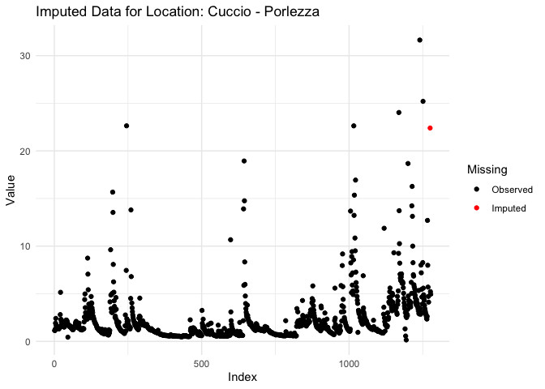
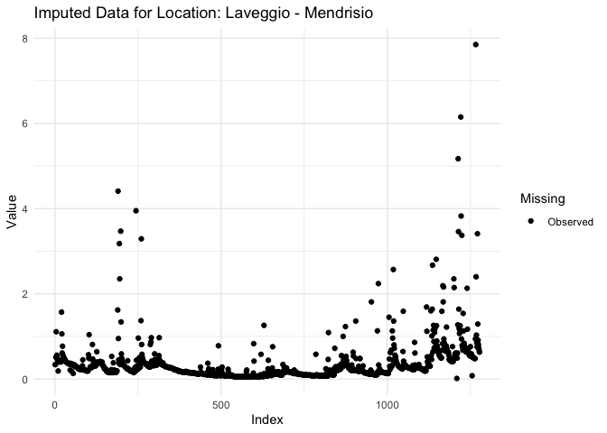
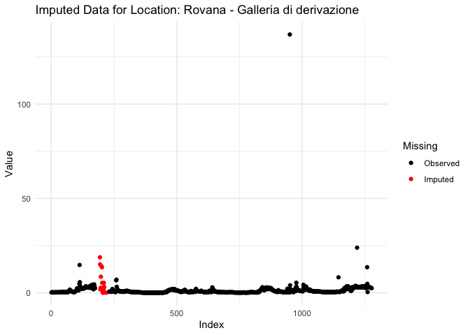
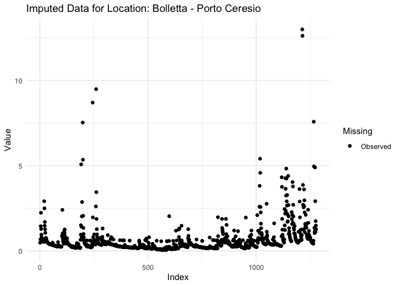
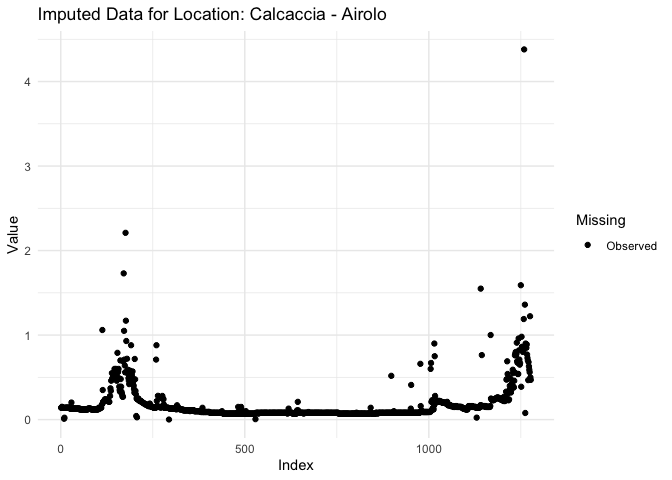
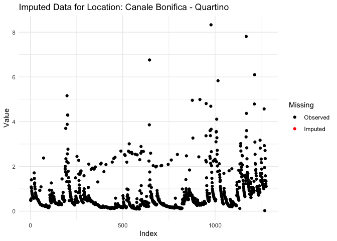

Untitled
================

## GitHub Documents

This is an R Markdown format used for publishing markdown documents to
GitHub. When you click the **Knit** button all R code chunks are run and
a markdown file (.md) suitable for publishing to GitHub is generated.

## Including Code

You can include R code in the document as follows:

``` r
# Load required libraries
library(httr)
library(jsonlite)
library(ggplot2)
library(dplyr)
```

    ## 
    ## Attaching package: 'dplyr'

    ## The following objects are masked from 'package:stats':
    ## 
    ##     filter, lag

    ## The following objects are masked from 'package:base':
    ## 
    ##     intersect, setdiff, setequal, union

``` r
library(tidyr)
library(SparseTSCGM)

# Function to fetch locations data
fetch_locations_data <- function(domain) {
  base_url <- "http://www.oasi.ti.ch/web/rest/locations"
  params <- list(domain = domain)
  
  response <- GET(base_url, query = params)
  
  if (response$status_code == 200) {
    return(fromJSON(content(response, as = "text", encoding = "UTF-8"), flatten = TRUE))
  } else {
    warning("Failed to get locations data. Status code:", response$status_code)
    return(NULL)
  }
}

# Function to fetch available parameters for a location
fetch_parameters_data <- function(domain, location_code) {
  base_url <- "http://www.oasi.ti.ch/web/rest/parameters"
  params <- list(domain = domain, location = location_code)
  
  response <- GET(base_url, query = params)
  
  if (response$status_code == 200) {
    return(fromJSON(content(response, as = "text", encoding = "UTF-8"), flatten = TRUE))
  } else {
    warning("Failed to get parameters data. Status code:", response$status_code)
    return(NULL)
  }
}

# Function to fetch time series data
fetch_time_series_data <- function(domain, location_code, parameter, resolution, from_date, to_date) {
  base_url <- "http://www.oasi.ti.ch/web/rest/measure/csv"
  params <- list(
    domain = domain,
    location = location_code,
    parameter = parameter,
    resolution = resolution,
    from = from_date,
    to = to_date
  )
  
  response <- GET(base_url, query = params)
  
  if (response$status_code == 200) {
    return(content(response, as = "text", encoding = "UTF-8"))
  } else {
    warning("Failed to get data. Status code:", response$status_code)
    return(NULL)
  }
}

# Function to process and append data
process_and_append_data <- function(response_data, parameter, location_name, data_frame) {
  data_lines <- strsplit(response_data, "\n")[[1]]
  data_lines <- data_lines[!grepl("^#", data_lines)]
  
  if (length(data_lines) > 0) {
    data_clean <- paste(data_lines, collapse = "\n")
    data_df <- read.csv(text = data_clean, sep = ";", header = TRUE)
    
    if ("data" %in% names(data_df) && parameter %in% names(data_df)) {
      data_df$data <- as.Date(data_df$data, format="%d.%m.%Y %H:%M")
      data_df[[parameter]] <- as.numeric(data_df[[parameter]])
      data_df$Location <- location_name
      data_frame <- rbind(data_frame, data_df)
    }
  }
  return(data_frame)
}

# Function to preprocess data (convert negative values to NA)
preprocess_data <- function(data_frame) {
  data_frame[data_frame < 0] <- NA
  return(data_frame)
}

# Function to process locations data
process_locations <- function(domain) {
  locations_data <- fetch_locations_data(domain = domain)
  
  # Initialize lists to hold locations data
  q_locations <- list()
  other_locations <- list()
  
  # Process each location to check for Q parameter availability
  if (!is.null(locations_data)) {
    for (i in seq_len(nrow(locations_data))) {
      location_code <- locations_data$code[i]
      location_name <- locations_data$name[i]
      
      # Fetch parameters data
      parameters_data <- fetch_parameters_data(domain = domain, location_code = location_code)
      
      if (!is.null(parameters_data)) {
        # Check if Q parameter is available
        if (any(parameters_data$code == "Q")) {
          q_locations <- append(q_locations, list(locations_data[i, ]))
        } else {
          other_locations <- append(other_locations, list(locations_data[i, ]))
        }
      }
    }
    
    # Convert lists to data frames
    q_locations_df <- bind_rows(q_locations)
    other_locations_df <- bind_rows(other_locations)
    
    # Display the separated data
    message("Locations with Q Parameter:")
    print(q_locations_df)
    
    message("Other Locations:")
    print(other_locations_df)
    
    return(q_locations_df)
  } else {
    message("Failed to fetch location data.")
    return(NULL)
  }
}

# Function to impute missing data
impute_missing_data <- function(data_frame, method = "glm", glm_family = gaussian()) {
  imputed_data <- data_frame  # Initialize imputed data
  
  for (i in seq_len(ncol(data_frame))) {
    mss <- is.na(data_frame[,i])
    if (sum(mss) > 0) {
      message("Imputing missing data for column: ", colnames(data_frame)[i])
      
      available_vars <- apply(data_frame[!mss,], 2, function(x) sum(is.na(x)) == 0)
      if (sum(available_vars) == 0) {
        message("No available variables to predict column: ", colnames(data_frame)[i])
        next
      }
      fml <- as.formula(paste0("`", colnames(data_frame)[i], "` ~ `", paste0(names(available_vars), collapse = "` + `"), "`"))
      
      if (method == "lm") {
        model <- tryCatch({
          lm(fml, data = data_frame[!mss,])
        }, error = function(e) {
          message("Model fitting failed for column: ", colnames(data_frame)[i])
          return(NULL)
        })
      } else if (method == "glm") {
        model <- tryCatch({
          glm(fml, data = data_frame[!mss,], family = glm_family)
        }, error = function(e) {
          message("GLM fitting failed for column: ", colnames(data_frame)[i])
          return(NULL)
        })
      } else {
        stop("Unsupported method. Use 'lm' or 'glm'.")
      }
      
      if (!is.null(model)) {
        # Predict missing values
        imputed_data[mss, i] <- predict(model, newdata = data_frame[mss,])
      } else {
        message("Skipping imputation for column: ", colnames(data_frame)[i])
      }
    }
  }
  
  # Post-imputation correction: Replace negative values with NA
  imputed_data[imputed_data < 0] <- NA
  
  return(imputed_data)
}

# Function to mask data for validation
mask_data_for_validation <- function(data_frame, prop_missing = 0.1) {
  set.seed(42)  # For reproducibility
  masked_data <- data_frame
  known_indices <- which(!is.na(masked_data), arr.ind = TRUE)
  n_to_mask <- round(prop_missing * nrow(known_indices))
  
  # Randomly select indices to mask
  mask_indices <- known_indices[sample(nrow(known_indices), n_to_mask), ]
  masked_data[mask_indices] <- NA
  
  return(list(masked_data = masked_data, original_indices = mask_indices))
}

# --- Training Phase ---
training_start_time <- Sys.time()

# Fetch all locations for the surfacewater domain
q_locations_df <- process_locations("surfacewater")
```

    ## Locations with Q Parameter:

    ##               code                             name   simpleOwner         owner
    ## 1        water_35w         Bolletta - Porto Ceresio          <NA>     DT-DC-UCA
    ## 2     water_LH2349                Breggia - Chiasso          UFAM          UFAM
    ## 3     water_LH2086                 Brenno - Loderio          UFAM          UFAM
    ## 4     water_LH2474              Calancasca - Buseno          UFAM          UFAM
    ## 5         water_30               Calcaccia - Airolo          <NA>     DT-DC-UCA
    ## 6         water_29       Canale Bonifica - Quartino          <NA>     DT-DC-UCA
    ## 7     water_LH2321           Cassarate - Pregassona          UFAM          UFAM
    ## 8        water_33w                Cuccio - Porlezza          <NA>     DT-DC-UCA
    ## 9   water_auto_583               Faloppia - Chiasso          <NA>     DT-DC-UCA
    ## 10  water_auto_905                    Garegna Föisc          <NA>     DT-DC-UCA
    ## 11 water_auto_1165                Garegna Presa AET          <NA>     DT-DC-UCA
    ## 12       water_38w             Laveggio - Mendrisio          <NA>     DT-DC-UCA
    ## 13       water_10w        Laveggio - Riva S. Vitale          <NA>     DT-DC-UCA
    ## 14  water_auto_904               Lisora - Monteggio          <NA>     DT-DC-UCA
    ## 15    water_LH2475                Maggia - Bignasco          UFAM          UFAM
    ## 16   water_auto_1w                  Maggia - Lodano          <NA>     DT-DC-UCA
    ## 17    water_LH2368                 Maggia - Solduno          UFAM          UFAM
    ## 18    water_LH2461            Magliasina - Magliaso          UFAM          UFAM
    ## 19 water_auto_343w                  Mara - Maroggia          <NA>     DT-DC-UCA
    ## 20    water_LH2420                   Moesa - Lumino          UFAM          UFAM
    ## 21  water_auto_42w             Morobbia - Giubiasco          <NA>     DT-DC-UCA
    ## 22 water_auto_763w                 Piumogna - Dalpe          <NA>     DT-DC-UCA
    ## 23    water_LH2612     Riale Pincascia - Lavertezzo          UFAM          UFAM
    ## 24       water_28w         Riale di Gnosca - Gnosca          <NA>     DT-DC-UCA
    ## 25  water_auto_104          Rovana - Briglia Secada          <NA>     DT-DC-UCA
    ## 26  water_auto_102 Rovana - Galleria di derivazione          <NA>     DT-DC-UCA
    ## 27        water_36                   Salto - Maggia          <NA>     DT-DC-UCA
    ## 28       water_14w              Scairolo - Barbengo          <NA>     DT-DC-UCA
    ## 29    water_LH2020              Ticino - Bellinzona          UFAM          UFAM
    ## 30    water_LH2364                  Ticino - Piotta          UFAM          UFAM
    ## 31    water_LH2494                Ticino - Pollegio          UFAM          UFAM
    ## 32       water_37w          Ticino - Ronco Bedretto          <NA>     DT-DC-UCA
    ## 33 water_auto_182w                 Toce - Candoglia ARPA Piemonte ARPA Piemonte
    ## 34    water_LH2167              Tresa - Ponte Tresa          UFAM          UFAM
    ## 35       water_39w          Vecchio Vedeggio - Agno          <NA>     DT-DC-UCA
    ## 36    water_LH2629                  Vedeggio - Agno          UFAM          UFAM
    ## 37       water_31w                 Vedeggio - Isone          <NA>     DT-DC-UCA
    ## 38    water_LH2605            Verzasca - Lavertezzo          UFAM          UFAM
    ##    coordinates.x coordinates.y coordinates.z
    ## 1       712670.0       84270.0         280.0
    ## 2       722315.0       78320.0         255.0
    ## 3       717770.0      137270.0         348.0
    ## 4       729440.0      127180.0         746.0
    ## 5       692060.0      152560.0        1100.0
    ## 6       713591.0      113149.0         201.0
    ## 7       718010.0       97380.0         291.0
    ## 8       731730.0      100420.0         300.0
    ## 9       722658.0       76863.0         236.0
    ## 10      692371.0      155629.0        1480.0
    ## 11      691136.0      153777.0        1145.0
    ## 12      719460.0       82040.0         300.0
    ## 13      719140.0       83880.0         280.0
    ## 14      707440.0       94518.0         280.0
    ## 15      690040.0      132550.0         432.0
    ## 16      696420.0      124125.0         339.0
    ## 17      703100.0      113860.0         202.0
    ## 18      711620.0       93290.0         295.0
    ## 19      719024.0       88196.0         279.0
    ## 20      724765.0      120360.0         249.0
    ## 21      720591.0      114304.0         229.0
    ## 22      702383.0      145932.0        1395.0
    ## 23      708060.0      123950.0         536.0
    ## 24      721940.0      121460.0         286.0
    ## 25      682310.0      126549.0        1043.0
    ## 26      680913.0      125677.0        1250.0
    ## 27      697820.0      123020.0         460.0
    ## 28      714000.0       90030.0         276.0
    ## 29      722112.5      117863.5         223.5
    ## 30      694610.0      152450.0        1007.0
    ## 31      716120.0      135330.0         298.0
    ## 32      681310.0      150130.0        1472.0
    ## 33      676277.0       92201.0         201.0
    ## 34      709580.0       92145.0         268.0
    ## 35      713390.0       95110.0         274.0
    ## 36      714110.0       95690.0         281.0
    ## 37      720250.0      110150.0         740.0
    ## 38      708420.0      122920.0         490.0

    ## Other Locations:

    ##              code                                name    simpleOwner
    ## 1  meteo_auto_812                  Anza a Piedimulera  MeteoSvizzera
    ## 2  meteo_auto_813                        Bacino Gries  MeteoSvizzera
    ## 3  meteo_auto_814           Bacino Passo del Gottardo  MeteoSvizzera
    ## 4  meteo_auto_790                   Bavona a Cavergno  MeteoSvizzera
    ## 5         auto_25                 Breggia a Cernobbio  MeteoSvizzera
    ## 6  meteo_auto_764                    Brenno a Loderio  MeteoSvizzera
    ## 7  meteo_auto_784                 Calancasca a Buseno  MeteoSvizzera
    ## 8  meteo_auto_804                  Cassarate a Lugano  MeteoSvizzera
    ## 9  meteo_auto_810                     Devero a Baceno  MeteoSvizzera
    ## 10 meteo_auto_811            Diveria a Crevoladossola  MeteoSvizzera
    ## 11 meteo_auto_809   Gravellona Toce CPC R_Lago d'Orta  MeteoSvizzera
    ## 12 meteo_auto_792                      Isorno a Russo  MeteoSvizzera
    ## 13 meteo_auto_798 L. Maggiore Baveno-S.Calende-Laveno  MeteoSvizzera
    ## 14 meteo_auto_795                       Lago Maggiore  MeteoSvizzera
    ## 15   water_LH2074            Lago Maggiore - Brissago           UFAM
    ## 16   water_LH2022             Lago Maggiore - Locarno           UFAM
    ## 17 meteo_auto_802                      Lago di Lugano  MeteoSvizzera
    ## 18   water_LH2101             Lago di Lugano - Melide           UFAM
    ## 19 water_auto_743            Lago di Lugano - Morcote           <NA>
    ## 20   water_LH2021        Lago di Lugano - Ponte Tresa           UFAM
    ## 21 meteo_auto_800  Lago di Lugano da Gandria a Osteno  MeteoSvizzera
    ## 22   water_auto_2           Lago di Muzzano - Muzzano           <NA>
    ## 23 meteo_auto_799 Laveggio RSVitale Bolletta PCeresio  MeteoSvizzera
    ## 24 meteo_auto_787                   Maggia a Bignasco  MeteoSvizzera
    ## 25 meteo_auto_789           Maggia foce Lago Maggiore  MeteoSvizzera
    ## 26 meteo_auto_805               Magliasina a Magliaso  MeteoSvizzera
    ## 27 meteo_auto_806                     Mara a Maroggia  MeteoSvizzera
    ## 28 meteo_auto_791                    Melezza a Camedo  MeteoSvizzera
    ## 29 meteo_auto_793              Melezza a Ponte Brolla  MeteoSvizzera
    ## 30 meteo_auto_786                    Moesa a Castione  MeteoSvizzera
    ## 31 meteo_auto_785                       Moesa a Sorte  MeteoSvizzera
    ## 32 meteo_auto_815                       Reno di Medel  MeteoSvizzera
    ## 33   water_LH2356          Riale di Calneggia - Cevio           UFAM
    ## 34 meteo_auto_788                   Rovana a Linescio  MeteoSvizzera
    ## 35 meteo_auto_801                 Scairolo a Barbengo  MeteoSvizzera
    ## 36 meteo_auto_796  Sponda L. Maggiore Ascona-Pallanza  MeteoSvizzera
    ## 37 meteo_auto_797  Sponda L. Maggiore Magadino-Laveno  MeteoSvizzera
    ## 38  water_auto_23                  Ticino - Golasecca ARPA Lombardia
    ## 39 water_auto_824                   Ticino - Riazzino           UFAM
    ## 40 meteo_auto_762                 Ticino a Bellinzona  MeteoSvizzera
    ## 41 meteo_auto_741                     Ticino a Piotta  MeteoSvizzera
    ## 42 meteo_auto_742                   Ticino a Pollegio  MeteoSvizzera
    ## 43 meteo_auto_763           Ticino foce Lago Maggiore  MeteoSvizzera
    ## 44 meteo_auto_807                       Toce a Baceno  MeteoSvizzera
    ## 45 meteo_auto_808                   Toce a Premosello  MeteoSvizzera
    ## 46 meteo_auto_803                    Vedeggio ad Agno  MeteoSvizzera
    ## 47 meteo_auto_794         Verzasca foce Lago Maggiore  MeteoSvizzera
    ##             owner coordinates.x coordinates.y coordinates.z
    ## 1   MeteoSvizzera        663420         96880           248
    ## 2   MeteoSvizzera        671584        146000          2386
    ## 3   MeteoSvizzera        685190        157503          2130
    ## 4   MeteoSvizzera        688423        134219           980
    ## 5   MeteoSvizzera        722315         78331           200
    ## 6   MeteoSvizzera        718000        137680           354
    ## 7   MeteoSvizzera        728885        125381           680
    ## 8   MeteoSvizzera        717968         95690           270
    ## 9   MeteoSvizzera        668756        122582           630
    ## 10  MeteoSvizzera        667170        110862           375
    ## 11  MeteoSvizzera        671700         84942             0
    ## 12  MeteoSvizzera        693120        116719           780
    ## 13  MeteoSvizzera        694740         62736           210
    ## 14  MeteoSvizzera        687614         82858           193
    ## 15           UFAM        698350        108200           193
    ## 16           UFAM        705480        113380           193
    ## 17  MeteoSvizzera        717700         90265           271
    ## 18           UFAM        717070         91650           271
    ## 19      DT-DC-UCA        714115         86952           272
    ## 20           UFAM        710200         91800           271
    ## 21  MeteoSvizzera        730273         99408           271
    ## 22      DT-DC-UCA        714978         94906           338
    ## 23  MeteoSvizzera        717136         88280           271
    ## 24  MeteoSvizzera        690021        132558           443
    ## 25  MeteoSvizzera        703882        113252           193
    ## 26  MeteoSvizzera        712618         92386           271
    ## 27  MeteoSvizzera        718665         88038           271
    ## 28  MeteoSvizzera        692027        112755           482
    ## 29  MeteoSvizzera        701595        115083           250
    ## 30  MeteoSvizzera        724201        120080           320
    ## 31  MeteoSvizzera        734065        127810           400
    ## 32  MeteoSvizzera        700895        157874          2250
    ## 33           UFAM        684970        135960           890
    ## 34  MeteoSvizzera        688443        129110           664
    ## 35  MeteoSvizzera        713615         89932           271
    ## 36  MeteoSvizzera        687834         87377           195
    ## 37  MeteoSvizzera        700100         94413           210
    ## 38 ARPA Lombardia        694315         61120             0
    ## 39           UFAM        713670        113500           200
    ## 40  MeteoSvizzera        721115        116520           230
    ## 41  MeteoSvizzera        694642        152460             0
    ## 42  MeteoSvizzera        715654        135462             0
    ## 43  MeteoSvizzera        709500        112580           193
    ## 44  MeteoSvizzera        668735        122670           700
    ## 45  MeteoSvizzera        663191        107962             0
    ## 46  MeteoSvizzera        713833         94878           271
    ## 47  MeteoSvizzera        709690        114438           195

``` r
# Initialize data frames to hold time series data
q_data <- data.frame()

# Fetch time series data for locations with Q parameter
if (!is.null(q_locations_df)) {
  for (i in seq_len(nrow(q_locations_df))) {
    location_code <- q_locations_df$code[i]
    location_name <- q_locations_df$name[i]
    
    # Fetch Q parameter data
    q_data_response <- fetch_time_series_data(
      domain = "surfacewater", 
      location_code = location_code, 
      parameter = "Q", 
      resolution = "d", 
      from_date = "2021-01-19", 
      to_date = "2024-07-18"
    )
    
    if (!is.null(q_data_response)) {
      q_data <- process_and_append_data(q_data_response, "Q", location_name, q_data)
    }
  }
}

# Reshape the data into wide format
longitudinal_data <- q_data %>%
  select(data, Location, Q) %>%
  pivot_wider(names_from = Location, values_from = Q) %>%
  arrange(data)

# Convert the data to a matrix format for further analysis
dat <- as.matrix(longitudinal_data)
loc <- colnames(dat[,-1])
tms <- unique(dat[,1])
nl <- length(loc)
nt <- length(tms)

dta <- as.data.frame(dat[,-1])

# Remove leading/trailing whitespace and convert to numeric for all columns
dta[] <- lapply(dta, function(x) as.numeric(trimws(x)))

# Preprocess data: Treat negative values as NA
dta <- preprocess_data(dta)

training_end_time <- Sys.time()
training_duration <- training_end_time - training_start_time
message("Training Phase Duration: ", training_duration, " seconds")
```

    ## Training Phase Duration: 29.9722821712494 seconds

``` r
# --- Imputation Phase ---
imputation_start_time <- Sys.time()

# Mask known data for validation (e.g., mask 10% of the data)
validation_data <- mask_data_for_validation(dta, prop_missing = 0.1)
dta_masked <- validation_data$masked_data
original_indices <- validation_data$original_indices

# Impute the masked data using GLM as the default method
# You can specify 'lm' if you prefer Linear Modeling
dta_imputed <- impute_missing_data(dta_masked, method = "glm", glm_family = gaussian())
```

    ## Imputing missing data for column: Bolletta - Porto Ceresio

    ## Warning in model.matrix.default(mt, mf, contrasts): the response appeared on
    ## the right-hand side and was dropped

    ## Warning in model.matrix.default(mt, mf, contrasts): problem with term 1 in
    ## model.matrix: no columns are assigned

    ## Imputing missing data for column: Breggia - Chiasso

    ## Warning in model.matrix.default(mt, mf, contrasts): the response appeared on
    ## the right-hand side and was dropped

    ## Warning in model.matrix.default(mt, mf, contrasts): problem with term 2 in
    ## model.matrix: no columns are assigned

    ## Imputing missing data for column: Brenno - Loderio

    ## Warning in model.matrix.default(mt, mf, contrasts): the response appeared on
    ## the right-hand side and was dropped

    ## Warning in model.matrix.default(mt, mf, contrasts): problem with term 3 in
    ## model.matrix: no columns are assigned

    ## Imputing missing data for column: Calancasca - Buseno

    ## Warning in model.matrix.default(mt, mf, contrasts): the response appeared on
    ## the right-hand side and was dropped

    ## Warning in model.matrix.default(mt, mf, contrasts): problem with term 4 in
    ## model.matrix: no columns are assigned

    ## Warning in predict.lm(object, newdata, se.fit, scale = 1, type = if (type == :
    ## prediction from rank-deficient fit; attr(*, "non-estim") has doubtful cases

    ## Imputing missing data for column: Calcaccia - Airolo

    ## Warning in model.matrix.default(mt, mf, contrasts): the response appeared on
    ## the right-hand side and was dropped

    ## Warning in model.matrix.default(mt, mf, contrasts): problem with term 5 in
    ## model.matrix: no columns are assigned

    ## Warning in predict.lm(object, newdata, se.fit, scale = 1, type = if (type == :
    ## prediction from rank-deficient fit; attr(*, "non-estim") has doubtful cases

    ## Imputing missing data for column: Canale Bonifica - Quartino

    ## Warning in model.matrix.default(mt, mf, contrasts): the response appeared on
    ## the right-hand side and was dropped

    ## Warning in model.matrix.default(mt, mf, contrasts): problem with term 6 in
    ## model.matrix: no columns are assigned

    ## Imputing missing data for column: Cassarate - Pregassona

    ## Warning in model.matrix.default(mt, mf, contrasts): the response appeared on
    ## the right-hand side and was dropped

    ## Warning in model.matrix.default(mt, mf, contrasts): problem with term 7 in
    ## model.matrix: no columns are assigned

    ## Imputing missing data for column: Cuccio - Porlezza

    ## Warning in model.matrix.default(mt, mf, contrasts): the response appeared on
    ## the right-hand side and was dropped

    ## Warning in model.matrix.default(mt, mf, contrasts): problem with term 8 in
    ## model.matrix: no columns are assigned

    ## Imputing missing data for column: Faloppia - Chiasso

    ## Warning in model.matrix.default(mt, mf, contrasts): the response appeared on
    ## the right-hand side and was dropped

    ## Warning in model.matrix.default(mt, mf, contrasts): problem with term 9 in
    ## model.matrix: no columns are assigned

    ## Imputing missing data for column: Garegna Presa AET

    ## Warning in model.matrix.default(mt, mf, contrasts): the response appeared on
    ## the right-hand side and was dropped

    ## Warning in model.matrix.default(mt, mf, contrasts): problem with term 10 in
    ## model.matrix: no columns are assigned

    ## Imputing missing data for column: Laveggio - Mendrisio

    ## Warning in model.matrix.default(mt, mf, contrasts): the response appeared on
    ## the right-hand side and was dropped

    ## Warning in model.matrix.default(mt, mf, contrasts): problem with term 11 in
    ## model.matrix: no columns are assigned

    ## Warning in predict.lm(object, newdata, se.fit, scale = 1, type = if (type == :
    ## prediction from rank-deficient fit; attr(*, "non-estim") has doubtful cases

    ## Imputing missing data for column: Laveggio - Riva S. Vitale

    ## Warning in model.matrix.default(mt, mf, contrasts): the response appeared on
    ## the right-hand side and was dropped

    ## Warning in model.matrix.default(mt, mf, contrasts): problem with term 12 in
    ## model.matrix: no columns are assigned

    ## Imputing missing data for column: Lisora - Monteggio

    ## Warning in model.matrix.default(mt, mf, contrasts): the response appeared on
    ## the right-hand side and was dropped

    ## Warning in model.matrix.default(mt, mf, contrasts): problem with term 13 in
    ## model.matrix: no columns are assigned

    ## Imputing missing data for column: Maggia - Bignasco

    ## Warning in model.matrix.default(mt, mf, contrasts): the response appeared on
    ## the right-hand side and was dropped

    ## Warning in model.matrix.default(mt, mf, contrasts): problem with term 14 in
    ## model.matrix: no columns are assigned

    ## Imputing missing data for column: Maggia - Lodano

    ## Warning in model.matrix.default(mt, mf, contrasts): the response appeared on
    ## the right-hand side and was dropped

    ## Warning in model.matrix.default(mt, mf, contrasts): problem with term 15 in
    ## model.matrix: no columns are assigned

    ## Warning in predict.lm(object, newdata, se.fit, scale = 1, type = if (type == :
    ## prediction from rank-deficient fit; attr(*, "non-estim") has doubtful cases

    ## Imputing missing data for column: Maggia - Solduno

    ## Warning in model.matrix.default(mt, mf, contrasts): the response appeared on
    ## the right-hand side and was dropped

    ## Warning in model.matrix.default(mt, mf, contrasts): problem with term 16 in
    ## model.matrix: no columns are assigned

    ## Imputing missing data for column: Magliasina - Magliaso

    ## Warning in model.matrix.default(mt, mf, contrasts): the response appeared on
    ## the right-hand side and was dropped

    ## Warning in model.matrix.default(mt, mf, contrasts): problem with term 17 in
    ## model.matrix: no columns are assigned

    ## Warning in predict.lm(object, newdata, se.fit, scale = 1, type = if (type == :
    ## prediction from rank-deficient fit; attr(*, "non-estim") has doubtful cases

    ## Imputing missing data for column: Mara - Maroggia

    ## Warning in model.matrix.default(mt, mf, contrasts): the response appeared on
    ## the right-hand side and was dropped

    ## Warning in model.matrix.default(mt, mf, contrasts): problem with term 18 in
    ## model.matrix: no columns are assigned

    ## Imputing missing data for column: Moesa - Lumino

    ## Warning in model.matrix.default(mt, mf, contrasts): the response appeared on
    ## the right-hand side and was dropped

    ## Warning in model.matrix.default(mt, mf, contrasts): problem with term 19 in
    ## model.matrix: no columns are assigned

    ## Imputing missing data for column: Morobbia - Giubiasco

    ## Warning in model.matrix.default(mt, mf, contrasts): the response appeared on
    ## the right-hand side and was dropped

    ## Warning in model.matrix.default(mt, mf, contrasts): problem with term 20 in
    ## model.matrix: no columns are assigned

    ## Imputing missing data for column: Piumogna - Dalpe

    ## Warning in model.matrix.default(mt, mf, contrasts): the response appeared on
    ## the right-hand side and was dropped

    ## Warning in model.matrix.default(mt, mf, contrasts): problem with term 21 in
    ## model.matrix: no columns are assigned

    ## Imputing missing data for column: Riale Pincascia - Lavertezzo

    ## Warning in model.matrix.default(mt, mf, contrasts): the response appeared on
    ## the right-hand side and was dropped

    ## Warning in model.matrix.default(mt, mf, contrasts): problem with term 22 in
    ## model.matrix: no columns are assigned

    ## Imputing missing data for column: Riale di Gnosca - Gnosca

    ## Warning in model.matrix.default(mt, mf, contrasts): the response appeared on
    ## the right-hand side and was dropped

    ## Warning in model.matrix.default(mt, mf, contrasts): problem with term 23 in
    ## model.matrix: no columns are assigned

    ## Imputing missing data for column: Rovana - Briglia Secada

    ## Warning in model.matrix.default(mt, mf, contrasts): the response appeared on
    ## the right-hand side and was dropped

    ## Warning in model.matrix.default(mt, mf, contrasts): problem with term 24 in
    ## model.matrix: no columns are assigned

    ## Imputing missing data for column: Rovana - Galleria di derivazione

    ## Warning in model.matrix.default(mt, mf, contrasts): the response appeared on
    ## the right-hand side and was dropped

    ## Warning in model.matrix.default(mt, mf, contrasts): problem with term 25 in
    ## model.matrix: no columns are assigned

    ## Warning in predict.lm(object, newdata, se.fit, scale = 1, type = if (type == :
    ## prediction from rank-deficient fit; attr(*, "non-estim") has doubtful cases

    ## Imputing missing data for column: Salto - Maggia

    ## Warning in model.matrix.default(mt, mf, contrasts): the response appeared on
    ## the right-hand side and was dropped

    ## Warning in model.matrix.default(mt, mf, contrasts): problem with term 26 in
    ## model.matrix: no columns are assigned

    ## Imputing missing data for column: Scairolo - Barbengo

    ## Warning in model.matrix.default(mt, mf, contrasts): the response appeared on
    ## the right-hand side and was dropped

    ## Warning in model.matrix.default(mt, mf, contrasts): problem with term 27 in
    ## model.matrix: no columns are assigned

    ## Imputing missing data for column: Ticino - Bellinzona

    ## Warning in model.matrix.default(mt, mf, contrasts): the response appeared on
    ## the right-hand side and was dropped

    ## Warning in model.matrix.default(mt, mf, contrasts): problem with term 28 in
    ## model.matrix: no columns are assigned

    ## Imputing missing data for column: Ticino - Piotta

    ## Warning in model.matrix.default(mt, mf, contrasts): the response appeared on
    ## the right-hand side and was dropped

    ## Warning in model.matrix.default(mt, mf, contrasts): problem with term 29 in
    ## model.matrix: no columns are assigned

    ## Imputing missing data for column: Ticino - Pollegio

    ## Warning in model.matrix.default(mt, mf, contrasts): the response appeared on
    ## the right-hand side and was dropped

    ## Warning in model.matrix.default(mt, mf, contrasts): problem with term 30 in
    ## model.matrix: no columns are assigned

    ## Imputing missing data for column: Ticino - Ronco Bedretto

    ## Warning in model.matrix.default(mt, mf, contrasts): the response appeared on
    ## the right-hand side and was dropped

    ## Warning in model.matrix.default(mt, mf, contrasts): problem with term 31 in
    ## model.matrix: no columns are assigned

    ## Imputing missing data for column: Toce - Candoglia

    ## Warning in model.matrix.default(mt, mf, contrasts): the response appeared on
    ## the right-hand side and was dropped

    ## Warning in model.matrix.default(mt, mf, contrasts): problem with term 32 in
    ## model.matrix: no columns are assigned

    ## Imputing missing data for column: Tresa - Ponte Tresa

    ## Warning in model.matrix.default(mt, mf, contrasts): the response appeared on
    ## the right-hand side and was dropped

    ## Warning in model.matrix.default(mt, mf, contrasts): problem with term 33 in
    ## model.matrix: no columns are assigned

    ## Imputing missing data for column: Vecchio Vedeggio - Agno

    ## Warning in model.matrix.default(mt, mf, contrasts): the response appeared on
    ## the right-hand side and was dropped

    ## Warning in model.matrix.default(mt, mf, contrasts): problem with term 34 in
    ## model.matrix: no columns are assigned

    ## Warning in predict.lm(object, newdata, se.fit, scale = 1, type = if (type == :
    ## prediction from rank-deficient fit; attr(*, "non-estim") has doubtful cases

    ## Imputing missing data for column: Vedeggio - Agno

    ## Warning in model.matrix.default(mt, mf, contrasts): the response appeared on
    ## the right-hand side and was dropped

    ## Warning in model.matrix.default(mt, mf, contrasts): problem with term 35 in
    ## model.matrix: no columns are assigned

    ## Imputing missing data for column: Vedeggio - Isone

    ## Warning in model.matrix.default(mt, mf, contrasts): the response appeared on
    ## the right-hand side and was dropped

    ## Warning in model.matrix.default(mt, mf, contrasts): problem with term 36 in
    ## model.matrix: no columns are assigned

    ## Imputing missing data for column: Verzasca - Lavertezzo

    ## Warning in model.matrix.default(mt, mf, contrasts): the response appeared on
    ## the right-hand side and was dropped

    ## Warning in model.matrix.default(mt, mf, contrasts): problem with term 37 in
    ## model.matrix: no columns are assigned

    ## Warning in predict.lm(object, newdata, se.fit, scale = 1, type = if (type == :
    ## prediction from rank-deficient fit; attr(*, "non-estim") has doubtful cases

``` r
# Initialize a list to store the assessment metrics
assessment_metrics <- list()

# Compare imputed values with original values for each location
for (i in seq_len(nl)) {
  loc_indices <- original_indices[original_indices[, 2] == i, ]
  comparison <- data.frame(
    Original = dta[loc_indices],
    Imputed = dta_imputed[loc_indices]
  )
  
  # Calculate the Mean Absolute Error (MAE) for this location
  mae <- mean(abs(comparison$Original - comparison$Imputed), na.rm = TRUE)
  message("Mean Absolute Error (MAE) for Location ", loc[i], ": ", round(mae, 4))
  
  # Store the assessment metrics
  assessment_metrics[[i]] <- data.frame(Location = loc[i], MAE = mae)
  
  # Prepare the data for plotting imputed values
  mss <- is.na(dta[,i])
  plot_data <- data.frame(
    Index = seq_along(dta_imputed[,i]),
    Value = dta_imputed[,i],
    Missing = as.factor(mss)
  )
  
  # Create the plot with the actual location name
  g2 <- ggplot(plot_data, aes(x = Index, y = Value, color = Missing)) +
    geom_point() +
    labs(
      title = paste("Imputed Data for Location:", loc[i]),  # Use actual location name
      x = "Index",
      y = "Value"
    ) +
    scale_color_manual(values = c("black", "red"), labels = c("Observed", "Imputed")) +
    theme_minimal()
  print(g2)
}
```

    ## Mean Absolute Error (MAE) for Location Bolletta - Porto Ceresio: 6.9957

    ## Warning: Removed 70 rows containing missing values or values outside the scale range
    ## (`geom_point()`).

    ## Mean Absolute Error (MAE) for Location Breggia - Chiasso: 2.6153

<!-- -->

    ## Warning: Removed 136 rows containing missing values or values outside the scale range
    ## (`geom_point()`).

    ## Mean Absolute Error (MAE) for Location Brenno - Loderio: 3.9655

<!-- -->

    ## Warning: Removed 59 rows containing missing values or values outside the scale range
    ## (`geom_point()`).

    ## Mean Absolute Error (MAE) for Location Calancasca - Buseno: 2.3353

<!-- -->

    ## Warning: Removed 80 rows containing missing values or values outside the scale range
    ## (`geom_point()`).

    ## Mean Absolute Error (MAE) for Location Calcaccia - Airolo: 0.1162

<!-- -->

    ## Warning: Removed 39 rows containing missing values or values outside the scale range
    ## (`geom_point()`).

    ## Mean Absolute Error (MAE) for Location Canale Bonifica - Quartino: 0.3656

<!-- -->

    ## Warning: Removed 43 rows containing missing values or values outside the scale range
    ## (`geom_point()`).

    ## Mean Absolute Error (MAE) for Location Cassarate - Pregassona: 1.0674

<!-- -->

    ## Warning: Removed 34 rows containing missing values or values outside the scale range
    ## (`geom_point()`).

    ## Mean Absolute Error (MAE) for Location Cuccio - Porlezza: 1.2364

<!-- -->

    ## Warning: Removed 45 rows containing missing values or values outside the scale range
    ## (`geom_point()`).

    ## Mean Absolute Error (MAE) for Location Faloppia - Chiasso: 0.1768

<!-- -->

    ## Warning: Removed 34 rows containing missing values or values outside the scale range
    ## (`geom_point()`).

    ## Mean Absolute Error (MAE) for Location Garegna Presa AET: 0.1313

<!-- -->

    ## Warning: Removed 114 rows containing missing values or values outside the scale range
    ## (`geom_point()`).

    ## Mean Absolute Error (MAE) for Location Laveggio - Mendrisio: 0.1931

<!-- -->

    ## Warning: Removed 34 rows containing missing values or values outside the scale range
    ## (`geom_point()`).

    ## Mean Absolute Error (MAE) for Location Laveggio - Riva S. Vitale: 0.5041

<!-- -->

    ## Warning: Removed 49 rows containing missing values or values outside the scale range
    ## (`geom_point()`).

    ## Mean Absolute Error (MAE) for Location Lisora - Monteggio: 0.3574

<!-- -->

    ## Warning: Removed 41 rows containing missing values or values outside the scale range
    ## (`geom_point()`).

    ## Mean Absolute Error (MAE) for Location Maggia - Bignasco: 1.2714

<!-- -->

    ## Warning: Removed 32 rows containing missing values or values outside the scale range
    ## (`geom_point()`).

    ## Mean Absolute Error (MAE) for Location Maggia - Lodano: 8.4123

<!-- -->

    ## Warning: Removed 241 rows containing missing values or values outside the scale range
    ## (`geom_point()`).

    ## Mean Absolute Error (MAE) for Location Maggia - Solduno: 6.2797

<!-- -->

    ## Warning: Removed 32 rows containing missing values or values outside the scale range
    ## (`geom_point()`).

    ## Mean Absolute Error (MAE) for Location Magliasina - Magliaso: 1.2751

<!-- -->

    ## Warning: Removed 54 rows containing missing values or values outside the scale range
    ## (`geom_point()`).

    ## Mean Absolute Error (MAE) for Location Mara - Maroggia: 0.5427

<!-- -->

    ## Warning: Removed 32 rows containing missing values or values outside the scale range
    ## (`geom_point()`).

    ## Mean Absolute Error (MAE) for Location Moesa - Lumino: 72.7439

<!-- -->

    ## Warning: Removed 64 rows containing missing values or values outside the scale range
    ## (`geom_point()`).

    ## Mean Absolute Error (MAE) for Location Morobbia - Giubiasco: 7.1461

<!-- -->

    ## Warning: Removed 47 rows containing missing values or values outside the scale range
    ## (`geom_point()`).

    ## Mean Absolute Error (MAE) for Location Piumogna - Dalpe: 0.8914

<!-- -->

    ## Warning: Removed 40 rows containing missing values or values outside the scale range
    ## (`geom_point()`).

    ## Mean Absolute Error (MAE) for Location Riale Pincascia - Lavertezzo: 3.0236

<!-- -->

    ## Warning: Removed 77 rows containing missing values or values outside the scale range
    ## (`geom_point()`).

    ## Mean Absolute Error (MAE) for Location Riale di Gnosca - Gnosca: 0.095

<!-- -->

    ## Warning: Removed 41 rows containing missing values or values outside the scale range
    ## (`geom_point()`).

    ## Mean Absolute Error (MAE) for Location Rovana - Briglia Secada: 0.3808

<!-- -->

    ## Warning: Removed 34 rows containing missing values or values outside the scale range
    ## (`geom_point()`).

    ## Mean Absolute Error (MAE) for Location Rovana - Galleria di derivazione: 0.5029

<!-- -->

    ## Warning: Removed 60 rows containing missing values or values outside the scale range
    ## (`geom_point()`).

    ## Mean Absolute Error (MAE) for Location Salto - Maggia: 0.0711

<!-- -->

    ## Warning: Removed 74 rows containing missing values or values outside the scale range
    ## (`geom_point()`).

    ## Mean Absolute Error (MAE) for Location Scairolo - Barbengo: 0.1301

<!-- -->

    ## Warning: Removed 33 rows containing missing values or values outside the scale range
    ## (`geom_point()`).

    ## Mean Absolute Error (MAE) for Location Ticino - Bellinzona: 154.6446

<!-- -->

    ## Warning: Removed 46 rows containing missing values or values outside the scale range
    ## (`geom_point()`).

    ## Mean Absolute Error (MAE) for Location Ticino - Piotta: 2.0942

<!-- -->

    ## Warning: Removed 42 rows containing missing values or values outside the scale range
    ## (`geom_point()`).

    ## Mean Absolute Error (MAE) for Location Ticino - Pollegio: 9.0517

<!-- -->

    ## Warning: Removed 61 rows containing missing values or values outside the scale range
    ## (`geom_point()`).

    ## Mean Absolute Error (MAE) for Location Ticino - Ronco Bedretto: 0.5523

<!-- -->

    ## Warning: Removed 34 rows containing missing values or values outside the scale range
    ## (`geom_point()`).

    ## Mean Absolute Error (MAE) for Location Toce - Candoglia: 24.6444

<!-- -->

    ## Warning: Removed 35 rows containing missing values or values outside the scale range
    ## (`geom_point()`).

    ## Mean Absolute Error (MAE) for Location Tresa - Ponte Tresa: 18.9151

<!-- -->

    ## Warning: Removed 30 rows containing missing values or values outside the scale range
    ## (`geom_point()`).

    ## Mean Absolute Error (MAE) for Location Vecchio Vedeggio - Agno: 0.1935

<!-- -->

    ## Warning: Removed 30 rows containing missing values or values outside the scale range
    ## (`geom_point()`).

    ## Mean Absolute Error (MAE) for Location Vedeggio - Agno: 1.7778

<!-- -->

    ## Warning: Removed 34 rows containing missing values or values outside the scale range
    ## (`geom_point()`).

    ## Mean Absolute Error (MAE) for Location Vedeggio - Isone: 0.4825

<!-- -->

    ## Warning: Removed 44 rows containing missing values or values outside the scale range
    ## (`geom_point()`).

    ## Mean Absolute Error (MAE) for Location Verzasca - Lavertezzo: 4.5733

<!-- -->

    ## Warning: Removed 38 rows containing missing values or values outside the scale range
    ## (`geom_point()`).

<!-- -->

``` r
# Combine all assessment metrics into one data frame
assessment_df <- do.call(rbind, assessment_metrics)

imputation_end_time <- Sys.time()
imputation_duration <- imputation_end_time - imputation_start_time
message("Imputation Phase Duration: ", imputation_duration, " seconds")
```

    ## Imputation Phase Duration: 2.70475721359253 seconds

``` r
# Display the assessment table
print(assessment_df)
```

    ##                            Location          MAE
    ## 1          Bolletta - Porto Ceresio   6.99573157
    ## 2                 Breggia - Chiasso   2.61530426
    ## 3                  Brenno - Loderio   3.96545981
    ## 4               Calancasca - Buseno   2.33526139
    ## 5                Calcaccia - Airolo   0.11615536
    ## 6        Canale Bonifica - Quartino   0.36556275
    ## 7            Cassarate - Pregassona   1.06738087
    ## 8                 Cuccio - Porlezza   1.23640571
    ## 9                Faloppia - Chiasso   0.17684648
    ## 10                Garegna Presa AET   0.13131368
    ## 11             Laveggio - Mendrisio   0.19312219
    ## 12        Laveggio - Riva S. Vitale   0.50405374
    ## 13               Lisora - Monteggio   0.35738329
    ## 14                Maggia - Bignasco   1.27143920
    ## 15                  Maggia - Lodano   8.41232921
    ## 16                 Maggia - Solduno   6.27967883
    ## 17            Magliasina - Magliaso   1.27513722
    ## 18                  Mara - Maroggia   0.54273817
    ## 19                   Moesa - Lumino  72.74389318
    ## 20             Morobbia - Giubiasco   7.14606118
    ## 21                 Piumogna - Dalpe   0.89139962
    ## 22     Riale Pincascia - Lavertezzo   3.02361498
    ## 23         Riale di Gnosca - Gnosca   0.09500990
    ## 24          Rovana - Briglia Secada   0.38084073
    ## 25 Rovana - Galleria di derivazione   0.50288733
    ## 26                   Salto - Maggia   0.07108591
    ## 27              Scairolo - Barbengo   0.13009874
    ## 28              Ticino - Bellinzona 154.64455465
    ## 29                  Ticino - Piotta   2.09417529
    ## 30                Ticino - Pollegio   9.05168864
    ## 31          Ticino - Ronco Bedretto   0.55225151
    ## 32                 Toce - Candoglia  24.64442700
    ## 33              Tresa - Ponte Tresa  18.91508234
    ## 34          Vecchio Vedeggio - Agno   0.19349091
    ## 35                  Vedeggio - Agno   1.77779599
    ## 36                 Vedeggio - Isone   0.48247005
    ## 37            Verzasca - Lavertezzo   4.57325621

``` r
# Display total durations
message("Total Training Time: ", training_duration, " seconds")
```

    ## Total Training Time: 29.9722821712494 seconds

``` r
message("Total Imputation Time: ", imputation_duration, " seconds")
```

    ## Total Imputation Time: 2.70475721359253 seconds

``` r
assessment_df_gam = assessment_df
```

## LM

``` r
# Load required libraries
library(httr)
library(jsonlite)
library(ggplot2)
library(dplyr)
library(tidyr)
library(SparseTSCGM)

# Function to fetch locations data
fetch_locations_data <- function(domain) {
  base_url <- "http://www.oasi.ti.ch/web/rest/locations"
  params <- list(domain = domain)
  
  response <- GET(base_url, query = params)
  
  if (response$status_code == 200) {
    return(fromJSON(content(response, as = "text", encoding = "UTF-8"), flatten = TRUE))
  } else {
    warning("Failed to get locations data. Status code:", response$status_code)
    return(NULL)
  }
}

# Function to fetch available parameters for a location
fetch_parameters_data <- function(domain, location_code) {
  base_url <- "http://www.oasi.ti.ch/web/rest/parameters"
  params <- list(domain = domain, location = location_code)
  
  response <- GET(base_url, query = params)
  
  if (response$status_code == 200) {
    return(fromJSON(content(response, as = "text", encoding = "UTF-8"), flatten = TRUE))
  } else {
    warning("Failed to get parameters data. Status code:", response$status_code)
    return(NULL)
  }
}

# Function to fetch time series data
fetch_time_series_data <- function(domain, location_code, parameter, resolution, from_date, to_date) {
  base_url <- "http://www.oasi.ti.ch/web/rest/measure/csv"
  params <- list(
    domain = domain,
    location = location_code,
    parameter = parameter,
    resolution = resolution,
    from = from_date,
    to = to_date
  )
  
  response <- GET(base_url, query = params)
  
  if (response$status_code == 200) {
    return(content(response, as = "text", encoding = "UTF-8"))
  } else {
    warning("Failed to get data. Status code:", response$status_code)
    return(NULL)
  }
}

# Function to process and append data
process_and_append_data <- function(response_data, parameter, location_name, data_frame) {
  data_lines <- strsplit(response_data, "\n")[[1]]
  data_lines <- data_lines[!grepl("^#", data_lines)]
  
  if (length(data_lines) > 0) {
    data_clean <- paste(data_lines, collapse = "\n")
    data_df <- read.csv(text = data_clean, sep = ";", header = TRUE)
    
    if ("data" %in% names(data_df) && parameter %in% names(data_df)) {
      data_df$data <- as.Date(data_df$data, format="%d.%m.%Y %H:%M")
      data_df[[parameter]] <- as.numeric(data_df[[parameter]])
      data_df$Location <- location_name
      data_frame <- rbind(data_frame, data_df)
    }
  }
  return(data_frame)
}

# Function to preprocess data (convert negative values to NA)
preprocess_data <- function(data_frame) {
  data_frame[data_frame < 0] <- NA
  return(data_frame)
}

# Function to process locations data
process_locations <- function(domain) {
  locations_data <- fetch_locations_data(domain = domain)
  
  # Initialize lists to hold locations data
  q_locations <- list()
  other_locations <- list()
  
  # Process each location to check for Q parameter availability
  if (!is.null(locations_data)) {
    for (i in seq_len(nrow(locations_data))) {
      location_code <- locations_data$code[i]
      location_name <- locations_data$name[i]
      
      # Fetch parameters data
      parameters_data <- fetch_parameters_data(domain = domain, location_code = location_code)
      
      if (!is.null(parameters_data)) {
        # Check if Q parameter is available
        if (any(parameters_data$code == "Q")) {
          q_locations <- append(q_locations, list(locations_data[i, ]))
        } else {
          other_locations <- append(other_locations, list(locations_data[i, ]))
        }
      }
    }
    
    # Convert lists to data frames
    q_locations_df <- bind_rows(q_locations)
    other_locations_df <- bind_rows(other_locations)
    
    # Display the separated data
    message("Locations with Q Parameter:")
    print(q_locations_df)
    
    message("Other Locations:")
    print(other_locations_df)
    
    return(q_locations_df)
  } else {
    message("Failed to fetch location data.")
    return(NULL)
  }
}

# Function to impute missing data
impute_missing_data <- function(data_frame, method = "glm", glm_family = gaussian()) {
  imputed_data <- data_frame  # Initialize imputed data
  
  for (i in seq_len(ncol(data_frame))) {
    mss <- is.na(data_frame[,i])
    if (sum(mss) > 0) {
      message("Imputing missing data for column: ", colnames(data_frame)[i])
      
      available_vars <- apply(data_frame[!mss,], 2, function(x) sum(is.na(x)) == 0)
      if (sum(available_vars) == 0) {
        message("No available variables to predict column: ", colnames(data_frame)[i])
        next
      }
      fml <- as.formula(paste0("`", colnames(data_frame)[i], "` ~ `", paste0(names(available_vars), collapse = "` + `"), "`"))
      
      if (method == "lm") {
        model <- tryCatch({
          lm(fml, data = data_frame[!mss,])
        }, error = function(e) {
          message("Model fitting failed for column: ", colnames(data_frame)[i])
          return(NULL)
        })
      } else if (method == "glm") {
        model <- tryCatch({
          glm(fml, data = data_frame[!mss,], family = glm_family)
        }, error = function(e) {
          message("GLM fitting failed for column: ", colnames(data_frame)[i])
          return(NULL)
        })
      } else {
        stop("Unsupported method. Use 'lm' or 'glm'.")
      }
      
      if (!is.null(model)) {
        # Predict missing values
        imputed_data[mss, i] <- predict(model, newdata = data_frame[mss,])
      } else {
        message("Skipping imputation for column: ", colnames(data_frame)[i])
      }
    }
  }
  
  # Post-imputation correction: Replace negative values with NA
  imputed_data[imputed_data < 0] <- NA
  
  return(imputed_data)
}

# Function to mask data for validation
mask_data_for_validation <- function(data_frame, prop_missing = 0.1) {
  set.seed(42)  # For reproducibility
  masked_data <- data_frame
  known_indices <- which(!is.na(masked_data), arr.ind = TRUE)
  n_to_mask <- round(prop_missing * nrow(known_indices))
  
  # Randomly select indices to mask
  mask_indices <- known_indices[sample(nrow(known_indices), n_to_mask), ]
  masked_data[mask_indices] <- NA
  
  return(list(masked_data = masked_data, original_indices = mask_indices))
}

# --- Training Phase ---
training_start_time <- Sys.time()

# Fetch all locations for the surfacewater domain
q_locations_df <- process_locations("surfacewater")
```

    ## Locations with Q Parameter:

    ##               code                             name   simpleOwner         owner
    ## 1        water_35w         Bolletta - Porto Ceresio          <NA>     DT-DC-UCA
    ## 2     water_LH2349                Breggia - Chiasso          UFAM          UFAM
    ## 3     water_LH2086                 Brenno - Loderio          UFAM          UFAM
    ## 4     water_LH2474              Calancasca - Buseno          UFAM          UFAM
    ## 5         water_30               Calcaccia - Airolo          <NA>     DT-DC-UCA
    ## 6         water_29       Canale Bonifica - Quartino          <NA>     DT-DC-UCA
    ## 7     water_LH2321           Cassarate - Pregassona          UFAM          UFAM
    ## 8        water_33w                Cuccio - Porlezza          <NA>     DT-DC-UCA
    ## 9   water_auto_583               Faloppia - Chiasso          <NA>     DT-DC-UCA
    ## 10  water_auto_905                    Garegna Föisc          <NA>     DT-DC-UCA
    ## 11 water_auto_1165                Garegna Presa AET          <NA>     DT-DC-UCA
    ## 12       water_38w             Laveggio - Mendrisio          <NA>     DT-DC-UCA
    ## 13       water_10w        Laveggio - Riva S. Vitale          <NA>     DT-DC-UCA
    ## 14  water_auto_904               Lisora - Monteggio          <NA>     DT-DC-UCA
    ## 15    water_LH2475                Maggia - Bignasco          UFAM          UFAM
    ## 16   water_auto_1w                  Maggia - Lodano          <NA>     DT-DC-UCA
    ## 17    water_LH2368                 Maggia - Solduno          UFAM          UFAM
    ## 18    water_LH2461            Magliasina - Magliaso          UFAM          UFAM
    ## 19 water_auto_343w                  Mara - Maroggia          <NA>     DT-DC-UCA
    ## 20    water_LH2420                   Moesa - Lumino          UFAM          UFAM
    ## 21  water_auto_42w             Morobbia - Giubiasco          <NA>     DT-DC-UCA
    ## 22 water_auto_763w                 Piumogna - Dalpe          <NA>     DT-DC-UCA
    ## 23    water_LH2612     Riale Pincascia - Lavertezzo          UFAM          UFAM
    ## 24       water_28w         Riale di Gnosca - Gnosca          <NA>     DT-DC-UCA
    ## 25  water_auto_104          Rovana - Briglia Secada          <NA>     DT-DC-UCA
    ## 26  water_auto_102 Rovana - Galleria di derivazione          <NA>     DT-DC-UCA
    ## 27        water_36                   Salto - Maggia          <NA>     DT-DC-UCA
    ## 28       water_14w              Scairolo - Barbengo          <NA>     DT-DC-UCA
    ## 29    water_LH2020              Ticino - Bellinzona          UFAM          UFAM
    ## 30    water_LH2364                  Ticino - Piotta          UFAM          UFAM
    ## 31    water_LH2494                Ticino - Pollegio          UFAM          UFAM
    ## 32       water_37w          Ticino - Ronco Bedretto          <NA>     DT-DC-UCA
    ## 33 water_auto_182w                 Toce - Candoglia ARPA Piemonte ARPA Piemonte
    ## 34    water_LH2167              Tresa - Ponte Tresa          UFAM          UFAM
    ## 35       water_39w          Vecchio Vedeggio - Agno          <NA>     DT-DC-UCA
    ## 36    water_LH2629                  Vedeggio - Agno          UFAM          UFAM
    ## 37       water_31w                 Vedeggio - Isone          <NA>     DT-DC-UCA
    ## 38    water_LH2605            Verzasca - Lavertezzo          UFAM          UFAM
    ##    coordinates.x coordinates.y coordinates.z
    ## 1       712670.0       84270.0         280.0
    ## 2       722315.0       78320.0         255.0
    ## 3       717770.0      137270.0         348.0
    ## 4       729440.0      127180.0         746.0
    ## 5       692060.0      152560.0        1100.0
    ## 6       713591.0      113149.0         201.0
    ## 7       718010.0       97380.0         291.0
    ## 8       731730.0      100420.0         300.0
    ## 9       722658.0       76863.0         236.0
    ## 10      692371.0      155629.0        1480.0
    ## 11      691136.0      153777.0        1145.0
    ## 12      719460.0       82040.0         300.0
    ## 13      719140.0       83880.0         280.0
    ## 14      707440.0       94518.0         280.0
    ## 15      690040.0      132550.0         432.0
    ## 16      696420.0      124125.0         339.0
    ## 17      703100.0      113860.0         202.0
    ## 18      711620.0       93290.0         295.0
    ## 19      719024.0       88196.0         279.0
    ## 20      724765.0      120360.0         249.0
    ## 21      720591.0      114304.0         229.0
    ## 22      702383.0      145932.0        1395.0
    ## 23      708060.0      123950.0         536.0
    ## 24      721940.0      121460.0         286.0
    ## 25      682310.0      126549.0        1043.0
    ## 26      680913.0      125677.0        1250.0
    ## 27      697820.0      123020.0         460.0
    ## 28      714000.0       90030.0         276.0
    ## 29      722112.5      117863.5         223.5
    ## 30      694610.0      152450.0        1007.0
    ## 31      716120.0      135330.0         298.0
    ## 32      681310.0      150130.0        1472.0
    ## 33      676277.0       92201.0         201.0
    ## 34      709580.0       92145.0         268.0
    ## 35      713390.0       95110.0         274.0
    ## 36      714110.0       95690.0         281.0
    ## 37      720250.0      110150.0         740.0
    ## 38      708420.0      122920.0         490.0

    ## Other Locations:

    ##              code                                name    simpleOwner
    ## 1  meteo_auto_812                  Anza a Piedimulera  MeteoSvizzera
    ## 2  meteo_auto_813                        Bacino Gries  MeteoSvizzera
    ## 3  meteo_auto_814           Bacino Passo del Gottardo  MeteoSvizzera
    ## 4  meteo_auto_790                   Bavona a Cavergno  MeteoSvizzera
    ## 5         auto_25                 Breggia a Cernobbio  MeteoSvizzera
    ## 6  meteo_auto_764                    Brenno a Loderio  MeteoSvizzera
    ## 7  meteo_auto_784                 Calancasca a Buseno  MeteoSvizzera
    ## 8  meteo_auto_804                  Cassarate a Lugano  MeteoSvizzera
    ## 9  meteo_auto_810                     Devero a Baceno  MeteoSvizzera
    ## 10 meteo_auto_811            Diveria a Crevoladossola  MeteoSvizzera
    ## 11 meteo_auto_809   Gravellona Toce CPC R_Lago d'Orta  MeteoSvizzera
    ## 12 meteo_auto_792                      Isorno a Russo  MeteoSvizzera
    ## 13 meteo_auto_798 L. Maggiore Baveno-S.Calende-Laveno  MeteoSvizzera
    ## 14 meteo_auto_795                       Lago Maggiore  MeteoSvizzera
    ## 15   water_LH2074            Lago Maggiore - Brissago           UFAM
    ## 16   water_LH2022             Lago Maggiore - Locarno           UFAM
    ## 17 meteo_auto_802                      Lago di Lugano  MeteoSvizzera
    ## 18   water_LH2101             Lago di Lugano - Melide           UFAM
    ## 19 water_auto_743            Lago di Lugano - Morcote           <NA>
    ## 20   water_LH2021        Lago di Lugano - Ponte Tresa           UFAM
    ## 21 meteo_auto_800  Lago di Lugano da Gandria a Osteno  MeteoSvizzera
    ## 22   water_auto_2           Lago di Muzzano - Muzzano           <NA>
    ## 23 meteo_auto_799 Laveggio RSVitale Bolletta PCeresio  MeteoSvizzera
    ## 24 meteo_auto_787                   Maggia a Bignasco  MeteoSvizzera
    ## 25 meteo_auto_789           Maggia foce Lago Maggiore  MeteoSvizzera
    ## 26 meteo_auto_805               Magliasina a Magliaso  MeteoSvizzera
    ## 27 meteo_auto_806                     Mara a Maroggia  MeteoSvizzera
    ## 28 meteo_auto_791                    Melezza a Camedo  MeteoSvizzera
    ## 29 meteo_auto_793              Melezza a Ponte Brolla  MeteoSvizzera
    ## 30 meteo_auto_786                    Moesa a Castione  MeteoSvizzera
    ## 31 meteo_auto_785                       Moesa a Sorte  MeteoSvizzera
    ## 32 meteo_auto_815                       Reno di Medel  MeteoSvizzera
    ## 33   water_LH2356          Riale di Calneggia - Cevio           UFAM
    ## 34 meteo_auto_788                   Rovana a Linescio  MeteoSvizzera
    ## 35 meteo_auto_801                 Scairolo a Barbengo  MeteoSvizzera
    ## 36 meteo_auto_796  Sponda L. Maggiore Ascona-Pallanza  MeteoSvizzera
    ## 37 meteo_auto_797  Sponda L. Maggiore Magadino-Laveno  MeteoSvizzera
    ## 38  water_auto_23                  Ticino - Golasecca ARPA Lombardia
    ## 39 water_auto_824                   Ticino - Riazzino           UFAM
    ## 40 meteo_auto_762                 Ticino a Bellinzona  MeteoSvizzera
    ## 41 meteo_auto_741                     Ticino a Piotta  MeteoSvizzera
    ## 42 meteo_auto_742                   Ticino a Pollegio  MeteoSvizzera
    ## 43 meteo_auto_763           Ticino foce Lago Maggiore  MeteoSvizzera
    ## 44 meteo_auto_807                       Toce a Baceno  MeteoSvizzera
    ## 45 meteo_auto_808                   Toce a Premosello  MeteoSvizzera
    ## 46 meteo_auto_803                    Vedeggio ad Agno  MeteoSvizzera
    ## 47 meteo_auto_794         Verzasca foce Lago Maggiore  MeteoSvizzera
    ##             owner coordinates.x coordinates.y coordinates.z
    ## 1   MeteoSvizzera        663420         96880           248
    ## 2   MeteoSvizzera        671584        146000          2386
    ## 3   MeteoSvizzera        685190        157503          2130
    ## 4   MeteoSvizzera        688423        134219           980
    ## 5   MeteoSvizzera        722315         78331           200
    ## 6   MeteoSvizzera        718000        137680           354
    ## 7   MeteoSvizzera        728885        125381           680
    ## 8   MeteoSvizzera        717968         95690           270
    ## 9   MeteoSvizzera        668756        122582           630
    ## 10  MeteoSvizzera        667170        110862           375
    ## 11  MeteoSvizzera        671700         84942             0
    ## 12  MeteoSvizzera        693120        116719           780
    ## 13  MeteoSvizzera        694740         62736           210
    ## 14  MeteoSvizzera        687614         82858           193
    ## 15           UFAM        698350        108200           193
    ## 16           UFAM        705480        113380           193
    ## 17  MeteoSvizzera        717700         90265           271
    ## 18           UFAM        717070         91650           271
    ## 19      DT-DC-UCA        714115         86952           272
    ## 20           UFAM        710200         91800           271
    ## 21  MeteoSvizzera        730273         99408           271
    ## 22      DT-DC-UCA        714978         94906           338
    ## 23  MeteoSvizzera        717136         88280           271
    ## 24  MeteoSvizzera        690021        132558           443
    ## 25  MeteoSvizzera        703882        113252           193
    ## 26  MeteoSvizzera        712618         92386           271
    ## 27  MeteoSvizzera        718665         88038           271
    ## 28  MeteoSvizzera        692027        112755           482
    ## 29  MeteoSvizzera        701595        115083           250
    ## 30  MeteoSvizzera        724201        120080           320
    ## 31  MeteoSvizzera        734065        127810           400
    ## 32  MeteoSvizzera        700895        157874          2250
    ## 33           UFAM        684970        135960           890
    ## 34  MeteoSvizzera        688443        129110           664
    ## 35  MeteoSvizzera        713615         89932           271
    ## 36  MeteoSvizzera        687834         87377           195
    ## 37  MeteoSvizzera        700100         94413           210
    ## 38 ARPA Lombardia        694315         61120             0
    ## 39           UFAM        713670        113500           200
    ## 40  MeteoSvizzera        721115        116520           230
    ## 41  MeteoSvizzera        694642        152460             0
    ## 42  MeteoSvizzera        715654        135462             0
    ## 43  MeteoSvizzera        709500        112580           193
    ## 44  MeteoSvizzera        668735        122670           700
    ## 45  MeteoSvizzera        663191        107962             0
    ## 46  MeteoSvizzera        713833         94878           271
    ## 47  MeteoSvizzera        709690        114438           195

``` r
# Initialize data frames to hold time series data
q_data <- data.frame()

# Fetch time series data for locations with Q parameter
if (!is.null(q_locations_df)) {
  for (i in seq_len(nrow(q_locations_df))) {
    location_code <- q_locations_df$code[i]
    location_name <- q_locations_df$name[i]
    
    # Fetch Q parameter data
    q_data_response <- fetch_time_series_data(
      domain = "surfacewater", 
      location_code = location_code, 
      parameter = "Q", 
      resolution = "d", 
      from_date = "2021-01-19", 
      to_date = "2024-07-18"
    )
    
    if (!is.null(q_data_response)) {
      q_data <- process_and_append_data(q_data_response, "Q", location_name, q_data)
    }
  }
}

# Reshape the data into wide format
longitudinal_data <- q_data %>%
  select(data, Location, Q) %>%
  pivot_wider(names_from = Location, values_from = Q) %>%
  arrange(data)

# Convert the data to a matrix format for further analysis
dat <- as.matrix(longitudinal_data)
loc <- colnames(dat[,-1])
tms <- unique(dat[,1])
nl <- length(loc)
nt <- length(tms)

dta <- as.data.frame(dat[,-1])

# Remove leading/trailing whitespace and convert to numeric for all columns
dta[] <- lapply(dta, function(x) as.numeric(trimws(x)))

# Preprocess data: Treat negative values as NA
dta <- preprocess_data(dta)

training_end_time <- Sys.time()
training_duration <- training_end_time - training_start_time
message("Training Phase Duration: ", training_duration, " seconds")
```

    ## Training Phase Duration: 28.9389410018921 seconds

``` r
# --- Imputation Phase ---
imputation_start_time <- Sys.time()

# Mask known data for validation (e.g., mask 10% of the data)
validation_data <- mask_data_for_validation(dta, prop_missing = 0.1)
dta_masked <- validation_data$masked_data
original_indices <- validation_data$original_indices

# Impute the masked data using GLM as the default method
# You can specify 'lm' if you prefer Linear Modeling
dta_imputed <- impute_missing_data(dta_masked, method = "lm", glm_family = gaussian())
```

    ## Imputing missing data for column: Bolletta - Porto Ceresio

    ## Warning in model.matrix.default(mt, mf, contrasts): the response appeared on
    ## the right-hand side and was dropped

    ## Warning in model.matrix.default(mt, mf, contrasts): problem with term 1 in
    ## model.matrix: no columns are assigned

    ## Imputing missing data for column: Breggia - Chiasso

    ## Warning in model.matrix.default(mt, mf, contrasts): the response appeared on
    ## the right-hand side and was dropped

    ## Warning in model.matrix.default(mt, mf, contrasts): problem with term 2 in
    ## model.matrix: no columns are assigned

    ## Imputing missing data for column: Brenno - Loderio

    ## Warning in model.matrix.default(mt, mf, contrasts): the response appeared on
    ## the right-hand side and was dropped

    ## Warning in model.matrix.default(mt, mf, contrasts): problem with term 3 in
    ## model.matrix: no columns are assigned

    ## Imputing missing data for column: Calancasca - Buseno

    ## Warning in model.matrix.default(mt, mf, contrasts): the response appeared on
    ## the right-hand side and was dropped

    ## Warning in model.matrix.default(mt, mf, contrasts): problem with term 4 in
    ## model.matrix: no columns are assigned

    ## Warning in predict.lm(model, newdata = data_frame[mss, ]): prediction from
    ## rank-deficient fit; attr(*, "non-estim") has doubtful cases

    ## Imputing missing data for column: Calcaccia - Airolo

    ## Warning in model.matrix.default(mt, mf, contrasts): the response appeared on
    ## the right-hand side and was dropped

    ## Warning in model.matrix.default(mt, mf, contrasts): problem with term 5 in
    ## model.matrix: no columns are assigned

    ## Warning in predict.lm(model, newdata = data_frame[mss, ]): prediction from
    ## rank-deficient fit; attr(*, "non-estim") has doubtful cases

    ## Imputing missing data for column: Canale Bonifica - Quartino

    ## Warning in model.matrix.default(mt, mf, contrasts): the response appeared on
    ## the right-hand side and was dropped

    ## Warning in model.matrix.default(mt, mf, contrasts): problem with term 6 in
    ## model.matrix: no columns are assigned

    ## Imputing missing data for column: Cassarate - Pregassona

    ## Warning in model.matrix.default(mt, mf, contrasts): the response appeared on
    ## the right-hand side and was dropped

    ## Warning in model.matrix.default(mt, mf, contrasts): problem with term 7 in
    ## model.matrix: no columns are assigned

    ## Imputing missing data for column: Cuccio - Porlezza

    ## Warning in model.matrix.default(mt, mf, contrasts): the response appeared on
    ## the right-hand side and was dropped

    ## Warning in model.matrix.default(mt, mf, contrasts): problem with term 8 in
    ## model.matrix: no columns are assigned

    ## Imputing missing data for column: Faloppia - Chiasso

    ## Warning in model.matrix.default(mt, mf, contrasts): the response appeared on
    ## the right-hand side and was dropped

    ## Warning in model.matrix.default(mt, mf, contrasts): problem with term 9 in
    ## model.matrix: no columns are assigned

    ## Imputing missing data for column: Garegna Presa AET

    ## Warning in model.matrix.default(mt, mf, contrasts): the response appeared on
    ## the right-hand side and was dropped

    ## Warning in model.matrix.default(mt, mf, contrasts): problem with term 10 in
    ## model.matrix: no columns are assigned

    ## Imputing missing data for column: Laveggio - Mendrisio

    ## Warning in model.matrix.default(mt, mf, contrasts): the response appeared on
    ## the right-hand side and was dropped

    ## Warning in model.matrix.default(mt, mf, contrasts): problem with term 11 in
    ## model.matrix: no columns are assigned

    ## Warning in predict.lm(model, newdata = data_frame[mss, ]): prediction from
    ## rank-deficient fit; attr(*, "non-estim") has doubtful cases

    ## Imputing missing data for column: Laveggio - Riva S. Vitale

    ## Warning in model.matrix.default(mt, mf, contrasts): the response appeared on
    ## the right-hand side and was dropped

    ## Warning in model.matrix.default(mt, mf, contrasts): problem with term 12 in
    ## model.matrix: no columns are assigned

    ## Imputing missing data for column: Lisora - Monteggio

    ## Warning in model.matrix.default(mt, mf, contrasts): the response appeared on
    ## the right-hand side and was dropped

    ## Warning in model.matrix.default(mt, mf, contrasts): problem with term 13 in
    ## model.matrix: no columns are assigned

    ## Imputing missing data for column: Maggia - Bignasco

    ## Warning in model.matrix.default(mt, mf, contrasts): the response appeared on
    ## the right-hand side and was dropped

    ## Warning in model.matrix.default(mt, mf, contrasts): problem with term 14 in
    ## model.matrix: no columns are assigned

    ## Imputing missing data for column: Maggia - Lodano

    ## Warning in model.matrix.default(mt, mf, contrasts): the response appeared on
    ## the right-hand side and was dropped

    ## Warning in model.matrix.default(mt, mf, contrasts): problem with term 15 in
    ## model.matrix: no columns are assigned

    ## Warning in predict.lm(model, newdata = data_frame[mss, ]): prediction from
    ## rank-deficient fit; attr(*, "non-estim") has doubtful cases

    ## Imputing missing data for column: Maggia - Solduno

    ## Warning in model.matrix.default(mt, mf, contrasts): the response appeared on
    ## the right-hand side and was dropped

    ## Warning in model.matrix.default(mt, mf, contrasts): problem with term 16 in
    ## model.matrix: no columns are assigned

    ## Imputing missing data for column: Magliasina - Magliaso

    ## Warning in model.matrix.default(mt, mf, contrasts): the response appeared on
    ## the right-hand side and was dropped

    ## Warning in model.matrix.default(mt, mf, contrasts): problem with term 17 in
    ## model.matrix: no columns are assigned

    ## Warning in predict.lm(model, newdata = data_frame[mss, ]): prediction from
    ## rank-deficient fit; attr(*, "non-estim") has doubtful cases

    ## Imputing missing data for column: Mara - Maroggia

    ## Warning in model.matrix.default(mt, mf, contrasts): the response appeared on
    ## the right-hand side and was dropped

    ## Warning in model.matrix.default(mt, mf, contrasts): problem with term 18 in
    ## model.matrix: no columns are assigned

    ## Imputing missing data for column: Moesa - Lumino

    ## Warning in model.matrix.default(mt, mf, contrasts): the response appeared on
    ## the right-hand side and was dropped

    ## Warning in model.matrix.default(mt, mf, contrasts): problem with term 19 in
    ## model.matrix: no columns are assigned

    ## Imputing missing data for column: Morobbia - Giubiasco

    ## Warning in model.matrix.default(mt, mf, contrasts): the response appeared on
    ## the right-hand side and was dropped

    ## Warning in model.matrix.default(mt, mf, contrasts): problem with term 20 in
    ## model.matrix: no columns are assigned

    ## Imputing missing data for column: Piumogna - Dalpe

    ## Warning in model.matrix.default(mt, mf, contrasts): the response appeared on
    ## the right-hand side and was dropped

    ## Warning in model.matrix.default(mt, mf, contrasts): problem with term 21 in
    ## model.matrix: no columns are assigned

    ## Imputing missing data for column: Riale Pincascia - Lavertezzo

    ## Warning in model.matrix.default(mt, mf, contrasts): the response appeared on
    ## the right-hand side and was dropped

    ## Warning in model.matrix.default(mt, mf, contrasts): problem with term 22 in
    ## model.matrix: no columns are assigned

    ## Imputing missing data for column: Riale di Gnosca - Gnosca

    ## Warning in model.matrix.default(mt, mf, contrasts): the response appeared on
    ## the right-hand side and was dropped

    ## Warning in model.matrix.default(mt, mf, contrasts): problem with term 23 in
    ## model.matrix: no columns are assigned

    ## Imputing missing data for column: Rovana - Briglia Secada

    ## Warning in model.matrix.default(mt, mf, contrasts): the response appeared on
    ## the right-hand side and was dropped

    ## Warning in model.matrix.default(mt, mf, contrasts): problem with term 24 in
    ## model.matrix: no columns are assigned

    ## Imputing missing data for column: Rovana - Galleria di derivazione

    ## Warning in model.matrix.default(mt, mf, contrasts): the response appeared on
    ## the right-hand side and was dropped

    ## Warning in model.matrix.default(mt, mf, contrasts): problem with term 25 in
    ## model.matrix: no columns are assigned

    ## Warning in predict.lm(model, newdata = data_frame[mss, ]): prediction from
    ## rank-deficient fit; attr(*, "non-estim") has doubtful cases

    ## Imputing missing data for column: Salto - Maggia

    ## Warning in model.matrix.default(mt, mf, contrasts): the response appeared on
    ## the right-hand side and was dropped

    ## Warning in model.matrix.default(mt, mf, contrasts): problem with term 26 in
    ## model.matrix: no columns are assigned

    ## Warning in predict.lm(model, newdata = data_frame[mss, ]): prediction from
    ## rank-deficient fit; attr(*, "non-estim") has doubtful cases

    ## Imputing missing data for column: Scairolo - Barbengo

    ## Warning in model.matrix.default(mt, mf, contrasts): the response appeared on
    ## the right-hand side and was dropped

    ## Warning in model.matrix.default(mt, mf, contrasts): problem with term 27 in
    ## model.matrix: no columns are assigned

    ## Warning in predict.lm(model, newdata = data_frame[mss, ]): prediction from
    ## rank-deficient fit; attr(*, "non-estim") has doubtful cases

    ## Imputing missing data for column: Ticino - Bellinzona

    ## Warning in model.matrix.default(mt, mf, contrasts): the response appeared on
    ## the right-hand side and was dropped

    ## Warning in model.matrix.default(mt, mf, contrasts): problem with term 28 in
    ## model.matrix: no columns are assigned

    ## Imputing missing data for column: Ticino - Piotta

    ## Warning in model.matrix.default(mt, mf, contrasts): the response appeared on
    ## the right-hand side and was dropped

    ## Warning in model.matrix.default(mt, mf, contrasts): problem with term 29 in
    ## model.matrix: no columns are assigned

    ## Imputing missing data for column: Ticino - Pollegio

    ## Warning in model.matrix.default(mt, mf, contrasts): the response appeared on
    ## the right-hand side and was dropped

    ## Warning in model.matrix.default(mt, mf, contrasts): problem with term 30 in
    ## model.matrix: no columns are assigned

    ## Imputing missing data for column: Ticino - Ronco Bedretto

    ## Warning in model.matrix.default(mt, mf, contrasts): the response appeared on
    ## the right-hand side and was dropped

    ## Warning in model.matrix.default(mt, mf, contrasts): problem with term 31 in
    ## model.matrix: no columns are assigned

    ## Warning in predict.lm(model, newdata = data_frame[mss, ]): prediction from
    ## rank-deficient fit; attr(*, "non-estim") has doubtful cases

    ## Imputing missing data for column: Toce - Candoglia

    ## Warning in model.matrix.default(mt, mf, contrasts): the response appeared on
    ## the right-hand side and was dropped

    ## Warning in model.matrix.default(mt, mf, contrasts): problem with term 32 in
    ## model.matrix: no columns are assigned

    ## Imputing missing data for column: Tresa - Ponte Tresa

    ## Warning in model.matrix.default(mt, mf, contrasts): the response appeared on
    ## the right-hand side and was dropped

    ## Warning in model.matrix.default(mt, mf, contrasts): problem with term 33 in
    ## model.matrix: no columns are assigned

    ## Imputing missing data for column: Vecchio Vedeggio - Agno

    ## Warning in model.matrix.default(mt, mf, contrasts): the response appeared on
    ## the right-hand side and was dropped

    ## Warning in model.matrix.default(mt, mf, contrasts): problem with term 34 in
    ## model.matrix: no columns are assigned

    ## Warning in predict.lm(model, newdata = data_frame[mss, ]): prediction from
    ## rank-deficient fit; attr(*, "non-estim") has doubtful cases

    ## Imputing missing data for column: Vedeggio - Agno

    ## Warning in model.matrix.default(mt, mf, contrasts): the response appeared on
    ## the right-hand side and was dropped

    ## Warning in model.matrix.default(mt, mf, contrasts): problem with term 35 in
    ## model.matrix: no columns are assigned

    ## Imputing missing data for column: Vedeggio - Isone

    ## Warning in model.matrix.default(mt, mf, contrasts): the response appeared on
    ## the right-hand side and was dropped

    ## Warning in model.matrix.default(mt, mf, contrasts): problem with term 36 in
    ## model.matrix: no columns are assigned

    ## Imputing missing data for column: Verzasca - Lavertezzo

    ## Warning in model.matrix.default(mt, mf, contrasts): the response appeared on
    ## the right-hand side and was dropped

    ## Warning in model.matrix.default(mt, mf, contrasts): problem with term 37 in
    ## model.matrix: no columns are assigned

    ## Warning in predict.lm(model, newdata = data_frame[mss, ]): prediction from
    ## rank-deficient fit; attr(*, "non-estim") has doubtful cases

``` r
# Initialize a list to store the assessment metrics
assessment_metrics <- list()

# Compare imputed values with original values for each location
for (i in seq_len(nl)) {
  loc_indices <- original_indices[original_indices[, 2] == i, ]
  comparison <- data.frame(
    Original = dta[loc_indices],
    Imputed = dta_imputed[loc_indices]
  )
  
  # Calculate the Mean Absolute Error (MAE) for this location
  mae <- mean(abs(comparison$Original - comparison$Imputed), na.rm = TRUE)
  message("Mean Absolute Error (MAE) for Location ", loc[i], ": ", round(mae, 4))
  
  # Store the assessment metrics
  assessment_metrics[[i]] <- data.frame(Location = loc[i], MAE = mae)
  
  # Prepare the data for plotting imputed values
  mss <- is.na(dta[,i])
  plot_data <- data.frame(
    Index = seq_along(dta_imputed[,i]),
    Value = dta_imputed[,i],
    Missing = as.factor(mss)
  )
  
  # Create the plot with the actual location name
  g2 <- ggplot(plot_data, aes(x = Index, y = Value, color = Missing)) +
    geom_point() +
    labs(
      title = paste("Imputed Data for Location:", loc[i]),  # Use actual location name
      x = "Index",
      y = "Value"
    ) +
    scale_color_manual(values = c("black", "red"), labels = c("Observed", "Imputed")) +
    theme_minimal()
  print(g2)
}
```

    ## Mean Absolute Error (MAE) for Location Bolletta - Porto Ceresio: 6.9957

    ## Warning: Removed 70 rows containing missing values or values outside the scale range
    ## (`geom_point()`).

    ## Mean Absolute Error (MAE) for Location Breggia - Chiasso: 2.6153

<!-- -->

    ## Warning: Removed 136 rows containing missing values or values outside the scale range
    ## (`geom_point()`).

    ## Mean Absolute Error (MAE) for Location Brenno - Loderio: 3.9655

<!-- -->

    ## Warning: Removed 59 rows containing missing values or values outside the scale range
    ## (`geom_point()`).

    ## Mean Absolute Error (MAE) for Location Calancasca - Buseno: 2.3353

<!-- -->

    ## Warning: Removed 80 rows containing missing values or values outside the scale range
    ## (`geom_point()`).

    ## Mean Absolute Error (MAE) for Location Calcaccia - Airolo: 0.1162

<!-- -->

    ## Warning: Removed 39 rows containing missing values or values outside the scale range
    ## (`geom_point()`).

    ## Mean Absolute Error (MAE) for Location Canale Bonifica - Quartino: 0.3656

<!-- -->

    ## Warning: Removed 43 rows containing missing values or values outside the scale range
    ## (`geom_point()`).

    ## Mean Absolute Error (MAE) for Location Cassarate - Pregassona: 1.0674

<!-- -->

    ## Warning: Removed 34 rows containing missing values or values outside the scale range
    ## (`geom_point()`).

    ## Mean Absolute Error (MAE) for Location Cuccio - Porlezza: 1.2364

<!-- -->

    ## Warning: Removed 45 rows containing missing values or values outside the scale range
    ## (`geom_point()`).

    ## Mean Absolute Error (MAE) for Location Faloppia - Chiasso: 0.1768

<!-- -->

    ## Warning: Removed 34 rows containing missing values or values outside the scale range
    ## (`geom_point()`).

    ## Mean Absolute Error (MAE) for Location Garegna Presa AET: 0.1313

<!-- -->

    ## Warning: Removed 114 rows containing missing values or values outside the scale range
    ## (`geom_point()`).

    ## Mean Absolute Error (MAE) for Location Laveggio - Mendrisio: 0.1931

<!-- -->

    ## Warning: Removed 34 rows containing missing values or values outside the scale range
    ## (`geom_point()`).

    ## Mean Absolute Error (MAE) for Location Laveggio - Riva S. Vitale: 0.5041

<!-- -->

    ## Warning: Removed 49 rows containing missing values or values outside the scale range
    ## (`geom_point()`).

    ## Mean Absolute Error (MAE) for Location Lisora - Monteggio: 0.3574

<!-- -->

    ## Warning: Removed 41 rows containing missing values or values outside the scale range
    ## (`geom_point()`).

    ## Mean Absolute Error (MAE) for Location Maggia - Bignasco: 1.2714

<!-- -->

    ## Warning: Removed 32 rows containing missing values or values outside the scale range
    ## (`geom_point()`).

    ## Mean Absolute Error (MAE) for Location Maggia - Lodano: 8.4123

<!-- -->

    ## Warning: Removed 241 rows containing missing values or values outside the scale range
    ## (`geom_point()`).

    ## Mean Absolute Error (MAE) for Location Maggia - Solduno: 6.2797

<!-- -->

    ## Warning: Removed 32 rows containing missing values or values outside the scale range
    ## (`geom_point()`).

    ## Mean Absolute Error (MAE) for Location Magliasina - Magliaso: 1.2751

<!-- -->

    ## Warning: Removed 54 rows containing missing values or values outside the scale range
    ## (`geom_point()`).

    ## Mean Absolute Error (MAE) for Location Mara - Maroggia: 0.5427

<!-- -->

    ## Warning: Removed 32 rows containing missing values or values outside the scale range
    ## (`geom_point()`).

    ## Mean Absolute Error (MAE) for Location Moesa - Lumino: 72.7439

<!-- -->

    ## Warning: Removed 64 rows containing missing values or values outside the scale range
    ## (`geom_point()`).

    ## Mean Absolute Error (MAE) for Location Morobbia - Giubiasco: 7.1461

<!-- -->

    ## Warning: Removed 47 rows containing missing values or values outside the scale range
    ## (`geom_point()`).

    ## Mean Absolute Error (MAE) for Location Piumogna - Dalpe: 0.8914

<!-- -->

    ## Warning: Removed 40 rows containing missing values or values outside the scale range
    ## (`geom_point()`).

    ## Mean Absolute Error (MAE) for Location Riale Pincascia - Lavertezzo: 3.0236

<!-- -->

    ## Warning: Removed 77 rows containing missing values or values outside the scale range
    ## (`geom_point()`).

    ## Mean Absolute Error (MAE) for Location Riale di Gnosca - Gnosca: 0.095

<!-- -->

    ## Warning: Removed 41 rows containing missing values or values outside the scale range
    ## (`geom_point()`).

    ## Mean Absolute Error (MAE) for Location Rovana - Briglia Secada: 0.3808

<!-- -->

    ## Warning: Removed 34 rows containing missing values or values outside the scale range
    ## (`geom_point()`).

    ## Mean Absolute Error (MAE) for Location Rovana - Galleria di derivazione: 0.5029

<!-- -->

    ## Warning: Removed 60 rows containing missing values or values outside the scale range
    ## (`geom_point()`).

    ## Mean Absolute Error (MAE) for Location Salto - Maggia: 0.0711

<!-- -->

    ## Warning: Removed 74 rows containing missing values or values outside the scale range
    ## (`geom_point()`).

    ## Mean Absolute Error (MAE) for Location Scairolo - Barbengo: 0.1301

<!-- -->

    ## Warning: Removed 33 rows containing missing values or values outside the scale range
    ## (`geom_point()`).

    ## Mean Absolute Error (MAE) for Location Ticino - Bellinzona: 154.6446

<!-- -->

    ## Warning: Removed 46 rows containing missing values or values outside the scale range
    ## (`geom_point()`).

    ## Mean Absolute Error (MAE) for Location Ticino - Piotta: 2.0942

<!-- -->

    ## Warning: Removed 42 rows containing missing values or values outside the scale range
    ## (`geom_point()`).

    ## Mean Absolute Error (MAE) for Location Ticino - Pollegio: 9.0517

<!-- -->

    ## Warning: Removed 61 rows containing missing values or values outside the scale range
    ## (`geom_point()`).

    ## Mean Absolute Error (MAE) for Location Ticino - Ronco Bedretto: 0.5523

<!-- -->

    ## Warning: Removed 34 rows containing missing values or values outside the scale range
    ## (`geom_point()`).

    ## Mean Absolute Error (MAE) for Location Toce - Candoglia: 24.6444

<!-- -->

    ## Warning: Removed 35 rows containing missing values or values outside the scale range
    ## (`geom_point()`).

    ## Mean Absolute Error (MAE) for Location Tresa - Ponte Tresa: 18.9151

<!-- -->

    ## Warning: Removed 30 rows containing missing values or values outside the scale range
    ## (`geom_point()`).

    ## Mean Absolute Error (MAE) for Location Vecchio Vedeggio - Agno: 0.1935

<!-- -->

    ## Warning: Removed 30 rows containing missing values or values outside the scale range
    ## (`geom_point()`).

    ## Mean Absolute Error (MAE) for Location Vedeggio - Agno: 1.7778

<!-- -->

    ## Warning: Removed 34 rows containing missing values or values outside the scale range
    ## (`geom_point()`).

    ## Mean Absolute Error (MAE) for Location Vedeggio - Isone: 0.4825

<!-- -->

    ## Warning: Removed 44 rows containing missing values or values outside the scale range
    ## (`geom_point()`).

    ## Mean Absolute Error (MAE) for Location Verzasca - Lavertezzo: 4.5733

<!-- -->

    ## Warning: Removed 38 rows containing missing values or values outside the scale range
    ## (`geom_point()`).

<!-- -->

``` r
# Combine all assessment metrics into one data frame
assessment_df <- do.call(rbind, assessment_metrics)

imputation_end_time <- Sys.time()
imputation_duration <- imputation_end_time - imputation_start_time
message("Imputation Phase Duration: ", imputation_duration, " seconds")
```

    ## Imputation Phase Duration: 2.60206413269043 seconds

``` r
# Display the assessment table
print(assessment_df)
```

    ##                            Location          MAE
    ## 1          Bolletta - Porto Ceresio   6.99573157
    ## 2                 Breggia - Chiasso   2.61530426
    ## 3                  Brenno - Loderio   3.96545981
    ## 4               Calancasca - Buseno   2.33526139
    ## 5                Calcaccia - Airolo   0.11615536
    ## 6        Canale Bonifica - Quartino   0.36556275
    ## 7            Cassarate - Pregassona   1.06738087
    ## 8                 Cuccio - Porlezza   1.23640571
    ## 9                Faloppia - Chiasso   0.17684648
    ## 10                Garegna Presa AET   0.13131368
    ## 11             Laveggio - Mendrisio   0.19312219
    ## 12        Laveggio - Riva S. Vitale   0.50405374
    ## 13               Lisora - Monteggio   0.35738329
    ## 14                Maggia - Bignasco   1.27143920
    ## 15                  Maggia - Lodano   8.41232921
    ## 16                 Maggia - Solduno   6.27967883
    ## 17            Magliasina - Magliaso   1.27513722
    ## 18                  Mara - Maroggia   0.54273817
    ## 19                   Moesa - Lumino  72.74389318
    ## 20             Morobbia - Giubiasco   7.14606118
    ## 21                 Piumogna - Dalpe   0.89139962
    ## 22     Riale Pincascia - Lavertezzo   3.02361498
    ## 23         Riale di Gnosca - Gnosca   0.09500990
    ## 24          Rovana - Briglia Secada   0.38084073
    ## 25 Rovana - Galleria di derivazione   0.50288733
    ## 26                   Salto - Maggia   0.07108591
    ## 27              Scairolo - Barbengo   0.13009874
    ## 28              Ticino - Bellinzona 154.64455465
    ## 29                  Ticino - Piotta   2.09417529
    ## 30                Ticino - Pollegio   9.05168864
    ## 31          Ticino - Ronco Bedretto   0.55225151
    ## 32                 Toce - Candoglia  24.64442700
    ## 33              Tresa - Ponte Tresa  18.91508234
    ## 34          Vecchio Vedeggio - Agno   0.19349091
    ## 35                  Vedeggio - Agno   1.77779599
    ## 36                 Vedeggio - Isone   0.48247005
    ## 37            Verzasca - Lavertezzo   4.57325621

``` r
# Display total durations
message("Total Training Time: ", training_duration, " seconds")
```

    ## Total Training Time: 28.9389410018921 seconds

``` r
message("Total Imputation Time: ", imputation_duration, " seconds")
```

    ## Total Imputation Time: 2.60206413269043 seconds

``` r
print(assessment_df_gam)
```

    ##                            Location          MAE
    ## 1          Bolletta - Porto Ceresio   6.99573157
    ## 2                 Breggia - Chiasso   2.61530426
    ## 3                  Brenno - Loderio   3.96545981
    ## 4               Calancasca - Buseno   2.33526139
    ## 5                Calcaccia - Airolo   0.11615536
    ## 6        Canale Bonifica - Quartino   0.36556275
    ## 7            Cassarate - Pregassona   1.06738087
    ## 8                 Cuccio - Porlezza   1.23640571
    ## 9                Faloppia - Chiasso   0.17684648
    ## 10                Garegna Presa AET   0.13131368
    ## 11             Laveggio - Mendrisio   0.19312219
    ## 12        Laveggio - Riva S. Vitale   0.50405374
    ## 13               Lisora - Monteggio   0.35738329
    ## 14                Maggia - Bignasco   1.27143920
    ## 15                  Maggia - Lodano   8.41232921
    ## 16                 Maggia - Solduno   6.27967883
    ## 17            Magliasina - Magliaso   1.27513722
    ## 18                  Mara - Maroggia   0.54273817
    ## 19                   Moesa - Lumino  72.74389318
    ## 20             Morobbia - Giubiasco   7.14606118
    ## 21                 Piumogna - Dalpe   0.89139962
    ## 22     Riale Pincascia - Lavertezzo   3.02361498
    ## 23         Riale di Gnosca - Gnosca   0.09500990
    ## 24          Rovana - Briglia Secada   0.38084073
    ## 25 Rovana - Galleria di derivazione   0.50288733
    ## 26                   Salto - Maggia   0.07108591
    ## 27              Scairolo - Barbengo   0.13009874
    ## 28              Ticino - Bellinzona 154.64455465
    ## 29                  Ticino - Piotta   2.09417529
    ## 30                Ticino - Pollegio   9.05168864
    ## 31          Ticino - Ronco Bedretto   0.55225151
    ## 32                 Toce - Candoglia  24.64442700
    ## 33              Tresa - Ponte Tresa  18.91508234
    ## 34          Vecchio Vedeggio - Agno   0.19349091
    ## 35                  Vedeggio - Agno   1.77779599
    ## 36                 Vedeggio - Isone   0.48247005
    ## 37            Verzasca - Lavertezzo   4.57325621
